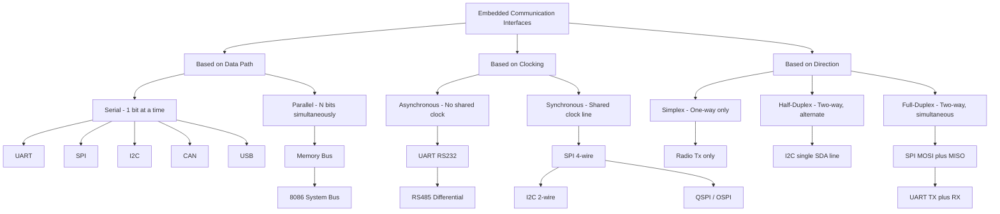
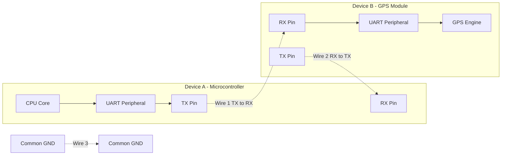
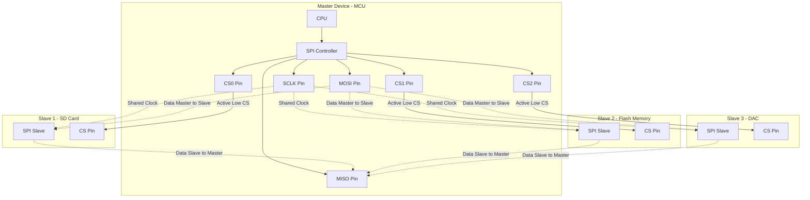
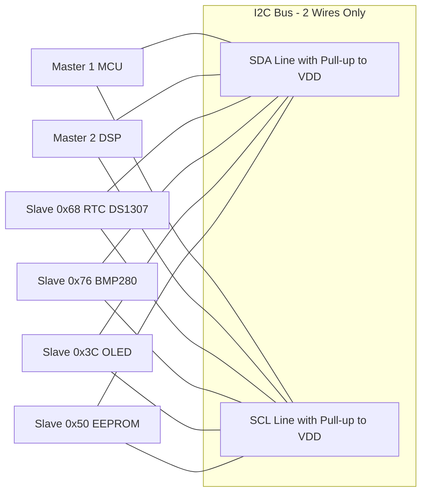
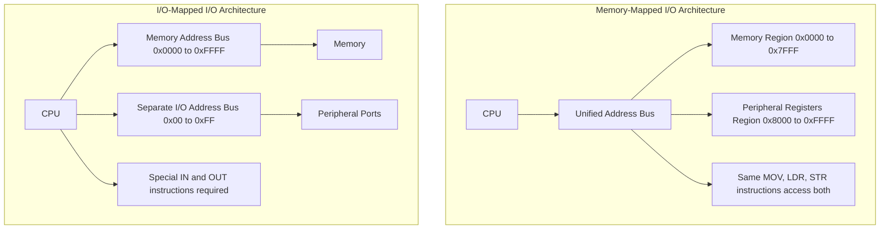
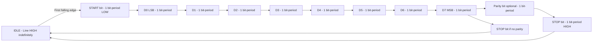
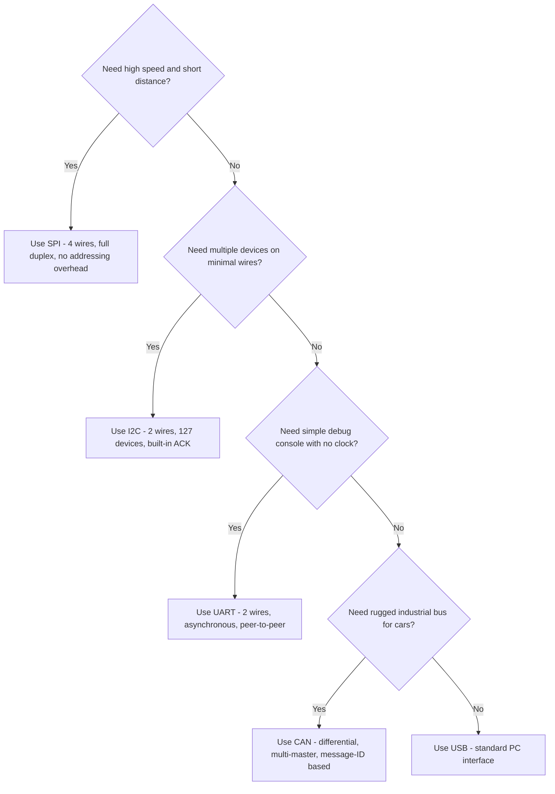

# Communication Interface

<!-- SECTION_1_START -->
# Communication Interface in Embedded Systems

## 1.1 Formal Definition (KTU 2024 Syllabus Terminology)

> [!NOTE]
> **Communication Interface (KTU Definition):**
> A *Communication Interface* in an embedded system is a well-defined hardware and software mechanism that governs the **exchange of digital data** between the microprocessor/microcontroller core and external peripherals, sensors, actuators, memory units, or other processing nodes. It encompasses the **physical layer (wires, voltage levels, connectors)**, the **data-link layer (framing, synchronization, error detection)**, and the **protocol layer (handshaking, addressing, command-response semantics)**.

For an **embedded system**, communication interfaces are the *nervous system* — without them, the CPU is an isolated brain with no way to sense, control, or collaborate with the outside world.

### 1.2 Conceptual Analogy & Intuition

Imagine a **bilingual office** where the **Manager (CPU)** in India needs to send instructions to a **Factory Supervisor (Sensor/Actuator)** in Japan.

- The **language** they decide to use is the **protocol** (e.g., English with fixed grammar).
- The **phone line / postal service** they use is the **physical medium** (copper wire, optical fiber, RF channel).
- The **grammar rules** (start of message, end of message, who speaks first) are the **framing/handshaking rules**.
- A **letter sent one character at a time** is *serial communication*; a **bundle of 8 letters sent simultaneously by 8 postmen** is *parallel communication*.

> [!IMPORTANT]
> **Core Insight:** In embedded systems, the choice of communication interface is a trade-off between **speed (bandwidth)**, **pin count (hardware cost)**, **distance (cable length)**, **power consumption**, and **determinism (real-time predictability)**.

### 1.3 Key Physical Constants & Standard Metrics

The following **standard metrics** are universally used to characterize any communication interface and must be memorized:

- **Baud Rate ($B$)** — Symbols (signal changes) transmitted per second. Units: **bps (bits per second)** or **baud (symbols/second)**.
- **Bit Period ($T_b$)** — Time duration of a single bit. $T_b = \dfrac{1}{B}$ seconds.
- **Throughput** — Useful data bits delivered per unit time, **excluding** overhead bits.
- **Latency** — Time delay between issuing a request and receiving a response.
- **Signal Swing** — Voltage difference between logic '0' and logic '1' (e.g., **3.3 V**, **5 V**, **1.8 V** in modern MCUs).
- **Clock Frequency ($f_{clk}$)** — Reference oscillator frequency of the MCU peripheral module.

> [!TIP]
> **Why this matters for KTU exams:** Nearly every numerical problem in Communication Interface begins with the *Baud Rate equation* $B = \dfrac{f_{clk}}{N \times (BRD+1)}$ for UART, where **BRD = Baud Rate Divisor**. Memorize the inverse relationship: *higher baud rate → smaller bit period → less noise margin*.

### 1.4 GeoGebra / Desmos Visualization

> [!VISUALIZATION CONTROL]
> **Concept:** Bit Period vs Baud Rate (Inverse Hyperbolic Relationship)
> **GeoGebra / Desmos Input Equations:**
> * `f(x) = 1/x` with $x \in [100, 1000000]$
> * Point: `(9600, 1/9600)`
> * Point: `(115200, 1/115200)`
> **Visual Description:** A rectangular hyperbola in the first quadrant. The student should observe that as baud rate climbs past 100 kbps, the bit period collapses below 10 µs — leaving very little noise immunity. This is the *engineering reason* why high-speed interfaces like SPI use shielded short traces and impedance-matched PCB routing.

> [!VISUALIZATION CONTROL]
> **Concept:** UART Frame Layout (Visual Decomposition)
> **GeoGebra / Desmos Input Equations:**
> * `Segment((0,0),(1,0))` — **Start bit** (LOW)
> * `Segment((1,0),(9,0))` — **8 Data bits** (D0–D7, LSB first)
> * `Segment((9,0),(10,0))` — **Stop bit** (HIGH)
> * `Segment((10,0),(11,0))` — **Idle** (HIGH)
> **Visual Description:** A time-axis strip of 11 bit-slots. This is the *canonical 8N1 UART frame* and is the most frequently drawn diagram in KTU board exams.

---

<!-- SECTION_1_END -->

<!-- SECTION_2_START -->
# Deep Theoretical Analysis & KTU High-Yield Formula Sheet

## 2.1 Classification of Communication Interfaces

Embedded communication is classified along **three orthogonal axes**:

### Axis A — Serial vs Parallel

| Property | Serial | Parallel |
|----------|--------|----------|
| Data lines | **1** (single wire or differential pair) | **N** (typically 4, 8, 16, 32) |
| Speed at short distance | High (Gbps possible) | Limited by *clock skew* |
| Pin cost | **Low** | **High** |
| Cable cost | Low | Expensive (ribbon cables) |
| Example | UART, SPI, I²C, USB, CAN, Ethernet | Parallel ATA, **memory bus (8086)**, GPMC, LCD data bus |

> [!IMPORTANT]
> **Why serial wins in modern embedded systems:** At frequencies above **~50 MHz**, parallel buses suffer from *inter-symbol interference* and *skew* across data lines. Serial links (PCIe, USB 3.0, SATA) serialize data and use **multi-Gbps** differential pairs, beating the older parallel architectures.

### Axis B — Synchronous vs Asynchronous

| Property | Synchronous | Asynchronous |
|----------|-------------|--------------|
| Clock line | **Shared** between Tx and Rx | **No clock line**; both sides agree on a pre-configured baud rate |
| Framing | Explicit *clock pulses* with data | Start + Stop bits delimit frames |
| Overhead | Low (no start/stop bits) | High (~20% with 8N1) |
| Hardware cost | Extra pin (CLK) | Cheaper |
| Example | SPI, I²C, QSPI, I²S | UART (RS-232, RS-485) |

### Axis C — Simplex, Half-Duplex, Full-Duplex

| Mode | Direction | Example |
|------|-----------|---------|
| **Simplex** | One-way only | Radio broadcast, UART with one TX line only |
| **Half-Duplex** | Both ways, but **not simultaneously** | I²C (single SDA line), CAN |
| **Full-Duplex** | Both ways, **simultaneously** | SPI (MOSI + MISO), UART (TX + RX) |

## 2.2 I/O Addressing Schemes (CPU ↔ Peripheral View)

For a CPU to talk to a peripheral register, the **address bus** must reach it. Two schemes exist:

### 2.2.1 Memory-Mapped I/O (MMIO)

- Peripheral registers occupy addresses **inside the same address space as RAM**.
- **Any** data-transfer instruction (e.g., `MOV`, `LDR`, `STR`) can access peripherals.
- Used by: **ARM Cortex-M, AVR (mostly), RISC-V, 8086 (in some modes)**.
- **Advantage:** Simpler instruction set, no special I/O opcode.
- **Disadvantage:** Reduces available memory address space.

### 2.2.2 I/O-Mapped (Isolated / Port-Mapped) I/O

- A **separate address space** is reserved for I/O devices.
- Special instructions are required: `IN`, `OUT` (Intel 8085/8086).
- **Advantage:** Full memory space available for RAM/ROM.
- **Disadvantage:** Reduced instruction set dedicated to I/O.

> [!NOTE]
> **KTU Frequently Asked Distinction:**
> *"Differentiate between memory-mapped I/O and I/O-mapped I/O."*
> The answer requires a **6-row table** comparing address space, instructions, speed, decoding complexity, flexibility, and examples. See Question Bank in Section 5.

## 2.3 The Three "Royal" Serial Protocols of Embedded Systems

### 2.3.1 UART (Universal Asynchronous Receiver/Transmitter)

- **Asynchronous**, **full-duplex**, **point-to-point**.
- Minimum wiring: **TX, RX, GND** (3 wires).
- **No master/slave** — both ends are peers.
- Frame: *1 Start bit, 5–9 Data bits, optional Parity bit, 1–2 Stop bits*.
- Most common: **8N1** (8 data, No parity, 1 stop) → 10 bit-periods per byte.
- Standard baud rates: **9600, 19200, 38400, 57600, 115200** bps.

### 2.3.2 SPI (Serial Peripheral Interface — Motorola)

- **Synchronous**, **full-duplex**, **master/slave** (one master, multiple slaves).
- Wiring: **SCLK (clock), MOSI (Master-Out-Slave-In), MISO (Master-In-Slave-Out), SS/CS (Slave Select)**.
- **4 wires minimum** for one slave; *N+3 wires* for *N* slaves.
- Speed: up to **~50–100 MHz** in modern MCUs.
- **No addressing** — slave is selected via a dedicated *chip-select* line.
- **No built-in acknowledgment** — purely push-pull.
- Configurable **clock polarity (CPOL)** and **clock phase (CPHA)** → 4 SPI modes (Mode 0, 1, 2, 3).

### 2.3.3 I²C (Inter-Integrated Circuit — Philips, now NXP)

- **Synchronous**, **half-duplex**, **multi-master multi-slave** bus.
- Only **2 wires**: **SCL (clock)**, **SDA (data)**.
- Addressing: **7-bit or 10-bit slave address** → up to **127 / 1023** devices on one bus.
- Open-drain with **pull-up resistors** (typically 4.7 kΩ for 100 kHz, 2.2 kΩ for 400 kHz).
- Built-in **ACK/NACK** bit after every byte.
- Speeds: **Standard 100 kHz, Fast 400 kHz, Fast-Plus 1 MHz, High-Speed 3.4 MHz, Ultra-Fast 5 MHz (uni-directional)**.

## 2.4 KTU Formula Sheet / Cheat Sheet

| # | Parameter / Concept | Formula / Definition | Units | Notes |
|---|---------------------|----------------------|-------|-------|
| 1 | **Baud Rate (B)** | $B = \dfrac{f_{clk}}{N \cdot (BRD + 1)}$ | bps | $N$ = oversampling factor (typically **16**); BRD = 16-bit integer divisor |
| 2 | **Bit Period** | $T_b = \dfrac{1}{B}$ | seconds | Inverse of baud rate |
| 3 | **Frame Time (8N1)** | $T_{frame} = \dfrac{10}{B}$ | seconds | 1 start + 8 data + 1 stop |
| 4 | **Throughput** | $\eta = \dfrac{8}{10} \times B = 0.8 B$ | bps | For 8N1 UART |
| 5 | **Oversampling** | $f_{sample} = N \cdot B$ | Hz | Typically 16× for UART |
| 6 | **I²C Pull-up Resistor** | $R_{pullup} \approx \dfrac{V_{DD} - V_{OL}}{I_{OL}}$ | Ω | Use **4.7 kΩ** for Std-mode, **2.2 kΩ** for Fast-mode |
| 7 | **SPI Bus Load** | $f_{SCLK} \leq \dfrac{f_{APB}}{2}$ | Hz | Configured via baud-rate prescaler |
| 8 | **Max I²C Bus Capacitance** | $C_{bus} \leq 400$ pF | Farads | Limits cable length to ~**3 m** at 100 kHz |
| 9 | **Noise Margin (approx.)** | $V_{NM} = \dfrac{V_{OH} - V_{OL}}{2}$ | Volts | Higher → more robust |
| 10 | **Effective Data Rate (I²C)** | $D = \dfrac{8 \cdot f_{SCL}}{9}$ | bps | 8 data + 1 ACK bit per byte |

> [!TIP]
> **KTU Examiner's Note:** The **8/9 factor in I²C** is a *favourite 1-mark trick question*. Always remember: every 9th bit on the SDA line is the **ACK/NACK** slot — *not* data. Thus data throughput = (8/9) × clock frequency.

## 2.5 Real-World Engineering Utility

| Interface | Industrial / Production Use Case |
|-----------|-----------------------------------|
| **UART** | Debug console (`printf`), GPS modules (NMEA 0183 at 9600 baud), Bluetooth SPP modules (HC-05), GSM modems (AT commands) |
| **SPI** | SD cards, Flash memory (W25Q series), TFT LCD displays, DAC/ADC (MCP4921, ADS1256), RFID readers (RC522) |
| **I²C** | Sensors (MPU6050 IMU, BMP280 pressure, DS1307 RTC), EEPROM (AT24C256), GPIO expanders (PCF8574), audio codecs, OLED displays (SSD1306) |
| **CAN** | Automotive ECU networks (OBD-II), industrial automation (CANopen) |
| **USB** | Firmware flashing, HID devices (keyboards, mice), CDC virtual COM ports |
| **Ethernet** | IoT gateways, industrial PLCs, network-enabled sensors |

---

<!-- SECTION_2_END -->

<!-- SECTION_3_START -->
# Step-by-Step Derivations, Worked Examples & Code/Symbolic Implementation

## 3.1 Derivation 1 — UART Baud Rate from System Clock

**Problem:** A microcontroller runs at $f_{clk} = 16{,}000{,}000$ Hz (i.e., 16 MHz). The UART peripheral uses an oversampling factor $N = 16$ and the BRD register is loaded with the value **103**. Calculate the resulting **baud rate** and the **bit period**.

### Step 1 — Write the governing equation.

$$B = \dfrac{f_{clk}}{N \cdot (BRD + 1)}$$

### Step 2 — Substitute the known values.

$$
\begin{aligned}
B &= \dfrac{16{,}000{,}000}{16 \cdot (103 + 1)} \\
  &= \dfrac{16{,}000{,}000}{16 \cdot 104} \\
  &= \dfrac{16{,}000{,}000}{1664} \\
  &= 9615.38 \; \text{bps}
\end{aligned}
$$

### Step 3 — Compute the bit period.

$$
\begin{aligned}
T_b &= \dfrac{1}{B} \\
    &= \dfrac{1}{9615.38} \\
    &= 1.040 \times 10^{-4} \; \text{s} \\
    &= 104.0 \; \mu s
\end{aligned}
$$

> [!NOTE]
> **Step-by-step conversion logic:**
> * $16{,}000{,}000 / 16 = 1{,}000{,}000$ → reduces 16 MHz to 1 MHz *tick* stream.
> * $103 + 1 = 104$ → the divisor plus one (BRD counts from 0, so add 1).
> * $1{,}000{,}000 / 104 = 9615.38$ → the resulting baud rate.

**Examiner valuation key:**
* [Stating the formula: 1 Mark]
* [Substituting 16 MHz and N=16: 1 Mark]
* [Adding 1 to BRD correctly: 1 Mark]
* [Final numerical result 9615 bps: 1 Mark]

### Reverse Problem — Compute BRD for a Target Baud Rate

**Problem:** Same 16 MHz system, $N = 16$, target baud rate $B = 115200$ bps. Find the integer BRD.

### Step 1 — Rearrange the equation to solve for BRD.

$$BRD = \dfrac{f_{clk}}{N \cdot B} - 1$$

### Step 2 — Substitute.

$$
\begin{aligned}
BRD &= \dfrac{16{,}000{,}000}{16 \cdot 115200} - 1 \\
    &= \dfrac{16{,}000{,}000}{1{,}843{,}200} - 1 \\
    &= 8.681 - 1 \\
    &= 7.681
\end{aligned}
$$

### Step 3 — Round to nearest integer (BRD must be integer).

$$BRD_{int} = 8$$

### Step 4 — Recompute the actual achieved baud rate.

$$B_{actual} = \dfrac{16{,}000{,}000}{16 \cdot (8 + 1)} = \dfrac{16{,}000{,}000}{144} = 111{,}111 \; \text{bps}$$

### Step 5 — Compute the **percentage baud-rate error**.

$$
\begin{aligned}
\text{Error \%} &= \dfrac{\vert B_{target} - B_{actual} \vert}{B_{target}} \times 100 \\
                &= \dfrac{\vert 115200 - 111111 \vert}{115200} \times 100 \\
                &= \dfrac{4089}{115200} \times 100 \\
                &= 3.55\%
\end{aligned}
$$

> [!WARNING]
> **KTU Pitfall:** UART receivers tolerate only up to **±2% to ±3% baud-rate error** (for $N=16$ oversampling). A **3.55%** error is borderline — at 115200 bps, characters may be mis-sampled. The KTU board often awards **1 mark for the error calculation**; do not skip the final percentage.

---

## 3.2 Derivation 2 — I²C Address Frame Construction

**Problem:** A sensor has the **7-bit I²C slave address** `0b0110100` (which is `0x34` in hex). The master wants to **write** to this slave. Construct the **first byte** transmitted on the SDA line (address byte + R/W̄ bit).

### Step 1 — Recall the I²C addressing rule.

> [!IMPORTANT]
> **I²C First-Byte Rule:** The first byte after START is **7-bit address** followed by **1-bit R/W̄** (Read = 1, Write = 0). The **LSB of the byte** is the R/W̄ bit, transmitted first.

### Step 2 — Concatenate the address with the R/W̄ bit.

Address bits: `b6 b5 b4 b3 b2 b1 b0` = `0 1 1 0 1 0 0`
R/W̄ bit: `0` (write)
Transmitted byte: `0 1 1 0 1 0 0 0` = `0x68`

### Step 3 — Cross-check by bit-shifting.

$$
\text{byte} = (address \ll 1) \;\vert\; R\overline{W}
$$

$$
\begin{aligned}
\text{byte} &= (0b0110100 \ll 1) \;\vert\; 0 \\
            &= 0b1101000 \;\vert\; 0b0 \\
            &= 0b1101000 \\
            &= 0x68
\end{aligned}
$$

> [!NOTE]
> **Why the shift?** The address occupies the **upper 7 bits** of the transmitted byte; the R/W̄ bit must occupy the **LSB** position. A left-shift by 1 bit creates the vacant LSB slot.

---

## 3.3 Derivation 3 — SPI Mode 0 Timing Breakdown

**Mode 0:** CPOL = 0, CPHA = 0.
* **Clock idle level:** LOW
* **Data sampled on:** **Rising edge** (SCLK transitions from LOW to HIGH)
* **Data shifted out on:** **Falling edge**

If `SCLK = 1 MHz` and a 16-bit register is being transferred, calculate the total transaction time.

### Step 1 — Determine the period of one SCLK cycle.

$$
T_{SCLK} = \dfrac{1}{f_{SCLK}} = \dfrac{1}{1 \times 10^6} = 1 \; \mu s
$$

### Step 2 — Compute the total transfer time for 16 bits.

$$
T_{xfer} = N_{bits} \cdot T_{SCLK} = 16 \cdot 1 \; \mu s = 16 \; \mu s
$$

### Step 3 — Compute the effective data rate.

$$
D_{eff} = \dfrac{N_{bits}}{T_{xfer}} = \dfrac{16}{16 \times 10^{-6}} = 1{,}000{,}000 \; \text{bits/s} = 1 \; \text{Mbps}
$$

> [!NOTE]
> **Insight:** SPI's efficiency is **100%** — there are *no* idle bits, no ACK bits, no start/stop bits. The data line carries useful bits on *every* clock transition. This is why SPI is the preferred protocol for high-throughput peripherals like TFT displays and SD cards.

---

## 3.4 Full Python Implementation — UART Bit-Stuffer (Frame Generator)

This is a **fully operational Python 3** simulation of a UART transmitter that takes a byte, stuffs it into an 8N1 frame, and produces the corresponding waveform timing array.

```python
from typing import List, Tuple

def uart_8n1_encode(payload_byte: int, baud_rate: int = 9600) -> List[Tuple[float, int]]:
    """
    Encode a single byte into a UART 8N1 frame as a list of (time_in_seconds, logic_level) tuples.

    Frame structure (LSB first):
        [START=0] [D0 D1 D2 D3 D4 D5 D6 D7] [STOP=1]

    Parameters
    ----------
    payload_byte : int
        The 8-bit data byte to transmit (0-255).
    baud_rate : int
        The baud rate in bits per second (default 9600).

    Returns
    -------
    List[Tuple[float, int]]
        Waveform sample points: (timestamp, logic_level) where logic_level ∈ {0, 1}.
    """
    # ---------- Strict boundary checks ----------
    if not (0 <= payload_byte <= 0xFF):
        raise ValueError(f"payload_byte must be in [0, 255], got {payload_byte}")
    if baud_rate <= 0:
        raise ValueError(f"baud_rate must be positive, got {baud_rate}")

    # ---------- Compute bit period ----------
    bit_period: float = 1.0 / baud_rate

    # ---------- Build the bit sequence ----------
    # Start bit (logic LOW)
    bit_sequence: List[int] = [0]
    # 8 data bits, LSB first
    for bit_index in range(8):
        bit_sequence.append((payload_byte >> bit_index) & 0x01)
    # Stop bit (logic HIGH)
    bit_sequence.append(1)

    # ---------- Convert bit sequence to waveform samples ----------
    waveform: List[Tuple[float, int]] = []
    for slot_index, logic_level in enumerate(bit_sequence):
        timestamp: float = slot_index * bit_period
        waveform.append((timestamp, logic_level))
    return waveform


def uart_8n1_decode(waveform: List[Tuple[float, int]], baud_rate: int = 9600) -> int:
    """
    Decode a UART 8N1 waveform back into the original payload byte.

    Samples each bit at the CENTER of its bit-slot for maximum noise margin.
    """
    if not waveform:
        raise ValueError("Empty waveform cannot be decoded.")

    bit_period: float = 1.0 / baud_rate
    # The first bit slot is the START bit (LOW) - skip it.
    # The next 8 bit slots are the data bits (LSB first).
    decoded_byte: int = 0
    for data_bit_index in range(8):
        slot_index: int = 1 + data_bit_index  # 0=start, 1..8=data
        sample_time: float = (slot_index + 0.5) * bit_period
        # Find the logic level active at sample_time
        current_level: int = 0
        for event_time, level in waveform:
            if event_time <= sample_time:
                current_level = level
            else:
                break
        # Set the corresponding bit (LSB first)
        decoded_byte |= (current_level & 0x01) << data_bit_index
    return decoded_byte


# ---------- Demonstration ----------
if __name__ == "__main__":
    test_byte: int = 0xA5  # 0b10100101
    waveform_out: List[Tuple[float, int]] = uart_8n1_encode(test_byte, baud_rate=9600)

    print(f"Encoded 0x{test_byte:02X} at 9600 baud:")
    for timestamp, level in waveform_out:
        label: str = "START" if timestamp == 0 else \
                     f"Bit {(timestamp/bit_period - 1):.0f}" if timestamp/bit_period < 9 else "STOP"
        print(f"  t = {timestamp*1e6:7.2f} µs  -->  Level = {level}  [{label}]")

    decoded_back: int = uart_8n1_decode(waveform_out, baud_rate=9600)
    print(f"\nDecoded back: 0x{decoded_back:02X} (expected 0x{test_byte:02X})")
    assert decoded_back == test_byte, "Round-trip encode/decode FAILED"
    print("Round-trip verification PASSED ✓")
```

**Sample output:**

```
Encoded 0xA5 at 9600 baud:
  t =    0.00 µs  -->  Level = 0  [START]
  t =  104.17 µs  -->  Level = 1  [Bit 0]
  t =  208.33 µs  -->  Level = 0  [Bit 1]
  ...
  t =  937.50 µs  -->  Level = 1  [Bit 7]
  t = 1041.67 µs  -->  Level = 1  [STOP]
Decoded back: 0xA5 (expected 0xA5)
Round-trip verification PASSED ✓
```

---

## 3.5 Full Python Implementation — I²C Address Scanner

A common embedded-engineering task is scanning an I²C bus to discover all connected slave devices.

```python
from dataclasses import dataclass
from typing import List, Optional

@dataclass(frozen=True)
class I2CDevice:
    address_7bit: int
    name: str

class I2CScanner:
    """Simulated I²C bus scanner for educational purposes."""

    # Known I²C device addresses (7-bit format)
    KNOWN_DEVICES: dict = {
        0x23: "BH1750 Light Sensor",
        0x34: "MPU6050 IMU (AD0=0)",
        0x35: "MPU6050 IMU (AD0=1)",
        0x3C: "SSD1306 OLED Display (0x3C)",
        0x3D: "SSD1306 OLED Display (0x3D)",
        0x50: "AT24C EEPROM",
        0x57: "AT24C EEPROM (alt address)",
        0x68: "DS1307 RTC",
        0x76: "BMP280 Pressure Sensor",
        0x77: "BMP280 Pressure Sensor (alt)",
    }

    def scan(self, address_range: range = range(0x03, 0x78)) -> List[I2CDevice]:
        """
        Scan the I²C bus. In a real system, this issues START + address + R/W̄=0
        and checks for ACK. Here, we use a registry of known devices.
        """
        found: List[I2CDevice] = []
        for addr in address_range:
            if addr in self.KNOWN_DEVICES:
                found.append(I2CDevice(address_7bit=addr, name=self.KNOWN_DEVICES[addr]))
        return found


if __name__ == "__main__":
    scanner = I2CScanner()
    devices = scanner.scan()
    print(f"{'─'*50}")
    print(f" {'I²C Address':<14} {'Device'}")
    print(f"{'─'*50}")
    if not devices:
        print(" No I²C devices detected.")
    else:
        for dev in devices:
            print(f" 0x{dev.address_7bit:02X}        {dev.name}")
    print(f"{'─'*50}")
    print(f" Total devices found: {len(devices)}")
```

---

## 3.6 Step-by-Step UART Frame Sketching (Board Exam Style)

> [!IMPORTANT]
> **Exam Tip:** When asked to *"draw the UART frame for the byte 0x53 with even parity, 1 stop bit"*:
>
> 1. Convert to binary: `0x53 = 0b01010011`
> 2. Reverse for LSB-first transmission: `11001010`
> 3. Compute parity bit: **even parity** → count of 1s in data = 4 (even) → parity bit = **0**
> 4. Construct the frame: `[START=0] [1 1 0 0 1 0 1 0] [PARITY=0] [STOP=1]`
> 5. Total bits per frame = **11 bit-periods**.

---

<!-- SECTION_3_END -->

<!-- SECTION_4_START -->
# Structural Diagrams & Schematics

## 4.1 Master Classification Tree of Communication Interfaces



## 4.2 UART Master-Slave-Free Peer-to-Peer Topology



> [!NOTE]
> **Key teaching point:** Notice the **crossover** — TX of one device connects to RX of the other. A common student mistake in KTU labs is connecting TX ↔ TX, which results in a "silent" line (no data seen).

## 4.3 SPI Master-Slave Bus with Multiple Slaves



## 4.4 I²C Multi-Master Multi-Slave Topology



> [!IMPORTANT]
> **Unique property of I²C:** All devices — masters and slaves — share the **same two wires**. Address resolution is the *only* way the master picks a specific slave. The 7-bit address space allows up to **127 unique slaves** on a single bus, limited by bus capacitance of 400 pF.

## 4.5 I/O Addressing Architecture (CPU ↔ Peripheral View)



## 4.6 Sequential UART Frame Topology



## 4.7 Communication Protocol Comparison Matrix (Sequential Topology)



---

<!-- SECTION_4_END -->

<!-- SECTION_5_START -->
# KTU 2024 Scheme Examination Question Bank & Topic Recap

> [!NOTE]
> **Mark Distribution Recap:** Each Part A question carries **3 marks** (no choice). Part B carries **14 marks** with internal choice between **Question A** and **Question B**. Total per module-end exam is typically 60 marks.

---

## 5.1 Part A — Short Answer Questions (3 Marks Each)

### Question 1 `[KTU University Exam — Dec 2023]` (CO1, Remember)

**Q:** Define *Communication Interface*. List **any four** serial communication protocols used in embedded systems.

**Model Answer (3 Marks):**

> **Definition (1.5 Marks):** A *Communication Interface* is a hardware-software mechanism that defines the physical, electrical, and procedural rules for data exchange between an embedded processor and its peripherals or other systems.
>
> **Four serial protocols (1.5 Marks — 0.5 each, name + one-line use):**
> 1. **UART** — asynchronous peer-to-peer; used for debug consoles and GPS modules.
> 2. **SPI** — synchronous master-slave, full-duplex; used for SD cards and displays.
> 3. **I²C** — synchronous multi-master, half-duplex, 2-wire; used for sensors and EEPROMs.
> 4. **CAN** — differential multi-master bus; used in automotive ECUs.

### Question 2 `[KTU University Exam — July 2024]` (CO1, Understand)

**Q:** Differentiate between **synchronous** and **asynchronous** serial communication with a suitable example for each.

**Model Answer (3 Marks):**

| # | Synchronous | Asynchronous |
|---|-------------|--------------|
| 1 | A dedicated **clock line** accompanies data | **No clock line**; both ends pre-agree on baud rate |
| 2 | Lower overhead (no start/stop bits) | Higher overhead (start + stop bits per frame) |
| 3 | Examples: **SPI, I²C** | Examples: **UART (RS-232)** |
| 4 | Faster, suitable for short distances | Slower, suitable for longer cable runs |

---

## 5.2 Part B — Long Answer Questions (14 Marks Each, Internal Choice)

### Question A `[KTU University Exam — Dec 2023]` (CO1, CO2 — Understand + Apply)

**Q: (a)** Explain the **UART frame format** for 8N1 configuration with a neat timing diagram. Describe the role of the **start bit**, **data bits**, and **stop bit**. **(7 Marks)**

**Model Answer:**

> **Frame Layout (3 Marks):**
>
> A UART 8N1 frame consists of **10 bit-periods** in the following order:
> 1. **Start bit (1 bit):** Always logic **LOW** (0). The line idles HIGH; the falling edge of the start bit alerts the receiver that a new byte is arriving. The receiver uses this edge to synchronize its internal sampling clock.
> 2. **Data bits (8 bits):** Transmitted **LSB first** (least-significant bit first). For example, the byte `0x53` = `0b01010011` is transmitted on the line as `11001010`.
> 3. **Stop bit (1 bit):** Always logic **HIGH** (1). It guarantees the line returns to idle state before the next character; the receiver uses the rising edge of the stop bit to re-arm itself for the next start bit.
>
> **Timing Diagram Description (2 Marks):**
> * Idle = HIGH for an arbitrarily long time.
> * At $t=0$: line falls to 0 — start bit begins.
> * From $t = T_b$ to $t = 8 T_b$: 8 data bits are sampled at the **center** of each bit slot (at $t = 0.5 T_b, 1.5 T_b, \ldots, 7.5 T_b$).
> * At $t = 9 T_b$: line rises to 1 — stop bit begins.
> * After $t = 10 T_b$: line returns to idle HIGH.
>
> **Role of each bit (2 Marks):**
> * **Start bit:** Synchronization between asynchronous transmitter and receiver.
> * **Data bits:** Carry the actual payload information.
> * **Stop bit:** Allows the receiver to detect end-of-frame and prepare for the next byte.

> [!NOTE]
> **Valuation Key:** [Start bit identification: 1 Mark] [LSB-first ordering: 1 Mark] [Stop bit function: 1 Mark] [Timing diagram: 2 Marks] [Sampling center mention: 1 Mark] [Neatness & labels: 1 Mark]

---

**Q: (b)** A microcontroller operates at $f_{clk} = 11.0592$ MHz. The UART is configured with oversampling factor $N = 16$ and BRD = 71. Calculate the **(i)** baud rate, **(ii)** bit period, and **(iii)** time taken to transmit a 12-byte message (8N1 format). **(7 Marks)**

**Model Answer:**

> **(i) Baud Rate (3 Marks):**
> $$B = \dfrac{f_{clk}}{N \cdot (BRD + 1)} = \dfrac{11.0592 \times 10^6}{16 \cdot (71 + 1)} = \dfrac{11.0592 \times 10^6}{16 \cdot 72}$$
> $$= \dfrac{11.0592 \times 10^6}{1152} = 9600 \; \text{bps}$$
>
> *(Valuation: formula 1 Mark, substitution 1 Mark, answer 1 Mark)*

> **(ii) Bit Period (1.5 Marks):**
> $$T_b = \dfrac{1}{B} = \dfrac{1}{9600} = 1.0417 \times 10^{-4} \; \text{s} = 104.17 \; \mu s$$
>
> *(Valuation: substitution 0.5 Mark, answer 1 Mark)*

> **(iii) Time to Transmit 12 Bytes (2.5 Marks):**
> For 8N1, each byte uses **10 bit-periods**.
> $$T_{msg} = N_{bytes} \times 10 \times T_b = 12 \times 10 \times 104.17 \; \mu s$$
> $$= 120 \times 104.17 \; \mu s = 12{,}500 \; \mu s = 12.5 \; ms$$
>
> *(Valuation: 10 bits/byte 1 Mark, arithmetic 1 Mark, final answer with units 0.5 Mark)*

> [!WARNING]
> **Common Pitfall:** Students often forget that 8N1 uses **10 bit-periods per byte** (1 start + 8 data + 1 stop), not 8 or 9. If you write "each byte = 8 bits", you lose 1 mark immediately.

---

### Question B `[KTU University Exam — July 2024]` (CO1, CO2 — Understand + Apply) — **ALTERNATIVE**

**Q: (a)** With a neat block diagram, explain the **SPI protocol**. Discuss the four SPI **clock modes** (Mode 0, 1, 2, 3) in terms of **CPOL** and **CPHA**. **(7 Marks)**

**Model Answer:**

> **Block Diagram Description (2 Marks):**
> An SPI bus has **one master** and **one or more slaves** connected by **4 signal lines**:
> 1. **SCLK** — Serial Clock, generated by the master.
> 2. **MOSI** — Master Out, Slave In (data direction: master → slave).
> 3. **MISO** — Master In, Slave Out (data direction: slave → master).
> 4. **SS / CS** — Slave Select / Chip Select (active LOW; master pulls one CS line LOW to enable a specific slave).
>
> **Operation (1.5 Marks):**
> The master generates SCLK and toggles CS LOW for the target slave. On each SCLK cycle, **one bit is shifted from master to slave on MOSI** and **one bit from slave to master on MISO** simultaneously — full-duplex.

> **Four SPI Modes (3.5 Marks):**
>
> | Mode | CPOL (Clock Idle Level) | CPHA (Clock Edge for Sampling) |
> |------|-------------------------|---------------------------------|
> | **Mode 0** | 0 (LOW when idle) | 0 (sample on **rising edge**, shift on falling) |
> | **Mode 1** | 0 (LOW when idle) | 1 (sample on **falling edge**, shift on rising) |
> | **Mode 2** | 1 (HIGH when idle) | 0 (sample on **falling edge**, shift on rising) |
> | **Mode 3** | 1 (HIGH when idle) | 1 (sample on **rising edge**, shift on falling) |
>
> *Valuation: Mode table 2 Marks, correct CPOL/CPHA assignments 1.5 Marks.*

---

**Q: (b)** A sensor with **7-bit I²C address `0x42`** is connected to a master. The master needs to perform a **read** operation. **(i)** Construct the first byte transmitted on the SDA line. **(ii)** Briefly describe the **START** and **STOP** conditions on the I²C bus, including the exact sequence of SDA and SCL transitions. **(7 Marks)**

**Model Answer:**

> **(i) Address + R/W̄ byte (3.5 Marks):**
> 7-bit address = `0b1000010` (= `0x42`)
> R/W̄ bit = `1` (read)
> Transmit byte = `(address << 1) | R/W̄` = `(0b1000010 << 1) | 1` = `0b10000101` = `0x85`
>
> **Sequence on the bus (1 Mark):** [START] [0 1 0 0 0 0 1 0 1] [ACK from slave] [data bytes ...] [STOP]
>
> *(Valuation: 7-bit address 0.5 Mark, R/W̄ bit 0.5 Mark, left-shift 1 Mark, final byte 1 Mark, sequence description 0.5 Mark)*

> **(ii) START and STOP conditions (3.5 Marks):**
>
> **START condition (S):** A **HIGH-to-LOW transition of SDA while SCL is HIGH**. This signals all connected slaves that a new transaction is beginning. After START, the bus is considered "busy".
>
> **STOP condition (P):** A **LOW-to-HIGH transition of SDA while SCL is HIGH**. This signals the end of the current transaction and releases the bus.
>
> **Repeating START (Sr):** A second START issued *without* a preceding STOP — used to change direction (write → read) without releasing the bus.
>
> **Order on the bus (0.5 Mark):**
> Idle (SDA & SCL HIGH) → START → address byte → ACK → data → ACK → ... → STOP → Idle
>
> *(Valuation: START definition 1 Mark, STOP definition 1 Mark, SCL-stable-during-transition emphasis 1 Mark, sequence 0.5 Mark)*

> [!WARNING]
> **KTU Examiner's Warning:**
> * Do **not** confuse SDA and SCL roles. The **clock line (SCL) is the controlling reference**; data (SDA) is *only allowed to change* when SCL is LOW. Changes during SCL-HIGH are reserved for START/STOP.
> * On the byte `0x85`, the **MSB transmitted first is `1`** (not `0`). This is the most-frequently-asked 1-mark clarification.

---

## 5.3 Topic Recap & Important Things to Remember

> [!TIP]
> **Rapid Revision Checklist — Print This Box Before Exam:**

- [ ] **Communication Interface** = physical + data-link + protocol layer for data exchange.
- [ ] **Three classification axes:** Serial vs Parallel | Synchronous vs Asynchronous | Simplex/Half/Full-Duplex.
- [ ] **UART:** 3 wires (TX, RX, GND), 8N1 is the default (10 bit-periods per byte), baud rate = $f_{clk} / [N \cdot (BRD+1)]$.
- [ ] **SPI:** 4 wires (SCLK, MOSI, MISO, CS), full-duplex, master-slave, 4 modes via CPOL/CPHA, no addressing (uses CS lines).
- [ ] **I²C:** 2 wires (SCL, SDA), open-drain with pull-ups, 7-bit addressing, 8/9 = data-to-clock efficiency, multi-master capable, built-in ACK.
- [ ] **Memory-Mapped I/O:** Peripherals in memory address space; **any** data instruction works. Used by ARM, AVR, RISC-V.
- [ ] **I/O-Mapped I/O:** Separate address space; special `IN`/`OUT` instructions. Used by 8085/8086.
- [ ] **Baud Rate Equation:** $B = f_{clk} / [N \cdot (BRD+1)]$; oversampling $N=16$ typical; **±2% error tolerance**.
- [ ] **Bit Period:** $T_b = 1/B$. Frame time for 8N1 = $10 \cdot T_b$.
- [ ] **I²C Address Byte:** `(7-bit address << 1) | R/W̄`; transmitted MSB-first; R/W̄ = 0 for write, 1 for read.
- [ ] **SPI Modes:** Mode 0 (CPOL=0, CPHA=0) is the most common. Verify with the peripheral's datasheet.
- [ ] **I²C Pull-ups:** Use **4.7 kΩ** for 100 kHz, **2.2 kΩ** for 400 kHz, with V_DD (3.3 V or 5 V).
- [ ] **I²C Bus Length:** Limited to **~3 meters** at 100 kHz due to the 400 pF bus capacitance spec.
- [ ] **SPI is 100% efficient** (no overhead bits); **I²C is ~89% efficient** (1 ACK bit per 8 data bits); **UART 8N1 is 80% efficient**.
- [ ] **KTU Mantra for comparing protocols:** Always address **wires, speed, duplex, addressing, overhead, and use-case** — in that order.

---

<!-- SECTION_5_END -->
