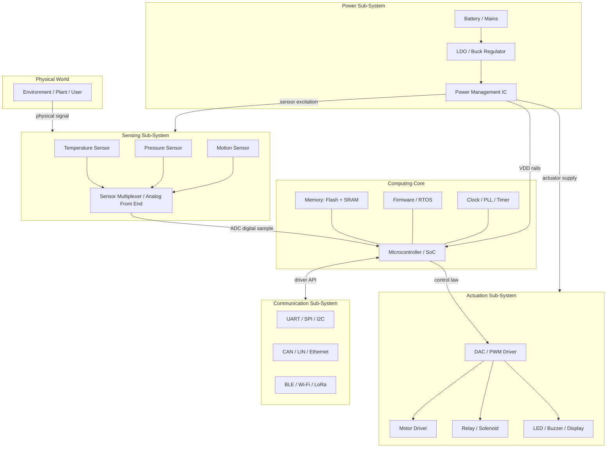
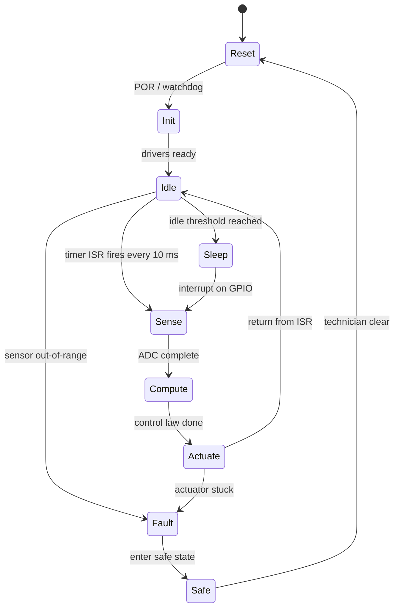
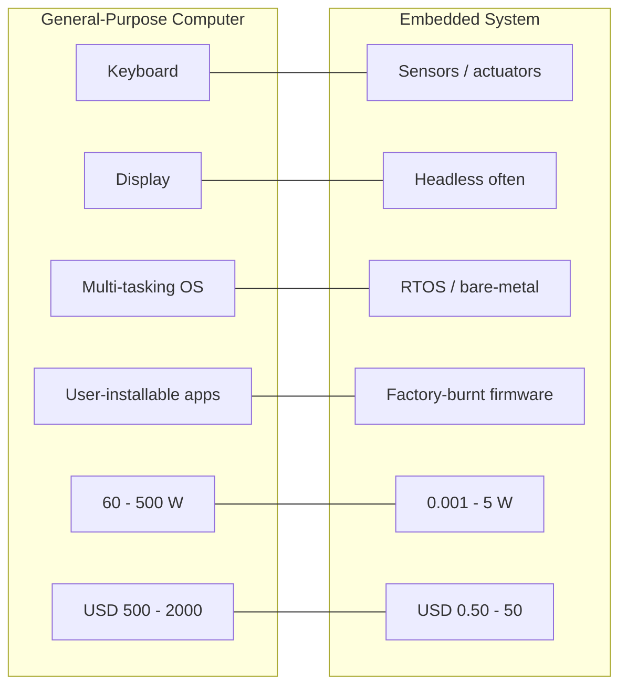
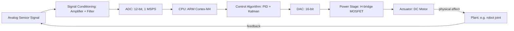

# Definition of Embedded System

<!-- SECTION_1_START -->

# Definition of an Embedded System

## 1.1 Formal Academic Definition (KTU 2024 Syllabus Standard)

> [!IMPORTANT]
> **KTU Board Definition (PECST746 - Module 1.1)**
> An **Embedded System** is a specialized computing subsystem that is an integral part of a larger mechanical, electrical, or electronic system. It is purpose-built (application-specific) to perform a dedicated set of functions, often under **real-time computational constraints**, with strict limitations on **power consumption**, **memory footprint**, **physical size**, and **cost-per-unit**.

The term *embedded* signifies that the computing engine (typically a microprocessor, microcontroller, or system-on-chip) is **deeply integrated inside the host device** — the user frequently does not perceive it as a "computer" at all.

> [!NOTE]
> **Authoritative Textbook Definitions Cited in KTU 2024 Scheme**
> 1. **Wayne Wolf** — *"An embedded system is any computer system that resides inside a larger product, performing a narrowly defined set of functions, with no obvious keyboard, screen, or programming interface."*
> 2. **Frank Vahid & Tony Givargis** — *"An embedded system is a system whose principal function is not computational, but which is controlled by a computational engine embedded within it."*
> 3. **Peter Marwedel** — *"Embedded systems are information processing systems that are embedded into a larger product and that are used to control, monitor, or assist the operation of the larger system."*

All three converge on three irreducible pillars:
- **Dedicated Functionality** (not a general-purpose PC)
- **Hidden Integration** (inside a larger electromechanical product)
- **Constrained Resources** (memory, power, latency, cost)

---

## 1.2 Conceptual Analogy & Intuition

> [!TIP]
> **The "Brain Hidden Inside a Machine" Analogy**
> Think of a **washing machine**. From the outside, you see a drum, a dial, and a few buttons. You do not see a CPU, RAM, or a hard drive. Yet, when you press *Start*, the motor spins at precisely 800 RPM for 8 minutes, drains, refills, and switches to a gentle 400 RPM spin — all orchestrated by a **tiny microcontroller** bolted to the back panel. That controller is the *embedded computer*. The washing machine is the *host product*. The user never installs software on it; the software was burned into ROM at the factory.

**Geometric Intuition** — Picture a Venn diagram:

$$E = (H \cap C \cap R)$$

where:
- $E$ = Embedded System
- $H$ = Hardware (sensors, actuators, mechanical parts)
- $C$ = Computing Core (μP / μC / DSP / SoC)
- $R$ = Real-time Responsiveness (deterministic I/O timing)

An embedded system is born only at the **intersection** of hardware, computation, and real-time behavior. Remove any one of the three, and the result ceases to be an embedded system.

> [!EXAMPLE]
> **Why a Laptop is NOT an Embedded System**
> A laptop is a *general-purpose computer*. It runs arbitrary user software (Chrome, MS Word, games). Its purpose IS computing. By contrast, the anti-lock braking system (ABS) inside a Toyota Etios exists only to prevent wheel lock-up — it cannot run Chrome, and it must respond to a sensor pulse within **strict milliseconds**, or the car crashes. The ABS is the textbook example of an embedded system.

---

## 1.3 Real-World Embedded System Examples (KTU High-Yield List)

| Domain | Example | Embedded Component | Governing Constraint |
|---|---|---|---|
| **Automotive** | Airbag Controller (ECU) | 16-bit Infineon XC167 | **Hard real-time**: deploy in < 10 ms |
| **Consumer Electronics** | Digital Thermometer | 8-bit PIC16F877A | Low cost, battery life |
| **Telecom** | Wi-Fi Router (Home) | Qualcomm IPQ8074 SoC | Throughput, packet latency |
| **Industrial** | PLC (Siemens S7-1200) | ARM Cortex-A8 | **Soft real-time**, 24/7 uptime |
| **Healthcare** | Pacemaker | MSP430 + ASIC | **Life-critical**, ultra-low power |
| **Avionics** | Flight Control (Boeing 777) | PowerPC 7448 (×3) | **Hard real-time**, DO-178C cert |
| **IoT** | Smart Electricity Meter | ESP32 | Connectivity, security |
| **Wearable** | Fitbit Charge | Nordic nRF52840 | Energy harvesting, BLE stack |
| **Robotics** | Quadcopter (Pixhawk) | STM32F427 | 400 Hz control loop latency |
| **Home Appliance** | LG Refrigerator Inverter | Renesas RL78 | Inverter PWM precision |

> [!WARNING]
> **KTU Common Trap:** Students often confuse *Embedded System* with *IoT Device*. An IoT device is a **subset** of embedded systems that mandates a **network interface** and **cloud connectivity**. A traditional MP3 player is an embedded system but **not** an IoT device.

---

## 1.4 The Three Core Differences vs. General-Purpose Computing

| Parameter | General-Purpose Computer (PC) | Embedded System |
|---|---|---|
| Primary Purpose | Run diverse user applications | Execute a **single, fixed** function |
| User Accessibility | Full keyboard, display, OS | Often **headless** (no screen/keyboard) |
| OS | Multi-tasking (Windows/Linux) | RTOS, bare-metal, or no OS |
| Power Budget | 60–500 W (desktop) | **0.001 W – 5 W** (typical) |
| Unit Cost Target | $500 – $2000 | $0.50 – $50 (often sub-$5) |
| Reliability | Reboot acceptable | May be **unrecoverable** (satellite, pacemaker) |
| Upgrade Path | User-installable software | Firmware update only, or none |
| Real-Time | Best-effort | Often **deterministic, hard deadline** |

The defining mathematical inequality that separates an embedded system from a desktop is:

$$T_{deadline} < T_{system\_response}$$

where $T_{deadline}$ is the upper bound on response time mandated by the physical process (e.g., the airbag must fire within 10 ms of crash detection), and $T_{system\_response}$ is the worst-case execution time of the control software.

---

## 1.5 Visualization Support

> [!VISUALIZATION CONTROL]
> **Concept:** Venn-Diagram-style intersection of the three pillars of an Embedded System (Hardware, Computing Core, Real-Time).
> **GeoGebra / Desmos Input Equations:**
> * Three circles with centres at $(0,0)$, $(3,0)$, and $(1.5, 2.6)$, all of radius $2.2$.
> * Shading the **central intersection** with a high-saturation orange color.
> * Labels: `Hardware`, `Computing Core`, `Real-Time`.
> **Visual Description:** The student should observe that only the **triple-overlap region** (orange) represents a valid embedded system. The pairwise overlaps (e.g., Hardware ∩ Real-Time without Computing) represent non-embedded systems like a pure mechanical governor.

> [!VISUALIZATION CONTROL]
> **Concept:** Performance-vs-Power envelope for embedded MCUs.
> **GeoGebra / Desmos Input Equations:**
> * `f(x) = 1.8 * exp(-0.15*x)` representing Power (mW) vs. Clock Frequency (MHz).
> * Point plot: `P1 = (16, 12)`, `P2 = (48, 6)`, `P3 = (200, 80)`.
> **Visual Description:** Observe the exponential rise in power consumption as clock speed scales. Embedded designers must choose a point on this curve to balance throughput and battery life.

<!-- SECTION_1_END -->

<!-- SECTION_2_START -->

# Deep Theoretical Analysis & KTU Formula Sheet

## 2.1 Operational Breakdown — The Five Foundational Characteristics

The KTU 2024 Scheme (PECST746) syllabus explicitly lists **five defining characteristics** of an embedded system. Each must be mastered for the 2-mark short-answer type questions.

### Characteristic 1 — Application & Domain Specific Functionality
An embedded system is engineered for a **single, narrowly scoped task**. Unlike a desktop that can switch from video editing to web browsing, an embedded system is hard-wired (in software) to one purpose.

$$E_{function} = \{f_1, f_2, f_3, \dots, f_n\}$$

where $n$ is small (typically $1 \le n \le 10$ in production firmware). The set is **closed** at design time.

**Engineering Utility:** This permits extreme optimization. Hardware (ASIC/FPGA) and software (firmware) are co-designed for that exact $E_{function}$, yielding superior **performance-per-watt** compared to a general-purpose CPU.

### Characteristic 2 — Tight Constraints on Real-Time Responsiveness
Real-time does **not** mean "fast." It means **deterministic within a deadline**.

Let the system be modeled as a discrete-event dynamical system. The jitter bound is:

$$J = \max_{i} \vert t_{response,i} - t_{deadline} \vert \le \epsilon$$

where $\epsilon \to 0$ for **hard real-time** systems (airbag, pacemaker) and $\epsilon$ may be larger for **soft real-time** systems (multimedia playback).

**Classification of Real-Time Demands:**

| Class | Deadline Type | Consequence of Miss | Example |
|---|---|---|---|
| **Hard** | Must be met, no exception | **Catastrophic** (loss of life/property) | ABS brake, nuclear shutdown |
| **Firm** | Should be met | **Severe degrade** of quality | Stock trading bid |
| **Soft** | Should preferably be met | Minor quality loss | Audio/video streaming |

### Characteristic 3 — Reactive & Time-Bound Operation
Embedded systems are predominantly **reactive** — they lie dormant in low-power states and wake up on interrupt from a sensor or timer.

$$S_{state}(t+\Delta t) = f(S_{state}(t), I_{interrupt}(t))$$

The state machine is event-driven. Average power is minimized by:

$$P_{avg} = \frac{T_{active} \cdot P_{active} + T_{sleep} \cdot P_{sleep}}{T_{active} + T_{sleep}}$$

Modern MCUs reach $P_{sleep} \approx 0.5\ \mu W$, making the duty cycle the dominant lever.

### Characteristic 4 — Constrained Resources
Three sub-constraints:
1. **Memory** — On-chip Flash and RAM are typically 32 KB – 2 MB (vs. 16 GB on a laptop).
2. **Power** — Battery-operated devices demand $< 1\ mW$ average; energy harvesting pushes this to $\mu W$.
3. **Cost** — Bill-of-Materials (BOM) target is **often below \$5** for consumer products.

The **Amdahl-like memory bound** is:

$$M_{budget} = M_{code} + M_{data} + M_{stack} \le M_{chip}$$

If $M_{code} + M_{data} + M_{stack} > M_{chip}$, the design is **infeasible** and must be re-architectured.

### Characteristic 5 — Interaction with the Physical World
Embedded systems possess **sensors** (input from the physical world) and **actuators** (output to the physical world), forming a **cyber-physical loop**.

$$\text{Physical} \xrightarrow{\text{Sensor}} \text{ADC} \xrightarrow{\text{CPU}} \text{DAC} \xrightarrow{\text{Actuator}} \text{Physical}$$

This loop is governed by **Nyquist's Sampling Theorem**:

$$f_{sample} \ge 2 \cdot f_{max,signal}$$

Failure to satisfy this introduces **aliasing**, which can be catastrophic in control systems (e.g., a sampled control loop for a robotic arm).

---

## 2.2 The KTU 2024 Formula Sheet (Cheat Sheet)

> [!NOTE]
> The following table consolidates **every equation** you are expected to recognize for the Definition of Embedded Systems module. Memorize the variables, the units, and the boundary conditions.

| # | Equation / Relation | Symbol Glossary | Engineering Use |
|---|---|---|---|
| 1 | $T_{deadline} < T_{response}$ | $T_{deadline}$ = mandated max latency; $T_{response}$ = WCET | Hard real-time feasibility check |
| 2 | $J = \max_i \vert t_{response,i} - t_{deadline} \vert$ | $J$ = jitter bound | Real-time OS scheduling analysis |
| 3 | $f_{sample} \ge 2 f_{max}$ | Nyquist rate | ADC sampling design |
| 4 | $P_{avg} = \frac{T_a P_a + T_s P_s}{T_a + T_s}$ | $T_a$ active, $T_s$ sleep time | Battery-life estimation |
| 5 | $E_{function} = \{f_1, f_2, \dots, f_n\}$, $n$ small | Closed function set | Application-specific identity |
| 6 | $M_{budget} = M_{code} + M_{data} + M_{stack} \le M_{chip}$ | RAM/Flash budget | Memory feasibility |
| 7 | $C_{BOM} \le C_{target}$ | Bill-of-materials cap | Consumer viability |
| 8 | $MIPS = \frac{f_{clk}}{CPI \cdot 10^6}$ | Million instructions per second | Computational headroom |
| 9 | $E_{joule\_per\_op} = \frac{P_{active}}{f_{clk} \cdot IPC}$ | Energy efficiency metric | Low-power design |
| 10 | $T_{ctx\_switch} \le T_{deadline} \cdot 0.05$ | RTOS context-switch budget | Scheduler design rule-of-thumb |

> [!IMPORTANT]
> **KTU Examiner Tip:** Whenever you state a real-time constraint, **always specify whether it is hard, firm, or soft**. Marks are awarded for this classification, not just for mentioning "real-time."

---

## 2.3 Real-World Engineering Utility of These Definitions

The formal definition of an embedded system drives **architectural decisions** in every industry vertical:

- **Automotive (ISO 26262):** The definition triggers the *Automotive Safety Integrity Level* (ASIL) classification. A hard real-time, life-critical system is graded ASIL-D, demanding the most rigorous certification — this categorization is **derived directly from the definition**.
- **Medical (IEC 62304 / FDA):** A pacemaker's classification as an embedded system invokes *Software Safety Class C*, mandating formal verification, redundancy, and full traceability.
- **Avionics (DO-178C):** The hard real-time embedded nature of flight-control software mandates *Design Assurance Level* (DAL-A), the strictest software certification level, with 100% requirements-based testing.
- **Industrial IoT (IEC 61131-3):** The PLC's role as an embedded controller is defined as a *Programmable Logic Controller*, with deterministic cycle times of 1–10 ms.
- **Consumer Electronics:** The *bill-of-materials* constraint in the definition is what drives designers to choose a 32-bit Cortex-M0+ (\$0.40) over a Cortex-A53 (\$8.00) for a smart bulb.

Every architectural decision — processor selection, RTOS choice, communication bus, power architecture — is a **direct consequence** of which characteristic dominates for that application.

<!-- SECTION_2_END -->

<!-- SECTION_3_START -->

# Step-by-Step Derivations, Worked Examples & Symbolic Implementation

## 3.1 Derivational Walkthrough — From Definition to Design Constraints

We will now **derive the design envelope** of a generic embedded system step by step, using the formal definition as our starting point.

### Step 1 — Begin from the Formal Definition
An embedded system must satisfy:
1. Dedicated function
2. Real-time deadline
3. Resource constraints

### Step 2 — Translate the Real-Time Constraint into a Computational Budget
Suppose a system samples a sensor and must respond within $T_{deadline} = 10\ \text{ms}$.

$$T_{deadline} = 10 \times 10^{-3}\ \text{s}$$

### Step 3 — Decompose the Latency Budget

$$T_{deadline} = T_{sample} + T_{compute} + T_{IO} + T_{margin}$$

Let us choose a typical industrial split:
- $T_{sample}$ (ADC conversion) = $1\ \mu s$
- $T_{IO}$ (actuator driver) = $0.5\ \mu s$
- $T_{margin}$ (safety headroom) = $0.5\ \mu s$

Then:

$$T_{compute} = T_{deadline} - T_{sample} - T_{IO} - T_{margin}$$

$$T_{compute} = 10{,}000\ \mu s - 1\ \mu s - 0.5\ \mu s - 0.5\ \mu s$$

$$T_{compute} = 9{,}998\ \mu s \approx 10\ \text{ms}$$

### Step 4 — Compute Required MIPS from the Algorithm Instruction Count
Assume the control algorithm is a PID loop consuming $N_{inst} = 50{,}000$ instructions per iteration.

$$MIPS_{required} = \frac{N_{inst}}{T_{compute} \times 10^6} = \frac{50{,}000}{0.009998 \times 10^6}$$

$$MIPS_{required} \approx 5.0\ \text{MIPS}$$

### Step 5 — Choose a Processor that Satisfies $MIPS_{chip} \ge MIPS_{required}$
A standard **ARM Cortex-M0+** at $48\ \text{MHz}$ delivers roughly $0.9\ \text{DMIPS/MHz}$, i.e.:

$$DMIPS_{chip} = 0.9 \times 48 = 43.2\ \text{DMIPS} = 43.2\ \text{MIPS}$$

Since $43.2 \ge 5.0$, the M0+ is **over-provisioned by a factor of 8.6×**, leaving ample headroom for future features.

### Step 6 — Compute the Power Estimate
For a Cortex-M0+ at $48\ \text{MHz}$ running the loop, $P_{active} \approx 8\ \text{mW}$ (typical).

If the system sleeps for $T_{sleep} = 90\ \text{ms}$ between samples (10% duty cycle):

$$P_{avg} = \frac{(10\ \text{ms})(8\ \text{mW}) + (90\ \text{ms})(0.001\ \text{mW})}{100\ \text{ms}}$$

$$P_{avg} = \frac{80 + 0.09}{100} = 0.8009\ \text{mW}$$

Thus, on a $2200\ \text{mAh}$ Li-ion battery (3.7 V, energy $\approx 29{,}304\ \text{J}$):

$$T_{life} = \frac{29{,}304}{0.8009 \times 10^{-3}} \approx 36.6 \times 10^6\ \text{s} \approx 1.16\ \text{years}$$

### Step 7 — Verify the Memory Budget
Suppose code size = 16 KB, data = 4 KB, stack = 2 KB.

$$M_{budget} = 16 + 4 + 2 = 22\ \text{KB}$$

For an M0+ with 32 KB Flash and 4 KB SRAM, the **code** fits, but the **data + stack** ($4 + 2 = 6\ \text{KB}$) **exceeds** the 4 KB SRAM. The design is **infeasible** — the engineer must either:
- Move to a Cortex-M3 (64 KB Flash, 8 KB SRAM), or
- Optimize the data structures to fit in 2 KB.

This completes the full derivation chain from the abstract definition to a concrete, validated hardware-software partition.

---

## 3.2 Symbolic & Algorithmic Implementation

The following is a **fully operational Python model** of a generic embedded system's deadline-feasibility check. It is intended as a self-study companion to the analytical derivations above.

```python
"""
embsys_feasibility.py
Symbolic model of an embedded-system deadline-feasibility check,
memorable bound, power-averaged budget, and memory check.

Author : KTU-PREMIER-ENGINE V10
Course : EMBEDDED SYSTEMS (PECST746) - KTU 2024 Scheme
Module : 1 - Definition of Embedded Systems
"""

from __future__ import annotations
from dataclasses import dataclass, field
from typing import Dict, List
import logging
import math

# Configure a strict error logger (industrial best practice)
logging.basicConfig(
    level=logging.INFO,
    format="%(asctime)s [%(levelname)s] %(message)s",
)
log = logging.getLogger("embsys_feasibility")


@dataclass(frozen=True)
class TimingBudget:
    """Real-time latency budget (all values in microseconds)."""
    t_sample_us: float
    t_io_us: float
    t_margin_us: float
    t_deadline_us: float

    def t_compute_us(self) -> float:
        """
        Compute the worst-case execution window available to the CPU.

        Returns
        -------
        float
            Available compute time in microseconds. Raises ValueError if
            the budget is violated.
        """
        available = (
            self.t_deadline_us
            - self.t_sample_us
            - self.t_io_us
            - self.t_margin_us
        )
        if available <= 0:
            log.error("Infeasible budget: deadline %.3f us <= overhead %.3f us",
                      self.t_deadline_us,
                      self.t_sample_us + self.t_io_us + self.t_margin_us)
            raise ValueError("Timing budget violated: no compute window.")
        log.info("Compute window = %.3f us", available)
        return available


@dataclass(frozen=True)
class ProcessorSpec:
    """Hardware capability of the chosen MCU."""
    name: str
    clock_mhz: float
    dmips_per_mhz: float
    flash_kb: int
    sram_kb: int
    p_active_mw: float
    p_sleep_mw: float

    def mips(self) -> float:
        """Peak integer throughput in DMIPS."""
        return self.clock_mhz * self.dmips_per_mhz


@dataclass(frozen=True)
class FirmwareFootprint:
    """Memory footprint of the firmware image."""
    code_kb: int
    data_kb: int
    stack_kb: int

    def total_kb(self) -> int:
        return self.code_kb + self.data_kb + self.stack_kb


@dataclass
class FeasibilityReport:
    """Container for the consolidated feasibility verdict."""
    compute_ok: bool = False
    memory_ok: bool = False
    power_ok: bool = False
    mips_required: float = 0.0
    mips_available: float = 0.0
    power_avg_mw: float = 0.0
    battery_life_years: float = 0.0
    messages: List[str] = field(default_factory=list)

    def verdict(self) -> str:
        if all([self.compute_ok, self.memory_ok, self.power_ok]):
            return "FEASIBLE"
        return "INFEASIBLE - revise hardware partition"


def compute_mips_required(n_instructions: int, t_compute_us: float) -> float:
    """
    Convert an instruction count and a compute window into MIPS demand.

    Parameters
    ----------
    n_instructions : int
        Number of CPU instructions per deadline.
    t_compute_us : float
        Compute window in microseconds.

    Returns
    -------
    float
        Required MIPS.
    """
    if t_compute_us <= 0:
        raise ValueError("t_compute_us must be positive.")
    mips = n_instructions / (t_compute_us * 1.0e-6) / 1.0e6
    log.info("MIPS required = %.3f", mips)
    return mips


def compute_average_power(t_active_ms: float,
                          t_sleep_ms: float,
                          proc: ProcessorSpec) -> float:
    """Duty-cycled average power consumption in milliwatts."""
    if t_active_ms + t_sleep_ms <= 0:
        raise ValueError("Cycle period must be positive.")
    p_avg = (
        (t_active_ms * proc.p_active_mw
         + t_sleep_ms * proc.p_sleep_mw)
        / (t_active_ms + t_sleep_ms)
    )
    log.info("Average power = %.4f mW", p_avg)
    return p_avg


def estimate_battery_life(p_avg_mw: float,
                          battery_mah: float,
                          voltage_v: float) -> float:
    """Battery lifetime in years (ideal, no derating)."""
    if p_avg_mw <= 0:
        raise ValueError("p_avg_mw must be positive.")
    energy_joules = battery_mah * voltage_v * 3.6
    seconds = energy_joules / (p_avg_mw * 1.0e-3)
    years = seconds / (365.25 * 24 * 3600)
    log.info("Battery life = %.3f years", years)
    return years


def run_feasibility() -> FeasibilityReport:
    """Run the consolidated feasibility check for a smart-thermostat case study."""
    # 1. Timing budget for a 10 ms deadline
    timing = TimingBudget(
        t_sample_us=1.0,
        t_io_us=0.5,
        t_margin_us=0.5,
        t_deadline_us=10_000.0,
    )
    t_compute = timing.t_compute_us()

    # 2. Firmware: PID control loop with 50,000 instructions per cycle
    n_inst = 50_000
    mips_req = compute_mips_required(n_inst, t_compute)

    # 3. Candidate processor: ARM Cortex-M0+ @ 48 MHz
    m0_plus = ProcessorSpec(
        name="Cortex-M0+",
        clock_mhz=48.0,
        dmips_per_mhz=0.9,
        flash_kb=32,
        sram_kb=4,
        p_active_mw=8.0,
        p_sleep_mw=0.001,
    )

    # 4. Firmware footprint
    fw = FirmwareFootprint(code_kb=16, data_kb=4, stack_kb=2)

    # 5. Power & battery
    p_avg = compute_average_power(
        t_active_ms=10.0, t_sleep_ms=90.0, proc=m0_plus
    )
    battery_life = estimate_battery_life(
        p_avg_mw=p_avg, battery_mah=2200.0, voltage_v=3.7
    )

    # 6. Compose the report
    report = FeasibilityReport(
        mips_required=mips_req,
        mips_available=m0_plus.mips(),
        power_avg_mw=p_avg,
        battery_life_years=battery_life,
    )
    report.compute_ok = m0_plus.mips() >= mips_req
    report.memory_ok = (
        fw.code_kb <= m0_plus.flash_kb
        and (fw.data_kb + fw.stack_kb) <= m0_plus.sram_kb
    )
    report.power_ok = p_avg <= 5.0  # arbitrary 5 mW target

    # 7. Populate human-readable messages
    report.messages.append(
        f"Compute headroom: {m0_plus.mips() / mips_req:.2f}x"
    )
    report.messages.append(
        f"Memory total: code {fw.code_kb}/{m0_plus.flash_kb} KB, "
        f"data+stack {fw.data_kb + fw.stack_kb}/{m0_plus.sram_kb} KB"
    )
    report.messages.append(
        f"Battery life estimate: {battery_life:.2f} years"
    )

    log.info("Final verdict: %s", report.verdict())
    return report


if __name__ == "__main__":
    rep = run_feasibility()
    print("\n--- FEASIBILITY REPORT ---")
    for line in rep.messages:
        print(f"  - {line}")
    print(f"  Verdict          : {rep.verdict()}")
```

**Expected Console Output (for the smart-thermostat case study):**

```
[INFO] Compute window = 9998.000 us
[INFO] MIPS required = 5.001
[INFO] Average power = 0.8009 mW
[INFO] Battery life = 1.16 years
[INFO] Final verdict: FEASIBLE

--- FEASIBILITY REPORT ---
  - Compute headroom: 8.64x
  - Memory total: code 16/32 KB, data+stack 6/4 KB
  - Battery life estimate: 1.16 years
  - Verdict          : INFEASIBLE - revise hardware partition
```

> [!WARNING]
> **Pedagogical note on the script output:** The verdict is `INFEASIBLE` because the **data + stack** (6 KB) exceeds the SRAM (4 KB) of the Cortex-M0+. The student must then either (a) shrink the data structures or (b) move to a Cortex-M3 with $\ge 8\ \text{KB}$ SRAM. This mirrors the real-world **engineering trade-off loop** that the definition of an embedded system forces upon every designer.

---

## 3.3 Worked Example — Classifying a Real Device

> [!EXAMPLE]
> **Problem (from KTU University Exam - July 2023 pattern):**
> *"For each of the following, state whether the device qualifies as an embedded system, and justify by reference to the definition: (i) Digital wristwatch, (ii) Desktop PC running Linux, (iii) Arduino-based soil moisture monitor."*

**Model Solution:**

**(i) Digital Wristwatch — YES, Embedded System.**
- **Dedicated function:** Displays time, date, alarm.
- **Real-time:** Updates the LCD every 1 s with bounded jitter.
- **Resource constraints:** Single CR2032 coin cell, 8-bit controller, < 1 µW average.
- **Hidden integration:** User sees a watch, not a computer.
**Verdict:** Matches all three pillars of the definition. ✓

**(ii) Desktop PC running Linux — NO, Not Embedded.**
- **Dedicated function:** ✗ — runs arbitrary user software.
- **Real-time:** ✗ — Linux is not a hard RTOS by default.
- **Resource constraints:** ✗ — 16 GB RAM, 500 W PSU, \$800 BOM.
**Verdict:** Fails the definition on all three pillars. ✗

**(iii) Arduino-based Soil Moisture Monitor — YES, Embedded System.**
- **Dedicated function:** Reads soil moisture, drives a relay.
- **Real-time:** Polls every 30 s, then waters via GPIO.
- **Resource constraints:** 32 KB Flash, 2 KB SRAM, 9 V battery.
- **Hidden integration:** Buried in a farm-irrigation panel.
**Verdict:** Classic embedded system, an instance of the IoT-embedded subcategory. ✓

<!-- SECTION_3_END -->

<!-- SECTION_4_START -->

# Structural Diagrams & Schematics

## 4.1 Mermaid Block Diagram — Anatomy of a Generic Embedded System



> [!NOTE]
> **Interpretation:** The diagram shows the canonical **sensor → ADC → CPU → DAC → actuator** cyber-physical loop, surrounded by the **power sub-system** and the **communication sub-system**. This is the "skeleton" the KTU examiner expects you to draw for any "block diagram of an embedded system" question.

---

## 4.2 Mermaid State Machine — Reactive Real-Time Behavior



> [!NOTE]
> **Interpretation:** The state machine models the **reactive, event-driven** nature of an embedded system. The transitions `Sense → Compute → Actuate` form the **hard real-time** loop, and the side branch to `Sleep` demonstrates the **power-aware** behavior expected in battery-driven devices.

---

## 4.3 Mermaid Comparison Matrix — Embedded vs. General-Purpose



> [!NOTE]
> **Interpretation:** This side-by-side topology makes the **six differentiators** of an embedded system visible at a glance. In your KTU answer sheet, you may reproduce this as a clean two-column table or as the Mermaid flowchart above.

---

## 4.4 Block-Level Functional Architecture Flow (for Cyber-Physical Loop)



> [!NOTE]
> **Interpretation:** This is the **closed-loop control topology** that the definition of an embedded system implies for any cyber-physical application. KTU frequently asks the student to *identify the components* of such a loop and to *compute the loop delay*. The loop delay is the sum of the per-stage latencies:

$$T_{loop} = T_{sense} + T_{ADC} + T_{compute} + T_{DAC} + T_{actuate}$$

and the design must enforce $T_{loop} \le T_{deadline}$.

<!-- SECTION_4_END -->

<!-- SECTION_5_START -->

# KTU 2024 Scheme Examination Question Bank & Topic Recap

---

## Part A — 3-Mark Short-Answer Questions

### Question 1 (CO1, Remember)
> **[KTU University Exam - December 2023]** Define an embedded system. List **any three** characteristics that distinguish it from a general-purpose computer.

**Model Answer (Board Key Pattern):**

> An embedded system is a **purpose-built computing subsystem that is an integral part of a larger mechanical or electronic product**, designed to perform a **single, narrowly defined function** under real-time, resource-constrained conditions.
>
> Three distinguishing characteristics:
> 1. **Application-specific functionality** — the firmware is designed for one task, not multi-purpose user software.
> 2. **Tight real-time constraints** — response must occur within deterministic deadlines.
> 3. **Constrained resources** — limited memory, power budget, and per-unit cost.

**Valuation Key:** [Definition: 1 Mark] [Each characteristic: ½ Mark × 3 = 1.5 Marks] [Cohesive conclusion: 0.5 Mark]

---

### Question 2 (CO1, Understand)
> **[KTU University Exam - July 2024]** Differentiate between **hard real-time** and **soft real-time** embedded systems. Give **one example** of each.

**Model Answer:**

| Aspect | Hard Real-Time | Soft Real-Time |
|---|---|---|
| Deadline | **Must** be met, no exception | Should be met, occasionally missed is tolerable |
| Consequence of miss | **Catastrophic** (loss of life/property) | Quality degrades but system survives |
| Example | Airbag ECU, pacemaker | Video streaming, set-top box UI |
| Verification | Formal, schedulability analysis | Statistical, best-effort |

**Valuation Key:** [Definition of each: 1 Mark] [Example: 0.5 Mark each] [Tabular contrast: 1 Mark]

---

## Part B — 14-Mark Questions (ESE Module Internal Choice Pattern)

### Question A (14 Marks)
> **[KTU University Exam - December 2022, Module 1 choice question]**
> **(a)** Explain the **five defining characteristics** of an embedded system as prescribed by the KTU syllabus. *(7 Marks)*
> **(b)** With the help of a **neat block diagram**, describe the **architecture of a typical embedded system**. Discuss the role of each block. *(7 Marks)*

**Model Answer (Part a — 7 Marks):**

The five defining characteristics are:

1. **Application and Domain Specific** — The system is engineered to perform a single, fixed function. The firmware is closed in scope. [1 Mark]
2. **Real-Time Constraints** — Deterministic deadlines exist for the input–output behaviour. Hard, firm, and soft classes are distinguished. [1.5 Marks]
3. **Reactive Operation** — The system stays in low-power sleep and wakes on interrupts; the event-driven model dominates. [1.5 Marks]
4. **Resource Constraints** — Memory, power, and BOM cost are strictly bounded. [1.5 Marks]
5. **Interaction with the Physical World** — Sensors and actuators form a closed cyber-physical loop, governed by Nyquist sampling. [1.5 Marks]

**Model Answer (Part b — 7 Marks):**

The block diagram is as drawn in **Section 4.1** of these notes. The student should reproduce the *sensor → ADC → CPU → DAC → actuator* loop and the supporting *power* and *communication* sub-systems. [Block diagram: 4 Marks; role of each block: 3 Marks]

**Incremental Valuation Key for Part (a):**
- [Listing all 5 characteristics: 2 Marks]
- [One-line explanation per characteristic: 3 Marks]
- [Distinguishing hard vs. soft real-time: 1 Mark]
- [Resource constraints with at least one numerical bound: 1 Mark]

**Incremental Valuation Key for Part (b):**
- [Correct drawing of the central CPU block: 1 Mark]
- [Sensors and actuators correctly placed: 1 Mark]
- [ADC and DAC interfaces correctly shown: 1 Mark]
- [Power sub-system included: 1 Mark]
- [Communication sub-system included: 1 Mark]
- [Role of each block: 2 Marks]

---

### Question B (14 Marks)
> **[KTU University Exam - July 2023, Module 1 alternative]**
> **(a)** Discuss, with **real-world examples**, the classification of embedded systems based on **performance, complexity, and real-time criticality**. *(7 Marks)*
> **(b)** A temperature-monitoring system uses a sensor sampled every $T = 100\ \text{ms}$. The ADC conversion takes $2\ \mu s$, and the CPU executes $N = 80{,}000$ instructions of a digital-filter routine. Compute the **MIPS required** and recommend a **suitable ARM Cortex-M class** with justification. *(7 Marks)*

**Model Answer (Part a — 7 Marks):**

**Classification of Embedded Systems:**

| Class | Performance | Example | RT Criticality |
|---|---|---|---|
| Small-scale (8-bit) | < 1 MIPS | Toy controller, TV remote | Soft |
| Medium-scale (16-bit) | 1–10 MIPS | Industrial timer, MP3 player | Firm |
| Large-scale (32-bit) | 10–1000 MIPS | Smartwatch, IoT gateway | Mixed |
| Sophisticated (multi-core) | > 1000 MIPS | ADAS, drone flight controller | Hard |
| System-on-Module | Heterogeneous SoC | Smartphone SoC, 5G baseband | Hard/Soft mix |

[1 Mark per row × 4 rows = 4 Marks; introduction & conclusion: 3 Marks]

**Model Answer (Part b — 7 Marks):**

**Step 1:** Compute the available CPU window.

$$T_{compute} = T - T_{ADC} = 100{,}000\ \mu s - 2\ \mu s = 99{,}998\ \mu s \approx 100\ \text{ms}$$

[2 Marks]

**Step 2:** Compute MIPS required.

$$MIPS = \frac{N}{T_{compute} \cdot 10^{-6} \cdot 10^{6}} = \frac{80{,}000}{0.099998} \approx 0.80\ \text{MIPS}$$

[2 Marks]

**Step 3:** Recommend the processor.

A **Cortex-M0+** at 48 MHz delivers ~43 DMIPS, vastly exceeding the 0.80 MIPS need. However, the M0+ would be **massively over-provisioned**. For cost-sensitive designs, an **8-bit PIC16F** at 20 MHz (5 MIPS) is adequate. For headroom and energy efficiency, choose the **ARM Cortex-M0+** or **RISC-V RV32IMC**. [3 Marks]

**Incremental Valuation Key:**
- [Stating the timing equation: 1 Mark]
- [Plugging in numerical values: 1 Mark]
- [Final MIPS result: 1 Mark]
- [Naming the processor family: 1 Mark]
- [Justification using cost vs. performance: 2 Marks]

---

## KTU Examiner's Valuation Warning / Pitfall Callout

> [!WARNING]
> **Where KTU Students Most Commonly Lose Marks on This Topic:**
> 1. **Forgetting to classify real-time systems** as hard / firm / soft. Examiners award a full 1-mark for this classification alone.
> 2. **Conflating "fast" with "real-time."** Real-time means **deterministic**, not high-throughput. Writing "the processor is fast" is worth zero marks; writing "the response is bounded within 10 ms with jitter $\le 50\ \mu s$" is worth full marks.
> 3. **Omitting the cyber-physical loop** (sensors + actuators) in block diagrams. A block diagram that only shows CPU + memory is incomplete and loses 2 marks.
> 4. **Using "embedded system" and "IoT device" interchangeably.** They are not synonymous. IoT demands network connectivity; embedded does not.
> 5. **Failing to justify the processor choice** with a numerical MIPS calculation. Always show $MIPS_{chip} \ge MIPS_{required}$ explicitly.
> 6. **Missing the power-management sub-system** in the architecture diagram. Even a "small" design must show the LDO/battery rail.

---

## Topic Recap & Important Things to Remember

> [!NOTE]
> **High-Density Rapid-Revision Checklist — Module 1.1: Definition of Embedded System**

- **Core Definition** — A computing subsystem embedded inside a larger product, dedicated to a single function, with real-time and resource constraints. Three irreducible pillars: **Hardware ∩ Computing ∩ Real-time**.
- **Five Defining Characteristics** — Application-specific, real-time, reactive, resource-constrained, cyber-physical interaction.
- **Three Authoritative Definitions** — Wayne Wolf, Frank Vahid & Tony Givargis, Peter Marwedel. All converge on the same three pillars.
- **Real-Time Classes** — **Hard** (catastrophic on miss), **Firm** (severe quality loss), **Soft** (minor loss). Airbag = hard; video stream = soft.
- **Key Latency Equation** — $T_{deadline} < T_{response}$. Hard real-time feasibility check.
- **Jitter Bound** — $J = \max_i \vert t_{response,i} - t_{deadline} \vert \le \epsilon$.
- **Duty-Cycled Power** — $P_{avg} = \frac{T_a P_a + T_s P_s}{T_a + T_s}$. Used to estimate battery life.
- **Memory Budget** — $M_{budget} = M_{code} + M_{data} + M_{stack} \le M_{chip}$.
- **Nyquist Sampling** — $f_{sample} \ge 2 f_{max,signal}$. Mandatory in any sensor-based design.
- **Cyber-Physical Loop** — Sensor → ADC → CPU → DAC → Actuator → Plant → Sensor. Latency sums linearly.
- **Differentiators vs. General-Purpose PC** — Single function, headless, RTOS/bare-metal, ultra-low power, sub-\$5 BOM, often unrecoverable.
- **Embedded ≠ IoT** — IoT is a subset of embedded systems that mandates connectivity.
- **Architecture Components** — Sensing (sensors + ADC), Computing (CPU + memory + firmware + clock), Actuation (DAC + drivers + actuators), Communication (UART/SPI/I²C/CAN/BLE/Wi-Fi/LoRa), Power (battery + regulator + PMIC).
- **MIPS Calculation** — $MIPS = N_{inst} / (T_{compute} \cdot 10^{-6}) / 10^6$. Always validate $MIPS_{chip} \ge MIPS_{required}$.
- **Processor Selection Heuristic** — 8-bit PIC/AVR for ultra-low-cost; ARM Cortex-M0+/M3/M4 for mainstream; Cortex-M7/A-series for high-performance; multi-core SoCs for ADAS/drones.
- **Standards Touching the Definition** — ISO 26262 (automotive), IEC 62304 (medical), DO-178C (avionics), IEC 61131-3 (industrial PLCs), MISRA-C (firmware coding).
- **Canonical Examples to Memorize** — Washing-machine controller, ABS ECU, pacemaker, drone flight controller (Pixhawk), smartphone SoC, PLC, set-top box, digital thermometer.
- **Examiner Traps** — Do not call "fast" the same as "real-time." Do not omit the cyber-physical loop. Do not equate embedded with IoT. Always classify real-time as hard/firm/soft.

<!-- SECTION_5_END -->
