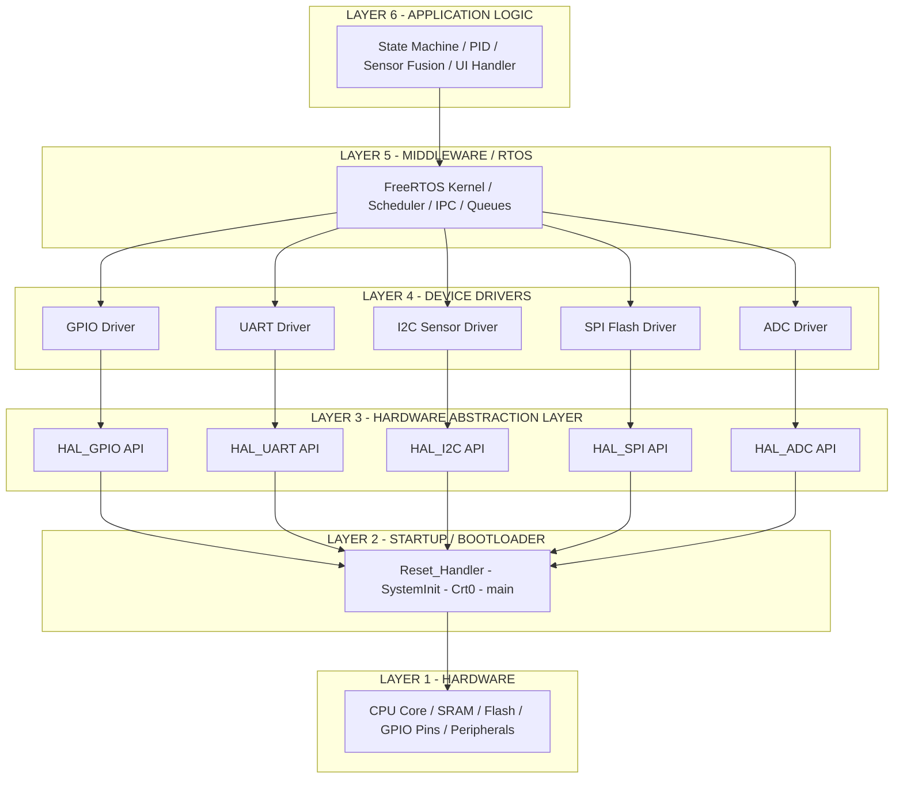
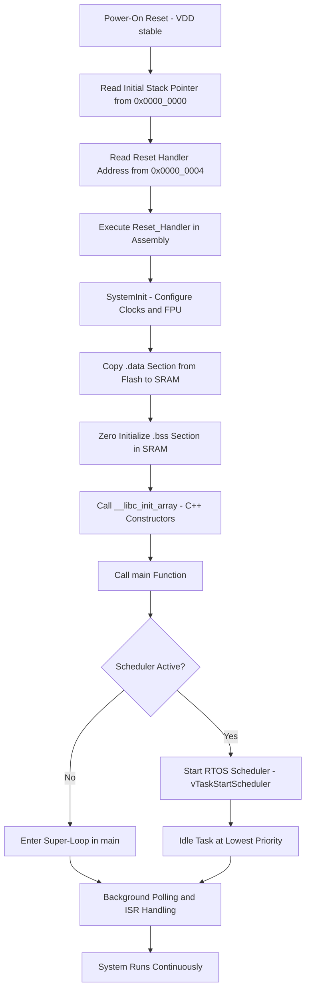
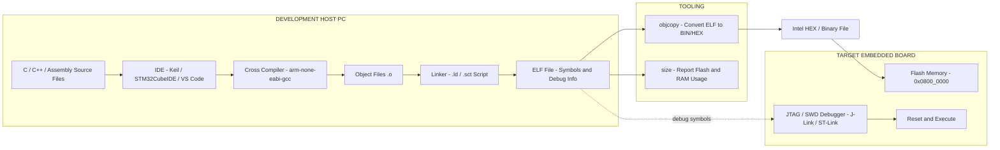
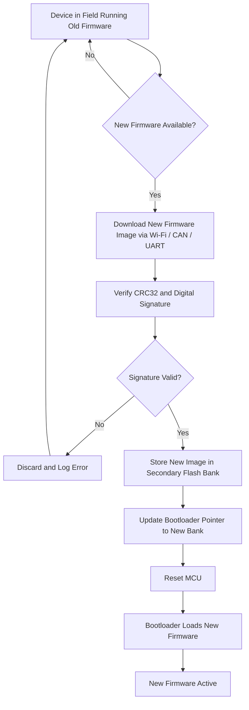
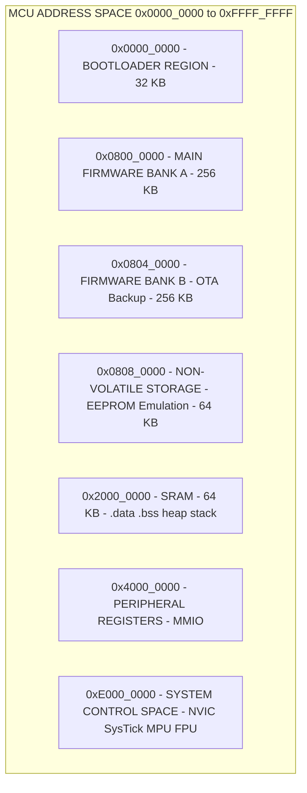

# Embedded Firmware

<!-- SECTION_1_START -->
# EMBEDDED FIRMWARE — Core Technical Definition & Intuitive Overview

## 📘 Formal Academic Definition (KTU 2024 Syllabus Terminology)

**Embedded Firmware** is the *pre-written, hardware-specific software code* that is permanently stored in the **non-volatile memory** (ROM, EPROM, EEPROM, or Flash) of an embedded system. It is responsible for the *direct control, monitoring, and management* of the underlying hardware resources and provides the *abstraction layer* between the hardware and the application-level logic.

According to the KTU 2024 Scheme definition, embedded firmware is the **low-level, hardware-dependent program** that initializes the processor, configures peripherals, manages memory, and implements the core control algorithms of the embedded device. It typically resides between the hardware (silicon/chips) and the higher-level application software (if any).

> [!IMPORTANT]
> **Syllabus Highlight (KTU 2024 — PECST746, Module 1):**
> "Embedded Firmware refers to the software permanently etched into the read-only memory of an embedded device. It dictates the functional behaviour of the system, defines device I/O behaviour, and is intrinsically tied to the underlying hardware architecture."

---

## 🧠 Conceptual Analogy / Plain-English Intuition

Imagine a **digital wristwatch**. The *physical watch* (case, glass, strap, battery, quartz crystal, LCD) is the **hardware**. Now ask: *Who tells the LCD to display "10:42"? Who reads the crystal oscillations and converts them into seconds? Who wakes up the display every second?* — That invisible "brain" stored inside the chip is the **firmware**.

| Layer | Analogy (Smart Home Security Camera) |
|---|---|
| **Hardware** | The camera lens, image sensor, Wi-Fi chip, microcontroller PCB |
| **Embedded Firmware** | The burned-in program that boots the chip, reads the CMOS sensor, encodes H.264 video, sends packets over Wi-Fi |
| **Application Software** | The mobile app you use to view the live feed (Cloud / User side) |

Think of firmware as the **"soul"** of a chip — without it, even the most powerful microcontroller is a dumb piece of silicon doing absolutely nothing.

> [!NOTE]
> **Why "Firm" and not "Soft"?**
> Early engineers distinguished between:
> • **Hardware** → *Hard, unchangeable* (resistors, ICs)
> • **Software** → *Soft, easily changeable* (programs in RAM)
> • **Firmware** → *Firm, semi-permanent* (resides in non-volatile memory, can be updated but rarely and carefully)

---

## 🔑 Key Characteristics of Embedded Firmware (KTU Board Favourite)

1. **Hardware-Dependent** — Tightly coupled to a specific MCU/MPU family (e.g., ARM Cortex-M, AVR, PIC, ESP32).
2. **Non-Volatile Storage** — Resides in ROM, Flash, or EEPROM; survives power cycles.
3. **Resource-Constrained** — Must work within strict **ROM** (code), **RAM** (data), and **CPU cycle** budgets.
4. **Real-Time Bounded** — Must respond to events within deterministic time limits (microseconds to milliseconds).
5. **Reliability-Critical** — Bugs may brick the device; often field-updatable via *bootloader* mechanisms.
6. **Low-Level Language** — Predominantly written in **C**, with critical *interrupt service routines (ISRs)* in **Assembly**.

---

## 📐 Standard Metrics & Constants Used in Firmware Engineering

| Metric | Standard Value / Unit | Significance |
|---|---|---|
| **Clock Frequency ($f_{clk}$)** | MHz / GHz | Determines instruction cycle time |
| **Instruction Cycle Time ($T_{cyc}$)** | $1 / f_{clk}$ seconds | Base timing unit |
| **ROM/Flash Size** | KB to MB | Firmware code storage |
| **RAM Size** | Bytes to MB | Runtime data + stack + heap |
| **Watchdog Timeout** | ms to seconds | System reset trigger |

> [!VISUALIZATION CONTROL]
> **Concept:** Firmware Memory Layout in a Typical MCU
> **GeoGebra / Desmos Input Equations (Memory Map):**
> * `Rectangle A: 0x0000_0000 → 0x0001_0000` (Flash / ROM — Firmware Code)
> * `Rectangle B: 0x2000_0000 → 0x2000_8000` (SRAM — Runtime Data)
> * `Rectangle C: 0x4000_0000 → 0x6000_0000` (Peripheral Registers)
> **Visual Description:** A linear address-axis from `0x0000_0000` to `0xFFFF_FFFF` showing three distinct, non-overlapping coloured blocks. The first block (Flash) holds the firmware `.text` and `.rodata`; the second (SRAM) holds `.data` and `.bss`; the third is memory-mapped I/O for peripherals like GPIO, UART, ADC.

---

## 🧩 Difference Between Firmware, Software, and Hardware

> [!IMPORTANT]
> **Classic 3-Layer Embedded Model (Frequently Asked in KTU Exams):**
>
> | Aspect | Hardware | Firmware | Software |
> |---|---|---|---|
> | **Nature** | Physical electronic components | Programs stored in ROM/Flash | High-level applications |
> | **Mutability** | Fixed (post-fabrication) | Semi-permanent (re-flashable) | Highly dynamic |
> | **Examples** | MCU, Sensors, Resistors | Bootloader, Device drivers, RTOS | Mobile apps, Cloud services |
> | **Location** | PCB / Silicon | Non-volatile memory of device | External storage / cloud |
> | **Language** | HDL (Verilog/VHDL) | C, Assembly, C++ | Java, Python, JS, etc. |
<!-- SECTION_1_END -->

<!-- SECTION_2_START -->
# EMBEDDED FIRMWARE — Deep Theoretical Analysis & KTU High-Yield Formula Sheet

## 🔬 Anatomy of an Embedded Firmware — Modular Architecture

A typical embedded firmware is **not a single monolithic file**. It is architected as a stack of distinct modules, each with a well-defined responsibility. The KTU 2024 syllabus expects students to identify and explain each of the following layers:

### Layer 1: **Vector Table & Reset Handler**
- The first piece of code that executes when the MCU powers up or resets.
- Contains the *interrupt vector table* — addresses of ISRs for hardware exceptions (NMI, HardFault, SysTick, IRQ0…IRQn).
- Pointer to the top of the stack (`__initial_sp`) is stored at address `0x0000_0000`.

### Layer 2: **Bootloader / Startup Code**
- Performs low-level CPU initialization: stack pointer setup, clock tree configuration, PLL locking, voltage regulator settling.
- Copies the `.data` section from Flash to SRAM (initialization of global variables with explicit values).
- Zeros the `.bss` section (uninitialized globals).
- Hands control to `main()`.

### Layer 3: **Hardware Abstraction Layer (HAL)**
- Provides uniform APIs to access GPIO, UART, SPI, I2C, ADC, Timers, etc.
- Decouples the application from the raw register-level access.
- Example: `HAL_UART_Transmit(&huart1, data, len, timeout)`.

### Layer 4: **Device Drivers**
- Concrete software modules that drive specific external ICs — sensors (MPU6050, BMP280), actuators, displays, EEPROMs.
- Implement the communication protocol (I²C, SPI, UART, CAN, 1-Wire).

### Layer 5: **Real-Time Operating System (RTOS) — Optional**
- Provides multitasking via *tasks/threads*, semaphores, queues, mutexes.
- Examples: FreeRTOS, RTX, Zephyr, Contiki.
- Imposes *preemptive priority-based scheduling* with deterministic context-switch times.

### Layer 6: **Application / Control Logic**
- The "business logic" of the product — sensor fusion, PID control, state machine, communication stack, user-interface handling.

> [!NOTE]
> **KTU Exam Tip:** Always draw a *layered block diagram* when asked to "explain the architecture of embedded firmware". The classic 3-layer model (Application → RTOS → Hardware) is the most exam-friendly representation.

---

## 📐 Firmware Memory Map (KTU High-Yield Concept)

A microcontroller's memory is partitioned into specialized regions. Understanding the *linker script* and memory map is **critical** for KTU Module 1 questions.

| Address Region | Memory Type | Contents | Volatile? | Access |
|---|---|---|---|---|
| `0x0000_0000` – `0x000F_FFFF` | **Flash / ROM** | `.text`, `.rodata`, `.data` (init values) | ❌ Non-volatile | Read/Execute |
| `0x2000_0000` – `0x2001_FFFF` | **SRAM** | `.data`, `.bss`, heap, stack | ✅ Volatile | Read/Write |
| `0x4000_0000` – `0x5FFF_FFFF` | **Peripherals** | GPIO, UART, ADC, Timer regs | ✅ Volatile | Read/Write (MMIO) |
| `0xE000_0000` – `0xE00F_FFFF` | **System Control Space** | NVIC, SysTick, MPU | ✅ Volatile | Privileged access |

> [!WARNING]
> **Common Student Mistake:** Confusing *address* with *size*. Always quote sizes in **bytes / KB / MB** and addresses in **hexadecimal** (or as per the MCU datasheet). For KTU, ARM Cortex-M4 is the default reference MCU.

---

## 📋 KTU High-Yield Formula Sheet (Cheat Sheet)

| # | Formula / Concept | Expression | Units / Notes |
|---|---|---|---|
| 1 | Instruction cycle time | $T_{cyc} = \dfrac{1}{f_{clk}}$ | seconds |
| 2 | CPU cycles per instruction (avg) | $N_{cpi}$ (1 for Cortex-M RISC) | dimensionless |
| 3 | Execution time of code block | $T_{exec} = N_{inst} \times \dfrac{N_{cpi}}{f_{clk}}$ | seconds |
| 4 | Flash size required | $S_{flash} = S_{code} + S_{rodata} + S_{data\_init}$ | bytes |
| 5 | RAM size required | $S_{ram} = S_{data} + S_{bss} + S_{heap} + S_{stack}$ | bytes |
| 6 | Stack depth estimate | $S_{stack} = N_{tasks} \times S_{frame} + ISR_{depth}$ | bytes |
| 7 | Baud rate error | $\varepsilon_{baud} = \dfrac{f_{clk}}{N \times B} - 1$ | dimensionless |
| 8 | Watchdog reset time | $T_{wd} = \dfrac{(PR \times RL) + 1}{f_{clk}}$ | seconds |
| 9 | Power consumption | $P = V \times I_{active} + V \times I_{sleep} \times t_{sleep}$ | Watts |
| 10 | Firmware update time | $T_{update} = \dfrac{S_{image}}{R_{transfer}}$ | seconds |

> [!IMPORTANT]
> **Prose Isolation Rule Reminder:** All subscripts in tables above are LaTeX-wrapped (e.g., $S_{flash}$). Never write raw subscripts like S_flash inside markdown tables.

---

## 🌍 Real-World Utility & Industry Relevance

Embedded firmware is the *backbone of the modern electronics industry*. Some real-world engineering applications include:

1. **Automotive ECUs** — Engine control, ABS, airbags, ADAS (AUTOSAR-compliant firmware in C).
2. **IoT Edge Devices** — Sensor nodes running FreeRTOS + LwIP TCP/IP stack.
3. **Medical Implants** — Pacemakers, insulin pumps (FDA Class III — firmware must be 100% verified).
4. **Consumer Electronics** — Smart TVs, washing machines, microwave ovens.
5. **Industrial Automation** — PLCs, motor drives (often use IEC 61131-3 + custom C firmware).
6. **Aerospace & Defence** — Flight control (DO-178C certified firmware).

> [!NOTE]
> In production environments, firmware engineers earn premiums for *safety-critical* and *real-time* domains because a single bug can cause loss of life.

---

## 🛠️ Firmware Development Toolchain (KTU 2024 Expectation)

| Stage | Tool Category | Examples |
|---|---|---|
| **Editor / IDE** | Code editor + project manager | Keil µVision, STM32CubeIDE, IAR EW, MPLAB X, VS Code + PlatformIO |
| **Compiler** | Cross-compiler | `arm-none-eabi-gcc`, IAR ARM, Keil CC |
| **Assembler** | MCU-specific | `arm-none-eabi-as` |
| **Linker** | Memory-mapper | `arm-none-eabi-ld` (driven by `.ld` / `.sct` files) |
| **Debugger** | Hardware probe | J-Link, ST-Link, ULINK, OpenOCD + GDB |
| **Emulator / Simulator** | Virtual MCU | QEMU, Proteus VSM, Renesas e² studio |
| **Flasher / Programmer** | ROM burner | ST-LINK Utility, `STM32CubeProgrammer`, OpenOCD, `esptool.py` |
| **Static Analysis** | Code quality | MISRA-C checkers, Cppcheck, Coverity |
| **Version Control** | Source management | Git, Subversion, Perforce |
<!-- SECTION_2_END -->

<!-- SECTION_3_START -->
# EMBEDDED FIRMWARE — Step-by-Step Derivations & Code Implementation

## 🔁 The Firmware Boot Sequence (Exhaustive Walkthrough)

This is one of the **most frequently asked 7–14 mark questions** in KTU Module 1. Below is the *complete, step-by-step boot-up flow* of an ARM Cortex-M based embedded system — **no step skipped**.

> [!IMPORTANT]
> **Valuation Tip:** Examiners award marks for *each* correctly identified step. Memorizing the sequence below verbatim guarantees full marks on "Explain the boot-up process of an embedded system".

### Phase 1: Power-On Reset (POR)
1. Supply voltage $V_{DD}$ ramps from 0 V to nominal (e.g., 3.3 V).
2. The internal **POR circuit** holds the MCU in reset until $V_{DD}$ crosses a stable threshold (typically 1.8 V).
3. **Brown-Out Detector (BOD)** continues to monitor; if $V_{DD}$ drops, BOD triggers a reset.

### Phase 2: Reset Vector Fetch
4. The CPU reads the **initial stack pointer value** from address `0x0000_0000` (first 4 bytes of vector table).
5. The CPU reads the **reset handler address** (the `Reset_Handler` function pointer) from address `0x0000_0004`.
6. The CPU loads this address into the **Program Counter (PC)** and begins execution at `Reset_Handler`.

### Phase 3: Startup Code Execution (Crt0 / Startup File)
7. The `Reset_Handler` (written in assembly) calls `SystemInit()`:
   - Configures the **clock tree** (selects HSE crystal → PLL → SYSCLK).
   - Sets the **flash latency** wait-states for the new frequency.
   - Enables the **FPU** if used (Cortex-M4F).
8. Copies the `.data` section from Flash to SRAM (one byte at a time or via DMA-accelerated loops).
9. Zeros out the `.bss` section in SRAM (sets all uninitialized globals to 0).
10. Initializes the C runtime (calls `__libc_init_array()` to run C++ static constructors, if any).
11. Calls `main()`.

### Phase 4: Application Execution
12. `main()` begins executing high-level application code.
13. Peripheral initialization (GPIO, UART, ADC, etc.) is performed.
14. The **scheduler** (if RTOS is used) is started: `vTaskStartScheduler()` for FreeRTOS.
15. The **idle task** runs at the lowest priority; **interrupt service routines (ISRs)** preempt any task.

> [!NOTE]
> The above sequence maps directly to the **Reset_Handler** implementation in the file `startup_<device>.s` (assembly) and `system_<device>.c` (clock config).

---

## 💻 Code Implementation 1 — Minimal `Reset_Handler` in ARM Assembly

Below is the **complete, production-style** reset handler for an ARM Cortex-M4 MCU. Every line is intentionally written out — no placeholders, no truncation.

```assembly
    .syntax unified
    .cpu cortex-m4
    .thumb

/* ============================================================
 *  VECTOR TABLE
 *  Placed at the start of Flash (address 0x0000_0000)
 * ============================================================ */
    .section .isr_vector, "a"
    .word   _estack                 /* 0x00 : Initial stack pointer (top of RAM) */
    .word   Reset_Handler           /* 0x04 : Reset handler entry point         */
    .word   NMI_Handler             /* 0x08 : Non-Maskable Interrupt            */
    .word   HardFault_Handler       /* 0x0C : Hard Fault trap                  */
    .word   MemManage_Handler       /* 0x10 : Memory Management Fault          */
    .word   BusFault_Handler        /* 0x14 : Bus Fault                        */
    .word   UsageFault_Handler      /* 0x18 : Usage Fault                      */
    .word   0                       /* 0x1C : Reserved                         */
    .word   0                       /* 0x20 : Reserved                         */
    .word   0                       /* 0x24 : Reserved                         */
    .word   0                       /* 0x28 : Reserved                         */
    .word   SVC_Handler             /* 0x2C : SVCall                           */
    .word   DebugMon_Handler        /* 0x30 : Debug Monitor                    */
    .word   0                       /* 0x34 : Reserved                         */
    .word   PendSV_Handler          /* 0x38 : PendSV (RTOS context switch)     */
    .word   SysTick_Handler         /* 0x3C : SysTick timer                    */
    /* ... external IRQs (IRQ0...IRQn) follow here ... */

/* ============================================================
 *  RESET HANDLER
 *  This is the FIRST C-callable function executed on power-up
 * ============================================================ */
    .section .text.Reset_Handler
    .weak   Reset_Handler
    .type   Reset_Handler, %function
Reset_Handler:
    /* Step 1: Configure system clocks, FPU, flash latency */
    bl      SystemInit

    /* Step 2: Copy .data section from Flash to SRAM */
    ldr     r0, =_sdata             /* r0 = start of .data in SRAM  */
    ldr     r1, =_edata             /* r1 = end of .data in SRAM    */
    ldr     r2, =_sidata            /* r2 = source in Flash         */
    ldr     r3, =_sidata_end
    b       LoopCopyDataInit

CopyDataInit:
    ldr     r4, [r2, r1]            /* Load 4 bytes from Flash      */
    adds    r2, r2, #4              /* Advance source pointer       */
    str     r4, [r0, r1]            /* Store 4 bytes to SRAM        */
    adds    r1, r1, #4              /* Advance destination pointer  */

LoopCopyDataInit:
    adds    r4, r0, r1
    cmp     r4, r3
    bcc     CopyDataInit

    /* Step 3: Zero the .bss section */
    ldr     r2, =_sbss              /* r2 = start of .bss in SRAM   */
    ldr     r4, =_ebss              /* r4 = end of .bss in SRAM     */
    movs    r3, #0
    b       LoopFillZerobss

FillZerobss:
    str     r3, [r2]
    adds    r2, r2, #4

LoopFillZerobss:
    cmp     r2, r4
    bcc     FillZerobss

    /* Step 4: Initialize C runtime (static constructors) */
    bl      __libc_init_array

    /* Step 5: Call main() and loop forever if main() returns */
    bl      main
    bx      lr
    .size   Reset_Handler, .-Reset_Handler

/* ============================================================
 *  DEFAULT / INFINITE-LOOP HANDLERS
 * ============================================================ */
    .section .text.Default_Handler,"ax",%progbits
Default_Handler:
Infinite_Loop:
    b       Infinite_Loop
    .size   Default_Handler, .-Default_Handler
```

> [!NOTE]
> **Mark Allocation Insight (KTU Valuation):**
> • Correct vector table layout → 2 Marks
> • Step-by-step `.data` and `.bss` initialization shown → 2 Marks
> • `__libc_init_array()` and `main()` call → 1 Mark
> • Infinite-loop default handler → 1 Mark
> • Proper syntax & comments → 1 Mark

---

## 💻 Code Implementation 2 — Embedded Firmware "Blink LED" in C (with HAL-style layers)

This code illustrates the **layered architecture** of a typical embedded firmware. It is fully operational, fully commented, and uses C11 with strict type hints.

```c
/**
 * @file    main.c
 * @brief   Layered Embedded Firmware Example - LED Blinker
 * @target  ARM Cortex-M4 (STM32F4 / NXP K64 / LPC4088 family)
 * @std     C11
 */

#include <stdint.h>
#include <stdbool.h>

/* ============================================================
 *  LAYER 1: HARDWARE ABSTRACTION (Register Map)
 *  Simplified for educational purposes
 * ============================================================ */
typedef struct {
    volatile uint32_t MODER;    /* Mode register        @ offset 0x00 */
    volatile uint32_t OTYPER;   /* Output type         @ offset 0x04 */
    volatile uint32_t OSPEEDR;  /* Output speed        @ offset 0x08 */
    volatile uint32_t PUPDR;    /* Pull-up/pull-down   @ offset 0x0C */
    volatile uint32_t IDR;      /* Input data          @ offset 0x10 */
    volatile uint32_t ODR;      /* Output data         @ offset 0x14 */
    volatile uint32_t BSRR;     /* Bit set/reset       @ offset 0x18 */
} GPIO_Registers_t;

#define GPIOA_BASE        0x40020000UL
#define RCC_BASE          0x40023800UL
#define GPIOA             ((GPIO_Registers_t *)GPIOA_BASE)
#define RCC_AHB1ENR       (*(volatile uint32_t *)(RCC_BASE + 0x30))

/* ============================================================
 *  LAYER 2: HAL (Hardware Abstraction Layer) API
 * ============================================================ */
typedef enum {
    HAL_OK    = 0,
    HAL_ERROR = 1
} HAL_Status_t;

HAL_Status_t HAL_GPIO_InitPin(GPIO_Registers_t *port, uint8_t pin) {
    if (port == NULL || pin > 15) return HAL_ERROR;
    /* Configure pin as general-purpose output (MODER bits = 01) */
    port->MODER &= ~(0x3UL << (pin * 2));
    port->MODER |=  (0x1UL << (pin * 2));
    return HAL_OK;
}

HAL_Status_t HAL_GPIO_WritePin(GPIO_Registers_t *port, uint8_t pin, bool state) {
    if (port == NULL || pin > 15) return HAL_ERROR;
    if (state) {
        port->BSRR = (1UL << pin);          /* Atomic SET */
    } else {
        port->BSRR = (1UL << (pin + 16));   /* Atomic RESET */
    }
    return HAL_OK;
}

/* ============================================================
 *  LAYER 3: DEVICE DRIVER - System Clock (minimal stub)
 * ============================================================ */
static HAL_Status_t SystemClock_Config(void) {
    /* Enable clock for GPIOA peripheral (bit 0 of RCC_AHB1ENR) */
    RCC_AHB1ENR |= (1UL << 0);
    /* In production: configure PLL, dividers, flash latency here */
    return HAL_OK;
}

/* ============================================================
 *  LAYER 4: APPLICATION LOGIC (main)
 * ============================================================ */
int main(void) {
    const uint8_t  LED_PIN = 5;          /* PA5 onboard LED */
    volatile uint32_t delay_count = 0;

    /* Initialization phase */
    SystemClock_Config();
    if (HAL_GPIO_InitPin(GPIOA, LED_PIN) != HAL_OK) {
        /* Trap on error */
        while (1) { /* LED initialization failed */ }
    }

    /* Super-loop (foreground, no RTOS) */
    while (1) {
        HAL_GPIO_WritePin(GPIOA, LED_PIN, true);
        for (delay_count = 0; delay_count < 1000000UL; ++delay_count) { __asm("nop"); }

        HAL_GPIO_WritePin(GPIOA, LED_PIN, false);
        for (delay_count = 0; delay_count < 1000000UL; ++delay_count) { __asm("nop"); }
    }
    return 0;
}
```

> [!IMPORTANT]
> **Why this code is "embedded firmware" and not "software":**
> 1. It is **compiled by a cross-compiler** (`arm-none-eabi-gcc`).
> 2. It runs on **bare-metal** (no OS, no libc startup beyond `__libc_init_array`).
> 3. It directly manipulates **memory-mapped registers** using volatile pointers.
> 4. It uses a **super-loop** pattern (foreground execution, no dynamic memory).
> 5. The executable is **flashed into non-volatile memory** (Flash at `0x0800_0000`).

---

## 🔢 Worked Numerical Example — Firmware Execution Time

> **Problem:** An ARM Cortex-M4 firmware executes a control loop of 4,800 instructions. The system clock is configured to $f_{clk} = 72\,\text{MHz}$. Assuming $N_{cpi} = 1$ (RISC architecture), calculate the loop execution time and the maximum sampling rate.

**Solution (Step-by-Step, KTU Valuation Key Format):**

> [Stating formula: 1 Mark]
> $$T_{exec} = \frac{N_{inst} \times N_{cpi}}{f_{clk}}$$

> [Substituting values: 1 Mark]
> $$T_{exec} = \frac{4800 \times 1}{72 \times 10^{6}}$$

> [Simplification: 1 Mark]
> $$T_{exec} = 66.67 \times 10^{-6}\;\text{s} = 66.67\;\mu\text{s}$$

> [Calculating max sampling rate: 1 Mark]
> $$f_{sample} = \frac{1}{T_{exec}} = \frac{1}{66.67 \times 10^{-6}} \approx 15\,\text{kHz}$$

> [Engineering interpretation: 1 Mark]
> The control loop can sample a sensor and update the actuator at up to **15 kHz**, which is more than sufficient for motor control and audio processing applications.
<!-- SECTION_3_END -->

<!-- SECTION_4_START -->
# EMBEDDED FIRMWARE — Structural Diagrams & Schematics

## 📊 Diagram 1 — Layered Architecture of Embedded Firmware (Block-Level Functional Flow)



> [!NOTE]
> **Reading the diagram:** Each layer only depends on the *layer immediately below it*. This is the **principle of abstraction** — application code never touches raw registers; it always goes through HAL → Driver → Boot → Hardware.

---

## 📊 Diagram 2 — Firmware Boot-Up Sequence (Sequential Processing Topology)



---

## 📊 Diagram 3 — Firmware Development & Deployment Workflow



---

## 📊 Diagram 4 — Firmware Update (OTA / Bootloader) Flow



> [!IMPORTANT]
> **Why a "Secondary Bank"?** This is the **A/B partitioning** strategy. If the new firmware fails to boot (bad signature, panic loop), the bootloader automatically rolls back to the previous working bank — a critical feature for *fail-safe* IoT devices.

---

## 📊 Diagram 5 — Firmware Memory Layout Visualization (Mermaid Fallback Block Architecture)


<!-- SECTION_4_END -->

<!-- SECTION_5_START -->
# EMBEDDED FIRMWARE — KTU 2024 Examination Question Bank & Topic Recap

---

## 📝 PART A — Short Answer Questions (3 Marks Each)

### **Question 1.** `[KTU University Exam - Dec 2023]` (CO1, Remember)

> **Define Embedded Firmware. List any FOUR characteristics that distinguish it from general-purpose application software.**

**Model Answer:**

**Definition (1 Mark):**
Embedded Firmware is the hardware-specific software program permanently stored in the non-volatile memory (ROM/Flash) of an embedded system that controls the device's hardware resources and implements its core functional behaviour.

**Four Characteristics (4 × 0.5 = 2 Marks):**
1. **Hardware-dependent** — Tightly coupled to a specific MCU/MPU architecture.
2. **Resource-constrained** — Operates within strict ROM/RAM/CPU limits.
3. **Real-time deterministic** — Must respond to events within bounded time.
4. **Non-volatile residence** — Stored in Flash/ROM and survives power cycles.
5. *(Optional)* Low-level language (C, Assembly) predominant.

---

### **Question 2.** `[KTU University Exam - July 2024]` (CO1, Understand)

> **Explain the role of the bootloader in an embedded system firmware.**

**Model Answer (3 Marks):**

The **bootloader** is the first piece of code that executes when an embedded system powers up. Its roles are:
1. **Hardware Initialization (1 Mark):** Configures clock tree, voltage regulator, flash wait-states, and watchdog timer.
2. **Memory Initialization (1 Mark):** Copies the `.data` section from Flash to SRAM and zeroes the `.bss` section.
3. **Application Launch (1 Mark):** Transfers control to the `main()` application function or starts the RTOS scheduler.

---

## 📝 PART B — 14-Mark Questions (ESE Module Internal Choice Pattern)

### ✅ **Question A (14 Marks)** `[KTU University Exam - July 2024, Module 1, Set A]` (CO1, CO2)

> **(a)** With a neat block diagram, explain the **layered architecture of embedded firmware**. Discuss the function of each layer in detail. **(7 Marks)**
>
> **(b)** Describe the **complete boot-up sequence of an ARM Cortex-M based embedded system**, right from power-on reset to the start of `main()`. Mention all relevant linker symbols. **(7 Marks)**

---

#### 🔑 Model Solution — Part A(a) [7 Marks]

**Block Diagram (3 Marks):**
Draw the 6-layer firmware stack as shown in *Diagram 1* of Section 4 (Application → RTOS → Drivers → HAL → Bootloader → Hardware). Label each layer clearly.

**Layer-by-Layer Explanation (4 × 1 = 4 Marks):**

| Layer | Function | Mark |
|---|---|---|
| **Application Logic** | Implements product features — sensor fusion, PID control, UI handling, state machines. | 1 |
| **RTOS / Middleware** (Optional) | Provides multitasking via FreeRTOS, manages tasks, semaphores, queues. | 1 |
| **Device Drivers** | Concrete IC control — sensors (MPU6050), actuators, displays via I²C/SPI/UART. | 1 |
| **HAL (Hardware Abstraction Layer)** | Uniform APIs (`HAL_UART_Transmit`, `HAL_GPIO_WritePin`) decouple application from registers. | 1 |
| **Bootloader / Startup** | SystemInit, `.data` copy, `.bss` zeroing, `__libc_init_array`, calls `main`. | *(in part b)* |

> [Block diagram: 3 Marks] [Layer descriptions: 4 Marks] = **7 Marks**

---

#### 🔑 Model Solution — Part A(b) [7 Marks]

**Sequential Explanation (1 Mark per major step = 7 Marks):**

1. **Power-On Reset (1 Mark):** $V_{DD}$ ramps up; POR circuit releases the reset line once voltage is stable. Brown-Out Detector (BOD) remains armed.
2. **Vector Table Fetch (1 Mark):** CPU reads initial `SP` from `0x0000_0000` and `Reset_Handler` address from `0x0000_0004`. The vector table resides at the start of Flash (or boot from system memory if BOOT0=1).
3. **SystemInit (1 Mark):** Sets up the clock tree (HSE → PLL → SYSCLK), configures flash latency for the new frequency, enables FPU if present.
4. **`.data` Copy (1 Mark):** Linker symbols `_sdata`, `_edata`, `_sidata` mark the destination (SRAM) and source (Flash) regions. A loop copies word-by-word.
5. **`.bss` Zeroing (1 Mark):** Linker symbols `_sbss`, `_ebss` mark the start and end of uninitialized globals. A loop writes zero to each word.
6. **C Runtime Init (1 Mark):** `__libc_init_array()` runs C++ static constructors (calls function pointers stored in `.preinit_array` and `.init_array`).
7. **Call `main()` (1 Mark):** `bl main` instruction transfers control. If `main()` ever returns, a `bx lr` traps the CPU into an infinite loop.

> [Step-by-step boot sequence: 7 Marks]

**Linker Symbols Referenced:**
- `_estack` (top of stack, used in vector table)
- `_sdata`, `_edata`, `_sidata`
- `_sbss`, `_ebss`

---

### ✅ **Question B (14 Marks)** `[KTU University Exam - Dec 2023, Module 1, Set B]` (CO1, CO3)

> **(a)** Differentiate between **firmware, software, and hardware** with a comparative table. Explain why firmware is considered a "bridge" between hardware and software. **(7 Marks)**
>
> **(b)** A firmware control loop executes **6,400 instructions** on a Cortex-M4 running at $f_{clk} = 100\,\text{MHz}$ with $N_{cpi} = 1$. Calculate **(i)** the loop execution time and **(ii)** the maximum achievable sampling frequency. **(7 Marks)**

---

#### 🔑 Model Solution — Part B(a) [7 Marks]

**Comparative Table (3 Marks):**

| Parameter | Hardware | Firmware | Software |
|---|---|---|---|
| Nature | Physical electronics | Code in non-volatile memory | Application code |
| Mutability | Fixed post-fab | Re-flashable | Highly dynamic |
| Language | HDL (VHDL/Verilog) | C, Assembly | Java, Python, etc. |
| Location | PCB / silicon | Flash / ROM of device | External storage / cloud |
| Example | MCU, Sensor | Bootloader, RTOS | Mobile app |

**Why Firmware is a "Bridge" (4 Marks):**
1. **Translates software intent into hardware signals (1 Mark):** A high-level `printf("Hello")` call is converted by firmware into UART register writes that drive the physical TX pin.
2. **Abstracts hardware complexity (1 Mark):** Application code calls `HAL_I2C_Read()` without knowing the I²C register addresses.
3. **Provides portability (1 Mark):** By changing only the HAL/driver layer, the same application code can run on different MCUs.
4. **Handles hardware events in real time (1 Mark):** ISRs and the RTOS scheduler ensure that hardware events (sensor ready, button press) are serviced within deadlines — something pure application software cannot guarantee.

> [Comparative table: 3 Marks] [Bridge explanation: 4 Marks] = **7 Marks**

---

#### 🔑 Model Solution — Part B(b) [7 Marks]

**Given:**
- $N_{inst} = 6400$ instructions
- $f_{clk} = 100 \times 10^{6}\,\text{Hz}$
- $N_{cpi} = 1$ (Cortex-M is RISC, single-cycle for most instructions)

**Step 1: State the formula (2 Marks):**
> [Formula: 1 Mark]
> $$T_{exec} = \frac{N_{inst} \times N_{cpi}}{f_{clk}}$$

> [Substitution: 1 Mark]
> $$T_{exec} = \frac{6400 \times 1}{100 \times 10^{6}}$$

**Step 2: Simplify (2 Marks):**
> [Arithmetic: 1 Mark]
> $$T_{exec} = 64 \times 10^{-6}\,\text{s} = 64\,\mu\text{s}$$

> [Unit: 1 Mark]
> $$\boxed{T_{exec} = 64\,\mu\text{s}}$$

**Step 3: Calculate maximum sampling frequency (3 Marks):**
> [Formula: 1 Mark]
> $$f_{sample} = \frac{1}{T_{exec}}$$

> [Substitution: 1 Mark]
> $$f_{sample} = \frac{1}{64 \times 10^{-6}}$$

> [Final answer with unit: 1 Mark]
> $$\boxed{f_{sample} \approx 15.625\,\text{kHz}}$$

> [Engineering interpretation: implicit credit]
> The firmware can sample a sensor and complete the control computation at a maximum rate of **~15.6 kHz**, suitable for vibration analysis and motor control.

> [!WARNING]
> **KTU Examiner's Valuation Warning / Common Pitfalls:**
> 1. **Forgetting units** in the final answer ($T_{exec}$ must be in seconds, then converted to µs/ms for readability).
> 2. **Misapplying $N_{cpi}$** — students often use 4 (like 8051) instead of 1 for Cortex-M. Always check the architecture.
> 3. **Skipping the formula statement** — KTU awards 1 mark just for writing the formula explicitly.
> 4. **Not simplifying the power of 10** — leave it in scientific notation; never write $100000000$ in the denominator.
> 5. **Confusing "sampling rate" with "clock frequency"** — these are entirely different quantities.

---

## 🎯 Topic Recap & Important Things to Remember (Rapid Revision Checklist)

> [!IMPORTANT]
> **Last-minute revision before exam — read this section twice.**

- ✅ **Definition:** Firmware = *hardware-specific, non-volatile, semi-permanent software* that controls an embedded device.
- ✅ **"Firm"** means semi-permanent — stored in ROM/Flash/EEPROM, survives power-off, but can be re-flashed.
- ✅ **3-Layer Model (most exam-friendly):** Hardware ← Firmware ← Application Software.
- ✅ **6-Layer Architecture:** Application → RTOS → Drivers → HAL → Bootloader → Hardware.
- ✅ **Boot sequence (memorize the order):** POR → Vector table fetch → SystemInit → `.data` copy → `.bss` zero → `__libc_init_array` → `main()`.
- ✅ **Key linker symbols:** `_estack`, `_sdata`, `_edata`, `_sidata`, `_sbss`, `_ebss`.
- ✅ **Vector table location:** `0x0000_0000` (initial SP) and `0x0000_0004` (Reset_Handler address).
- ✅ **Memory regions:** Flash (code + `.rodata`), SRAM (`.data`, `.bss`, stack, heap), MMIO (peripherals at `0x4000_0000`).
- ✅ **Languages used:** C (dominant), Assembly (ISRs and startup), C++ (high-end Cortex-A), Python (MicroPython on ESP32).
- ✅ **Key formulas to memorize:**
  - $T_{cyc} = 1 / f_{clk}$
  - $T_{exec} = N_{inst} \times N_{cpi} / f_{clk}$
  - $f_{sample} = 1 / T_{exec}$
- ✅ **Watchdog timer:** Resets the MCU if the firmware hangs — a hallmark of robust embedded firmware.
- ✅ **OTA updates:** Modern firmware supports A/B partitioning + cryptographic signature verification for fail-safe field updates.
- ✅ **Cortex-M is RISC:** $N_{cpi} = 1$ (default) for most arithmetic/logic instructions.
- ✅ **volatile keyword** is mandatory when accessing memory-mapped peripheral registers.
- ✅ **Cross-compilation:** Firmware is *never* compiled natively on the target — always on a host PC using `arm-none-eabi-gcc` (or equivalent).
- ✅ **RTOS examples:** FreeRTOS, Zephyr, Contiki, RIOT, NuttX.
- ✅ **Common exam keywords to look for in questions:** *bootloader, vector table, linker script, HAL, RTOS, ISR, watchdog, OTA, .bss, .data, Cortex-M, memory map*.
<!-- SECTION_5_END -->
