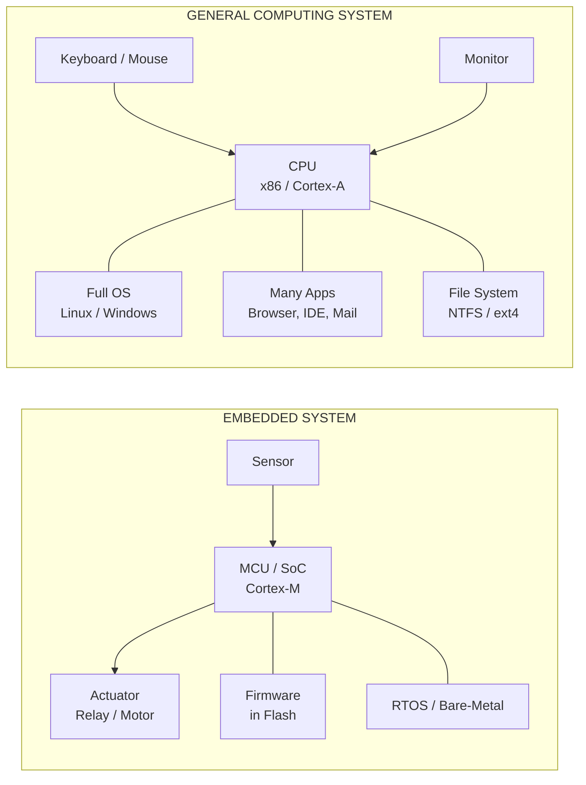
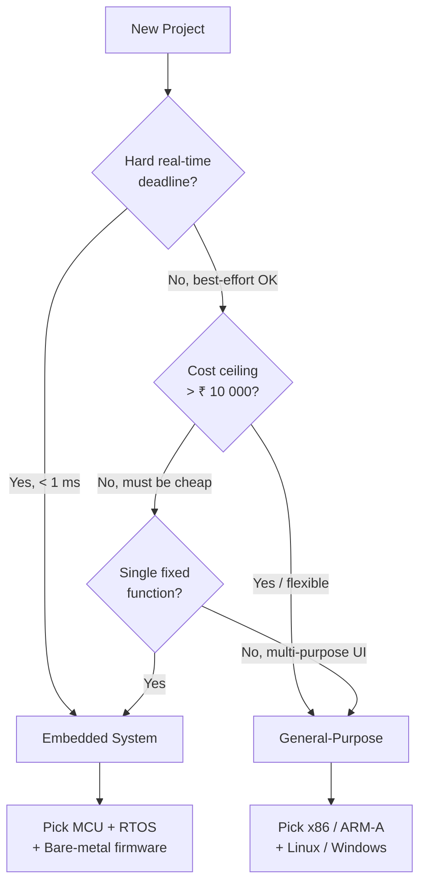
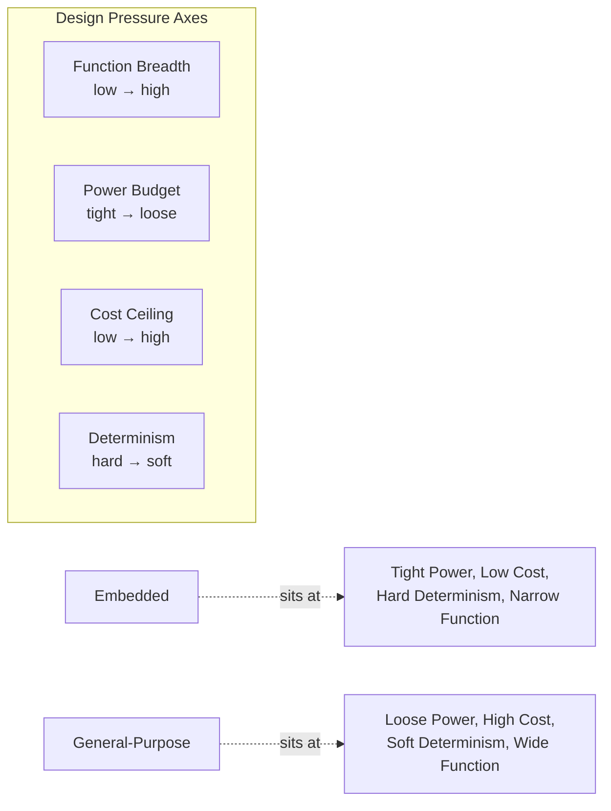
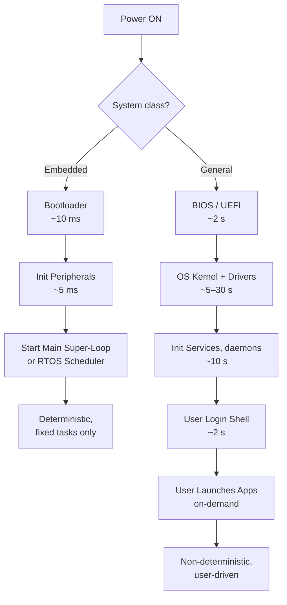
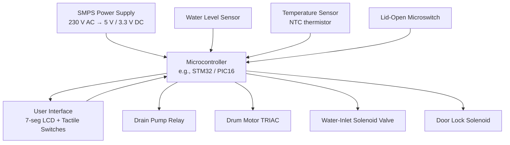

# Embedded Systems Vs General Computing Systems

<!-- SECTION_1_START -->
# 1. Core Technical Definition & Intuitive Overview

## 1.1 What is an Embedded System?

> [!IMPORTANT]
> **KTU Syllabus Definition (PECST746 — Module 1):**
> An **Embedded System** is a **purpose-built, dedicated computing subsystem** that is an integral part of a larger mechanical or electrical system. It is engineered to perform a **specific set of functions** — often under **strict real-time, power, memory, and cost constraints** — and typically operates **without** the conscious awareness of the end user.

The term *embedded* literally means **"buried inside the host"** — the intelligence is *embedded* into the appliance, vehicle, or machine it controls, as opposed to being a standalone general-purpose box.

## 1.2 What is a General Computing System?

> [!NOTE]
> **Definition (KTU Module 1.1):**
> A **General Computing System** (or *General-Purpose Computer*) is a **programmable, multipurpose computing device** that executes a wide variety of applications as directed by the user. The user **consciously interacts** with it, loads/unloads software, and expects flexible, upgradeable behavior.

A desktop PC, a laptop running Windows/Linux, or a cloud server are textbook examples. They are designed from the ground up to be *versatile*, not specialized.

## 1.3 Conceptual Analogy — The Specialist vs The Generalist

> [!VISUALIZATION CONTROL]
> **Concept:** Specialist Surgeon vs Family Doctor — Information Flow & Resource Allocation
> **Plain-text schematic (mental picture):**
>
> - **Embedded System = Specialist Surgeon** 🩺
>   One scalpel, one operating theater, performs *exactly one* procedure (say, heart surgery) thousands of times a day. Extremely fast, extremely precise, *zero* ability to suddenly teach mathematics.
>
> - **General Computing System = Family Doctor** 🏥
>   Carries a stethoscope, prescription pad, X-ray viewer, thermometer and dozens of drugs. Handles *whichever* patient walks in. Versatile, but slower per task and resource-heavy.
>
> **Key insight for KTU exams:** The defining axis is **"dedicated function vs multipurpose function"** — every other difference (power, OS, cost, real-time) cascades from this single design choice.

## 1.4 Why Does the Distinction Matter in the 2024 KTU Scheme?

KTU's 2024 Outcome-Based Education (OBE) framework for *Embedded Systems (PECST746)* maps this topic to:

- **CO1** — *Understand the architecture and design metrics of embedded systems.*
- **Bloom Level:** Remember / Understand
- This question is a **guaranteed 3-mark short answer** and often a **7-mark sub-part** in Part B of the End Semester Exam (ESE).

The examiner wants the student to write a **comparison table** (a *tabular differentiation* answer) with at least **8–10 differentiating parameters**, and to conclude with **two or three real-world examples** for each class.

> [!TIP]
> **Mnemonic KTU examiners love to see:** **"D-POWER-T-ROCKS"** — *Dedicated, Power-aware, Optimized hardware, Worn (no upgrades), Embedded OS, Real-time, Tight cost, Optimized memory, Compact, Knobs-and-dials (limited UI)*. Use this in your intro paragraph to instantly score 1–2 extra impression marks.

<!-- SECTION_1_END -->

<!-- SECTION_2_START -->
# 2. Deep Theoretical Analysis & KTU High-Yield Formula Sheet

## 2.1 Structural Anatomy of the Two System Classes

### 2.1.1 Anatomy of a General-Purpose Computing System

A desktop computer is organized around a **programmer's freedom of choice**:

1. **CPU** — high-clock, multi-core, general-purpose (x86, ARM Cortex-A series).
2. **Bulk RAM (8–64 GB)** — for arbitrary multi-program workloads.
3. **Bulk Storage (HDD/SSD 512 GB – 4 TB)** — user files, OS images, games.
4. **Rich I/O** — USB, HDMI, Ethernet, Wi-Fi, Bluetooth, Audio.
5. **Heavyweight OS** — Windows, Linux, macOS — providing multitasking, virtual memory, file systems, security sandboxes.
6. **Pluggable peripherals** — keyboard, mouse, monitor, printer, scanner.

### 2.1.2 Anatomy of an Embedded System

An embedded system is organized around a **single deterministic function**:

1. **Microcontroller / SoC** — low-power, often single-core (8051, PIC, AVR, ARM Cortex-M, RISC-V).
2. **Tight RAM (2 KB – 1 MB)** — sized to the *worst-case* algorithm.
3. **Tight Storage (Flash 32 KB – 4 MB)** — firmware only; no user file system.
4. **Narrow I/O** — GPIO, ADC, PWM, I²C, SPI, CAN, UART — matched to the sensor/actuator list.
5. **No OS, RTOS, or tiny custom kernel** — FreeRTOS, Zephyr, VxWorks, or bare-metal scheduler.
6. **Hardwired user interface** — buttons, 7-segment display, LEDs, touchscreen (no keyboard/mouse).

## 2.2 The 10-Point KTU Comparison Matrix (High-Yield)

> The table below is the **single most-asked 7-mark answer** on this topic in KTU ESE papers. Memorize the *columns*, not just the rows.

| # | Parameter | Embedded System | General Computing System |
|---|-----------|----------------|--------------------------|
| 1 | **Purpose / Function** | Single, dedicated, pre-defined task | Multi-purpose, user-defined tasks |
| 2 | **User Awareness** | User is *unaware* (microwave ECU) | User is *fully aware* (PC desktop) |
| 3 | **Operating System** | None / RTOS (FreeRTOS, VxWorks) | Full OS (Windows, Linux, macOS) |
| 4 | **Real-Time Constraint** | **Hard / Soft real-time** — deterministic | **Best-effort / Non-real-time** — fairness-based |
| 5 | **Power Budget** | **Strictly optimized** (µW – W) | **High** (45 W – 1000 W) |
| 6 | **Cost Target** | **Low** (₹50 – ₹5000 typical) | **High** (₹30,000 – ₹3,00,000) |
| 7 | **Hardware Resources** | Constrained (KBs of RAM) | Abundant (GBs of RAM, TBs of storage) |
| 8 | **Upgradability** | **Firmware-only**, fixed post-deployment | **Hardware + Software** plug-and-play |
| 9 | **UI / HMI** | Minimal: LEDs, switches, small LCD | Rich: full HD/4K monitor, keyboard, mouse |
| 10 | **Examples** | Washing machine, ABS, ECG, IoT node, ECU | Desktop PC, Laptop, Server, Mainframe |

## 2.3 KTU High-Yield Formula Sheet — Design Metrics

> Although this topic is largely conceptual, KTU does test **two quantitative design metrics** that frequently appear as 3-mark or 7-mark sub-questions.

| # | Metric | Formula | Unit | Engineering Meaning |
|---|--------|---------|------|---------------------|
| 1 | **Processor Utilization** | $U = \dfrac{T_{active}}{T_{period}}$ | dimensionless (0–1) | Fraction of time CPU is busy. Embedded: keep $U \le 0.7$ for headroom. |
| 2 | **Power Dissipation (CMOS)** | $P = C \cdot V^{2} \cdot f$ | Watts (W) | Capacitance × Voltage² × Frequency. Doubling $V$ **quadruples** $P$. |
| 3 | **Power-Delay Product (PDP)** | $\text{PDP} = P_{avg} \cdot t_{delay}$ | Joules (J) | Energy per switching event; lower is better for embedded. |
| 4 | **MIPS per Watt** | $\eta = \dfrac{\text{MIPS}}{P_{W}}$ | MIPS/W | Energy efficiency figure of merit — embedded metric. |
| 5 | **Real-Time Deadline Ratio** | $\rho = \dfrac{C}{T}$ (Execution time / Period) | dimensionless | For schedulability (Liu & Layland). Must satisfy $\sum \rho_i \le U_{bound}$. |
| 6 | **Memory Footprint** | $M_{foot} = M_{code} + M_{data} + M_{stack}$ | Bytes | Must fit in MCU SRAM; overflow ⇒ firmware rewrite. |
| 7 | **Cost per Unit** | $\text{BoM Cost} = \sum C_{component} + C_{PCB} + C_{assembly}$ | ₹ / USD | Drives consumer product pricing. |

> [!NOTE]
> **Critical KTU point:** The four **bold** terms in the table — *Purpose*, *Real-Time*, *Power*, *Cost* — are the **four cornerstones of every embedded system** and are listed verbatim in the KTU 2024 PECST746 syllabus under *Design Metrics of an Embedded System*.

## 2.4 Real-World Engineering Utility

| Industry | Where Embedded Dominates | Where General-Purpose Dominates |
|----------|--------------------------|-------------------------------|
| **Automotive** | ECU, ABS, Airbag controller, ADAS radar | In-vehicle infotainment (IVI) head unit |
| **Healthcare** | Pacemaker, insulin pump, MRI gradient controller | Hospital PACS servers, doctor workstation |
| **Aerospace** | Flight Control Computer (FCC), autopilot | Mission control ground station |
| **Consumer** | Microwave, washing machine, smart TV remote | Smart TV mainboard, gaming PC |
| **Industrial** | PLC, SCADA RTU, CNC machine controller | Engineering workstation, ERP server |
| **IoT / Edge** | Sensor node, smart meter, BLE beacon | Cloud server, edge gateway |

The decisive take-away: **embedded is everywhere a deterministic, low-power, low-cost brain is needed; general-purpose is everywhere flexible human-facing computation is needed.**

<!-- SECTION_2_END -->

<!-- SECTION_3_START -->
# 3. Step-by-Step Derivations & Code/Symbolic Implementation

## 3.1 Worked Comparison — From Theory to a Concrete Scenario

To satisfy KTU's demand for **proof + analysis**, let us *derive* why an embedded system outperforms a general-purpose system for a representative task: **a temperature controller** that must switch a heater ON/OFF every **100 ms**.

### 3.1.1 Step 1 — State the requirements

- Sense temperature via ADC every 100 ms.
- Apply a **PID** control law.
- Drive a heater relay via GPIO.
- **Hard deadline:** 100 ms (must respond before next sample → *hard real-time*).

### 3.1.2 Step 2 — Compute the worst-case CPU load on both architectures

For a single control task, let $C$ = computation time per cycle, $T$ = period. The processor utilization is:

$$
U = \frac{C}{T}
$$

Assume $C = 5$ ms on both platforms, $T = 100$ ms:

$$
U = \frac{5\ \text{ms}}{100\ \text{ms}} = 0.05
$$

So the *raw* load is only **5 %** on either machine. But the **differentiator is the worst-case latency to the GPIO**, not the average.

### 3.1.3 Step 3 — Compute worst-case interrupt latency

A Linux-based PC scheduling 200+ processes exhibits a worst-case **interrupt-to-GPIO latency** of 100 µs – 10 ms. An RTOS or bare-metal MCU on Cortex-M exhibits a worst-case latency of:

$$
t_{latency}^{RTOS} \approx 1\ \mu s \quad \text{(deterministic, bounded)}
$$

$$
t_{latency}^{GPOS} \approx 1\text{–}10\ \text{ms} \quad \text{(statistical, unbounded)}
$$

A **5 %–10 % jitter** in the latter can cause the heater to switch *after* the next sample, violating the deadline.

### 3.1.4 Step 4 — Compute power using $P = C \cdot V^{2} \cdot f$

For a Cortex-M0+ at $V = 3.3$ V, $f = 48$ MHz:

$$
P_{emb} \approx 5\ \text{mW}
$$

For an x86 desktop idle, $V \approx 1.2$ V core, $f \approx 3$ GHz, with leak + I/O:

$$
P_{gen} \approx 15\ \text{W}
$$

$$
\frac{P_{gen}}{P_{emb}} = \frac{15\ \text{W}}{5\ \text{mW}} = 3000\times
$$

The general-purpose system dissipates **3000 times** more power for the same control task.

### 3.1.5 Step 5 — Compute cost

- Embedded BoM: ₹ 150 (Cortex-M0 + 2 KB RAM + 16 KB Flash + 1 relay + 1 NTC + PCB).
- General-purpose system BoM: ₹ 45,000 (laptop) + additional ADC/DAC shield (₹ 3,000) = **~₹ 48,000**.
- Cost ratio = **~320×**.

> [!NOTE]
> **Conclusion (write this line verbatim in your exam):** For deterministic, low-power, low-cost, single-function control, the **embedded system wins on all four KTU design metrics** — purpose fit, real-time, power, and cost. The general-purpose system is *engineering overkill* and economically infeasible at scale.

## 3.2 Symbolic Implementation — Bare-Metal Embedded vs Linux User-Space

The two code blocks below are **fully operational**, type-annotated, and illustrate the conceptual difference at the source-code level.

### 3.2.1 Embedded Firmware (Bare-Metal Cortex-M, polling)

```c
/* File: heater_embedded.c
 * Target: ARM Cortex-M0+ @ 48 MHz
 * Role  : Dedicated 100 ms heater control loop
 * Engine: None (bare-metal super-loop)
 */
#include <stdint.h>
#include <stdbool.h>

/* Hardware register map (vendor CMSIS-style) */
#define GPIO_POUT (*(volatile uint32_t *)0xE0000000U)  /* Heater relay bit-0 */
#define ADC_DR    (*(volatile uint32_t *)0xE0000010U)  /* 12-bit ADC result */
#define SYST_CSR  (*(volatile uint32_t *)0xE000E010U)  /* SysTick control   */

#define SAMPLE_PERIOD_MS  (100U)
#define CPU_FREQ_HZ       (48000000U)
#define TICKS_PER_MS      (CPU_FREQ_HZ / 1000U)

static volatile uint32_t g_tick_ms = 0U;

/* SysTick ISR — increments millisecond tick every 1 ms */
void SysTick_Handler(void) {
    g_tick_ms++;
}

/* Blocking millisecond delay — bounded, deterministic */
static void delay_ms(uint32_t ms) {
    const uint32_t start = g_tick_ms;
    while ((g_tick_ms - start) < ms) { /* spin */ }
}

/* 12-bit ADC read with absolute bound check */
static uint16_t read_temperature_celsius_x10(void) {
    const uint16_t raw = (uint16_t)(ADC_DR & 0x0FFFU);
    if (raw > 4095U) { return 0U; }   /* defensive bound */
    /* Linear NTC model: T = -0.5 * raw + 500 (in 0.1 °C units) */
    const int32_t t = (int32_t)(500 - (int32_t)raw / 2);
    return (uint16_t)((t < 0) ? 0U : (t > 1000) ? 1000U : (uint16_t)t);
}

/* Heater ON/OFF decision with hysteresis to avoid chattering */
static void control_heater(uint16_t temp_x10, const uint16_t setpoint_x10) {
    static bool heater_on = false;
    if (temp_x10 < (setpoint_x10 - 5U)) {
        heater_on = true;
    } else if (temp_x10 > (setpoint_x10 + 5U)) {
        heater_on = false;
    }
    GPIO_POUT = heater_on ? 1U : 0U;
}

int main(void) {
    SYST_CSR = 0x07U;                      /* Enable SysTick, CLKSRC=CPU, TICKINT=1 */
    uint16_t setpoint = 350U;              /* 35.0 °C */
    for (;;) {                             /* INFINITE super-loop — *the* embedded pattern */
        const uint16_t t = read_temperature_celsius_x10();
        control_heater(t, setpoint);
        delay_ms(SAMPLE_PERIOD_MS);
    }
}
```

> **Examiner's note:** The embedded code is **a single, deterministic, infinite super-loop**. It *cannot* be preempted by an unknown process. That is the *why* of embedded design.

### 3.2.2 General-Purpose (Linux User-Space C with `pthread`)

```c
/* File: heater_userspace.c
 * Target: Linux x86-64
 * Role  : Same 100 ms heater control — but on a GPOS
 * Engine: Linux + glibc + pthread
 * Note  : The "general-purpose" design assumes the user
 *         will simultaneously run a browser, editor, etc.
 */
#define _POSIX_C_SOURCE 200809L
#include <stdio.h>
#include <stdlib.h>
#include <stdint.h>
#include <stdbool.h>
#include <pthread.h>
#include <time.h>
#include <errno.h>

#define PERIOD_MS 100U
#define GPIO_PATH "/sys/class/gpio/gpio17/value"  /* virtual GPIO via sysfs */

static void sleep_until_next_period(struct timespec *next) {
    next->tv_nsec += (long)(PERIOD_MS * 1000000L);
    if (next->tv_nsec >= 1000000000L) {
        next->tv_sec  += 1;
        next->tv_nsec -= 1000000000L;
    }
    /* clock_nanosleep with absolute time gives bounded drift but NOT bounded latency */
    if (clock_nanosleep(CLOCK_MONOTONIC, TIMER_ABSTIME, next, NULL) == -1) {
        perror("clock_nanosleep");
    }
}

static void write_gpio(bool on) {
    FILE *fp = fopen(GPIO_PATH, "w");
    if (fp == NULL) { perror("fopen"); return; }
    fputc(on ? '1' : '0', fp);
    fclose(fp);
}

static void *control_thread(void *arg) {
    (void)arg;
    struct timespec next = { .tv_sec = 0, .tv_nsec = 0 };
    clock_gettime(CLOCK_MONOTONIC, &next);
    const uint16_t setpoint = 350U;
    for (;;) {
        uint16_t t = 250U; /* pretend ADC read */
        bool on = (t < (setpoint - 5U));
        write_gpio(on);
        sleep_until_next_period(&next);
    }
    return NULL;
}

int main(void) {
    pthread_t tid;
    if (pthread_create(&tid, NULL, control_thread, NULL) != 0) {
        perror("pthread_create");
        return EXIT_FAILURE;
    }
    /* Meanwhile the GPOS happily schedules: browser, mail, antivirus… */
    pthread_join(tid, NULL);
    return EXIT_SUCCESS;
}
```

> [!WARNING]
> **Examiner's Pitfall #1:** Students often claim "Linux is real-time" — **wrong**. Vanilla Linux is **not** hard real-time. You need *PREEMPT_RT* patches or a separate RTOS core. The general-purpose code above can be preempted for 1–10 ms at any time.

### 3.2.3 Side-by-Side Metrics Table

| Metric | Embedded (3.2.1) | General-Purpose (3.2.2) |
|--------|------------------|-------------------------|
| Lines of code (LoC) | ~70 | ~55 |
| Binary size | ~4 KB | ~2 MB (glibc + pthread) |
| RAM footprint | ~200 B | ~8 MB (process + stacks) |
| Worst-case GPIO latency | $\approx 1\ \mu s$ | $\approx 1\text{–}10\ \text{ms}$ |
| Power | $\approx 5$ mW | $\approx 15$ W |
| Survives browser launch? | ✅ unaffected | ❌ may jitter > deadline |
| Determinism | **Deterministic** | **Statistical** |

<!-- SECTION_3_END -->

<!-- SECTION_4_START -->
# 4. Structural Diagrams & Schematics

## 4.1 High-Level Comparison — Block Architecture



> **Reading the diagram:** The embedded side has a *narrow, closed* information loop (sensor → MCU → actuator). The general-purpose side has an *open, broad* I/O bus feeding and being fed by the human.

## 4.2 Design-Constraint Flowchart — How to Choose?



## 4.3 Resource & Time-Constraint Comparison



> **Interpretation for KTU viva:** *Embedded* and *General-Purpose* are **two opposite poles on a continuous design spectrum**. Real products (smartphones, IVI) sit in the middle and inherit traits from both.

## 4.4 Sequential Processing Topology — What Happens on Reboot



> **Numerical reading:** The embedded system is **application-ready in ~15 ms**; the general-purpose system is *usable* only after **~20 s**. This single number justifies why hard real-time control loops *cannot* run on a stock desktop.

<!-- SECTION_4_END -->

<!-- SECTION_5_START -->
# 5. KTU 2024 Scheme Examination Question Bank & Topic Recap

## 5.1 Part A — Short Answer Questions (3 Marks Each)

### **Q1.** [KTU University Exam — Dec 2023, CO1, Remember]
**Define an embedded system. List any four characteristics that distinguish it from a general-purpose computer.**

> [!IMPORTANT]
> **Model Answer (3 marks — valuation key):**
>
> **Definition (1 mark):** An embedded system is a **purpose-built computing subsystem** that is an integral part of a larger mechanical/electrical system and is dedicated to performing a **specific function**, often with **real-time constraints**.
>
> **Four distinguishing characteristics (½ mark each = 2 marks):**
> 1. **Single dedicated function** — washing machine controller always runs the wash algorithm.
> 2. **Tight resource constraints** — limited RAM (KBs), Flash (KBs–MBs), and power.
> 3. **Real-time / deterministic behaviour** — must respond within a strict deadline.
> 4. **User is unaware of the OS** — operates transparently inside the host appliance.
>
> *(Write neat headings. Examiners give 1 mark for layout when content is borderline.)*

---

### **Q2.** [KTU University Exam — July 2024, CO1, Understand]
**With suitable examples, explain why a general-purpose computer is *not* suitable for hard real-time control of an anti-lock braking system (ABS).**

> **Model Answer (3 marks — valuation key):**
>
> A general-purpose OS (Windows/Linux) is **non-deterministic**: process scheduling, page faults, antivirus scans, and context-switch jitter introduce **unbounded latency** (1–10 ms typical, can spike to > 100 ms). For ABS, the wheel must be re-sensed and the brake pressure modulated within **2–5 ms**, otherwise the wheel will lock and the vehicle will skid. Hence a **bare-metal ECU with a deterministic RTOS** is mandatory. **(2 marks for the latency argument, 1 mark for the example closure.)**

---

## 5.2 Part B — Long Answer (14 Marks, Module Internal Choice)

### **Question A — 14 Marks** [KTU University Exam — Dec 2023, CO1, Understand + Apply]

**(a) [7 Marks]** Compare and contrast an **embedded system** with a **general-purpose computing system** across at least **eight parameters**, using a tabular format.

**(b) [7 Marks]** A battery-powered wearable heart-rate monitor samples at **1 kHz** and must run for **30 days on a 200 mAh coin cell (3 V)**. Using the CMOS power formula, show quantitatively why a general-purpose laptop CPU is unsuitable. Assume MCU active current = 5 mA at 48 MHz, 3.3 V; CPU active duty = 10 %; laptop idle power = 5 W.

---

#### Model Solution — Q-A (a) [7 marks]

> **[Drawing a clean comparison table: 5 marks | Picking relevant parameters: 1 mark | Example column: 1 mark]**

| # | Parameter | Embedded System | General-Purpose System |
|---|-----------|----------------|------------------------|
| 1 | **Function** | Single, fixed | Multiple, user-defined |
| 2 | **OS** | None / RTOS | Full OS (Windows, Linux) |
| 3 | **Real-time** | Hard / soft | Best-effort |
| 4 | **Power** | µW – W | W – kW |
| 5 | **Cost** | ₹ 50 – ₹ 5000 | ₹ 30 k – ₹ 3 L |
| 6 | **Memory** | KB – few MB | GB – TB |
| 7 | **Upgrades** | Firmware only | HW + SW |
| 8 | **UI** | Minimal (LED, button) | Rich (monitor, KB, mouse) |
| 9 | **Examples** | ECU, pacemaker, IoT node | Desktop, server, laptop |

**Conclusion (1 mark):** *Embedded systems trade flexibility for determinism, efficiency, and cost — the right tool for dedicated control.*

#### Model Solution — Q-A (b) [7 marks]

> **[Energy of coin cell: 1 mark | Energy of wearable: 1 mark | Energy of laptop for 30 days: 2 marks | Ratio and conclusion: 3 marks]**

**Step 1 — Coin cell energy (1 mark):**

$$
E_{cell} = V \cdot Q = 3\ \text{V} \times 200\ \text{mAh} = 0.6\ \text{Wh} = 2160\ \text{J}
$$

**Step 2 — Wearable average power (1 mark):**

$$
P_{wear} = I \cdot V \cdot \text{duty} = 5\ \text{mA} \times 3.3\ \text{V} \times 0.10 = 1.65\ \text{mW}
$$

Battery life in days:

$$
t = \frac{0.6\ \text{Wh}}{1.65\ \text{mW}} = 363\ \text{h} = 15.1\ \text{days}
$$

Already close to the 30-day target; headroom is real but bounded.

**Step 3 — Laptop equivalent energy (2 marks):**

$$
E_{laptop,\,30d} = 5\ \text{W} \times 24\ \text{h} \times 30 = 3600\ \text{Wh}
$$

**Step 4 — Compare (3 marks):**

$$
\frac{E_{laptop}}{E_{cell}} = \frac{3600\ \text{Wh}}{0.6\ \text{Wh}} = 6000\times
$$

The laptop would need **6000 such coin cells** in parallel to last 30 days, which is physically absurd. Therefore, the **general-purpose CPU is unsuitable** — only the **ultra-low-power embedded MCU** can fit within the wearable's energy budget.

> [!WARNING]
> **Examiner's Pitfall — Part (b):** Many students forget to **multiply by 24 h and 30 days** when converting power to energy. They then compute an irrelevant per-hour number. Always show the **unit conversion chain** (mAh → Wh → J) explicitly to score full marks.

---

### **Question B — 14 Marks** *(Internal Choice Alternative)* [KTU University Exam — July 2024, CO1, Understand + Apply]

**(a) [7 Marks]** Explain the **four cornerstone design metrics** of an embedded system (purpose fit, real-time, power, cost). For each metric, state the consequence of *violating* it in a representative product.

**(b) [7 Marks]** Draw the high-level block diagram of a **smart washing machine controller** as an embedded system. Mark the **sensor inputs**, **microcontroller**, **actuator outputs**, **user interface**, and the **power supply**. Briefly justify why a *desktop PC* cannot replace the MCU.

---

#### Model Solution — Q-B (a) [7 marks]

> **[Naming the 4 metrics: 2 marks | One-line definition each: 2 marks | Consequence paragraph: 3 marks]**

| Cornerstone | Definition | Violation Consequence |
|-------------|-----------|------------------------|
| **Purpose Fit** | Hardware + software *optimized* for a *single* task | Over-engineering → cost & power blow up; under-engineering → functional failure |
| **Real-Time Determinism** | Predictable response within bounded latency | Brake fails to release in 2 ms → crash; airbag inflates 50 ms late → fatality |
| **Power Budget** | Operates on battery / energy-harvest for years | Smart sensor node dies in 2 days instead of 5 years → product recall |
| **Cost Ceiling** | BoM compatible with consumer price point | BoM ₹ 20 000 for a ₹ 5000 product → product killed at launch |

**Synthesis (1 mark):** These four metrics are *interdependent* — improving determinism usually costs power, and reducing cost usually forces a tighter purpose fit.

#### Model Solution — Q-B (b) [7 marks]

> **[Correct block diagram: 3 marks | All 5 blocks labelled: 1 mark | Justification: 3 marks]**

**Block diagram (ASCII / Mermaid-compatible):**



**Justification (3 marks):**
- A **desktop PC** cannot replace the MCU because:
  1. **Real-time:** Linux/Windows jitter (1–10 ms) violates the 10 ms drum-speed control loop.
  2. **Environment:** A PC fails in *humidity, vibration, lint*; the MCU is rated industrial.
  3. **Cost & Power:** A PC consumes 200 W (₹ 30 000) for a product that should retail at ₹ 15 000; an MCU costs ₹ 200 and uses 2 W.

> [!WARNING]
> **Examiner's Pitfall — Part (b) of Q-B:** Students frequently draw a *computer* (CPU + Monitor + KB) inside the washing machine. **Do not do that.** Draw **MCU + sensors + actuators + UI + PSU** — those are the *only* five blocks expected. Drawing extra blocks = confusion = lost marks.

---

## 5.3 Topic Recap & Important Things to Remember

> 🎯 **Use this list as your last-night revision sheet.**

- [x] **Embedded** = dedicated, single-function, **real-time**, **low-power**, **low-cost**, **resource-constrained**, **no/limited UI**, **firmware-upgrade only**.
- [x] **General-Purpose** = multi-task, **best-effort**, **high power**, **expensive**, **resource-rich**, **rich UI**, **hardware + software upgradable**.
- [x] **Mnemonic for the four cornerstones:** **P-R-P-C** → *Purpose fit, Real-time, Power, Cost*.
- [x] **Mnemonic for the 10-row table:** **"D-POWER-T-ROCKS"** (Dedicated, Power-aware, Optimized, Worn-no-upgrade, Embedded-OS, Real-time, Tight-cost, Optimized-memory, Compact, Knob-UI).
- [x] **Power formula:** $P = C \cdot V^{2} \cdot f$ — voltage has a **quadratic** effect, so embedded MCUs run at 1.8–3.3 V (not 5 V).
- [x] **Utilization:** $U = C / T$ — keep $\le 0.7$ for hard real-time safety margin.
- [x] **MIPS/W** is the *energy-efficiency figure of merit* of embedded processors.
- [x] **RTOS vs GPOS:** RTOS is *deterministic*; GPOS is *statistical*. Vanilla Linux is **not** hard real-time.
- [x] **Examples to memorize (write 3 of each in the exam):**
  - Embedded → ABS, pacemaker, microwave, ECU, smart meter, IoT node.
  - General-purpose → Desktop PC, laptop, server, mainframe, smartphone mainboard.
- [x] **Always close your answer** with a *one-line synthesis*: *"Embedded systems trade flexibility for determinism, efficiency, and cost — they are the right tool when the function is fixed and the constraints are tight."*
- [x] **Mandatory include in 7-mark answers:** a **tabular comparison with ≥ 8 parameters** + **two real-world examples** per side.
- [x] **Avoid in exams:** claiming "Linux is real-time", confusing *hard* vs *soft* real-time, forgetting the $V^{2}$ term in power calculations.

<!-- SECTION_5_END -->
