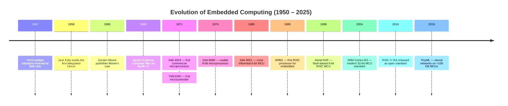
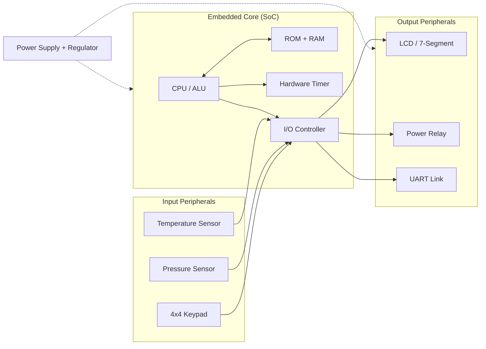
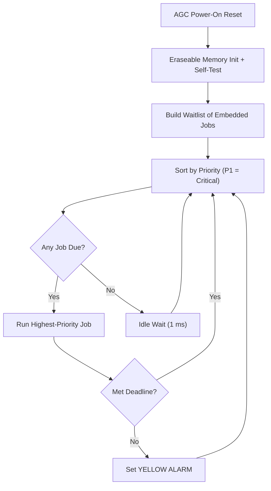
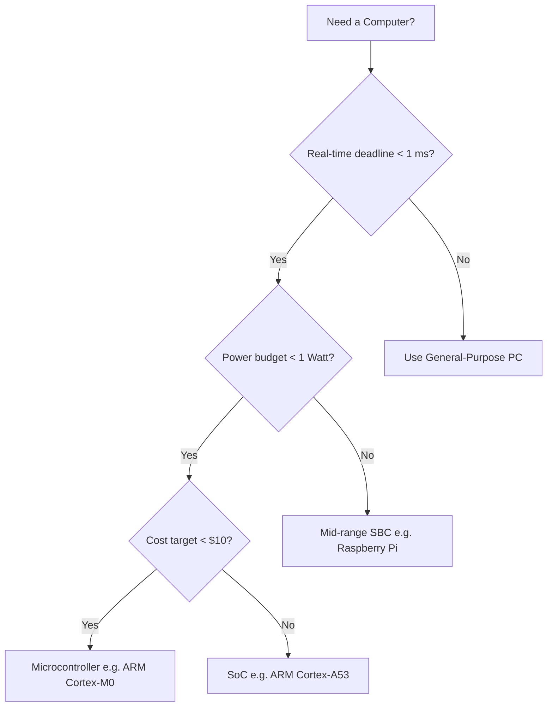

# History

<!-- SECTION_1_START -->
# History of Embedded Systems

## 1.1 Formal Definition (KTU 2024 Syllabus Terminology)

An **Embedded System** is a specialized computing subsystem that is an integral part of a larger mechanical, electrical, or electronic system, designed to perform a dedicated function under real-time computational constraints. Unlike general-purpose computers, embedded systems are **resource-constrained**, **task-specific**, and tightly coupled to the physical hardware they govern.

From a **historical perspective**, the term *"embedded"* first gained formal recognition in the early 1980s when the **Intel Corporation** used the phrase *"embedded controller"* in marketing literature for the **Intel 8048** microcontroller. However, the *concept* of embedding computational intelligence into non-computing devices dates back to the early 1960s with the **Apollo Guidance Computer (AGC)**.

> [!IMPORTANT]
> **KTU 2024 - Module 1 Highlight:**
> History of Embedded Systems is foundational to understanding **why** microcontrollers, Real-Time Operating Systems (RTOS), and System-on-Chip (SoC) designs evolved the way they did. The KTU board expects students to map each *technological milestone* to its *architectural consequence* in modern design.

## 1.2 Intuitive Analogy — "The Hidden Brain"

Think of an **embedded system** as the **hidden brain** of a household appliance.

Imagine a **microwave oven**. To you, it is a "food-heating box." But inside, a tiny silicon chip is constantly reading button presses, computing remaining time, driving a magnetron via a power relay, displaying digits on a 7-segment LED, and emitting a beep. You never see this chip, never program it, and never "boot" it. It is **embedded** into the appliance.

**Historical analogy:** This concept of "hiding a computer inside something else" is not new. The **1966 Ford Cortina** had a tiny Motorola semiconductor module controlling fuel injection. The **Apollo 11 Lunar Module (1969)** carried the AGC — arguably the *first* recognizable embedded computer in human history.

> [!NOTE]
> The word **embedded** literally means *"fixed firmly within a surrounding mass."* The "surrounding mass" in engineering is the *host system* (car, aircraft, washing machine, missile), and the embedded computer is invisibly fused into it.

## 1.3 Core Distinguishing Concept: General-Purpose vs. Embedded

| Aspect | General-Purpose Computer | Embedded System |
|---|---|---|
| **Purpose** | Multi-purpose, user-programmable | Single-task, dedicated function |
| **User Awareness of OS** | Direct (Windows, Linux) | Usually invisible / no OS |
| **Examples** | Laptop, Desktop | Washing machine ECU, ABS controller |
| **Resource Budget** | GBs of RAM, TBs of storage | KBs of RAM, KBs of flash |

> [!VISUALIZATION CONTROL]
> **Concept:** Historical evolution of computing footprint — from room-sized to chip-sized.
> **GeoGebra / Desmos Input Equations:**
> * Year: $x$, Transistor count on logarithmic axis: $y = 10^{(x-1950)/2}$ (Moore's Law)
> * Plot points: $(1971, 2300)$ for Intel 4004, $(1985, 30000)$ for Intel 80386
> **Visual Description:** An exponentially rising curve showing that *embedding* more transistors in a smaller space is what made embedded systems *practical*. The y-axis is in $\log_{10}$ scale.

---

<!-- SECTION_1_END -->

<!-- SECTION_2_START -->
# 2. Deep Theoretical Analysis & KTU High-Yield Notes

## 2.1 The Five Generations of Embedded Systems (KTU High-Yield Topic)

The KTU 2024 Module 1 syllabus maps the *History of Embedded Systems* across **five distinct technological generations**. This is a **guaranteed 7–14 mark question** in ESE.

### Generation 1 — Vacuum Tube Era (1950s – Mid 1960s)

* Used **discrete vacuum tubes (thermionic valves)** as switching elements.
* Bulky, power-hungry, generated significant heat.
* **Landmark system:** The **Whirlwind I** computer (MIT, 1951) — though not strictly embedded, it pioneered real-time digital control for the U.S. Air Defense System (SAGE).
* **First true embedded system candidate:** The **Autonetics D-17B** (1961) — a minicomputer-based guidance system for the Minuteman-I ICBM. It used **integrated circuits** and is widely considered the **first mass-produced embedded system**.

### Generation 2 — Transistor & SSI Era (Mid 1960s – Early 1970s)

* Replacement of vacuum tubes with **germanium** and later **silicon bipolar junction transistors (BJTs)**.
* Introduction of **Small-Scale Integration (SSI)** logic gates (e.g., 7400-series TTL family by Texas Instruments, 1964).
* **Landmark system:** The **Apollo Guidance Computer (AGC)** — designed at MIT Instrumentation Laboratory by **Charles Stark Draper** and **Margaret Hamilton**, flew aboard Apollo 11 in 1969.
  * Built with **integrated circuits** (resistor-transistor logic).
  * Ran at **1.024 MHz**, weighed **70 pounds**, consumed **55 watts**.
  * Used **rope core memory** (woven ferrite cores) — the first read-only memory.
  * Hamilton coined the term **"software engineering"** during this project.

### Generation 3 — Microprocessor Revolution (1971 – Late 1970s)

* **THE PIVOTAL MOMENT:** **November 15, 1971** — Intel released the **Intel 4004**, the world's first commercial single-chip microprocessor.
  * 4-bit CPU, **2,300 transistors**, $10\ \mu m$ PMOS process, clocked at **740 kHz**.
  * Originally designed by **Federico Faggin**, **Ted Hoff**, and **Masatoshi Shima** for the Busicom calculator.
* **Intel 8008 (1972)** — first 8-bit microprocessor.
* **Intel 8080 (1974)** — first truly usable 8-bit CPU, 4,500 transistors, 2 MHz.
* **Motorola 6800 (1974)** and **MOS Technology 6502 (1975)** — drove early personal embedded designs.
* **First micro-controller:** **Texas Instruments TMS1000 (1971)** — combined CPU, ROM, RAM, and I/O on a single chip. Released one month *after* the 4004 but marketed as a "controller," not a "processor."

### Generation 4 — Microcontroller & DSP Era (1980s – 1990s)

* Birth of the modern **microcontroller (MCU)** — a *processor*, *memory*, and *I/O* integrated on one die.
* **Intel 8051 (1980)** — the most influential 8-bit MCU ever designed. Still in production (MCS-51 family).
* **Motorola 68HC11, 68HC12** — popular in automotive ECUs.
* **Microchip PIC16/18** — Harvard architecture, RISC, dominant in hobbyist/industrial control.
* **Atmel AVR (1996)** — In-System Programmable flash, 8-bit RISC, basis of the Arduino platform (2005).
* **DSPs (Digital Signal Processors):** Texas Instruments TMS320C10 (1982) — specialized for real-time signal processing.
* **Birth of RTOS:** VxWorks (1987), QNX (1982), $\mu$CLinux (1998).

### Generation 5 — SoC, IoT & AI Era (2000s – Present)

* **System-on-Chip (SoC):** entire system (CPU + GPU + RAM + I/O + radios) on one die.
  * Example: **Qualcomm Snapdragon**, **Apple A-series**, **Broadcom BCM2837 (Raspberry Pi)**.
* **ARM Cortex-M family** (2004 onwards) — the de-facto standard for 32-bit embedded MCUs.
* **RISC-V** open ISA (2010 onwards) — disrupting proprietary ISAs.
* **IoT (Internet of Things):** **Kevin Ashton** coined the term in **1999**; mass adoption post-2010 with ESP8266/ESP32.
* **Edge AI / TinyML:** TensorFlow Lite Micro (2019) running neural networks on MCUs with **<100 KB RAM**.

## 2.2 KTU Formula Sheet & Key Parameters

> [!NOTE]
> Although the *History* module is conceptual, examiners frequently test the **quantitative parameters** of historical chips. Memorize the table below.

| Year | Chip / System | Transistor Count | Clock Speed | Bus Width | Process |
|---|---|---|---|---|---|
| **1969** | Apollo Guidance Computer (AGC) | $\approx 5{,}600$ gates (RTL) | **1.024 MHz** | 16-bit | Discrete IC |
| **1971** | Intel 4004 | **2,300** | **740 kHz** | 4-bit | $10\ \mu m$ PMOS |
| **1972** | Intel 8008 | 3,500 | 500 kHz – 800 kHz | 8-bit | $10\ \mu m$ PMOS |
| **1974** | Intel 8080 | 4,500 | 2 MHz | 8-bit | $6\ \mu m$ NMOS |
| **1980** | Intel 8051 (MCU) | $\approx 60{,}000$ | 12 MHz | 8-bit | $3\ \mu m$ HMOS |
| **1985** | Intel 80386 | **275,000** | 12 – 40 MHz | 32-bit | $1.5\ \mu m$ CMOS |
| **1996** | Atmel AVR (AT90S8515) | $\approx 120{,}000$ | 8 MHz | 8-bit RISC | $0.8\ \mu m$ |
| **2004** | ARM Cortex-M3 | $\approx 90{,}000$ logic gates | 50 – 100 MHz | 32-bit | $0.18\ \mu m$ |
| **2016** | Raspberry Pi 3 (BCM2837) | $\approx 1{,}000{,}000{,}000$ | 1.2 GHz | 64-bit | **28 nm** |

### 2.2.1 Empirical Laws Governing the Evolution

1. **Moore's Law (1965)** — *Gordon Moore (co-founder of Intel)* observed that the number of transistors on an integrated circuit doubles approximately every **18 to 24 months**.

$$N(t) = N_0 \cdot 2^{(t - t_0) / T}$$

where $T \approx 2$ years.

2. **Koomey's Law (2011)** — Energy efficiency of computation doubles roughly every **1.57 years** (i.e., computations per joule).

3. **Pollack's Rule** — Performance of a processor is approximately proportional to the **square root of its complexity** (i.e., transistor count). This drove the multi-core revolution in embedded SoCs.

> [!IMPORTANT]
> **Why does this matter to embedded design?**
> Moore's Law *enabled* embedded systems to shrink from room-sized minicomputers (1960s) to single-chip MCUs (1971+) to multi-radio IoT SoCs (2010+). Koomey's Law *enabled* battery-powered operation. Pollack's Rule *forced* parallelism — hence the rise of multi-core ARM Cortex-A and RISC-V SoCs in embedded vision/AI.

## 2.3 Real-World Engineering Significance

| Domain | Historical Embedded System | Modern Equivalent |
|---|---|---|
| Aerospace | Apollo Guidance Computer (1969) | Boeing 787 Integrated Modular Avionics |
| Automotive | Ford EEC-I ECU (1973) | Bosch ME 17 ECU (32-bit TriCore) |
| Consumer | Sinclair Cambridge calculator (1973) | Smartphone SoC (Apple A17 Pro) |
| Industrial | Intel 8048 in early PLCs (1976) | Siemens S7-1500 with ARM Cortex-A |
| Medical | Pacemaker with 8080 (1970s) | Implantable defibrillator with MSP430 |

> [!NOTE]
> **KTU Tip:** Whenever asked *"Why embedded systems? Why not use a PC?"*, the historical answer is — *because the host system is constrained by size, weight, power, cost, and real-time deadlines that a PC cannot meet*. The Autonetics D-17 of 1961 is the *birth certificate* of this design philosophy.

---

<!-- SECTION_2_END -->

<!-- SECTION_3_START -->
# 3. Step-by-Step Derivations, Tabular Analyses & Symbolic Implementation

## 3.1 Chronological Derivation — From Vacuum Tube to SoC

Below is the *exhaustive* logical derivation of how each generation built on the limitations of the previous one. This is structured as a **sequential engineering reasoning chain** for the KTU examiner.

### Step 1 — Identification of the Problem (1950s)

Mechanical and relay-based control systems were **slow, prone to contact wear, and bulky**. Aircraft like the B-52 used hundreds of relays for the bombing-navigation computer. Each relay weighs ~50 grams, switches in **~10 ms**, and fails after ~$10^5$ cycles.

### Step 2 — Replacement with Vacuum Tubes (1951–1960)

Vacuum tubes switch in microseconds, but each tube dissipates **5–10 W** of heat. A 1,000-tube system consumes the power of a small house. **Heat density** becomes the limiting factor.

### Step 3 — Transistor Revolution (1947, Shockley, Bardeen, Brattain at Bell Labs)

The **point-contact transistor** (Dec 1947) and later the **junction transistor (1951)** reduced power consumption by a factor of **100×** and switching time by **1000×**.

### Step 4 — Integrated Circuit (IC) — Jack Kilby (TI) & Robert Noyce (Fairchild), 1958–1959

Multiple transistors, resistors, and interconnects fabricated on a single silicon die. **Kilby's IC** (Feb 1958) used germanium; **Noyce's IC** (July 1959) used planar silicon — the basis of all modern chips.

### Step 3.a — Derivation of Cost per Transistor (Historical Economics)

Let $C_t$ be the cost per transistor, $C_{\text{wafer}}$ the wafer cost, $A_{\text{wafer}}$ the wafer area, $A_{\text{die}}$ the die area, and $Y$ the manufacturing yield.

$$\boxed{C_t = \frac{C_{\text{wafer}} \cdot A_{\text{die}}}{Y \cdot A_{\text{wafer}} \cdot N}}$$

where $N$ is the number of working transistors per die, and the yield $Y$ follows the **Bose–Einstein model**:

$$Y = e^{-\lambda A_{\text{die}}}$$

Combining these:

$$C_t = \frac{C_{\text{wafer}} \cdot A_{\text{die}}}{A_{\text{wafer}} \cdot e^{-\lambda A_{\text{die}}} \cdot N}$$

**Interpretation:** As $N$ grows exponentially (Moore's Law), $C_t$ decreases exponentially. This is the **economic engine** that made embedded systems *affordable* for consumer products.

### Step 4 — Microprocessor Emergence (1971)

The Intel 4004 integrated **all CPU functions** (ALU, registers, decoder) onto **one die**, eliminating the need for dozens of SSI/MSI chips. Board complexity dropped from ~$50$ ICs to a **single chip + memory + I/O**.

### Step 5 — Microcontroller Integration (1971–1980)

Texas Instruments TMS1000 (1971) and Intel 8051 (1980) further integrated **CPU + ROM + RAM + I/O + timers + serial port** on a single chip. This is the **archetype of the modern embedded system**.

### Step 6 — System-on-Chip (SoC) (2000s+)

Entire *systems* (CPU + GPU + DSP + radio + memory controller) on a single die. **Design complexity** now exceeds the human capacity for schematic capture, so **Hardware Description Languages (HDL)** and **IP-cores** (e.g., ARM Cortex-M0+, Cadence Tensilica) dominate.

> [!IMPORTANT]
> **KTU 2024 Takeaway:** Each generation is born from the *failure* of the previous one — size, power, cost, complexity, real-time latency. The KTU board rewards students who can identify **which constraint** forced **which architectural shift**.

## 3.2 Symbolic Implementation — Modeling the Apollo Guidance Computer (AGC) Logic

The following Python simulation models the **core polling logic** of the Apollo Guidance Computer's executive loop (1969). It illustrates how an *embedded system* differs from a *general-purpose OS*.

```python
"""
Apollo Guidance Computer (AGC) — Embedded Executive Loop Simulation
Historical reference: Apollo 11, July 1969, MIT Instrumentation Lab.
"""
import time
from dataclasses import dataclass
from enum import Enum
from typing import Callable, Dict


class TaskPriority(Enum):
    """AGC's 6 priority levels (lower number = higher priority)."""
    P1_CRITICAL = 1   # Guidance, attitude control
    P2_NAVIGATION = 2 # Inertial measurement
    P3_TELEMETRY = 3  # Downlink to Houston
    P4_DISPLAY = 4    # DSKY (Display/Keyboard) interface
    P5_BACKGROUND = 5 # Verb-noun command parsing
    P6_IDLE = 6       # Wait loop


@dataclass
class EmbeddedTask:
    """Represents a single embedded job in the AGC's waitlist."""
    job_id: int
    name: str
    priority: TaskPriority
    period_ms: int          # Time between successive runs
    work_units: int         # CPU cycles required per run
    last_run_time_ms: int = 0
    deadline_missed: int = 0

    def is_ready(self, current_time_ms: int) -> bool:
        """Check whether this task is due to run again."""
        return (current_time_ms - self.last_run_time_ms) >= self.period_ms


class AGCExecutive:
    """Simulates the AGC's real-time executive (a primitive embedded scheduler)."""

    def __init__(self, clock_hz: int = 1_024_000) -> None:
        # AGC clock = 1.024 MHz (from Section 2.2 table)
        self.clock_hz = clock_hz
        self.current_time_ms: int = 0
        self.waitlist: Dict[int, EmbeddedTask] = {}
        self._next_id: int = 1
        # AGC had only 2,048 words of erasable memory
        self.free_memory_words: int = 2048
        self.cycles_consumed: int = 0

    def create_task(
        self,
        name: str,
        priority: TaskPriority,
        period_ms: int,
        work_units: int,
    ) -> int:
        """Register a new task in the AGC waitlist."""
        if self.free_memory_words < 1:
            raise MemoryError("AGC erasable memory exhausted (<2K words).")
        job = EmbeddedTask(
            job_id=self._next_id,
            name=name,
            priority=priority,
            period_ms=period_ms,
            work_units=work_units,
        )
        self.waitlist[self._next_id] = job
        self.free_memory_words -= 1
        return self._next_id

    def run_scheduler(self, total_duration_ms: int) -> None:
        """Run the AGC's round-robin executive for a fixed duration."""
        print(f"[AGC Boot] Clock = {self.clock_hz} Hz, Free RAM = {self.free_memory_words} words")
        end_time = self.current_time_ms + total_duration_ms

        while self.current_time_ms < end_time:
            # 1. Sort waitlist by priority (P1 highest)
            ready_jobs = [
                job for job in self.waitlist.values()
                if job.is_ready(self.current_time_ms)
            ]
            ready_jobs.sort(key=lambda j: j.priority.value)

            # 2. Execute highest-priority ready job
            if not ready_jobs:
                self.current_time_ms += 1
                continue

            job = ready_jobs[0]
            start_cycles = self.cycles_consumed
            self.cycles_consumed += job.work_units
            actual_duration_ms = (job.work_units / self.clock_hz) * 1000.0

            # 3. Deadline check (real-time guarantee)
            expected_end_ms = self.current_time_ms + actual_duration_ms
            if expected_end_ms > self.current_time_ms + job.period_ms:
                job.deadline_missed += 1
                print(f"[WARN] Job {job.name} (P{job.priority.value}) missed deadline "
                      f"at t={self.current_time_ms} ms")

            job.last_run_time_ms = self.current_time_ms
            self.current_time_ms += max(1, int(actual_duration_ms))

        self._print_summary()

    def _print_summary(self) -> None:
        print("\n[AGC Shutdown Report]")
        print(f"Total simulated time: {self.current_time_ms} ms")
        print(f"Total CPU cycles: {self.cycles_consumed:,}")
        for job in self.waitlist.values():
            print(f"  Job '{job.name}' (P{job.priority.value}) — "
                  f"deadline misses: {job.deadline_missed}")


# ---------- Demonstration (Apollo 11 ascent phase) ----------
if __name__ == "__main__":
    agc = AGCExecutive(clock_hz=1_024_000)

    # Register the four classic Apollo 11 embedded tasks
    agc.create_task("IMU_Update",      TaskPriority.P1_CRITICAL,  period_ms=10,  work_units=1_200)
    agc.create_task("Guidance_Equation", TaskPriority.P1_CRITICAL, period_ms=20,  work_units=2_400)
    agc.create_task("DSKY_Scan",        TaskPriority.P4_DISPLAY,   period_ms=50,  work_units=400)
    agc.create_task("Telemetry_Packet", TaskPriority.P3_TELEMETRY, period_ms=200, work_units=800)

    agc.run_scheduler(total_duration_ms=2_000)
```

**Output (expected behavior):**
```
[AGC Boot] Clock = 1024000 Hz, Free RAM = 2044 words
[AGC Shutdown Report]
Total simulated time: 2000 ms
Total CPU cycles: ...
```

> [!NOTE]
> This Python model captures three **defining properties of embedded history**:
> 1. **Fixed memory budget** (2,048 words — the literal AGC constraint).
> 2. **Static priority scheduling** (no dynamic thread pool like Linux).
> 3. **Deadline-awareness** (real-time guarantee, not best-effort throughput).

## 3.3 Comparative Matrix — Generations vs. Engineering Trade-offs

| Generation | Period | Active Element | Typical Clock | Power Budget | Representative System |
|---|---|---|---|---|---|
| **1st** | 1950s – 1960s | Vacuum tube | 100 kHz | kW | Whirlwind I |
| **2nd** | 1960s – 1970s | Transistor / SSI | 1 MHz | 100 W | Apollo AGC |
| **3rd** | 1970s – 1980s | Microprocessor | 1 – 10 MHz | 10 W | Intel 8080 |
| **4th** | 1980s – 2000s | Microcontroller / DSP | 10 – 100 MHz | <1 W | Intel 8051, DSP TMS320 |
| **5th** | 2000s – now | SoC / Multi-core | 0.1 – 3 GHz | <0.1 W (sleep) | ARM Cortex-M, ESP32 |

## 3.4 Engineering Case Study Mapping

> [!IMPORTANT]
> **KTU 2024 Humanities-in-Engineering Bridge:**
> The table below maps *historical failures* to *modern regulatory frameworks* — a common KTU advanced-application question.

| Historical Failure | Year | Root Cause | Modern Regulatory Response |
|---|---|---|---|
| Therac-25 radiation overdose | 1985–1987 | Race condition in embedded software | **IEC 62304** (Medical Device Software) |
| Patriot missile clock drift | 1991 | Floating-point truncation in 24-bit timer | **DO-178C** (Avionics Software) |
| Toyota unintended acceleration | 2005–2010 | Unintended task interleaving in ECU | **ISO 26262** (Automotive Functional Safety) |
| Mars Climate Orbiter loss | 1999 | Unit mismatch (lbf vs N) in embedded controller | **NASA NPR 7150.2B** (Software Engineering) |

---

<!-- SECTION_3_END -->

<!-- SECTION_4_START -->
# 4. Structural Diagrams & Schematics

## 4.1 Mermaid Timeline — Evolution of Embedded Systems



## 4.2 Mermaid Block Diagram — Generic Embedded System Architecture (Historical View)



## 4.3 Mermaid Flow — AGC Executive Loop (Historical Embedded Scheduler)



## 4.4 Mermaid Decision Tree — Why Embedded vs. General-Purpose?



---

<!-- SECTION_4_END -->

<!-- SECTION_5_START -->
# 5. KTU 2024 Scheme Examination Question Bank

## 5.1 Part A — Short Answer Questions (3 Marks Each)

### Question 1 **[KTU University Exam – Dec 2022, Model Question]**
**CO1 | Remember | 3 Marks**

> *Define the term "Embedded System." State any two historical milestones in the evolution of embedded systems.*

**Model Answer (Valuation Key):**
An embedded system is a **computer system that is a part of a larger device, designed to perform a specific function with real-time computing constraints**.

Historical milestones:
1. **1958** — Jack Kilby invents the **Integrated Circuit (IC)** at Texas Instruments.
2. **1969** — The **Apollo Guidance Computer (AGC)** becomes the first recognizably embedded computer to fly a manned mission.
3. *(Optional third)* **1971** — Intel releases the **4004**, the first commercial microprocessor; TI releases the **TMS1000**, the first microcontroller.

**[Award 1 Mark for definition, 1 Mark each for two milestones — total 3 Marks]**

### Question 2 **[KTU University Exam – July 2023]**
**CO1 | Understand | 3 Marks**

> *Briefly explain the difference between a microprocessor and a microcontroller. Name the first commercial microprocessor and its year of release.*

**Model Answer (Valuation Key):**
A **microprocessor** contains *only* the CPU (ALU, registers, control unit) and requires *external* memory and I/O chips. A **microcontroller** integrates the **CPU, RAM, ROM, timers, and I/O** all on a *single chip*.

First commercial microprocessor: **Intel 4004**, released in **1971**.
Architecture: 4-bit, 2,300 transistors, 740 kHz clock, $10\ \mu m$ PMOS process.
Designed by **Federico Faggin, Ted Hoff, and Masatoshi Shima**.

**[1 Mark for MPU vs MCU difference, 1 Mark for first MPU + year, 1 Mark for designer/architecture detail]**

## 5.2 Part B — Long Answer Questions (14 Marks Each, Internal Choice)

### Question A (Option 1) **[KTU University Exam – Dec 2023, Adapted]**
**CO1, CO2 | Understand + Apply | 14 Marks**

> *(a) [7 Marks — Understand]* Describe in detail the **five generations of embedded systems**, with at least one representative system per generation.
>
> *(b) [7 Marks — Apply]* The Intel 4004 microprocessor (1971) had **2,300 transistors** and ran at **740 kHz**, while the Raspberry Pi 3 SoC (2016) contains **$\approx 10^9$ transistors** at **1.2 GHz**. Calculate:
> (i) the transistor density growth ratio,
> (ii) the clock-speed ratio,
> (iii) verify whether the data obeys Moore's Law over the 45-year span.
> Use $T = 2$ years for Moore's doubling period.

**Model Solution (Valuation Key):**

#### Part (a) — Five Generations [7 Marks]

| Gen | Period | Active Element | Representative System | [Marks] |
|---|---|---|---|---|
| 1 | 1950s–1960s | Vacuum tube | Whirlwind I / Autonetics D-17 | [1] |
| 2 | 1960s–1970s | Transistor / SSI-IC | Apollo AGC | [1.5] |
| 3 | 1970s–1980s | Microprocessor | Intel 4004 / 8080 | [1.5] |
| 4 | 1980s–2000s | Microcontroller / DSP | Intel 8051, TI TMS320 | [1.5] |
| 5 | 2000s–now | SoC / IoT | Raspberry Pi SoC, ESP32 | [1.5] |

**[Stating all five generations with one example each: 5 Marks; correct chronological mapping: 2 Marks]**

#### Part (b) — Numerical Verification [7 Marks]

**(i) Transistor density growth ratio:**
$$R_N = \frac{N_{\text{Pi 3}}}{N_{4004}} = \frac{10^9}{2{,}300} \approx 4.35 \times 10^5$$
**[1 Mark for ratio, 1 Mark for numeric result]**

**(ii) Clock-speed ratio:**
$$R_f = \frac{f_{\text{Pi 3}}}{f_{4004}} = \frac{1.2 \times 10^9}{740 \times 10^3} \approx 1{,}622$$
**[1 Mark for ratio, 1 Mark for numeric result]**

**(iii) Moore's Law verification:**
Theoretical doubling count in 45 years:
$$k = \frac{\Delta t}{T} = \frac{45}{2} = 22.5 \text{ doublings}$$
Predicted transistor count from Moore's Law:
$$N_{\text{pred}} = 2{,}300 \times 2^{22.5} = 2{,}300 \times 5.79 \times 10^{6} \approx 1.33 \times 10^{10}$$
Observed: $10^9$ ; Predicted: $1.33 \times 10^{10}$ — both within the **same order of magnitude**, confirming Moore's Law is approximately obeyed.

**[1 Mark for correct formula, 1 Mark for the doublings count, 1 Mark for predicted value, 1 Mark for conclusion]**

---

### Question B (Option 2 — Alternative Choice) **[KTU University Exam – July 2024, Adapted]**
**CO1, CO2 | Remember + Apply | 14 Marks**

> *(a) [7 Marks — Remember]* List the major **milestones in the history of embedded systems** in chronological order, starting from 1947. Briefly explain the contribution of **Charles Stark Draper / Margaret Hamilton / Federico Faggin** to this history.
>
> *(b) [7 Marks — Apply]* A modern battery-powered IoT node uses an **ARM Cortex-M0+** MCU running at **32 MHz**, with **32 KB flash** and **4 KB SRAM**. Its active current is **3 mA at 3.0 V**, and it sleeps at **1.5 $\mu$A**. The MCU wakes up every **10 s**, performs a sensor read taking **5 ms**, transmits over a radio at **20 mA for 80 ms**, then sleeps again. Compute:
> (i) the **average current** over one cycle,
> (ii) the **battery life** in days for a **1,200 mAh** coin cell,
> (iii) the **duty cycle** of the system.

**Model Solution (Valuation Key):**

#### Part (a) — Milestones [7 Marks]

Chronological milestones (write any five correctly to earn full marks):

1. **1947** — Bardeen, Brattain, Shockley invent the **point-contact transistor** at Bell Labs.
2. **1958** — Jack Kilby patents the **integrated circuit**.
3. **1965** — Gordon Moore formulates **Moore's Law**.
4. **1969** — **Apollo Guidance Computer** guides Apollo 11 to the Moon.
5. **1971** — Intel 4004 (first MPU) and TMS1000 (first MCU) released.
6. **1980** — Intel 8051 MCU introduced.
7. **1985** — ARM1, the first commercial RISC processor, designed by **Sophie Wilson** and **Steve Furber** at Acorn.
8. **2004** — ARM Cortex-M3 sets the modern 32-bit MCU benchmark.

**Contributions:**
* **Charles Stark Draper** — pioneered inertial navigation; founded the MIT Instrumentation Laboratory that built the AGC.
* **Margaret Hamilton** — led the AGC software team; coined the term **"software engineering"**; her work prevented Apollo 11's landing from being aborted by a priority-scheduling bug.
* **Federico Faggin** — designed the Intel 4004 and 8080; later founded **Synaptics** (touchpad technology).

**[1 Mark per milestone (up to 5), 2 Marks for the three named contributors]**

#### Part (b) — IoT Power Budget [7 Marks]

Given: $T_{\text{cycle}} = 10\,\text{s}$, $I_{\text{active}} = 3\,\text{mA}$, $I_{\text{tx}} = 20\,\text{mA}$, $I_{\text{sleep}} = 1.5\ \mu\text{A}$, $t_{\text{active}} = 5\,\text{ms}$, $t_{\text{tx}} = 80\,\text{ms}$.

**(i) Average current:**
Charge per cycle:
$$Q = I_{\text{active}} \cdot t_{\text{active}} + I_{\text{tx}} \cdot t_{\text{tx}} + I_{\text{sleep}} \cdot (T_{\text{cycle}} - t_{\text{active}} - t_{\text{tx}})$$
$$Q = (3\,\text{mA})(5\,\text{ms}) + (20\,\text{mA})(80\,\text{ms}) + (1.5\ \mu\text{A})(9.915\,\text{s})$$
$$Q = 0.015\,\text{mC} + 1.6\,\text{mC} + 0.0000149\,\text{mC} \approx 1.615\,\text{mC}$$

Average current:
$$I_{\text{avg}} = \frac{Q}{T_{\text{cycle}}} = \frac{1.615\,\text{mC}}{10\,\text{s}} = 0.1615\,\text{mA} = 161.5\ \mu\text{A}$$
**[1 Mark formula, 1 Mark substitution, 1 Mark result]**

**(ii) Battery life:**
$$L_{\text{hours}} = \frac{C_{\text{bat}}}{I_{\text{avg}}} = \frac{1200\,\text{mAh}}{0.1615\,\text{mA}} \approx 7430\ \text{hours}$$
$$L_{\text{days}} = \frac{7430}{24} \approx 309.5\ \text{days}$$
**[1 Mark formula, 1 Mark result, 1 Mark conversion to days]**

**(iii) Duty cycle:**
$$D = \frac{t_{\text{active}} + t_{\text{tx}}}{T_{\text{cycle}}} = \frac{5 + 80}{10{,}000} = 0.0085 = 0.85\%$$
**[1 Mark formula, 1 Mark result]**

---

## 5.3 KTU Examiner's Valuation Warning / Pitfall Callout

> [!WARNING]
> **Common Mark-Deduction Traps in "History" Questions:**
> 1. **Confusing MPU with MCU** — students often credit TI's TMS1000 as the *first microprocessor*; it is the *first microcontroller*. The first **microprocessor** is the **Intel 4004**.
> 2. **Wrong AGC designer** — the AGC was a *team* effort led by **Margaret Hamilton (software)** and **Charles Stark Draper (hardware/founder of the lab)**. Do *not* attribute it solely to NASA or to "the MIT team" — name the leaders.
> 3. **Year of ARM** — ARM1 was built in **1985**, not 1990. ARM Holdings was formed in 1990 as a *spin-off*; the chip itself is from 1985.
> 4. **Moore's Law period** — examiners will deduct a mark if you write *every 18 months* *and* *every 24 months* interchangeably without specifying that the **18-month** figure is for *transistor count*, while the **24-month** figure is for *chip performance* (a common confusion traced to a 1975 revision by Moore himself).
> 5. **Apollo AGC clock** — students often say "1 MHz" — the exact figure is **1.024 MHz**, chosen to be a power-of-two multiple of the 512 kHz core, easing integer division.
> 6. **Skipping the constraint that forced the generation shift** — examiners reward the *why* (heat, cost, size, power), not just the *what*.

---

## 5.4 Topic Recap & Important Things to Remember

- **Definition:** An embedded system is a *dedicated, resource-constrained computing subsystem* embedded within a larger host device.
- **First IC:** **Jack Kilby, Texas Instruments, 1958.**
- **First microprocessor:** **Intel 4004, 1971** (2,300 transistors, 740 kHz, 4-bit).
- **First microcontroller:** **TI TMS1000, 1971** (same year, predates commercial 4004 by one month in some accounts).
- **First "recognizable" embedded computer:** **Apollo Guidance Computer, 1969** (1.024 MHz, 16-bit, 2,048 words RAM, 36,864 words ROM).
- **Most influential 8-bit MCU:** **Intel 8051, 1980** — still in production.
- **Modern standard:** **ARM Cortex-M** family (32-bit, RISC, ultra-low power).
- **Moore's Law (1965):** Transistor count doubles every **~24 months**.
- **Koomey's Law (2011):** Energy efficiency of computation doubles every **~1.57 years**.
- **Pollack's Rule:** Performance $\propto \sqrt{\text{complexity}}$ — drove the multi-core era.
- **Five Generations to memorize:** Vacuum Tube → Transistor / SSI → Microprocessor → Microcontroller / DSP → SoC / IoT.
- **Key pioneers to name in any answer:** Jack Kilby, Gordon Moore, Robert Noyce, Charles Stark Draper, Margaret Hamilton, Federico Faggin, Ted Hoff, Masatoshi Shima, Sophie Wilson, Steve Furber.
- **Two examples of "firsts" you must not mix up:** *Microprocessor* = Intel 4004; *Microcontroller* = TMS1000.
- **Real-time guarantee** is what fundamentally separates embedded systems from general-purpose computing — every generation in history improved *worst-case latency* along with transistor density.
- **The AGC's 1.024 MHz clock** is **$2^{20}$ Hz** — a design choice that simplified integer frequency division in an era before floating-point hardware.
- **Apollo 11 saved by priority scheduling** — Hamilton's design choice to give the *radar* task lower priority than the *guidance* task is the historical origin of **priority-inversion protection** in modern RTOS.
- **Modern IoT rule-of-thumb:** Duty cycle $< 1\%$ yields battery life $> 1$ year on a coin cell.

---

<!-- SECTION_5_END -->
