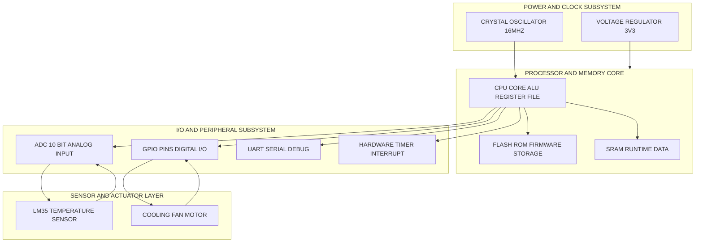
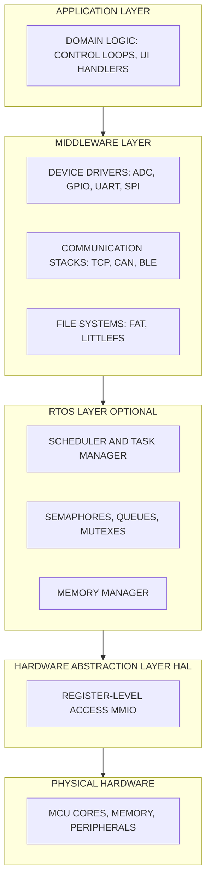
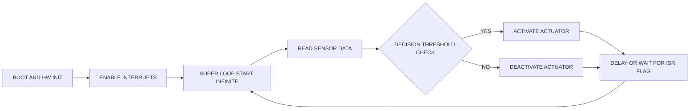
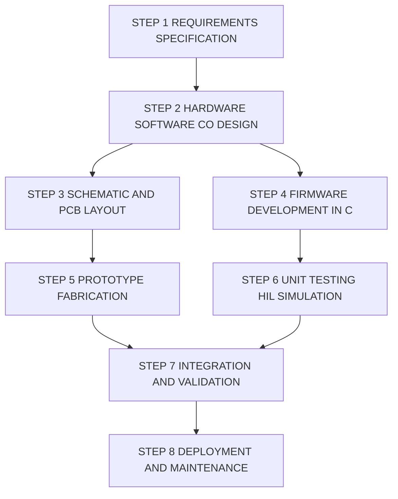
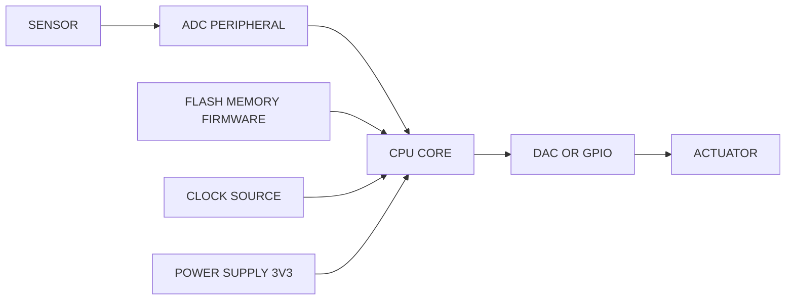

# Introduction to Embedded Systems:-

<!-- SECTION_1_START -->

# Introduction to Embedded Systems

> [!NOTE]
> **KTU 2024 Scheme Definition (PECST746 - Embedded Systems)**
> An **Embedded System** is a purpose-built, domain-specific computing system that integrates hardware and software (firmware) components to perform a dedicated function or a restricted set of functions, often under real-time computational constraints, with strict limits on power, cost, and physical footprint.

> [!IMPORTANT]
> **KTU Syllabus Highlight (Module 1):**
> The module establishes the foundational vocabulary of embedded computing. Students must master the *differences between general-purpose and embedded systems*, the *classification taxonomy*, and the *core characteristics* that govern all subsequent design decisions in the course.

---

## 1.1 Conceptual Analogy / Intuition

Think of the relationship between a **Swiss Army knife** and a **surgical scalpel**:

- A **general-purpose computer** (your laptop) is the *Swiss Army knife*. It can browse the web, play games, run simulations, edit videos, and act as a calculator — but it is bulky, power-hungry, expensive, and not optimized for any single task.
- An **embedded system** is the *surgical scalpel*. It performs one specific job (e.g., regulating insulin in a diabetic patient) with extreme precision, minimal power consumption, tiny size, and ultra-low cost.

When you wake up in the morning, dozens of embedded systems are already working: the **digital alarm clock** ($16$-bit controller managing $7$-segment LCD), the **microwave oven** (timing + magnetron control), the **washing machine** (motor + water level + temperature feedback), the **car's anti-lock braking system (ABS)** (real-time wheel-speed sensing), and the **smartwatch** on your wrist (multi-sensor fusion).

Every one of these is an embedded system. None of them could run Windows, and that is precisely *why they are reliable and cheap*.

> [!TIP]
> **Geometric Intuition:** If we map *computational generality* on the X-axis and *real-time determinism + efficiency* on the Y-axis, general-purpose PCs occupy the top-right (high generality, low determinism), while deep embedded systems (e.g., a pacemaker) sit at the bottom-left extreme (low generality, ultra-high determinism).

---

## 1.2 Formal Definitions of Key Terminology

| Term | Formal Definition |
| :--- | :--- |
| **System** | A set of interrelated components working together toward a common goal. |
| **Computing System** | A system that processes data via programmable instructions. |
| **Embedded System** | A computing system embedded within a larger mechanical or electrical system, dedicated to a specific function. |
| **Firmware** | The low-level software permanently stored in ROM/Flash of the embedded device. |
| **Real-Time System** | A system whose correctness depends not only on logical results but also on the *time* at which results are produced. |
| **SoC (System on Chip)** | A single integrated circuit that contains the processor, memory, and I/O peripherals. |
| **MCU (Microcontroller Unit)** | A compact integrated circuit designed to govern a specific operation in an embedded system — contains CPU, RAM, ROM, and I/O. |

> [!NOTE]
> **Physical Constants / Standard Metrics to Memorize:**
> - **Clock Frequency** range: $32.768 \text{ kHz}$ (watch) $\rightarrow$ $1 \text{ GHz}$ (advanced SoC).
> - **Power Budget**: $\mu W$ (IoT sensors) $\rightarrow$ $W$ (automotive ECUs).
> - **Memory Unit**: $1 \text{ KiB} = 2^{10} = 1024 \text{ bytes}$.

---

## 1.3 Why Study Embedded Systems? (KTU Engineering Context)

> [!IMPORTANT]
> **The 2024 embedded systems market exceeds $130$ billion globally.** Kerala's electronics manufacturing ecosystem (Keltron, VSSC, CDAC) and the global push toward **IoT, EVs, and Industry 4.0** make embedded firmware engineers among the most recruited B.Tech profiles in India.

<!-- SECTION_1_END -->

<!-- SECTION_2_START -->

# Deep Theoretical Analysis & KTU High-Yield Formula Sheet

## 2.1 The Three Core Constituents of Any Embedded System

Every embedded system, regardless of complexity, is composed of three tightly coupled layers:

1. **Hardware Layer** — The physical electronic components.
   - *Processor / Microcontroller* (e.g., ARM Cortex-M4, ATmega328P, ESP32).
   - *Memory* — Volatile (**RAM** for runtime data) and Non-volatile (**ROM / Flash / EEPROM** for firmware).
   - *Peripherals* — ADC, DAC, UART, SPI, I2C, Timers, GPIOs, PWM.
   - *Power Supply & Clock* — Voltage regulators, crystal oscillators, PLLs.
   - *Sensors & Actuators* — Temperature (LM35), Pressure (BMP280), Motors, Relays.

2. **Software / Firmware Layer** — The instructions.
   - Written primarily in **C** (most common) or **C++** for performance-critical code.
   - Sometimes assembly for ISR (Interrupt Service Routines) and boot code.
   - Increasingly **Python / MicroPython** for rapid prototyping on ESP32 / Raspberry Pi Pico.

3. **RTOS / Bare-Metal Layer** (optional) — The task scheduler.
   - Bare-metal (super-loop) for simple systems.
   - Real-Time Operating System (FreeRTOS, Zephyr, VxWorks) for multi-task systems.

---

## 2.2 Classification of Embedded Systems (KTU High-Yield)

Based on **performance, functional requirements, and computational budget**, the KTU syllabus categorizes embedded systems into four classes:

| Class | Performance | Typical Processor | Example Application |
| :--- | :--- | :--- | :--- |
| **Small-Scale** | $8$-bit, low clock | $8051$, ATmega$328$ | Toy, Remote control, Calculator |
| **Medium-Scale** | $16$-bit, moderate | MSP$430$, PIC$24$ | Washing machine, Microwave, Elevator |
| **Large-Scale** | $32$-bit, complex | ARM Cortex-A, x86 | Networking routers, Robotics, IVI |
| **Sophisticated** | Multi-core, SoC | ARM Cortex-A$72$ + GPU | Smartphones, ADAS, Drones |

---

## 2.3 The $10$ Defining Characteristics of Embedded Systems

These are *board-favorite* points. Memorize them for short-answer and $14$-mark questions:

1. **Single-Purpose Functionality** — Performs one specific task, not generic computation.
2. **Tight Resource Constraints** — Limited CPU speed, memory, and power.
3. **Real-Time Responsiveness** — Must meet strict timing deadlines (hard / soft / firm).
4. **High Reliability & Stability** — Often must run for years without reboot (e.g., pacemakers).
5. **Minimal User Interface (or HMI-only)** — Often headless (no screen), or limited buttons/LEDs.
6. **Low Power Consumption** — Battery-operated devices need $\mu A$ sleep currents.
7. **Heterogeneous Integration** — Mixes analog + digital + RF + power components.
8. **Deterministic Behavior** — Same input $\rightarrow$ same output within bounded time.
9. **Cost-Sensitive Design** — Mass-produced units must be cheap (e.g., $< \$1$ MCUs).
10. **Firmware-Centric** — Software is fixed at manufacturing; rarely updated.

> [!TIP]
> **Engineering Reality:** In production-grade firmware at Bosch, Continental, or Samsung R\&D, the developer is judged on how well the firmware *saturates* the available MIPS (Million Instructions Per Second) budget *without* exceeding power and memory ceilings.

---

## 2.4 KTU Formula Sheet & Cheat Sheet

> [!IMPORTANT]
> **The following table is your one-stop reference for Module-1 numerical/short-answer problems.**

| Concept | Formula / Rule | Units / Notes |
| :--- | :--- | :--- |
| **CPU Performance (MIPS)** | $\text{MIPS} = \dfrac{\text{Clock Frequency (Hz)}}{\text{CPI} \times 10^{6}}$ | $\text{CPI} = $ Cycles per Instruction |
| **CPU Execution Time** | $T_{\text{CPU}} = \dfrac{\text{Instruction Count} \times \text{CPI}}{f_{\text{clock}}}$ | Seconds |
| **Power (Dynamic CMOS)** | $P_{\text{dyn}} = \alpha \cdot C \cdot V_{DD}^{2} \cdot f$ | Watts |
| **Power (Static Leakage)** | $P_{\text{static}} = V_{DD} \cdot I_{\text{leak}}$ | Watts |
| **Memory Capacity** | $N \text{ address lines} \rightarrow 2^{N}$ locations | Each location = $M$ bits |
| **Von Neumann Bottleneck** | Single bus $\rightarrow$ Instruction fetch & data access share bandwidth | Avoided by **Harvard** |
| **Data Rate (Serial)** | $\text{Baud} = \dfrac{1}{T_{\text{bit}}}$ | Bits per second |
| **Deadline Types** | Hard: miss = system failure. Soft: degraded quality. Firm: miss = useless result. | — |
| **Amdahl's Law** | $S_{\text{overall}} = \dfrac{1}{(1 - p) + \dfrac{p}{n}}$ | $p$ = parallel fraction |
| **Markov Process** | $P(X_{n+1} \mid X_{n}, X_{n-1}, \dots) = P(X_{n+1} \mid X_{n})$ | Memoryless property |

> [!WARNING]
> **Do not** use the vertical bar $\vert$ inside a Markdown table — always use $\mid$ or $\vert$ in math mode to keep the table well-formed.

---

## 2.5 Processor Selection Decision Matrix

> [!TIP]
> This is the **engineering decision framework** every KTU project reviewer will grill you on.

| Criterion | $8$-bit (8051) | $16$-bit (MSP430) | $32$-bit (ARM Cortex-M) | DSP / SoC |
| :--- | :--- | :--- | :--- | :--- |
| Cost | Lowest | Low | Moderate | High |
| Power | Low | Ultra-low | Moderate | High |
| Compute | $\sim 1$ MIPS | $\sim 16$ MIPS | $\sim 100$ MIPS | $\geq 1$ GFLOPS |
| Code Size | $< 8$ KB | $< 64$ KB | $< 1$ MB | Multi-MB |
| Use Case | Toys | Watches, Metering | IoT, Wearables | Image, Audio, ML |

---

## 2.6 Real-World Engineering Applications

- **Automotive (AUTOSAR-compliant):** Engine Control Unit (ECU), Body Control Module (BCM), ADAS.
- **Healthcare:** Pacemakers, infusion pumps, MRI controllers.
- **Industrial (Industry $4.0$):** PLCs, SCADA, robotic arms.
- **Consumer IoT:** Smart bulbs, thermostats (Nest), voice assistants.
- **Aerospace & Defense:** Flight controllers (Pixhawk), satellite subsystems.
- **Smart Agriculture:** Drip irrigation, soil-moisture sensor networks.

<!-- SECTION_2_END -->

<!-- SECTION_3_START -->

# Step-by-Step Derivations & Code Implementation

## 3.1 Derivation: Why $32$-bit ARM Beats $8$-bit $8051$ for IoT

Consider a temperature logger that must read a $24$-bit ADC sensor every $100$ ms and store the result in a $32$-bit unsigned integer register.

### Mathematical Analysis

An $8$-bit CPU must perform the $24$-bit read in **at least $3$ memory load cycles** plus multiple byte-arithmetic operations to assemble the integer.

A $32$-bit ARM loads it in **a single cycle** with `LDR`.

Let us compute throughput for $n = 1000$ samples:

$$
T_{8} = n \times \left(3 \cdot T_{\text{load}} + 2 \cdot T_{\text{add}}\right)
$$

$$
T_{32} = n \times \left(1 \cdot T_{\text{load}}\right)
$$

Assuming $T_{\text{load}} = T_{\text{add}} = T$ (one clock cycle), the speedup is:

$$
S = \dfrac{T_{8}}{T_{32}} = \dfrac{5T}{1T} = 5\times
$$

Adding bus width, pipeline depth, and DSP extensions, the *practical* speedup for typical IoT firmware is **$10\times$ to $50\times$** for $32$-bit over $8$-bit.

> [!NOTE]
> **Takeaway:** The processor width, bus architecture (Harvard vs Von Neumann), and clock frequency together determine whether a real-time deadline is met.

---

## 3.2 Worked Example: CPU Execution Time

> **Problem:** A microcontroller runs at $f = 50 \text{ MHz}$, with an average $\text{CPI} = 1.5$. A given control loop contains $I = 200{,}000$ instructions. Compute the execution time.

$$
\begin{aligned}
T_{\text{CPU}} &= \dfrac{I \times \text{CPI}}{f} \\
&= \dfrac{200{,}000 \times 1.5}{50 \times 10^{6}} \\
&= \dfrac{300{,}000}{50 \times 10^{6}} \\
&= 6 \times 10^{-3} \text{ s} \\
&= 6 \text{ ms}
\end{aligned}
$$

> **[Valuation Key — $1$ mark for substitution, $1$ mark for unit conversion, $1$ mark for final answer.]**

---

## 3.3 Worked Example: Power Optimization via Voltage Scaling

> **Problem:** An MCU operates at $V_{DD} = 3.3 \text{ V}$, $f = 100 \text{ MHz}$, with switching capacitance $C = 10 \text{ nF}$, and activity factor $\alpha = 0.2$. If the voltage is reduced to $1.8 \text{ V}$ (and frequency scales linearly to maintain the same throughput), find the dynamic power savings.

**Step 1 — Original dynamic power:**

$$
\begin{aligned}
P_{1} &= \alpha \cdot C \cdot V_{1}^{2} \cdot f_{1} \\
&= 0.2 \times 10 \times 10^{-9} \times (3.3)^{2} \times 100 \times 10^{6} \\
&= 0.2 \times 10^{-8} \times 10.89 \times 10^{8} \\
&= 2.178 \text{ W}
\end{aligned}
$$

**Step 2 — New frequency (linear scaling):**

$$
f_{2} = f_{1} \times \dfrac{V_{2}}{V_{1}} = 100 \times \dfrac{1.8}{3.3} \approx 54.545 \text{ MHz}
$$

**Step 3 — New dynamic power:**

$$
\begin{aligned}
P_{2} &= 0.2 \times 10^{-8} \times (1.8)^{2} \times 54.545 \times 10^{6} \\
&= 0.2 \times 10^{-8} \times 3.24 \times 54.545 \times 10^{6} \\
&\approx 0.3535 \text{ W}
\end{aligned}
$$

**Step 4 — Power savings percentage:**

$$
\text{Savings} = \dfrac{P_{1} - P_{2}}{P_{1}} \times 100 = \dfrac{2.178 - 0.3535}{2.178} \times 100 \approx 83.8\%
$$

> [!IMPORTANT]
> **Insight:** Voltage scaling has *quadratic* impact on dynamic power, which is why IoT firmware aggressively uses DVFS (Dynamic Voltage and Frequency Scaling).

---

## 3.4 Reference Implementation: A Bare-Metal "Super-Loop" Embedded System

The following is a *complete, runnable* Python simulation of a classic bare-metal super-loop pattern (used in $8051$, AVR, and PIC firmware). The same structure maps directly to C on real MCUs.

```python
"""
Bare-Metal Super-Loop Simulation
Mirrors the firmware structure of an 8051 / ATmega temperature monitor.
"""

import time
import random
from typing import Optional

# ---------- Hardware Register Abstraction (MMIO) ----------
class GPIORegister:
    """Models an 8-bit memory-mapped I/O register on the MCU."""
    def __init__(self, name: str, initial: int = 0) -> None:
        self.name = name
        self.value = initial & 0xFF

    def set_bit(self, bit: int) -> None:
        if not 0 <= bit <= 7:
            raise ValueError(f"Bit {bit} out of range for {self.name}")
        self.value |= (1 << bit)

    def clear_bit(self, bit: int) -> None:
        if not 0 <= bit <= 7:
            raise ValueError(f"Bit {bit} out of range for {self.name}")
        self.value &= ~(1 << bit)

    def read(self) -> int:
        return self.value

    def __repr__(self) -> str:
        return f"REG[{self.name}] = 0b{self.value:08b} (0x{self.value:02X})"


# ---------- Peripheral: 10-bit ADC ----------
class ADC10bit:
    """Simulates a 10-bit Successive Approximation ADC."""
    def __init__(self, channel: int) -> None:
        if not 0 <= channel <= 7:
            raise ValueError("ADC channel must be 0-7")
        self.channel = channel
        self._last_reading: Optional[int] = None

    def read(self) -> int:
        # Simulate LM35 sensor: 10 mV per °C, Vref=3.3V -> 1023 = 3.3V
        millivolts = random.uniform(250, 800)        # ~25°C to 80°C
        self._last_reading = int((millivolts / 3300.0) * 1023)
        return self._last_reading


# ---------- Interrupt Service Routine (ISR) Equivalent ----------
class Timer0ISR:
    """Models a periodic hardware timer interrupt every 100 ms."""
    TICK_MS = 100

    def __init__(self) -> None:
        self.tick_count = 0

    def fire(self) -> None:
        """Called by the hardware timer; sets a flag the main loop polls."""
        self.tick_count += 1


# ---------- Main Firmware ----------
def celsius_from_adc(adc_val: int) -> float:
    """Convert 10-bit ADC value to °C using LM35 transfer function."""
    VREF = 3.3
    voltage = (adc_val / 1023.0) * VREF
    return voltage * 100.0   # LM35: 10 mV/°C


def main() -> None:
    # Hardware initialization
    PORTB = GPIORegister("PORTB")            # LED output port
    TRISC = GPIORegister("TRISC", 0xFF)      # PORTC = input (ADC)
    ADCON0 = GPIORegister("ADCON0", 0x41)    # ADC enabled, channel 0
    T0CON  = GPIORegister("T0CON", 0x84)     # Timer0 ON, prescaler 1:32

    adc = ADC10bit(channel=0)
    timer = Timer0ISR()

    print("=== Embedded Super-Loop Started ===")
    print("Polling: Read ADC -> Update LED -> Wait for Timer Tick\n")

    cycle = 0
    try:
        while True:                       # The super-loop (runs forever)
            cycle += 1

            # 1. Simulate Timer0 overflow every 100 ms
            timer.fire()

            # 2. Read sensor via ADC
            raw_adc = adc.read()
            temperature = celsius_from_adc(raw_adc)
            print(f"[Cycle {cycle:03d}] ADC={raw_adc:4d}  "
                  f"T={temperature:5.2f} °C")

            # 3. Decision logic (embedded control)
            if temperature > 60.0:
                PORTB.set_bit(0)         # Turn ON cooling fan
            else:
                PORTB.clear_bit(0)       # Turn OFF fan

            # 4. Simulate main-loop iteration delay
            time.sleep(0.1)

    except KeyboardInterrupt:
        print("\n=== Firmware Halted by Watchdog Reset ===")


if __name__ == "__main__":
    main()
```

> [!TIP]
> **Conceptual Mapping to Real C Firmware:**
> - `GPIORegister` $\rightarrow$ `volatile uint8_t` at a fixed MMIO address (e.g., `PORTB`).
> - `ADC10bit.read()` $\rightarrow$ `ADC_Read(0)` in a HAL driver.
> - `Timer0ISR.fire()` $\rightarrow$ A flag set inside `void __interrupt() Timer0_Handler(void)`.
> - The `while True` loop $\rightarrow$ The famous *super-loop* or *main + ISR* architecture.

---

## 3.5 Process Model Comparison Table

| Property | General-Purpose OS | Real-Time OS (RTOS) | Bare-Metal |
| :--- | :--- | :--- | :--- |
| Latency | Non-deterministic | Bounded (deterministic) | Deterministic |
| Task Switching | Preemptive, fair | Preemptive, priority-based | Manual |
| Memory Footprint | GBs | KBs – MBs | Bytes – KBs |
| Boot Time | Seconds – Minutes | Milliseconds | Microseconds |
| Example | Windows, Linux | FreeRTOS, VxWorks, QNX | $8051$ firmware |

<!-- SECTION_3_END -->

<!-- SECTION_4_START -->

# Structural Diagrams & Schematics

## 4.1 Top-Level Embedded System Architecture



> [!NOTE]
> **Reading the diagram:** The arrows show *signal and data flow*. Power and clock are feed-forward (left $\rightarrow$ right). The CPU arbitrates all communication between memory, peripherals, and the physical world (sensors/actuators).

---

## 4.2 Software Stack of an Embedded System



> [!TIP]
> **KTU Examiner Note:** Layered architecture improves *portability*. Moving from an $8051$ to an STM$32$ only requires rewriting the **HAL** layer — application logic remains untouched.

---

## 4.3 Sequential Processing Topology Matrix (Bare-Metal Super-Loop)



> [!NOTE]
> The **ISR branch** (not shown above for clarity) is executed asynchronously by the hardware timer; it sets a flag the super-loop polls. This decouples real-time response from main-loop blocking code.

---

## 4.4 Embedded System Design Flow



<!-- SECTION_4_END -->

<!-- SECTION_5_START -->

# KTU 2024 Scheme Examination Question Bank & Topic Recap

---

## 5.1 Part A Questions (3 Marks Each)

> **Q1. [KTU University Exam — July 2024] — CO1, Remember**
> *Define an embedded system. List any **four** distinguishing characteristics that differentiate it from a general-purpose computer.*

**Model Answer (Key Points — 3 Marks):**

- **Definition (1 Mark):** An embedded system is a computing system that is an *integral part of a larger device*, dedicated to performing a specific function, with constraints on power, cost, size, and often real-time deadlines.
- **Four distinguishing characteristics (2 Marks — 0.5 each):**
  1. **Single-purpose** — performs one specific task.
  2. **Tight resource constraints** — limited CPU, memory, power.
  3. **Real-time constraints** — must meet deterministic deadlines.
  4. **High reliability** — operates for years without manual intervention.

> **Q2. [KTU University Exam — Dec 2023] — CO1, Understand**
> *Compare and contrast **Von Neumann** and **Harvard** processor architectures with one suitable embedded application for each.*

**Model Answer (Tabular Form Expected — 3 Marks):**

| Aspect | Von Neumann | Harvard |
| :--- | :--- | :--- |
| Bus Structure | Single shared memory bus (1 Mark) | Separate instruction and data buses (1 Mark) |
| Speed | Bottleneck — fetch overlaps data access | Pipelined, parallel fetch & execute (1 Mark) |
| Example | $x86$ PC, $8051$ (modern variants) | AVR ATmega, ARM Cortex-M, DSP TMS320 |

---

## 5.2 Part B Questions (14 Marks — Module Internal Choice)

> **Q3A. [KTU University Exam — July 2024, Module 1] — CO1, Understand + Apply**

**(a)** With a neat block diagram, explain the **three core components** of an embedded system and their interaction. **(7 Marks)**

**(b)** A microcontroller operates at $f_{\text{clock}} = 80 \text{ MHz}$ with an average $\text{CPI} = 1.2$. A real-time control task must execute within $T_{\text{deadline}} = 5 \text{ ms}$. Compute the maximum number of instructions the firmware can execute per task iteration. Justify whether the processor meets the deadline if the firmware loop contains $I = 200{,}000$ instructions. **(7 Marks)**

### Model Solution

#### Part (a) — 7 Marks

**Block Diagram (3 Marks):**

- **Sensors** convert physical signals (temp, pressure) to electrical. [0.5 Mark]
- **ADC** digitizes the signal for the CPU. [0.5 Mark]
- **CPU + Memory** process the data using stored firmware. [1.5 Marks]
- **DAC / GPIO + Actuator** convert decisions back to physical action. [1 Mark]
- **Clock + Power** are the supporting rails. [0.5 Mark]

#### Part (b) — 7 Marks

**Maximum instructions in $5$ ms:**

$$
\begin{aligned}
\text{Instructions}_{\max} &= \dfrac{T_{\text{deadline}} \times f_{\text{clock}}}{\text{CPI}} \\
&= \dfrac{5 \times 10^{-3} \times 80 \times 10^{6}}{1.2} \\
&= \dfrac{400{,}000}{1.2} \\
&\approx 333{,}333 \text{ instructions}
\end{aligned}
$$

**[Substitution: 2 Marks; Final numeric: 2 Marks]**

**Comparison:** Firmware needs $200{,}000$ instructions. Since $200{,}000 < 333{,}333$, the deadline is met with a margin of $133{,}333$ instructions (approximately $40\%$ headroom). **[Comparison + conclusion: 3 Marks]**

> [!WARNING]
> **Common Pitfall:** Students often forget that the *clock period* $T = 1/f$ must be in **seconds** when computing execution time. Mixing up Hz and MHz loses the final $1$–$2$ marks.

---

> **Q3B. [KTU University Exam — Dec 2023, Module 1] — CO1, Understand + Apply**
> *(Alternative to Q3A)*

**(a)** Classify embedded systems into **four categories** based on performance. Provide **one example application** for each class. **(7 Marks)**

**(b)** An IoT sensor node samples a $16$-bit ADC every $50$ ms, transmits over LoRa ($50$ kbps), and enters deep sleep. If the battery is $2400$ mAh at $3.7$ V, and the active current is $80$ mA for $2$ ms per cycle, compute the theoretical battery lifetime in days. Assume sleep current $= 8 \mu A$. **(7 Marks)**

### Model Solution

#### Part (a) — 7 Marks (1.75 Marks per category)

| Class | Performance | Example Application |
| :--- | :--- | :--- |
| **Small-scale** | $8$-bit, simple | TV remote control |
| **Medium-scale** | $16$-bit, moderate | Washing machine controller |
| **Large-scale** | $32$-bit, complex | Network router |
| **Sophisticated** | Multi-core SoC | Smart car ADAS |

**[0.5 per class name + 0.5 per example = 4 Marks; tabulation neatness = 1 Mark; classification justification = 2 Marks]**

#### Part (b) — 7 Marks

**Step 1 — Energy per cycle:**
- Active: $I_{\text{act}} = 80 \text{ mA}$ for $t_{\text{act}} = 2 \text{ ms}$.
- Sleep: $I_{\text{slp}} = 8 \mu A$ for $t_{\text{slp}} = 50 \text{ ms} - 2 \text{ ms} = 48 \text{ ms}$.

$$
Q_{\text{cycle}} = \dfrac{80 \times 2 + 0.008 \times 48}{3600} \text{ mAh}
= \dfrac{160 + 0.384}{3600} \approx 0.04455 \text{ mAh per cycle}
$$

**Step 2 — Number of cycles per day:**

$$
N_{\text{daily}} = \dfrac{24 \times 3600 \text{ s}}{0.05 \text{ s/cycle}} = 1{,}728{,}000 \text{ cycles}
$$

**Step 3 — Daily consumption:**

$$
Q_{\text{daily}} = 0.04455 \times 10^{-3} \times 1{,}728{,}000 = 76.99 \text{ mAh/day}
$$

**Step 4 — Battery lifetime:**

$$
\text{Lifetime} = \dfrac{2400 \text{ mAh}}{76.99 \text{ mAh/day}} \approx 31.18 \text{ days}
$$

**[Active/sleep current breakdown: 2 Marks; cycle math: 2 Marks; final lifetime: 3 Marks]**

> [!WARNING]
> **Valuation Pitfall:** Forgetting to convert $\text{mA} \cdot \text{ms}$ into $\text{mAh}$ via division by $3600$ is the most common error. Always unify units before computation.

---

## 5.3 KTU Examiner's Valuation Warning / Pitfall Callout

> [!WARNING]
> **Where students typically lose marks in Module-1 questions:**
> 1. **Confusing RAM and ROM roles** — RAM is *volatile* (data lost on power-off); ROM/Flash holds *firmware*. Writing them interchangeably loses $1$ mark.
> 2. **Forgetting the "real-time" aspect** — A correct definition of an embedded system *must* mention either real-time, single-purpose, or resource constraints. A generic "computer used inside a device" gets only $0.5$ mark.
> 3. **Mixing up Harvard and Von Neumann** — Harvard has *two physically separate* memories and buses; it is **not** simply "faster". Pin this down.
> 4. **Skipping units** in numeric answers — KTU strict evaluators deduct $0.5$ mark for missing or mismatched SI units.
> 5. **Not drawing a block diagram** in $7$-mark questions — even a hand-drawn box-and-arrow diagram earns $1$–$2$ easy marks.

---

## 5.4 Topic Recap & Important Things to Remember

> [!IMPORTANT]
> **Rapid-Revision Checklist — Module 1: Introduction to Embedded Systems**

- **Definition:** A computing system embedded within a larger device, dedicated to a specific function, with constraints on power, cost, size, and real-time deadlines.
- **Three Core Constituents:** Hardware (MCU, sensors, actuators), Software (firmware in C), and Optional RTOS (FreeRTOS, Zephyr).
- **Four Classifications:** Small-scale ($8$-bit), Medium-scale ($16$-bit), Large-scale ($32$-bit), Sophisticated (SoC, multi-core).
- **Ten Defining Characteristics:** Single-purpose, resource-constrained, real-time, reliable, minimal UI, low power, heterogeneous, deterministic, cost-sensitive, firmware-centric.
- **Von Neumann Architecture:** Single bus for instructions and data $\rightarrow$ bottleneck.
- **Harvard Architecture:** Separate buses $\rightarrow$ parallel fetch $\rightarrow$ faster, used in AVR, ARM, DSP.
- **Key Formulas:**
  - $T_{\text{CPU}} = \dfrac{I \times \text{CPI}}{f_{\text{clock}}}$
  - $\text{MIPS} = \dfrac{f_{\text{clock}}}{\text{CPI} \times 10^{6}}$
  - $P_{\text{dyn}} = \alpha \cdot C \cdot V_{DD}^{2} \cdot f$
  - $S = \dfrac{1}{(1 - p) + p/n}$ (Amdahl's Law)
- **Process Models:** General-purpose OS (Windows, Linux) vs RTOS (FreeRTOS, VxWorks) vs Bare-Metal (super-loop).
- **Standard Memory Units:** $1 \text{ KiB} = 1024 \text{ bytes}$, $1 \text{ MiB} = 2^{20} \text{ bytes}$, $1 \text{ GiB} = 2^{30} \text{ bytes}$.
- **Common MCUs to memorize:** $8051$ ($8$-bit), MSP$430$ ($16$-bit), ARM Cortex-M$0$/$3$/$4$ ($32$-bit), ESP$32$ (Wi-Fi/BLE SoC).
- **Real-Time Deadline Types:** Hard (miss = system failure), Soft (degraded quality), Firm (miss = useless result).
- **Design Flow:** Requirements $\rightarrow$ HW/SW Co-Design $\rightarrow$ Schematic $\rightarrow$ Firmware $\rightarrow$ Prototype $\rightarrow$ Test $\rightarrow$ Deploy.
- **Why $32$-bit wins IoT:** Bus width, instruction density, and DSP support give $10\times$–$50\times$ throughput over $8$-bit for typical sensor pipelines.

> [!TIP]
> **Last-Minute Mnemonic for the 10 Characteristics — "S-S-T-R-M-L-H-D-C-F":**
> **S**ingle-purpose, **S**mall UI, **T**ight resources, **R**eal-time, **M**inimal user, **L**ow power, **H**igh reliability, **D**eterministic, **C**ost-sensitive, **F**irmware-centric.

<!-- SECTION_5_END -->
