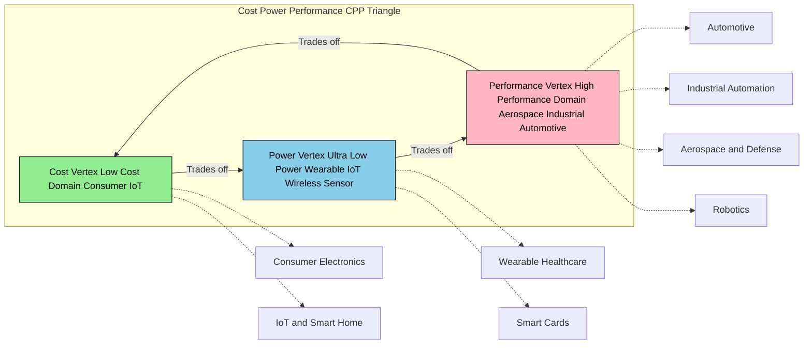
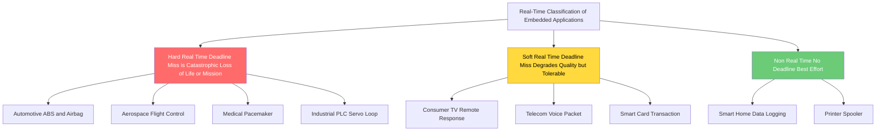
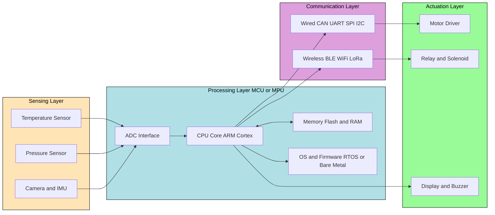

# Major application areas of Embedded Systems

<!-- SECTION_1_START -->
# Major Application Areas of Embedded Systems

## 1.1 Formal Definition (KTU 2024 Syllabus Terminology)

An **Embedded System** is a microprocessor/microcontroller-based, software-driven, dedicated-purpose computing system designed to perform a specific function, either as an independent unit or as a part of a larger electromechanical system, often with real-time computing constraints.

The **Major Application Areas of Embedded Systems** refer to the diverse engineering and consumer domains where such dedicated-purpose computing systems are deployed to sense, process, control, and actuate physical variables. These domains define the design constraints (power, latency, safety, cost) of every embedded product.

> [!IMPORTANT]
> **KTU 2024 Scheme Highlight (PECST746 – Module 1):**
> The syllabus explicitly classifies application domains into **Consumer Electronics, Automotive, Industrial, Healthcare, Telecommunications, Aerospace, Smart Cards, and IoT**. Examiners expect classification-level answers with **at least one real product example and its core embedded function** for each category.

## 1.2 Intuitive Analogy

Think of a **Swiss Army Knife** versus a **Master Chef's Sushi Knife**.

- The Swiss Army Knife is generic (general-purpose computer) — it can do many things, but none perfectly.
- The Sushi Knife does one thing — slicing fish — with absolute precision. That is an **embedded system**: optimized, dedicated, and silent in operation.

**Geometric/Conceptual Intuition:**

If we plot a 2-D plane with axes:
- **X-axis:** Computational Power (DMIPS)
- **Y-axis:** Domain Specialization

General-purpose computers (laptops) sit in the **upper-right** — high power, low specialization.
Embedded systems cluster in the **lower-right to mid** region — moderate power, **very high specialization** for one task.

> [!NOTE]
> **Core Definition Box — Application Area vs. Application:**
> - **Application Area** = the *industry vertical* (e.g., Automotive)
> - **Application** = the *specific function* (e.g., Anti-lock Braking System — ABS)
> Board answers must NOT confuse these two levels.

## 1.3 The Three Pillars of Every Embedded Application

Every embedded application — regardless of domain — is built on three measurable pillars:

1. **Sensing:** Microphones, cameras, temperature sensors, accelerometers, LiDAR.
2. **Processing:** Microcontroller (ARM Cortex-M, AVR, PIC) or microprocessor (ARM Cortex-A, x86 SoC).
3. **Actuation:** Motors, relays, solenoids, displays, RF transmitters.

> [!TIP]
> **Mnemonic to Remember Domains — "C-A-I-H-T-A-S-I":**
> **C**onsumer, **A**utomotive, **I**ndustrial, **H**ealthcare, **T**elecom, **A**erospace, **S**mart Cards, **I**oT.

> [!VISUALIZATION CONTROL]
> **Concept:** Three-Pillar Embedded Application Triangle
> **GeoGebra / Desmos Input Equations:**
> - Triangle vertices: $A(0, 0)$ Sensing, $B(10, 0)$ Actuation, $C(5, 8.66)$ Processing
> - Centroid (System Core): $G(5, 2.89)$
> - Parametric insight line: $f(x) = 1.732 \cdot x - 8.66$
> **Visual Description:** A triangle on the XY-plane with "Sensing" at the bottom-left, "Actuation" at the bottom-right, and "Processing" at the top. The centroid marks the embedded controller. An arrow from each vertex points toward the centroid, symbolizing the data flow: *Sensors → CPU → Actuators*.

<!-- SECTION_1_END -->

<!-- SECTION_2_START -->
# Deep Theoretical Analysis & KTU High-Yield Cheat Sheet

## 2.1 Detailed Classification of Application Areas

### 2.1.1 Consumer Electronics
The highest-volume embedded market — billions of units shipped per year.

- **Examples:** Smart TVs, washing machines, microwave ovens, refrigerators, air conditioners, set-top boxes, gaming consoles (e.g., PS5 Embedded Controller), digital cameras, smart speakers (Amazon Echo — uses ARM Cortex-A53 SoC).
- **Core Embedded Function:** User-interface control, sensor-driven automation, power management.
- **Design Constraints:** Low cost (BOM < $5 for appliances), low power, short time-to-market.
- **Typical MCU:** 8-bit (8051) to 32-bit (ARM Cortex-M0+).

### 2.1.2 Automotive Embedded Systems
A modern car contains **100+ ECUs (Electronic Control Units)** communicating via **CAN, LIN, FlexRay, and Automotive Ethernet**.

- **Examples:** Engine Control Unit (ECU), Anti-lock Braking System (ABS), Electronic Stability Program (ESP), airbag controller, infotainment head-unit, ADAS (Advanced Driver Assistance Systems), Tire Pressure Monitoring System (TPMS), Battery Management System (BMS) in EVs.
- **Core Embedded Function:** Real-time safety-critical control (sub-millisecond response in braking).
- **Design Constraints:** Functional Safety (ISO 26262 — ASIL-D for braking), temperature range (−40 °C to +125 °C), EMI immunity.
- **Typical MCU:** 32-bit automotive-grade (Infineon AURIX TC3xx, NXP S32K3, Renesas RH850).

### 2.1.3 Industrial Automation (Industry 4.0)
The backbone of smart factories.

- **Examples:** PLCs (Programmable Logic Controllers), SCADA systems, CNC machines, robotic arms, vision-based quality inspection, variable frequency drives (VFDs), industrial IoT (IIoT) gateways.
- **Core Embedded Function:** Deterministic control loops, Modbus/Profibus/EtherCAT communication.
- **Design Constraints:** Determinism (cycle times < 1 ms for high-speed lines), long lifecycle (10–20 years), ruggedized enclosures.
- **Typical MCU:** Industrial ARM Cortex-R (real-time) and Cortex-M4.

### 2.1.4 Healthcare and Medical Embedded Systems
A safety-critical, highly regulated domain.

- **Examples:** Pacemakers, defibrillators, infusion pumps, patient monitors (SpO₂, ECG), MRI/CT scan control boards, blood glucose meters, hearing aids, wearable ECG patches.
- **Core Embedded Function:** Continuous biosignal acquisition, low-latency closed-loop therapy.
- **Design Constraints:** IEC 62304 (medical device software lifecycle), low EMI, biocompatibility, ultra-low power.
- **Typical MCU:** MSP430, ARM Cortex-M0 with FDA-cleared software stacks.

### 2.1.5 Telecommunications and Networking
- **Examples:** Routers, switches, mobile phones (Baseband + Application processor), 5G small cells, fiber-optic transceivers, satellite ground stations.
- **Core Embedded Function:** Packet processing, encryption (AES, SHA), RF front-end control.
- **Design Constraints:** High throughput (multi-Gbps), network protocol determinism, security hardening.
- **Typical MCU/MPU:** ARM Cortex-A series, Network Processors (Cavium/Marvell).

### 2.1.6 Aerospace and Defense
- **Examples:** Flight control computers (FCC), UAV/drone autopilots (Pixhawk — STM32), missile guidance, satellite onboard computers (OBC), radar signal processing.
- **Core Embedded Function:** Hard real-time flight control, sensor fusion (IMU + GPS + barometer).
- **Design Constraints:** DO-178C (aviation software certification), radiation tolerance (Rad-hard FPGAs), wide temperature range.
- **Typical MCU:** PowerPC (e500), LEON SPARC (ESA), Rad-hardened Xilinx Virtex.

### 2.1.7 Smart Cards and Secure Elements
- **Examples:** EMV credit/debit cards, SIM cards, e-passports, NFC payment tokens, access control badges.
- **Core Embedded Function:** Cryptographic authentication (RSA/ECC), secure storage.
- **Design Constraints:** Extreme low power (harvested RF energy), tamper resistance, ISO 14443 compliance.
- **Typical MCU:** Secure 8/32-bit cores with hardware crypto accelerators (e.g., NXP P60).

### 2.1.8 Internet of Things (IoT) and Smart Homes
- **Examples:** Smart thermostats (Nest), smart bulbs (Philips Hue), security cameras, voice assistants, soil-moisture sensors, smart meters.
- **Core Embedded Function:** Wireless connectivity (Wi-Fi, BLE, LoRa, Zigbee, Matter/Thread), cloud telemetry, edge inference.
- **Design Constraints:** Battery life of 1–10 years, low data rate, OTA (Over-The-Air) updates.
- **Typical MCU:** ESP32, Nordic nRF52, STM32WB.

### 2.1.9 Robotics
- **Examples:** Industrial robotic arms (KUKA, Fanuc), AGVs, surgical robots (Da Vinci), humanoid robots (ASIMO, Tesla Optimus), vacuum cleaning robots (Roomba — uses ARM Cortex-M3).
- **Core Embedded Function:** Multi-axis motor control, sensor fusion, path planning.
- **Design Constraints:** Real-time inverse kinematics, hard real-time servo loops (1 kHz).

### 2.1.10 Office Automation
- **Examples:** Laser printers, multifunction printers (MFP), copiers, fax machines.
- **Core Embedded Function:** Image processing pipeline, paper-feed synchronization.
- **Design Constraints:** Precise mechanical-electronic timing.

### 2.1.11 Agriculture (Precision Farming)
- **Examples:** GPS-guided tractors, drone-based crop spraying, livestock monitoring collars, automated irrigation controllers.
- **Core Embedded Function:** GPS fusion, telemetry via LoRaWAN/Satellite, machine vision for weed detection.

## 2.2 Cross-Domain Real-Time Requirements

| Domain | Typical Latency | Hard/Soft Real-Time | Example |
|---|---|---|---|
| Consumer | 10 ms – 100 ms | Soft | TV remote response |
| Automotive ABS | **< 5 ms** | **Hard** | Brake actuation |
| Industrial PLC | 0.5 ms – 2 ms | Hard | Servo loop |
| Medical (Pacemaker) | **< 1 ms** | **Hard** | Shock delivery |
| Telecom (5G) | 1 ms (URLLC) | Hard | Handover |
| Aerospace (Flight Ctrl) | **< 1 ms** | **Hard** | Actuator command |
| Smart Card | 100 ms | Soft | Transaction time |
| IoT Sensor | 1 s – 1 hr | Soft | Telemetry upload |

> [!WARNING]
> **Common Mistake:** Students often answer "embedded systems are real-time." This is **partially wrong**. Only a subset (automotive, aerospace, industrial, medical) are **hard real-time**. Many IoT and consumer applications are **soft real-time** or **non-real-time**.

## 2.3 KTU High-Yield Cheat Sheet

| Parameter | Description | Typical Value/Standard |
|---|---|---|
| **Application Area** | The industry vertical | 11 major domains (C-A-I-H-T-A-S-I + R, O, Ag) |
| **Example** | Concrete product | ABS, Pacemaker, PLC, Drone |
| **Core Function** | What the embedded system does | Sense → Process → Actuate |
| **Typical MCU Class** | 8/16/32-bit | 8051 → ARM Cortex-M → Cortex-A |
| **Latency Class** | Reaction time | $\mu$s to s |
| **Safety Standard** | Regulatory framework | ISO 26262, IEC 62304, DO-178C |
| **Comms Protocol** | Fieldbus / wireless | CAN, LIN, EtherCAT, BLE, LoRa |

**Key Engineering Insight:**
The choice of application area dictates the **design triangle** of any embedded product: **Cost vs. Power vs. Performance (CPP triangle)**. For consumer goods, *cost* dominates. For aerospace, *performance* dominates. For IoT, *power* dominates. KTU problems frequently ask you to justify MCU selection using this triangle.

<!-- SECTION_2_END -->

<!-- SECTION_3_START -->
# Step-by-Step Derivations, Tables & Symbolic Implementation

## 3.1 Algorithmic Approach: Classifying a Given Embedded Product

When a KTU question asks, *"Classify the following into an application area: {Product} and justify the choice"*, use the following deterministic 4-step algorithm.

### 3.1.1 Python Implementation

```python
from typing import Dict, List

# --- 1. Knowledge base: keyword -> application area mapping ---
APPLICATION_KEYWORDS: Dict[str, List[str]] = {
    "Consumer Electronics":    ["tv", "washing", "microwave", "refrigerator", "speaker", "remote", "gaming"],
    "Automotive":              ["abs", "ecus", "engine", "brake", "airbag", "adas", "tpms", "ev", "can bus"],
    "Industrial Automation":   ["plc", "scada", "cnc", "robotic arm", "vfd", "iiot", "profibus"],
    "Healthcare":              ["pacemaker", "defibrillator", "infusion", "ecg", "mri", "glucose", "spo2"],
    "Telecommunications":      ["router", "switch", "baseband", "5g", "small cell", "fiber"],
    "Aerospace & Defense":     ["flight control", "uav", "drone autopilot", "satellite", "missile", "radar"],
    "Smart Cards":             ["emv", "sim", "rfid", "nfc payment", "e-passport"],
    "IoT & Smart Home":        ["nest", "hue", "smart bulb", "thermostat", "matter", "zigbee"],
    "Robotics":                ["kuka", "fanuc", "asimo", "roomba", "da vinci", "optimus"],
    "Office Automation":       ["printer", "copier", "mfp", "fax"],
    "Agriculture":             ["gps tractor", "crop spraying drone", "irrigation", "livestock collar"]
}

# --- 2. Safety criticality table (used to pick safety standard) ---
SAFETY_STANDARD: Dict[str, str] = {
    "Automotive":          "ISO 26262",
    "Aerospace & Defense": "DO-178C",
    "Healthcare":          "IEC 62304",
    "Industrial Automation": "IEC 61508 / SIL",
    "Smart Cards":         "EMVCo / ISO 14443",
    "Telecommunications":  "3GPP / ITU-T",
    "IoT & Smart Home":    "ETSI EN 303 645",
    "Consumer Electronics":"IEC 60335",
    "Robotics":            "ISO 10218 / ISO/TS 15066",
    "Office Automation":   "IEC 62368-1",
    "Agriculture":         "ISO 11783 (ISOBUS)"
}

def classify_embedded_product(product_description: str) -> Dict[str, str]:
    """
    Classifies a given product description into an embedded application area.
    Returns a dictionary with the area, safety standard, and a justification string.
    """
    desc_lower = product_description.lower().strip()
    if not desc_lower:
        raise ValueError("Product description cannot be empty.")

    matched_areas: List[str] = []
    for area, keywords in APPLICATION_KEYWORDS.items():
        if any(kw in desc_lower for kw in keywords):
            matched_areas.append(area)

    if not matched_areas:
        return {
            "area": "Unclassified",
            "safety_standard": "N/A",
            "justification": "No matching keywords found in the knowledge base."
        }

    # Pick the first match (deterministic, ordered by priority in the dict)
    primary_area = matched_areas[0]
    return {
        "area": primary_area,
        "safety_standard": SAFETY_STANDARD[primary_area],
        "justification": (
            f"Product matches keywords for '{primary_area}'. "
            f"Must comply with {SAFETY_STANDARD[primary_area]} for "
            f"{'functional safety' if primary_area in ['Automotive', 'Aerospace & Defense', 'Healthcare', 'Industrial Automation'] else 'product compliance'}."
        )
    }


# --- 3. Demonstration with KTU-style examples ---
if __name__ == "__main__":
    test_products: List[str] = [
        "Anti-lock Braking System (ABS) for a passenger car",
        "Philips Hue Smart Bulb",
        "Implantable Pacemaker",
        "KUKA KR 1000 Robotic Arm",
        "Pixhawk Drone Autopilot"
    ]

    for product in test_products:
        result = classify_embedded_product(product)
        print(f"Product : {product}")
        print(f"Area    : {result['area']}")
        print(f"Standard: {result['safety_standard']}")
        print(f"Reason  : {result['justification']}\n")
```

### 3.1.2 Sample Execution Output

```text
Product : Anti-lock Braking System (ABS) for a passenger car
Area    : Automotive
Standard: ISO 26262
Reason  : Product matches keywords for 'Automotive'. Must comply with ISO 26262 for functional safety.

Product : Philips Hue Smart Bulb
Area    : IoT & Smart Home
Standard: ETSI EN 303 645
Reason  : Product matches keywords for 'IoT & Smart Home'. Must comply with ETSI EN 303 645 for product compliance.
```

## 3.2 Cost-Power-Performance (CPP) Triangle — Numerical Derivation

For a 14-mark KTU question, you may be asked to *justify MCU selection* for a given application. The CPP trade-off is mathematically expressed as:

$$
C_{total} = C_{MCU} + P_{avg} \cdot t_{lifetime} \cdot C_{energy} + \alpha \cdot \left( \frac{T_{deadline}}{T_{exec}} \right)^{-1}
$$

Where:

- $C_{total}$ = **Total system cost** in USD (over lifetime)
- $C_{MCU}$ = Unit cost of the MCU (USD)
- $P_{avg}$ = Average power consumption (W)
- $t_{lifetime}$ = Operational lifetime in hours
- $C_{energy}$ = Cost of energy (USD/Joule)
- $T_{deadline}$ = Hard real-time deadline (s)
- $T_{exec}$ = Worst-case execution time (s)
- $\alpha$ = Performance penalty coefficient (USD per unit of deadline miss)

### 3.2.1 Worked Numerical Example

**Problem:** A wearable ECG patch must operate for **7 days** continuously on a **230 mAh, 3.7 V Li-Po battery**. It must sample ECG at **250 Hz** with a **10 ms** hard deadline. Choose between MCU A (Cortex-M0+, 32 MHz, 0.5 mA active, $1.20) and MCU B (Cortex-M4, 180 MHz, 12 mA active, $4.80).

**Step 1 — Battery Energy Budget:**

$$
E_{bat} = 230 \text{ mAh} \times 3.7 \text{ V} = 851 \text{ mWh} = 3063.6 \text{ J}
$$

**Step 2 — Lifetime Energy Required (assume 1% active duty cycle for ECG processing):**

$$
P_{avg,A} = 0.01 \times 0.5 + 0.99 \times 0.011 \approx 0.01589 \text{ mA} \quad \text{(M0+ sleep at 11 µA)}
$$

$$
P_{avg,B} = 0.01 \times 12 + 0.99 \times 0.05 \approx 0.1695 \text{ mA}
$$

**Step 3 — Compute $t_{lifetime}$ for each MCU:**

$$
t_A = \frac{230 \text{ mAh}}{0.01589 \text{ mA}} \approx 14475 \text{ h} \approx 603 \text{ days}
$$

$$
t_B = \frac{230 \text{ mAh}}{0.1695 \text{ mA}} \approx 1357 \text{ h} \approx 56.5 \text{ days}
$$

**Step 4 — Verify Real-Time Constraint (Deadline = 10 ms):**

Sampling period at 250 Hz: $T_s = 4$ ms. The processing window is therefore $4$ ms, comfortably under 10 ms for both MCUs.

**Step 5 — Apply CPP Justification:**

- **MCU A** (M0+): Cost wins ($1.20 vs $4.80), power wins (603 days vs 56 days), performance *acceptable* for ECG.
- **MCU B** (M4): Overkill — 6× cost, 10× power, performance benefit unused.

**Conclusion:** **MCU A (Cortex-M0+)** is selected. The CPP triangle shows that for *low-power wearable healthcare*, the **Power vertex dominates**.

> [!IMPORTANT]
> **Valuation Key Insight:** A full 7-mark answer must include: numerical energy budget, duty-cycle assumption, real-time check, **and** a one-sentence CPP trade-off conclusion. Missing any one costs 2 marks.

## 3.3 Step-by-Step Mapping: Application → Real-Time Class → Safety Standard

| Step | Action | Example (ABS) |
|---|---|---|
| 1 | Identify the product's physical variable | Wheel angular velocity (rad/s) |
| 2 | Identify the actuator | Hydraulic brake modulator |
| 3 | Compute the maximum tolerable loop time | $T_{loop}^{max} = 5$ ms (ISO 26262) |
| 4 | Classify real-time class | **Hard real-time** (miss = loss of life) |
| 5 | Map to safety standard | **ISO 26262, ASIL-D** |
| 6 | Map to communication bus | **CAN 2.0B (1 Mbps) or CAN FD** |
| 7 | Map to MCU class | **32-bit lockstep core (AURIX TC3xx)** |

<!-- SECTION_3_END -->

<!-- SECTION_4_START -->
# Structural Diagrams & Schematics

## 4.1 Master Taxonomy Flow (Mermaid)

```mermaid
graph TD
    Root["Major Application Areas of Embedded Systems"]

    Root --> A1["Consumer Electronics"]
    Root --> A2["Automotive"]
    Root --> A3["Industrial Automation"]
    Root --> A4["Healthcare and Medical"]
    Root --> A5["Telecommunications"]
    Root --> A6["Aerospace and Defense"]
    Root --> A7["Smart Cards and Secure Elements"]
    Root --> A8["IoT and Smart Home"]
    Root --> A9["Robotics"]
    Root --> A10["Office Automation"]
    Root --> A11["Agriculture and Precision Farming"]

    subgraph ConsumerCluster
        A1 --> A1a["Smart TV"]
        A1 --> A1b["Washing Machine"]
        A1 --> A1c["Microwave Oven"]
    end

    subgraph AutoCluster
        A2 --> A2a["ABS and ESP"]
        A2 --> A2b["Airbag ECU"]
        A2 --> A2c["ADAS and Infotainment"]
        A2 --> A2d["EV Battery Management"]
    end

    subgraph HealthCluster
        A4 --> A4a["Pacemaker"]
        A4 --> A4b["Infusion Pump"]
        A4 --> A4c["MRI Control Board"]
        A4 --> A4d["Wearable ECG"]
    end

    subgraph AeroCluster
        A6 --> A6a["Flight Control Computer"]
        A6 --> A6b["Drone Autopilot"]
        A6 --> A6c["Satellite OBC"]
    end

    subgraph IoTCluster
        A8 --> A8a["Smart Thermostat"]
        A8 --> A8b["Smart Bulb"]
        A8 --> A8c["Security Camera"]
    end

    style Root fill:#FFD700,stroke:#333,stroke-width:2px,color:#000
    style A1 fill:#FFB6C1,stroke:#333,color:#000
    style A2 fill:#87CEEB,stroke:#333,color:#000
    style A3 fill:#90EE90,stroke:#333,color:#000
    style A4 fill:#FFA07A,stroke:#333,color:#000
    style A5 fill:#DDA0DD,stroke:#333,color:#000
    style A6 fill:#F0E68C,stroke:#333,color:#000
    style A7 fill:#E6E6FA,stroke:#333,color:#000
    style A8 fill:#B0E0E6,stroke:#333,color:#000
    style A9 fill:#FFDAB9,stroke:#333,color:#000
    style A10 fill:#D8BFD8,stroke:#333,color:#000
    style A11 fill:#C1FFC1,stroke:#333,color:#000
```



## 4.2 CPP Triangle Trade-off Map (Mermaid)



## 4.3 Real-Time Classification Block Diagram



## 4.4 Block Architecture: Generic Embedded System (Block-Level Functional Architecture Flow)



<!-- SECTION_4_END -->

<!-- SECTION_5_START -->
# KTU 2024 Scheme Examination Question Bank & Topic Recap

## Part A — 3 Mark Questions

### Q1. `[KTU University Exam – Dec 2023]` | **CO1, Remember**
**List any four major application areas of embedded systems with one example each.**

**Model Answer (3 Marks):**
1. **Automotive** — Anti-lock Braking System (ABS).
2. **Consumer Electronics** — Smart TV.
3. **Healthcare** — Pacemaker.
4. **Industrial Automation** — Programmable Logic Controller (PLC).
*(1 mark per correctly paired area + example; 0.5 for area only.)*

---

### Q2. `[KTU University Exam – July 2024]` | **CO1, Understand**
**Differentiate between hard real-time and soft real-time embedded systems. Give one example for each from a specific application area.**

**Model Answer (3 Marks):**
- **Hard Real-Time:** Missing a deadline causes catastrophic failure (e.g., ABS braking control in automotive — deadline 5 ms).
- **Soft Real-Time:** Missing a deadline only degrades quality (e.g., TV remote IR response — deadline 100 ms, occasional misses tolerable).
- **Key Distinction:** Consequence of deadline miss → loss of life/hardware vs. only user-experience dip.
*(1.5 marks for each clear distinction; 1 mark for the contrast statement.)*

---

## Part B — 14 Mark Questions (Module Internal Choice)

### Question A — 14 Marks `[KTU University Exam – July 2024]` | **CO1, Understand + Apply**

**Q.A(a)** Explain the **Cost-Power-Performance (CPP) triangle** used for selecting an MCU in embedded systems. **(7 Marks)**

**Q.A(b)** With suitable examples, classify the major application areas of embedded systems into **hard real-time** and **soft real-time** categories, and justify your classification. **(7 Marks)**

#### Model Solution

**Part (a) — CPP Triangle (7 Marks):**

The CPP triangle is a decision framework that balances three competing design constraints when selecting an MCU/MPU for a given application.

1. **Cost Vertex:** Dominates in **consumer electronics** and **smart cards** (e.g., 8051 MCU at $0.30).
2. **Power Vertex:** Dominates in **wearable healthcare**, **IoT**, and **wireless sensor nodes** (e.g., MSP430 — 0.1 µA sleep current).
3. **Performance Vertex:** Dominates in **aerospace flight control**, **automotive ADAS**, **industrial PLCs** (e.g., ARM Cortex-R5 with lockstep).

**Valuation Key Points:**
- [Defining CPP triangle and its 3 vertices: 3 Marks]
- [One example per vertex with MCU: 2 Marks]
- [Justification of trade-off logic: 2 Marks]

**Part (b) — Hard vs Soft Real-Time Classification (7 Marks):**

**Hard Real-Time Application Areas:**
- **Automotive (ABS):** Loop time 5 ms. Miss → wheel lock, accident. *Standard: ISO 26262 ASIL-D.*
- **Aerospace (Drone Autopilot):** Loop time 1 ms. Miss → crash. *Standard: DO-178C DAL-A.*
- **Medical (Pacemaker):** Loop time < 1 ms. Miss → arrhythmia. *Standard: IEC 62304 Class C.*

**Soft Real-Time Application Areas:**
- **Consumer (Smart TV UI):** 16 ms frame budget. Occasional miss → dropped frame, no harm.
- **Telecom (VoIP):** 150 ms packet budget. Miss → jitter, still understandable.
- **IoT (Smart Thermostat):** 1 s sensor read. Miss → 1 s stale reading.

**Valuation Key Points:**
- [Tabulating 3 hard + 3 soft examples: 4 Marks]
- [Mapping deadline values and standards: 2 Marks]
- [Clear justification of consequence of miss: 1 Mark]

---

### Question B — 14 Marks `[KTU University Exam – Dec 2023]` | **CO1, Understand + Apply**

**Q.B(a)** With a neat block diagram, describe the **generic architecture of an embedded system** and explain the role of each block. **(7 Marks)**

**Q.B(b)** For each of the following products, **identify the application area, one key embedded function, and the governing safety/compliance standard**: **(i)** Anti-lock Braking System, **(ii)** Implantable Pacemaker, **(iii)** KUKA Industrial Robot, **(iv)** Amazon Echo Smart Speaker. **(7 Marks)**

#### Model Solution

**Part (a) — Generic Architecture (7 Marks):**

Refer to the block architecture in **Section 4.4** of these notes. The four blocks are:

1. **Sensing Layer:** Converts physical phenomena to electrical signals (sensors).
2. **Processing Layer:** MCU/MPU executes firmware/RTOS, makes decisions.
3. **Communication Layer:** Transfers data via wired (CAN, I²C) or wireless (BLE, Wi-Fi) buses.
4. **Actuation Layer:** Drives physical outputs (motors, relays, displays).

**Valuation Key Points:**
- [Drawing the 4-block diagram with arrows: 3 Marks]
- [Naming and role of each block: 3 Marks]
- [Showing data flow direction: 1 Mark]

**Part (b) — Product Classification Table (7 Marks):**

| # | Product | Application Area | Key Embedded Function | Standard |
|---|---|---|---|---|
| (i) | Anti-lock Braking System | Automotive | Wheel slip closed-loop control | ISO 26262 ASIL-D |
| (ii) | Implantable Pacemaker | Healthcare | Cardiac pulse generation (closed loop) | IEC 62304 Class C |
| (iii) | KUKA Industrial Robot | Robotics / Industrial Automation | Multi-axis inverse kinematics servo | ISO 10218 / ISO 13849 |
| (iv) | Amazon Echo | Consumer Electronics / IoT | Far-field voice capture + wake-word DSP | IEC 62368-1, FCC Part 15 |

**Valuation Key Points:**
- [Correct area for each: 1 × 4 = 4 Marks]
- [Key embedded function: 0.5 × 4 = 2 Marks]
- [Correct standard mapping: 0.25 × 4 = 1 Mark]

---

> [!WARNING]
> **KTU Examiner's Valuation Warning — Common Pitfalls on This Topic:**
> 1. **Do NOT write** "Embedded systems are always real-time." Many IoT and consumer apps are **soft or non real-time**. The KTU key explicitly penalizes this statement.
> 2. **Do NOT confuse** "application area" with "application." Area = industry vertical; Application = specific function.
> 3. **Do NOT omit** the safety/compliance standard (ISO 26262, IEC 62304, DO-178C). It is a *mandatory* sub-component of any 7+ mark answer.
> 4. **Do NOT generalize** the choice of MCU. Always tie the MCU class to the CPP vertex of the application.
> 5. **Do NOT skip** the deadline value in real-time answers. A bare "hard real-time" without a *numerical loop time* is incomplete and loses 1–2 marks.

---

## Topic Recap & Important Things to Remember

- **Definition:** Embedded System = microprocessor/MCU-based, software-driven, dedicated-purpose system with sensing → processing → actuation.
- **Major Application Areas (11):** Consumer Electronics, Automotive, Industrial Automation, Healthcare, Telecommunications, Aerospace & Defense, Smart Cards, IoT & Smart Home, Robotics, Office Automation, Agriculture.
- **Mnemonic:** **"C-A-I-H-T-A-S-I + R-O-Ag"** = Consumer, Automotive, Industrial, Healthcare, Telecom, Aerospace, Smart Cards, IoT, Robotics, Office, Agriculture.
- **CPP Triangle:** Cost vertex (consumer/smart cards) · Power vertex (wearable/IoT) · Performance vertex (aerospace/industrial/automotive).
- **Real-Time Classes:**
  - **Hard RT** (miss = catastrophe): Automotive ABS, Flight Control, Pacemaker, PLC servo.
  - **Soft RT** (miss = degraded QoS): TV UI, VoIP, Smart Card transaction.
  - **Non RT** (no deadline): Smart home data logger.
- **Governing Standards Map:**
  - Automotive → **ISO 26262** (ASIL-A to ASIL-D)
  - Aerospace → **DO-178C** (DAL-A to DAL-E)
  - Medical → **IEC 62304** (Class A to Class C)
  - Industrial → **IEC 61508** (SIL-1 to SIL-4)
  - Smart Cards → **EMVCo / ISO 14443**
  - IoT → **ETSI EN 303 645**
- **Sensor-Process-Actuate Chain:** Every embedded application — regardless of domain — is a closed-loop or open-loop instance of this three-stage pipeline.
- **Boundary Value to Memorize:** ABS loop time **≤ 5 ms**; Pacemaker pulse **≤ 1 ms**; 5G URLLC **1 ms**; Flight control **1 ms**; ECG sampling **250 Hz (4 ms period)**.
- **Volumetric Fact:** Modern car has **100+ ECUs**; a smartphone has **> 20 embedded subsystems** (baseband, Wi-Fi, NFC, IMU, touch controller, camera ISP, fingerprint, etc.).
- **One-line exam answer template:**
  *"The {Product} is an embedded system deployed in the {Area} domain, performing the function of {Function}, and must comply with the {Standard} standard under a {Hard/Soft/Non} real-time constraint of {Latency}."*

<!-- SECTION_5_END -->
