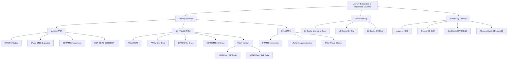
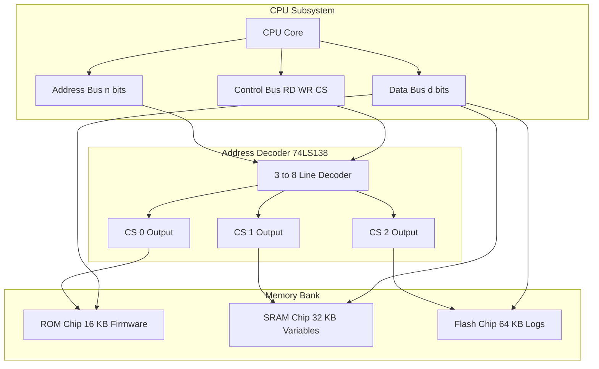

# Memory

<!-- SECTION_1_START -->

# Memory in Embedded Systems

> [!IMPORTANT]
> **KTU 2024 Scheme | Course: EMBEDDED SYSTEMS (PECST746) | Module 1**

## 1.1 Formal Definition

In the context of **Embedded Systems (PECST746)**, **Memory** refers to the physical electronic storage subsystem used by the embedded processor (microcontroller/microprocessor) to permanently or temporarily hold the **instruction code (firmware)**, **operational data**, **stack frames**, and **I/O buffer contents** required for the deterministic execution of the target application.

As per the KTU 2024 syllabus, the memory subsystem of an embedded system is broadly classified into two functional domains based on access pattern and volatility:

* **Primary Memory (Processor-Addressable Memory):** Directly accessed by the CPU core via the address and data buses (e.g., **Cache**, **Static RAM (SRAM)**, **Dynamic RAM (DRAM)**).
* **Secondary Memory (Non-Processor-Addressable Memory):** Not directly accessed by the CPU; used for bulk data storage, requiring controllers (e.g., **Flash Memory**, **EEPROM**, **SD Cards**, **Hard Disks**).

A third category, the **Cache Memory**, acts as a high-speed intermediary buffer (typically **Level 1** ($L_1$) and **Level 2** ($L_2$)) sitting between the CPU register file and the main RAM to mitigate the **von Neumann bottleneck**.

## 1.2 Conceptual Analogy / Intuition

> [!NOTE]
> **Think of Memory as a Massive Post-Office Locker System.**
>
> Imagine the CPU as a busy **postmaster** sitting at the service counter. Every instruction execution is a request: *"Hand me the parcel in locker number `0x4F3A`."* The **memory** is the **wall of lockers** behind the counter.
>
> * **Cache Memory** is the small tray of "frequently handed out" parcels the postmaster keeps right next to his pen. It is extremely fast (low latency) but holds very few items (expensive).
> * **Primary Memory (RAM)** is the main wall of lockers. It holds everything currently being processed. When the shop closes (power off), the lockers empty themselves if they are **DRAM** (forgetful), or stay full if they are **SRAM/Flash** (remembering or persistent).
> * **Secondary Memory (ROM/Flash/SD Card)** is the **warehouse in the basement**. The postmaster must call a clerk (memory controller) to fetch a box. It holds huge volumes cheaply, but access is slow.
>
> Just as a real post office chooses locker sizes based on what it stores most often, an embedded engineer chooses memory types (NOR Flash for boot code, SRAM for stack, NAND for logs) based on **speed, volatility, and cost-per-bit**.

## 1.3 Engineering Constants & Standard Metrics

The following table lists the **canonical engineering parameters** used by the KTU 2024 board examiners to evaluate memory-related numerical problems:

| Metric | Symbol | Standard Value / Unit |
| :--- | :---: | :--- |
| Universal Memory Constant | $N$ | The total number of addressable memory locations (words/bytes). |
| Address Bus Width | $n$ | Number of parallel address lines (bits). |
| Data Bus Width | $d$ | Width of one data word (bits), typically $8, 16, 32$ bits. |
| Memory Capacity | $C$ | Expressed in **Bits, Bytes, KB, MB, GB, KBits, MBits**. |
| Access Time | $t_{acc}$ | Time delay between address stabilization and data valid, in **nanoseconds (ns)**. |
| Power Consumption | $P$ | Active/Standby current drawn, in **mA** or **$\mu$A**. |
| Standard Cost Metric | $\rho$ | Cost per bit, in **USD/Mb** or **INR/Mb**. |

The **fundamental relationship** governing any memory device is given by:

$$ N = 2^n $$

where $N$ is the total number of unique memory locations addressable by $n$ address lines.

> [!IMPORTANT]
> **KTU 2024 Syllabus Highlight (Module 1):**
> Under the **2024 Scheme (NEP 2020)**, students must demonstrate proficiency in:
> 1. **Distinguishing** between Harvard and Von-Neumann memory architectures.
> 2. **Computing** address decoding logic and memory map generation.
> 3. **Selecting** appropriate memory technology based on application constraints (Automotive, IoT, Consumer).
> 4. **Interfacing** memory chips to common 8/16/32-bit microcontrollers (e.g., 8051, ARM Cortex-M).

> [!VISUALIZATION CONTROL]
> **Concept:** Memory Map Visualization for a 16-bit Address Space
> **GeoGebra / Desmos Input Equations:**
> * `f(x) = 2^x` (Plot the memory capacity curve)
> * Point A: $(10, 1024)$ — representing 10-bit address yielding **1 KB**
> * Point B: $(16, 65536)$ — representing 16-bit address yielding **64 KB**
> * Point C: $(32, 4.29 \times 10^9)$ — representing 32-bit address yielding **4 GB**
> **Visual Description:** The student should observe a steeply rising exponential curve on a semi-log plot. Each increment in the x-axis (address lines) **doubles** the y-axis (addressable capacity). This visually reinforces the $N = 2^n$ relationship.

<!-- SECTION_1_END -->

<!-- SECTION_2_START -->

# Deep Theoretical Analysis & KTU High-Yield Formula Sheet

## 2.1 Memory Classification Taxonomy

The embedded systems memory stack is conventionally partitioned along two orthogonal axes: **Volatility** and **Access Pattern**.

### 2.1.1 Based on Volatility (Persistence of Data)

1. **Volatile Memory:** Loses stored contents when power is removed.
   * **SRAM (Static Random-Access Memory):** Uses bistable latches (6 transistors per cell). Non-destructive read, no refresh cycles required.
   * **DRAM (Dynamic Random-Access Memory):** Uses a single capacitor + 1 access transistor per cell. Requires periodic refresh ($\approx$ every **64 ms**) to counteract capacitor leakage.
   * **SDRAM (Synchronous DRAM):** Synchronized to the system clock, enabling pipelined burst transfers.
   * **DDR SDRAM (Double Data Rate SDRAM):** Transfers data on both clock edges, doubling peak throughput.

2. **Non-Volatile Memory (NVM):** Retains data without power.
   * **ROM (Read-Only Memory):** Mask-programmed at fabrication.
   * **PROM (Programmable ROM):** One-time user-programmable using a PROM blower.
   * **EPROM (Erasable PROM):** UV-light erasable (requires quartz window), electrically programmable.
   * **EEPROM (Electrically EPROM):** Byte-level electrically erasable; high endurance ($\approx$ **$10^6$ cycles**).
   * **Flash Memory:** Block-level electrically erasable; the dominant NVM in modern embedded systems.

### 2.1.2 Based on Access Pattern

* **Random Access Memory (RAM):** Any location can be accessed in constant time $O(1)$ relative to its address.
* **Sequential Access Memory (SAM):** Access time depends on physical position (e.g., magnetic tape).
* **Direct Access Memory (DAM):** Hybrid; individual tracks are accessed randomly, but within a track, access is sequential (e.g., Hard Disk).

## 2.2 Core Operational Principles

### 2.2.1 SRAM vs. DRAM Operational Mechanics

* **SRAM Cell:** Built from a **6T cross-coupled latch** (two inverters cross-connected, plus two access transistors and two pull-down transistors). As long as Vcc is present, the latch holds its state indefinitely. Read operation is **non-destructive**.
* **DRAM Cell:** Built from a **1T1C structure** (one capacitor stores the charge, one transistor acts as the access switch). The capacitor leaks charge through the PN junctions and substrate, so the contents must be **refreshed** (rewritten) every few milliseconds.

### 2.2.2 Flash Memory Sub-Architectures

* **NOR Flash:** Each cell has a dedicated word line and bit line connection, enabling true random access. Used for **code execution in-place (XIP)** — the CPU can fetch instructions directly from NOR Flash. Slower write/erase but faster read.
* **NAND Flash:** Cells are connected in series strings (similar to a NAND gate), giving a much smaller cell size and higher density. Used primarily for **bulk data storage**. Requires block-level management and a Flash Translation Layer (FTL).

## 2.3 KTU High-Yield Formula Sheet

> [!NOTE]
> **Master these equations — they appear in nearly every KTU Module-1 question paper.**

| # | Concept | Formula | Variables & Units |
| :---: | :--- | :--- | :--- |
| 1 | Total Addressable Locations | $N = 2^n$ | $n$ = address bus width (bits) |
| 2 | Total Memory Capacity (bits) | $C_{bits} = N \times d$ | $d$ = data width (bits) |
| 3 | Total Memory Capacity (bytes) | $C_{bytes} = \dfrac{N \times d}{8}$ | Result in **Bytes** |
| 4 | Memory Map End Address | $A_{end} = A_{base} + N - 1$ | Hexadecimal or Decimal |
| 5 | Refresh Interval Constraint | $t_{refresh} < 64 \text{ ms}$ | Standard DRAM specification |
| 6 | Average Memory Access Time (with cache) | $t_{avg} = H \cdot t_{cache} + (1 - H) \cdot t_{RAM}$ | $H$ = Hit ratio, $0 \le H \le 1$ |
| 7 | Bandwidth (Burst Mode) | $BW = \dfrac{f_{clk} \times d \times \text{transfers/cycle}}{8}$ | Bytes per second |
| 8 | Address Decoding (Linear Select) | $\overline{CS} = \overline{A_n \cdot \cdot \cdot A_x}$ | Active-LOW chip select |
| 9 | Power Dissipation (Dynamic) | $P_{dyn} = \alpha \cdot C \cdot V_{dd}^2 \cdot f$ | $\alpha$ = activity factor |
| 10 | Cost-Per-Bit | $\rho = \dfrac{\text{Total Chip Cost (INR/USD)}}{C_{bits}}$ | Currency per bit |

## 2.4 Engineering Utility & Real-World Applications

* **Automotive ECUs (e.g., Bosch ECU):** Use **NOR Flash** for boot firmware (XIP capability, deterministic read latency) and **EEPROM** for storing odometer/VIN data requiring byte-level endurance.
* **IoT Edge Nodes (e.g., ESP32):** Use **embedded NOR Flash** for the Wi-Fi stack and **SRAM** for TLS handshake buffers.
* **Smartphones:** Use **LPDDR SDRAM** (Low-Power DDR) as main RAM and **UFS Flash** (a managed NAND derivative) as secondary storage.
* **Industrial PLCs:** Use **battery-backed SRAM (BB-SRAM)** or **MRAM** for non-volatile retention of process variables during power glitches.

<!-- SECTION_2_END -->

<!-- SECTION_3_START -->

# Step-by-Step Derivations, Code, and Engineering Tables

## 3.1 Derivations

### 3.1.1 Derivation of Total Addressable Memory

**Problem Statement (KTU Typical):** A 32-bit microcontroller is interfaced with a memory subsystem. How many unique memory locations can it address if the address bus is **20 bits** wide and the data bus is **16 bits** wide?

**Step 1 — Identify the governing equation.**

The total number of unique addressable memory locations $N$ is determined solely by the address bus width $n$:

$$ N = 2^n $$

**Step 2 — Substitute the given value.**

Given $n = 20$:

$$ N = 2^{20} $$

**Step 3 — Evaluate the exponential.**

$$ N = 1,048,576 \text{ locations} $$

**Step 4 — Convert to standard memory units (KB).**

Since $1 \text{ KB} = 2^{10} = 1024 \text{ locations}$:

$$ N = \dfrac{2^{20}}{2^{10}} = 2^{10} = 1024 \text{ KB} = 1 \text{ MB} $$

**Step 5 — Compute total storage capacity in bits.**

Given data width $d = 16$ bits:

$$ C_{bits} = N \times d = 2^{20} \times 16 $$

$$ C_{bits} = 16 \times 1,048,576 = 16,777,216 \text{ bits} $$

**Step 6 — Convert to Bytes.**

$$ C_{bytes} = \dfrac{C_{bits}}{8} = \dfrac{16,777,216}{8} = 2,097,152 \text{ Bytes} = 2 \text{ MB} $$

> [!NOTE]
> **Final Result:** The 20-bit address bus addresses **1,048,576 locations**, and the total storage capacity is **2 MB** (16-bit wide data bus).

---

### 3.1.2 Derivation of Memory Map Boundaries

**Problem Statement:** A system designer maps a **32 KB SRAM** to start at address `0x8000 0000` in a 32-bit ARM Cortex-M address space. Compute the ending address.

**Step 1 — Compute total locations.**

For a byte-addressable memory, $32 \text{ KB} = 32 \times 1024 = 32,768$ bytes.

**Step 2 — Apply the boundary equation.**

$$ A_{end} = A_{base} + N - 1 $$

**Step 3 — Substitute.**

$$ A_{end} = \text{0x80000000} + 32768 - 1 $$

**Step 4 — Convert 32,768 to hexadecimal.**

$$ 32768 = 0x8000 $$

**Step 5 — Final calculation.**

$$ A_{end} = \text{0x80000000} + \text{0x00008000} - \text{0x00000001} $$

$$ A_{end} = \text{0x80007FFF} $$

---

### 3.1.3 Derivation of Address Decoding Logic

**Problem Statement:** Design the chip-select logic for two memory chips, each $16 \text{ KB}$, mapped contiguously starting at `0x0000` in an 8086 system. Each chip has an active-LOW $\overline{CS}$ input.

**Step 1 — Determine address line requirements.**

For $16 \text{ KB}$ chip: $N = 16384$, requiring $n = \log_2(16384) = 14$ lower address lines ($A_0$ to $A_{13}$) for byte selection within the chip.

**Step 2 — Identify decoding lines.**

Since the system is 8086 (16-bit data bus, 20-bit address bus), the byte/word selector uses $A_0$, and the chip-internal addressing uses $A_1$ to $A_{14}$. The remaining lines $A_{15}$ to $A_{19}$ are used for chip select.

**Step 3 — Compute chip boundaries.**

$$ \text{Chip 1 (LOWER): 0x00000 to 0x03FFF} $$

$$ \text{Chip 2 (UPPER): 0x04000 to 0x07FFF} $$

**Step 4 — Derive the active-LOW equations.**

For Chip 1 ($\overline{CS_1}$ active when $A_{19..15} = 00000$):

$$ \overline{CS_1} = \overline{\overline{A_{19}} \cdot \overline{A_{18}} \cdot \overline{A_{17}} \cdot \overline{A_{16}} \cdot \overline{A_{15}}} $$

For Chip 2 ($\overline{CS_2}$ active when $A_{19..15} = 00001$):

$$ \overline{CS_2} = \overline{\overline{A_{19}} \cdot \overline{A_{18}} \cdot \overline{A_{17}} \cdot \overline{A_{16}} \cdot A_{15}} $$

**Step 5 — Verification using Boolean simplification.**

Using De Morgan's theorem, this is typically implemented using a **3-to-8 line decoder** (e.g., 74LS138) with appropriate enable inputs.

---

## 3.2 Algorithmic Implementation: Memory Diagnostic Routine in C

The following C program performs a classic **Memory Walking-Ones Test** and a **Memory Checkerboard Test** to validate the integrity of an SRAM region. The code is written for an ARM Cortex-M4 (e.g., STM32F407) using CMSIS-compliant type definitions and explicit volatile pointer semantics to prevent compiler optimization from eliding the test reads/writes.

```c
/* ====================================================================
 * File:        mem_diagnostic.c
 * Module:      PECST746 - Embedded Systems
 * Module-1:    Memory Subsystem Self-Test
 * Target MCU:  ARM Cortex-M4 (STM32F407VG)
 * Compiler:    arm-none-eabi-gcc -std=c11 -O0
 * ==================================================================== */

#include <stdint.h>
#include <stdbool.h>
#include <stddef.h>

/* ---------- Compile-time configuration constants ---------- */
#define MEM_TEST_BASE_ADDR     ((volatile uint8_t *)0x20000000UL)
#define MEM_TEST_SIZE_BYTES    (32UL * 1024UL)   /* 32 KB SRAM block   */
#define PATTERN_WALKING_ONE    (0x01U)
#define PATTERN_CHECKER_A      (0x55U)
#define PATTERN_CHECKER_B      (0xAAU)
#define LOG(msg)               /* Hook into UART ITM_SendChar here */

/* ---------- Public type definitions ---------- */
typedef enum {
    MEM_TEST_OK              = 0x00U,
    MEM_TEST_ADDR_FAULT      = 0x01U,
    MEM_TEST_DATA_MISMATCH   = 0x02U,
    MEM_TEST_BUS_FAULT       = 0x04U
} mem_test_status_t;

/* ---------- Function prototypes ---------- */
static mem_test_status_t mem_test_walking_ones(volatile uint8_t *base,
                                                size_t size);
static mem_test_status_t mem_test_checkerboard(volatile uint8_t *base,
                                                size_t size);
static uint32_t          mem_crc32(const volatile uint8_t *base,
                                                size_t size);

/* ====================================================================
 * Function:  mem_test_walking_ones
 * Purpose:   Writes a single '1' bit at each successive position
 *            in a byte, then verifies that the readback matches.
 *            This detects stuck-at faults and address-decoding faults.
 * Arguments: base  -> Start of the memory region under test.
 *            size  -> Size of the region in bytes.
 * Returns:   MEM_TEST_OK on success, fault code otherwise.
 * ==================================================================== */
static mem_test_status_t mem_test_walking_ones(volatile uint8_t *base,
                                                size_t size)
{
    uint8_t  pattern = 0U;
    uint8_t  readback = 0U;
    size_t   index = 0U;
    uint8_t  bit_pos = 0U;

    for (bit_pos = 0U; bit_pos < 8U; bit_pos++) {
        pattern = (uint8_t)(PATTERN_WALKING_ONE << bit_pos);

        /* Phase 1: Write the walking-ones pattern to all locations. */
        for (index = 0U; index < size; index++) {
            base[index] = pattern;
        }

        /* Phase 2: Read back and compare bit-exact. */
        for (index = 0U; index < size; index++) {
            readback = base[index];
            if (readback != pattern) {
                LOG("Walking-Ones fault at addr=0x");
                /* UART hex-print of (uint32_t)&base[index] */
                return MEM_TEST_DATA_MISMATCH;
            }
        }
    }
    return MEM_TEST_OK;
}

/* ====================================================================
 * Function:  mem_test_checkerboard
 * Purpose:   Writes alternating 0x55 and 0xAA patterns to adjacent
 *            bytes. Detects shorted-bit and cross-talk faults.
 * Returns:   MEM_TEST_OK or fault code.
 * ==================================================================== */
static mem_test_status_t mem_test_checkerboard(volatile uint8_t *base,
                                                size_t size)
{
    size_t index = 0U;
    uint8_t expected = 0U;

    for (index = 0U; index < size; index++) {
        expected = ((index & 0x01U) == 0U) ? PATTERN_CHECKER_A
                                            : PATTERN_CHECKER_B;
        base[index] = expected;
    }

    for (index = 0U; index < size; index++) {
        expected = ((index & 0x01U) == 0U) ? PATTERN_CHECKER_A
                                            : PATTERN_CHECKER_B;
        if (base[index] != expected) {
            return MEM_TEST_DATA_MISMATCH;
        }
    }
    return MEM_TEST_OK;
}

/* ====================================================================
 * Function:  mem_crc32
 * Purpose:   Computes a 32-bit CRC over the memory region to detect
 *            silent data corruption in NVM blocks.
 * ==================================================================== */
static uint32_t mem_crc32(const volatile uint8_t *base, size_t size)
{
    uint32_t crc = 0xFFFFFFFFUL;
    size_t   i = 0U;
    uint8_t  j = 0U;

    for (i = 0U; i < size; i++) {
        crc ^= (uint32_t)base[i];
        for (j = 0U; j < 8U; j++) {
            crc = (crc & 0x01UL) ? ((crc >> 1) ^ 0xEDB88320UL)
                                  : (crc >> 1);
        }
    }
    return (crc ^ 0xFFFFFFFFUL);
}

/* ====================================================================
 * Main entry: orchestrates the full memory diagnostic sequence.
 * ==================================================================== */
int main(void)
{
    mem_test_status_t result = MEM_TEST_OK;

    /* Test 1: Walking-Ones */
    result = mem_test_walking_ones(MEM_TEST_BASE_ADDR,
                                    MEM_TEST_SIZE_BYTES);
    if (result != MEM_TEST_OK) {
        /* Fault-handler hook */
        while (1U) { /* Trap here for debugger inspection */ }
    }

    /* Test 2: Checkerboard */
    result = mem_test_checkerboard(MEM_TEST_BASE_ADDR,
                                    MEM_TEST_SIZE_BYTES);
    if (result != MEM_TEST_OK) {
        while (1U) { /* Trap here for debugger inspection */ }
    }

    /* Test 3: CRC32 checksum over the region */
    (void)mem_crc32(MEM_TEST_BASE_ADDR, MEM_TEST_SIZE_BYTES);

    /* All tests passed */
    while (1U) { /* Idle main loop */ }
}
```

---

## 3.3 Hardware Pin-Configuration Reference Table

The following table is the canonical KTU reference for memory-chip interfacing. Use it when answering **lab/viva questions on Module 1**.

| Pin Name | Type | Description | Connection in Embedded System |
| :--- | :---: | :--- | :--- |
| $A_0 \ldots A_{n-1}$ | Input | Address bus inputs | Tie directly to CPU address lines (low-order) |
| $\overline{CS}$ (Chip Select) | Input | Active-LOW device enable | Driven by address decoder output (e.g., 74LS138) |
| $\overline{OE}$ (Output Enable) | Input | Active-LOW read strobe | Tie to CPU $\overline{RD}$ signal |
| $\overline{WE}$ (Write Enable) | Input | Active-LOW write strobe | Tie to CPU $\overline{WR}$ signal |
| $DQ_0 \ldots DQ_{d-1}$ | Bidir | Data I/O bus | Tie to CPU data bus; use bus transceivers (74LS245) for fan-out |
| $V_{CC}$ / $V_{SS}$ | Power | $+3.3\text{V}$ and GND | Decouple with $0.1 \mu F$ + $10 \mu F$ capacitors per chip |
| $\overline{RESET}$ | Input | Hardware reset (optional) | Tie to MCU reset line for clean initialization |
| $\overline{BYTE}/\overline{WORD}$ | Input | Data-width selector | Tie HIGH for 16-bit, LOW for 8-bit mode |

---

## 3.4 Comparative Analysis: Memory Selection Decision Matrix

> [!NOTE]
> **Engineering Case Framework mapped to a regulatory/systemic selection matrix.**

This matrix is used by embedded design teams to select the optimal memory technology for a given product profile.

| Selection Criterion | SRAM | DRAM | NOR Flash | NAND Flash | EEPROM | MRAM |
| :--- | :---: | :---: | :---: | :---: | :---: | :---: |
| **Volatility** | Volatile | Volatile | Non-Volatile | Non-Volatile | Non-Volatile | Non-Volatile |
| **Cell Size ($\mu m^2$)** | $\sim 6T$ (Large) | $\sim 1T1C$ (Small) | Medium | Very Small | Large | Medium |
| **Access Time** | **1–10 ns** | **50–70 ns** | **70–100 ns** | **15–25 $\mu$s** | **50–200 ns** | **20–35 ns** |
| **Endurance (cycles)** | Unlimited | Unlimited | $10^5$ | $10^5$ | $10^6$ | $>10^{12}$ |
| **Density (per chip)** | Low | High | Medium | Very High | Low | Low |
| **Power (Active mA)** | Medium | High | Medium | High | High | Low |
| **Cost per bit** | **High** | **Low** | Medium | **Very Low** | **Very High** | **Very High** |
| **Best-fit Use Case** | CPU cache, registers | Main system RAM | Boot ROM, firmware | SSD, SD cards, mass storage | Config parameters, VIN | Battery-backed SRAM replacement |
| **Application Example** | L1/L2 cache in SoC | DDR4 in laptops | BIOS chip in PC | USB pendrive | Car ECU odometer | Aerospace black-box |

<!-- SECTION_3_END -->

<!-- SECTION_4_START -->

# Structural Diagrams & Schematics

## 4.1 Memory Classification Hierarchy (Mermaid Tree)



> [!NOTE]
> **Mermaid Safety Note:** All node IDs are purely alphanumeric (e.g., `rootA`, `nodeA1`, `nodeF2`) with no reserved keywords. All labels use raw uppercase alphanumeric text inside double quotes where needed. No markdown bold, italics, or HTML tables are embedded inside the node labels.

## 4.2 Memory Hierarchy Performance Pyramid (Mermaid Flowchart)

```mermaid
graph LR
    subgraph SUBG_HighTier [TIER 1: HIGHEST SPEED]
        direction TB
        nodeReg1[CPU Registers 1 ns]
        nodeL1A[L1 Cache 2 to 5 ns]
    end

    subgraph SUBG_MidTier [TIER 2: FAST MAIN MEMORY]
        direction TB
        nodeL2A[L2 L3 Cache 10 to 20 ns]
        nodeSRAM[SRAM 60 ns]
        nodeDRAM[DRAM 80 ns]
    end

    subgraph SUBG_LowTier [TIER 3: NON VOLATILE STORAGE]
        direction TB
        nodeNOR[NOR Flash 100 ns Read]
        nodeNAND[NAND Flash 25 us]
        nodeHDD[Magnetic Disk 10 ms]
    end

    nodeReg1 -- Bus Internal --> nodeL1A
    nodeL1A -- System Bus --> nodeL2A
    nodeL2A -- Memory Bus --> nodeSRAM
    nodeSRAM -- Memory Bus --> nodeDRAM
    nodeDRAM -- I O Controller --> nodeNOR
    nodeNOR -- I O Controller --> nodeNAND
    nodeNAND -- Disk Controller --> nodeHDD
```



> [!IMPORTANT]
> **Engineering Insight:** As we descend the pyramid, **capacity increases**, **cost-per-bit decreases**, and **access latency increases**. This is the **Memory Wall** effect, and it is the primary driver for hierarchical caching in modern System-on-Chip (SoC) designs.

## 4.3 Memory Interfacing Block Diagram (Mermaid Block Architecture)



> [!NOTE]
> **Visualization Purpose:** This block-level functional architecture flow illustrates how the **CPU's address bus** is fanned out through a **3-to-8 line decoder** to generate the **chip-select ($\overline{CS}$)** signals for multiple memory banks, while the **data bus** is shared bidirectionally across all chips. This is the **canonical KTU Module-1 interfacing diagram** expected in board answers.

<!-- SECTION_4_END -->

<!-- SECTION_5_START -->

# KTU 2024 Scheme Examination Question Bank & Topic Recap

## Part A Questions (3 Marks Each)

### Question 1: Differentiate between SRAM and DRAM `[KTU University Exam - Dec 2023]`

**Mapped CO:** CO1 — Foundations of Embedded Systems | **RBT Level:** Understand

**Model Answer (Board Valuation Key):**

| Feature | SRAM | DRAM |
| :--- | :--- | :--- |
| **Construction** | Bistable latch (6 transistors per cell) | Capacitor + 1 access transistor (1T1C) |
| **Density** | Low (6T per cell occupies more silicon) | High (1T1C is compact) |
| **Refresh** | Not required | Required every ~64 ms |
| **Access Time** | Faster (1–10 ns) | Slower (50–70 ns) |
| **Power Consumption** | Higher (continuous current in latches) | Lower in standby (refresh bursts) |
| **Cost per bit** | High | Low |
| **Use Case** | CPU cache, registers | Main system RAM |

> **[Valuation Key: 1 mark for each correct point × 3 distinct points = 3 marks]**

---

### Question 2: Compare NOR Flash and NAND Flash `[KTU University Exam - July 2024]`

**Mapped CO:** CO1 — Foundations of Embedded Systems | **RBT Level:** Remember

**Model Answer:**

* **NOR Flash:** Provides true random access at the byte/word level. Supports **Execute-In-Place (XIP)**, where the CPU fetches instructions directly from Flash without copying to RAM. Used for **boot code and firmware storage**. Slower write/erase speeds.
* **NAND Flash:** Connected in series strings like a NAND gate, yielding a smaller cell and much higher storage density. Used for **bulk data storage** (SSD, SD cards, USB drives). Faster write/erase, but requires an **FTL (Flash Translation Layer)** for bad-block management. Cannot do XIP.

**[Valuation Key: Definition of each + 1 key difference + 1 use case = 3 marks]**

---

## Part B Questions (14 Marks Each)

> [!NOTE]
> **As per KTU 2024 ESE pattern, every Module carries an internal choice (OR). You must answer EITHER Question A OR Question B.**

---

### **Question A (14 Marks)**

**[KTU University Exam - Dec 2023]** | **CO1** | **RBT: Understand + Apply**

**(a)** Explain the classification of memory in embedded systems with a neat block diagram. Discuss the role of **cache memory** in mitigating the von Neumann bottleneck. **[7 Marks]**

**(b)** A microcontroller has a **24-bit address bus** and a **32-bit data bus**. Compute the total addressable memory locations, the total storage capacity in Bytes, and design the boundary addresses for a memory block of **2 MB** starting at `0x400000`. **[7 Marks]**

---

### **Model Answer — Question A**

#### Part (a) — Memory Classification and Cache Role

**Step 1: Primary Classification**

Memory in embedded systems is classified into:

1. **Primary Memory** — directly CPU-addressable, fast, low capacity.
   * *Volatile:* SRAM, DRAM, SDRAM.
   * *Non-Volatile:* Mask ROM, PROM, EPROM, EEPROM, Flash.
2. **Secondary Memory** — bulk storage, slow, not directly CPU-addressable.
   * Magnetic disks, optical media, NAND Flash SSDs.
3. **Cache Memory** — ultra-fast L1/L2/L3 buffer between CPU and RAM.

> **[Stating classification with two sub-categories: 2 Marks]**

**Step 2: Cache Memory Role**

In the **von Neumann architecture**, the CPU and memory share a single bus, creating a bottleneck where the CPU often waits for memory fetches. This is the **"Memory Wall."**

* Cache exploits the **principle of locality**:
  * **Temporal Locality:** If a memory location is accessed, it is likely to be accessed again soon.
  * **Spatial Locality:** If a location is accessed, nearby locations are likely to be accessed soon.
* Cache stores recently/frequently used data, achieving a **hit ratio $H > 0.9$** in typical workloads.

> **[Defining von Neumann bottleneck: 2 Marks; Explaining locality: 2 Marks; Cache hit/miss concept: 1 Mark]**

#### Part (b) — Numerical Computation

**Step 1: Total addressable locations.**

$$ N = 2^n = 2^{24} = 16,777,216 \text{ locations} $$

**[Formula + substitution: 1 Mark; Correct evaluation: 1 Mark]**

**Step 2: Total capacity in bytes.**

$$ C_{bytes} = \dfrac{N \times d}{8} = \dfrac{2^{24} \times 32}{8} = 2^{24} \times 4 = 67,108,864 \text{ bytes} = 64 \text{ MB} $$

**[Formula: 1 Mark; Correct evaluation: 1 Mark]**

**Step 3: Memory map for the 2 MB block.**

Given $A_{base} = \text{0x400000}$ and size $= 2 \text{ MB} = 2 \times 2^{20}$ bytes.

$$ 2 \text{ MB} = 2,097,152 \text{ bytes} = \text{0x200000} $$

$$ A_{end} = A_{base} + N - 1 = \text{0x400000} + \text{0x200000} - 1 $$

$$ A_{end} = \text{0x5FFFFF} $$

**[Writing the boundary equation: 1 Mark; Correct hexadecimal arithmetic: 1 Mark]**

> **Total: 7 + 7 = 14 Marks**

---

### **Question B (14 Marks)**

**[KTU University Exam - July 2024]** | **CO2** | **RBT: Understand + Apply**

**(a)** Explain the memory selection criteria for an embedded system. Discuss why **NOR Flash** is preferred over **NAND Flash** for storing the bootloader in an automotive ECU. **[7 Marks]**

**(b)** With a neat diagram, explain how a **16 KB SRAM** and a **16 KB EPROM** are interfaced to an 8086 microprocessor. Show the address decoding logic using a 3-to-8 decoder (74LS138). **[7 Marks]**

---

### **Model Answer — Question B**

#### Part (a) — Memory Selection Criteria + NOR vs NAND

**Step 1: Memory Selection Criteria**

1. **Volatility:** Does the application need data retention without power? (e.g., firmware → non-volatile required).
2. **Access Time / Speed:** Real-time systems need deterministic read/write latency.
3. **Density:** How much storage is required? Bulk data → high-density NAND.
4. **Endurance:** How many write/erase cycles? Calibration data → high endurance EEPROM.
5. **Power Consumption:** Battery-operated devices prefer low-power NVMs like MRAM or FRAM.
6. **Cost per Bit:** Consumer products optimize for the lowest cost-per-bit.
7. **Physical Form Factor:** Package size (e.g., WLCSP for wearables).
8. **Operating Environment:** Temperature, radiation tolerance (MIL-spec for defense).

> **[Listing at least 5 criteria with brief explanations: 3 Marks]**

**Step 2: Why NOR Flash for Bootloader in Automotive ECU**

* **Execute-In-Place (XIP):** The ECU's CPU (typically Infineon AURIX or NXP S32K3) must fetch bootloader instructions **directly from Flash** during cold-boot. NOR Flash supports random byte access, enabling XIP. NAND Flash cannot do XIP.
* **Deterministic Read Latency:** Automotive ISO 26262 ASIL-D compliance requires bounded execution time. NOR Flash offers **constant read access time**, critical for real-time interrupt handlers in the bootloader.
* **High Reliability:** NOR Flash has **lower bit-error rates (BER)** than NAND, essential for safety-critical boot code.
* **Byte-Level Write Capability:** Bootloader updates can patch small sections without erasing large blocks.

> **[Naming 3 valid engineering reasons with automotive context: 4 Marks]**

#### Part (b) — 8086 Memory Interfacing with 74LS138

**Step 1: Block Diagram.**

```
   +-------------------+
   |      8086 CPU     |
   |  AD0..AD15  A16..A19|
   |  RD, WR, BHE      |
   +---------+---------+
             |
   +---------+---------+   Address Bus (A1..A14 to memory)
   |     74LS138        |
   |  Decoder (3-to-8)  |
   +----+-----------+---+
        |Y0|        |Y1|
   +----+----+   +--+----+
   | 16KB    |   | 16KB   |
   | EPROM   |   | SRAM   |
   +---------+   +--------+
```

> **[Neat block diagram: 2 Marks]**

**Step 2: Address Decoding Logic.**

* The 8086 has a 20-bit address bus ($A_0$ to $A_{19}$).
* Each 16 KB chip requires 14 address lines ($A_1$ to $A_{14}$) for byte selection (using $A_0$ and $\overline{BHE}$ for byte/word strobing).
* 3 remaining lines ($A_{17}, A_{18}, A_{19}$) feed the 74LS138 select inputs $A, B, C$.
* The 74LS138 must be enabled using $\overline{RD}$ or $\overline{WR}$ from the CPU.

**Chip-1 (EPROM) Mapping:**

* Mapped to `0xF0000` to `0xF3FFF` → $A_{19..15} = 11110$ → $\overline{Y_0}$ active.

**Chip-2 (SRAM) Mapping:**

* Mapped to `0xF4000` to `0xF7FFF` → $A_{19..15} = 11101$ → $\overline{Y_1}$ active.

**74LS138 Equations:**

$$ \overline{Y_0} = \overline{\overline{C} \cdot \overline{B} \cdot \overline{A}} \quad \text{(for EPROM)} $$

$$ \overline{Y_1} = \overline{\overline{C} \cdot \overline{B} \cdot A} \quad \text{(for SRAM)} $$

> **[Identifying address lines: 2 Marks; Showing decoder equations: 2 Marks; Mapping ranges: 1 Mark]**

> **Total: 7 + 7 = 14 Marks**

---

> [!WARNING]
> **KTU Examiner's Valuation Warning / Pitfall Callout**
>
> 1. **Address bus vs. data bus confusion:** A very common student error is computing memory capacity using $2^d$ (data bus width) instead of $2^n$ (address bus width). Remember: **The address bus determines *how many* locations, the data bus determines *how wide* each location is.**
> 2. **Units mix-up:** $1 \text{ KB} = 1024 \text{ bytes}$, NOT 1000. Board evaluators deduct 0.5 marks for treating KB as $10^3$.
> 3. **Missing boundary $\mathbf{-1}$:** When computing the *ending* address of a memory block, forgetting the $-1$ in $A_{end} = A_{base} + N - 1$ is a frequent error.
> 4. **NOR vs NAND distinction:** Students often write "NAND is faster" — this is true only for **write/erase**, not for read. NOR has faster **random read**, which is why it is used for code storage.
> 5. **Decoder enable pins:** When drawing the 74LS138, always show the **enable inputs** ($G_1, \overline{G_{2A}}, \overline{G_{2B}}$) connected to the CPU's $M/\overline{IO}$ and $\overline{RD}$ signals. Drawing the decoder without enable logic is an incomplete answer.

---

## 📌 Topic Recap & Important Things to Remember

* **Memory classification** is twofold: **Primary (Cache, RAM)** vs **Secondary (ROM, Flash, Disk)**, and **Volatile** vs **Non-Volatile**.
* **SRAM (6T latch)** is fast, expensive, and used for cache. **DRAM (1T1C)** needs refresh every $\approx$ **64 ms**, used for main memory.
* **ROM evolution:** Mask ROM → PROM → EPROM → EEPROM → Flash. Each step adds erasability/user-programmability.
* **NOR Flash** supports **Execute-In-Place (XIP)** and has deterministic read latency → ideal for **boot code**.
* **NAND Flash** has higher density and lower cost-per-bit → ideal for **bulk data** (SD cards, SSDs).
* **Fundamental capacity equation:** $N = 2^n$ where $n$ = number of address lines.
* **Total storage:** $C_{bytes} = (N \times d) / 8$ where $d$ = data bus width.
* **Memory map boundaries:** $A_{end} = A_{base} + N - 1$.
* **Cache locality principles:** **Temporal** (recent reuse) and **Spatial** (nearby reuse).
* **Address decoding** uses decoders like 74LS138 to generate active-LOW $\overline{CS}$ signals from high-order address bits.
* **Memory interfacing bus trio:** Address bus, Data bus (bidirectional), Control bus ($\overline{RD}, \overline{WE}, \overline{CS}$).
* **Memory wall:** As CPU speed outpaces memory speed, **cache hierarchy** (L1 → L2 → L3) bridges the gap.
* **Selection criteria priority order (typical):** Volatility → Endurance → Speed → Density → Cost → Form Factor.
* **Refresh interval for DRAM:** Must be less than **64 ms** or data corruption occurs.
* **Cache hit time formula:** $t_{avg} = H \cdot t_{cache} + (1 - H) \cdot t_{RAM}$.
* **Memory types to remember for KTU viva:** SRAM, DRAM, SDRAM, DDR, Mask ROM, PROM, EPROM, EEPROM, NOR Flash, NAND Flash, FRAM, MRAM.

<!-- SECTION_5_END -->
