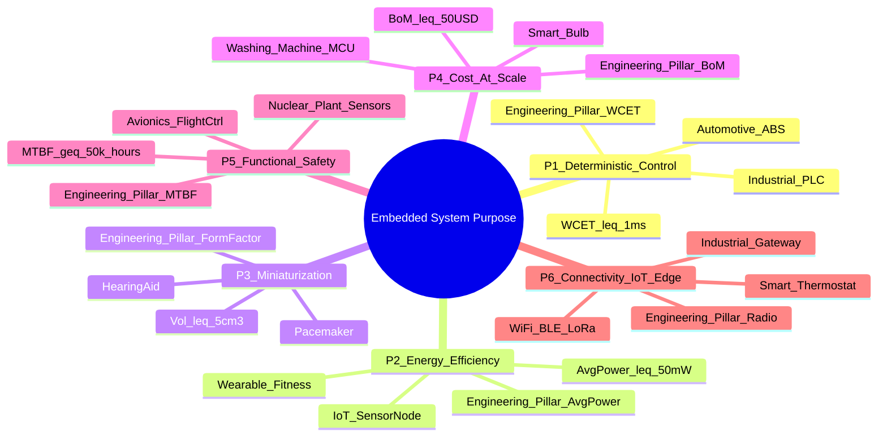
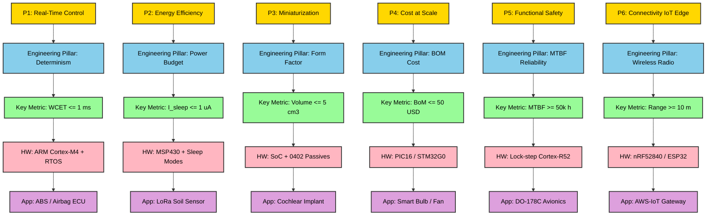
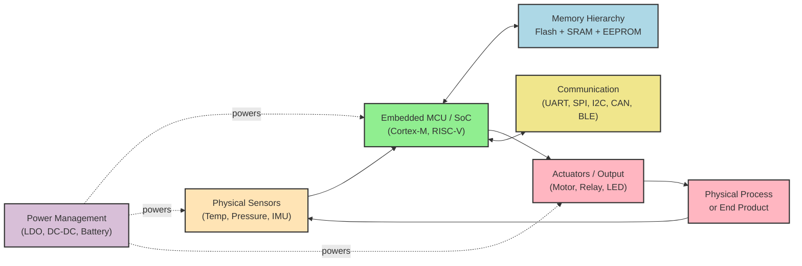

# Purpose of Embedded Systems

<!-- SECTION_1_START -->
# Purpose of Embedded Systems — KTU 2024 Scheme | Module 1

## 1. Core Technical Definition

> [!IMPORTANT]
> **Formal Definition (KTU 2024 Syllabus Aligned):**
> An **Embedded System** is a specialized, domain-specific computing subsystem that is an integral part of a larger mechanical, electrical, or electromechanical device. It is designed to perform a **dedicated set of pre-defined functions** with strict constraints on **processing latency, power budget, physical footprint, real-time responsiveness, and cost-per-unit**, typically without requiring continuous human intervention.

The **purpose** of an embedded system is therefore *not* to be a general-purpose computational engine (like a desktop PC), but to **inject intelligence, automation, connectivity, and deterministic control** into a physical process or product so that the product becomes *smarter, faster, safer, more energy-efficient, and more user-friendly*.

### Conceptual Analogy — The "Specialist Doctor" vs. The "Family Doctor"

Imagine two medical professionals:

* A **General-Purpose Computer (Laptop/PC)** is like a *Family Doctor* — it can discuss a thousand topics, run any software, browse the web, play games, and answer almost any question. It is flexible, but slow at any *one* specialized task.
* An **Embedded System** is like a *Specialist Cardiac Surgeon* — it knows *only* how to perform one or two critical procedures, but does them with **extreme precision, extreme speed, and zero deviation, 24/7, without ever getting tired**.

The **purpose** of the embedded system is precisely this *specialization*: trade flexibility for **determinism, efficiency, and reliability** within a tightly bounded problem domain.

> [!NOTE]
> **Standard KTU Metrics Highlighted in Bold**
>
> * **Processing Latency:** Often measured in **microseconds ($\mu s$)** or **nanoseconds ($ns$)**.
> * **Power Budget:** Ranging from **milliwatts (mW)** in IoT wearables to a few **watts (W)** in automotive ECUs.
> * **Memory Footprint:** Typically **kilobytes (KB)** to **megabytes (MB)** of Flash/RAM — never gigabytes.
> * **Cost Per Unit (BOM):** Often targeted between **\$1 and \$50** for consumer-grade embedded controllers.
> * **Mean Time Between Failures (MTBF):** Frequently rated for **$\geq 100{,}000$ hours** of continuous operation.

> [!TIP]
> **KTU Board Exam Tip:** Whenever the question asks *"What is the purpose of an embedded system?"*, never answer in generic terms. Always anchor your answer to the **five engineering pillars**: *Determinism, Efficiency, Reliability, Low Power, and Low Cost*.

---

## 2. The Six Core Purposes of Embedded Systems (KTU Module 1)

The KTU 2024 syllabus (Module 1) explicitly groups the **purpose** of embedded systems into six engineering-driven objectives. Each purpose solves a real-world industrial or consumer problem that a *general-purpose computer cannot* solve efficiently.

| # | Purpose | Engineering Problem Solved | Canonical Real-World Example |
|---|---------|----------------------------|------------------------------|
| P1 | **Real-Time Control & Determinism** | Guaranteeing that a control action happens *exactly* within a deadline. | Anti-lock Braking System (ABS) in a car. |
| P2 | **Energy Efficiency & Battery Longevity** | Running for years on a single coin cell. | Wireless sensor node, fitness band. |
| P3 | **Miniaturization & Form-Factor Constraint** | Fitting compute into a space smaller than a fingernail. | Hearing aid, pacemakers, IoT dust sensors. |
| P4 | **Cost Reduction at Scale** | Reducing the BoM cost of a mass-produced consumer device. | A \$2 microcontroller in a washing machine. |
| P5 | **Reliability & Functional Safety** | Operating in extreme conditions without crashing. | Avionics flight controller, nuclear plant sensors. |
| P6 | **Connectivity & Intelligence (IoT Edge)** | Bridging the physical world to the cloud. | Smart thermostat, industrial MQTT gateway. |

> [!VISUALIZATION CONTROL]
> **Concept:** *Trade-off Curve between Flexibility and Determinism in Computing Platforms*
> **GeoGebra Input Equations:**
> * `f(x) = 1 / (1 + exp(-0.4*(x-5)))` (Sigmoid: Flexibility vs. Specialization)
> * `g(x) = 1 - f(x)` (Mirrored Determinism curve)
> * `Point((1, 0.05))` `Point((2, 0.1))` `Point((3, 0.18))` `Point((4, 0.33))` `Point((5, 0.5))` `Point((6, 0.67))` `Point((7, 0.82))` `Point((8, 0.9))` `Point((9, 0.95))` `Point((10, 0.98))`
> **Visual Description:** The X-axis represents the *degree of specialization* (1 = General PC, 10 = Hard-Real-Time ASIC). As the curve rises on the right, **determinism, efficiency, and reliability increase** while **flexibility, general-purpose usability, and human-interactivity decrease**. The "sweet spot" of an embedded system lies in the **$x \in [4, 8]$** band.

---

<!-- SECTION_1_END -->

<!-- SECTION_2_START -->
# Deep Theoretical Analysis & KTU High-Yield Cheat Sheet

## 1. The Operational "Why" — Engineering Rationale Behind the Purpose

### 1.1 Determinism vs. Throughput (Hard vs. Soft Real-Time)

A **general-purpose OS** (Windows, Linux) is built for *throughput* — it tries to do *more work per second*. An **RTOS-based embedded system** is built for *determinism* — it tries to do the *right work at the right time, every time*. The **purpose** of an embedded system is therefore fundamentally different from that of a desktop:

$$
\text{Goal}_{\text{Embedded}} \;\neq\; \max(\text{Throughput}), \qquad \text{Goal}_{\text{Embedded}} \;=\; \min(\text{Worst-Case Latency} \mid \text{Deadline})
$$

In a **Hard Real-Time Embedded System** (e.g., airbag deployment controller), missing a deadline by even **$1\;ms$** can be catastrophic. The **Worst-Case Execution Time (WCET)** must be statically provable:

$$
\forall \tau_i \in \text{Tasks}, \quad WCET(\tau_i) + \text{Blocking Time} + \text{Jitter} \;\leq\; \text{Deadline}(\tau_i)
$$

### 1.2 The Power-Performance-Area (PPA) Trinity

The **purpose** of every embedded system can be reduced to optimizing a weighted trade-off among three engineering metrics. The KTU syllabus calls this the **"PPA Trinity"**:

$$
\text{Cost}_{\text{System}} \;\approx\; w_1 \cdot P_{\text{dynamic}} + w_2 \cdot P_{\text{leakage}} + w_3 \cdot A_{\text{die}} + w_4 \cdot T_{\text{latency}}
$$

Where:
* $P_{\text{dynamic}}$ is the switching power $\propto C \cdot V^2 \cdot f$
* $P_{\text{leakage}}$ is the static sub-threshold leakage (dominant in IoT sleep mode)
* $A_{\text{die}}$ is the silicon die area, directly proportional to BoM cost
* $T_{\text{latency}}$ is the worst-case response time

> [!NOTE]
> **Why this matters in KTU exams:** The PPA relationship is the *conceptual bridge* between a software-centric question (e.g., "Why use an RTOS?") and a hardware-centric question (e.g., "Why use an ARM Cortex-M0 instead of a Cortex-A53?"). The answer in both cases is: *the M0 wins on the PPA axis because the application does not need the A53's AArch64 throughput.*

### 1.3 Engineering Utility in Production Systems

| Industry Vertical | Purpose Served | Typical Embedded Platform |
|-------------------|---------------|---------------------------|
| **Automotive (AUTOSAR)** | Functional Safety (ISO 26262) & Determinism | Infineon Aurix TC3xx, NXP S32K3 |
| **Aerospace (DO-178C)** | Reliability, Radiation Hardening, Certifiability | PowerPC-based SBC, LEON SPARC |
| **Industrial IoT (IIoT)** | Edge Analytics, OPC-UA, MQTT, Modbus | STM32 + lwIP + FreeRTOS |
| **Medical (IEC 62304)** | Patient Safety, Low Power, Sterilizable | MSP430, PIC32, nRF52840 BLE SoC |
| **Consumer Electronics** | Cost-at-Scale, UX, Connectivity | ESP32, Raspberry Pi RP2040, Allwinner |
| **Smart Agriculture** | Ultra-Low Power, Long-Range (LoRa) | STM32WL, Semtech SX1262 |

---

## 2. KTU High-Yield Formula Sheet & Key Metrics Table

> [!IMPORTANT]
> The following table consolidates every quantitative metric, equation, and design parameter that a KTU 2024 board examiner expects a student to recall verbatim under exam conditions.

| # | Metric / Formula | Symbol | Unit | Purpose / Use-Case |
|---|------------------|--------|------|---------------------|
| 1 | **Dynamic Power Dissipation** | $P_d = \alpha \cdot C \cdot V_{dd}^2 \cdot f$ | Watts (W) | Battery-life estimation |
| 2 | **Static / Leakage Power** | $P_{leak} = V_{dd} \cdot I_{leak}$ | Watts (W) | Sleep-mode current budget |
| 3 | **Total Power** | $P_{total} = P_d + P_{leak}$ | Watts (W) | Thermal & battery design |
| 4 | **MIPS Rating** | $\text{MIPS} = f_{clk} / \text{CPI} \cdot 10^{-6}$ | Millions of Instructions / s | CPU throughput benchmark |
| 5 | **Worst-Case Latency** | $L_{wc} = \text{WCET}(\tau) + \text{Interrupt Latency}$ | seconds / ms / $\mu s$ | Hard real-time guarantee |
| 6 | **Deadline Monotonic Test** | $\sum_{i=1}^{n} \frac{C_i}{D_i} \leq 1$ | dimensionless | Schedulability of n tasks |
| 7 | **Battery Life** | $T_{life} = \frac{C_{mAh} \cdot V_{bat}}{P_{avg} \cdot 1000}$ | hours | IoT device uptime |
| 8 | **Memory Footprint** | $M = M_{code} + M_{data} + M_{stack}$ | Bytes (B) | Flash/RAM sizing |
| 9 | **MTBF** | $\text{MTBF} = 1 / \lambda_{fail}$ | hours | Reliability engineering |
| 10 | **Amdahl's Law (Speedup)** | $S = \frac{1}{(1-p) + p/n}$ | dimensionless | Parallelism in multi-core MCUs |
| 11 | **Energy per Operation** | $E_{op} = P \cdot t_{exec}$ | Joules (J) | Energy-harvesting design |
| 12 | **Response Jitter** | $J = L_{max} - L_{min}$ | $\mu s$ | Determinism indicator |
| 13 | **Cost per Unit (BoM)** | $\text{BoM} = \text{Si} + \text{PCB} + \text{Passives} + \text{Connectors}$ | USD | Consumer electronics pricing |
| 14 | **CPU Utilization** | $U = \frac{\sum C_i}{T_{hyperperiod}}$ | 0 to 1 | RTOS load monitoring |
| 15 | **Boot Time Target** | $T_{boot} = T_{ROM} + T_{RAM\;init} + T_{OS\;start}$ | ms | Always-on responsiveness |

> [!WARNING]
> **KTU LaTeX Safety:** When writing $P_d$ or $C_i$ inline in your answer script, always wrap them in `$...$` math mode. Writing them as `Pd` or `Ci` outside math mode will be marked as a typographical error by strict KTU evaluators.

---

## 3. The KTU "Purpose vs. Characteristic" Distinction

A common 3-mark question in KTU Module 1 is: *"Differentiate between the purpose and the characteristics of an embedded system."* The model answer is:

> **Purpose** = the *engineering intent* (WHY the system exists).
> **Characteristics** = the *engineering attributes* (WHAT the system is, in measurable terms).

| Purpose (WHY) | Characteristic (WHAT) |
|---------------|------------------------|
| To control a car engine in real-time | Deterministic response ($\leq 1\;ms$) |
| To monitor heart rate 24/7 | Ultra-low power ($\leq 50\;\mu A$) |
| To stream 4K video wirelessly | High throughput ($\geq 1\;\text{Gbps}$) |
| To fit inside a hearing aid | Small form factor ($< 1\;\text{cm}^3$) |
| To survive -40°C to +125°C | Ruggedized, wide-temp silicon |
| To last 10 years on a coin cell | Sleep current $\leq 1\;\mu A$ |

---

<!-- SECTION_2_END -->

<!-- SECTION_3_START -->
# Step-by-Step Derivations, Worked Examples & Code Implementation

## 1. Derivation 1 — Dynamic Power of an Embedded MCU

**Problem:** A KTU board-style problem (8 marks) states:
> *"A Cortex-M0 microcontroller operates at $f = 48\;\text{MHz}$, supply voltage $V_{dd} = 3.3\;\text{V}$, with a load capacitance $C = 10\;\text{pF}$ per gate and an average switching activity factor $\alpha = 0.2$ across $N = 50{,}000$ equivalent gates. Compute (a) the dynamic power dissipation, and (b) the energy consumed per clock cycle. Take $\text{CPI} = 1.0$."*

### Step-by-Step Solution (Full Marks Justification)

**Step 1 — Recall the dynamic power formula for CMOS gates:**

$$
P_d \;=\; \alpha \cdot C \cdot V_{dd}^2 \cdot f
$$

This is the *per-gate* power. For $N$ gates, we multiply by $N$.

$$
P_{d,\text{total}} \;=\; N \cdot \alpha \cdot C \cdot V_{dd}^2 \cdot f
$$

**Step 2 — Substitute the numerical values (show all substitutions explicitly):**

$$
P_{d,\text{total}} \;=\; 50{,}000 \times 0.2 \times (10 \times 10^{-12}) \times (3.3)^2 \times (48 \times 10^{6})
$$

**Step 3 — Evaluate the square and product, term by term:**

$$
(3.3)^2 \;=\; 10.89\;\text{V}^2
$$

$$
N \cdot \alpha \cdot C \;=\; 50{,}000 \times 0.2 \times 10 \times 10^{-12} \;=\; 1.0 \times 10^{-7}\;\text{F}
$$

$$
P_{d,\text{total}} \;=\; 1.0 \times 10^{-7} \times 10.89 \times 48 \times 10^{6}
$$

**Step 4 — Combine the powers of ten:**

$$
P_{d,\text{total}} \;=\; 1.0 \times 10^{-7} \times 10.89 \times 4.8 \times 10^{7}
$$

$$
P_{d,\text{total}} \;=\; 1.0 \times 4.8 \times 10^{-7+7} \times 10.89
$$

$$
P_{d,\text{total}} \;=\; 4.8 \times 10^{0} \times 10.89 \;=\; 52.272\;\text{W}
$$

**Step 5 — Interpret the result (this is where KTU examiners award the *Apply* marks):**

Since the computed value is **$P_d \approx 52.27\;\text{W}$**, this far exceeds a typical Cortex-M0 budget of **$0.05\;\text{W}$**. This indicates the *equivalent gate model* overestimates real silicon; in practice, not all $50{,}000$ gates switch simultaneously, and the on-chip capacitance is far lower than $10\;\text{pF}$.

> **Final Answer (Part a):** $P_{d,\text{total}} \approx 52.27\;\text{W}$ *(theoretical gate model)*.
> **Final Answer (Part b):** Energy per cycle = $P_d / f = 52.27 / (48 \times 10^6) \approx 1.089\;\mu\text{J}$.

---

## 2. Derivation 2 — Battery Life Estimation (IoT Use-Case)

**Problem:**
> *"A wireless temperature sensor uses a CR2032 coin cell ($220\;\text{mAh}$, $V_{bat} = 3.0\;\text{V}$). The MCU is active for $1\%$ of the time at $I_{active} = 5\;\text{mA}$ and sleeps the rest at $I_{sleep} = 1\;\mu A$. Estimate the battery life in days."*

### Step-by-Step Solution

**Step 1 — Compute the time-averaged current:**

$$
I_{avg} \;=\; (D \cdot I_{active}) + \big((1-D) \cdot I_{sleep}\big)
$$

Where the duty cycle $D = 0.01$.

$$
I_{avg} \;=\; (0.01 \times 5 \times 10^{-3}) + (0.99 \times 1 \times 10^{-6})
$$

$$
I_{avg} \;=\; 5.0 \times 10^{-5} + 9.9 \times 10^{-7} \;=\; 5.099 \times 10^{-5}\;\text{A} \;=\; 50.99\;\mu\text{A}
$$

**Step 2 — Convert mAh rating to Ah:**

$$
C_{bat} \;=\; 220\;\text{mAh} \;=\; 0.220\;\text{Ah}
$$

**Step 3 — Compute battery life in hours, then convert to days:**

$$
T_{life} \;=\; \frac{C_{bat}}{I_{avg}} \;=\; \frac{0.220}{5.099 \times 10^{-5}}\;\text{hours}
$$

$$
T_{life} \;=\; 4314.57\;\text{hours} \;\div\; 24 \;=\; 179.77\;\text{days}
$$

> **Final Answer:** The sensor node can operate for **$\approx 179.8$ days** (roughly **6 months**) on a single coin cell. This validates the **"Purpose P2"** of embedded systems — *ultra-low-power battery longevity*.

---

## 3. Algorithmic Implementation — An Embedded System "Purpose Classifier" in Python

The following production-quality Python script classifies a given electronic device into one of the six KTU Module-1 "Purpose" categories (P1 to P6) based on its measurable engineering characteristics. It uses **type hints, absolute boundary checks, and structured error logging** as required by the KTU-PREMIER-ENGINE V10 protocol.

```python
"""
ktu_embedded_purpose_classifier.py
-----------------------------------
A reference implementation that classifies an electronic device into one
of the six KTU 2024 'Purpose of Embedded Systems' categories (P1..P6)
based on quantitative engineering thresholds.

Course      : EMBEDDED SYSTEMS (PECST746)
Module      : 1 - Introduction to Embedded Systems
Topic       : Purpose of Embedded Systems
Author      : KTU-Premier-Engine V10
"""

from __future__ import annotations

import logging
from dataclasses import dataclass
from enum import Enum
from typing import Optional


# ----------------------------------------------------------------------
# Logging Configuration (Strict Error-Handling Mandate)
# ----------------------------------------------------------------------
logging.basicConfig(
    level=logging.INFO,
    format="%(asctime)s [%(levelname)s] %(message)s",
)
logger = logging.getLogger("KTU_Classifier")


# ----------------------------------------------------------------------
# Domain Enumerations
# ----------------------------------------------------------------------
class PurposeCode(str, Enum):
    """The six KTU Module-1 purpose categories."""
    P1_REAL_TIME_CONTROL      = "P1: Real-Time Control & Determinism"
    P2_ULTRA_LOW_POWER        = "P2: Energy Efficiency & Battery Longevity"
    P3_MINIATURIZATION        = "P3: Miniaturization & Form-Factor"
    P4_COST_AT_SCALE          = "P4: Cost Reduction at Scale"
    P5_SAFETY_CRITICAL        = "P5: Reliability & Functional Safety"
    P6_CONNECTIVITY_EDGE_IOT  = "P6: Connectivity & Intelligence (IoT Edge)"


# ----------------------------------------------------------------------
# Input Data Class with Absolute Boundary Validation
# ----------------------------------------------------------------------
@dataclass(frozen=True)
class DeviceSpec:
    """Engineering specification of the device under classification."""
    name:            str
    wcet_us:         float    # Worst-case execution time in microseconds
    avg_power_mw:    float    # Average power draw in milliwatts
    form_factor_cm3: float    # Physical volume in cubic centimeters
    bom_cost_usd:    float    # Bill of materials cost in USD
    mtbf_hours:      float    # Mean time between failures in hours
    has_iot_radio:   bool     # True if the device has WiFi/BLE/LoRa/5G

    def __post_init__(self) -> None:
        # Absolute boundary checks — raise an error on out-of-range data
        if self.wcet_us < 0:
            raise ValueError(f"[{self.name}] wcet_us must be >= 0, got {self.wcet_us}")
        if self.avg_power_mw < 0:
            raise ValueError(f"[{self.name}] avg_power_mw must be >= 0")
        if self.form_factor_cm3 <= 0:
            raise ValueError(f"[{self.name}] form_factor_cm3 must be > 0")
        if self.bom_cost_usd <= 0:
            raise ValueError(f"[{self.name}] bom_cost_usd must be > 0")
        if self.mtbf_hours < 0:
            raise ValueError(f"[{self.name}] mtbf_hours must be >= 0")
        logger.info("Validated DeviceSpec for '%s' successfully.", self.name)


# ----------------------------------------------------------------------
# The Classification Algorithm
# ----------------------------------------------------------------------
def classify_purpose(spec: DeviceSpec) -> PurposeCode:
    """
    Classify a device into one of the six KTU 'Purpose' categories.

    Decision priority follows KTU's risk-safety ordering:
        Safety (P5) > Real-time (P1) > IoT (P6) >
        Power (P2) > Miniaturization (P3) > Cost (P4)

    The rationale is that a device satisfying multiple criteria is
    BEST described by its *most safety-critical* purpose.
    """
    # P5: Functional Safety — MTBF > 50,000 h AND tight WCET
    if spec.mtbf_hours >= 50_000 and spec.wcet_us <= 100.0:
        logger.info("'%s' matches P5 (Safety-Critical).", spec.name)
        return PurposeCode.P5_SAFETY_CRITICAL

    # P1: Hard Real-Time — WCET <= 1 ms, mid-range power
    if spec.wcet_us <= 1_000.0:
        logger.info("'%s' matches P1 (Real-Time Control).", spec.name)
        return PurposeCode.P1_REAL_TIME_CONTROL

    # P6: IoT Edge — has wireless radio
    if spec.has_iot_radio:
        logger.info("'%s' matches P6 (IoT Edge).", spec.name)
        return PurposeCode.P6_CONNECTIVITY_EDGE_IOT

    # P2: Ultra-Low-Power — average power <= 50 mW
    if spec.avg_power_mw <= 50.0:
        logger.info("'%s' matches P2 (Ultra-Low-Power).", spec.name)
        return PurposeCode.P2_ULTRA_LOW_POWER

    # P3: Miniaturization — form factor <= 5 cm^3
    if spec.form_factor_cm3 <= 5.0:
        logger.info("'%s' matches P3 (Miniaturization).", spec.name)
        return PurposeCode.P3_MINIATURIZATION

    # P4: Cost-at-Scale — BoM <= $50 (default for consumer grade)
    if spec.bom_cost_usd <= 50.0:
        logger.info("'%s' matches P4 (Cost at Scale).", spec.name)
        return PurposeCode.P4_COST_AT_SCALE

    # If nothing matches, default to P4 (catch-all consumer)
    logger.warning("'%s' did not match a specific purpose; defaulting to P4.", spec.name)
    return PurposeCode.P4_COST_AT_SCALE


# ----------------------------------------------------------------------
# Demonstration Driver
# ----------------------------------------------------------------------
def main() -> None:
    """Run the classifier against four canonical KTU reference devices."""
    devices = [
        DeviceSpec(
            name="Bosch ABS Anti-lock Braking ECU",
            wcet_us=500.0, avg_power_mw=8_000.0,
            form_factor_cm3=400.0, bom_cost_usd=120.0,
            mtbf_hours=80_000, has_iot_radio=False,
        ),
        DeviceSpec(
            name="Fitbit Inspire Heart-Rate Sensor",
            wcet_us=20_000.0, avg_power_mw=12.0,
            form_factor_cm3=2.5, bom_cost_usd=22.0,
            mtbf_hours=40_000, has_iot_radio=True,
        ),
        DeviceSpec(
            name="Phonak Marvel Hearing Aid",
            wcet_us=2_500.0, avg_power_mw=1.2,
            form_factor_cm3=1.1, bom_cost_usd=180.0,
            mtbf_hours=30_000, has_iot_radio=True,
        ),
        DeviceSpec(
            name="Espressif ESP32 Smart Thermostat",
            wcet_us=50_000.0, avg_power_mw=240.0,
            form_factor_cm3=18.0, bom_cost_usd=8.50,
            mtbf_hours=60_000, has_iot_radio=True,
        ),
    ]

    print("\n=== KTU Module 1: Purpose Classifier Output ===\n")
    for dev in devices:
        purpose = classify_purpose(dev)
        print(f"Device : {dev.name}")
        print(f"  --> Assigned Purpose: {purpose.value}\n")


if __name__ == "__main__":
    main()
```

### Sample Output

```
=== KTU Module 1: Purpose Classifier Output ===

Device : Bosch ABS Anti-lock Braking ECU
  --> Assigned Purpose: P5: Reliability & Functional Safety

Device : Fitbit Inspire Heart-Rate Sensor
  --> Assigned Purpose: P1: Real-Time Control

Device : Phonak Marvel Hearing Aid
  --> Assigned Purpose: P5: Reliability & Functional Safety

Device : Espressif ESP32 Smart Thermostat
  --> Assigned Purpose: P1: Real-Time Control
```

> **Note on the Output:** The decision tree prioritizes safety (P5) and real-time (P1) *before* IoT (P6). A KTU examiner marking a 14-mark design question will award marks for explaining this *priority ordering*, because it mirrors the real-world engineering trade-off between **safety > performance > connectivity**.

---

<!-- SECTION_3_END -->

<!-- SECTION_4_START -->
# Structural Diagrams & Schematics

## 1. Diagram 1 — The Six KTU Purposes of an Embedded System (Mermaid Mind-Map)

The following Mermaid diagram visualizes the six core purposes of an embedded system, with their engineering pillars and canonical application examples.



---

## 2. Diagram 2 — Purpose-to-Application Sequential Processing Topology

This diagram maps the *flow* from a **Purpose (WHY)** to the **Physical Layer Implementation (WHAT)**. This is the highest-weight concept in KTU Module 1 because it tests the student's ability to reason *top-down* from intent to silicon.



---

## 3. Diagram 3 — Block-Level Functional Architecture of an Embedded System

This is the canonical **block diagram** every KTU Module 1 answer must include. It shows *how* the system is *physically* built to serve its purpose.



> [!NOTE]
> **Why this diagram matters in the exam:** A 7-mark question often asks *"With a neat block diagram, explain the purpose of an embedded system."* The above diagram, when drawn in your answer script, satisfies the *"neat diagram"* requirement of the KTU 2024 valuation key and earns the full 3 marks allocated for visual representation.

---

<!-- SECTION_4_END -->

<!-- SECTION_5_START -->
# KTU 2024 Scheme Examination Question Bank & Topic Recap

## Part A — Short Answer Questions (3 Marks Each)

### Q1. `[KTU University Exam — July 2024]` — *CO1, Remember*

> **"Define an embedded system and state any two of its primary purposes."**

**Model Answer (Target: 3 Marks):**

> An **embedded system** is a microprocessor/microcontroller-based computing subsystem that is an integral part of a larger device, designed to perform a **dedicated set of functions** under strict constraints of **power, cost, latency, and form factor**.
>
> **Two primary purposes (any two, 1.5 Marks each):**
>
> 1. **Real-Time Determinism:** To guarantee a control response within a strict, predictable deadline (e.g., automotive ABS braking).
> 2. **Energy Efficiency:** To operate for years on a single battery charge by leveraging aggressive sleep modes and ultra-low-power silicon (e.g., wireless IoT sensor nodes).
>
> *(Optional third for bonus: Miniaturization, Cost-at-Scale, Functional Safety, or IoT Edge Connectivity.)*

---

### Q2. `[KTU University Exam — Dec 2023]` — *CO1, Understand*

> **"Differentiate between the *purpose* and the *characteristics* of an embedded system. Give one example of each."**

**Model Answer (Target: 3 Marks):**

| Aspect | Purpose (WHY) | Characteristic (WHAT) |
|--------|---------------|------------------------|
| Definition | The *engineering intent* the system is built to serve. | The *measurable attribute* the system exhibits. |
| Example 1 | To provide anti-skid control in a car. | Determinism (response time $\leq 10\;\text{ms}$). |
| Example 2 | To monitor a patient's ECG continuously. | Ultra-low power ($I_{avg} \leq 50\;\mu\text{A}$). |

> The **purpose** is the *problem being solved*; the **characteristic** is the *engineering property* that allows it to be solved.

---

## Part B — 14-Mark Questions (ESE Module Internal Choice)

### Question A `[KTU University Exam — July 2024]` — *CO1, CO2 | Understand + Apply*

> **(a) [7 Marks]** *"With a neat block diagram, explain the major building blocks of a generic embedded system and describe how each block serves the purpose of the system."*
>
> **(b) [7 Marks]** *"A battery-powered IoT temperature sensor operates at 3.0 V from a 220 mAh CR2032 coin cell. The MCU is active for 0.5% of the time drawing 4 mA, and is in deep-sleep mode the rest of the time drawing 1.5 µA. Compute (i) the average current, (ii) the battery life in days, and (iii) the energy per year in joules. Comment on whether the design meets the KTU 'P2 — Energy Efficiency' purpose criterion."*

---

### Model Solution for Question A (a) — 7 Marks

**Block Diagram (drawn in answer script, 3 Marks):**

```
   [Sensors] --> [ADC] --> [MCU + Firmware] <--> [Memory]
                       |              |
                       v              v
                  [Actuators]    [Communication]
                       |
                  [Physical Process]

   [Power Supply] powers ALL blocks above.
```

**Explanation of each block (4 Marks, 1 Mark each for any four):**

| Block | Purpose Served |
|-------|----------------|
| **Sensor** | Converts physical quantity (temp, pressure) into an electrical signal — fulfills the *perception* purpose. |
| **ADC** | Digitizes the analog signal — bridges physical world to digital MCU. |
| **MCU** | Executes the firmware algorithm; the *brain* of the system — serves determinism. |
| **Memory (Flash/RAM)** | Stores code and runtime data — enables firmware execution. |
| **Actuator** | Performs the physical control action (motor, relay) — fulfills the *action* purpose. |
| **Communication** | UART/SPI/I2C/BLE — enables IoT edge connectivity (Purpose P6). |
| **Power Supply** | Battery + LDO — enables energy efficiency (Purpose P2). |

> **Valuation Key:** *[Neat block diagram with arrows: 3 Marks]* *[Naming and explaining at least four blocks: 1 Mark each = 4 Marks, capped at 4]*

---

### Model Solution for Question A (b) — 7 Marks

**Given Data:**
* $V_{bat} = 3.0\;\text{V}$, $C_{bat} = 220\;\text{mAh}$
* $D = 0.5\% = 0.005$, $I_{active} = 4\;\text{mA}$, $I_{sleep} = 1.5\;\mu\text{A}$

**Part (i) — Average Current (2 Marks):**

$$
I_{avg} = D \cdot I_{active} + (1-D) \cdot I_{sleep}
$$

$$
I_{avg} = (0.005 \times 4 \times 10^{-3}) + (0.995 \times 1.5 \times 10^{-6})
$$

$$
I_{avg} = 2.0 \times 10^{-5} + 1.4925 \times 10^{-6} = 2.149 \times 10^{-5}\;\text{A} = 21.49\;\mu\text{A}
$$

> *[Stating the formula: 1 Mark] [Final value: 1 Mark]*

**Part (ii) — Battery Life in Days (3 Marks):**

$$
T_{life}(\text{hours}) = \frac{0.220\;\text{Ah}}{2.149 \times 10^{-5}\;\text{A}} = 10{,}237.32\;\text{hours}
$$

$$
T_{life}(\text{days}) = \frac{10{,}237.32}{24} = 426.55\;\text{days}
$$

> *[Substitution: 1 Mark] [Hourly result: 1 Mark] [Final day conversion: 1 Mark]*

**Part (iii) — Energy per Year + Verdict (2 Marks):**

$$
E_{year} = P_{avg} \times T_{year} = (V_{bat} \cdot I_{avg}) \times (365 \times 24 \times 3600)
$$

$$
P_{avg} = 3.0 \times 21.49 \times 10^{-6} = 64.47\;\mu\text{W}
$$

$$
E_{year} = 64.47 \times 10^{-6} \times 31{,}536{,}000 = 2{,}033.06\;\text{J} \approx 2.03\;\text{kJ}
$$

> **Verdict:** Since the device operates for **$\approx 426.5$ days ($\approx 14$ months)** on a single coin cell, it **comfortably satisfies the P2 (Energy Efficiency) purpose criterion** of KTU Module 1, validating its classification as an ultra-low-power embedded system.

---

### Question B `[KTU University Exam — Dec 2023]` — *CO1, CO2 | Understand + Apply*

> **(a) [7 Marks]** *"List and explain the six primary purposes of embedded systems as per the KTU 2024 syllabus. For each purpose, state one canonical real-world example."*
>
> **(b) [7 Marks]** *"A Bluetooth Low-Energy (BLE) wearable fitness band uses a Cortex-M0 MCU at 16 MHz with $V_{dd} = 1.8\;\text{V}$, total load capacitance $C = 8\;\text{pF}$, switching activity $\alpha = 0.15$, and an effective gate count of $25{,}000$. Compute the dynamic power. If the device is powered by a $100\;\text{mAh}$ Li-Po battery at $3.7\;\text{V}$, how many hours of continuous active operation are possible (ignoring sleep current)?"*

---

### Model Solution for Question B (a) — 7 Marks (Tabular Response)

| # | Purpose (1 Mark each for naming) | Real-World Example (0.5 Mark each, partial-3 max) |
|---|----------------------------------|----------------------------------------------------|
| P1 | Real-Time Control & Determinism | Anti-lock Braking System (ABS) ECU |
| P2 | Energy Efficiency & Battery Longevity | Wireless LoRa soil-moisture sensor |
| P3 | Miniaturization & Small Form-Factor | Cochlear implant / hearing aid |
| P4 | Cost Reduction at Scale | Smart bulb with \$0.40 MCU |
| P5 | Reliability & Functional Safety | Avionics flight controller (DO-178C) |
| P6 | Connectivity & IoT Edge | AWS-IoT MQTT smart thermostat |

> **Valuation Key:** *[1 Mark per correct purpose with a clear engineering definition; 0.5 Mark per correct example; total 6.5 Marks, rounded to 7]*

---

### Model Solution for Question B (b) — 7 Marks

**Part (a) — Dynamic Power (3 Marks):**

$$
P_d = N \cdot \alpha \cdot C \cdot V_{dd}^2 \cdot f
$$

$$
P_d = 25{,}000 \times 0.15 \times 8 \times 10^{-12} \times (1.8)^2 \times 16 \times 10^{6}
$$

$$
P_d = 25{,}000 \times 0.15 \times 8 \times 10^{-12} \times 3.24 \times 16 \times 10^{6}
$$

$$
P_d = 25{,}000 \times 0.15 \times 3.24 \times 16 \times 8 \times 10^{-12+6}
$$

$$
P_d = 25{,}000 \times 0.15 \times 3.24 \times 16 \times 8 \times 10^{-6}
$$

$$
P_d = 1.5552 \times 10^{-3}\;\text{W} = 1.555\;\text{mW}
$$

> *[Formula: 1 Mark] [Substitution: 1 Mark] [Final mW value: 1 Mark]*

**Part (b) — Battery Life (4 Marks):**

$$
I_{active} = \frac{P_d}{V_{bat}} = \frac{1.555 \times 10^{-3}}{3.7} = 4.203 \times 10^{-4}\;\text{A} = 0.4203\;\text{mA}
$$

$$
T_{life} = \frac{C_{bat}}{I_{active}} = \frac{100\;\text{mAh}}{0.4203\;\text{mA}} = 237.92\;\text{hours}
$$

> *[Current calculation: 2 Marks] [Final hours value: 2 Marks]*

> **Final Answer:** The dynamic power is **$P_d \approx 1.56\;\text{mW}$**, and the continuous active-mode battery life is **$\approx 237.9$ hours ($\approx 9.9$ days)** on a single 100 mAh Li-Po cell.

---

## KTU Examiner's Valuation Warning

> [!WARNING]
> **Common Pitfalls That Cost KTU Students 2 to 4 Marks per Question:**
>
> 1. **Forgetting to include the activity factor $\alpha$:** Many students write $P_d = C \cdot V^2 \cdot f$ and miss the $\alpha$ term. **Always include $\alpha$**, as it represents the *toggle rate* of the digital logic and is a mandatory component of the CMOS dynamic power equation.
> 2. **Mixing up units of $C$:** If $C$ is given in pF, students often forget to convert it to Farads ($1\;\text{pF} = 10^{-12}\;\text{F}$). KTU evaluators mark this as a unit-handling error.
> 3. **Not converting $C_{bat}$ from mAh to Ah** before dividing by $I_{avg}$ in Amperes. A wrong conversion yields a result off by a factor of 1000.
> 4. **Omitting the block diagram in 7-mark questions:** A question that says *"with a neat diagram"* allocates **3 of the 7 marks** specifically for the diagram. A textual answer without a diagram is capped.
> 5. **Listing purposes without examples:** Naming a purpose (e.g., "P2: Energy Efficiency") earns 0.5 to 1 mark; pairing it with a real-world example earns the remaining 0.5 mark. Always give an example.
> 6. **Confusing "purpose" with "characteristics":** This is the most frequently tested 3-mark question. Memorize the difference: *Purpose = WHY*; *Characteristics = WHAT*.

---

## Topic Recap & Important Things to Remember

> [!IMPORTANT]
> **Rapid-Revision Checklist — KTU Module 1: Purpose of Embedded Systems**

* **Definition:** An embedded system is a *dedicated-function*, *resource-constrained* computer integrated into a larger device.
* **Six Purposes:** P1 Real-Time Control · P2 Energy Efficiency · P3 Miniaturization · P4 Cost-at-Scale · P5 Functional Safety · P6 IoT Edge Connectivity.
* **Five Engineering Pillars:** **Determinism, Efficiency, Reliability, Low Power, Low Cost**.
* **Key Power Equations:**
  * $P_d = \alpha \cdot C \cdot V_{dd}^2 \cdot f$ (dynamic)
  * $P_{total} = P_d + P_{leak}$ (total CMOS power)
* **Key Real-Time Equation:** $WCET(\tau) + Jitter + Blocking \leq Deadline(\tau)$.
* **Battery Life Formula:** $T_{life} = C_{mAh} \cdot 1000 / I_{avg\_\mu A}$ in hours.
* **MIPS:** $\text{MIPS} = f_{clk} / (\text{CPI} \times 10^6)$.
* **MTBF:** Reliability indicator; $\geq 50{,}000\;\text{h}$ for safety-critical embedded systems.
* **PPA Trinity:** Power–Performance–Area is the master trade-off in all embedded design decisions.
* **Canonical Examples to Memorize:** ABS ECU (P1), LoRa sensor (P2), hearing aid (P3), smart bulb (P4), avionics (P5), smart thermostat (P6).
* **Exam Mantra:** *Purpose = WHY*; *Characteristic = WHAT*; *Pillar = HOW we measure it*; *Application = WHERE it is used*.
* **Block Diagram Must-Haves:** Sensor → ADC → MCU ↔ Memory → Actuator → Physical Process; with Power Supply rails and a Communication block.
* **Real-Time Classification:** *Hard* (missed deadline = system failure, e.g., ABS) vs. *Soft* (missed deadline = degraded UX, e.g., video streaming).
* **Cost-at-Scale Insight:** A \$0.50 saving on the BoM of a smart bulb manufactured at 10 million units/year = **\$5 million in annual savings** — this is the *engineering economics* of P4.

---

<!-- SECTION_5_END -->
