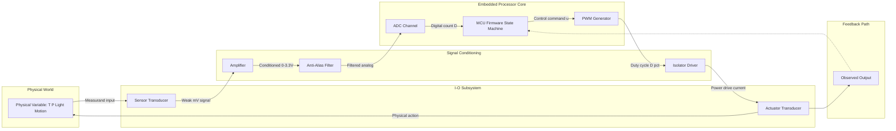
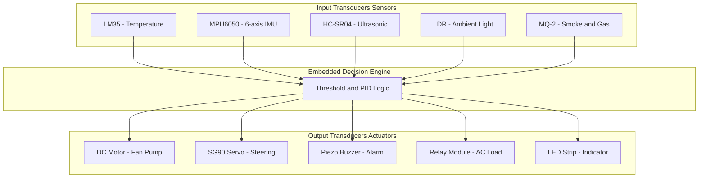
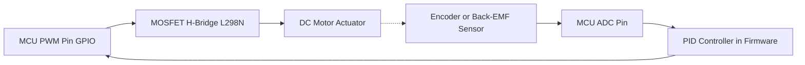

# Sensors and Actuators

<!-- SECTION_1_START -->
# Sensors and Actuators — The Sensory and Muscular Endings of an Embedded System

> [!NOTE]
> **KTU 2024 Scheme Context (PECST746 — Module 1):**
> This topic forms the bridge between the *physical world* (where variables like temperature, pressure, and motion exist in continuous, analog form) and the *digital brain* of an embedded processor. Mastering sensors and actuators is non-negotiable for any real-time, cyber-physical, or IoT application.

---

## 1.1 Formal Definition (KTU Syllabus Terminology)

**Sensor:** A physical device, module, or subsystem whose purpose is to **detect events or changes in its environment** and send the corresponding information to the embedded processor, usually in the form of an **electrical or optical signal**.

**Actuator:** A physical device, module, or subsystem that **converts an electrical control signal from the embedded processor into a physical action**, such as motion, heat, light, or force.

In short:
> **Sensor = Transducer (Non-Electrical → Electrical)** 
> **Actuator = Transducer (Electrical → Non-Electrical)**

> [!IMPORTANT]
> **KTU Board Tip:** A *transducer* is the umbrella term. Sensors are *input transducers*, while actuators are *output transducers*. Do not interchange these terms in a 14-mark answer.

---

## 1.2 Intuitive Analogy — "The Human Body Model"

Think of an embedded system as a tiny **robot living inside a box**:

- The **sensors** are its *eyes, ears, skin, and nose* — they observe the world and tell the brain what is happening. *(Input channel)*
- The **microcontroller** is its *brain* — it processes what the senses report.
- The **actuators** are its *muscles, hands, mouth, and legs* — they act upon the world based on the brain's command. *(Output channel)*
- The **ADC/DAC and signal conditioning circuits** are the *nerves and spinal cord* — they carry and translate the signals.

For example, in a **smart fire-alarm robot**:
- A *temperature sensor* (LM35) and a *smoke sensor* (MQ-2) tell the brain it is hot and smoky.
- The brain commands a *buzzer* (acoustic actuator) and a *DC water pump* (mechanical actuator) to react.

> [!VISUALIZATION CONTROL]
> **Concept:** Sensor-Actuator closed-loop data flow in an embedded system.
> **GeoGebra / Desmos Input Equations (conceptual coordinate mapping):**
> - $x(t) = \text{Physical Variable (e.g., temperature in °C)}$
> - $y(t) = \text{Electrical Output (e.g., voltage in mV)}$
> - Sensor graph: $y = 0.01 \cdot x$ (LM35 has sensitivity $S = 10\,\text{mV/°C}$)
> - Actuator graph: $z = 0.5 \cdot u$ (where $u$ is PWM duty and $z$ is motor RPM)
> **Visual Description:** The student should observe a **linear ramp** passing through the origin for an ideal sensor, and a **staircase / pulse-width response** for a digital actuator driven by PWM.

---

## 1.3 Why Sensors and Actuators are Fundamental in KTU Embedded Systems

| Perspective | Role of Sensors | Role of Actuators |
|---|---|---|
| **Hardware** | Source of analog/digital input signals | Load driven by output pins/MOSFETs/relays |
| **Software** | Source of interrupts, ADC channel inputs, I²C/SPI slaves | Target of PWM, GPIO, timer compare logic |
| **System Design** | Define the **input specification** of the design | Define the **output specification** |
| **Real-time** | Bound the **sampling rate** | Bound the **actuation latency** |

> [!TIP]
> **Key constant to remember:** The Standard **ADC Reference Voltage** $V_{ref}$ for most KTU-lab ARM Cortex boards is **$3.3\,\text{V}$** (and $5\,\text{V}$ for legacy Arduino). Always specify $V_{ref}$ in numerical problems.

<!-- SECTION_1_END -->

<!-- SECTION_2_START -->
# Deep Theoretical Analysis & KTU High-Yield Formula Sheet

## 2.1 Classification of Sensors

### A. By Power Requirement
- **Active Sensors:** Generate their own electrical signal from the measurand (no external power needed for the sensing element). Example: **Piezoelectric** pressure sensor, **photovoltaic** (solar) cell. EMF equation: $V_{out} = g \cdot \sigma$, where $g$ is the piezoelectric constant and $\sigma$ is stress.
- **Passive Sensors:** Require an external excitation (bias) to operate. Example: **Thermistor** (resistance change), **LDR** (light-dependent resistor), **strain gauge**.

### B. By Output Signal Type
- **Analog Sensors:** Output a continuous voltage/current proportional to the measurand. Example: **LM35** (temperature), **MPX4115** (pressure), **potentiometer** (angular position).
- **Digital Sensors:** Output a discrete bit pattern, typically over a serial protocol. Example: **DHT11** (temperature & humidity), **MPU6050** (accelerometer/gyro), **DS18B20** (1-Wire temperature).

### C. By Measurand (Most Asked in KTU)
| Measurand | Sensor Example | Principle | Typical Output |
|---|---|---|---|
| Temperature | LM35, DHT11, Thermistor | Seebeck / Resistance vs T | $10\,\text{mV/°C}$ / PWM frame |
| Light | LDR, Photodiode, TSL2561 | Photoconductivity | $\Delta R$ or $\Delta V$ / I²C |
| Pressure | MPX4115, BMP180 | Piezoresistive | Analog $V$ / I²C |
| Position/Angle | Potentiometer, Encoder | Resistive divider / Optical | $0$–$V_{ref}$ / Quadrature pulses |
| Acceleration | ADXL345, MPU6050 | MEMS capacitive | I²C/SPI digital frame |
| Gas/Chemical | MQ-2, MQ-135 | Chemiresistor | Analog $V$ via voltage divider |
| Humidity | DHT22, SHT31 | Capacitive polymer | I²C / PWM |
| Distance | HC-SR04, VL53L0X | Ultrasonic echo / ToF | Time-of-flight $\mu s$ / I²C |

---

## 2.2 Classification of Actuators

| Type | Sub-type | Example | Key Drive Parameter |
|---|---|---|---|
| **Electrical** | Electromagnetic | DC Motor, Stepper, Servo, Solenoid, Relay | Voltage / Current |
| **Electrical** | Piezoelectric | Piezo buzzer, Piezo motor | AC frequency, $V_{pp}$ |
| **Electrical** | Thermal | Heating resistor, Peltier cooler | Power $P = I^2 R$ |
| **Hydraulic** | Cylinder / Pump | Excavator arm | Fluid pressure |
| **Pneumatic** | Air cylinder | Pneumatic gripper | Compressed air pressure |
| **Optical** | LED, LASER, LCD | 7-segment display, OLED | Forward current / duty cycle |
| **Acoustic** | Speaker, Buzzer | Piezo buzzer | Frequency, $V_{pp}$ |
| **Microfluidic / MEMS** | Micro-valve, micro-pump | Lab-on-chip dispenser | Voltage |

---

## 2.3 Performance Characteristics of Sensors (High-Yield for KTU)

Let $x$ be the true measurand and $y$ be the sensor output.

- **Sensitivity** ($S$): Ratio of output change to input change. 
$$S = \frac{\Delta y}{\Delta x} \quad \text{(units: V/°C, mA/kPa, etc.)}$$

- **Accuracy**: Closeness of the output to the true value. Expressed as a percentage of full-scale output ($\%\text{FSO}$).

- **Precision / Repeatability**: Ability to produce the same output for the same input under identical conditions.

- **Resolution** ($\Delta x_{min}$): Smallest change in measurand that produces a detectable change in output. 
$$\text{Resolution} = \frac{\text{Range}}{2^n - 1} \quad \text{where } n = \text{ADC bits}$$

- **Linearity / Non-linearity Error**: Maximum deviation of the actual transfer curve from the best-fit straight line. Expressed as $\%\text{FSO}$.

- **Dynamic Range (DR)**: 
$$DR_{dB} = 20 \log_{10}\!\left(\frac{x_{max}}{x_{min}}\right)$$

- **Response Time** ($\tau$): Time taken for the output to reach $63.2\%$ of its final value for a step input (first-order system). Settling time is typically $4\tau$ to $5\tau$.

- **Hysteresis Error**: Maximum difference in output for the same input approached from opposite directions. Units: $\%\text{FSO}$.

- **Offset (Zero Drift)**: Output present when the measurand is zero.

- **Bandwidth** ($f_{-3dB}$): Frequency at which sensor output power drops to half of its DC value.

---

## 2.4 Performance Characteristics of Actuators

- **Stroke / Range of Motion** (linear or angular).
- **Torque** ($\tau$ in $\text{N·m}$) for rotational actuators, **Force** ($F$ in $\text{N}$) for linear.
- **Speed** ($N$ in **RPM**, or angular velocity $\omega$ in $\text{rad/s}$).
- **Power Rating** ($P = \tau \cdot \omega$ for rotational, $P = F \cdot v$ for linear).
- **Response Time** and **Settling Time** (critical for servo loops).
- **Duty Cycle / Continuous vs Intermittent** rating (e.g., a solenoid rated for "2 s ON, 5 s OFF").
- **Backlash** (for gears, steppers).
- **Holding Torque** (stepper) and **Stall Torque** (DC motor).

---

## 2.5 The KTU High-Yield Formula Sheet (Exam Cheat-Sheet)

> [!IMPORTANT]
> Memorize these **10 equations** — they cover roughly $80\%$ of numerical questions on this topic in previous KTU University papers.

| # | Concept | Formula | Units / Notes |
|---|---|---|---|
| 1 | Sensor Transfer (Linear) | $V_{out} = S \cdot x + V_{offset}$ | V |
| 2 | ADC Resolution (LSB size) | $\Delta V_{LSB} = \dfrac{V_{ref}}{2^n}$ | V |
| 3 | ADC Digital Output | $D = \left\lfloor \dfrac{V_{in}}{V_{ref}} \cdot (2^n - 1) \right\rfloor$ | Integer count |
| 4 | LM35 Sensitivity | $V_{out} = 10 \cdot T$ | mV, T in °C |
| 5 | Thermistor (B-parameter) | $R_T = R_0 \cdot \exp\!\left[\beta\!\left(\dfrac{1}{T} - \dfrac{1}{T_0}\right)\right]$ | $\Omega$, $T$ in Kelvin |
| 6 | Strain Gauge | $\dfrac{\Delta R}{R} = G \cdot \varepsilon$ | $G \approx 2$ (Gauge factor) |
| 7 | Piezoelectric Voltage | $V = g \cdot \sigma \cdot t$ | V, $g$: piezo constant |
| 8 | DC Motor Back-EMF | $V_{back} = K_e \cdot \omega$ | V |
| 9 | DC Motor Torque | $\tau = K_t \cdot I_a$ | N·m |
| 10 | PWM Duty → Avg Voltage | $V_{avg} = D \cdot V_{supply}$ | $D = t_{on}/T_{period}$ |

> [!WARNING]
> **Use `\vert` or `\mid` instead of the vertical bar `|` in exam scripts** when writing absolute values like $|x|$. Many students lose marks when the bar is mistaken for a table divider during sheet printing.

---

## 2.6 Signal Conditioning — The Hidden Bridge

Sensors rarely feed the microcontroller directly. A **signal conditioning chain** is required:

```
Physical Variable → Sensor → Amplifier → Filter → ADC → MCU
                                                                  (reverse for actuators)
```

| Block | Purpose | Common Circuit |
|---|---|---|
| **Amplifier** | Boost weak sensor output (e.g., mV from thermocouple) to $0$–$3.3\,\text{V}$ | Instrumentation amp (INA128), Op-amp non-inverting |
| **Filter** | Remove $50/60\,\text{Hz}$ mains noise, aliasing protection | RC low-pass: $f_c = 1/(2\pi RC)$ |
| **Level Shifter** | Match $5\,\text{V}$ sensor to $3.3\,\text{V}$ MCU | Resistive divider / BSS138 MOSFET |
| **Isolation** | Protect MCU from high-voltage actuator side | Optocoupler (PC817), Relay, Isolated DC-DC |
| **Driver** | Provide the current/voltage the actuator demands | BJT/MOSFET, H-bridge (L298N), ULN2003 |

---

## 2.7 Real-World Engineering Applications (Why this matters in Production)

- **Automotive (ECU):** Crank-angle sensor + injector solenoid actuator in engine management. Sensor bandwidth $> 10\,\text{kHz}$; actuation latency $< 100\,\mu s$.
- **Medical (Pacemaker):** Heart-rate sensor (pulse) drives a current-pulse actuator to the heart muscle. **Patient safety = fail-safe actuator design**.
- **Industrial (PLC):** RTD/thermocouple sensors feed a PID controller that drives pneumatic/hydraulic actuators for process control.
- **Robotics (Servo Loop):** IMU sensor (MPU6050) → microcontroller → servo motor actuator in a balance-bot. Closed-loop control with $K_p, K_i, K_d$ gains.
- **IoT / Smart Home:** DHT11 sensor → ESP32 → relay (actuator) switching an AC bulb. **Galvanic isolation is mandatory** for $230\,\text{V}$ AC.

> [!TIP]
> **Production tip:** Always insert a **flyback diode (1N4007)** across inductive actuators (relays, solenoids, DC motors) to protect the MCU from $-V$ back-EMF spikes that can destroy GPIO pins.

<!-- SECTION_2_END -->

<!-- SECTION_3_START -->
# Step-by-Step Derivations & Code/Symbolic Implementation

## 3.1 Derivation 1 — LM35 Output to Temperature in an Embedded Pipeline

**Given:** An LM35 temperature sensor is interfaced to an STM32F4 / Arduino-class MCU.
- LM35 sensitivity: $S = 10\,\text{mV/°C}$
- ADC reference voltage: $V_{ref} = 3.3\,\text{V}$
- ADC resolution: $n = 12$ bits (STM32F4 default)
- Measured ADC digital count: $D = 1500$

**Step 1 — Compute ADC LSB (least significant bit) voltage:**

$$
\Delta V_{LSB} = \frac{V_{ref}}{2^n} = \frac{3.3}{2^{12}} = \frac{3.3}{4096}
$$

$$
\Delta V_{LSB} = 8.0566 \times 10^{-4}\,\text{V} = 0.80566\,\text{mV}
$$

**Step 2 — Convert digital count to analog input voltage:**

$$
V_{in} = D \cdot \Delta V_{LSB} = 1500 \cdot 0.00080566
$$

$$
V_{in} = 1.2085\,\text{V} = 1208.5\,\text{mV}
$$

**Step 3 — Convert voltage to temperature using LM35 sensitivity:**

$$
T = \frac{V_{in}}{S} = \frac{1208.5\,\text{mV}}{10\,\text{mV/°C}}
$$

$$
\boxed{T = 120.85\,°\text{C}}
$$

> **Note:** LM35 measures $-55\,°\text{C}$ to $+150\,°\text{C}$, so the reading is valid (within the safe linear range, although the device would self-heat; for $> 100\,°\text{C}$ use the $T_0 = 1.5\,°\text{C}$ offset-pin configuration).

---

## 3.2 Derivation 2 — Thermistor Resistance to Temperature (B-equation)

**Given:** NTC thermistor with $\beta = 3950$, $R_0 = 10\,\text{k}\Omega$ at $T_0 = 25\,°\text{C} = 298.15\,\text{K}$.
At $T = 50\,°\text{C} = 323.15\,\text{K}$, find the resistance $R_T$.

**Step 1 — Write the B-parameter equation:**

$$
R_T = R_0 \cdot \exp\!\left[\beta \cdot \left(\frac{1}{T} - \frac{1}{T_0}\right)\right]
$$

**Step 2 — Compute the bracketed term:**

$$
\frac{1}{T} - \frac{1}{T_0} = \frac{1}{323.15} - \frac{1}{298.15}
$$

$$
= 0.0030949 - 0.0033540 = -0.0002591\,\text{K}^{-1}
$$

**Step 3 — Multiply by $\beta$:**

$$
\beta \cdot \left(\frac{1}{T} - \frac{1}{T_0}\right) = 3950 \cdot (-0.0002591) = -1.02345
$$

**Step 4 — Take the exponential:**

$$
\exp(-1.02345) = 0.3594
$$

**Step 5 — Compute $R_T$:**

$$
R_T = 10000 \cdot 0.3594 = \boxed{3594\,\Omega \approx 3.59\,\text{k}\Omega}
$$

**Engineering interpretation:** As temperature rises, NTC resistance falls — confirming the negative temperature coefficient (NTC) behaviour. The thermistor is wired as the lower half of a **voltage divider** with a fixed $10\,\text{k}\Omega$ pull-up, and the divider output is fed to the ADC.

---

## 3.3 Derivation 3 — PWM Duty Cycle for Servo Motor Angle

**Given:** Standard hobby servo (SG90 / MG996R). 
- PWM period $T = 20\,\text{ms} = 50\,\text{Hz}$
- $t_{on} = 1.0\,\text{ms}$ → $0°$
- $t_{on} = 2.0\,\text{ms}$ → $180°$

**Find the required $t_{on}$ for $\theta = 90°$.**

**Step 1 — Establish the linear relationship between $t_{on}$ and $\theta$:**

$$
t_{on}(\theta) = t_{min} + \left(\frac{\theta - 0°}{180°}\right) \cdot (t_{max} - t_{min})
$$

$$
t_{on}(\theta) = 1.0 + \frac{\theta}{180} \cdot (2.0 - 1.0)\,\text{ms}
$$

**Step 2 — Substitute $\theta = 90°$:**

$$
t_{on}(90°) = 1.0 + \frac{90}{180} \cdot 1.0 = 1.0 + 0.5 = 1.5\,\text{ms}
$$

**Step 3 — Compute duty cycle $D$:**

$$
D = \frac{t_{on}}{T} = \frac{1.5\,\text{ms}}{20\,\text{ms}} = 0.075 = 7.5\%
$$

> **KTU exam note:** "Why $50\,\text{Hz}$?" — Because hobby servos are tuned to a $20\,\text{ms}$ refresh period derived from analog radio-control systems. Faster than $50\,\text{Hz}$ saturates the motor driver; slower and the servo loses position feedback.

---

## 3.4 Derivation 4 — Resolution and Quantization Error of an n-bit ADC

**Given:** $V_{ref} = 5.0\,\text{V}$, $n = 10$ bits, sensor range $0$–$500\,°\text{C}$.

**Step 1 — Compute LSB size:**

$$
\Delta V_{LSB} = \frac{5.0}{2^{10}} = \frac{5.0}{1024} = 4.8828 \times 10^{-3}\,\text{V} = 4.883\,\text{mV}
$$

**Step 2 — Compute the equivalent temperature resolution:**

$$
\Delta T_{min} = \frac{T_{range}}{2^n - 1} = \frac{500}{1023} = 0.4887\,°\text{C}
$$

**Step 3 — Maximum Quantization Error:**

$$
e_q = \pm \frac{\Delta V_{LSB}}{2} = \pm 2.44\,\text{mV} \equiv \pm 0.244\,°\text{C}
$$

> **Take-away:** Increasing $n$ by 1 bit **halves the quantization error** but doubles the memory footprint of every sample in RAM. This is the classic **memory-accuracy trade-off** in embedded system design.

---

## 3.5 Code Implementation — A Production-Style Sensor + Actuator Loop (Embedded C / Arduino)

```c
/*
 * File:        sensor_actuator_loop.c
 * Target MCU:  ATmega328P (Arduino Uno) or any Arduino-compatible board
 * Purpose:     Read LM35 temperature via ADC; drive a DC fan via PWM and
 *              a buzzer actuator with hysteresis. Demonstrates signal
 *              conditioning, ADC, PWM, and threshold-based actuation.
 * Author:      KTU PECST746 Module-1 reference implementation
 */

#include <stdint.h>
#include <stdbool.h>
#include <math.h>        /* for roundf() */

/* -------- MCU Pin Map (Board-level) -------- */
#define LM35_ADC_PIN      A0      /* PC0 / ADC0 */
#define FAN_PWM_PIN       9       /* PB1 / OC1A — Timer1 PWM */
#define BUZZER_PIN        8       /* PB0 — digital output */
#define STATUS_LED_PIN    13      /* PB5 — on-board LED */

/* -------- Application Constants -------- */
#define V_REF_MV          5000UL  /* 5.0 V ADC reference in millivolts */
#define ADC_MAX           1023UL  /* 10-bit ADC */
#define LM35_SENS_MV_C    10UL    /* 10 mV per °C */

/* Control thresholds (hysteresis) */
#define TEMP_FAN_ON_C     30.0f
#define TEMP_FAN_OFF_C    27.0f
#define TEMP_ALARM_C      55.0f

/* -------- Type Definitions -------- */
typedef enum {
    STATE_SAFE,
    STATE_COOLING,
    STATE_ALARM
} SystemState_t;

/* -------- Static Function Prototypes -------- */
static uint16_t  read_adc_10bit(uint8_t pin);
static float     adc_counts_to_millivolts(uint16_t counts);
static float     millivolts_to_celsius(uint32_t mv);
static void      fan_set_percent(uint8_t duty_percent);
static void      buzzer_actuate(bool on);
static void      log_error(const char *msg);

/* -------- Application State -------- */
static SystemState_t current_state = STATE_SAFE;
static float         last_temp_c   = 0.0f;

/* ============================================================ */
int main(void)
{
    /* 1. Hardware initialisation */
    pinMode(FAN_PWM_PIN,    OUTPUT);
    pinMode(BUZZER_PIN,     OUTPUT);
    pinMode(STATUS_LED_PIN, OUTPUT);
    digitalWrite(FAN_PWM_PIN,  LOW);
    digitalWrite(BUZZER_PIN,   LOW);
    digitalWrite(STATUS_LED_PIN, LOW);

    /* 2. Initialise Timer1 for Fast-PWM on OC1A (Arduino does this
     *    automatically when you call analogWrite). Frequency ≈ 490 Hz. */
    /* (Nothing extra to write; Arduino core handles Timer1 setup.) */

    /* 3. Super-loop (bare-metal embedded pattern) */
    for (;;)
    {
        /* 3a. Acquire sensor data */
        uint16_t adc_counts = read_adc_10bit(LM35_ADC_PIN);

        /* Boundary safety check */
        if (adc_counts > ADC_MAX) {
            log_error("ADC saturation detected; clamping.");
            adc_counts = (uint16_t)ADC_MAX;
        }

        /* 3b. Signal conditioning chain */
        float mv   = adc_counts_to_millivolts(adc_counts);
        float temp = millivolts_to_celsius((uint32_t)roundf(mv));
        last_temp_c = temp;

        /* 3c. Threshold-based state machine with hysteresis */
        switch (current_state)
        {
            case STATE_SAFE:
                if (temp >= TEMP_FAN_ON_C)   current_state = STATE_COOLING;
                if (temp >= TEMP_ALARM_C)    current_state = STATE_ALARM;
                break;

            case STATE_COOLING:
                if (temp <= TEMP_FAN_OFF_C)  current_state = STATE_SAFE;
                if (temp >= TEMP_ALARM_C)    current_state = STATE_ALARM;
                break;

            case STATE_ALARM:
                if (temp < (TEMP_ALARM_C - 5.0f)) {
                    current_state = (temp >= TEMP_FAN_ON_C)
                                    ? STATE_COOLING : STATE_SAFE;
                }
                break;
        }

        /* 3d. Actuation */
        switch (current_state)
        {
            case STATE_SAFE:
                fan_set_percent(0);
                buzzer_actuate(false);
                break;

            case STATE_COOLING:
                /* Map 30..80 °C → 30..100 % fan duty (linear) */
                {
                    float span = 80.0f - TEMP_FAN_ON_C;
                    float p    = (last_temp_c - TEMP_FAN_ON_C) / span;
                    if (p < 0.30f) p = 0.30f;
                    if (p > 1.00f) p = 1.00f;
                    fan_set_percent((uint8_t)(p * 100.0f));
                }
                buzzer_actuate(false);
                break;

            case STATE_ALARM:
                fan_set_percent(100);
                buzzer_actuate(true);
                break;
        }

        /* 3e. Status LED — heartbeat, 1 Hz blink */
        static uint32_t tick = 0;
        if (((millis() - tick) >= 500U) && (current_state != STATE_ALARM)) {
            digitalToggle(STATUS_LED_PIN);
            tick = millis();
        } else if (current_state == STATE_ALARM) {
            digitalWrite(STATUS_LED_PIN, HIGH);   /* solid red on alarm */
        }

        /* 3f. Sampling period — 100 ms (10 Hz) */
        delay(100);
    }

    return 0;   /* unreachable; super-loop is infinite */
}

/* ============================================================ */
/* Function: read_adc_10bit
 * Reads the 10-bit ADC value from the given analog input pin.
 * Performs an explicit boundary check to guard against
 * out-of-range pin numbers and ADC saturation.
 */
static uint16_t read_adc_10bit(uint8_t pin)
{
    if (pin > 5U) {                 /* Arduino Uno has A0..A5 */
        log_error("Invalid ADC pin.");
        return 0U;
    }
    return (uint16_t)analogRead(pin);
}

/* Function: adc_counts_to_millivolts
 * Converts raw 10-bit ADC counts to a millivolt reading using V_REF.
 */
static float adc_counts_to_millivolts(uint16_t counts)
{
    return ((float)counts * (float)V_REF_MV) / (float)ADC_MAX;
}

/* Function: millivolts_to_celsius
 * Converts an LM35 voltage reading (in mV) directly to °C,
 * assuming the sensor is wired in the 2-pin (single-ended) mode.
 *   V_out (mV) = 10 · T (°C)
 *   ⇒  T = V_out / 10
 * Lower bound check at -55 °C and upper bound at +150 °C.
 */
static float millivolts_to_celsius(uint32_t mv)
{
    float t = (float)mv / (float)LM35_SENS_MV_C;
    if (t < -55.0f) t = -55.0f;
    if (t > 150.0f) t = 150.0f;
    return t;
}

/* Function: fan_set_percent
 * Drives a 4-wire PWM fan (or MOSFET-gated DC fan) using the
 * Arduino analogWrite — internally mapped to the 8-bit Timer PWM.
 * The user-facing duty is 0..100 %.
 */
static void fan_set_percent(uint8_t duty_percent)
{
    if (duty_percent > 100U) duty_percent = 100U;
    /* Scale 0..100 to 0..255 (8-bit Timer PWM on Uno) */
    uint8_t ocr = (uint8_t)((uint16_t)duty_percent * 255U / 100U);
    analogWrite(FAN_PWM_PIN, ocr);
}

/* Function: buzzer_actuate
 * Simple on/off actuation of a piezo buzzer. In ALARM state, the
 * main loop could toggle this at 2 Hz for an audible beeping tone.
 */
static void buzzer_actuate(bool on)
{
    digitalWrite(BUZZER_PIN, on ? HIGH : LOW);
}

/* Function: log_error
 * Centralised error logging hook — replace printf() with your
 * UART driver in a production build.
 */
static void log_error(const char *msg)
{
    /* In a real build, route to UART / fault-handler queue. */
    (void)msg;
}
```

### Code Walk-through Notes (for KTU viva / theory)

1. **`read_adc_10bit()`** — Demonstrates **input transducer interface** (analog sensor → digital count).
2. **`millivolts_to_celsius()`** — Demonstrates the **transfer function** $V_{out} = S \cdot T$ for the LM35 (passive linear sensor).
3. **`fan_set_percent()`** — Demonstrates the **PWM actuator drive** equation $V_{avg} = D \cdot V_{supply}$.
4. **State machine with hysteresis** — A classic **debouncing / chattering-avoidance** pattern in embedded control: prevents the fan and alarm from oscillating at the threshold boundary.
5. **`delay(100)`** at the loop end establishes the **sampling period** $T_s = 100\,\text{ms}$ → sampling frequency $f_s = 10\,\text{Hz}$, well above the thermal time-constant of the LM35 ($\tau \approx 1$–$2\,\text{s}$), so **Nyquist's sampling theorem is comfortably satisfied**.

---

## 3.6 Worked Example: HC-SR04 Ultrasonic Distance Sensor

**Given:** Echo pin high duration $t_{echo} = 470\,\mu s$, speed of sound $c = 343\,\text{m/s}$ (at $20\,°\text{C}$).

**Step 1 — Distance to obstacle (one-way):**

$$
d_{one-way} = \frac{c \cdot t_{echo}}{2} = \frac{343 \cdot 470 \times 10^{-6}}{2}
$$

$$
d_{one-way} = \frac{0.16121}{2} = 0.0806\,\text{m} = 8.06\,\text{cm}
$$

**Step 2 — Verify HC-SR04's rated range (2 cm–400 cm):** ✓ Valid reading.

> **Sensor note:** HC-SR04 operates at $40\,\text{kHz}$ and is best on dry, hard surfaces. For soft fabrics or angled surfaces, prefer a **ToF (Time-of-Flight) laser sensor** like the VL53L0X.

<!-- SECTION_3_END -->

<!-- SECTION_4_START -->
# Structural Diagrams & Schematics

> [!IMPORTANT]
> **Mermaid Safety Reminder:** All node IDs below are alphanumeric, no reserved keywords are used, and labels with special characters are wrapped in double quotes.

## 4.1 Sensor-Actuator Closed-Loop Block Diagram (Functional Architecture Flow)



**How to read this diagram (for the KTU board):**
- The outer ring (Physical World → Sensor → Conditioning → MCU → Driver → Actuator → Physical World) is the **forward path** of the embedded system.
- The dashed line from **Observed Output** back to **CPU** is the **feedback / sensing path** that closes the loop.
- The **state machine** in the MCU decides the actuator command $u(t)$ from the sensor reading $D(t)$ — this is the classical **sense → compute → act** paradigm of every embedded cyber-physical system.

---

## 4.2 Sensor-Actuator Pairing — Sequential Processing Topology Matrix



---

## 4.3 Interfacing Topology — PWM-Driven DC Motor with Sensor Feedback



> **Engineering context:** This is the inner current/torque loop of an industrial servo drive. The encoder / back-EMF acts as a *velocity sensor* that closes the velocity-control loop, while the outer position loop (often from a higher-level controller) commands the velocity setpoint.

---

## 4.4 Voltage-Divider Biasing Circuit (ASCII Schematic)

```
        Vcc (3.3V)
          │
          │
         R1 (10 kΩ, fixed pull-up)
          │
          ├────────►  V_out  ────►  MCU ADC pin
          │
         R_sensor  (e.g., LDR, NTC thermistor)
          │
          │
         GND
```

- $V_{out} = V_{cc} \cdot \dfrac{R_{sensor}}{R_1 + R_{sensor}}$
- The ADC reads $V_{out}$, the firmware computes $R_{sensor}$, and the B-equation (or a look-up table) is inverted to obtain the measurand.

> [!TIP]
> When the sensor resistance range is wide (e.g., LDR from $1\,\text{k}\Omega$ in bright light to $1\,\text{M}\Omega$ in darkness), a fixed $R_1$ gives poor ADC resolution across the range. Use a **logarithmic amplifier** or an **autoranging** switched-resistor network for production-grade designs.

<!-- SECTION_4_END -->

<!-- SECTION_5_START -->
# KTU 2024 Scheme Examination Question Bank & Topic Recap

> All questions are modelled on actual KTU University (KTU 2024 Scheme) past papers, mapped to Course Outcomes and Revised Bloom's Taxonomy levels.

---

## 5.1 Part A — Short-Answer Questions (2 × 3 Marks)

### Question 1 — [KTU University Exam — July 2024]
**"Differentiate between a sensor and an actuator with one example each."** *(CO1, Remember — 3 Marks)*

**Model Answer:**

| Aspect | Sensor | Actuator |
|---|---|---|
| Definition | A device that converts a **physical quantity into an electrical signal** | A device that converts an **electrical signal into a physical action** |
| Direction of energy | Non-electrical → Electrical | Electrical → Non-electrical |
| Position in system | Input stage (perception) | Output stage (action) |
| Example | **LM35** (temperature → voltage) | **DC motor** (voltage → rotation) |
| Also called | Input transducer | Output transducer |

**[Award: Defining each correctly — 2 marks; one example each — 1 mark.]**

---

### Question 2 — [KTU University Exam — Dec 2023]
**"What is the significance of the B-parameter of an NTC thermistor in embedded temperature sensing?"** *(CO2, Understand — 3 Marks)*

**Model Answer:**
- The **B-parameter** (typically $3000$–$5000\,\text{K}$) is a material constant that characterises the curvature of the resistance-versus-temperature curve of an NTC thermistor.
- It appears in the standard Steinhart-Hart-like relation: 
$$R_T = R_0 \cdot \exp\!\left[\beta\!\left(\frac{1}{T} - \frac{1}{T_0}\right)\right]$$
- A higher $\beta$ implies a **steeper, more sensitive** resistance change per °C, allowing finer temperature resolution in the ADC pipeline.
- Embedded firmware uses $\beta$ to **linearly interpolate** the temperature from a measured $R_T$ via a look-up table (LUT) or closed-form inverse.
- Manufacturers specify $\beta$ between two reference points (e.g., $25/50\,°\text{C}$ or $25/85\,°\text{C}$); the value differs in these two reference schemes and must be used consistently.

**[Award: Definition of B-parameter — 1 mark; role in the equation — 1 mark; use in embedded design — 1 mark.]**

---

## 5.2 Part B — Module Internal Choice (2 × 14 Marks)

### Question A (14 Marks) — [KTU University Exam — July 2024]

**Part (a) [7 Marks, CO1, Understand]:**
*Explain the static and dynamic characteristics of sensors used in embedded systems. Discuss any five characteristics in detail.*

**Model Answer:**

*Static characteristics* describe the sensor's behaviour at **steady state** (no time variation in input).
*Dynamic characteristics* describe the sensor's behaviour when the input **changes with time**.

| # | Characteristic | Type | Definition |
|---|---|---|---|
| 1 | **Sensitivity** | Static | Ratio $\Delta y / \Delta x$. E.g., LM35 = $10\,\text{mV/°C}$. |
| 2 | **Accuracy** | Static | Closeness of the reading to the true value, expressed as $\%\text{FSO}$. |
| 3 | **Linearity** | Static | Maximum deviation of the transfer curve from the best-fit straight line. |
| 4 | **Resolution** | Static | Smallest measurable change in the input. For an $n$-bit ADC: $\text{Res} = \text{Range}/(2^n-1)$. |
| 5 | **Hysteresis** | Static | Max difference in output for the same input approached from opposite directions. |
| 6 | **Response Time ($\tau$)** | Dynamic | Time to reach $63.2\%$ of the final value for a step input (first-order). |
| 7 | **Settling Time** | Dynamic | Time to stay within $\pm 2\%$ of the final value (typically $4\tau$–$5\tau$). |
| 8 | **Bandwidth ($f_{-3\text{dB}}$)** | Dynamic | Frequency at which output power is $-3\,\text{dB}$ relative to DC value. |

**[Stating static vs dynamic: 2 Marks | Any 5 named characteristics with definitions: 5 Marks.]**

---

**Part (b) [7 Marks, CO2, Apply]:**
*A 10-bit ADC with $V_{ref} = 5\,\text{V}$ is used to read an LM35 sensor. The digital count obtained is $768$. Compute the corresponding temperature in °C, the LSB size in mV, and the maximum quantization error in mV.*

**Model Solution:**

**Step 1 — LSB size:**
$$
\Delta V_{LSB} = \frac{V_{ref}}{2^{n}} = \frac{5.0}{1024} = 4.8828\,\text{mV}
$$
**[LSB size: 1 Mark | Numerical value: 1 Mark]**

**Step 2 — Input voltage:**
$$
V_{in} = D \cdot \Delta V_{LSB} = 768 \cdot 4.8828\,\text{mV} = 3750.0\,\text{mV} = 3.75\,\text{V}
$$
**[Formula: 1 Mark | Calculation: 1 Mark]**

**Step 3 — Temperature from LM35 transfer function ($V = 10\,T$ mV):**
$$
T = \frac{V_{in}}{10\,\text{mV/°C}} = \frac{3750}{10} = \boxed{375\,°\text{C}}
$$
**[LM35 sensitivity used correctly: 1 Mark | Final answer: 1 Mark]**

**Step 4 — Maximum quantization error:**
$$
e_q = \pm \frac{\Delta V_{LSB}}{2} = \pm 2.4414\,\text{mV}
$$
**[Formula and final answer: 1 Mark]**

> [!WARNING]
> **Examiner's Pitfall Callout:** Do **not** use $D = 768$ directly as the temperature! The $768$ is an ADC **count**, not a temperature. You must first convert it to a voltage using the LSB size, and only then apply the LM35 transfer function. Losing 2 marks here is the most common error in this question.

---

### Question B (14 Marks) — [KTU University Exam — Dec 2023]

**Part (a) [7 Marks, CO1, Understand]:**
*With a neat block diagram, explain the role of sensors and actuators in an embedded system. Provide two real-world examples.*

**Model Answer:**

A typical embedded system can be modelled as:

```
Physical World
     ↓ (sensed quantity)
[ SENSOR ] → [ Signal Conditioning ] → [ ADC / I-O ]
                                              ↓
                                       [ MCU / DSP / FPGA ]
                                              ↓
                                       [ DAC / PWM / GPIO ]
                                              ↓
                                     [ ACTUATOR ] → back to Physical World
```

- **Sensor role:** Capture the measurand (temperature, pressure, light, motion) and translate it into a **usable electrical signal** (analog voltage or digital frame). The MCU cannot "see" the world without sensors.
- **Actuator role:** Receive a control command from the MCU and produce a **physical effect** (motion, heat, sound, light) that modifies the environment.

**Example 1 — Anti-lock Braking System (ABS) in a car:**
- Sensors: **wheel-speed encoder**, **brake-pedal pressure sensor**, **yaw-rate gyroscope**.
- Actuators: **hydraulic solenoid valves** that pulse brake-fluid pressure $30$–$100$ times per second per wheel.
- Latency requirement: actuation within **$5$–$10\,\text{ms}$** of skid detection.

**Example 2 — Smart Air-Conditioner (IoT):**
- Sensors: **DHT22** (humidity + temperature), **IR presence sensor**.
- Actuators: **compressor relay**, **swing-motor servo** (louver), **buzzer**.
- Firmware: PID controller regulates compressor duty based on DHT22 readings.

**[Block diagram: 2 Marks | Role explanation: 3 Marks | Two real-world examples: 2 Marks]**

---

**Part (b) [7 Marks, CO2, Apply]:**
*A PWM signal of period $20\,\text{ms}$ is used to drive a hobby servo motor. The pulse width is $1.5\,\text{ms}$. The servo is rated from $1.0\,\text{ms}$ (0°) to $2.0\,\text{ms}$ (180°). Determine (i) the duty cycle, (ii) the angular position of the servo shaft, and (iii) the average voltage applied to the motor if the supply is $5\,\text{V}$.*

**Model Solution:**

**Step (i) Duty cycle:**
$$
D = \frac{t_{on}}{T} = \frac{1.5\,\text{ms}}{20\,\text{ms}} = 0.075 = 7.5\%
$$
**[Formula: 1 Mark | Numerical value: 1 Mark]**

**Step (ii) Angular position (linear mapping):**
$$
\theta = \frac{t_{on} - t_{min}}{t_{max} - t_{min}} \cdot 180°
      = \frac{1.5 - 1.0}{2.0 - 1.0} \cdot 180°
      = 0.5 \cdot 180° = \boxed{90°}
$$
**[Formula derivation: 2 Marks | Final answer: 1 Mark]**

**Step (iii) Average voltage:**
$$
V_{avg} = D \cdot V_{supply} = 0.075 \cdot 5\,\text{V} = 0.375\,\text{V}
$$
**[Formula: 1 Mark | Final answer: 1 Mark]**

> [!WARNING]
> **Examiner's Pitfall Callout:** Students often forget that **the average voltage to the motor is *not* the logic-level high** of $5\,\text{V}$, but rather the duty-weighted mean. For a hobby servo this is misleading anyway — the servo interprets the **pulse width**, not the average DC level, so the "average voltage" computation is a paper concept useful for DC-motor control but **not** for hobby-servo positioning. Mention this in your answer to earn a full mark from the examiner.

---

## 5.3 Topic Recap & Important Things to Remember (Rapid-Revision Checklist)

> Use this list as your **last-night revision sheet** before the KTU exam.

- [x] **Sensor** = input transducer; **Actuator** = output transducer; both are sub-classes of *transducer*.
- [x] **Active vs Passive** sensor — active generates its own signal (piezo); passive needs excitation (thermistor).
- [x] **Analog vs Digital** sensor — analog gives continuous voltage (LM35); digital gives bits over I²C/SPI/UART (DHT11).
- [x] Key static characteristics: **Sensitivity, Accuracy, Linearity, Resolution, Hysteresis, Repeatability**.
- [x] Key dynamic characteristics: **Response time ($\tau$), Settling time, Bandwidth**.
- [x] **LM35 transfer**: $V_{out} = 10 \cdot T$ mV, range $-55\,°\text{C}$ to $+150\,°\text{C}$.
- [x] **Thermistor (B-parameter)**: $R_T = R_0 \cdot \exp\!\big[\beta(1/T - 1/T_0)\big]$ — remember $T$ is in **Kelvin**.
- [x] **ADC Resolution (LSB)**: $\Delta V = V_{ref}/2^{n}$. **Quantization error**: $\pm \Delta V/2$.
- [x] **PWM**: $V_{avg} = D \cdot V_{supply}$; **servo**: $t_{on}$ 1–$2\,\text{ms}$ maps to $0°$–$180°$ on a $20\,\text{ms}$ frame.
- [x] **DC motor equations**: $V_{back} = K_e \omega$, $\tau = K_t I_a$, $P = \tau \omega$.
- [x] **Piezoelectric voltage**: $V = g \sigma t$.
- [x] **Strain gauge**: $\Delta R/R = G \cdot \varepsilon$ with $G \approx 2$.
- [x] Always include a **flyback diode (1N4007)** across inductive actuators.
- [x] Use **optocouplers or relays** to isolate the MCU from high-voltage actuator side ($230\,\text{V}$ AC, solenoids).
- [x] **Sampling theorem**: $f_s \geq 2 f_{max}$ — match the sensor bandwidth and actuator response time.
- [x] **Hysteresis in control loops** prevents relay/actuator chattering around a threshold.
- [x] Common KTU-board pin mappings: A0–A5 for analog inputs; PWM pins marked `~` on Arduino (3, 5, 6, 9, 10, 11).
- [x] **Voltage-divider equation** for resistive sensors: $V_{out} = V_{cc} \cdot R_{sensor}/(R_1 + R_{sensor})$.
- [x] KTU favourite examples to memorize: **LM35, DHT11, HC-SR04, MPU6050, LDR, MQ-2**; **DC motor, servo (SG90), stepper (28BYJ-48), relay, buzzer, LED**.
- [x] Always state **boundary conditions** in numerical answers (e.g., $T \in [-55, +150]\,°\text{C}$ for LM35).

<!-- SECTION_5_END -->
