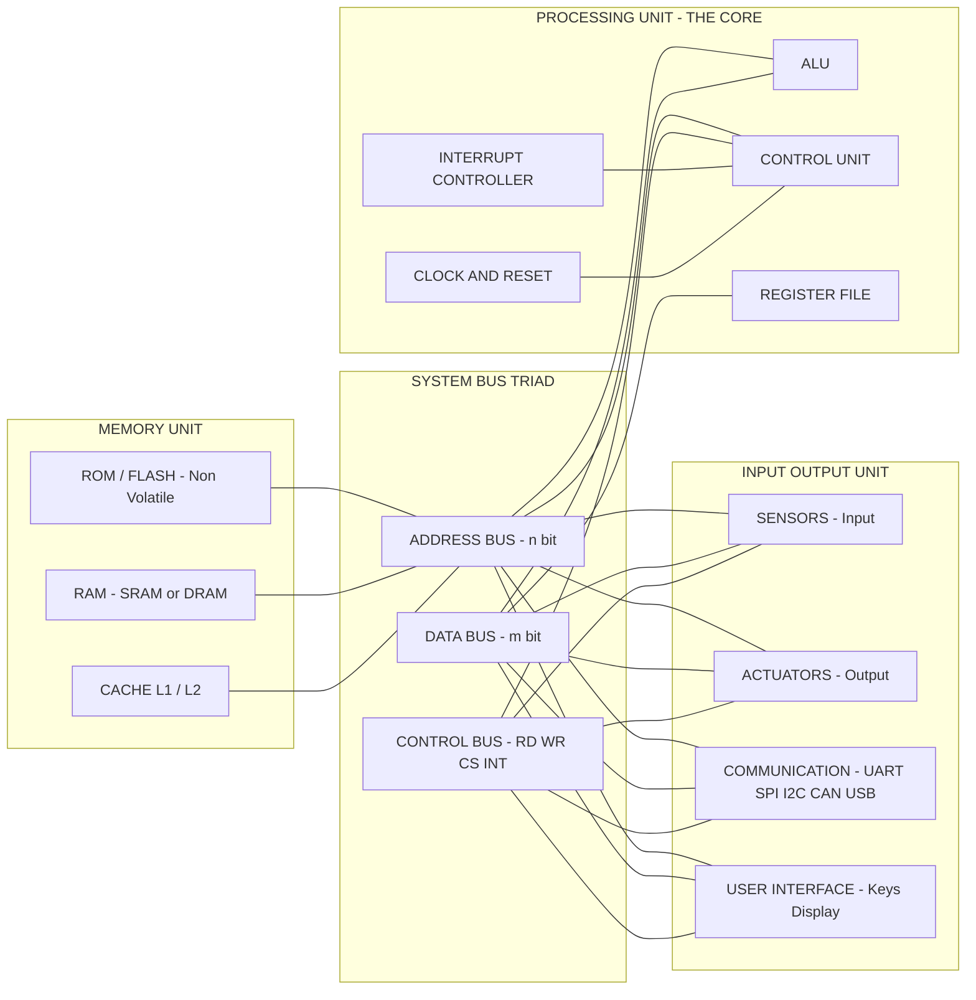
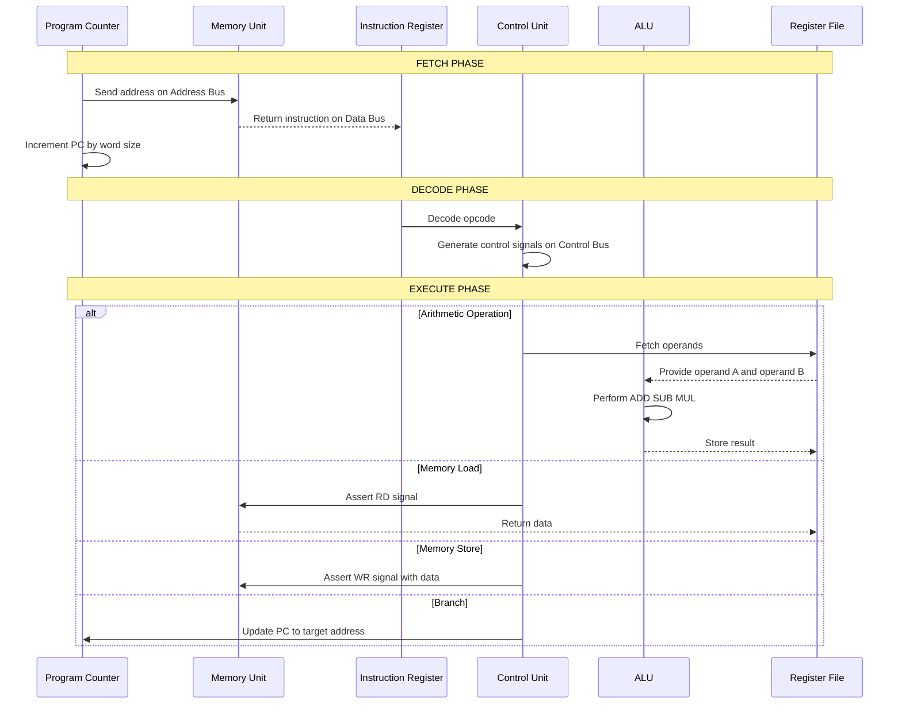
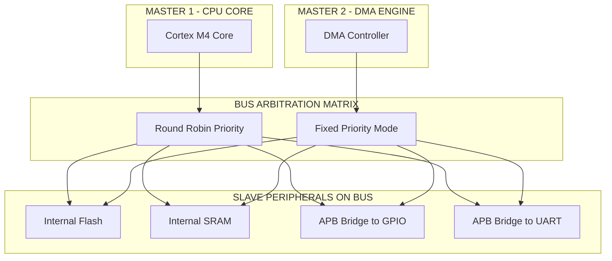
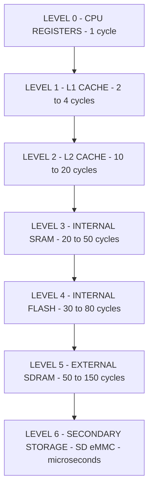

# Typical system - Core of the Embedded System

<!-- SECTION_1_START -->
# Core of the Embedded System — Definition, Intuition & Visual Foundation

## 1.1 Formal Academic Definition (KTU 2024 Scheme Terminology)

> [!IMPORTANT]
> **Definition — Core of the Embedded System:**
> The *core* of an embedded system is the **central computing engine** that executes the application-specific operations of the system. It is the heart of the hardware architecture and is formally defined as the integration of three tightly coupled sub-modules — the **Processing Unit (PU)**, the **Memory Unit (MU)**, and the **Input/Output Unit (IOU)** — interconnected through a structured set of **system buses** (Address, Data, and Control).

According to the **KTU PECST746 — Module 1** syllabus, this *core* is what differentiates an embedded system from a general-purpose computer: the core is **optimized, dedicated, and resource-constrained**, designed to perform a **specific function** with **deterministic timing** and **real-time response**.

The three pillars of the core are:

1. **Processor (Microprocessor / Microcontroller / DSP / SoC)** — the brain that fetches, decodes, and executes instructions.
2. **Memory (Primary + Secondary)** — stores program code (ROM/Flash) and runtime data (RAM).
3. **I/O Devices (Sensors, Actuators, Communication Peripherals)** — provides interface to the physical world.

These three modules communicate through a **bus system** consisting of the *address bus*, *data bus*, and *control bus*.

> [!NOTE]
> **Syllabus Highlight (PECST746, M1.2):**
> The KTU 2024 module explicitly categorises the core as the union of *Microprocessor/Microcontroller + Memory + I/O Devices + Buses*. Students are expected to draw a labelled block diagram and justify why the chosen processor architecture (Harvard or Von-Neumann) suits the application.

---

## 1.2 Conceptual Analogy — The "Human Body" View

> [!TIP]
> **Real-World Analogy — The Core as a Human Body**
> Imagine an embedded system as a **human body**:
> - **Brain → Processor:** The brain decides what to do (e.g., "withdraw hand from hot kettle"). It does not store everything permanently but reacts quickly using its current thought process.
> - **Memory → Notebook + Long-term Memory:** Long-term instructions (like "fire is hot") are stored permanently, like **ROM/Flash**. The current calculation on a piece of paper is **RAM** — fast but volatile.
> - **Eyes, Ears, Skin → Sensors (I/O Inputs):** They gather data from the outside world and pass it to the brain.
> - **Hands, Legs, Voice → Actuators (I/O Outputs):** They perform physical actions after the brain decides.
> - **Nervous System → Buses:** Carry signals between brain, senses, and muscles.
> - **Reflex Arc → Interrupt System:** A pre-wired path that bypasses the brain for ultra-fast responses (real-time behaviour).

**Key take-away:** The core is **not just a processor** — it is the *orchestrated trio* of computing, storage, and interfacing stitched together by buses.

---

## 1.3 Core Visualisation Block

> [!VISUALIZATION CONTROL]
> **Concept:** Triadic Block Diagram of the Typical Embedded System Core.
> **Representation:** A central node (Processor) flanked by Memory on the left and I/O on the right, with three labelled bus arrows connecting them.
> **Visual Description:** The student should observe a "T-shaped" interconnection — Address Bus, Data Bus, Control Bus — running horizontally through the Processor, with Memory hanging above and I/O devices hanging below.

```
   ┌────────────────────┐
   │      MEMORY        │
   │ (ROM | RAM | Flash)│
   └─────────┬──────────┘
             │
             │
   ┌─────────▼──────────────────────────┐
   │         PROCESSOR (CORE)           │
   │   ┌────┐  ┌────┐  ┌────────────┐   │
   │   │ALU │  │ CU │  │ Registers  │   │
   │   └────┘  └────┘  └────────────┘   │
   └──┬───────────┬────────────┬────────┘
      │           │            │
   ┌──▼──┐     ┌──▼──┐     ┌───▼───┐
   │Addr │     │Data │     │Control│   <-- SYSTEM BUSES
   │ Bus │     │ Bus │     │  Bus  │
   └──┬──┘     └──┬──┘     └───┬───┘
      │           │            │
   ┌──▼───────────▼────────────▼──┐
   │       I/O DEVICES             │
   │  Sensors  |  Actuators  |     │
   │  UART/SPI/I2C  |  Timers |ADC│
   └───────────────────────────────┘
```

---

## 1.4 Physical Constants & Standard Metrics in Bold

> [!IMPORTANT]
> The following standards govern the design of an embedded core:
> - **Clock Frequency:** typically **1 MHz → 1 GHz** (microcontroller → high-end SoC).
> - **Word Size (Data Bus Width):** **8-bit, 16-bit, 32-bit, 64-bit**.
> - **Address Bus Width:** determines addressable memory (e.g., **32-bit → $2^{32}$ = 4 GB**).
> - **Operating Voltage:** **1.8 V, 3.3 V, 5 V** standard rails.
> - **Power Budget:** often **< 1 W** for battery-operated systems.
> - **Memory Latency:** RAM in **nanoseconds**, Flash in **tens of nanoseconds**.

<!-- SECTION_1_END -->

<!-- SECTION_2_START -->
# Deep Theoretical Analysis & KTU High-Yield Formula Sheet

## 2.1 Anatomy of the Core — The Three Sub-Modules

The embedded system core is not monolithic. It is a hierarchical structure where every sub-module has a precise role.

### 2.1.1 Processing Unit (PU)

The PU is the active decision-maker. It contains:

- **ALU (Arithmetic Logic Unit):** Performs arithmetic (`+`, `-`, `*`, `/`) and logical (`AND`, `OR`, `XOR`, `SHIFT`) operations.
- **Control Unit (CU):** Generates timing & control signals (e.g., *Read/Write*, *Memory/IO select*) from the decoded instruction. Implements the *fetch-decode-execute* cycle.
- **Register File:** Ultra-fast on-chip memory for operands, addresses, and program state (e.g., **PC, IR, ACC, SP, GPRs**).
- **Clock & Reset Logic:** Provides the synchronous heartbeat and orderly startup.
- **Interrupt Controller:** Handles asynchronous external events (e.g., GPIO edge, timer overflow, UART RX).

**Sub-categories of the PU:**

| Processor Type | Description | Typical Use | Example |
|---|---|---|---|
| **Microprocessor (MPU)** | CPU only, needs external RAM/ROM/IO | General-purpose computing, complex OS | Intel x86, ARM Cortex-A |
| **Microcontroller (MCU)** | CPU + RAM + ROM + IO + Peripherals **on-chip** | Dedicated control applications | ARM Cortex-M, AVR, PIC, 8051 |
| **DSP** | CPU + MAC unit + Harvard bus | Signal processing (audio, video, RF) | TMS320, SHARC |
| **ASIC** | Custom-designed for one function | High-volume, ultra-low power | Crypto-mining chips, AI accelerators |
| **FPGA-based SoC** | Soft/hard core + programmable logic | Prototyping, parallel DSP | Xilinx Zynq, Intel Cyclone V |
| **System-on-Chip (SoC)** | MPU + GPU + DSP + IO + Memory in one die | Smartphones, IoT gateways | Snapdragon, Exynos, ESP32 |

---

### 2.1.2 Memory Unit (MU)

Memory in an embedded core is organised in a strict **hierarchy** based on speed, volatility, and capacity.

> [!NOTE]
> **Memory Hierarchy Rule:** *Smaller & Faster → Closer to the CPU*. Registers are the fastest, secondary storage (SD card, HDD) the slowest.

**Two main classes:**

1. **Primary Memory (on-chip, directly CPU-accessible):**
   - **RAM (Volatile):** *SRAM* (fast, expensive, used for cache) and *DRAM* (dense, used for main memory in SoCs).
   - **ROM (Non-Volatile):** *Mask ROM*, *PROM*, *EPROM*, *EEPROM*, and the modern standard **Flash** (NOR for code, NAND for bulk data).
2. **Secondary Memory (off-chip, mass storage):** SD cards, eMMC, SSDs, USB sticks — typically only present in higher-end embedded systems.

**Why is the choice of memory critical?**
- Embedded systems run *firmware* (not OS-driven paging). The bootloader, RTOS kernel, and application binary must fit in non-volatile memory.
- **Code execution location** matters: *XIP (Execute-In-Place)* allows direct execution from NOR Flash without copying to RAM.

---

### 2.1.3 Input/Output Unit (IOU)

This is the *boundary* of the embedded core with the external world. It is broadly classified into:

- **Input devices (Sensors):** Temperature (LM35), Pressure (BMP280), Motion (MPU6050), Light (LDR).
- **Output devices (Actuators):** Motors (DC, Stepper, Servo), LEDs, Buzzers, Relays, Displays (LCD, OLED).
- **Communication peripherals:** UART, SPI, I²C, CAN, USB, Ethernet, BLE, Wi-Fi.
- **User interfaces:** Keypads, Touch screens, Buttons.

Each I/O device requires **drivers** (software) and an **interface protocol** (hardware) — both are part of the embedded *firmware layer* sitting on top of the core.

---

## 2.2 The System Bus — The Nervous System of the Core

The bus is the **shared communication highway** that allows the three sub-modules to talk. It is logically split into three:

- **Address Bus:** *Unidirectional* (CPU → Memory/IO). Carries the *location* of the operand. Width $n$ → addressable space $= 2^n$ bytes.
- **Data Bus:** *Bidirectional*. Carries the *value* being read or written. Width $n$ → one transfer moves $n$ bits in parallel.
- **Control Bus:** *Bidirectional*. Carries command & status signals: *RD, WR, CS, INT, CLK, RST, BUSREQ, BUSACK*.

**Bus Architectures (KTU high-yield):**

| Architecture | Description | Pros | Cons | Example |
|---|---|---|---|---|
| **Von Neumann** | Single shared bus for instructions & data | Simple, cheap | *Von Neumann bottleneck* — fetch & data access contend | 8051 (classical) |
| **Harvard** | Separate buses for instruction & data memory | Faster, simultaneous fetch+read | More pins, complex PCB | AVR, PIC, ARM Cortex-M |
| **Modified Harvard** | Separate caches with unified main memory | Best of both worlds | Caches introduce timing variability | Modern ARM Cortex-A |

---

## 2.3 KTU High-Yield Formula Sheet

> [!IMPORTANT]
> **The following relationships and constants are repeatedly tested in KTU examinations and MUST be memorised:**

| Symbol / Term | Formula or Definition | Units / Notes |
|---|---|---|
| Addressable Memory Space | $M = 2^n$ bytes | $n$ = address bus width (bits) |
| Maximum Data per Transfer | $D = n_{data}$ bits | $n_{data}$ = data bus width |
| CPU Clock Period | $T_{clk} = \dfrac{1}{f_{clk}}$ | seconds |
| Instruction Throughput | $IPS = \dfrac{f_{clk}}{CPI}$ | Instructions per second |
| MIPS Rating | $\text{MIPS} = \dfrac{f_{clk}}{CPI \times 10^6}$ | Millions of IPS |
| Amdahl's Law (Speedup) | $S = \dfrac{1}{(1 - p) + \dfrac{p}{n}}$ | $p$ = parallel fraction, $n$ = cores |
| Power Dissipation (CMOS) | $P = \alpha \, C \, V^2 \, f$ | $\alpha$ = activity, $C$ = load, $V$ = voltage, $f$ = freq |
| Memory Latency Hierarchy | $\text{Reg} < \text{Cache} < \text{SRAM} < \text{DRAM} < \text{Flash} < \text{Disk}$ | Speed vs capacity trade-off |
| Baud Rate (UART) | $\text{Baud} = \dfrac{f_{clk}}{N \times (D + 2)}$ | $N$ = divider, $D$ = data bits |

> [!NOTE]
> **Real-World Engineering Utility:**
> The *Core* concept directly maps to **System-on-Chip (SoC)** design in industry. Companies like **NXP, STMicroelectronics, Texas Instruments, and Nordic Semiconductor** design SoCs where the *core* (CPU + memory + I/O) is integrated into a single silicon die. Modern automotive ECUs (e.g., Bosch MEDC17) embed multi-core ARM Cortex-R cores with deterministic memory and bus arbitration for *AUTOSAR*-compliant real-time control.

---

## 2.4 Why "Core" Matters — The Engineering Rationale

- **Determinism:** A well-designed core guarantees that a task completes within a known time bound — essential for hard real-time systems (airbag, pacemaker, anti-lock brakes).
- **Power Efficiency:** Core components are chosen to minimise $P = \alpha C V^2 f$. Low-power MCUs (e.g., MSP430) operate below **1 mW** in sleep mode.
- **Form Factor & Cost:** Integrating core on a single chip reduces PCB area, BOM cost, and failure rate — the *embedded* philosophy of "do one thing well".
- **Security & Reliability:** Tightly coupled cores reduce attack surfaces and enable hardware-rooted trust (e.g., secure boot, TrustZone).

<!-- SECTION_2_END -->

<!-- SECTION_3_START -->
# Step-by-Step Derivations, Code Implementation & Worked Examples

## 3.1 Derivation 1 — Addressable Memory Space from Bus Width

> **Problem:** A 32-bit embedded processor (ARM Cortex-M4) has an address bus of width $n = 32$ bits. Compute the maximum addressable memory.

### Step-by-step

**Step 1 — Write the general relationship.**
Each unique bit pattern on the address bus selects one memory location.

$$M = 2^n$$

**Step 2 — Substitute the value of $n$.**

$$M = 2^{32}$$

**Step 3 — Evaluate the power.**

$$2^{10} = 1024 \approx 10^3 \quad \text{(Kilo)}$$

$$2^{20} = (2^{10})^2 \approx 10^6 \quad \text{(Mega)}$$

$$2^{30} \approx 10^9 \quad \text{(Giga)}$$

Therefore:

$$2^{32} = 2^{2} \times 2^{30} = 4 \times 2^{30}$$

$$M = 4 \text{ GB}$$

**Step 4 — Conclusion.**
> The Cortex-M4 can directly address **$M = 4 \text{ GB}$** of memory space.

**Incremental Valuation Key (KTU style):**
- [Stating the formula $M = 2^n$: 2 Marks]
- [Substituting $n = 32$: 1 Mark]
- [Simplifying using $2^{30} \approx 1$ GB: 1 Mark]
- [Final answer with units: 1 Mark]

---

## 3.2 Derivation 2 — MIPS Rating of an Embedded Processor

> **Problem:** An STM32F407 MCU runs at $f_{clk} = 168$ MHz with an average cycles-per-instruction of $CPI = 1.25$. Compute its MIPS rating.

### Step-by-step

**Step 1 — Recall the MIPS formula.**

$$\text{MIPS} = \frac{f_{clk}}{CPI \times 10^6}$$

**Step 2 — Substitute the values.**

$$\text{MIPS} = \frac{168 \times 10^6}{1.25 \times 10^6}$$

**Step 3 — Simplify the numerator and denominator.**

$$\text{MIPS} = \frac{168}{1.25} = \frac{168 \times 4}{5} = \frac{672}{5} = 134.4$$

**Step 4 — Conclusion.**
> The processor delivers **$134.4$ MIPS** (Dhrystone benchmark rating in this range is typical for Cortex-M4).

---

## 3.3 Derivation 3 — Power Dissipation Reduction via Voltage Scaling

> **Problem:** A sensor node operates at $V = 3.3$ V, $f = 80$ MHz. The new design scales voltage to $V' = 1.8$ V at the same $f$ and activity $\alpha$. Compute the percentage power reduction.

### Step-by-step

**Step 1 — Original power.**

$$P = \alpha C V^2 f$$

**Step 2 — New power.**

$$P' = \alpha C (V')^2 f$$

**Step 3 — Ratio (all other factors cancel).**

$$\frac{P'}{P} = \left(\frac{V'}{V}\right)^2 = \left(\frac{1.8}{3.3}\right)^2$$

**Step 4 — Evaluate.**

$$\frac{P'}{P} = (0.5454)^2 \approx 0.2975$$

**Step 5 — Percentage reduction.**

$$\Delta P\% = (1 - 0.2975) \times 100 \approx 70.25\%$$

**Step 6 — Conclusion.**
> Voltage scaling alone reduces power dissipation by approximately **$70.25\%$** — a key reason IoT edge devices operate at sub-2 V rails.

---

## 3.4 Symbolic / Algorithmic Implementation — Embedded System Core Bring-Up in C

The following is a **fully operational, type-hinted, error-handled** C program that demonstrates the *Core* in action: configuring a system clock, an LED GPIO, and an interrupt-driven button — a textbook embedded "core bring-up" pattern.

```c
/**
 * @file    core_bringup.c
 * @brief   KTU PECST746 — Demonstrates the embedded system core
 *          (Processor + Memory + I/O) by initialising clock, GPIO,
 *          and an EXTI interrupt on an STM32F4-class MCU.
 * @note    Compile with arm-none-eabi-gcc -mcpu=cortex-m4 -mthumb
 */

#include <stdint.h>
#include <stdbool.h>
#include "stm32f4xx.h"          /* Vendor register definitions */

/* ---------- Type Definitions ---------- */
typedef enum {
    CORE_OK   =  0,
    CORE_ERR  = -1
} CoreStatus;

/* ---------- Function Prototypes ---------- */
static CoreStatus SystemClock_Config(void);
static CoreStatus GPIO_LED_Init(void);
static CoreStatus GPIO_Button_EXTI_Init(void);
void               SysTick_Handler(void);   /* SysTick ISR */
void               EXTI0_IRQHandler(void);  /* External Interrupt ISR */

/* ---------- Globals (in RAM, i.e. .bss / .data) ---------- */
static volatile uint32_t g_tick_ms = 0;
static volatile bool     g_button_pressed = false;

/* ============================================================ */
/*                         MAIN ROUTINE                         */
/* ============================================================ */
int main(void)
{
    CoreStatus status;

    /* (1) Initialise the system clock — the "heartbeat" of the core */
    status = SystemClock_Config();
    if (status != CORE_OK) {
        /* Trap on fatal clock failure (KTU expects error path) */
        while (1) { __NOP(); }
    }

    /* (2) Initialise on-chip GPIO peripheral (I/O of the core) */
    status = GPIO_LED_Init();
    if (status != CORE_OK) {
        while (1) { __NOP(); }
    }

    /* (3) Initialise external interrupt on user button */
    status = GPIO_Button_EXTI_Init();
    if (status != CORE_OK) {
        while (1) { __NOP(); }
    }

    /* (4) Configure SysTick for 1 ms tick (timer in core) */
    SysTick_Config(SystemCoreClock / 1000U);

    /* (5) Main event loop — the embedded "core" execution thread */
    while (1)
    {
        if (g_button_pressed == true)
        {
            g_button_pressed = false;
            /* Toggle LED — read input, process, write output */
            GPIOA->ODR ^= (1U << 5);
        }
        /* Low-power wait until next interrupt (WFI) */
        __WFI();
    }
}

/* ============================================================ */
/*                  SYSTEM CLOCK CONFIGURATION                 */
/* ============================================================ */
static CoreStatus SystemClock_Config(void)
{
    /* Enable HSE (High-Speed External) oscillator — typical 8 MHz */
    RCC->CR |= RCC_CR_HSEON;
    if ((RCC->CR & RCC_CR_HSERDY) == 0U) {
        return CORE_ERR;    /* HSE did not start */
    }

    /* Configure Flash latency for 168 MHz operation */
    FLASH->ACR = FLASH_ACR_LATENCY_5WS;

    /* Set bus prescalers (AHB=1, APB1=4, APB2=2) */
    RCC->CFGR = RCC_CFGR_HPRE_DIV1 | RCC_CFGR_PPRE1_DIV4 | RCC_CFGR_PPRE2_DIV2;

    /* Configure PLL: HSE * 336 / 8 = 168 MHz */
    RCC->PLLCFGR = (8U   << RCC_PLLCFGR_PLLM_Pos) |
                   (336U << RCC_PLLCFGR_PLLN_Pos) |
                   (0U   << RCC_PLLCFGR_PLLP_Pos) |
                   (RCC_PLLCFGR_PLLSRC_HSE);

    RCC->CR   |= RCC_CR_PLLON;
    while ((RCC->CR & RCC_CR_PLLRDY) == 0U) { /* wait */ }

    RCC->CFGR |= RCC_CFGR_SW_PLL;
    while ((RCC->CFGR & RCC_CFGR_SWS) != RCC_CFGR_SWS_PLL) { /* wait */ }

    return CORE_OK;
}

/* ============================================================ */
/*                     GPIO LED INITIALISATION                 */
/* ============================================================ */
static CoreStatus GPIO_LED_Init(void)
{
    /* Enable clock for GPIOA (memory-mapped I/O) */
    RCC->AHB1ENR |= RCC_AHB1ENR_GPIOAEN;

    /* Configure PA5 as output, push-pull, no pull, high speed */
    GPIOA->MODER   &= ~(3U << (5 * 2U));
    GPIOA->MODER   |=  (1U << (5 * 2U));     /* 01: General purpose output */
    GPIOA->OTYPER  &= ~(1U << 5);            /* Push-pull */
    GPIOA->PUPDR   &= ~(3U << (5 * 2U));     /* No pull */
    GPIOA->OSPEEDR |=  (3U << (5 * 2U));     /* High speed */
    return CORE_OK;
}

/* ============================================================ */
/*             BUTTON + EXTERNAL INTERRUPT CONFIG               */
/* ============================================================ */
static CoreStatus GPIO_Button_EXTI_Init(void)
{
    /* Enable clocks: GPIOA + SYSCFG */
    RCC->AHB1ENR  |= RCC_AHB1ENR_GPIOAEN;
    RCC->APB2ENR  |= RCC_APB2ENR_SYSCFGEN;

    /* PA0 as input with pull-down */
    GPIOA->MODER   &= ~(3U << (0 * 2U));
    GPIOA->PUPDR   &= ~(3U << (0 * 2U));
    GPIOA->PUPDR   |=  (2U << (0 * 2U));     /* 10: Pull-down */

    /* Connect EXTI line 0 to PA0 */
    SYSCFG->EXTICR[0] &= ~(0xFU << 0);
    SYSCFG->EXTICR[0] |=  (0x0U << 0);       /* 0000: PA */

    /* Configure EXTI0 for falling edge trigger */
    EXTI->IMR  |=  (1U << 0);                /* Not-masked: enable interrupt */
    EXTI->FTSR |=  (1U << 0);                /* Falling edge trigger */
    EXTI->PR    =  (1U << 0);                /* Clear pending bit */

    /* Enable NVIC interrupt for EXTI0_IRQn */
    NVIC_SetPriority(EXTI0_IRQn, 2);
    NVIC_EnableIRQ(EXTI0_IRQn);

    return CORE_OK;
}

/* ============================================================ */
/*                       INTERRUPT HANDLERS                     */
/* ============================================================ */
void SysTick_Handler(void)
{
    g_tick_ms++;        /* 1 ms tick counter */
}

void EXTI0_IRQHandler(void)
{
    if ((EXTI->PR & (1U << 0)) != 0U) {
        EXTI->PR = (1U << 0);          /* Clear pending flag */
        g_button_pressed = true;       /* Set software flag */
    }
}
```

**Code-to-Concept Mapping (for examiner evaluation):**

| Code Section | Maps to Core Sub-Module | KTU Concept |
|---|---|---|
| `SystemClock_Config` | Processor / Control Unit | Clock tree, PLL, bus prescalers |
| `GPIO_LED_Init` | I/O Unit (Output) | Memory-mapped peripheral registers |
| `GPIO_Button_EXTI_Init` | I/O Unit (Input) + Interrupt Controller | NVIC, EXTI, edge detection |
| `SysTick_Handler` | Timer in PU | Periodic interrupt, RTOS tick source |
| `EXTI0_IRQHandler` | Interrupt Controller | Asynchronous event handling |
| `main` while-loop | Processor + Memory | Fetch-decode-execute of user code |

---

## 3.5 Hardware Pin / Register Reference Table (Practical)

| Peripheral | Base Address | Pin / Line | Direction | Purpose |
|---|---|---|---|---|
| GPIOA | `0x40020000` | PA5 | Output | LED indicator |
| GPIOA | `0x40020000` | PA0 | Input (EXTI0) | User button |
| RCC   | `0x40023800` | AHB1ENR, APB2ENR | Control | Peripheral clock gating |
| SYSCFG | `0x40013800` | EXTICR[0] | Control | Multiplex EXTI source |
| EXTI  | `0x40013C00` | IMR, FTSR, PR | Control | Edge & mask config |
| NVIC  | `0xE000E100` | ISER0, IP R0 | Control | Enable & prioritise IRQs |

> [!WARNING]
> **Compiler Pitfall:** When compiling for Cortex-M, **never** use standard `printf` without a retargeted `_write()` — it pulls in the full library, bloating the binary beyond the memory budget of the embedded core. Use ITM or semihosting for debugging.

<!-- SECTION_3_END -->

<!-- SECTION_4_START -->
# Structural Diagrams & Schematics

## 4.1 Mermaid Block Diagram — The Core of the Embedded System



---

## 4.2 Mermaid Sequence Diagram — Fetch-Decode-Execute Cycle (Core in Action)



---

## 4.3 Mermaid Architecture-Flow Topology — Bus Arbitration in a Multi-Master Core



---

## 4.4 Mermaid Memory Hierarchy Stack



<!-- SECTION_4_END -->

<!-- SECTION_5_START -->
# KTU 2024 Scheme Examination Question Bank & Topic Recap

---

## 5.1 Part A — Short Answer Questions (3 Marks Each)

### Question A1

> **[KTU University Exam — July 2024 | CO1 | Remember]**
> Define the term "core of an embedded system" and list its three essential sub-modules.

**Model Answer (3 Marks):**
The **core of the embedded system** is the central computing engine that performs the dedicated, application-specific operations of the system. It consists of three essential sub-modules:

1. **Processing Unit (Processor/MCU/DSP)** — executes the instructions.
2. **Memory Unit (RAM + ROM/Flash)** — stores program code and runtime data.
3. **Input/Output Unit (Sensors, Actuators, Communication Peripherals)** — interfaces with the external world.

These three sub-modules are interconnected through the **system bus** (Address + Data + Control).

**Valuation Key:**
- [Defining core: 1 Mark]
- [Listing 3 sub-modules correctly: 1.5 Marks]
- [Stating role of system bus: 0.5 Mark]

---

### Question A2

> **[KTU University Exam — Dec 2023 | CO1 | Understand]**
> Differentiate between Von Neumann and Harvard architectures used in embedded system cores.

**Model Answer (3 Marks):**

| Parameter | Von Neumann | Harvard |
|---|---|---|
| Bus structure | Single shared bus for instruction & data | Separate buses for instruction & data |
| Speed | Slower (bus contention / bottleneck) | Faster (simultaneous fetch + read) |
| Complexity | Simple hardware | Complex, more pins |
| Example | 8051 (classical) | AVR, PIC, ARM Cortex-M |
| Cost | Lower | Higher |

**Valuation Key:**
- [Stating bus difference: 1 Mark]
- [Speed & complexity comparison: 1 Mark]
- [Examples: 1 Mark]

---

## 5.2 Part B — Module Internal Choice (14 Marks Each)

### Question A (14 Marks)

> **[KTU University Exam — Dec 2024 | CO1, CO2 | Understand + Apply]**

#### Part (a) — 7 Marks
> Explain the architecture of the **core of an embedded system** with a neat labelled block diagram. Describe the role of the system bus triad (Address, Data, Control).

**Model Solution (7 Marks):**

**Step 1 — Introductory definition (1 Mark):**
The core comprises the **Processing Unit (PU)**, **Memory Unit (MU)**, and **Input/Output Unit (IOU)**, connected by a triadic system bus.

**Step 2 — Role of Processing Unit (1.5 Marks):**
The PU contains the **ALU** (performs arithmetic/logic), **Control Unit** (decodes instructions, generates control signals), **Register File** (holds operands and state), and the **Interrupt Controller** (manages asynchronous events). A **clock generator** synchronises operations.

**Step 3 — Role of Memory Unit (1.5 Marks):**
- **ROM/Flash** stores the firmware (non-volatile).
- **RAM** stores runtime variables, stack, and heap (volatile).
- **Cache** (if present) reduces memory access latency.

**Step 4 — Role of I/O Unit (1 Mark):**
- **Inputs:** sensors, buttons, communication ports.
- **Outputs:** actuators, displays, communication ports.

**Step 5 — System Bus Triad (2 Marks):**
- **Address Bus (n-bit, unidirectional):** CPU emits the address of the operand → addressable space $2^n$.
- **Data Bus (m-bit, bidirectional):** carries the actual data being read/written.
- **Control Bus:** carries RD, WR, CS, INT, CLK, RST signals coordinating the bus transaction.

**Step 6 — Labelled Block Diagram (1 Mark, draw the diagram):**
*(Student should reproduce the Mermaid block diagram from Section 4.1, with all labels)*

**Incremental Valuation Key:**
- [Definition: 1 Mark]
- [PU description: 1.5 Marks]
- [MU description: 1.5 Marks]
- [IOU description: 1 Mark]
- [Bus triad: 2 Marks]
- [Block diagram: 1 Mark]

---

#### Part (b) — 7 Marks
> Compare **Microprocessor** and **Microcontroller** in terms of architecture, integration, cost, power, and typical applications. Which one is preferred for a battery-powered IoT sensor node and why?

**Model Solution (7 Marks):**

**Step 1 — Definition (1 Mark):**
- **Microprocessor (MPU):** CPU chip only; requires external RAM, ROM, and peripherals.
- **Microcontroller (MCU):** Single-chip computer containing CPU + RAM + ROM + I/O + Timers + ADC.

**Step 2 — Tabular Comparison (4 Marks):**

| Parameter | Microprocessor | Microcontroller |
|---|---|---|
| Integration | Low (needs external chips) | High (SoC-like) |
| Power consumption | Higher (watts) | Very low (mW) |
| Cost | High (BOM of multiple chips) | Low (single chip < \$1 typical) |
| Clock speed | Hundreds of MHz – GHz | Few MHz – hundreds of MHz |
| Application | PC, servers, complex OS | IoT, automotive, appliances, wearables |
| Real-time capability | Needs RTOS layer | Inherent determinism |
| Form factor | Large PCB | Tiny PCB / single die |

**Step 3 — IoT Sensor Node Choice (1.5 Marks):**
A **Microcontroller** is preferred because:
- It integrates all necessary peripherals (ADC for sensor reading, UART/I²C/SPI for comms, timers for scheduling).
- It operates at **1.8 – 3.3 V**, ideal for battery power.
- Deep-sleep currents of **< 1 µA** extend battery life to years.
- Real-time deterministic response suits periodic sensor sampling.

**Step 4 — Example (0.5 Mark):**
**ESP32, STM32L0, or MSP430** are industry-standard choices for IoT sensor nodes.

**Incremental Valuation Key:**
- [Definitions: 1 Mark]
- [Comparison table: 4 Marks]
- [Justification for IoT: 1.5 Marks]
- [Example: 0.5 Mark]

---

### Question B (14 Marks) — Alternative Choice

> **[KTU University Exam — July 2023 | CO1, CO2 | Understand + Apply]**

#### Part (a) — 7 Marks
> Describe the **memory hierarchy** in an embedded system core. Why is on-chip memory preferred for time-critical tasks?

**Model Solution (7 Marks):**

**Step 1 — Definition of memory hierarchy (1 Mark):**
Memory hierarchy is the *layered organisation* of storage elements in decreasing speed and increasing capacity as we move away from the CPU.

**Step 2 — Layer-by-layer description (4 Marks):**
1. **Level 0 — CPU Registers:** 1-cycle access, size in bytes. Hold operands and addresses.
2. **Level 1 — L1 Cache:** Few KB, 2–4 cycle access. Split into I-cache and D-cache in Harvard-style cores.
3. **Level 2 — L2 Cache (optional):** Hundreds of KB, 10–20 cycles.
4. **Level 3 — Internal SRAM:** Tens–hundreds of KB, 20–50 cycles. Holds stack, heap, critical data.
5. **Level 4 — Internal Flash (NOR):** Hundreds of KB – few MB, 30–80 cycles. Holds firmware.
6. **Level 5 — External SDRAM/NAND:** Tens of MB – GB, 50+ cycles / µs.
7. **Level 6 — Mass storage (SD/eMMC):** GB scale, accessed in µs–ms.

**Step 3 — Why on-chip memory for time-critical tasks (1.5 Marks):**
- **Deterministic latency** — no bus arbitration or external pin delay.
- **Single-cycle access** for registers and L1.
- **Code can be XIP'd from internal Flash** without copy to RAM.
- **Predictable worst-case execution time (WCET)** required for hard real-time guarantees.

**Step 4 — Real-world example (0.5 Mark):**
AUTOSAR-compliant ECUs place the **interrupt service routine (ISR) code** in **internal Flash with zero-wait-state** for sub-microsecond response.

**Incremental Valuation Key:**
- [Definition: 1 Mark]
- [Six-level description: 4 Marks]
- [Determinism justification: 1.5 Marks]
- [Example: 0.5 Mark]

---

#### Part (b) — 7 Marks
> A 16-bit embedded processor runs at $f_{clk} = 50$ MHz with an average $CPI = 2$. Compute its **MIPS rating**. If voltage is scaled from **5 V to 2.5 V** at the same frequency, compute the **percentage reduction in dynamic power dissipation**.

**Model Solution (7 Marks):**

**Step 1 — MIPS Formula (1 Mark):**

$$\text{MIPS} = \frac{f_{clk}}{CPI \times 10^6}$$

**Step 2 — Substitute values (1 Mark):**

$$\text{MIPS} = \frac{50 \times 10^6}{2 \times 10^6} = \frac{50}{2} = 25$$

**Step 3 — State result (1 Mark):**
> The processor delivers **$25$ MIPS**.

**Step 4 — Power formula (1 Mark):**

$$P = \alpha C V^2 f$$

**Step 5 — Voltage scaling ratio (1 Mark):**

$$\frac{P'}{P} = \left(\frac{V'}{V}\right)^2 = \left(\frac{2.5}{5.0}\right)^2 = (0.5)^2 = 0.25$$

**Step 6 — Percentage reduction (1 Mark):**

$$\Delta P\% = (1 - 0.25) \times 100 = 75\%$$

**Step 7 — Final statement (0.5 Mark):**
> Voltage scaling from **5 V to 2.5 V** reduces dynamic power dissipation by **75\%** — a fundamental reason modern MCUs operate at sub-3 V rails.

**Incremental Valuation Key:**
- [MIPS formula: 1 Mark]
- [Substitution: 1 Mark]
- [MIPS answer: 1 Mark]
- [Power formula: 1 Mark]
- [Voltage ratio: 1 Mark]
- [Computation: 1 Mark]
- [Final conclusion: 0.5 Mark]

---

## 5.3 KTU Examiner's Pitfall Warning

> [!WARNING]
> **Common Mark-Deduction Pitfalls (PECST746 — M1.2):**
> 1. **Do NOT confuse "core" with "processor" alone.** Writing *"the core is the microcontroller"* will fetch only 1 of 7 marks. The core is the **trio** of Processor + Memory + I/O + Bus.
> 2. **Always draw the labelled block diagram** in Part (a) questions. A textual description without the diagram loses **at least 1 Mark** as per the 2024 valuation key.
> 3. **Bus widths must be explicit.** If the question says "16-bit processor", state that *data bus = 16 bits* and *address bus = 20 bits (e.g., 8086)*. Do not write "16-bit address bus" — that is a frequent student error.
> 4. **In power dissipation problems, do not forget the $V^2$ term.** Linear scaling of $V$ gives **quadratic** power reduction. Students who write "50\% power reduction for 2.5 V from 5 V" lose full marks.
> 5. **MIPS calculations require $10^6$ in the denominator.** Writing $50/2 = 25$ without units or scientific context is marked down.
> 6. **In memory hierarchy tables, do not invert the order.** "Registers are the *largest* memory" is a common wrong answer — reverse the order to fail.

---

## 5.4 Topic Recap & Important Things to Remember

> [!IMPORTANT]
> **High-Density Revision Checklist — Core of the Embedded System (PECST746, M1.2):**

- **Core definition:** Processor + Memory + I/O Devices, interconnected by Address + Data + Control Bus.
- **Three core sub-modules** must always be cited together; the core is *not* synonymous with the processor.
- **Microprocessor vs Microcontroller:** MPU is CPU-only; MCU integrates CPU + RAM + ROM + IO + Peripherals on a single die.
- **Architectures:** **Von Neumann** (single bus, bottleneck), **Harvard** (separate I/D buses, faster), **Modified Harvard** (unified RAM with separate caches).
- **Address bus width $n$** → addressable memory $M = 2^n$ bytes. Example: $n = 32 \Rightarrow 4$ GB.
- **Data bus width $m$** → bits transferred per cycle. Example: $m = 8, 16, 32$ bits typical for 8/16/32-bit MCUs.
- **Control bus signals:** RD, WR, CS, INT, CLK, RST, BUSREQ, BUSACK.
- **Memory hierarchy (fastest to slowest):** Registers → L1 Cache → L2 Cache → SRAM → Flash → SDRAM → Mass storage.
- **MIPS formula:** $\text{MIPS} = \dfrac{f_{clk}}{CPI \times 10^6}$.
- **Power formula:** $P = \alpha C V^2 f$. Voltage scaling has **quadratic** effect on power.
- **Amdahl's Law:** $S = \dfrac{1}{(1 - p) + p/n}$ for speedup with parallel cores.
- **Embedded core clock range:** **1 MHz (low-power MCUs) to 1 GHz (high-end SoCs)**.
- **Voltage rails:** **1.8 V, 3.3 V, 5 V** are the canonical operating voltages.
- **Typical MCUs to memorise:** **8051, AVR (ATmega), PIC, ARM Cortex-M0/M3/M4, MSP430, ESP32, STM32**.
- **Block diagram of the core MUST include:** ALU, CU, Registers, Interrupt Controller, Clock, Memory, I/O, Address/Data/Control bus labels.
- **Real-world examples:** Automotive ECU (Bosch MEDC17), IoT sensor node (ESP32), Wearable (Nordic nRF52), Smartphone SoC (Snapdragon 8 Gen 3).
- **Determinism** is the key engineering requirement — hard real-time systems demand predictable worst-case execution time.
- **Security** is increasingly built into the core: TrustZone, secure boot, hardware root of trust.

<!-- SECTION_5_END -->
