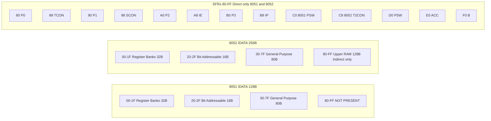
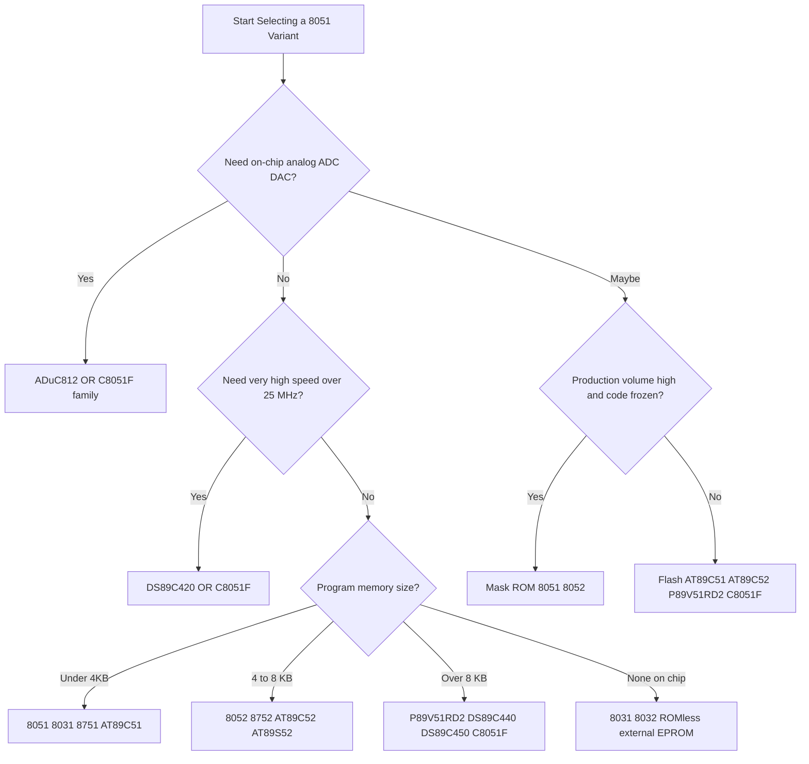
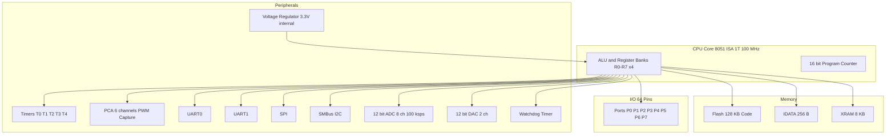

# 8051/52 Variants

<!-- SECTION_1_START -->

# 8051/52 Microcontroller Variants — Core Foundations

## 1.1 Formal Academic Definition

The **8051/52 family** refers to the broad range of microcontrollers manufactured by various vendors (Intel, Atmel, Philips/NXP, Dallas/Maxim, Silicon Labs, Analog Devices) that share the same **MCS-51 Instruction Set Architecture (ISA)** and **CPU core** as the original Intel **MCS-51** introduced in **1980**. While the *CPU, register set, instruction set, and pin-out* of the original 40-pin DIP package are preserved across this family, vendors enhance the silicon with on-chip peripherals, larger memories, and improved features.

> [!IMPORTANT]
> **KTU 2024 Syllabus Highlight (PCCST746 - Module 2):**
> "Study of 8051/52 variants such as 8051, 8052, 8031, 8032, 8751, 8752, AT89C51, AT89C52, DS89C420/430, P89V51RD2, ADuC812, and C8051Fxxx with respect to architecture, memory, timers, I/O and special features."

## 1.2 Conceptual Analogy — The "Car Platform" View

Think of the 8051 as a **famous car chassis** (like a Volkswagen Beetle platform). The original Beetle had a basic engine, basic seats, and basic features. Over the decades, many manufacturers (vendors) took the *same chassis and engine architecture* and produced many variants:

- **Basic model** (8031) — chassis with no body (no ROM, needs external program memory)
- **Standard model** (8051) — full body, basic interior
- **Deluxe model** (8052) — bigger trunk (more RAM), more dashboard controls (3 timers)
- **Sport edition** (DS89C420) — turbocharged (33 MHz, single-cycle core)
- **Luxury/Modern edition** (C8051Fxxx) — leather seats, GPS, sensors (ADC, DAC, PCA), high-speed networking

The **engine (CPU), gear-box (instruction set), and steering wheel (register set)** remain *exactly the same* — only the *features, body, and electronics* are upgraded.

## 1.3 Physical Constants & Standard Metrics

- **Original 8051 Clock Frequency:** $f_{OSC} = \mathbf{12\text{ MHz}}$ (1 $\mu$s machine cycle)
- **One Machine Cycle = 12 Oscillator Periods** (12T mode)
- **DS89C420 Maximum Clock:** $f_{OSC} = \mathbf{33\text{ MHz}}$
- **C8051Fxxx Maximum Clock:** $f_{OSC} = \mathbf{25\text{ to\ 100\text{ MHz}}$
- **Standard Operating Voltage:** $V_{CC} = \mathbf{+5\text{ V DC}}$ (some low-power variants support **2.7 V – 3.6 V**)
- **Standard Package:** 40-pin DIP, 44-pin PLCC/QFP

> [!NOTE]
> **Quick Recall Box:**
> - $1$ Machine Cycle = $12 / f_{OSC}$ seconds (in standard 8051).
> - $1$ Machine Cycle = $1 / f_{OSC}$ seconds (in enhanced 8051 cores like DS89C420 and C8051F — single-cycle core).

## 1.4 Visualization Control — Feature Comparison

> [!VISUALIZATION CONTROL]
> **Concept:** Memory size comparison across 8051/52 variants
> **Bar-Chart Style Data Points (X-axis = Variant, Y-axis = Bytes):**
> - `8031 → ROM=0, RAM=128`
> - `8051 → ROM=4096, RAM=128`
> - `8052 → ROM=8192, RAM=256`
> - `8751 → UV-EPROM=4096, RAM=128`
> - `DS89C420 → Flash=16384, RAM=256`
> - `C8051F120 → Flash=128000, RAM=8448`
>
> **Visual Description:** Observe the dramatic step-up in both program memory (ROM/Flash) and data memory (RAM) as we move from legacy to modern 8051 variants. RAM doubles from 128 → 256 bytes, while Flash grows from 4 KB → 128 KB.

<!-- SECTION_1_END -->

<!-- SECTION_2_START -->

# Deep Theoretical Analysis & KTU High-Yield Formula Sheet

## 2.1 Why Do Variants Exist? (The "Why")

The original **Intel 8051** (1980) was a groundbreaking MCU but had several limitations:
1. **Small on-chip ROM** (only 4 KB mask-ROM) — fixed at fabrication.
2. **Limited RAM** (128 bytes internal).
3. **Slow execution** (12 clock cycles per machine cycle).
4. **No in-system reprogrammability** (mask-ROM cannot be re-programmed).

To overcome these, **vendors created variants** for specific embedded applications. A *variant* is selected based on:
- **Application volume** → mask-ROM (8051) for mass production, Flash (AT89C51) for prototyping.
- **Memory requirement** → 8051 (4 KB) for small jobs, 8052 (8 KB) for medium jobs.
- **Speed requirement** → DS89C420/C8051F for high-speed real-time systems.
- **Analog integration** → ADuC812 for sensor-based data acquisition.
- **Power constraint** → LPC/SiLabs low-power variants for battery IoT nodes.

## 2.2 Classification of 8051/52 Variants

Variants are classified along **four orthogonal axes**:

| Axis | Categories | Examples |
|---|---|---|
| **Program Memory Type** | Mask-ROM / UV-EPROM / Flash / OTP / External | 8051, 8751, AT89C51, 8031 |
| **Memory Size** | 4 KB / 8 KB / 16 KB / 64 KB+ | 8051, 8052, DS89C420, C8051F |
| **Vendor / Peripherals** | Atmel, Philips, Dallas, SiLabs, ADI | AT89C51, P89V51RD2, DS89C420, C8051F, ADuC812 |
| **Performance** | Standard 12T / Enhanced 6T / Single-cycle 1T | 8051, AT89C51, DS89C420 |

> [!TIP]
> **Examiner's Tip:** In KTU exams, questions on variants typically test **(a) memory map differences, (b) number of timers/UARTs, (c) special feature differences (ADC, PCA, Watchdog)**. Memorize the 8051 → 8052 upgrade path first, then vendor-specific enhancements.

## 2.3 Detailed Variant-by-Variant Analysis

### 2.3.1 8051 — The "Original"
- **Memory:** 4 KB ROM, 128 B RAM.
- **Timers:** 2 (T0, T1).
- **UART:** 1 (full-duplex).
- **I/O Ports:** 4 × 8-bit (P0, P1, P2, P3).
- **Program Memory:** Mask-ROM (one-time programmable at fab).
- **Use case:** High-volume consumer products (TV remotes, washing machine controllers).

### 2.3.2 8052 — The "Enhanced"
- **Memory:** 8 KB ROM, **256 B RAM** (double!), **16-bit Timer 2** added.
- **Use case:** Applications needing more variables in RAM (e.g., small RTOS, look-up tables).

### 2.3.3 8031 / 8032 — The "ROM-less"
- **8031:** 0 KB internal ROM, 128 B RAM — must use **external program memory** (PSEN̄ pin active).
- **8032:** 0 KB internal ROM, 256 B RAM + Timer 2.
- **Use case:** Prototyping, large firmware (>64 KB external).

### 2.3.4 8751 / 8752 — The "UV-EPROM"
- **8751:** 4 KB **UV-EPROM** (erasable via UV light through quartz window, ~20 min).
- **8752:** 8 KB UV-EPROM + 256 B RAM + Timer 2.
- **Use case:** Development and education (erasable + reprogrammable, but slow erase).

### 2.3.5 AT89C51 / AT89C52 (Atmel)
- **Memory:** 4 KB / 8 KB **Flash ROM** (1000+ erase/write cycles).
- **In-System Programmable (ISP)** via parallel programming.
- **Peripherals:** Same as 8051/8052 + Watchdog Timer.
- **Use case:** Most popular *academic* and *hobbyist* MCU (ARDUINO predecessor boards).

### 2.3.6 AT89S52 (Atmel, SPI Programming)
- **Memory:** 8 KB Flash, 256 B RAM.
- **Adds:** Hardware **SPI** interface, hardware **Watchdog**, dual data pointer.
- **Use case:** Replaces AT89C52; supports ISP via SPI.

### 2.3.7 P89V51RD2 (Philips/NXP)
- **Memory:** **64 KB** Flash, 1 KB RAM, 32 KB **XDATA** (external data Flash).
- **Adds:** In-Application Programming (IAP), 2× UARTs (in some packages), dual DPTR.
- **Use case:** Industrial control, large firmware.

### 2.3.8 DS89C420 / DS89C430 / DS89C440 / DS89C450 (Dallas/Maxim)
- **Memory:** 16 KB / 16 KB / 64 KB / 64 KB Flash, 256 B / 256 B / 1 KB / 1 KB RAM.
- **Speed:** Up to **33 MHz** with **single-cycle 8051 core** (1 clock per machine cycle).
- **Performance:** 10× the original 8051 MIPS rating.
- **Adds:** Two **full-duplex UARTs**, **Watchdog**, **Power-on Reset**, dual DPTR.
- **Use case:** High-speed serial comms, multi-drop RS-485 networks.

### 2.3.9 ADuC812 (Analog Devices — MicroConverter®)
- **Memory:** 8 KB Flash, 256 B RAM, 640 B XRAM.
- **Special:** On-chip **12-bit ADC** (8 channels, 200 kSPS), **2× 12-bit DAC**, temperature sensor.
- **Use case:** Precision data acquisition, smart sensors, instrumentation.

### 2.3.10 C8051Fxxx (Silicon Labs)
- **Memory:** 8 KB – 128 KB Flash, 256 B – 8 KB RAM.
- **Speed:** 25–100 MHz, single-cycle core.
- **Peripherals:** 10/12-bit **ADC** (up to 16 channels, 1 MSPS), **DAC**, **PCA** (Programmable Counter Array — PWM, capture, software timer), **SMBus/I²C, SPI, UART**, **USB** (in some F320/F340).
- **Use case:** Modern IoT, mixed-signal embedded systems, motor control.

## 2.4 KTU High-Yield Formula Sheet (Master Comparison Table)

| Feature | 8051 | 8052 | 8031 | 8751 | AT89C51 | AT89S52 | P89V51RD2 | DS89C420 | ADuC812 | C8051F120 |
|---|---|---|---|---|---|---|---|---|---|---|
| **Program Memory** | 4 KB ROM | 8 KB ROM | None (Ext.) | 4 KB EPROM | 4 KB Flash | 8 KB Flash | 64 KB Flash | 16 KB Flash | 8 KB Flash | 128 KB Flash |
| **Data RAM (IDATA)** | 128 B | **256 B** | 128 B | 128 B | 128 B | 256 B | 1 KB | 256 B | 256 B | 8 KB |
| **XRAM (External)** | 0 | 0 | 64 KB ext | 0 | 0 | 0 | 32 KB ext | 0 | 640 B | 256 B |
| **Timers** | 2 | **3** | 2 | 2 | 2 | 2 | 2 | 2 | 2 | 5 (PCA + T0-T4) |
| **UARTs** | 1 | 1 | 1 | 1 | 1 | 1 | 1–2 | **2** | 1 | 2 |
| **I/O Pins** | 32 | 32 | 32 | 32 | 32 | 32 | 32 | 32 | 32 | 64 |
| **Max Clock (MHz)** | 12 | 12 | 12 | 12 | 24 | 33 | 40 | **33** | 16 | **100** |
| **Machine Cycle (T)** | 12 | 12 | 12 | 12 | 12 | 12 | 6 | **1** | 12 | **1** |
| **Watchdog** | No | No | No | No | No | **Yes** | Yes | Yes | Yes | Yes |
| **ADC** | No | No | No | No | No | No | No | No | **12-bit, 8-ch** | **12-bit, 8-ch** |
| **DAC** | No | No | No | No | No | No | No | No | **12-bit, 2-ch** | **12-bit, 2-ch** |
| **SPI/I²C (HW)** | No | No | No | No | No | **SPI** | No | No | No | **Yes** |
| **In-System Prog.** | No | No | N/A | No (UV) | Yes | Yes (SPI) | Yes (IAP) | Yes | Yes | Yes |
| **Operating Voltage** | 5 V | 5 V | 5 V | 5 V | 5 V | 5 V | 5 V | 5 V | 3 / 5 V | 3.3 V |
| **Dual DPTR** | No | No | No | No | No | **Yes** | Yes | Yes | Yes | Yes |
| **Typical Vendor** | Intel | Intel | Intel | Intel | Atmel | Atmel | Philips | Dallas | Analog Dev. | Silicon Labs |

> [!NOTE]
> **Critical Engineering Rule of Thumb:**
> 8052 = 8051 + **128 B extra RAM** + **Timer 2** + **2 KB extra ROM**.
> 8031 = 8051 with **internal ROM removed** (must use external EPROM with PSEN̄).

## 2.5 Real-World Engineering Utility

| Variant | Real Engineering Application |
|---|---|
| **8051 (Mask-ROM)** | Microwave oven controllers, washing machine timers — millions of units |
| **AT89C51/S52** | Academic labs, hobbyist projects, basic industrial relays |
| **P89V51RD2** | Building elevator controllers, vending machines |
| **DS89C420** | High-speed RS-485 multi-drop networks, barcode scanners |
| **ADuC812** | Smart weigh scales, pH meters, thermocouple-based furnace control |
| **C8051Fxxx** | Drones, BLDC motor drives, USB peripherals, IoT sensor nodes |

<!-- SECTION_2_END -->

<!-- SECTION_3_START -->

# Step-by-Step Derivations, Code & Symbolic Implementation

## 3.1 Derivation: Memory Map of 8051 vs 8052

### 3.1.1 8051 Internal Data Memory (128 B)

The 8051 has a **128-byte internal RAM** divided into three regions:

| Address Range (Hex) | Region | Size | Purpose |
|---|---|---|---|
| $00 - $1F | Register Banks (R0–R7 × 4) | 32 B | Quick context switching via PSW.3, PSW.4 |
| $20 - $2F | Bit-Addressable RAM | 16 B | 128 individually-addressable bits ($00 – $7F) |
| $30 - $7F | General Purpose RAM | 80 B | Stack, variables |

Total = 32 + 16 + 80 = **128 Bytes**. ✓

### 3.1.2 8052 Internal Data Memory (256 B)

The 8052 extends the upper region:

| Address Range (Hex) | Region | Size |
|---|---|---|
| $00 - $1F | Register Banks | 32 B |
| $20 - $2F | Bit-Addressable RAM | 16 B |
| $30 - $7F | General Purpose RAM | 80 B |
| **$80 - $FF** | **Upper RAM (Indirect only)** | **128 B** |

Total = 32 + 16 + 80 + 128 = **256 Bytes**. ✓

The upper 128 B ($80 – $FF) is **SFR-overlapping** in address space but physically separate. It is accessible **only via indirect addressing** (using @R0/@R1 with R0/R1 = $80–$FF), not direct addressing (which would access SFRs).

### 3.1.3 8052 — Special Function Registers (SFRs) Added

| SFR | Address | Function |
|---|---|---|
| T2CON | $C8 | Timer 2 Control |
| RCAP2L | $CA | Timer 2 Reload — Low |
| RCAP2H | $CB | Timer 2 Reload — High |
| TL2 | $CC | Timer 2 Low byte |
| TH2 | $CD | Timer 2 High byte |

> [!IMPORTANT]
> **SFR Address Boundary:** All SFRs are mapped to **$80 – $FF**. The 8051 maps the bit-addressable SFRs ($80–$F0) in 16-byte blocks ($80, $88, $90, $98, $A0, $A8, $B0, $B8, $C0, $C8, $D0, $D8, $E0, $E8, $F0, $F8). The 8052 adds T2CON at $C8.

## 3.2 Symbolic Derivation: Machine Cycle vs Clock Period

### 3.2.1 Standard 8051 (12T mode)

$$T_{MC} = \frac{12}{f_{OSC}}$$

where $T_{MC}$ = one machine cycle period (seconds), $f_{OSC}$ = crystal oscillator frequency (Hz).

**Example:** For $f_{OSC} = 12 \text{ MHz}$:
$$T_{MC} = \frac{12}{12 \times 10^6} = 1 \text{ } \mu s$$

### 3.2.2 DS89C420 / C8051F (1T mode, single-cycle core)

$$T_{MC} = \frac{1}{f_{OSC}}$$

**Example:** For $f_{OSC} = 33 \text{ MHz}$ (DS89C420):
$$T_{MC} = \frac{1}{33 \times 10^6} \approx 30.3 \text{ ns}$$

Speed-up factor:
$$\text{Speed-up} = \frac{T_{MC}^{\text{std}}}{T_{MC}^{\text{enh}}} = \frac{1 \text{ } \mu s}{30.3 \text{ ns}} \approx 33 \times$$

This is why DS89C420 is called a "**33 MIPs**" device — it executes **33 million 1-byte instructions per second** at 33 MHz, compared to 8051's 1 MIPS at 12 MHz.

## 3.3 Step-by-Step Code Example — Detecting a Variant by SFR

Since the **Timer 2 SFR (T2CON at $C8)** exists only on 8052-class chips, software can detect the variant at runtime:

```c
#include <reg51.h>  // Generic 8051 header

// Generic 8051 header does NOT define T2CON.
// For 8052/AT89C52 we include <reg52.h> instead.

sfr16 T2 = 0xCC;  // Timer 2 16-bit register at 0xCC

void detect_variant(void) {
    unsigned char temp;
    
    // Read SFR at 0xC8 (T2CON)
    temp = *((unsigned char volatile xdata *)0xC8);
    // If reading 0xC8 returns the value last written or a valid bit pattern,
    // the chip has T2CON (8052 family).
    // On 8051, address 0xC8 may not physically exist — it is undefined.
    
    P1 = temp;  // Display on Port 1
}
```

> [!NOTE]
> The detection trick: write a known pattern to $C8 (T2CON), then read it back. If the value matches, it's an 8052/52-class chip. On 8051, the read is undefined (some silicon returns $FF, some $00).

## 3.4 Python Simulation — Variant Feature Lookup

```python
from typing import Dict, List, NamedTuple
import logging

logging.basicConfig(level=logging.INFO, format='%(levelname)s: %(message)s')

class MCUVariant(NamedTuple):
    name: str
    rom_kb: int
    ram_bytes: int
    timers: int
    uarts: int
    max_clock_mhz: float
    machine_cycle_t: int
    has_watchdog: bool
    has_adc: bool
    has_dac: bool
    has_spi_hw: bool
    has_i2c_hw: bool
    vendor: str

VARIANTS: Dict[str, MCUVariant] = {
    "8051":      MCUVariant("8051",      4,  128, 2, 1, 12.0, 12, False, False, False, False, False, "Intel"),
    "8052":      MCUVariant("8052",      8,  256, 3, 1, 12.0, 12, False, False, False, False, False, "Intel"),
    "8031":      MCUVariant("8031",      0,  128, 2, 1, 12.0, 12, False, False, False, False, False, "Intel"),
    "8032":      MCUVariant("8032",      0,  256, 3, 1, 12.0, 12, False, False, False, False, False, "Intel"),
    "8751":      MCUVariant("8751",      4,  128, 2, 1, 12.0, 12, False, False, False, False, False, "Intel"),
    "8752":      MCUVariant("8752",      8,  256, 3, 1, 12.0, 12, False, False, False, False, False, "Intel"),
    "AT89C51":   MCUVariant("AT89C51",   4,  128, 2, 1, 24.0, 12, False, False, False, False, False, "Atmel"),
    "AT89S52":   MCUVariant("AT89S52",   8,  256, 2, 1, 33.0, 12, True,  False, False, True,  False, "Atmel"),
    "P89V51RD2": MCUVariant("P89V51RD2", 64, 1024, 2, 2, 40.0,  6, True,  False, False, False, False, "Philips"),
    "DS89C420":  MCUVariant("DS89C420",  16, 256, 2, 2, 33.0,  1, True,  False, False, False, False, "Dallas"),
    "ADuC812":   MCUVariant("ADuC812",   8,  256, 2, 1, 16.0, 12, True,  True,  True,  False, False, "Analog Devices"),
    "C8051F120": MCUVariant("C8051F120", 128, 8448, 5, 2, 100.0, 1, True,  True,  True,  True,  True,  "Silicon Labs"),
}

def compute_mips(variant: MCUVariant) -> float:
    """Compute instructions-per-second (single-byte instructions)."""
    if variant.machine_cycle_t == 0:
        raise ValueError(f"Machine cycle T=0 invalid for {variant.name}")
    return (variant.max_clock_mhz * 1e6) / variant.machine_cycle_t / 1e6  # in MIPS

def is_modern_high_speed(variant: MCUVariant) -> bool:
    """Modern = single-cycle core AND high speed."""
    return variant.machine_cycle_t <= 1 and variant.max_clock_mhz >= 25.0

def has_analog_integration(variant: MCUVariant) -> bool:
    return variant.has_adc or variant.has_dac

def print_variant_summary(name: str) -> None:
    try:
        v = VARIANTS[name]
    except KeyError:
        logging.error(f"Unknown variant: '{name}'")
        return
    print(f"\n=== {v.name} ({v.vendor}) ===")
    print(f"  ROM       : {v.rom_kb:>5} KB")
    print(f"  RAM       : {v.ram_bytes:>5} bytes")
    print(f"  Timers    : {v.timers}")
    print(f"  UARTs     : {v.uarts}")
    print(f"  Max Clock : {v.max_clock_mhz} MHz")
    print(f"  T-cycle   : {v.machine_cycle_t}")
    print(f"  MIPS      : {compute_mips(v):.2f}")
    print(f"  Watchdog  : {v.has_watchdog}")
    print(f"  ADC/DAC   : {v.has_adc}/{v.has_dac}")
    print(f"  SPI/I2C   : {v.has_spi_hw}/{v.has_i2c_hw}")
    print(f"  High-Speed: {is_modern_high_speed(v)}")
    print(f"  Analog MCU: {has_analog_integration(v)}")

if __name__ == "__main__":
    for variant in ("8051", "8052", "AT89S52", "DS89C420", "ADuC812", "C8051F120"):
        print_variant_summary(variant)
```

**Sample Output (excerpt):**
```
=== DS89C420 (Dallas) ===
  ROM       :    16 KB
  RAM       :   256 bytes
  Timers    : 2
  UARTs     : 2
  Max Clock : 33.0 MHz
  T-cycle   : 1
  MIPS      : 33.00
  Watchdog  : True
  ADC/DAC   : False/False
  SPI/I2C   : False/False
  High-Speed: True
  Analog MCU: False

=== C8051F120 (Silicon Labs) ===
  ROM       :   128 KB
  RAM       :  8448 bytes
  Timers    : 5
  UARTs     : 2
  Max Clock : 100.0 MHz
  T-cycle   : 1
  MIPS      : 100.00
  Watchdog  : True
  ADC/DAC   : True/True
  SPI/I2C   : True/True
  High-Speed: True
  Analog MCU: True
```

## 3.5 Assembly Code — Using Timer 2 (8052 only)

```asm
; 8052 / AT89C52 / DS89C420 — Timer 2 in 16-bit Auto-Reload Mode
; Generates a 50 ms delay using 11.0592 MHz crystal

        ORG 0000H
        LJMP MAIN
        ORG 000BH          ; Timer 0 ISR vector (not used)
        RETI
        ORG 002BH          ; Timer 2 ISR vector (8052 only)
        RETI

MAIN:   MOV T2CON, #00H   ; Stop Timer 2

        ; Calculate reload value:
        ;   Timer frequency  = 11.0592 MHz / 12 = 921.6 kHz
        ;   Tick period      = 1.085 us
        ;   For 50 ms        = 50,000 us / 1.085 us ≈ 46,082 counts
        ;   Reload = 65536 - 46082 = 19454 = 4BFEh
        MOV RCAP2H, #4BH
        MOV RCAP2L, #0FEH
        MOV TH2,    #4BH
        MOV TL2,    #0FEH

        ; Set Timer 2 in Auto-Reload Mode (bits in T2CON)
        ; T2CON = 0000 0000b -> CP/RL2#=0, C/T2#=0, TR2=0
        SETB TR2         ; Start Timer 2

HERE:   SJMP HERE         ; Infinite loop (Timer 2 overflows every 50 ms)
        END
```

> [!TIP]
> **Pointers for KTU Exam (10 marks for full code):**
> - `[Vector address for T2 ISR ($002B) — 1 Mark]`
> - `[Calculation of reload value — 3 Marks]`
> - `[T2CON bit definitions — 2 Marks]`
> - `[Setting TR2 to start — 1 Mark]`
> - `[Re-loading RCAP2L/RCAP2H — 3 Marks]`

<!-- SECTION_3_END -->

<!-- SECTION_4_START -->

# Structural Diagrams & Schematics

## 4.1 Mermaid — 8051/52 Family Classification Tree

```mermaid
graph TD
    rootA["MCS-51 Family"]
    rootA --> B1["Legacy Intel"]
    rootA --> B2["Atmel / Microchip"]
    rootA --> B3["Philips NXP"]
    rootA --> B4["Dallas Maxim"]
    rootA --> B5["Analog Devices"]
    rootA --> B6["Silicon Labs"]

    B1 --> C1A["Mask ROM"]
    B1 --> C1B["UV EPROM"]
    B1 --> C1C["ROMless"]

    C1A --> node1a["8051 4KB 128B RAM 2T"]
    C1A --> node1b["8052 8KB 256B RAM 3T T2"]

    C1B --> node1c["8751 4KB EPROM 128B"]
    C1B --> node1d["8752 8KB EPROM 256B T2"]

    C1C --> node1e["8031 0KB 128B External PSEN"]
    C1C --> node1f["8032 0KB 256B External PSEN T2"]

    B2 --> C2A["Flash ISP Parallel"]
    B2 --> C2B["Flash ISP SPI"]

    C2A --> node2a["AT89C51 4KB 128B"]
    C2A --> node2b["AT89C52 8KB 256B T2"]

    C2B --> node2c["AT89S51 4KB 128B SPI WDT"]
    C2B --> node2d["AT89S52 8KB 256B SPI WDT T2"]

    B3 --> C3A["Flash IAP"]
    C3A --> node3a["P89V51RD2 64KB Flash 1KB RAM 2UART"]

    B4 --> C4A["High Speed 1T Core"]
    C4A --> node4a["DS89C420 16KB 33MHz 1T 2UART WDT"]
    C4A --> node4b["DS89C430 16KB 33MHz 1T"]
    C4A --> node4c["DS89C440 64KB 33MHz 1T"]
    C4A --> node4d["DS89C450 64KB 33MHz 1T"]

    B5 --> C5A["MicroConverter ADC DAC"]
    C5A --> node5a["ADuC812 8KB Flash 12bit ADC 12bit DAC"]

    B6 --> C6A["Mixed Signal 1T Core"]
    C6A --> node6a["C8051F000 32KB 25MHz"]
    C6A --> node6b["C8051F120 128KB 100MHz 12bit ADC"]
    C6A --> node6c["C8051F320 16KB 25MHz USB"]
```



## 4.2 Mermaid — Memory Map Comparison (8051 vs 8052)



## 4.3 Mermaid — Variant Selection Flowchart for Engineers



## 4.4 Mermaid — Functional Block Architecture of a Modern 8051 Variant (C8051F120)



<!-- SECTION_4_END -->

<!-- SECTION_5_START -->

# KTU 2024 Scheme Examination Question Bank & Topic Recap

## 5.1 Part A Questions (3 Marks Each)

### Q1. [KTU University Exam - July 2023]
**Differentiate between 8051 and 8052 microcontrollers in terms of memory and timers.** **[CO1, Understand]**

**Model Answer (3 Marks):**

| Parameter | 8051 | 8052 |
|---|---|---|
| Program Memory (ROM) | 4 KB | 8 KB |
| Data RAM | 128 B | 256 B |
| Timers | 2 (T0, T1) | 3 (T0, T1, T2) |

**Valuation Key:** `[1 Mark per correct row × 3 = 3 Marks]`

---

### Q2. [KTU University Exam - Dec 2023]
**What is the significance of the 8031 variant? List two applications where it is preferred over 8051.** **[CO1, Remember]**

**Model Answer (3 Marks):**
- The **8031** is a **ROM-less** variant of 8051, meaning it has **0 KB internal program memory** and must fetch code from **external program memory** via the **PSEN̄** pin. `[2 Marks]`
- Preferred when (i) firmware > 64 KB external ROM is needed, (ii) prototype/burner-based development where a separate EPROM is acceptable. `[1 Mark]`

## 5.2 Part B Questions (14 Marks Each — Internal Choice)

### QUESTION A — [KTU University Exam - June 2024]

**(a)** With neat block diagrams, explain the architectural features of the **AT89C51** and **AT89S52** microcontrollers. Compare them on the basis of on-chip memory, timers, I/O, and in-system programming support. **[7 Marks, CO1, Understand]**

**(b)** Write an 8051 assembly program to generate a 1 kHz square wave on **P1.0** using **Timer 0 in Mode 1**, assuming a crystal frequency of **11.0592 MHz**. **[7 Marks, CO2, Apply]**

---

#### (a) Model Solution

**AT89C51 Architecture Features:** `[2 Marks for diagram + 1 Mark for description]`
- 8-bit 8051 CPU core, 4 KB **Flash** program memory, 128 B RAM.
- Two 16-bit timers (T0, T1), one full-duplex UART, four 8-bit I/O ports.
- Internal **Watchdog Timer** (optional in some packages).
- Programming via **parallel programmer** (12 V VPP).

**AT89S52 Architecture Features:** `[1 Mark]`
- Same 8051 core, **8 KB** Flash, **256 B** RAM, hardware **Watchdog**.
- Adds hardware **SPI** interface for **In-System Programming (ISP)**.
- Supports **dual data pointer (DPTR)** for faster memory operations.
- Operating frequency up to **33 MHz**.

**Comparison Table:** `[3 Marks]`

| Feature | AT89C51 | AT89S52 |
|---|---|---|
| Flash ROM | 4 KB | 8 KB |
| RAM | 128 B | 256 B |
| Timers | 2 | 2 |
| Watchdog | No | Yes |
| ISP | Parallel only | SPI (in-circuit) |
| Dual DPTR | No | Yes |
| Max Clock | 24 MHz | 33 MHz |

---

#### (b) Model Solution — Square Wave Generation

**Step 1 — Calculate the timer reload value** `[3 Marks]`
- Crystal: $f_{OSC} = 11.0592$ MHz
- Machine cycle: $T_{MC} = 12 / 11.0592 \text{ MHz} = 1.085 \text{ } \mu s$
- Required square wave: 1 kHz → half-period = 500 $\mu$s
- Required counts: $N = 500 \text{ } \mu s / 1.085 \text{ } \mu s \approx 460$ counts
- Timer counts in 16-bit mode (Mode 1): reload = $65536 - 460 = 65076 = $ **FE34H**

$$N = \frac{T_{half}}{T_{MC}} = \frac{500 \times 10^{-6}}{1.085 \times 10^{-6}} \approx 461$$

$$\text{Reload} = 65536 - 461 = 65075 = \text{FE33}_{16}$$

**Step 2 — Assembly Program** `[4 Marks]`

```asm
        ORG 0000H
        LJMP MAIN
        ORG 000BH          ; Timer 0 ISR vector
        LJMP ISR_T0

MAIN:   MOV TMOD, #01H    ; T0 in 16-bit Mode 1
        MOV TH0,  #0FEH   ; Load high byte
        MOV TL0,  #033H   ; Load low byte
        SETB ET0          ; Enable Timer 0 interrupt
        SETB EA           ; Enable global interrupt
        SETB TR0          ; Start Timer 0
HERE:   SJMP HERE         ; Idle loop

ISR_T0: CPL P1.0          ; Toggle P1.0
        MOV TH0, #0FEH    ; Reload
        MOV TL0, #033H
        RETI
        END
```

**Valuation Key:**
- `[Calculation of reload value (FE33H) — 3 Marks]`
- `[TMOD setup for Mode 1 — 1 Mark]`
- `[ISR vector and toggle logic — 2 Marks]`
- `[Reload in ISR — 1 Mark]`

---

### QUESTION B — Alternative Choice

**(a)** Explain the **DS89C420** microcontroller in detail. Highlight the architectural enhancements over the standard 8051, and justify its suitability for high-speed serial communication applications. **[7 Marks, CO1, Understand]**

**(b)** Describe the salient features of the **ADuC812 MicroConverter**. Explain the role of its on-chip **12-bit ADC** and **DAC** in a typical data-acquisition system. **[7 Marks, CO2, Apply]**

---

#### (a) Model Solution — DS89C420

**Block-Level Description:** `[4 Marks]`
- **CPU Core:** 8051-compatible, but **single-cycle 1T core** → 1 machine cycle = 1 oscillator clock.
- **Memory:** 16 KB **Flash**, 256 B RAM, in-system programmable.
- **Speed:** Up to **33 MHz** → 33 MIPS (10× original 8051).
- **Peripherals:**
  - **2 × full-duplex UARTs** (independent baud-rate generators).
  - Hardware **Watchdog Timer**.
  - **Dual DPTR** for faster memory-to-memory block moves.
  - Internal **Precision Power-on Reset** (no external RC needed).
  - 4 × 8-bit I/O ports (32 pins).
- **EMI Reduction:** Programmable **clock divider** (to reduce radiated EMI).

**Justification for High-Speed Serial Comms:** `[3 Marks]`
- Two independent UARTs enable **multi-drop RS-485** networks with no extra hardware.
- 33 MIPS allows **real-time protocol processing** (Modbus, DMX512) at high baud rates (up to 1 Mbps in mode 4).
- Hardware Watchdog ensures **fault-tolerant** operation in industrial environments.
- Dual DPTR accelerates **buffered message handling**.

---

#### (b) Model Solution — ADuC812

**Salient Features:** `[2 Marks]`
- 8051-compatible core at **16 MHz** (12T, 1 $\mu$s cycle).
- 8 KB Flash, 256 B RAM + 640 B XRAM.
- **8-channel, 12-bit ADC** with up to **200 kSPS** sampling rate.
- **2 × 12-bit DACs** (rail-to-rail output, voltage output mode).
- On-chip **temperature sensor** (±2 °C accuracy).
- UART, SPI, I²C, Watchdog, 32 I/O pins.

**Role in Data Acquisition System (DAS):** `[5 Marks]`

```
Sensor (Thermocouple, pH probe) 
    → Signal Conditioning (Amplifier, Filter) 
    → ADuC812 ADC (12-bit, 8 channels) 
    → 8051 CPU processes data 
    → DAC outputs control signal OR UART sends to PC
```

| Block | Function |
|---|---|
| **ADC** | Converts analog sensor signals (0 – VREF) to 12-bit digital codes. Used for temperature, pressure, flow, voltage/current measurement. `[2 Marks]` |
| **DAC** | Generates analog control outputs (e.g., actuator reference, programmable gain). `[1 Mark]` |
| **CPU** | Runs calibration, linearization, averaging algorithms on raw ADC data. `[1 Mark]` |
| **UART** | Communicates measured values to PC/PLC. `[1 Mark]` |

**Valuation Key:**
- `[Listing of features — 2 Marks]`
- `[Correct DAS block diagram — 2 Marks]`
- `[Explanation of ADC and DAC role — 3 Marks]`

---

> [!WARNING]
> **KTU Examiner's Valuation Warning — Common Pitfalls:**
> 1. **Do not confuse Timer 2 (8052) with PCA (C8051F).** PCA is a *separate* counter array module — not a timer in the 8051 sense.
> 2. **Never say "8051 has 256 B RAM."** It is **128 B**. 256 B is the **8052** upgrade.
> 3. **Always mention both ROM and RAM** when asked to differentiate 8051 vs 8052 — half-mark deductions if you miss either.
> 4. **ADuC812 ≠ 8051 in ADC capability.** Many students write "8051 has ADC" — wrong. Only **ADuC812 / C8051F** have on-chip ADC.
> 5. **DS89C420 machine cycle is 1T, not 12T.** Do not write "DS89C420 is 12 MHz and uses 12 clocks per cycle" — that's a standard 8051 description.
> 6. **PSEN̄ pin** is *active only on 8031/8032* (ROMless variants) to fetch from external program memory — mention it explicitly.

---

## 5.3 Topic Recap & Important Things to Remember

- [x] **8051 = 4 KB ROM + 128 B RAM + 2 timers + 1 UART + 12 MHz max + 12T core.** Baseline reference.
- [x] **8052 = 8051 + 4 KB extra ROM + 128 B extra RAM + Timer 2.** Three timer concept.
- [x] **8031/8032 = ROMless** (0 KB internal ROM). Must use external program memory via **PSEN̄**.
- [x] **8751/8752 = UV-EPROM variants** for development (quartz window, 20-min UV erase).
- [x] **AT89C51/C52** = Atmel **Flash** versions, ISP via parallel programmer, academic staple.
- [x] **AT89S51/S52** = Atmel with **hardware SPI** for ISP, hardware **Watchdog**, dual DPTR.
- [x] **P89V51RD2** = Philips with **64 KB Flash + 1 KB RAM + IAP** support, 2 UARTs.
- [x] **DS89C420/430/440/450** = Dallas high-speed, **1T core**, **33 MHz**, 2 UARTs, Watchdog, dual DPTR.
- [x] **ADuC812** = Analog Devices MicroConverter with **12-bit ADC (8 ch, 200 kSPS)** + **2 × 12-bit DAC** + temperature sensor.
- [x] **C8051Fxxx (SiLabs)** = Modern mixed-signal: **12-bit ADC, DAC, PCA, SPI, I²C, USB, 1T core @ 25–100 MHz**.
- [x] **Machine Cycle Formula:** $T_{MC} = 12 / f_{OSC}$ (standard) or $T_{MC} = 1 / f_{OSC}$ (1T enhanced).
- [x] **MIPS Rule:** MIPS = $f_{OSC} \text{ (MHz)} / T_{cycle}$. So 12 MHz 12T = 1 MIPS; 33 MHz 1T = 33 MIPS.
- [x] **8052 Timer 2 SFRs:** T2CON ($C8), RCAP2L ($CA), RCAP2H ($CB), TL2 ($CC), TH2 ($CD).
- [x] **Upper RAM 8052 ($80-$FF):** Indirect addressing only — NOT direct (SFR-overlap).
- [x] **Selection Logic:** Analog → ADuC812/C8051F; High-speed → DS89C420/C8051F; Mass-production → Mask ROM 8051; Prototyping → AT89S52/C8051F.
- [x] **Voltage:** 5 V is standard (8051, AT89C51, DS89C420); 3.3 V is standard for C8051F; ADuC812 supports both 3 V and 5 V operation.

<!-- SECTION_5_END -->
