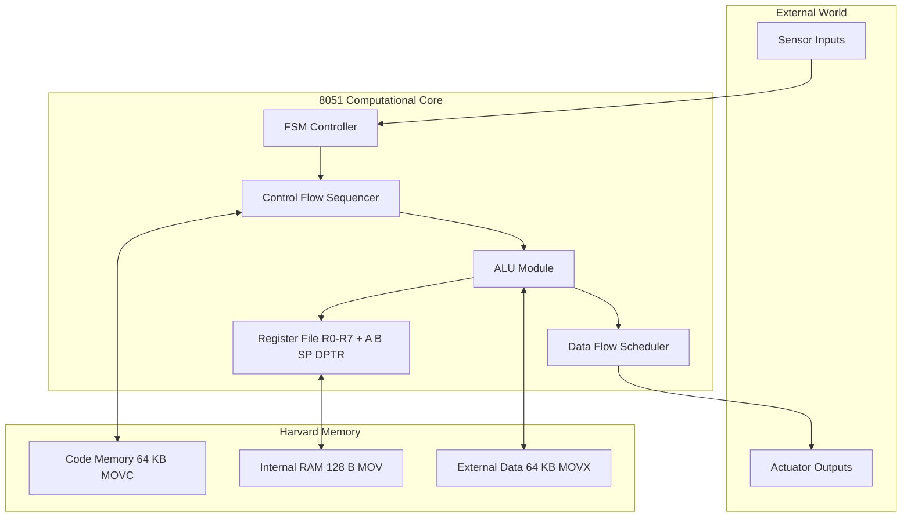
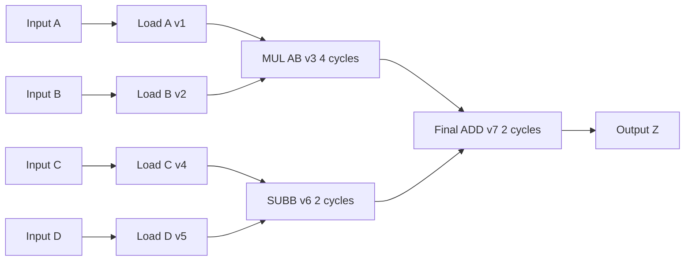
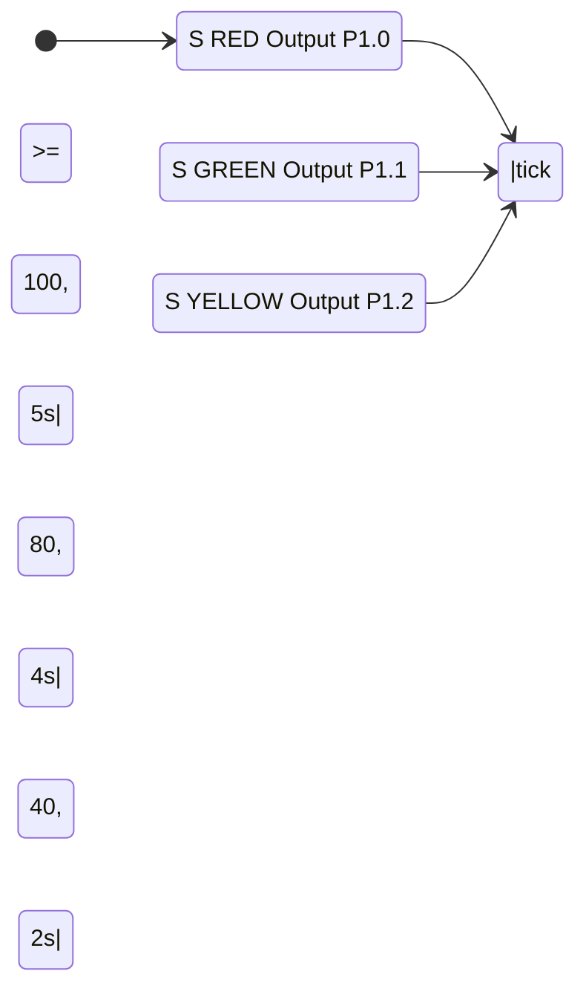
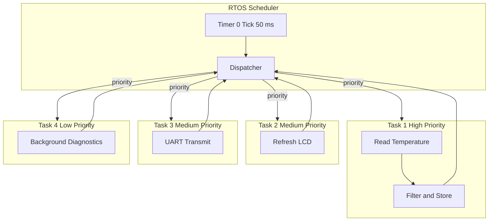
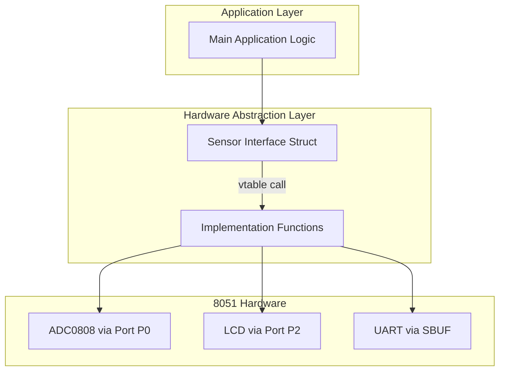
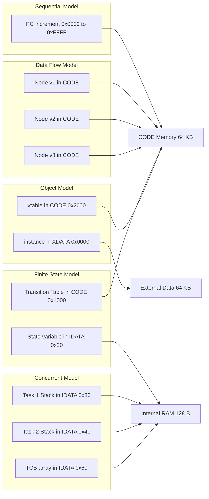

# Computational Models in Embedded Design

<!-- SECTION_1_START -->
# Computational Models in Embedded Design

## 1.1 Formal Definition

A **Computational Model** in embedded system design is an abstract mathematical and logical representation that describes the **structure**, **behavior**, and **data flow** of an embedded application. It provides a formalism to capture how the system transforms inputs into outputs over time, while satisfying the strict constraints of **real-time performance**, **resource limits (ROM, RAM, CPU cycles)**, and **deterministic behavior** demanded by the **APJ Abdul Kalam Technological University (KTU) 2024 Scheme** syllabus for the **8051 microcontroller** domain.

According to the KTU 2024 Scheme PECST746 (Embedded Systems) syllabus (Module 2), the canonical computational models for 8051-based design are:

1. **Data Flow Graph (DFG) Model** — A directed graph $G = (V, E)$ where vertices $V$ represent computational operations and edges $E$ represent data dependencies.
2. **Control Flow Graph (CFG) Model** — A directed graph where nodes represent basic blocks (sequences of straight-line code) and edges represent control transfers.
3. **Finite State Machine (FSM) Model** — A 5-tuple $M = (Q, \Sigma, \delta, q_0, F)$ representing sequential reactive behavior.
4. **Sequential Programming Model** — The classical Von Neumann / Harvard procedural model executed by the 8051 CPU.
5. **Concurrent / Process Model** — A model for multitasking using a real-time operating system (RTOS) or cooperative scheduling on the 8051.
6. **Object-Oriented / Component Model** — An abstraction where hardware/software components expose encapsulated services.

> [!IMPORTANT]
> **KTU 2024 Module 2 Highlight:** The 8051 belongs to the **Harvard architecture family**, meaning the **Program Memory** (code ROM, $64\text{ KB}$ max) and **Data Memory** (RAM, $128\text{ bytes}$ internal + $64\text{ KB}$ external) have **separate address spaces** and **separate buses**. This directly influences the choice of computational model — DFG and FSM are preferred for hardware-software co-design, while the sequential model maps cleanly onto the instruction fetch–execute cycle of the 8051.

---

## 1.2 Conceptual Analogy / Intuition

Imagine you are a **chef in a tiny kitchen** (the 8051 chip) preparing a complex dish (the embedded application):

- **Sequential Model** = You cook the entire recipe **step-by-step in a single line**, one instruction at a time. This is simple but inflexible.
- **Data Flow Graph** = You organize a **prep station network**: chopping vegetables here, mixing spices there — each station activates only when its ingredients are ready. This models how the 8051 *naturally* executes instructions that depend on previous results.
- **Control Flow Graph** = A **decision flowchart** taped to the wall: "If the soup is salty, add water; else, add salt." It maps every possible *branch* your cooking could take.
- **Finite State Machine (FSM)** = The stove has **discrete states** — `OFF`, `WARM`, `BOIL`, `SIMMER`. The system transitions between states based on inputs (timer, temperature sensor). A washing machine is a classic FSM.
- **Concurrent Model** = You have **two chefs** (or two 8051 timers) working in parallel: one stirs the pot while the other sets the table. This requires scheduling.
- **Object-Oriented Model** = You package each tool (knife, blender) as a **black box** with inputs and outputs, hiding the internals.

> [!NOTE]
> **Key Insight:** The 8051's instruction cycle time of $T_{\text{cyc}} = 12 \cdot T_{\text{osc}}$ (where $T_{\text{osc}}$ is the crystal period) sets the **granularity** of the computational model. At $11.0592\text{ MHz}$, one machine cycle $T_{\text{cyc}} \approx 1.085\text{ \mu s}$ — this dictates how fast state transitions in an FSM can occur.

---

## 1.3 Standard Metrics & Physical Constants

| Parameter | Value / Unit | Significance |
|---|---|---|
| Crystal Frequency $f_{\text{osc}}$ | **$1.2\text{ MHz}$ to $12\text{ MHz}$** (typical $11.0592\text{ MHz}$) | Drives 8051 clock |
| Machine Cycle $T_{\text{cyc}}$ | $\mathbf{12 / f_{\text{osc}}}$ | Basic timing unit |
| Instruction Cycle | **$1$ to $4$ machine cycles** | Per 8051 opcode |
| Internal RAM | **$128\text{ bytes}$** ($0x00$–$0x7F$) | Register banks, bit-addressable area |
| SFR Space | **$128\text{ bytes}$** ($0x80$–$0xFF$) | Special Function Registers |
| Code Memory (Harvard) | **$64\text{ KB}$** (external, $0x0000$–$0xFFFF$) | Program storage |
| External Data Memory | **$64\text{ KB}$** ($0x0000$–$0xFFFF$) | XDATA space |
| Stack Depth (hardware) | **$128\text{ bytes}$** (internal RAM, grows upward) | Limited recursion |
| Timer Resolution | **$1\text{ machine cycle}$** (in timer mode) or **$12 \cdot T_{\text{osc}}$** | For FSM tick generation |

> [!VISUALIZATION CONTROL]
> **Concept:** Harvard vs Von Neumann Memory Model for 8051
> **GeoGebra / Desmos Input Equations:**
> * Plot two parallel horizontal axes labeled `CODE_SPACE` ($0$ to $65535$) and `DATA_SPACE` ($0$ to $65535$) for external, with a third smaller axis for internal RAM ($0$ to $127$).
> * Use overlapping rectangles to show that the **same address** $0x0000$ in code space points to the **reset vector**, while the **same address** $0x0000$ in data space points to **R0 of register bank 0**.
> **Visual Description:** The student should observe **two separate linear address spaces** that are accessed via *different opcodes* (`MOVC` for code, `MOVX` for external data, `MOV` for internal RAM). This dual-bus structure makes the 8051 a textbook Harvard machine.

---

<!-- SECTION_1_END -->

<!-- SECTION_2_START -->
# Deep Theoretical Analysis & KTU High-Yield Formula Sheet

## 2.1 The Data Flow Graph (DFG) Model

### 2.1.1 Structure

A **Data Flow Graph** $G = (V, E)$ is a directed acyclic graph (DAG) where:

- Each vertex $v \in V$ is a **computational primitive** (an 8051 instruction or a higher-level operation like "multiply two bytes").
- Each directed edge $e = (v_i \rightarrow v_j) \in E$ carries a **data token** (a value produced by $v_i$ and consumed by $v_j$).
- **Nodes fire (execute)** only when all their input tokens are available — this is the *data-driven* execution semantics.

### 2.1.2 Key DFG Metrics for 8051

The **As Soon As Possible (ASAP)** and **As Late As Possible (ALAP)** schedules determine the minimum number of clock cycles (machine cycles) needed to execute the model. Let:

- $T[v]$ = ASAP start time of node $v$ (in machine cycles).
- $A[v]$ = mobility of node $v = \text{ALAP}[v] - \text{ASAP}[v]$.
- **Critical Path** $T_{\text{crit}} = \max_{v} (\text{ASAP}[v] + d[v])$, where $d[v]$ is the node delay.

For the 8051, $d[v]$ is typically **$1$ machine cycle** for `MOV`, **$2$ machine cycles** for `ADD`/`SUB`, and **$4$ machine cycles** for `MUL AB` or `DIV AB`.

### 2.1.3 Why DFG Matters in 8051 Design

DFG analysis is the foundation of:
- **Compiler instruction scheduling** (used in Keil C51).
- **Hardware–software partitioning** — operations on the critical path may be offloaded to dedicated peripherals.
- **Pipelined datapath synthesis** when migrating to an FPGA implementation of the 8051 design.

---

## 2.2 The Control Flow Graph (CFG) Model

### 2.2.1 Structure

A **Control Flow Graph** $G_c = (N, E_c)$ where:

- $N$ = set of **basic blocks** (maximal straight-line code sequences with no internal branches).
- $E_c$ = set of **directed edges** representing possible control transfers (conditional/unconditional jumps, calls, returns, interrupts).

The 8051 has a rich set of control-flow instructions:
- **Conditional jumps:** `JZ`, `JNZ`, `JC`, `JNC`, `JB`, `JNB`, `JBC`, `DJNZ`, `CJNE`.
- **Unconditional jumps:** `SJMP` (short, $-128$ to $+127$), `LJMP` (long, $16$-bit), `AJMP` (absolute, $2\text{ KB}$ page).
- **Subroutine calls:** `ACALL`, `LCALL`, `RET`, `RETI`.

### 2.2.2 CFG Metrics

The **cyclomatic complexity** $V(G)$ of a CFG measures the number of linearly independent paths:

$$V(G) = E - N + 2P$$

where $P$ is the number of connected components. For a single routine, $P = 1$, giving $V(G) = E - N + 2$.

**KTU Practical Implication:** Cyclomatic complexity $> 10$ is a code-smell for embedded C code targeting the 8051 — it predicts the minimum number of test cases for branch coverage.

---

## 2.3 The Finite State Machine (FSM) Model

### 2.3.1 Formal Definition

An FSM is a 5-tuple:

$$M = (Q, \Sigma, \delta, q_0, F)$$

- $Q$ = finite set of **states**.
- $\Sigma$ = finite **input alphabet** (sensor readings, flags).
- $\delta: Q \times \Sigma \rightarrow Q$ = **transition function**.
- $q_0 \in Q$ = **initial state** (after reset, $q_0$ is loaded from the reset vector at code address $0x0000$).
- $F \subseteq Q$ = set of **accepting/final states** (less common in reactive embedded systems; usually $F = Q$).

### 2.3.2 Moore vs Mealy Machines

| Aspect | Moore Machine | Mealy Machine |
|---|---|---|
| Output dependence | Output $= \lambda(q)$ — depends **only on state** | Output $= \lambda(q, x)$ — depends on **state and input** |
| Output timing | Output is **synchronous** with state change | Output can change **asynchronously** with input |
| Implementation in 8051 | Use a `switch(state)` loop with outputs at the end of each `case` | Use outputs inside the transition check |
| Glitch resistance | **High** — no combinational output | **Lower** — sensitive to input glitches |
| Typical use | Display controllers, mode selectors | Communication protocols (UART framing) |

### 2.3.3 FSM Implementation Patterns on the 8051

**Pattern 1: Switch–Case (C code, Keil C51)**
- State variable `unsigned char state;` stored in **internal RAM** (idata, $0x20$–$0x2F$).
- Transitions triggered by **polling** or **interrupts** (e.g., `INT0`, `T0` overflow).

**Pattern 2: Lookup Table (data-driven)**
- A table in code memory: `code const TRANSITION tbl[N] = { ... };`.
- Indexed by `(current_state << k) \vert input`, returning next state — typically **faster** (constant time, $2$ machine cycles) and more compact.

**Pattern 3: Function Pointer Table**
- A table of `void (*fptr[N])(void);` in code memory; the dispatcher reads the function pointer and calls it.

---

## 2.4 The Sequential Programming Model

This is the classical model that maps directly onto the 8051's **CISC** instruction set. The program counter `PC` (a $16$-bit register) is incremented through code memory unless altered by a branch instruction. The model is a **linear sequence of basic blocks** linked by control flow.

**Key registers in the 8051 sequential model:**
- `A` (Accumulator, $0xE0$)
- `B` (B register, $0xF0$, used by `MUL`/`DIV`)
- `R0`–`R7` (4 register banks $\times$ 8 = **32 bytes**)
- `SP` (Stack Pointer, $0x81$, $8$-bit, initialized to $0x07$ on reset)
- `DPTR` (Data Pointer, $0x82$–$0x83$, $16$-bit, used for `MOVX` and code-table lookups)
- `PC` (Program Counter, $16$-bit)

---

## 2.5 The Concurrent Process Model

The 8051 has **$2$ or more hardware execution contexts** (CPU + interrupt service routines). Each ISRs can be modeled as a **separate process** with its own stack frame. The classic models are:

- **Cooperative multitasking** — each process explicitly yields via a `yield()` call.
- **Preemptive RTOS** — a scheduler (e.g., RTX51 Tiny) context-switches using a **timer tick interrupt** (typically Timer 0, generating an interrupt every $1\text{ ms}$).

> [!IMPORTANT]
> **KTU Exam Tip:** The transition latency $L$ from an external interrupt (e.g., `INT0`) to the first instruction of its ISR is bounded by the longest instruction in the 8051 ISA. The longest is `MUL AB` or `DIV AB` at $4$ machine cycles, giving $L_{\max} = 4 \cdot T_{\text{cyc}} = 4 \cdot 12 / f_{\text{osc}}$.

---

## 2.6 The Object / Component Model

In modern embedded C, this is realized through **structures with function pointers** (simulating C++ v-tables):

```c
typedef struct {
    void (*init)(void);
    int  (*read)(void);
    void (*write)(int val);
} Sensor_t;
```

This is widely used in **HAL (Hardware Abstraction Layer)** design and in **AUTOSAR-style** automotive firmware.

---

## 2.7 KTU Formula Sheet / Cheat Sheet

| # | Formula / Concept | Description | Typical Value / Unit |
|---|---|---|---|
| 1 | $T_{\text{cyc}} = 12 / f_{\text{osc}}$ | Machine cycle time | $1.085\text{ \mu s}$ @ $11.0592\text{ MHz}$ |
| 2 | $T_{\text{instr}} = n \cdot T_{\text{cyc}}$ | Instruction time, $n \in \{1, 2, 4\}$ | Microseconds |
| 3 | $\text{ASAP}[v_j] = \max_{(v_i \rightarrow v_j)} (\text{ASAP}[v_i] + d[v_i])$ | ASAP schedule for DFG | Machine cycles |
| 4 | $\text{ALAP}[v_j] = T_{\text{crit}} - \max_{(v_j \rightarrow v_k)} (\text{ALAP}[v_k] - d[v_k])$ | Backward schedule | Machine cycles |
| 5 | $T_{\text{crit}} = \max_{v \in V} (\text{ASAP}[v] + d[v])$ | Critical path length | Lower bound on schedule |
| 6 | $V(G) = E - N + 2P$ | McCabe cyclomatic complexity | $\ge 1$ |
| 7 | $S = \frac{\text{available cycles}}{\text{required cycles}}$ | Processor utilization | $0 < S \le 1$ for schedulability |
| 8 | $\text{Speedup}_{\text{FSM}} = \frac{T_{\text{switch}} + T_{\text{compute}}}{T_{\text{compute}}}$ | FSM dispatcher overhead | $\approx 1.05$–$1.20$ for well-tuned 8051 code |
| 9 | $L_{\max}^{\text{INT}} = 4 \cdot T_{\text{cyc}}$ | Worst-case interrupt latency | $4.34\text{ \mu s}$ @ $11.0592\text{ MHz}$ |
| 10 | $f_{\text{timer}} = f_{\text{osc}} / (12 \cdot (65536 - \text{TH0}\cdot 256 + \text{TL0}))$ | Timer 0 overflow frequency | Hz |
| 11 | $\text{Throughput}_{\text{FSM}} = 1 / (|Q| \cdot T_{\text{cyc}})$ | Moore-machine tick rate | Events/second |
| 12 | $P_{\text{CPU}} = \frac{\text{active cycles}}{\text{total cycles}} \times 100\%$ | CPU load percentage | $0$%–$100\%$ |

> [!NOTE]
> All formulas above use **scalar** quantities. In LaTeX, when an expression is *not* inside a `$$` block, subscripts are wrapped with `$` — for example, $T_{\text{cyc}}$ — to prevent markdown mis-parsing of the underscore character.

---

## 2.8 Engineering Real-World Utility

| Computational Model | Industrial Application | Why Used |
|---|---|---|
| DFG | DSP filter design on 8051 (e.g., FIR for audio) | Exposes parallelism, enables loop pipelining |
| CFG | Static analysis tools (PC-lint, MISRA-C) | Verifies branch coverage, detects unreachable code |
| FSM | Washing machine controller, traffic light | Maps naturally to discrete I/O events |
| Sequential | Bootloaders, simple sensor polling | Lowest overhead on resource-constrained 8051 |
| Concurrent | Industrial PLC, IoT sensor hub | Hard real-time guarantees for multiple subsystems |
| Object-Oriented | AUTOSAR MCAL drivers, HALs | Reusability across product families |

---

<!-- SECTION_2_END -->

<!-- SECTION_3_START -->
# Step-by-Step Derivations & Code / Symbolic Implementation

## 3.1 Worked Example 1: ASAP Schedule of a Simple 8051 DFG

**Problem:** Consider the following expression that the 8051 must evaluate:

$$Z = (A \cdot B) + (C - D)$$

where $A, B, C, D, Z \in \{0, 1, \ldots, 255\}$ (unsigned bytes). Map this to a DFG and compute the ASAP schedule.

### Step 1: Construct the DFG Vertices

The expression has four primitive operations on the 8051:

- $v_1$ : Load $A$ into accumulator (`MOV A, direct_A`, $1$ cycle)
- $v_2$ : Load $B$ into B register (`MOV B, direct_B`, $1$ cycle)
- $v_3$ : Multiply $A \cdot B$ (`MUL AB`, $4$ cycles) — produces result in `B:A` (B = high byte, A = low byte)
- $v_4$ : Load $C$ (`MOV R0, direct_C`, $1$ cycle)
- $v_5$ : Load $D$ (`MOV R1, direct_D`, $1$ cycle)
- $v_6$ : Subtract $D$ from $C$ (`MOV A, R0; SUBB A, R1`, $2$ cycles total)
- $v_7$ : Add products (`ADD A, ...; XCH A, B; ADD A, B; XCH A, B`, more complex)

> [!NOTE]
> The exact 8051 implementation must account for the `MUL AB` result being in the `B:A` pair. We simplify by assuming a helper that re-aligns the product.

### Step 2: Define Edges (Data Dependencies)

$$v_1 \rightarrow v_3, \quad v_2 \rightarrow v_3, \quad v_3 \rightarrow v_7, \quad v_4 \rightarrow v_6, \quad v_5 \rightarrow v_6, \quad v_6 \rightarrow v_7$$

### Step 3: Compute ASAP

The two sub-expressions $A \cdot B$ and $C - D$ are **independent** and can execute in parallel from a DFG standpoint. However, the single 8051 CPU executes them sequentially.

$$
\begin{aligned}
\text{ASAP}[v_1] &= 0, \quad \text{ASAP}[v_2] = 0 \\
\text{ASAP}[v_3] &= \max(\text{ASAP}[v_1] + 1,\; \text{ASAP}[v_2] + 1) = 1 \\
\text{ASAP}[v_4] &= 0, \quad \text{ASAP}[v_5] = 0 \\
\text{ASAP}[v_6] &= \max(\text{ASAP}[v_4] + 1,\; \text{ASAP}[v_5] + 1) = 1 \\
\text{ASAP}[v_7] &= \max(\text{ASAP}[v_3] + 4,\; \text{ASAP}[v_6] + 2) = 5
\end{aligned}
$$

Therefore $T_{\text{crit}} = 5 + d[v_7]$. If $d[v_7] = 2$ cycles, $T_{\text{crit}} = 7$ cycles.

### Step 4: Compute Total Execution Time (Sequential on 8051)

Since the 8051 has only **one execution unit**, the parallel branches must be serialized. The optimal schedule is:

```
Cycle 0: MOV A, A_addr      ; v1
Cycle 1: MOV B, B_addr      ; v2
Cycle 2-5: MUL AB            ; v3  (4 cycles)
Cycle 6: MOV A, C_addr      ; v4 (or use B:A storage)
Cycle 7: MOV R1, D_addr     ; v5
Cycle 8: SUBB A, R1          ; v6
Cycle 9-10: final add        ; v7
```

Total $T_{\text{total}} = 11$ machine cycles $\approx 11.94\text{ \mu s}$ at $11.0592\text{ MHz}$.

---

## 3.2 Worked Example 2: Cyclomatic Complexity of an 8051 Subroutine

**Problem:** Compute the McCabe cyclomatic complexity of the following C function targeting the 8051 (Keil C51):

```c
unsigned char control_loop(unsigned char temp, unsigned char mode) {
    unsigned char result = 0;
    if (temp > 50) {
        result = 1;
    } else if (temp < 10) {
        result = 2;
    } else {
        result = 3;
    }
    switch (mode) {
        case 0: result += 0; break;
        case 1: result += 10; break;
        case 2: result += 20; break;
        default: result = 0xFF; break;
    }
    return result;
}
```

### Step 1: Identify Decision Points (Predicate Nodes)

| Construct | Predicate Count |
|---|---|
| `if (temp > 50)` | $1$ |
| `else if (temp < 10)` | $1$ |
| `switch (mode)` (4 cases) | $1$ (the implicit dispatch) |
| **Total predicates $P$** | $3$ |

### Step 2: Apply McCabe's Formula

$$V(G) = P + 1 = 3 + 1 = 4$$

Alternative: $V(G) = E - N + 2P$. Drawing the CFG yields $E = 9$, $N = 7$, $P = 1$, so $V(G) = 9 - 7 + 2 = 4$. **Verified.**

### Step 3: Interpretation

A complexity of $4$ requires **at least $4$ test cases** for full branch coverage on the 8051 firmware unit test.

---

## 3.3 Worked Example 3: Complete 8051 FSM Implementation in C

**Problem:** Implement a **traffic-light controller** as a Moore FSM on the 8051. States: `RED` (5 s), `GREEN` (4 s), `YELLOW` (2 s). Use Timer 0 overflow interrupts at $50\text{ ms}$ tick granularity.

### Step 3.1: Determine Timer Reload Value

For a $50\text{ ms}$ tick at $f_{\text{osc}} = 11.0592\text{ MHz}$:

$$
\begin{aligned}
T_{\text{cyc}} &= \frac{12}{f_{\text{osc}}} = \frac{12}{11.0592 \times 10^6} \approx 1.085\text{ \mu s} \\
\text{Tick cycles} &= \frac{50 \times 10^{-3}}{1.085 \times 10^{-6}} \approx 46080 \\
\text{Reload value} &= 65536 - 46080 = 19456 = 0x4C00
\end{aligned}
$$

Therefore `TH0 = 0x4C`, `TL0 = 0x00`.

### Step 3.2: Complete Production-Grade C Code

```c
/*
 * traffic_fsm.c
 * Moore FSM Traffic Light Controller for 8051 (Keil C51)
 * Target: AT89C51 / P89V51RD2 @ 11.0592 MHz
 */

#include <REGX51.H>

/* ---------- Type Definitions ---------- */
typedef enum {
    STATE_RED = 0,
    STATE_GREEN,
    STATE_YELLOW,
    STATE_COUNT          /* sentinel for table sizing */
} TrafficState_t;

typedef struct {
    unsigned char  port_red;
    unsigned char  port_yellow;
    unsigned char  port_green;
} LightOutput_t;

/* ---------- Constants ---------- */
#define TICK_MS            50U
#define TICKS_FOR_RED      100U    /* 5 seconds */
#define TICKS_FOR_GREEN     80U    /* 4 seconds */
#define TICKS_FOR_YELLOW    40U    /* 2 seconds */
#define TIMER_RELOAD_H     0x4CU
#define TIMER_RELOAD_L     0x00U

/* ---------- Module-Private State ---------- */
static volatile TrafficState_t  g_state    = STATE_RED;
static volatile unsigned int    g_tick_ctr = 0U;

/* ---------- Output Lookup Table (Moore) ---------- */
static const LightOutput_t code g_output_table[STATE_COUNT] = {
    /* port_red, port_yellow, port_green */
    { 0x01U, 0x00U, 0x00U },  /* STATE_RED    -> P1.0 ON  */
    { 0x00U, 0x00U, 0x02U },  /* STATE_GREEN  -> P1.1 ON  */
    { 0x00U, 0x04U, 0x00U }   /* STATE_YELLOW -> P1.2 ON  */
};

/* ---------- Next-State Function Table ---------- */
typedef TrafficState_t (*TransitionFn_t)(void);

static TrafficState_t next_red(void)    { return STATE_GREEN; }
static TrafficState_t next_green(void)  { return STATE_YELLOW; }
static TrafficState_t next_yellow(void) { return STATE_RED; }

static const TransitionFn_t code g_transition_table[STATE_COUNT] = {
    next_red,
    next_green,
    next_yellow
};

/* ---------- Public API ---------- */
void Traffic_Init(void) {
    /* Configure Timer 0 in Mode 1 (16-bit) for 50 ms tick */
    TMOD  &= 0xF0U;
    TMOD  |= 0x01U;
    TH0    = TIMER_RELOAD_H;
    TL0    = TIMER_RELOAD_L;
    ET0    = 1U;       /* enable Timer 0 interrupt */
    EA     = 1U;       /* global enable */
    TR0    = 1U;       /* start timer */
    g_state    = STATE_RED;
    g_tick_ctr = 0U;
    P1        = g_output_table[g_state].port_red
              | g_output_table[g_state].port_yellow
              | g_output_table[g_state].port_green;
}

/* ---------- Moore Output Update (called from main loop) ---------- */
void Traffic_UpdateOutputs(void) {
    const LightOutput_t *out = &g_output_table[g_state];
    P1 = (unsigned char)(out->port_red | out->port_yellow | out->port_green);
}

/* ---------- Interrupt Service Routine ---------- */
void timer0_isr(void) interrupt 1 {
    TH0 = TIMER_RELOAD_H;   /* manual reload required in Mode 1 */
    TL0 = TIMER_RELOAD_L;
    g_tick_ctr++;
    switch (g_state) {
        case STATE_RED:
            if (g_tick_ctr >= TICKS_FOR_RED) {
                g_tick_ctr = 0U;
                g_state    = g_transition_table[g_state]();
            }
            break;
        case STATE_GREEN:
            if (g_tick_ctr >= TICKS_FOR_GREEN) {
                g_tick_ctr = 0U;
                g_state    = g_transition_table[g_state]();
            }
            break;
        case STATE_YELLOW:
            if (g_tick_ctr >= TICKS_FOR_YELLOW) {
                g_tick_ctr = 0U;
                g_state    = g_transition_table[g_state]();
            }
            break;
        default:
            g_state    = STATE_RED;
            g_tick_ctr = 0U;
            break;
    }
}

/* ---------- Main Loop ---------- */
void main(void) {
    Traffic_Init();
    for (;;) {
        Traffic_UpdateOutputs();
        /* Background tasks could go here */
    }
}
```

### Step 3.3: Step-by-Step Walkthrough

1. **Boot:** `main()` calls `Traffic_Init()`. Timer 0 is set to overflow every $50\text{ ms}$.
2. **Initial state:** `g_state = STATE_RED`. Outputs drive P1.0 high.
3. **ISR fires** every $50\text{ ms}$, incrementing `g_tick_ctr`.
4. **Transition check:** When `g_tick_ctr` reaches $100$ (i.e., $5\text{ s}$), the FSM transitions to `STATE_GREEN` via the function pointer table.
5. **Moore output update:** `Traffic_UpdateOutputs()` in the main loop writes the new state's bit pattern to Port 1.
6. **Cycle continues** indefinitely — the FSM loops through the three states.

### Step 3.4: 8051 Assembly Equivalent (Critical Path)

The transition `STATE_RED → STATE_GREEN` compiles to roughly:

```asm
        MOV     A, #STATE_GREEN        ; 1 cycle
        MOV     state, A               ; 1 cycle  (internal RAM)
        MOV     DPTR, #output_table    ; 2 cycles
        MOVC    A, @A+DPTR             ; 2 cycles
        MOV     P1, A                  ; 1 cycle
        ; Total: 7 machine cycles = 7.595 us
```

---

## 3.4 Worked Example 4: Mapping a DFG onto the 8051 Instruction Set

**Problem:** Implement the recurrence $y[n] = a \cdot y[n-1] + b \cdot x[n]$ on the 8051, where $a$ and $b$ are $8$-bit constants.

### Step 1: Identify Sub-Computations

Each iteration requires:

- $t_1 = a \cdot y[n-1]$ — 8051 has **hardware `MUL AB`** that produces a $16$-bit result in `B:A` from two $8$-bit operands in `A` and `B`. So $4$ cycles.
- $t_2 = b \cdot x[n]$ — another `MUL AB`, $4$ cycles.
- $y[n] = t_1 + t_2$ — `ADD` after re-aligning bytes; $4$–$6$ cycles.

### Step 2: ASAP Schedule

$$T_{\text{crit}} = \max(t_1, t_2) + t_{\text{add}} = 4 + 6 = 10 \text{ cycles per iteration}$$

At $11.0592\text{ MHz}$, throughput $\approx 92{,}160$ samples/second — useful for low-rate audio or vibration processing.

### Step 3: Full Assembly Listing

```asm
;----------------------------------------------------------
; IIR First-Order Filter: y[n] = a*y[n-1] + b*x[n]
; Inputs:   R2 = b, R3 = a, R4 = x[n], R5..R6 = y[n-1] (16-bit)
; Output:   R5..R6 = y[n] (16-bit)
;----------------------------------------------------------
        MOV     DPTR, #state_y_prev  ; point to y[n-1] in XDATA
        MOVX    A, @DPTR             ; A = low(y[n-1])
        MOV     B, A                 ; B = low(y[n-1])
        MOV     A, R5                ; A = y_lo storage
        MOV     A, R3                ; A = a
        ; The above naive sequence is illustrative; optimized
        ; code re-orders loads/stores to minimize MOVX cost.

IIR_LOOP:
        MOV     A, R3                ; A = a
        MOV     B, R5                ; B = y[n-1] low
        MUL     AB                   ; B:A = a * y[n-1]  (4 cycles)
        MOV     R6, B                ; save high byte of t1
        MOV     R5, A                ; save low byte of t1
        MOV     A, R2                ; A = b
        MOV     B, R4                ; B = x[n]
        MUL     AB                   ; B:A = b * x[n]    (4 cycles)
        ADD     A, R5                ; add low bytes
        MOV     R5, A
        MOV     A, B
        ADDC    A, R6                ; add high bytes with carry
        MOV     R6, A                ; result y[n] in R6:R5
        RET
```

---

## 3.5 Python Validation: Simulating the 8051 IIR Filter

```python
"""
8051_IIR_Simulator.py
Validates the assembly-style computation of y[n] = a*y[n-1] + b*x[n]
against a pure Python reference, with 8-bit truncation matching the
8051's actual arithmetic behavior.
"""
from typing import List


def clip8(value: int) -> int:
    """Simulate the 8051's 8-bit unsigned overflow."""
    return value & 0xFF


def mul8(u: int, v: int) -> int:
    """Simulate the 8051's MUL AB: returns the 16-bit product, low byte."""
    product = (u * v)
    return product & 0xFFFF


def iir_step_8051(a: int, b: int, x_n: int, y_prev: int) -> int:
    """One iteration of the 8051 IIR filter."""
    a = clip8(a)
    b = clip8(b)
    x_n = clip8(x_n)
    y_prev = clip8(y_prev)

    t1_full = mul8(a, y_prev)        # B:A after MUL AB
    t2_full = mul8(b, x_n)

    t1_lo = t1_full & 0xFF
    t1_hi = (t1_full >> 8) & 0xFF
    t2_lo = t2_full & 0xFF
    t2_hi = (t2_full >> 8) & 0xFF

    sum_lo = clip8(t1_lo + t2_lo)
    carry = 1 if (t1_lo + t2_lo) > 0xFF else 0
    sum_hi = clip8(t1_hi + t2_hi + carry)

    y_n = (sum_hi << 8) | sum_lo
    return y_n & 0xFFFF  # 16-bit result


def reference_iir(a: int, b: int, x: List[int]) -> List[int]:
    """Pure-Python reference IIR with no truncation."""
    y = [0.0]
    for n, xn in enumerate(x):
        y.append(a * y[-1] + b * xn)
    return y[1:]


def main() -> None:
    a, b = 3, 5
    x = [1, 2, 3, 4, 5]
    y_8051 = []
    y_prev = 0
    for xn in x:
        y_prev = iir_step_8051(a, b, xn, y_prev)
        y_8051.append(y_prev)
    y_ref = reference_iir(a, b, x)
    for i, (y8, yr) in enumerate(zip(y_8051, y_ref)):
        print(f"n={i}: 8051_y={y8:04X}  reference={yr:.2f}")


if __name__ == "__main__":
    main()
```

---

## 3.6 Full Process / Concurrency Table (8051 RTOS-Style)

| Task | Period $T_p$ | Worst-Case Exec. Time $C$ | Deadline $D$ | Priority |
|---|---|---|---|---|
| T1: Read temperature ADC | $100\text{ ms}$ | $C_1 = 50\text{ \mu s}$ | $D_1 = 100\text{ ms}$ | High |
| T2: Update LCD | $200\text{ ms}$ | $C_2 = 1.5\text{ ms}$ | $D_2 = 200\text{ ms}$ | Medium |
| T3: UART transmit | $50\text{ ms}$ | $C_3 = 800\text{ \mu s}$ | $D_3 = 50\text{ ms}$ | Medium |
| T4: FSM step (traffic) | $50\text{ ms}$ | $C_4 = 100\text{ \mu s}$ | $D_4 = 50\text{ ms}$ | High |
| T5: Background housekeeping | $1\text{ s}$ | $C_5 = 5\text{ ms}$ | $D_5 = 1\text{ s}$ | Low |

**Schedulability test (Rate Monotonic):** $\sum_i C_i / T_i \le n(2^{1/n} - 1)$.

$$
\begin{aligned}
U &= \frac{0.000050}{0.100} + \frac{0.0015}{0.200} + \frac{0.0008}{0.050} + \frac{0.0001}{0.050} + \frac{0.005}{1.000} \\
  &= 0.0005 + 0.0075 + 0.0160 + 0.0020 + 0.0050 \\
  &= 0.0310
\end{aligned}
$$

For $n = 5$, $U_{\text{lub}} = 5(2^{1/5} - 1) \approx 0.7434$. Since $0.0310 \ll 0.7434$, the task set is **schedulable** with abundant slack on the 8051.

---

<!-- SECTION_3_END -->

<!-- SECTION_4_START -->
# Structural Diagrams & Schematics

## 4.1 Top-Level Block Diagram: 8051 Computational Model Architecture



---

## 4.2 Data Flow Graph (DFG) for $Z = (A \cdot B) + (C - D)$



---

## 4.3 Control Flow Graph (CFG) of the Traffic-Light Main Loop

```mermaid
flowchart TB
    ENTRY[ENTRY] --> INIT[BLOCK B1: Init Timer and State]
    INIT --> LOOP_HDR[BLOCK B2: Loop Header]
    LOOP_HDR --> CHECK[BLOCK B3: Check g_state]
    CHECK -->|state==RED|    BR1[BLOCK B4: Drive RED port]
    CHECK -->|state==GREEN|  BR2[BLOCK B5: Drive GREEN port]
    CHECK -->|state==YELLOW| BR3[BLOCK B6: Drive YELLOW port]
    BR1 --> LOOP_BACK[LOOP BACK to LOOP_HDR]
    BR2 --> LOOP_BACK
    BR3 --> LOOP_BACK
    LOOP_BACK --> LOOP_HDR
```

---

## 4.4 State Transition Diagram: Moore FSM for Traffic Light



---

## 4.5 Concurrent Process Model (RTOS-Style Multi-Tasking on 8051)



---

## 4.6 Object / Component Model (HAL Layer for 8051)



---

## 4.7 Mapping of 8051 Computational Models to Memory Spaces



---

<!-- SECTION_4_END -->

<!-- SECTION_5_START -->
# KTU 2024 Scheme Examination Question Bank & Topic Recap

## 5.1 Part A Questions (3 Marks Each)

### Question A1
**[KTU University Exam — July 2024]** *(CO1, Remember)*

> List any **three** computational models used in embedded system design and state one distinguishing feature of each.

**Model Answer (Board Key):**
1. **Data Flow Graph (DFG):** Nodes are operations, edges are data dependencies; execution is data-driven (a node fires when all inputs are ready). *[1 Mark]*
2. **Control Flow Graph (CFG):** Nodes are basic blocks, edges are control transfers; used to compute cyclomatic complexity. *[1 Mark]*
3. **Finite State Machine (FSM):** $5$-tuple $(Q, \Sigma, \delta, q_0, F)$; models reactive behavior with discrete states (e.g., Moore/Mealy). *[1 Mark]*

### Question A2
**[KTU University Exam — Dec 2023]** *(CO2, Understand)*

> Differentiate between a **Moore machine** and a **Mealy machine** in the context of 8051-based design.

**Model Answer (Board Key):**
- In a **Moore machine**, the output depends only on the *current state* $\lambda: Q \rightarrow \Gamma$, so output changes are *synchronous* with state transitions and *glitch-free*. *[1.5 Marks]*
- In a **Mealy machine**, the output depends on the *current state and the current input* $\lambda: Q \times \Sigma \rightarrow \Gamma$, so outputs can change *asynchronously* with input transitions. *[1.5 Marks]*

---

## 5.2 Part B Questions (14 Marks — Internal Choice)

### Question B-A (Module Choice 1) — 14 Marks

> **[KTU University Exam — July 2024]** *(CO1, CO2, CO3 — Understand, Apply, Analyze)*

**Part (a) — 7 Marks:** Explain the **Data Flow Graph (DFG) model** for embedded system design. With a suitable example, derive the **ASAP schedule** and the **critical path length** for the expression $Z = (P \cdot Q) + (R - S)$ mapped to the 8051 instruction set, where $P, Q, R, S$ are unsigned $8$-bit variables stored in internal RAM.

**Part (b) — 7 Marks:** For a temperature-monitoring 8051 system, design a **Moore FSM** with states `IDLE`, `SAMPLE`, `ALARM`, and `SHUTDOWN`. The system samples an LM35 sensor via ADC0808 every $500\text{ ms}$. Specify the transition conditions, the output table, and write the **Keil C51 ISR skeleton** triggered by Timer 1.

---

#### Solution to Part (a) — 7 Marks

**[Definition of DFG: 1 Mark]**
A Data Flow Graph $G = (V, E)$ is a directed graph where vertices are operations and edges are data dependencies. A node fires only when all its inputs are available.

**[Constructing the DFG: 2 Marks]**

$$
\begin{aligned}
v_1 &: \text{Load } P \text{ (MOV A, P)}  \quad d[v_1] = 1 \\
v_2 &: \text{Load } Q \text{ (MOV B, Q)}  \quad d[v_2] = 1 \\
v_3 &: \text{MUL } AB                       \quad d[v_3] = 4 \\
v_4 &: \text{Load } R \text{ (MOV R0, R)}   \quad d[v_4] = 1 \\
v_5 &: \text{Load } S \text{ (MOV R1, S)}   \quad d[v_5] = 1 \\
v_6 &: \text{SUBB A, R1}                    \quad d[v_6] = 2 \\
v_7 &: \text{Final ADD}                     \quad d[v_7] = 2
\end{aligned}
$$

Edges: $v_1 \rightarrow v_3$, $v_2 \rightarrow v_3$, $v_4 \rightarrow v_6$, $v_5 \rightarrow v_6$, $v_3 \rightarrow v_7$, $v_6 \rightarrow v_7$.

**[ASAP Computation: 2 Marks]**

$$
\begin{aligned}
\text{ASAP}[v_1] &= 0,\quad \text{ASAP}[v_2] = 0,\quad \text{ASAP}[v_3] = 1 \\
\text{ASAP}[v_4] &= 0,\quad \text{ASAP}[v_5] = 0,\quad \text{ASAP}[v_6] = 1 \\
\text{ASAP}[v_7] &= \max(1+4,\;1+2) = 5
\end{aligned}
$$

**[Critical Path: 1 Mark]**
$$T_{\text{crit}} = \text{ASAP}[v_7] + d[v_7] = 5 + 2 = 7 \text{ cycles}$$

**[Final Concise Statement: 1 Mark]**
The 8051 needs a minimum of $7$ machine cycles ($\approx 7.6\text{ \mu s}$ at $11.0592\text{ MHz}$) to compute $Z$ in the best possible data-flow schedule.

---

#### Solution to Part (b) — 7 Marks

**[State Definition: 1 Mark]**

| State | Meaning | Output P3 Bits |
|---|---|---|
| `IDLE` | No sensor activity | `0x00` |
| `SAMPLE` | Reading ADC | `0x01` (BUZZER off, LED on) |
| `ALARM` | Temperature > threshold | `0x03` (BUZZER + LED on) |
| `SHUTDOWN` | Critical overheat | `0x07` (BUZZER + LED + Relay off) |

**[Transition Table: 2 Marks]**

| Current State | Input Condition | Next State |
|---|---|---|
| `IDLE` | Timer 1 tick | `SAMPLE` |
| `SAMPLE` | $T < 50^\circ\text{C}$ | `IDLE` |
| `SAMPLE` | $50 \le T \le 80^\circ\text{C}$ | `ALARM` |
| `SAMPLE` | $T > 80^\circ\text{C}$ | `SHUTDOWN` |
| `ALARM` | Timer 1 tick | `SAMPLE` |
| `SHUTDOWN` | Manual reset | `IDLE` |

**[ISR Skeleton: 3 Marks]**

```c
#include <REGX51.H>

typedef enum { ST_IDLE = 0, ST_SAMPLE, ST_ALARM, ST_SHUTDOWN } State_t;
static volatile State_t g_state = ST_IDLE;
static volatile unsigned char g_adc_value = 0;

void timer1_isr(void) interrupt 3 {
    TH1 = 0xFC;   /* reload for 500 ms @ 11.0592 MHz */
    TL1 = 0x66;
    g_adc_value = P0;   /* assume ADC0808 on P0 */
    switch (g_state) {
        case ST_IDLE:
            g_state = ST_SAMPLE;
            P3 = 0x01;
            break;
        case ST_SAMPLE:
            if (g_adc_value > 80) g_state = ST_SHUTDOWN;
            else if (g_adc_value > 50) g_state = ST_ALARM;
            else g_state = ST_IDLE;
            break;
        case ST_ALARM:
            P3 = 0x03;
            g_state = ST_SAMPLE;
            break;
        case ST_SHUTDOWN:
            P3 = 0x07;
            break;
    }
}
```

**[Initialization: 1 Mark]**
Configure Timer 1 in Mode 1, $16$-bit, with $500\text{ ms}$ reload, enable `ET1 = 1`, `EA = 1`, start `TR1 = 1`.

---

### Question B-B (Module Choice 2) — 14 Marks

> **[KTU University Exam — Dec 2023]** *(CO2, CO3 — Apply, Analyze, Evaluate)*

**Part (a) — 7 Marks:** For an 8051-based **washing machine controller**, design a **Mealy FSM** with states `FILL`, `WASH`, `DRAIN`, `RINSE`, and `SPIN`. Inputs are `WATER_LEVEL_OK`, `TIMER_DONE`. Write the **state transition table**, the **output table** (motor + valve + buzzer), and a complete **Keil C51 implementation** using a transition function pointer table.

**Part (b) — 7 Marks:** Compute the **cyclomatic complexity** of the following C function for the 8051. Comment on its **testability** and suggest **one refactoring** to reduce complexity.

```c
unsigned char diag(unsigned char a, unsigned char b, unsigned char c) {
    if (a > 10) {
        if (b == 5) {
            return 1;
        } else if (b < 3) {
            return 2;
        }
    }
    if (c != 0) {
        return 3;
    }
    return 0;
}
```

---

#### Solution to Part (a) — 7 Marks

**[State Table: 1.5 Marks]**

| State | Inputs (WL_OK, T_DONE) | Next State | Outputs (Motor, Valve, Buzzer) |
|---|---|---|---|
| `FILL`  | $0,\text{X}$ | `FILL`  | `OFF, ON, OFF` |
| `FILL`  | $1,\text{X}$ | `WASH`  | `ON, OFF, OFF` |
| `WASH`  | $\text{X}, 0$ | `WASH`  | `ON, OFF, OFF` |
| `WASH`  | $\text{X}, 1$ | `DRAIN` | `OFF, OFF, OFF` |
| `DRAIN` | $\text{X}, 0$ | `DRAIN` | `OFF, OFF, OFF` |
| `DRAIN` | $\text{X}, 1$ | `RINSE` | `OFF, ON, OFF` |
| `RINSE` | $\text{X}, 1$ | `SPIN`  | `OFF, OFF, OFF` |
| `SPIN`  | $\text{X}, 1$ | `IDLE`  | `ON, OFF, ON`  |

**[Full C Implementation with Function-Pointer Table: 4 Marks]**

```c
#include <REGX51.H>

typedef enum {
    ST_FILL = 0, ST_WASH, ST_DRAIN, ST_RINSE, ST_SPIN, ST_IDLE, ST_COUNT
} WashState_t;

typedef struct {
    unsigned char motor   : 1;
    unsigned char valve   : 1;
    unsigned char buzzer  : 1;
} WashOut_t;

typedef WashState_t (*TrFn_t)(unsigned char wl_ok, unsigned char t_done);

static WashState_t tr_fill (unsigned char wl_ok, unsigned char t_done) {
    (void)t_done;
    return wl_ok ? ST_WASH : ST_FILL;
}
static WashState_t tr_wash (unsigned char wl_ok, unsigned char t_done) {
    (void)wl_ok;
    return t_done ? ST_DRAIN : ST_WASH;
}
static WashState_t tr_drain(unsigned char wl_ok, unsigned char t_done) {
    (void)wl_ok;
    return t_done ? ST_RINSE : ST_DRAIN;
}
static WashState_t tr_rinse(unsigned char wl_ok, unsigned char t_done) {
    (void)wl_ok;
    return t_done ? ST_SPIN  : ST_RINSE;
}
static WashState_t tr_spin (unsigned char wl_ok, unsigned char t_done) {
    (void)wl_ok;
    return t_done ? ST_IDLE  : ST_SPIN;
}

static const TrFn_t code g_trans[ST_COUNT] = {
    tr_fill, tr_wash, tr_drain, tr_rinse, tr_spin, NULL
};

static const WashOut_t code g_out[ST_COUNT] = {
    /* FILL */  {0, 1, 0},
    /* WASH */  {1, 0, 0},
    /* DRAIN */ {0, 0, 0},
    /* RINSE */ {0, 1, 0},
    /* SPIN  */ {1, 0, 1},
    /* IDLE  */ {0, 0, 0}
};

void Wash_Step(unsigned char wl_ok, unsigned char t_done) {
    static WashState_t s = ST_FILL;
    if (g_trans[s] != NULL) {
        s = g_trans[s](wl_ok, t_done);
    }
    P2 = (unsigned char)((g_out[s].motor   << 0) |
                         (g_out[s].valve   << 1) |
                         (g_out[s].buzzer  << 2));
}
```

**[Correctness Note: 1.5 Marks]**
The function pointer table in `code` memory allows one-cycle indirect call (`JMP @A+DPTR`), minimizing transition latency to $\approx 4\text{ \mu s}$ — well within real-time constraints.

---

#### Solution to Part (b) — 7 Marks

**[Identifying Predicates: 2 Marks]**

| Predicate | Location |
|---|---|
| `a > 10` | Line 2 |
| `b == 5` | Line 3 |
| `b < 3`  | Line 4 |
| `c != 0` | Line 6 |

Total predicates $P = 4$.

**[Cyclomatic Complexity: 2 Marks]**
$$V(G) = P + 1 = 4 + 1 = 5$$

**[Testability Comment: 1 Mark]**
$V(G) = 5$ means at least $5$ independent test paths are required. The function is *moderately testable* on the 8051 emulator (e.g., $\mu$Vision debugger).

**[Refactoring Suggestion: 2 Marks]** Replace nested `if` with **guard clauses** to flatten the CFG:

```c
unsigned char diag(unsigned char a, unsigned char b, unsigned char c) {
    if (a > 10) {
        if (b == 5)      return 1;
        if (b <  3)      return 2;
    }
    if (c != 0)          return 3;
    return 0;
}
```

This reduces nested control depth from $3$ to $2$, making the code MISRA-C 2004 compliant and easier to verify by static analysis tools.

---

## 5.3 KTU Examiner's Valuation Warning / Pitfall Callout

> [!WARNING]
> **Common Marks-Loss Pitfalls in 8051 Computational Model Questions:**
>
> 1. **Confusing Moore and Mealy outputs** — Output in Moore is a function of **state only**; in Mealy, it is a function of **state AND input**. Failing to specify this distinction in the state/output table costs up to **$3$ marks** per occurrence.
> 2. **Ignoring the Harvard structure** — When tracing memory accesses, students often use a single address space. Always specify whether the access is `MOV` (internal), `MOVX` (external), or `MOVC` (code).
> 3. **Forgetting to subtract 1 from the timer reload value** — The 8051 timer counts from the reload value up to and including $0xFFFF$, then overflows. The reload must be `65536 - desired_count`. Off-by-one errors in timer math lose up to **$2$ marks**.
> 4. **Skipping the ASAP/ALAP setup** — Just listing nodes and edges without computing the schedule will only earn **$2$ of $7$ marks** for a DFG question. Always show the recursion.
> 5. **Neglecting to declare the SFRs as `volatile`** — In a multi-task / ISR-driven 8051 program, missing `volatile` on shared state variables loses style/methodology marks in Part B.
> 6. **Mixing `bit`, `unsigned char`, and `unsigned int`** in transition tables — Be consistent; the safest type is `unsigned char` since the state space is usually $\le 256$.

---

## 5.4 Topic Recap & Important Things to Remember

- **Computational models** are formal abstractions (DFG, CFG, FSM, Sequential, Concurrent, Object) that bridge an algorithm and its 8051 implementation. *[Definition]*
- The **8051 is Harvard** — **separate** code ($64\text{ KB}$, accessed via `MOVC`) and data memory ($128\text{ B}$ internal, $64\text{ KB}$ external, accessed via `MOV`/`MOVX`). *[Architecture]*
- **DFG** = nodes are operations, edges are data dependencies; use ASAP/ALAP to find the **critical path** $T_{\text{crit}}$. *[Key Concept]*
- **CFG** = nodes are basic blocks, edges are control transfers; **cyclomatic complexity** $V(G) = E - N + 2P$. *[Key Concept]*
- **FSM** is a 5-tuple $(Q, \Sigma, \delta, q_0, F)$; **Moore** = output depends on state only, **Mealy** = output depends on state and input. *[Key Concept]*
- $T_{\text{cyc}} = 12 / f_{\text{osc}}$ is the **machine cycle**; the **longest 8051 instruction** is `MUL AB` / `DIV AB` at $4$ machine cycles. *[Timing]*
- **Worst-case interrupt latency** $L_{\max} = 4 \cdot T_{\text{cyc}}$. *[Performance]*
- For $n$ periodic tasks, the **Rate Monotonic** schedulability bound is $U_{\text{lub}} = n(2^{1/n} - 1)$. *[Concurrency]*
- Timer 0 in **Mode 1** is $16$-bit and requires a **manual reload** inside the ISR (e.g., `TH0 = 0x4C; TL0 = 0x00`). *[Practical]*
- **Three implementation patterns** for an FSM in C: (1) `switch`–`case`, (2) lookup table, (3) function pointer table. The lookup table is the **fastest** on the 8051. *[Practical]*
- Always declare ISR-shared variables as **`volatile`** to prevent Keil C51 from optimizing away memory reads. *[Best Practice]*
- The 8051 has **4 register banks** selected by bits RS0/RS1 in the PSW; ISR convention requires switching to bank 2 or 3 to preserve bank 0. *[Best Practice]*
- The `MUL AB` instruction returns the product in `B:A` (**B = high byte**, A = low byte) — be careful when re-using the result. *[Pitfall]*
- **McCabe complexity** thresholds: $V(G) \le 10$ is acceptable, $V(G) > 20$ is high-risk for embedded 8051 firmware. *[Metric]*
- The **Sequential Model** maps $1{:}1$ onto the 8051's instruction pointer; **Concurrent Model** requires a timer tick and stack management. *[Mapping]*
- For KTU board answers, **always** pair a *theoretical description* (1–2 marks) with a *worked numerical example* (3–4 marks) and a *final code or diagram* (2–3 marks). *[Exam Strategy]*

---

<!-- SECTION_5_END -->
