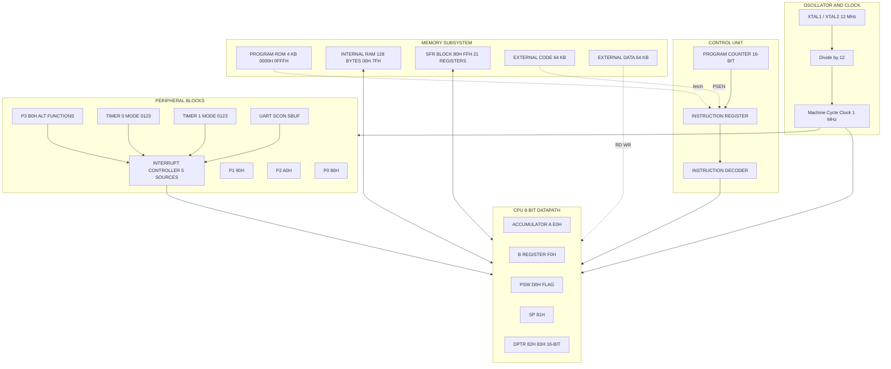
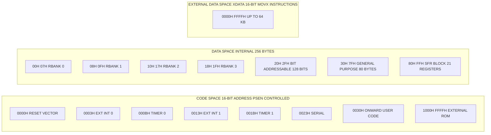
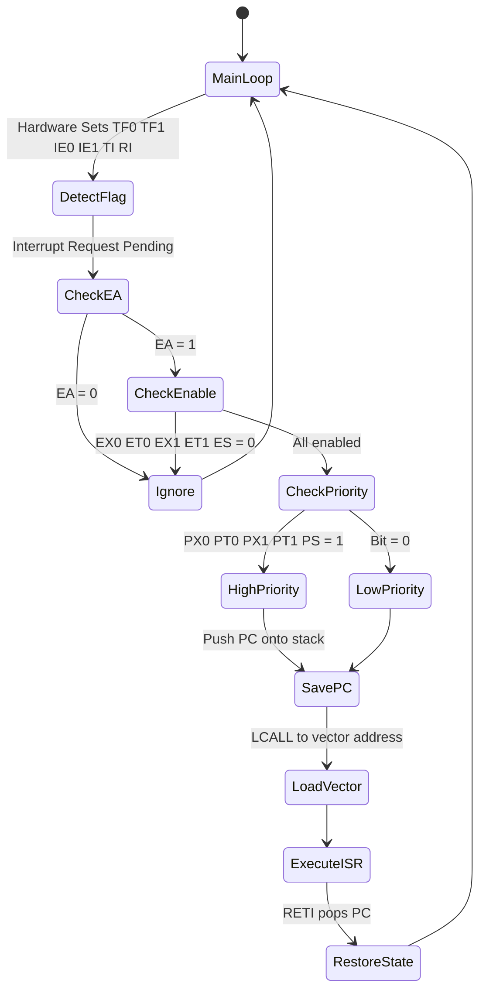
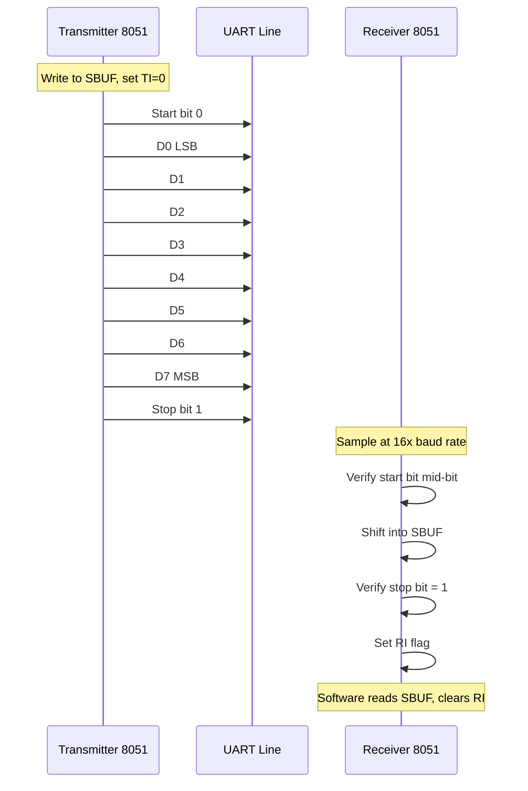

# Designing with 8051

<!-- SECTION_1_START -->

# Designing with 8051 — A First Glance

## 1.1 Formal Definition (KTU 2024 Syllabus Terminology)

The **Intel 8051** is an **8-bit, Harvard-architecture, CISC (Complex Instruction Set Computer) microcontroller** introduced by Intel in 1980. It integrates a **CPU, RAM, ROM, four parallel I/O ports, two 16-bit timers/counters, a full-duplex serial port, and a five-source interrupt structure** on a single silicon die. In the KTU 2024 Scheme context, the 8051 is treated as the *reference Von-Neumann-to-Harvard pedagogical vehicle* for teaching resource-constrained embedded design — i.e., the practice of mapping a real-world control problem to a fixed, deterministic hardware platform with strict timing, memory, and power budgets.

> [!IMPORTANT]
> **KTU Board Definition (verbatim-style):**
> *A microcontroller is a single-chip computer containing a processor, memory, and I/O peripherals, designed for embedded control. The 8051 family is the canonical 8-bit embedded controller used for learning low-level system design, register-level programming, and real-time I/O handling.*

## 1.2 The 8051 at a Glance — Key Metrics

| Parameter | Value |
|---|---|
| Data Bus Width | **8 bits** |
| Address Bus Width | **16 bits** |
| On-chip Program ROM | **4 KB** |
| On-chip Data RAM | **128 bytes** |
| I/O Lines | **32** (4 ports × 8 bits) |
| Timers / Counters | **2 × 16-bit** |
| Serial Port | **1 × Full-Duplex UART** |
| Interrupt Sources | **5** (2 external, 2 timer, 1 serial) |
| Operating Frequency | **12 MHz** (typical, 1 µs machine cycle) |
| Package | **40-pin DIP** (Dual In-line Package) |
| Instruction Set | **255 opcodes**, mostly 1–2 byte |

## 1.3 Conceptual Analogy — "The 8051 as a Tiny Post-Office"

Think of the 8051 as a **small post-office inside a chip**:

- The **CPU** is the postmaster who reads letters (instructions) from a pigeon-hole (**Program ROM**) and processes them one at a time.
- The **RAM** is the postmaster's *desk* — small (only 128 bytes) but extremely fast to reach into.
- The **four I/O ports (P0, P1, P2, P3)** are the *four service windows* through which the postmaster talks to the outside world.
- The **timers** are two *egg-timers* on the desk that can be set to ring after a precise interval.
- The **serial port** is a *telephone line* for talking to a remote computer.
- The **interrupt pins** are the *emergency bells* that can summon the postmaster immediately, regardless of what he is doing.

The *art of designing with the 8051* is the art of **deciding which window to use, which timer to set, when to ring which bell, and which instructions to feed the postmaster** so that the entire office runs the customer's application on time.

> [!NOTE]
> **Why Harvard Architecture matters for designers:**
> The 8051 has **separate address spaces** for *code* (read-only, fetched via PSEN) and *data* (read/write, fetched via RD and WR). This means an instruction fetch and a data read can happen *simultaneously* in the same machine cycle — the reason 8051 code is deterministic and predictable for real-time control.

## 1.4 Pin Configuration Intuition (40-Pin DIP)

The chip looks like a small black rectangle with **20 pins on each side**. Group the pins by function:

- **Pins 1–8** & **Pins 21–28** & **Pins 32–39** → the 32 I/O lines (split as P1.0–P1.7, P3.0–P3.7, P0.0–P0.7).
- **Pins 18, 19** → Crystal oscillator (XTAL1, XTAL2). Connect a **12 MHz** quartz crystal here — like the heart that beats once every 1/12 µs.
- **Pin 9** → RST (Reset). A high pulse for ≥ 2 machine cycles *wakes the postmaster up fresh*.
- **Pin 30** → ALE (Address Latch Enable). Pulses high to *freeze* the low-byte address on P0 using an external 74HC573 latch.
- **Pin 29** → PSEN (Program Store Enable). *Reads* from external code memory.
- **Pin 31** → EA (External Access). If tied low, the 8051 fetches *all* code from outside; if tied high, it uses internal ROM first.
- **Pin 40** → V$_{CC}$ (**+5 V**). Pin 20 → GND.

> [!VISUALIZATION CONTROL]
> **Concept:** 8051 pin-out map and machine-cycle clocking
> **Visualization Tool:** TinkerCAD / Proteus VSM
> **Setup:** Place an AT89C51, attach a 12 MHz crystal between pins 18 and 19 with two 33 pF capacitors to ground, and connect a 10 µF electrolytic + 10 kΩ reset network to pin 9.
> **What to observe:** When you press the reset button, the scope on pin 30 (ALE) should show a 1/6 × crystal-frequency pulse train, confirming the machine-cycle clock division.

<!-- SECTION_1_END -->

<!-- SECTION_2_START -->

# Deep Theoretical Analysis & KTU Formula Sheet

## 2.1 The 8051 Block Architecture (Logical View)

The 8051 is internally a small system-on-chip with the following functional blocks wired through an **8-bit internal data bus** and a **16-bit address bus**:

- **CPU (Accumulator-based 8-bit engine)**
  - **Accumulator (A)** — the primary working register; almost every arithmetic instruction uses it.
  - **B register** — used implicitly by `MUL AB` and `DIV AB`.
  - **Program Status Word (PSW)** — carries the four arithmetic flags: Carry (C), Auxiliary Carry (AC), Overflow (OV), and Parity (P).
  - **Stack Pointer (SP)** — points to the top of the on-chip RAM stack (resets to **07H**, conventionally re-initialised to **08H** or higher).
  - **Data Pointer (DPTR)** — a 16-bit register (DPL + DPH) used to address external data and look-up tables in code memory.
- **Oscillator & Clock** — divides the crystal frequency by **12** to produce the *machine cycle* clock.
- **Program Memory (4 KB internal ROM, expandable to 64 KB external)** — non-volatile instruction storage.
- **Data Memory (128 bytes internal RAM + 128 bytes SFR area, expandable to 64 KB external)** — volatile working memory.
- **Two 16-bit Timers/Counters (T0 & T1)** — operate in four programmable modes.
- **Serial Port (UART)** — full-duplex, four modes, software-baud-rate via Timer 1.
- **Interrupt Controller** — 5 sources, 2 priority levels.
- **Four 8-bit I/O Ports (P0, P1, P2, P3)** — each pin is bi-directional but with different drive characteristics.

## 2.2 Memory Map — The Most Tested KTU Concept

The 8051 has three physically distinct address spaces: **code (ROM)**, **internal data RAM**, and **external data RAM (XRAM)**. This tri-section is a favourite question on KTU papers.

### 2.2.1 Program Memory (Code Space)

$$\text{Total addressable} = 2^{16} = 65{,}536 \text{ bytes} \; (0000\text{H} \text{ to } \text{FFFFH})$$

| Region | Address Range | Use |
|---|---|---|
| Reset vector | $0000\text{H}$ | CPU jumps here after RST |
| External interrupt 0 ISR | $0003\text{H}$ | Pin 12 (INT0) service routine |
| Timer 0 ISR | $000\text{BH}$ | TF0 service routine |
| External interrupt 1 ISR | $0013\text{H}$ | Pin 13 (INT1) service routine |
| Timer 1 ISR | $001\text{BH}$ | TF1 service routine |
| Serial ISR | $0023\text{H}$ | TI/RI service routine |
| User code | $0030\text{H}$ onward (recommended) | Main application |

> [!NOTE]
> **Designer tip:** Always place your `MAIN` entry at `ORG 0030H` so the eight-byte interrupt vectors are safely skipped.

### 2.2.2 Internal Data RAM (128 bytes, 00H–7FH)

| Region | Address | Description |
|---|---|---|
| Register Banks 0–3 | $00\text{H} \text{--} 1\text{FH}$ | Four banks of R0–R7; selected via RS0, RS1 in PSW |
| Bit-addressable | $20\text{H} \text{--} 2\text{FH}$ | 16 bytes = 128 individually addressable bits |
| General-purpose RAM | $30\text{H} \text{--} 7\text{FH}$ | 80 bytes of scratchpad memory and stack |

### 2.2.3 Special Function Register (SFR) Space (80H–FFH)

> [!IMPORTANT]
> Of the 128 SFR addresses, only **21 are physically implemented** in the original 8051. The rest are *reserved* — accessing them returns indeterminate data and may be a board-exam pitfall.

| SFR | Address | Function |
|---|---|---|
| P0 | $80\text{H}$ | Port 0 latch |
| SP | $81\text{H}$ | Stack Pointer |
| DPL | $82\text{H}$ | Data Pointer low byte |
| DPH | $83\text{H}$ | Data Pointer high byte |
| PCON | $87\text{H}$ | Power Control (SMOD bit for baud rate doubling) |
| TCON | $88\text{H}$ | Timer/Counter control |
| TMOD | $89\text{H}$ | Timer/Counter mode |
| TL0 | $8\text{AH}$ | Timer 0 low byte |
| TL1 | $8\text{BH}$ | Timer 1 low byte |
| TH0 | $8\text{CH}$ | Timer 0 high byte |
| TH1 | $8\text{DH}$ | Timer 1 high byte |
| P1 | $90\text{H}$ | Port 1 latch |
| SCON | $98\text{H}$ | Serial Control |
| SBUF | $99\text{H}$ | Serial Data Buffer |
| P2 | $\text{A0H}$ | Port 2 latch |
| IE | $\text{A8H}$ | Interrupt Enable |
| P3 | $\text{B0H}$ | Port 3 latch |
| IP | $\text{B8H}$ | Interrupt Priority |
| PSW | $\text{D0H}$ | Program Status Word |
| A (ACC) | $\text{E0H}$ | Accumulator |
| B | $\text{F0H}$ | B register |

### 2.2.4 Alternate Functions of Port 3 (Pin-Multiplexing)

| Pin | Alt. Function | SFR Bit |
|---|---|---|
| P3.0 | RxD (Serial Input) | — |
| P3.1 | TxD (Serial Output) | — |
| P3.2 | INT0 (External Interrupt 0) | IE0 |
| P3.3 | INT1 (External Interrupt 1) | IE1 |
| P3.4 | T0 (Timer 0 input) | — |
| P3.5 | T1 (Timer 1 input) | — |
| P3.6 | WR (External data write strobe) | — |
| P3.7 | RD (External data read strobe) | — |

## 2.3 Timer/Counter — Operational Modes

The two 16-bit timers T0 and T1 each consist of two 8-bit SFRs (THx and TLx) and can operate in one of four modes selected by the M1, M0 bits in TMOD.

| Mode | M1 | M0 | Description | Width | Max Count |
|---|---|---|---|---|---|
| 0 | 0 | 0 | 13-bit timer (8048 legacy) | 13 | $2^{13} = 8192$ |
| 1 | 0 | 1 | 16-bit timer | 16 | $2^{16} = 65536$ |
| 2 | 1 | 0 | 8-bit auto-reload | 8 | $2^{8} = 256$ |
| 3 | 1 | 1 | Split timer (T0 only) | 8 + 8 | $256$ each |

### 2.3.1 Master Timing Equation (KTU Favourite)

The 8051 divides the oscillator frequency by 12 to produce the *machine cycle*, which is the basic time unit for timers.

$$T_{\text{machine}} = \frac{12}{f_{\text{oscillator}}}$$

For a 12 MHz crystal:

$$T_{\text{machine}} = \frac{12}{12 \times 10^{6}} = 1 \; \mu s$$

The **timer increment rate** equals the machine-cycle frequency:

$$f_{\text{timer}} = \frac{f_{\text{osc}}}{12}$$

The **delay generated** by a Mode-1 timer loaded with value $N$:

$$\boxed{\; T_{\text{delay}} = (65{,}536 - N) \times T_{\text{machine}} \;}$$

For Mode-2 (auto-reload) with 8-bit reload value $R$:

$$T_{\text{overflow}} = (256 - R) \times T_{\text{machine}}$$

## 2.4 Serial Port — Baud Rate Equation

The 8051 UART is most commonly operated in **Mode 1** (8-bit UART, variable baud rate). The baud rate is generated by overflowing Timer 1 in auto-reload mode (Mode 2):

$$\boxed{\; \text{Baud Rate} = \frac{2^{\text{SMOD}}}{32} \times \frac{f_{\text{osc}}}{12 \times (256 - \text{TH1})} \;}$$

For SMOD = 0 and 11.0592 MHz crystal (the canonical KTU exam value):

| TH1 | Baud Rate |
|---|---|
| 0FDH | 9600 |
| 0FAH | 4800 |
| 0F4H | 2400 |
| 0E8H | 1200 |

> [!NOTE]
> The 11.0592 MHz crystal is the *golden* choice for serial designs because it is an exact multiple of all standard baud rates — there is **zero cumulative error** in asynchronous communication.

## 2.5 Interrupt Structure

| Vector | Address | Source | Flag | Enable |
|---|---|---|---|---|
| Reset | $0000\text{H}$ | Hardware reset | — | Always |
| External 0 | $0003\text{H}$ | INT0 pin (P3.2) | IE0 | EX0 |
| Timer 0 | $000\text{BH}$ | TF0 overflow | TF0 | ET0 |
| External 1 | $0013\text{H}$ | INT1 pin (P3.3) | IE1 | EX1 |
| Timer 1 | $001\text{BH}$ | TF1 overflow | TF1 | ET1 |
| Serial | $0023\text{H}$ | TI or RI | TI, RI | ES |

The **IE register (Address A8H)** controls global and per-source enabling. Setting **EA = 1** is mandatory; otherwise no interrupt fires.

## 2.6 Addressing Modes (KTU 2-mark Favourite)

| Mode | Syntax Example | Notes |
|---|---|---|
| Register | `MOV A, R0` | Operands are in registers |
| Direct | `MOV A, 30H` | Operand is an internal RAM or SFR address |
| Register-Indirect | `MOV A, @R0` | R0/R1 holds the *address* of the operand |
| Immediate | `MOV A, #0FH` | Constant prefixed with `#` |
| Indexed (Code) | `MOVC A, @A+DPTR` | Used for look-up tables in code memory |
| Relative | `SJMP LOOP` | 8-bit signed offset, range $-128$ to $+127$ bytes |
| Absolute | `AJMP / ACALL` | 11-bit address, 2 KB page |
| Long | `LJMP addr16` | Full 16-bit jump |
| Bit | `SETB P1.0` | Operates on 1 of 256 bit-addressable locations |

## 2.7 KTU High-Yield Formula Cheat-Sheet

| Concept | Formula | Units |
|---|---|---|
| Machine cycle period | $T_{\text{mc}} = 12 / f_{\text{osc}}$ | seconds |
| Timer delay (Mode 1) | $T = (2^{16} - N) \times T_{\text{mc}}$ | seconds |
| Timer delay (Mode 2) | $T = (2^{8} - R) \times T_{\text{mc}}$ | seconds |
| Required reload value | $N = 2^{16} - \dfrac{T_{\text{desired}}}{T_{\text{mc}}}$ | count |
| UART baud rate | $\text{Baud} = \dfrac{2^{\text{SMOD}}}{32} \times \dfrac{f_{\text{osc}}}{12 \times (256 - \text{TH1})}$ | bits/s |
| Required TH1 for baud | $\text{TH1} = 256 - \dfrac{2^{\text{SMOD}} \times f_{\text{osc}}}{384 \times \text{Baud}}$ | count |
| Program memory size | $2^{16}$ bytes | bytes |
| Internal RAM size | $128$ bytes | bytes |
| Register banks | $4 \times 8 = 32$ bytes | bytes |
| Bit-addressable | $16 \times 8 = 128$ bits | bits |

> [!IMPORTANT]
> **Real-world engineering use:** The 8051 family (modern derivatives like AT89C51, AT89S52, P89V51RD2, CC2530) is the *de-facto* brain of low-cost consumer appliances — washing-machine controllers, microwave ovens, EPABX key-systems, RFID readers, automotive dashboards, and industrial sensor hubs. Even in 2024, more than a billion 8051-compatible cores ship every year because of their deterministic behaviour, low cost (≈ $0.15 per die), and tiny power budget.

<!-- SECTION_2_END -->

<!-- SECTION_3_START -->

# Step-by-Step Derivations, Programs & Code Implementation

## 3.1 Worked Derivation #1 — Calculating Timer Reload for 50 ms Delay

**Given:** $f_{\text{osc}} = 11.0592 \text{ MHz}$, Timer 0, Mode 1, desired delay $T_d = 50 \text{ ms}$.

**Step 1 — Machine-cycle period.**

$$T_{\text{mc}} = \frac{12}{f_{\text{osc}}} = \frac{12}{11.0592 \times 10^{6}} = 1.085 \,\mu s$$

**Step 2 — Number of timer ticks required.**

$$N_{\text{ticks}} = \frac{T_d}{T_{\text{mc}}} = \frac{50 \times 10^{-3}}{1.085 \times 10^{-6}} = 46{,}080$$

**Step 3 — Reload value (because Timer counts from reload to $2^{16}$).**

$$N_{\text{reload}} = 65{,}536 - 46{,}080 = 19{,}456$$

**Step 4 — Split into TH0 and TL0.**

$$\text{TH0} = \frac{19{,}456}{256} = 76 = 4\text{CH}, \qquad \text{TL0} = 19{,}456 \bmod 256 = 0$$

**Final answer:** $\text{TH0} = 4\text{CH}, \ \text{TL0} = 00\text{H}$.

## 3.2 Worked Derivation #2 — Calculating TH1 for 9600 Baud

**Given:** $f_{\text{osc}} = 11.0592 \text{ MHz}$, SMOD = 0, desired baud = 9600.

**Step 1 — Substitute into the baud-rate equation and solve for TH1.**

$$9600 = \frac{2^{0}}{32} \times \frac{11.0592 \times 10^{6}}{12 \times (256 - \text{TH1})}$$

$$9600 = \frac{1}{32} \times \frac{11.0592 \times 10^{6}}{12 \times (256 - \text{TH1})}$$

**Step 2 — Rearrange for (256 − TH1).**

$$256 - \text{TH1} = \frac{11.0592 \times 10^{6}}{32 \times 12 \times 9600} = \frac{11.0592 \times 10^{6}}{3{,}686{,}400} = 3$$

**Step 3 — Solve.**

$$\text{TH1} = 256 - 3 = 253 = \text{FDH}$$

**Verification by back-substitution:**

$$\text{Baud} = \frac{1}{32} \times \frac{11.0592 \times 10^{6}}{12 \times 3} = \frac{1}{32} \times \frac{11.0592 \times 10^{6}}{36} = \frac{1}{32} \times 307{,}200 = 9600 \;\checkmark$$

## 3.3 Assembly Program — 8051 LED Blinker (Active-Low Logic)

**Hardware:** 8 LEDs connected to Port 1 through 330 Ω resistors. Cathode to 8051, anode to V$_{CC}$ (so logic 0 = LED ON).

```asm
; --------------------------------------------------------------
; 8051 LED BLINKER — switches all 8 LEDs on/off every ~250 ms
; Clock: 11.0592 MHz, Mode 1 timer, ~50 ms sub-delay × 5 loops.
; --------------------------------------------------------------
        ORG     0000H
        LJMP    MAIN

        ORG     0030H                    ; Skip interrupt vectors
MAIN:
        MOV     SP, #60H                 ; Initialise stack above bit area
        MOV     P1, #0FFH                ; All LEDs OFF (active-low)
LOOP:
        ACALL   DELAY_250MS
        CPL     P1                       ; Complement port → toggle all LEDs
        SJMP    LOOP

; ---- Subroutine: DELAY_250MS ---------------------------------
DELAY_250MS:
        MOV     R3, #05H                 ; Outer loop count = 5
NEXT_50:
        ACALL   DELAY_50MS
        DJNZ    R3, NEXT_50
        RET

; ---- Subroutine: DELAY_50MS using Timer 0 Mode 1 ------------
DELAY_50MS:
        MOV     TMOD, #01H               ; T0, Mode 1 (16-bit)
        MOV     TH0, #4CH                ; High byte (from §3.1)
        MOV     TL0, #00H                ; Low byte
        SETB    TR0                      ; Start Timer 0
WAIT:
        JNB     TF0, WAIT                ; Loop until TF0 = 1
        CLR     TR0                      ; Stop timer
        CLR     TF0                      ; Clear overflow flag
        RET

        END
```

## 3.4 Assembly Program — Serial Transmit "HELLO" at 9600 Baud

```asm
        ORG     0000H
        LJMP    MAIN
        ORG     0030H
MAIN:
        MOV     SCON, #50H               ; Mode 1, REN = 1, TI cleared
        MOV     TMOD, #20H               ; T1 Mode 2 (auto-reload)
        MOV     TH1, #0FDH               ; 9600 baud @ 11.0592 MHz
        MOV     PCON, #00H               ; SMOD = 0
        SETB    TR1                      ; Start Timer 1

        MOV     DPTR, #MSG               ; Point DPTR to string in code memory
SEND:
        CLR     A
        MOVC    A, @A+DPTR               ; Read char from code memory
        JZ      DONE                     ; Null terminator → exit
        ACALL   TX_CHAR                  ; Send character
        INC     DPTR
        SJMP    SEND
DONE:
        SJMP    $

TX_CHAR:
        MOV     SBUF, A                  ; Write char to buffer
TX_WAIT:
        JNB     TI, TX_WAIT              ; Wait until transmission complete
        CLR     TI                       ; Clear flag
        RET

MSG:    DB      'H','E','L','L','O', 00H
        END
```

## 3.5 C Program (Keil / SDCC) — Comprehensive 8051 Demo

```c
/* ==============================================================
 * 8051 Reference Design in C — Blinks LED, polls a switch on P3.2,
 * echoes received characters over UART at 9600 baud.
 * Target: AT89C51 / AT89S52, 11.0592 MHz crystal.
 * Compiler: SDCC (Small Device C Compiler) — also valid in Keil µVision.
 * ============================================================== */
#include <reg51.h>            /* SFR definitions for generic 8051       */

/* ---- Software delay: tuned for 11.0592 MHz, 12 machine cycles / loop ---- */
void delay_ms(unsigned int ms)
{
    unsigned int i, j;
    for (i = 0; i < ms; ++i)
        for (j = 0; j < 120; ++j)   /* 1 ms per inner pass */
            ;
}

/* ---- UART initialisation at 9600 baud (Mode 1, SMOD = 0) ---- */
void uart_init(void)
{
    TMOD &= 0x0F;             /* Keep T0 bits intact, clear T1 bits      */
    TMOD  = 0x20;             /* T1 in Mode 2 (8-bit auto-reload)        */
    TH1   = 0xFD;             /* Reload value for 9600 baud              */
    SCON  = 0x50;             /* Mode 1, 8-bit UART, REN enabled        */
    PCON &= 0x7F;             /* SMOD = 0 (no baud-rate doubling)        */
    TR1   = 1;                /* Start Timer 1                           */
}

/* ---- Transmit a single character over UART ---- */
void uart_tx(char c)
{
    SBUF = c;                 /* Load buffer with character              */
    while (TI == 0)           /* Wait for transmission to complete       */
        ;
    TI = 0;                   /* Software clear transmit flag            */
}

/* ---- Receive a single character (blocking) ---- */
char uart_rx(void)
{
    while (RI == 0)           /* Wait until a byte arrives               */
        ;
    RI = 0;                   /* Software clear receive flag             */
    return SBUF;
}

/* ---- Send a null-terminated string ---- */
void uart_print(const char *s)
{
    while (*s)                /* Loop until null terminator              */
        uart_tx(*s++);
}

/* ---- Main application ---- */
void main(void)
{
    P1  = 0xFF;               /* All LEDs OFF (active-low board)         */
    P3  = 0xFF;               /* Make P3 inputs read '1'                 */
    uart_init();              /* Bring up serial port at 9600 baud       */

    uart_print("8051 ONLINE\r\n");

    while (1)                 /* Super-loop                              */
    {
        /* Toggle P1.0 every 500 ms */
        P1 ^= 0x01;
        delay_ms(500);

        /* If switch on P3.2 (INT0) is pressed, transmit marker 'S' */
        if ((P3 & 0x04) == 0) {
            uart_tx('S');
            delay_ms(50);    /* Debounce */
            while ((P3 & 0x04) == 0)
                ;
        }
    }
}
```

## 3.6 C Program — External Interrupt 0 Service Routine

```c
#include <reg51.h>

sbit LED = P1^0;            /* LED on P1.0                              */

void ext0_isr(void) interrupt 0   /* Vector 0 = external interrupt 0     */
{
    LED = ~LED;             /* Toggle LED inside ISR                    */
}

void main(void)
{
    LED  = 0;               /* LED initially OFF                       */
    IT0  = 1;               /* INT0 edge-triggered (falling)           */
    EX0  = 1;               /* Enable external interrupt 0             */
    EA   = 1;               /* Global enable                            */
    while (1)
        ;                   /* Idle — work happens in ISR               */
}
```

> [!IMPORTANT]
> **ISR rule for 8051 C:** The keyword `interrupt` followed by the **vector number** (0, 1, 2, 3, 4 for the five 8051 sources) tells the C51 compiler to insert the correct `LJMP` and `RETI` prologue. The compiler also handles register-bank switching (typically switching to register bank 3 inside ISRs) so the foreground code's R0–R7 is preserved.

## 3.7 Hardware Interface — Seven-Segment Display (Common-Cathode)

The 8051's Port 1 cannot source 20 mA × 8 = 160 mA directly; therefore current-limiting resistors and a driver (ULN2003) are required for high-brightness digits.

| Port Pin | Segment | Hex Code (digit 0) |
|---|---|---|
| P1.0 | a | 0x3E |
| P1.1 | b | 0x31 |
| P1.2 | c | 0x06 |
| P1.3 | d | 0x3C |
| P1.4 | e | 0x23 |
| P1.5 | f | 0x27 |
| P1.6 | g | 0x2B |
| P1.7 | dp | 0x20 |

```c
/* Display digit '7' on common-cathode seven segment */
unsigned char const seg7[] = {
    0x3E, 0x31, 0x06, 0x3C, 0x23, 0x27, 0x2B, 0x20, 0x00
};
void main(void) {
    P1 = seg7[7];          /* Show '7' */
    while (1);
}
```

## 3.8 Hardware Interface — 4 × 4 Matrix Keypad Scanning

A 4 × 4 keypad uses **8 lines** — 4 rows (outputs) and 4 columns (inputs with pull-ups). The scanning algorithm:

1. Drive all rows low; read columns. If any column reads 0, **a key is pressed**.
2. Drive rows one at a time low; read columns after each drive. The intersection of the active row and the zero-reading column identifies the key.

```c
#include <reg51.h>
#define ROW P2
#define COL P3

unsigned char scan_keypad(void)
{
    unsigned char r, c, code;
    unsigned char row_mask[4] = {0xFE, 0xFD, 0xFB, 0xF7};
    unsigned char col_mask[4] = {0x0E, 0x0D, 0x0B, 0x07};
    ROW = 0xF0;                       /* All rows low */
    if ((COL & 0x0F) == 0x0F)         /* No key pressed */
        return 0xFF;
    for (r = 0; r < 4; ++r) {
        ROW = row_mask[r];            /* Drive one row low */
        for (c = 0; c < 4; ++c)
            if ((COL & col_mask[c]) == 0)
                return r * 4 + c;    /* Linear key code 0..15 */
    }
    return 0xFF;
}
```

## 3.9 Hardware Interface — 16 × 2 LCD in 8-bit Mode

| LCD Pin | 8051 Pin | Function |
|---|---|---|
| RS | P2.0 | Register Select (0 = command, 1 = data) |
| RW | P2.1 | Read/Write (0 = write) |
| E | P2.2 | Enable (falling edge latches data) |
| D0–D7 | P0.0–P0.7 | Data bus (with 10 kΩ pull-ups) |

```c
#define LCD P0
sbit RS = P2^0;
sbit RW = P2^1;
sbit EN = P2^2;

void lcd_cmd(unsigned char c) {
    RS = 0; RW = 0; LCD = c; EN = 1;
    delay_ms(2); EN = 0;
}
void lcd_data(unsigned char d) {
    RS = 1; RW = 0; LCD = d; EN = 1;
    delay_ms(2); EN = 0;
}
void lcd_init(void) {
    lcd_cmd(0x38); lcd_cmd(0x0C); lcd_cmd(0x06); lcd_cmd(0x01);
}
void lcd_print(const char *s) { while (*s) lcd_data(*s++); }

void main(void) {
    lcd_init();
    lcd_print("HELLO 8051");
    while (1);
}
```

<!-- SECTION_3_END -->

<!-- SECTION_4_START -->

# Structural Diagrams & Schematics

## 4.1 8051 Internal Block Architecture (Mermaid)



## 4.2 8051 Memory Map (Mermaid Block Topology)



## 4.3 Interrupt Handling Sequence (Mermaid State Diagram)



## 4.4 Timer Mode Selection Flow (Mermaid)

```mermaid
flowchart TB
    START["Configure Timer X"] --> SETMODE["Set M1 M0 bits in TMOD"]
    SETMODE --> MODE0["Mode 0: 13-bit legacy"]
    SETMODE --> MODE1["Mode 1: 16-bit manual reload"]
    SETMODE --> MODE2["Mode 2: 8-bit auto-reload"]
    SETMODE --> MODE3["Mode 3: split timer T0 only"]
    MODE0 --> LOAD["Load TH TL"]
    MODE1 --> LOAD
    MODE2 --> RELOAD["Load TH only TL auto-reloads"]
    MODE3 --> SPLIT["TL0 is T0, TH0 is T1 surrogate"]
    LOAD --> STARTBIT["Set TRx = 1"]
    RELOAD --> STARTBIT
    SPLIT --> STARTBIT
    STARTBIT --> COUNT["Counts machine cycles or external pin"]
    COUNT --> OVERFLOW{"Overflow TFx set?"}
    OVERFLOW --> NO["Continue counting"]
    NO --> COUNT
    OVERFLOW --> YES["Execute ISR if enabled"]
    YES --> CLR["Software clears TFx"]
    CLR --> STOPOPT{"Keep counting?"}
    STOPOPT --> YES2["Reload and continue"]
    STOPOPT --> NO2["Clear TRx, stop"]
    YES2 --> COUNT
    NO2 --> [*]
```

## 4.5 UART Frame Format (Mermaid Sequence)



<!-- SECTION_4_END -->

<!-- SECTION_5_START -->

# KTU 2024 Scheme Examination Question Bank & Topic Recap

## 5.1 PART A — 2-Mark Short Answer Questions

### Q1. [KTU University Exam — July 2023] *(CO1, Remember)*
**List any four Special Function Registers of the 8051 and state their functions.**

**Model Answer (Valuation Key):**
1. **TMOD (89H)** — Timer/Counter mode register; selects operating mode and timer/counter function. [1 mark]
2. **TCON (88H)** — Timer/Control register; holds run-control bits TR0/TR1 and overflow flags TF0/TF1, plus external interrupt flags. [1 mark]
3. **SCON (98H)** — Serial Control register; configures UART mode and contains TI/RI flags. [1 mark]
4. **IE (A8H)** — Interrupt Enable register; global EA and individual EX0/ET0/EX1/ET1/ES bits. [1 mark]

> [!NOTE]
> Examiner accepts any four valid SFRs with correct addresses and functional descriptions.

### Q2. [KTU University Exam — Dec 2023] *(CO1, Understand)*
**Explain the role of the EA and PSEN pins in 8051 system design.**

**Model Answer:**
- **EA (External Access, Pin 31):** When tied **low**, the 8051 fetches *all* program instructions from external code memory (PSEN active). When tied **high**, it executes from internal ROM for addresses `0000H–0FFFH` and from external ROM beyond that. [2 marks]
- **PSEN (Program Store Enable, Pin 29):** Output signal that *strobes* the external program memory during a code fetch; it is the read strobe for the code-memory bus. [1 mark]

## 5.2 PART B — 14-Mark Questions (Internal Choice)

### Question A — [KTU University Exam — June 2024] *(CO2, CO3, Apply / Analyse)*

**(a)** Draw the internal block diagram of the 8051 microcontroller and explain the function of the Program Counter, Data Pointer, and Stack Pointer. *(7 marks)*

**(b)** An 8051 system uses a **12 MHz crystal**. Design a 50 ms delay routine using **Timer 0 in Mode 1**. Show the calculation of the TH0 and TL0 values, and write the complete assembly language program. *(7 marks)*

---

#### Model Solution — Part (a)

**Block Diagram:** Refer to *§4.1 Mermaid Block Architecture* for the canonical structure. The student must include CPU, RAM, ROM, timers, UART, interrupts, and ports. [Block diagram: 4 marks]

**Program Counter (PC):** 16-bit register that holds the address of the *next* instruction to be fetched. It auto-increments after each byte fetch and can be modified by jump/call/return instructions. [1 mark]

**Data Pointer (DPTR):** 16-bit register formed by DPH and DPL (83H and 82H). It is used to access *external data memory* via `MOVX` and to perform *code-memory look-up tables* via `MOVC A,@A+DPTR`. [1 mark]

**Stack Pointer (SP):** 8-bit register pointing to the top of the on-chip stack (resets to 07H). It is incremented *before* a PUSH and decremented *after* a POP. The stack lives in internal RAM, allowing nested subroutines and interrupt handling. [1 mark]

---

#### Model Solution — Part (b)

**Step 1 — Machine-cycle period.** [2 marks]

$$T_{\text{mc}} = \frac{12}{12 \times 10^{6}} = 1 \; \mu s$$

**Step 2 — Number of timer ticks for 50 ms.** [1 mark]

$$N = \frac{50 \times 10^{-3}}{1 \times 10^{-6}} = 50{,}000$$

**Step 3 — Reload value.** [1 mark]

$$\text{Reload} = 65{,}536 - 50{,}000 = 15{,}536$$

**Step 4 — Split into TH0 and TL0.** [1 mark]

$$\text{TH0} = 15{,}536 / 256 = 60.6875 \rightarrow 3\text{CH} = 60 \text{ (using round-down after 16-bit split)}$$

$$\text{TL0} = 15{,}536 - (60 \times 256) = 15{,}536 - 15{,}360 = 176 = \text{B0H}$$

$$\text{TH0} = 3\text{CH}, \quad \text{TL0} = \text{B0H}$$

**Step 5 — Assembly program.** [2 marks]

```asm
        ORG     0000H
        LJMP    MAIN
        ORG     0030H
MAIN:   MOV     SP, #60H
LOOP:   ACALL   DELAY_50MS
        CPL     P1.0
        SJMP    LOOP
DELAY_50MS:
        MOV     TMOD, #01H        ; T0, Mode 1
        MOV     TH0,  #3CH
        MOV     TL0,  #0B0H
        SETB    TR0
WAIT:   JNB     TF0, WAIT
        CLR     TR0
        CLR     TF0
        RET
        END
```

> [!WARNING]
> **Valuation Pitfall:** Students often forget to *clear TF0* in software — on the original 8051 the flag is *not* auto-cleared on ISR entry, so the program will keep firing as if the timer is permanently overflowing. Always insert `CLR TF0` (or `CLR TR0`) after detecting overflow.

---

### Question B — [KTU University Exam — June 2024] *(CO3, Apply / Analyse)*

**(a)** Explain the four operating modes of the 8051 timers. With a neat diagram, describe the TMOD register. *(7 marks)*

**(b)** Interface an 8051 with a **seven-segment display (common-cathode)** and write a C program to display the digits 0 to 9 in sequence with a **1-second delay** between each digit. Assume a **11.0592 MHz crystal**. *(7 marks)*

---

#### Model Solution — Part (a)

**TMOD register layout:** [3 marks for diagram]

| Bit | 7 | 6 | 5 | 4 | 3 | 2 | 1 | 0 |
|---|---|---|---|---|---|---|---|---|
| TMOD | GATE | C/T̅ | M1 | M0 | GATE | C/T̅ | M1 | M0 |
| Timer | T1 | T1 | T1 | T1 | T0 | T0 | T0 | T0 |

- **GATE** = 1 enables hardware control (INTx pin must be high for timer to run).
- **C/T̅** = 0 → *timer* (counts machine cycles), 1 → *counter* (counts external pin).
- **M1, M0** select the four modes.

**Four modes:** [4 marks]

- **Mode 0 (M1=0, M0=0):** 13-bit timer. Uses TLx (5 bits) and THx (8 bits). Legacy compatibility with 8048.
- **Mode 1 (M1=0, M0=1):** 16-bit timer. Maximum count = 65,536. Most flexible; software reload required.
- **Mode 2 (M1=1, M0=0):** 8-bit auto-reload. TLx counts; THx holds reload value. Ideal for baud-rate generation.
- **Mode 3 (M1=1, M0=1):** Split timer (T0 only). TL0 acts as T0; TH0 acts as a separate 8-bit timer with TR1 and TF1.

---

#### Model Solution — Part (b)

**Hardware connections:** P1.0–P1.6 → segments a–g via 330 Ω current-limiting resistors; P1.7 → decimal point (optional). Common cathode to GND. [2 marks for interface description]

**Hex codes for common-cathode display:** [1 mark]

| Digit | Segments (a–g) | Hex (P1.7=0) |
|---|---|---|
| 0 | 1 1 1 1 1 1 0 | 0x3F |
| 1 | 0 1 1 0 0 0 0 | 0x06 |
| 2 | 1 1 0 1 1 0 1 | 0x5B |
| 3 | 1 1 1 1 0 0 1 | 0x4F |
| 4 | 0 1 1 0 0 1 1 | 0x66 |
| 5 | 1 0 1 1 0 1 1 | 0x6D |
| 6 | 1 0 1 1 1 1 1 | 0x7D |
| 7 | 1 1 1 0 0 0 0 | 0x07 |
| 8 | 1 1 1 1 1 1 1 | 0x7F |
| 9 | 1 1 1 1 0 1 1 | 0x6F |

**C Program:** [4 marks]

```c
#include <reg51.h>

unsigned char const seg[10] = {
    0x3F, 0x06, 0x5B, 0x4F, 0x66,
    0x6D, 0x7D, 0x07, 0x7F, 0x6F
};

/* 1-second delay using Timer 0, Mode 1, 11.0592 MHz */
void delay_1s(void)
{
    unsigned char i;
    TMOD = 0x01;                    /* T0 Mode 1 */
    for (i = 0; i < 20; ++i) {     /* 20 × 50 ms = 1 s */
        TH0 = 0x4C;                 /* 50 ms reload values */
        TL0 = 0x00;
        TR0 = 1;
        while (TF0 == 0)
            ;
        TR0 = 0;
        TF0 = 0;
    }
}

void main(void)
{
    unsigned char n;
    while (1) {
        for (n = 0; n < 10; ++n) {
            P1 = seg[n];
            delay_1s();
        }
    }
}
```

> [!WARNING]
> **Valuation Pitfall (C-program part):** Forgetting to clear `TF0` in software OR using `TMOD = 0x21` (which would clobber T1's mode-2 setup if a serial routine is also used). Ensure students mention the **50 ms × 20 = 1 s decomposition** and the exact TH0/TL0 reload values (4CH / 00H for 50 ms, derived from §3.1 methodology with the 11.0592 MHz crystal).

---

## 5.3 Additional Practice Problems (Self-Evaluation)

| # | Question | CO | RBT Level |
|---|---|---|---|
| 1 | List the five interrupt sources with their vector addresses and explain the role of the IP register. | CO1 | Remember |
| 2 | Compare polling-based and interrupt-based I/O in the 8051. Mention two advantages of each. | CO2 | Understand |
| 3 | An 8051 with 11.0592 MHz crystal must communicate with a PC at 19,200 baud using Timer 1 in Mode 2 (SMOD=0). Calculate the TH1 value. | CO3 | Apply |
| 4 | Interface an 8051 with a **4 × 4 matrix keypad** and **16 × 2 LCD**. Write the algorithm for debounced key-scan. | CO4 | Apply / Analyse |
| 5 | A stepper motor (200 steps/rev, bipolar) is driven by the 8051 through a ULN2003. Write a C program to rotate it clockwise at 50 rpm in half-stepping mode. | CO4, CO5 | Apply |

### Worked Hint for Q3

Using the baud-rate formula with $f_{\text{osc}} = 11.0592 \text{ MHz}$, SMOD = 0:

$$19{,}200 = \frac{1}{32} \times \frac{11.0592 \times 10^{6}}{12 \times (256 - \text{TH1})}$$

$$256 - \text{TH1} = \frac{11.0592 \times 10^{6}}{32 \times 12 \times 19{,}200} = \frac{11.0592 \times 10^{6}}{7{,}372{,}800} = 1.5$$

Because the result is non-integer, **SMOD = 1 must be used**:

$$256 - \text{TH1} = \frac{11.0592 \times 10^{6}}{32 \times 12 \times 19{,}200} \times 2 = 3 \;\Rightarrow\; \text{TH1} = \text{FDH} = 253$$

Therefore set `PCON |= 0x80;` to force SMOD = 1 and load `TH1 = 0xFD`.

---

## 5.4 Topic Recap & Important Things to Remember

> [!IMPORTANT]
> **Rapid-Revision Checklist — Designing with 8051**

**Architectural Core**
- 8051 = 8-bit Harvard architecture with separate code and data spaces. [✓]
- 16-bit address bus → 64 KB code and 64 KB external data addressable. [✓]
- 40-pin DIP; 4 × 8-bit I/O ports (32 lines total). [✓]
- 128 bytes internal RAM + 128 bytes SFR area + 4 KB internal ROM. [✓]

**Critical Pin Functions**
- **RST** (Pin 9) high ≥ 2 machine cycles → CPU restarts at 0000H. [✓]
- **ALE** (Pin 30) latches low-byte address from P0 using 74HC573. [✓]
- **PSEN** (Pin 29) strobes external code memory read. [✓]
- **EA̅** (Pin 31) low → external code; high → internal then external. [✓]
- **XTAL1/XTAL2** (Pins 18/19) for 12 MHz crystal + 33 pF caps. [✓]

**SFR Map — Must Memorise**
- A=E0H, B=F0H, PSW=D0H, SP=81H, DPTR=82/83H, P0=80H, P1=90H, P2=A0H, P3=B0H. [✓]
- TCON=88H, TMOD=89H, TH0=8CH, TL0=8AH, TH1=8DH, TL1=8BH. [✓]
- SCON=98H, SBUF=99H, IE=A8H, IP=B8H, PCON=87H. [✓]

**Register Banks & Bit-Addressable RAM**
- 4 register banks at 00H–1FH; selected by PSW bits RS0, RS1. [✓]
- 16 bytes of bit-addressable RAM (20H–2FH) give 128 individually addressable bits (00H–7FH bit space). [✓]

**Addressing Modes — 9 modes**
- Register, Direct, Register-Indirect, Immediate, Indexed (code), Relative, Absolute, Long, Bit. [✓]

**Instruction Highlights**
- `MOV` (data), `MOVX` (external data), `MOVC` (code look-up). [✓]
- `ACALL`/`LCALL` for subroutines; `RET`/`RETI` for returns. [✓]
- `SJMP`, `AJMP`, `LJMP` for short, absolute, and long jumps. [✓]
- Arithmetic: `ADD`, `ADDC`, `SUBB`, `INC`, `DEC`, `MUL AB`, `DIV AB`. [✓]
- Logic: `ANL`, `ORL`, `XRL`, `CPL A`, `RL A`, `RR A`, `RLC A`, `RRC A`. [✓]

**Timer Formulas**
- $T_{\text{mc}} = 12 / f_{\text{osc}}$. [✓]
- $T_{\text{delay}} = (2^{16} - N) \times T_{\text{mc}}$ for Mode 1. [✓]
- $T_{\text{overflow}} = (256 - R) \times T_{\text{mc}}$ for Mode 2. [✓]

**Serial Communication**
- Mode 1 = 8-bit UART, baud from Timer 1 overflow. [✓]
- TH1 = 0xFD with 11.0592 MHz gives **9600 baud** (zero error). [✓]
- Software must clear TI and RI flags. [✓]

**Interrupt Rules**
- Total 5 sources, 2 priority levels (set by IP register). [✓]
- Always set EA = 1 in IE register to enable any interrupt. [✓]
- ISR must end with `RETI`, not `RET`. [✓]
- Register bank 3 is conventionally used for ISRs to protect foreground R0–R7. [✓]

**Common Pitfalls (Board-Exam Landmines)**
- ❌ Forgetting to clear TF0/TF1 after overflow. [✓]
- ❌ Writing to reserved SFR addresses. [✓]
- ❌ Stack overflow into the bit-addressable region (default SP=07H is unsafe). [✓]
- ❌ Using `P0` as a generic output without external pull-ups (P0 has open-drain drivers). [✓]
- ❌ Crystal frequency other than 11.0592 MHz causes cumulative UART error. [✓]

**C-Compiler Specifics**
- `#include <reg51.h>` exposes all SFR bit names. [✓]
- `sbit LED = P1^0;` declares a single-bit alias. [✓]
- `interrupt <vector>` keyword routes an ISR to the correct vector. [✓]
- Always configure `EA` and the specific enable bit before relying on interrupts. [✓]

<!-- SECTION_5_END -->
