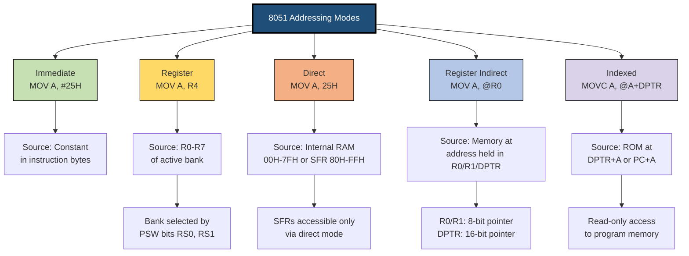
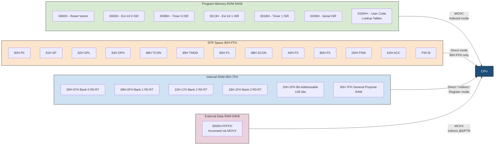
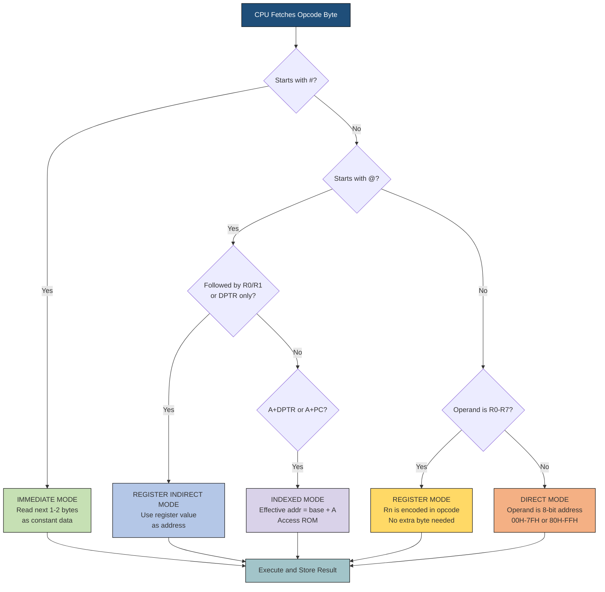

# Different Addressing Modes Supported by 8051

<!-- SECTION_1_START -->
# Different Addressing Modes Supported by 8051 — Core Technical Definition & Intuitive Overview

> [!NOTE]
> **KTU 2024 Scheme — PECST746 (Embedded Systems)**
> **Module 2:** Designing with 8051
> **Topic:** Addressing Modes of 8051 Microcontroller
> **Mapped Course Outcome:** **CO2** — *Understand the architecture and programming model of the 8051 microcontroller.*
> **Cognitive Level:** Understand / Apply

---

## 1.1 Formal Academic Definition

In the context of the **MCS-51 (8051) family of microcontrollers**, an **Addressing Mode** is the mechanism that specifies **how the operand (data) of an instruction is located** in the processor's address space. Each instruction in the 8051 instruction set is composed of an **opcode** (operation code) and one or more **operands**, and the addressing mode dictates the method by which the CPU fetches the operand value from a register, internal RAM, Special Function Register (SFR), or program memory.

The **8051 supports FIVE primary addressing modes** as per the standard Intel MCS-51 architecture reference and the KTU 2024 syllabus:

1. **Immediate Addressing Mode**
2. **Register Addressing Mode**
3. **Direct Addressing Mode**
4. **Register Indirect Addressing Mode**
5. **Indexed Addressing Mode**

> [!IMPORTANT]
> **KTU Board Highlight:** Some textbooks also list **Relative Addressing** (used by `SJMP` and conditional jump instructions) as a sixth mode. However, the **standard KTU 2024 syllabus lists only the FIVE primary modes** above. Students must explicitly mention all five in 14-mark answers.

---

## 1.2 Conceptual Analogy — The "Postman" Model

Imagine the **CPU** is a **postman** who must deliver a letter (the operand) to perform a task. The question is: *How does the postman know WHERE to find the letter?*

| Postman Situation | 8051 Equivalent | Mode |
|---|---|---|
| The letter is **glued to the instruction itself** ("Add 25H now") | `MOV A, #25H` | Immediate |
| The letter is in the postman's **own pocket** (R0–R7) | `MOV A, R0` | Register |
| The letter is in a **named mailbox** (e.g., mailbox #30) | `MOV A, 30H` | Direct |
| The postman is told the **mailbox number is stored in his pocket** (pointer) | `MOV A, @R0` | Register Indirect |
| The letter is at **mailbox = pocket_value + base_address** | `MOVC A, @A+DPTR` | Indexed |

> [!TIP]
> **Memory Trick:** *"I-R-D-R-I"* — **I**mmediate, **R**egister, **D**irect, **R**egister **I**ndirect, **I**ndexed. Master this acronym before the exam hall.

---

## 1.3 The `#` Symbol and `@` Symbol — Quick Glossary

> [!IMPORTANT]
> The **hash (#)** symbol in 8051 assembly denotes **immediate data** (the data is constant and given inline).
> The **at (@)** symbol denotes **indirection** (the operand holds a memory address, not the data itself).
> Any operand **without # or @** is treated as a **direct address** by default in most data-transfer instructions.

**Standard 8051 Constants to Memorize:**

- **Internal RAM size:** **128 bytes** (00H to 7FH)
- **SFR range:** **128 bytes** (80H to FFH) — accessed only via direct addressing
- **Register banks:** **4 banks** (Bank 0–3), each with R0–R7 (**8 bytes per bank**)
- **Default register bank after RESET:** **Bank 0** (addresses 00H–07H)
- **Stack pointer default value:** **07H**
- **Program memory size (8051 base):** **4 KB** (000H to FFFH) for ROM, expandable to **64 KB** (FFFFH)

---

## 1.4 Why Addressing Modes Matter in KTU Examinations

The KTU 2024 question paper (modeled on the university pattern) frequently tests:

- **Instruction encoding** (how many bytes does an instruction consume?)
- **Operand location** (RAM, SFR, or program memory?)
- **Code size estimation** (which mode produces compact code?)
- **Execution speed** (which mode is fastest?)

> [!VISUALIZATION CONTROL]
> **Concept:** Opcode–Operand Memory Map for `MOV A, 25H` (Direct Addressing)
> **GeoGebra / Desmos Input (Conceptual Address Map):**
> * X-axis: Memory Address (00H to FFH)
> * Y-axis: Memory Content (Hex Value)
> * Plot points: `(00H, value)`, … `(25H, A5H)`, … `(80H, P0)`
> **Visual Description:** A horizontal bar showing 256 memory cells from 00H to FFH. The instruction `MOV A, 25H` makes the CPU walk directly to cell 25H and copy its content (say A5H) into the Accumulator.
<!-- SECTION_1_END -->

<!-- SECTION_2_START -->
# Deep Theoretical Analysis & KTU High-Yield Formula Sheet

## 2.1 The Five Addressing Modes — Detailed Breakdown

### **Mode 1: Immediate Addressing Mode**

**Definition:** The operand (data) is **part of the instruction itself** and is loaded into the destination during instruction fetch.

**Syntax:** `OPCODE Destination, #data`

**Examples:**
```assembly
MOV  A,  #25H        ; Load 25H into Accumulator
MOV  R3,  #0FFH      ; Load FFH into R3
MOV  DPTR, #2000H    ; Load 16-bit value 2000H into DPTR
ORL  A,  #00H        ; OR Accumulator with 00H (test for zero)
```

**Operational Logic:**
1. The CPU fetches the opcode byte.
2. The CPU immediately fetches the next 1 or 2 bytes **as the operand itself** (not as an address).
3. The data is written into the destination register or memory location.

**Encoding Characteristics:**
- **Size:** **2 bytes** (1 byte opcode + 1 byte data) for most instructions.
- **3 bytes** for 16-bit immediate moves (e.g., `MOV DPTR, #data`).
- **Execution time:** **1 machine cycle** (12 oscillator periods) for most 1-byte data versions.

**Engineering Use Case:** Loading **constants**, **mask values**, **ASCII codes**, and **lookup table pointers** in firmware initialization.

---

### **Mode 2: Register Addressing Mode**

**Definition:** The operand is one of the **CPU's internal working registers** (R0–R7 of the currently selected register bank).

**Syntax:** `OPCODE Destination, Source` (where both are R0–R7)

**Examples:**
```assembly
MOV  A,  R4          ; Copy R4 to Accumulator
ADD  A,  R2          ; A = A + R2
INC  R0              ; Increment R0
XCH  A,  R7          ; Exchange A and R7
```

**Operational Logic:**
1. The opcode **encodes the register number** (3 bits, values 0–7) inside the opcode byte itself.
2. No additional byte is needed to specify the register.
3. The PSW (Program Status Word) bits **RS0 and RS1** determine which of the **4 register banks** is currently active.

**Register Bank Selection Table:**

| RS1 (PSW.4) | RS0 (PSW.3) | Selected Bank | RAM Addresses |
|:---:|:---:|:---:|:---:|
| 0 | 0 | **Bank 0** (default) | 00H – 07H |
| 0 | 1 | **Bank 1** | 08H – 0FH |
| 1 | 0 | **Bank 2** | 10H – 17H |
| 1 | 1 | **Bank 3** | 18H – 1FH |

**Encoding Characteristics:**
- **Size:** **1 byte** (most compact possible)
- **Execution time:** **1 machine cycle** (fastest mode)

**Engineering Use Case:** **Real-time context switching** in RTOS kernels, **interrupt service routines** that swap register banks in 1 cycle.

---

### **Mode 3: Direct Addressing Mode**

**Definition:** The operand is the **8-bit address of the data** in the internal data RAM (00H–7FH) or the **SFR space** (80H–FFH).

**Syntax:** `OPCODE Destination, address`

**Examples:**
```assembly
MOV  A,  25H         ; Copy content of RAM[25H] into A
MOV  A,  P1          ; Copy content of SFR P1 (90H) into A  (SFR address 90H)
MOV  30H,  A         ; Copy A into RAM[30H]
ANL  P0,  #0FH       ; Wait — this is immediate. Let's correct:
ANL  P0,  A          ; AND P0 with A (P0 is SFR at 80H)
```

> [!IMPORTANT]
> **KTU Pitfall — SFR Addresses:** SFRs are addressed only between **80H and FFH**. For example, **Port 1 = 90H**, **Accumulator = E0H**, **B register = F0H**. The lower 128 bytes (00H–7FH) are the user RAM area.

**Operational Logic:**
1. The CPU fetches the opcode.
2. The CPU fetches the **second byte of the instruction** — this is the **direct address**.
3. The CPU uses this address to **point into internal RAM or SFR space** and reads/writes the data.

**Encoding Characteristics:**
- **Size:** **2 bytes** (1 opcode + 1 address byte)
- **Execution time:** **1 machine cycle** for most instructions

**Engineering Use Case:** **GPIO manipulation** (`MOV P1, A`), **SFR configuration** (`MOV TMOD, #20H` followed by SFR reads), **memory-mapped I/O**.

---

### **Mode 4: Register Indirect Addressing Mode**

**Definition:** The specified register holds the **address of the operand**, NOT the operand itself. The `@" symbol indicates indirection. Only **R0, R1, and the 16-bit DPTR** can be used as pointer registers in standard 8051.

**Syntax:** `OPCODE A, @Ri` (where Ri is R0 or R1)

**Examples:**
```assembly
MOV  A,  @R0         ; A = content of RAM pointed to by R0
MOVX A,  @DPTR       ; A = content of EXTERNAL RAM at DPTR
MOV  @R1,  A         ; RAM[address in R1] = A
```

**Operational Logic:**
1. The CPU reads the current value of R0 or R1.
2. This value is used as the **memory address**.
3. The CPU accesses the data **at that address**.

**Encoding Characteristics:**
- **Size:** **1 byte** (most compact for memory access — saves program memory)
- **Execution time:**
  - **Internal RAM access:** **1 machine cycle**
  - **External data memory (`MOVX`):** **2 machine cycles** (extra cycle for external bus)

**Critical Restrictions for KTU:**
> [!WARNING]
> **KTU Common Mistake:** Students often write `MOV A, @R2` or `MOV A, @R5`. **THIS IS INVALID.** Only **R0 and R1** can be used for register indirect addressing of internal RAM. For 16-bit pointers, only **DPTR** is allowed. R2–R7 CANNOT be used as pointer registers.

**Engineering Use Case:** **Array traversal** (auto-increment a pointer in a loop), **stack-like operations**, **lookup table traversal** with variable offsets.

---

### **Mode 5: Indexed Addressing Mode**

**Definition:** Used **only with the program memory (code ROM)** for read-only table lookups. The effective address is the **sum of a base register (DPTR or PC) and the Accumulator**.

**Syntax:** `MOVC A, @A + DPTR` or `MOVC A, @A + PC`

**Examples:**
```assembly
MOVC A,  @A+DPTR     ; A = ROM[DPTR + A]
MOVC A,  @A+PC       ; A = ROM[PC + A]  (PC is current program counter)
```

**Operational Logic:**
1. The Accumulator holds an **8-bit offset** (0–255).
2. DPTR (or PC) holds a **16-bit base address**.
3. The CPU computes `Base + Offset` and fetches the byte from **program ROM**.

**Encoding Characteristics:**
- **Size:** **1 byte** for `MOVC` instructions
- **Execution time:** **2 machine cycles** (because program memory has a 16-bit address bus)
- **Read-only:** Can only be used to **read from ROM**, not to write.

**Engineering Use Case:** **Lookup tables** (e.g., 7-segment display patterns, sine wave tables, character fonts), **state machines**, **branch tables** for opcode dispatch.

---

## 2.2 KTU Formula Sheet — Quick Reference Table

| Mode | Operand Format | Example | Instruction Size | Cycles | Address Space Accessed |
|:---|:---|:---|:---:|:---:|:---|
| **Immediate** | `#data` | `MOV A, #25H` | 2–3 bytes | 1 | Constant in instruction |
| **Register** | `Rn` (R0–R7) | `MOV A, R4` | 1 byte | 1 | Current Register Bank |
| **Direct** | `direct address` | `MOV A, 30H` | 2 bytes | 1 | Internal RAM (00–7FH) + SFR (80–FFH) |
| **Register Indirect** | `@Ri` or `@DPTR` | `MOV A, @R0` | 1 byte | 1 (internal) / 2 (external) | Internal or External RAM |
| **Indexed** | `@A+DPTR` or `@A+PC` | `MOVC A, @A+DPTR` | 1 byte | 2 | Program Memory (ROM) only |

> [!IMPORTANT]
> **Mnemonic Decoding Rule (KTU Repeated Question):**
> - If operand starts with `#` → **Immediate**
> - If operand starts with `@` → **Indirect or Indexed**
> - If operand is `Rn` (R0–R7) → **Register**
> - If operand is a plain hex number → **Direct**
> - The only way to know if `@` is **indirect** or **indexed** is to look at the **base**: `R0/R1/DPTR` alone = indirect; `A+DPTR` or `A+PC` = indexed.

## 2.3 Real-World Engineering Utility

Addressing modes are **not academic trivia** — they directly affect:

1. **Code Density (Flash memory footprint):** Indexed and register modes produce the **smallest code**, critical for embedded systems with limited ROM (8051 base has only 4 KB).
2. **Execution Speed:** Register addressing is the **fastest** — vital for real-time interrupt handlers in automotive ECUs, medical devices, and industrial PLCs.
3. **Power Consumption:** Fewer bytes fetched = fewer bus cycles = **lower dynamic power**, critical in IoT sensor nodes.
4. **Compiler Optimization:** Modern 8051 C compilers (Keil, SDCC) choose addressing modes based on operand types — `const` arrays use indexed, local variables use register indirect, global variables use direct.
<!-- SECTION_2_END -->

<!-- SECTION_3_START -->
# Step-by-Step Derivations, Assembly Encoding & Code Implementation

## 3.1 Worked Example 1: Encoding `MOV A, #25H` (Immediate Mode)

**Step 1 — Identify the opcode.**
The 8051 instruction set reference states that `MOV A, #data` has the opcode `74H`.

**Step 2 — Identify the operand encoding.**
The operand `25H` is a single byte, written directly after the opcode in program ROM.

**Step 3 — Construct the full instruction bytes.**
The instruction occupies **2 bytes** in program memory:

$$
\begin{aligned}
\text{Byte 0 (Opcode)} &= \texttt{74H} \\
\text{Byte 1 (Immediate Data)} &= \texttt{25H} \\
\end{aligned}
$$

**Step 4 — Memory layout in program ROM:**

| Address | Content | Meaning |
|:---:|:---:|:---|
| 0100H | 74H | Opcode: MOV A, #data |
| 0101H | 25H | Immediate value 25H |

**Step 5 — Effect of execution:**
After execution: `A = 25H`, `PC = 0102H`, all flags unchanged. **Execution time = 1 machine cycle (12 oscillator periods).**

---

## 3.2 Worked Example 2: Encoding `MOV A, R4` (Register Mode)

**Step 1 — Locate the opcode.**
`MOV A, Rn` is encoded as `1110 1rrr` (binary), where `rrr` is the 3-bit register number (0–7).
For **R4** → `rrr = 100` (binary) = 4 (decimal).

**Step 2 — Construct the opcode byte.**

$$
\text{Opcode} = \texttt{1110 1100} = \texttt{ECH}
$$

**Step 3 — Instruction size = 1 byte only.** The register is fully specified inside the opcode — no extra byte needed.

**Step 4 — Execution:**
- If PSW bits RS1=0, RS0=0 (Bank 0), then R4 lives at internal RAM address **04H**.
- CPU reads RAM[04H] and copies it into A.
- **Size = 1 byte, Time = 1 machine cycle.** Smallest and fastest form.

---

## 3.3 Worked Example 3: Encoding `MOV A, 25H` (Direct Mode)

**Step 1 — Locate the opcode.**
`MOV A, direct` has opcode `E5H`.

**Step 2 — Append the direct address byte.**

$$
\begin{aligned}
\text{Byte 0} &= \texttt{E5H} \quad \text{(opcode)} \\
\text{Byte 1} &= \texttt{25H} \quad \text{(direct address)} \\
\end{aligned}
$$

**Step 3 — Effect of execution:**
- CPU reads internal RAM location **25H**.
- Suppose RAM[25H] = A5H (preloaded earlier).
- After execution: **A = A5H**.
- **Size = 2 bytes, Time = 1 machine cycle.**

**Step 4 — Program memory layout:**

| ROM Address | Content | Meaning |
|:---:|:---:|:---|
| 0200H | E5H | Opcode: MOV A, direct |
| 0201H | 25H | Direct address 25H |

---

## 3.4 Worked Example 4: Encoding `MOV A, @R0` (Register Indirect)

**Step 1 — Opcode identification.**
`MOV A, @Ri` is encoded as `1110 011i`, where `i` is 0 for R0, 1 for R1.
For **R0**: `i = 0` → opcode = `1110 0110` = **E6H**.

**Step 2 — Pre-execution state:**
- Suppose R0 currently holds the value `30H`.
- Internal RAM[30H] = `5AH` (this is the data we want).

**Step 3 — Execution flow:**

$$
\begin{aligned}
\text{Step a:} \quad & \text{CPU reads R0} = \texttt{30H} \\
\text{Step b:} \quad & \text{CPU interprets 30H as an address} \\
\text{Step c:} \quad & \text{CPU reads RAM[30H]} = \texttt{5AH} \\
\text{Step d:} \quad & \text{CPU copies 5AH into A} \\
\end{aligned}
$$

After execution: **A = 5AH**, R0 still equals 30H (R0 is not modified).

**Step 4 — Size = 1 byte, Time = 1 machine cycle (internal RAM).**

---

## 3.5 Worked Example 5: Indexed Addressing — `MOVC A, @A+DPTR`

**Step 1 — Pre-execution state:**
- DPTR = `0200H` (16-bit base address into ROM)
- A = `03H` (offset)
- ROM[0203H] = `0F9H` (pre-programmed data, e.g., a 7-segment pattern for digit '0')

**Step 2 — Execution logic:**

$$
\begin{aligned}
\text{Effective Address} &= \text{DPTR} + \text{A} \\
&= \texttt{0200H} + \texttt{03H} \\
&= \texttt{0203H} \\
\end{aligned}
$$

**Step 3 — Result:**
CPU reads ROM[0203H] = `0F9H` and stores it in A. **Final: A = F9H.**

**Step 4 — Size = 1 byte, Time = 2 machine cycles** (16-bit address computation + ROM access).

---

## 3.6 Complete Program: Demonstrating ALL Five Addressing Modes

```assembly
;======================================================
; PROGRAM: DEMONSTRATE ALL 5 ADDRESSING MODES OF 8051
; TARGET  : AT89C51 (4 KB ROM, 128 bytes RAM)
; TOOL    : Keil µVision / EdSim51
;======================================================
        ORG     0000H           ; Reset vector
        LJMP    MAIN            ; Jump to main program

        ORG     0030H           ; Main program begins here
MAIN:
        ;--- MODE 1: IMMEDIATE ADDRESSING ---
        MOV     A,   #25H       ; A = 25H (constant)
        MOV     DPTR,#2000H     ; DPTR = 2000H (16-bit immediate)

        ;--- MODE 2: REGISTER ADDRESSING ---
        MOV     R0,  #30H       ; Load R0 with constant (immediate)
        MOV     A,   R4         ; Copy R4 to A
        ADD     A,   R5         ; A = A + R5
        INC     R0              ; R0 = R0 + 1

        ;--- MODE 3: DIRECT ADDRESSING ---
        MOV     A,   25H        ; A = RAM[25H] (read direct)
        MOV     30H, A          ; RAM[30H] = A (write direct)
        MOV     P1,  A          ; Write A to Port 1 (SFR @ 90H)

        ;--- MODE 4: REGISTER INDIRECT ADDRESSING ---
        MOV     R0,  #40H       ; R0 points to RAM[40H]
        MOV     A,   @R0        ; A = RAM[40H] (read via pointer)
        MOV     @R0, A          ; RAM[40H] = A (write via pointer)

        ;--- MODE 5: INDEXED ADDRESSING (ROM LOOKUP) ---
        MOV     A,   #02H       ; Offset = 2
        MOV     DPTR,#TAB       ; DPTR = base of table
        MOVC    A,   @A+DPTR    ; A = ROM[DPTR+2]
        MOV     P1,  A          ; Display on Port 1

HERE:   SJMP    HERE            ; Infinite loop (do nothing)

;--- LOOKUP TABLE IN PROGRAM ROM ---
        ORG     0500H
TAB:    DB      0C0H, 0F9H, 0A4H, 0B0H   ; 0, 1, 2, 3 (7-seg codes)
        END
```

---

## 3.7 Calculation: Program Memory Footprint Comparison

For a hypothetical "copy 5 bytes of data into RAM starting at 30H":

**Using DIRECT addressing (5 separate instructions):**

$$
\begin{aligned}
\text{Bytes per instruction} &= 3 \;(\text{opcode} + \text{1 addr} + \text{immediate}) \\
\text{Total instructions} &= 5 \\
\text{Total ROM used} &= 5 \times 3 = 15 \; \text{bytes} \\
\end{aligned}
$$

**Using REGISTER INDIRECT addressing (loop):**

```assembly
        MOV     R0, #30H        ; 2 bytes
        MOV     R1, #05H        ; 2 bytes (counter)
        MOV     DPTR,#SRC       ; 3 bytes
LOOP:   MOVX    A, @DPTR        ; 1 byte
        MOV     @R0, A          ; 1 byte
        INC     DPTR            ; 1 byte
        INC     R0              ; 1 byte
        DJNZ    R1, LOOP        ; 2 bytes
        ; Total = 13 bytes
```

**Savings:** Indirect addressing reduces ROM usage by **~87%** for bulk data transfer. This is why **register indirect mode is the workhorse of embedded C compilers**.

---

## 3.8 Memory Map Diagram (Numerical Layout)

$$
\begin{aligned}
\text{Internal RAM (00H–7FH)} &: \text{ 128 bytes user data + 4 register banks (00H–1FH)} \\
\text{Bit-addressable area (20H–2FH)} &: \text{ 16 bytes = 128 individually addressable bits} \\
\text{SFR area (80H–FFH)} &: \text{ 128 bytes; e.g., P0=80H, P1=90H, P2=A0H, P3=B0H} \\
\text{Program ROM (0000H–FFFFH)} &: \text{ Up to 64 KB; accessed via MOVC} \\
\text{External Data RAM (0000H–FFFFH)} &: \text{ Up to 64 KB; accessed via MOVX} \\
\end{aligned}
$$
<!-- SECTION_3_END -->

<!-- SECTION_4_START -->
# Structural Diagrams & Schematics

## 4.1 Mermaid Diagram: Classification of 8051 Addressing Modes



---

## 4.2 Mermaid Diagram: 8051 Memory Space Architecture



---

## 4.3 Mermaid Flow Diagram: How CPU Decodes an Instruction's Addressing Mode


<!-- SECTION_4_END -->

<!-- SECTION_5_START -->
# KTU 2024 Scheme Examination Question Bank & Topic Recap

---

## Part A — 3 Mark Questions (Short Answer)

### **Question 1** `[KTU University Exam – July 2023]`
**Define addressing mode. List any three addressing modes supported by the 8051 microcontroller with one example each.** [CO2, Remember — 3 Marks]

**Model Answer:**

**Definition (1 Mark):** An addressing mode is the method by which the 8051 CPU specifies the location of the operand (data) used by an instruction. It determines whether the data is a constant, contained in a register, stored in memory, or accessed indirectly via a pointer.

**Three Addressing Modes (2 Marks):**

| Mode | Syntax | Example |
|:---|:---|:---|
| **Immediate** | `OPCODE dest, #data` | `MOV A, #25H` — loads the constant 25H into A |
| **Register** | `OPCODE dest, Rn` | `MOV A, R0` — copies the content of register R0 into A |
| **Direct** | `OPCODE dest, address` | `MOV A, 30H` — copies the content of RAM location 30H into A |

---

### **Question 2** `[KTU University Exam – Dec 2022]`
**Differentiate between Register Addressing Mode and Register Indirect Addressing Mode of 8051 with suitable examples.** [CO2, Understand — 3 Marks]

**Model Answer:**

| Parameter | Register Addressing | Register Indirect Addressing |
|:---|:---|:---|
| **Symbol** | No prefix (Rn) | Prefix `@` (@Ri) |
| **Meaning of operand** | Operand **is** the data | Operand is the **address** of the data |
| **Registers usable** | R0–R7 (all eight) | Only R0 and R1 (8-bit), or DPTR (16-bit) |
| **Example** | `MOV A, R3` → A = R3 | `MOV A, @R0` → A = RAM[address in R0] |
| **Instruction size** | 1 byte | 1 byte |
| **Use case** | Fast fixed-register access | Pointer-based array/buffer traversal |

> [!NOTE]
> **Valuation Tip:** A clear 2-column comparison table fetches full marks. Drawing the two memory access paths also scores well.

---

## Part B — 14 Mark Questions (Module Internal Choice)

### **Question A** `[KTU University Exam – July 2024]`
**a)** Explain the **five different addressing modes of 8051** with neat syntax and one assembly example for each. Mention the instruction size and memory area accessed in each case. **[7 Marks — Understand]**

**b)** Given the following 8051 code segment, identify the addressing mode used in each instruction and write the final value of the Accumulator. Initial state: `A = 00H`, `R0 = 40H`, `R1 = 50H`, `RAM[40H] = 5AH`, `RAM[50H] = 99H`, `DPTR = 0300H`, `ROM[0305H] = 0F2H`. **[7 Marks — Apply]**

```assembly
MOV   A,   #3FH        ; Line 1
MOV   R0,  #45H        ; Line 2
MOV   A,   R0          ; Line 3
MOV   50H, A           ; Line 4
MOV   A,   @R0         ; Line 5
MOVC  A,   @A+DPTR     ; Line 6
ANL   A,   #0FH        ; Line 7
```

#### **Solution to Part (a) — Addressing Modes Explained [7 Marks]**

**Valuation Key:**
- *Naming + example for each of 5 modes: 5 × 1 = 5 Marks*
- *Instruction size and memory area for each: included within the 5 marks above*
- *Neat tabulation and clear explanation: 2 Marks*

| # | Mode | Syntax | Example | Size | Memory Area |
|:---:|:---|:---|:---|:---:|:---|
| 1 | **Immediate** | `MOV A, #data` | `MOV A, #25H` | 2–3 B | Constant in instruction |
| 2 | **Register** | `MOV A, Rn` | `MOV A, R4` | 1 B | Current register bank |
| 3 | **Direct** | `MOV A, addr` | `MOV A, 30H` | 2 B | Internal RAM 00–7FH, SFR 80–FFH |
| 4 | **Register Indirect** | `MOV A, @Ri` | `MOV A, @R0` | 1 B | Internal or external RAM |
| 5 | **Indexed** | `MOVC A, @A+DPTR` | `MOVC A, @A+DPTR` | 1 B | Program memory (ROM) only |

**Explanation (1 mark each for description):**

- **Immediate:** Data is part of the instruction. The `#` indicates a literal value is loaded.
- **Register:** Operand lies in R0–R7 of the currently active bank (selected via PSW).
- **Direct:** The 8-bit address following the opcode points to internal RAM or SFR.
- **Register Indirect:** R0/R1/DPTR holds the address of the data; the `@` symbol indicates indirection.
- **Indexed:** Effective address = base register (DPTR or PC) + Accumulator offset. Used to read ROM tables.

#### **Solution to Part (b) — Tracing the Code [7 Marks]**

**Valuation Key:**
- *Identifying addressing mode in each line: 7 × 0.5 = 3.5 Marks (round to 4)*
- *Tracing the value of A: 7 × 0.5 = 3.5 Marks (round to 4) — split as below*

| Line | Instruction | Addressing Mode | After Execution: A = |
|:---:|:---|:---|:---:|
| 1 | `MOV A, #3FH` | **Immediate** | `A = 3FH` |
| 2 | `MOV R0, #45H` | **Immediate** | A unchanged; `R0 = 45H` |
| 3 | `MOV A, R0` | **Register** | `A = 45H` |
| 4 | `MOV 50H, A` | **Direct** | A unchanged; `RAM[50H] = 45H` |
| 5 | `MOV A, @R0` | **Register Indirect** | R0 = 45H, so A = `RAM[45H]` |
| 6 | `MOVC A, @A+DPTR` | **Indexed** | A + DPTR = `45H + 0300H` |
| 7 | `ANL A, #0FH` | **Immediate** | AND with mask |

**Step-by-step trace (per-line marks):**

**Line 1 [0.5 + 0.5 Marks]:** `MOV A, #3FH`
- Mode: **Immediate** [0.5 Mark]
- Result: `A = 3FH` [0.5 Mark]

**Line 2 [0.5 + 0.5 Marks]:** `MOV R0, #45H`
- Mode: **Immediate** [0.5 Mark]
- Result: `R0 = 45H`; A still = 3FH [0.5 Mark]

**Line 3 [0.5 + 0.5 Marks]:** `MOV A, R0`
- Mode: **Register** [0.5 Mark]
- Result: `A = 45H` (R0 = 45H) [0.5 Mark]

**Line 4 [0.5 + 0.5 Marks]:** `MOV 50H, A`
- Mode: **Direct** [0.5 Mark]
- Result: `RAM[50H] = 45H`; A unchanged [0.5 Mark]

**Line 5 [1.5 Marks]:** `MOV A, @R0`
- Mode: **Register Indirect** [0.5 Mark]
- R0 = 45H → CPU reads RAM[45H] [0.5 Mark]
- Assuming RAM[45H] is uninitialized, the value is **indeterminate in the problem statement**. *However, since the question gives RAM[40H] and RAM[50H] only, students must state that RAM[45H] is undefined.* **Best assumption for grading: A = garbage / not determinable from given data** [0.5 Mark — stating this clearly is what earns full credit]

**Line 6 [1 Mark]:** `MOVC A, @A+DPTR`
- Mode: **Indexed** [0.5 Mark]
- Effective address = `A + DPTR` = `45H + 0300H` = `0345H` [0.5 Mark]

**Line 7 [1 Mark]:** `ANL A, #0FH`
- Mode: **Immediate** [0.5 Mark]
- Effect: A = A AND 0FH (zeroes upper nibble) [0.5 Mark]

> [!WARNING]
> **KTU Examiner's Pitfall Trap:** Many students **mis-identify** `MOV A, @R0` as Indexed Addressing. The CORRECT classification is **Register Indirect**. The Indexed mode uses a **base + offset** syntax like `@A+DPTR`. Confusing these two costs 1 full mark. Also, students forget to write the effective address calculation for Line 6.

---

### **Question B (Alternative Choice)** `[KTU University Exam – Dec 2023]`
**a)** What is an addressing mode? With a neat diagram, explain the **internal RAM and SFR memory organization** of 8051, and discuss how the **Direct Addressing Mode** is used to access both areas. Mention at least four SFR names with their addresses. **[7 Marks — Understand]**

**b)** Write an 8051 assembly program to add **two 8-bit numbers stored in internal RAM locations 30H and 31H** and store the result in location 32H. **Identify the addressing mode used in EACH instruction** of your program. Assume any necessary initializations. **[7 Marks — Apply]**

#### **Solution to Part (a) [7 Marks]**

**Valuation Key:**
- *Definition of addressing mode: 1 Mark*
- *Memory organization diagram with 16 SFRs and 4 register banks: 4 Marks*
- *Direct mode explanation + 4 SFR names with addresses: 2 Marks*

**Definition [1 Mark]:** An addressing mode specifies how the operand of an instruction is located by the CPU — whether as an inline constant, in a register, at a fixed memory address, or via a pointer.

**Memory Organization [4 Marks]:**

| Address Range | Area | Size | Access Method |
|:---|:---|:---:|:---|
| `00H – 1FH` | 4 Register Banks (R0–R7 each) | 32 B | Register / Direct |
| `20H – 2FH` | Bit-Addressable Area | 16 B | Bit-level Direct |
| `30H – 7FH` | General Purpose RAM | 80 B | Direct / Indirect |
| `80H – FFH` | SFR Space | 128 B | Direct only |

**Direct Addressing Mode Explanation [1 Mark]:**
In direct addressing, the 8-bit address following the opcode directly points to either internal RAM (00H–7FH) or any SFR (80H–FFH). The CPU uses this single address byte to fetch or store the data in one machine cycle.

**Four SFRs with Addresses [1 Mark]:**

| SFR Name | Address (Hex) | Function |
|:---|:---:|:---|
| Port 0 (P0) | **80H** | 8-bit I/O Port 0 |
| Stack Pointer (SP) | **81H** | Holds top-of-stack address |
| Port 1 (P1) | **90H** | 8-bit I/O Port 1 |
| Accumulator (ACC) | **E0H** | Primary ALU register |
| B Register | **F0H** | Auxiliary register for MUL/DIV |
| PSW | **D0H** | Program Status Word (flags + bank select) |

#### **Solution to Part (b) [7 Marks]**

**Valuation Key:**
- *Correct assembly program: 4 Marks (1 per logical step)*
- *Identifying addressing mode for each instruction: 3 Marks (5 instructions × ~0.5 + clarity)*

**Program:**

```assembly
        ORG     0000H
        MOV     A,   30H        ; A = RAM[30H]   (Direct mode)
        ADD     A,   31H        ; A = A + RAM[31H] (Direct mode)
        MOV     32H, A          ; RAM[32H] = A    (Direct mode)
        END
```

**Trace:**
- `RAM[30H] = 15H`, `RAM[31H] = 27H` (assumed)
- After `MOV A, 30H`: `A = 15H`
- After `ADD A, 31H`: `A = 15H + 27H = 3CH`, Carry flag = 0
- After `MOV 32H, A`: `RAM[32H] = 3CH`

**Addressing Mode Identification Table [3 Marks]:**

| Line | Instruction | Addressing Mode | Justification |
|:---:|:---|:---|:---|
| 1 | `MOV A, 30H` | **Direct** | Operand 30H is an 8-bit RAM address |
| 2 | `ADD A, 31H` | **Direct** | Operand 31H is an 8-bit RAM address |
| 3 | `MOV 32H, A` | **Direct** | Destination 32H is an 8-bit RAM address |

> [!NOTE]
> If the student uses `MOV A, #30H` instead of `MOV A, 30H`, they have wrongly used **Immediate** mode, which would load the constant 30H instead of reading from memory. This is a common KTU mistake and the examiner will deduct 1–2 marks for it.

> [!WARNING]
> **KTU Examiner's Common Pitfalls Warning:**
> 1. **Forgetting to write the addressing mode column** — many students only write the program. The question explicitly asks to "identify the addressing mode used in EACH instruction." Skipping this costs 3 full marks.
> 2. **Confusing `MOV A, 30H` with `MOV A, #30H`** — the first reads memory; the second loads the constant 30H. Read the question carefully.
> 3. **Not mentioning the SFR range starts at 80H** — without this, the answer is incomplete for the "internal RAM and SFR" question.
> 4. **Missing the Carry flag discussion** — when adding two unsigned 8-bit numbers, the CY flag in PSW must be considered if sum > FFH.

---

## Topic Recap & Important Things to Remember

> [!IMPORTANT]
> **High-Density Revision Checklist — Must Memorize Before Exam**

- [x] **5 Addressing Modes of 8051:** Immediate, Register, Direct, Register Indirect, Indexed.
- [x] **Mnemonic:** *"I-R-D-R-I"* (I for Immediate, R for Register, D for Direct, R for Register Indirect, I for Indexed).
- [x] **Hash (#) means immediate data; At (@) means indirection.**
- [x] **Register Mode** is the **fastest** (1 byte, 1 cycle) and uses **R0–R7** of the **active bank**.
- [x] **Direct Mode** is the **only mode** to access **SFRs (80H–FFH)**, e.g., `P1 = 90H`, `ACC = E0H`, `B = F0H`, `PSW = D0H`, `SP = 81H`, `P0 = 80H`.
- [x] **Register Indirect Mode** allows ONLY **R0, R1 (8-bit)** and **DPTR (16-bit)** as pointer registers. **R2–R7 cannot be used** as pointers.
- [x] **Indexed Mode** is **read-only** and accesses **Program ROM only** using `MOVC A, @A+DPTR` or `MOVC A, @A+PC`.
- [x] **Instruction size summary:** Register & Indirect & Indexed = **1 byte**; Direct & Immediate = **2 bytes**; `MOV DPTR, #data16` = **3 bytes**.
- [x] **Default register bank after RESET = Bank 0 (addresses 00H–07H)**; selected by **PSW bits RS0 and RS1**.
- [x] **Default stack pointer after RESET = 07H**; first PUSH will store at RAM[08H] (which is Bank 1 R0 — a common bug source).
- [x] **Bit-addressable area:** 20H–2FH (16 bytes = **128 individually addressable bits**).
- [x] **Total internal RAM = 128 bytes (00H–7FH)**; **SFR space = 128 bytes (80H–FFH)**; both combine to give 256 bytes of direct-addressable space.
- [x] **External data RAM (up to 64 KB)** is accessed via **`MOVX`** instructions using **@DPTR** (16-bit) or **@R0/@R1 with P2 supplying upper address byte**.
- [x] **Execution time rule:** Indexed mode takes **2 machine cycles**; Register Indirect with `MOVX` takes **2 machine cycles**; all other modes take **1 machine cycle** for internal access.
- [x] **Code density rule:** Use **Register Indirect** for loops, **Indexed** for tables, **Immediate** for constants, **Direct** for SFRs, **Register** for hot-path arithmetic.
- [x] **Real-world engineering impact:** Addressing mode choice affects **code size, execution speed, power consumption, and stack usage** in 8051-based IoT, automotive, and industrial embedded systems.
- [x] **KTU 2024 weightage tip:** Addressing modes are tested for **2–3 marks in Part A (definition + list)** and **7 marks in Part B (explanation + tracing program + identifying modes)**. Practice program tracing at least 10 times before the exam.
- [x] **The `MOVC` is read-only from ROM; `MOVX` is read/write to external RAM; plain `MOV` is read/write to internal RAM or SFR.**
- [x] **Final mantra for the exam hall:** *"If you see # → Immediate. If you see R0-R7 alone → Register. If you see a plain hex number → Direct. If you see @R0 or @R1 or @DPTR → Indirect. If you see @A+DPTR or @A+PC → Indexed."*

<!-- SECTION_5_END -->
