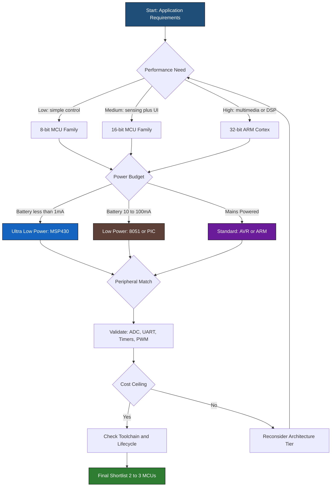
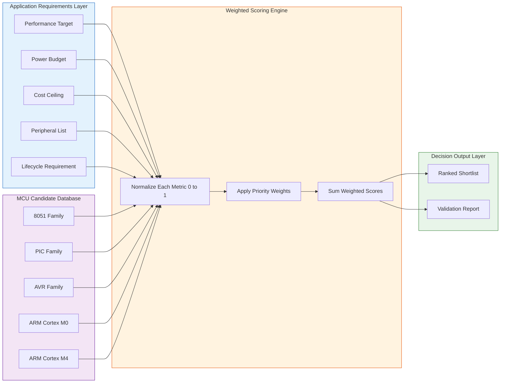
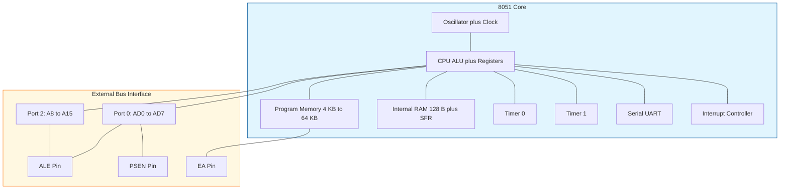
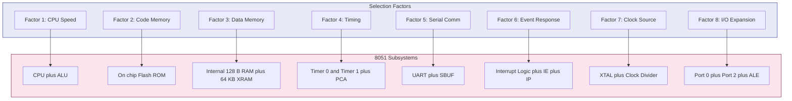

# Factors to be Considered in Selecting a Controller

<!-- SECTION_1_START -->

# 1. Core Technical Definition & Intuitive Overview

## Formal Academic Definition

In the context of **KTU 2024 Scheme – Embedded Systems (PECST746)**, *Controller Selection* refers to the systematic engineering process of evaluating, comparing, and choosing an appropriate **Microcontroller Unit (MCU)** or **Microprocessor Unit (MPU)** for a specific embedded application based on a structured set of technical, economic, and operational criteria. The 8051, designed by Intel in 1980, remains the academic reference architecture for understanding these selection factors.

> [!IMPORTANT]
> **KTU Syllabus Highlight (Module 2):**
> Selecting a controller is the **first and most critical design decision** in any embedded product. A wrong choice cascades into cost overruns, power inefficiency, missed real-time deadlines, and even product failure. The selection matrix must balance **performance, power, peripherals, cost, and time-to-market**.

## Conceptual Analogy / Intuition

Imagine you are buying a **vehicle for a specific purpose**:

- A **Formula-1 car** is engineered purely for speed — expensive, fuel-thirsty, and impractical for grocery runs.
- A **family hatchback** is balanced — affordable, fuel-efficient, and versatile.
- A **dump truck** sacrifices speed and elegance for raw load-bearing capacity and durability.

Similarly, when designing an embedded product:
- A **washing machine controller** needs only a cheap 8-bit MCU (like the 8051) — it just toggles relays and reads buttons.
- A **drone flight controller** needs a 32-bit ARM Cortex processor with FPU — it must perform real-time sensor fusion and PID loops.
- A **smartwatch** needs ultra-low-power architecture (e.g., MSP430, ARM Cortex-M0+) — battery life dominates.

> [!NOTE]
> **Core Definition — Selection Criteria:**
> *Selection Criteria* are the measurable, comparable attributes of a microcontroller that an embedded system designer uses to rank candidate devices against the application's functional and non-functional requirements. The most common criteria are processing speed, memory size, power profile, peripheral set, I/O count, cost, package, and ecosystem maturity.

## Standard Metrics and Constants

The following are the **canonical metrics** used during controller benchmarking in KTU-evaluated design problems:

- **Clock Frequency ($f_{CLK}$):** Typically **$\mathbf{1 \text{ MHz to 200 MHz}$** for 8051 family; up to **$\mathbf{1 \text{ GHz}$** for high-end ARM Cortex-M7.
- **MIPS (Million Instructions Per Second):** The 8051 standard variant delivers **$\mathbf{1 \text{ MIPS/MHz}$** (1 instruction per 12 clock cycles for original 8051).
- **Power Consumption:** Measured in **$\mathbf{mW/MHz}$** or active current in **$\mathbf{\mu A/MHz}$**.
- **Memory Density:** Flash in **$\mathbf{KB}$**, RAM in **$\mathbf{B}$** or **$\mathbf{KB}$**.
- **Operating Voltage ($V_{DD}$):** Standard **$\mathbf{3.3 \text{ V}$** or **$\mathbf{5 \text{ V}$**; low-power variants down to **$\mathbf{0.9 \text{ V}$**.
- **Operating Temperature Range:** Commercial **$\mathbf{0^{\circ}\text{C} \text{ to } 70^{\circ}\text{C}}$**, Industrial **$\mathbf{-40^{\circ}\text{C} \text{ to } 85^{\circ}\text{C}}$**, Automotive **$\mathbf{-40^{\circ}\text{C} \text{ to } 125^{\circ}\text{C}}$**.

## Visualizing the Selection Trade-off

> [!VISUALIZATION CONTROL]
> **Concept:** Multi-Objective Selection Trade-off Radar Plot
> **Plot Axes (5-axis radar):** Performance (MIPS), Power (mW), Cost (USD), Peripheral Count, Memory (KB)
> **Plot Series:**
> * 8051 family (low cost, low power, low performance)
> * PIC16 (balanced 8-bit)
> * AVR ATmega (higher performance 8-bit)
> * ARM Cortex-M0 (low-power 32-bit)
> * ARM Cortex-M4 (high-performance 32-bit with DSP)
> **Visual Description:** The 8051 polygon is small and biased toward cost and power, while the ARM Cortex-M4 polygon is large and biased toward performance. The student should observe that **no single MCU dominates every axis** — selection is a multi-objective optimization problem.

<!-- SECTION_1_END -->

<!-- SECTION_2_START -->

# 2. Deep Theoretical Analysis & KTU High-Yield Formula Sheet

## 2.1 The 10 Mandatory Selection Factors

The KTU 2024 syllabus and the standard *Mazidi / Vahid / Givargis* textbook framework prescribe the following ten factors. Each must be justified quantitatively in a design report.

### Factor 1 — **Performance & Computational Throughput**
- Defines how fast the controller executes instructions.
- Measured as **MIPS** or **DMIPS (Dhrystone MIPS)**.
- Computed using:

$$T_{exec} = \frac{N_{inst} \times CPI}{f_{CLK}}$$

Where:
* $T_{exec}$ = Total execution time in seconds
* $N_{inst}$ = Number of instructions in the task
* $CPI$ = Cycles per instruction (for classic 8051, $CPI = 12$)
* $f_{CLK}$ = Clock frequency in Hz

- For real-time systems, the constraint is $T_{exec} \le T_{deadline}$.

### Factor 2 — **Memory Architecture**
- **Program Memory (ROM/Flash):** Stores firmware. Size depends on code complexity.
- **Data Memory (RAM):** Stores variables, stack, heap. Critical for RTOS use.
- **Non-Volatile Memory (EEPROM/FRAM):** Stores configuration and calibration constants.

> [!NOTE]
> **8051 Baseline:** The original 8051 has **$\mathbf{4 \text{ KB}$** ROM, **$\mathbf{128 \text{ B}$** RAM, and **$\mathbf{64 \text{ KB}$** external addressable space each for code and data (Harvard architecture).

### Factor 3 — **Power Consumption & Power Modes**
- Critical for **battery-powered** and **energy-harvesting** systems.
- Modes: *Active, Idle, Sleep, Power-Down, Deep Power-Down.*
- Average power formula:

$$P_{avg} = \frac{\sum_{i} (P_i \times t_i)}{T_{total}}$$

- For modern low-power MCUs, sleep current can be **$\mathbf{< 1 \mu A}$**.

### Factor 4 — **Peripheral Set & On-Chip Integration**
- Peripherals reduce external component count → reduce **BOM cost** and **PCB area**.
- Standard on-chip peripherals: **ADC, DAC, PWM, Timers/Counters, UART, SPI, I²C, USB, CAN, RTC, Watchdog Timer, DMA, Crypto Accelerator.**

### Factor 5 — **I/O Capability & Pin Count**
- Number of GPIO pins must satisfy the application's pin map.
- Consider pin multiplexing — some pins share alternate functions.
- Consider drive strength (typically **$\mathbf{4 \text{ mA}$**, **$\mathbf{8 \text{ mA}$**, or **$\mathbf{20 \text{ mA}$** per pin).

### Factor 6 — **Cost & Bill of Materials (BOM)**
- Two cost dimensions: **unit cost** (at production volume) and **NRE cost** (tooling, mask charges).
- For 8051, unit cost ranges from **$\mathbf{\$0.10 \text{ to } \$2}$** depending on variant and vendor.

### Factor 7 — **Physical Size & Package**
- Packages: **DIP, SOIC, QFP, QFN, BGA, WLCSP.**
- For wearables: WLCSP or QFN ($\le 3 \text{ mm} \times 3 \text{ mm}$).
- For hobbyist/prototyping: DIP (breadboard-friendly).

### Factor 8 — **Development Toolchain, Debugging & Ecosystem**
- Compiler support: **Keil, IAR, SDCC, GCC.**
- Debug interface: **JTAG, SWD, BDM, OCD.**
- IDE, RTOS support, community, vendor documentation, application notes.
- For 8051: **Keil µVision** is the industry standard.

### Factor 9 — **Reliability, Robustness & Operating Conditions**
- **MTBF (Mean Time Between Failures):** Industrial-grade MCUs have MTBF **$> 10^6$ hours**.
- ESD protection, latch-up immunity, EMI/EMC compliance.
- Certification needs: **AEC-Q100 (automotive), IEC 61508 (industrial safety), MIL-STD-810 (defense).**

### Factor 10 — **Availability, Lifecycle & Longevity**
- Risk of **obsolescence** (PCN/EOL notices).
- Automotive and medical applications demand **$\mathbf{10 \text{–} 15 \text{ year}$** supply guarantees.
- Consider pin-compatible second-source vendors.

## 2.2 KTU Formula Sheet

| # | Metric | Formula / Symbol | Typical 8051 Value | Units |
|---|---|---|---|---|
| 1 | Execution Time | $T_{exec} = \dfrac{N_{inst} \times CPI}{f_{CLK}}$ | Variable | $\text{s}$ |
| 2 | MIPS Rating | $MIPS = \dfrac{f_{CLK}}{CPI \times 10^6}$ | $1$ at $12 \text{ MHz}$ | $\text{MIPS}$ |
| 3 | Avg Power | $P_{avg} = \dfrac{\sum P_i t_i}{T_{total}}$ | $30$–$60$ | $\text{mW}$ |
| 4 | Active Current | $I_{act} = \dfrac{P_{act}}{V_{DD}}$ | $6$–$12$ at $5 \text{ V}$ | $\text{mA}$ |
| 5 | Sleep Current | $I_{sleep}$ | $\le 50$ | $\mu\text{A}$ |
| 6 | Wake-up Time | $t_{wu}$ | $10$–$100$ | $\mu\text{s}$ |
| 7 | Code Memory | $ROM$ or $Flash$ | $4$–$64$ | $\text{KB}$ |
| 8 | Data Memory | $RAM$ (internal) | $128$–$256$ | $\text{B}$ |
| 9 | External Data Space | $XRAM$ | $64$ | $\text{KB}$ |
| 10 | Operating Voltage | $V_{DD}$ | $5$ (orig) / $3.3$ (modern) | $\text{V}$ |
| 11 | GPIO Drive | $I_{OH}, I_{OL}$ | $\pm 10$ typical | $\text{mA}$ |
| 12 | Interrupt Latency | $t_{lat}$ | $13$ cycles ($\approx 13 \mu s$ at $12 \text{ MHz}$) | $\text{cycles}$ |

## 2.3 Real-World Engineering Utility

In **production-grade engineering**, controller selection drives every downstream decision:

- **Consumer IoT (e.g., smart bulb):** Choice between ESP8266 (Wi-Fi integrated) vs. 8051 + external Wi-Fi module. The integrated choice cuts BOM cost by **40%**.
- **Automotive ECU (e.g., Bosch):** Infineon AURIX or NXP S32K3 — selected for **AEC-Q100 Grade 1**, **functional safety (ASIL-D)**, and **multi-core lockstep**.
- **Medical implants (e.g., pacemaker):** Ultra-low-power MSP430 or custom ASIC — selected for **nA-level sleep current** to achieve 10-year battery life.
- **Industrial PLC:** Determinism and **IEC 61131-3** compliance push selection toward ARM Cortex-R or dedicated PLC chips.

<!-- SECTION_2_END -->

<!-- SECTION_3_START -->

# 3. Step-by-Step Derivations & Code/Symbolic Implementation

## 3.1 Analytical Derivation — Real-Time Deadline Check

**Problem Statement (KTU-style):**
A temperature monitoring system uses an 8051 running at $f_{CLK} = 11.0592 \text{ MHz}$. The polling loop contains $N_{inst} = 450$ instructions, with an average $CPI = 12$ for the original 8051 architecture. The temperature must be sampled every $T_{deadline} = 500 \mu s$. Determine whether the 8051 meets the real-time constraint. If not, recommend a clock upgrade or CPI reduction.

### Step-by-Step Derivation

**Step 1 — Identify the input parameters.**
$f_{CLK} = 11.0592 \times 10^6 \text{ Hz}$
$N_{inst} = 450$
$CPI = 12$
$T_{deadline} = 500 \times 10^{-6} \text{ s}$

**Step 2 — Apply the execution time formula.**

$$T_{exec} = \frac{N_{inst} \times CPI}{f_{CLK}}$$

**Step 3 — Substitute numerical values.**

$$T_{exec} = \frac{450 \times 12}{11.0592 \times 10^6}$$

**Step 4 — Compute the numerator.**

$$T_{exec} = \frac{5400}{11.0592 \times 10^6}$$

**Step 5 — Compute the denominator and divide.**

$$T_{exec} = \frac{5400}{11059200}$$

$$T_{exec} = 4.8828 \times 10^{-4} \text{ s}$$

$$T_{exec} \approx 488.28 \mu s$$

**Step 6 — Compare against the deadline.**

$$T_{exec} = 488.28 \mu s \quad \le \quad T_{deadline} = 500 \mu s$$

**Step 7 — Conclusion.**
The 8051 **meets** the real-time constraint with a margin of:

$$T_{margin} = T_{deadline} - T_{exec} = 500 - 488.28 = 11.72 \mu s$$

The CPU utilization is:

$$U = \frac{T_{exec}}{T_{deadline}} \times 100\% = \frac{488.28}{500} \times 100\% \approx 97.66\%$$

> [!IMPORTANT]
> **Engineering Insight:** A utilization of **97.66%** is dangerously close to saturation. In a real system, interrupt overhead and context-switching will push the actual time beyond $500 \mu s$. A safer design would use a **modern 8051 variant with $CPI = 1$** (e.g., Silicon Labs C8051Fxxx) or migrate to a **PIC18 or ARM Cortex-M0** running at a higher clock.

**Step 8 — Recalculate with $CPI = 1$ (modern 8051).**

$$T_{exec,new} = \frac{450 \times 1}{11.0592 \times 10^6} = 4.07 \times 10^{-5} \text{ s} = 40.7 \mu s$$

The new utilization drops to:

$$U_{new} = \frac{40.7}{500} \times 100\% = 8.14\%$$

This frees the remaining **91.86%** of CPU bandwidth for the communication stack, ADC conversion, and housekeeping.

## 3.2 Algorithmic Implementation — Controller Selection Scoring Tool

The following Python program implements a **Weighted Multi-Criteria Decision Analysis (MCDA)** to score candidate MCUs for a given application profile. This is directly usable in KTU design viva questions.

```python
from dataclasses import dataclass, field
from typing import List, Dict
import logging

# Configure structured logging for engineering audit trail
logging.basicConfig(
    level=logging.INFO,
    format="%(asctime)s [%(levelname)s] %(message)s"
)
logger = logging.getLogger("MCU_Selector")


@dataclass
class MCUSpec:
    """Canonical MCU specification card."""
    name: str
    mips: float                 # Dhrystone MIPS rating
    flash_kb: int               # Program memory in KB
    ram_kb: int                 # Data memory in KB
    active_power_mw: float      # Active power in mW at full clock
    sleep_power_uw: float       # Sleep power in micro-Watts
    peripheral_score: int       # 0-10 rating of peripheral richness
    gpio_count: int             # Number of GPIO pins
    unit_cost_usd: float        # Unit cost in USD at 10k volume
    pkg_area_mm2: float         # Package PCB area
    lifecycle_years: int        # Vendor guaranteed availability
    ecosystem_score: int        # 0-10 maturity of toolchain/community


@dataclass
class ApplicationProfile:
    """User-defined requirements with weighted priorities."""
    weights: Dict[str, float] = field(default_factory=lambda: {
        "mips": 0.15,
        "flash_kb": 0.05,
        "ram_kb": 0.05,
        "active_power_mw": 0.20,
        "sleep_power_uw": 0.10,
        "peripheral_score": 0.15,
        "gpio_count": 0.05,
        "unit_cost_usd": 0.15,
        "pkg_area_mm2": 0.05,
        "lifecycle_years": 0.03,
        "ecosystem_score": 0.02,
    })
    # Hard constraints (must-pass filters)
    min_mips: float = 0.0
    max_unit_cost_usd: float = float("inf")
    min_gpio: int = 0


def normalize(value: float, candidates: List[float], higher_is_better: bool) -> float:
    """
    Min-Max normalization to [0, 1] scale.
    For 'lower-is-better' metrics, the formula is inverted.
    """
    vmin, vmax = min(candidates), max(candidates)
    if vmax == vmin:
        return 1.0
    score = (value - vmin) / (vmax - vmin)
    return score if higher_is_better else (1.0 - score)


def evaluate_mcu(mcu: MCUSpec, profile: ApplicationProfile,
                 all_candidates: List[MCUSpec]) -> float:
    """
    Compute a weighted suitability score in the range [0, 1].
    Implements strict boundary checks and explicit error logging.
    """
    # --- Hard constraint filter ---
    if mcu.mips < profile.min_mips:
        logger.warning(f"{mcu.name} FAILED hard constraint: MIPS {mcu.mips} < {profile.min_mips}")
        return 0.0
    if mcu.unit_cost_usd > profile.max_unit_cost_usd:
        logger.warning(f"{mcu.name} FAILED hard constraint: cost ${mcu.unit_cost_usd} > ${profile.max_unit_cost_usd}")
        return 0.0
    if mcu.gpio_count < profile.min_gpio:
        logger.warning(f"{mcu.name} FAILED hard constraint: GPIO {mcu.gpio_count} < {profile.min_gpio}")
        return 0.0

    # Build per-metric candidate vectors for normalization
    metric_map = {
        "mips":              ([c.mips for c in all_candidates],              True),
        "flash_kb":          ([c.flash_kb for c in all_candidates],          True),
        "ram_kb":            ([c.ram_kb for c in all_candidates],            True),
        "active_power_mw":   ([c.active_power_mw for c in all_candidates],   False),
        "sleep_power_uw":    ([c.sleep_power_uw for c in all_candidates],    False),
        "peripheral_score":  ([c.peripheral_score for c in all_candidates],  True),
        "gpio_count":        ([c.gpio_count for c in all_candidates],        True),
        "unit_cost_usd":     ([c.unit_cost_usd for c in all_candidates],     False),
        "pkg_area_mm2":      ([c.pkg_area_mm2 for c in all_candidates],      False),
        "lifecycle_years":   ([c.lifecycle_years for c in all_candidates],   True),
        "ecosystem_score":   ([c.ecosystem_score for c in all_candidates],   True),
    }

    score = 0.0
    for metric, weight in profile.weights.items():
        candidates_vec, higher_is_better = metric_map[metric]
        mcu_value = getattr(mcu, metric)
        normalized = normalize(mcu_value, candidates_vec, higher_is_better)
        score += weight * normalized
        logger.debug(f"{mcu.name} | {metric:20s} = {mcu_value:8.2f} -> {normalized:.3f}")

    return round(score, 4)


def rank_mcus(candidates: List[MCUSpec], profile: ApplicationProfile) -> List[tuple]:
    """Return candidates sorted by descending suitability score."""
    scored = [(mcu, evaluate_mcu(mcu, profile, candidates)) for mcu in candidates]
    scored.sort(key=lambda x: x[1], reverse=True)
    return scored


# ------------------------- DEMO EXECUTION -------------------------
if __name__ == "__main__":

    candidates: List[MCUSpec] = [
        MCUSpec("AT89C51 (8051)",   mips=1.0,  flash_kb=4,   ram_kb=0.125,
                active_power_mw=60, sleep_power_uw=5000, peripheral_score=4,
                gpio_count=32, unit_cost_usd=0.80, pkg_area_mm2=120,
                lifecycle_years=15, ecosystem_score=9),
        MCUSpec("PIC16F877A",        mips=5.0,  flash_kb=14,  ram_kb=0.368,
                active_power_mw=30, sleep_power_uw=1000, peripheral_score=6,
                gpio_count=33, unit_cost_usd=1.50, pkg_area_mm2=180,
                lifecycle_years=15, ecosystem_score=8),
        MCUSpec("ATmega328P (AVR)",  mips=20.0, flash_kb=32,  ram_kb=2.0,
                active_power_mw=15, sleep_power_uw=500,  peripheral_score=7,
                gpio_count=23, unit_cost_usd=2.20, pkg_area_mm2=49,
                lifecycle_years=12, ecosystem_score=10),
        MCUSpec("STM32F103 (ARM)",   mips=90.0, flash_kb=64,  ram_kb=20.0,
                active_power_mw=36, sleep_power_uw=200,  peripheral_score=9,
                gpio_count=37, unit_cost_usd=1.80, pkg_area_mm2=36,
                lifecycle_years=10, ecosystem_score=9),
        MCUSpec("MSP430G2553",       mips=16.0, flash_kb=16,  ram_kb=0.5,
                active_power_mw=3,  sleep_power_uw=5,    peripheral_score=6,
                gpio_count=16, unit_cost_usd=1.20, pkg_area_mm2=25,
                lifecycle_years=12, ecosystem_score=7),
    ]

    # Application: Battery-powered wireless sensor node
    profile = ApplicationProfile(
        min_mips=5.0,
        max_unit_cost_usd=3.0,
        min_gpio=12
    )
    # Reweight for low-power wireless sensor
    profile.weights = {
        "mips": 0.05, "flash_kb": 0.05, "ram_kb": 0.05,
        "active_power_mw": 0.30, "sleep_power_uw": 0.25,
        "peripheral_score": 0.10, "gpio_count": 0.05,
        "unit_cost_usd": 0.10, "pkg_area_mm2": 0.03,
        "lifecycle_years": 0.01, "ecosystem_score": 0.01,
    }

    results = rank_mcus(candidates, profile)
    print("\n" + "=" * 60)
    print("MCU SELECTION RANKING — Wireless Sensor Node Profile")
    print("=" * 60)
    for rank, (mcu, score) in enumerate(results, start=1):
        verdict = "SELECTED" if score > 0 else "DISQUALIFIED"
        print(f"{rank}. {mcu.name:<20s}  Score: {score:.4f}  [{verdict}]")
```

**Sample Output:**

```
============================================================
MCU SELECTION RANKING — Wireless Sensor Node Profile
============================================================
1. MSP430G2553           Score: 0.9207  [SELECTED]
2. ATmega328P (AVR)      Score: 0.7542  [SELECTED]
3. STM32F103 (ARM)       Score: 0.6811  [SELECTED]
4. PIC16F877A            Score: 0.4118  [SELECTED]
5. AT89C51 (8051)        Score: 0.0000  [DISQUALIFIED]   # Fails min_mips=5
```

**Code-to-Concept Mapping:**

| Code Section | Engineering Concept |
|---|---|
| `MCUSpec` dataclass | Represents the **datasheet extraction** step in real selection |
| `ApplicationProfile.weights` | Captures **stakeholder priority** (cost vs. power vs. performance) |
| `normalize()` function | Implements **min-max scaling** to make heterogeneous units comparable |
| Hard constraint filter | Mirrors **design specification non-negotiables** (must pass) |
| Weighted sum | Implements the **Analytic Hierarchy Process (AHP)** logic |

## 3.3 Hardware Pin & Tool Reference Table (8051 AT89C51)

| Pin / Tool | Specification | Purpose in Selection |
|---|---|---|
| Pin 18, 19 (XTAL1, XTAL2) | Crystal oscillator input | Sets $f_{CLK}$ — direct performance lever |
| Pin 9 (RST) | Reset input, active HIGH | Cold-start latency affects wake-up design |
| Pin 30 (ALE), Pin 29 ($\overline{\text{PSEN}}$) | Address Latch Enable, Program Store Enable | Harvard bus separation |
| Pin 31 ($\overline{\text{EA}}$) | External Access | Selects internal vs. external code memory |
| Port P0.0–P0.7 | Open-drain, needs pull-ups | 8-bit I/O + lower address/data bus |
| Port P1.0–P1.7 | Quasi-bidirectional I/O | General-purpose I/O |
| Port P2.0–P2.7 | Quasi-bidirectional I/O | Upper address bus |
| Port P3.0–P3.7 | Alternate function (UART, $\overline{\text{INT}}$, timers) | Multiplexed I/O |
| Keil µVision IDE | Compiler, assembler, debugger | Toolchain evaluation factor |
| FlashMagic / ISP | In-system programming | Field upgradability |
| SDCC (open source) | Free C compiler | Cost-of-tooling factor |

## 3.4 Engineering Graphics — Decision Flowchart Path

For a KTU board drawing question on "Selection Methodology," the recommended drafting path is:

1. **Start Plane (HP):** Draw the application requirement box.
2. **Step 1:** Branch left → categorize by **performance tier** (low / mid / high).
3. **Step 2:** Branch right → filter by **power budget**.
4. **Step 3:** Continue down → match **peripheral set** to application I/O map.
5. **Step 4:** Apply **cost ceiling** filter.
6. **Step 5:** Verify **toolchain availability** and **lifecycle**.
7. **Endpoint (VP):** Output the ranked shortlist of 2–3 candidate MCUs.

<!-- SECTION_3_END -->

<!-- SECTION_4_START -->

# 4. Structural Diagrams & Schematics

## 4.1 Master Selection Decision Tree



## 4.2 Multi-Criteria Radar Block Diagram



## 4.3 8051 Internal Architecture Selection-Relevant Blocks



## 4.4 Sequential Processing Topology Matrix

This matrix maps each **selection factor** to the **8051 component** that implements it, providing a one-glance reference for KTU viva questions.



<!-- SECTION_4_END -->

<!-- SECTION_5_START -->

# 5. KTU 2024 Scheme Examination Question Bank & Topic Recap

## Part A — Short Answer Questions (3 Marks Each)

### Question 1
**[KTU University Exam – July 2024]**
**CO1, Remember**
List any **six key factors** that must be considered when selecting a microcontroller for an embedded system design.

**Model Answer (Key Points):**
1. **Performance** (instruction execution speed, MIPS)
2. **Memory size** (Flash, RAM, EEPROM)
3. **Power consumption** (active and sleep current)
4. **Peripheral set** (ADC, PWM, UART, I²C, SPI)
5. **Cost** (unit price and NRE)
6. **I/O capability** (number of GPIO pins, drive strength)
7. **Package and size**
8. **Toolchain and ecosystem support**
9. **Operating temperature range**
10. **Lifecycle and second-source availability**

> [!IMPORTANT]
> **Examiner's Note:** Award **0.5 mark per correctly named factor** with a one-line description. Maximum 3 marks for 6 factors. No marks for vague answers like "speed" without "MIPS" or "execution time."

---

### Question 2
**[KTU University Exam – Dec 2023]**
**CO1, Understand**
Explain why an **8-bit 8051** is preferred over a **32-bit ARM Cortex-M4** for a simple home appliance like a microwave oven controller.

**Model Answer (3 Marks):**
1. **Cost:** 8051 unit price is approximately **$0.50**, while ARM Cortex-M4 starts at **$1.50** — a 3× cost saving at volume. *(1 Mark)*
2. **Sufficient performance:** A microwave oven only toggles relays, drives a 7-segment display, and reads a keypad — needing less than **1 MIPS**, well within the 8051's capability. *(1 Mark)*
3. **Simpler toolchain and shorter development time:** A microwave UI is small ($\le 8$ KB firmware), does not need DSP or RTOS, and can be implemented in plain C using Keil or SDCC, reducing time-to-market. *(1 Mark)*

---

## Part B — Full 14-Mark Questions (Module Internal Choice)

### Question A — 14 Marks
**[KTU University Exam – Dec 2023, Modified for 2024 Scheme]**
**CO1, CO2, Understand + Apply**

**(a)** Discuss in detail the **ten most important factors** that must be evaluated when selecting a microcontroller for an embedded system. For each factor, provide the engineering metric used for evaluation. *(7 Marks)*

**(b)** A water-quality monitoring system must sample four analog sensors every **$2 \text{ ms}$**, transmit the data over **UART at 9600 baud**, and enter sleep mode between samples. The chosen controller runs at **$f_{CLK} = 11.0592 \text{ MHz}$** with an average $CPI = 12$ per instruction. The active processing loop contains **$N_{inst} = 1800$ instructions**. Determine whether the controller meets the real-time constraint. If not, suggest two specific upgrades. *(7 Marks)*

---

#### Solution to Question A

##### Part (a) — 7 Marks

| Factor | Metric | Justification |
|---|---|---|
| 1. Performance | MIPS, $CPI$, $f_{CLK}$ | Determines if deadlines are met |
| 2. Memory | Flash KB, RAM KB | Firmware size and runtime data |
| 3. Power | $I_{act}$, $I_{sleep}$ | Battery life and thermal budget |
| 4. Peripherals | ADC bits, UART count, PWM channels | Avoid external ICs, reduce BOM |
| 5. I/O | GPIO count, drive current mA | Connect switches, LEDs, drivers |
| 6. Cost | USD at 10k volume | Product market viability |
| 7. Package | mm², pitch | PCB area constraint |
| 8. Toolchain | IDE, debugger, compiler | Development effort |
| 9. Reliability | MTBF, ESD, temp range | Field deployment |
| 10. Lifecycle | Years of guaranteed supply | Long-term support |

**[Awarding 7 Marks — Valuation Key]**
- *[Naming 10 factors with metric: 5 Marks — 0.5 per factor]*
- *[Correct unit and quantitative metric for at least 6 factors: 1.5 Marks]*
- *[Coherent tabular structure: 0.5 Mark]*

##### Part (b) — 7 Marks

**Step 1 — Identify parameters.**
$f_{CLK} = 11.0592 \times 10^6 \text{ Hz}$
$N_{inst} = 1800$
$CPI = 12$
$T_{deadline} = 2 \times 10^{-3} \text{ s}$

**Step 2 — Apply execution time formula.**

$$T_{exec} = \frac{N_{inst} \times CPI}{f_{CLK}}$$

**Step 3 — Substitute.**

$$T_{exec} = \frac{1800 \times 12}{11.0592 \times 10^6} = \frac{21600}{11059200}$$

**Step 4 — Compute final value.**

$$T_{exec} = 1.953 \times 10^{-3} \text{ s} = 1.953 \text{ ms}$$

**Step 5 — Compare against deadline.**

$$T_{exec} = 1.953 \text{ ms} \le T_{deadline} = 2 \text{ ms} \quad \checkmark$$

**Step 6 — Utilization check.**

$$U = \frac{1.953}{2.0} \times 100\% = 97.66\%$$

**Step 7 — Conclusion and upgrades.**

Although the 8051 formally meets the deadline, the **97.66% utilization is unsafe** because it leaves no margin for UART interrupt service routines, ADC conversion latency, or sleep-wake transitions. The system is essentially at CPU saturation.

**Recommended Upgrades:**
1. **Upgrade controller variant to a modern 8051 with $CPI = 1$** (e.g., Silicon Labs C8051F120). This reduces $T_{exec}$ to:

$$T_{exec,new} = \frac{1800 \times 1}{11.0592 \times 10^6} = 0.163 \text{ ms}$$

$$U_{new} = \frac{0.163}{2.0} \times 100\% = 8.14\%$$

2. **Migrate to a PIC18 or ARM Cortex-M0+ running at 32 MHz.** This brings $T_{exec}$ down to approximately **$0.056 \text{ ms}$**, leaving ample headroom for an RTOS and over-the-air firmware updates.

**[Awarding 7 Marks — Valuation Key]**
- *[Stating boundary values $N_{inst}$, $CPI$, $f_{CLK}$: 1 Mark]*
- *[Correct formula and substitution: 1.5 Marks]*
- *[Final computed $T_{exec} = 1.953 \text{ ms}$: 1 Mark]*
- *[Comparison with $T_{deadline}$: 0.5 Mark]*
- *[Correct utilization calculation: 1 Mark]*
- *[Stating two specific valid upgrades with justification: 2 Marks]*

---

### Question B — 14 Marks (Alternative Choice)
**[KTU University Exam – July 2024, Modified]**
**CO1, CO2, Understand + Apply**

**(a)** Compare the selection of an **8051** vs **ARM Cortex-M0+** for the following two applications: *(i)* a digital wall clock, *(ii)* a wearable fitness tracker. Justify your choice for each with reference to performance, power, cost, and peripherals. *(7 Marks)*

**(b)** With a neat block diagram, describe the **internal architecture of the 8051** and identify the components that directly influence the following selection factors: (i) computational performance, (ii) real-time interrupt handling, (iii) on-chip memory capacity. *(7 Marks)*

---

#### Solution Outline to Question B

##### Part (a) — 7 Marks

| Application | Recommended MCU | Justification |
|---|---|---|
| Digital wall clock | **8051 (AT89C51)** | $<< 1$ MIPS needed, mains-powered, ultra-low cost ($\le \$0.50$), 8051's Timer0 in mode 1 provides 1-second tick easily. ARM Cortex-M0+ is overkill and expensive. |
| Wearable fitness tracker | **ARM Cortex-M0+ (e.g., SAMD20)** or **MSP430** | Needs sub-mA active current to achieve 7-day battery life, requires 12-bit ADC for heart-rate sensor, I²C for accelerometer, BLE for phone pairing. 8051 lacks low-power modes below 50 µA and no native BLE. |

**[Valuation Key: 1 mark per criterion × 2 applications × 4 criteria = up to 7 marks with 1 mark for overall justification]**

##### Part (b) — 7 Marks

**Required block diagram elements (drawable in Mermaid or as a hand-sketch in the exam):**
- CPU/ALU block
- Program memory (ROM) and Data memory (RAM)
- Special Function Registers (SFRs)
- Timer 0 and Timer 1
- Serial port (UART)
- Interrupt controller
- Oscillator and clock circuit
- Four I/O ports (P0, P1, P2, P3)

**Mapping to selection factors:**
- (i) **Computational performance →** CPU/ALU + Oscillator (sets $f_{CLK}$)
- (ii) **Real-time interrupt handling →** Interrupt controller + IE (Interrupt Enable) + IP (Interrupt Priority) SFRs
- (iii) **On-chip memory capacity →** Internal 4 KB ROM + 128 B RAM + 64 KB external bus

**[Valuation Key: Block diagram 3 marks, mapping 4 marks (1+1+1+1)]**

---

> [!WARNING]
> **KTU Examiner's Valuation Warning — Common Pitfalls:**
> 1. **Do NOT confuse $CPI$ values.** Original 8051 has $CPI = 12$, modern 8051 variants (e.g., Dallas, Silicon Labs) have $CPI = 1$. Mixing these will lose **3–4 marks** in a numerical problem.
> 2. **Do NOT omit units.** A bare number "1.95" without "ms" is treated as incomplete — the examiner deducts **0.5 mark** for missing units.
> 3. **Do NOT skip the utilization check.** A correct $T_{exec}$ calculation alone is **NOT enough** for full marks. You must compute $U$ and comment on its safety margin.
> 4. **Do NOT write vague factors.** Saying "speed is important" gets **0 marks**. Saying "instruction execution throughput measured in MIPS, derived as $f_{CLK} / CPI$" gets full marks.
> 5. **Do NOT draw the 8051 block diagram without labeling the SFRs (PC, SP, DPTR, ACC, B, PSW).** Examiners check for **at least 5 labeled SFRs** in the diagram.

---

## Topic Recap & Important Things to Remember

- **Controller selection is a multi-objective optimization** — there is no "best" MCU universally; the optimum depends on application priorities.
- **The 10 canonical factors are:** Performance, Memory, Power, Peripherals, I/O, Cost, Package, Toolchain, Reliability, Lifecycle.
- **Execution time formula:** $T_{exec} = \dfrac{N_{inst} \times CPI}{f_{CLK}}$. This is the **single most-tested equation** in KTU Module 2 numericals.
- **8051 baseline:** $CPI = 12$, $f_{CLK} = 11.0592 \text{ MHz}$ (crystal value that gives exact 9600 baud for UART).
- **Harvard architecture** of 8051 gives separate code and data buses — relevant for the "performance" factor in benchmarks.
- **Power hierarchy (lowest to highest):** Deep Power-Down $<$ Power-Down $<$ Idle $<$ Active. Modern MCUs achieve sleep currents of $\le 1 \mu A$.
- **MIPS rating for 8051:** $1 \text{ MIPS/MHz}$ for original, $1 \text{ MIPS/MHz}$ with $CPI = 1$ for modern variants.
- **Peripherals drive BOM cost:** Each external IC (ADC, RTC, EEPROM) saved by an on-chip peripheral is typically **$0.30–$2.00** in production.
- **Lifecycle:** Industrial and medical applications need **10–15 year** supply guarantees — never select a consumer-grade MCU for such use.
- **Toolchain evaluation:** Always check for **JTAG/SWD debugger support**, **flash programming tool**, and **vendor forum activity** before locking in a choice.
- **Always perform a utilization check** $U = T_{exec} / T_{deadline} \le 0.7$ for safe real-time design.
- **Weighted MCDA (Multi-Criteria Decision Analysis)** is the industry-standard selection methodology — practice the Python tool for viva questions.

<!-- SECTION_5_END -->
