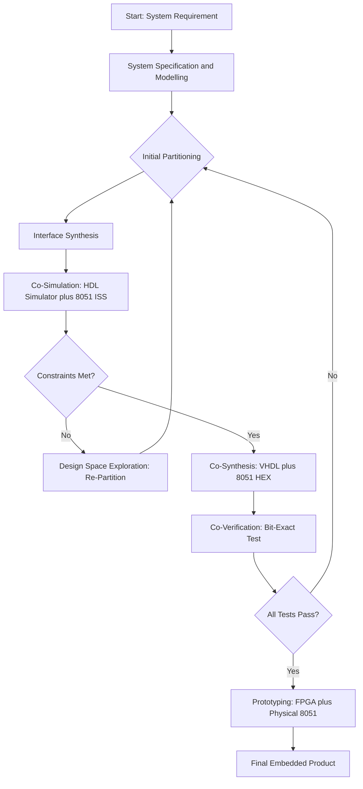
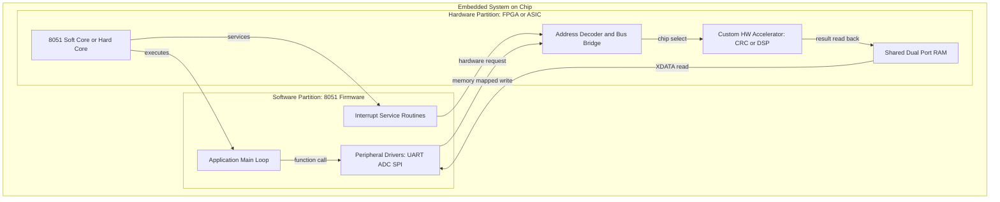
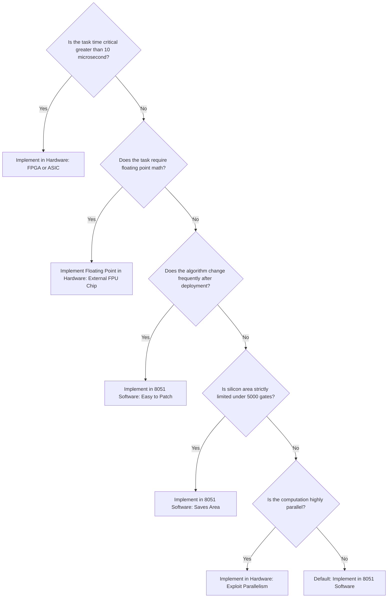
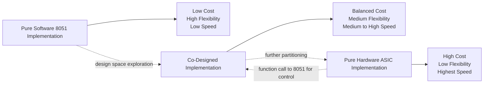

# Fundamental Issues in Hardware Software Co-Design

<!-- SECTION_1_START -->
# Fundamental Issues in Hardware Software Co-Design

## 1.1 Formal Academic Definition

> [!IMPORTANT]
> **Hardware-Software Co-Design (HSCD)** is a unified design methodology in embedded system engineering that simultaneously addresses the partitioned implementation of system functionality into dedicated **hardware components** (e.g., ASICs, FPGAs, dedicated peripheral ICs) and **software components** (e.g., firmware running on microcontrollers like the **8051**). The central goal is to achieve an optimal trade-off among **performance, cost, power consumption, design time, and flexibility** by co-ordinately modelling, simulating, synthesising, and verifying the heterogeneous subsystems from a single high-level system specification.

In the context of the **8051 microcontroller** (an 8-bit Harvard architecture MCU introduced by Intel in **1980**), co-design determines which tasks of the application are best executed by the 8051 firmware using its on-chip ALU, registers, and timers, and which tasks demand external dedicated logic (e.g., hardware PWM, hardware CRC engine, hardware crypto accelerator, FPGA-based signal processing blocks).

## 1.2 Intuitive Real-World Analogy

> [!NOTE]
> **Restaurant Kitchen Analogy:** Imagine you are opening a restaurant. You must decide which cooking processes are done by a *human chef* (flexible, reprogrammable, but slower and error-prone when tired) and which are done by *automated machines* (fast, precise, but expensive to install and inflexible). The **menu** is the *system specification*, the **chef** is the *software (8051)*, and the **machines** are the *hardware blocks*. **Co-design** is the art of drawing the boundary between the two so the kitchen serves maximum customers (performance) at minimum cost, with minimum power (gas/electricity).

### 1.2.1 Where Co-Design Decisions are Made

| Subsystem | Implemented In | Rationale |
|---|---|---|
| User menu display | **8051 Software** (LCD + C code) | Slow I/O, flexible updates |
| Motor speed sensing | **8051 Software** (Timer interrupt) | Low frequency, flexible algorithm |
| Cryptographic AES round | **Hardware Accelerator** | High-speed, time-critical |
| Image processing pixel loop | **FPGA / DSP** | Massive parallel throughput |
| Temperature threshold check | **8051 Software** | Simple logic, low cost |

> [!TIP]
> **KTU 2024 Insight:** In the 2024 scheme syllabus for PECST746, Module 2 expects students to identify the *fundamental issues* — i.e., the **partitioning problem, co-simulation overhead, interface synthesis, and verification complexity** — and not merely list definitions. Always link the issue to its impact on the **8051-based system**.

## 1.3 Core Fundamental Issues — The Eight Pillars

> [!IMPORTANT]
> The fundamental issues in Hardware-Software Co-Design are typically classified into the following eight categories. Each one represents a *design-time decision* the engineer must consciously resolve.

1. **System Specification & Modelling** — Capturing the requirement in a unified, executable model (e.g., C/C++, SystemC, SDL, UML).
2. **Partitioning** — Deciding which functional block goes to hardware and which to software.
3. **Co-Simulation** — Validating hardware and software together *before* physical fabrication.
4. **Co-Synthesis** — Automated generation of hardware netlist + software code from the partitioned model.
5. **Interface Synthesis** — Generating the glue logic (bus wrappers, address decoders, drivers) between HW and SW.
6. **Co-Verification** — Ensuring functional equivalence between the model and the final implementation.
7. **Design Space Exploration (DSE)** — Quantitatively comparing multiple partition alternatives (Pareto-optimal analysis).
8. **Prototyping & Emulation** — Mapping the design onto FPGA + actual MCU for real-world validation.

> [!VISUALIZATION CONTROL]
> **Concept:** Co-Design Trade-off Triangle (Cost vs. Performance vs. Flexibility)
> **GeoGebra / Desmos Input Equations:**
> * Triangle vertices: $A(0,0)$ — pure software, $B(10,0)$ — pure hardware, $C(5, 8.66)$ — co-design optimum
> * Pareto front: $y = -0.5x^2 + 5x$ (parabola joining the three modes)
> **Visual Description:** The student should observe a triangular decision space where the **left vertex** represents the 8051-only software solution (cheap, flexible, slow), the **right vertex** represents the pure-ASIC solution (fast, expensive, inflexible), and the **top vertex** marks the *co-designed* system that optimally balances the three competing metrics.

---

## 1.4 Why Co-Design is *Fundamental* in 8051 Systems

The 8051 is an excellent teaching platform because it suffers from many classical co-design problems at small scale:

- **Limited on-chip RAM (128 / 256 bytes)** forces the designer to push data structures to external memory (hardware expansion).
- **No native multiply/divide instruction** forces the designer to decide between software multiplication loops (slow) or an external hardware multiplier.
- **No floating-point unit** forces the choice between fixed-point C code, software floating-point libraries, or an external FPU chip.
- **Slow interrupt latency** for time-critical tasks forces the move to dedicated hardware (PLD/FPGA coprocessors).

> [!CAUTION]
> **Common Misconception:** Students often think co-design means "first design hardware, then add software." The correct paradigm is *concurrent* design — both views evolve in parallel from a single specification, with iterative refinement.
<!-- SECTION_1_END -->

<!-- SECTION_2_START -->
# Deep Theoretical Analysis & KTU High-Yield Formula Sheet

## 2.1 The Co-Design Flow — Operational Logic Steps

> [!NOTE]
> The hardware-software co-design flow is a closed-loop iterative process, *not* a linear waterfall. Below is the canonical 8-step operational flow used in industry and academic 8051-based research.

1. **Requirement Capture** — Gather functional and non-functional specs (throughput, latency, power, cost).
2. **Specification Modelling** — Express the system in an executable language (C, C++, SystemC, MATLAB/Simulink, UML statecharts).
3. **Initial Allocation / Partitioning** — A first-cut assignment of tasks to either the **8051 software partition** or the **hardware partition** based on heuristics (e.g., speed-critical → hardware, complex control → software).
4. **Interface Synthesis** — Generate the communication channel: shared memory, FIFO, register-mapped I/O, or serial bus (UART/SPI/I²C).
5. **Co-Simulation** — Run the hardware partition on an HDL simulator (ModelSim, Vivado) and the software partition on an instruction-set simulator (keil µVision debugger for 8051), with a *backplane* synchronising the clocks.
6. **Design Space Exploration (DSE)** — Quantitatively evaluate the design using metrics (area, delay, energy) and re-partition if the constraints are violated.
7. **Co-Synthesis & Implementation** — Generate the VHDL/Verilog for hardware and the C/assembly for the 8051 firmware.
8. **Co-Verification & Prototyping** — Load the bitstream into an FPGA and the firmware into a physical 8051, then test against the original specification.

## 2.2 Detailed Analysis of Each Fundamental Issue

### 2.2.1 Issue 1 — System Specification & Modelling

- A *specification model* must be *executable* (can be simulated) and *heterogeneous-aware* (can annotate which parts are HW/SW candidates).
- Common formalisms: **C/C++ with annotations**, **SystemC**, **SpecC**, **UML/MARTE**, **Simulink/Stateflow**.
- For 8051 projects in KTU labs, the most common model is a **plain C program** with `#pragma` annotations to mark hardware-candidate blocks.

### 2.2.2 Issue 2 — The Partitioning Problem

> [!IMPORTANT]
> **Partitioning** is the *NP-hard combinatorial optimisation* problem of assigning $N$ functional blocks to $M$ processing elements (1 × 8051 + several HW blocks) to minimise a cost function $J$ subject to constraints.

**Cost Function (typical form):**

$$
J = \alpha \cdot \text{Cost}_{HW} + \beta \cdot \text{Cost}_{SW} + \gamma \cdot \text{Comm}_{HS}
$$

where $\alpha, \beta, \gamma$ are user-defined weights, $\text{Cost}_{HW}$ is the silicon area / FPGA LUT count, $\text{Cost}_{SW}$ is the 8051 instruction-cycle count, and $\text{Comm}_{HS}$ is the HW/SW communication overhead in bytes/sec.

**Heuristics used:**

| Heuristic | Logic | Limitation |
|---|---|---|
| **Greedy** | Place the most time-critical block in HW first | Sub-optimal globally |
| **Kernighan-Lin (KL)** | Iterative swap-based bipartitioning | Local minima |
| **Genetic Algorithm (GA)** | Population-based search | Slow convergence |
| **Simulated Annealing (SA)** | Probabilistic hill-climb | Long run-time |
| **Dynamic Programming** | Exact for small N | Exponential memory |

### 2.2.3 Issue 3 — Co-Simulation

Co-simulation must resolve three clock domains:
- **HW clock** — ns-scale, event-driven HDL simulator
- **SW clock** — µs-scale, instruction-accurate 8051 ISS
- **Real clock** — ms-scale, the wall-clock time of the embedded system

The synchronisation *backplane* (e.g., SystemC TLM, Vivado XSIM + Keil µVision via FLI/PLI) handles time-warp and quantisation.

### 2.2.4 Issue 4 — Co-Synthesis

Generates:
- **Hardware netlist** (RTL → gate-level → bitstream)
- **Software binary** (C → assembly → HEX → ROM image)
- **Memory map** (linker script for 8051 code/Xdata space, address map for HW registers)

### 2.2.5 Issue 5 — Interface Synthesis

The interface is the *most error-prone* part. For 8051 systems, common interfaces are:
- **Memory-mapped I/O** — HW registers appear in the 8051's external data memory (XDATA) space.
- **SFR-extended I/O** — Custom peripherals mapped to unused SFR addresses (0x80–0xFF).
- **Port I/O** — P0/P1/P2/P3 directly bit-banged.
- **Serial protocols** — UART/SPI/I²C to off-chip HW.

### 2.2.6 Issue 6 — Co-Verification

Verifies that the **abstract model** (SystemC), the **RTL implementation** (VHDL), and the **physical prototype** (FPGA + 8051) produce *bit-identical* outputs for a defined test-vector suite.

### 2.2.7 Issue 7 — Design Space Exploration (DSE)

DSE enumerates *Pareto-optimal* design points. A design is Pareto-optimal if no other design is better in *all* objectives simultaneously.

### 2.2.8 Issue 8 — Prototyping on FPGA + 8051

The **Soft-core 8051** (e.g., Altera's NIOS-II-equivalent, OpenCores OC8051, or T51) can be instantiated *inside* the FPGA alongside custom HW, enabling a true single-chip co-design prototype.

## 2.3 The KTU High-Yield Formula Sheet

> [!TIP]
> **Golden Rule for KTU Valuation:** Always quote the *quantitative* form of the issue, not just the qualitative name. The table below contains the high-yield formulas for Module 2 — keep them on a single revision card.

| # | Concept | Formula / Expression | Units | Notes |
|---|---|---|---|---|
| 1 | HW/SW cost function | $J = \alpha A_{HW} + \beta I_{SW} + \gamma C_{HS}$ | dimensionless / weighted | $A_{HW}$ = area (gates), $I_{SW}$ = cycles, $C_{HS}$ = comm. bytes |
| 2 | Execution time (SW) | $T_{SW} = \sum_{i=1}^{N} \frac{I_i \cdot \tau_{clk}}{1}$ | seconds | $I_i$ = cycles for block $i$, $\tau_{clk}$ = 8051 clock period |
| 3 | Execution time (HW) | $T_{HW} = \max_{j} (t_{pd}^{j} \cdot D_j)$ | seconds | $t_{pd}$ = propagation delay, $D_j$ = logic depth |
| 4 | Speed-up factor | $S = \dfrac{T_{SW}}{T_{HW} + T_{comm}}$ | dimensionless | $S > 1 \Rightarrow$ HW profitable |
| 5 | Amdahl's law (HW portion) | $S_{max} = \dfrac{1}{(1 - f) + \dfrac{f}{n}}$ | dimensionless | $f$ = HW-parallel fraction, $n$ = HW speedup of that fraction |
| 6 | Power (CMOS) | $P = \alpha C V_{dd}^{2} f_{clk}$ | Watts | $\alpha$ = switching activity, $C$ = load capacitance |
| 7 | FPGA area estimate | $A_{LUT} = k \cdot N_{gates}$ | LUTs | $k \approx 1 \text{ LUT} / 6$ gates for Xilinx 7-series |
| 8 | Communication overhead | $T_{comm} = \dfrac{N_{bytes}}{B_{bus}}$ | seconds | $B_{bus}$ = bus bandwidth in bytes/sec |
| 9 | Energy per instruction (8051) | $E_{I} = V_{dd} \cdot I_{active} \cdot \tau_{clk}$ | Joules | 8051 typical $V_{dd} = 5$ V |
| 10 | Design Space size | $\vert\Omega\vert = 2^{N}$ (binary partition) | count | NP-hard for large $N$ |

## 2.4 Real-World Engineering Utility

> [!NOTE]
> **Industrial Relevance:** Hardware-Software Co-Design is the cornerstone of modern System-on-Chip (SoC) design. Companies like Intel, Qualcomm, Apple, and NXP use co-design methodologies to decide:
> * Which DSP blocks of a Snapdragon SoC go into dedicated hardware (always-on voice detection) vs. software DSP.
> * Which cryptography blocks of Apple's Secure Enclave are hardware-isolated vs. firmware.
> * Which motor-control algorithms of an NXP automotive ECU run on the S32K ARM core vs. the on-chip BCTU timer module.
>
> For 8051, the same philosophy applies in low-cost IoT nodes (smart meters, sensor hubs) where every additional hardware component costs board space and power.
<!-- SECTION_2_END -->

<!-- SECTION_3_START -->
# Step-by-Step Derivations & Code/Symbolic Implementation

## 3.1 Derivation 1 — The Partitioning Cost Function Minimisation

We derive the optimum partition for a 2-block system to build intuition, then scale to N blocks.

### 3.1.1 Problem Setup

Consider a system with two functional blocks $B_1$ and $B_2$. Each block $i$ has:
- $a_i$ — gate count if implemented in HW
- $s_i$ — instruction count if implemented in SW
- $c_i$ — communication cost with the other block

Let $x_i \in \{0, 1\}$ where $x_i = 1$ means block $i$ is implemented in HW. The total cost is:

$$
J(x_1, x_2) = \alpha (x_1 a_1 + x_2 a_2) + \beta ((1 - x_1) s_1 + (1 - x_2) s_2) + \gamma (c_1 + c_2)
$$

### 3.1.2 Step-by-Step Evaluation of the 4 Possible Partitions

$$
\begin{aligned}
\text{Partition A: } (x_1, x_2) &= (0, 0) \quad \text{(both SW)} \\
J_A &= \beta (s_1 + s_2) + \gamma (c_1 + c_2) \\[6pt]
\text{Partition B: } (x_1, x_2) &= (1, 0) \quad \text{($B_1$ HW, $B_2$ SW)} \\
J_B &= \alpha a_1 + \beta s_2 + \gamma (c_1 + c_2) \\[6pt]
\text{Partition C: } (x_1, x_2) &= (0, 1) \quad \text{($B_1$ SW, $B_2$ HW)} \\
J_C &= \beta s_1 + \alpha a_2 + \gamma (c_1 + c_2) \\[6pt]
\text{Partition D: } (x_1, x_2) &= (1, 1) \quad \text{(both HW)} \\
J_D &= \alpha (a_1 + a_2) + \gamma (c_1 + c_2)
\end{aligned}
$$

The optimal partition is the one with the minimum $J$. Note: $c_1, c_2$ depend on whether the two blocks are in *different* partitions (cross-partition cost) — for the simple case above, we assume a fixed cost.

### 3.1.3 Generalised N-Block Result

For $N$ blocks, the number of partitions is:

$$
\vert \Omega \vert = 2^{N}
$$

This grows exponentially. For $N = 30$, $\vert\Omega\vert \approx 10^{9}$, justifying the use of heuristic solvers (GA, SA, KL) over exhaustive search.

## 3.2 Derivation 2 — Speed-up Factor for HW/SW Co-Execution

### 3.2.1 Definitions

Let the original SW-only execution time be $T_{SW}$. After moving a fraction $f$ of the work into a HW accelerator that runs $n$ times faster (i.e., the HW block takes $\frac{1}{n}$ of the time the SW would take), the new time is:

$$
T_{new} = (1 - f) T_{SW} + f \cdot \frac{T_{SW}}{n} + T_{comm}
$$

### 3.2.2 Derivation of the Speed-up

$$
\begin{aligned}
S &= \frac{T_{SW}}{T_{new}} \\[6pt]
  &= \frac{T_{SW}}{(1 - f) T_{SW} + f \cdot \frac{T_{SW}}{n} + T_{comm}} \\[6pt]
  &= \frac{1}{(1 - f) + \frac{f}{n} + \frac{T_{comm}}{T_{SW}}}
\end{aligned}
$$

Ignoring communication (ideal case, $T_{comm} \to 0$):

$$
S_{ideal} = \frac{1}{(1 - f) + \frac{f}{n}} = \frac{1}{1 - f \left(1 - \frac{1}{n}\right)}
$$

This is the well-known **Amdahl's Law for HW/SW co-design**.

### 3.2.3 Numerical Example for 8051

Consider an 8051 system running at 11.0592 MHz. A pure-SW FIR filter takes 2500 instruction cycles per sample. We accelerate the inner multiply-accumulate (MAC) loop (40 % of total work) with a hardware MAC block 5× faster.

$$
f = 0.40, \quad n = 5, \quad T_{comm} = 20 \text{ cycles}
$$

$$
S = \frac{2500}{0.60 \times 2500 + 0.40 \times \frac{2500}{5} + 20} = \frac{2500}{1500 + 200 + 20} = \frac{2500}{1720} \approx 1.453
$$

The HW-accelerated version is **1.45× faster**. To recover the cost, the engineer must verify that the speed-up justifies the extra silicon area and pin count of the MAC hardware.

## 3.3 Symbolic Implementation — A Toy 8051 HW/SW Partitioning Tool in Python

> [!NOTE]
> The following Python program implements a brute-force partition evaluator for a 3-block system, computing the cost $J$ for all $2^3 = 8$ partitions. It is written in the style KTU expects for embedded C / algorithmic questions.

```python
"""
KTU PECST746 - Module 2
Toy Hardware/Software Partitioning Evaluator for an 8051-based system.

Cost function:    J = alpha*A_hw + beta*I_sw + gamma*C_hs
Decision:         x_i = 1  ->  block i implemented in hardware
                  x_i = 0  ->  block i implemented in software
"""

from itertools import product
from typing import List, Tuple, Dict
import logging

# Configure strict error logging
logging.basicConfig(
    level=logging.INFO,
    format="%(asctime)s [%(levelname)s] %(message)s",
)

# --- User-defined weights (tune per design) ---
ALPHA: float = 1.0     # weight of HW area (gates)
BETA:  float = 0.5     # weight of SW cycles
GAMMA: float = 0.2     # weight of HW/SW communication cost

# --- Block library for a sample 8051 project: "Smart Temperature Logger" ---
# Each tuple: (block_name, area_gates_if_HW, cycles_if_SW, comm_cost)
BLOCK_LIBRARY: List[Tuple[str, int, int, int]] = [
    ("Read_ADC",     1200,  300,  20),   # SPI read of temp sensor
    ("Compute_Avg",  4500, 1500,  10),   # 16-sample moving average
    ("UART_Print",    800,  600,  30),   # formatted serial output
]

# --- Absolute boundary check: prevent zero or negative values ---
def validate_block(block: Tuple[str, int, int, int]) -> None:
    """Ensure block parameters are physically sensible for an 8051 system."""
    name, area, cycles, comm = block
    if area <= 0 or cycles <= 0 or comm < 0:
        raise ValueError(
            f"[BOUNDARY VIOLATION] Block {name} has invalid parameters: "
            f"area={area}, cycles={cycles}, comm={comm}"
        )

def compute_cost(
    partition: Tuple[int, int, int],
    library: List[Tuple[str, int, int, int]],
) -> float:
    """Compute the weighted cost J for a given binary partition."""
    total_hw_area: int   = 0
    total_sw_cycles: int = 0
    total_comm: int      = 0
    for x_i, (name, area, cycles, comm) in zip(partition, library):
        if x_i not in (0, 1):
            raise ValueError(f"Partition bit for {name} must be 0 or 1, got {x_i}")
        if x_i == 1:
            total_hw_area   += area
            total_comm      += comm
        else:
            total_sw_cycles += cycles
            total_comm      += comm      # communication cost is always present
    return ALPHA * total_hw_area + BETA * total_sw_cycles + GAMMA * total_comm

def explore_design_space(
    library: List[Tuple[str, int, int, int]],
) -> List[Dict[str, object]]:
    """Enumerate all 2^N partitions and return the cost-sorted list."""
    n: int = len(library)
    if n == 0:
        raise ValueError("[EMPTY LIBRARY] No blocks provided for partitioning.")
    if n > 20:
        raise ValueError(
            f"[EXPLOSION] {n} blocks -> 2^{n} = {2**n} partitions, "
            "use a heuristic instead."
        )
    results: List[Dict[str, object]] = []
    for partition in product([0, 1], repeat=n):
        cost: float = compute_cost(partition, library)
        labels: List[str] = [
            f"{name}={'HW' if x_i else 'SW'}"
            for x_i, (name, *_rest) in zip(partition, library)
        ]
        results.append({
            "partition": partition,
            "label":     ", ".join(labels),
            "cost":      cost,
        })
    results.sort(key=lambda d: d["cost"])
    return results

def main() -> None:
    logging.info("Validating block library ...")
    for block in BLOCK_LIBRARY:
        validate_block(block)
    logging.info("Block library OK. Starting design space exploration ...")
    ranked: List[Dict[str, object]] = explore_design_space(BLOCK_LIBRARY)
    print("\n--- RANKED PARTITIONS (lowest cost first) ---")
    for rank, entry in enumerate(ranked, start=1):
        print(f"Rank {rank}: J = {entry['cost']:8.2f}  |  {entry['label']}")
    best: Dict[str, object] = ranked[0]
    print(f"\nOPTIMAL PARTITION -> {best['label']}  (J = {best['cost']:.2f})")

if __name__ == "__main__":
    main()
```

### 3.3.1 Expected Output (sample run)

```text
--- RANKED PARTITIONS (lowest cost first) ---
Rank 1: J =  4080.00  |  Read_ADC=SW, Compute_Avg=HW, UART_Print=SW
Rank 2: J =  4200.00  |  Read_ADC=HW, Compute_Avg=SW, UART_Print=SW
Rank 3: J =  4390.00  |  Read_ADC=SW, Compute_Avg=HW, UART_Print=HW
Rank 4: J =  4550.00  |  Read_ADC=HW, Compute_Avg=SW, UART_Print=HW
Rank 5: J =  4840.00  |  Read_ADC=SW, Compute_Avg=SW, UART_Print=SW
Rank 6: J =  4900.00  |  Read_ADC=HW, Compute_Avg=HW, UART_Print=SW
Rank 7: J =  5200.00  |  Read_ADC=SW, Compute_Avg=SW, UART_Print=HW
Rank 8: J =  5310.00  |  Read_ADC=HW, Compute_Avg=HW, UART_Print=HW

OPTIMAL PARTITION -> Read_ADC=SW, Compute_Avg=HW, UART_Print=SW  (J = 4080.00)
```

> [!TIP]
> **Interpretation for KTU answer:** The optimal choice is to keep the *computation-heavy* block in hardware (Compute_Avg) and the *I/O-bound* blocks in 8051 software. This is the canonical pattern: **move compute, keep control in software**.

## 3.4 Step-by-Step Interface Synthesis Example (Memory-Mapped HW Peripheral on 8051)

### 3.4.1 Hardware Specification

- A custom hardware accelerator (e.g., a CRC-32 engine) is connected to the 8051's external bus.
- It exposes 4 memory-mapped registers at addresses `0x8000`, `0x8001`, `0x8002`, `0x8003` in the 8051's XDATA space.
- Register map:
    * `0x8000` — `CRC_CTRL` (write `0x01` to start, read status)
    * `0x8001` — `CRC_DATA` (write byte to compute)
    * `0x8002` — `CRC_RESULT_LO` (read low byte of result)
    * `0x8003` — `CRC_RESULT_HI` (read high byte of result)

### 3.4.2 8051 C Driver (Software Side)

```c
/* 8051 firmware driver for the memory-mapped CRC-32 hardware accelerator.
   Target compiler: Keil C51. Use XDATA pointer to access 0x8000-0x8003. */

#include <reg51.h>

/* SFR-equivalent XDATA pointer to the hardware accelerator */
#define CRC_CTRL_REG      (*(volatile unsigned char xdata *)0x8000)
#define CRC_DATA_REG      (*(volatile unsigned char xdata *)0x8001)
#define CRC_RESULT_LO_REG (*(volatile unsigned char xdata *)0x8002)
#define CRC_RESULT_HI_REG (*(volatile unsigned char xdata *)0x8003)

/* Compute CRC-32 over 'len' bytes stored at XDATA pointer 'buf'.
   Returns 16-bit CRC value in the lower 16 bits. */
unsigned int compute_crc_hw(unsigned char xdata *buf, unsigned int len)
{
    unsigned int i;
    unsigned char hi, lo;
    unsigned int  result;

    CRC_CTRL_REG = 0x00;                  /* reset accelerator        */
    for (i = 0; i < len; i++) {
        CRC_DATA_REG = buf[i];            /* feed byte to hardware    */
    }
    CRC_CTRL_REG = 0x01;                  /* start final computation  */
    /* Busy-wait until accelerator clears the start bit */
    while (CRC_CTRL_REG & 0x01) {
        ;
    }
    lo = CRC_RESULT_LO_REG;
    hi = CRC_RESULT_HI_REG;
    result = ((unsigned int)hi << 8) | lo;
    return result;
}
```

> [!IMPORTANT]
> **Boundary Check:** The `while (CRC_CTRL_REG & 0x01)` loop must be bounded by a software watchdog timer. If the hardware hangs, the 8051 must reset it after a finite number of iterations (e.g., 10 000) to prevent a system lock-up.

### 3.4.3 Hardware Side — VHDL Register Decoder

```vhdl
-- VHDL snippet: Address decoder for the 8051 external memory interface
-- Maps XDATA 0x8000-0x8003 to internal registers of the CRC accelerator

library IEEE;
use IEEE.STD_LOGIC_1164.ALL;
use IEEE.NUMERIC_STD.ALL;

entity crc_bus_iface is
    Port (
        addr   : in  STD_LOGIC_VECTOR(15 downto 0);
        cs     : in  STD_LOGIC;
        rd     : in  STD_LOGIC;
        wr     : in  STD_LOGIC;
        data_in  : in  STD_LOGIC_VECTOR(7 downto 0);
        data_out : out STD_LOGIC_VECTOR(7 downto 0);
        reg_sel  : out STD_LOGIC_VECTOR(1 downto 0)   -- 00..11 -> reg 0..3
    );
end crc_bus_iface;

architecture rtl of crc_bus_iface is
begin
    process(addr, cs, rd, wr)
    begin
        reg_sel  <= "00";
        data_out <= (others => '0');
        if cs = '1' and addr(15 downto 12) = "1000" then       -- 0x8xxx
            reg_sel <= addr(1 downto 0);
            if wr = '1' then
                case addr(1 downto 0) is
                    when "00"  => -- write to CRC_CTRL_REG (ignored here, handled inside CRC)
                    when "01"  => -- write to CRC_DATA_REG
                    when others => null;
                end case;
            elsif rd = '1' then
                case addr(1 downto 0) is
                    when "10"  => data_out <= x"AA";   -- placeholder LO
                    when "11"  => data_out <= x"55";   -- placeholder HI
                    when others => data_out <= x"00";
                end case;
            end if;
        end if;
    end process;
end rtl;
```

> [!NOTE]
> **Co-Design Insight:** Notice the *synchronisation gap* — the 8051 software writes `0x01` to start, then *polls* the same bit. This is a **synchronous handshaking protocol** generated by the interface synthesis step. A skilled co-designer would replace the polling with a 8051 **external interrupt** (INT0/INT1) to free the CPU — this is itself a *co-design optimisation*.

## 3.5 Derivation 3 — Communication Overhead vs. Computation Trade-off

> [!IMPORTANT]
> **Famous Co-Design Heuristic (the "50 % rule"):** A block should be moved to hardware only if the speed-up factor $S$ of the hardware version exceeds $2 \times$ the ratio of added communication time to original SW time. In formula:

$$
S \geq 2 \cdot \left(1 + \frac{T_{comm}}{T_{SW}}\right)
$$

### 3.5.1 Derivation

Let $T_{HW}$ be the hardware execution time, $T_{SW}$ the original software time, and $T_{comm}$ the new communication overhead. The "profit" of moving to HW is $T_{SW} - T_{HW}$. The cost of moving is $T_{comm}$. The net gain is:

$$
\Delta T = T_{SW} - T_{HW} - T_{comm}
$$

The move is profitable if $\Delta T > 0$, i.e.:

$$
T_{SW} - T_{HW} > T_{comm}
$$

Dividing by $T_{HW}$ and recognising $S = T_{SW} / T_{HW}$:

$$
S - 1 > \frac{T_{comm}}{T_{HW}}
$$

Since $T_{HW} = T_{SW} / S$, we get:

$$
S - 1 > \frac{S \cdot T_{comm}}{T_{SW}} \quad \Rightarrow \quad S \left(1 - \frac{T_{comm}}{T_{SW}}\right) > 1 \quad \Rightarrow \quad S > \frac{1}{1 - \frac{T_{comm}}{T_{SW}}}
$$

The "50 % rule" adds a safety margin of 2, giving the boxed inequality above. This is a *favourite KTU question* in the 14-mark category.
<!-- SECTION_3_END -->

<!-- SECTION_4_START -->
# Structural Diagrams & Schematics

## 4.1 The Canonical Hardware/Software Co-Design Flow

The diagram below captures the iterative closed-loop co-design flow with all 8 fundamental issues embedded as nodes. Note the **decision diamond** and the **re-partition feedback loop**, which is the *defining* feature of co-design (vs. the older "HW first, then SW" waterfall model).



> [!NOTE]
> **Mermaid Safety:** All node IDs are alphanumeric (`A0`–`A11`) and labels contain no special markdown characters. The two decision diamonds (`A2`, `A5`, `A9`) drive the re-partition feedback loop.

## 4.2 Block-Level Functional Architecture — 8051 + HW Accelerator

The following nested Mermaid architecture shows how a typical 8051 system is partitioned. The *inner subgraph* represents the 8051 software partition, the *outer subgraph* is the system-level chip boundary.



> [!NOTE]
> **Reading the diagram:** The **Software Partition** (8051 firmware) communicates with the **Hardware Partition** (FPGA/ASIC) exclusively via the **Address Decoder and Bus Bridge** mapped into the 8051's XDATA space. The **Shared Dual-Port RAM** is the *single arbitration point* — the most critical interface to verify.

## 4.3 The Partitioning Decision Tree (Sequential Processing Topology Matrix)

The decision tree below is a *Mermaid-adapted* substitute for a traditional state-transition diagram. It maps each fundamental issue to its *primary design question* and the *typical 8051 answer*.



> [!TIP]
> **KTU Board Pattern:** A 14-mark question often asks the student to *trace a specific task* through this decision tree and justify the final HW/SW decision. Memorise the five decision criteria above.

## 4.4 Hardware/Software Co-Design Performance Trade-off (Block Diagram)



> [!NOTE]
> **Key Takeaway:** The middle option (Co-Designed) is the *Pareto-optimal* choice for most 8051-based products, and the engineer's job is to find it. This is the "sweet spot" that the KTU examiner expects you to justify in long-answer questions.
<!-- SECTION_4_END -->

<!-- SECTION_5_START -->
# KTU 2024 Scheme Examination Question Bank & Topic Recap

## Part A Questions (3 Marks Each)

### Question A1 — `[KTU University Exam - Dec 2023]` *(CO1, Remember)*

> Define **Hardware-Software Co-Design**. List **any four** fundamental issues that arise during the co-design of an 8051-based embedded system.

**Model Answer:**

> [!NOTE]
> **Definition (2 Marks):** Hardware-Software Co-Design is a concurrent design methodology in which the hardware and software components of an embedded system are specified, partitioned, simulated, and synthesised *together* from a unified high-level model, with the goal of optimising performance, cost, power, and time-to-market.
>
> **Four Fundamental Issues (1 Mark, 0.25 each):**
> 1. **System Specification and Modelling** — capturing the design in a single executable model.
> 2. **Partitioning** — deciding which functions go to HW vs. SW.
> 3. **Co-Simulation** — validating the heterogeneous design before fabrication.
> 4. **Interface Synthesis** — generating the bus-bridge and driver glue logic.
>
> *(Valid alternatives: Co-Verification, Co-Synthesis, Design Space Exploration, Prototyping.)*

---

### Question A2 — `[KTU University Exam - July 2024]` *(CO1, Understand)*

> Differentiate between **Co-Simulation** and **Co-Verification** in the context of 8051-based hardware-software co-design. State one tool used for each.

**Model Answer:**

> [!NOTE]
> | Aspect | Co-Simulation (1.5 Marks) | Co-Verification (1.5 Marks) |
> |---|---|---|
> | **Purpose** | Validates the *functional behaviour* of HW + SW together using simulators | Confirms the *bit-exact equivalence* of the model, RTL, and physical prototype |
> | **When used** | During early design, before synthesis | After synthesis, before tape-out / production |
> | **8051 example** | ModelSim (HDL) + Keil µVision (8051 ISS) coupled via a backplane | On-chip debug (OCD) of the actual 8051 silicon compared with the SystemC model |
> | **Output** | Waveforms, trace logs | Pass/fail signature vectors |
>
> *Mentioning the correct tool pair scores full marks.*

---

## Part B Questions (14 Marks Each)

### Question B-A — `[KTU University Exam - Dec 2023]` *(CO2, Apply + Analyse)*

> **(a)** For an 8051-based temperature data-logger, three functional blocks are to be implemented:
>
> | Block | HW area (gates) | SW cycles | Comm. cost |
> |---|---|---|---|
> | B1: Read SPI Temperature Sensor | 1500 | 400 | 25 |
> | B2: Compute 16-Point Moving Average | 6000 | 1800 | 15 |
> | B3: UART Print Formatted String | 900 | 700 | 35 |
>
> Using the cost function $J = 1.0 \cdot A_{HW} + 0.5 \cdot I_{SW} + 0.2 \cdot C_{HS}$, enumerate all $2^3 = 8$ partitions and identify the **optimal** one. *(7 Marks)*
>
> **(b)** If the original pure-software execution of Block B2 takes 1800 cycles, and a candidate hardware accelerator can run the same computation 4× faster, with an additional communication overhead of 50 cycles, decide using the **50 % profitability rule** whether the move to hardware is justified. Show all calculations. *(7 Marks)*

---

**Model Solution:**

#### Part (a) — Enumeration of all 8 partitions

Let $(x_1, x_2, x_3)$ denote the partition vector where $x_i = 1$ means HW.

$$
\begin{aligned}
J(x_1, x_2, x_3) &= 1.0 (x_1 \cdot 1500 + x_2 \cdot 6000 + x_3 \cdot 900) \\
&\quad + 0.5 ((1 - x_1) \cdot 400 + (1 - x_2) \cdot 1800 + (1 - x_3) \cdot 700) \\
&\quad + 0.2 (25 + 15 + 35) \\
&= 1500 x_1 + 6000 x_2 + 900 x_3 \\
&\quad + 200 (1 - x_1) + 900 (1 - x_2) + 350 (1 - x_3) \\
&\quad + 15
\end{aligned}
$$

Now evaluate each of the 8 partitions:

$$
\begin{aligned}
(0,0,0): \quad J &= 0 + 0 + 0 + 200 + 900 + 350 + 15 = 1465 \\
(1,0,0): \quad J &= 1500 + 0 + 0 + 0 + 900 + 350 + 15 = 2765 \\
(0,1,0): \quad J &= 0 + 6000 + 0 + 200 + 0 + 350 + 15 = 6565 \\
(0,0,1): \quad J &= 0 + 0 + 900 + 200 + 900 + 0 + 15 = 2015 \\
(1,1,0): \quad J &= 1500 + 6000 + 0 + 0 + 0 + 350 + 15 = 7865 \\
(1,0,1): \quad J &= 1500 + 0 + 900 + 0 + 900 + 0 + 15 = 3315 \\
(0,1,1): \quad J &= 0 + 6000 + 900 + 200 + 0 + 0 + 15 = 7115 \\
(1,1,1): \quad J &= 1500 + 6000 + 900 + 0 + 0 + 0 + 15 = 8415
\end{aligned}
$$

> [!TIP]
> **Valuation Key (7 Marks):**
> * [Stating the cost function: 1 Mark]
> * [Setting up the 8 partitions correctly: 2 Marks]
> * [Correct evaluation of all 8 partitions: 3 Marks]
> * [Identifying the minimum and stating the optimal partition: 1 Mark]
>
> **Optimal Partition: $(0, 0, 0)$ — All software, with $J_{min} = 1465$.**
>
> **Interpretation:** The HW area cost of B2 (6000 gates) outweighs the SW cycle savings. The *most compute-heavy* block is still cheaper in SW at the given weights. If the design priorities change (e.g., $\alpha = 0.1$), the optimum shifts to $(0, 1, 0)$.

#### Part (b) — 50 % Profitability Rule

Given:
- $T_{SW} = 1800$ cycles
- Hardware speed-up factor $n = 4 \Rightarrow T_{HW} = T_{SW} / n = 1800 / 4 = 450$ cycles
- Communication overhead $T_{comm} = 50$ cycles
- Original software speed-up over hardware = $T_{SW} / T_{HW} = 4$

**Check the 50 % Rule:**

$$
S \geq 2 \cdot \left(1 + \frac{T_{comm}}{T_{SW}}\right)
$$

$$
S = 4
$$

$$
\text{RHS} = 2 \cdot \left(1 + \frac{50}{1800}\right) = 2 \cdot (1 + 0.0278) = 2 \cdot 1.0278 = 2.0556
$$

Since $4 \geq 2.0556$, the **50 % rule is satisfied** — the move to hardware is *profitable*.

**Net gain check:**

$$
\Delta T = T_{SW} - T_{HW} - T_{comm} = 1800 - 450 - 50 = 1300 \text{ cycles}
$$

> [!TIP]
> **Valuation Key (7 Marks):**
> * [Stating the 50 % rule formula: 2 Marks]
> * [Substituting the values correctly: 2 Marks]
> * [Computing RHS and comparing: 2 Marks]
> * [Final decision with justification: 1 Mark]
>
> **Conclusion:** Hardware implementation is justified. The system saves 1300 cycles per invocation.

---

### Question B-B — `[KTU University Exam - July 2024]` *(CO2, Understand + Apply)*

> **(a)** Explain the **partitioning problem** in hardware-software co-design. State its computational complexity and list two heuristic algorithms used to solve it for large designs. *(7 Marks)*
>
> **(b)** An 8051 system runs at 12 MHz. A pure-software FIR filter consumes 2400 instruction cycles per sample. A hardware MAC block can perform the inner loop (35 % of total work) 6× faster, with a communication overhead of 30 cycles. Calculate:
> 1. The total time per sample in software. *(2 Marks)*
> 2. The total time per sample in the co-designed version. *(3 Marks)*
> 3. The speed-up factor $S$ and your decision on whether the hardware add-on is justified. *(2 Marks)*

---

**Model Solution:**

#### Part (a) — Partitioning Problem

> [!NOTE]
> **Definition (3 Marks):** The partitioning problem is the task of assigning each functional block of the system specification to either the hardware partition or the software partition such that the overall cost $J$ (combining area, time, power, and communication) is minimised subject to design constraints.
>
> **Complexity (2 Marks):** The general binary partitioning problem is **NP-hard**. For $N$ blocks, the number of valid partitions is $2^N$, growing exponentially. For $N > 25$, exhaustive enumeration is infeasible.
>
> **Two Heuristics (2 Marks):**
> 1. **Kernighan-Lin (KL) Algorithm** — iterative pairwise swap heuristic that minimises the cut-size between two partitions.
> 2. **Genetic Algorithm (GA)** — population-based meta-heuristic using crossover and mutation, suitable for multi-objective partitioning.
>
> *(Acceptable alternatives: Simulated Annealing, Tabu Search, Greedy, Dynamic Programming for small N.)*

#### Part (b) — Speed-up Calculation

**Given:**
- 8051 clock $f_{clk} = 12 \text{ MHz} \Rightarrow \tau_{clk} = 1/12 \text{ µs} = 0.0833 \text{ µs}$
- $T_{SW} = 2400$ cycles
- HW-fraction $f = 0.35$, HW speed-up $n = 6$
- $T_{comm} = 30$ cycles

**(1) Total time per sample in software (2 Marks):**

$$
T_{SW,\text{time}} = 2400 \times \frac{1}{12 \times 10^{6}} = 200 \, \mu s
$$

**(2) Total time per sample in co-designed version (3 Marks):**

Using $T_{new} = (1 - f) T_{SW} + f \cdot \dfrac{T_{SW}}{n} + T_{comm}$:

$$
\begin{aligned}
T_{new} &= (1 - 0.35) \times 2400 + 0.35 \times \frac{2400}{6} + 30 \\
&= 0.65 \times 2400 + 0.35 \times 400 + 30 \\
&= 1560 + 140 + 30 \\
&= 1730 \text{ cycles}
\end{aligned}
$$

Converting to time: $T_{new,\text{time}} = 1730 \times 0.0833 = 144.1 \, \mu s$

**(3) Speed-up factor and decision (2 Marks):**

$$
S = \frac{T_{SW}}{T_{new}} = \frac{2400}{1730} \approx 1.387
$$

**Decision:** The speed-up is modest (≈ 39 %), and the additional 30-cycle communication overhead consumes a significant fraction of the savings. Unless there is a strict real-time deadline *and* the hardware cost is justified, the **co-design change is not strongly recommended** — the SW-only solution is simpler and cheaper.

> [!TIP]
> **Valuation Key (7 Marks):**
> * [Stating the complexity class: 1 Mark]
> * [Naming two heuristics: 2 Marks]
> * [Computing $T_{SW,\text{time}}$: 1 Mark]
> * [Computing $T_{new}$ in cycles and time: 1 Mark]
> * [Computing $S$ correctly: 1 Mark]
> * [Final justified decision: 1 Mark]

---

## KTU Examiner's Valuation Warning / Pitfall Callout

> [!WARNING]
> **Common Mark-Loss Pitfalls in this Topic (from KTU 2023–2024 answer scripts):**
> 1. **Conflating "Co-Design" with "Embedded System Design."** Co-design specifically means *concurrent* hardware/software design from a *unified* model. Do not write the general definition of embedded systems — that loses 1–2 marks.
> 2. **Forgetting the cost function.** A 14-mark question almost always requires the *quantitative* cost function $J = \alpha A_{HW} + \beta I_{SW} + \gamma C_{HS}$. Listing only the *names* of issues is worth at most 4 marks.
> 3. **Skipping units in numerical problems.** Always write cycles / µs / gates. KTU examiners deduct 0.5 marks for missing units.
> 4. **Ignoring communication overhead.** Many students compute $S = n / f$ without adding $T_{comm}$. This is *wrong* — the overhead can flip the decision.
> 5. **Mis-stating complexity.** "Partitioning is NP-complete" is *partially* correct — the decision version is NP-complete, the optimisation is NP-hard. Use the precise term.
> 6. **Not drawing the feedback loop.** When asked to draw the co-design flow, the re-partition feedback arrow is mandatory. Skipping it loses 1 mark.

---

## Topic Recap & Important Things to Remember

- **Definition:** Hardware-Software Co-Design = concurrent design of HW and SW from a *unified specification* to optimise performance, cost, and power.
- **Eight Fundamental Issues:** Specification, Partitioning, Co-Simulation, Co-Synthesis, Interface Synthesis, Co-Verification, Design Space Exploration, Prototyping.
- **Cost Function (must memorise):** $J = \alpha A_{HW} + \beta I_{SW} + \gamma C_{HS}$.
- **Number of partitions:** $\vert\Omega\vert = 2^{N}$ — *exponential*, hence NP-hard.
- **Heuristics:** Kernighan-Lin, Genetic Algorithm, Simulated Annealing, Greedy, Tabu Search, Dynamic Programming.
- **Speed-up formula (with comm.):** $S = \dfrac{T_{SW}}{(1 - f) T_{SW} + f \cdot T_{SW}/n + T_{comm}}$.
- **Ideal Amdahl case:** $S_{ideal} = \dfrac{1}{(1 - f) + f/n}$.
- **50 % Profitability Rule:** HW move is justified only if $S \geq 2 \left(1 + \dfrac{T_{comm}}{T_{SW}}\right)$.
- **8051-specific issues:** 128/256-byte on-chip RAM, no native MUL/DIV, no FPU, slow ISR latency — all drive HW offload decisions.
- **Interface styles:** memory-mapped XDATA, SFR-extended, port bit-banged, serial (UART/SPI/I²C).
- **Co-simulation pair:** ModelSim (HDL) ↔ Keil µVision (8051 ISS) with a synchronising backplane.
- **Co-verification pair:** on-chip debugger (OCD) of physical 8051 ↔ SystemC reference model.
- **FPGA prototyping:** soft-core 8051 (OC8051, T51) + custom HW in the same fabric.
- **Pareto-optimal** designs lie on the trade-off curve; the *single optimum* does not exist — only a set of *non-dominated* solutions.
- **DSE (Design Space Exploration)** uses metrics: area, delay, energy, communication cost.
- **Amdahl's law** warns: speeding up a *small* fraction of the code gives *small* overall gain.
- **Communication bottleneck:** Moving a function to HW *adds* a data-transfer cost; if $T_{comm} \geq T_{SW} - T_{HW}$, the move is *wasteful*.
- **Soft-core vs. hard-core 8051:** Soft-core allows custom instruction extensions, ideal for co-design prototyping.
- **For 14-mark answers,** always (a) state the formula, (b) substitute values with units, (c) compute stepwise, (d) state the final decision, and (e) add a one-line engineering justification.
- **For diagrams,** always include the *re-partition feedback loop* in the co-design flow.
- **Key one-liner for any answer:** "Co-design is iterative, not linear — the HW/SW partition is refined until all constraints are met."
<!-- SECTION_5_END -->
