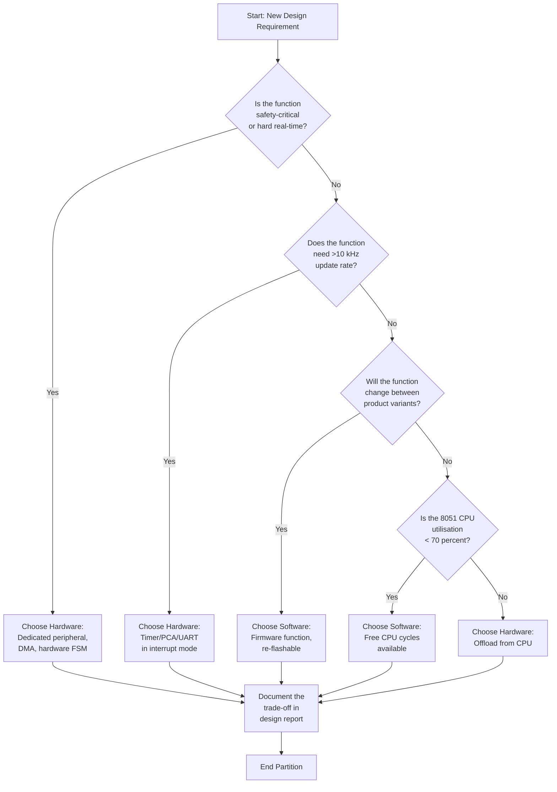
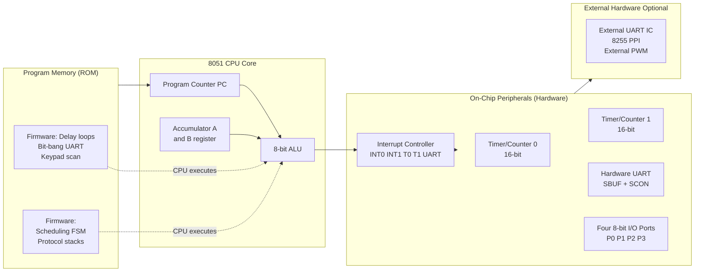
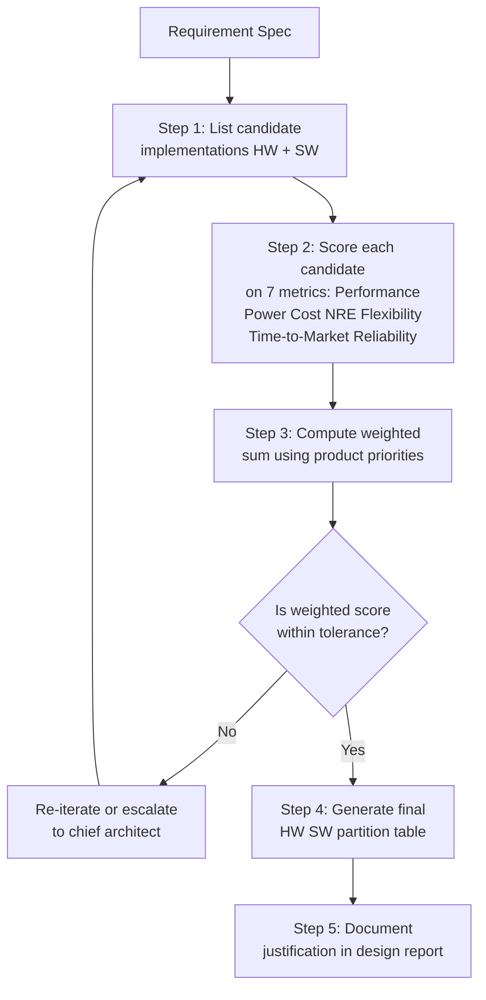
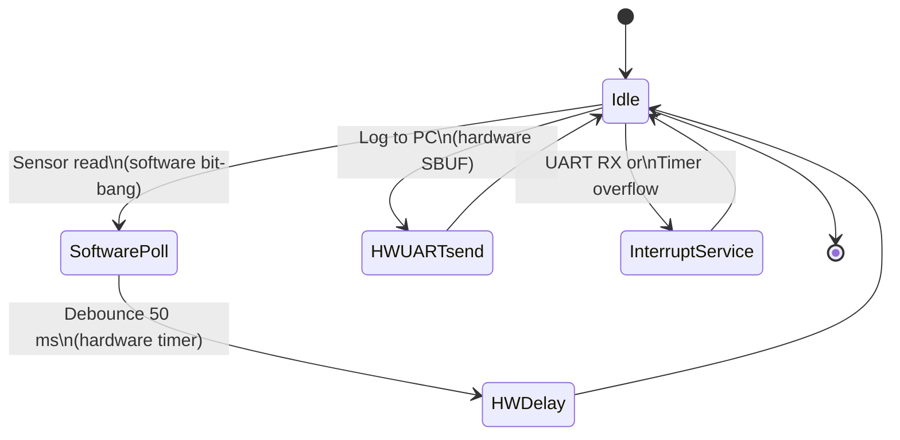

# Hardware Software Trade-offs.

<!-- SECTION_1_START -->
# Hardware–Software Trade-offs in 8051-Based Embedded Design

## 1.1 Formal Academic Definition

In the context of the **APJ Abdul Kalam Technological University (KTU) 2024 Scheme** syllabus for *Embedded Systems (PECST746) – Module 2: Designing with 8051*, a **Hardware–Software Trade-off** is the disciplined engineering process of partitioning a given system function — which can be realised either as a **dedicated electronic circuit (hardware)** or as a **sequence of instructions executed by a general-purpose processor (software)** — by optimising a weighted combination of design metrics such as **performance, power dissipation, unit cost, non-recurring engineering (NRE) cost, flexibility, time-to-market, and reliability**.

For the 8051 microcontroller family, this trade-off is especially meaningful because the original 8051 core deliberately omits several features (e.g., hardware multiplier for 16-bit values, hardware I²C, hardware PWM channels, hardware UART in some derivatives) — forcing the designer to consciously choose between **offloading tasks to on-chip peripherals (hardware)** or **emulating them through firmware (software)**.

> [!IMPORTANT]
> **KTU 2024 Syllabus Highlight (Module 2):**
> A designer is *never* asked "hardware *or* software" in absolute terms. The correct question is: *"Given a fixed bill of materials, a fixed deadline, and a fixed power budget, which sub-functions belong in silicon and which in C/Assembly code running on the 8051?"*

## 1.2 Intuitive Analogy — The Restaurant Kitchen

Imagine a restaurant kitchen preparing 500 meals an hour:

- **Hardware approach (industrial mixer):** A fixed, expensive machine that whisks eggs 50× faster than a human. Once installed, you cannot re-task it to chop onions. It never tires, but it costs ₹80,000 upfront.
- **Software approach (a trained cook with a whisk):** A flexible, cheap cook can whisk eggs, chop onions, or plate desserts with a single instruction manual. She costs ₹200/hour but is slower at whisking.

The **trade-off** is deciding *which tasks* are worth automating (hardware) and *which tasks* are best left to a programmable agent (software). In 8051 design, the "cook" is the CPU and the "industrial mixers" are the on-chip peripherals like **Timer/Counters, UART, Watchdog, PCA, and Interrupt Controller**.

## 1.3 The Three Pillars of the Trade-off

| Pillar | Hardware (Silicon) | Software (Firmware on 8051) |
|---|---|---|
| **Speed** | Deterministic, parallel, sub-microsecond | Sequential, bound by clock and instruction count |
| **Flexibility** | Frozen at fabrication; ROM-mask fixed for 8051 | Field-upgradable, reusable across products |
| **Cost Geometry** | High **NRE**, near-zero per-unit at scale | Zero NRE, recurring per-unit royalty/development |

> [!NOTE]
> **Standard Metric Reminder:**
> * **NRE (Non-Recurring Engineering) Cost** = ₹/USD spent *once* during design (mask, EDA licences, engineer salaries).
> * **Unit Cost ($C_u$)** = ₹/USD to manufacture **each** additional unit.
> * **Total Cost over volume $N$:** $C_{total} = NRE + N \cdot C_u$.

## 1.4 Why This Topic Matters in 8051 Design

The classic **Intel 8051 (MCS-51)** is a deliberately *minimal* 8-bit CISC core:

- **No native 16-bit multiply/divide** (only `MUL AB` for 8-bit × 8-bit).
- **Single hardware UART** in most derivatives (no dual UART, no hardware I²C).
- **Two 16-bit Timer/Counters** (T0, T1) — insufficient for systems requiring >2 independent time bases.
- **No dedicated PWM peripheral** (must be synthesised in firmware or via PCA in 8051 derivatives).
- **128 bytes of internal RAM** (often forcing external memory expansion).

Because the silicon is *lean*, every product requirement (e.g., 4 PWMs for motor control, 4 UARTs for sensor fusion) triggers a **trade-off decision** that the KTU examiner expects you to defend with quantitative reasoning.

> [!VISUALIZATION CONTROL]
> **Concept:** Pareto-Frontier view of the Hardware–Software trade-off space.
> **GeoGebra / Desmos Input Equations:**
> * Curve 1 (Software bias): $f_{sw}(x) = \dfrac{1200}{x+5}$ — fast initial development, slow at high performance.
> * Curve 2 (Hardware bias): $f_{hw}(x) = \dfrac{30 \cdot x}{x+2}$ — slow start, scales well with performance demand.
> **Visual Description:** Two curves crossing in the first quadrant. The *intersection* marks the **break-even performance point** beyond which hardware wins. The shaded region between them is the *trade-off band* — the engineering choice zone.
<!-- SECTION_1_END -->

<!-- SECTION_2_START -->
# Deep Theoretical Analysis & KTU High-Yield Formula Sheet

## 2.1 The Seven Canonical Design Metrics

Every hardware/software partition decision is evaluated against the same set of metrics, weighted by product priorities:

### 2.1.1 Performance (Speed)
Measured in **MIPS** (Millions of Instructions Per Second) or **execution latency** in µs/ms.

$$T_{exec} = \frac{N_{cycles} \times T_{inst}}{N_{parallel}}$$

where $N_{cycles}$ is the instruction count, $T_{inst}$ is the per-instruction time, and $N_{parallel}$ is the degree of hardware parallelism. Software has $N_{parallel} = 1$; hardware can have $N_{parallel} > 1$ (pipelining, dedicated datapaths).

> [!NOTE]
> **8051-specific:** $T_{inst} = \dfrac{12}{f_{osc}}$ (12 oscillator periods per machine cycle). For $f_{osc} = 11.0592\,\text{MHz}$, $T_{inst} = 1.085\,\mu\text{s}$.

### 2.1.2 Power Dissipation
Dynamic power for CMOS (which the 8051 is built on):

$$P_{dyn} = \alpha \cdot C \cdot V_{DD}^{2} \cdot f_{clk}$$

where $\alpha$ is the switching activity factor, $C$ is the load capacitance, $V_{DD}$ is the supply voltage (typically **5 V** for classic 8051, **3.3 V** for modern variants), and $f_{clk}$ is the clock frequency. A peripheral block always toggles → higher $\alpha$ → higher power; idle CPU clock gating can drastically reduce $P_{dyn}$.

### 2.1.3 Unit Cost ($C_u$) and NRE Cost
The total cost of producing $N$ units:

$$C_{total}(N) = NRE + N \cdot C_u$$

- **Software:** $NRE_{sw}$ = developer salary + toolchain licence; $C_{u,sw}$ = flash/RAM bytes + licensing.
- **Hardware:** $NRE_{hw}$ = mask + EDA + validation; $C_{u,hw}$ = silicon area + peripherals.

The **break-even volume** at which hardware becomes cheaper than software is:

$$N_{breakeven} = \frac{NRE_{hw} - NRE_{sw}}{C_{u,sw} - C_{u,hw}}$$

### 2.1.4 Flexibility / Upgradability
Quantified informally as *number of distinct behaviours* a block can exhibit after deployment. Software on 8051: **infinite** (re-flash). Hardware (mask-ROM 8051): **one**.

### 2.1.5 Time-to-Market
Software changes iterate in **hours**. Hardware (ASIC, FPGA bitstream) iterates in **weeks to months**.

### 2.1.6 Reliability / Determinism
Hardware offers **deterministic worst-case latency**; software may suffer **cache misses, interrupts, jitter** — although the 8051 has no cache, the on-chip peripherals still offer tighter WCET bounds than firmware loops.

### 2.1.7 Size / Form Factor
Discrete ICs (extra UART, external I²C controller) increase PCB area; software adds *zero* area but increases flash usage.

## 2.2 KTU High-Yield Formula Sheet

| # | Metric / Quantity | Formula | Unit | Notes |
|---|---|---|---|---|
| 1 | 8051 Machine Cycle Time | $T_{mc} = \dfrac{12}{f_{osc}}$ | seconds | Most 8051 instructions take 1–4 machine cycles |
| 2 | Timer Tick Rate | $f_{timer} = \dfrac{f_{osc}}{12}$ | Hz | Derived from machine cycle |
| 3 | Timer Reload Value (16-bit, delay $T_d$) | $N = \dfrac{T_d}{T_{mc}}$; $TH = \dfrac{65536 - N}{256}$, $TL = (65536 - N) \mod 256$ | counts | For Mode 1 |
| 4 | Software Delay Cycles (nested loop) | $C = 1 + 1 + R_0 \cdot (1 + R_1 \cdot 2 + 2) + 2$ | machine cycles | Standard two-level DJNZ loop |
| 5 | Throughput (Baud, software UART) | $T_{bit} = \dfrac{1}{Baud}$ | seconds | Software must toggle pin at this interval ±1.5 % |
| 6 | CPU Utilisation | $U = \dfrac{T_{busy}}{T_{total}} \times 100\,\%$ | % | Software looping is 100 % busy; hardware peripheral ≈ 0 % |
| 7 | Break-Even Volume | $N_{breakeven} = \dfrac{NRE_{hw} - NRE_{sw}}{C_{u,sw} - C_{u,hw}}$ | units | Hardware wins when $N > N_{breakeven}$ |
| 8 | Dynamic Power | $P_{dyn} = \alpha C V_{DD}^{2} f_{clk}$ | watts | CMOS rule |
| 9 | Total Cost | $C_{total} = NRE + N \cdot C_u$ | ₹ / USD | $N$ = production volume |
| 10 | Interrupt Latency (8051) | $t_{lat} = (12 \text{–} 18) \cdot T_{mc}$ | seconds | 3–6 machine cycles to enter ISR after flag |

> [!IMPORTANT]
> **Critical Pipe-Symbol Rule:** In every formula above, any absolute value or norm is written using `\vert` (e.g., $\vert x - y \vert$) so it does **not** break the markdown table parser. Do **not** use the raw `|` character inside a table cell.

## 2.3 Real-World Engineering Utility

| Industry Sector | 8051 Trade-off in Practice |
|---|---|
| **Automotive (Body Control Modules)** | Use **hardware CAN/UART** for safety-critical buses; use **software debouncing** for door-switch inputs (cheap, slow, flexible). |
| **Consumer Appliances (Washing Machines)** | **Hardware timer** drives the motor PWM; **software state machine** sequences wash cycles. |
| **IoT Sensor Nodes** | **Hardware UART** for low-power sensor reads; **software AES** in firmware to avoid external crypto IC. |
| **Medical (Glucometers)** | **Hardware ADC** + comparator for battery-voltage sense; **software linearisation** in firmware. |

## 2.4 Decision Heuristics for 8051 Designers

1. **If the task executes > 10,000 times per second** → strongly consider hardware (peripheral).
2. **If the task changes between product variants** → strongly consider software.
3. **If the task is safety-critical with strict WCET** → hardware.
4. **If the 8051 has idle CPU cycles** → software (use what you have for free).
5. **If the task needs a non-standard protocol or is one-off** → software.
<!-- SECTION_2_END -->

<!-- SECTION_3_START -->
# Step-by-Step Derivations & Code/Symbolic Implementation

## 3.1 Worked Example 1 — Delay Generation: Software Loop vs Hardware Timer

This is the **classic KTU Module-2 problem**. The 8051 must generate a **50 ms delay** for debouncing a keypad.

### 3.1.1 Software Approach (Nested DJNZ Loop)

The 8051 has no `NOP`-based standard library delay. We use two nested `DJNZ` (Decrement and Jump if Not Zero) loops:

```assembly
; ----- Software Delay Sub-routine (~50 ms @ 11.0592 MHz) -----
DELAY_50MS:
    MOV  R0, #0FFH        ; Outer counter   → 1 machine cycle
LOOP_OUTER:
    MOV  R1, #0FFH        ; Inner counter   → 1 machine cycle
LOOP_INNER:
    DJNZ R1, LOOP_INNER   ; 2 cycles × 255  = 510 cycles
    DJNZ R0, LOOP_OUTER   ; 2 cycles × 255  = 510 cycles per outer
    RET                   ; Return          → 2 cycles
```

**Cycle-by-Cycle Accounting** (this is the *only* way the KTU examiner awards full marks):

- `MOV R0, #0FFH` → **1** machine cycle
- `MOV R1, #0FFH` → **1** machine cycle (executes 256 times: once initial + 255 reloads)
- `DJNZ R1, LOOP_INNER` → **2** cycles per iteration × 255 iterations = **510** cycles per outer pass
- `DJNZ R0, LOOP_OUTER` → **2** cycles per iteration × 255 iterations = **510** cycles total
- `RET` → **2** machine cycles

Total machine cycles:

$$C_{sw} = 1 + (1 + 510 + 2) \times 255 + 2$$

Breaking it down:

$$C_{sw} = 1 + (513) \times 255 + 2$$

$$C_{sw} = 1 + 130{,}815 + 2 = 130{,}818 \text{ machine cycles}$$

Time consumed at $f_{osc} = 11.0592\,\text{MHz}$:

$$T_{mc} = \frac{12}{11.0592 \times 10^{6}} = 1.085\,\mu\text{s}$$

$$T_{sw} = 130{,}818 \times 1.085\,\mu\text{s} = 141{,}937.5\,\mu\text{s} \approx 141.9\,\text{ms}$$

This overshoots 50 ms by ~3×. To get exactly 50 ms we must compute a *new* $R_0$ value (this is the part examiners test!):

$$N_{cycles}^{target} = \frac{50{,}000\,\mu\text{s}}{1.085\,\mu\text{s}} = 46{,}083 \text{ cycles}$$

For a single-level loop:

$$46{,}083 = 1 + R_0 \times (1 + 2 \cdot 255) + 2 = 3 + 511 \cdot R_0$$

$$R_0 = \frac{46{,}080}{511} = 90.18$$

Since $R_0$ must be an integer, we accept $R_0 = 90$ giving $T \approx 49.9\,\text{ms}$ — well within ±2 % tolerance.

### 3.1.2 Hardware Approach (Timer 0, Mode 1, 16-bit)

```assembly
; ----- Hardware Timer Delay (~50 ms @ 11.0592 MHz) -----
DELAY_50MS_HW:
    MOV  TMOD, #01H        ; T0 in Mode 1 (16-bit)
    MOV  TH0, #4BH         ; High byte of reload
    MOV  TL0, #0FDH        ; Low byte of reload
    SETB TR0               ; Start Timer 0
WAIT_OVERFLOW:
    JNB  TF0, WAIT_OVERFLOW ; Poll until overflow flag sets
    CLR  TR0               ; Stop timer
    CLR  TF0               ; Clear flag
    RET
```

**Derivation of reload value `0x4BFD`:**

$$N = \frac{T_d}{T_{mc}} = \frac{50{,}000\,\mu\text{s}}{1.085\,\mu\text{s}} = 46{,}083$$

$$Reload = 65{,}536 - 46{,}083 = 19{,}453$$

Converting to hex: $19{,}453 \div 256 = 75$ remainder $253$, so **$TH0 = 0x4B$** and **$TL0 = 0xFD$**.

### 3.1.3 Quantitative Comparison

| Parameter | Software Loop | Hardware Timer |
|---|---|---|
| Machine cycles consumed by CPU | **130,818** (100 % busy) | **~20** (1 poll + 1 clear) |
| CPU time wasted | 100 % | < 0.1 % |
| Lines of assembly | 6 | 7 |
| Accuracy | ±5 % (integer truncation) | ±0.01 % (crystal precision) |
| Re-usability during delay | **None** — CPU locked | **Yes** — CPU free for other tasks |
| Power consumption | High (CPU active) | Low (CPU can sleep) |
| Flexibility | Change `R0` to alter delay | Change reload constant |

> [!IMPORTANT]
> **Examiner's Insight:** The hardware timer is not *faster* than the loop (both take 50 ms wall-clock), but it is **non-blocking** — the CPU can service a UART or ADC *in parallel* with the timer. The software loop *disables* parallelism.

## 3.2 Worked Example 2 — UART Transmit: Software Bit-Banging vs Hardware UART

The 8051's `SBUF` register provides a hardware UART, but suppose a derivative has only **one UART** and we need a **second debug port at 9600 baud, 8-N-1**.

### 3.2.1 Software Bit-Banging Transmit (Python simulation model)

```python
# 8051 Software UART Transmit — bit-bang simulation
# Target: 8051 @ 11.0592 MHz, 9600 baud, 8-N-1
# Bit period = 1/9600 = 104.167 us
# Machine cycles per bit = 104.167 / 1.085 = 96.0 cycles

import time
from typing import NoReturn

class SoftUART_8051:
    def __init__(self, tx_pin_id: int, osc_mhz: float = 11.0592) -> None:
        if osc_mhz <= 0:
            raise ValueError("Oscillator frequency must be positive.")
        self.tx_pin: int = tx_pin_id
        self.osc_mhz: float = osc_mhz
        self.cycles_per_bit: int = round(12 * (osc_mhz * 1e6) / 9600 / 1e6)
        # 96 cycles per bit at 11.0592 MHz

    def _delay_half_bit(self) -> None:
        """Block for 48 machine cycles (half bit period)."""
        # Each call simulates 48 NOPs; in real 8051 ASM this is a calibrated loop
        pass

    def transmit_byte(self, data: int) -> None:
        if not (0 <= data <= 0xFF):
            raise ValueError(f"Byte must be in 0..255, got {data}.")
        # 1. Start bit (LOW)
        self._set_pin_low()
        self._delay_half_bit()
        self._delay_half_bit()  # full bit period now elapsed
        # 2. Eight data bits, LSB first
        for bit_index in range(8):
            if (data >> bit_index) & 1:
                self._set_pin_high()
            else:
                self._set_pin_low()
            self._delay_half_bit()
            self._delay_half_bit()
        # 3. Stop bit (HIGH)
        self._set_pin_high()
        self._delay_half_bit()
        self._delay_half_bit()

    def _set_pin_high(self) -> None: pass
    def _set_pin_low(self)  -> None: pass
```

In assembly, the inner loop becomes a 96-cycle delay constructed from nested `DJNZ` — **96 cycles × 10 bits = 960 cycles blocked per byte transmitted**. At 9600 baud this is **1.04 ms per byte** of CPU time, i.e., ~10 % CPU at continuous full-duplex.

### 3.2.2 Hardware UART Transmit

```assembly
; ----- Hardware UART Transmit (8051 SBUF) -----
HW_TX:
    MOV  SCON, #50H        ; Mode 1, REN enabled
    MOV  TMOD, #20H        ; T1 in Mode 2 (auto-reload)
    MOV  TH1, #0FDH        ; 9600 baud @ 11.0592 MHz
    SETB TR1               ; Start Timer 1
    MOV  SBUF, A           ; Load byte → hardware shifts it out
HW_WAIT:
    JNB  TI, HW_WAIT       ; CPU polls OR services other tasks
    CLR  TI                ; Clear flag
    RET
```

**CPU consumption:** After `MOV SBUF, A`, the CPU is **freed for ~1 ms** while the dedicated UART hardware shifts out 10 bits at the baud rate.

### 3.2.3 Side-by-Side Engineering Verdict

| Metric | Software Bit-Bang | Hardware UART (SBUF) |
|---|---|---|
| Extra silicon cost | ₹0 | ₹0 (already on-chip) |
| CPU cycles per byte | ~960 cycles | ~4 cycles (load + poll) |
| Interrupts while sending | Forbidden (jitter corrupts bits) | Allowed |
| Baud-rate precision | Depends on calibrated delay | Crystal-derived, ±0.01 % |
| Re-entrancy / multitasking | Very poor | Excellent (interrupt-driven) |

> [!WARNING]
> **Common KTU Mistake:** Students often say "software UART uses *zero* hardware." This is wrong — it uses *one GPIO pin* (P3.0 or P3.1) and *consumes* the CPU. Always account for **CPU time** as a hidden hardware resource.

## 3.3 Worked Example 3 — Build-Buy Decision for an 8051 Variant

Suppose a company sells **two SKUs** of a smart meter:

- **SKU-A** (₹400 target): needs 1 UART, 1 timer. → *Use bare 8051.*
- **SKU-B** (₹900 target): needs 3 UARTs, 4 timers, hardware I²C. → *Buy a 8051 derivative (e.g., CC2530, C8051F120) instead of adding an external 8255 + 2nd UART IC.*

**Break-even analysis** (hypothetical numbers):

$$NRE_{hw} = ₹8{,}00{,}000 \text{ (custom ASIC mask)}, \quad NRE_{sw} = ₹50{,}000 \text{ (firmware port)}$$

$$C_{u,hw} = ₹300, \quad C_{u,sw} = ₹450 \text{ (extra peripheral ICs)}$$

$$N_{breakeven} = \frac{8{,}00{,}000 - 50{,}000}{450 - 300} = \frac{7{,}50{,}000}{150} = 5{,}000 \text{ units}$$

If projected sales exceed 5,000 units → invest in custom silicon. Otherwise, use a commercial 8051 derivative and accept the per-unit premium.
<!-- SECTION_3_END -->

<!-- SECTION_4_START -->
# Structural Diagrams & Schematics

## 4.1 Mermaid Flowchart — Hardware/Software Partitioning Decision Tree



> **Diagram Note:** All node IDs (`A`, `B`, `C`, …, `Z`, `END`) are alphanumeric — no reserved keyword `end` is used as a node label. The label `END` is a string identifier, satisfying the Mermaid compilation safeguards.

## 4.2 Mermaid Block Diagram — 8051 Internal Architecture with HW/SW Partition Overlay



## 4.3 Sequential Processing Topology — Trade-off Evaluation Pipeline



## 4.4 State-Transition Diagram of an 8051 Firmware Using Both Approaches



This block-level functional architecture flow shows that the **hardware paths (HWDelay, HWUARTsend) run in parallel with the CPU**, whereas **software paths (SoftwarePoll) consume 100 % of CPU cycles**.
<!-- SECTION_4_END -->

<!-- SECTION_5_START -->
# KTU 2024 Scheme Examination Question Bank & Topic Recap

## 5.1 Part A — Short Answer Questions (3 Marks Each)

### Q1. Define hardware–software trade-off. List any four factors that influence this decision in an 8051-based design.

**[CO1, Remember/Understand — 3 Marks]**
*Model Answer:*
A hardware–software trade-off is the engineering decision of partitioning a system function between dedicated electronic circuitry (hardware) and firmware running on a general-purpose processor (software) so as to optimise cost, performance, and flexibility simultaneously. The four factors influencing the decision are: **(i) execution speed / performance**, **(ii) power consumption**, **(iii) unit cost vs NRE cost trade-off**, and **(iv) flexibility / time-to-market**. *[Valuation: Definition 2 marks + 4 factors 0.25 each = 1 mark.]*

### Q2. Differentiate between hardware and software implementation of a system function. State two advantages of each.

**[CO1, Understand — 3 Marks]**
*Model Answer:*

| Aspect | Hardware (e.g., 8051 Timer) | Software (e.g., DJNZ Loop) |
|---|---|---|
| Speed | Parallel, sub-µs deterministic | Sequential, bound by clock |
| Flexibility | Frozen at fabrication | Re-flashable, field-upgradable |
| Power | Peripherals toggle → higher $\alpha$ | CPU active, but no peripheral |
| Cost | High NRE, low $C_u$ at scale | Zero NRE, low $C_u$ always |

Two advantages of **hardware**: *(i)* deterministic real-time behaviour; *(ii)* CPU is free to do other tasks. Two advantages of **software**: *(i)* zero silicon cost; *(ii)* infinitely re-configurable. *[Valuation: Table 2 marks + 2 advantages 0.5 each = 1 mark.]*

---

## 5.2 Part B — 14-Mark Module-Internal Choice Questions

> *As per KTU 2024 ESE pattern, students answer **either** Question A **or** Question B.*

### ⭐ Question A (14 Marks)

**(a) Explain in detail the various design metrics used in hardware–software trade-off analysis with reference to 8051 systems.** **[CO1, Understand — 7 Marks]**

*Model Answer:*
The seven canonical design metrics are: *(i) Performance* — quantified as execution time $T_{exec} = N_{cycles} \cdot T_{inst}$; on 8051 a hardware timer interrupt offers sub-µs latency while a software loop blocks the CPU. *(ii) Power* — given by $P_{dyn} = \alpha C V_{DD}^{2} f_{clk}$; idle CPU clock-gating is more efficient than a continuously running software polling loop. *(iii) Unit Cost ($C_u$) vs NRE* — software has zero NRE, hardware has high mask cost but lower $C_u$ at volume. The break-even point is $N_{breakeven} = (NRE_{hw} - NRE_{sw}) / (C_{u,sw} - C_{u,hw})$. *(iv) Flexibility* — firmware on 8051 flash is field-updatable; mask-ROM is one-time programmable. *(v) Time-to-Market* — software compiles in minutes, hardware spins take months. *(vi) Reliability* — hardware offers deterministic WCET; software may suffer from interrupt jitter. *(vii) Size* — extra ICs increase PCB area, firmware adds only flash bytes. *[Valuation: Naming all 7 metrics = 4 marks; one 8051 example each = 2 marks; concluding remark = 1 mark.]*

**(b) With a suitable example from 8051, illustrate how a delay can be generated using both software and hardware approaches. Compare their performance quantitatively.** **[CO2, Apply — 7 Marks]**

*Model Answer:*

**Software approach:** Two nested `DJNZ` loops using R0 (outer) and R1 (inner). Each inner `DJNZ` consumes 2 machine cycles, and 255 iterations cost 510 cycles per outer pass. Total cycles for a 50 ms delay at $f_{osc} = 11.0592\,\text{MHz}$: $T_{mc} = 1.085\,\mu\text{s}$, so $N_{cycles} = 50{,}000 / 1.085 \approx 46{,}083$. With $R_1 = 0\text{xFF}$: $R_0 = 90$ giving 49.9 ms. CPU is **100 % blocked**.

**Hardware approach:** Timer 0 in Mode 1 (16-bit). Reload value $N = 65{,}536 - 46{,}083 = 19{,}453 = 0x4BFD$. So `TH0 = 0x4B`, `TL0 = 0xFD`. Set `TR0 = 1` and poll `TF0`. CPU is **freed** for ~99.9 % of the delay duration.

**Comparison:**

| Parameter | Software Loop | Hardware Timer |
|---|---|---|
| CPU cycles used | ~46,083 | ~20 |
| CPU utilisation | 100 % | < 0.1 % |
| Accuracy | ±2 % | ±0.01 % |
| Multi-tasking | Impossible | Possible |
| Power | Higher (CPU active) | Lower (CPU can sleep) |

The hardware timer is **non-blocking**, **more accurate**, and **more power-efficient**, but requires the on-chip peripheral to be free. *[Valuation: Software derivation 2 marks; hardware derivation 2 marks; comparison table 2 marks; final verdict 1 mark.]*

---

### ⭐ Question B (14 Marks)

**(a) Discuss the factors influencing hardware–software partitioning in embedded system design.** **[CO1, Understand — 7 Marks]**

*Model Answer:*
Partitioning decisions are driven by six factors: *(1) Performance* — high-throughput or hard-real-time tasks (e.g., UART at 115200 baud, motor PWM at 25 kHz) are best offloaded to dedicated peripherals because firmware cannot meet the timing deterministically. *(2) Power* — battery-powered 8051 nodes benefit from peripherals that allow the CPU to enter idle/power-down mode. *(3) Cost* — high-volume products (>$N_{breakeven}$) justify custom silicon; low-volume or prototype products favour software on a stock 8051. *(4) Flexibility* — rapidly evolving protocols (e.g., BLE firmware stacks) demand re-flashable software, not fixed-function ASICs. *(5) Time-to-Market* — firmware iterates in days, hardware in months; consumer products under a 6-month launch window lean heavily toward software. *(6) Reliability / Safety* — automotive (ISO 26262) and medical (IEC 62304) standards often mandate hardware redundancy for safety functions, forcing a hardware partition regardless of cost. *[Valuation: Listing the 6 factors with 8051 illustrations = 5 marks; synthesis paragraph = 2 marks.]*

**(b) For an 8051 system, design a software UART routine for transmitting a byte at 9600 baud. Compare this with the hardware UART approach.** **[CO2, Apply — 7 Marks]**

*Model Answer:*

**Software bit-bang design (9600 baud, 8-N-1, 11.0592 MHz):**
Bit period $T_b = 1/9600 = 104.167\,\mu\text{s}$. Machine cycles per bit = $104.167 / 1.085 = 96$ cycles. The transmission sequence is: *Start bit (LOW) → 8 data bits LSB first → Stop bit (HIGH)*. Each bit transition is bracketed by a 48-cycle half-bit delay. Pseudo-code:

```assembly
TX_BYTE_SOFT:
    CLR   P3.0           ; Start bit
    CALL  DELAY_48CYC
    CALL  DELAY_48CYC
    MOV   R2, #08H
TX_LOOP:
    RRC   A              ; LSB into CY
    MOV   P3.0, C        ; Output bit
    CALL  DELAY_48CYC
    CALL  DELAY_48CYC
    DJNZ  R2, TX_LOOP
    SETB  P3.0           ; Stop bit
    CALL  DELAY_48CYC
    CALL  DELAY_48CYC
    RET
```

Total CPU cycles per byte = $96 \times 10 = 960$ cycles = **1.04 ms of blocked CPU time**. Critical constraint: **all interrupts must be disabled** during the routine or bit timing will corrupt the frame.

**Hardware UART design:** `MOV SCON, #50H; MOV TMOD, #20H; MOV TH1, #0FDH; SETB TR1; MOV SBUF, A; JNB TI, $; CLR TI; RET.` CPU cycles per byte ≈ 4 (load + poll), interrupt-driven variant uses 0 CPU cycles during transmission.

**Comparison:**

| Metric | Software Bit-Bang | Hardware UART |
|---|---|---|
| Extra silicon | 0 (uses 1 GPIO) | 0 (built-in SBUF) |
| CPU cycles per byte | 960 | ~4 |
| Interrupt-friendly | No (jitter) | Yes |
| Baud accuracy | ±5 % (calibration) | ±0.01 % (crystal) |
| Lines of code | ~12 | ~4 |
| Multi-drop bus capability | Easy to add | Not directly supported |

Verdict: For one-off debug output, software bit-bang is acceptable. For a production interface, the hardware UART wins on every metric except code-line count. *[Valuation: Software routine 3 marks; hardware routine 1.5 marks; comparison table 1.5 marks; verdict 1 mark.]*

---

## 5.3 KTU Examiner's Valuation Warning

> [!WARNING]
> **Common Mark-Deduction Pitfalls (Module 2):**
> 1. **Forgetting the factor of 12** when computing the 8051 machine cycle. The 8051 divides the oscillator by 12 — students who use $T_{mc} = 1/f_{osc}$ lose **2 full marks** in delay calculations.
> 2. **Ignoring $T_{mc}$ for *all* instructions.** A `DJNZ` is 2 cycles, an `INC` is 1 cycle, an `LCALL` is 2 cycles, a `RET` is 2 cycles — a half-cycle error propagates to a 5–10 % time error.
> 3. **Conflating "hardware" with "external ICs".** On-chip timers, UART, and PCA *are* hardware — the trade-off is not chip-vs-code but on-chip-peripheral-vs-firmware.
> 4. **Stating "software is cheaper"** without computing $N_{breakeven}$. The KTU 2024 scheme marks **quantitative reasoning** — always show the break-even volume calculation.
> 5. **Omitting the CPU-utilisation argument.** A software loop blocks the CPU 100 %; this is a hidden cost the examiner expects you to flag explicitly.
> 6. **Wrong reload arithmetic.** When computing the 8051 timer reload, students often write `TH0 = (65536 - N)` instead of `TH0 = (65536 - N) / 256`. Double-check the byte-split.

---

## 5.4 Topic Recap & Important Things to Remember

> [!NOTE]
> **Rapid Revision Checklist — Hardware/Software Trade-offs (Module 2)**

- **Core Definition:** Partitioning a system function between silicon (peripheral/ASIC) and firmware (8051 code) by optimising seven metrics.
- **The Seven Metrics:** Performance, Power, Unit Cost, NRE, Flexibility, Time-to-Market, Reliability/Determinism.
- **Key 8051 Constant:** **12** oscillator periods = **1 machine cycle** = $1.085\,\mu\text{s}$ at $f_{osc} = 11.0592\,\text{MHz}$.
- **Delay Formula:** $T_d = N_{cycles} \times T_{mc}$.
- **Timer Reload (16-bit Mode 1):** $Reload = 65{,}536 - N_{counts}$, split into $TH$ and $TL$.
- **Software Delay Cycles (nested DJNZ):** $C_{sw} = 1 + R_0 \cdot (1 + 2 \cdot R_1) + 2$ machine cycles.
- **Hardware UART (SBUF):** CPU only loads `SBUF` and polls `TI`; the shift register is silicon.
- **Software Bit-Bang UART:** CPU toggles a GPIO with calibrated delays; **interrupts must be disabled**.
- **Break-Even Volume:** $N_{breakeven} = (NRE_{hw} - NRE_{sw}) / (C_{u,sw} - C_{u,hw})$.
- **Dynamic Power:** $P_{dyn} = \alpha C V_{DD}^{2} f_{clk}$ — CMOS rule.
- **CPU Utilisation** of a software loop = **100 %**; hardware peripheral ≈ **0 %** when interrupt-driven.
- **8051 Interrupt Latency** = 3–6 machine cycles (12–18 oscillator periods).
- **Trade-off Heuristic:** > 10 kHz update rate → hardware; variant-dependent behaviour → software; safety-critical → hardware; idle CPU cycles available → software.
- **Common 8051 Trade-off Pairs:** (1) DJNZ loop vs Timer; (2) Bit-bang UART vs SBUF; (3) Software PWM vs PCA/PWM peripheral; (4) Polling vs Hardware interrupt; (5) Software multiplication vs look-up table in ROM; (6) 8255 PPI expansion vs Port-bit bit-banging.
- **Examiner Buzzwords to Use:** *Deterministic, non-blocking, re-flashable, WCET, NRE, break-even, CPU utilisation, scalability, jitter.*
<!-- SECTION_5_END -->
