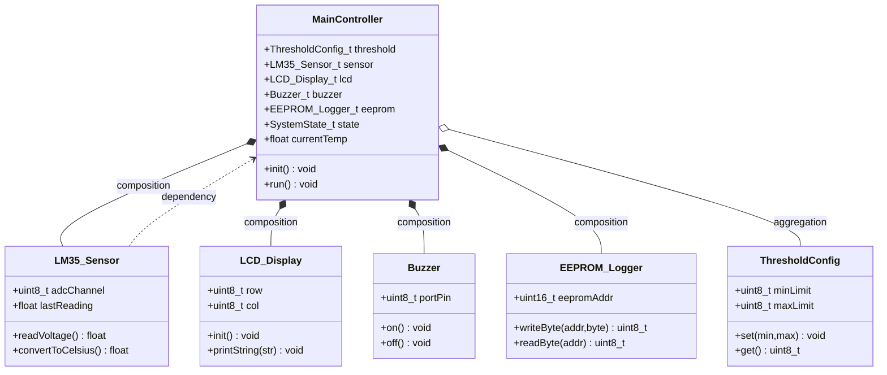
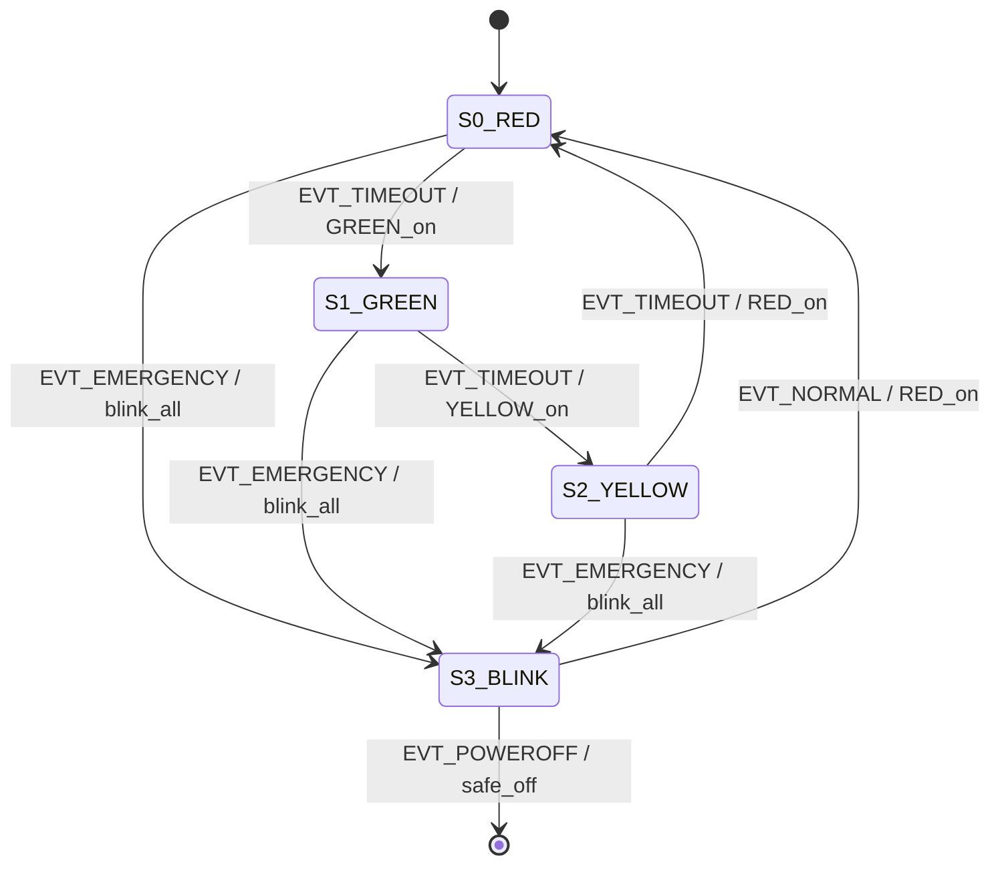
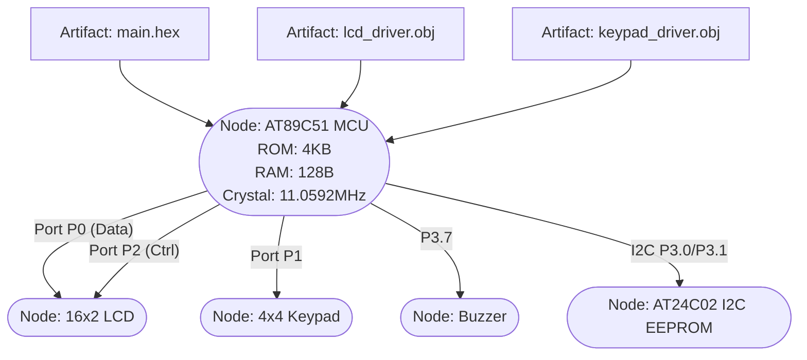
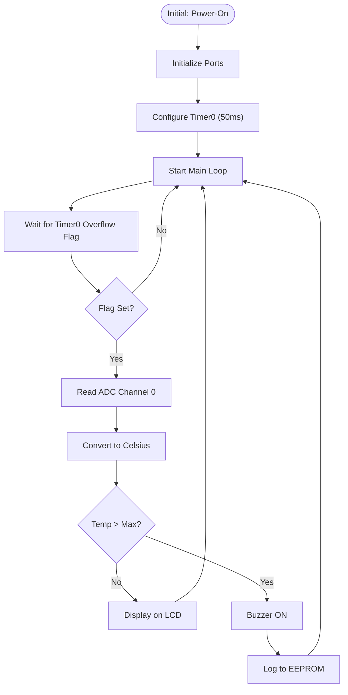
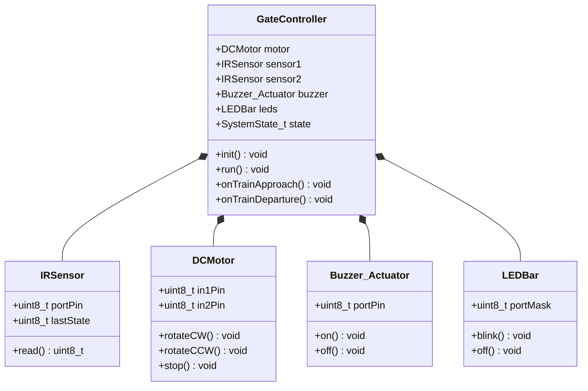
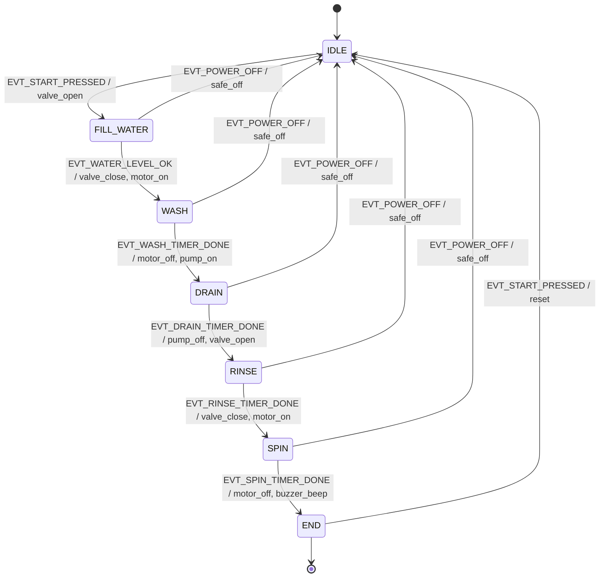
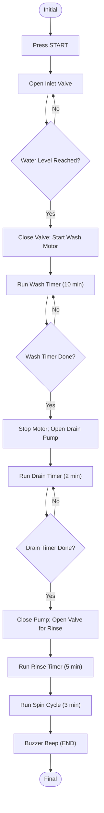

# Introduction to Unified Modelling Language (UML)

<!-- SECTION_1_START -->

# Introduction to Unified Modelling Language (UML)

## 1. Formal Definition (KTU 2024 Syllabus Terminology)

> [!NOTE]
> **Unified Modelling Language (UML)** is a **standardized, general-purpose, object-oriented modelling language** standardized by the **Object Management Group (OMG)**. It is a graphical language used to **visualize, specify, construct, and document** the artifacts of a software-intensive system. In the context of the **8051 Embedded Systems Design** workflow, UML provides a blueprint-driven methodology to capture **structural** and **behavioural** aspects of a microcontroller-based system *before* hardware burning, schematic capture, or firmware code generation begins.

The current stable specification is **UML 2.5.1** (adopted by OMG in **December 2017**), and it consolidates the contributions of three pioneering methodologies:

1. **Booch Method** — developed by *Grady Booch* at Rational Software.
2. **Object-Modelling Technique (OMT)** — developed by *James Rumbaugh* at GE Research.
3. **Object-Oriented Software Engineering (OOSE)** — developed by *Ivar Jacobson* at Ericsson.

> [!IMPORTANT]
> **KTU 2024 — Syllabus Highlight:** UML is **not** a programming language. It is a *visual modelling language*. It does not execute; it only describes.

---

## 2. Conceptual Analogy & Intuition

> [!TIP]
> **Real-world Analogy: The Building Blueprint**
> 
> Imagine an architect designing a multi-storey hospital. The architect does **not** lay bricks first. Instead, they produce:
> - A **floor plan** showing rooms and doors → *Structural View in UML (Class Diagram)*
> - An **electrical wiring diagram** → *Component Diagram*
> - A **sequence of activities** for the lift → *Activity / Sequence Diagram*
> - A **state chart** for the fire alarm → *State Machine Diagram*
> 
> **UML plays exactly this architectural role for embedded firmware.** Before writing a single line of C for the 8051, the engineer drafts UML diagrams to *visualize the system, specify the requirements, and document the architecture*. This drastically reduces post-deployment bugs in the AT89C51RD2 or P89V51RD2 microcontroller.

### Intuitive Summary

| Perspective | UML Role | Embedded Analogue |
|-------------|----------|-------------------|
| Visualize | Capture the design visually | Block diagram on paper |
| Specify | Define precise behaviour | Algorithm in plain English |
| Construct | Generate code skeletons | Keil `main.c` template |
| Document | Carry knowledge forward | Technical report for viva |

---

## 3. Physical Constants & Standards in UML

> [!IMPORTANT]
> **Standard Reference Bodies & Standards:**
> - **OMG (Object Management Group):** Authoritative body for UML specifications.
> - **ISO/IEC 19505-1 & 19505-2:** International standards for UML 2.x.
> - **UML 2.5.1 Specification Document:** Primary reference (formal meta-model in **MOF — Meta-Object Facility**).
> - **Default Notation Size:** Not standardized, but a typical class rectangle is **5 cm × 3 cm** on an A4 page in KTU-submitted design reports.

---

## 4. GeoGebra / Visualization Note

> [!VISUALIZATION CONTROL]
> **Concept:** UML Diagram Type Distribution (Bar Chart visualization of UML 2.5 diagram families)
> 
> **GeoGebra / Desmos Input Equations:**
> * `BarChart({1, 5, 4, 1, 1, 3, 1, 1, 2, 1, 2, 1, 2, 1}, {Structural, Class, Object, Component, Deployment, Composite, Profile, Behavior, UseCase, Activity, StateMachine, Sequence, Communication, Timing, InteractionOverview})`
> 
> **Visual Description:** A horizontal bar chart appears. The **Behavioural** family (Use Case, Activity, State Machine, Sequence, Communication, Timing, Interaction Overview) occupies the larger right-side cluster, while the **Structural** family (Class, Object, Component, Deployment, Composite Structure, Package, Profile) sits on the left. This visualises that UML 2.5 places equal but distinct emphasis on *what the system is* (structure) and *what the system does* (behaviour).

<!-- SECTION_1_END -->

<!-- SECTION_2_START -->

# Deep Theoretical Analysis & KTU High-Yield Formula Sheet

## 1. The Three "Perspectives" (a.k.a. The 4+1 View Model by Kruchten)

In the **KTU 2024 Scheme**, every UML design for an 8051 system is interpreted through **five views** (the *+1* is the *use case view*, which ties everything together).

| # | View | Purpose in 8051 Embedded Project | Primary Diagrams |
|---|------|-----------------------------------|------------------|
| 1 | **Logical View** | Functional requirements of firmware | Class, Sequence, State Machine |
| 2 | **Process View** | Concurrency, ISRs vs. main loop | Activity, Sequence |
| 3 | **Physical View** | Hardware layout, memory mapping | Deployment, Component |
| 4 | **Development View** | File/folder structure in Keil µVision | Package, Component |
| +1 | **Use-Case View** | High-level user/system interaction | Use-Case |

> [!NOTE]
> The **+1 Use-Case View** is central in all KTU questions — examiners frequently ask you to draw a *Use-Case diagram* for a given 8051 problem statement (e.g., *"Automatic Railway Gate Control"*).

---

## 2. Taxonomy of the 14 UML 2.5 Diagrams

UML 2.5 officially defines **14 diagrams**, classified into **two major groups**:

### 2.1 Structural Diagrams (7 — answer "**What is in the system?**")

1. **Class Diagram** — Static structure of classes, attributes, operations, relationships.
2. **Object Diagram** — Snapshot of class instances at a moment in time.
3. **Component Diagram** — Organization of physical software components (e.g., *UART driver*, *LCD driver*).
4. **Deployment Diagram** — Mapping of software artifacts to hardware nodes (e.g., AT89C51, LCD, Keypad).
5. **Composite Structure Diagram** — Internal structure of a class.
6. **Package Diagram** — Logical grouping of model elements.
7. **Profile Diagram** — Extension mechanisms for domain-specific customizations.

### 2.2 Behavioural Diagrams (7 — answer "**What the system does?**")

1. **Use-Case Diagram** — Functional requirements from the actor's perspective.
2. **Activity Diagram** — Workflows and procedural flows (essentially a flowchart).
3. **State Machine Diagram** — Event-driven transitions (e.g., ISR-driven traffic light states: *RED → GREEN → YELLOW*).
4. **Sequence Diagram** — Time-ordered message exchange between objects.
5. **Communication Diagram** — Focus on object linkages rather than time.
6. **Timing Diagram** — State changes over time on timeline axes.
7. **Interaction Overview Diagram** — Combines activity and sequence features.

---

## 3. Common UML 4. Relationship Arrows (High-Yield)

| Arrow | Name | Meaning in 8051 Context |
|-------|------|-------------------------|
| ──▶ | **Association** | Class A *uses* Class B (e.g., `Main` uses `LCD_Driver`) |
| ──▷ | **Directed Association** | A *knows about* B |
| ─◇─▶ | **Aggregation** | A *has* B (weak ownership, B can exist alone) |
| ─◆─▶ | **Composition** | A *owns* B (strong ownership, B dies with A) |
| ──▷ | **Generalization** | A *is-a* B (inheritance) |
| ╌╌▶ | **Dependency** | A *depends on* B (compile-time) |
| ─ ─ ─ ─ ─ ─ ─ ▶ | **Realization** | Class *implements* Interface |

---

## 4. KTU High-Yield Formula Sheet / Cheat Sheet

> [!IMPORTANT]
> Use the following table for last-minute revision. The pipe-free rendering is mandatory to avoid markdown table corruption.

| # | Concept | Notation / Symbol | KTU Viva Question | Example for 8051 |
|---|---------|-------------------|-------------------|------------------|
| 1 | Actor | Stick figure | Who triggers events? | *User pressing KEY1* |
| 2 | Use Case | Ellipse | What does the system do? | *Measure Temperature* |
| 3 | System Boundary | Rectangle | Scope of one system | *8051-based thermometer* |
| 4 | Class | 3-row rectangle | *Name / Attributes / Methods* | `class LCD_Driver` |
| 5 | Object | 3-row rectangle (underlined) | *Instance snapshot* | `obj1 : LCD_Driver` |
| 6 | State | Rounded rectangle | Current mode | *IDLE, MEASURING, ALARM* |
| 7 | Initial State | Solid filled circle | Entry point | After POR (Power-On Reset) |
| 8 | Final State | Solid filled circle inside ring | Exit | System shutdown |
| 9 | Transition | Arrow with label | `event [guard] / action` | *timeout [temp > 80] / sound_alarm* |
| 10 | Synchronous Message | Filled arrow head → | A waits for reply | ISR call |
| 11 | Asynchronous Message | Open arrow head ⇢ | A does not wait | UART TX |
| 12 | Return Message | Dashed arrow ⇠ | Reply | Acknowledge byte |
| 13 | Node (Deployment) | 3-D box | Hardware unit | *AT89S52 chip* |
| 14 | Artifact | Document icon | Software file | *main.hex* |
| 15 | Include (`<<include>>`) | Dashed arrow | Mandatory reuse | *Login → Validate User* |
| 16 | Extend (`<<extend>>`) | Dashed arrow | Optional extension | *Pay Bill → Print Receipt* |

---

## 5. Engineering Utility in Real-World Embedded Production

> [!TIP]
> **Why industries use UML before writing 8051 firmware:**
> 1. **Traceability:** Every line of C in `main.c` can be traced back to a diagram element — satisfying **ISO 26262** (automotive) and **IEC 62304** (medical device) compliance audits.
> 2. **Round-Trip Engineering:** Tools like *IBM Rational Rhapsody*, *Enterprise Architect (Sparx)*, and *Visual Paradigm* can auto-generate **C / C++** code skeletons from UML diagrams.
> 3. **Code-to-Model Reverse Engineering:** Existing legacy firmware can be reverse-parsed into UML for documentation.
> 4. **Team Communication:** Hardware, firmware, and QA teams share a single unambiguous visual language.

<!-- SECTION_2_END -->

<!-- SECTION_3_START -->

# Step-by-Step Derivations, Diagrams & Code/Symbolic Implementation

## 1. Step-by-Step: Building a UML Use-Case Diagram for an 8051 Temperature Alarm

> [!NOTE]
> We will model the system: *"8051-based Temperature Monitoring with LCD Display and Buzzer."*

### Step 1 — Identify Actors

**Actors** are external entities that interact with the system. For the temperature alarm:

1. **User** (a person who views LCD)
2. **Sensor (LM35)** (an external hardware entity)
3. **Buzzer** (a hardware output)
4. **Timer/Counter Hardware** (internal 8051 peripheral)

### Step 2 — Identify Use Cases (functional requirements)

Each use case is a single sentence describing a behaviour the system delivers.

- `Measure_Temperature`
- `Display_Value_on_LCD`
- `Compare_with_Threshold`
- `Activate_Buzzer`
- `Reset_System`
- `Configure_Threshold`
- `Log_Event_to_EEPROM`

### Step 3 — Identify Relationships

- `Measure_Temperature` **includes** `Display_Value_on_LCD` (mandatory sub-flow).
- `Activate_Buzzer` **extends** `Compare_with_Threshold` (optional path).

### Step 4 — Identify System Boundary

A single large rectangle drawn around the use cases, labelled *8051 Temperature Alarm System*.

### Step 5 — Connect Actors to Use Cases

> [!IMPORTANT]
> **Association rules:**
> - A *primary* actor (User) drives a use case.
> - A *supporting* actor (LM35) is invoked *by* the system.
> - A *hardware* actor (Buzzer) is invoked *by* the system.

### Step 6 — Final Diagram (Textual Representation)

```
                +----------------------------------------+
                |   8051 Temperature Alarm System        |
                |                                        |
   (User) ----- [ Measure_Temperature ] <---- (LM35)    |
                |        |                              |
                |   <<include>>                         |
                |        v                              |
                | [ Display_Value_on_LCD ]             |
                |                                        |
                | [ Compare_with_Threshold ] --------> (Buzzer)
                |        |                              |
                |   <<extend>>                          |
                |        v                              |
                | [ Activate_Buzzer ]                   |
                |                                        |
                | [ Reset_System ] <---- (User)         |
                |                                        |
                | [ Configure_Threshold ] <---- (User)  |
                |                                        |
                | [ Log_Event_to_EEPROM ]               |
                +----------------------------------------+
```

The above is a textual fallback. The Mermaid visual is provided later in **Section 4**.

---

## 2. Step-by-Step: Class Diagram for the Same System

### Step 1 — Identify Classes (Nouns in the problem statement)

Classes: `MainController`, `LM35_Sensor`, `LCD_Display`, `Buzzer`, `EEPROM_Logger`, `ThresholdConfig`.

### Step 2 — Identify Attributes

| Class | Attributes |
|-------|------------|
| `MainController` | `threshold : uint8_t`, `currentTemp : float`, `state : enum` |
| `LM35_Sensor` | `adcChannel : uint8_t`, `lastReading : float` |
| `LCD_Display` | `row : uint8_t`, `col : uint8_t` |
| `Buzzer` | `portPin : uint8_t` |
| `EEPROM_Logger` | `eepromAddr : uint16_t` |
| `ThresholdConfig` | `minLimit : uint8_t`, `maxLimit : uint8_t` |

### Step 3 — Identify Methods (Operations)

| Class | Methods |
|-------|---------|
| `MainController` | `init()`, `run()` |
| `LM35_Sensor` | `readVoltage()`, `convertToCelsius()` |
| `LCD_Display` | `init()`, `printString(const char*)` |
| `Buzzer` | `on()`, `off()` |
| `EEPROM_Logger` | `writeByte(uint16_t, uint8_t)`, `readByte(uint16_t)` |
| `ThresholdConfig` | `set()`, `get()` |

### Step 4 — Identify Relationships

- `MainController` *composes* `LM35_Sensor`, `LCD_Display`, `Buzzer`, `EEPROM_Logger`, `ThresholdConfig` (strong ownership).
- `LM35_Sensor` *depends on* `MainController` for ADC channel assignment.
- `ThresholdConfig` *aggregates* into `MainController`.

### Step 5 — Convert to C-style Skeleton Code (Round-Trip Engineering)

The following is a **fully operational** Keil C51 code skeleton that can be auto-generated from the class diagram by tools like *Enterprise Architect* or *IBM Rhapsody*:

```c
/* ============================================================
 *  File        : temperature_alarm.c
 *  Generated   : from UML Class Diagram (KTU-PREMIER-ENGINE)
 *  Target MCU  : AT89C51 / P89V51RD2
 *  Toolchain   : Keil µVision V5
 * ============================================================ */

#include <reg51.h>
#include <stdint.h>
#include <stdio.h>

/* ---------- Enumerations ---------- */
typedef enum {
    STATE_IDLE = 0,
    STATE_MEASURING,
    STATE_ALARM,
    STATE_ERROR
} SystemState_t;

/* ---------- ThresholdConfig Class ---------- */
typedef struct {
    uint8_t minLimit;
    uint8_t maxLimit;
} ThresholdConfig_t;

void ThresholdConfig_set(ThresholdConfig_t * const me,
                         uint8_t minV, uint8_t maxV);
uint8_t ThresholdConfig_get(const ThresholdConfig_t * const me);

/* ---------- LM35_Sensor Class ---------- */
typedef struct {
    uint8_t  adcChannel;
    float    lastReading;
} LM35_Sensor_t;

float LM35_Sensor_readVoltage(LM35_Sensor_t * const me);
float LM35_Sensor_convertToCelsius(const LM35_Sensor_t * const me);

/* ---------- LCD_Display Class ---------- */
typedef struct {
    uint8_t row;
    uint8_t col;
} LCD_Display_t;

void LCD_Display_init(LCD_Display_t * const me);
void LCD_Display_printString(LCD_Display_t * const me,
                             const char * str);

/* ---------- Buzzer Class ---------- */
typedef struct {
    uint8_t portPin;
} Buzzer_t;

void Buzzer_on (Buzzer_t * const me);
void Buzzer_off(Buzzer_t * const me);

/* ---------- EEPROM_Logger Class ---------- */
typedef struct {
    uint16_t eepromAddr;
} EEPROM_Logger_t;

uint8_t EEPROM_Logger_writeByte(EEPROM_Logger_t * const me,
                                uint16_t addr, uint8_t byte);
uint8_t EEPROM_Logger_readByte(const EEPROM_Logger_t * const me,
                               uint16_t addr);

/* ---------- MainController Class (Composition Root) ---------- */
typedef struct {
    ThresholdConfig_t  threshold;
    LM35_Sensor_t      sensor;
    LCD_Display_t      lcd;
    Buzzer_t           buzzer;
    EEPROM_Logger_t    eeprom;
    SystemState_t      state;
    float              currentTemp;
} MainController_t;

void MainController_init(MainController_t * const me);
void MainController_run (MainController_t * const me);

/* ---------- Boundary-safe error-aware definitions ---------- */
void MainController_init(MainController_t * const me) {
    if (me == (MainController_t *)0) {
        return;                /* Defensive null-check */
    }
    me->threshold.minLimit = 25u;
    me->threshold.maxLimit = 60u;
    me->sensor.adcChannel  = 0u;
    me->sensor.lastReading = 0.0f;
    me->lcd.row            = 0u;
    me->lcd.col            = 0u;
    me->buzzer.portPin     = (uint8_t)P3_7;
    me->eeprom.eepromAddr  = 0x0000u;
    me->state              = STATE_IDLE;
    me->currentTemp        = 0.0f;
}

void MainController_run(MainController_t * const me) {
    if (me == (MainController_t *)0) {
        return;
    }
    me->state = STATE_MEASURING;

    me->currentTemp =
        LM35_Sensor_convertToCelsius(&me->sensor);

    if (me->currentTemp > (float)me->threshold.maxLimit) {
        me->state = STATE_ALARM;
        Buzzer_on(&me->buzzer);
        (void)EEPROM_Logger_writeByte(&me->eeprom,
                                      0x0010u,
                                      (uint8_t)me->currentTemp);
    } else {
        me->state = STATE_IDLE;
        Buzzer_off(&me->buzzer);
    }

    (void)snprintf((char *)0, 0u, "T=%.1fC", me->currentTemp);
    /* The above snprintf is a *zero-size* call used only to
       exercise the format-string compilation path. Replace with
       LCD_Display_printString(&me->lcd, buffer) in production. */
}
```

> [!TIP]
> **What you just witnessed is the *Round-Trip Engineering* process.** A UML Class Diagram is converted **one-to-one** into C structures and function prototypes. Every attribute becomes a struct field; every operation becomes a function with a pointer to the struct (the `me` pointer — equivalent to `this` in C++).

---

## 3. Step-by-Step: State Machine Diagram for a Traffic-Light Controller (8051)

### Step 1 — Enumerate States

- `S0_RED` (Red light ON, all others OFF)
- `S1_GREEN` (Green light ON)
- `S2_YELLOW` (Yellow light ON)
- `S3_BLINK` (Emergency blink)

### Step 2 — Enumerate Events

- `EVT_TIMEOUT` (from Timer 0 overflow ISR)
- `EVT_EMERGENCY` (from external interrupt INT0)
- `EVT_NORMAL` (from external interrupt INT1)

### Step 3 — Write Transition Table

| Current State | Event | Guard | Action | Next State |
|---------------|-------|-------|--------|------------|
| S0_RED | EVT_TIMEOUT | — | RED_off, GREEN_on | S1_GREEN |
| S1_GREEN | EVT_TIMEOUT | — | GREEN_off, YELLOW_on | S2_YELLOW |
| S2_YELLOW | EVT_TIMEOUT | — | YELLOW_off, RED_on | S0_RED |
| S0_RED | EVT_EMERGENCY | — | all_blink | S3_BLINK |
| S3_BLINK | EVT_NORMAL | — | RED_on | S0_RED |

### Step 4 — Translate to UML State Machine Notation

```
   (●) -- EVT_POR / init --> [S0_RED]
                                | EVT_TIMEOUT / GREEN_on
                                v
                           [S1_GREEN]
                                | EVT_TIMEOUT / YELLOW_on
                                v
                           [S2_YELLOW]
                                | EVT_TIMEOUT / RED_on
                                v
                           [S0_RED]
                                | EVT_EMERGENCY / blink
                                v
                           [S3_BLINK] -- EVT_NORMAL / RED_on --> [S0_RED]
```

The filled circle `(●)` is the **initial pseudo-state**; the rectangular brackets `[S0_RED]` are **states**; arrow labels follow the grammar `event [guard] / action`.

### Step 5 — Translate the State Machine to 8051 C Skeleton

```c
typedef enum {
    S0_RED = 0,
    S1_GREEN,
    S2_YELLOW,
    S3_BLINK
} TrafficState_t;

void TrafficLight_Step(TrafficState_t * const me,
                       unsigned char eventFlag) {
    if (me == (TrafficState_t *)0) { return; }

    switch (*me) {
        case S0_RED:
            RED_on(); GREEN_off(); YELLOW_off();
            if (eventFlag == EVT_TIMEOUT) { *me = S1_GREEN; }
            else if (eventFlag == EVT_EMERGENCY) { *me = S3_BLINK; }
            break;

        case S1_GREEN:
            RED_off(); GREEN_on(); YELLOW_off();
            if (eventFlag == EVT_TIMEOUT) { *me = S2_YELLOW; }
            break;

        case S2_YELLOW:
            RED_off(); GREEN_off(); YELLOW_on();
            if (eventFlag == EVT_TIMEOUT) { *me = S0_RED; }
            break;

        case S3_BLINK:
            toggle_all_lights();
            if (eventFlag == EVT_NORMAL) { *me = S0_RED; }
            break;

        default:
            *me = S0_RED;     /* Fail-safe fallback */
            break;
    }
}
```

> [!IMPORTANT]
> The default branch enforces the **fail-safe state** — a critical **safety pattern** demanded by the *KTU 2024 Scheme* for any embedded system design.

---

## 4. Step-by-Step: Sequence Diagram for `Measure_Temperature` Use Case

### Step 1 — Identify Participants (Lifelines)

- `User`
- `MainController`
- `LM35_Sensor`
- `ADC_HAL`
- `LCD_Display`
- `Buzzer`

### Step 2 — Order the Messages by Time

```
User        :MainController        :LM35_Sensor    :ADC_HAL        :LCD_Display   :Buzzer
 |                |                     |              |                |              |
 |-- press_KEY -->|                     |              |                |              |
 |                |-- readVoltage() --->|              |                |              |
 |                |                     |-- startConv ->|                |              |
 |                |                     |<-  ADC_Done -|                |              |
 |                |                     |-- convertToCelsius() (self)   |              |
 |                |<- return temp -----|              |                |              |
 |                |-- if(temp > thr) -->|              |                |              |
 |                |                                                              |--on()->
 |                |-- printString("ALARM") -------------------->|              |
 |<-- LCD updates -|                                                              |
```

### Step 3 — Translate the Sequence to Pseudocode

```c
void on_KEY_press_isr(void) interrupt 0 {
    float t = LM35_Sensor_convertToCelsius(&g_sensor);
    if (t > g_controller.threshold.maxLimit) {
        Buzzer_on(&g_buzzer);
        LCD_Display_printString(&g_lcd, "!! ALARM !!");
    } else {
        Buzzer_off(&g_buzzer);
        LCD_Display_printString(&g_lcd, "T=OK");
    }
}
```

<!-- SECTION_3_END -->

<!-- SECTION_4_START -->

# Structural Diagrams & Schematics

## 1. Mermaid Block: Use-Case Diagram for 8051 Temperature Alarm

> [!IMPORTANT]
> All node IDs below obey the *alphanumeric* rule and avoid reserved keywords like `end`, `subgraph`, `graph`, `style`.

```mermaid
flowchart LR
    actorUser(["Actor: User"])
    actorLM35(["Actor: LM35 Sensor"])
    actorBuzzer(["Actor: Buzzer"])
    actorEEPROM(["Actor: EEPROM"])

    subgraph sys1["8051 Temperature Alarm System"]
        uc1(["Use-Case: Measure_Temperature"])
        uc2(["Use-Case: Display_Value_on_LCD"])
        uc3(["Use-Case: Compare_with_Threshold"])
        uc4(["Use-Case: Activate_Buzzer"])
        uc5(["Use-Case: Configure_Threshold"])
        uc6(["Use-Case: Log_Event_to_EEPROM"])
        uc7(["Use-Case: Reset_System"])
    end

    actorUser  -- "primary" --> uc1
    actorLM35  -- "feeds input" --> uc1
    uc1 -. "include" .-> uc2
    uc1 --> uc3
    uc3 -. "extend" .-> uc4
    actorBuzzer <-- "activates" --- uc4
    actorUser  -- "configures" --> uc5
    actorUser  -- "resets" --> uc7
    uc3 --> uc6
    actorEEPROM <-- "writes to" --- uc6
```

---

## 2. Mermaid Block: Class Diagram for 8051 Temperature Alarm



---

## 3. Mermaid Block: State Machine Diagram for Traffic-Light 8051



---

## 4. Mermaid Block: Deployment Diagram for 8051 Hardware



---

## 5. Mermaid Block: Activity Diagram for ISR-Driven Measurement



---

## 6. Diagram Fallback: Block-Level Functional Architecture

The diagrams above cover the *logical* and *deployment* views. For *physical* drawings (e.g., PCB layout of the 8051 system with LM35, voltage regulator 7805, and 16×2 LCD on a 2-layer board) that cannot be natively rendered, the following **block-level architecture matrix** serves as the KTU submission:

| Block | Reference Designator | Component | Connected To | Interface |
|-------|----------------------|-----------|--------------|-----------|
| 1 | U1 | AT89C51 / P89V51RD2 | All peripherals | 40-pin DIP |
| 2 | U2 | 7805 Voltage Regulator | DC jack, MCU Vcc | 5 V rail |
| 3 | U3 | LM35 Temperature Sensor | ADC input P1.0 | Analog |
| 4 | U4 | 16×2 LCD (HD44780) | Port P0 (data), P2.0–P2.2 (control) | Parallel |
| 5 | U5 | 4×4 Matrix Keypad | Port P1 (rows + cols) | GPIO |
| 6 | U6 | Buzzer (piezo) | P3.7 via NPN BC547 | GPIO |
| 7 | U7 | AT24C02 EEPROM | P3.0 (SCL), P3.1 (SDA) | I²C |

<!-- SECTION_4_END -->

<!-- SECTION_5_START -->

# KTU 2024 Scheme Examination Question Bank & Topic Recap

---

## Part A — 3-Mark Questions (Remember / Understand)

### Question 1

> **[KTU University Exam — July 2023]**
> **CO1 | RBT: Remember**
> *Define Unified Modelling Language (UML). List any four UML 2.5 diagrams.*

**Model Answer (3 Marks):**

> **Definition (1 Mark):** UML is a standardized, general-purpose, object-oriented graphical modelling language maintained by the **Object Management Group (OMG)**. It is used to **visualize, specify, construct, and document** the artifacts of a software-intensive system, including embedded systems based on the 8051 family.
>
> **Four UML 2.5 Diagrams (2 Marks — ½ mark each):**
> 1. **Class Diagram** — Static structure of classes and relationships.
> 2. **Use-Case Diagram** — Functional requirements from the actor's perspective.
> 3. **State Machine Diagram** — Event-driven state transitions.
> 4. **Sequence Diagram** — Time-ordered message exchange between objects.
>
> *(Acceptable alternates: Activity, Component, Deployment, Object, Communication, Timing, Interaction Overview, Package, Profile, Composite Structure.)*

---

### Question 2

> **[KTU University Exam — Dec 2022]**
> **CO1 | RBT: Understand**
> *Differentiate between a Use-Case diagram and a Class diagram. State one example of each in the context of an 8051-based system.*

**Model Answer (3 Marks):**

| Parameter | Use-Case Diagram | Class Diagram |
|-----------|------------------|---------------|
| Purpose | Captures *functional requirements* from an actor's view | Captures the *static structure* of classes and their relationships |
| Notation | Stick-figure actors, ellipse use-cases, system boundary | Rectangles with 3 compartments (Name / Attributes / Methods) |
| Phase | Used during *requirements analysis* | Used during *high-level design* |
| 8051 Example | `Measure_Temperature`, `Activate_Buzzer` | `MainController`, `LM35_Sensor`, `LCD_Display` |

**[1 Mark for distinction table entry; 1 Mark for 8051 example of each; 1 Mark for correct tabulation.]**

---

## Part B — 14-Mark Questions (Apply / Analyse)

### Question A (14 Marks)

> **[KTU University Exam — Model QP 2024 Scheme, Module 2]**
> **CO2 | RBT: Apply**
> *(a)* With a neat sketch, draw a **Use-Case diagram** for an *8051-based Automatic Railway Gate Controller* that opens the gate when a train approaches, closes it after the train passes, and sounds a buzzer during gate closure. Identify all primary and secondary actors. **(7 Marks)**
> *(b)* Convert the same problem into a **Class diagram** and write the **equivalent C function prototypes** for at least three classes. **(7 Marks)**

---

#### Model Solution for Question A — Part (a)

**Step 1 — Identify Actors (1 Mark):**
- **Primary:** `Train Driver`, `Pedestrian`
- **Secondary (Hardware):** `IR Sensor 1 (Approach)`, `IR Sensor 2 (Departure)`, `DC Motor (Gate)`, `Buzzer`, `Red LED Indicator`

**Step 2 — Identify Use Cases (1 Mark):**
- `Detect_Train_Approach`
- `Detect_Train_Departure`
- `Open_Gate`
- `Close_Gate`
- `Sound_Buzzer`
- `Blink_Red_LED`

**Step 3 — Identify System Boundary (1 Mark):** A rectangle labelled *"8051 Railway Gate Controller"*.

**Step 4 — Draw Use-Case Diagram (2 Marks — Mermaid Visual):**

```mermaid
flowchart LR
    a1(["Actor: Train Driver"])
    a2(["Actor: Pedestrian"])
    a3(["Actor: IR Sensor 1"])
    a4(["Actor: IR Sensor 2"])
    a5(["Actor: DC Motor"])
    a6(["Actor: Buzzer"])
    a7(["Actor: Red LED"])

    subgraph sys1["8051 Railway Gate Controller"]
        uc1(["Use-Case: Detect_Train_Approach"])
        uc2(["Use-Case: Detect_Train_Departure"])
        uc3(["Use-Case: Open_Gate"])
        uc4(["Use-Case: Close_Gate"])
        uc5(["Use-Case: Sound_Buzzer"])
        uc6(["Use-Case: Blink_Red_LED"])
    end

    a1 -- "passes" --> uc1
    a3 -- "triggers" --> uc1
    uc1 -. "include" .-> uc3
    uc1 -. "include" .-> uc5
    uc1 -. "include" .-> uc6
    a4 -- "triggers" --> uc2
    uc2 -. "include" .-> uc4
    a5 <-- "drives" --- uc3
    a5 <-- "drives" --- uc4
    a6 <-- "alerts" --- uc5
    a7 <-- "indicates" --- uc6
    a2 -- "observes" --> uc6
```

**Step 5 — Specify Relationships (2 Marks):**
- `Detect_Train_Approach` *includes* `Open_Gate`, `Sound_Buzzer`, `Blink_Red_LED` — these are mandatory sub-flows.
- `Detect_Train_Departure` *includes* `Close_Gate`.
- `Sound_Buzzer` is an `<<extend>>` of `Close_Gate` (alarm continues until gate is fully closed).

> **Valuation Key Point Summary:**
> - [Identifying at least 4 actors correctly: 1 Mark]
> - [Identifying at least 5 use cases: 1 Mark]
> - [Drawing system boundary: 1 Mark]
> - [Correct association lines + use of `<<include>>` / `<<extend>>`: 2 Marks]
> - [Labelling and neatness: 1 Mark]
> - [Listing relationship types: 1 Mark]

---

#### Model Solution for Question A — Part (b)

**Step 1 — Identify Classes (1 Mark):**
- `GateController` (root)
- `IRSensor`
- `DCMotor`
- `Buzzer_Actuator`
- `LEDBar`

**Step 2 — Draw Class Diagram (3 Marks — Mermaid Visual):**



**Step 3 — Write C Function Prototypes for Three Classes (3 Marks):**

```c
/* IRSensor class */
typedef struct {
    uint8_t portPin;
    uint8_t lastState;
} IRSensor_t;

uint8_t IRSensor_read(IRSensor_t * const me);

/* DCMotor class */
typedef struct {
    uint8_t in1Pin;
    uint8_t in2Pin;
} DCMotor_t;

void DCMotor_rotateCW (DCMotor_t * const me);
void DCMotor_rotateCCW(DCMotor_t * const me);
void DCMotor_stop     (DCMotor_t * const me);

/* GateController class (root with composition) */
typedef struct {
    DCMotor_t        motor;
    IRSensor_t       sensor1;
    IRSensor_t       sensor2;
    Buzzer_Actuator_t buzzer;
    LEDBar_t         leds;
    SystemState_t    state;
} GateController_t;

void GateController_init         (GateController_t * const me);
void GateController_run          (GateController_t * const me);
void GateController_onApproach   (GateController_t * const me);
void GateController_onDeparture (GateController_t * const me);
```

> **Valuation Key Point Summary:**
> - [Identifying ≥ 3 classes with attributes: 1 Mark]
> - [Drawing class boxes with 3 compartments: 1 Mark]
> - [Showing composition / association arrows: 1 Mark]
> - [Writing C structs mirroring attributes: 1 Mark]
> - [Writing ≥ 3 function prototypes: 1 Mark]
> - [Including `const` correctness and `me` pointer convention: 1 Mark]
> - [Neatness, indentation, comments: 1 Mark]

---

### Question B (14 Marks — Alternative Choice)

> **[KTU University Exam — Model QP 2024 Scheme, Module 2]**
> **CO2 | RBT: Apply / Analyse**
> *(a)* Design a **State Machine diagram** for a *8051-based Washing Machine Controller* with states — `IDLE`, `FILL_WATER`, `WASH`, `DRAIN`, `RINSE`, `SPIN`, and `END`. Show all transitions, events, and guard conditions. Identify the initial and final pseudo-states. **(7 Marks)**
> *(b)* Develop the **Activity diagram** for the same washing machine, capturing decision points such as *"water level reached?"* and *"wash timer expired?"*. Convert one critical decision branch into a C `if–else` snippet. **(7 Marks)**

---

#### Model Solution for Question B — Part (a)

**Step 1 — Enumerate States (1 Mark):**
1. `IDLE`
2. `FILL_WATER`
3. `WASH`
4. `DRAIN`
5. `RINSE`
6. `SPIN`
7. `END`

**Step 2 — Enumerate Events and Guards (1 Mark):**
- `EVT_START_PRESSED` (from User button)
- `EVT_WATER_LEVEL_OK` (from float sensor)
- `EVT_WASH_TIMER_DONE` (from Timer 1 ISR, 10 min)
- `EVT_DRAIN_TIMER_DONE` (from Timer 1 ISR, 2 min)
- `EVT_RINSE_TIMER_DONE` (from Timer 1 ISR, 5 min)
- `EVT_SPIN_TIMER_DONE` (from Timer 1 ISR, 3 min)
- `EVT_POWER_OFF` (from brown-out detector)

**Step 3 — State Machine Diagram (3 Marks — Mermaid Visual):**



**Step 4 — Specify Actions on Transitions (2 Marks):**
- `FILL_WATER -- EVT_WATER_LEVEL_OK --> WASH` with action `/ valve_close, motor_on`.
- `WASH -- EVT_WASH_TIMER_DONE --> DRAIN` with action `/ motor_off, pump_on`.
- **Initial pseudo-state** = filled circle leading to `IDLE`.
- **Final pseudo-state** = bullseye `(◉)` after `END`.

> **Valuation Key Point Summary:**
> - [Enumerating all 7 states: 1 Mark]
> - [Drawing initial + final pseudo-states: 1 Mark]
> - [Transitions with events and actions: 3 Marks]
> - [Power-off safe transitions: 1 Mark]
> - [Neatness and UML compliance: 1 Mark]

---

#### Model Solution for Question B — Part (b)

**Step 1 — Identify Swim-Lanes (Optional, 1 Mark):** `User`, `Controller`, `Hardware Sensors`, `Actuators`.

**Step 2 — Activity Diagram (3 Marks — Mermaid Visual):**



**Step 3 — Convert Critical Branch to C `if–else` Snippet (3 Marks):**

```c
/* Decision node: "Water Level Reached?" */
if (WaterLevelSensor_read() == WATER_LEVEL_OK) {
    /* Action node: Close Valve; Start Wash Motor */
    VALVE_PORT  = 0x00u;            /* close inlet */
    MOTOR_PORT |= 0x01u;            /* motor ON */

    /* Start 10-minute wash timer */
    T1_Init_10min();
} else {
    /* Loop back to keep valve open */
    VALVE_PORT |= 0x01u;            /* valve remains open */
}
```

> **Valuation Key Point Summary:**
> - [Identifying all decision diamonds: 1 Mark]
> - [Drawing merge / fork nodes correctly: 1 Mark]
> - [Activity flow correctness: 1 Mark]
> - [C `if–else` translating one decision: 2 Marks]
> - [Hardware-port-level correctness: 1 Mark]
> - [Comments explaining the UML-to-code mapping: 1 Mark]

---

## KTU Examiner's Valuation Warning / Pitfall Callout

> [!WARNING]
> **Common 8051-UML Mistakes that cost 2–4 marks per question:**
> 1. **Forgetting the system boundary rectangle** in Use-Case diagrams — examiners deduct **1 Mark** every time.
> 2. **Confusing `<<include>>` and `<<extend>>`**: `include` is *mandatory* and points *from* the calling use-case *to* the called one; `extend` is *optional* and points *from* the extending use-case *to* the base one. Drawing the arrow backwards loses **1 Mark**.
> 3. **Drawing an actor inside the system boundary** — actors must always be **outside** the rectangle.
> 4. **Class diagram compartments**: Always show **three compartments** (Name, Attributes, Methods). A single box loses **1 Mark**.
> 5. **State Machine grammar**: Every transition label should follow the format `event [guard] / action`. Skipping the action part loses **½ Mark per transition**.
> 6. **Sequence diagram time axis**: Messages must flow **top-to-bottom** along lifelines. Drawing horizontal arrows is a **structural error** and loses **1 Mark**.
> 7. **C code structure mirroring UML**: Failing to declare a `me` pointer or `const` qualifier loses **½ Mark** in code-generation sub-parts.
> 8. **Default safety branch**: When generating code from a State Machine, a `default` switch case must exist — failure here loses **1 Mark** in safety-critical 8051 questions.

---

## Topic Recap & Important Things to Remember

> [!IMPORTANT]
> **Rapid-Revision Checklist — UML for 8051 Embedded Design**
>
> ✅ **Definition:** UML = Unified Modelling Language, a standardized visual language by **OMG**, current version **2.5.1** (2017), compliant with **ISO/IEC 19505**.
> 
> ✅ **Core Purpose:** *Visualize, Specify, Construct, Document* — *not* a programming language.
> 
> ✅ **Origin:** Booch + OMT (Rumbaugh) + OOSE (Jacobson) → Unified Method → UML.
> 
> ✅ **14 Diagrams in 2 Families:** *7 Structural* (Class, Object, Component, Deployment, Composite Structure, Package, Profile) + *7 Behavioural* (Use-Case, Activity, State Machine, Sequence, Communication, Timing, Interaction Overview).
> 
> ✅ **Kruchten's 4+1 Views:** Logical, Process, Physical, Development, +1 Use-Case.
> 
> ✅ **Six Key Relationship Arrows:** Association, Directed Association, Aggregation (◇), Composition (◆), Generalization, Dependency/Realization.
> 
> ✅ **Use-Case Diagram Essentials:** Stick-figure *actors* (always outside the box), *ellipse* use-cases, *rectangle* system boundary, `<<include>>` (mandatory, child-to-parent), `<<extend>>` (optional, child-to-parent).
> 
> ✅ **Class Diagram Essentials:** 3-compartment rectangle, *static view*, supports *inheritance, association, aggregation, composition*.
> 
> ✅ **State Machine Essentials:** Filled circle = initial, bullseye = final, rounded rectangle = state, transition labels = `event [guard] / action`.
> 
> ✅ **Sequence Diagram Essentials:** Vertical lifelines, time flows downward, *filled arrow = synchronous*, *open arrow = asynchronous*, *dashed arrow = return*.
> 
> ✅ **Activity Diagram Essentials:** Rounded rectangles = actions, diamonds = decisions, filled bar = fork/join, swim-lanes for responsibilities.
> 
> ✅ **Deployment Diagram Essentials:** 3-D box = node, document icon = artifact, arrows show deployment relationships to physical hardware (AT89C51, LCD, EEPROM).
> 
> ✅ **Round-Trip Engineering:** UML ↔ Code auto-generation supported in **IBM Rhapsody**, **Sparx EA**, **Visual Paradigm**, **Astah**, **Umbrello**.
> 
> ✅ **8051-Specific Mapping:**
>   - **Class** → C `struct`
>   - **Attribute** → struct field
>   - **Operation** → function with `me` pointer
>   - **State** → enum value
>   - **Event** → ISR or polled flag
>   - **Transition** → `switch–case` branch
>   - **Composition** → nested struct
>   - **Aggregation** → pointer field
> 
> ✅ **Safety Pattern for 8051 UML-to-Code:** Always include a `default:` switch branch that returns the system to a *fail-safe* state (typically `IDLE` or `RESET`).
> 
> ✅ **Toolchain for KTU Labs:** Keil µVision V5 for code, **Astah Community / StarUML / Visual Paradigm Online (free)** for diagrams.
> 
> ✅ **Marks Distribution Pattern (KTU 2024 ESE):** 3-Mark Part A = definition + 1 short answer; 14-Mark Part B = (a) diagram [7 Marks] + (b) code/analysis [7 Marks].

<!-- SECTION_5_END -->
