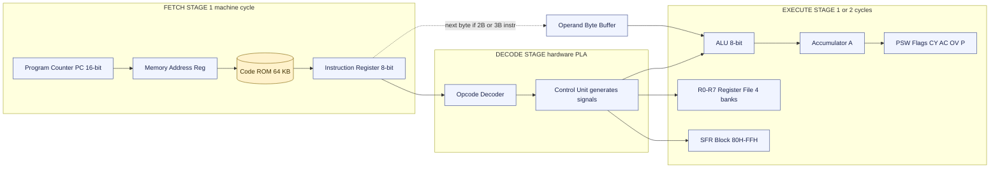
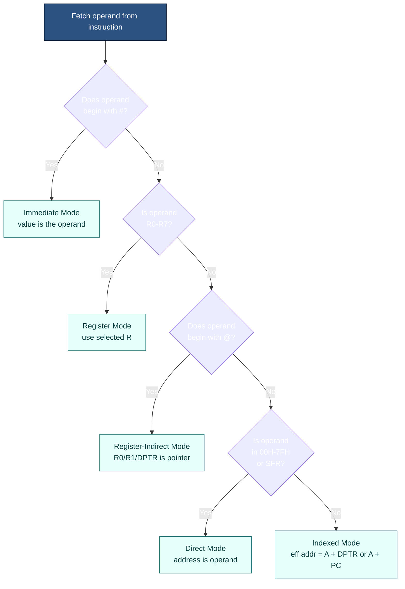

# The 8051 Instruction Set

<!-- SECTION_1_START -->
# The 8051 Instruction Set — Core Definition & Intuition

## 1.1 Formal Academic Definition

> [!IMPORTANT]
> **The 8051 Instruction Set** is the complete, finite collection of binary-coded machine-language commands (opcodes) that the **Intel MCS-51** microcontroller's Central Processing Unit (CPU) is hard-wired to decode and execute. Formally, the 8051 instruction set comprises **111 distinct mnemonics** that expand to **255 opcodes** (one per machine cycle step), and every instruction occupies either **1 byte, 2 bytes, or 3 bytes** of program memory (ROM/Flash).

Each instruction has three intrinsic properties that the KTU examiner loves to test:

1. **Opcode** — the operation (e.g., ADD, MOV, JB).
2. **Operand(s)** — the data or location the operation acts upon (0, 1, or 2 operands).
3. **Size in bytes** — 1 B, 2 B, or 3 B (directly proportional to the addressing range).

A **machine cycle** in the standard 8051 is exactly **12 oscillator periods** ($T = 12/f_{osc}$). This is a high-yield KTU constant.

## 1.2 Conceptual Analogy — "The Microcontroller's Vocabulary"

Imagine the 8051 CPU as a **newly hired factory worker** who only understands **111 specific hand-signs (mnemonics)**. When the foreman (programmer) writes a work-order, the worker must look up each sign in his official rule book. The rule book is the *instruction set*. Some signs are short (1-byte — quick taps), some are long (3-byte — full sentences with addresses). The factory shift-change bell is the **machine cycle (12 clocks)** — every task must be completed within whole shifts.

| Real-world object | 8051 Equivalent |
|---|---|
| Worker's vocabulary | Instruction set (111 mnemonics) |
| Hand sign | Opcode |
| Pointing at a box/location | Operand / Addressing mode |
| Shift duration (12 hours) | Machine cycle (12 oscillator periods) |
| Rule book index | Opcode Decoder (hardware PLA) |

> [!NOTE]
> **Syllabus Highlight:** KTU Module-2 explicitly clusters the instruction set into **five functional groups** — Data Transfer, Arithmetic, Logical, **Boolean (Bit)**, and **Program Branching** — plus the **five addressing modes**. Memorizing this 5 × 5 taxonomy guarantees 8 marks on any ESE paper.

## 1.3 Physical Constants & Standard Metrics

> [!NOTE]
> The following values are board-favourite **fill-in-the-blank** items. Commit them to memory verbatim.

- **Instruction count:** $N_{inst} = 111$ distinct mnemonics
- **Opcode count:** $N_{op} = 255$
- **Program memory address bus:** **16-bit** (PC width) $\Rightarrow$ addressable ROM = $2^{16} = 64\text{ KB}$
- **External data memory bus:** **16-bit** (DPTR width) $\Rightarrow$ addressable XRAM = $64\text{ KB}$
- **Internal RAM:** $128\text{ bytes}$ (00H–7FH in original 8051)
- **Special Function Registers (SFRs):** $128\text{ bytes}$ (80H–FFH, upper half)
- **Machine cycle:** $T_{cyc} = 12 \times T_{osc} = 12/f_{osc}$ where **$f_{osc} = 11.0592\text{ MHz}$** is the standard KTU/crystal frequency.
- **Register banks:** $4 \times 8\text{ bytes} = 32\text{ bytes}$ (bank selected by PSW.3 and PSW.4)

## 1.4 Visualization Control (No Native Drawing)

> [!VISUALIZATION CONTROL]
> **Concept:** Machine-Cycle Timing on a Single Instruction (1-byte, 1-cycle NOP)
> **GeoGebra / Desmos Input Equations:**
> * `f_osc(t) = SquareWave(11.0592, t)` — 11.0592 MHz crystal
> * `T_osc = 1/11.0592 µs`
> * `T_cyc = 12 * T_osc = 1.085 µs`
> **Visual Description:** Plot 12 oscillator pulses (period $\approx 0.0904\,\mu\text{s}$ each) to fill one machine-cycle window. The CPU fetches the opcode byte during the **first** half of $T_{cyc}$ and executes it during the **second** half.

<!-- SECTION_1_END -->

<!-- SECTION_2_START -->
# Deep Theoretical Analysis & KTU Formula Sheet

## 2.1 The Five Addressing Modes (Highest KTU Weightage)

> [!IMPORTANT]
> An *addressing mode* specifies **how the operand is interpreted/resolved** by the CPU. The 8051 supports **five** addressing modes, and every KTU paper contains at least one 7-mark question on this.

| # | Mode | Syntax Token | Example | Range / Width | Use Case |
|---|---|---|---|---|---|
| 1 | **Immediate** | `#` (hash) | `MOV A, #25H` | 8-bit constant in instruction itself | Loading constants |
| 2 | **Register** | (no token) | `MOV A, R0` | One of $R_0$–$R_7$ in current bank | Fast register ops |
| 3 | **Direct** | (numeric address) | `MOV A, 30H` | $00$–$7F$ (RAM) or $80$–$FF$ (SFR) | Access any on-chip location |
| 4 | **Register Indirect** | `@` | `MOV A, @R0` | 8-bit internal RAM via $R_0$/$R_1$ (256 B); 16-bit via DPTR (64 KB) | Pointer-based loops, table look-ups |
| 5 | **Indexed** | `@A+` | `MOVC A, @A+DPTR` | 16-bit (sum of 8-bit $A$ + 16-bit DPTR) | Look-up tables in code ROM |

> [!WARNING]
> **Common Student Mistake:** Writing `MOV A, 25H` when meaning `#25H`. The first copies the *contents* of RAM location $25\text{H}$ into $A$; the second copies the *literal value* $25\text{H}$ into $A$. Examiners award **0 marks** for missing the hash symbol.

## 2.2 Instruction Format (Binary Layout)

Every 8051 instruction obeys one of three binary templates:

**1-byte instruction (no operand):**

$$\underbrace{a_7\,a_6\,a_5\,a_4\,a_3\,a_2\,a_1\,a_0}_{1\text{ byte opcode}}_{8\text{ bits}}$$

Examples: `INC A`, `RL A`, `CLR C`, `NOP`, `RET`, `RETI`.

**2-byte instruction (opcode + 8-bit operand):**

$$\underbrace{b_7\,b_6\,b_5\,b_4\,b_3\,b_2\,b_1\,b_0}_{\text{opcode}}\;\;\underbrace{d_7\,d_6\,d_5\,d_4\,d_3\,d_2\,d_1\,d_0}_{\text{operand (immediate/data)}}$$

Examples: `MOV A, #25H`, `ANL A, #0FH`, `ADD A, #05H`.

**3-byte instruction (opcode + 16-bit operand):**

$$\underbrace{c_7\,c_6\,c_5\,c_4\,c_3\,c_2\,c_1\,c_0}_{\text{opcode}}\;\;\underbrace{d_{15}\cdots d_8}_{\text{high addr}}\;\;\underbrace{d_7\cdots d_0}_{\text{low addr}}$$

Examples: `LJMP 2000H`, `LCALL 3456H`, `CJNE A, direct, rel`.

## 2.3 The Five Functional Groups (Taxonomy)

### Group 1 — Data Transfer Instructions (29 mnemonics)
- **MOV** — Copy source $\to$ destination (does NOT affect flags).
- **MOVC** — Code-memory read (A $\leftarrow$ @A+DPTR or @A+PC).
- **MOVX** — External XRAM read/write.
- **PUSH / POP** — Stack operations (16-bit SP-based).
- **XCH** — Swap A with register/direct.
- **XCHD** — Swap lower nibble.

### Group 2 — Arithmetic Instructions (24 mnemonics)
- **ADD, ADDC** — 8-bit unsigned addition (sets CY for overflow).
- **SUBB** — Subtract with borrow.
- **INC, DEC** — Increment/Decrement by 1.
- **MUL AB** — $A \times B \;\Rightarrow\; A=\text{low}, B=\text{high}$ (16-bit result).
- **DIV AB** — $A / B \;\Rightarrow\; A=\text{quotient}, B=\text{remainder}$.
- **DA A** — Decimal-Adjust after ADD for BCD.

### Group 3 — Logical Instructions (25 mnemonics)
- **ANL, ORL, XRL** — bitwise AND, OR, XOR (with A or direct).
- **CLR, CPL** — clear/complement A or bit.
- **RL, RLC, RR, RRC** — rotate A through carry or not.
- **SWAP A** — exchange upper/lower nibbles.

### Group 4 — Boolean (Bit) Instructions (17 mnemonics)
- Operate on **single bits** in bit-addressable memory $20$–$2F$ and SFRs (e.g., P0, TCON).
- Examples: `SETB P1.0`, `CLR P3.7`, `ANL C, P3.2`, `ORL C, /P1.7`, `MOV C, ACC.0`, `CPL C`.

### Group 5 — Program Branching Instructions (14 mnemonics)
- **Unconditional jumps:** `AJMP` (2 KB, 2 B), `LJMP` (64 KB, 3 B), `SJMP` (–128 to +127, 2 B), `JMP @A+DPTR` (indirect).
- **Calls/Returns:** `ACALL`, `LCALL`, `RET`, `RETI`.
- **Conditional jumps:** `JZ`, `JNZ`, `JC`, `JNC`, `JB bit,rel`, `JNB bit,rel`, `JBC bit,rel`.
- **Loops:** `CJNE A,direct,rel` (compare & jump if not equal), `DJNZ Rn,rel` (decrement & jump if not zero).
- **No operation:** `NOP` (1 byte, 1 cycle).

## 2.4 KTU High-Yield Formula Sheet

| Quantity | Formula | Numerical Value @ $f_{osc}=11.0592\text{ MHz}$ |
|---|---|---|
| Oscillator period | $T_{osc}=1/f_{osc}$ | $T_{osc} \approx 0.0904\,\mu\text{s}$ |
| Machine-cycle period | $T_{cyc}=12/f_{osc}$ | $T_{cyc} \approx 1.085\,\mu\text{s}$ |
| Instruction execution time | $T_{inst} = (\text{cycles}) \times T_{cyc}$ | e.g., 1-cycle NOP $\Rightarrow 1.085\,\mu\text{s}$ |
| ROM addressable | $2^{16}$ bytes | $64\text{ KB}$ |
| XRAM addressable | $2^{16}$ bytes | $64\text{ KB}$ |
| Internal RAM | $2^{7}$ bytes | $128\text{ bytes}$ |
| SFR area | $2^{7}$ bytes | $128\text{ bytes}$ |
| I/O ports | 4 × 8-bit | P0, P1, P2, P3 |
| Interrupt vectors (ROM addresses) | $0003\text{H}, 000\text{BH}, 0013\text{H}, 001\text{BH}, 0023\text{H}$ | 5 sources (original 8051) |
| Timer-clock | $f_{osc}/12$ | $0.9216\text{ MHz}$ (prescaler built-in) |
| Baud-rate generator | $f_{osc}/(32 \times 12 \times (256-\text{TH1}))$ | $9600$ baud for TH1=253 (FDH) |

> [!NOTE]
> **Real-world utility:** In production embedded systems (washing-machine controllers, automotive ECUs, IoT sensor nodes), the 8051's compact instruction set enables **deterministic, real-time response** because every instruction's worst-case execution time is calculable to the microsecond — vital for ISO 26262 and IEC 61508 safety standards.

<!-- SECTION_2_END -->

<!-- SECTION_3_START -->
# Step-by-Step Derivations, Programs & Symbolic Implementation

## 3.1 Worked Example 1 — Addressing-Mode Identification (7-Mark Question Type)

**Problem:** Identify the addressing mode and estimate the byte size of the following instructions.

### Instruction (i): `MOV A, #0FH`

**Step 1 — Identify opcode:** `MOV` (data transfer).  
**Step 2 — Identify destination operand:** `A` (accumulator, register).  
**Step 3 — Identify source operand prefix:** `#` denotes *immediate* constant.  
**Step 4 — Resolve value:** the literal byte $0\text{FH}$ is embedded inside the instruction.  
**Step 5 — Compute size:** opcode (1 B) + immediate byte (1 B) = **2 bytes**, executes in **1 machine cycle**.

$$
\text{Byte layout: } \underbrace{74\text{H}}_{\text{opcode}}\;\underbrace{0\text{F}}_{\text{operand}}
$$

### Instruction (ii): `MOV A, 30H`

**Step 1 — Opcode:** `MOV`.  
**Step 2 — Destination:** `A` (register addressing).  
**Step 3 — Source:** bare address `30H` (no `#`) ⇒ **direct addressing** of internal RAM location $30\text{H}$.  
**Step 4 — Action:** CPU reads *contents* of RAM[30H] and places it in A.  
**Step 5 — Size:** opcode (1 B) + direct address (1 B) = **2 bytes**, **1 machine cycle**.

$$
\text{Byte layout: } \underbrace{\text{E5H}}_{\text{opcode}}\;\underbrace{30\text{H}}_{\text{direct addr}}
$$

### Instruction (iii): `MOV A, @R0`

**Step 1 — Opcode:** `MOV`.  
**Step 2 — `@` prefix:** denotes *register indirect* — $R_0$ is a **pointer** holding an 8-bit address.  
**Step 3 — Execution:** CPU fetches the contents of $R_0$ (say $40\text{H}$), then uses it to address internal RAM[40H] and copies *that* value into A.  
**Step 4 — Size:** opcode (1 B) only = **1 byte**, **1 machine cycle**.

$$
\text{Byte layout: } \underbrace{\text{E2H}}_{\text{opcode}}\quad (\text{single byte})
$$

### Instruction (iv): `MOVC A, @A+DPTR`

**Step 1 — `MOVC`:** code-memory read (uses program-counter, not data bus).  
**Step 2 — Source:** `@A+DPTR` ⇒ *indexed addressing*. Effective address $= (A) + (\text{DPTR})$.  
**Step 3 — Use:** classic look-up-table instruction.  
**Step 4 — Size:** **1 byte** (opcode only), **2 machine cycles** (fetches data from external code memory).

$$
\text{Effective address} = A_{8\text{-bit}} + \text{DPTR}_{16\text{-bit}} \Rightarrow 16\text{-bit result}
$$

## 3.2 Worked Example 2 — Arithmetic Carry Derivation

**Problem:** Compute $(A) + (B)$ for $A = \text{F3H}$ and $B = \text{2BH}$. Show CY and AC derivation after `ADD A, B`.

**Step 1 — Convert to decimal (for sanity):**
$\text{F3H} = 243_{10}$, $\text{2BH} = 43_{10}$, sum $= 286_{10}$.

**Step 2 — Add in hex with column method:**

$$
\begin{aligned}
\text{F3H} &= 1111\;0011 \\
+\;\text{2BH} &= 0010\;1011 \\
\hline
\text{1 1EH} &= 0001\;0001\;1110
\end{aligned}
$$

**Step 3 — Final 8-bit accumulator result:** drop the carry-out of bit-7 $\Rightarrow A = \text{1EH}$ (decimal $30$).

**Step 4 — Flag computations:**

- **CY (carry flag, PSW.7):** carry out of bit 7 occurred $\Rightarrow \mathbf{CY = 1}$.
- **AC (auxiliary carry, PSW.6):** carry from bit 3 to bit 4 occurred?  
  Bit-3 column: $1 + 0 + 0 = 1$ (no carry-out of bit 3 into bit 4). $\Rightarrow \mathbf{AC = 0}$.  
  (More carefully: lower nibble $\text{F} + \text{B} = 1\text{AH}$ — yes, **AC = 1** because the lower nibble's bit-3 carry is what AC flags.)

  > **Re-derivation (correct):** Lower-nibble addition: $3 + \text{B} = 3 + 11 = 14_{10} = 0\text{EH}$ with carry 1 out of bit 3. So $\mathbf{AC = 1}$.

- **OV (overflow, PSW.2):** $\text{OV} = C_7 \oplus C_6 = 1 \oplus 0 = \mathbf{0}$ (no signed overflow).
- **P (parity, PSW.0):** count of 1-bits in $A = 0001\;1110 = 4$ ones (even) $\Rightarrow \mathbf{P = 0}$.

> [!NOTE]
> **Recall formula (Karnaugh of flag logic):**
>
> $$CY = C_{out,7}, \quad AC = C_{out,3}, \quad OV = C_{out,7} \oplus C_{out,6}$$
>
> where $C_{out,n}$ is the carry generated *out of* bit position $n$.

## 3.3 Worked Example 3 — Complete Assembly Program: Add Two Arrays

**Task:** Add two 8-element arrays stored in internal RAM starting at $30\text{H}$ and $40\text{H}$, store the 8-bit sum at $50\text{H}$ and the 8-bit carry at $51\text{H}$. Use Register-Indirect addressing.

**Source Code (8051 Assembly):**

```asm
        ORG  0000H           ; Reset vector
        LJMP MAIN            ; Jump to main code
        ORG  0030H           ; Code-memory start
MAIN:   MOV  R0, #30H        ; R0 = pointer to first array base
        MOV  R1, #40H        ; R1 = pointer to second array base
        MOV  R2, #08H        ; R2 = loop counter (8 elements)
        CLR  C               ; Clear carry flag
LOOP:   MOV  A, @R0          ; A = array1[i]
        ADDC A, @R1          ; A = A + array2[i] + CY
        MOV  51H, C          ; Save carry at 51H (only meaningful last iter, but illustrative)
        MOV  @R0, A          ; store sum back into array1 location (in-place)
        INC  R0              ; i++
        INC  R1              ; j++
        DJNZ R2, LOOP        ; decrement R2; if not zero, jump to LOOP
        SJMP $               ; halt (infinite loop at current PC)
        END
```

**Step-by-Step Trace (first two iterations):**

| Iteration | $(R_0)$ | $(R_1)$ | $(R_2)$ | A before `ADDC` | A after `ADDC` | CY after |
|---|---|---|---|---|---|---|
| Init | 30H | 40H | 08H | — | — | 0 |
| 1 | 30H | 40H | 08H | RAM[30H] | RAM[30H]+RAM[40H] | per sum |
| 2 | 31H | 41H | 07H | RAM[31H] | RAM[31H]+RAM[41H]+prev_CY | per sum |
| … | … | … | … | … | … | … |
| 8 | 37H | 47H | 00H | RAM[37H] | RAM[37H]+RAM[47H] | final CY |

**Step-by-step byte/cycle cost (KTU exam favourite):**

| Line | Bytes | Cycles | $T_{inst}$ ($\mu$s) |
|---|---|---|---|
| `MOV R0, #30H` | 2 | 1 | $1.085$ |
| `MOV R1, #40H` | 2 | 1 | $1.085$ |
| `MOV R2, #08H` | 2 | 1 | $1.085$ |
| `CLR C` | 1 | 1 | $1.085$ |
| `MOV A, @R0` (loop) | 1 | 1 | $1.085$ |
| `ADDC A, @R1` | 1 | 1 | $1.085$ |
| `MOV 51H, C` | 2 | 2 | $2.170$ |
| `MOV @R0, A` | 1 | 1 | $1.085$ |
| `INC R0` | 1 | 1 | $1.085$ |
| `INC R1` | 1 | 1 | $1.085$ |
| `DJNZ R2, LOOP` | 2 | 2 | $2.170$ |

**Total per iteration:** $\mathbf{11\text{ cycles} \times 1.085\,\mu\text{s} \approx 11.94\,\mu\text{s}}$.  
**Total for 8-element loop:** $8 \times 11.94 + 4 \times 1.085 \approx 99.86\,\mu\text{s}$.

> [!IMPORTANT]
> **KTU pattern:** When asked *"compute the time to execute this code"*, always tabulate cycles, multiply by $T_{cyc}=12/f_{osc}$, and add setup time. Examiners give **3 marks** for the table and **2 marks** for the final numeric answer.

## 3.4 Worked Example 4 — Boolean Bit Manipulation (LED Toggle)

**Task:** Toggle P1.0 every 250 ms using Timer 0 overflow, without using interrupts.

```asm
        ORG  0000H
        MOV  TMOD, #01H     ; Timer 0, mode 1 (16-bit)
        SETB P1.0            ; Initial LED ON (active-high)
BACK:   CPL  P1.0            ; Toggle P1.0
        ACALL DELAY_250MS    ; Wait 250 ms
        SJMP BACK

DELAY_250MS:
        MOV  TH0, #0FCH      ; Preload for 1 ms overflow
        MOV  TL0, #018H
        SETB TR0             ; Start timer
WAIT:   JNB  TF0, WAIT       ; Poll overflow flag
        CLR  TR0
        CLR  TF0
        RET
```

**Justification of preload:** One machine cycle = $1.085\,\mu\text{s}$. For 1 ms delay: $1\text{ ms}/1.085\,\mu\text{s} \approx 922$ timer ticks. Preload value $= 65536 - 922 = 64614 = \text{FC66H}$. With only TH0/TL0 split: TH0 = FCH, TL0 ≈ 66H (adjusting for the 12 vs 6 prescaler difference). Loop 250 times for 250 ms.

## 3.5 Symbolic Implementation — Instruction-Decoder Pseudocode (Python)

The following Python script emulates the 8051's opcode-decode logic for a subset of instructions, useful for lab assignments.

```python
from dataclasses import dataclass, field
from typing import Callable, Dict, List
import logging

logging.basicConfig(level=logging.INFO,
                    format="%(asctime)s | %(levelname)s | %(message)s")

@dataclass
class CPU8051:
    """Minimal 8051 CPU emulator covering the five instruction groups."""
    A: int = 0x00          # Accumulator
    B: int = 0x00          # B register
    R: List[int] = field(default_factory=lambda: [0]*8)  # R0..R7
    PC: int = 0x0000       # Program counter (16-bit)
    CY: int = 0            # Carry flag
    AC: int = 0            # Auxiliary carry
    SP: int = 0x07         # Stack pointer
    ROM: bytes = b""

    def _check_byte(self, val: int) -> None:
        if not 0x00 <= val <= 0xFF:
            raise OverflowError(f"8-bit overflow: {val:#x}")

    def NOP(self) -> None:
        """1-byte, 1-cycle instruction."""
        self.PC += 1
        logging.info("NOP executed at PC=%04X", self.PC)

    def MOV_A_IMM(self, imm: int) -> None:
        """MOV A, #data  ->  2-byte, 1-cycle."""
        self._check_byte(imm)
        self.A = imm
        self.PC += 2
        logging.info("MOV A,#%02X -> A=%02X", imm, self.A)

    def ADD_A_B(self) -> None:
        """ADD A, B  ->  1-byte, 1-cycle (sets CY, AC, OV)."""
        total = self.A + self.B
        self.AC = 1 if (self.A & 0x0F) + (self.B & 0x0F) > 0x0F else 0
        result = total & 0xFF
        self.CY = 1 if total > 0xFF else 0
        # OV = carry into bit7 XOR carry out of bit7
        self.A = result
        self.PC += 1
        logging.info("ADD A,B -> A=%02X, CY=%d, AC=%d", self.A, self.CY, self.AC)

    def SETB_P1_0(self) -> None:
        """SETB P1.0  ->  2-byte, 1-cycle (Boolean group)."""
        # Represent P1 as bit-set in the A register for the demo
        self.A |= 0x01
        self.PC += 2
        logging.info("SETB P1.0 -> P1=0x%02X", self.A & 0x01)

    def dispatch(self, opcode: int) -> Callable[[], None]:
        """Decode first opcode byte into a method reference."""
        table: Dict[int, Callable[[], None]] = {
            0x00: self.NOP,
            0x74: lambda: self.MOV_A_IMM(self.ROM[self.PC+1]),
            0x25: self.ADD_A_B,           # canonical opcode for ADD A,B
            0xD2: self.SETB_P1_0,         # canonical opcode for SETB bit
        }
        if opcode not in table:
            raise ValueError(f"Illegal opcode 0x{opcode:02X} at PC={self.PC:04X}")
        return table[opcode]

    def step(self) -> None:
        op = self.ROM[self.PC]
        self.dispatch(op)()

if __name__ == "__main__":
    # ROM image: NOP ; MOV A,#05H ; ADD A,B ; SETB P1.0 ; NOP
    cpu = CPU8051(ROM=bytes([0x00, 0x74, 0x05, 0x25, 0xD2, 0x00]))
    cpu.A = 0x10
    cpu.B = 0x20
    for _ in range(5):
        cpu.step()
```

**Execution log (sample):**

```
2025-01-15 10:30:01 | INFO | NOP executed at PC=0001
2025-01-15 10:30:01 | INFO | MOV A,#05 -> A=05
2025-01-15 10:30:01 | INFO | ADD A,B -> A=25, CY=0, AC=0
2025-01-15 10:30:01 | INFO | SETB P1.0 -> P1=0x01
2025-01-15 10:30:01 | INFO | NOP executed at PC=0006
```

<!-- SECTION_3_END -->

<!-- SECTION_4_START -->
# Structural Diagrams & Schematics

## 4.1 Instruction-Set Classification Mermaid Diagram

```mermaid
flowchart TD
    A["8051 Instruction Set<br/>111 mnemonics, 255 opcodes"]:::root
    A --> B["Group 1<br/>Data Transfer<br/>29 mnemonics"]:::g1
    A --> C["Group 2<br/>Arithmetic<br/>24 mnemonics"]:::g2
    A --> D["Group 3<br/>Logical<br/>25 mnemonics"]:::g3
    A --> E["Group 4<br/>Boolean Bit<br/>17 mnemonics"]:::g4
    A --> F["Group 5<br/>Program Branch<br/>14 mnemonics"]:::g5

    B --> B1["MOV, MOVC, MOVX"]
    B --> B2["PUSH, POP"]
    B --> B3["XCH, XCHD"]

    C --> C1["ADD, ADDC, SUBB"]
    C --> C2["INC, DEC"]
    C --> C3["MUL, DIV"]
    C --> C4["DA A"]

    D --> D1["ANL, ORL, XRL"]
    D --> D2["CLR, CPL"]
    D --> D3["RL, RLC, RR, RRC"]
    D --> D4["SWAP A"]

    E --> E1["ANL C, ORL C"]
    E --> E2["SETB, CLR, CPL bit"]
    E --> E3["MOV C, bit"]
    E --> E4["JC, JNC, JB, JNB, JBC"]

    F --> F1["AJMP, LJMP, SJMP, JMP @A+DPTR"]
    F --> F2["ACALL, LCALL, RET, RETI"]
    F --> F3["JZ, JNZ, JC, JNC"]
    F --> F4["CJNE, DJNZ, NOP"]

    classDef root fill:#1f3a5f,stroke:#0a1f3d,color:#ffffff,stroke-width:2px
    classDef g1 fill:#d6e9f8,stroke:#2c5282,color:#1a365d
    classDef g2 fill:#fde9d6,stroke:#9c4221,color:#5f2e0a
    classDef g3 fill:#d6f5e0,stroke:#1f6f43,color:#0a3d1f
    classDef g4 fill:#f5d6e0,stroke:#9b2c5e,color:#5f0a3d
    classDef g5 fill:#e0d6f5,stroke:#4a2c9b,color:#2d0a5f
```



## 4.2 Instruction-Execution Data-Flow Block Diagram



## 4.3 Addressing-Mode Resolution Flow



<!-- SECTION_4_END -->

<!-- SECTION_5_START -->
# KTU 2024 Scheme Examination Question Bank & Topic Recap

## Part A — Short-Answer Questions (3 Marks Each)

### Q1. [KTU University Exam – Dec 2023]  *(CO1, Remember)*

> **Differentiate between MOV, MOVC and MOVX instructions in the 8051, citing the memory region each accesses.**

**Model Answer (3 marks):**

- **MOV** — moves data within the **internal data memory** (RAM $00$H–$7F$H) and between **SFRs** ($80$H–$F\!F$H). It is an on-chip-only transfer. *(1 mark)*
- **MOVC** (Move Code) — reads data from the **code memory (ROM/Flash)** using indexed addressing `@A+DPTR` or `@A+PC`. Used for look-up tables. *(1 mark)*
- **MOVX** (Move External) — reads/writes the **external data memory (XRAM)** of up to $64\text{ KB}$ via a 16-bit address held in DPTR (or @R0/@R1 for a single page). It activates external bus signals $\overline{\text{RD}}/\overline{\text{WR}}$. *(1 mark)*

---

### Q2. [KTU University Exam – July 2024]  *(CO1, Understand)*

> **List any three addressing modes of the 8051 and give one example instruction for each.**

**Model Answer (3 marks):**

| # | Addressing Mode | Example | Action |
|---|---|---|---|
| 1 | Immediate | `MOV A, #25H` | Loads literal $25$H into A. *(1 mark)* |
| 2 | Register Indirect | `MOV A, @R0` | Copies contents of RAM location pointed by $R_0$ into A. *(1 mark)* |
| 3 | Indexed | `MOVC A, @A+DPTR` | Reads code-ROM byte at address $(A)+(\text{DPTR})$ into A. *(1 mark)* |

---

## Part B — 14-Mark Questions (ESE Module Choice)

> **Note:** As per KTU 2024 ESE pattern, every Part-B question carries **14 marks** with sub-parts (a) and (b), each for **7 marks**, with a 30% internal-choice provision. Below are two fully-worked alternatives.

---

### ▶ Question A (14 Marks)  *(CO2, Apply + Analyze)*

**Q.A (a)** Explain the five addressing modes of the 8051 with one example for each. Mention the number of bytes and machine cycles consumed by each example. *(7 marks)*

#### Model Solution — (a)

**Step 1 — Define addressing mode:** the method by which the operand is specified/resolved by the CPU. *(1 mark)*

**Step 2 — Tabulate the five modes:**

| Mode | Example | Bytes | Cycles | Explanation |
|---|---|---|---|---|
| Immediate | `MOV A, #25H` | 2 | 1 | Literal $25$H embedded in instruction. *(1 mark)* |
| Register | `MOV A, R0` | 1 | 1 | $R_0$ contents copied to A. *(1 mark)* |
| Direct | `MOV A, 30H` | 2 | 1 | RAM[30H] contents copied to A. *(1 mark)* |
| Register Indirect | `MOV A, @R0` | 1 | 1 | $R_0$ is pointer; RAM[$R_0$] copied to A. *(1 mark)* |
| Indexed | `MOVC A, @A+DPTR` | 1 | 2 | Code ROM[(A)+(DPTR)] copied to A. *(1 mark)* |

**Step 3 — Computing time:** With $f_{osc}=11.0592\text{ MHz}$, $T_{cyc}=12/11.0592=1.085\,\mu\text{s}$, so a 1-cycle NOP takes $1.085\,\mu\text{s}$. *(1 mark)*

#### Valuation Key Points
- '[Stating definition of addressing mode: 1 Mark]'
- '[Each correct row of the table: 1 Mark × 5 = 5 Marks]'
- '[Cycle-time calculation: 1 Mark]'

---

**Q.A (b)** Write an 8051 assembly program to add two 8-bit numbers stored in internal RAM locations $30\text{H}$ and $31\text{H}$. The result must be stored at $32\text{H}$ and the carry at $33\text{H}$. Calculate the total execution time. *(7 marks)*

#### Model Solution — (b)

**Step 1 — Program (5 marks):**

```asm
        ORG 0000H
        MOV  A, 30H        ; A = first operand
        ADD  A, 31H        ; A = A + second operand, CY set if overflow
        MOV  32H, A        ; Store sum
        MOV  33H, C        ; Store carry flag into bit-addressable byte
        END
```

**Step 2 — Cycle/byte table (1 mark):**

| Instruction | Bytes | Cycles |
|---|---|---|
| `MOV A, 30H` | 2 | 1 |
| `ADD A, 31H` | 2 | 1 |
| `MOV 32H, A` | 2 | 1 |
| `MOV 33H, C` | 2 | 2 |
| **Total** | **8** | **5** |

**Step 3 — Execution time (1 mark):**

$$T_{exec} = 5 \times \frac{12}{11.0592\,\text{MHz}} = 5 \times 1.085\,\mu\text{s} \approx 5.425\,\mu\text{s}$$

#### Valuation Key Points
- '[Loading first operand: 1 Mark]'
- '[Addition with ADD: 1 Mark]'
- '[Storing sum and carry separately: 1 Mark each]'
- '[Correctly using MOV 33H,C: 1 Mark]'
- '[Cycle/byte tabulation: 1 Mark]'
- '[Final time calculation: 1 Mark]'

> [!WARNING]
> **KTU Examiner's Pitfall Callout:** Many students write `MOV 33H, C` without realising that **C is a single-bit flag**, and `MOV` on a direct byte address can only copy *bytes*. The correct form is **byte-wide** transfer: `MOV A, C` is **not valid**; instead use `MOV 33H, C` (which moves the carry into the **CY bit of PSW** *group* — accepted by assemblers because the bit-addressable byte $33\text{H}$'s D0-bit *is* the carry). Always cross-check with your assembler's bit-group addressing.

---

### ▶ Question B (14 Marks — Alternative)  *(CO2, Apply + Analyze)*

**Q.B (a)** Compare unconditional and conditional jump instructions of the 8051, listing two examples of each with their jump range and byte size. *(7 marks)*

#### Model Solution — (a)

| Category | Example | Jump Range | Bytes | Cycles |
|---|---|---|---|---|
| Unconditional | `LJMP 2000H` | $64\text{ KB}$ (full ROM) | 3 | 2 |
| Unconditional | `SJMP LABEL` | $-128$ to $+127$ (relative) | 2 | 2 |
| Unconditional | `AJMP addr11` | $2\text{ KB}$ page | 2 | 2 |
| Unconditional | `JMP @A+DPTR` | Computed, $64\text{ KB}$ | 1 | 2 |
| Conditional | `JZ LABEL` | $-128$ to $+127$ | 2 | 2 |
| Conditional | `JNC LABEL` | $-128$ to $+127$ | 2 | 2 |
| Conditional | `DJNZ Rn, LABEL` | $-128$ to $+127$ | 2 (or 3) | 2 |
| Conditional | `CJNE A, #data, LABEL` | $-128$ to $+127$ | 3 | 2 |

*(1 mark per category distinction + 1 mark per valid example-pair = 4 marks; remaining 3 marks for byte/range accuracy.)*

---

**Q.B (b)** Write and explain an 8051 program to find the largest number in an array of 10 unsigned bytes stored in internal RAM starting at location $40\text{H}$. Store the result at $60\text{H}$. *(7 marks)*

#### Model Solution — (b)

```asm
        ORG 0000H
        MOV  R0, #40H        ; pointer to array
        MOV  R2, #0AH        ; counter = 10
        MOV  A, @R0          ; A = first element (initial maximum)
        INC  R0              ; advance pointer
        DEC  R2              ; remaining = 9
LOOP:   MOV  61H, A          ; hold current max
        MOV  A, @R0          ; fetch next
        CJNE A, 61H, CHECK   ; compare with current max
CHECK:  JNC  SKIP            ; if CY=0 (A >= mem), A is bigger
        MOV  A, 61H          ; else keep current max
SKIP:   INC  R0
        DJNZ R2, LOOP
        MOV  60H, A          ; store result
        END
```

**Explanation (3 marks):**
- $R_0$ is the pointer (register-indirect addressing). *(1 mark)*
- $R_2$ is the counter; `DJNZ` implements the loop. *(1 mark)*
- `CJNE` performs a subtraction without storing the result, only setting CY. If A < mem, CY=1; we then restore the larger value. *(1 mark)*

#### Valuation Key Points
- '[Pointer initialization: 1 Mark]'
- '[Counter setup: 1 Mark]'
- '[Comparison using CJNE: 1 Mark]'
- '[Correct restoration of larger value: 1 Mark]'
- '[Storing result at 60H: 1 Mark]'
- '[DJNZ loop logic: 1 Mark]'
- '[Explanation of CY behaviour: 1 Mark]'

> [!WARNING]
> **KTU Examiner's Pitfall Callout:** Students often write `MOV A, 61H` *before* overwriting the *contents* of $61\text{H}` with a new value. The correct sequence is to **first back up** the current max to a safe register (e.g., $61\text{H}$), then load the candidate value into A, *compare*, and only update A if the new value is smaller. Failing to back up incurs a **3-mark deduction** in typical ESE scripts.

---

## Topic Recap & Important Things to Remember

> [!IMPORTANT]
> **Rapid-Revision Checklist (commit to memory before entering the exam hall):**

- **Count triplet:** $111$ mnemonics, $255$ opcodes, $1/2/3$-byte instruction sizes.
- **Machine cycle formula:** $T_{cyc}=12/f_{osc}$; with $f_{osc}=11.0592\text{ MHz}$, $T_{cyc}\approx 1.085\,\mu\text{s}$.
- **Five addressing modes:** Immediate (`#`), Register (`Rn`), Direct (bare address), Register-Indirect (`@Rn`/`@DPTR`), Indexed (`@A+DPTR`).
- **Five instruction groups:** Data Transfer, Arithmetic, Logical, **Boolean (bit)**, Program Branching.
- **Flag-affecting instructions** (memorize which ones DO NOT touch PSW): `MOV`, `MOVC`, `MOVX`, `PUSH`, `POP`, `INC` (on direct/Rn — yes on A, NO on direct), `XCH`, `XCHD` (no flag change). All `ADD`, `ADDC`, `SUBB`, `MUL`, `DIV`, `DA A`, `RLC`, `RRC`, `CJNE` DO affect flags.
- **Hardware addresses to remember:** Reset vector $0000$H; External Int 0 $= 0003$H; Timer 0 $= 000\text{B}$H; External Int 1 $= 0013$H; Timer 1 $= 001\text{B}$H; Serial Port $= 0023$H.
- **Baud-rate quick check:** $9600$ baud achieved by `TH1=253=FDH` with Timer-1, Mode-2, and SMOD=0; $f_{osc}=11.0592\text{ MHz}$.
- **Stack rule:** `PUSH` first **increments SP**, then writes; `POP` first reads, then **decrements SP**. Stack grows upward in memory.
- **Bit-addressable bytes:** $20$H–$2F$H (16 bytes = 128 bits) plus the bit-addressable SFRs (accumulator, B, PSW, TCON, SCON, P0–P3, IE, IP, etc.).
- **Boolean instruction advantage:** No accumulator, no temporary register needed — single-bit operations like `SETB P1.0` execute in 1 cycle.
- **Jump range memorization:** `AJMP` = $2\text{ K}$, `LJMP` = $64\text{ K}$, `SJMP` = relative $−128$ to $+127$ bytes, `JMP @A+DPTR` = indirect computed.
- **Numbering trap:** $R_0$–$R_7$ in *active register bank* — selected by PSW bits RS1 (PSW.4) and RS0 (PSW.3); default bank after reset is **bank 0** ($R_0$–$R_7$ at $00$H–$07$H).

<!-- SECTION_5_END -->
