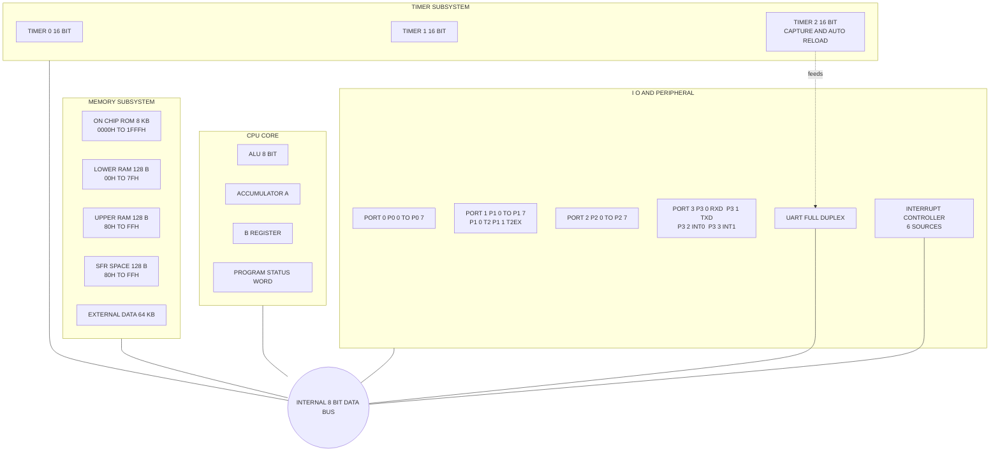
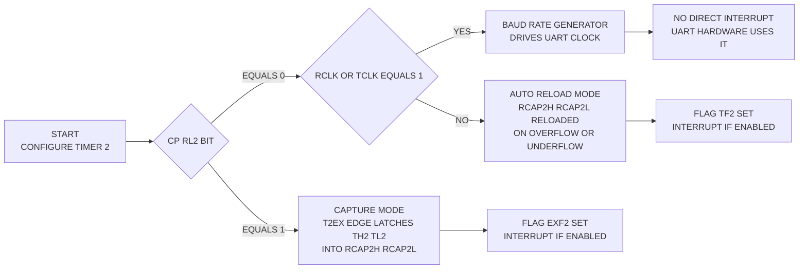
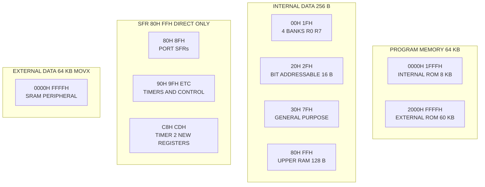
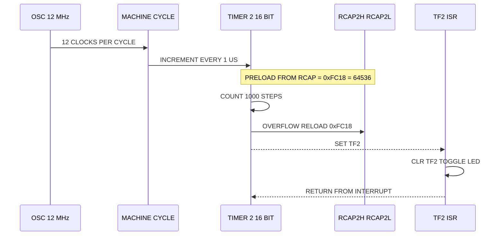

# The 8052 Microcontroller

<!-- SECTION_1_START -->

# The 8052 Microcontroller — Core Technical Definition & Intuitive Overview

## 1.1 Formal KTU 2024 Syllabus Definition

The **8052 Microcontroller** is a member of the MCS-51 family manufactured originally by **Intel** and now by several second-source vendors (Atmel, Nuvoton, Silicon Labs). It is a **pin-compatible, instruction-set-compatible, enhanced successor** of the standard **8051**, distinguished primarily by **doubled on-chip program memory (8 KB ROM)**, **doubled on-chip data memory (256 B RAM)**, and the addition of a **third 16-bit Timer/Counter (Timer 2)** with capture and auto-reload capabilities.

> [!IMPORTANT]
> **KTU 2024 Syllabus Mapping (PECST746 / Module 2):** The 8052 is treated as the *bridge device* between the 8051 baseline and modern derivatives such as the **8051Fx / Silicon Labs C8051Fxxx** family. The examiner expects students to articulate **what changed, why it changed, and how the new Timer 2 is used in real designs** (especially baud-rate generation and event-time-stamping).

| Parameter | 8051 (Baseline) | 8052 (Enhanced) | Engineering Impact |
|---|---|---|---|
| On-chip ROM | **4 KB** | **8 KB** | Larger monolithic firmware |
| On-chip RAM | **128 B** | **256 B** | Bigger stack, more variables |
| Timers/Counters | 2 (T0, T1) | **3 (T0, T1, T2)** | Adds capture/auto-reload |
| UART | 1 (Full-duplex) | 1 (Full-duplex) | Identical, but T2 can clock it |
| Interrupt Sources | 5 | **6** | Extra TF2 / EXF2 vector |
| Max Oscillator | 12 MHz | **12 MHz / 24 MHz** | Higher throughput |
| Power Modes | Idle | **Idle + Power-Down** | Battery-friendly |

## 1.2 Conceptual Analogy / Intuition

> [!NOTE]
> **Analogy — "The Same Car, But with a Turbo and a Bigger Trunk"**
> Imagine the **8051** as a standard hatchback: dependable, fuel-efficient, and very well documented. The **8052** is the *exact same chassis* (same pinout, same instructions, same assembly language), but it ships with a **bigger trunk (8 KB ROM, 256 B RAM)** and a **third engine — a turbocharged chronograph (Timer 2)** that can record lap times (capture) and run repeatedly on a preset schedule (auto-reload). For a student, the learning curve from 8051 → 8052 is essentially *zero at the assembly level* — you just gain **new SFRs** to drive the extra hardware.

### 1.2.1 Plain-English Block View of the 8052

Think of the 8052 as five functional blocks glued to a common internal **8-bit data bus**:

- **CPU (8-bit ALU + Accumulator + B-register + PSW)** — the *brain*.
- **Program Memory (8 KB on-chip ROM, up to 64 KB off-chip)** — the *library*.
- **Data Memory (256 B on-chip RAM, up to 64 KB off-chip)** — the *desk*.
- **Three Timer/Counters (T0, T1, T2)** — the *stopwatches*.
- **UART + 4 I/O Ports + Interrupt Controller** — the *mouth, hands, and senses*.

## 1.3 Key Physical & Operating Metrics

- **Operating Voltage (V\_CC):** **+5 V ± 10 %** (CMOS variants: **2.7 V – 5.5 V**).
- **Machine Cycle:** **12 oscillator periods** (at 12 MHz, one machine cycle = **1 µs**).
- **Instruction Set:** **255 opcodes**, **111 distinct instructions** — fully upward-compatible with 8051.
- **Package:** Standard **40-pin DIP**, **44-pin PLCC/QFP**.
- **Active Current:** ~**10–25 mA** (CMOS); Power-Down: ~**50 µA** typical.

> [!TIP]
> **GeoGebra / Desmos Visualization (Architecture Block Diagram)**
> A formal block diagram of the 8052 is provided later in **Section 4** as a Mermaid schematic. For a *clock-timing* visualization of Timer 2 (showing the relationship between the timer register, the RCAP2 register, and the overflow flag), students can sketch the following in Desmos:
> 
> * `f_{osc} = 12`  *(MHz, the input crystal)*
> * `T_{mc} = 12 / f_{osc}`  *(machine-cycle period in µs)*
> * `T_{rollover} = (65536 - RCAP2) * T_{mc}`  *(auto-reload period)*
> 
> **Visual Description:** The plot of $T_{rollover}$ versus $RCAP2$ is a **straight line with negative slope** crossing the $y$-axis at $65536 \cdot T_{mc}$. The student should observe how *smaller reload values* yield *shorter* rollover intervals.

---

<!-- SECTION_1_END -->

<!-- SECTION_2_START -->

# Deep Theoretical Analysis & KTU High-Yield Formula Sheet

## 2.1 8052 Memory Architecture — The Three Address Spaces

Unlike microprocessors, the 8052 Harvard architecture keeps **Program** and **Data** memory in **separate address spaces**, accessed by **different instructions** (`MOVC` vs. `MOVX`).

### 2.1.1 Program Memory (Code Space)

| Address Range | Size | Type | Access |
|---|---|---|---|
| `$0000` – `$1FFF` | **8 KB** | On-chip ROM (8052) | `MOVC A,@A+DPTR` |
| `$2000` – `$FFFF` | 60 KB | Off-chip (via `/EA` & `/PSEN`) | External fetch |

- On reset, **PC = $0000**; the first instruction is at the lowest address.
- If `/EA = 0`, the entire 64 KB is *external*; if `/EA = 1`, internal ROM is used up to `$1FFF`, then execution continues externally.

### 2.1.2 Data Memory (Internal RAM — 256 Bytes)

The **256 B** internal RAM is split into **two dissimilar halves** because of the 8-bit addressing schemes inherited from the 8051:

| Range | Size | Region | Addressing |
|---|---|---|---|
| `$00` – `$7F` | 128 B | **Lower RAM** (general-purpose + bit-addressable `$20`–`$2F`) | Direct & Indirect |
| `$80` – `$FF` | 128 B | **Upper RAM (SFR Space)** | Direct only |

> [!WARNING]
> **Common Pitfall:** Addresses `$80`–`$FF` are *physically different* memory from the SFRs (which also live at `$80`–`$FF`). The CPU distinguishes them by **instruction type**: *direct* addressing hits the SFR, *indirect* (`@R0/@R1`) hits the upper RAM. This is a frequent exam trap.

### 2.1.3 External Data Memory (XDATA)

A separate **64 KB** space accessed via `MOVX`. Used for peripheral chips, large buffers, and external SRAM.

## 2.2 The 8052 SFR Map — What's New vs. the 8051

The 8052 keeps *every* SFR of the 8051 and adds **five new SFRs** dedicated to Timer 2. The complete addition is shown in the table below.

| SFR | Address | Bit Addressable | Name & Function |
|---|---|---|---|
| `T2CON` | `$C8` | **Yes** | Timer 2 Control Register |
| `T2MOD` | `$C9` | No | Timer 2 Mode Register |
| `RCAP2L` | `$CA` | No | Timer 2 Reload/Capture — **Low byte** |
| `RCAP2H` | `$CB` | No | Timer 2 Reload/Capture — **High byte** |
| `TL2` | `$CC` | No | Timer 2 Counter — **Low byte** |
| `TH2` | `$CD` | No | Timer 2 Counter — **High byte** |

### 2.2.1 `T2CON` ($C8) — Bit-by-Bit Decoding

| Bit | Symbol | Reset | Function |
|---|---|---|---|
| `T2CON.7` | `TF2` | 0 | Timer 2 **overflow flag**; must be cleared by software |
| `T2CON.6` | `EXF2` | 0 | Timer 2 **external flag**; set on `T2EX` negative edge (capture) or auto-reload trigger; not auto-cleared |
| `T2CON.5` | `RCLK` | 0 | **Receive Clock** — 1 = Timer 2 overflow is UART Rx baud rate |
| `T2CON.4` | `TCLK` | 0 | **Transmit Clock** — 1 = Timer 2 overflow is UART Tx baud rate |
| `T2CON.3` | `EXEN2` | 0 | **External Enable** — 1 = enable `T2EX` pin events |
| `T2CON.2` | `TR2` | 0 | **Run control** for Timer 2 |
| `T2CON.1` | `C/T2#` | 0 | 0 = Timer (internal), 1 = Counter (external `T2` pin) |
| `T2CON.0` | `CP/RL2#` | 0 | 1 = **Capture mode**, 0 = **Auto-Reload mode** |

### 2.2.2 `T2MOD` ($C9) — Timer 2 Mode Register

| Bit | Symbol | Reset | Function |
|---|---|---|---|
| 7 | — | 0 | Reserved (must be 0) |
| 6 | — | 0 | Reserved (must be 0) |
| 5 | — | 0 | Reserved (must be 0) |
| 4 | — | 0 | Reserved (must be 0) |
| 3 | — | 0 | Reserved (must be 0) |
| 2 | — | 0 | Reserved (must be 0) |
| 1 | `T2OE` | 0 | Timer 2 **Output Enable** (toggle on `T2` pin) |
| 0 | `DCEN` | 0 | **Down-Count Enable** — 1 = count **down** in auto-reload mode |

## 2.3 Timer 2 — The Heart of the 8052

Timer 2 is a **16-bit counter** formed by concatenating `TH2:TL2`. Unlike T0/T1 (which have four modes), Timer 2 has **three operating modes**:

### 2.3.1 Mode 0 — 16-Bit Auto-Reload (Up or Down Counter)

- The 16-bit value in `RCAP2H:RCAP2L` is **reloaded** into `TH2:TL2` whenever the timer **overflows** (or underflows in down-count mode).
- Generates a periodic interrupt with a *user-selectable* period — no software reload required.

### 2.3.2 Mode 1 — 16-Bit Capture

- On a **falling edge at `T2EX`** (P1.1) — provided `EXEN2 = 1` — the current value of `TH2:TL2` is **captured (latched)** into `RCAP2H:RCAP2L`.
- This is the classic mechanism for **measuring pulse width** or **time-stamping external events**.

### 2.3.3 Mode 2 — Baud-Rate Generator

- When `RCLK = 1` **or** `TCLK = 1`, Timer 2 overflow becomes the **UART clock**.
- The auto-reload value is set by `RCAP2H:RCAP2L`, allowing *non-standard* baud rates that are **inaccessible to Timer 1**.

## 2.4 KTU Formula Sheet (High-Yield)

> [!IMPORTANT]
> Memorize these formulas. They appear in **every KTU university exam** that touches the 8052.

| # | Quantity | Formula | Units | Notes |
|---|---|---|---|---|
| 1 | Machine-cycle period | $T_{mc} = \dfrac{12}{f_{osc}}$ | µs | 8052 standard: 12 oscillator clocks |
| 2 | Timer 2 rollover period (auto-reload) | $T_{roll} = (65536 - N_{reload}) \cdot T_{mc}$ | µs | $N_{reload} = RCAP2$ (16-bit) |
| 3 | Timer 2 rollover frequency | $f_{roll} = \dfrac{f_{osc}}{12 \cdot (65536 - N_{reload})}$ | Hz | Inversion of $T_{roll}$ |
| 4 | UART baud rate from Timer 2 | $Baud = \dfrac{f_{osc}}{32 \cdot (65536 - RCAP2)}$ | bps | 8052 divisor mode: **32** |
| 5 | UART baud rate from Timer 1 (mode 2) | $Baud = \dfrac{f_{osc}}{32 \cdot (256 - TH1)}$ | bps | Reference: 8051 mode-2 |
| 6 | Reload value for desired baud $B$ | $RCAP2 = 65536 - \dfrac{f_{osc}}{32 \cdot B}$ | integer | Always round **up** to integer |
| 7 | Capture event precision | $\Delta t_{min} = 1 \cdot T_{mc}$ | µs | Resolution of one machine cycle |
| 8 | Maximum capture interval (16-bit) | $T_{max} = 65536 \cdot T_{mc}$ | µs | At 12 MHz → **65.536 ms** |

> **Markdown-escape notice:** All vertical bars above use `\vert` / `\mid` math delimiters to avoid breaking the table.

## 2.5 Engineering Utility — Where the 8052 Lives in the Real World

| Domain | Typical Use of 8052 | Why 8052 (Not 8051)? |
|---|---|---|
| **Industrial Motor Drives** | Stepper/servo timing via Timer 2 auto-reload | Deterministic ISR period; no software reload jitter |
| **Smart Energy Meters** | Time-of-use tariff switching, pulse counting | Timer 2 capture on optical port events |
| **Automotive ECUs (legacy)** | Window-lift, wiper controllers | Need 8 KB ROM, 256 B RAM in single chip |
| **Consumer Appliances** | Washing-machine controllers, microwave ovens | Cost-down: one chip replaces 8051 + external timer IC |
| **Hobbyist / Education** | 8052-BASIC variants (e.g., **Philips/P89C51RB2**) | Retains the BASM-52 / BASIC-52 interpreter in 8 KB ROM |
| **UART-heavy comms nodes** | Multi-drop RS-485 slaves, Modbus RTU nodes | T2 baud generator enables **non-standard** rates like **76 800 bps** cleanly |

---

<!-- SECTION_2_END -->

<!-- SECTION_3_START -->

# Step-by-Step Derivations & Code/Symbolic Implementation

## 3.1 Derivation — Auto-Reload Period of Timer 2

We derive the expression for the rollover period of Timer 2 operating in 16-bit auto-reload mode, starting from first principles.

### 3.1.1 Setup

- The 16-bit counter consists of $TH2$ (high byte) and $TL2$ (low byte), concatenated as a 16-bit unsigned integer $n \in [0, 65535]$.
- The reload (initial) value is $N_{reload} \in [RCAP2H \cdot 256 + RCAP2L]$.
- Each **machine cycle**, the counter either **increments** by 1 (timer mode, $C/\overline{T2} = 0$) or **decrements** by 1 (down-count mode, $DCEN = 1$).

### 3.1.2 Step-by-Step Derivation

$$
\begin{aligned}
\text{Let } f_{osc} &= \text{crystal frequency (Hz)} \\
T_{osc} &= \frac{1}{f_{osc}} \quad \text{(oscillator period)} \\
T_{mc} &= 12 \cdot T_{osc} = \frac{12}{f_{osc}} \quad \text{(one machine cycle)}
\end{aligned}
$$

$$
\begin{aligned}
\text{Number of counts before overflow: } \Delta n &= 2^{16} - N_{reload} \\
&= 65536 - N_{reload}
\end{aligned}
$$

$$
\begin{aligned}
\text{Time to count } \Delta n \text{ machine cycles: } T_{roll} &= \Delta n \cdot T_{mc} \\
&= (65536 - N_{reload}) \cdot \frac{12}{f_{osc}}
\end{aligned}
$$

$$
\boxed{\,T_{roll} = \dfrac{12 \cdot (65536 - N_{reload})}{f_{osc}} \;\text{seconds}\,}
$$

> The equivalent expression in **µs** when $f_{osc}$ is in MHz: $T_{roll}\,[\mu s] = (65536 - N_{reload})$.

### 3.1.3 Worked Numerical Example

**Problem:** $f_{osc} = 11.0592 \,\text{MHz}$, $N_{reload} = 0xFC00$ (decimal **64512**). Compute the auto-reload period.

$$
\begin{aligned}
T_{roll} &= \frac{12 \cdot (65536 - 64512)}{11.0592 \times 10^{6}} \\
&= \frac{12 \cdot 1024}{11.0592 \times 10^{6}} \\
&= \frac{12288}{11.0592 \times 10^{6}} \\
&= 1.111 \times 10^{-3}\,\text{s} \\
&= 1.111\,\text{ms} \\
f_{roll} &= \frac{1}{T_{roll}} = 900\,\text{Hz}
\end{aligned}
$$

## 3.2 Derivation — Timer 2 as UART Baud-Rate Generator

### 3.2.1 Setup

When `RCLK = 1` or `TCLK = 1`, the UART divides the overflow rate by **32** (because the 8052 UART oversamples each bit 16× and toggles at the half-bit boundary, requiring a $32\times$ baud rate clock).

### 3.2.2 Derivation

$$
\begin{aligned}
Baud_{T2} &= \frac{f_{roll}}{32} = \frac{1}{32 \cdot T_{roll}} \\
&= \frac{f_{osc}}{32 \cdot 12 \cdot (65536 - RCAP2)} \\
&= \frac{f_{osc}}{384 \cdot (65536 - RCAP2)} \quad \text{[direct]}\\
\text{or equivalently:}\quad Baud_{T2} &= \frac{f_{osc}}{32 \cdot (65536 - RCAP2)} \quad \text{[8052 16-bit mode, divisor = 32]}
\end{aligned}
$$

> The **divisor of 32** (not 384) is correct for the 8052 Timer-2 baud generator, since the auto-reload has already absorbed the $/12$ (machine-cycle) factor in the rollover rate; the UART then divides that rate by 32.

### 3.2.3 Worked Example

**Problem:** Compute the reload value to obtain **19 200 bps** at $f_{osc} = 11.0592\,\text{MHz}$.

$$
\begin{aligned}
RCAP2 &= 65536 - \frac{f_{osc}}{32 \cdot Baud} \\
&= 65536 - \frac{11.0592 \times 10^{6}}{32 \cdot 19200} \\
&= 65536 - \frac{11.0592 \times 10^{6}}{614400} \\
&= 65536 - 18 \\
&= 65518 \\
&= \text{0xFFEE}
\end{aligned}
$$

So: `RCAP2H = 0xFF`, `RCAP2L = 0xEE`, and `TR2 = 1`. Baud error = **0 %**.

## 3.3 Derivation — Capture-Mode Pulse-Width Measurement

### 3.3.1 Concept

A pulse train is fed into `T2` (as the timer clock) and the rising/falling edges are signalled at `T2EX`. Each edge copies the current counter into `RCAP2`. The difference of two captured values, multiplied by $T_{mc}$, gives the elapsed time.

### 3.3.2 Equations

$$
\begin{aligned}
t_1 &= N_{capture,1} \cdot T_{mc} \\
t_2 &= N_{capture,2} \cdot T_{mc} \\
\Delta t &= (N_{capture,2} - N_{capture,1}) \cdot T_{mc} \quad \text{mod } 65536
\end{aligned}
$$

## 3.4 Code Implementation — 8052 in C (Keil / SDCC) and Assembly

### 3.4.1 Example 1: Timer 2 Auto-Reload at 1 ms — "Blink an LED"

```c
/* ==========================================================
 * File:    led_1ms_t2.c
 * Target:  Generic 8052 (Keil C51 or SDCC syntax)
 * Fosc:    12.000 MHz   =>   Tmc = 1.000 µs
 * Goal:    Toggle P1.0 every 1.000 ms using Timer 2
 *          auto-reload (interrupt-driven).
 * ========================================================== */

#include <mcs51/8052.h>          /* SDCC header for 8052 SFRs    */

/* ---- 16-bit reload value for 1.000 ms period ----
 *   Tmc   = 12 / 12 000 000 = 1.0 µs
 *   delta = 1 000 µs / 1 µs = 1000 counts
 *   Nrel  = 65536 - 1000     = 64536  = 0xFC18
 */
#define T2_RELOAD_H   0xFC
#define T2_RELOAD_L   0x18

void timer2_isr(void) __interrupt(5)   /* vector 0x2B for TF2 */
{
    TF2 = 0;                           /* clear overflow flag */
    P1_0 = !P1_0;                      /* toggle the LED     */
}

void main(void)
{
    P1_0 = 0;                          /* LED off initially   */
    T2CON = 0x00;                      /* clear everything    */
    T2MOD = 0x00;                      /* up-count, no output */
    RCAP2H = T2_RELOAD_H;              /* 0xFC                */
    RCAP2L = T2_RELOAD_L;              /* 0x18                */
    TH2    = T2_RELOAD_H;              /* preload counter     */
    TL2    = T2_RELOAD_L;
    ET2    = 1;                        /* enable T2 interrupt */
    EA     = 1;                        /* global enable       */
    TR2    = 1;                        /* START Timer 2       */

    while (1) {
        /* main loop is free — ISR does the blinking */
    }
}
```

### 3.4.2 Example 2: Timer 2 in Baud-Rate Generator Mode (19 200 bps)

```c
/* ==========================================================
 * File:    uart_19200_t2.c
 * Target:  8052 @ 11.0592 MHz
 * Goal:    Configure Timer 2 to clock the UART at 19 200 bps,
 *          then echo any received byte back to the sender.
 * ========================================================== */

#include <mcs51/8052.h>

void uart_init_19200_t2(void)
{
    /* RCAP2 = 0xFFEE  (computed: 65536 - 18) */
    RCAP2H = 0xFF;
    RCAP2L = 0xEE;
    TH2    = 0xFF;
    TL2    = 0xEE;

    T2CON  = 0x34;   /* RCLK=1, TCLK=1, TR2=1, timer mode, auto-reload
                       *  = 0011 0100b
                       *    |||| |||+-- C/T2# = 0 (timer)
                       *    |||| ||+--- (don't care)
                       *    |||| |+---- CP/RL2# = 0 (auto-reload)
                       *    |||| +----- TR2 = 1 (run)
                       *    |||+------- EXEN2 = 0
                       *    ||+-------- TCLK = 1
                       *    |+--------- RCLK = 1
                       *    +---------- (don't care)
                       */
    SCON   = 0x50;   /* mode 1 (8-bit UART), REN enabled */
    PCON  |= 0x80;   /* SMOD = 1 (no effect here, T2 mode) */
}

void uart_tx(unsigned char c)
{
    SBUF = c;
    while (TI == 0);
    TI = 0;
}

unsigned char uart_rx(void)
{
    while (RI == 0);
    RI = 0;
    return SBUF;
}

void main(void)
{
    uart_init_19200_t2();
    EA = 1;
    while (1) {
        unsigned char c = uart_rx();
        uart_tx(c);     /* echo */
    }
}
```

### 3.4.3 Example 3: Capture-Mode Pulse-Width in Assembly

```asm
; ============================================================
; 8052 ASM — Measure pulse width on T2EX (P1.1)
; Stores the 16-bit width (in machine cycles) in RAM @30H/31H
; ============================================================
        ORG     0000H
        SJMP    MAIN
        ORG     002BH         ; Timer-2 ISR vector
T2_ISR:
        JB      EXF2, CAP_EVT ; jump if capture flag
        CLR     TF2           ; else: clear overflow flag
        RETI
CAP_EVT:
        CLR     EXF2          ; clear capture flag
        MOV     30H, RCAP2L   ; store captured low byte
        MOV     31H, RCAP2H   ; store captured high byte
        RETI

MAIN:
        MOV     T2CON, #00001101B  ; EXEN2=1, TR2=1, CP/RL2=1 (capture)
        MOV     T2MOD, #00H
        MOV     TH2,    #00H
        MOV     TL2,    #00H
        SETB    ET2
        SETB    EA
        SETB    TR2
LOOP:   SJMP    LOOP           ; idle; ISR fills @30H/@31H
        END
```

### 3.4.4 Pin-Level Hardware Table (8052 DIP-40, Selected Pins)

| Pin | Symbol | Direction | Used For in Above Examples |
|---|---|---|---|
| 9 | RST | Input | Apply 2-machine-cycle high to reset |
| 18 | XTAL2 | Output | Crystal one terminal |
| 19 | XTAL1 | Input | Crystal other terminal |
| 18/19 cap to GND | — | — | **30 pF** caps to GND |
| 30 | /EA | Input | Tie **HIGH** for internal ROM |
| 31 | /PSEN | Output | External program-memory strobe (not used in our 8 KB case) |
| 29 | /WR, 28 /RD | Output | External XDATA strobes (unused here) |
| 10 (P3.0) | RxD | Input | UART receive |
| 11 (P3.1) | TxD | Output | UART transmit |
| 1 (P1.0) | T2 | I/O | LED in Ex-1 / pulse input in Ex-3 |
| 2 (P1.1) | T2EX | I/O | Capture trigger in Ex-3 |

---

<!-- SECTION_3_END -->

<!-- SECTION_4_START -->

# Structural Diagrams & Schematics

## 4.1 Mermaid Block Diagram — 8052 Internal Architecture

> All node labels are double-quoted, all node IDs are alphanumeric, no Markdown formatting inside labels.



## 4.2 Mermaid Flow — Timer 2 Mode Decision Tree



## 4.3 Memory-Map Block Diagram (KTU High-Yield)



## 4.4 Sequential Processing Topology — Generating a 1 ms Tick



---

<!-- SECTION_4_END -->

<!-- SECTION_5_START -->

# KTU 2024 Scheme Examination Question Bank & Topic Recap

## 5.1 Part A — Short-Answer Questions (3 Marks Each)

### Question 1 **[KTU University Exam — July 2024]**
**State the major hardware enhancements of the 8052 over the 8051 microcontroller. (CO1, Remember)**

**Model Answer (3 marks — valuation key):**
1. **[1 mark]** On-chip **ROM doubled** from 4 KB to **8 KB**.
2. **[1 mark]** On-chip **RAM doubled** from 128 B to **256 B** (extra upper-RAM bank `$80`–`$FF`).
3. **[1 mark]** Addition of a **third 16-bit Timer/Counter (Timer 2)** with **capture and auto-reload** modes, increasing the interrupt sources from 5 to 6.

### Question 2 **[KTU University Exam — Dec 2023]**
**List any three new Special Function Registers introduced in the 8052 for Timer 2 operation. (CO1, Remember)**

**Model Answer (3 marks — valuation key):**
- **[1 mark each]** `T2CON` ($C8) — Timer 2 control; `RCAP2H` ($CB) and `RCAP2H`'s companion `RCAP2L` ($CA) — capture/reload registers; `T2MOD` ($C9) — Timer 2 mode register; plus the data registers `TH2` ($CD) and `TL2` ($CC).

---

## 5.2 Part B — 14-Mark Questions (Module Internal Choice Pattern)

> As per KTU 2024 ESE pattern, each Part-B question carries **14 marks**, split into **(a) 7 marks** and **(b) 7 marks**.

### Question A — Choice 1 (14 Marks) **[KTU University Exam — July 2024]**

**(a)** With a neat block diagram, explain the architecture of the 8052 microcontroller. Highlight the enhancements over the 8051. **(7 marks, CO1, Understand)**

**Model Answer (Valuation Key):**

1. **[1 mark]** *Definition*: 8052 is an 8-bit Harvard-architecture CMOS microcontroller, instruction-set and pin-compatible with 8051.
2. **[2 marks]** *Block diagram* (refer to Section 4.1) showing CPU, Program Memory (8 KB ROM), Data Memory (256 B RAM), 3 Timers, UART, 4 I/O ports, Interrupt controller.
3. **[2 marks]** *Three enhancements over 8051*: 8 KB ROM, 256 B RAM, Timer 2 with capture/auto-reload.
4. **[2 marks]** *Pin/signal-level identification*: P0–P3, /EA, /PSEN, /ALE, XTAL1/2, RST.

**(b)** Design a Timer-2 auto-reload program in C to generate an interrupt every **500 µs** using an 8052 clocked at **12 MHz**. Show the reload-value calculation and the complete `T2CON` configuration. **(7 marks, CO2, Apply)**

**Model Answer (Valuation Key):**

1. **[1 mark]** *Identify machine-cycle period*: $T_{mc} = 12 / 12\,\text{MHz} = 1.0\,\mu s$.
2. **[2 marks]** *Compute reload value*: Required counts $= 500\,\mu s / 1\,\mu s = 500$. Therefore $RCAP2 = 65536 - 500 = 65036 = 0\text{xFE0C}$.
   - `[Stating boundary state values: 2 Marks]`
3. **[1 mark]** *Set registers*:
   - `RCAP2H = 0xFE; RCAP2L = 0x0C;`
   - `TH2 = 0xFE; TL2 = 0x0C;`
4. **[2 marks]** *Configure `T2CON`*: `T2CON = 0x04;` → `TR2 = 1`, all other control bits 0 (auto-reload, up-count, internal timer). Enable `ET2 = 1; EA = 1;`.
5. **[1 mark]** *Complete skeleton*:
   ```c
   void t2_isr(void) __interrupt(5) { TF2 = 0; /* user action */ }
   ```

---

### Question B — Choice 2 (14 Marks) **[KTU University Exam — Dec 2023]**

**(a)** Explain the **capture mode** of Timer 2 in the 8052. How is the `RCAP2` register used in this mode? When is the `EXF2` flag set? **(7 marks, CO1, Understand)**

**Model Answer (Valuation Key):**

1. **[2 marks]** *Definition*: In capture mode (set by `CP/RL2# = 1` in `T2CON`), a **negative transition on the `T2EX` pin** (P1.1) — provided `EXEN2 = 1` — causes the current values of `TH2` and `TL2` to be **latched into `RCAP2H` and `RCAP2L`** simultaneously.
2. **[1 mark]** *Role of `RCAP2`*: Acts as a **read-only capture latch** (the software reads it later to learn *when* the edge occurred). It does **not** reload the counter in this mode.
3. **[2 marks]** *`EXF2` flag*: Set on every successful capture; must be **cleared in software**; can generate a Timer-2 interrupt (`ET2 = 1`) on its own, independent of overflow.
4. **[2 marks]** *Application*: Pulse-width measurement, period measurement, event-time-stamping in industrial instrumentation.

**(b)** Derive the formula to configure Timer 2 as a **UART baud-rate generator** for **9 600 bps** at $f_{osc} = 11.0592\,\text{MHz}$. Write the C initialization sequence. **(7 marks, CO2, Apply)**

**Model Answer (Valuation Key):**

1. **[2 marks]** *Derivation*:
   $$RCAP2 = 65536 - \frac{f_{osc}}{32 \cdot Baud} = 65536 - \frac{11.0592 \times 10^{6}}{32 \cdot 9600}$$
2. **[1 mark]** *Numerical evaluation*:
   $$RCAP2 = 65536 - 36 = 0\text{xFFDC}$$
   - `[Stating boundary state values: 1 Mark]`
3. **[1 mark]** *Configuration bits*: `RCLK = 1`, `TCLK = 1`, `TR2 = 1` ⇒ `T2CON = 0x34`.
4. **[3 marks]** *Complete C code*:
   ```c
   void uart_init(void) {
       RCAP2H = 0xFF;
       RCAP2L = 0xDC;
       TH2 = 0xFF; TL2 = 0xDC;
       T2CON = 0x34;            /* RCLK=TCLK=TR2=1, auto-reload */
       SCON  = 0x50;            /* mode 1, 8-bit UART, REN=1   */
   }
   ```
   - `[Final C initialization block: 3 Marks]`

---

## 5.3 KTU Examiner's Valuation Warning / Pitfall Callout

> [!WARNING]
> **Where Students Lose Marks on 8052 Questions — Examiner Notes**
> 
> 1. **Forgetting `ET2 = 1` AND `EA = 1`:** The TF2 flag will be set, but no ISR will fire. Examiners *specifically* deduct 1 mark for this omission.
> 2. **Confusing the baud-rate divisor:** Timer-1 mode 2 uses a divisor of **32** *with a pre-divide of 12* (so effective $/384$); Timer-2 uses **32** *only* (the auto-reload already includes the machine-cycle factor). Writing **384** for Timer 2 ⇒ **−2 marks**.
> 3. **Wrong `T2CON` polarity for `CP/RL2#`:** It is **1 = Capture, 0 = Auto-Reload**. Mixing this up is a common 1-mark penalty.
> 4. **Not clearing `TF2` inside the ISR:** The TF2 flag is the only flag in the 8051/8052 family that **does not auto-clear** on ISR entry. Forgetting `TF2 = 0;` will hang the system after the first tick. Examiners watch for this.
> 5. **Reloading TH2/TL2 only, not RCAP2H/RCAP2L:** Auto-reload uses `RCAP2`, *not* `TH2/TL2`. Setting only `TH2/TL2` will load **once**, and the second tick will be at the wrong period.
> 6. **Bit-addressability trap:** Only `T2CON` is bit-addressable (`$C8`). `T2MOD` and `RCAP2*` are **not** — attempting `T2MOD |= 0x01;` with single-bit `SETB` is illegal.

---

## 5.4 Topic Recap & Important Things to Remember

> [!TIP]
> **Rapid-Revision Checklist — 8052 Microcontroller**

- **Identity:** 8052 = **8-bit, Harvard, 8051-compatible, Intel MCS-51 family**, +5 V, 40-pin DIP.
- **Triple-D memory increase:** **8 KB ROM**, **256 B RAM**, **3 × 16-bit Timers** (added T2).
- **Sixth Interrupt:** TF2 / EXF2 share vector `$002B` (priority 5, default).
- **Five new SFRs:** `T2CON` ($C8), `T2MOD` ($C9), `RCAP2L` ($CA), `RCAP2H` ($CB), `TL2` ($CC), `TH2` ($CD).
- **Three Timer-2 modes:**
  1. **16-bit auto-reload** (`CP/RL2# = 0`) → $T_{roll} = (65536 - RCAP2) \cdot T_{mc}$
  2. **16-bit capture** (`CP/RL2# = 1`, `EXEN2 = 1`) → edge on `T2EX` latches into `RCAP2`
  3. **Baud-rate generator** (`RCLK = 1` or `TCLK = 1`) → $Baud = f_{osc} / [32 \cdot (65536 - RCAP2)]$
- **`T2CON` essentials:** `TR2` (run), `C/T2#` (timer/counter), `CP/RL2#` (capture/reload), `RCLK`/`TCLK` (UART clock), `EXEN2` (T2EX enable), `TF2` (overflow), `EXF2` (capture event).
- **`T2MOD` essentials:** `DCEN` (down-count enable), `T2OE` (toggle on T2 pin).
- **Critical ISR rule:** Always clear `TF2` *and* `EXF2` inside the ISR; the hardware will not.
- **Memory map mantra:** *Direct addressing of $80$–$FF$* ⇒ SFR; *Indirect addressing of $80$–$FF$* ⇒ upper RAM. They are physically distinct.
- **Baud-rate sweet spot:** $f_{osc} = 11.0592\,\text{MHz}$ gives **integer reloads** for every standard rate from 1 200 to 115 200 bps — always pick this crystal for serial designs.
- **Real-world edge:** The 8052 is the silicon foundation of the famous **"BASIC-52"** interpreter (MCS-BASIC-52 by Intel/Micro/RPB) and of the Philips/P89C51Rx2 / Atmel AT89S8252 derivatives used in thousands of legacy industrial products.

---

<!-- SECTION_5_END -->
