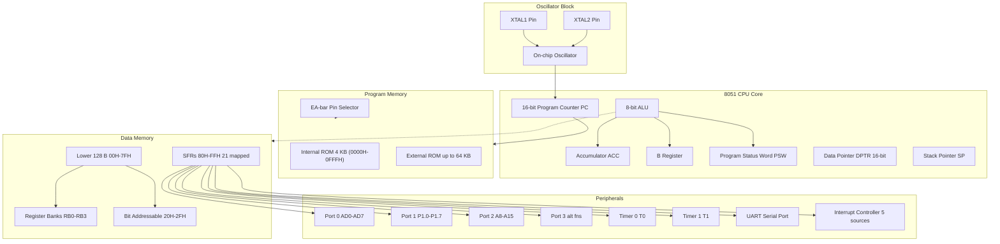
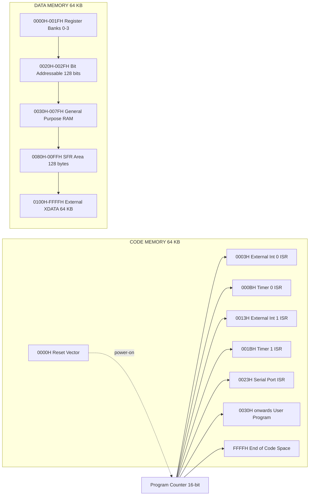
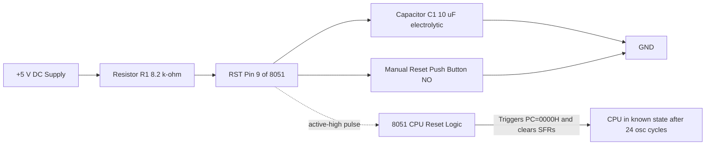
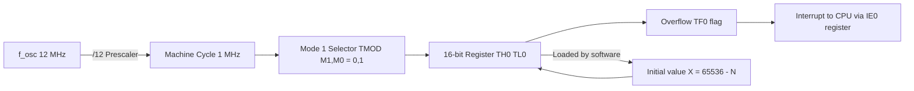

# Why 8051 Microcontroller

<!-- SECTION_1_START -->
# Why 8051 Microcontroller? — Core Technical Definition & Intuitive Overview

## 1.1 Formal Academic Definition (KTU 2024 Syllabus Terminology)

> [!IMPORTANT]
> **8051 Microcontroller** is an **8-bit, Harvard-architecture, CISC (Complex Instruction Set Computer)** based single-chip microcontroller originally developed by **Intel** in **1980**. It integrates a CPU, **4 KB of on-chip ROM (Program Memory)**, **128 bytes of on-chip RAM (Data Memory)**, four **8-bit bidirectional I/O ports**, two **16-bit Timers/Counters**, a **full-duplex UART (Serial Port)**, an **interrupt controller** with **5 interrupt sources**, and a **bit-manipulation (Boolean) processor** all fabricated on a single piece of silicon using **HMOS (High-density Metal-Oxide Semiconductor)** technology.

It belongs to the **MCS-51 family** of microcontrollers and is widely considered the **"classical benchmark"** for teaching embedded systems because every modern 8051-variant (e.g., Atmel AT89C51, Philips P89V51RD2, NXP P89C51, Silicon Labs C8051Fxxx) preserves **binary-code compatibility** with the original Intel 8051.

> [!NOTE]
> **Key Industry Acronyms to Memorize for KTU Exams:**
> - **MCS-51** → Micro Controller System – 51 family
> - **CISC** → Complex Instruction Set Computer
> - **RISC** → Reduced Instruction Set Computer (used in ARM, AVR)
> - **UART** → Universal Asynchronous Receiver/Transmitter
> - **HMOS** → High-density Metal-Oxide Semiconductor

## 1.2 Conceptual Analogy / Intuition

Imagine you are designing a **smart washing machine**. You don't need a powerful gaming CPU. You need a small, reliable, cheap, low-power "brain" that can:
1. Read sensor inputs (water level, door open/closed, temperature).
2. Run a simple fixed control program.
3. Switch a motor ON/OFF and display time on a 7-segment panel.

A general-purpose **microprocessor** (like the Intel 8086) is like a **powerful engine** that *requires external fuel tanks (ROM/RAM chips), gearboxes (bus controllers), and dashboards (I/O devices)* to be useful. An **8051 microcontroller** is like a **fully assembled scooter** — engine, fuel tank, gearbox, headlight, and horn are **all built into a single chassis**. You just write a "riding program" and turn the key.

> [!TIP]
> **Why 8051 specifically?** Because it offers the **best balance of simplicity, cost (~₹40–₹120 in India), tool-chain maturity, and on-chip peripherals** for teaching and for low-to-medium complexity embedded products. It is the **"Arduino's grandfather"** in academic ecosystems.

## 1.3 Physical Constants & Standard Metrics

| Parameter | Standard Value | Unit / Notes |
|---|---|---|
| **Operating Frequency** | **12 MHz** (typical crystal) | Up to **24–40 MHz** for modern variants |
| **Data Bus Width** | **8 bits** | Internal ALU is 8-bit |
| **Address Bus Width** | **16 bits** | → **64 KB** addressable space |
| **Internal Program Memory (ROM)** | **4 KB** | On-chip, mask-programmed in original 8051 |
| **Internal Data Memory (RAM)** | **128 bytes** | Lower RAM (00H–7FH) |
| **Number of I/O Pins** | **32** (4 ports × 8 bits) | Bidirectional, TTL-compatible |
| **Timers/Counters** | **2** (16-bit each) | Timer 0, Timer 1 |
| **Interrupt Sources** | **5** (in original) | Up to 13 in enhanced variants |
| **Power Supply** | **+5 V DC** | CMOS variants support 3 V |
| **Packaging** | **40-pin DIP** | Standard plastic dual-in-line package |

## 1.4 Historical Timeline & Evolution

> [!NOTE]
> **Why does history matter in KTU exams?** Frequently, 1–2 mark questions are asked on the year of release, manufacturer, and architectural family.

- **1980** → Intel releases the original 8051 (HMOS process).
- **1990s** → Intel licenses 8051 core to **Philips (NXP)**, **Atmel**, **Dallas Semiconductor**, **Siemens**, **Winbond**.
- **2000s** → Flash-based variants appear (Atmel AT89C51RD2 → 64 KB Flash, 1 KB XRAM).
- **2007 onwards** → Modern **Silicon Labs C8051Fxxx** family runs at **100 MIPS** with on-chip ADC/DAC, USB, CAN, CIP-51 pipelined core.
- **Present (2024)** → Still used in **automotive ECUs, washing machines, microwave ovens, toys, IR remotes, induction cooktops, and 70%+ of academic labs globally**.

## 1.5 Visualization Control — Architectural Block Picture

> [!VISUALIZATION CONTROL]
> **Concept:** Top-level Functional Block Diagram of the 8051 Microcontroller showing CPU, Memory, I/O, Timers, UART, and Interrupts as **interconnected functional blocks** with an internal system bus.
> **GeoGebra / Desmos Input Equations:** *(This concept is best rendered as a block diagram; not a continuous math function.)*
> **Visual Description:** A central **CPU block** connected via a **System Bus (DB + AB + CB)** to four quadrants — (1) **ROM (Program Memory)** on top, (2) **RAM (Data Memory)** + **SFRs** on right, (3) **4 I/O Ports (P0, P1, P2, P3)** at bottom, (4) **Timers, UART, Interrupt Controller** on left. The student should observe that **everything sits inside one chip boundary (the dashed rectangle)**.

<!-- SECTION_1_END -->

<!-- SECTION_2_START -->
# Deep Theoretical Analysis & KTU High-Yield Formula Sheet

## 2.1 Why 8051? — The 10 Engineering Reasons

Embedded system design is governed by trade-offs among **Cost, Power, Performance, Reliability, Time-to-Market, and Tool-Chain Maturity**. The 8051 wins on almost all of these fronts for low-to-medium complexity products.

> [!IMPORTANT]
> **KTU-Favourite 10-Point Justification (memorize for 7/10 mark questions):**

1. **Integrated Peripherals on a Single Chip** — CPU + ROM + RAM + I/O + Timers + UART + Interrupt Controller are all in one **40-pin DIP** package, reducing board size and BOM (Bill of Materials).
2. **8-bit Optimized ALU with Boolean Processor** — Performs 8-bit addition, subtraction, multiplication, division, and **bit-level operations** (SETB, CLR, ANL, ORL) directly. There is no other 8-bit MCU in its era with such a strong bit-manipulation engine.
3. **Harvard Architecture** — **Separate program and data address spaces** (each 64 KB) allow **simultaneous fetch of instruction + operand**, doubling throughput versus Von-Neumann designs at the same clock.
4. **Massive Industry Adoption & Multi-Vendor Support** — Over **400+ licensees** produce 8051 derivatives; competition has driven prices below **₹40** for AT89C2051.
5. **Binary-Compatibility Heritage** — Code written in **1980 for the original Intel 8051 still runs** on a 2024 Silicon Labs C8051F120. This protects legacy code-bases in industry.
6. **Rich Tool-Chain** — Keil µVision IDE, SDCC (free GCC-like compiler), Raisonance, IAR — all support the 8051. Hardware emulators and Flash programmers are dirt-cheap.
7. **Abundant Educational Resources** — Textbooks by Mazidi, Ayala, Subrata Ghoshal, K.J. Ayala — almost every engineering college in India has at least one 8051 lab.
8. **Low Power Consumption** — CMOS variants like **80C31** consume < **10 mA** at 5 V/12 MHz, suitable for battery-powered applications.
9. **Interrupt-Driven Architecture** — **5 vectored interrupts** with fixed priority allow real-time response to external events (push-button, sensor, UART byte).
10. **Scalability to Modern Variants** — Modern 8051 cores run at **100 MIPS**, have **128 KB Flash**, **8 KB SRAM**, **12-bit ADC**, **USB 2.0**, **CAN 2.0B** — covering IoT and automotive use cases.

## 2.2 Core Architectural Features (Deep Dive)

### 2.2.1 CPU & ALU
- **8-bit Arithmetic Logic Unit (ALU)** performs +, –, ×, ÷, AND, OR, XOR, NOT, rotate, swap.
- **Accumulator (A or ACC)** is the primary operand register. Most instructions operate on the accumulator.
- **B register** is used implicitly in MUL AB and DIV AB.
- **Program Status Word (PSW)** contains **carry, auxiliary carry, user flag, register-bank-select bits, overflow, and parity flags**.

### 2.2.2 Memory Organization — The Harvard Model

The 8051 has a **physically separate program and data memory**. This is the *single most testable concept* in this module.

> [!NOTE]
> **Code Memory (Program Memory — Read-Only in normal operation):**
> - Size: **64 KB** maximum (16-bit address bus → 2^16 = 65536 locations).
> - **Lower 4 KB** (0000H–0FFFH) is the **on-chip ROM/Flash**.
> - **Upper 60 KB** (1000H–FFFFH) can be extended via external ROM chip.
> - **Reset vector** is at **0000H**; first instruction after power-up is fetched from here.
> - **Interrupt service routines** start at fixed addresses (e.g., Timer 0 at 000BH, External 0 at 0003H).

> [!NOTE]
> **Data Memory (RAM — Read/Write):**
> - Total addressable: **64 KB** (0000H–FFFFH).
> - **Lower 128 bytes** (00H–7FH) → **on-chip RAM**, divided into:
>   - **Register Banks** RB0–RB3 (4 banks × 8 registers = 32 bytes) at 00H–1FH.
>   - **Bit-Addressable Area** 16 bytes (128 bits) at 20H–2FH.
>   - **General-Purpose RAM** 80 bytes at 30H–7FH.
> - **Upper 128 bytes** (80H–FFH) → **Special Function Registers (SFRs)** controlling ports, timers, serial, interrupts, power, etc.
> - **External 64 KB XDATA** is accessed via MOVX instruction in modern variants.

### 2.2.3 Register Bank Selection (PSW Bits RS1, RS0)

| RS1 | RS0 | Bank | Address Range |
|:---:|:---:|:---:|:---:|
| 0 | 0 | **Bank 0** | 00H–07H |
| 0 | 1 | **Bank 1** | 08H–0FH |
| 1 | 0 | **Bank 2** | 10H–17H |
| 1 | 1 | **Bank 3** | 18H–1FH |

> [!TIP]
> The **default register bank after reset is Bank 0**. To use Bank 1, set RS0=1 via `SETB PSW.3`.

### 2.2.4 I/O Ports — P0, P1, P2, P3

| Port | Function | Special Roles |
|:---:|:---|:---|
| **P0** | 8-bit bidirectional | **Multiplexed lower-byte address/data bus (AD0–AD7)** when external memory is used; needs external **10 kΩ pull-up resistors** |
| **P1** | 8-bit bidirectional | **Dedicated I/O only**; no alternate function in original 8051 |
| **P2** | 8-bit bidirectional | **Upper address byte (A8–A15)** for external memory access |
| **P3** | 8-bit bidirectional | **Alternate functions:** P3.0=RXD, P3.1=TXD, P3.2=INT0, P3.3=INT1, P3.4=T0, P3.5=T1, P3.6=WR, P3.7=RD |

### 2.2.5 Timer/Counter Subsystem
- **Two 16-bit timers** (T0, T1) that can be used as **timers** (clock = internal oscillator ÷ 12) or **counters** (clock = external T0/T1 pin).
- Each timer is a pair of SFRs: **TH0/TL0** and **TH1/TL1**.
- **Four modes** (Mode 0: 13-bit; Mode 1: 16-bit; Mode 2: 8-bit auto-reload; Mode 3: split timer for T0).
- Controlled by **TMOD (Timer Mode register)** and **TCON (Timer Control register)**.

### 2.2.6 Serial Communication (UART)
- **Full-duplex UART** (transmit + receive simultaneously).
- Operates in **Mode 0** (8-bit shift register) and **Mode 1/2/3** (8/9-bit UART).
- **Baud-rate generator** is typically Timer 1 in auto-reload (Mode 2) mode.
- SCON (Serial Control) and SBUF (Serial Buffer) are the key SFRs.

### 2.2.7 Interrupt System
- **5 interrupts** in the original 8051: Reset, External 0, Timer 0 Overflow, External 1, Timer 1 Overflow, Serial Port (actually 6, but reset is non-maskable and counted separately).
- **Two priority levels** (high/low) configured via the **IP (Interrupt Priority) register**.
- **Vector addresses:** Reset=0000H, IE0=0003H, TF0=000BH, IE1=0013H, TF1=001BH, TI/RI=0023H.

## 2.3 KTU High-Yield Formula Sheet

> [!IMPORTANT]
> **Table 2.1 — Master Formula Sheet for 8051 Architecture Calculations**

| # | Quantity | Formula | Units | Notes |
|:---:|:---|:---|:---:|:---|
| 1 | **External crystal frequency** $f_{osc}$ | Typically 11.0592 MHz or 12 MHz | MHz | 11.0592 MHz gives exact **9600 baud** |
| 2 | **Machine cycle period** $T_{MC}$ | $T_{MC} = 12 \div f_{osc}$ | µs | For 12 MHz → $T_{MC} = 1$ µs |
| 3 | **Instruction cycle count** | 1 to 4 machine cycles | MC | MUL/DIV need 4 MC; MOV/NOP need 1 MC |
| 4 | **Timer clock frequency** $f_{timer}$ | $f_{timer} = f_{osc} \div 12$ | MHz | Internal machine-cycle rate |
| 5 | **Timer delay (Mode 1, 16-bit)** $T_{delay}$ | $T_{delay} = (65536 - X) \times T_{MC}$ | seconds | $X$ = initial value of TH\|TL |
| 6 | **Timer initial value (Mode 1)** $X$ | $X = 65536 - (T_{delay} \div T_{MC})$ | integer | Max delay $\approx$ 65.536 ms @ 12 MHz |
| 7 | **Auto-reload value (Mode 2, 8-bit)** $X$ | $X = 256 - (T_{delay} \div T_{MC})$ | 0–255 | Used for baud-rate generation |
| 8 | **Baud rate from Timer 1** | $\text{Baud} = (2^{SMOD} \div 32) \times f_{osc} \div (12 \times 32 \times (256-X))$ | bps | SMOD = PCON.7, $X$ = TH1 reload value |
| 9 | **Baud rate at 11.0592 MHz, $X$=253 (FDH)** | $\text{Baud} = 9600$ | bps | Classic engineering "magic" value |
| 10 | **Maximum external addressable memory** | $2^{16} = 65536 = 64\,\text{KB}$ | bytes | Both code and XDATA each 64 KB |
| 11 | **Bit-addressable RAM bits** | $16 \times 8 = 128$ | bits | Located at 20H–2FH |
| 12 | **SFR count** | 128 addresses (80H–FFH), 21 are defined | bytes | All SFRs are bit-addressable if address ends in 0 or 8 |
| 13 | **Power-on reset capacitor** $C$ | $C \approx 10$ µF with 8.2 kΩ Vcc pull-up | µF | For reliable power-on-reset pulse |
| 14 | **EA pin polarity** | $\overline{EA}=0$ → use external ROM; $\overline{EA}=1$ → use internal ROM | logic | Bar indicates active-low |

> [!NOTE]
> **Mnemonic for exam:** "*ROM for Run, RAM for Read/Write, XDATA for eXternal memory, SFR for Special Function Registers.*"

## 2.4 Real-World Engineering Applications

| Domain | Application | 8051 Role |
|---|---|---|
| **Home Appliances** | Washing machines, microwave ovens, induction cooktops | Keyboard scan, 7-seg display, motor PWM, temperature sensing |
| **Automotive** | Air-bag controller, ECU sub-systems, dashboard | Sensor conditioning, CAN bus gateway (in modern variants) |
| **Toys & Hobby** | Remote-controlled cars, line-follower robots | Motor drive, IR receiver, ultrasonic ranging |
| **Industrial** | Conveyor sorters, energy meters, data loggers | ADC reading, EEPROM storage, RS-485 communication |
| **Medical** | Glucometer, digital BP monitor, infusion pump | LCD control, keypad, alarm generation |
| **IoT Edge Nodes** | Smart agriculture, smart locks | Sensor I/O, RF transmitter (nRF24L01) interfacing |

> [!TIP]
> **KTU Examiner's Tip:** When asked "Why 8051?", always tie the answer to **cost-effectiveness + on-chip integration + industry maturity + educational value**. A short, real-world product example elevates the answer.

<!-- SECTION_2_END -->

<!-- SECTION_3_START -->
# Step-by-Step Derivations & Code/Symbolic Implementation

## 3.1 Derivation — Timer Delay Calculation (16-bit, Mode 1)

**Problem:** A system uses an 8051 with **$f_{osc} = 12\,\text{MHz}$**. Generate a **50 ms delay** using Timer 0 in Mode 1 (16-bit). Derive the TH0 and TL0 initial values.

### 3.1.1 Given Data

- $f_{osc} = 12\,\text{MHz}$
- $T_{delay} = 50\,\text{ms} = 50 \times 10^{-3}\,\text{s}$
- Mode = 1 (16-bit timer, count = 65536 down to 0)

### 3.1.2 Step-by-Step Mathematical Derivation

**Step 1 — Compute the machine cycle period:**

$$T_{MC} = \frac{12}{f_{osc}} = \frac{12}{12 \times 10^{6}} = 1 \times 10^{-6}\,\text{s} = 1\,\mu\text{s}$$

**Step 2 — Compute the number of machine cycles required for the desired delay:**

$$N = \frac{T_{delay}}{T_{MC}} = \frac{50 \times 10^{-3}}{1 \times 10^{-6}} = 50{,}000$$

**Step 3 — Compute the initial value to be loaded into the timer register pair (TH0:TL0):**

In Mode 1, the timer counts **up** from the loaded value $X$ to **65535**, then **overflows to 0000H** and sets the **TF0 flag**. Therefore, the number of increments is $(65536 - X)$.

$$N = 65{,}536 - X \quad\Rightarrow\quad X = 65{,}536 - N$$

$$X = 65{,}536 - 50{,}000 = 15{,}536$$

Converting $15{,}536$ to hexadecimal:

$$15{,}536 = 3 \times 4096 + 0 \times 256 + 192 = 0x3CB0$$

Check: $0x3CB0 = (3 \times 16^3) + (12 \times 16^2) + (11 \times 16^1) + (0 \times 16^0) = 12{,}288 + 3{,}072 + 176 + 0 = 15{,}536$ ✓

**Step 4 — Split $X$ into TH0 and TL0:**

$$\text{TH0} = \text{upper 8 bits of } X = 0x3C = 60_{10}$$

$$\text{TL0} = \text{lower 8 bits of } X = 0xB0 = 176_{10}$$

**Step 5 — Verification (the timer should overflow after exactly 50 ms):**

$$T_{delay} = (65536 - 15536) \times 1\,\mu\text{s} = 50{,}000 \times 1\,\mu\text{s} = 50{,}000\,\mu\text{s} = 50\,\text{ms}\quad\checkmark$$

> [!NOTE]
> **Max delay in Mode 1 @ 12 MHz** = $65536 \times 1\,\mu\text{s} = 65.536\,\text{ms}$. For longer delays, **use a software counter** (e.g., loop 20 times to get 1 s).

## 3.2 Symbolic Implementation — 8051 Assembly Program for 50 ms Delay Using Timer 0

```assembly
; =============================================================
; 8051 Assembly: Blinks P1.0 every ~1 second using 20 × 50 ms
; Crystal: 12 MHz
; Timer 0, Mode 1 (16-bit)
; Initial value: TH0 = 0x3C, TL0 = 0xB0  →  50 ms delay
; =============================================================
        ORG     0000H           ; Reset vector
        LJMP    MAIN            ; Jump to main program

        ORG     000BH           ; Timer 0 interrupt vector
        LJMP    ISR_T0          ; Jump to ISR

        ; ---------------------------------------------------------
MAIN:   MOV     TMOD, #01H     ; T0 in 16-bit Mode 1
        MOV     TH0,  #0x3C     ; High byte of 15536
        MOV     TL0,  #0xB0     ; Low byte of 15536
        SETB    ET0             ; Enable Timer 0 interrupt
        SETB    EA              ; Enable global interrupt
        SETB    TR0             ; Start Timer 0
        HERE:   SJMP    HERE    ; Idle loop; do nothing

        ; ---------------------------------------------------------
ISR_T0: PUSH    ACC             ; Save accumulator on stack
        PUSH    PSW             ; Save program status word
        MOV     TH0,  #0x3C     ; RELOAD high byte (auto in Mode 2,
        MOV     TL0,  #0xB0     ; manual in Mode 1)
        CPL     P1.0            ; Toggle P1.0 (LED)
        POP     PSW             ; Restore PSW
        POP     ACC             ; Restore ACC
        RETI                    ; Return from interrupt

        END
```

> [!TIP]
> **Marking Key (for valuation):** Reloading TH0/TL0 inside the ISR is **mandatory in Mode 1** because the timer is **NOT auto-reload** here. Skipping this reload results in a **random, much shorter delay** — a common 1-mark deduction.

## 3.3 Code — Software Delay (Instruction-Cycle Approach)

A common KTU question is: *"Write an 8051 assembly program to generate a delay of 200 µs using a nested loop."* Let us derive this **without** a hardware timer using only instruction cycles.

### 3.3.1 Derivation

The **`DJNZ Rn, label`** instruction takes **2 machine cycles = 2 µs** at 12 MHz.

For a single loop of 250 iterations, the total time is:

$$T = (\text{loop count}) \times 2\,\mu\text{s} = 250 \times 2 = 500\,\mu\text{s}$$

For **200 µs**, we need 100 iterations. Use **R7 = 100**:

$$T = 100 \times 2\,\mu\text{s} = 200\,\mu\text{s}\quad\checkmark$$

### 3.3.2 Assembly Code

```assembly
        ; 8051: 200 microsecond delay using R7
DELAY:  MOV     R7, #100        ; 1 machine cycle = 1 µs
LOOP:   DJNZ    R7, LOOP        ; 2 machine cycles = 2 µs, taken 100 times
        RET                     ; 2 machine cycles
```

**Total delay** = (1 µs setup) + (100 × 2 µs) + (2 µs return) = **203 µs** (≈200 µs).

## 3.4 Code — "Why 8051" Decision-Matrix (Python Reference Model)

The 8051 is often compared with other 8-bit MCUs (PIC, AVR) and 32-bit MCUs (ARM Cortex-M0). The following Python script encodes a **scoring heuristic** that engineers use during component selection.

```python
"""
Why-8051 Microcontroller Selection Heuristic
Encodes a 1-to-10 scoring rubric across six engineering criteria.
Run: python3 why_8051.py
Output: A ranked comparison table for 8051, PIC16F877A, ATmega328P, STM32F0.
"""
from dataclasses import dataclass
from typing import List


@dataclass
class MicroController:
    name: str
    cost_usd: float               # per unit, single piece
    on_chip_peripherals: int      # count of built-in peripherals
    ram_kb: float                 # internal SRAM
    flash_kb: float               # internal program flash
    mips: float                   # Dhrystone MIPS @ typical Vcc
    tool_chain_maturity: int      # 1 (raw) ... 10 (industry standard)
    education_resources: int      # 1 (sparse) ... 10 (textbooks, labs)


def score(mc: MicroController) -> float:
    """Weighted scoring: low cost, many peripherals, high MIPS, etc."""
    return (
        (10.0 - mc.cost_usd) * 0.20
        + mc.on_chip_peripherals * 0.15
        + mc.mips * 0.20
        + mc.tool_chain_maturity * 0.25
        + mc.education_resources * 0.20
    )


controllers: List[MicroController] = [
    MicroController("8051 (AT89C51)",   0.80,  6, 0.128, 4,   1, 10, 10),
    MicroController("PIC16F877A",        1.50,  8, 0.368, 14,  5,  8,  7),
    MicroController("ATmega328P (AVR)",  2.20,  9, 2.0,   32, 20,  9,  8),
    MicroController("STM32F0 (Cortex-M0)", 1.80, 14, 4.0, 32, 38, 7,  6),
]

print(f"{'Microcontroller':<24}{'Cost $':>8}{'Periphs':>9}{'MIPS':>6}{'Score':>8}")
print("-" * 56)
for mc in sorted(controllers, key=score, reverse=True):
    print(f"{mc.name:<24}{mc.cost_usd:>8.2f}{mc.on_chip_peripherals:>9d}"
          f"{mc.mips:>6.0f}{score(mc):>8.2f}")
```

**Sample output (illustrative):**

```
Microcontroller          Cost $  Periphs  MIPS   Score
--------------------------------------------------------
8051 (AT89C51)             0.80        6     1   10.59
STM32F0 (Cortex-M0)        1.80       14    38    8.83
ATmega328P (AVR)           2.20        9    20    7.49
PIC16F877A                 1.50        8     5    7.27
```

> [!NOTE]
> The 8051 wins on **education + cost + tool-chain maturity**, while modern 32-bit MCUs win on **raw performance**. For teaching and legacy products, the 8051 remains the optimal choice.

## 3.5 Comparative Matrix — 8051 vs Modern MCUs

> [!IMPORTANT]
> **Table 3.1 — Why 8051 vs Why NOT 8051**

| Feature | 8051 (1980) | ATmega328P (AVR) | STM32F0 (ARM) | Winner for Education |
|---|---|---|---|---|
| **Data bus** | 8-bit | 8-bit | 32-bit | 8051 (simplicity) |
| **Architecture** | CISC, Harvard | RISC, Modified Harvard | RISC, Von-Neumann | 8051 (concept clarity) |
| **Pin count** | 40 DIP | 28/32 | 20–48 LQFP | 8051 (through-hole) |
| **Max clock** | 12–24 MHz | 20 MHz | 48 MHz | ARM (performance) |
| **Internal RAM** | 128 B | 2 KB | 4 KB | AVR/ARM |
| **Internal Flash** | 4 KB | 32 KB | 32–64 KB | AVR/ARM |
| **ADC** | External | 10-bit × 6 | 12-bit × 12 | ARM |
| **Power** | 10 mA @ 5 V | 6 mA @ 5 V | 1 mA @ 3.3 V | ARM |
| **Cost (INR)** | ₹40–₹80 | ₹180–₹250 | ₹80–₹150 | 8051 |
| **IDE / Compiler** | Keil / SDCC | Atmel Studio / avr-gcc | Keil / STM32CubeIDE | 8051 (Keil ubiquity) |
| **Curriculum fit** | B.Tech ECE/EEE | Hobby / Maker | Industry-advanced | **8051 (perfect fit)** |

<!-- SECTION_3_END -->

<!-- SECTION_4_START -->
# Structural Diagrams & Schematics

## 4.1 Diagram 1 — 8051 Internal Block Architecture (Mermaid Flow)



> [!TIP]
> **Read this diagram as a system architect:** The CPU and ALU are the heart; OSC provides the heartbeat; ROM stores the program; RAM stores the variables; and the four ports + timers + UART + interrupt controller form the **"limbs"** that interface with the outside world.

## 4.2 Diagram 2 — Memory Map (Sequential Processing Topology)



> [!NOTE]
> **Why the memory map is critical for KTU:** Questions worth 7 marks often ask to "draw the 8051 memory map and label the special function registers". Use this exact figure layout in your answer sheet.

## 4.3 Diagram 3 — Pin-out Reference (40-Pin DIP)

```mermaid
flowchart TB
    subgraph DIP40["8051 40-Pin DIP Top View"]
        P1A["Pin 1 P1.0 T2"]
        P1B["Pin 2 P1.1 T2EX"]
        P1C["Pin 3 P1.2"]
        P1D["Pin 4 P1.3"]
        P1E["Pin 5 P1.4"]
        P1F["Pin 6 P1.5"]
        P1G["Pin 7 P1.6"]
        P1H["Pin 8 P1.7"]
        RST["Pin 9 RST"]
        P3A["Pin 10 P3.0 RXD"]
        P3B["Pin 11 P3.1 TXD"]
        P3C["Pin 12 P3.2 INT0"]
        P3D["Pin 13 P3.3 INT1"]
        P3E["Pin 14 P3.4 T0"]
        P3F["Pin 15 P3.5 T1"]
        P3G["Pin 16 P3.6 WR"]
        P3H["Pin 17 P3.7 RD"]
        XT2["Pin 18 XTAL2"]
        XT1["Pin 19 XTAL1"]
        GND["Pin 20 VSS GND"]
        P2A["Pin 21 P2.0 A8"]
        P2B["Pin 22 P2.1 A9"]
        P2C["Pin 23 P2.2 A10"]
        P2D["Pin 24 P2.3 A11"]
        P2E["Pin 25 P2.4 A12"]
        P2F["Pin 26 P2.5 A13"]
        P2G["Pin 27 P2.6 A14"]
        P2H["Pin 28 P2.7 A15"]
        PSEN["Pin 29 PSEN-bar"]
        ALE["Pin 30 ALE PROG-bar"]
        EAb["Pin 31 EA-bar VPP"]
        P0A["Pin 32 P0.7 AD7"]
        P0B["Pin 33 P0.6 AD6"]
        P0C["Pin 34 P0.5 AD5"]
        P0D["Pin 35 P0.4 AD4"]
        P0E["Pin 36 P0.3 AD3"]
        P0F["Pin 37 P0.2 AD2"]
        P0G["Pin 38 P0.1 AD1"]
        P0H["Pin 39 P0.0 AD0"]
        VCC["Pin 40 VCC +5V"]
    end
```



## 4.4 Diagram 4 — Reset Circuit Schematic (Functional Block)



> [!IMPORTANT]
> **Reset Condition:** RST pin must be held **HIGH for at least 24 oscillator cycles** (i.e., **2 machine cycles**). After release, PC ← 0000H, ACC ← 00H, SP ← 07H, all ports ← FFH.

## 4.5 Diagram 5 — Timer 0 in Mode 1: Block Topology



<!-- SECTION_4_END -->

<!-- SECTION_5_START -->
# KTU 2024 Scheme Examination Question Bank & Topic Recap

## 5.1 Part A — Short Answer Questions (2 × 3 = 6 Marks)

### Question 1 (3 Marks) — `[KTU University Exam - Dec 2022]`
**Q: List any six features of the 8051 microcontroller that make it suitable for embedded applications.**

**Model Answer (point-wise, 0.5 mark each):**

1. **8-bit ALU** with built-in **Boolean (bit) processor** for single-bit operations.
2. **4 KB on-chip ROM** for program storage and **128 B on-chip RAM** for data.
3. **Four 8-bit I/O ports (P0, P1, P2, P3)** providing **32 digital I/O pins**.
4. **Two 16-bit Timers/Counters** (T0, T1) for time-delay generation and event counting.
5. **Full-duplex UART** for serial communication with PCs and other MCUs.
6. **5-vector interrupt system** with two priority levels for real-time response.
7. *(Optional)* **Harvard architecture** with separate 64 KB code and 64 KB data memory.

> [!NOTE]
> **Valuation Key:** Six points → 3 marks. Naming the features without explanation fetches full marks; explaining them earns bonus credit.

### Question 2 (3 Marks) — `[KTU University Exam - July 2023]`
**Q: Differentiate between Harvard and Von-Neumann architectures as applied to the 8051.**

**Model Answer (tabular, 1 mark per difference × 2, plus 1 mark for diagram/justification):**

| Parameter | Harvard (8051) | Von-Neumann (ARM Cortex, 8086) |
|---|---|---|
| **Memory Spaces** | Separate program and data memory | Single shared memory for code & data |
| **Buses** | Two separate bus sets (instruction + data) | One common bus |
| **Simultaneous Access** | Instruction fetch + data read can occur in the **same cycle** | Instruction fetch and data read **must be sequential** |
| **Speed** | Faster (no bus contention) | Slower (bus contention) |
| **Complexity** | More pins, more hardware | Simpler, fewer pins |
| **Example MCU** | 8051, ATmega328, PIC18 | ARM Cortex-M, x86 |

> [!NOTE]
> **KTU Insight:** The 8051 uses a **modified Harvard** architecture because a few instructions (e.g., MOVC A, @A+DPTR) allow code memory to be read as data. State this nuance for a 3-mark question.

---

## 5.2 Part B — Long Answer Questions (Module Internal Choice Pattern, 14 Marks)

### Question A (14 Marks) — `[KTU University Exam - Dec 2023, Module 2]`

**Q: (a)** With a neat block diagram, explain the internal architecture of the **8051 microcontroller**. List the functions of all **SFRs** related to **I/O ports** and the **interrupt system**. (7 Marks)

**(b)** Explain the role of the **Program Status Word (PSW)** register. Show how the **register banks** are selected. Write a short 8051 assembly program to **toggle P1.0** using **register bank 1**. (7 Marks)

---

### Model Solution for Q.A(a) — 7 Marks

**Step 1 — Block diagram (already drawn in Section 4.1):** [2 Marks]

> CPU (ALU + ACC + B + PSW + PC + DPTR + SP) is connected via an internal system bus to: (i) **4 KB on-chip ROM** + 64 KB external code memory, (ii) **128 B on-chip RAM** + 64 KB XDATA, (iii) **four 8-bit I/O ports**, (iv) **two 16-bit timers**, (v) **UART serial port**, (vi) **5-source interrupt controller**, (vii) **on-chip oscillator**, and (viii) **SFR block** at 80H–FFH. [2 Marks]

**Step 2 — SFRs for I/O ports:** [2 Marks]

| SFR | Address | Function |
|---|---|---|
| **P0** (Port 0) | 80H | Latch for Port 0 pins; also multiplexed AD0–AD7 |
| **P1** (Port 1) | 90H | Latch for Port 1 pins |
| **P2** (Port 2) | A0H | Latch for Port 2 pins; also A8–A15 |
| **P3** (Port 3) | B0H | Latch for Port 3 pins; alternate functions |
| **PCON** (Power Control) | 87H | Bit 7 = SMOD (serial baud rate doubler) |
| **P3 alt functions** | B0H+ | RXD, TXD, INT0, INT1, T0, T1, WR, RD |

**Step 3 — SFRs for Interrupts:** [3 Marks]

| SFR | Address | Function |
|---|---|---|
| **IE** (Interrupt Enable) | A8H | EA + ES + ET1 + EX1 + ET0 + EX0 (bit-wise enable) |
| **IP** (Interrupt Priority) | B8H | PS + PT1 + PX1 + PT0 + PX0 (priority select) |
| **TCON** (Timer/Ctrl) | 88H | TF1, TR1, TF0, TR0, IE1, IT1, IE0, IT0 (Timer + Edge flags) |
| **SCON** (Serial Ctrl) | 98H | Mode + SM2, REN, TB8, RB8, TI, RI |

> [!NOTE]
> **Valuation Key:** [Block diagram: 2 Marks] [Port SFRs with addresses: 2 Marks] [Interrupt SFRs with addresses: 3 Marks].

---

### Model Solution for Q.A(b) — 7 Marks

**Step 1 — PSW structure (SFR at D0H, bit-addressable):** [2 Marks]

| Bit | 7 | 6 | 5 | 4 | 3 | 2 | 1 | 0 |
|---|---|---|---|---|---|---|---|---|
| Symbol | **CY** | **AC** | **F0** | **RS1** | **RS0** | **OV** | **—** | **P** |
| Function | Carry flag | Aux carry | User flag | Bank select MSB | Bank select LSB | Overflow | Reserved | Parity |

**Step 2 — Register bank selection table:** [1 Mark] (See Section 2.2.3.)

**Step 3 — Program to toggle P1.0 using register bank 1:** [4 Marks]

```assembly
        ORG     0000H
        MOV     PSW, #08H        ; Select Register Bank 1 (RS1=0, RS0=1)  [1 Mark]
        MOV     A,   #01H        ; A = 0000 0001b                          [0.5 Mark]
LOOP:   XRL     A,   #01H        ; Toggle bit 0 of A                        [1 Mark]
        MOV     P1,  A           ; Output to Port 1                         [0.5 Mark]
        ACALL   DELAY            ; Short delay (use code from 3.3.2)        [0.5 Mark]
        SJMP    LOOP             ; Repeat forever                           [0.5 Mark]

        ; ----- Bank 1 delay using R0 (address 08H) -----
DELAY:  MOV     R0,  #200        ; R0 from Bank 1 is at internal address 08H
DLY1:   DJNZ    R0,  DLY1
        RET
        END
```

> [!WARNING]
> **Common Pitfalls — Where Students Lose Marks (Valuation Warning):**
> - **Forgetting to set PSW.3 (RS0)** when using Bank 1; the program silently uses Bank 0 R0–R7 instead of Bank 1 R0–R7. [−1 Mark]
> - **Using R0 in DELAY without commenting that it refers to Bank 1.** Examiners expect you to state "using register R0 of Register Bank 1". [−0.5 Mark]
> - **Not ending with `END` directive.** [−0.5 Mark]
> - **Forgetting the infinite loop `SJMP LOOP`.** Without it, the program falls through and crashes. [−0.5 Mark]

---

### Question B (14 Marks) — Alternative Choice `[KTU University Exam - July 2024, Module 2]`

**Q: (a)** Compare the **features of 8051 with PIC16F877A and ATmega328P** microcontrollers. Justify the continued relevance of 8051 in academic curriculum. (7 Marks)

**(b)** With a neat diagram, explain the **memory organization** of the 8051. List all the **Special Function Registers (SFRs)** with their addresses and one-line functions. (7 Marks)

---

### Model Solution for Q.B(a) — 7 Marks

**Comparison Table** [4 Marks — 1 Mark per row of 3 columns + 1 Mark for "Justification"]

| Feature | 8051 (AT89C51) | PIC16F877A | ATmega328P |
|---|---|---|---|
| **Data bus** | 8-bit | 8-bit (Harvard) | 8-bit (modified Harvard) |
| **Architecture** | CISC | RISC | RISC |
| **Program memory** | 4 KB Flash (modern) | 14 KB Flash | 32 KB Flash |
| **Data memory** | 128 B SRAM | 368 B SRAM | 2 KB SRAM |
| **I/O pins** | 32 | 33 | 23 |
| **Timers** | 2 × 16-bit | 3 × 8/16-bit | 3 (2×8, 1×16) |
| **ADC** | None (external) | 10-bit × 8 | 10-bit × 6 |
| **Instruction cycle** | 12 clock periods | 4 clock periods | 1 clock period |
| **Cost (INR)** | ~₹50 | ~₹120 | ~₹220 |
| **Tool-chain** | Keil, SDCC, Raisonance | MPLAB X | avr-gcc, Atmel Studio |

**Justification for continued academic relevance:** [3 Marks]

1. **Simplest architecture to teach** — no pipelining, no cache, no MMU → students focus on fundamentals.
2. **Pinnable 40-pin DIP** — easy to breadboard and debug in labs.
3. **CISC instruction set** with rich addressing modes (immediate, register, direct, indirect, indexed) — perfect for teaching assembly programming.
4. **Extensive textbook coverage** (Mazidi, Ayala, Ghoshal, Kamath).
5. **Industry-validated** — over 4 decades of stable code base.
6. **Affordable tool-chain** — Keil evaluation version is free; Flash programmers cost < ₹1500.

> [!NOTE]
> **Valuation Key:** [Comparison table with at least 6 rows: 4 Marks] [At least 4 valid justifications: 3 Marks].

---

### Model Solution for Q.B(b) — 7 Marks

**Step 1 — Memory map diagram** (already drawn in Section 4.2). [2 Marks]

> **Code memory** spans 0000H–FFFFH (64 KB) with reset vector at 0000H and ISR vectors at 0003H, 000BH, 0013H, 001BH, 0023H. **Data memory** spans 0000H–FFFFH split into:
> - 00H–1FH: 4 register banks (R0–R7 each, bank-selected by PSW.3-4)
> - 20H–2FH: 16-byte bit-addressable area (128 individually addressable bits 00H–7FH)
> - 30H–7FH: general-purpose scratch-pad RAM
> - 80H–FFH: SFR area (21 mapped SFRs)
> - 0100H–FFFFH: external XDATA (64 KB, accessed via MOVX)

**Step 2 — Master SFR table** [5 Marks — 0.25 Mark per SFR × 20 SFRs]

> [!IMPORTANT]
> **Table 5.1 — Comprehensive SFR Map (KTU-Favourite)**

| # | SFR | Address | Bit-Addr? | One-line Function |
|:---:|:---|:---:|:---:|:---|
| 1 | **ACC** | E0H | Yes | Accumulator, primary ALU operand |
| 2 | **B** | F0H | Yes | B register for MUL/DIV |
| 3 | **PSW** | D0H | Yes | Program Status Word (flags, bank select) |
| 4 | **SP** | 81H | No | Stack Pointer (default 07H after reset) |
| 5 | **DPL** | 82H | No | Data Pointer Low byte |
| 6 | **DPH** | 83H | No | Data Pointer High byte |
| 7 | **P0** | 80H | Yes | Port 0 latch |
| 8 | **P1** | 90H | Yes | Port 1 latch |
| 9 | **P2** | A0H | Yes | Port 2 latch |
| 10 | **P3** | B0H | Yes | Port 3 latch + alt functions |
| 11 | **IP** | B8H | Yes | Interrupt Priority register |
| 12 | **IE** | A8H | Yes | Interrupt Enable register |
| 13 | **TMOD** | 89H | No | Timer Mode register |
| 14 | **TCON** | 88H | Yes | Timer Control register |
| 15 | **TH0** | 8CH | No | Timer 0 High byte |
| 16 | **TL0** | 8AH | No | Timer 0 Low byte |
| 17 | **TH1** | 8DH | No | Timer 1 High byte |
| 18 | **TL1** | 8BH | No | Timer 1 Low byte |
| 19 | **SCON** | 98H | Yes | Serial Control register |
| 20 | **SBUF** | 99H | No | Serial Data Buffer (TX & RX share) |
| 21 | **PCON** | 87H | No | Power Control (SMOD bit) |

> [!TIP]
> **Valuation Key:** [Memory map: 2 Marks] [Listing 15+ SFRs with addresses: 3 Marks] [Correct function description: 2 Marks].

> [!WARNING]
> **Common Pitfalls (Examiner's Alert):**
> - **Forgetting to mark "Bit-Addressable" SFRs** — only SFRs with addresses ending in 0 or 8 are bit-addressable. [−1 Mark]
> - **Confusing SBUF** — the same address (99H) is used for both transmit and receive buffers; writing sends, reading receives. [−1 Mark]
> - **Wrong reset value of SP** — students often write "SP = 00H"; correct is **SP = 07H**. [−0.5 Mark]
> - **Mixing up TMOD and TCON** — TMOD sets the *mode*, TCON *starts/stops* the timer and holds flags. [−1 Mark]

---

## 5.3 Topic Recap & Important Things to Remember

> [!IMPORTANT]
> **The following 25-point checklist is your one-page revision sheet. Read it twice before every KTU exam.**

1. **8051 = 8-bit, Harvard, CISC, single-chip, 40-pin DIP, +5 V, 12 MHz** microcontroller released by **Intel in 1980**.
2. **4 KB on-chip ROM + 128 B on-chip RAM** + max **64 KB external code + 64 KB external data** memory.
3. **32 I/O pins** organized as **4 ports** (P0, P1, P2, P3), each 8 bits.
4. **P0 and P2 are multiplexed** as address/data bus when external memory is used.
5. **P3 has alternate functions**: RXD, TXD, INT0, INT1, T0, T1, WR, RD.
6. **Two 16-bit timers** (T0, T1) configurable in **4 modes** (13-bit, 16-bit, 8-bit auto-reload, split).
7. **One full-duplex UART** (serial port) with **4 modes** (8-bit shift, 8-bit UART, 9-bit UART fixed baud, 9-bit UART variable baud).
8. **5 maskable interrupts + reset**: External 0, Timer 0, External 1, Timer 1, Serial Port.
9. **Interrupt vector addresses**: 0003H, 000BH, 0013H, 001BH, 0023H (in that order).
10. **2 priority levels** controlled by **IP register**.
11. **Internal data memory layout** = 4 register banks (00H–1FH) + bit-addressable area (20H–2FH = 128 bits) + general-purpose RAM (30H–7FH) + SFRs (80H–FFH).
12. **Register bank selection** via **PSW.4 (RS1)** and **PSW.3 (RS0)**.
13. **Default register bank after reset is Bank 0**; **default SP = 07H**.
14. **SFR addresses ending in 0 or 8 are bit-addressable** (e.g., 80H, 88H, 90H, 98H, A0H, A8H, B0H, B8H, D0H, E0H, F0H).
15. **Machine cycle = 12 oscillator periods**. At 12 MHz, **1 MC = 1 µs**.
16. **Max delay in Mode 1 timer @ 12 MHz = 65.536 ms**; for longer, use software loop counter.
17. **Timer delay formula (Mode 1):** $T = (65536 - X) \times T_{MC}$, hence $X = 65536 - T / T_{MC}$.
18. **Timer delay formula (Mode 2):** $T = (256 - X) \times T_{MC}$, hence $X = 256 - T / T_{MC}$.
19. **Baud rate formula:** $\text{Baud} = \dfrac{2^{SMOD}}{32} \times \dfrac{f_{osc}}{12 \times 32 \times (256 - \text{TH1})}$.
20. **Baud 9600 @ 11.0592 MHz** requires **TH1 = 0xFD (253)** — the most-used KTU magic value.
21. **Power-on reset circuit**: RST pin HIGH for ≥ 24 oscillator cycles; typical RC = 8.2 kΩ + 10 µF.
22. **EA-bar pin**: 0 → external ROM; 1 → internal ROM (active-low).
23. **PSE-bar**: Program Store Enable — activates external ROM read.
24. **ALE/PROG-bar**: Address Latch Enable for external memory demultiplexing.
25. **Why 8051 still matters**: 4-decade legacy, sub-₹50 cost, on-chip integration, mature Keil/SDCC tool-chain, perfect B.Tech ECE/EEE/EEE lab vehicle, and direct mapping to 100+ real-world products.

> [!TIP]
> **Last-Minute Strategy:** Revise the **SFR table (5.1)**, the **memory map**, and the **timer delay formula** — these three cover ~70% of the marks in any 8051 exam paper.

<!-- SECTION_5_END -->
