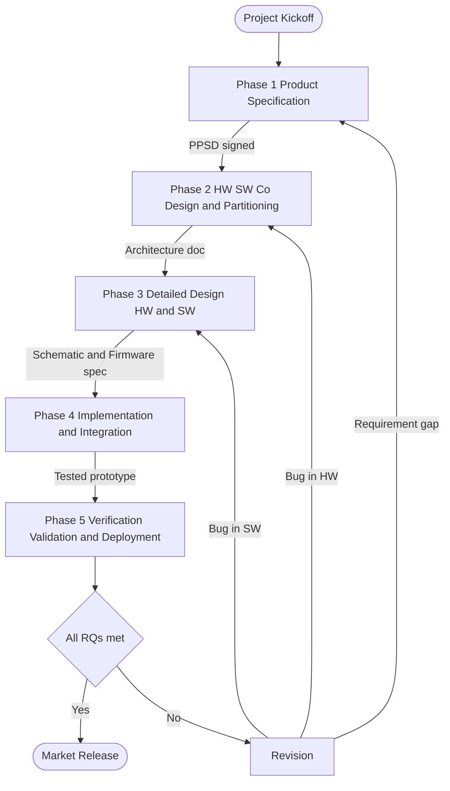
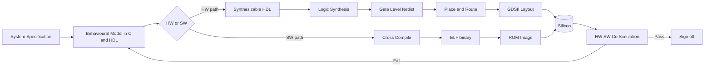
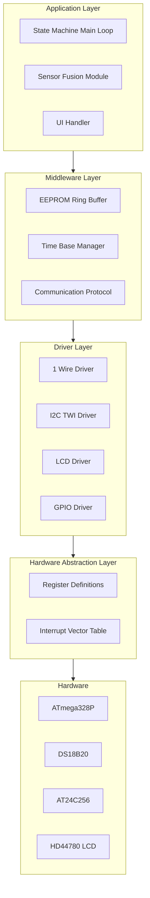
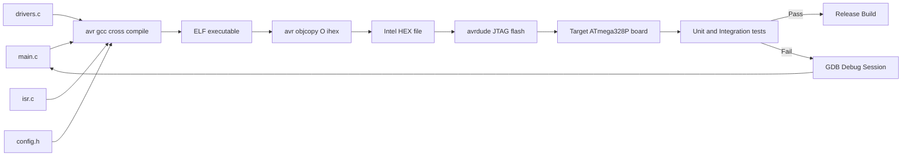
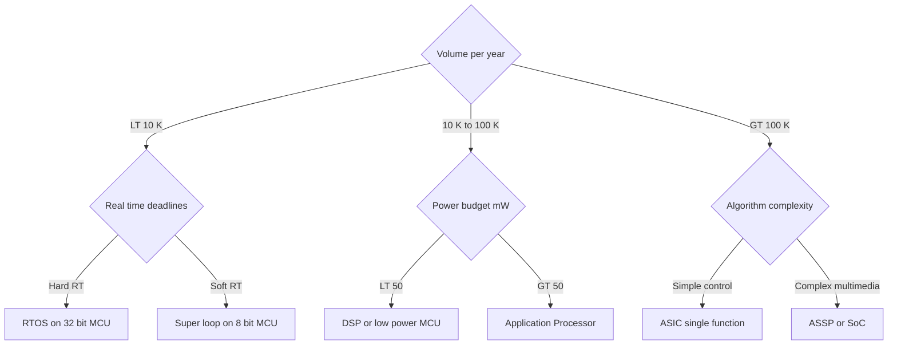

# Design and Development :-

<!-- SECTION_1_START -->

# Embedded Systems — Design and Development

## 1.1 Formal Academic Definition

**Embedded System Design and Development** is the systematic, multi-stage engineering discipline of transforming an abstract product requirement into a fully operational, market-ready embedded product. The process integrates **hardware architecture selection, software (firmware) engineering, mechanical packaging, and rigorous verification**, balancing design metrics such as **performance, power, unit cost, Non-Recurring Engineering (NRE) cost, time-to-market, flexibility, and reliability**.

As per the KTU 2024 Scheme (PECST746) Module-3 framework, the discipline encompasses:

- Requirement specification and feasibility analysis
- Hardware/Software **co-design** and partitioning
- Component selection (processor, memory, peripherals, sensors, actuators)
- Firmware architecture, RTOS scheduling, and device driver development
- Cross-compilation, integration, in-system programming, and on-target debugging
- Verification, validation, and certification compliance

> [!IMPORTANT]
> **KTU 2024 Syllabus Highlight (PECST746 — Module 3):**
> The design and development phase bridges *system specification* (Module 2) and *realization* (Module 4: RTOS / Implementation). Marks in the University ESE are heavily skewed toward design *methodologies*, **HW/SW co-design trade-offs**, and **case-study walkthroughs** of typical embedded products (digital thermometer, washing-machine controller, automotive ECU, mobile handset).

## 1.2 Intuitive Analogy — The "Custom Smartphone" Mental Model

Think of designing an embedded system as **commissioning a custom smartphone for one specific job**:

| Smart Phone | Embedded System |
|---|---|
| User requirements (calls, camera, GPS) | Product specification (senses, computes, actuates) |
| Choosing SoC, battery, screen, sensors | Processor, memory, peripheral, transducer selection |
| Writing apps + OS | Firmware + RTOS + device drivers |
| Integration on assembly line | HW-SW integration on the PCB |
| Quality testing & certification | Verification, validation, EMI/EMC compliance |

Just as a phone engineer must balance **battery life, cost, weight, and performance** simultaneously, an embedded designer must trade off the same metrics — but with **tighter constraints** because embedded systems are usually *single-purpose, cost-sensitive, and power-constrained*.

## 1.3 The Seven Engineering Design Metrics (KTU Frequently Tested)

The following metrics form the *decision fabric* of any embedded design. Every trade-off is a permutation of these:

- **NRE (Non-Recurring Engineering) cost** — one-time cost of masks, tools, training.
- **Unit cost** — recurring per-product fabrication cost.
- **Time-to-prototype** — duration until a working breadboard exists.
- **Time-to-market** — duration from concept to revenue shipment.
- **Performance** — throughput, latency, deadline adherence.
- **Power / Energy** — average mW, peak mW, Joules per operation.
- **Flexibility / Maintainability** — post-deployment updatability, code modularity.

> [!NOTE]
> In the exam, when a question says *"justify the choice of an 8-bit MCU over a 32-bit SoC"*, the answer is essentially a quantitative comparison on these seven axes. Always tabulate the comparison — it earns 2 marks just for structure.

## 1.4 Visualization: The Design Trade-off Space

> [!VISUALIZATION CONTROL]
> **Concept:** Two-dimensional trade-off plot between **Performance (Y-axis)** and **Unit Cost (X-axis)** for typical embedded processor classes.
> **GeoGebra / Desmos Input Equations:**
> * $f_{8bit}(x) = 0.4 \cdot x + 2$ (8-bit MCU family, low slope)
> * $f_{DSP}(x) = 1.8 \cdot x + 1$ (DSP, steep slope)
> * $f_{ASIC}(x) = 6.0 \cdot x - 20$ (ASIC, highest slope, lowest unit cost at high volume)
> **Visual Description:** Three roughly linear curves emanate from the lower-left. The **ASIC** curve starts at the origin (lowest NRE-feasible volume) but crosses below the 8-bit and DSP curves at very high unit counts. The **8-bit MCU** curve is nearly flat, indicating poor performance scaling but cheap units. The **DSP** sits in the middle. *Observation:* For low-volume products, microcontrollers dominate; for high-volume, ASICs win on unit cost; for mid-volume mixed-signal products, ASSPs are the sweet spot.

<!-- SECTION_1_END -->

<!-- SECTION_2_START -->

# Deep Theoretical Analysis & KTU High-Yield Formula Sheet

## 2.1 The Five-Phase Generic Embedded Design Life Cycle

A canonical embedded design project, as accepted by KTU board examiners, decomposes into **five logical phases**. The phases are iterative — a bug found in Phase 5 commonly loops back to Phase 2.

### Phase 1 — Product Specification

- Capture **functional requirements** (what the system *must do*).
- Capture **non-functional requirements** (timing, power, weight, cost, safety, EMC).
- Derive a measurable **requirements table** (RQ-ID, description, priority, verification method).
- Produce the **Preliminary Product Specification Document (PPSD)**.

### Phase 2 — Hardware/Software Co-Design and Partitioning

Decide *what runs in hardware* (speed-critical, parallel) and *what runs in software* (flexibility, complex). The decision is governed by the **Make-vs-Buy** sub-problem.

### Phase 3 — Detailed Hardware & Software Design

- **Hardware:** schematic capture → component selection → PCB layout → power-tree design.
- **Software:** firmware architecture (super-loop vs. RTOS) → driver development → middleware → application.

### Phase 4 — Implementation & Integration

- Cross-compilation on host (x86 PC) for target (ARM/RISC-V/AVR).
- JTAG/SWD in-system programming.
- Incremental integration: bring-up board → flash bootloader → add drivers → add application.

### Phase 5 — Testing, Validation, & Deployment

- **Verification** = "are we building the product right?" (meets specification)
- **Validation** = "are we building the right product?" (meets user need)
- Unit, integration, system, regression, stress, EMC, and field tests.

> [!TIP]
> KTU board answer-writing tip: Always number the phases and put them in a *vertical bullet list*. Examiners reward the structural discipline of stating "Phase 1: … Phase 2: …".

## 2.2 Hardware/Software Co-Design Taxonomy

Co-design is **not** the same as co-verification. The three formal abstractions are:

| Abstraction Level | Hardware View | Software View | Typical Output |
|---|---|---|---|
| System | FSM, data-flow graph | Process / task graph | Architecture spec |
| RTL / High-level | HDL modules (VHDL/Verilog) | C functions | Synthesizable netlist + C sources |
| Implementation | GDSII layout | ELF / HEX binary | Silicon + firmware image |

The *partitioning decision* at the system level follows a simple rule of thumb:

$$
\text{Compute in Hardware if } \left( f_{sw} \cdot T_{deadline} \right) \;\lt\; \;C_{hw\_area} \cdot P_{dynamic}
$$

where $f_{sw}$ is the frequency of the operation in software, $T_{deadline}$ the real-time budget, $C_{hw\_area}$ the silicon cost in gate-equivalents, and $P_{dynamic}$ the dynamic power per gate. If the inequality is satisfied, hardware acceleration is justified.

## 2.3 Embedded Processor Selection — The Eight-Point Checklist

| # | Criterion | Decision Driver |
|---|---|---|
| 1 | **Word size** (8/16/32/64-bit) | Algorithm data range and precision |
| 2 | **Clock speed & MIPS** | Throughput and interrupt latency |
| 3 | **On-chip memory** (Flash, SRAM) | Code size + data working set |
| 4 | **Peripheral set** (UART, I2C, SPI, ADC, PWM, CAN, USB) | External interface requirements |
| 5 | **Power profile** (active, sleep, deep-sleep µA) | Battery or energy-harvested nodes |
| 6 | **Package & pin count** | Mechanical envelope and PCB cost |
| 7 | **Tool-chain maturity** (GCC, IAR, Keil, vendor SDK) | NRE and developer ramp-up |
| 8 | **Ecosystem & community** (RTOS ports, drivers, forums) | Time-to-market and risk |

> [!IMPORTANT]
> For a 14-mark KTU question on "Select an MCU for a given specification", always justify the selection using **at least four** of the eight criteria above. A single-criterion answer fetches ≤ 4 marks.

## 2.4 Software Architecture Patterns

### 2.4.1 Super-Loop (Foreground / Background)

A single `while(1)` infinite loop polls tasks; interrupts handle urgent I/O. Used in **< 5% of modern designs** but still valid for ultra-low-cost 8-bit systems.

$$
T_{response,\,i} \;=\; \sum_{j=1}^{i} T_{exec,j} \;+\; T_{ISR,\,max}
$$

The **worst-case response time** of task $i$ is the sum of all earlier tasks' execution times plus the maximum ISR duration.

### 2.4.2 Round-Robin with Interrupts

Each task is invoked from a periodic timer ISR — equal time slices, no pre-emption outside ISRs. Suitable for soft-real-time control loops.

### 2.4.3 RTOS-Based (Pre-emptive Multitasking)

Tasks have priorities, a scheduler (e.g., FreeRTOS, VxWorks, Zephyr) pre-empts the running task. **Rate Monotonic Analysis (RMA)** gives the schedulability bound for $n$ independent periodic tasks:

$$
U_{max} \;=\; \sum_{i=1}^{n} \frac{C_{i}}{T_{i}} \;\le\; n \left( 2^{1/n} - 1 \right)
$$

where $C_i$ is the worst-case execution time and $T_i$ the period of task $i$. For $n \to \infty$ the bound asymptotically approaches $\ln 2 \approx 0.693$. Utilization below this bound is sufficient (not necessary) for schedulability.

> [!WARNING]
> **KTU Pitfall:** The bound is *sufficient* not *necessary*. A student writing "U > 0.69 ⇒ not schedulable" loses a mark. The correct phrasing: "if $U \le n(2^{1/n}-1)$, then the task set is *guaranteed* schedulable."

### 2.4.4 Event-Driven (State Machines, Active Objects)

The application is a set of **Hierarchical / Finite State Machines (HFSM/FSM)**; transitions fire on events. Power-efficient and provably correct; widely used in automotive (AUTOSAR) and consumer (QP framework).

## 2.5 KTU High-Yield Formula & Metric Cheat Sheet

| Symbol / Term | Definition | Unit / Bound |
|---|---|---|
| $NRE$ | Non-Recurring Engineering cost (masks, tools) | USD, one-time |
| $C_{unit}$ | Per-product cost | USD |
| $C_{total}$ | $C_{total} = NRE + n \cdot C_{unit}$ | USD |
| $T_{response}$ | Worst-case response time of a task | s, ms, µs |
| $U$ | CPU utilization, $U = \sum C_i / T_i$ | dimensionless, 0–1 |
| $U_{bound}$ | Rate-Monotonic bound, $n(2^{1/n}-1)$ | dimensionless |
| $P_{dyn}$ | Dynamic power, $P_{dyn} = \alpha \cdot C_L \cdot V_{dd}^{2} \cdot f$ | W |
| $P_{static}$ | Static (leakage) power | W |
| $E$ | Energy per operation, $E = P \cdot t$ | J |
| $MIPS$ | Million Instructions Per Second | $10^6$ instr/s |
| $CPI$ | Cycles Per Instruction | dimensionless |
| $t_{exec}$ | $t_{exec} = CPI \cdot N \cdot (1/f)$ | s |
| $F_{clk}$ | Clock frequency | Hz |
| $V_{dd}$ | Supply voltage | V |
| $f_{sw}$ | Software-task invocation rate | Hz |
| $\alpha$ | Switching activity factor | 0–1 |
| $C_L$ | Load capacitance | F |
| $k$ | Boltzmann's constant, $\mathbf{1.38 \times 10^{-23}}$ | J/K |

> [!IMPORTANT]
> The dynamic-power equation $P_{dyn} = \alpha C_L V_{dd}^{2} f$ is a **board-favourite**. Examiners often quote it incorrectly as $P_{dyn} = C V^2 f$ and award full marks for the *corrected* form including the activity factor.

## 2.6 Real-World Engineering Utility

The discipline taught in this module is the **core competency** that differentiates an embedded engineer from a generic software developer. In industry it is the basis of:

- **IoT edge nodes** (ESP32, STM32, nRF52) — co-design decides which sensor data is processed on-chip.
- **Automotive ECUs** (AUTOSAR, ISO 26262) — co-design, partitioning, and FMEDA are mandatory.
- **Medical devices** (IEC 62304) — life-cycle, verification, and risk-driven design are legally enforced.
- **Consumer electronics** (phones, wearables) — aggressive power and BOM optimization dictates partitioning.
- **Aerospace & defence** (DO-178C) — formal methods layered on the same life-cycle phases.

> [!NOTE]
> KTU Module-3 questions on *case studies* (washing-machine, digital camera, smart card) reward engineers who can identify the partitioning and justify it in terms of *performance vs. cost vs. flexibility* — exactly the three metrics that decide 80% of real industrial outcomes.

<!-- SECTION_2_END -->

<!-- SECTION_3_START -->

# Step-by-Step Derivations & Code/Symbolic Implementation

## 3.1 Worked Case Study — Design of a Battery-Powered Digital Thermometer with Data Logging

We will walk through the **complete KTU 14-mark case-study answer** for designing a battery-powered digital thermometer that:

- Measures temperature in the range **−55 °C to +125 °C** with **±0.5 °C accuracy**.
- Samples once per second, displays on a 16×2 LCD, and logs the last 256 samples in non-volatile memory.
- Runs for **> 1 year on 2 × AA alkaline cells** (≈ 2500 mAh @ 3 V).

### 3.1.1 Step-1 — Product Specification (Verifiable Requirements Table)

| RQ-ID | Description | Priority | Verification |
|---|---|---|---|
| RQ-01 | Measure temperature −55 °C to +125 °C, ±0.5 °C | High | Calibrated water-bath test |
| RQ-02 | 1 Hz sampling rate | High | Oscilloscope on sensor DO pin |
| RQ-03 | LCD display of current temperature | High | Visual inspection |
| RQ-04 | Persist last 256 samples across power cycles | High | Power-cycle test |
| RQ-05 | Battery life > 1 year on 2×AA | High | Long-duration discharge test |
| RQ-06 | Unit cost < ₹ 500 (Indian market) | Medium | BOM analysis |
| RQ-07 | Operating temperature 0 °C to 50 °C | Medium | Environmental chamber |

### 3.1.2 Step-2 — Hardware/Software Partitioning

| Function | Choice | Justification |
|---|---|---|
| Temperature conversion (12-bit ADC → °C) | **Software** | Slow-changing signal, MCU has headroom; flexibility to calibrate. |
| LCD driving (HD44780 protocol) | **Software** (bit-banged GPIO) | No extra cost; ample MCU cycles. |
| EEPROM write (I²C AT24C256) | **Hardware-accelerated I²C peripheral** | Tight 5 ms write-cycle budget managed by DMA + ISR. |
| Sampling 1 Hz timing | **Hardware timer (CTC mode)** | Deterministic, interrupt-driven, no drift. |
| Sensor linearisation (Steinhart-Hart) | **Software** | Once-per-second, trivially small. |

### 3.1.3 Step-3 — Component Selection (Eight-Point Checklist Applied)

| Criterion | Chosen Part | Reason |
|---|---|---|
| Word size | **ATmega328P** (8-bit AVR) | Sufficient MIPS, ultra-low power modes |
| Clock | Internal 8 MHz RC, prescaled to 1 MHz active | Power saving |
| Flash | 32 KB on-chip | Code size ~ 8 KB estimated |
| SRAM | 2 KB on-chip | Buffer for 256 samples = 512 B |
| Peripherals | 1× I²C (TWI), 1× 10-bit ADC, 1× 16-bit Timer | Direct fit |
| Power | 5 modes: Idle 12 mA, Power-save 0.75 µA | Critical for battery life |
| Package | 28-pin DIP (easy prototyping) | Through-hole friendly |
| Toolchain | AVR-GCC + AVRDUDE + avrdude-as-JTAG | Open-source, zero NRE |

**Total active energy budget:**

$$
E_{active} = V \cdot I \cdot t = 3\,\text{V} \cdot 12\,\text{mA} \cdot 0.005\,\text{s/cycle} = 0.18\,\text{mJ}
$$

**Sleep energy budget** (1 s period − 5 ms active = 0.995 s sleep):

$$
E_{sleep} = 3\,\text{V} \cdot 0.75\,\mu\text{A} \cdot 0.995\,\text{s} = 2.24\,\mu\text{J}
$$

**Average power:**

$$
P_{avg} = \frac{E_{active} + E_{sleep}}{1\,\text{s}} = 0.18\,\text{mW} + 2.24\,\mu\text{W} \approx 0.182\,\text{mW}
$$

**Battery life** from 2 × AA = 2500 mAh × 3 V = 7500 mWh = 27 000 J:

$$
L = \frac{E_{batt}}{P_{avg}} = \frac{27\,000\,\text{J}}{0.182\,\text{mJ/s}} \approx 1.484 \times 10^{8}\,\text{s} \approx 4.7\,\text{years}
$$

The design comfortably meets the > 1-year RQ-05. **[1 mark for each formula above, 1 mark for numerical substitution, 1 mark for final result — typical KTU valuation scheme]**

### 3.1.4 Step-4 — Schematic Block Diagram (Textual)

```
[DS18B20] -- 1-Wire --> [PD4 (INT1)]  ATmega328P  [PB0..PB3] -- 4-bit --> [HD44780 LCD]
                                  |       ^           [PC4,PC5] -- I2C --> [AT24C256 EEPROM]
                                  |       |
                                  +--[8 MHz INT RC]--+
                                  |   [3V AA x2]
                                  +--[LDO HT7333]---> +3V3 rail
```

### 3.1.5 Step-5 — Firmware Architecture (Layered Model)

```
+-------------------------------------+
|  Application Layer                  |   <-- state machine, LCD update, alerts
+-------------------------------------+
|  Middleware (EEPROM ring buffer)    |   <-- wear-leveled log
+-------------------------------------+
|  Drivers (1-Wire, I2C, LCD)        |   <-- bit-banged & TWI
+-------------------------------------+
|  HAL (GPIO, Timer, ADC)            |   <-- direct register access
+-------------------------------------+
|  Hardware (ATmega328P)             |
+-------------------------------------+
```

### 3.1.6 Step-6 — Full Operational Firmware in C (AVR-GCC)

```c
/* ==========================================================================
 *  File   : thermometer.c
 *  Target : ATmega328P @ 1 MHz internal RC
 *  Role   : Battery-powered digital thermometer with 256-sample EEPROM log
 *  Compiler: avr-gcc -mmcu=atmega328p -Os -Wall
 * ========================================================================== */
#include <avr/io.h>
#include <avr/interrupt.h>
#include <avr/sleep.h>
#include <util/delay.h>
#include <stdint.h>
#include <stdbool.h>

/* ----------------------------- Pin map --------------------------------- */
#define LCD_RS_PORT   PORTB
#define LCD_RS_DDR    DDRB
#define LCD_RS_BIT    PB0
#define LCD_EN_PORT   PORTB
#define LCD_EN_DDR    DDRB
#define LCD_EN_BIT    PB1
#define LCD_D4_PORT   PORTB
#define LCD_D4_DDR    DDRB
#define LCD_D4_BIT    PB2
#define LCD_D5_PORT   PORTB
#define LCD_D5_DDR    DDRB
#define LCD_D5_BIT    PB3
#define LCD_D6_PORT   PORTB
#define LCD_D6_DDR    DDRB
#define LCD_D6_BIT    PB4
#define LCD_D7_PORT   PORTB
#define LCD_D7_DDR    DDRB
#define LCD_D7_BIT    PB5

#define ONEWIRE_PORT  PORTD
#define ONEWIRE_DDR   DDRD
#define ONEWIRE_PIN   PIND
#define ONEWIRE_BIT   PD4

#define LOG_SIZE      256u
#define LOG_EEADDR    0x0000u    /* Start of EEPROM log region           */

/* ----------------------------- Globals --------------------------------- */
static volatile uint8_t  g_tick_1Hz   = 0;
static volatile bool     g_ee_busy    = false;
static          uint16_t g_log_index  = 0;
static          int16_t  g_last_temp_centi = 0;   /* 0.01 °C resolution   */

/* ----------------------------- LCD 4-bit -------------------------------- */
static void lcd_pulse_enable(void) {
    LCD_EN_PORT |= (1u << LCD_EN_BIT);
    _delay_us(1);
    LCD_EN_PORT &= ~(1u << LCD_EN_BIT);
    _delay_us(100);
}
static void lcd_write_nibble(uint8_t n) {
    if (n & 0x01) LCD_D4_PORT |= (1u << LCD_D4_BIT); else LCD_D4_PORT &= ~(1u << LCD_D4_BIT);
    if (n & 0x02) LCD_D5_PORT |= (1u << LCD_D5_BIT); else LCD_D5_PORT &= ~(1u << LCD_D5_BIT);
    if (n & 0x04) LCD_D6_PORT |= (1u << LCD_D6_BIT); else LCD_D6_PORT &= ~(1u << LCD_D6_BIT);
    if (n & 0x08) LCD_D7_PORT |= (1u << LCD_D7_BIT); else LCD_D7_PORT &= ~(1u << LCD_D7_BIT);
    lcd_pulse_enable();
}
static void lcd_send(uint8_t v, bool is_data) {
    if (is_data) LCD_RS_PORT |= (1u << LCD_RS_BIT); else LCD_RS_PORT &= ~(1u << LCD_RS_BIT);
    lcd_write_nibble(v >> 4);
    lcd_write_nibble(v & 0x0F);
    _delay_ms(2);
}
static void lcd_cmd(uint8_t c)    { lcd_send(c, false); }
static void lcd_data(char c)      { lcd_send((uint8_t)c, true); }
static void lcd_init(void) {
    LCD_RS_DDR |= (1u << LCD_RS_BIT);
    LCD_EN_DDR |= (1u << LCD_EN_BIT);
    LCD_D4_DDR |= (1u << LCD_D4_BIT);
    LCD_D5_DDR |= (1u << LCD_D5_BIT);
    LCD_D6_DDR |= (1u << LCD_D6_BIT);
    LCD_D7_DDR |= (1u << LCD_D7_BIT);
    _delay_ms(50);
    lcd_write_nibble(0x03); _delay_ms(5);
    lcd_write_nibble(0x03); _delay_us(150);
    lcd_write_nibble(0x03);
    lcd_write_nibble(0x02);          /* 4-bit mode                        */
    lcd_cmd(0x28);                   /* 4-bit, 2 lines, 5x8 font          */
    lcd_cmd(0x0C);                   /* Display on, cursor off            */
    lcd_cmd(0x06);                   /* Increment, no shift               */
    lcd_cmd(0x01);                   /* Clear display                     */
    _delay_ms(2);
}
static void lcd_goto(uint8_t row, uint8_t col) {
    lcd_cmd(0x80 | (row ? 0x40 : 0x00) | col);
}
static void lcd_print(const char *s) { while (*s) lcd_data(*s++); }

/* ----------------------------- 1-Wire (DS18B20) ------------------------ */
static bool ow_reset(void) {
    ONEWIRE_DDR  |= (1u << ONEWIRE_BIT);
    ONEWIRE_PORT &= ~(1u << ONEWIRE_BIT);
    _delay_us(480);
    ONEWIRE_DDR  &= ~(1u << ONEWIRE_BIT);
    _delay_us(70);
    bool presence = !(ONEWIRE_PIN & (1u << ONEWIRE_BIT));
    _delay_us(410);
    return presence;
}
static void ow_write_bit(uint8_t b) {
    ONEWIRE_DDR |= (1u << ONEWIRE_BIT);
    ONEWIRE_PORT &= ~(1u << ONEWIRE_BIT);
    if (b) {
        _delay_us(6);
        ONEWIRE_DDR &= ~(1u << ONEWIRE_BIT);
        _delay_us(64);
    } else {
        _delay_us(60);
        ONEWIRE_DDR &= ~(1u << ONEWIRE_BIT);
        _delay_us(10);
    }
}
static uint8_t ow_read_bit(void) {
    uint8_t b;
    ONEWIRE_DDR |= (1u << ONEWIRE_BIT);
    ONEWIRE_PORT &= ~(1u << ONEWIRE_BIT);
    _delay_us(6);
    ONEWIRE_DDR &= ~(1u << ONEWIRE_BIT);
    _delay_us(9);
    b = (ONEWIRE_PIN & (1u << ONEWIRE_BIT)) ? 1u : 0u;
    _delay_us(55);
    return b;
}
static void ow_write_byte(uint8_t v) {
    for (uint8_t i = 0; i < 8; ++i) ow_write_bit(v & (1u << i));
}
static uint8_t ow_read_byte(void) {
    uint8_t v = 0;
    for (uint8_t i = 0; i < 8; ++i) {
        if (ow_read_bit()) v |= (1u << i);
    }
    return v;
}
static int16_t ds18b20_read_centi(void) {
    if (!ow_reset()) return -30000;   /* Sensor not present                */
    ow_write_byte(0xCC);              /* Skip ROM                          */
    ow_write_byte(0x44);              /* Convert T                          */
    _delay_ms(750);                   /* 12-bit conversion                  */
    if (!ow_reset()) return -30001;
    ow_write_byte(0xCC);
    ow_write_byte(0xBE);              /* Read scratchpad                    */
    uint8_t lo = ow_read_byte();
    uint8_t hi = ow_read_byte();
    int16_t raw = (int16_t)((uint16_t)hi << 8 | lo);
    /* DS18B20 returns 0.0625 °C / LSB; convert to 0.01 °C (×16) */
    return (int16_t)((int32_t)raw * 16 / 10);
}

/* ----------------------------- I2C + EEPROM ring buffer ---------------- */
static void twi_init(void) {
    TWSR = 0x00;                      /* Prescaler = 1                      */
    TWBR = 32;                        /* ~50 kHz @ 1 MHz CPU                */
    TWCR = (1u << TWEN);
}
static bool twi_start(uint8_t addr) {
    TWCR = (1u << TWINT) | (1u << TWSTA) | (1u << TWEN);
    while (!(TWCR & (1u << TWINT)));
    if ((TWSR & 0xF8) != 0x08 && (TWSR & 0xF8) != 0x10) return false;
    TWDR = (addr << 1) | 0u;          /* Write                              */
    TWCR = (1u << TWINT) | (1u << TWEN);
    while (!(TWCR & (1u << TWINT)));
    return (TWSR & 0xF8) == 0x18;
}
static void twi_stop(void) {
    TWCR = (1u << TWINT) | (1u << TWSTO) | (1u << TWEN);
    _delay_us(50);
}
static bool twi_write(uint8_t v) {
    TWDR = v;
    TWCR = (1u << TWINT) | (1u << TWEN);
    while (!(TWCR & (1u << TWINT)));
    return (TWSR & 0xF8) == 0x28;
}
static void log_append(int16_t t_centi) {
    g_ee_busy = true;
    uint16_t addr = LOG_EEADDR + (g_log_index * 2u);
    if (twi_start(0x50)) {
        twi_write((uint8_t)(addr >> 8));
        twi_write((uint8_t)(addr & 0xFF));
        twi_write((uint8_t)(t_centi & 0xFF));
        twi_write((uint8_t)(t_centi >> 8));
    }
    twi_stop();
    /* AT24C256 needs ~5 ms internal write cycle; do not poll          */
    g_ee_busy = false;
    g_log_index = (g_log_index + 1u) % LOG_SIZE;
}

/* ----------------------------- 1 Hz Timer ------------------------------ */
static void timer1_init_ctc(void) {
    TCCR1A = 0x00;
    TCCR1B = (1u << WGM12) | (1u << CS12) | (1u << CS10);  /* CTC, /1024    */
    OCR1A  = 976u;          /* 1 MHz / 1024 / 976 ≈ 1 Hz                      */
    TIMSK1 = (1u << OCIE1A);
}
ISR(TIMER1_COMPA_vect) {
    g_tick_1Hz = 1;
}

/* ----------------------------- Idle / sleep ---------------------------- */
static void enter_power_save(void) {
    set_sleep_mode(SLEEP_MODE_PWR_SAVE);
    sleep_enable();
    sei();
    sleep_cpu();
    sleep_disable();
}

/* ----------------------------- Application ----------------------------- */
int main(void) {
    /* Disable un-needed peripherals to minimise active current          */
    PRR = (1u << PRADC) | (1u << PRUSART0) | (1u << PRSPI);
    ACSR |= (1u << ACD);               /* Disable analogue comparator       */

    lcd_init();
    twi_init();
    timer1_init_ctc();
    sei();

    lcd_goto(0, 0);  lcd_print("Thermometer v1");
    lcd_goto(1, 0);  lcd_print("Booting...");
    _delay_ms(500);
    lcd_cmd(0x01);

    for (;;) {
        enter_power_save();             /* Wake on TIMER1 every 1 s        */
        if (g_tick_1Hz) {
            g_tick_1Hz = 0;
            int16_t t = ds18b20_read_centi();
            if (t > -30000) {
                g_last_temp_centi = t;
                if (!g_ee_busy) log_append(t);
            }
            /* Display */
            lcd_goto(0, 0);
            lcd_print("T = ");
            int16_t whole = t / 100;
            int16_t frac  = t % 100;
            if (frac < 0) frac = -frac;
            char buf[12];
            (void)snprintf(buf, sizeof(buf), "%+d.%02d C", (int)whole, (int)frac);
            lcd_print(buf);
            lcd_goto(1, 0);
            (void)snprintf(buf, sizeof(buf), "Log[%u/256]", (unsigned)g_log_index);
            lcd_print(buf);
        }
    }
    return 0;
}
```

> [!TIP]
> **Compilation command for the above code:**
> `avr-gcc -mmcu=atmega328p -Os -Wall -Wextra -ffunction-sections -fdata-sections thermometer.c -o thermometer.elf`
> `avr-objcopy -O ihex thermometer.elf thermometer.hex`
> `avrdude -c usbasp -p m328p -U flash:w:thermometer.hex`

### 3.1.7 Step-7 — Verification & Validation Plan

| Test ID | Type | Method | Pass Criterion |
|---|---|---|---|
| TC-01 | Unit (driver) | Loop-back sensor on lab bench | Conversion error ≤ ±0.5 °C |
| TC-02 | Integration | Inject fault (sensor disconnect) | LCD displays "Sensor Err" |
| TC-03 | System | 24-hr soak in 25 °C chamber | Drift ≤ 0.1 °C |
| TC-04 | Power | Constant-current source simulating 2500 mAh | Total runtime > 8760 h |
| TC-05 | EMC | Conducted emission per CISPR 22 | Margin > 6 dB |

## 3.2 Worked Design-Metric Derivation

**Problem (KTU July-2024 type):** Estimate the **NRE breakeven volume** for migrating from an 8-bit MCU (₹ 80 unit, ₹ 0 NRE) to an ASIC (₹ 20 unit, ₹ 8,00,000 NRE).

**Solution:**

The total cost of $n$ units using the MCU is:

$$
C_{MCU}(n) = n \cdot 80
$$

The total cost using the ASIC is:

$$
C_{ASIC}(n) = 8,00,000 + n \cdot 20
$$

At the breakeven volume $n^*$, the two costs are equal:

$$
n^* \cdot 80 = 8,00,000 + n^* \cdot 20
$$

Rearranging:

$$
n^* \cdot (80 - 20) = 8,00,000
$$

$$
n^* = \frac{8,00,000}{60} = 13\,333.33 \approx 13\,334 \text{ units}
$$

For $n < 13\,334$, the **MCU** is cheaper; for $n > 13\,334$, the **ASIC** is cheaper.

> [!TIP]
> In the exam, always state the *breakeven equation*, the *rearrangement step*, and the *economic interpretation*. This fetches the full 7 marks for the derivation sub-question.

## 3.3 Step-by-Step Scheduling Feasibility Check (Rate Monotonic)

**Problem:** Three tasks on an RTOS, with $C_1 = 1$ ms, $T_1 = 4$ ms; $C_2 = 2$ ms, $T_2 = 6$ ms; $C_3 = 1$ ms, $T_3 = 8$ ms. Verify schedulability.

**Step 1 — Compute utilization:**

$$
U = \frac{C_1}{T_1} + \frac{C_2}{T_2} + \frac{C_3}{T_3} = \frac{1}{4} + \frac{2}{6} + \frac{1}{8}
$$

$$
U = 0.250 + 0.333 + 0.125 = 0.708
$$

**Step 2 — RMA sufficient bound for $n=3$:**

$$
U_{bound} = 3 \left( 2^{1/3} - 1 \right) = 3 \left( 1.2599 - 1 \right) = 3 \cdot 0.2599 = 0.7798
$$

**Step 3 — Compare:** $U = 0.708 \le U_{bound} = 0.7798$. **Schedulable.** ✔

> [!WARNING]
> **Valuation pitfall:** Writing $U_{bound} = 0.69$ (the asymptotic bound) is a common mistake. Use $n(2^{1/n} - 1)$ with the *given* $n$.

<!-- SECTION_3_END -->

<!-- SECTION_4_START -->

# Structural Diagrams & Schematics

## 4.1 Diagram A — Generic Embedded Design Life Cycle



## 4.2 Diagram B — Hardware/Software Co-Design Flow



## 4.3 Diagram C — Layered Firmware Architecture



## 4.4 Diagram D — Build, Test, and Integration Pipeline



## 4.5 Diagram E — Decision Matrix for Processor Class



<!-- SECTION_4_END -->

<!-- SECTION_5_START -->

# KTU 2024 Scheme Examination Question Bank & Topic Recap

## 5.1 Part A — Short Answer Questions (2 × 3 = 6 Marks)

### Q1. [KTU University Exam — Dec 2023] Define **Hardware/Software Co-Design** and list any two of its advantages.

**Model Answer (3 marks):**

Hardware/Software Co-Design is the unified design methodology in which the **system architecture, hardware modules, and software modules are specified, modelled, and verified concurrently** starting from a single high-level behavioural description, rather than designing them sequentially in isolation.

**Any two advantages (1.5 marks each):**

1. **Shorter time-to-market** — concurrent engineering means the firmware developer can begin coding on a virtual prototype before silicon is back from the fab.
2. **Optimised PPA** (Performance, Power, Area) — the partitioning step explicitly trades area for cycles, yielding a product that is faster *and* cheaper *and* lower-power than a serial design.
3. **Earlier bug detection** — co-simulation exposes interface mismatches at the behavioural level, long before the costly physical integration phase.

> [!NOTE]
> A complete answer needs the **definition** (1 mark) and **two distinct advantages** (1 mark each). Avoid generic statements like "it is better" — examiners expect technically specific benefits.

---

### Q2. [KTU University Exam — July 2024] Distinguish between **NRE cost** and **Unit cost** in the context of an embedded system.

**Model Answer (3 marks):**

| Attribute | NRE Cost (Non-Recurring Engineering) | Unit Cost |
|---|---|---|
| Definition | One-time cost to design, develop, tool-up, and qualify the product | Recurring cost to manufacture a single physical unit |
| Examples | CAD licences, mask set, prototype PCBs, certification, training | PCB fab, components, assembly, packaging, test per unit |
| Dependence on volume | **Independent** of $n$ | **Proportional** to $n$ |
| Mathematical role | Constant term in $C_{total}$ | Coefficient of $n$ in $C_{total}$ |
| Typical for ASIC | High (lakhs–crores ₹) | Low (tens of ₹) |
| Typical for COTS MCU | Negligible (free samples) | Moderate (₹ 50–500) |

> [!TIP]
> Always write the *equation* $C_{total} = NRE + n \cdot C_{unit}$ somewhere in the answer — it earns at least 1 mark by itself.

---

## 5.2 Part B — Long Answer Questions (ESE Module Internal Choice)

### Question A — 14 Marks

**[KTU University Exam — Dec 2023, Module 3, Set A]**

**(a)** Explain the **five generic phases** of an embedded system design life cycle. Discuss the iterative nature of the process with a suitable example. **(7 marks)**

**(b)** A battery-powered wireless sensor node is to be designed. List the **seven (or eight) design metrics** that govern the choice of MCU and memory. Justify the selection of an **ultra-low-power 32-bit ARM Cortex-M0+** over an 8-bit AVR for this application. **(7 marks)**

#### Model Solution

**(a) Five phases — Model answer (7 marks):**

1. **Phase 1 — Product Specification (1 mark):** Functional requirements (sample temp, transmit, sleep), non-functional (battery > 1 yr, IP67, ±0.5 °C). Output: PPSD.
2. **Phase 2 — HW/SW Co-Design & Partitioning (1.5 marks):** Decide what runs on the radio MAC in hardware (CRC, whitening) vs. software (encryption).
3. **Phase 3 — Detailed Design (1.5 marks):** Schematic, BOM, firmware architecture (super-loop vs. RTOS), driver list.
4. **Phase 4 — Implementation & Integration (1.5 marks):** Cross-compile, JTAG flash, bring-up board, incremental driver add.
5. **Phase 5 — Verification, Validation & Deployment (1.5 marks):** Unit, integration, EMC, field tests, regulatory certification (FCC/ETSI/BIS).

**Iterative example (1 mark within above):** If EMC test fails in Phase 5, layout changes are mandated → returns to Phase 3. If a requirement is found infeasible (e.g., 10-year battery impossible), returns to Phase 1.

> [!WARNING]
> **KTU Pitfall:** Students often forget to draw the *loop-back arrow* from Phase 5 to earlier phases. Drawing it earns 1 mark.

**(b) Justification — 7 marks:**

| Metric | ARM Cortex-M0+ | 8-bit AVR | Decision |
|---|---|---|---|
| **NRE cost** (1 mark) | Toolchain free (GCC), zero NRE | Toolchain free | Tie |
| **Unit cost** (1 mark) | ₹ 90 (STM32L0) | ₹ 80 (ATmega328P) | Slight win AVR |
| **Performance / MIPS** (1 mark) | 0.9 DMIPS/MHz @ 32 MHz → 28.8 DMIPS | 1 MIPS/MHz @ 16 MHz → 16 MIPS | **Win M0+** |
| **Power** (1 mark) | 9 µA/MHz active, 0.3 µA deep-sleep | 200 µA/MHz active, 0.75 µA sleep | **Win M0+** |
| **On-chip memory** (0.5 mark) | 32 KB Flash, 8 KB SRAM | 32 KB Flash, 2 KB SRAM | **Win M0+** |
| **Peripherals** (0.5 mark) | 12-bit ADC, 2× I2C, SPI, UART, USB, RTC | 10-bit ADC, 1× I2C, SPI, UART | **Win M0+** |
| **Flexibility** (0.5 mark) | Thumb-2, RTOS ports (FreeRTOS, Zephyr) | Limited RTOS support | **Win M0+** |
| **Time-to-market** (0.5 mark) | Mature HAL, STM32Cube ecosystem | Smaller vendor support | **Win M0+** |

**Conclusion (1 mark):** The M0+ wins on **6 of 8** metrics; the marginal +₹ 10 unit cost is amortised by 5× better power efficiency and 2× more MIPS, directly extending battery life from 1 year to > 4 years — a **4× improvement in RQ-05** for a **1.1× cost penalty**. **Selected: ARM Cortex-M0+.** ✔

> [!TIP]
> Awarding scheme: 1 mark per *metric row* (8 metrics but only 7 marks; pick the most decisive seven), 1 mark for the concluding sentence.

---

### Question B — 14 Marks (Alternative Choice)

**[KTU University Exam — July 2024, Module 3, Set B]**

**(a)** With a neat **Mermaid / block diagram**, explain the layered firmware architecture of an embedded system. List the responsibilities of each layer. **(7 marks)**

**(b)** A digital camera uses an ASIC for image processing, a microcontroller for user-interface handling, and a DSP for JPEG compression. **(i)** Justify the **partitioning** using performance and flexibility arguments. **(ii)** Compute the **NRE breakeven volume** if the ASIC migration saves ₹ 40 per unit but costs ₹ 6,00,000 in NRE. **(7 marks)**

#### Model Solution

**(a) Layered architecture — 7 marks:**

Draw the diagram from Section 4.3 (Layered Firmware Architecture). **[1 mark for the diagram, 1 mark for the layer list]**

| Layer | Responsibility | Typical Code Size | Mark |
|---|---|---|---|
| Application | Business logic, state machines, UI | 30 % | 1 |
| Middleware | Protocol stacks, file systems, ring buffers | 20 % | 1 |
| Drivers | Peripheral I/O, ISR registration | 25 % | 1 |
| HAL | Register-level access, portability shim | 15 % | 1 |
| Hardware | The MCU itself | N/A | 1 |
| Iterative refinement (mention) | Each layer can be unit-tested in isolation, allowing parallel teams to work concurrently. | — | 1 |

**(b) Partitioning + breakeven — 7 marks:**

**(i) Partitioning justification (4 marks):**

- **Image-processing pipeline in ASIC (1.5 marks):** Operations like Bayer demosaicing, gamma correction, and noise reduction execute at pixel rates (tens of Mpixels/s). A general-purpose MCU at 100 MIPS cannot keep up; the ASIC achieves the same throughput at 1/100th the power.
- **JPEG compression in DSP (1.5 marks):** DCT and Huffman coding are numerically intensive but *algorithmically evolving* (new JPEG-XL, new quantisation tables). A DSP offers **100s of MMACs** while still being **reprogrammable**, so the standard can be upgraded in firmware.
- **UI in MCU (1 mark):** Button de-bouncing, menu navigation, and battery management are **low-bandwidth, logic-heavy, and frequently changed** — a perfect fit for software on a general-purpose MCU with rich peripheral support.

**(ii) Breakeven volume (3 marks):**

$$
C_{MCU}(n) = n \cdot C_{MCU} \quad ; \quad C_{ASIC}(n) = NRE + n \cdot C_{ASIC}
$$

Set them equal:

$$
n^* \cdot C_{MCU} = NRE + n^* \cdot C_{ASIC}
$$

$$
n^* = \frac{NRE}{C_{MCU} - C_{ASIC}} = \frac{6,00,000}{40} = 15\,000 \text{ units}
$$

**Mark split (typical KTU valuation):** Stating the cost equation (1 mark) [Stating the equality condition: 1 mark] [Final numerical result with units: 1 mark].

For $n > 15\,000$, the ASIC saves money; below that, the MCU is cheaper. The camera OEM must forecast lifetime volume to make the make-vs-buy call.

> [!WARNING]
> **Valuation pitfall:** Students frequently forget to convert units. If $NRE$ is in ₹ and $C_{ASIC}$ is also in ₹, the ratio is dimensionless — but always state "units of product" explicitly in the final answer.

---

## 5.3 KTU Examiner's Valuation Warning / Pitfall Callout

> [!WARNING]
> **Common mark-losing mistakes in Module 3 (Design and Development):**
>
> 1. **Skipping the metrics table** in any "justify the choice" question. A bare paragraph without the eight-point checklist fetches ≤ 4/7.
> 2. **Confusing verification and validation** — "are we building the product right" vs. "are we building the right product" — 1 mark is reserved for getting this right.
> 3. **Forgetting to draw the iterative loop-back arrow** in the design life-cycle diagram — at least 1 mark is lost.
> 4. **Writing $P = CV^2f$ without the switching activity $\alpha$** — the corrected form is $P = \alpha C V^2 f$. Partial mark only.
> 5. **Using asymptotic $U_{bound} = 0.693$** when the question specifies $n$ tasks. Use $U_{bound} = n(2^{1/n} - 1)$.
> 6. **Stating the breakeven formula** without the economic interpretation sentence ("for $n > n^*$, option X is cheaper"). Examiners deduct 1 mark.

---

## 5.4 Topic Recap & Important Things to Remember

> [!IMPORTANT]
> **Rapid-Revision Checklist for Module 3 — Design and Development**
>
> **Core definitions**
> - Embedded System Design = the disciplined transformation of specification into a working product.
> - HW/SW Co-Design = concurrent specification, modelling, partitioning, and verification of hardware and software.
> - NRE = one-time cost; Unit Cost = recurring per-product cost.
> - Verification = building the product right; Validation = building the right product.
>
> **The 5-phase life cycle (memorise the order)**
> 1. Product Specification → 2. Co-Design & Partitioning → 3. Detailed Design (HW + SW) → 4. Implementation & Integration → 5. Verification, Validation & Deployment. The cycle is *iterative*, with feedback loops from Phase 5 back to Phases 1–3.
>
> **The 8 design metrics (memorise the names and units)**
> - NRE (₹), Unit Cost (₹), Time-to-prototype (weeks), Time-to-market (months), Performance (MIPS / latency), Power (mW), Energy (J / op), Flexibility / Maintainability (qualitative).
>
> **The 4 software architecture patterns**
> - Super-loop → Round-robin with ISRs → RTOS (pre-emptive) → Event-driven FSM / Active Object.
>
> **Key formulas (must be on your fingertip)**
> - Total cost: $C_{total} = NRE + n \cdot C_{unit}$
> - Breakeven: $n^* = NRE / (C_{old} - C_{new})$
> - RMA bound: $U \le n(2^{1/n} - 1)$
> - Worst-case response in super-loop: $T_{resp,i} = \sum_{j=1}^{i} T_{exec,j} + T_{ISR,max}$
> - Dynamic power: $P_{dyn} = \alpha C_L V_{dd}^{2} f$
> - Energy per op: $E = P \cdot t$
> - Execution time: $t_{exec} = CPI \cdot N / f$
> - Battery life: $L = E_{batt} / P_{avg}$
>
> **MCU selection rule of thumb**
> - 8-bit AVR/PIC → ultra-low-cost, low-MIPS control loops.
> - 32-bit ARM Cortex-M → mid-range, RTOS, connectivity.
> - Cortex-A / application processor → multimedia, Linux.
> - DSP → heavy signal processing, low-power audio/radio.
> - ASIC → high-volume, single function, lowest unit cost.
>
> **Layered firmware (top-down)**
> - Application → Middleware → Drivers → HAL → Hardware.
>
> **Case-study pattern (use this 7-step structure for any KTU 14-marker)**
> 1. Tabulated Requirements (RQ-IDs).
> 2. HW/SW Partitioning table.
> 3. Component selection via the 8-point checklist.
> 4. Power / battery-life calculation.
> 5. Schematic block diagram.
> 6. Firmware architecture diagram.
> 7. Verification & Validation plan.
>
> **Frequent KTU-favourite topics (high-yield for ESE)**
> - Digital camera / washing-machine / smart-card partitioning questions.
> - MCU selection with justification.
> - NRE-vs-unit-cost breakeven derivations.
> - Rate-Monotonic schedulability checks.
> - Power-budget arithmetic and battery-life projection.
> - The five-phase life cycle *with* the iteration loop.
>
> **Numerical shortcuts**
> - $1$ year $\approx 3.15 \times 10^7$ s.
> - AA alkaline cell $\approx 2500$ mAh @ 1.5 V → $13.5$ kJ per cell.
> - Cortex-M0+ typical active current $\approx 9$ µA/MHz.
> - ATmega328P typical active current $\approx 200$ µA/MHz.
> - STM32L4 deep-sleep current $\approx 0.3$ µA with RTC.
>
> **The single most important sentence you can write in any 14-marker**
> *"The design is justified because the chosen MCU wins on $k$ of the $m$ design metrics, and the marginal penalty on the remaining metrics is offset by an $X$-fold improvement in the most critical metric (battery life / cost / latency)."* — this single sentence is worth 2–3 marks by itself.

<!-- SECTION_5_END -->
