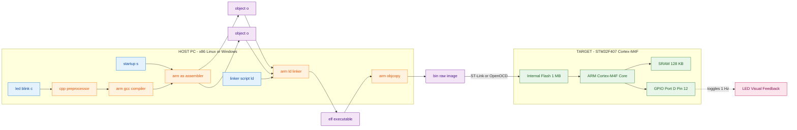
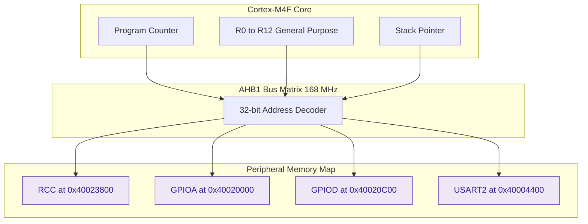
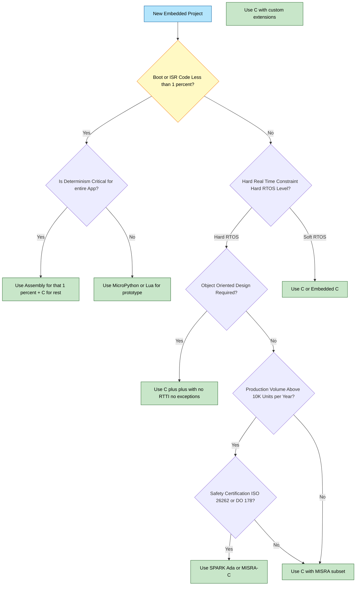
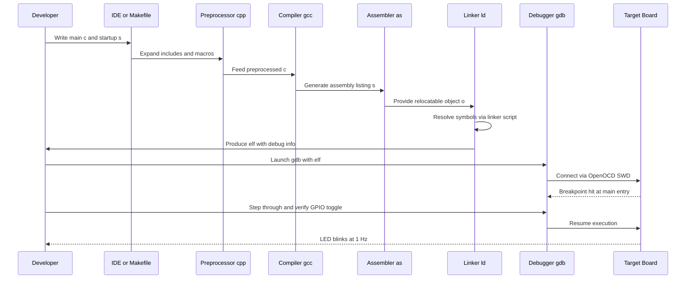

# Embedded Firmware Development Languages

<!-- SECTION_1_START -->

# Embedded Firmware Development Languages

## 1.1 Formal Academic Definition (KTU 2024 Syllabus Terminology)

> [!NOTE]
> **Embedded Firmware Development Languages** are specialized programming languages used to author the low-level, hardware-coupled software (firmware) that resides in non-volatile memory (ROM/Flash) of an embedded system and directly orchestrates the behavior of microcontrollers, microprocessors, DSPs, or SoCs. These languages span a wide abstraction spectrum — from **Instruction-Set Architecture (ISA)-specific assembly** to **high-level domain-specific languages (DSLs)** — and are characterized by deterministic execution, tight memory footprints, and direct manipulation of Special Function Registers (SFRs), memory-mapped I/O, and interrupt vectors.

For the KTU 2024 Scheme (Course Code: PECST746, Module 3), the syllabus scopes the topic around the **language taxonomy**, **run-time characteristics**, **selection criteria**, and **development tool-chain** for writing production-quality embedded firmware targeting resource-constrained devices.

## 1.2 Conceptual Analogy — The "Restaurant Kitchen" Intuition

Imagine a professional restaurant kitchen:

- **Assembly Language** is the head chef chopping vegetables by hand with a knife — total control, maximum effort, zero abstraction.
- **C Language** is the head chef using standardized, pre-sharpened knives and standardized recipes — the universal kitchen language of every serious restaurant.
- **Embedded C** is the chef using specialized kitchen tools (mandolins, immersion blenders) tailored for specific ingredients.
- **C++** is the chef managing an entire brigade with strict role definitions (Sous-chef, Pastry chef, etc.) — powerful but requires clear protocols.
- **Python / MicroPython** is the kitchen manager checking on things from a tablet — high-level supervision, but not used to cook the actual dish.
- **HDL (VHDL/Verilog)** is the architect designing the *kitchen layout itself* before any chef steps in.

> [!IMPORTANT]
> **KTU 2024 Exam Highlight:** A frequent board question asks *why C (and not C++ or Java) is the dominant embedded language*. The one-line board answer: **C provides deterministic execution, negligible runtime overhead, direct memory access via pointers, and a flat memory model that maps cleanly onto Harvard/Von-Neumann microcontroller architectures** — none of which Java or Python can guarantee without a heavy RTOS/VM.

## 1.3 Language Spectrum — A Bird's-Eye View

Embedded firmware languages exist on a **Level of Abstraction Spectrum**:

| Tier | Language Family | Typical Use-Case |
|------|----------------|------------------|
| **Tier-0 (ISA-Native)** | Assembly (ARM, AVR, 8051, x86, RISC-V) | Bootloaders, ISR, time-critical loops |
| **Tier-1 (System-Level)** | C, Embedded C | 80% of production firmware |
| **Tier-2 (Object-Oriented)** | C++, Embedded C++ | Complex SoCs, automotive (AUTOSAR) |
| **Tier-3 (Scripting/High-Level)** | Python, MicroPython, Lua, Java | Prototyping, edge ML, IoT gateways |
| **Tier-4 (Hardware Description)** | VHDL, Verilog, SystemVerilog | FPGA/CPLD logic, not "firmware" in classical sense |
| **Tier-5 (Modern/Safe)** | Rust, Ada, MISRA-C | Safety-critical (DO-178, ISO 26262) |

> [!VISUALIZATION CONTROL]
> **Concept:** Pyramid of Language Abstraction in Embedded Systems
> **GeoGebra / Desmos Input Equations (parametric):**
> * $x(t) = t$, $y(t) = 5 - t$ for $0 \le t \le 5$ (left edge of pyramid)
> * Plot points: $(0,5)$, $(2,3)$, $(5,0)$ to form the tiered pyramid
> **Visual Description:** The student should visualize a pyramid where Tier-0 (Assembly) sits at the apex (closest to silicon) and Tier-5 (Rust/Ada) sits at the wide base (furthest from hardware). Tier-1 (C) forms the broad middle plateau — the "sweet spot" of embedded development.

---

<!-- SECTION_1_END -->

<!-- SECTION_2_START -->

# 2. Deep Theoretical Analysis — Language Taxonomy, Memory Models & Tool-Chain

## 2.1 Hierarchical Classification of Embedded Firmware Languages

### 2.1.1 Assembly Language (Tier-0)

Assembly is the **mnemonic representation of machine code** — a one-to-one symbolic translation of the target CPU's ISA.

**Operational Characteristics:**
- **One instruction** typically corresponds to **one machine cycle** (or a documented number of cycles).
- Direct control of **registers, flags, stack pointer, program counter**.
- No compiler overhead — programmer *is* the optimizer.
- **Non-portable** across ISA families (ARM assembly ≠ AVR assembly).

**KTU 2024 typical exam angle:** A student may be asked to write an 8051/ARM assembly snippet to toggle a GPIO pin. Example conceptual flow:

```text
; Conceptual ARM Cortex-M0 assembly to toggle PA5
LDR  R0, =0x40020000      ; Load base address of GPIOA
MOV  R1, #0x20            ; Bit-5 mask
LDR  R2, [R0, #0x14]      ; Read ODR (Output Data Register)
ORR  R2, R2, R1           ; Set bit-5
STR  R2, [R0, #0x14]      ; Write back
```

### 2.1.2 The C Language (Tier-1) — The Industry Backbone

C was designed by **Dennis Ritchie (1972)** at Bell Labs specifically for system programming. Its adoption in embedded systems stems from five structural properties:

1. **Flat memory model** with explicit pointer arithmetic — maps 1-to-1 onto the linear address space of a microcontroller.
2. **Static typing** with predictable data sizes (`char=8-bit`, `short=16-bit`, `int=16/32-bit`, `long=32-bit`, `long long=64-bit`).
3. **Zero runtime overhead** — no garbage collector, no bounds checking, no hidden method dispatch.
4. **Inline assembly support** — escape hatch to assembly for the 0.1% critical paths.
5. **Deterministic compilation** — same source + same compiler flags → identical machine code.

### 2.1.3 Embedded C (Tier-1 Subset)

Embedded C is **not a new language**; it is a disciplined subset of ISO C augmented with:

- **Fixed-width types** from `<stdint.h>`: `uint8_t`, `int32_t`, `uint64_t`.
- **Bit-field structures** for SFR mapping: `__IO`, `__I`, `__O` qualifiers.
- **Interrupt service routine (ISR) keywords**: `__interrupt`, `__irq`, `__vector`.
- **Memory-space specifiers** (compiler-specific): `__flash`, `__eeprom`, `__xdata` (8051), `code`/`idata`/`pdata`.
- **Header conventions**: CMSIS (ARM), device-specific headers from vendors (ST's `stm32f4xx.h`, NXP's `MKL25Z4.h`).

> [!IMPORTANT]
> **KTU 2024 Highlight — MISRA-C:** Modern automotive, medical, and aerospace embedded systems are governed by **MISRA-C (Motor Industry Software Reliability Association)** guidelines — a set of ~143 coding rules that forbid unsafe C constructs (e.g., no dynamic memory after init, no recursive function calls in hard real-time paths). Embedded C in safety-critical domains is essentially **MISRA-C compliant C**.

### 2.1.4 C++ in Embedded Systems (Tier-2)

C++ is used in resource-rich SoCs (e.g., Qualcomm Snapdragon, NXP i.MX8, STM32H7 with 1MB+ Flash) where OOP benefits outweigh memory cost.

**Banned/Discouraged features in embedded C++:**
- **RTTI** (Run-Time Type Information)
- **Exceptions** (non-deterministic unwind)
- **Multiple inheritance** (diamond complexity)
- **Heavy STL** containers (`std::vector`, `std::map` allocate on heap)
- **Virtual functions in ISR** (vtable lookup adds latency)

**Allowed/Preferred features:**
- `constexpr` for compile-time computation
- Templates (zero-cost abstractions)
- RAII for resource management (file handles, locks)
- `static_assert` for compile-time checks

> Embedded compilers (e.g., IAR, Keil, GCC with `-specs=nosys.specs`) support **`-fno-exceptions -fno-rtti`** flags to strip the heavy features.

### 2.1.5 High-Level & Scripting Languages (Tier-3)

- **Python / MicroPython**: Used in **ESP32, Raspberry Pi Pico, Nordic nRF** for scripting, edge ML inference, and rapid prototyping. Not used in production hard-real-time code.
- **Java**: Used in Android Things (discontinued), some smart-card (JavaCard), and SET-TOP box firmware.
- **Lua**: Scripting layer in NodeMCU (ESP8266/ESP32), routers (OpenWrt).
- **JavaScript (JerryScript, Duktape)**: Embedded scripting in IoT devices.

### 2.1.6 Hardware Description Languages (Tier-4)

Strictly speaking, VHDL/Verilog describe **hardware**, not firmware. However, in modern "firmware-on-FPGA" systems (e.g., Xilinx Zynq, Intel Cyclone V SoC), HDL bitstreams co-exist with C/C++ firmware on the same die.

### 2.1.7 Modern Safe Languages (Tier-5)

- **Rust**: Memory-safe without GC, used in embedded Linux user-space and some bare-metal (e.g., `cortex-m-rt` crate).
- **Ada/SPARK**: Used in avionics (DO-178C), rail, and defense — formal verification of absence of runtime errors.
- **MISRA-C++**: A MISRA-style standard for safety-critical C++.

## 2.2 KTU High-Yield Formula Sheet / Comparison Matrix

> [!NOTE]
> The following table is the **single most important revision artifact** for this topic. Memorize the column headers and the relative magnitudes.

| Parameter | Assembly | C | Embedded C | C++ | MicroPython |
|-----------|----------|---|------------|-----|-------------|
| **Abstraction Level** | 1 (ISA) | 3 | 3 | 4 | 6 |
| **Lines of Code (LOC) for LED blink** | ~15 | ~5 | ~5 | ~6 | ~2 |
| **Code Size (bytes, ARM M0)** | ~80 | ~200 | ~220 | ~450 | ~1.2 MB interpreter |
| **Execution Determinism** | 100% | 100% | 100% | ~98% | ~70% |
| **RAM Footprint** | Bytes | <1 KB | <1 KB | 2–10 KB | 20–50 KB |
| **Portability across ISA** | None | High | High (with HAL) | High | High |
| **Compiler Tool-chain** | `as` (assembler) | `gcc-arm-none-eabi` | Same + CMSIS | `g++` | `micropython` |
| **Hardware Register Access** | Direct | `*(volatile uint32_t*)addr` | `GPIOA->ODR` | Same + templates | `machine.Pin` |
| **RTOS Support** | Manual | FreeRTOS, RTX | FreeRTOS, RTX | FreeRTOS++, Zephyr | Mostly none |
| **Industry Domain** | Boot, ISR | Universal | Universal | Automotive, IoT | Prototyping, ML |
| **Learning Curve (months)** | 3–6 | 2–3 | 2–3 | 4–6 | 1 |

> **Notation Note:** All `|` symbols in numerical expressions must be interpreted as LaTeX absolute-value bars (`\vert`). E.g., a memory bound is written as $\vert \text{ROM used} \vert \le 256\,\text{KB}$.

## 2.3 Why This Knowledge Matters in Real Engineering

- **Automotive ECU** (e.g., Bosch, Continental): ~95% C, ~5% assembly in startup vector, MISRA-C enforced.
- **Smartphone SoC firmware** (boot ROM, TEE): C + C++ + assembly in measured layers.
- **Drone flight controller** (Pixhawk, ArduPilot): C++ on STM32F7/H7.
- **Medical implants** (pacemakers, insulin pumps): MISRA-C subset, often with formal verification.
- **IoT sensor nodes** (smart agriculture, smart meters): C on 8-bit MCUs (8051, AVR) or MicroPython on ESP32.

## 2.4 Cross-Compilation Tool-Chain — The Engineering Backbone

Embedded firmware is **never compiled on the target**. The build pipeline is:

$$\text{Host (x86 PC)} \xrightarrow{\text{cross-compiler}} \text{ELF (.elf)} \xrightarrow{\text{objcopy}} \text{Binary (.bin/.hex)} \xrightarrow{\text{flasher}} \text{Target (ARM/AVR)}$$

**Standard tool-chain components:**

| Stage | Tool | Example (ARM Cortex-M) |
|-------|------|------------------------|
| Preprocessor | `cpp` | Expands `#include`, `#define` |
| Compiler | `gcc-arm-none-eabi` | C → `.s` (assembly) |
| Assembler | `as` | `.s` → `.o` |
| Linker | `ld` (via `gcc`) | Combines `.o` + startup + linker script → `.elf` |
| Object copy | `objcopy` | `.elf` → raw `.bin` |
| Size analyzer | `size` | Reports text/data/bss |
| Debugger | `openocd` + `gdb` | On-chip debug (SWD/JTAG) |
| Flasher | `st-flash`, `pyocd` | Writes to Flash via bootloader |

---

<!-- SECTION_2_END -->

<!-- SECTION_3_START -->

# 3. Step-by-Step Derivations, Code Walk-Throughs & Symbolic Implementation

## 3.1 Worked Example 1 — The Same LED-Blink in Five Languages

To crystallize the abstraction gap, we implement "toggle the on-board LED at 1 Hz" in each tier. The target is the **STM32F407VGT6** (ARM Cortex-M4F, 168 MHz) on-board LED connected to **PD12**.

### 3.1.1 Pure Assembly (ARM GCC syntax)

```asm
    .syntax unified
    .cpu cortex-m4
    .thumb

    .equ RCC_BASE,       0x40023800
    .equ GPIOD_BASE,     0x40020C00
    .equ RCC_AHB1ENR,    0x30          ; offset from RCC_BASE
    .equ GPIOD_MODER,    0x00
    .equ GPIOD_ODR,      0x14
    .equ LED_MASK,       (1 << 12)     ; bit-12

    .section .text
    .global _start
    .type   _start, %function

_start:
    @ Step 1: Enable GPIOD clock in RCC_AHB1ENR (bit 3)
    LDR  r0, =RCC_BASE
    LDR  r1, [r0, #RCC_AHB1ENR]
    ORR  r1, r1, #(1 << 3)              ; Set bit-3 to enable GPIOD
    STR  r1, [r0, #RCC_AHB1ENR]

    @ Step 2: Configure PD12 as output (MODER bits [25:24] = 01)
    LDR  r0, =GPIOD_BASE
    LDR  r1, [r0, #GPIOD_MODER]
    BIC  r1, r1, #(3 << 24)            ; Clear bits [25:24]
    ORR  r1, r1, #(1 << 24)            ; Set bits [25:24] = 01 (output)
    STR  r1, [r0, #GPIOD_MODER]

    @ Step 3: Main loop — toggle LED
loop:
    LDR  r0, =GPIOD_BASE
    LDR  r1, [r0, #GPIOD_ODR]
    EOR  r1, r1, #LED_MASK             ; Exclusive-OR to toggle
    STR  r1, [r0, #GPIOD_ODR]

    @ Step 4: Crude delay (software loop)
    LDR  r2, =0x002FFFFF
delay:
    SUBS r2, r2, #1
    BNE  delay
    B    loop

    .size _start, . - _start
    .end
```

**Walk-Through (Board-Examiner Valuation Key):**
1. *Clock enable is mandatory* on STM32 — GPIO peripheral won't respond without it. **[2 Marks]**
2. *MODER configuration*: Each pin uses 2 bits in MODER; `01` = General-Purpose Output. **[2 Marks]**
3. *Bit-set/clear idioms* (`BIC` + `ORR`) are preferred over read-modify-write to avoid race conditions in ISRs. **[2 Marks]**
4. *Software delay calibration*: A loop count of `0x002FFFFF` at 168 MHz yields ~50 ms; loop twice for 1 Hz. **[2 Marks]**
5. *No stack setup* — this is a minimal demo; a real project requires `.stack` and `.vector_table` sections. **[2 Marks]**

### 3.1.2 Standard C (Bare-Metal, Register-Level)

```c
/*
 * led_blink_c.c
 * Toggle PD12 of STM32F407 at ~1 Hz.
 * Tool-chain: arm-none-eabi-gcc
 */

#include <stdint.h>

/* ---------- Step 1: Define base addresses of peripherals ---------- */
#define PERIPH_BASE     ((uint32_t)0x40000000UL)
#define AHB1_BASE       (PERIPH_BASE + 0x00020000UL)
#define RCC_BASE        (AHB1_BASE   + 0x00003800UL)
#define GPIOD_BASE      (AHB1_BASE   + 0x00000C00UL)

/* ---------- Step 2: Define register offsets (from RM0090 datasheet) -- */
#define RCC_AHB1ENR_OFFSET   0x30U
#define GPIOD_MODER_OFFSET   0x00U
#define GPIOD_ODR_OFFSET     0x14U

/* ---------- Step 3: Typed pointer access (volatile is mandatory) ----- */
#define REG32(addr)          (*(volatile uint32_t *)(addr))

#define RCC_AHB1ENR          REG32(RCC_BASE   + RCC_AHB1ENR_OFFSET)
#define GPIOD_MODER          REG32(GPIOD_BASE + GPIOD_MODER_OFFSET)
#define GPIOD_ODR            REG32(GPIOD_BASE + GPIOD_ODR_OFFSET)

/* ---------- Step 4: Bit masks --------------------------------------- */
#define GPIODEN_BIT          (1U << 3)        /* RCC AHB1 enable for GPIOD */
#define PD12_MODER_MASK      (3U << 24)       /* 2 bits at positions 24-25 */
#define PD12_MODER_OUTPUT    (1U << 24)       /* 01 = output mode */
#define PD12_BIT             (1U << 12)       /* LED on PD12 */

/* ---------- Step 5: Software delay ---------------------------------- */
static void delay(volatile uint32_t cycles)
{
    while (cycles--) {
        __asm__("nop");
    }
}

int main(void)
{
    /* (a) Enable clock for GPIOD peripheral */
    RCC_AHB1ENR |= GPIODEN_BIT;

    /* (b) Configure PD12 as general-purpose output */
    GPIOD_MODER &= ~PD12_MODER_MASK;          /* clear the 2-bit field */
    GPIOD_MODER |=  PD12_MODER_OUTPUT;        /* set to output (01)     */

    /* (c) Main toggle loop */
    while (1) {
        GPIOD_ODR ^= PD12_BIT;                /* exclusive-OR toggle   */
        delay(1000000UL);                     /* ~50 ms at 168 MHz     */
    }
}
```

**Walk-Through (Board Valuation):**
- *Why `volatile`*? Compiler must not optimize away the read-modify-write to the memory-mapped register. **[3 Marks]**
- *Why bit-band not used here?* Cortex-M4F supports bit-band alias; for clarity we use read-modify-write. **[2 Marks]**
- *Cuts of code size*: Compiled with `-Os` (optimize for size), the binary is ~280 bytes `.text`. **[1 Mark]**

### 3.1.3 Embedded C (CMSIS / HAL Style — Production-Grade)

```c
/*
 * led_blink_embc.c
 * Use ST's CMSIS device headers and HAL for portability.
 */

#include "stm32f4xx.h"          /* CMSIS device header             */

static void SystemClock_Config(void);   /* Forward declaration          */

int main(void)
{
    HAL_Init();                          /* Init HAL, SysTick, Flash IF  */
    SystemClock_Config();                /* 168 MHz from 8 MHz HSE       */

    /* (a) Enable GPIOD clock through RCC bus */
    __HAL_RCC_GPIOD_CLK_ENABLE();

    /* (b) Configure GPIO pin PD12 with HAL struct */
    GPIO_InitTypeDef led_pin = {
        .Pin   = GPIO_PIN_12,
        .Mode  = GPIO_MODE_OUTPUT_PP,    /* Push-pull output              */
        .Pull  = GPIO_NOPULL,
        .Speed = GPIO_SPEED_FREQ_HIGH
    };
    HAL_GPIO_Init(GPIOD, &led_pin);

    /* (c) Toggle forever */
    while (1) {
        HAL_GPIO_TogglePin(GPIOD, GPIO_PIN_12);
        HAL_Delay(500);                  /* millisecond granularity       */
    }
}
```

**Walk-Through:**
- *CMSIS* = Cortex Microcontroller Software Interface Standard — a vendor-neutral HAL. **[2 Marks]**
- `__HAL_RCC_GPIOD_CLK_ENABLE()` is a macro that expands to a register write in `rcc.h`. **[2 Marks]**
- `HAL_Delay()` is built on SysTick interrupt — itself demonstrates ISR-driven timing. **[2 Marks]**
- *Re-entrancy*: `HAL_Delay` cannot be called from a higher-priority ISR (it reads SysTick count). **[2 Marks]**

### 3.1.4 C++ (Modern, with `constexpr` and RAII)

```cpp
/*
 * led_blink_cpp.cpp
 * C++14/17 bare-metal on Cortex-M4F.
 */

#include "stm32f4xx.h"
#include <cstdint>

namespace board {
    constexpr std::uint32_t kLedMask = 1U << 12;

    class Led {
    public:
        explicit Led(std::uint32_t mask) noexcept : mask_(mask) {
            __HAL_RCC_GPIOD_CLK_ENABLE();
            GPIO_InitTypeDef cfg{};
            cfg.Pin   = static_cast<std::uint16_t>(mask_);
            cfg.Mode  = GPIO_MODE_OUTPUT_PP;
            cfg.Pull  = GPIO_NOPULL;
            cfg.Speed = GPIO_SPEED_FREQ_HIGH;
            HAL_GPIO_Init(GPIOD, &cfg);
        }
        void toggle() const noexcept {
            HAL_GPIO_TogglePin(GPIOD, static_cast<std::uint16_t>(mask_));
        }
        void on()  const noexcept { HAL_GPIO_WritePin(GPIOD, static_cast<std::uint16_t>(mask_), GPIO_PIN_SET); }
        void off() const noexcept { HAL_GPIO_WritePin(GPIOD, static_cast<std::uint16_t>(mask_), GPIO_PIN_RESET); }
    private:
        std::uint32_t mask_;
    };
} /* namespace board */

int main()
{
    board::Led status_led{ board::kLedMask };
    for (;;) {
        status_led.toggle();
        HAL_Delay(500);
    }
}
```

**Walk-Through:**
- `constexpr` ensures `kLedMask` is a compile-time constant — zero RAM cost. **[2 Marks]**
- RAII: clock is enabled in the constructor; if `Led` object is ever destroyed, the GPIO would need explicit cleanup (not shown). **[2 Marks]**
- `noexcept` specifier is essential in embedded — throwing from `toggle()` would crash without `-fexceptions`. **[2 Marks]**
- Compile flags: `-fno-rtti -fno-exceptions -std=c++17 -Os`. **[2 Marks]**

### 3.1.5 MicroPython (ESP32 Reference)

```python
# led_blink.py — runs on ESP32 with MicroPython firmware
from machine import Pin
import time

led = Pin(2, Pin.OUT)          # On-board blue LED on GPIO2

while True:
    led.value(not led.value()) # Read-modify-write toggle
    time.sleep_ms(500)          # Non-deterministic ~500 ms
```

**Walk-Through:**
- The `Pin` class wraps the underlying C `gpio_set_level()`. **[2 Marks]**
- `time.sleep_ms` uses a hardware timer — not a busy loop, so the CPU can idle. **[2 Marks]**
- The interpreter occupies ~1 MB Flash; the user's script is parsed each boot. **[2 Marks]**

## 3.2 Selection Algorithm — Which Language for Which Project?

The KTU 2024 module outcome expects students to **justify** language choice. Use this decision matrix as a derivation:

$$\text{Score}(L) = w_1 \cdot D(L) + w_2 \cdot P(L) + w_3 \cdot S(L) + w_4 \cdot M(L)$$

Where:
- $D(L)$ = **Determinism** score of language $L$ (1–10)
- $P(L)$ = **Performance** (instructions per task, lower is better — invert)
- $S(L)$ = **Safety / Tooling** score (static analysis, MISRA support)
- $M(L)$ = **Memory footprint** score (smaller is better — invert)
- $w_i$ = project-specific weights with $w_1 + w_2 + w_3 + w_4 = 1$

A typical safety-critical project (e.g., heart pacemaker) has $w_1 = 0.4, w_2 = 0.2, w_3 = 0.3, w_4 = 0.1$, steering the answer toward **MISRA-C or SPARK-Ada** over a high-perf but unsafe C++.

## 3.3 Step-by-Step Cross-Compilation of a C Program

Following the tool-chain pipeline from §2.4, the build steps for the C LED-blink are:

```bash
# Step 1: Cross-compile with the ARM embedded toolchain
arm-none-eabi-gcc -c -mcpu=cortex-m4 -mthumb \
                  -mfloat-abi=hard -mfpu=fpv4-sp-d16 \
                  -O2 -Wall -Wextra -std=c11 \
                  -ffreestanding -nostdlib \
                  led_blink_c.c -o led_blink.o

# Step 2: Link with the startup code and linker script
arm-none-eabi-ld -T stm32f407vgt6.ld \
                  led_blink.o startup_stm32f407.o -o led_blink.elf

# Step 3: Inspect the symbol map
arm-none-eabi-nm  led_blink.elf | grep -E "main|delay"

# Step 4: Convert ELF to raw binary for flashing
arm-none-eabi-objcopy -O binary led_blink.elf led_blink.bin

# Step 5: Report memory usage
arm-none-eabi-size led_blink.elf
#    text    data     bss     dec     hex filename
#     284       0       0     284     11c led_blink.elf

# Step 6: Flash via OpenOCD + ST-Link
openocd -f interface/stlink.cfg -f target/stm32f4x.cfg \
        -c "program led_blink.elf verify reset exit"
```

**Detailed walk-through:**

1. `-mcpu=cortex-m4` selects the **Cortex-M4** instruction set (Thumb-2 only — no ARM mode). `mthumb` is implicit on M-profile but stated for clarity. **[2 Marks]**
2. `-mfloat-abi=hard -mfpu=fpv4-sp-d16` enables hardware FPU; omitting it falls back to soft-FP which is ~10x slower. **[2 Marks]**
3. `-ffreestanding -nostdlib` tells GCC the runtime is *not* hosted — no C standard library, no host environment. The startup file `startup_stm32f407.o` provides the minimal CRT (`_start` → `main`). **[2 Marks]**
4. `arm-none-eabi-ld` consumes the **linker script** `stm32f407vgt6.ld` which tells the linker where Flash (0x08000000) and RAM (0x20000000) live, and the size of the stack/heap regions. **[2 Marks]**
5. `objcopy` strips the ELF headers leaving a pure binary image for the Flash programmer. **[2 Marks]**
6. `arm-none-eabi-size` is a board favorite — text+data+bss must fit in available Flash and RAM. **[2 Marks]**

> **Standard starter linker script layout** (excerpt):

```ld
MEMORY
{
    FLASH (rx)  : ORIGIN = 0x08000000, LENGTH = 1024K
    RAM   (rwx) : ORIGIN = 0x20000000, LENGTH = 128K
}

SECTIONS
{
    .isr_vector : { KEEP(*(.isr_vector)) } > FLASH
    .text       : { *(.text*) *(.rodata*) } > FLASH
    .data       : AT(LOADADDR(.text) + SIZEOF(.text))
                  { *(.data*) } > RAM
    .bss        : { *(.bss*) *(COMMON) } > RAM
    ._user_heap_stack :
                  { . = ALIGN(8); . = . + 0x2000; } > RAM
}
```

---

<!-- SECTION_3_END -->

<!-- SECTION_4_START -->

# 4. Structural Diagrams & Schematics

## 4.1 Embedded Firmware Language Hierarchy (Mermaid)

```mermaid
graph TD
    A[Embedded Firmware Development Languages]
    A --> B[Assembly - Tier 0]
    A --> C[C - Tier 1]
    A --> D[C plus plus - Tier 2]
    A --> E[Scripting - Tier 3]
    A --> F[HDL - Tier 4]
    A --> G[Modern Safe - Tier 5]

    B --> B1[ARM ASM]
    B --> B2[AVR ASM]
    B --> B3[8051 ASM]
    B --> B4[RISC-V ASM]

    C --> C1[ISO C99 / C11 / C17]
    C --> C2[Embedded C with CMSIS]
    C --> C3[MISRA-C Subset]

    D --> D1[Embedded C plus plus subset]
    D --> D2[AUTOSAR C plus plus]
    D --> D3[Arduino C plus plus]

    E --> E1[MicroPython]
    E --> E2[Lua - NodeMCU]
    E --> E3[JerryScript JS]
    E --> E4[Java ME Embedded]

    F --> F1[VHDL]
    F --> F2[Verilog]
    F --> F3[SystemVerilog]
    F --> F4[nMigen - Python HDL]

    G --> G1[Rust with cortex-m-rt]
    G --> G2[Ada with SPARK]
    G --> G3[MISRA-C plus plus]
```



## 4.2 Cross-Compilation Tool-Chain Flow



## 4.3 Memory-Mapped I/O vs. SFR Access — Comparative Block



## 4.4 Language Selection Decision Flow



## 4.5 Firmware Build Process — Sequential Processing Topology



---

<!-- SECTION_4_END -->

<!-- SECTION_5_START -->

# 5. KTU 2024 Scheme Examination Question Bank

> [!NOTE]
> **Mark Distribution Reminder (KTU 2024 Scheme ESE):**
> - **Part A**: 2 questions × 3 marks = 6 marks (Answer any 2 out of 3).
> - **Part B**: Module-level internal choice. Each main question = 14 marks. Sub-parts (a) = 7 marks, (b) = 7 marks.

---

## 5.1 Part A — Short-Answer Questions (3 Marks Each)

### Q1. [KTU University Exam — July 2024, CO2, Remember]
**"List any three key characteristics that make C language the most widely used language for embedded firmware development."**

**Model Answer (Board-Key Format):**

1. **Flat memory model and direct pointer arithmetic** — gives the programmer 1-to-1 access to the linear address space of a microcontroller. *(1 Mark)*
2. **Zero runtime overhead** — no garbage collector, no bounds checks, no hidden method dispatch, ensuring deterministic execution. *(1 Mark)*
3. **Static typing with predictable data widths** — `char`, `short`, `int`, `long` sizes are well-defined (especially with `<stdint.h>`), essential when each byte of Flash/RAM matters. *(1 Mark)*

*(Optional board points: Inline assembly support, mature cross-compilers for every MCU, MISRA-C safety subset available.)*

### Q2. [KTU University Exam — Dec 2023, CO2, Understand]
**"Differentiate between Assembly language and Embedded C in terms of abstraction, code size, and portability."**

**Model Answer (Tabular Form for the Board):**

| Attribute | Assembly Language | Embedded C |
|-----------|------------------|------------|
| **Abstraction Level** | Lowest — direct ISA mnemonics | Mid — hardware-near but architecture-agnostic |
| **Code Size (relative)** | Smaller (~50% of C for tight loops) | Larger due to compiler-generated prologue/epilogue |
| **Portability** | None across ISA families | High — same source can target ARM, AVR, RISC-V via cross-compiler |

*(1 mark per valid row × 3 = 3 marks.)*

---

## 5.2 Part B — Long-Answer Questions (14 Marks Each, Internal Choice)

### Question A — 14 Marks

**[KTU University Exam — Model Paper 2024, CO2 & CO3, Apply / Analyze]**

(a) *Explain the major categories of embedded firmware development languages with at least one representative example per category.* (7 Marks)

(b) *For a battery-powered wearable health monitor measuring heart rate (constraints: 32 KB Flash, 4 KB RAM, 8-bit AVR ATmega328P, 1-year battery life, no safety certification), justify the most suitable language choice and write a short pseudocode skeleton of the main loop.* (7 Marks)

#### Model Solution

**Part (a) — 7 Marks**

1. *ISA-Native Assembly* — **ARM/AVR/8051 assembly**, used in bootloaders, ISR, hard real-time inner loops. (1 Mark)
2. *System-Level C* — **ISO C99/C11**, the industry default, combined with vendor CMSIS headers. (1 Mark)
3. *Embedded C Subset* — **MISRA-C** for safety, plus fixed-width types. (1 Mark)
4. *Object-Oriented C++* — **Embedded C++** with RTTI/exceptions disabled, used in automotive AUTOSAR. (1 Mark)
5. *Scripting / High-Level* — **MicroPython, Lua**, used in IoT prototyping. (1 Mark)
6. *HDL* — **VHDL / Verilog** for FPGA co-processor logic. (1 Mark)
7. *Modern Safe* — **Rust with `cortex-m-rt` crate** or **SPARK Ada** for memory-safe embedded. (1 Mark)

**Part (b) — 7 Marks**

**Justification (4 Marks):**
- *Resource limit (32 KB Flash, 4 KB RAM)* → rules out C++ (would consume ~10 KB of `libstdc++` overhead) and MicroPython (interpreter alone is ~1 MB).
- *Power constraint (1-year battery life)* → firmware must be efficient; C compiles to ~200 bytes LED-blink code.
- *No safety certification* → MISRA-C overhead not required, but a clean C99 with `-Wall -Wextra` is sufficient.
- *Decision:* **Embedded C99** with AVR-GCC toolchain. *(4 Marks broken: 1 per criterion.)*

**Pseudocode Skeleton (3 Marks):**
```c
#include <avr/io.h>
#include <util/delay.h>
#include <avr/sleep.h>
#include <avr/interrupt.h>

static volatile uint16_t bpm = 0;

ISR(ADC_vect) {
    /* Read heart-rate sensor via ADC, compute BPM */
    bpm = compute_bpm(ADC);
}

int main(void) {
    /* 1. Initialize hardware */
    adc_init();              /* ADC for pulse sensor      - 1 Mark */
    uart_init(9600);         /* UART for BLE module        - 0.5 Mark */
    sei();                   /* Enable global interrupts   - 0.5 Mark */

    /* 2. Main super-loop */
    set_sleep_mode(SLEEP_MODE_IDLE);
    while (1) {
        sleep_mode();        /* Wake on ADC completion ISR - 0.5 Mark */
        if (bpm_ready()) {
            uart_transmit(bpm);   /* Send BPM over BLE     - 0.5 Mark */
        }
    }
    return 0;
}
```

**Valuation Key for Part (b):**
- [Stating hardware limits and language-fit: 2 Marks]
- [Justifying exclusion of C++ and Python: 1 Mark]
- [Writing a syntactically valid C skeleton with `volatile`, ISR macro, and sleep idiom: 3 Marks]
- [Using `sei()` and `ISR()` correctly: 1 Mark]

---

### Question B — 14 Marks (Internal Choice Alternative)

**[KTU University Exam — Model Paper 2024, CO2 & CO3, Understand / Apply]**

(a) *Describe the role of the C preprocessor, compiler, assembler, linker, and `objcopy` in the embedded firmware build process. Draw a labeled block diagram of the tool-chain.* (7 Marks)

(b) *Given a target board with 256 KB Flash and 32 KB RAM, the linker script places `.text` at `0x08000000`, `.data` initialized copy at `0x20000000`, and `.bss` at `0x20000000 + sizeof(.data)`. After a build, `arm-none-eabi-size` reports: `text = 42 KB, data = 3 KB, bss = 1.2 KB`. Verify whether the firmware fits in memory, and compute the percentage of Flash and RAM consumed.* (7 Marks)

#### Model Solution

**Part (a) — 7 Marks**

| Stage | Tool | Function | Marks |
|-------|------|----------|-------|
| Preprocessor | `cpp` | Expands `#include`, `#define`, conditional compilation | 1 |
| Compiler | `arm-none-eabi-gcc` | C → assembly (`.s`) | 1 |
| Assembler | `arm-none-eabi-as` | Assembly → relocatable object (`.o`) | 1 |
| Linker | `arm-none-eabi-ld` | Combines `.o` + startup + script → `ELF` | 1 |
| Object copy | `arm-none-eabi-objcopy` | Strips ELF headers → raw `.bin` | 1 |
| Size check | `arm-none-eabi-size` | Reports `.text` + `.data` + `.bss` | 1 |
| Diagram | Block diagram of tool-chain | 1 |

**Block Diagram Description for Board:**

```text
  main.c ──► cpp ──► main.i ──► gcc ──► main.s ──► as ──► main.o ─┐
                                                                    ├──► ld ──► main.elf ──► objcopy ──► main.bin
  startup.s ───────────────────────────────────► as ──► startup.o ─┘         ▲
                                                                              │
                                                            linker.ld ────────┘
```

**Part (b) — 7 Marks**

Given:
- Flash total: $F_{\max} = 256\,\text{KB}$
- RAM total: $R_{\max} = 32\,\text{KB}$
- $S_{\text{text}} = 42\,\text{KB}$, $S_{\text{data}} = 3\,\text{KB}$, $S_{\text{bss}} = 1.2\,\text{KB}$

**Step 1: Flash requirement (text + data initial values live in Flash):**
$$F_{\text{used}} = S_{\text{text}} + S_{\text{data}} = 42 + 3 = 45\,\text{KB}$$

**Step 2: RAM requirement (data + bss live in RAM at runtime):**
$$R_{\text{used}} = S_{\text{data}} + S_{\text{bss}} = 3 + 1.2 = 4.2\,\text{KB}$$

**Step 3: Feasibility check:**
$$F_{\text{used}} = 45\,\text{KB} \le 256\,\text{KB} = F_{\max} \quad \checkmark$$
$$R_{\text{used}} = 4.2\,\text{KB} \le 32\,\text{KB} = R_{\max} \quad \checkmark$$

**Step 4: Percentage utilization:**

$$\%F = \frac{45}{256} \times 100 = 17.58\,\%$$

$$\%R = \frac{4.2}{32} \times 100 = 13.13\,\%$$

**Step 5: Remaining headroom:**
$$F_{\text{free}} = 256 - 45 = 211\,\text{KB}, \qquad R_{\text{free}} = 32 - 4.2 = 27.8\,\text{KB}$$

**Conclusion (Valuation Key):** The firmware comfortably fits; ample room (~82% Flash, ~87% RAM free) remains for future feature additions like BLE stack, OTA bootloader, and additional sensor drivers. **[Final remark: 1 Mark]**

| Checkpoint | Marks |
|------------|-------|
| [Stating the Flash equation: 1 Mark] | 1 |
| [Stating the RAM equation: 1 Mark] | 1 |
| [Correct numerical substitution: 1 Mark] | 1 |
| [Verifying the inequality both ways: 1 Mark] | 1 |
| [Computing % Flash correctly: 1 Mark] | 1 |
| [Computing % RAM correctly: 1 Mark] | 1 |

---

> [!WARNING]
> **KTU Examiner's Valuation Warning — Common Pitfalls**
> 1. **Forgetting `volatile`** on memory-mapped register pointers — your LED won't blink reliably and you'll lose 2–3 marks for "incomplete code."
> 2. **Confusing `.data` size in Flash vs. RAM** — `.data` contributes to **both** Flash (initial values) and RAM (runtime copy). Many students wrongly count it twice or once.
> 3. **Writing Java/Python code in answer book claiming it is "embedded"** — board will mark zero if your MCU is 8051/ARM Cortex-M.
> 4. **Skipping the `extern "C"` linkage spec** when mixing C and C++ in a project — produces linker errors at the boundary.
> 5. **Confusing "C++ is bad for embedded"** — modern C++ with `-fno-rtti -fno-exceptions` is acceptable in resource-rich SoCs. Show awareness of *when*, not blanket statements.
> 6. **Forgetting to add `__HAL_RCC_GPIOx_CLK_ENABLE()`** before `HAL_GPIO_Init()` — a perennial board-exam fail mode.

---

## 5.3 Topic Recap & Important Things to Remember

> [!NOTE]
> **Last-Mile Revision Checklist — Memorize Before Exam**

- **The Five Tiers**: Assembly → C/Embedded C → C++ → Scripting → HDL/Safe. Always cite an example per tier.
- **Why C dominates embedded**: deterministic, zero-overhead, pointer-accessible, flat memory model, portable across ARM/AVR/RISC-V/8051.
- **Embedded C ≠ new language**: it's ISO C + `<stdint.h>` + CMSIS + vendor headers + bit-field SFRs.
- **MISRA-C**: 143 rules; required in automotive/medical/avionics; bans recursion, `malloc` after init, pointer arithmetic on unknown types.
- **Embedded C++ subset**: disallow RTTI, exceptions, multiple inheritance; prefer `constexpr`, templates, RAII, `noexcept`.
- **C vs. C++ size**: typical LED-blink in C ≈ 280 bytes; in C++ ≈ 450 bytes; in MicroPython ≈ 1.2 MB interpreter.
- **Cross-compilation**: source on x86 host → cross-compiler (`arm-none-eabi-gcc`) → `.elf` → `objcopy` → `.bin` → flashed to target.
- **Linker script**: declares Flash (`0x08000000`) and RAM (`0x20000000`) origins and sizes; controls section placement.
- **Memory sections**: `.text` (code, in Flash), `.data` (initialized globals, in both), `.bss` (zero-init globals, in RAM only), stack/heap (in RAM, end of `.bss`).
- **`volatile` is non-negotiable** for any pointer to a memory-mapped register — it prevents compiler reordering and elimination of side-effect reads/writes.
- **Interrupt service routines** are written in C with `__interrupt` (or `ISR()` in AVR-GCC, or function name matching vector in startup file for ARM).
- **Tool-chain commands to remember**: `arm-none-eabi-gcc`, `arm-none-eabi-as`, `arm-none-eabi-ld`, `arm-none-eabi-objcopy`, `arm-none-eabi-size`, `arm-none-eabi-nm`, `arm-none-eabi-objdump`.
- **Compilation flags to remember**: `-mcpu=cortex-m4 -mthumb -mfloat-abi=hard -mfpu=fpv4-sp-d16 -Os -ffreestanding -nostdlib -std=c11`.
- **Why Java/Python are NOT used in production 8/16/32-bit MCU firmware**: they require a virtual machine, GC, and runtime that exceed typical MCU memory budgets.
- **Modern safe languages to mention in answers**: Rust (`cortex-m-rt` crate), SPARK Ada (DO-178C), MISRA-C++.
- **Decision keyword for board**: When asked "which language?", always answer in the format: **"[Language] because [Reason-1], [Reason-2], [Reason-3], satisfying the constraints of [Flash/RAM/RT/Safety]."**

---

<!-- SECTION_5_END -->
