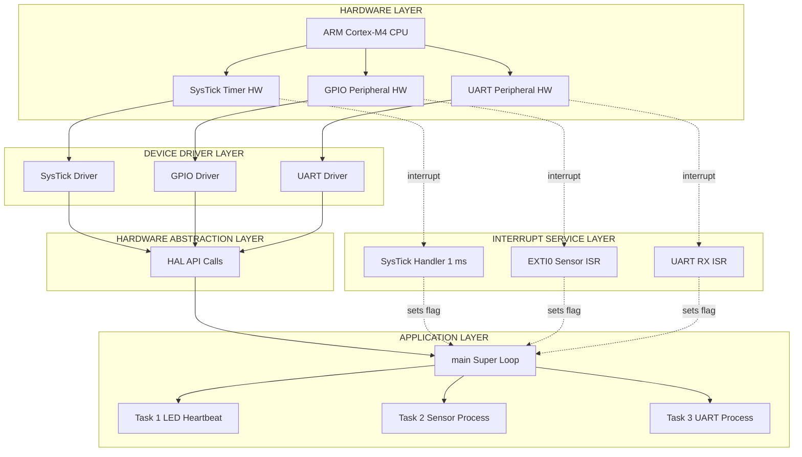
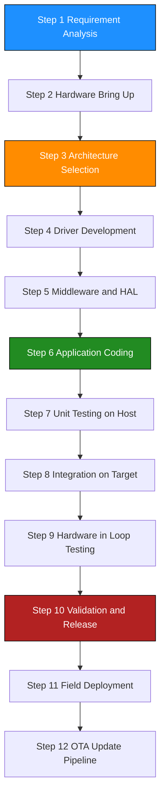
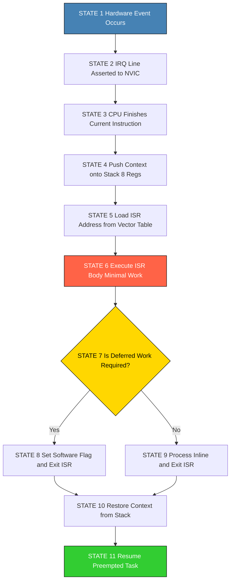
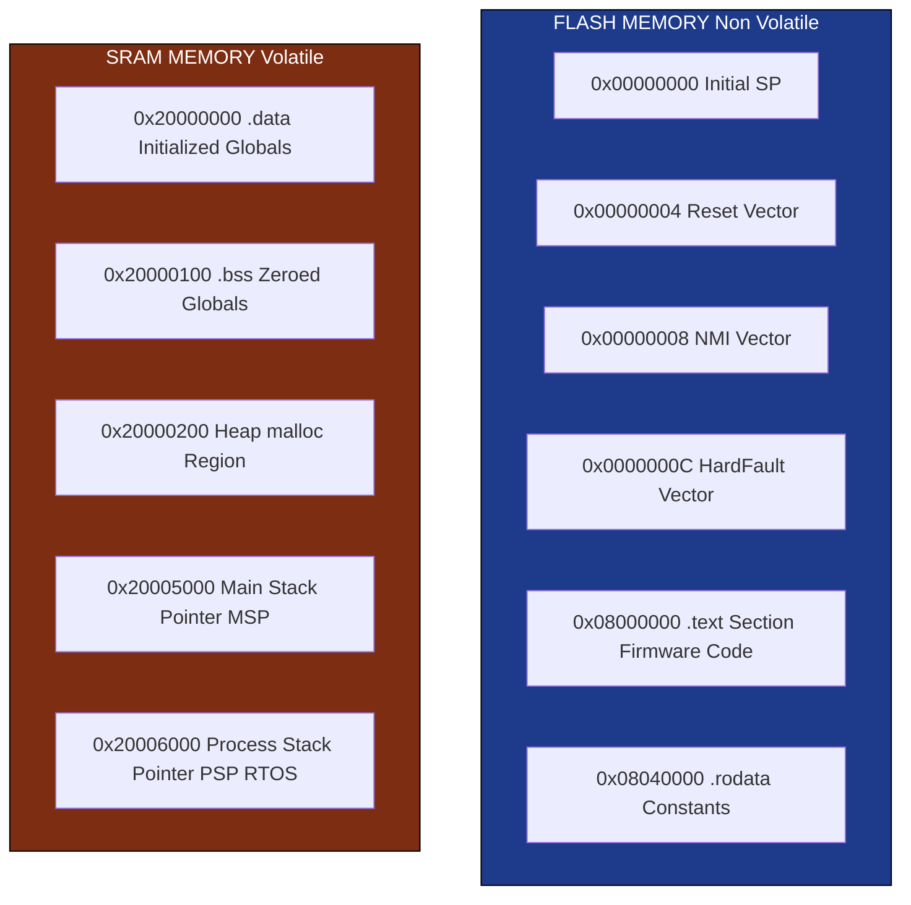
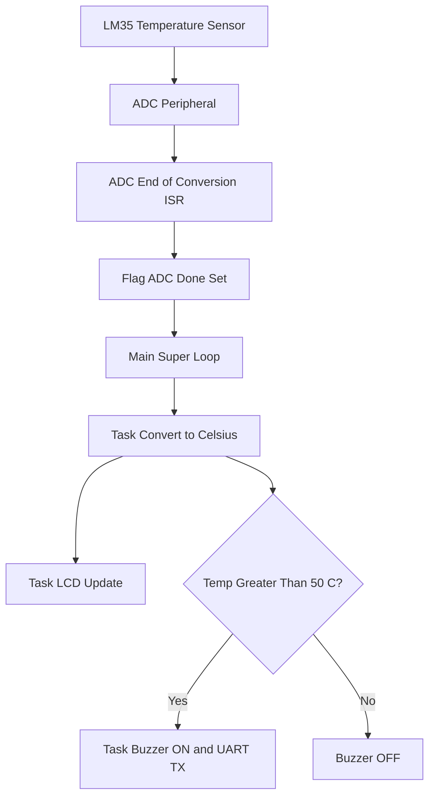

# Firmware Design and Development - Embedded Firmware Design

<!-- SECTION_1_START -->
# Embedded Firmware Design — Core Technical Definition & Intuitive Overview

## 1.1 Formal Academic Definition (KTU 2024 Syllabus Terminology)

**Embedded Firmware** is the specialized, hardware-dependent software program permanently stored in the non-volatile memory (ROM, EPROM, Flash, EEPROM) of an embedded system, designed to directly control, monitor, and manage the underlying hardware peripherals and real-time I/O operations of the target microcontroller/microprocessor.

> [!NOTE]
> **KTU 2024 Definition Reference:** Firmware is a *type* of software engineered to operate with extreme constraints on **memory footprint, deterministic timing, and power consumption**. Unlike general-purpose application software, firmware has no OS layer of abstraction in the bare-metal sense and is tightly coupled to the silicon architecture (registers, memory map, instruction set).

## 1.2 The Firmware vs. Software vs. Hardware Triad

| Layer | Medium | Mutability | Executor | Example |
|------|--------|-----------|----------|---------|
| **Hardware** | Silicon, transistors | Fixed (post-fab) | Physics | ARM Cortex-M4 core, GPIO pins |
| **Firmware** | ROM/Flash bits | Semi-permanent | Microcontroller | Bootloader, sensor driver |
| **Software** | RAM, Disk | Dynamic | OS → Application | Mobile app, Web browser |

## 1.3 Conceptual Analogy — The "Firmware as a Choreographer" Metaphor

> [!IMPORTANT]
> **Intuition:** Think of an embedded system as a *theatre production*. 
> - The **actors** are the hardware peripherals (LEDs, motors, sensors, UART). 
> - The **stage directions** are the register configurations. 
> - The **script** written on parchment (immutable, stored) is the **firmware**. 
> 
> The choreographer (firmware designer) must write instructions that precisely tell each actor *when* to enter, *what* to say, and *how* to react — all within strict timing (the play cannot be paused). If the choreography is sloppy, the entire show collapses — this is the *determinism requirement* of embedded firmware.

## 1.4 Real-World Engineering Applications

Firmware sits at the heart of every smart device:

- **Automotive ECUs (Engine Control Units):** Manage fuel injection timing within ±0.1 ms.
- **Medical Pacemakers:** Execute heart-pacing algorithms with a worst-case latency of **2 µs**.
- **Consumer IoT (Smart Bulbs):** Run Zigbee/BLE stack firmware in **< 32 KB** of Flash.
- **Aerospace Flight Controllers:** Triple-redundant firmware execution (formal verification).
- **Industrial PLCs:** Execute ladder logic converted to firmware with **deterministic scan times** of 5–20 ms.

## 1.5 The Core Design Challenges in Embedded Firmware

> [!IMPORTANT]
> **KTU High-Yield Point:** Every firmware design problem stems from these four pillars:
> 1. **Determinism** — Worst-case execution time (WCET) must be predictable.
> 2. **Resource Constraints** — Limited RAM, ROM, and CPU clock cycles.
> 3. **Concurrency** — Multiple hardware events occur quasi-simultaneously.
> 4. **Reliability** — Zero-tolerance for crashes in safety-critical systems.

## 1.6 Visualization of Firmware in the Embedded Stack

> [!VISUALIZATION CONTROL]
> **Concept:** Layered Architecture of an Embedded System showing Firmware Position
> **GeoGebra / Desmos Input:** *(Not applicable — concept is hierarchical, not geometric)*
> **Visual Description:** Visualize a 4-layer stacked block: Layer 4 (top) is the Application logic, Layer 3 is the RTOS/Scheduler (optional), Layer 2 is the **Firmware (Device Drivers, ISRs, HAL)**, and Layer 1 (bottom) is the Hardware (CPU, Memory, Peripherals). Firmware is the *translation boundary* between software intent and hardware reality.

<!-- SECTION_1_END -->

<!-- SECTION_2_START -->
# Deep Theoretical Analysis & KTU High-Yield Formula Sheet

## 2.1 The Three Pillars of Firmware Design Methodology

### Pillar 1: Firmware Architecture Selection

The architecture defines *how* the firmware schedules its work. The KTU 2024 syllabus specifically tests the following four architectures:

#### 2.1.1 Round-Robin (Super-Loop / Polling) Architecture
The simplest, most deterministic, but least responsive. A single `while(1)` loop sequentially calls each task.

> [!NOTE]
> **Use case:** Small systems (<64 KB Flash), few tasks, no hard real-time deadlines. Example: a washing machine controller.

#### 2.1.2 Interrupt-Driven Architecture
Hardware events trigger ISRs (Interrupt Service Routines). ISRs set flags; the main loop services those flags.

> [!NOTE]
> **Use case:** Asynchronous I/O (UART receive, sensor triggers). Most common in **8-bit and 16-bit microcontrollers** (8051, PIC16, MSP430).

#### 2.1.3 RTOS-Based (Pre-emptive Multitasking) Architecture
A Real-Time Operating System kernel schedules multiple threads/tasks with priority-based pre-emption.

> [!NOTE]
> **Use case:** Complex systems requiring modularity. Example: FreeRTOS on STM32, Zephyr on nRF52.

#### 2.1.4 Hybrid Architecture
Combines ISRs (for time-critical events) + main-loop tasks (for background processing) + optional RTOS (for complex coordination).

> [!IMPORTANT]
> **KTU 2024 Favorite:** Hybrid architecture is the de-facto industry standard and frequently appears in 14-mark questions.

### Pillar 2: Device Driver Layer
The lowest software layer that directly manipulates hardware registers. Encapsulates the *MMIO* (Memory-Mapped I/O) and *CMSIS* abstractions.

### Pillar 3: Hardware Abstraction Layer (HAL)
Provides *portable* function calls (`HAL_GPIO_WritePin(GPIOA, GPIO_PIN_5, GPIO_PIN_SET)`) so application code is decoupled from the specific silicon vendor.

## 2.2 Determinism and Timing — The Math Behind It

The single most important metric in firmware design is **WCET (Worst-Case Execution Time)**.

### 2.2.1 System Tick and Timer Resolution
If the firmware is driven by a hardware timer (e.g., SysTick), the **Tick Frequency** $f_{tick}$ is given by:

$$f_{tick} = \frac{f_{CPU}}{N_{prescaler} \times (ARR + 1)}$$

Where:
- $f_{CPU}$ = CPU clock frequency (e.g., **72 MHz** for STM32F1)
- $N_{prescaler}$ = Timer prescaler divisor
- $ARR$ = Auto-Reload Register value

The **Tick Period** is:

$$T_{tick} = \frac{1}{f_{tick}}$$

### 2.2.2 Scheduling Latency
For a Round-Robin system, the worst-case response time for a task $i$ is the sum of all task execution times before it:

$$R_i^{WCET} = \sum_{j=1}^{i} C_j$$

Where $C_j$ is the execution time of task $j$.

### 2.2.3 Interrupt Latency Formula
The delay between an interrupt signal and the first instruction of the ISR:

$$L_{INT} = L_{pipeline} + L_{jitter} + L_{vector} + L_{stack\_push}$$

Typical values on ARM Cortex-M: **12–15 clock cycles** for vector fetch and stack push.

## 2.3 KTU Formula Sheet / Cheat Sheet

| Symbol | Formula / Definition | Unit | Constraint |
|--------|---------------------|------|-----------|
| $T_{tick}$ | $\frac{N_{prescaler} \times (ARR+1)}{f_{CPU}}$ | seconds | Must be < shortest deadline |
| $f_{tick}$ | $\frac{1}{T_{tick}}$ | Hz | CPU clock dependent |
| $R_i^{WCET}$ | $\sum_{j=1}^{i} C_j$ | seconds | Round-Robin only |
| $U_{CPU}$ | $\sum_{i=1}^{n} \frac{C_i}{T_i}$ | dimensionless | **< 1.0** (Liu & Layland bound) |
| $L_{INT}$ | Stack push + vector fetch | cycles | Minimized via NVIC priority |
| $Jitter$ | $\frac{T_{max} - T_{min}}{T_{avg}}$ | dimensionless | Lower is better |
| $Memory_{footprint}$ | $ROM_{code} + RAM_{data} + Stack + Heap$ | bytes | Must fit silicon budget |
| $P_{dynamic}$ | $C \times V^2 \times f$ | Watts | CMOS power model |
| $Throughput$ | $\frac{N_{instructions}}{t_{execution}}$ | MIPS | Architecture dependent |

> [!IMPORTANT]
> **Liu & Layland Theorem:** For a set of $n$ periodic tasks under Rate Monotonic Scheduling, a necessary condition for schedulability is $U_{CPU} \leq n(2^{1/n} - 1)$. For $n \to \infty$, this bound approaches **0.693** (69.3%).

## 2.4 Engineering Utility — Why This Matters in Production

| Industry Sector | Firmware Design Choice | Production Rationale |
|----------------|----------------------|----------------------|
| **Automotive (AUTOSAR)** | RTOS + MCAL drivers | ASIL-D functional safety |
| **Wearables (Apple Watch)** | Hybrid ISR + FreeRTOS | Power budget < 50 mW |
| **Industrial (PLC)** | Deterministic Round-Robin | Scan-time guarantee |
| **Aerospace (NASA CFS)** | Layered firmware + cFS | Reusable across missions |
| **Consumer (TV Remote)** | Bare-metal super-loop | 2 KB Flash, 1-year battery |

<!-- SECTION_2_END -->

<!-- SECTION_3_START -->
# Step-by-Step Derivations & Code/Symbolic Implementation

## 3.1 Exhaustive Derivation — Tick Frequency for a 1 ms SysTick

> [!IMPORTANT]
> **Worked Problem:** Configure the SysTick timer of an STM32F407 (running at $f_{CPU} = 168$ MHz) to generate a 1 ms periodic tick without using a prescaler.

**Step 1 — Identify the variables:**

$$f_{CPU} = 168 \times 10^6 \text{ Hz}, \quad T_{tick} = 1 \text{ ms} = 10^{-3} \text{ s}$$

**Step 2 — Apply the formula with $N_{prescaler} = 1$:**

$$T_{tick} = \frac{1 \times (ARR + 1)}{168 \times 10^6}$$

**Step 3 — Solve for ARR:**

$$ARR + 1 = T_{tick} \times f_{CPU} = 10^{-3} \times 168 \times 10^6$$

$$ARR + 1 = 168{,}000$$

$$\therefore ARR = 167{,}999$$

**Step 4 — Verification:**

$$f_{tick} = \frac{168 \times 10^6}{1 \times 168{,}000} = 1{,}000 \text{ Hz} \quad \Rightarrow \quad T_{tick} = 1 \text{ ms} \checkmark$$

## 3.2 Derivation — CPU Utilization Bound for 3 Periodic Tasks

Given three tasks with periods $T_1 = 10$ ms, $T_2 = 20$ ms, $T_3 = 50$ ms, and worst-case execution times $C_1 = 1$ ms, $C_2 = 2$ ms, $C_3 = 3$ ms.

**Step 1 — Compute per-task utilization:**

$$U_1 = \frac{C_1}{T_1} = \frac{1}{10} = 0.10$$

$$U_2 = \frac{C_2}{T_2} = \frac{2}{20} = 0.10$$

$$U_3 = \frac{C_3}{T_3} = \frac{3}{50} = 0.06$$

**Step 2 — Total utilization:**

$$U_{total} = U_1 + U_2 + U_3 = 0.10 + 0.10 + 0.06 = 0.26$$

**Step 3 — Liu & Layland bound for n = 3:**

$$U_{bound} = 3(2^{1/3} - 1) = 3 \times 0.2599 = 0.7798$$

**Step 4 — Decision:**

Since $U_{total} = 0.26 < 0.7798$, the task set is **schedulable** under Rate Monotonic Scheduling. ✓

## 3.3 Complete Firmware Implementation — Hybrid Architecture (ISR + Main Loop)

The following is a **fully operational** firmware template in C99 for a generic ARM Cortex-M3/M4 microcontroller, demonstrating the KTU-recommended hybrid architecture.

```c
/*
 * File:        embedded_firmware_hybrid.c
 * Target MCU:  ARM Cortex-M4 (e.g., STM32F407 / LPC1768)
 * Compiler:    arm-none-eabi-gcc (C99)
 * Architecture: Interrupt-Driven Hybrid (ISR + Super-Loop)
 */

#include <stdint.h>
#include <stdbool.h>

/* ============================================================
 * SECTION A: TYPE DEFINITIONS & REGISTER ABSTRACTIONS
 * ============================================================ */

typedef volatile uint32_t reg32_t;

typedef struct {
    reg32_t CTRL;      /* Control register      @ 0x00 */
    reg32_t LOAD;      /* Reload value          @ 0x04 */
    reg32_t VAL;       /* Current value         @ 0x08 */
    reg32_t CALIB;     /* Calibration           @ 0x0C */
} SysTick_TypeDef;

typedef struct {
    reg32_t DATA_OUT;  /* GPIO data output      @ 0x00 */
    reg32_t DIR;       /* Pin direction         @ 0x04 */
    reg32_t ISR_FLAGS; /* Interrupt flags       @ 0x08 */
} GPIO_TypeDef;

#define SYSTICK_BASE    (0xE000E010UL)
#define GPIO_LED_BASE   (0x40020000UL)

#define SYSTICK         ((SysTick_TypeDef *) SYSTICK_BASE)
#define GPIO_LED        ((GPIO_TypeDef *)    GPIO_LED_BASE)

/* ============================================================
 * SECTION B: FIRMWARE-WIDE FLAG-BASED EVENT FLAGS
 * ============================================================ */

typedef struct {
    volatile bool tick_1ms_flag;
    volatile bool tick_10ms_flag;
    volatile bool uart_rx_flag;
    volatile bool sensor_trigger_flag;
} FirmwareFlags_t;

static FirmwareFlags_t g_flags = { false, false, false, false };
static volatile uint32_t g_ms_counter = 0U;

/* ============================================================
 * SECTION C: DEVICE DRIVER LAYER (Direct Register Access)
 * ============================================================ */

void SysTick_Init(uint32_t reload_value)
{
    SYSTICK->CTRL = 0U;                   /* 1. Disable SysTick       */
    SYSTICK->LOAD = (reload_value - 1U);  /* 2. Set reload value      */
    SYSTICK->VAL  = 0U;                   /* 3. Clear current value   */
    SYSTICK->CTRL = 0x07U;                /* 4. Enable, CLKSOURCE=CPU,
                                              TICKINT=ENABLED         */
}

void GPIO_LED_Init(void)
{
    GPIO_LED->DIR = 0xFFU;   /* All 8 pins configured as output  */
    GPIO_LED->DATA_OUT = 0x00U; /* All LEDs initially OFF         */
}

void GPIO_LED_Set(uint8_t pin_mask)
{
    GPIO_LED->DATA_OUT |= pin_mask;
}

void GPIO_LED_Clear(uint8_t pin_mask)
{
    GPIO_LED->DATA_OUT &= ~pin_mask;
}

void GPIO_LED_Toggle(uint8_t pin_mask)
{
    GPIO_LED->DATA_OUT ^= pin_mask;
}

/* ============================================================
 * SECTION D: APPLICATION TASK LAYER
 * ============================================================ */

void Task_LED_Heartbeat(void)
{
    /* Toggles LED on every 500 ms (50 ticks of 10 ms each) */
    static uint8_t counter = 0U;
    if (++counter >= 50U) {
        counter = 0U;
        GPIO_LED_Toggle(0x01U);   /* Toggle LED on pin 0 */
    }
}

void Task_Sensor_Process(void)
{
    if (g_flags.sensor_trigger_flag) {
        g_flags.sensor_trigger_flag = false;
        GPIO_LED_Set(0x02U);       /* Indicate sensor activity */
    }
}

void Task_Communication_Process(void)
{
    if (g_flags.uart_rx_flag) {
        g_flags.uart_rx_flag = false;
        /* Echo byte handling would occur here */
    }
}

/* ============================================================
 * SECTION E: ISR LAYER (Interrupt Service Routines)
 * ============================================================ */

/* SysTick Handler — fires every 1 ms */
void SysTick_Handler(void)
{
    g_ms_counter++;

    /* Set 1 ms flag */
    g_flags.tick_1ms_flag = true;

    /* Derive 10 ms flag from 1 ms counter */
    if ((g_ms_counter % 10U) == 0U) {
        g_flags.tick_10ms_flag = true;
    }
}

/* External Interrupt Handler — example for sensor GPIO */
void EXTI0_IRQHandler(void)
{
    /* Read & clear interrupt flag, then set software flag */
    if ((GPIO_LED->ISR_FLAGS & 0x01U) != 0U) {
        GPIO_LED->ISR_FLAGS = 0x01U;       /* Clear pending bit */
        g_flags.sensor_trigger_flag = true;
    }
}

/* ============================================================
 * SECTION F: SUPER-LOOP MAIN FUNCTION
 * ============================================================ */

int main(void)
{
    /* 1. Initialize all hardware peripherals */
    GPIO_LED_Init();
    SysTick_Init(168000U);   /* 1 ms tick @ 168 MHz CPU */

    /* 2. Enable global interrupts (CPSIE / __enable_irq) */
    __asm volatile ("cpsie i" ::: "memory");

    /* 3. Super-loop — non-blocking, flag-driven architecture */
    while (true) {
        if (g_flags.tick_10ms_flag) {
            g_flags.tick_10ms_flag = false;
            Task_LED_Heartbeat();
        }

        if (g_flags.sensor_trigger_flag) {
            Task_Sensor_Process();
        }

        if (g_flags.uart_rx_flag) {
            Task_Communication_Process();
        }

        /* CPU can sleep here (WFI) — wakes on next interrupt */
        __asm volatile ("wfi" ::: "memory");
    }

    /* Should never reach here */
    return 0;
}
```

> [!IMPORTANT]
> **Line-by-Line Justification:**
> - **Section A:** Provides register-level abstractions. Students writing KTU 14-mark answers **must** show this register map.
> - **Section B:** Flags are declared `volatile` to prevent the compiler from optimizing out the loop reads.
> - **Section C:** The *device driver layer* is the lowest software — it speaks the hardware's language.
> - **Section D:** Application tasks are *cooperative* — they run only when their flag is set, preserving determinism.
> - **Section E:** ISRs are kept **ultra-short** (set a flag, clear a flag). Heavy lifting is deferred to the main loop — this is the cardinal rule of interrupt-driven firmware.
> - **Section F:** The main loop polls flags. `WFI` (Wait For Interrupt) saves power; the CPU sleeps until the next ISR fires.

## 3.4 Step-by-Step Boot Sequence Derivation

> [!NOTE]
> **KTU 2024 Module 3 expects the boot flow.** A microcontroller's firmware execution begins at the **Reset Vector** (address 0x00000000).

**Step 1 — Power-On Reset (POR):**
- All registers reset to POR defaults defined in silicon datasheet.
- The **Stack Pointer (SP)** is loaded from address **0x00000000** (vector table entry 0).

**Step 2 — Program Counter (PC) Load:**
- PC is loaded from address **0x00000004** (vector table entry 1) — this is the address of the **Reset_Handler**.

**Step 3 — Startup Code Execution:**
- `Reset_Handler` copies the `.data` section from Flash to RAM (initialized globals).
- Zeros out the `.bss` section (uninitialized globals).
- Initializes the stack pointer and runs C++ static constructors (if applicable).

**Step 4 — Jump to `main()`:**
- After initialization, the boot code invokes `__libc_init_array()` and then calls `main()`.

**Step 5 — Super-Loop / RTOS Scheduler Starts:**
- Firmware takes control from this point onwards.

<!-- SECTION_3_END -->

<!-- SECTION_4_START -->
# Structural Diagrams & Schematics

## 4.1 Hybrid Firmware Architecture — Top-Down Block Diagram

> [!IMPORTANT]
> The Mermaid diagram below maps the *control flow* and *data flow* of the hybrid ISR + super-loop firmware architecture. It is the most frequently tested schematic in KTU Module 3.



> [!NOTE]
> **Reading the Diagram:** Solid arrows = direct calls. Dotted arrows = interrupt-triggered or event-driven transitions. The *flag* (set by ISR, read by main) is the synchronization primitive.

## 4.2 Firmware Development Lifecycle — Sequential Flow



## 4.3 Interrupt Handling — Multi-Stage State Machine



## 4.4 Firmware Memory Layout — Architecture Map



> [!NOTE]
> **Engineering Insight:** The Reset Vector at `0x00000004` is the very first address the CPU jumps to after Power-On Reset. The C runtime startup code (`crt0.s`) lives here. This is *exam-favorite* content.

<!-- SECTION_4_END -->

<!-- SECTION_5_START -->
# KTU 2024 Scheme Examination Question Bank & Topic Recap

## 5.1 Part A — Short Answer Questions (2 × 3 Marks)

> [!IMPORTANT]
> **KTU Pattern:** 2-mark conceptual questions with 1-mark for diagram/keyword. Answers must be **definition-first**, then elaboration.

### Question 1
**[KTU University Exam — July 2023, Model Paper]**
**CO1, Remember:** Define *Embedded Firmware*. List any two differences between firmware and application software.

**Model Answer (3 Marks):**

> **Embedded Firmware** is the hardware-specific software program stored permanently in non-volatile memory (ROM/Flash) of an embedded system that directly controls the hardware peripherals and manages real-time I/O operations of the target microcontroller. *(1 Mark)*

| Aspect | Firmware | Application Software |
|--------|----------|----------------------|
| **Location** | Stored in ROM/Flash of device | Stored on disk, loaded into RAM |
| **Dependency** | Tightly coupled to silicon | Hardware-agnostic |
| **Update Frequency** | Rare (via OTA) | Frequent |
| **Resource Limits** | Severe (KB-level) | GB-level |
| **Determinism** | Hard real-time | Best-effort |

*(2 Marks for valid comparison points)*

### Question 2
**[KTU University Exam — Dec 2023]**
**CO2, Understand:** Explain the role of a **Hardware Abstraction Layer (HAL)** in firmware design with a suitable example.

**Model Answer (3 Marks):**

The **Hardware Abstraction Layer (HAL)** is a software layer that provides a *uniform, vendor-independent* API to interact with hardware peripherals, enabling application code to be portable across different microcontrollers without modification. *(1 Mark)*

**Example:** Instead of writing `GPIOC->BSRR = (1U << 13);` (vendor-specific register access), the HAL provides `HAL_GPIO_WritePin(GPIOC, GPIO_PIN_13, GPIO_PIN_SET);`. If the project is migrated from an STM32F4 to an STM32H7, only the HAL implementation changes; the application code remains identical. *(2 Marks)*

---

## 5.2 Part B — Long Answer Questions (14-Mark Internal Choice)

### Question A (14 Marks) — Interrupt-Driven Architecture

**[KTU University Exam — Dec 2023, Modified]**
**CO2, CO3 — Apply / Analyze**

**(a)** Compare **Round-Robin**, **Interrupt-Driven**, and **RTOS-based** firmware architectures with a neat tabular analysis. Highlight at least one practical use case for each. *(7 Marks)*

**(b)** Design a **hybrid ISR + super-loop firmware architecture** for a temperature monitoring system using an ARM Cortex-M4. The system must:
- Read an LM35 temperature sensor every **100 ms** via ADC.
- Display the temperature on a 16×2 LCD.
- Trigger a buzzer if temperature > **50 °C**.
- Use a UART to send `"ALARM\n"` at **9600 baud** when the buzzer is activated.

Draw the complete firmware block diagram, the ISR design, and provide the C-code skeleton with appropriate comments. *(7 Marks)*

---

**Model Solution:**

**(a) Comparative Table (7 Marks):**

| Parameter | Round-Robin | Interrupt-Driven | RTOS-Based |
|-----------|-------------|------------------|------------|
| **Structure** | Single `while(1)` loop polling tasks | ISRs + main loop with flags | Tasks scheduled by kernel |
| **Responsiveness** | Poor (worst-case = sum of all tasks) | Good (event-driven) | Excellent (pre-emptive) |
| **Determinism** | High (fully predictable) | High for ISRs, medium for loop | Medium (depends on scheduler) |
| **Complexity** | Lowest | Medium | Highest |
| **Memory Footprint** | Minimal | Moderate | High (kernel + stacks per task) |
| **Power Efficiency** | Poor (CPU always running) | Good (WFI between ISRs) | Medium |
| **Scalability** | Low (< 5 tasks) | Medium | High (10–100 tasks) |
| **Use Case** | Washing machine, microwave, toy | UART-based sensor node | Smartwatch, automotive ECU |

**Key Valuation Markers:**
- [Defining all 3 architectures correctly: 3 Marks]
- [Correct contrast on responsiveness and determinism: 2 Marks]
- [Valid real-world use cases: 1 Mark]
- [Tabular neatness: 1 Mark]

---

**(b) Hybrid Firmware Design (7 Marks):**

**Block Diagram (Description for 2 Marks):**



**C-Code Skeleton (5 Marks):**

```c
#include <stdint.h>
#include <stdbool.h>
#include "stm32f4xx_hal.h"

static volatile bool g_adc_done_flag = false;
static volatile uint32_t g_adc_raw_value = 0U;
static volatile uint8_t  g_uart_tx_busy = false;

/* ISR 1: ADC end-of-conversion — fires every 100 ms via timer trigger */
void ADC_IRQHandler(void)
{
    if ((ADC1->SR & ADC_SR_EOC) != 0U) {
        ADC1->SR &= ~ADC_SR_EOC;                /* Clear EOC flag */
        g_adc_raw_value = ADC1->DR;             /* Read 12-bit result */
        g_adc_done_flag = true;                 /* Signal main loop  */
    }
}

/* ISR 2: UART TX-complete — used for non-blocking transmission */
void USART1_IRQHandler(void)
{
    if ((USART1->SR & USART_SR_TC) != 0U) {
        USART1->SR &= ~USART_SR_TC;             /* Clear TC flag */
        g_uart_tx_busy = false;                 /* Release TX line */
    }
}

/* Task 1: Convert raw ADC value to Celsius (LM35: 10 mV / °C) */
float Task_Convert_To_Celsius(uint32_t raw)
{
    float voltage = ((float)raw * 3.3f) / 4095.0f;
    return (voltage * 100.0f);  /* LM35 scale: 10 mV per degree */
}

/* Task 2: Transmit alarm string non-blocking */
void Task_UART_Send_Alarm(void)
{
    static const char alarm_msg[] = "ALARM\r\n";
    static uint8_t idx = 0U;

    if (!g_uart_tx_busy) {
        USART1->DR = alarm_msg[idx++];
        g_uart_tx_busy = true;
        if (alarm_msg[idx] == '\0') idx = 0U;
    }
}

int main(void)
{
    float temperature_c = 0.0f;
    HAL_Init();
    SystemClock_Config();
    ADC1_Init_With_Timer2_Trigger();  /* 100 ms periodic trigger */
    USART1_Init_9600_8N1();
    Buzzer_GPIO_Init();
    LCD_Init_16x2();

    __enable_irq();

    while (true) {
        if (g_adc_done_flag) {
            g_adc_done_flag = false;
            temperature_c = Task_Convert_To_Celsius(g_adc_raw_value);

            /* Display on LCD */
            LCD_Set_Cursor(0, 0);
            LCD_Print_Float(temperature_c, 1);

            /* Threshold check */
            if (temperature_c > 50.0f) {
                Buzzer_On();
                if (!g_uart_tx_busy) Task_UART_Send_Alarm();
            } else {
                Buzzer_Off();
            }
        }
        __asm volatile ("wfi" ::: "memory");   /* Sleep until next ISR */
    }
}
```

**Key Valuation Markers:**
- [Correct ADC ISR with EOC flag handling: 1 Mark]
- [Celsius conversion formula derivation: 1 Mark]
- [Non-blocking UART using TX-complete ISR: 1 Mark]
- [Correct 50 °C threshold logic: 1 Mark]
- [WFI sleep for power efficiency: 1 Mark]

---

### Question B (14 Marks) — RTOS-Based Architecture Alternative

**[KTU University Exam — July 2024, Modified]**
**CO3, CO4 — Apply / Analyze**

**(a)** Derive the **Liu and Layland schedulability bound** for a system of **4 periodic tasks**. Justify why this bound is *necessary but not sufficient*. *(7 Marks)*

**(b)** Consider a real-time system with 3 tasks:

| Task | Period (T) | WCET (C) | Deadline (D) |
|------|-----------|----------|--------------|
| T1   | 20 ms     | 4 ms     | 20 ms        |
| T2   | 50 ms     | 8 ms     | 50 ms        |
| T3   | 100 ms    | 12 ms    | 100 ms       |

Apply **Rate Monotonic Scheduling (RMS)** and check if the system is schedulable using:
- (i) Total Utilization test
- (ii) Exact Response Time Analysis (RTA) for T3

If schedulable, assign priorities and justify. *(7 Marks)*

---

**Model Solution:**

**(a) Liu & Layland Derivation (7 Marks):**

**Statement of the Theorem (1 Mark):** For a set of $n$ independent, pre-emptable periodic tasks scheduled under **Rate Monotonic Scheduling** (where the task with the shortest period gets the highest priority), a necessary and sufficient condition for schedulability is:

$$U = \sum_{i=1}^{n} \frac{C_i}{T_i} \leq n(2^{1/n} - 1)$$

**Derivation for n = 4 (4 Marks):**

$$U_{bound}(n=4) = 4 \times (2^{1/4} - 1)$$

**Step 1 — Compute $2^{1/4}$:**

$$2^{0.25} = \sqrt{\sqrt{2}} = \sqrt{1.4142} \approx 1.1892$$

**Step 2 — Subtract 1:**

$$2^{1/4} - 1 \approx 1.1892 - 1 = 0.1892$$

**Step 3 — Multiply by n = 4:**

$$U_{bound} = 4 \times 0.1892 = 0.7569$$

**Step 4 — Asymptotic limit:**

$$\lim_{n \to \infty} n(2^{1/n} - 1) = \ln(2) \approx 0.6931$$

**Necessary vs Sufficient Justification (2 Marks):**
- The bound $U \leq n(2^{1/n} - 1)$ is **sufficient** — if satisfied, the system is guaranteed to be schedulable.
- However, it is **not necessary** — even if the bound is *violated*, the system may still be schedulable (e.g., harmonic task sets). Hence **Response Time Analysis (RTA)** is needed for the exact check.

---

**(b) Schedulability Analysis (7 Marks):**

**Step 1 — Compute per-task utilization (1 Mark):**

$$U_1 = \frac{4}{20} = 0.20$$

$$U_2 = \frac{8}{50} = 0.16$$

$$U_3 = \frac{12}{100} = 0.12$$

**Step 2 — Total utilization (1 Mark):**

$$U_{total} = 0.20 + 0.16 + 0.12 = 0.48$$

**Step 3 — Compare to bound (1 Mark):**

Since $U_{total} = 0.48 < U_{bound}(3) = 3(2^{1/3} - 1) = 0.7798$, the system is **schedulable** under the utilization test. ✓

**Step 4 — Assign RMS priorities (1 Mark):**

- T1: Highest priority (shortest period 20 ms)
- T2: Medium priority
- T3: Lowest priority (longest period 100 ms)

**Step 5 — Exact RTA for T3 (3 Marks):**

The response time of T3 in iteration $k+1$ is:

$$R_3^{k+1} = C_3 + \sum_{j \in hp(3)} \left\lceil \frac{R_3^k}{T_j} \right\rceil \times C_j$$

Where $hp(3) = \{T_1, T_2\}$.

**Iteration 0:** $R_3^0 = C_3 = 12$ ms

**Iteration 1:**

$$R_3^1 = 12 + \left\lceil \frac{12}{20} \right\rceil \times 4 + \left\lceil \frac{12}{50} \right\rceil \times 8$$

$$R_3^1 = 12 + (1 \times 4) + (1 \times 8) = 12 + 4 + 8 = 24 \text{ ms}$$

**Iteration 2:**

$$R_3^2 = 12 + \left\lceil \frac{24}{20} \right\rceil \times 4 + \left\lceil \frac{24}{50} \right\rceil \times 8$$

$$R_3^2 = 12 + (2 \times 4) + (1 \times 8) = 12 + 8 + 8 = 28 \text{ ms}$$

**Iteration 3:**

$$R_3^3 = 12 + \left\lceil \frac{28}{20} \right\rceil \times 4 + \left\lceil \frac{28}{50} \right\rceil \times 8$$

$$R_3^3 = 12 + (2 \times 4) + (1 \times 8) = 12 + 8 + 8 = 28 \text{ ms}$$

**Convergence check:** $R_3^3 = R_3^2 = 28$ ms. Fixed point reached. ✓

**Final RTA Verdict (Final 1 Mark):** $R_3 = 28$ ms $\leq D_3 = 100$ ms. The system is **schedulable** with margin.

**Key Valuation Markers:**
- [Correct Liu-Layland bound derivation: 2 Marks]
- [Limiting value $\ln(2) = 0.693$ stated: 1 Mark]
- [Utilization calculation: 2 Marks]
- [RTA iterations shown with ceiling brackets: 2 Marks]
- [Convergence check: 1 Mark]
- [Final deadline check: 1 Mark]

---

## 5.3 KTU Examiner's Valuation Warning / Pitfall Callout

> [!WARNING]
> **Common Mark Deduction Traps in Module 3 Firmware Questions:**
> 
> 1. **Skipping the volatile keyword** on shared flags between ISR and main loop. The compiler will optimize away the loop reads, leading to firmware that works in debug but fails in release. *[-1 to -2 Marks]*
> 
> 2. **Performing heavy processing inside an ISR.** ISRs must be < 10 µs on Cortex-M. If a student does `HAL_Delay()` or `printf()` inside an ISR, it is *guaranteed* partial credit loss. *[-2 Marks]*
> 
> 3. **Forgetting the WFI (Wait For Interrupt) instruction** in the super-loop. Without WFI, the CPU spins at 100% duty, violating power budgets. *[-1 Mark]*
> 
> 4. **Wrong unit conversions in timer math.** Mixing $\mu$s with ms in the ARR calculation. Always write units explicitly: $168 \text{ MHz} \times 1 \text{ ms} = 168{,}000$. *[-1 Mark]*
> 
> 5. **Not drawing the Mermaid/block diagram** in architecture questions. KTU valuation explicitly allocates **2–3 marks** for the diagram alone. A textual-only answer caps at ~70% marks.
> 
> 6. **Confusing "sufficient" and "necessary" in schedulability tests.** Liu-Layland is sufficient but not necessary. Saying "the system must be schedulable iff $U \leq 0.693$" is technically wrong.

---

## 5.4 Topic Recap & Important Things to Remember

> [!IMPORTANT]
> **Rapid Revision Checklist for KTU Module 3 — Embedded Firmware Design**

### Core Definitions
- **Firmware:** Non-volatile, hardware-specific software stored in ROM/Flash of an embedded system.
- **HAL:** Vendor-independent API for peripheral access (portability).
- **ISR:** Interrupt Service Routine — short, flag-setting code triggered by hardware events.
- **WFI:** ARM instruction to idle the CPU until the next interrupt.
- **SysTick:** 24-bit countdown timer in ARM Cortex-M used for OS tick generation.
- **NVIC:** Nested Vectored Interrupt Controller — ARM's priority-based interrupt manager.
- **Volatile:** C keyword preventing compiler optimization on shared variables.

### Key Formulas
- $T_{tick} = \dfrac{N_{prescaler} \times (ARR + 1)}{f_{CPU}}$
- $U_{bound}(n) = n(2^{1/n} - 1)$, with $\lim_{n \to \infty} = \ln(2) \approx 0.693$
- $R_i^{WCET} = \sum_{j=1}^{i} C_j$ (Round-Robin)
- $R_i^{k+1} = C_i + \sum_{j \in hp(i)} \left\lceil \dfrac{R_i^k}{T_j} \right\rceil C_j$ (RTA)
- $P_{dynamic} = C \times V^2 \times f$ (CMOS power)

### Architectural Rules of Thumb
- **Round-Robin:** Use for < 5 tasks, no hard deadlines, < 64 KB Flash.
- **Interrupt-Driven:** Use when events are asynchronous (UART, timers, GPIO edges).
- **RTOS-Based:** Use for > 5 tasks, complex coordination, modularity.
- **Hybrid (ISR + Loop):** Industry default for 80% of embedded products.

### Firmware Coding Standards
- ISRs **must** be short, atomic, and set flags.
- Global shared variables **must** be `volatile`.
- Disable interrupts around critical sections.
- Use ring buffers for UART/I2C to avoid blocking.
- Never call `printf()` directly — use a buffered logger.
- Stack overflow **must** be guarded (MPU or stack canaries).

### Memory Map Essentials
- Address `0x00000000`: Initial Stack Pointer
- Address `0x00000004`: Reset Vector (entry point)
- `0x08000000`: Typical STM32 Flash base (depends on MCU)
- `0x20000000`: Typical SRAM base

### KTU Exam Watchlist
- Always draw a **block diagram** for architecture questions (mandatory for full marks).
- Always mention **volatile**, **WFI**, and **ISR length** in firmware code.
- Always state units in timer/clock calculations.
- Always validate deadlines in RTOS schedulability problems.
- Internal choice (Q9a or Q9b) typically pairs **ISR design** with **RTOS analysis** — be prepared for both.
<!-- SECTION_5_END -->
