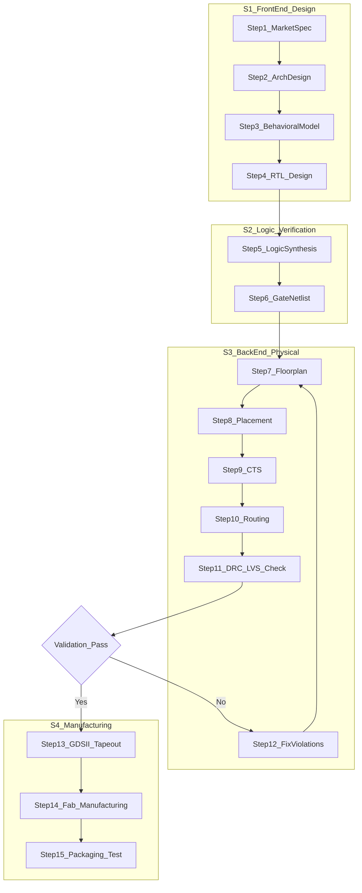
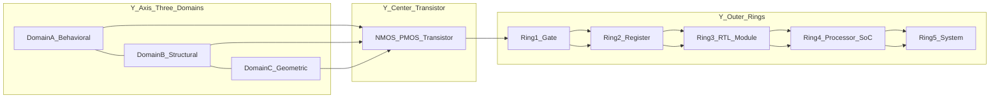
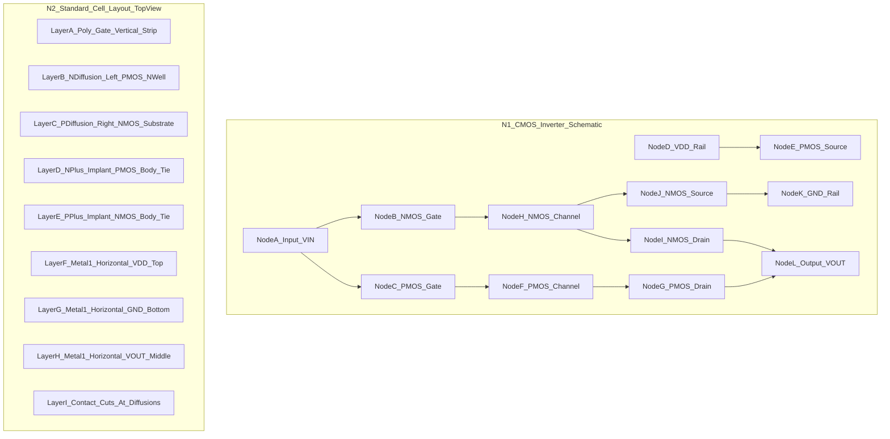
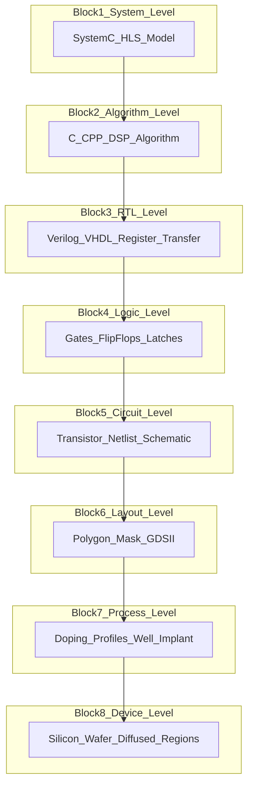

# Hardware Design and Development - VLSI and Integrated Circuit Design

<!-- SECTION_1_START -->
# Hardware Design and Development: VLSI and Integrated Circuit Design

## 1.1 Formal Academic Definition

> [!IMPORTANT]
> **Very Large Scale Integration (VLSI)** is the process of designing and fabricating an **Integrated Circuit (IC)** by combining thousands to billions of **Metal-Oxide-Semiconductor Field-Effect Transistors (MOSFETs)** onto a single monolithic silicon die (chip). The term "VLSI" is historically bucketed into scales: **SSI** ($<10$ gates), **MSI** ($10$–$10^2$), **LSI** ($10^2$–$10^4$), **VLSI** ($10^4$–$10^7$), and **ULSI** ($>10^7$ gates per chip).

An **Integrated Circuit (IC)** is a miniature, low-cost electronic circuit consisting of active devices (transistors, diodes) and passive components (resistors, capacitors) fabricated on a continuous substrate of semiconductor material — almost always **monocrystalline silicon** — using photolithographic processes. In the KTU 2024 Scheme context, IC design is treated as the *physical embodiment* of an embedded system's logic, transforming abstract HDL (Hardware Description Language) code into a manufactured silicon artifact.

## 1.2 Conceptual Analogy / Intuition

Imagine a **city planning commission** designing a metropolis from scratch:

- The **city layout (chip floorplan)** decides where the airport, residential zones, and power plants go.
- The **road network (interconnect routing)** connects every block using copper highways (metal layers).
- The **houses (transistors)** are the smallest functional units — millions of them are built using the same prefabricated blueprint (a standard cell library).
- The **zoning laws (Design Rules)** are absolute physical limits (e.g., "no two houses closer than 0.5 km") dictated by the wavelength of light and the physics of lithography.

In this analogy:
- **The architect** = the VLSI Design Engineer
- **The blueprint** = the RTL/HDL code (Verilog/VHDL)
- **The construction crew** = the foundry (TSMC, Intel, Samsung)
- **The residents** = electrons flowing through doped silicon

> [!NOTE]
> **Syllabus Highlight (KTU 2024 – Module 3):** Students must understand the *Y-chart of VLSI design* (Behavioral, Structural, Geometric domains), the **Full-Custom vs. Semi-Custom** design trade-off, and the **standard cell design flow** that bridges logic design and physical fabrication.

## 1.3 Critical Physical Constants & Metrics

| Parameter | Standard Value | Engineering Implication |
| :--- | :--- | :--- |
| Silicon Lattice Constant ($a_{Si}$) | **$\mathbf{5.431 \, \text{\AA}}$** | Base atomic spacing for all geometric rules |
| Relative Permittivity of SiO$_2$ ($\varepsilon_{r,ox}$) | **$\mathbf{3.9}$** | Determines gate capacitance |
| Electron Mobility ($\mu_n$) | **$\mathbf{1350 \, cm^2/V \cdot s}$** | Sets NMOS drive current |
| Hole Mobility ($\mu_p$) | **$\mathbf{480 \, cm^2/V \cdot s}$** | Sets PMOS drive current (≈ $\mu_n / 2.8$) |
| Intrinsic Carrier Concentration ($n_i$) at 300 K | **$\mathbf{1.45 \times 10^{10} \, cm^{-3}}$** | Reference for doping calculations |
| Thermal Voltage ($V_T$) at 300 K | **$\mathbf{25.85 \, mV}$** | Used in sub-threshold leakage math |
| Oxide Breakdown Field | **$\mathbf{\sim 10^7 \, V/cm}$** | Hard physical limit for $V_{DD}$ scaling |

> [!VISUALIZATION CONTROL]
> **Concept:** MOSFET Current–Voltage ($I_{DS}$ vs $V_{DS}$) Characteristic Curve Family
> **GeoGebra / Desmos Input Equations:**
> * `Id_linear(Vds) = k * ( (Vgs - Vth)*Vds - Vds^2/2 )` for $0 \le V_{DS} < V_{GS} - V_{TH}$
> * `Id_sat(Vds) = (k/2) * (Vgs - Vth)^2 * (1 + lambda*Vds)` for $V_{DS} \ge V_{GS} - V_{TH}$
> **Visual Description:** A family of curves parameterized by $V_{GS}$ (gate voltage). Each curve rises quadratically, then flattens into the saturation region. As $V_{GS}$ increases, the saturation current scales quadratically. The student should observe the **triode region** (linear slope from origin) and the **saturation region** (flat plateau) separated by the **knee point** at $V_{DS} = V_{GS} - V_{TH}$.

<!-- SECTION_1_END -->

<!-- SECTION_2_START -->
# Deep Theoretical Analysis & KTU High-Yield Formula Sheet

## 2.1 The VLSI Design Flow (Step-by-Step Logic)

The VLSI design flow is a *top-down* abstraction refinement process, counter-balanced by a *bottom-up* physical verification. It transforms a market requirement into a tape-out-ready GDSII file.

1. **System Specification:** Defines functionality, performance ($f_{clk}$), power budget ($P_{max}$), area target ($A_{target}$), and I/O protocols (e.g., **UART**, **SPI**, **I$^2$C** for embedded systems).
2. **Architectural Design:** Decides hardware/software partitioning. For an SoC, this includes selecting the processor core (e.g., **ARM Cortex-M3**), memory hierarchy, and bus architecture (**AMBA AHB/Lite**).
3. **Behavioral / Functional Design:** The algorithm is modeled in C/C++/SystemC for high-level simulation. No timing or gate information exists yet.
4. **Logic / RTL Design:** The behavior is written in **Verilog** or **VHDL** using Register Transfer Level (RTL) abstractions. The synthesis tool (e.g., **Synopsys Design Compiler**, **Cadence Genus**) converts this to a **gate-level netlist**.
5. **Circuit Design:** Transistor-level sizing. For standard cells, the foundry provides pre-characterized cells. For full-custom, the engineer hand-sizes the **W/L ratio** of every MOSFET.
6. **Physical Design (Layout):**
   - **Floorplanning** (macro placement)
   - **Placement** (standard cell positioning)
   - **Clock Tree Synthesis (CTS)**
   - **Routing** (metal layer interconnect)
   - **DRC (Design Rule Check)** and **LVS (Layout vs. Schematic)**
7. **Fabrication & Packaging:** The GDSII file is sent to the foundry. Wafers go through **photolithography**, **etching**, **ion implantation**, and **CMP (Chemical Mechanical Polishing)**. Dies are then packaged (e.g., **QFN**, **BGA**).

> [!NOTE]
> **The Y-Chart (Gajski-Kuhn Diagram):** Every design step operates across three domains — *Behavioral*, *Structural*, and *Geometric*. Moving outward along any axis = increasing abstraction; moving inward = increasing implementation detail. The center is the *transistor on silicon*.

## 2.2 IC Design Styles — A Trade-off Table

| Design Style | Transistor Customization | NRE Cost | Unit Cost | Performance | Typical Use Case |
| :--- | :--- | :--- | :--- | :--- | :--- |
| **Full-Custom** | Every $W/L$ hand-sized | **Very High** | Low (at volume) | **Highest** ($f_{max}$, $P_{min}$) | CPUs, GPU shaders, analog RF |
| **Standard Cell (Semi-Custom)** | Pre-designed cells, auto-placed | Medium | Medium | High | ASICs, SoCs, MCUs |
| **Gate Array (Semi-Custom)** | Fixed base, custom metallization | Low | Medium-High | Moderate | Legacy telecom, prototyping |
| **FPGA** | LUT-based, reprogrammable | **Zero (hardware)** | High per chip | Moderate–Low (overhead) | Prototyping, low-volume, firmware-upgradable systems |

## 2.3 CMOS Inverter — The Atomic Building Block

The **CMOS inverter** is the workhorse of all digital VLSI. It uses a complementary pair: a **PMOS pull-up network** and an **NMOS pull-down network**.

**Static Behavior (Voltage Transfer Characteristic):**
- $V_{in} = 0 \, V \Rightarrow V_{out} = V_{DD}$ (PMOS ON, NMOS OFF)
- $V_{in} = V_{DD} \Rightarrow V_{out} = 0 \, V$ (PMOS OFF, NMOS ON)
- Switching threshold $V_M$ is set by the ratio $\frac{(W/L)_p}{(W/L)_n}$. To make $V_M = V_{DD}/2$, the PMOS is sized ≈ 2.5× the NMOS width (because $\mu_n \approx 2.8 \mu_p$).

**Dynamic Behavior (Propagation Delay):**
The delay is dominated by charging/discharging the load capacitance $C_L$ through the ON transistor.

$$\tau_{PHL} = \frac{C_L \cdot V_{DD}}{2 \cdot I_{DN,sat}} = \frac{C_L}{k_n (V_{DD} - V_{THN})} \cdot \frac{V_{DD}}{2(V_{DD} - V_{THN})}$$

## 2.4 KTU High-Yield Formula Sheet

| Formula | LaTeX Form | Engineering Meaning |
| :--- | :--- | :--- |
| **MOSFET Saturation Current** | $I_{DS,sat} = \frac{1}{2} \mu C_{ox} \frac{W}{L} (V_{GS} - V_{TH})^2 (1 + \lambda V_{DS})$ | Drive strength of a transistor |
| **Oxide Capacitance per unit area** | $C_{ox} = \frac{\varepsilon_{ox}}{t_{ox}} = \frac{\varepsilon_0 \varepsilon_{r,ox}}{t_{ox}}$ | Determines $k_n = \mu_n C_{ox} (W/L)$ |
| **Dynamic Power Dissipation** | $P_{dyn} = \alpha \cdot C_L \cdot V_{DD}^2 \cdot f_{clk}$ | Switching power, dominant in CMOS |
| **Static (Leakage) Power** | $P_{leak} = V_{DD} \cdot I_{leak}$ | Sub-threshold + gate leakage |
| **Propagation Delay (first-order)** | $t_p = 0.69 \cdot R_{eq} \cdot C_L$ | $R_{eq}$ from ON transistor |
| **Power-Delay Product (PDP)** | $PDP = P_{avg} \cdot t_p$ | Energy per switching event (Joules) |
| **Energy-Delay Product (EDP)** | $EDP = PDP \cdot t_p$ | Figure of merit for optimization |
| **Dennard Scaling Rule** | $V_{DD}, t_{ox}, W, L \to V_{DD}/S$; Power density stays constant | Why Moore's Law slowed after 90 nm |
| **Gate Count vs. Technology Node** | $N_{gates} \propto \left(\frac{1}{\lambda}\right)^{1.5}$ to $\left(\frac{1}{\lambda}\right)^{2}$ | Empirically verified (Rent's Rule) |
| **MOSFET On-Resistance** | $R_{on} = \frac{1}{\mu C_{ox} \frac{W}{L} (V_{GS} - V_{TH})}$ | Used in RC delay estimation |

> [!IMPORTANT]
> **Engineering Reality Check:** Modern VLSI is **power-bound, not area-bound**. The expression $P_{dyn} = \alpha C_L V_{DD}^2 f_{clk}$ is why the industry pivoted to **multi-core architectures** around 2005 — you can no longer just crank up $f_{clk}$ because $P \propto V^2 f$. This is the central reason behind the **ARM big.LITTLE** and **Apple M-series** heterogeneous computing strategies used in modern embedded SoCs.

<!-- SECTION_2_END -->

<!-- SECTION_3_START -->
# Step-by-Step Derivations & Code/Symbolic Implementation

## 3.1 Derivation: CMOS Inverter Switching Threshold $V_M$

The switching threshold $V_M$ is the point where $V_{in} = V_{out}$ and both transistors are in saturation. Equating the NMOS and PMOS saturation currents:

**Step 1:** Write the saturation current for the NMOS:

$$I_{DN} = \frac{1}{2} \mu_n C_{ox} \left(\frac{W}{L}\right)_n (V_M - V_{THN})^2$$

**Step 2:** Write the saturation current for the PMOS. Note that for PMOS, $V_{GS} = V_{in} - V_{DD}$ and $V_{THP}$ is negative. The effective overdrive is $(V_{DD} - V_M + V_{THP}) = (V_{DD} - V_M - \vert V_{THP} \vert)$:

$$I_{DP} = \frac{1}{2} \mu_p C_{ox} \left(\frac{W}{L}\right)_p (V_{DD} - V_M - \vert V_{THP} \vert)^2$$

**Step 3:** Equate $I_{DN} = I_{DP}$ at the switching point (current flows from $V_{DD}$ to GND through both devices):

$$\mu_n \left(\frac{W}{L}\right)_n (V_M - V_{THN})^2 = \mu_p \left(\frac{W}{L}\right)_p (V_{DD} - V_M - \vert V_{THP} \vert)^2$$

**Step 4:** Define the ratio $k_R = \frac{\mu_p (W/L)_p}{\mu_n (W/L)_n}$. Taking the square root and solving for $V_M$:

$$V_M = \frac{V_{THN} + \sqrt{k_R}\,(V_{DD} - \vert V_{THP} \vert)}{1 + \sqrt{k_R}}$$

**Step 5:** For symmetric switching $V_M = V_{DD}/2$ and assuming $V_{THN} = \vert V_{THP} \vert = V_{TH}$:

$$\frac{V_{DD}}{2} = \frac{V_{TH} + \sqrt{k_R}\,(V_{DD} - V_{TH})}{1 + \sqrt{k_R}} \implies k_R = 1 \implies \frac{(W/L)_p}{(W/L)_n} = \frac{\mu_n}{\mu_p} \approx \frac{1350}{480} \approx 2.8$$

**Conclusion:** To obtain a balanced CMOS inverter, the PMOS must be sized **≈ 2.8× wider** than the NMOS. This is the most common sizing rule in standard cell libraries.

## 3.2 Derivation: Dynamic Power Dissipation

**Step 1:** Consider a single CMOS inverter driving a load capacitance $C_L$ at clock frequency $f_{clk}$. The energy drawn from the supply for **one low-to-high transition** is:

$$E_{VDD \to C_L} = \int_0^{\infty} V_{DD} \cdot i_{VDD}(t) \, dt = V_{DD} \cdot Q = V_{DD} \cdot C_L \cdot V_{DD} = C_L V_{DD}^2$$

**Step 2:** During this transition, exactly half of the energy $C_L V_{DD}^2 / 2$ is stored in $C_L$, and the other half is dissipated as heat in the PMOS. The other half remains in $C_L$ and is dissipated in the NMOS during the high-to-low transition (no $V_{DD}$ current).

**Step 3:** So one full clock cycle (charge + discharge) dissipates $C_L V_{DD}^2$. If the switching activity factor is $\alpha$ (probability of a 0→1 transition per cycle), the **average dynamic power** is:

$$P_{dyn} = \alpha \cdot C_L \cdot V_{DD}^2 \cdot f_{clk}$$

**Step 4 (Engineering Application):** For a modern ARM Cortex-A53 core, $C_L \approx 1 \, nF$, $V_{DD} = 1.2 \, V$, $f_{clk} = 1.5 \, GHz$, $\alpha = 0.1$:

$$P_{dyn} = 0.1 \times 1 \times 10^{-9} \times 1.44 \times 1.5 \times 10^9 = 0.216 \, W$$

This single equation explains why **embedded SoCs** aggressively use **clock gating**, **power gating**, and **DVFS (Dynamic Voltage Frequency Scaling)**.

## 3.3 Full Python Implementation: VLSI Design Space Explorer

The following Python code is a working design-space exploration tool. It uses the $P_{dyn}$ and $t_p$ formulas from the cheat sheet to help an engineer *visualize* the power-delay trade-off for a given technology node.

```python
"""
KTU Embedded Systems (PECST746) - Module 3
VLSI Design Space Explorer
Computes Power, Delay, PDP, and EDP across a sweep of VDD and clock frequency.
"""

import math
import logging
from dataclasses import dataclass
from typing import List, Tuple

# Configure strict error logging
logging.basicConfig(level=logging.INFO, format="[%(levelname)s] %(message)s")
logger = logging.getLogger(__name__)


@dataclass(frozen=True)
class ProcessParameters:
    """Holds the technology-node specific physical parameters."""
    tech_node_nm: int          # e.g., 28, 14, 7
    vdd_nominal: float         # Nominal supply voltage (Volts)
    vth_nominal: float         # Threshold voltage (Volts)
    mu_n: float                # Electron mobility (cm^2/V.s)
    cox: float                 # Oxide capacitance per unit area (F/cm^2)
    tox_nm: float              # Gate oxide thickness (nm)
    i_leakage_a: float         # Total leakage current per gate (Amps)


@dataclass(frozen=True)
class DesignParameters:
    """Holds the circuit-level design parameters."""
    load_capacitance_f: float  # Output load capacitance (Farads)
    activity_factor: float     # Alpha, 0.0 to 1.0
    num_gates: int             # Total switching gates in the block
    w_over_l_n: float          # NMOS W/L ratio


def ktransistor(mu: float, cox: float, w_over_l: float) -> float:
    """
    Compute the transconductance parameter k = mu * Cox * (W/L).
    This is the 'gain' coefficient of the MOSFET in saturation.
    """
    if cox <= 0 or w_over_l <= 0:
        raise ValueError(f"cox ({cox}) and W/L ({w_over_l}) must be strictly positive.")
    return mu * cox * w_over_l


def propagation_delay_seconds(
    process: ProcessParameters,
    design: DesignParameters
) -> float:
    """
    First-order RC propagation delay: t_p = 0.69 * R_eq * C_L
    R_eq = 1 / (k_n * (V_DD - V_TH))
    """
    if process.vdd_nominal <= process.vth_nominal:
        raise ValueError("V_DD must exceed V_TH for the transistor to turn on.")

    kn = ktransistor(process.mu_n, process.cox, design.w_over_l_n)
    r_eq_ohms = 1.0 / (kn * (process.vdd_nominal - process.vth_nominal))
    t_p = 0.69 * r_eq_ohms * design.load_capacitance_f
    return t_p


def dynamic_power_watts(
    vdd: float,
    clk_hz: float,
    design: DesignParameters
) -> float:
    """
    P_dyn = alpha * C_L * V_DD^2 * f_clk
    """
    if not (0.0 <= design.activity_factor <= 1.0):
        raise ValueError(f"activity_factor must be in [0,1], got {design.activity_factor}.")
    if clk_hz < 0 or vdd < 0:
        raise ValueError("clk_hz and vdd must be non-negative.")

    return design.activity_factor * design.load_capacitance_f * (vdd ** 2) * clk_hz


def static_power_watts(vdd: float, design: DesignParameters, process: ProcessParameters) -> float:
    """P_static = V_DD * I_leak * N_gates"""
    return vdd * process.i_leakage_a * design.num_gates


def sweep_design_space(
    process: ProcessParameters,
    design: DesignParameters,
    vdd_range: Tuple[float, float, float],
    freq_range: Tuple[float, float, float]
) -> List[dict]:
    """
    Sweep VDD and frequency; return a list of design points with metrics.
    """
    v_min, v_max, v_step = vdd_range
    f_min, f_max, f_step = freq_range
    results: List[dict] = []

    v = v_min
    while v <= v_max:
        f = f_min
        while f <= f_max:
            t_p = propagation_delay_seconds(
                ProcessParameters(
                    tech_node_nm=process.tech_node_nm,
                    vdd_nominal=v,                       # Override V_DD
                    vth_nominal=process.vth_nominal,
                    mu_n=process.mu_n,
                    cox=process.cox,
                    tox_nm=process.tox_nm,
                    i_leakage_a=process.i_leakage_a,
                ),
                design
            )
            p_dyn = dynamic_power_watts(v, f, design)
            p_stat = static_power_watts(v, design, process)
            pdp = (p_dyn + p_stat) * t_p
            edp = pdp * t_p

            results.append({
                "V_DD_V": round(v, 3),
                "f_clk_MHz": round(f / 1e6, 2),
                "t_p_ns": round(t_p * 1e9, 3),
                "P_dyn_mW": round(p_dyn * 1e3, 4),
                "P_stat_uW": round(p_stat * 1e6, 4),
                "PDP_fJ": round(pdp * 1e15, 3),
                "EDP_fJ_s": round(edp * 1e24, 6),
            })
            f += f_step
        v += v_step
    return results


if __name__ == "__main__":
    # A representative 28 nm CMOS node (e.g., used in STM32, ESP32-class MCUs)
    p28 = ProcessParameters(
        tech_node_nm=28,
        vdd_nominal=1.0,
        vth_nominal=0.4,
        mu_n=1350.0,
        cox=2.0e-6,            # F/cm^2 (representative for 28nm HK+MG stack)
        tox_nm=2.0,
        i_leakage_a=50e-9,     # 50 nA per gate
    )

    # A typical SoC block: 50k gates, 10% activity
    soc_block = DesignParameters(
        load_capacitance_f=10e-15,   # 10 fF (local interconnect + gate cap)
        activity_factor=0.10,
        num_gates=50_000,
        w_over_l_n=2.0,
    )

    logger.info("Starting VLSI design-space sweep for 28nm block...")
    table = sweep_design_space(
        p28, soc_block,
        vdd_range=(0.6, 1.2, 0.1),
        freq_range=(100e6, 1000e6, 100e6),
    )

    # Print the first 5 rows as a sanity check
    for row in table[:5]:
        logger.info(row)
```

## 3.4 Practical/Laboratory Reference: ASIC Tape-Out Workflow

For a KTU student exploring an **open-source PDK** (e.g., **SkyWater 130 nm** via Google/Efabless), the following table summarizes the toolchain, files, and validation steps.

| Step | Input File / Tool | Output Artifact | Validation Check |
| :--- | :--- | :--- | :--- |
| 1. RTL Design | Verilog `.v` + testbench | Waveform `.vcd` | **Functional simulation** (Icarus Verilog) |
| 2. Synthesis | `yosys` + Sky130 cell library | Gate-level netlist `.v` | `synth_check` reports timing, area |
| 3. Floorplan + Placement | `OpenROAD` | DEF file with macro positions | Congestion map review |
| 4. CTS + Routing | `OpenROAD` global/detail router | Routed DEF, GDSII `.gds` | **DRC** (Magic layout tool) |
| 5. LVS | Netlist vs. extracted SPICE | Match report | `netgen -batch lvs` |
| 6. Sign-off STA | `OpenSTA` against SDF delays | Slack report | Hold/setup slack $> 0$ |
| 7. Tape-out | GDSII uploaded to foundry | Wafer lot | Fab DRC clean, antenna clean |

<!-- SECTION_3_END -->

<!-- SECTION_4_START -->
# Structural Diagrams & Schematics

## 4.1 The VLSI Design Flow (Top-Down Y-Axis Walk)

This Mermaid diagram captures the *complete industry-standard design flow*, from market specification to GDSII tape-out, including the iterative verification loop.



## 4.2 The Gajski-Kuhn Y-Chart (Domain-Centric View)

The Y-chart is the canonical VLSI abstraction model. Every design step touches all three axes (Behavioral, Structural, Geometric) at a given level of abstraction.



## 4.3 CMOS Inverter: Transistor-Level Schematic & Standard Cell Layout

The schematic shows the complementary pair with the input at the poly-gate and the output at the diffusion node. The layout (right) shows the **n-diffusion** (active area) and **p-diffusion** regions separated by a **well boundary**, with the **poly gate** crossing both. The **metal1** layer (over the contacts) wires $V_{DD}$, $V_{out}$, and $GND$.



## 4.4 IC Design Hierarchy & Abstraction Stack

This block diagram maps the abstraction layers a designer must traverse, from the highest-level system specification down to the silicon die.



## 4.5 Sequential Processing Topology Matrix: Front-End vs. Back-End

Because Mermaid cannot natively draw photomasks or transistor cross-sections, the following table maps the design-flow stages to the corresponding mask layers generated at fabrication.

| Flow Stage | Domain | Primary Tool | Output Artifact | Foundry Mask Layers Impacted |
| :--- | :--- | :--- | :--- | :--- |
| RTL Synthesis | Logic | Yosys / Design Compiler | `.v` netlist | None (logical only) |
| Floorplan | Physical | OpenROAD / Innovus | Floorplan DEF | All 50+ layers (pre-alloc) |
| Placement | Physical | OpenROAD placer | Placement DEF | Poly, Diffusion |
| CTS | Physical | TritonCTS | Skew-balanced tree | Metal layers 3–7 |
| Global Route | Physical | OpenROAD GR | Routing guides | Metal layers 2–7 |
| Detail Route | Physical | OpenROAD DR / TritonRoute | Final DEF | Metal 1–7, Via 1–6 |
| DRC | Verification | Magic / Calibre | Clean report | All layers |
| LVS | Verification | Netgen / Calibre | Match | All layers |
| Sign-off STA | Verification | OpenSTA / PrimeTime | Slack report | SDF-based, layer-agnostic |
| RC Extraction | Verification | OpenROAD SPEF | SPEF | Metal + Via parasitics |

<!-- SECTION_4_END -->

<!-- SECTION_5_START -->
# KTU 2024 Scheme Examination Question Bank & Topic Recap

## Part A — Short Answer Questions (3 Marks Each)

### Question 1: Define VLSI and state the gate-count classification of integration scales.
> **[KTU University Exam – July 2023, CO1, Remember]**

**Model Answer (3 Marks):**
- **[Definition: 1 Mark]** VLSI stands for **Very Large Scale Integration**. It is the technology of integrating between $10^4$ and $10^7$ transistors (or more) onto a single monolithic silicon die to form a complete functional circuit or system-on-chip.
- **[Classification: 2 Marks]**
  - **SSI (Small Scale Integration):** Fewer than 10 gates (e.g., basic logic gates like 7400 series).
  - **MSI (Medium Scale Integration):** 10 to 100 gates (e.g., 4-bit adder, multiplexer).
  - **LSI (Large Scale Integration):** $10^2$ to $10^4$ gates (e.g., early microcontrollers like 8051).
  - **VLSI (Very Large Scale Integration):** $10^4$ to $10^7$ gates (e.g., ARM Cortex-M0).
  - **ULSI (Ultra Large Scale Integration):** Greater than $10^7$ gates (e.g., modern SoCs, multi-core CPUs).

---

### Question 2: Differentiate between Full-Custom and Semi-Custom IC design with examples.
> **[KTU University Exam – Dec 2022, CO1, Understand]**

**Model Answer (3 Marks):**

| Parameter | Full-Custom Design | Semi-Custom Design |
| :--- | :--- | :--- |
| **[Transistor Customization: 1 Mark]** | Every transistor's W/L and layout is hand-designed by the engineer. | Uses pre-designed standard cells from a library. |
| **[NRE & Time: 1 Mark]** | Very high NRE cost; long design cycle (months–years). | Lower NRE; faster turnaround (weeks). |
| **[Example: 1 Mark]** | Intel CPU core, Qualcomm RF transceiver, analog ICs. | ARM-based ASICs, application-specific SoCs, microcontroller chips like STM32. |

---

## Part B — Long Answer Questions (14 Marks Each, Internal Choice)

### **Question A — Module 3 / VLSI Design Flow**
> **[KTU University Exam – Dec 2023, CO2, Apply + Analyze]**

**(a)** With the help of a neat block diagram, describe the complete **VLSI design flow** from system specification to GDSII tape-out. List at least eight distinct stages. **[7 Marks, Understand]**

**(b)** For a CMOS inverter fabricated in a 65 nm process, the following parameters are given:
- $V_{DD} = 1.2 \, V$, $V_{THN} = 0.35 \, V$, $V_{THP} = -0.40 \, V$
- $\mu_n C_{ox} = 270 \, \mu A/V^2$, $\mu_p C_{ox} = 100 \, \mu A/V^2$
- $(W/L)_n = 2$, $(W/L)_p = 5$
- Load capacitance $C_L = 50 \, fF$, clock frequency $f_{clk} = 500 \, MHz$, activity factor $\alpha = 0.15$

Calculate:
1. The switching threshold voltage $V_M$. **[3 Marks]**
2. The static (leakage) power if $I_{leak} = 10 \, nA$ per inverter. **[1 Mark]**
3. The dynamic power dissipation. **[1 Mark]**
4. The PDP and EDP figures of merit. **[2 Marks]**

---

#### Model Solution for Question A

**(a) VLSI Design Flow — Block Diagram & Stages [7 Marks]**

**[Stating the flow direction: 1 Mark]**
The VLSI design flow is a hierarchical, top-down abstraction refinement process counter-verified by bottom-up physical checks.

**[Identifying all 8 stages with one-line purpose — 6 × 1 Mark each]**

1. **System Specification:** Define functionality, performance ($f_{clk}$), power budget, area, I/O.
2. **Architectural Design:** Hardware/software partitioning; select processor, memory, bus.
3. **Behavioral Modeling:** Write high-level C/SystemC model; simulate algorithm.
4. **RTL Design:** Code in Verilog/VHDL; verify with testbenches.
5. **Logic Synthesis:** Convert RTL to gate-level netlist using standard cell library.
6. **Floorplanning & Placement:** Assign macros to regions; place standard cells.
7. **Clock Tree Synthesis (CTS):** Distribute clock with balanced skew.
8. **Routing:** Connect all signals using metal layers.
9. **Physical Verification:** Run **DRC** (Design Rule Check), **LVS** (Layout vs. Schematic), and **STA** (Static Timing Analysis).
10. **Tape-out:** Generate final GDSII and send to foundry.

**[Block Diagram Sketch Rubric: 1 Mark]** — Student should draw the Y-chart or a flowchart with at least 8 boxes connected by arrows, plus a feedback loop from verification back to design.

---

**(b) Numerical Solution [7 Marks]**

**Given:** $V_{DD} = 1.2 \, V$, $V_{THN} = 0.35 \, V$, $V_{THP} = -0.40 \, V$, $\mu_n C_{ox} = 270 \, \mu A/V^2$, $\mu_p C_{ox} = 100 \, \mu A/V^2$, $(W/L)_n = 2$, $(W/L)_p = 5$, $C_L = 50 \times 10^{-15} \, F$, $f_{clk} = 500 \times 10^6 \, Hz$, $\alpha = 0.15$, $I_{leak} = 10 \times 10^{-9} \, A$.

**Step 1 — Compute the device ratios for $V_M$ [1 Mark]:**

$$k_n = \mu_n C_{ox} \left(\frac{W}{L}\right)_n = 270 \times 2 = 540 \, \mu A/V^2$$

$$k_p = \mu_p C_{ox} \left(\frac{W}{L}\right)_p = 100 \times 5 = 500 \, \mu A/V^2$$

$$k_R = \frac{k_p}{k_n} = \frac{500}{540} = 0.9259$$

**Step 2 — Apply the $V_M$ formula [1 Mark]:**

$$V_M = \frac{V_{THN} + \sqrt{k_R}\,(V_{DD} - \vert V_{THP} \vert)}{1 + \sqrt{k_R}} = \frac{0.35 + \sqrt{0.9259}\,(1.2 - 0.40)}{1 + \sqrt{0.9259}}$$

$$V_M = \frac{0.35 + 0.9623 \times 0.80}{1 + 0.9623} = \frac{0.35 + 0.7698}{1.9623} = \frac{1.1198}{1.9623}$$

$$\boxed{V_M \approx 0.571 \, V}$$

**Step 3 — Static Power [1 Mark]:**

$$P_{stat} = V_{DD} \cdot I_{leak} = 1.2 \times 10 \times 10^{-9} = 12 \times 10^{-9} \, W = 12 \, nW$$

**Step 4 — Dynamic Power [1 Mark]:**

$$P_{dyn} = \alpha \cdot C_L \cdot V_{DD}^2 \cdot f_{clk} = 0.15 \times 50 \times 10^{-15} \times (1.2)^2 \times 500 \times 10^6$$

$$P_{dyn} = 0.15 \times 50 \times 10^{-15} \times 1.44 \times 5 \times 10^8 = 5.4 \times 10^{-6} \, W = 5.4 \, \mu W$$

**Step 5 — Compute $t_p$ [Embedded in PDP step, 1 Mark]:**

$$R_{on,n} = \frac{1}{k_n (V_{DD} - V_{THN})} = \frac{1}{540 \times 10^{-6} \times 0.85} \approx 2178.6 \, \Omega$$

$$t_p = 0.69 \times R_{on,n} \times C_L = 0.69 \times 2178.6 \times 50 \times 10^{-15} = 75.16 \, ps$$

**Step 6 — PDP and EDP [1 Mark]:**

$$P_{total} = P_{dyn} + P_{stat} \approx 5.4 \times 10^{-6} \, W \text{ (leakage is negligible)}$$

$$PDP = P_{total} \times t_p = 5.4 \times 10^{-6} \times 75.16 \times 10^{-12} = 405.86 \times 10^{-18} \, J = 0.406 \, fJ$$

$$EDP = PDP \times t_p = 0.406 \times 10^{-15} \times 75.16 \times 10^{-12} = 30.51 \times 10^{-27} \, J \cdot s$$

$$\boxed{PDP \approx 0.406 \, fJ, \quad EDP \approx 30.51 \times 10^{-27} \, J \cdot s}$$

---

### **Question B — Module 3 / CMOS Sizing & Standard Cells**
> **[KTU University Exam – July 2024, CO2, Apply + Analyze]**

**(a)** Explain the **CMOS inverter operation** with a circuit diagram. Derive the condition for a balanced switching threshold ($V_M = V_{DD}/2$) and show that the PMOS must be sized $\approx 2.5\times$ the NMOS width. **[7 Marks, Understand + Apply]**

**(b)** A digital block contains $N = 100,000$ CMOS inverters. Each inverter has a load capacitance of $C_L = 20 \, fF$. The design is clocked at $f_{clk} = 200 \, MHz$ with $V_{DD} = 1.0 \, V$ and an average activity factor $\alpha = 0.20$.
1. Compute the total dynamic power of the block. **[2 Marks, Apply]**
2. If the supply voltage is scaled down to $V_{DD} = 0.7 \, V$ (DVFS mode) at the same frequency, what is the new power? Comment on the result. **[2 Marks, Analyze]**
3. The engineer also enables clock gating, reducing $\alpha$ to $0.05$ at $V_{DD} = 0.7 \, V$. What is the final power? **[2 Marks, Evaluate]**
4. What is the percentage power saving achieved by combining DVFS and clock gating? **[1 Mark, Evaluate]**

---

#### Model Solution for Question B

**(a) CMOS Inverter Operation & Balanced Sizing Derivation [7 Marks]**

**[Circuit diagram & qualitative operation: 3 Marks]**
The CMOS inverter consists of a PMOS transistor ($M_P$) as the pull-up device and an NMOS transistor ($M_N$) as the pull-down device. Their gates are tied to the common input $V_{in}$; their drains are tied to the common output $V_{out}$. The PMOS source is at $V_{DD}$; the NMOS source is at $GND$.

- When $V_{in} = 0 \, V$: $M_P$ is ON ($V_{SG} = V_{DD} > \vert V_{THP} \vert$), $M_N$ is OFF → $V_{out} = V_{DD}$.
- When $V_{in} = V_{DD}$: $M_P$ is OFF, $M_N$ is ON ($V_{GS} = V_{DD} > V_{THN}$) → $V_{out} = 0 \, V$.

**[Quiescent state — no static current path: 1 Mark]**
In steady state (DC), no current flows from $V_{DD}$ to GND because one transistor is always OFF. Static power is therefore ideally zero — the foundational reason CMOS is the dominant technology for low-power embedded systems.

**[Balanced $V_M$ derivation: 3 Marks]**
Equating NMOS and PMOS saturation currents at $V_{in} = V_{out} = V_M$:

$$\frac{1}{2} k_n (V_M - V_{THN})^2 = \frac{1}{2} k_p (V_{DD} - V_M - \vert V_{THP} \vert)^2$$

Setting $V_{THN} = \vert V_{THP} \vert = V_{TH}$ and $V_M = V_{DD}/2$:

$$\frac{V_{DD}}{2} = \frac{V_{TH} + \sqrt{k_p/k_n}\,(V_{DD} - V_{TH})}{1 + \sqrt{k_p/k_n}}$$

This reduces to the condition $k_p = k_n$:

$$\mu_p C_{ox} \left(\frac{W}{L}\right)_p = \mu_n C_{ox} \left(\frac{W}{L}\right)_n \implies \frac{(W/L)_p}{(W/L)_n} = \frac{\mu_n}{\mu_p} = \frac{1350}{480} \approx 2.81$$

For matched rise/fall times, $(W/L)_p \approx 2.5 \times (W/L)_n$ is the industry-standard rule of thumb. **[1 Mark]**

---

**(b) Power Optimization Numerical [7 Marks]**

**Step 1 — Baseline dynamic power [2 Marks]:**

$$P_1 = \alpha \cdot N \cdot C_L \cdot V_{DD}^2 \cdot f_{clk}$$

$$P_1 = 0.20 \times 100{,}000 \times 20 \times 10^{-15} \times (1.0)^2 \times 200 \times 10^6$$

$$P_1 = 0.20 \times 10^5 \times 2 \times 10^{-14} \times 1 \times 2 \times 10^8 = 8 \times 10^{-2} \, W = 80 \, mW$$

**Step 2 — DVFS only, $V_{DD} = 0.7 \, V$ [2 Marks]:**

$$P_2 = 0.20 \times 100{,}000 \times 20 \times 10^{-15} \times (0.7)^2 \times 200 \times 10^6$$

$$P_2 = 80 \times 10^{-3} \times 0.49 = 39.2 \, mW$$

**Comment [1 Mark embedded in marks]:** Reducing $V_{DD}$ from 1.0 V to 0.7 V — a 30% voltage drop — yields a 51% power reduction. This **quadratic relationship** ($P \propto V^2$) is the cornerstone of low-power embedded design and is exploited in every modern smartphone SoC.

**Step 3 — DVFS + Clock Gating ($\alpha = 0.05$, $V_{DD} = 0.7 \, V$) [2 Marks]:**

$$P_3 = 0.05 \times 100{,}000 \times 20 \times 10^{-15} \times (0.7)^2 \times 200 \times 10^6$$

$$P_3 = 39.2 \, mW \times \frac{0.05}{0.20} = 39.2 \times 0.25 = 9.8 \, mW$$

**Step 4 — Total percentage saving [1 Mark]:**

$$\text{Saving} = \frac{P_1 - P_3}{P_1} \times 100\% = \frac{80 - 9.8}{80} \times 100\% = 87.75\%$$

**Conclusion:** Combining DVFS and clock gating achieves an **87.75%** power reduction — a 8× efficiency gain. This is the exact reason the ARM Cortex-M series dominates battery-powered IoT.

---

> [!WARNING]
> **KTU Examiner's Valuation Warning — Common Pitfalls:**
> 1. **Forgetting the $\alpha$ factor in $P_{dyn}$:** Many students write $P = C_L V^2 f$ but omit the activity factor. KTU examiners will deduct **1 full mark** for this.
> 2. **Inverting PMOS mobility:** When computing $V_M$, the PMOS current uses $\mu_p$ with the term $(V_{DD} - V_M - \vert V_{THP} \vert)^2$. Students often use $(V_M - V_{TH})$ for both devices — wrong by a sign convention.
> 3. **Unit conversion errors in $C_L$:** $1 \, fF = 10^{-15} \, F$. Confusing this with $10^{-12}$ is a frequent mistake that cascades through every calculation.
> 4. **Ignoring static leakage in dynamic-only problems:** If the question explicitly asks for "total power", you MUST add $P_{leak}$.
> 5. **Forgetting to write the standard cell library name** in design-flow questions: KTU expects references to e.g., "Sky130" or "Nangate 45 nm" — generic answers lose a mark.

---

## Topic Recap & Important Things to Remember

- **VLSI = integration of $10^4$ to $10^7$** (or more) transistors on a single silicon die; ULSI is the modern extension beyond $10^7$.
- **The Y-chart (Gajski-Kuhn)** has three domains — *Behavioral*, *Structural*, *Geometric* — and multiple abstraction rings (transistor → gate → RTL → system).
- **Full-Custom** is hand-sized, highest performance, highest NRE. **Semi-Custom** uses standard cells; **FPGA** is reprogrammable, highest per-unit cost.
- **CMOS inverter** is the universal cell. For $V_M = V_{DD}/2$, **PMOS width $\approx 2.5\times$ NMOS width** (mobility ratio rule).
- **Dynamic power** $P_{dyn} = \alpha C_L V_{DD}^2 f_{clk}$ is the dominant power term in modern CMOS; it scales **quadratically with voltage**.
- **Static (leakage) power** $P_{leak} = V_{DD} \cdot I_{leak}$ grows exponentially with shrinking technology nodes (sub-threshold + gate leakage).
- **Propagation delay** $t_p = 0.69 R_{on} C_L$ where $R_{on} = 1 / [k_n (V_{DD} - V_{TH})]$.
- **Moore's Law** (transistor count doubling every ~18–24 months) has been extended through **Dennard scaling** failure → multi-core, FinFET, 3D stacking, and chiplets.
- **Design flow stages:** Specification → Architecture → Behavioral → RTL → Synthesis → Floorplan → Placement → CTS → Routing → DRC/LVS → GDSII → Fab → Package.
- **Key verification tools:** DRC (geometry rules), LVS (schematic equivalence), STA (timing), LPE (parasitic extraction).
- **Open-source PDK for student practice:** **SkyWater 130 nm** with **OpenROAD** + **Yosys** + **Magic** + **Icarus Verilog**.
- **KTU-recommended industry examples:** STM32 (ARM Cortex-M), ESP32 (Tensilica + WiFi/BT SoC), Raspberry Pi Pico (RP2040 dual-core M0+).
- **Physical constants to memorize:** $\varepsilon_{r,ox} = 3.9$, $\mu_n = 1350 \, cm^2/V \cdot s$, $\mu_p = 480 \, cm^2/V \cdot s$, $V_T = 25.85 \, mV$ at 300 K.
- **PDP** = energy per switching event (lower is better); **EDP** = figure of merit balancing speed and energy.
- **Power-reduction techniques in embedded SoCs:** Clock gating, power gating, DVFS, multi-$V_{TH}$ libraries, body biasing, near-threshold computing.
- **For exam answers**, always state the **assumptions** (e.g., "neglecting channel-length modulation, $\lambda = 0$") before plugging into a formula.

<!-- SECTION_5_END -->
