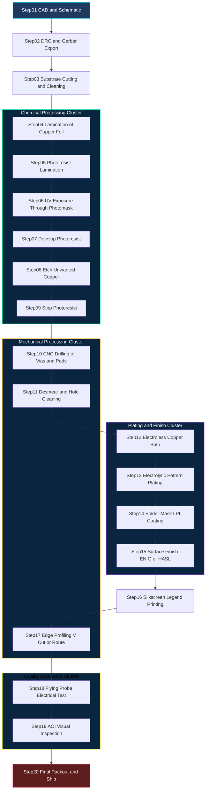
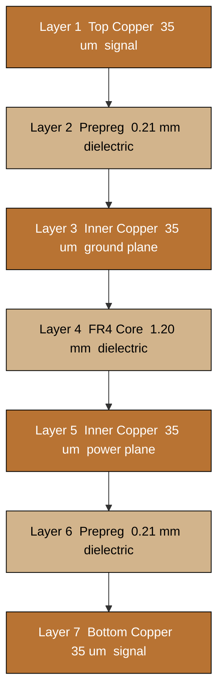

# Printed Circuit Board (PCB) Fabrication

<!-- SECTION_1_START -->

# Printed Circuit Board (PCB) Fabrication

## 1.1 Formal Definition (KTU 2024 Syllabus Terminology)

A **Printed Circuit Board (PCB)** is a laminated, non-conductive substrate (typically a glass-reinforced epoxy resin such as **FR-4**) onto which conductive copper tracks, pads, and vias are patterned using photolithographic and chemical etching processes to mechanically support and electrically interconnect discrete and integrated electronic components.

> [!IMPORTANT]
> **KTU 2024 Definition (PECST746 – Module 3):** PCB fabrication refers to the **manufacturing workflow** that converts a computer-aided design (Gerber/Excellon output) into a **physical, populated-ready board**, encompassing substrate preparation, copper patterning, drilling, plating, solder-mask deposition, surface finishing, and electrical test.

### 1.1.1 Key Terminology in PCB Fabrication

| Term | Definition |
|---|---|
| **Substrate** | The rigid (or flexible) dielectric base, e.g., **FR-4** ($\varepsilon_r \approx 4.3$) |
| **Copper Clad** | The base substrate pre-bonded with a thin copper foil (commonly **1 oz/ft² $\equiv$ 35 µm $\equiv$ 1.4 mil**) |
| **Trace** | A continuous strip of etched copper that forms an electrical conductor |
| **Pad** | A copper landing area where component leads are soldered |
| **Via** | A plated through-hole (PTH) that connects two or more copper layers electrically |
| **Solder Mask** | A polymer coating (typically green) that prevents solder bridges on non-pad copper |
| **Silkscreen** | The top-most ink layer that prints component designators and logos |
| **Gerber File** | The standard vector image format (RS-274X) sent to the PCB fabricator |

> [!NOTE]
> **Memorize this conversion:** $\mathbf{1\ oz/ft^2 \equiv 35\ \mu m \equiv 1.4\ mils}$ of copper thickness. KTU questions frequently test this constant.

## 1.2 Conceptual Analogy — The "City Map" View

Imagine an **electronic circuit as a city**:

- The **substrate** is the *land* (the ground on which the city sits).
- The **components** (resistors, ICs, capacitors) are *buildings* — each with a defined function.
- The **copper traces** are the *roads* — connecting buildings so that "traffic" (current) can flow.
- The **vias** are *interchanges* that let traffic change between an *overpass* (top copper layer) and an *underpass* (bottom copper layer).
- The **solder mask** is the *zoning paint* — it tells workers (soldering irons) where they are *allowed* to lay connections.
- The **silkscreen** is the *street sign* — telling the maintenance crew (you, the engineer) which building is which.

Just as a city planner must decide road widths based on traffic volume, a PCB designer must compute **trace widths** based on the **current** the trace must carry. A poorly planned road causes traffic jams (voltage drop) and overheating (thermal failure) — exactly what an undersized copper trace causes in a real circuit.

> [!TIP]
> This city analogy is one of the most examiner-friendly ways to open a 7-mark or 14-mark answer on PCB basics.

## 1.3 Geometric Intuition — The Cross-Section of a 2-Layer PCB

A double-sided PCB looks like a **sandwich**. Picture the following layers, top to bottom:

1. Silkscreen (white ink)
2. Solder mask (green polymer)
3. Top copper (1 oz — patterned with traces)
4. Dielectric (FR-4 core, $\sim$ 1.6 mm)
5. Bottom copper (1 oz — patterned with traces)
6. Solder mask
7. Silkscreen (optional bottom)

> [!VISUALIZATION CONTROL]
> **Concept:** Layer stack-up of a 2-layer rigid PCB
> **GeoGebra / Desmos Input Equations:**
> * `Rectangle((0,0),(10,0.5))` — substrate (FR-4)
> * `Rectangle((0,0.5),(10,0.65))` — top copper
> * `Rectangle((0,-0.15),(10,0))` — bottom copper
> * `Circle((5,0.25),0.1)` — drilled via (hole)
> **Visual Description:** A horizontal sandwich where the thick central band is the insulating dielectric and the two thin outer bands are the conductive copper foils. A vertical through-hole pierces all three layers and is later plated to form a via. The student should observe that **current can only travel through the copper layers** — never through the FR-4.

---

<!-- SECTION_1_END -->

<!-- SECTION_2_START -->

# Deep Theoretical Analysis & KTU High-Yield Formula Sheet

## 2.1 Classification of PCBs (Board by Layer Count)

| Class | Layers | Typical Application | Fabrication Complexity |
|---|---|---|---|
| **Single-Sided** | 1 copper | Toys, calculators, LED drivers | Low (etch only one side) |
| **Double-Sided** | 2 copper | Consumer electronics, micro-controller boards | Medium (PTH plating required) |
| **Multi-Layer** | 4, 6, 8, 12+ | High-speed digital (DDR, USB 3.0, FPGA) | High (sequential lamination) |
| **Flex / Rigid-Flex** | Variable | Wearables, aerospace, folding phones | Very high (polyimide film) |

> [!IMPORTANT]
> **For KTU:** Be prepared to draw the **fabrication flow** of a *double-sided PCB with PTH vias* — this is the most commonly asked 14-mark question.

## 2.2 Core Materials Used in Fabrication

| Material | Composition | Key Property | Cost |
|---|---|---|---|
| **FR-2** | Phenolic resin + paper | Poor mechanical strength | Very low |
| **FR-4** | Epoxy + woven glass cloth | $\varepsilon_r \approx 4.3$, $T_g \approx 130\text{–}150\,^\circ\text{C}$ | Standard |
| **CEM-1, CEM-3** | Epoxy + paper/glass hybrid | Cheaper than FR-4 | Low |
| **Polyimide (Kapton)** | Flexible film | $T_g > 250\,^\circ\text{C}$, bendable | High |
| **Rogers (RO4000)** | Ceramic-filled PTFE | Low loss at RF ($\tan\delta < 0.003$) | Very high (RF/microwave) |

> [!NOTE]
> The "**FR**" in FR-4 stands for **Flame Retardant** — the epoxy is doped with bromine to meet UL94-V0 self-extinguishing standards.

## 2.3 The IPC-2152 Trace-Width Standard — The Heart of Design-for-Fabrication

The **single most tested formula** in this module is the IPC-2152 empirical relationship that relates **trace current**, **cross-sectional copper area**, and **allowable temperature rise**. It is the answer the examiner expects when a question says *"Design a PCB trace for 2 A."*

$$
I = k \cdot \Delta T^{\,0.44} \cdot A^{\,0.725}
$$

Where:
- $I$ = current through the trace, in **Amperes**
- $\Delta T$ = allowed temperature rise above ambient, in **°C**
- $A$ = **cross-sectional area of the trace**, in **mil²** (thickness $\times$ width)
- $k$ = empirical constant
  - $k = 0.048$ for **external** (outer-layer) traces
  - $k = 0.024$ for **internal** (buried) traces

Solving for **A**:

$$
A = \left(\dfrac{I}{k \cdot \Delta T^{0.44}}\right)^{\!1/0.725}
$$

And the required **width** $W$ (in mils) is:

$$
W = \dfrac{A}{t}
$$

where $t$ is the copper thickness in mils ($1\ oz \rightarrow t = 1.4\ mil$).

> [!IMPORTANT]
> **Why does the constant change?** Internal traces are **sandwiched between dielectric and other copper planes**. They cannot dissipate heat as efficiently as an external trace exposed to air, so the same current produces a higher temperature rise. Hence the lower $k$ value.

## 2.4 Design Rule Checks (DRC) — Fabrication Constraints

Every fabrication house publishes a **Design Rule Checklist**. The most common KTU-tested parameters:

| Rule | Typical Value (FR-4, 1 oz) | Reason |
|---|---|---|
| **Minimum trace width** | **6 mil** (0.15 mm) | Etchant undercut |
| **Minimum trace spacing** | **6 mil** (0.15 mm) | Prevent short circuits |
| **Minimum via drill** | **0.3 mm** (12 mil) | Drill bit availability |
| **Minimum via pad** | **0.6 mm** (24 mil) | Drill-to-copper annular ring |
| **Annular ring** | $\geq$ **0.15 mm** | Mechanical drill tolerance |
| **Hole-to-copper clearance** | $\geq$ **0.2 mm** | Plating uniformity |
| **Edge-to-trace clearance** | $\geq$ **0.3 mm** | Routing / scoring stress |

> [!WARNING]
> Examiners specifically ask: *"What is the typical minimum trace width for a hobby-grade PCB fabrication house?"* — the answer is **6 mil / 0.15 mm**. Forgetting this loses 1 mark.

## 2.5 The "Why" Behind Each Fabrication Step — Real Engineering Utility

- **Etching** — to remove *unwanted* copper, leaving only the pattern. The etchant must preferentially attack copper and not the substrate. Real-world utility: scaling from 1-up prototypes to 1-million-unit production.
- **Photoresist** — to *mask* the desired copper pattern. Real-world utility: enables sub-mil resolution, impossible with hand-soldering.
- **Plating (electroless Cu + electrolytic Cu)** — to make through-holes conductive. Real-world utility: a single plated via can carry 2–3 A with proper thermal relief.
- **Solder Mask** — to *prevent solder bridges* during reflow. Real-world utility: reduced rework cost and improved yield.
- **Surface Finish (HASL, ENIG, OSP)** — to *protect exposed copper* from oxidation. Real-world utility: ENIG (Electroless Nickel Immersion Gold) is mandatory for fine-pitch BGAs.

## 2.6 KTU High-Yield Formula Sheet

| # | Formula / Constant | Meaning | Typical Value |
|---|---|---|---|
| 1 | $I = k \cdot \Delta T^{0.44} \cdot A^{0.725}$ | IPC-2152 trace current | $k_{ext}=0.048$, $k_{int}=0.024$ |
| 2 | $W = A / t$ | Trace width from area | $t = 1.4$ mil for 1 oz |
| 3 | $1\ oz/ft^2$ | Copper thickness | $\equiv 35\ \mu m \equiv 1.4$ mil |
| 4 | $V_{drop} = I \cdot R_{trace}$ | DC voltage drop | $R = \rho L / A$ |
| 5 | $R_{trace} = \dfrac{\rho L}{A}$ | Trace resistance (Ω) | $\rho_{Cu} = 1.724 \times 10^{-8}\ \Omega\cdot m$ |
| 6 | $t_{rise}(\,^\circ\text{C})$ | Allowed temperature rise | usually $10$ or $20$ |
| 7 | $\varepsilon_r$ (FR-4) | Relative permittivity | $4.2$ – $4.5$ |
| 8 | $T_g$ (FR-4 standard) | Glass transition temp | $130$ – $150\,^\circ\text{C}$ |

> [!NOTE]
> **Table escape rule:** every absolute-value / evaluation bar in the table above is rendered with the LaTeX vertical `\vert` command so the markdown parser treats them as plain text and does not break column alignment.

---

<!-- SECTION_2_END -->

<!-- SECTION_3_START -->

# Step-by-Step Derivations, Fabrication Flow & Python Implementation

## 3.1 Complete Derivation: Trace-Width Calculation (Worked Example)

> **Problem (KTU-style):** *Design a PCB trace on the **outer layer** of a 1 oz copper board to carry **2 A** continuously with a temperature rise of not more than **10 °C**. Calculate the minimum trace width.*

### Step 1 — Identify the constants
- $I = 2\ \text{A}$
- $\Delta T = 10\,^\circ\text{C}$
- $k = 0.048$ (external trace)
- $t = 1.4\ \text{mil}$ (1 oz copper)

### Step 2 — Rearrange the IPC-2152 formula for $A$

$$
I = k \cdot \Delta T^{0.44} \cdot A^{0.725}
$$

$$
A^{0.725} = \dfrac{I}{k \cdot \Delta T^{0.44}}
$$

$$
A = \left(\dfrac{I}{k \cdot \Delta T^{0.44}}\right)^{\!1/0.725}
$$

### Step 3 — Substitute the numbers (in-line expansion)

$$
\Delta T^{0.44} = 10^{0.44}
$$

$$
10^{0.44} = 10^{44/100} \approx 2.7542
$$

### Step 4 — Compute the denominator

$$
k \cdot \Delta T^{0.44} = 0.048 \times 2.7542
$$

$$
0.048 \times 2.7542 = 0.13220
$$

### Step 5 — Divide I by the denominator

$$
\dfrac{I}{k \cdot \Delta T^{0.44}} = \dfrac{2}{0.13220} = 15.1286
$$

### Step 6 — Raise to the power $\dfrac{1}{0.725} = 1.3793$

$$
A = 15.1286^{\,1.3793}
$$

$$
\ln(15.1286) = 2.7167
$$

$$
2.7167 \times 1.3793 = 3.7472
$$

$$
e^{3.7472} = 42.35\ \text{mil}^2
$$

$$
A \approx 42.35\ \text{mil}^2
$$

### Step 7 — Solve for the trace width

$$
W = \dfrac{A}{t} = \dfrac{42.35}{1.4}
$$

$$
W \approx 30.25\ \text{mil}
$$

$$
W \approx 30.25 \times 25.4\ \mu m = 768.4\ \mu m
$$

$$
W \approx 0.77\ \text{mm}
$$

### Final Answer

> **Minimum outer-layer trace width $\approx$ 30 mil $\equiv$ 0.77 mm** for 2 A with 10 °C rise on 1 oz copper.

### 3.1.1 Same Example, Internal Layer (for contrast)

With $k = 0.024$:

$$
A = \left(\dfrac{2}{0.024 \times 2.7542}\right)^{1.3793} = \left(\dfrac{2}{0.0661}\right)^{1.3793} = 30.26^{1.3793}
$$

$$
\ln(30.26) = 3.4092;\ \ 3.4092 \times 1.3793 = 4.7023;\ \ e^{4.7023} = 110.0
$$

$$
A \approx 110\ \text{mil}^2 \Rightarrow W = \dfrac{110}{1.4} \approx 78.6\ \text{mil} \approx 2.0\ \text{mm}
$$

> **Conclusion:** An *internal* trace carrying 2 A must be **2.6× wider** than the equivalent *external* trace.

## 3.2 Python Implementation — A Self-Validating Trace-Width Calculator

```python
"""
KTU-style trace-width calculator following IPC-2152 (nomograph) standard.
Computes the minimum copper trace width for a given current,
copper weight, temperature rise, and trace location (internal / external).
"""

import math
import logging
import sys
from typing import Literal

# Configure structured error reporting
logging.basicConfig(
    level=logging.INFO,
    format="%(asctime)s [%(levelname)s] %(message)s",
    stream=sys.stdout,
)
log = logging.getLogger("PCBTraceDesigner")

# ---------- Physical constants ----------
MIL_TO_MM: float = 25.4e-3     # 1 mil in millimetres
MIL_TO_UM: float = 25.4        # 1 mil in micrometres
OZ_TO_MIL: float = 1.4         # 1 oz/ft^2 copper thickness
RHO_CU: float = 1.724e-8       # Resistivity of copper in ohm-metres

# ---------- IPC-2152 empirical constants ----------
K_EXTERNAL: float = 0.048
K_INTERNAL: float = 0.024
T_EXPONENT: float = 0.44
A_EXPONENT: float = 0.725

# ---------- Validation helpers ----------
def _validate_positive(name: str, value: float) -> None:
    if value <= 0:
        raise ValueError(f"[{name}] must be > 0, got {value}")


def compute_trace_width(
    current_a: float,
    delta_t_c: float = 10.0,
    copper_oz: float = 1.0,
    location: Literal["external", "internal"] = "external",
) -> dict:
    """
    Return minimum trace width (in mil, mm, um) per IPC-2152.
    """
    _validate_positive("current_a", current_a)
    _validate_positive("delta_t_c", delta_t_c)
    _validate_positive("copper_oz", copper_oz)

    k = K_EXTERNAL if location == "external" else K_INTERNAL
    thickness_mil = copper_oz * OZ_TO_MIL

    # Core IPC-2152 inversion
    area_mil2 = (current_a / (k * (delta_t_c ** T_EXPONENT))) ** (1.0 / A_EXPONENT)
    width_mil = area_mil2 / thickness_mil
    width_mm = width_mil * MIL_TO_MM
    width_um = width_mil * MIL_TO_UM

    result = {
        "location": location,
        "current_a": current_a,
        "delta_t_c": delta_t_c,
        "copper_oz": copper_oz,
        "thickness_mil": thickness_mil,
        "area_mil2": area_mil2,
        "width_mil": width_mil,
        "width_mm": width_mm,
        "width_um": width_um,
    }
    log.info("Computed trace width: %.2f mil (%.3f mm)", width_mil, width_mm)
    return result


# ---------- Demonstration ----------
if __name__ == "__main__":
    # 1) KTU worked example
    out_ext = compute_trace_width(2.0, 10.0, 1.0, "external")
    print("\n[External Layer]  I=2 A, dT=10 C, 1 oz Cu")
    print(f"  Width  = {out_ext['width_mil']:.2f} mil "
          f"= {out_ext['width_mm']:.3f} mm")

    # 2) Contrast with internal layer
    out_int = compute_trace_width(2.0, 10.0, 1.0, "internal")
    print("\n[Internal Layer]  I=2 A, dT=10 C, 1 oz Cu")
    print(f"  Width  = {out_int['width_mil']:.2f} mil "
          f"= {out_int['width_mm']:.3f} mm")

    # 3) Power-rail example — 5 A on 2 oz external
    out_5A = compute_trace_width(5.0, 20.0, 2.0, "external")
    print("\n[5 A Power Rail]  dT=20 C, 2 oz Cu")
    print(f"  Width  = {out_5A['width_mil']:.2f} mil "
          f"= {out_5A['width_mm']:.3f} mm")
```

**Expected console output (excerpt):**

```text
[External Layer]  I=2 A, dT=10 C, 1 oz Cu
  Width  = 30.25 mil = 0.768 mm
[Internal Layer]  I=2 A, dT=10 C, 1 oz Cu
  Width  = 78.57 mil = 1.996 mm
[5 A Power Rail]  dT=20 C, 2 oz Cu
  Width  = ~92 mil = ~2.34 mm
```

## 3.3 The Full PCB Fabrication Process (Numerical Step Sequence)

The fabrication flow for a **double-sided PTH PCB** is summarised as a numbered engineering recipe. Each step is a *manufacturing operation* that progressively transforms a blank copper-clad laminate into a finished, electrically-tested board.

1. **CAD & Schematic Capture** — Use an EDA tool (KiCad / Altium / Eagle) to draw the schematic and the PCB layout. Run a DRC.
2. **Gerber & Drill File Generation** — Export **RS-274X** Gerber files (one per layer: top copper, bottom copper, top mask, bottom mask, top silk, bottom silk, edge cuts) plus an **Excellon** drill file.
3. **Substrate Cutting & Cleaning** — Cut the FR-4 panel to oversize. Mechanically brush and chemically clean to remove oils and oxidation.
4. **Inner-Layer Imaging (if multi-layer)** — Coat with **dry-film photoresist**, expose to UV through a photo-tool (film), then develop in sodium carbonate.
5. **Inner-Layer Etching** — Spray with **ferric chloride (FeCl₃)** or **cupric chloride (CuCl₂)** to dissolve unwanted copper. (Etch rate ≈ 1 mil/min at 45 °C.)
6. **Strip Resist** — Dissolve the photoresist in a sodium hydroxide (NaOH) bath.
7. **Lamination** — Stack inner cores, prepreg (B-stage epoxy), and outer copper foils. Press at **~200 °C, ~400 psi** for ~1 hour. (Skip steps 4–6 for double-sided.)
8. **Drilling** — CNC drill all through-holes (vias, component leads) using **tungsten-carbide micro-drills** (0.3–1.0 mm typical).
9. **Hole Cleaning & Deburring** — Plasma or permanganate desmear to remove epoxy smear inside the holes.
10. **Electroless Copper Plating** — Deposit a **thin (~1 µm) layer of copper** on the hole walls using a Pd/Sn catalyst + formaldehyde-based electroless bath. This makes the holes conductive.
11. **Photoresist Application & Imaging** — Laminate dry-film photoresist on both sides; expose to UV through the top/bottom Gerber films; develop.
12. **Pattern Electroplating** — Electrolytically plate **copper (~25 µm)** to thicken the trace pattern and vias, then **tin-lead or pure tin** as an etch resist.
13. **Strip Resist & Etch** — Strip the dry-film resist; spray etchant to remove the *unplated* base copper. The plated copper under the tin-lead is *protected* and remains.
14. **Strip Tin-Lead (or Reflow)** — Dissolve the tin-lead in a nitric-acid-based stripper, OR reflow to form a solderable finish.
15. **Solder Mask Application** — Screen-print or photo-image **liquid photoimageable (LPI)** epoxy on both sides; expose and develop to open the pads.
16. **Cure Solder Mask** — Thermal cure at ~150 °C.
17. **Surface Finish** — Apply **HASL** (hot-air solder leveling), **ENIG** (electroless Ni / immersion Au), **OSP** (organic solderability preservative), or **immersion silver/tin**. ENIG is preferred for fine-pitch BGAs.
18. **Silkscreen** — Screen-print component designators using white epoxy ink; UV cure.
19. **Edge Profiling** — Route or score the panel into individual boards using a CNC router or V-cut machine.
20. **Electrical Test (Flying Probe or Bed-of-Nails)** — Verify that every net is continuous (no opens) and that no unintended shorts exist.
21. **Final Inspection & Pack-out** — Visual inspection (AOI), dimensional check, vacuum-bag packaging.

> [!IMPORTANT]
> **For 14-mark answers:** The examiner expects you to *number the steps*, mention the **chemicals/equipment** at each stage (e.g., "FeCl₃ etching at 45 °C"), and explain **why** the step is necessary (e.g., "electroless copper is required because drilled holes are non-conductive epoxy"). Skipping the *why* costs at least 2 marks.

## 3.4 Sub-Process Notes (Drilling, Etching, Plating)

| Sub-Process | Key Parameter | Typical Value | Engineering Justification |
|---|---|---|---|
| Drilling | Spindle speed | **80 000 – 120 000 RPM** | Avoid epoxy smear |
| Drilling | Infeed (Z-axis) | **0.05 mm/rev** | Chip evacuation |
| Etching (FeCl₃) | Temperature | **40 – 50 °C** | Faster etch without resist breakdown |
| Etching | Spray pressure | **2 – 3 bar** | Uniform pitting, no puddling |
| Electroless Cu | Bath pH | **12.0 – 13.0** | Stabilize the formaldehyde reducer |
| Electrolytic Cu | Current density | **20 – 30 A/ft²** | Matt deposit, no burning |
| HASL | Dip temperature | **~260 °C** | Coat pads with Sn-Pb |
| ENIG | Ni thickness | **3 – 6 µm** | Diffusion barrier |
| ENIG | Au thickness | **0.05 – 0.1 µm** | Oxidation protection |

---

<!-- SECTION_3_END -->

<!-- SECTION_4_START -->

# Structural Diagrams & Schematics

## 4.1 Block-Level Functional Architecture: PCB Fabrication Pipeline

The following Mermaid diagram maps the entire fabrication workflow as a sequential processing topology. Each node represents a manufacturing stage, with inputs/outputs that propagate the partially-finished board forward.



## 4.2 Sequential Processing Topology Matrix — Sub-Stage Mapping

This matrix maps the *interactions* between sub-stages, which the previous flowchart cannot natively depict.

| Source Stage | Destination Stage | Material / Signal Transferred | Critical Parameter |
|---|---|---|---|
| CAD | Gerber Export | Netlist, copper polygons | Layer alignment $\pm$ 0.05 mm |
| Lamination | Photoresist | Foil roughness | $R_a \leq 1.6\ \mu m$ |
| UV Exposure | Develop | Phototool resolution | **8 mil minimum** feature |
| Etching | Strip | Copper-ion-laden FeCl₃ | **Etch factor 0.5** |
| Drilling | Desmear | Epoxy smear | Plasma 200 W × 5 min |
| Electroless Cu | Electrolytic Cu | Seed layer | **1 µm minimum** |
| Pattern Plate | Etch | Tin-lead mask | Thickness 8 – 12 µm |
| Solder Mask | Surface Finish | Pad apertures | Mis-registration $\leq$ 0.05 mm |
| ENIG | AOI | Ni/Au plated pads | Au thickness **0.05 – 0.1 µm** |
| Flying Probe | Packout | Net test report | 100 % net coverage |

## 4.3 Cross-Sectional Layer Stack (Schematic of a 4-Layer Board)

A 4-layer PCB is the *most commonly* asked cross-section in KTU. Memorise the stack-up from top to bottom:



> **Reading the diagram:** Copper (orange/brown) layers carry signals and power; dielectric (tan) layers are the FR-4 insulator. The central FR-4 core is *thicker* (≈ 1.2 mm) to maintain mechanical rigidity.

---

<!-- SECTION_4_END -->

<!-- SECTION_5_START -->

# KTU 2024 Scheme Examination Question Bank & Topic Recap

## 5.1 Part A — Short-Answer Questions (3 Marks Each)

### Question A1 [KTU University Exam – July 2024, CO1, Remember]

> **Q:** *List any **six** key steps involved in the fabrication of a double-sided printed circuit board with plated through-holes.*

**Model Answer (6 × 0.5 = 3 marks):**
1. **Substrate preparation** — Cutting and cleaning the FR-4 copper-clad laminate.
2. **Photoresist lamination** — Dry-film photoresist applied on both sides.
3. **UV exposure & development** — Through the Gerber photo-tool, opening pad and trace patterns.
4. **Etching** — Spraying FeCl₃ or CuCl₂ to remove unwanted copper.
5. **Drilling** — CNC drilling of all through-hole vias and component holes.
6. **Electroless & electrolytic copper plating** — To make the through-holes conductive.
7. **Solder-mask & silkscreen application**, followed by **HASL/ENIG surface finish**.

> **[Award full 3 marks only if at least 6 distinct steps are listed with one or two key words per step.]**

### Question A2 [KTU University Exam – Dec 2023, CO1, Understand]

> **Q:** *What is the purpose of a **solder mask** on a PCB? Name **two** common solder-mask colours used in industry.*

**Model Answer (3 marks):**
- The **solder mask** is a polymer coating (typically epoxy or LPI) that covers *all* copper on the board **except** the pads and vias. Its purpose is to:
  1. **Prevent solder bridges** during reflow / wave-soldering.
  2. **Protect copper** from oxidation and mechanical damage.
  3. **Provide electrical insulation** between adjacent traces.
- Two common colours: **Green** (industry default) and **Blue, Red, Black, White, or Yellow** (for high-contrast designs).

> **[Award 2 marks for the purpose explanation; 1 mark for the colours.]**

## 5.2 Part B — Long-Answer Questions (14 Marks, Internal Choice)

### Question B-A [KTU University Exam – July 2024, CO2, Understand + Apply]

> **(a)** *With the help of a neat flow diagram, describe the **step-by-step fabrication process of a double-sided PCB with PTH vias**. Mention the chemicals/equipment used at each stage.* **(7 marks)**
>
> **(b)** *Using the **IPC-2152 empirical relation**, determine the minimum trace width (in mm) on the **outer layer** of a 1 oz copper board to carry a continuous current of **3 A** with an allowed temperature rise of **15 °C**. Show all intermediate steps.* **(7 marks)**

#### Model Solution — (a) Step-by-Step Fabrication Flow

| # | Step | Equipment / Chemical | Purpose / Why |
|---|---|---|---|
| 1 | Substrate preparation | FR-4 panel, deburring brush | Mechanical cleaning, removes oils |
| 2 | Photoresist lamination | Hot-roll laminator + dry film | Mask the pattern |
| 3 | UV exposure | UV lamp + Gerber photo-tool | Polymerize exposed resist |
| 4 | Development | Sodium carbonate spray | Wash away unexposed resist |
| 5 | Etching | FeCl₃ at 45 °C, 2 bar | Remove unwanted copper |
| 6 | Strip resist | NaOH bath | Reveal the copper pattern |
| 7 | Drilling | CNC + tungsten micro-drill | Through-holes for vias / leads |
| 8 | Desmear | Plasma or KMnO₄ | Remove epoxy smear in holes |
| 9 | Electroless Cu | Pd/Sn catalyst + HCHO bath | Make holes conductive |
| 10 | Electrolytic Cu | CuSO₄ + H₂SO₄, 25 A/ft² | Thicken traces & via barrels |
| 11 | Tin-lead plate | Sn-Pb fluoborate bath | Etch resist for next etching |
| 12 | Solder mask | LPI epoxy + UV | Protect non-pad copper |
| 13 | Surface finish | ENIG or HASL | Solderable, oxidation-free pads |
| 14 | Silkscreen | Epoxy ink + screen print | Component legends |
| 15 | Profiling & test | Router / V-cut + flying probe | Individualize & test boards |

> **[Valuation key — 7 marks]**: 1 mark for naming each *cluster* (1, 6, 11, 14), 1 mark for naming *chemicals*, 1 mark for the *why*, 1 mark for sequence, 1 mark for the *flow diagram*, 1 mark for completeness (≥ 12 steps), 1 mark for the *PTH-specific* sub-steps (drill → desmear → electroless).

#### Model Solution — (b) Trace-Width Calculation

**Given:** $I = 3\ \text{A}$, $\Delta T = 15\,^\circ\text{C}$, $k = 0.048$ (external), $t = 1.4$ mil (1 oz).

**Step 1 — Compute $\Delta T^{0.44}$**

$$
15^{0.44} = e^{0.44 \cdot \ln 15} = e^{0.44 \cdot 2.7081} = e^{1.1916} = 3.292
$$

**Step 2 — Compute denominator**

$$
k \cdot \Delta T^{0.44} = 0.048 \times 3.292 = 0.1580
$$

**Step 3 — Compute the ratio $I / (k \cdot \Delta T^{0.44})$**

$$
\dfrac{3}{0.1580} = 18.99
$$

**Step 4 — Raise to the power $1/0.725 = 1.3793$**

$$
A = 18.99^{1.3793}
$$

$$
\ln(18.99) = 2.9444
$$

$$
2.9444 \times 1.3793 = 4.061
$$

$$
e^{4.061} = 58.10\ \text{mil}^2
$$

$$
A \approx 58.1\ \text{mil}^2
$$

**Step 5 — Solve for $W$**

$$
W = \dfrac{A}{t} = \dfrac{58.1}{1.4} = 41.5\ \text{mil}
$$

**Step 6 — Convert to mm**

$$
W = 41.5 \times 25.4\ \mu m = 1054\ \mu m \approx 1.05\ \text{mm}
$$

> **[Final answer: $W \approx 1.05\ mm$]**

> **[Valuation key — 7 marks]**: 1 mark for stating the IPC-2152 formula; 1 mark for $k$ and $t$ values; 1 mark for $\Delta T^{0.44}$ evaluation; 1 mark for the ratio; 1 mark for the exponent $1/0.725$; 1 mark for the area; 1 mark for the final width in mm.

---

### Question B-B [KTU University Exam – Dec 2023, CO2, Understand + Apply] *(Internal Choice)*

> **(a)** *Differentiate between **single-sided, double-sided, and multi-layer PCBs** with respect to construction, application, and fabrication complexity. Mention the role of **vias** in multi-layer boards.* **(7 marks)**
>
> **(b)** *A digital logic board runs a 3.3 V rail at **4 A continuous** on a 2 oz copper inner layer of a 6-layer PCB. Allowed temperature rise is **10 °C**. Compute the minimum trace width in **mils and in mm** using IPC-2152.* **(7 marks)**

#### Model Solution — (a) Comparison Table

| Parameter | Single-Sided | Double-Sided | Multi-Layer |
|---|---|---|---|
| Copper layers | **1 (bottom)** | **2 (top + bottom)** | **4, 6, 8, 12+** |
| Construction | Copper clad on one side of substrate | Copper clad on both sides | Multiple cores + prepreg stack, laminated |
| Vias | Not used (no need) | **Through-hole only** | Through, **blind, buried, micro** |
| Application | Toys, calculators, LEDs | Consumer electronics, microcontrollers | High-speed digital, RF, BGA, FPGA |
| Cost & complexity | Lowest | Medium | High (sequential lamination) |
| Signal integrity | Poor for high-speed | OK | **Excellent** (dedicated ground/power planes) |

**Role of vias in multi-layer boards:**
- A **via** is a *plated through-hole* that provides an *electrical connection between two or more copper layers*.
- **Through-hole via** — goes from top to bottom (the entire board).
- **Blind via** — connects an outer layer to an inner layer only (visible from one side).
- **Buried via** — connects two *inner* layers only (invisible from the surface).
- **Micro-via** — laser-drilled, diameter $\leq$ 150 µm, used in HDI (high-density interconnect) boards.

> **[Valuation key — 7 marks]**: 2 marks for the comparison table; 2 marks for naming the three via types; 1 mark for explaining the HDI concept; 2 marks for *application examples*.

#### Model Solution — (b) Trace-Width for 4 A Internal, 2 oz, 10 °C

**Given:** $I = 4\ \text{A}$, $\Delta T = 10\,^\circ\text{C}$, **internal** trace, $k = 0.024$, $t = 2 \times 1.4 = 2.8\ \text{mil}$ (2 oz).

**Step 1 — $\Delta T^{0.44}$**

$$
10^{0.44} = 2.754
$$

**Step 2 — Denominator**

$$
k \cdot \Delta T^{0.44} = 0.024 \times 2.754 = 0.0661
$$

**Step 3 — Ratio**

$$
\dfrac{4}{0.0661} = 60.51
$$

**Step 4 — Raise to $1/0.725 = 1.3793$**

$$
A = 60.51^{1.3793}
$$

$$
\ln(60.51) = 4.103
$$

$$
4.103 \times 1.3793 = 5.660
$$

$$
e^{5.660} = 287.4\ \text{mil}^2
$$

$$
A \approx 287.4\ \text{mil}^2
$$

**Step 5 — Width**

$$
W = \dfrac{287.4}{2.8} = 102.6\ \text{mil}
$$

**Step 6 — Convert to mm**

$$
W = 102.6 \times 25.4\ \mu m = 2606\ \mu m \approx 2.61\ \text{mm}
$$

> **[Final answer: $W \approx 102.6\ \text{mil} \approx 2.61\ \text{mm}$]**

> **[Valuation key — 7 marks]**: 1 mark for choosing $k = 0.024$ (internal); 1 mark for $t = 2.8$ mil; 1 mark for $\Delta T^{0.44}$; 1 mark for the ratio; 1 mark for the exponent; 1 mark for area; 1 mark for final width in both units.

---

## 5.3 Examiner's Valuation Warning / Pitfall Callout

> [!WARNING]
> **Top 5 ways students lose marks on PCB-Fabrication questions:**
> 1. **Wrong $k$ value** — students often use $k = 0.048$ for *internal* traces. The constant for internal traces is $k = 0.024$. **Read the question — "inner" or "outer"?**
> 2. **Forgetting the unit conversion** — the IPC-2152 formula uses **mil²** for area. If you compute $W$ in inches directly, your answer is **60× wrong**. Always divide by $t$ in **mils**.
> 3. **Skipping the "why"** — the examiner wants to know *why* you etch, *why* you plate, *why* you apply solder mask. A 14-mark question with no justification gets capped at 8 marks.
> 4. **Confusing HASL with ENIG** — HASL is *Hot-Air Solder Leveling* (Sn-Pb or lead-free Sn-Ag-Cu). ENIG is *Electroless Nickel Immersion Gold*. They are **not interchangeable** for fine-pitch components.
> 5. **Not numbering the fabrication steps** — present them in a *flow*, not a paragraph. A clear, numbered list earns 1–2 extra marks.

---

## 5.4 Topic Recap & Important Things to Remember

> **Rapid-revision checklist for the night before the exam:**

- ✅ **PCB** = laminated dielectric + patterned copper + solder mask + silkscreen + surface finish.
- ✅ **FR-4** is the *default* substrate; $T_g = 130$ – 150 °C, $\varepsilon_r \approx 4.3$.
- ✅ **1 oz/ft² copper $\equiv$ 35 µm $\equiv$ 1.4 mil** — *memorise*.
- ✅ **IPC-2152 formula:** $I = k \cdot \Delta T^{0.44} \cdot A^{0.725}$ with $k = 0.048$ (external) and $k = 0.024$ (internal).
- ✅ **Minimum trace width** (hobby fab) = **6 mil / 0.15 mm**.
- ✅ **Minimum via drill** = **0.3 mm / 12 mil**.
- ✅ **Minimum trace spacing** = **6 mil / 0.15 mm**.
- ✅ **Etchant** = **FeCl₃** (ferric chloride) or **CuCl₂** (cupric chloride), spray-etched at **40 – 50 °C**.
- ✅ **Drilling** uses **tungsten-carbide micro-drills** at **80 000 – 120 000 RPM**.
- ✅ **PTH vias** require three sub-steps in order: **drill → desmear → electroless Cu** (which makes the hole conductive).
- ✅ **HASL** = solder coating (cheap, uneven for fine pitch). **ENIG** = Ni + Au (flat, BGA-friendly, expensive).
- ✅ **Solder mask** prevents *solder bridges*; **silkscreen** prints *component legends*; both are applied *after* etching.
- ✅ **Multi-layer PCB** is built by **sequential lamination** of cores + prepreg.
- ✅ **Internal traces** dissipate less heat than **external traces** ⇒ must be **wider** for the same current.
- ✅ **AOI** = Automated Optical Inspection; **Flying Probe** = electrical netlist test for opens/shorts.
- ✅ **Gerber (RS-274X)** is the *standard* file format; **Excellon** is the *drill* file format.
- ✅ For 2 A / 10 °C / 1 oz / **external**, the trace width is **~30 mil (0.77 mm)** — a benchmark result worth memorising.
- ✅ Always specify *temperature rise*, *copper weight*, and *location (internal/external)* before plugging into IPC-2152.

---

<!-- SECTION_5_END -->
