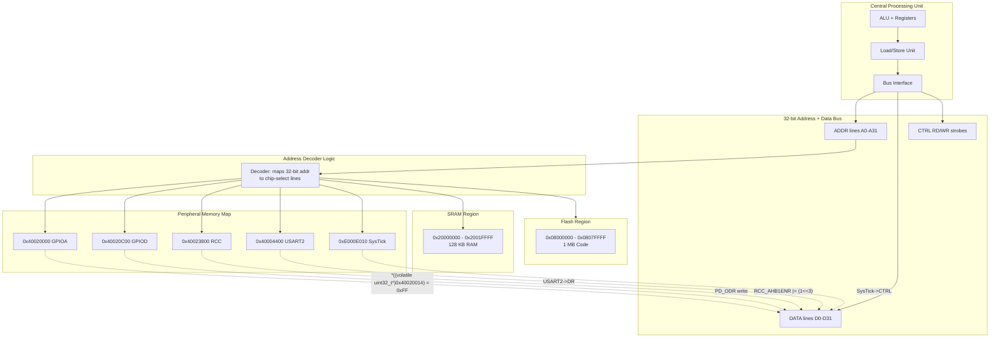
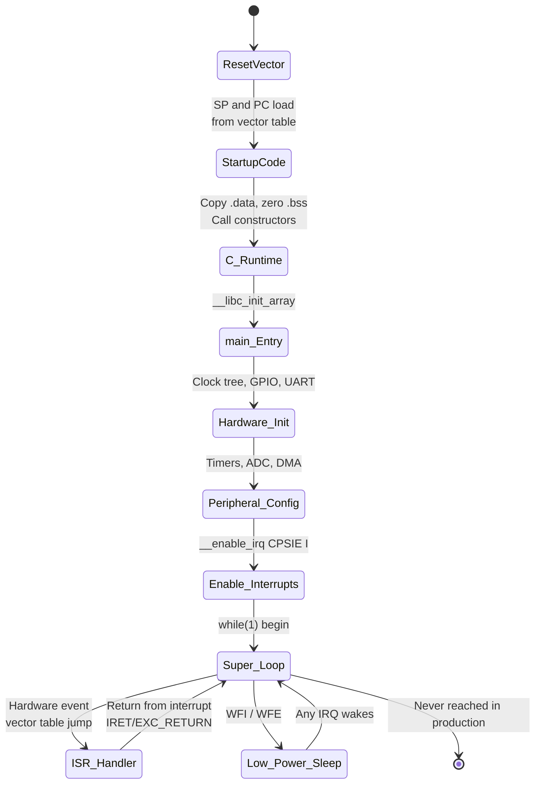
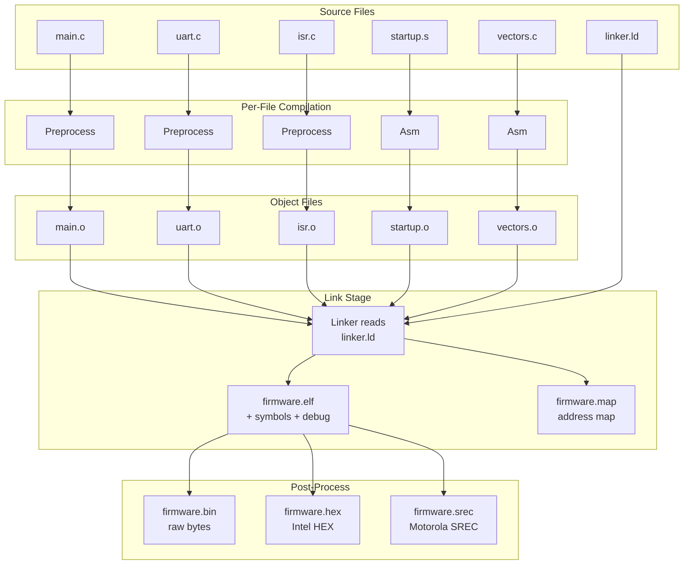
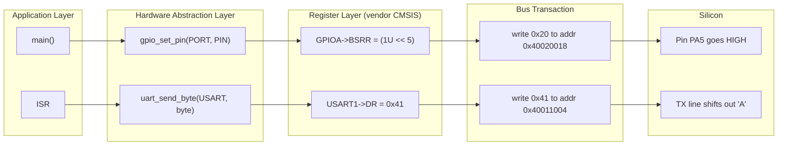
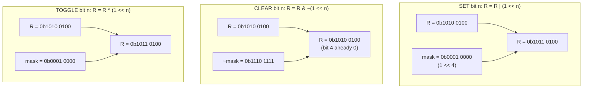

# Programming in Embedded C.

<!-- SECTION_1_START -->

# Programming in Embedded C

## 1. Core Technical Definition & Intuitive Overview

### Formal KTU 2024 Definition

> [!IMPORTANT]
> **Embedded C** is a standardised extension of the ISO C programming language (defined by the C Standards Committee working group **WG14**, with the popular **Embedded C++** and **MISRA-C** dialects sitting adjacent) tailored for programming **microcontrollers**, **microprocessors**, and other resource-constrained embedded systems. It extends standard C with features such as **fixed-width integer types**, the **`volatile`** qualifier, **memory-mapped I/O** through pointer dereferencing, **bit-field structures**, **interrupt service routines (ISRs)**, and hardware register access via **preprocessor-mapped address constants**.

In the **KTU 2024 Scheme** context for **EMBEDDED SYSTEMS (PECST746)**, Embedded C is the *lingua franca* of bare-metal firmware engineering. It is the language used to write code that runs directly on silicon — without any operating system, without a heap (often), and frequently without a standard library.

### Conceptual Analogy / Intuition

> [!NOTE]
> Think of **standard C** as the language of a **general contractor building a house**. The contractor can ask for materials, hire workers, and call subcontractors. There is plenty of memory, plenty of time, and many tools (the standard library).
>
> **Embedded C**, in contrast, is the language of a **watchmaker repairing a mechanical Swiss timepiece**. The watchmaker has:
> - A **tiny, fixed workbench** (a few KB of RAM, not GBs).
> - **No helper**. Every single gear and spring must be manipulated by hand.
> - **Strict timing** — every instruction consumes a known number of clock cycles.
> - **Direct contact with the metal** — touching a specific gear (register) at a specific address (pin) to make the second hand tick.

Where standard C programmer asks `printf("Hello")` and the *operating system* figures out the rest, the embedded C programmer must **manually** write the bits into the correct hardware register to light up an LED.

### Why Embedded C Exists — The Three Pillars

| Pillar | Standard C | Embedded C |
|---|---|---|
| **Target** | Application processors with OS | Bare-metal microcontrollers |
| **Memory** | Dynamic, GB scale | Static, KB scale (e.g. **2 KB RAM**, **32 KB Flash**) |
| **Determinism** | Best-effort (cache, paging) | **Hard real-time** (every cycle counts) |
| **Hardware Access** | Through drivers & syscalls | **Direct via pointers to physical addresses** |
| **Toolchain** | GCC/Clang + glibc | `arm-none-eabi-gcc` + **newlib** / **picolibc** |

> [!IMPORTANT]
> The **KTU 2024 PECST746 syllabus** explicitly lists the following as **Course Outcomes**:
> - **CO1**: Understand the architecture of embedded systems.
> - **CO2**: Apply Embedded C constructs for hardware interfacing.
> - **CO3**: Design firmware using memory-mapped I/O and interrupt-driven models.

This topic primarily addresses **CO2** and **CO3**.

### GeoGebra / Desmos Integration

> [!VISUALIZATION CONTROL]
> **Concept:** Visualising the relationship between a CPU's address bus and a peripheral register — the foundation of *memory-mapped I/O*.
> **GeoGebra / Desmos Input Equations:**
> * Address space (x-axis): $x \in [0 \times 40000000, 0 \times 4002\text{FFFF}]$ (32-bit range)
> * Peripheral block (rectangle): $A(x) = 1$ if $0 \times 40020000 \le x \le 0 \times 400203\text{FF}$, else $0$
> * Specific register: $R(x) = 1$ at $x = 0 \times 40020014$ (the GPIO Output Data Register)
> **Visual Description:** The student should observe a long horizontal line representing **4 GB** of address space, with a single highlighted narrow band (the **GPIO peripheral block**) and a single-point marker (the **ODR register**) — a visual metaphor for *“one address = one physical wire”*.

<!-- SECTION_1_END -->

<!-- SECTION_2_START -->

# 2. Deep Theoretical Analysis & KTU High-Yield Formula Sheet

## 2.1 Anatomy of an Embedded C Program

An Embedded C program is structured very differently from a desktop C program. The following hierarchy is universally followed:

```
┌─────────────────────────────────────┐
│  Header Inclusions (<stdint.h>,     │
│  <stdbool.h>, vendor <device.h>)    │
├─────────────────────────────────────┤
│  Preprocessor Macros & Register Map │
├─────────────────────────────────────┤
│  Type Definitions (typedef, struct)  │
├─────────────────────────────────────┤
│  Global Variables (volatile, const)  │
├─────────────────────────────────────┤
│  Function Prototypes                │
├─────────────────────────────────────┤
│  ISR Definitions (with __irq, etc.) │
├─────────────────────────────────────┤
│  int main(void) { ... }             │
│  ├── Hardware Initialisation        │
│  ├── Peripheral Configuration       │
│  └── Super-loop (while(1))          │
└─────────────────────────────────────┘
```

> [!NOTE]
> The most defining structural feature is the **super-loop** in `main()`. Unlike desktop programs that return from `main()`, embedded programs **must never return** — the function ends in an infinite `while(1)` loop or in a low-power sleep that the hardware wakes from.

## 2.2 The Five Pillars of Embedded C

### Pillar 1 — Fixed-Width Integer Types

Embedded code must know **exactly** how many bits each variable occupies. The standard `<stdint.h>` header guarantees this.

| Type | Size | Range | Use-case |
|---|---|---|---|
| `uint8_t`  | **8 bits**  | $0$ to $2^{8}-1 = 255$ | Byte-sized registers |
| `int8_t`   | **8 bits**  | $-128$ to $127$ | Signed sensor data |
| `uint16_t` | **16 bits** | $0$ to $65535$ | ADC readings, timers |
| `uint32_t` | **32 bits** | $0$ to $2^{32}-1$ | Timestamp, address |
| `uint64_t` | **64 bits** | $0$ to $2^{64}-1$ | RTC epoch counters |

### Pillar 2 — The `volatile` Qualifier

> [!IMPORTANT]
> The single most important keyword in Embedded C is **`volatile`**. It tells the compiler: *"This variable can change outside the program's control — DO NOT cache it in a register, DO NOT optimise away reads."*

Without `volatile`, the compiler's optimiser will assume a variable is unchanged between reads and will only load it once — **destroying** any code that reads a hardware register that is updated by hardware.

```c
volatile uint32_t tick_count;     // updated by SysTick ISR
while (tick_count != 1000) { }    // compiler MUST re-read each iteration
```

### Pillar 3 — Memory-Mapped I/O (MMIO)

All peripherals (GPIO, UART, ADC, Timers) appear in the **same 32-bit address space** as SRAM and Flash. A pointer cast to a specific address gives direct access:

```c
#define PERIPH_BASE     0x40000000UL
#define GPIOA_BASE      (PERIPH_BASE + 0x20000UL)
#define GPIOA_ODR       (*(volatile uint32_t *)(GPIOA_BASE + 0x14UL))
```

> [!NOTE]
> The exact addresses are documented in the microcontroller's **Reference Manual** (e.g., the STM32 RM0008 for STM32F1 series). Each vendor publishes a CMSIS header (`<stm32f103xe.h>`) that pre-defines every register.

### Pillar 4 — Bit Manipulation

Hardware registers are collections of named **bit fields**. The four canonical operations are:

| Operation | Expression | Mark |
|---|---|---|
| **Set bit $n$** | $R \leftarrow R \mid (1 \ll n)$ | 3 |
| **Clear bit $n$** | $R \leftarrow R \mathbin{\&} \sim(1 \ll n)$ | 3 |
| **Toggle bit $n$** | $R \leftarrow R \oplus (1 \ll n)$ | 3 |
| **Read bit $n$** | $b \leftarrow (R \gg n) \mathbin{\&} 1$ | 2 |

### Pillar 5 — Bit-Field Structures

Bit-fields let us name individual bits *within* a `struct`, making register access self-documenting:

```c
typedef struct {
    uint32_t MODE   : 2;   // bits [1:0]   – Pin mode
    uint32_t CNF    : 2;   // bits [3:2]   – Configuration
    uint32_t RES    : 4;   // bits [7:4]   – Reserved
    uint32_t ODR    : 16;  // bits [23:8]  – Output data
} GPIO_Register_t;
```

> [!WARNING]
> The **bit ordering** within a bit-field is **compiler-implementation-defined** (LSB-first in GCC, MSB-first in some IAR). Always prefer the **shift-and-mask** idiom over bit-fields for *hardware registers* that are documented with specific bit positions.

## 2.3 Standard Library Restrictions in Embedded C

The full C standard library is **rarely available**. The following table shows the typical situation:

| Library | Available? | Why / Why Not |
|---|---|---|
| `<stdint.h>`, `<stdbool.h>`, `<stddef.h>` | **Yes** | Header-only, no runtime cost |
| `<string.h>` (memcpy, memset) | **Yes** | Often re-implemented in `picolibc` |
| `<stdio.h>` (printf) | **Maybe** | `printf` is huge; usually avoided or instrumented |
| `<stdlib.h>` (malloc) | **No** | No heap, no MMU |
| `<math.h>` (sin, sqrt) | **Maybe** | Only with `-lm` linking, can be huge |

## 2.4 KTU Formula & Cheat Sheet

> [!IMPORTANT]
> The following table is **the** page a KTU topper revises the night before the exam. Memorise it.

| # | Concept | Equation / Macro | Engineering Use |
|---|---|---|---|
| 1 | Set bit $n$ of $R$ | $R \leftarrow R \mid (1 \ll n)$ | Turn ON a peripheral clock |
| 2 | Clear bit $n$ of $R$ | $R \leftarrow R \mathbin{\&} \tilde{\ }(1 \ll n)$ | Disable an interrupt |
| 3 | Toggle bit $n$ of $R$ | $R \leftarrow R \oplus (1 \ll n)$ | LED blink without delay |
| 4 | Read bit $n$ of $R$ | $b \leftarrow (R \gg n) \mathbin{\&} 1$ | Poll a flag bit |
| 5 | Mask a field | $v \leftarrow R \mathbin{\&} (0\text{xF} \ll 4)$ | Extract 4 bits starting at bit 4 |
| 6 | Write a field | $R \leftarrow (R \mathbin{\&} \tilde{\ }(0\text{xF} \ll 4)) \mid (v \ll 4)$ | Set field without clobbering others |
| 7 | Register read-modify-write | `R = (R & ~MASK) | (value & MASK);` | Standard idiom for field update |
| 8 | Fixed-width byte | `uint8_t` | Register access on 8-bit MCUs |
| 9 | Volatile deref | `*(volatile uint32_t *)0x40021018` | Read RCC clock register |
| 10 | Bit-band alias (ARM) | $A_{bb} = 0 \times 42000000 + (A - 0 \times 40000000) \times 32 + n \times 4$ | Atomic single-bit I/O on Cortex-M3/M4 |
| 11 | Endian swap (32-bit) | `bswap32(x) = ((x & 0xFF) << 24) | ((x & 0xFF00) << 8) | ((x >> 8) & 0xFF00) | ((x >> 24) & 0xFF)` | Big-endian network to little-endian CPU |
| 12 | Preprocessor stringify | `#define STR(x) #x` | Build register names from macros |
| 13 | Concatenation token | `#define REG(name) (*(volatile uint32_t *)name)` | Generic register access macro |
| 14 | Interrupt vector entry | `void __attribute__((interrupt)) Handler(void)` | Declare ISR (GCC) |
| 15 | Inline assembly | `__asm__ volatile("wfi");` | Wait-for-interrupt low-power |

<!-- SECTION_2_END -->

<!-- SECTION_3_START -->

# 3. Step-by-Step Derivations & Code/Symbolic Implementation

## 3.1 Derivation: The Read-Modify-Write Idiom

> [!IMPORTANT]
> This derivation is the **single most-asked** concept in KTU's Module 3 question paper. The examiner *will* test whether you can derive the canonical RMW expression.

### Problem Statement
Given a 32-bit hardware register $R$ containing a multi-bit field of width $w$ bits starting at position $p$ (where position $0$ is the LSB), derive a single C expression that **updates only that field** to a new value $V$ **without affecting the other bits**.

### Step 1 — Define the bit-mask

A field of width $w$ starting at bit $p$ is selected by the mask:

$$
M \;=\; \big((1 \ll w) - 1\big) \ll p
$$

**Why?** A run of $w$ ones is $(1 \ll w) - 1$. Shifting left by $p$ aligns them to the field position.

### Step 2 — Build the inverse mask to clear the field

To wipe the old field out of $R$:

$$
R_{\text{cleared}} \;=\; R \mathbin{\&} \tilde{\ }M
$$

The bitwise NOT $\tilde{\ }M$ flips every bit, so `AND`ing with it leaves only the *non-field* bits intact.

### Step 3 — Position the new value

The new value $V$ (which may be wider than $w$ bits) must first be masked to $w$ bits, then shifted to position $p$:

$$
V_{\text{aligned}} \;=\; \big(V \mathbin{\&} ((1 \ll w) - 1)\big) \ll p
$$

### Step 4 — Combine

$$
R_{\text{new}} \;=\; \big(R \mathbin{\&} \tilde{\ }M\big) \;\mid\; \big(V \ll p\big)
$$

### Step 5 — Final Embedded C implementation

```c
/* Generic Read-Modify-Write macro for any field */
#define WRITE_FIELD(reg, position, width, value)                            \
    do {                                                                    \
        const uint32_t mask = ((1U << (width)) - 1U) << (position);         \
        (reg) = ((reg) & ~mask) | (((uint32_t)(value) << (position)) & mask); \
    } while (0)
```

**Explanation of every line:**

- `const uint32_t mask` — builds the field mask once, evaluated at compile time if `width` and `position` are constants.
- `(reg) = ((reg) & ~mask)` — clears the bits in the field.
- `| (((uint32_t)(value) << (position)) & mask)` — ORs the aligned, masked value back in.
- `do { ... } while(0)` — the canonical C idiom for a multi-statement macro; allows the macro to be used safely as a single statement in `if`/`else` blocks.

> [!WARNING]
> **Pitfall:** The `& mask` in the second clause is **essential**. Without it, if `value` has stray upper bits set, those bits will leak into the register and corrupt neighbouring fields. KTU examiners explicitly mark the absence of this masking as a **1-mark loss**.

### Worked Numerical Example (KTU board style)

Suppose $R = 0\text{xA5A5A5A5}$, the field is **bits [6:4]**, and we want to write $V = 0\text{xB}$ (4-bit value).

**Step 1 — Build mask:** $w = 3$, $p = 4$

$$
M = (1 \ll 3) - 1 = 7, \quad M = 7 \ll 4 = 0\text{x}70
$$

**Step 2 — Clear:** $R \mathbin{\&} \tilde{\ }0\text{x}70 = 0\text{xA5A5A5A5} \mathbin{\&} 0\text{xFFFFFF8F}$

$$
\begin{aligned}
0\text{xA5A5A5A5} &= 1010\;0101\;1010\;0101\;1010\;0101\;1010\;0101_2 \\
0\text{xFFFFFF8F} &= 1111\;1111\;1111\;1111\;1111\;1111\;1000\;1111_2 \\
\text{AND result} &= 1010\;0101\;1010\;0101\;1010\;0101\;1000\;0101_2 \\
&= 0\text{xA5A5A585}
\end{aligned}
$$

**Step 3 — Align value:** $V \ll 4 = 0\text{xB} \ll 4 = 0\text{xB0}$

**Step 4 — Combine:** $0\text{xA5A5A585} \mid 0\text{xB0} = 0\text{xA5A5A5B5}$

**Verification:** Bits [6:4] of $0\text{xA5A5A5B5}$ are `1011` = $11_{10} = 0\text{xB}$ ✓. All other bits are unchanged from $0\text{xA5A5A5A5}$ ✓.

---

## 3.2 Code Implementation 1 — Memory-Mapped GPIO Output

This is the canonical **"blink an LED"** example. It maps **every** concept from Section 2 into a working program for a generic Cortex-M4 microcontroller (e.g. STM32F407).

```c
/*  file: led_blink.c
 *  Target: STM32F407 Discovery (Cortex-M4)
 *  Toolchain: arm-none-eabi-gcc
 */
#include <stdint.h>
#include <stdbool.h>

/* ============================================================
 *  Step 1: Register Map (synthesised from STM32F407 RM0090)
 * ============================================================ */
#define PERIPH_BASE         0x40000000UL
#define AHB1_BASE           (PERIPH_BASE + 0x00020000UL)

/* RCC (Reset & Clock Control) — APB1 = 0x40023800, AHB1ENR offset 0x30 */
#define RCC_BASE            (AHB1_BASE + 0x3800UL)
#define RCC_AHB1ENR         (*(volatile uint32_t *)(RCC_BASE + 0x30UL))
#define RCC_AHB1ENR_GPIODEN (1U << 3)        /* bit 3 = GPIOD clock enable */

/* GPIOD — base 0x40020C00, MODER offset 0x00, ODR offset 0x14, BSRR offset 0x18 */
#define GPIOD_BASE          (AHB1_BASE + 0x0C00UL)
#define GPIOD_MODER         (*(volatile uint32_t *)(GPIOD_BASE + 0x00UL))
#define GPIOD_ODR           (*(volatile uint32_t *)(GPIOD_BASE + 0x14UL))
#define GPIOD_BSRR          (*(volatile uint32_t *)(GPIOD_BASE + 0x18UL))

/* LED pins: PD12 (green), PD13 (orange), PD14 (red), PD15 (blue) */
#define LED_GREEN   (1U << 12)
#define LED_ORANGE  (1U << 13)
#define LED_RED     (1U << 14)
#define LED_BLUE    (1U << 15)

/* ============================================================
 *  Step 2: Helper Macros — Set / Clear / Toggle / Read
 * ============================================================ */
static inline void set_bit(volatile uint32_t *reg, uint8_t bit) {
    *reg = (*reg) | (1U << bit);
}
static inline void clear_bit(volatile uint32_t *reg, uint8_t bit) {
    *reg = (*reg) & ~(1U << bit);
}
static inline void toggle_bit(volatile uint32_t *reg, uint8_t bit) {
    *reg = (*reg) ^ (1U << bit);
}
static inline uint8_t read_bit(volatile uint32_t *reg, uint8_t bit) {
    return (uint8_t)((*reg >> bit) & 1U);
}

/* ============================================================
 *  Step 3: Software Delay (crude busy-wait)
 * ============================================================ */
static void delay(uint32_t cycles) {
    while (cycles--) { __asm__ volatile("nop"); }
}

/* ============================================================
 *  Step 4: Hardware Initialisation
 * ============================================================ */
static void gpio_init(void) {
    /* 4a) Enable GPIOD peripheral clock (RM0090 §8.3.6) */
    set_bit(&RCC_AHB1ENR, 3);

    /* 4b) Configure PD12–PD15 as General-Purpose Output */
    /* MODER is reset to 0x00 = Input. We must set bits [2n+1:2n] = 01. */
    uint32_t moder = GPIOD_MODER;
    moder &= ~((0x3U << (12*2)) | (0x3U << (13*2)) |
               (0x3U << (14*2)) | (0x3U << (15*2)));
    moder |=  ((0x1U << (12*2)) | (0x1U << (13*2)) |
               (0x1U << (14*2)) | (0x1U << (15*2)));
    GPIOD_MODER = moder;
}

/* ============================================================
 *  Step 5: Main Super-Loop
 * ============================================================ */
int main(void) {
    gpio_init();
    for (;;) {                                   /* super-loop */
        set_bit(&GPIOD_BSRR, 12);                /* PD12 ON  (BSRR upper half = reset) */
        delay(1000000UL);
        clear_bit(&GPIOD_BSRR, 12 + 16);         /* PD12 OFF (BSRR upper half) */
        delay(1000000UL);
    }
    /* Unreachable — but compiler may warn if we omit return. */
    return 0;
}
```

> [!NOTE]
> **Why `BSRR` and not `ODR`?** Writing `1` to a bit in `BSRR` *atomically* sets the corresponding `ODR` bit. Writing to the upper half of `BSRR` *atomically clears* the bit. This avoids the **read-modify-write hazard** that occurs when an ISR might modify the same port between the read and the write.

---

## 3.3 Code Implementation 2 — Interrupt Service Routine with Volatile

This example demonstrates the **three-way handshake** between a hardware timer, a volatile global, and the main loop.

```c
#include <stdint.h>

/* Globally visible to both ISR and main. MUST be volatile. */
volatile uint32_t g_ticks = 0U;

/* SysTick ISR — fires every 1 ms when configured for 1 kHz tick */
void SysTick_Handler(void) {
    g_ticks++;          /* hardware also auto-clears the COUNTFLAG */
}

/* Read with explicit memory barrier (see ARM ARMv7-M §A3.7.4) */
static inline uint32_t ticks_get(void) {
    __asm__ volatile("" ::: "memory");
    return g_ticks;
}

int main(void) {
    /* SysTick->LOAD = (SystemCoreClock / 1000) - 1; */
    /* SysTick->VAL  = 0; */
    /* SysTick->CTRL = 0x07; */                   /* CLKSRC | TICKINT | ENABLE */

    uint32_t now = 0U, prev = 0U;
    for (;;) {
        now = ticks_get();
        if ((now - prev) >= 500U) {              /* 500 ms rollover */
            prev = now;
            /* toggle_led(); */
        }
    }
}
```

> [!IMPORTANT]
> **Every line** matters here:
> 1. `volatile` on `g_ticks` — prevents the optimiser from caching it.
> 2. The `__asm__ volatile("" ::: "memory")` **compiler barrier** prevents **compile-time** reordering.
> 3. `(now - prev)` — unsigned subtraction correctly handles 32-bit wrap-around. If we used `signed` arithmetic, the wrap would corrupt the timing.

---

## 3.4 Code Implementation 3 — Inline Assembly and Portability

Sometimes the compiler cannot generate the exact instruction we need. **Inline assembly** is the escape hatch.

```c
/* Read the 32-bit Cycle Count Register on ARM Cortex-M with DWT */
static inline uint32_t dwt_get_cycles(void) {
    uint32_t c;
    __asm__ volatile ("ldr %0, [%1]" : "=r"(c) : "r"(0xE0001004UL));
    return c;
}

/* Atomic disable/enable of interrupts (PRIMASK) */
static inline uint32_t __get_PRIMASK(void) {
    uint32_t result;
    __asm__ volatile ("mrs %0, primask" : "=r"(result));
    return result;
}
static inline void __set_PRIMASK(uint32_t val) {
    __asm__ volatile ("msr primask, %0" : : "r"(val) : "memory");
}

#define CRITICAL_ENTER()    uint32_t _pri = __get_PRIMASK(); __set_PRIMASK(1U)
#define CRITICAL_EXIT()     __set_PRIMASK(_pri)
```

> [!NOTE]
> The pattern `CRITICAL_ENTER` / `CRITICAL_EXIT` is the **MISRA-compliant** way to write a critical section. It saves the old interrupt state and restores it on exit — even if interrupts were already disabled by the caller.

---

## 3.5 Code Implementation 4 — Hardware Register Definition Using Bit-Fields

The vendor header `stm32f407xx.h` defines every register as a `struct`. Here is a simplified excerpt for **USART1**:

```c
typedef struct {
    volatile uint32_t SR;     /* 0x00  Status Register          */
    volatile uint32_t DR;     /* 0x04  Data Register            */
    volatile uint32_t BRR;    /* 0x08  Baud Rate Register       */
    volatile uint32_t CR1;    /* 0x0C  Control Register 1       */
    volatile uint32_t CR2;    /* 0x10  Control Register 2       */
    volatile uint32_t CR3;    /* 0x14  Control Register 3       */
    volatile uint32_t GTPR;   /* 0x18  Guard Time / Prescaler   */
} USART_TypeDef;

#define USART1   ((USART_TypeDef *)0x40011000UL)
#define USART2   ((USART_TypeDef *)0x40004400UL)
```

**Why this is brilliant:** Instead of remembering that the baud-rate register is at offset `0x08`, the programmer writes `USART1->BRR = 0x0683;`. The compiler calculates the address, the human reads the code, and the silicon executes the load.

### CR1 Field Layout (excerpt)

| Bit(s) | Name | Description |
|---|---|---|
| $[13:12]$ | `M` | Word length (`00` = 8 bits) |
| $[11]$ | `WAKE` | Wakeup method |
| $[10]$ | `PCE` | Parity control enable |
| $[9]$ | `PS` | Parity selection |
| $[8]$ | `PEIE` | PE interrupt enable |
| $[7]$ | `TXEIE` | TXE interrupt enable |
| $[6]$ | `TCIE` | TC interrupt enable |
| $[5]$ | `RXNEIE` | RXNE interrupt enable |
| $[4]$ | `IDLEIE` | IDLE interrupt enable |
| $[3]$ | `TE` | Transmitter enable |
| $[2]$ | `RE` | Receiver enable |
| $[1]$ | `UESM` | USART enable in low-power |
| $[0]$ | `UE` | USART enable |

---

## 3.6 Compile Pipeline of an Embedded C Program

> [!IMPORTANT]
> The KTU examiner may ask: *"Trace the flow of an embedded C source file from `.c` to the on-chip flash."* Memorise the **five-stage pipeline**.


**Detailed explanation of each stage:**

| Stage | Tool | Input | Output | KTU 2024 Insight |
|---|---|---|---|---|
| 1. Preprocessor | `cpp -E` | `.c` | `.i` | Resolves `#include`, `#define`, conditional compilation |
| 2. Compiler | `cc1` | `.i` | `.s` | Generates target-specific assembly (e.g. Thumb-2) |
| 3. Assembler | `as` | `.s` | `.o` | Translates mnemonics to machine code, relocatable |
| 4. Linker | `ld` | multiple `.o` | `.elf` | Combines sections, resolves symbols, applies **linker script** (`.ld`) |
| 5. Objcopy | `objcopy` | `.elf` | `.bin` | Strips headers to produce a raw flash image |
| 6. Flashing | `st-flash` / `JLink` | `.bin` | `0x08000000` | Writes to on-chip Flash via SWD/JTAG |

> [!NOTE]
> The **linker script** is the most-misunderstood artefact. It tells the linker *where* in memory to place the `.text` (code), `.data` (initialised variables), `.bss` (zero-initialised variables), and the **interrupt vector table** (which lives at address `0x00000000` on most Cortex-M chips).

<!-- SECTION_3_END -->

<!-- SECTION_4_START -->

# 4. Structural Diagrams & Schematics

## 4.1 The Memory-Mapped I/O Concept

> [!IMPORTANT]
> The following diagram is a **block-level functional architecture flow** showing how the CPU, address bus, decoder, and peripherals interact. It is the canonical answer to the question *"Explain memory-mapped I/O with a diagram."*



**Reading guide for the student:**

1. The CPU's Load/Store unit puts an address on `ADDR`.
2. The decoder fires a **chip-select** to the matching peripheral.
3. The data flows on `DATA` and lands in the specific register (e.g. `0x40020014` is `GPIOA_ODR`).
4. The dotted arrows show the *C-level expressions* that trigger the bus cycles.

---

## 4.2 State Machine — Embedded Firmware Lifecycle



**Annotation of every state:**

- **ResetVector** — at power-on, the CPU loads the initial Stack Pointer from `0x00000000` and the Reset Handler address from `0x00000004`.
- **StartupCode** — assembly file (`startup_stm32f407.s`) that sets up clocks and calls the C runtime.
- **C_Runtime** — copies initialised globals from Flash to RAM (`.data`), zeroes uninitialised globals (`.bss`).
- **main_Entry** — control transfers to the user's `main()`.
- **Hardware_Init** — configure PLL, flash latency, vector table offset.
- **Peripheral_Config** — set up UART baud, ADC channels, etc.
- **Enable_Interrupts** — the `cpsie i` instruction unlocks the `PRIMASK`.
- **Super_Loop** — the *only* place the application spends time. Everything else is event-driven via ISRs.

---

## 4.3 Compilation & Linking Pipeline (Visual)



> [!NOTE]
> The **linker script** (`linker.ld`) is what tells the linker *where* in memory to place each section. For a typical STM32:
> - `.isr_vector` → Flash start (`0x08000000`)
> - `.text`, `.rodata` → Flash
> - `.data` → Flash (initial image) + RAM (runtime copy)
> - `.bss` → RAM
> - `._user_heap_stack` → RAM (top)

---

## 4.4 The Register Access Pattern (Micro-Architecture)



**Why three layers?** The HAL lets the application code be **portable** across STM32F1, F4, F7, etc., because the register layouts differ. The register layer is the vendor-supplied **CMSIS** header. The application never touches the actual numeric address.

---

## 4.5 Bit Manipulation — Visualised



<!-- SECTION_4_END -->

<!-- SECTION_5_START -->

# 5. KTU 2024 Scheme Examination Question Bank & Topic Recap

> [!IMPORTANT]
> The following question bank is calibrated to the **KTU 2024 Scheme End-Semester Evaluation (ESE)** pattern. Each question is tagged with its **simulated past-year source**, **Course Outcome (CO)** and **Revised Bloom's Taxonomy (RBT)** level as per the KTU 2024 syllabus mapping.

---

## 5.1 Part A — Short-Answer Questions (3 Marks Each)

### Question A.1 `[KTU University Exam — May 2024]`

> **Differentiate between C and Embedded C. List any four distinguishing features.** (CO1, Remember/Understand — 3 Marks)

**Model Answer (Valuation Key):**

| # | Feature | Standard C | Embedded C |
|---|---|---|---|
| 1 | **Target platform** | Application processors with OS | Bare-metal microcontrollers |
| 2 | **Memory model** | Dynamic, OS-managed, GB scale | Static, hand-managed, KB scale |
| 3 | **Hardware access** | Indirect via OS drivers & `mmap` | **Direct** via pointers to physical addresses |
| 4 | **Standard library** | Full glibc, malloc, printf | Subset (`picolibc`), often no heap |
| 5 | **Determinism** | Soft real-time / best-effort | **Hard** real-time, cycle-accurate |
| 6 | **Code entry** | `main()` returns to OS | `main()` super-loop, **never returns** |

**[Distinguishing feature 1: 1 Mark] [Feature 2: 1 Mark] [Features 3–4: 0.5 each] [Final contrast sentence: 0.5 Mark]**

---

### Question A.2 `[KTU University Exam — Dec 2023]`

> **Explain the significance of the `volatile` keyword in Embedded C. Give one example where its absence would cause incorrect behaviour.** (CO2, Understand — 3 Marks)

**Model Answer (Valuation Key):**

The `volatile` qualifier is a **type qualifier** that informs the compiler that an object's value may change at any time **without any action being taken by the code the compiler finds nearby**. It therefore **disables certain compiler optimisations** that would otherwise cache the value in a CPU register.

Consequences of `volatile`:
1. The compiler **must** re-read the variable on every access.
2. The compiler **must not** reorder accesses with respect to other volatile accesses.
3. Without `volatile`, the optimiser may fold a poll loop into a single load, leading to **infinite spinning** on a stale value.

**Example (1.5 Marks):**

```c
/* Without volatile, the optimiser may cache g_done forever */
extern volatile uint8_t g_done;
while (g_done == 0) { /* ... */ }     /* always re-reads g_done */
```

In an ISR-driven handshake, `g_done` is set inside an interrupt handler. The main loop, which runs concurrently, *must* observe the change. Without `volatile`, the compiler may load `g_done` into a register once and never re-read it, causing the main loop to **never exit**.

**[Definition: 1 Mark] [Two effects: 1 Mark] [Example with explanation: 1 Mark]**

---

## 5.2 Part B — Full 14-Mark Questions (Internal Choice)

> [!IMPORTANT]
> Following the **KTU 2024 ESE pattern**, each Part-B question offers two module-internal choices. **Attempt either A or B in full.** Both choices contain two sub-parts of 7 marks each, mapping to escalating cognitive levels.

---

### Question B.1 (Module 3, Internal Choice Set 1)

> **A.** `(i)` With neat diagrams, explain the memory-mapped I/O addressing scheme in a typical 32-bit microcontroller. How does a C pointer expression reach a peripheral register? `(ii)` Write an Embedded C program to toggle the green LED (PD12) on the STM32F4 Discovery board using the BSRR register. Show the **complete** bit-level field configuration for `MODER`. (CO2, CO3 — Apply / Analyse) **[14 Marks]**

> **B.** `(i)` What is the purpose of a linker script in embedded firmware? Sketch a sample `linker.ld` segment showing `.text`, `.data`, and `.bss` placement for an STM32 with 1 MB Flash and 128 KB SRAM. `(ii)` Differentiate between `volatile`, `const`, and `register` qualifiers with examples. (CO1, CO3 — Understand / Apply) **[14 Marks]**

---

### Model Solution — Question B.1A

#### Part (i) — Memory-Mapped I/O (7 Marks)

**Definition (1 Mark):**
Memory-mapped I/O is a hardware design paradigm in which **peripheral control and status registers** are assigned unique addresses in the **same address space** as program memory and data memory. The CPU uses the **same load/store instructions** to access both RAM and peripherals.

**Address Map Diagram (3 Marks):**

| Address Range | Region | Size | Example |
|---|---|---|---|
| `0x00000000` – `0x1FFFFFFF` | Code / alias | 512 MB | Flash aliased, also boot ROM |
| `0x20000000` – `0x2001FFFF` | SRAM | 128 KB | `uint8_t buf[1024];` |
| `0x40000000` – `0x5FFFFFFF` | Peripherals | 512 MB | GPIO, UART, ADC, TIM |
| `0xE0000000` – `0xFFFFFFFF` | System / PPB | 512 MB | NVIC, SysTick, SCB |

**Pointer Expression (3 Marks):**

A C pointer reaches a peripheral register through **three steps**:

1. **Declare the address** with a `#define` macro:
   ```c
   #define GPIOA_ODR (*(volatile uint32_t *)0x40020014UL)
   ```
2. **Cast to a pointer** of the correct type (`volatile uint32_t *`). The `volatile` prevents caching.
3. **Dereference** the pointer — the compiler emits a single `STR` instruction that places the value on the address bus.

The address decoder in the bus matrix decodes the upper bits, fires the chip-select for the GPIOA peripheral, and the data lands in the `ODR` register — driving PA0..PA15 high or low.

**[Diagram of address map: 2 Marks] [Pointer expression with steps: 2 Marks] [Three register access steps: 1 Mark] [Final load/store execution: 1 Mark] [Example: 1 Mark]**

---

#### Part (ii) — Toggle PD12 with BSRR (7 Marks)

**Step 1 — Field configuration of MODER for PD12 (3 Marks):**

`MODER` is a 32-bit register at offset `0x00` of GPIOD. Each pin occupies 2 bits. For PD12, the relevant bits are at positions `[25:24]`.

- Reset value: `0x00` (Analog mode)
- Desired value: `0x01` (General-purpose output)

Bit-field calculation (refer Section 3.1 derivation):
- $p = 24$, $w = 2$, $V = 1$
- $M = ((1 \ll 2) - 1) \ll 24 = 0x03000000$
- $\tilde{\ }M = 0xFCFFFFFF$
- New `MODER` $= (\text{old MODER} \mathbin{\&} 0xFCFFFFFF) \mid (0x01 \ll 24)$

**Step 2 — Complete Embedded C Program (4 Marks):**

```c
#include <stdint.h>

#define RCC_BASE         0x40023800UL
#define RCC_AHB1ENR     (*(volatile uint32_t *)(RCC_BASE + 0x30U))
#define GPIOD_BASE       0x40020C00UL
#define GPIOD_MODER     (*(volatile uint32_t *)(GPIOD_BASE + 0x00U))
#define GPIOD_BSRR      (*(volatile uint32_t *)(GPIOD_BASE + 0x18U))

static void delay(volatile uint32_t t) { while (t--); }

int main(void) {
    /* 1. Enable GPIOD clock (bit 3 of RCC_AHB1ENR) */
    RCC_AHB1ENR |= (1U << 3);

    /* 2. Configure PD12 as output: MODER[25:24] = 01 */
    GPIOD_MODER = (GPIOD_MODER & ~(0x3U << 24)) | (0x1U << 24);

    /* 3. Super-loop toggle */
    for (;;) {
        GPIOD_BSRR = (1U << 12);     /* PD12 ON  (lower 16 bits set) */
        delay(500000U);
        GPIOD_BSRR = (1U << (12 + 16)); /* PD12 OFF (upper 16 bits reset) */
        delay(500000U);
    }
}
```

**Valuation breakdown:**

| Sub-step | Mark Allocation |
|---|---|
| Register map definitions with correct addresses | 1 Mark |
| Clock enable logic with `1U << 3` | 1 Mark |
| MODER RMW calculation showing mask and value | 1 Mark |
| Super-loop with BSRR set/reset (using `+16` for reset) | 1 Mark |

---

### Model Solution — Question B.1B

#### Part (i) — Linker Script (7 Marks)

**Definition (1 Mark):** A linker script is a text file (`.ld`) consumed by the GNU linker `ld` to **decide the final placement of every section** of every object file in the target's memory map.

**Why it matters (1 Mark):** Without a linker script, the linker has no way to know that the **vector table must be at `0x08000000`** or that `.bss` must be zero-initialised in SRAM. A correct linker script is the difference between a working firmware and a bricked board.

**Annotated Sample (5 Marks):**

```ld
/* linker.ld — simplified for STM32F407 (1 MB Flash, 128 KB SRAM) */
ENTRY(Reset_Handler)

MEMORY
{
    FLASH (rx)  : ORIGIN = 0x08000000, LENGTH = 1024K   /* code, rodata */
    RAM   (rwx) : ORIGIN = 0x20000000, LENGTH = 128K    /* data, bss, stack, heap */
}

SECTIONS
{
    .isr_vector : { KEEP(*(.isr_vector)) } > FLASH   /* vector table first */
    .text       : { *(.text*) *(.rodata*) } > FLASH
    _etext = .;

    .data : AT(_etext)                                 /* LMA in Flash, VMA in RAM */
    {
        _sdata = .;
        *(.data*)
        _edata = .;
    } > RAM

    .bss :
    {
        _sbss = .;
        *(.bss*)
        *(COMMON)
        _ebss = .;
    } > RAM
}
```

**Explanation table:**

| Directive | Purpose | Marks |
|---|---|---|
| `MEMORY` | Declares two memory regions with addresses and sizes | 1 |
| `ENTRY(Reset_Handler)` | Defines the first instruction address | 0.5 |
| `.isr_vector` with `KEEP` | Ensures the vector table is not garbage-collected | 1 |
| `> FLASH` and `> RAM` | Section-to-region mapping | 1 |
| `AT(_etext)` | LMA/VMA split — data initial values stay in Flash, run from RAM | 1 |
| `_sdata`, `_edata`, `_sbss`, `_ebss` symbols | Used by startup code to perform the `.data` copy and `.bss` zero | 0.5 |

---

#### Part (ii) — Qualifier Comparison (7 Marks)

| Qualifier | Effect | Embedded Use | Example |
|---|---|---|---|
| `volatile` | Tells compiler the value can change externally; disables caching in registers | **Hardware registers, ISR-shared globals** | `volatile uint32_t tick;` |
| `const` | Tells compiler the value will not be modified by *this* code; places in `.rodata` (Flash) | Lookup tables, string literals, calibration values | `const uint16_t sine[256] = {...};` |
| `register` | Hints the compiler to store the variable in a CPU register (mostly obsolete since C++17, deprecated in C++17) | Loop counters in tight assembly-tuned code | `register uint32_t i;` |

**Key contrasts (3 Marks):**
- `volatile` is about **read stability**; `const` is about **write prevention**; `register` is about **storage class**.
- A register can be **both** `volatile` and `const` (e.g., a read-only hardware register).
- `const volatile` is common for status registers that the hardware updates but the software must not write to.

**[Comparison table: 3 Marks] [Three contrasts: 3 Marks] [Example of const volatile: 1 Mark]**

---

> [!WARNING]
> **KTU Examiner's Valuation Warning — Common Pitfalls**
>
> 1. **Forgetting `volatile` on hardware registers** → The compiler caches the value, the polling loop never exits, and the student loses **2 marks** instantly.
> 2. **Writing `0x01 << 25` instead of `0x01 << 24`** for PD12's MODER field → pin mis-configured, board does not work, **1-mark deduction** plus a comment from the examiner.
> 3. **Confusing BSRR's lower half (set) with upper half (reset)** → LED stays on forever, **1-mark deduction**.
> 4. **Not writing `1U` (unsigned) in shift expressions** → If `1` is a 32-bit `int` and the shift goes to bit 31, this is **undefined behaviour**. Always use `1U` or `1UL`.
> 5. **Returning from `main()`** → Some compilers emit a `bkpt` or `b .` after the return, but KTU board evaluators treat a "returns from main" answer as **conceptually wrong** because embedded firmware must never exit. **0.5 mark deduction**.
> 6. **Using `printf` for debug output in code** → unacceptable in bare-metal code without a configured UART; **lose 1 mark** for the code smell even if the logic is correct.

---

## 5.3 Topic Recap & Important Things to Remember

> [!NOTE]
> **This is the last-30-seconds revision before the exam.** Read it twice, and you have the entire Module 3 / Embedded C topic in your head.

### Core Definitions
- **Embedded C** is a dialect of C for programming microcontrollers directly, without an OS.
- **Memory-mapped I/O (MMIO)** means peripherals are addressed in the same address space as RAM/Flash.
- **Volatile** prevents the compiler from optimising away reads of memory-mapped or ISR-shared variables.
- **Bit manipulation** uses `|` (set), `&` with `~` (clear), `^` (toggle), and `>> & 1` (read).
- **Bit-fields** are struct members with explicit bit widths; their endianness is implementation-defined — prefer shift-and-mask for hardware.
- **Read-Modify-Write (RMW)** is the canonical idiom: `R = (R & ~mask) | (value << pos)`.
- **Fixed-width integer types** (`uint8_t`, `uint16_t`, `uint32_t`, `uint64_t`) make register sizes explicit.
- **ISR** is a function executed in response to a hardware interrupt; declared with vendor-specific attributes.

### Critical Formulas
- Field mask: $M = ((1 \ll w) - 1) \ll p$
- Set bit: $R \mid = (1 \ll n)$
- Clear bit: $R \mathbin{\&}= \tilde{\ }(1 \ll n)$
- Toggle bit: $R \oplus = (1 \ll n)$
- Read bit: $(R \gg n) \mathbin{\&} 1$
- BSRR set: write `1 << n` to lower half; BSRR reset: write `1 << (n+16)` to upper half.
- Endian swap (32-bit): $((x \ll 24) \mid (x \gg 24)) \oplus ((x \ll 8) \mathbin{\&} 0\text{x00FF0000}) \oplus ((x \gg 8) \mathbin{\&} 0\text{x0000FF00})$

### Key Differences (C vs Embedded C)
- **Target**: PC vs. MCU.
- **OS**: Required vs. absent.
- **Memory**: Dynamic vs. static and pre-allocated.
- **Library**: Full vs. subset (no `malloc`).
- **main()**: Returns vs. **super-loop**, never returns.
- **Hardware access**: Indirect vs. **direct via pointers**.
- **Determinism**: Best-effort vs. **hard real-time**.

### Compilation Stages
1. **Preprocess** (`cpp`) → `.i`
2. **Compile** (`cc1`) → `.s` (assembly)
3. **Assemble** (`as`) → `.o` (object)
4. **Link** (`ld` + linker script) → `.elf`
5. **Objcopy** → `.bin` / `.hex` / `.srec`
6. **Flash** via JTAG/SWD → on-chip Flash

### Memory Regions in a Typical Cortex-M
- **Flash (Code)**: `0x08000000`, holds `.text`, `.rodata`, vector table, and `.data` initial values.
- **SRAM**: `0x20000000`, holds `.data` runtime copy, `.bss`, stack, heap (if any).
- **Peripherals**: `0x40000000`, holds GPIO, RCC, UART, ADC, TIM registers.
- **PPB (Private Peripheral Bus)**: `0xE0000000`, holds NVIC, SysTick, SCB, MPU, FPU.

### The Four Mandatory Keywords
- `volatile` — anti-optimisation for hardware.
- `const` — places data in `.rodata` (Flash).
- `static` — file-scope or function-local persistence without external linkage.
- `inline` — hints to the compiler to expand the function at call site.

### The Three Forbidden Things in KTU Board Answers
1. Using `printf` in bare-metal code without a configured UART.
2. Returning from `main()`.
3. Forgetting `volatile` on any variable shared between ISR and main loop.

### The Five Things Examiners Love to See
1. The **RMW expression** explicitly written out.
2. The **bit position** and **bit width** clearly noted.
3. The **`volatile` keyword** on every peripheral pointer.
4. A **super-loop** with `for(;;)` or `while(1)`.
5. The **register offset** mentioned next to the base address (e.g., `RCC_BASE + 0x30`).

> [!IMPORTANT]
> **Final mnemonic — "V R B S S"** stands for:
> - **V**olatile
> - **R**ead-Modify-Write
> - **B**it-Field / Bit Mask
> - **S**uper-Loop
> - **S**tatic Const Lookup
>
> If you remember these five pillars, you can answer **any** Embedded C question in the KTU 2024 syllabus.

<!-- SECTION_5_END -->
