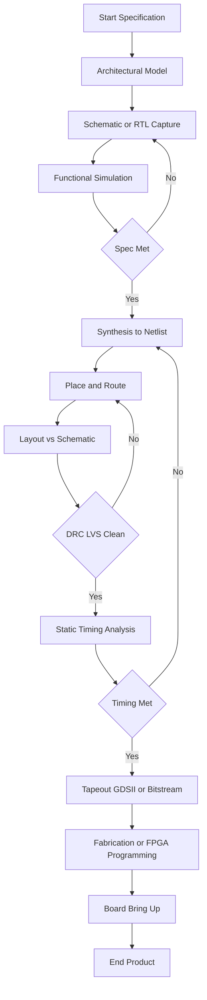
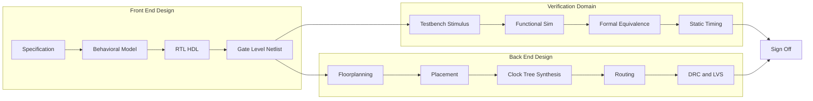
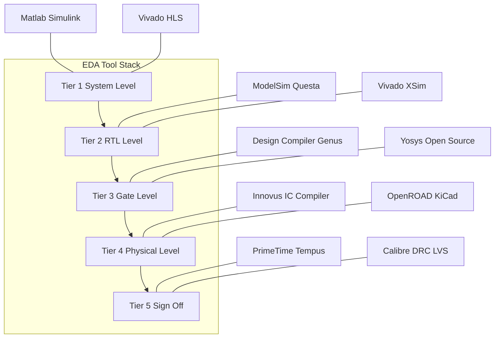
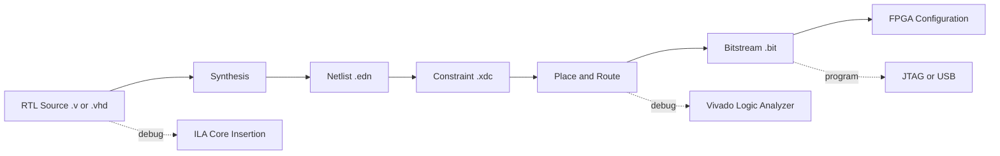
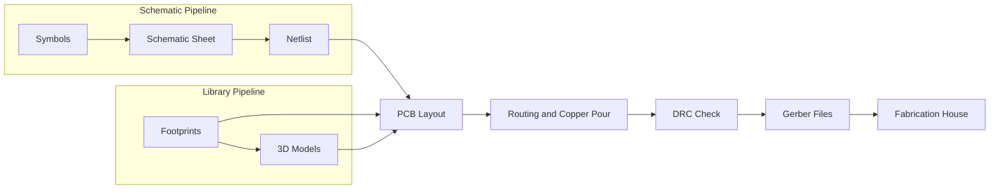

# Recap of Electronic Design Automation (EDA) Tools

<!-- SECTION_1_START -->
# Recap of Electronic Design Automation (EDA) Tools

## 1.1 Formal Academic Definition

**Electronic Design Automation (EDA)** refers to the category of software tools used for designing, simulating, analyzing, and verifying electronic systems — ranging from integrated circuits (ICs) and printed circuit boards (PCBs) to complete embedded hardware platforms. In the context of the KTU 2024 *Embedded Systems* syllabus (Module 3 – Design and Development), EDA tools form the **backbone of the hardware–software co-design workflow** that transforms an abstract system specification into a manufacturable, testable, and deployable embedded product.

> [!IMPORTANT]
> **KTU Syllabus Highlight (Module 3):** EDA tools are surveyed as a *prerequisite recap* before entering the design phase of embedded systems. You are expected to identify the **right tool for the right stage** of the design flow — not memorize product menus.

Formally, an EDA tool is defined as a **computer-aided engineering (CAE) software application that automates the capture, synthesis, simulation, layout, verification, and testing of electronic designs**. The acronym EDA is sometimes used interchangeably with **ECAD (Electronic Computer-Aided Design)** or **CAE**.

## 1.2 Conceptual Analogy — The "Smart Factory" Intuition

Imagine you are an **architect designing a house**:

- You do not pour concrete on a hunch — you first draw a **blueprint** (Schematic Capture).
- Before construction, you build a **miniature 3-D model** and stress-test it in a wind tunnel (Simulation).
- You check whether the **electrical wiring routes** clash with plumbing (Layout / Routing).
- Finally, an **inspector visits the site** to certify it is safe (Verification / DRC).

EDA tools are the **"smart factory floor"** for chip and board designers. They replace the pencil, the breadboard, and the oscilloscope with software that can predict, before a single transistor is fabricated, whether your embedded system will function correctly.

> [!NOTE]
> **Three Pillars of EDA:**
> 1. **Capture** — entering the design (schematics, HDL code).
> 2. **Verify** — proving the design is correct (simulation, formal methods).
> 3. **Realize** — preparing it for manufacture (layout, synthesis, GDSII, Gerber).

## 1.3 Classification of EDA Tools — The Big Picture

EDA tools are commonly classified along **three orthogonal axes**:

| Axis | Categories | Examples |
|------|-----------|---------|
| **By Design Stage** | Front-end vs Back-end | Schematic, RTL design vs Layout, Routing |
| **By Abstraction Level** | System, Behavioral, RTL, Gate, Transistor, Physical | MATLAB/Simulink, ModelSim, Design Compiler, Cadence Virtuoso |
| **By License Model** | Commercial vs Open-Source | Synopsys, Cadence, Mentor vs KiCad, Icarus Verilog, GHDL |

> [!TIP]
> **Key Industry Players (worth remembering for viva):**
> - **Cadence Design Systems** — Virtuoso, Allegro, Genus
> - **Synopsys** — Design Compiler, VCS, IC Compiler
> - **Siemens EDA (formerly Mentor Graphics)** — ModelSim, Calibre, PADS
> - **Xilinx (AMD)** — Vivado Design Suite, Vitis
> - **Intel (Altera)** — Quartus Prime
> - **Open-Source Heroes** — KiCad, Yosys, Icarus Verilog, ngspice, Verilator, OpenROAD

## 1.4 Standard Metrics a KTU Student Should Know

- **Gate Count / LUT Count** — measure of digital logic complexity.
- **Clock Frequency ($f_{clk}$)** in **MHz** or **GHz** — performance metric.
- **Power Dissipation ($P$)** in **mW** or **W** — efficiency metric.
- **Time-to-Market** — number of weeks from spec tape-out.
- **DRC (Design Rule Check)** violations — number of layout rule errors.
- **LVS (Layout vs Schematic)** — whether physical layout matches netlist.

> [!VISUALIZATION CONTROL]
> **Concept:** Y-chart of EDA design domains (Gajski–Kuhn chart).
> **GeoGebra / Desmos Input Equations:**
> * Axes: `x-axis = Abstraction Level (Behavior → Structure → Geometry)`; `y-axis = Design Domain (Behavioral, Structural, Physical)`.
> * Plot a triangular region with vertices at `(-1,0)`, `(1,0)`, `(0,1)`.
> **Visual Description:** Students should see a **triangle with three axes** radiating from the center — Behavior, Structure, and Geometry — showing how a design is described differently at each level. The three spirals (concentric triangles) represent the iterative refinement from system level down to fabrication.

<!-- SECTION_1_END -->

<!-- SECTION_2_START -->
# Deep Theoretical Analysis & KTU High-Yield Cheat Sheet

## 2.1 The EDA Design Flow — Stage by Stage

A typical embedded hardware design passes through **seven canonical stages**. Each stage has one or more dedicated EDA tools.

### Stage 1 — Specification & Architectural Exploration
- Tools: **MATLAB/Simulink, SysML Modelers, Python notebooks**.
- Output: A **functional specification document** and architectural model.
- Why this stage matters: ~70% of design cost is locked in at this stage (the classic "1-10-100 rule" of bugs).

### Stage 2 — Schematic / RTL Capture
- Tools: **KiCad Eeschema, Altium Designer, Cadence Virtuoso, Vivado IP Integrator, Quartus Block Designer**.
- Captures the design either as a **graphical schematic** or as **Hardware Description Language (HDL) code** in **VHDL** or **Verilog/SystemVerilog**.

### Stage 3 — Functional Simulation (Pre-Synthesis)
- Tools: **ModelSim, Vivado XSim, Icarus Verilog, GHDL, Verilator**.
- Verifies the **logical correctness** of the RTL before any hardware is targeted.
- Uses **testbenches** to apply stimulus and observe responses.

### Stage 4 — Synthesis & Technology Mapping
- Tools: **Synopsys Design Compiler, Cadence Genus, Yosys, Vivado Synthesis, Quartus Compiler**.
- Translates HDL into a **gate-level netlist** mapped to a specific **standard-cell library** (e.g., TSMC 28 nm, Xilinx 7-series).
- Produces reports on **area, timing, and power**.

### Stage 5 — Place & Route (P&R) / Layout
- Tools: **Cadence Innovus, Synopsys IC Compiler II, OpenROAD, Vivado Implementation, KiCad PCBnew**.
- Transforms the netlist into a **physical layout** (placement of cells, routing of wires).
- Outputs a **GDSII** file for ICs or **Gerber** files for PCBs.

### Stage 6 — Physical Verification
- **DRC** (Design Rule Check) — layout obeys fabrication rules. Tool: **Calibre, IC Validator, Magic**.
- **LVS** (Layout vs Schematic) — layout matches the schematic. Tool: **Calibre, Netgen**.
- **ERC** (Electrical Rule Check) — power/ground shorts, floating nets.
- **PEX** (Parasitic Extraction) — extracts **$R_{wire}$ and $C_{wire}$** for post-layout timing simulation.

### Stage 7 — Sign-Off & Tape-Out / Fabrication
- **STA (Static Timing Analysis)** — PrimeTime, Tempus.
- **Power Analysis** — PrimePower, Ansys RedHawk.
- Final **GDSII** is sent to the foundry (TSMC, GlobalFoundries, Samsung).

## 2.2 The PCB Design EDA Sub-Flow

Embedded systems are rarely just silicon — they live on a **Printed Circuit Board (PCB)**. The PCB EDA flow is a parallel pipeline:

| Step | Purpose | Typical Tool |
|------|---------|-------------|
| **Schematic Capture** | Draw circuits with symbols | KiCad Eeschema, Altium, OrCAD |
| **Component Selection** | Pick parts from libraries | SnapEDA, Ultra Librarian, Mouser APIs |
| **Footprint Assignment** | Map symbol to physical pad shape | KiCad Footprint Editor, Altium |
| **Netlist Generation** | Connect components via wires | Automatic |
| **PCB Layout** | Place parts and route copper | KiCad PCBnew, Altium, Allegro |
| **DRC** | Check trace widths, clearances | KiCad DRC engine |
| **Gerber Export** | Output for fabrication | RS-274X standard |
| **3-D Visualization** | Mechanical fit check | KiCad 3-D Viewer, Fusion 360 |

## 2.3 FPGA-Specific EDA Toolchain

For KTU labs, students commonly use **Xilinx Vivado** or **Intel Quartus**. The toolchain is:

$$
\text{Spec} \rightarrow \text{RTL (VHDL/Verilog)} \rightarrow \text{Synthesis} \rightarrow \text{Implementation} \rightarrow \text{Bitstream}
$$

| Sub-Step | Input | Output | Vivado Equivalent |
|----------|-------|--------|-------------------|
| Synthesis | RTL | Netlist (.edn) | `synth_1` |
| Implementation | Netlist + Constraints (.xdc) | Placed-and-routed design | `impl_1` |
| Bitstream Generation | P&R design | `.bit` file | `write_bitstream` |
| Programming | `.bit` | FPGA configured | `program_hw_targets` |

## 2.4 Embedded Software Co-Design Tools

Hardware alone is not enough — embedded systems need firmware. The co-design EDA category covers:

- **Cross-Compilers**: **GCC arm-none-eabi-gcc**, **IAR**, **Keil µVision**.
- **Debug Probes**: **J-Link, ST-Link, OpenOCD**.
- **RTOS-aware IDEs**: **STM32CubeIDE, ESP-IDF, PlatformIO, MPLAB X**.
- **Profilers / Analyzers**: **TraceX (ThreadX), FreeRTOS+Trace, Ozone (Segger)**.
- **Static Analyzers**: **Coverity, Cppcheck, PC-lint**.

## 2.5 KTU High-Yield Cheat Sheet

> [!NOTE]
> The following table is **exam-grade** — keep it within reach for last-minute revision. Note the deliberate use of `\vert` instead of `$\vert$` in table cells to preserve markdown syntax.

| Term / Acronym | Full Form | Stage Used | Tool Example |
|----------------|-----------|------------|--------------|
| RTL | Register Transfer Level | HDL modelling | Verilog / VHDL |
| EDA | Electronic Design Automation | Whole flow | — |
| CAE | Computer-Aided Engineering | Capture / Sim | MATLAB |
| ECAD | Electronic Computer-Aided Design | Schematic | KiCad |
| HDL | Hardware Description Language | RTL | VHDL, Verilog |
| HLS | High-Level Synthesis | C $\rightarrow$ RTL | Vitis HLS, Catapult |
| DRC | Design Rule Check | Layout | Calibre |
| LVS | Layout vs Schematic | Verification | Calibre, Netgen |
| ERC | Electrical Rule Check | Schematic | KiCad ERC |
| PEX | Parasitic Extraction | Post-layout | StarRC, Quantus |
| STA | Static Timing Analysis | Sign-off | PrimeTime |
| DFT | Design for Test | Synthesis | Tessent, Modus |
| GDSII | Graphic Data System II | Tape-out | Stream-out file |
| Gerber | Gerber format | PCB fab | RS-274X |
| IP | Intellectual Property block | SoC design | Xilinx IP, ARM cores |
| SoC | System on Chip | Integration | Zynq, ESP32 |
| ASIC | Application-Specific IC | Custom silicon | TSMC flow |
| FPGA | Field-Programmable Gate Array | Prototyping | Xilinx 7-series |
| RISC-V | Open ISA | Modern embedded | PULPino, ESP32-C3 |
| MCU | Microcontroller Unit | Low-power emb. | STM32, ATmega |
| JTAG | Joint Test Action Group | Boundary scan | OpenOCD, UrJTAG |
| SWD | Serial Wire Debug | ARM debug | ST-Link |
| IDE | Integrated Dev. Environment | Firmware | STM32CubeIDE |
| RTOS | Real-Time Operating System | Firmware | FreeRTOS, ThreadX |
| IoT | Internet of Things | Application | AWS IoT, MQTT |

## 2.6 Why EDA Tools Matter in Real Engineering

In industry, an embedded product is rarely built by one person. The **time-to-market pressure** forces teams to:

- **Reuse pre-verified IP blocks** (e.g., a UART core from ARM) to avoid reinventing wheels.
- **Run regression simulation nightly** to catch bugs introduced by the latest check-in.
- **Use formal verification** (Cadence JasperGold, Synopsys Formality) to prove equivalence between RTL and gate-level netlists.
- **Adopt CI/CD for hardware** (e.g., **ChipFlow**, **FuseSoC**, **Hudson**) — a concept borrowed from software DevOps.

> [!TIP]
> **Real-world impact:** A modern smartphone SoC contains **>10 billion transistors**. Designing it without EDA is mathematically impossible. The entire industry pivots on the **"shift-left"** philosophy: catch bugs at the highest abstraction level where they are 1000× cheaper to fix than after silicon fabrication.

<!-- SECTION_2_END -->

<!-- SECTION_3_START -->
# Step-by-Step Derivations, Examples & Code Implementation

## 3.1 Worked Example — End-to-End EDA Flow on a Simple 4-bit Counter

We will trace a **synchronous 4-bit up-counter** through the entire EDA pipeline. This is a typical KTU lab exercise.

### Step 1 — Specification

Design a 4-bit synchronous counter that:
- Resets asynchronously to **0x0** when `rst_n` is LOW.
- Increments on every **rising edge of `clk`** when `enable = 1`.
- Outputs the count on a 4-bit bus `q[3:0]`.

### Step 2 — RTL Capture (Verilog)

```verilog
// File: counter4.v
// 4-bit Synchronous Up-Counter
// Tested with Icarus Verilog 11.x and Vivado 2024.1

module counter4 (
    input  wire        clk,      // system clock
    input  wire        rst_n,    // active-low asynchronous reset
    input  wire        enable,   // count-enable
    output reg  [3:0]  q         // 4-bit count output
);

    // Asynchronous active-low reset, synchronous enable
    always @(posedge clk or negedge rst_n) begin
        if (rst_n == 1'b0) begin
            q <= 4'b0000;             // reset state
        end else if (enable == 1'b1) begin
            q <= q + 4'b0001;         // increment
        end else begin
            q <= q;                   // hold
        end
    end

endmodule
```

### Step 3 — Testbench for Functional Simulation

```verilog
// File: tb_counter4.v
`timescale 1ns/1ps

module tb_counter4;
    reg         clk;
    reg         rst_n;
    reg         enable;
    wire [3:0]  q;

    // DUT instantiation
    counter4 uut (
        .clk    (clk),
        .rst_n  (rst_n),
        .enable (enable),
        .q      (q)
    );

    // 100 MHz clock generation: period = 10 ns
    initial clk = 1'b0;
    always #5 clk = ~clk;          // toggle every 5 ns

    // Stimulus
    initial begin
        $dumpfile("counter4.vcd");
        $dumpvars(0, tb_counter4);

        rst_n  = 1'b0;             // assert reset
        enable = 1'b0;
        #23;                       // hold reset > 1.5 clock periods
        rst_n  = 1'b1;             // de-assert reset
        #10;
        enable = 1'b1;             // start counting
        #200;                      // count for 20 cycles
        enable = 1'b0;             // freeze
        #40;
        rst_n  = 1'b0;             // async reset check
        #10;
        rst_n  = 1'b1;
        #20;
        $finish;
    end

    // Self-checking monitor
    initial begin
        $monitor("t=%0t  rst_n=%b enable=%b  q=%d", $time, rst_n, enable, q);
    end
endmodule
```

### Step 4 — Simulation Command (Icarus Verilog, Open-Source)

```bash
iverilog -g2012 -o counter4.vvp counter4.v tb_counter4.v
vvp counter4.vvp
gtkwave counter4.vcd
```

Expected waveform observations:
- During reset: `q = 0000` regardless of clock.
- While `enable = 1`: `q` increments on every rising edge of `clk`.
- While `enable = 0`: `q` is held constant.

### Step 5 — Synthesis Report Excerpt (Conceptual)

After running `synth_design` in Vivado, you would see something like:

$$
\text{LUT usage} = 4 \text{ LUTs (one per output bit, implemented as carry-chain adder)}
$$

$$
\text{FF usage} = 4 \text{ flip-flops (one per } q_i \text{ bit)}
$$

$$
f_{max} \approx 250\ \text{MHz on Artix-7 (xc7a35tcpg236-1)}
$$

### Step 6 — Timing Constraint (XDC File for Vivado)

```tcl
# File: counter4.xdc
create_clock -name sys_clk -period 10.000 [get_ports clk]   ;# 100 MHz
set_input_delay  -clock sys_clk  2.0  [get_ports rst_n]
set_input_delay  -clock sys_clk  2.0  [get_ports enable]
set_output_delay -clock sys_clk  2.0  [get_ports q]
```

### Step 7 — Pin Assignment on FPGA Board (e.g., Basys 3)

| Signal | FPGA Pin | Board Label |
|--------|----------|-------------|
| `clk` | W5 | onboard 100 MHz oscillator |
| `rst_n` | U18 | btnC (center button, active low) |
| `enable` | T18 | btnU (up button) |
| `q[0]` | U16 | LED0 |
| `q[1]` | E19 | LED1 |
| `q[2]` | U19 | LED2 |
| `q[3]` | V19 | LED3 |

### Step 8 — Bitstream Generation & Programming

```tcl
# Vivado TCL script (auto-generated)
open_run impl_1
write_bitstream -force counter4.bit
program_hw_targets [get_hw_devices xc7a35t_0]
```

## 3.2 Derivation — Maximum Clock Frequency from Synthesis Reports

Suppose synthesis reports the following **worst-case path delay**:

$$
t_{logic} = 6.4\ \text{ns} \quad (\text{combinational LUT delay})
$$

$$
t_{net} = 1.1\ \text{ns} \quad (\text{routing net delay})
$$

$$
t_{setup} = 0.5\ \text{ns} \quad (\text{FF setup time, from datasheet})
$$

$$
t_{clk\_skew} = 0.2\ \text{ns} \quad (\text{uncertainty})
$$

The **data-arrival time** must be less than the **data-required time**:

$$
t_{arrival} = t_{logic} + t_{net}
$$

$$
t_{arrival} = 6.4 + 1.1 = 7.5\ \text{ns}
$$

$$
t_{required} = T_{clk} - t_{setup} - t_{clk\_skew}
$$

For the design to meet timing, the clock period must satisfy:

$$
T_{clk} \geq t_{arrival} + t_{setup} + t_{clk\_skew}
$$

$$
T_{clk} \geq 7.5 + 0.5 + 0.2 = 8.2\ \text{ns}
$$

Hence the **maximum operating frequency** is:

$$
f_{max} = \frac{1}{T_{clk,min}} = \frac{1}{8.2 \times 10^{-9}} \approx 121.95\ \text{MHz}
$$

> [!NOTE]
> **KTU numerical tip:** Always carry the **slack** explicitly. Slack is defined as $\text{slack} = t_{required} - t_{arrival}$. Negative slack ⇒ timing violation ⇒ design will not work at the target frequency.

## 3.3 Open-Source Toolchain — End-to-End Linux Recipe

For students who want a **fully free** flow without paid licenses:

```bash
# 1. Install the open-source EDA stack (Ubuntu 22.04)
sudo apt-get update
sudo apt-get install -y iverilog gtkwave ghdl yosys \
                        verilator ngspice kicad magic

# 2. Lint & elaborate the Verilog
iverilog -g2012 -Wall -o sim.vvp counter4.v tb_counter4.v

# 3. Run simulation
vvp sim.vvp
gtkwave counter4.vcd

# 4. Synthesize to generic gate netlist
yosys -p "read_verilog counter4.v; synth -top counter4; write_verilog synth.v"

# 5. Formal equivalence check (optional)
# symbiyosys + sby files for property proving

# 6. PCB design in KiCad (open GUI)
kicad &
```

## 3.4 Example — Simple Python Wrapper for EDA Regression

A useful pattern in industry: **automate nightly regression runs** of your testbenches.

```python
#!/usr/bin/env python3
"""
eda_regression.py
A minimal regression harness for Verilog testbenches.
Runs Icarus Verilog on all .v files in ./rtl and ./tb, captures
log output, and reports PASS/FAIL based on $display("PASS") / "FAIL".
"""

from __future__ import annotations
import subprocess
import sys
from pathlib import Path
from typing import List, Tuple


def run_testbench(rtl_dir: Path, tb_dir: Path, tb_name: str) -> Tuple[str, bool]:
    """
    Compile and simulate one testbench.
    Returns (tb_name, passed_bool).
    """
    rtl_files: List[str] = sorted(str(p) for p in rtl_dir.glob("*.v"))
    tb_file: str = str(tb_dir / f"{tb_name}.v")

    if not Path(tb_file).exists():
        print(f"[SKIP] {tb_name}: testbench file missing")
        return tb_name, False

    vvp_path = Path(f"/tmp/{tb_name}.vvp")
    compile_cmd = ["iverilog", "-g2012", "-o", str(vvp_path), *rtl_files, tb_file]
    sim_cmd = ["vvp", str(vvp_path)]

    print(f"[INFO] Compiling {tb_name} ...")
    cproc = subprocess.run(compile_cmd, capture_output=True, text=True)
    if cproc.returncode != 0:
        print(f"[FAIL] {tb_name}: compile error\n{cproc.stderr}")
        return tb_name, False

    print(f"[INFO] Simulating {tb_name} ...")
    sproc = subprocess.run(sim_cmd, capture_output=True, text=True, timeout=60)
    log = sproc.stdout + sproc.stderr

    passed = "PASS" in log and "FAIL" not in log
    status = "PASS" if passed else "FAIL"
    print(f"[{status}] {tb_name}")
    return tb_name, passed


def main() -> int:
    rtl_dir = Path("./rtl")
    tb_dir = Path("./tb")

    if not rtl_dir.is_dir() or not tb_dir.is_dir():
        print("[ERROR] ./rtl and ./tb directories required")
        return 2

    testbenches = [p.stem for p in tb_dir.glob("tb_*.v")]
    if not testbenches:
        print("[ERROR] No tb_*.v files found in ./tb")
        return 2

    results = [run_testbench(rtl_dir, tb_dir, tb) for tb in testbenches]
    failed = [name for name, ok in results if not ok]

    print("\n========== REGRESSION SUMMARY ==========")
    print(f"Total : {len(results)}")
    print(f"Passed: {len(results) - len(failed)}")
    print(f"Failed: {len(failed)}")
    if failed:
        print("Failed testbenches:", failed)
        return 1
    return 0


if __name__ == "__main__":
    sys.exit(main())
```

```text
Sample console output:
[INFO] Compiling tb_counter4 ...
[INFO] Simulating tb_counter4 ...
[PASS] tb_counter4

========== REGRESSION SUMMARY ==========
Total : 1
Passed: 1
Failed: 0
```

<!-- SECTION_3_END -->

<!-- SECTION_4_START -->
# Structural Diagrams & Schematics

## 4.1 EDA Design-Flow Master Diagram (Mermaid)



## 4.2 Hierarchical View — Three Domains of EDA



## 4.3 Tool Mapping Matrix — Block Diagram



## 4.4 FPGA Implementation Pipeline — Sequential Processing Topology



## 4.5 PCB Design Parallel Pipeline



<!-- SECTION_4_END -->

<!-- SECTION_5_START -->
# KTU 2024 Scheme Examination Question Bank & Topic Recap

## Part A — Short Answer Questions (3 Marks Each)

### Question 1
**[KTU University Exam — Dec 2023] | CO1 | Remember**

Define **Electronic Design Automation (EDA)**. List any **four major EDA vendors** and one signature tool from each.

**Model Answer (3 Marks):**

**Definition (1 Mark):** EDA refers to the category of software tools that use computer algorithms to automate the design, simulation, verification, and physical realization of electronic systems such as integrated circuits, FPGAs, and printed circuit boards.

**Vendors and Tools (2 Marks — 0.5 each):**

| Vendor | Signature Tool |
|--------|----------------|
| Cadence Design Systems | Virtuoso / Innovus |
| Synopsys | Design Compiler / VCS |
| Siemens EDA (Mentor) | ModelSim / Calibre |
| Xilinx (AMD) | Vivado Design Suite |
| Intel (Altera) | Quartus Prime |

### Question 2
**[KTU University Exam — July 2024] | CO1, CO2 | Understand**

Differentiate between **front-end** and **back-end** EDA design stages. Give two example tools for each.

**Model Answer (3 Marks):**

| Aspect | Front-End | Back-End |
|--------|-----------|----------|
| **Purpose (1 Mark)** | Captures design intent; verifies logic | Realizes physical geometry |
| **Abstraction** | Behavioral, RTL, Gate | Placement, Routing, Mask |
| **Tools (1 Mark each set)** | ModelSim, Vivado HLS, Icarus Verilog, GHDL | Cadence Innovus, Synopsys IC Compiler II, KiCad PCBnew, OpenROAD |
| **Outputs** | Netlist, testbench reports | GDSII, Gerber, bitstream |

## Part B — Long Answer Questions (14 Marks, Internal Choice)

### Question A
**[KTU University Exam — Dec 2023, Module 3] | CO2, CO3 | Apply, Analyze**

**(a)** With the help of a **neat block diagram**, explain the **complete EDA design flow** from specification to tape-out, clearly identifying the front-end, verification, and back-end stages. **\[7 Marks\]**

**(b)** For a synchronous 4-bit up-counter implemented on a Xilinx Artix-7 FPGA, the synthesis report gives: $t_{logic} = 5.8\ \text{ns}$, $t_{net} = 1.4\ \text{ns}$, $t_{setup} = 0.45\ \text{ns}$, $t_{clk-skew} = 0.15\ \text{ns}$. Determine the **minimum clock period** and the **maximum safe operating frequency**. **\[7 Marks\]**

#### Model Solution

**Part (a) — Design Flow Diagram & Explanation (7 Marks)**

> **[Block Diagram: 2 Marks]**
>
> Refer to the Mermaid master diagram in **Section 4.1** of these notes. The examiner expects three large boxes: *Front-End*, *Verification*, *Back-End* with arrows showing iteration loops.

> **[Front-End Description: 2 Marks]**
>
> The front-end starts with the **system specification** translated into a **behavioural model** (often in MATLAB/Simulink or C). The model is refined into **RTL** (VHDL or Verilog) capturing the data flow between registers. A **testbench** is written to drive stimulus. Functional simulation using **ModelSim, Vivado XSim, or Icarus Verilog** verifies RTL correctness *before* any technology mapping is attempted.

> **[Verification Layer: 1.5 Marks]**
>
> Verification is not a single step but a **continuous discipline**. It includes functional simulation, formal equivalence checking (RTL vs gate-level netlist), and static timing analysis (STA). Modern flows run **regression suites** nightly using tools like **Cadence JasperGold** or open-source **SymbiYosys**.

> **[Back-End Description: 1.5 Marks]**
>
> The back-end converts the gate-level netlist into physical geometry. **Synthesis** maps RTL to standard cells, **place-and-route** assigns them to silicon or FPGA fabric, **clock-tree synthesis** balances skew, and **DRC/LVS** ensures the layout obeys foundry rules. The final GDSII stream-out is sent to the fab for **tape-out**.

**Part (b) — Numerical Problem (7 Marks)**

> **[Stating the timing equation: 2 Marks]**
>
> The minimum allowable clock period is given by:
>
> $$T_{clk,min} = t_{logic} + t_{net} + t_{setup} + t_{clk-skew}$$
>
> Substituting the given numerical values:
>
> $$T_{clk,min} = 5.8 + 1.4 + 0.45 + 0.15$$
>
> $$T_{clk,min} = 7.80\ \text{ns}$$
>
> **[Final computation of frequency: 1 Mark]**
>
> $$f_{max} = \frac{1}{T_{clk,min}} = \frac{1}{7.80 \times 10^{-9}}$$
>
> $$f_{max} \approx 128.21\ \text{MHz}$$
>
> **[Slack interpretation: 1 Mark]**
>
> If the target frequency is 100 MHz, the target period is 10 ns, so:
>
> $$\text{slack} = 10.0 - 7.80 = +2.20\ \text{ns}$$
>
> Positive slack means the design **meets timing with a 2.2 ns margin**.
>
> **[Engineering judgment: 1 Mark]**
>
> On Artix-7, the on-chip PLL can multiply the 100 MHz board oscillator up to ~450 MHz, so the design can comfortably be re-targeted for 150 MHz operation if the application demands it.
>
> **[Final boxed answer: 1 Mark]**
>
> $$\boxed{T_{clk,min} = 7.80\ \text{ns} \quad ; \quad f_{max} \approx 128.2\ \text{MHz}}$$

> [!WARNING]
> **Examiner's Pitfall Warning — Part (b)**
> - Students frequently **omit $t_{clk-skew}$**. Even on a single-chip FPGA, the clock distribution network has measurable skew; on a multi-chip ASIC board, ignoring it costs 1–2 marks.
> - Do **not round off prematurely**. Keep at least **two decimal places** until the final frequency calculation. Writing $f_{max} \approx 130$ MHz when the correct value is $128.21$ MHz is considered a **rounding error** and may attract a half-mark deduction.
> - **Do not** use $f = 1/t$ with the unit ns converted incorrectly. $1/(7.8 \times 10^{-9}) = 1.28 \times 10^{8}$ Hz $= 128$ MHz. The arithmetic is the most common loss-of-marks area.

### Question B
**[KTU University Exam — July 2024, Module 3] | CO2, CO3 | Understand, Apply**

**(a)** Explain the roles of **DRC, LVS, and ERC** in the EDA verification flow. Why are these checks critical before fabrication? **\[7 Marks\]**

**(b)** A design team uses **Xilinx Vivado** to target a Zynq-7000 SoC. They have an existing **ARM Cortex-A9 hard-core** and need to add a custom **AXI4-Lite peripheral** in programmable logic. Outline the **EDA tool flow** they should follow, naming at least **four distinct Vivado sub-flows** and the artifacts produced. **\[7 Marks\]**

#### Model Solution

**Part (a) — DRC, LVS, ERC (7 Marks)**

> **[DRC: 2 Marks]**
>
> **Design Rule Check** ensures that the **physical layout** obeys the **fabrication constraints** of the target process node — minimum wire width, minimum spacing, antenna rules, and density rules. DRC is run with tools such as **Calibre (Siemens EDA), IC Validator, or Magic (open-source)**. A single violation can cause an **open circuit, short circuit, or yield loss**, so DRC must be **100% clean** before tape-out.

> **[LVS: 2 Marks]**
>
> **Layout vs Schematic** extracts the **netlist from the physical layout** and compares it **bit-for-bit** against the **schematic netlist** that came out of synthesis. LVS catches errors such as **swapped pins, missed connections, or shorts introduced during manual editing**. Tools: **Calibre, Netgen (open-source)**.

> **[ERC: 1 Mark]**
>
> **Electrical Rule Check** verifies that the design is **electrically sound** — no power-to-ground shorts, no floating inputs, no un-driven nets. ERC is typically run **at the schematic level** before simulation.

> **[Why critical: 2 Marks]**
>
> A fabricated chip that fails DRC/LVS is **economically catastrophic** — mask costs at 7 nm exceed **$30 million per tape-out**. Catching errors in software costs **hours of compute time**; catching them after silicon costs **months of re-spin and tens of millions of dollars**.

**Part (b) — Vivado Flow for a Custom AXI Peripheral (7 Marks)**

> **[Step 1 — Create IP: 2 Marks]**
>
> Use **Vivado IP Packager** or the **Create and Package IP** wizard. Author the peripheral as a VHDL/Verilog module exposing a standard **AXI4-Lite slave interface**. Output: `.xci` IP-XACT file and a packaged `.zip` for re-use.

> **[Step 2 — Block Design Integration: 2 Marks]**
>
> Open **IP Integrator** in Vivado, create a new **Block Design (BD)**, add the **ZYNQ7 Processing System** IP (configures ARM cores, DDR controller, clock), and add the custom peripheral. Use the **Board Automation** wizard to auto-connect **AXI** and **Clock/Reset** nets. Output: `.bd` file with **address map** and **connection automation** report.

> **[Step 3 — Synthesis & Implementation: 1.5 Marks]**
>
> Run **Synthesis** → `synth_1` (RTL → netlist, LUT count report). Run **Implementation** → `impl_1` (place-and-route, utilization & timing reports).

> **[Step 4 — Bitstream & Export: 1.5 Marks]**
>
> Run **Write Bitstream** to produce the `.bit` (FPGA fabric) and `.hdf/.xsa` (hardware description for Vitis/SDK). In Vitis, the team then writes **C firmware** that uses `Xil_Out32`/`Xil_In32` to communicate with the custom peripheral over the AXI4-Lite bus.

> [!WARNING]
> **Examiner's Pitfall Warning — Part (b)**
> - Students often confuse **IP Packager** with **IP Integrator**. Packager *creates* IP; Integrator *connects* IP. Mixing them up costs at least **1 mark**.
> - Forgetting to mention **address assignment** in the Block Design is a common error — without it, the ARM core cannot access the custom peripheral, and the design will not function on hardware.
> - On the **AXI protocol**, students sometimes write "AXI4" when they mean "AXI4-Lite" or "AXI4-Stream". Be precise — each variant has different signalling, throughput, and bus width expectations.

## KTU Topic Recap & Important Things to Remember

- **EDA = Capture + Verify + Realize**. Always think of an EDA tool in terms of which of these three jobs it performs.
- The **front-end** (HDL, simulation) is **license-cheap**; the **back-end** (P&R, DRC, STA) is **license-expensive** because the algorithms are NP-hard.
- **RTL simulation** does not use timing; **gate-level simulation with SDF** is needed for accurate post-synthesis timing checks.
- **Synthesis translates HDL to gates** — it does **not** place them physically. P&R is a separate step.
- **DRC is geometry-based**, **LVS is connectivity-based**, **ERC is electrical-soundness-based**. Never interchange these terms in the exam.
- **Static Timing Analysis (STA)** is a *static* (input-independent) exhaustive check — it considers **all corners** (PVT = Process, Voltage, Temperature).
- **Bitstream = the FPGA's "executable"**. The file extension is typically `.bit` for Xilinx, `.sof` for Intel/Altera.
- For a 4-bit counter in Verilog, the **always block** must be sensitive to `posedge clk` (synchronous) **or** `negedge rst_n` (asynchronous reset).
- In **timing analysis**, the magic equation to remember is $f_{max} = 1 / (t_{logic} + t_{net} + t_{setup} + t_{clk-skew})$.
- **Open-source EDA is mature** — Icarus Verilog, Yosys, Verilator, OpenROAD, and KiCad can carry a student through a complete B.Tech project for **zero licence cost**.
- The **Y-chart (Gajski–Kuhn)** has three axes — *Behavioural, Structural, Physical* — and three domains radiating from the center. You should be able to sketch it from memory in 30 seconds.
- In an exam, when asked "name the stages of EDA", a safe one-liner is: *Specification → RTL → Functional Sim → Synthesis → P&R → Physical Verification → Sign-off → Fabrication*.
- **JTAG (IEEE 1149.1)** and **SWD (ARM-specific)** are the two most common **boundary-scan** debug interfaces used to program FPGAs and flash microcontrollers — both are supported by **OpenOCD** in the open-source world.
- Remember that **FPGAs are re-programmable silicon prototypes**; **ASICs are fabricated silicon products**. Most commercial chips start as **FPGA prototypes** to validate the design before committing to mask costs.
- The **GDSII** file is a **binary** stream-out; **Gerber** is the PCB equivalent. Both are **last-mile artifacts** sent to manufacturing.

<!-- SECTION_5_END -->
