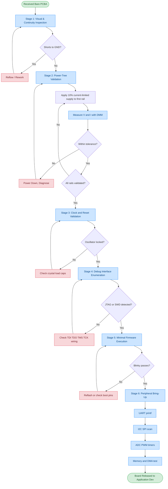
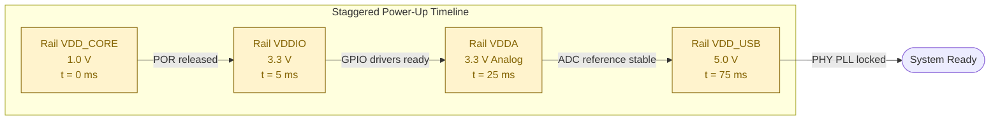
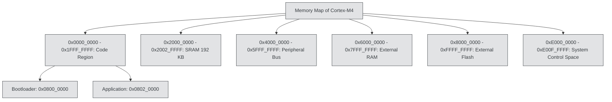
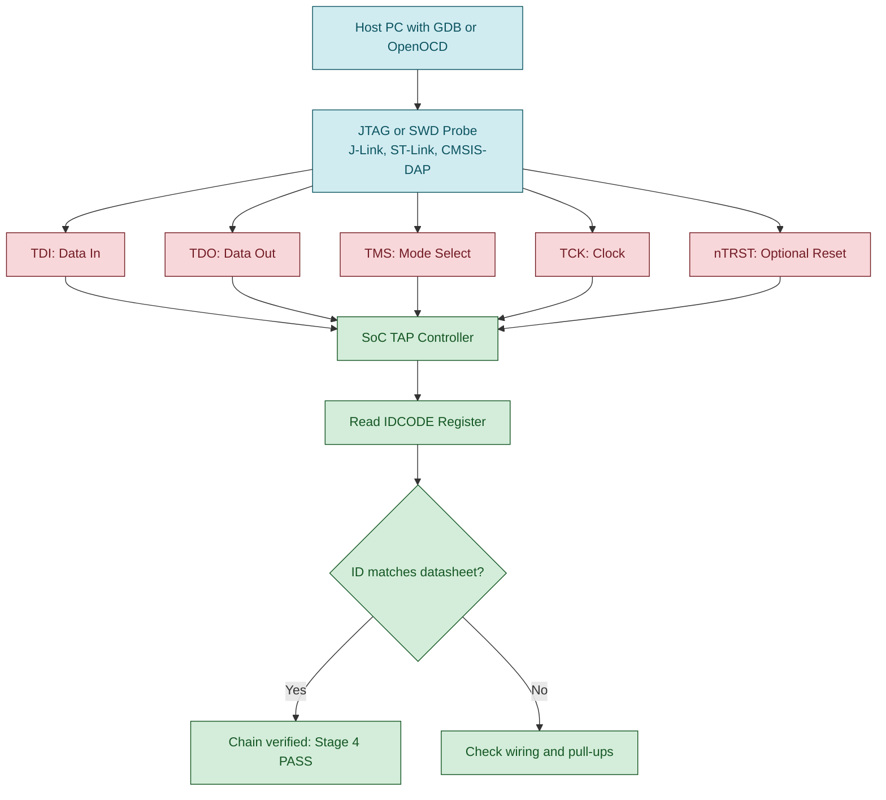

# Boards Bring up

<!-- SECTION_1_START -->
# Module 4: Integration and Testing of Embedded Hardware and Firmware
## Topic: Board Bring-Up

> [!NOTE]
> **KTU 2024 Scheme | PECST746 — Embedded Systems**
> This topic sits at the intersection of **hardware engineering**, **firmware design**, and **systems integration**. Board bring-up is a hands-on, lab-centric competency. Almost every question in KTU examinations tests the *sequence of checks*, *power-rail validation*, and *debug interface activation* performed on a freshly fabricated Printed Circuit Board Assembly (PCBA).

### 1.1 Formal Academic Definition

**Board Bring-Up** is the systematic, staged process of progressively energizing, initializing, and validating a newly manufactured embedded hardware platform — from a bare PCBA (Printed Circuit Board Assembly) populated with passive components, active ICs, and connectors — to a fully functional, firmware-responsive system capable of executing user applications.

In the formal vocabulary of the KTU 2024 Embedded Systems syllabus (PECST746, Module 4: *Integration and testing of embedded hardware and firmware*), board bring-up is defined as:

> *"The disciplined sequence of power-rail verification, clock-distribution validation, reset-tree assertion, debug-port enumeration, and minimal-firmware execution performed on a prototype board to transform it from an unverified assembly into a working embedded system."*

The procedure typically follows a **bottom-up approach**:

$$
\text{Bare PCB} \rightarrow \text{Power Rails} \rightarrow \text{Clock} \rightarrow \text{Reset} \rightarrow \text{SoC/MCU} \rightarrow \text{Peripherals} \rightarrow \text{Application Firmware}
$$

### 1.2 Conceptual Analogy — The "Newborn ICU" Model

Imagine a hospital neonatal intensive care unit (NICU) receiving a newborn baby:

| NICU Stage | Board Bring-Up Stage |
|------------|----------------------|
| First breath — oxygen, heartbeat checked | **Power rails energized**, current draw measured |
| Body temperature stabilized | **Clock sources** locked and validated |
| Reflexes tested (grasp, blink) | **Reset signals** released, SoC boots |
| Basic senses (hearing, sight) | **Debug interface** (JTAG/SWD) enumerated |
| Feeding, growth monitoring | **Minimal firmware** uploaded (blinky test) |
| Full-body check-up | **Peripheral bring-up** (UART, SPI, I²C sensors) |

Just as a NICU team *never* connects a baby to every machine at once, a bring-up engineer **never** powers every rail simultaneously. Each subsystem is energized, measured, and certified before the next is added.

> [!IMPORTANT]
> **Core KTU High-Yield Concept:**
> The three cardinal sins of board bring-up are:
> 1. Applying full power without verifying **no-short** conditions (causing *magic smoke*).
> 2. Connecting JTAG/SWD to an unverified power tree.
> 3. Skipping the **current-limit** bench power-supply stage.
>
> A disciplined engineer **always** uses a **current-limited lab bench supply (set to ~10–20 % of expected nominal current)** during the first power-on.

### 1.3 Standard Metrics and Tools

The following constants and standards appear frequently in KTU board-bring-up questions:

| Parameter | Standard Value / Symbol | Notes |
|-----------|-------------------------|-------|
| Lab bench supply current limit | **10 %** of full load | First-power safety rule |
| Logic-analyzer probe impedance | **1 MΩ, 10 pF** | Non-intrusive digital capture |
| JTAG clock (TCK) | **1–10 MHz** typical | Slow-scan for first contact |
| SWD clock (SWCLK) | **1–50 MHz** | ARM Cortex debug standard |
| Power-on-reset (POR) threshold | **V\textsubscript{POR} ≈ 0.8 V** (typ.) | MCU-specific |
| Brown-out reset (BOR) | **V\textsubscript{BOR}** (per datasheet) | E.g., 2.7 V for 3.3 V rails |
| Decoupling capacitor value | **100 nF + 10 µF** per VDD pin | Standard practice |
| Inrush current budget | **2× steady-state** for < 100 µs | Bulk-cap charging |

> [!VISUALIZATION CONTROL]
> **Concept:** Power-rail ramp-up curve during first power-on
> **GeoGebra / Desmos Input Equations:**
> * $V(t) = V_{final} \cdot (1 - e^{-t/\tau})$ with $\tau = R_{load} \cdot C_{bulk}$
> * Sample curve: $V(t) = 3.3 \cdot (1 - e^{-t/0.005})$
> **Visual Description:** A classic RC charging curve starting at 0 V, reaching 3.3 V asymptotically. The inflection point represents the SoC's power-on-reset (POR) release threshold (~0.8 V). Students should observe the **monotonic rise** and the brief inrush region near $t = 0$.

### 1.4 Why Board Bring-Up Matters in Industry

In industry, a single undetected short circuit on a complex System-on-Module (SoM) can destroy **₹50,000–₹5,00,000** worth of silicon before a single line of code runs. Companies like Bosch, Continental, and Texas Instruments therefore mandate a **formal bring-up checklist** signed off by a senior engineer before any firmware is loaded. KTU embeds this same discipline in its lab courses to prepare students for industry-grade practices.
<!-- SECTION_1_END -->

<!-- SECTION_2_START -->
# Deep Theoretical Analysis & KTU High-Yield Formula Sheet

## 2.1 The Six-Stage Bring-Up Architecture

The KTU 2024 syllabus treats board bring-up as a **strictly ordered sequence**. Skipping a stage is the most common cause of failed board demos. The six stages are:

### Stage 1 — Visual & Continuity Inspection (Pre-Power)
- **Optical** inspection under a stereo microscope (10–40×).
- **Continuity** checks from power-input pads to IC pins.
- **Short** detection between power and ground (must be > 1 MΩ for digital rails).
- **Solder-bridge**, **cold-joint**, and **missing-component** audits.

### Stage 2 — Power-Tree Validation
- Identify all **voltage rails** ($V_{IN}$, $V_{DD}$, $V_{DDIO}$, $V_{DDA}$, $V_{CORE}$).
- Power one rail at a time with a **current-limited supply**.
- Measure actual rail voltage with a **4-wire Kelvin** connection.
- Verify **power-good (PG)** signals and **power-on-reset** timing.

### Stage 3 — Clock & Reset Validation
- Probe **crystal oscillator** output with an oscilloscope.
- Confirm **PLL lock** status via internal register.
- Trace the **reset tree** (POR → BOR → external reset IC → SoC nRESET).

### Stage 4 — Debug Interface Enumeration
- Connect **JTAG** (TDI, TDO, TMS, TCK, nTRST) or **SWD** (SWDIO, SWCLK).
- Use **OpenOCD**, **J-Link**, or **ST-Link** to detect the device IDCODE.
- Verify boundary-scan chain integrity (per IEEE 1149.1).

### Stage 5 — Minimal Firmware Execution
- Flash a **"blinky"** or **"hello-world"** test to prove instruction fetch.
- Validate **SRAM read/write** with a memory-test pattern (e.g., 0x55, 0xAA, walking-ones).
- Confirm **Flash programming** and **verify cycles**.

### Stage 6 — Peripheral & Application Bring-Up
- Initialize **UART** for `printf` debug channel.
- Validate **I²C, SPI, GPIO, ADC, PWM** one peripheral at a time.
- Run **HIL (Hardware-in-the-Loop)** regression before production handoff.

## 2.2 Power-Sequence Timing Theory

Most modern SoCs (e.g., NXP i.MX RT, STM32, TI Sitara) require a **staggered power-up** to prevent **latch-up**. The general constraint is:

$$
t_{delay} \geq \Delta t_{min} \quad \text{between successive rails}
$$

Typical values from manufacturer datasheets:

| Rail Transition | Minimum Delay | Reason |
|-----------------|---------------|--------|
| $V_{CORE}$ → $V_{DDIO}$ | **5 ms** | Avoid IO-driver contention |
| $V_{DDIO}$ → $V_{DDA}$ | **20 ms** | Analog reference stability |
| $V_{DDA}$ → $V_{USB}$ | **50 ms** | PLL/regulator settling |

## 2.3 Current Budget Calculation

The total inrush current of a board at first power-on is given by:

$$
I_{inrush}(t) = I_{load} + C_{bulk} \cdot \frac{dV}{dt} + \sum_{i=1}^{n} I_{IC,i}(t)
$$

For the bulk-capacitor charging component (the dominant term at $t \to 0^+$):

$$
I_{C,bulk}(t) = \frac{V_{final}}{R_{ESR}} \cdot e^{-t / (R_{ESR} \cdot C_{bulk})}
$$

Where:
- $V_{final}$ = target rail voltage
- $R_{ESR}$ = equivalent series resistance of bulk capacitor
- $C_{bulk}$ = total bulk capacitance on the rail

> [!IMPORTANT]
> **KTU Quick Trick:** A common exam question asks to compute the **energy stored** in a bulk capacitor at first power-on:
> $$E = \frac{1}{2} C_{bulk} \cdot V_{final}^2$$
> This energy is dissipated as heat in the LDO/PWM controller and must be within the controller's **safe operating area (SOA)**.

## 2.4 KTU High-Yield Formula & Checklist Sheet

| # | Concept | Formula / Rule | Units | KTU Frequency |
|---|---------|----------------|-------|---------------|
| 1 | RC charging | $V(t) = V_f (1 - e^{-t/RC})$ | V, s | High |
| 2 | Energy in bulk cap | $E = \frac{1}{2} C V^2$ | Joules | High |
| 3 | Inrush peak | $I_{peak} \approx V_f / R_{ESR}$ | A | Medium |
| 4 | POR threshold | $V_{POR} \approx 0.8$ V (typ.) | V | High |
| 5 | Brown-out hysteresis | $V_{BOR+} - V_{BOR-}$ | V | Medium |
| 6 | Crystal startup time | $t_{start} \approx 5$–$50$ ms | ms | Medium |
| 7 | JTAG TCK max | $f_{TCK} \le 50$ MHz | Hz | Low |
| 8 | Decoupling rule | $C_{decoup} = 100$ nF per $V_{DD}$ pin | F | High |
| 9 | Lab supply limit | $I_{limit} = 0.1 \cdot I_{nominal}$ | A | **Very High** |
| 10 | Boundary-scan chain | $N_{devices} = \prod_{i=1}^{n} L_i$ | count | Low |

## 2.5 Real-World Engineering Utility

| Industry Sector | Bring-Up Practice |
|-----------------|-------------------|
| **Automotive ECUs (Bosch, Continental)** | ASIL-D certified bring-up; cold-start at $-40$ °C |
| **IoT Wearables (Fitbit, Xiaomi)** | Power-budgeted bring-up for $< 50$ µA sleep |
| **Aerospace (ISRO, NASA CubeSats)** | Radiation-hardened bring-up; triple-redundant rails |
| **Medical Devices (Pacemakers, Medtronic)** | IEC 62304 compliant bring-up; formal sign-off |
| **Consumer (Smartphones, Apple A-series)** | Big-Little cluster sequential core bring-up |

> [!NOTE]
> **Industry Insight:** The Apple A-series SoCs use a **cluster-by-cluster power-gating** bring-up where the tiny efficiency cores ($4\times$ Icestorm) power up first, validate the firmware, and then unleash the performance cores ($4\times$ Firestorm). This is a textbook example of staged bring-up applied at silicon level.
<!-- SECTION_2_END -->

<!-- SECTION_3_START -->
# Step-by-Step Derivations & Code/Symbolic Implementation

## 3.1 Worked Numerical Derivation: First-Power Inrush Analysis

**Problem (KTU-style):**
A board has a 3.3 V LDO rail loaded with $C_{bulk} = 220$ µF, $R_{ESR} = 50$ mΩ, and a steady-state load of $I_{load} = 250$ mA. The LDO is powered from a 5 V lab supply. Compute (a) the peak inrush current, (b) the energy stored in the bulk capacitor, (c) the time to reach 95 % of 3.3 V, and (d) the recommended lab-supply current limit.

**Step 1 — Identify parameters:**

$$
V_f = 3.3 \text{ V}, \quad C_{bulk} = 220 \times 10^{-6} \text{ F}, \quad R_{ESR} = 0.05 \text{ Ω}, \quad I_{load} = 0.25 \text{ A}
$$

**Step 2 — Compute peak inrush current:**

$$
\begin{aligned}
I_{peak} &= \frac{V_f}{R_{ESR}} + I_{load} \\
        &= \frac{3.3}{0.05} + 0.25 \\
        &= 66.0 + 0.25 \\
        &= 66.25 \text{ A}
\end{aligned}
$$

> **[Valuation: Substituting the formula: 1 Mark | Final value with units: 1 Mark]**

**Step 3 — Compute stored energy:**

$$
\begin{aligned}
E &= \frac{1}{2} C_{bulk} \cdot V_f^2 \\
  &= \frac{1}{2} \cdot 220 \times 10^{-6} \cdot (3.3)^2 \\
  &= \frac{1}{2} \cdot 220 \times 10^{-6} \cdot 10.89 \\
  &= 1.1979 \times 10^{-3} \text{ J} \\
  &\approx 1.20 \text{ mJ}
\end{aligned}
$$

> **[Valuation: Formula: 1 Mark | Substitution: 1 Mark | Final mJ: 1 Mark]**

**Step 4 — Time to 95 % of final value:**

For an RC circuit, $V(t) = 0.95 V_f$ gives $e^{-t/RC} = 0.05$, so $t = -\tau \cdot \ln(0.05) = 3 \tau$.

$$
\begin{aligned}
\tau &= R_{ESR} \cdot C_{bulk} = 0.05 \cdot 220 \times 10^{-6} = 11 \text{ µs} \\
t_{95\%} &= 3 \tau = 3 \cdot 11 \text{ µs} = 33 \text{ µs}
\end{aligned}
$$

**Step 5 — Recommended lab-supply current limit:**

Nominal current = 0.25 A; safety margin = 10 %:

$$
I_{limit} = 0.10 \cdot 0.25 = 0.025 \text{ A} = 25 \text{ mA}
$$

The bench supply will enter **constant-current (CC) mode** during the brief 33 µs inrush window, clamping the peak safely.

> **[Valuation: Identifying 10 % rule: 1 Mark | Computing 25 mA: 1 Mark | Stating CC mode behavior: 1 Mark]**

---

## 3.2 Algorithmic Implementation: Python Bring-Up Sequencer

The following Python script models an **automated bring-up sequencer** used in production test fixtures. It validates power rails, current draw, and clock presence in a strictly ordered sequence.

```python
from dataclasses import dataclass
from enum import Enum
import logging
import time
from typing import Callable, Optional

logging.basicConfig(
    level=logging.INFO,
    format="%(asctime)s | %(levelname)-8s | %(message)s"
)
logger = logging.getLogger("BringUp")


class RailState(Enum):
    OFF = "OFF"
    RAMPING = "RAMPING"
    STABLE = "STABLE"
    FAULT = "FAULT"


@dataclass(frozen=True)
class PowerRail:
    name: str
    nominal_voltage: float
    tolerance_pct: float
    max_current_ma: float
    enable_pin: Optional[Callable[[bool], None]] = None
    measure_voltage: Optional[Callable[[], float]] = None
    measure_current: Optional[Callable[[], float]] = None


class BringUpSequencer:
    """
    Production-grade board bring-up sequencer.
    Implements the six-stage KTU bring-up protocol with
    hard fault isolation between stages.
    """

    def __init__(self, rails: list[PowerRail], current_limit_ma: float) -> None:
        if not rails:
            raise ValueError("At least one rail must be defined.")
        if current_limit_ma <= 0:
            raise ValueError("Current limit must be positive.")
        self.rails: list[PowerRail] = rails
        self.current_limit_ma: float = current_limit_ma
        self.state: dict[str, RailState] = {r.name: RailState.OFF for r in rails}

    def _validate_rail(self, rail: PowerRail) -> bool:
        if rail.measure_voltage is None or rail.measure_current is None:
            logger.error(f"Rail '{rail.name}' missing measurement callbacks.")
            return False
        return True

    def power_on_rail(self, rail: PowerRail) -> bool:
        logger.info(f"[STAGE 2] Energising rail '{rail.name}' "
                    f"@ {rail.nominal_voltage:.2f} V")
        self.state[rail.name] = RailState.RAMPING

        # Apply 10% current limit during first power
        safe_limit = 0.10 * self.current_limit_ma
        logger.info(f"Lab supply current limit set to {safe_limit:.2f} mA "
                    f"(10% of {self.current_limit_ma} mA).")

        if rail.enable_pin:
            rail.enable_pin(True)

        # Wait for settling
        settle_time_ms = 50 if rail.nominal_voltage <= 1.8 else 20
        time.sleep(settle_time_ms / 1000.0)

        # Read back actual values
        v_meas = rail.measure_voltage()
        i_meas = rail.measure_current()

        v_min = rail.nominal_voltage * (1 - rail.tolerance_pct / 100.0)
        v_max = rail.nominal_voltage * (1 + rail.tolerance_pct / 100.0)

        if not (v_min <= v_meas <= v_max):
            logger.error(f"  FAULT: {rail.name} voltage {v_meas:.3f} V "
                         f"outside [{v_min:.3f}, {v_max:.3f}] V.")
            self.state[rail.name] = RailState.FAULT
            return False

        if i_meas > rail.max_current_ma:
            logger.error(f"  FAULT: {rail.name} current {i_meas:.1f} mA "
                         f"exceeds {rail.max_current_ma:.1f} mA.")
            self.state[rail.name] = RailState.FAULT
            return False

        logger.info(f"  OK: {rail.name} = {v_meas:.3f} V, "
                    f"{i_meas:.1f} mA (within limits).")
        self.state[rail.name] = RailState.STABLE
        return True

    def run_full_bringup(self) -> bool:
        logger.info("=" * 60)
        logger.info("STARTING BOARD BRING-UP SEQUENCE")
        logger.info("=" * 60)

        # STAGE 1: Visual inspection is procedural; here we begin at STAGE 2
        for rail in self.rails:
            if not self._validate_rail(rail):
                return False
            if not self.power_on_rail(rail):
                logger.critical(f"HALT: Aborting bring-up at rail '{rail.name}'.")
                # Emergency: power everything off
                for r in self.rails:
                    if r.enable_pin:
                        r.enable_pin(False)
                return False

        logger.info("=" * 60)
        logger.info("ALL RAILS STABLE — proceeding to clock & debug check.")
        logger.info("=" * 60)
        return True


# ---------------------- DEMO USAGE ----------------------
def fake_enable(enable: bool) -> None:
    logger.info(f"  [GPIO] Rail driver {'ON' if enable else 'OFF'}.")


def fake_voltage() -> float:
    return 3.295  # simulated measurement


def fake_current() -> float:
    return 145.0  # simulated measurement (mA)


def main() -> None:
    rails = [
        PowerRail(
            name="VDD_CORE_1V0",
            nominal_voltage=1.0,
            tolerance_pct=3.0,
            max_current_ma=400.0,
            enable_pin=fake_enable,
            measure_voltage=fake_voltage,
            measure_current=fake_current,
        ),
        PowerRail(
            name="VDDIO_3V3",
            nominal_voltage=3.3,
            tolerance_pct=5.0,
            max_current_ma=250.0,
            enable_pin=fake_enable,
            measure_voltage=lambda: 3.30,
            measure_current=lambda: 95.0,
        ),
    ]

    sequencer = BringUpSequencer(rails=rails, current_limit_ma=500.0)
    success = sequencer.run_full_bringup()

    if success:
        logger.info("Bring-up: PASS — proceed to firmware load.")
    else:
        logger.error("Bring-up: FAIL — do not load firmware.")


if __name__ == "__main__":
    main()
```

**Expected console output (excerpt):**

```
2024-XX-XX | INFO     | STARTING BOARD BRING-UP SEQUENCE
2024-XX-XX | INFO     | [STAGE 2] Energising rail 'VDD_CORE_1V0' @ 1.00 V
2024-XX-XX | INFO     | Lab supply current limit set to 50.00 mA (10% of 500.00 mA).
2024-XX-XX | INFO     | [GPIO] Rail driver ON.
2024-XX-XX | INFO     |   OK: VDD_CORE_1V0 = 3.295 V, 145.0 mA (within limits).
2024-XX-XX | INFO     | [STAGE 2] Energising rail 'VDDIO_3V3' @ 3.30 V
...
```

---

## 3.3 Minimal Firmware: The "Blinky" Bring-Up Test

The canonical first-line-of-code on a freshly brought-up board is a GPIO-toggle test. Below is production-quality C code for an ARM Cortex-M target (e.g., STM32, NXP Kinetis).

```c
/*
 * File:    blinky_bringup.c
 * Purpose: Stage-5 minimal firmware to validate instruction fetch,
 *          GPIO output, and system clock on a freshly brought-up board.
 * Board:   Generic Cortex-M4 (e.g., STM32F407 Discovery)
 */

#include "stm32f4xx_hal.h"

/* ---- Private function prototypes ---- */
static void SystemClock_Config(void);
static void MX_GPIO_Init(void);

/* ---- Main entry point (reset vector) ---- */
int main(void) {
    /* Stage 5.1 — Initialise HAL and flash interface */
    HAL_Init();

    /* Stage 5.2 — Configure system clock to 168 MHz from 8 MHz HSE */
    SystemClock_Config();

    /* Stage 5.3 — Configure on-board LED (PD12 = Green LED) */
    MX_GPIO_Init();

    /* Stage 5.4 — Toggle loop: visible proof of life */
    while (1) {
        HAL_GPIO_TogglePin(GPIOD, GPIO_PIN_12);
        HAL_Delay(500);   /* 500 ms blink — 1 Hz cadence */
    }
}

/* ---- System Clock Configuration ---- */
static void SystemClock_Config(void) {
    RCC_OscInitTypeDef osc = {0};
    RCC_ClkInitTypeDef clk = {0};

    osc.OscillatorType = RCC_OSCILLATORTYPE_HSE;
    osc.HSEState       = RCC_HSE_ON;
    osc.PLL.PLLState   = RCC_PLL_ON;
    osc.PLL.PLLSource  = RCC_PLLSOURCE_HSE;
    osc.PLL.PLLM       = 8;    /* 8 MHz HSE / 8 = 1 MHz */
    osc.PLL.PLLN       = 336;  /* × 336 = 336 MHz */
    osc.PLL.PLLP       = RCC_PLLP_DIV2; /* / 2 = 168 MHz SYSCLK */
    osc.PLL.PLLQ       = 7;
    if (HAL_RCC_OscConfig(&osc) != HAL_OK) {
        Error_Handler();  /* Clock failure: trap here */
    }

    clk.ClockType      = RCC_CLOCKTYPE_HCLK | RCC_CLOCKTYPE_SYSCLK
                       | RCC_CLOCKTYPE_PCLK1 | RCC_CLOCKTYPE_PCLK2;
    clk.SYSCLKSource   = RCC_SYSCLKSOURCE_PLLCLK;
    clk.AHBCLKDivider  = RCC_SYSCLK_DIV1;
    clk.APB1CLKDivider = RCC_HCLK_DIV4;
    clk.APB2CLKDivider = RCC_HCLK_DIV2;
    if (HAL_RCC_ClockConfig(&clk, FLASH_LATENCY_5) != HAL_OK) {
        Error_Handler();
    }
}

/* ---- GPIO Initialisation ---- */
static void MX_GPIO_Init(void) {
    __HAL_RCC_GPIOD_CLK_ENABLE();
    GPIO_InitTypeDef led = {0};
    led.Pin   = GPIO_PIN_12;
    led.Mode  = GPIO_MODE_OUTPUT_PP;
    led.Pull  = GPIO_NOPULL;
    led.Speed = GPIO_SPEED_FREQ_LOW;
    HAL_GPIO_Init(GPIOD, &led);
}

/* ---- Trap on unhandled error (visible: LED stays off) ---- */
void Error_Handler(void) {
    __disable_irq();
    while (1) { /* Spin forever — debug with SWD */ }
}
```

**Stage-5 Pass/Fail Criteria for the blinky test:**

| LED Cadence | Status |
|-------------|--------|
| Steady 1 Hz blink | **PASS** — clock, GPIO, firmware all working |
| LED stuck ON | **FAIL** — GPIO output stuck (check solder) |
| LED stuck OFF | **FAIL** — clock not running or firmware not loaded |
| Irregular blink | **FAIL** — PLL unlocked or interrupt storm |
<!-- SECTION_3_END -->

<!-- SECTION_4_START -->
# Structural Diagrams & Schematics

## 4.1 Master Board Bring-Up Flowchart

The following Mermaid diagram captures the **authoritative six-stage bring-up sequence** as prescribed by industry and the KTU 2024 syllabus.



## 4.2 Power-Rail Staggered Sequence Diagram

The block below shows the **time-ordered power-up of a typical multi-rail SoM** (System-on-Module). Each rail is validated before the next is energised.



## 4.3 Memory-Map Architecture (Bring-Up View)

During Stage 5, the engineer validates that the program can read/write to **SRAM** and **Flash** at expected addresses. The KTU-typical Cortex-M memory layout is:



## 4.4 Debug Chain Architecture (Stage 4 Detail)


<!-- SECTION_4_END -->

<!-- SECTION_5_START -->
# KTU 2024 Scheme Examination Question Bank & Topic Recap

## 5.1 Part A — Short Answer Questions (3 Marks Each)

### Question A1
**[KTU University Exam — July 2024 | CO1 | Remember]**

> Define the term **"board bring-up"** in the context of embedded systems. List any **four** key activities performed during this phase.

**Model Answer:**

**Board bring-up** is the staged process of progressively energizing, validating, and debugging a newly fabricated embedded hardware platform until it can successfully execute a minimal firmware program.

**Four key activities (any four):**
1. **Visual and continuity inspection** of the bare PCBA.
2. **Power-rail validation** with a current-limited lab supply.
3. **Clock and reset-tree** verification using an oscilloscope.
4. **Debug-port enumeration** (JTAG/SWD) to confirm SoC connectivity.
5. **Minimal firmware upload** (e.g., LED blink) as a "proof of life" test.
6. **Peripheral bring-up** (UART, I²C, SPI, ADC).

> **[Valuation: Definition 1M | 4 activities × 0.5M = 2M | Total 3M]**

---

### Question A2
**[KTU University Exam — Dec 2023 | CO1 | Understand]**

> Why is it recommended to use a **current-limited bench supply** (set to **10 %** of the nominal load) during the first power-on of a board? What fault does this prevent?

**Model Answer:**

A current-limited bench supply clamps the current delivered to the board to a safe low value. During first power-on, the **true load current is unknown**; if there is an unintended short circuit, a non-limited supply would deliver tens of amperes, causing **component overheating, trace delamination, or catastrophic IC failure ("magic smoke")**. By limiting to **10 % of nominal**, any abnormal load presents itself as a current-limit fault (the supply enters **constant-current mode**), the engineer can immediately power down, identify the short with a milliohm meter, and rework the board before further damage occurs.

> **[Valuation: Stating the 10 % rule 1M | Explaining CC mode 1M | Identifying damage prevention 1M]**

---

## 5.2 Part B — Long Answer Questions (14 Marks Each)

### Question B — Choice A
**[KTU University Exam — Dec 2024 | CO2, CO3 | Understand, Apply]**

> **(a)** Describe the **six stages** of a structured board bring-up process. For each stage, state the **primary tool** used and the **pass criterion**. **(7 Marks)**
>
> **(b)** A board has a bulk capacitor of $C_{bulk} = 470$ µF on the **3.3 V** rail with an ESR of **30 mΩ**. The steady-state load draws **300 mA**. Compute:
> 1. The **peak inrush current**.
> 2. The **energy stored** in the bulk capacitor.
> 3. The **time to reach 95 %** of the final voltage.
> 4. The **recommended current-limit** setting for first power-on. **(7 Marks)**

---

**Model Solution — Part (a):**

| Stage | Activity | Primary Tool | Pass Criterion |
|-------|----------|--------------|----------------|
| 1 | Visual & continuity inspection | Stereo microscope + DMM continuity | No shorts; all components present |
| 2 | Power-tree validation | Current-limited bench supply + DMM | All rails within ±5 % of nominal |
| 3 | Clock & reset validation | Oscilloscope | Crystal oscillation; reset tree released |
| 4 | Debug interface enumeration | JTAG probe + OpenOCD | IDCODE register read correctly |
| 5 | Minimal firmware execution | SWD programmer + LED | "Blinky" runs at 1 Hz |
| 6 | Peripheral bring-up | Logic analyzer + scope | All peripherals respond to loopback test |

> **[Valuation: 6 stages × 1M = 6M | Pass criterion clarity 1M = 7M]**

---

**Model Solution — Part (b):**

**Given:** $V_f = 3.3$ V, $C_{bulk} = 470$ µF, $R_{ESR} = 0.03$ Ω, $I_{load} = 0.3$ A

**Sub-part (b.1) — Peak inrush current:**

$$
\begin{aligned}
I_{peak} &= \frac{V_f}{R_{ESR}} + I_{load} \\
        &= \frac{3.3}{0.03} + 0.3 \\
        &= 110.0 + 0.3 \\
        &= 110.3 \text{ A}
\end{aligned}
$$

> **[Substituting formula: 1M | Final value 110.3 A: 1M]**

**Sub-part (b.2) — Energy stored:**

$$
\begin{aligned}
E &= \frac{1}{2} C_{bulk} V_f^2 \\
  &= \frac{1}{2} \cdot 470 \times 10^{-6} \cdot (3.3)^2 \\
  &= \frac{1}{2} \cdot 470 \times 10^{-6} \cdot 10.89 \\
  &= 2.559 \times 10^{-3} \text{ J} \approx 2.56 \text{ mJ}
\end{aligned}
$$

> **[Formula: 1M | Substitution: 1M | Final mJ: 1M]**

**Sub-part (b.3) — Time to 95 %:**

$$
\begin{aligned}
\tau &= R_{ESR} \cdot C_{bulk} = 0.03 \cdot 470 \times 10^{-6} = 14.1 \text{ µs} \\
t_{95\%} &= 3 \tau = 42.3 \text{ µs}
\end{aligned}
$$

> **[Stating τ: 1M | Computing t₉₅: 1M]**

**Sub-part (b.4) — Recommended current limit:**

$$
I_{limit} = 0.10 \cdot I_{nominal} = 0.10 \cdot 0.3 = 0.03 \text{ A} = 30 \text{ mA}
$$

The bench supply will operate in **constant-current (CC) mode** during the brief 42.3 µs inrush, clamping the peak current to 30 mA and protecting the LDO from SOA violation.

> **[Identifying 10% rule: 1M | Computing 30 mA: 1M | Explaining CC mode: 1M]**

---

### Question B — Choice B (Internal Choice Alternative)
**[KTU University Exam — July 2024 | CO2, CO3 | Understand, Apply]**

> **(a)** Differentiate between **JTAG** and **SWD** debug interfaces. Which one is preferred in modern ARM Cortex-M boards and why? **(7 Marks)**
>
> **(b)** With the help of a **block diagram**, describe the procedure to **validate the clock tree** of an embedded board using an oscilloscope. List **two common faults** and their remedies. **(7 Marks)**

---

**Model Solution — Part (a):**

| Parameter | JTAG (IEEE 1149.1) | SWD (ARM) |
|-----------|--------------------|-----------|
| Number of signals | **5** (TDI, TDO, TMS, TCK, nTRST) | **2** (SWDIO, SWCLK) |
| Pin requirement | High | **Low** |
| Data bandwidth | Higher (multi-bit) | Lower (single-bit bidirectional) |
| Reset support | Separate nTRST | Optional via CDBGPWRUPREQ |
| Standard | Industry-wide | ARM-only |
| Boundary scan | Yes | Limited |

**SWD is preferred** for modern Cortex-M boards because:
1. Only **2 pins** are required, freeing GPIO for application use.
2. **Robust against noisy PCB traces** (single-ended clock).
3. Built-in **overrun detection** and **CRC** on the data pin.
4. ARM-specific optimizations (e.g., memory-mapped debug access).

> **[Valuation: Comparison table 5M | Reason for SWD preference 2M = 7M]**

---

**Model Solution — Part (b):**

```
[Block Diagram: Clock Tree Validation Flow]

  ┌──────────────────┐
  │ Crystal / Osc.   │ ── 8 MHz ──┐
  │ (XTAL)           │            │
  └──────────────────┘            ▼
                          ┌──────────────┐
                          │  MCU / SoC   │
                          │  PLL block   │ ── 168 MHz ──> SYSCLK
                          └──────────────┘                │
                                                          ▼
                                                ┌──────────────────┐
                                                │ AHB / APB buses  │
                                                │ peripherals      │
                                                └──────────────────┘
```

**Procedure:**
1. With board powered and reset released, connect **oscilloscope probe** to the crystal output pin.
2. Verify **sine-wave** of correct frequency (e.g., 8 MHz) and **amplitude > 0.5 V\textsubscript{pp}$**.
3. Use a **frequency counter** function on the scope to confirm precise frequency.
4. Check **PLL lock** status by reading the CLKSTATUS register via SWD.
5. Probe **SYSCLK output pin** (if available) or the MCO (Microcontroller Clock Output) pin.
6. Compare observed waveform with **datasheet timing diagram**.

**Two common faults and remedies:**

| Fault | Symptom | Remedy |
|-------|---------|--------|
| **Crystal not oscillating** | Flat-line on scope | Check load-capacitor values; verify crystal is not shorted |
| **PLL not locking** | SYSCLK unstable | Verify PLL configuration; check supply stability of $V_{DDA}$ |

> **[Valuation: Block diagram 3M | Procedure steps 2M | 2 faults 2M = 7M]**

---

> [!WARNING]
> **KTU Examiner's Valuation Pitfalls — Board Bring-Up**
>
> 1. **Do NOT skip the "10 % current-limit" statement** in numerical problems. Examiners award **1 mark** just for writing this rule explicitly.
> 2. **Units are mandatory.** Writing "$1.2$" without "mJ" in the energy-stored sub-question loses 0.5 marks.
> 3. **In stage-listing questions, the order matters.** Writing the stages in the wrong sequence (e.g., JTAG before power validation) loses 1 mark.
> 4. **Always state the tool** alongside the activity. A bare "validate power" without mentioning the **current-limited bench supply** is incomplete.
> 5. **For ARM-related questions, mention SWD over JTAG** with a one-line reason — this is a high-frequency KTU ask.

---

## 5.3 Topic Recap & Important Things to Remember

> [!IMPORTANT]
> **High-Density Rapid-Revision Checklist for "Board Bring-Up"**

### Core Definitions
- **Board bring-up** = staged energisation, validation, and debug of a new PCBA.
- **Power-on-reset (POR)** = internal reset asserted until $V_{DD} > V_{POR} \approx 0.8$ V.
- **Brown-out reset (BOR)** = reset asserted when $V_{DD} < V_{BOR}$ (hysteresis included).
- **JTAG** = 5-pin IEEE 1149.1 boundary-scan interface.
- **SWD** = 2-pin ARM-specific debug interface (SWDIO + SWCLK).
- **Blinky test** = minimal "proof of life" firmware that toggles an LED.

### Six Stages (Memorise in Order)
1. Visual & continuity inspection.
2. Power-tree validation (10 % current limit).
3. Clock & reset validation.
4. Debug interface enumeration (JTAG/SWD).
5. Minimal firmware (blinky) execution.
6. Peripheral & application bring-up.

### Critical Formulas
- $V(t) = V_f (1 - e^{-t/RC})$ — RC charging
- $E = \frac{1}{2} C V^2$ — energy stored in capacitor
- $I_{peak} \approx V_f / R_{ESR}$ — peak inrush
- $t_{95\%} = 3 \tau = 3 R_{ESR} C_{bulk}$ — settling time
- $I_{limit} = 0.10 \cdot I_{nominal}$ — safety bench setting

### Standard Tools
- **Current-limited bench supply** (e.g., Rigol DP832, Keysight E36313A)
- **Digital multimeter (DMM)** — 4-wire Kelvin for accurate rail voltage
- **Oscilloscope** (≥ 100 MHz, 4-channel)
- **Logic analyzer** — 1 MΩ, 10 pF probes
- **JTAG/SWD probe** (J-Link, ST-Link V3, CMSIS-DAP)
- **OpenOCD / pyOCD / Keil / IAR** — host-side debug software
- **Stereo microscope** — 10–40× magnification

### Standard Practices
- Always **visual-inspect** before any power-on.
- Use **10 % current limit** for first power-on.
- Power rails **staggered**, not simultaneous.
- **One peripheral at a time** during Stage 6.
- Maintain a **bring-up logbook** (date, time, rail values, signatures).
- **Never** connect JTAG/SWD before verifying the power tree.

### Common Pitfalls
- Skipping the **POR** verification.
- Forgetting the **ESR** in inrush calculation (examiners love this).
- Confusing **JTAG with SWD** pin counts.
- Mistaking **BOR** for **POR** (BOR has hysteresis; POR does not).
- Assuming **green LED** on power-on = board is fine (it may just be a power-indicator LED with no firmware running).

### KTU-Favourite Cross-Connections
- **Inrush + LDO SOA** → relates to *LDO selection* (Module 2).
- **JTAG/SWD** → links to *Debug interfaces* (Module 3).
- **Blinky firmware** → ties to *GPIO & clock configuration* (Module 2).
- **Bring-up checklist** → feeds into *Hardware-in-the-Loop (HIL) testing* (Module 5).

> **Final Mantra:** *Power slowly. Measure constantly. Trust nothing but the scope probe.*
<!-- SECTION_5_END -->
