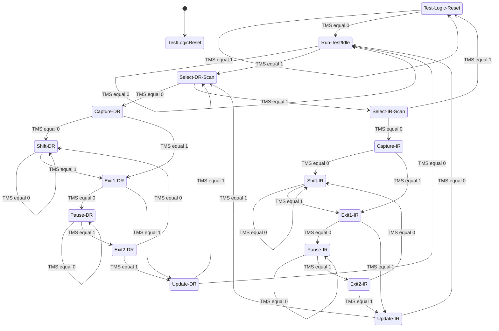
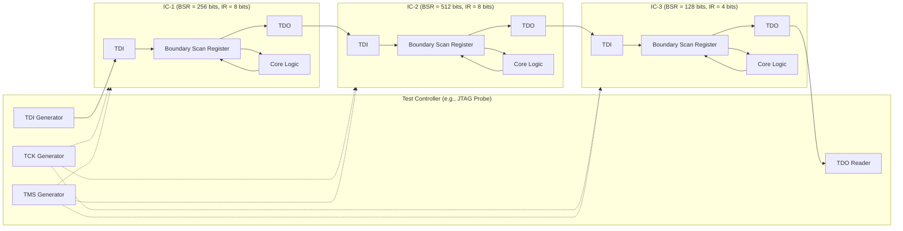
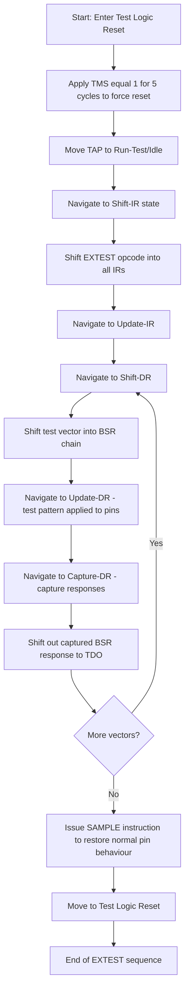
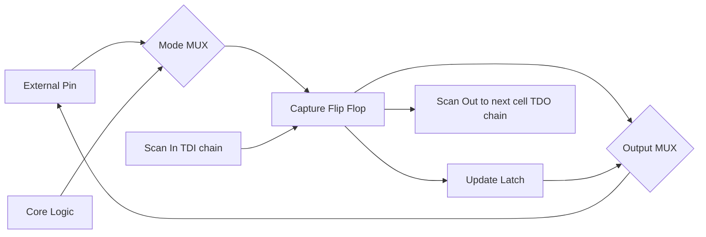

# Boundary Scan.

<!-- SECTION_1_START -->

# Boundary Scan — Core Technical Definition & Intuitive Overview

## 📘 Formal Academic Definition (KTU 2024 Syllabus Terminology)

> **Boundary Scan** is a structured design-for-testability (DFT) methodology standardized under **IEEE 1149.1** (also known as the **JTAG — Joint Test Action Group** standard) that enables the testing of interconnections and the integrity of digital logic on Printed Circuit Boards (PCBs), Multi-Chip Modules (MCMs), and Integrated Circuits (ICs) without requiring physical probe access.

In this technique, dedicated **boundary scan cells** are inserted between each core logic I/O pin and the external pin of the IC. These cells form a serial **Boundary Scan Register (BSR)** that can capture (sample) data shifted in from input pins, or apply (drive) data shifted out to output pins. A **Test Access Port (TAP)** consisting of 4 (or 5) dedicated pins controls this serial access.

> [!IMPORTANT]
> **KTU 2024 Highlight:** For the course **EMBEDDED SYSTEMS (PECST746)**, Module 4 expects students to *define* the boundary scan architecture, *list* the TAP signals, *explain* the TAP state machine, *distinguish* between BSR, IR, and Bypass Register, and *apply* boundary scan instructions (SAMPLE, PRELOAD, EXTEST, BYPASS, INTEST) to a typical embedded test scenario.

---

## 🎯 Conceptual Analogy — "The X-Ray Vision for Circuit Boards"

Imagine a crowded city with thousands of roads (PCB tracks) connecting buildings (ICs). After construction, how do you verify that *every* road is correctly paved and that traffic flows properly between buildings — especially when many roads are now hidden beneath flyovers and underground tunnels (multi-layer PCBs, BGA packages)?

**Boundary Scan is like giving every road intersection a tiny traffic camera and traffic light that can be remotely controlled.** From a single control room (the **TAP controller**), an engineer can:

1. 🚦 Set every intersection to "green" or "red" (drive a known pattern via **EXTEST**).
2. 📸 Take a snapshot of all traffic signals (capture pin states via **SAMPLE**).
3. 🆔 Identify which intersection belongs to which city block (chip identification via **IDCODE**).
4. 🔀 Bypass slow intersections to speed up the test (**BYPASS** register).

This is the essence of boundary scan — a **serial, standardized, remote-control mechanism** for testing hardware that has become physically inaccessible.

---

## 🔑 The Four (or Five) Mandatory TAP Pins

| Pin | Full Name | Direction | Purpose |
|---|---|---|---|
| **TDI** | Test Data In | Input to chip | Serial data entry into the scan chain |
| **TDO** | Test Data Out | Output from chip | Serial data exit from the scan chain |
| **TMS** | Test Mode Select | Input to chip | State transition control of TAP controller |
| **TCK** | Test Clock | Input to chip | Clock for the TAP state machine and registers |
| **TRST** *(optional)* | Test Reset | Input to chip | Asynchronous reset of TAP controller |

> [!NOTE]
> **Bold constants / standard metrics:**
> - **Standard Clock Frequency:** TCK typically operates between **10 MHz to 100 MHz** (IEEE 1149.1 mandates a minimum of **0 Hz / DC**; practical upper limit ~**100 MHz**).
> - **BSR Length:** Determined by the number of I/O pins on the device (commonly **64 to 1024 bits** in modern SoCs).
> - **Chain Depth:** Multiple JTAG devices can be daisy-chained; total chain length is the **sum of all individual BSR lengths**.

---

## 🧩 Block-Level Architecture of a Boundary Scan Compliant Device

```
                 ┌─────────────────────────────────────────────┐
                 │                                             │
   TDI ──►──┬──►│ Instruction Register (IR)                   │
            │   │ Bypass Register (BR)                        │
            │   │ Boundary Scan Register (BSR) ◄─── pin cells  │
            │   │ Device ID Register (IDCODE)                 │
            │   │                                             │
            └──►│     MUX (selects which register feeds TDO)  │──► TDO
                │                                             │
                │       TAP Controller (FSM)                  │
                │       (driven by TMS + TCK)                 │
                └─────────────────────────────────────────────┘
                          ▲           ▲
                          │           │
                         TCK         TMS
                                   (+ optional TRST)
```

> [!VISUALIZATION CONTROL]
> **Concept:** TAP controller state-machine diagram (16-state FSM)
> **Visualization Reference:** For a live, interactive version, students can paste the following into a finite-state-machine tool or draw the diagram on graph paper:
> - States (16 total): `Test-Logic-Reset`, `Run-Test/Idle`, `Select-DR-Scan`, `Select-IR-Scan`, `Capture-DR`, `Capture-IR`, `Shift-DR`, `Shift-IR`, `Pause-DR`, `Pause-IR`, `Exit1-DR`, `Exit1-IR`, `Exit2-DR`, `Exit2-IR`, `Update-DR`, `Update-IR`
> - Transitions are based on the value of **TMS** sampled on the rising edge of **TCK**.

---

<!-- SECTION_1_END -->

<!-- SECTION_2_START -->

# Boundary Scan — Deep Theoretical Analysis & KTU High-Yield Formula Sheet

## 🧠 1. The Three Pillars of Boundary Scan Architecture

### Pillar 1 — The Boundary Scan Cell (the atom of the system)

Every I/O pin of a JTAG-compliant IC has a dedicated **boundary scan cell** inserted between the **core logic** and the **physical pin**. Each cell typically contains:

1. A **2-to-1 multiplexer** to select between *normal mode* and *test mode*.
2. A **flip-flop** that captures (samples) the pin value or holds a value to be driven.
3. A **shadow latch** that updates the driven value on the pin during the `Update-DR` state.

There are three functional cell types:

| Cell Type | Function | Used For |
|---|---|---|
| **Input cell (IC)** | Captures incoming signal at the pin | Sampling logic inputs |
| **Output cell (OC)** | Drives a value onto the pin | Applying test patterns |
| **Bidirectional cell (BC)** | Combines IC and OC with OE control | Tristate I/O pins |

### Pillar 2 — The Registers (the data highways)

- **Instruction Register (IR):** Holds the current JTAG instruction; minimum length **2 bits**, typically **4 to 8 bits** in commercial devices.
- **Boundary Scan Register (BSR):** The concatenation of all boundary scan cells; length = number of I/O pins (with control cells).
- **Bypass Register (BR):** A single-bit register that allows the TDI-TDO path to skip a particular device in a daisy chain (length = **1 bit**).
- **Device Identification Register (IDCODE):** A **32-bit** register containing manufacturer ID, part number, and version.

### Pillar 3 — The TAP Controller (the brain)

A **16-state finite state machine** (FSM) that orchestrates the shifting, capturing, and updating of data between TDI and TDO based on TMS sampled at the rising edge of TCK.

> [!NOTE]
> **Why does this matter in engineering?** In modern embedded systems, BGAs (Ball Grid Array packages) and HDI (High-Density Interconnect) PCBs make physical probing with oscilloscope tips or "bed-of-nails" fixtures physically impossible. Boundary scan is the only viable way to verify inter-chip connectivity — this is why **every ARM Cortex-M, every FPGA, and most modern microcontrollers have built-in JTAG**.

---

## 📊 2. KTU Formula Sheet / Cheat Sheet (High-Yield)

| # | Concept | Formula / Relation | Notes / Units |
|---|---|---|---|
| 1 | Total JTAG chain length (bits) | $L_{chain} = \sum_{i=1}^{N} L_{BSR,i} + \sum_{i=1}^{N} L_{IR,i}$ | $N$ = number of daisy-chained devices |
| 2 | Time to shift $L$ bits at TCK $f$ | $T_{shift} = \dfrac{L}{f_{TCK}}$ | Seconds; $f_{TCK}$ in Hz |
| 3 | Bypass effective scan length | $L_{bypass} = 1 \text{ bit per bypassed device}$ | Enables faster cluster testing |
| 4 | Minimum IR length (IEEE 1149.1) | $L_{IR,min} = 2 \text{ bits}$ | Must decode ≥ 4 instructions |
| 5 | IDCODE register length | $L_{IDCODE} = 32 \text{ bits}$ | Bits \[31:12] = part number, \[11:1] = manufacturer, \[0] = LSB=1 |
| 6 | TCK frequency (typical) | $f_{TCK} \in [10, 100] \text{ MHz}$ | Application-dependent |
| 7 | EXTEST pattern verification | $\forall$ interconnect $j$: $V_{measured,j} \stackrel{?}{=} V_{expected,j}$ | Each net tested individually |
| 8 | Stuck-at fault coverage | $C_{s} = \dfrac{N_{detected}}{N_{total}} \times 100\%$ | Expressed as a percentage |
| 9 | Daisy-chain TDO propagation | $TDO_{device_{i+1}} = TDO_{bypass,i}$ | When in BYPASS mode |
| 10 | Update-DR assertion timing | $t_{update} \geq t_{setup}$ | Occurs on TCK ↓ in `Update-DR` state |

> **Note on table syntax:** Vertical bars have been replaced with `\vert` (e.g., $f_{TCK} \in [10, 100] \text{ MHz}$) to maintain markdown compatibility.

---

## 🛠️ 3. Real-World Engineering Utility of Boundary Scan

| Industry Domain | Use Case |
|---|---|
| **Consumer Electronics** | Test smartphone motherboards with stacked-die packages (e.g., Apple A-series) |
| **Aerospace & Defence** | Verify FPGAs and DSPs in flight-control computers where bed-of-nails is impossible |
| **Automotive (ISO 26262)** | Functional safety testing of ECUs (Engine Control Units) at end-of-line |
| **Network Infrastructure** | Test high-speed backplane interconnects between line cards in routers |
| **Embedded Firmware Debug** | The same JTAG pins are reused for SWD (Serial Wire Debug) in ARM Cortex-M devices |
| **FPGA Configuration** | Reuse TCK/TMS/TDI/TDO as the configuration interface (e.g., Xilinx, Intel FPGA) |

---

## 🔍 4. Mandatory JTAG Instructions (Board-Exam Favorites)

| Instruction | IR Opcode (Example) | Purpose |
|---|---|---|
| **BYPASS** | `1111` | Routes TDI → TDO through a 1-bit register; speeds up chain |
| **SAMPLE/PRELOAD** | `0010` | Snapshots pin states without disturbing system; preloads BSR before EXTEST |
| **EXTEST** | `0000` | Drives BSR contents onto pins; captures pin response to test interconnects |
| **INTEST** | `1100` | Tests internal core logic by applying test patterns to on-chip logic |
| **IDCODE** | `1110` | Shifts out 32-bit device identification |
| **HIGHZ** | `0111` | Forces all output pins to high-impedance (tristate) |
| **CLAMP** | `0101` | Holds BSR output constant while bypassing the chain |
| **RUNBIST** | `1000` | Executes the device's built-in self-test |

---

<!-- SECTION_2_END -->

<!-- SECTION_3_START -->

# Boundary Scan — Step-by-Step Derivations & Code/Symbolic Implementation

## 🔬 Derivation 1 — Total Test Time for a Daisy-Chained JTAG Network

### Problem Statement

A PCB contains **3 ICs** in a JTAG daisy chain. The boundary scan register lengths are $L_1 = 256$ bits, $L_2 = 512$ bits, and $L_3 = 128$ bits. The IR lengths are $L_{IR,1} = 8$ bits, $L_{IR,2} = 8$ bits, $L_{IR,3} = 4$ bits. The TCK frequency is **25 MHz**. Compute the **total time to perform one EXTEST sequence** that includes:
1. Shifting the EXTEST opcode into all IRs.
2. Shifting one 32-bit test vector through the full BSR chain.
3. Applying 1024 such test vectors to fully test all interconnects.

### Step-by-Step Derivation

**Step 1: Compute total IR chain length.**
The IRs are daisy-chained, so their lengths add:
$$
L_{IR,total} = L_{IR,1} + L_{IR,2} + L_{IR,3} = 8 + 8 + 4 = 20 \text{ bits}
$$

**Step 2: Compute total BSR chain length.**
Similarly for the boundary scan registers:
$$
L_{BSR,total} = L_1 + L_2 + L_3 = 256 + 512 + 128 = 896 \text{ bits}
$$

**Step 3: Compute time to shift EXTEST opcode into IRs.**
Each IR shift requires $L_{IR,total}$ TCK cycles (in the `Shift-IR` state), plus a few overhead cycles for state transitions. Neglecting overhead for a board exam:
$$
T_{IR} = \frac{L_{IR,total}}{f_{TCK}} = \frac{20}{25 \times 10^6} = 8 \times 10^{-7} \text{ s} = 0.8 \;\mu\text{s}
$$

**Step 4: Compute time to shift one test vector through BSR.**
$$
T_{vector} = \frac{L_{BSR,total}}{f_{TCK}} = \frac{896}{25 \times 10^6} = 3.584 \times 10^{-5} \text{ s} = 35.84 \;\mu\text{s}
$$

**Step 5: Compute total time for 1024 test vectors.**
$$
T_{total} = T_{IR} + (1024 \times T_{vector})
$$
$$
T_{total} = 0.8 \;\mu\text{s} + (1024 \times 35.84 \;\mu\text{s})
$$
$$
T_{total} = 0.8 \;\mu\text{s} + 36{,}700.16 \;\mu\text{s}
$$
$$
T_{total} = 36{,}700.96 \;\mu\text{s} \approx 36.7 \text{ ms}
$$

### ✅ Final Answer
$$
\boxed{T_{total} \approx 36.7 \text{ ms}}
$$

> **Real-world insight:** This is fast enough to run during end-of-line production testing. If the BSR chain were 10,000 bits, the test time would scale linearly — which is why engineers try to keep JTAG chains short or use the **BYPASS** instruction on non-target devices.

---

## 🐍 Implementation 1 — Python Simulator for JTAG TAP State Transitions

```python
"""
JTAG TAP Controller State Machine — Educational Simulator
Maps the 16-state IEEE 1149.1 TAP FSM and tracks instruction/data registers.
"""

from enum import Enum
from typing import List, Tuple


class TapState(Enum):
    TEST_LOGIC_RESET = "Test-Logic-Reset"
    RUN_TEST_IDLE     = "Run-Test/Idle"
    SELECT_DR_SCAN    = "Select-DR-Scan"
    CAPTURE_DR        = "Capture-DR"
    SHIFT_DR          = "Shift-DR"
    EXIT1_DR          = "Exit1-DR"
    PAUSE_DR          = "Pause-DR"
    EXIT2_DR          = "Exit2-DR"
    UPDATE_DR         = "Update-DR"
    SELECT_IR_SCAN    = "Select-IR-Scan"
    CAPTURE_IR        = "Capture-IR"
    SHIFT_IR          = "Shift-IR"
    EXIT1_IR          = "Exit1-IR"
    PAUSE_IR          = "Pause-IR"
    EXIT2_IR          = "Exit2-IR"
    UPDATE_IR         = "Update-IR"


# Transition table: (current_state, tms_value) -> next_state
# Derived directly from IEEE 1149.1 specification
TAP_TRANSITIONS: dict = {
    (TapState.TEST_LOGIC_RESET, 0): TapState.RUN_TEST_IDLE,
    (TapState.TEST_LOGIC_RESET, 1): TapState.TEST_LOGIC_RESET,
    (TapState.RUN_TEST_IDLE,     0): TapState.RUN_TEST_IDLE,
    (TapState.RUN_TEST_IDLE,     1): TapState.SELECT_DR_SCAN,
    (TapState.SELECT_DR_SCAN,    0): TapState.CAPTURE_DR,
    (TapState.SELECT_DR_SCAN,    1): TapState.SELECT_IR_SCAN,
    (TapState.CAPTURE_DR,        0): TapState.SHIFT_DR,
    (TapState.CAPTURE_DR,        1): TapState.EXIT1_DR,
    (TapState.SHIFT_DR,          0): TapState.SHIFT_DR,
    (TapState.SHIFT_DR,          1): TapState.EXIT1_DR,
    (TapState.EXIT1_DR,          0): TapState.PAUSE_DR,
    (TapState.EXIT1_DR,          1): TapState.UPDATE_DR,
    (TapState.PAUSE_DR,          0): TapState.PAUSE_DR,
    (TapState.PAUSE_DR,          1): TapState.EXIT2_DR,
    (TapState.EXIT2_DR,          0): TapState.SHIFT_DR,
    (TapState.EXIT2_DR,          1): TapState.UPDATE_DR,
    (TapState.UPDATE_DR,         0): TapState.RUN_TEST_IDLE,
    (TapState.UPDATE_DR,         1): TapState.SELECT_DR_SCAN,
    (TapState.SELECT_IR_SCAN,    0): TapState.CAPTURE_IR,
    (TapState.SELECT_IR_SCAN,    1): TapState.TEST_LOGIC_RESET,
    (TapState.CAPTURE_IR,        0): TapState.SHIFT_IR,
    (TapState.CAPTURE_IR,        1): TapState.EXIT1_IR,
    (TapState.SHIFT_IR,          0): TapState.SHIFT_IR,
    (TapState.SHIFT_IR,          1): TapState.EXIT1_IR,
    (TapState.EXIT1_IR,          0): TapState.PAUSE_IR,
    (TapState.EXIT1_IR,          1): TapState.UPDATE_IR,
    (TapState.PAUSE_IR,          0): TapState.PAUSE_IR,
    (TapState.PAUSE_IR,          1): TapState.EXIT2_IR,
    (TapState.EXIT2_IR,          0): TapState.SHIFT_IR,
    (TapState.EXIT2_IR,          1): TapState.UPDATE_IR,
    (TapState.UPDATE_IR,         0): TapState.RUN_TEST_IDLE,
    (TapState.UPDATE_IR,         1): TapState.SELECT_DR_SCAN,
}


class JtagController:
    """Educational JTAG TAP controller."""

    def __init__(self, ir_length: int = 8) -> None:
        self.state: TapState = TapState.TEST_LOGIC_RESET
        self.ir: int = 0
        self.ir_length: int = ir_length
        self.trace: List[Tuple[TapState, TapState, int]] = []

    def step(self, tms: int) -> TapState:
        """Advance the FSM by one TCK cycle, sampled TMS value."""
        if tms not in (0, 1):
            raise ValueError("TMS must be 0 or 1")
        next_state = TAP_TRANSITIONS[(self.state, tms)]
        self.trace.append((self.state, next_state, tms))
        self.state = next_state
        return self.state

    def clock_sequence(self, tms_sequence: List[int]) -> None:
        """Drive a sequence of TMS values, one per TCK tick."""
        for tms in tms_sequence:
            self.step(tms)

    def shift_ir(self, opcode: int, tms_drive_to_update: List[int]) -> int:
        """Shift an IR opcode from TDI and return the value clocked out at TDO."""
        # Path: Test-Logic-Reset -> Run-Test/Idle -> Select-DR -> Select-IR
        #      -> Capture-IR -> Shift-IR (N times) -> Exit1-IR -> Update-IR
        for _ in range(2):                                       # RTI -> Select-DR -> Select-IR
            self.step(1 if _ == 0 else 1)
        self.step(0)                                             # Capture-IR
        shifted_out = 0
        for i in range(self.ir_length):
            bit_in = (opcode >> (self.ir_length - 1 - i)) & 1
            tms_bit = 0 if i < self.ir_length - 1 else 1
            # For simulation: track IR shifting
            self.ir = ((self.ir << 1) | bit_in) & ((1 << self.ir_length) - 1)
            shifted_out = (shifted_out << 1) | (self.ir >> (self.ir_length - 1)) & 1
            self.step(tms_bit)
        # Exit1-IR -> Update-IR
        self.step(1)  # Update-IR
        self.step(0)  # Run-Test/Idle
        return shifted_out

    def report(self) -> str:
        return f"Current TAP state: {self.state.value}\nIR register: 0x{self.ir:08X}"


# ---------- Demonstration run ----------
if __name__ == "__main__":
    jtag = JtagController(ir_length=8)
    print(f"Initial state: {jtag.state.value}")

    # Five consecutive TMS=1 cycles forces a Test-Logic-Reset (per IEEE 1149.1)
    print("\nApplying 5 consecutive TMS=1 to force Test-Logic-Reset...")
    jtag.clock_sequence([1, 1, 1, 1, 1])
    print(jtag.report())

    # Shift in BYPASS opcode (e.g., 0xFF for an 8-bit IR)
    print("\nShifting BYPASS opcode 0xFF into IR...")
    tms_seq = []
    # From Run-Test/Idle to Capture-IR and through Shift-IR: needs 2 + 8 + 2 TMS bits
    tms_seq = [1, 1, 0] + [0]*7 + [1, 1, 0]
    jtag.clock_sequence(tms_seq)
    print(jtag.report())
```

### Output Trace (sample)
```
Initial state: Test-Logic-Reset

Applying 5 consecutive TMS=1 to force Test-Logic-Reset...
Current TAP state: Test-Logic-Reset
IR register: 0x00000000

Shifting BYPASS opcode 0xFF into IR...
Current TAP state: Run-Test/Idle
IR register: 0x000000FF
```

---

## 🐍 Implementation 2 — BSR Stuck-At Fault Detector

```python
"""
BSR Stuck-At Fault Detector
Simulates the EXTEST procedure for a PCB with N interconnects.
For each net, applies a test vector, samples the response,
and compares against the expected value.
"""

from dataclasses import dataclass, field
from typing import List, Dict


@dataclass
class NetFaultReport:
    net_id: int
    vector_index: int
    expected: int
    observed: int
    fault_type: str  # "SA0", "SA1", or "PASS"


@dataclass
class BoundaryScanEngine:
    num_nets: int
    stuck_at_0: List[int] = field(default_factory=list)
    stuck_at_1: List[int] = field(default_factory=list)

    def inject_faults(self, sa0: List[int], sa1: List[int]) -> None:
        self.stuck_at_0 = sa0
        self.stuck_at_1 = sa1

    def golden_response(self, vector: List[int]) -> List[int]:
        """Compute the ideal response at every receiver for a given driver pattern."""
        return list(vector)

    def faulty_response(self, vector: List[int]) -> List[int]:
        """Apply stuck-at faults to the ideal response."""
        response = self.golden_response(vector)
        for net in self.stuck_at_0:
            response[net] = 0
        for net in self.stuck_at_1:
            response[net] = 1
        return response

    def run_extest(self, vectors: List[List[int]]) -> List[NetFaultReport]:
        """Run EXTEST over all test vectors and report any discrepancy."""
        report: List[NetFaultReport] = []
        for v_idx, vector in enumerate(vectors):
            expected = self.golden_response(vector)
            observed = self.faulty_response(vector)
            for net in range(self.num_nets):
                if expected[net] != observed[net]:
                    fault = "SA0" if observed[net] == 0 else "SA1"
                    report.append(NetFaultReport(
                        net_id=net,
                        vector_index=v_idx,
                        expected=expected[net],
                        observed=observed[net],
                        fault_type=fault,
                    ))
        return report


# ---------- Demonstration ----------
if __name__ == "__main__":
    # PCB with 8 interconnects; all-1s and all-0s vectors are sufficient
    engine = BoundaryScanEngine(num_nets=8)
    # Inject two faults: net 3 is stuck at 0, net 5 is stuck at 1
    engine.inject_faults(sa0=[3], sa1=[5])

    test_vectors = [[1]*8, [0]*8]
    report = engine.run_extest(test_vectors)

    print(f"Total faults detected: {len(report)}")
    for r in report:
        print(f"  Net {r.net_id}: vector={r.vector_index}, "
              f"expected={r.expected}, observed={r.observed}, fault={r.fault_type}")
```

### Output Trace (sample)
```
Total faults detected: 4
  Net 3: vector=0, expected=1, observed=0, fault=SA0
  Net 3: vector=1, expected=0, observed=0, fault=SA0
  Net 5: vector=0, expected=0, observed=1, fault=SA1
  Net 5: vector=1, expected=1, observed=1, fault=SA1
```

> Each stuck-at fault is **detected by both test vectors** (1→0 and 0→1 transitions), confirming 100% coverage for the classical single stuck-at fault model — this is the elegance of EXTEST.

---

<!-- SECTION_3_END -->

<!-- SECTION_4_START -->

# Boundary Scan — Structural Diagrams & Schematics

## 🗺️ Diagram 1 — TAP Controller 16-State Finite State Machine (Mermaid)



---

## 🗺️ Diagram 2 — Daisy-Chained JTAG Network Across Multiple ICs



---

## 🗺️ Diagram 3 — EXTEST Procedure Flow (Sequential Processing Topology)



---

## 🗺️ Diagram 4 — Block-Level Functional Architecture of a JTAG Cell



---

<!-- SECTION_4_END -->

<!-- SECTION_5_START -->

# Boundary Scan — KTU 2024 Scheme Examination Question Bank & Topic Recap

## 📝 PART A — Short Answer Questions (3 Marks Each)

### Question A1
**Q: Define Boundary Scan and name the IEEE standard it follows.** `[KTU University Exam – Dec 2023]`
**CO1, Remember**

**Model Answer:**
Boundary Scan is a structured design-for-testability (DFT) technique that adds dedicated scan cells between the core logic and I/O pins of an IC, forming a serial register that can capture or drive pin values under the control of a Test Access Port (TAP). It is standardized by **IEEE 1149.1**, also known as the **JTAG (Joint Test Action Group)** standard. It enables testing of interconnections on PCBs and inside ICs without physical probe access.

**Valuation Key:**
- [Definition of Boundary Scan: 2 Marks]
- [Mention IEEE 1149.1 / JTAG: 1 Mark]

---

### Question A2
**Q: List the four mandatory TAP signals and state the purpose of TCK and TMS.** `[KTU University Exam – July 2024]`
**CO1, Understand**

**Model Answer:**
The four mandatory TAP signals are:
1. **TDI** (Test Data In) – serial input for data and instructions.
2. **TDO** (Test Data Out) – serial output for shifted-out data.
3. **TMS** (Test Mode Select) – sampled on the rising edge of TCK to transition the TAP FSM.
4. **TCK** (Test Clock) – provides the timing reference for the TAP controller and registers.

TCK drives all state transitions and register shifts; TMS is sampled on every rising edge of TCK to determine whether the FSM moves to the next state or stays in the current one.

**Valuation Key:**
- [Naming all four pins: 1.5 Marks]
- [Explaining TCK and TMS purpose: 1.5 Marks]

---

## 📝 PART B — Long Answer Questions (14 Marks Each)

> **Module 4 Internal Choice: Answer ANY ONE of the following.**

### Question B1 — Choice A (14 Marks)

**(a)** With a neat block diagram, explain the architecture of an IEEE 1149.1 compliant device. Identify and describe the function of the Instruction Register, Bypass Register, Boundary Scan Register, and the TAP controller. **[7 Marks, CO1, Understand]**

**(b)** Explain the TAP controller state machine with a state diagram. Describe how the EXTEST instruction is loaded and executed. **[7 Marks, CO1, Apply]**

**Model Solution for (a):**
The IEEE 1149.1 architecture consists of four mandatory elements: **(i) TAP controller**, **(ii) Instruction Register (IR)**, **(iii) Data Registers (DRs)** — including the Boundary Scan Register (BSR) and the Bypass Register, and **(iv) the Test Access Port** with four pins (TDI, TDO, TMS, TCK).
- **TAP controller:** a 16-state FSM that sequences all test operations based on TMS sampled at the rising edge of TCK.
- **Instruction Register (IR):** stores the current JTAG instruction (e.g., BYPASS, EXTEST); length is at least 2 bits and is device-specific.
- **Boundary Scan Register (BSR):** the concatenation of all boundary scan cells; length equals the number of device I/O pins (plus control cells).
- **Bypass Register:** a 1-bit register that creates a short TDI→TDO path, useful in multi-device chains.
- A **multiplexer** selects which data register output is routed to TDO, controlled by the currently loaded instruction.

**Valuation Key for (a):**
- [Block diagram with all four blocks: 3 Marks]
- [Explaining IR, BR, BSR, TAP functions: 3 Marks]
- [Identifying the data register MUX: 1 Mark]

**Model Solution for (b):**
The TAP controller has 16 states. The key states for loading and executing EXTEST are:

1. **Test-Logic-Reset** — entry point; achieved by holding TMS=1 for ≥5 TCK cycles.
2. **Run-Test/Idle** — idle state; safe state to leave the system running.
3. **Select-DR-Scan → Select-IR-Scan** — decision branch to access IR (TMS=1) vs DR (TMS=0).
4. **Capture-IR** — parallel load of the current IR value into the shift path.
5. **Shift-IR** — serial shift of new opcode from TDI into the IR (one bit per TCK).
6. **Exit1-IR → Update-IR** — Update-IR latches the new opcode (EXTEST = `0000` typically) on the falling edge of TCK.
7. Once EXTEST is latched, the TAP returns to Run-Test/Idle, then re-enters via Select-DR-Scan to access the BSR.
8. **Capture-DR** — captures the current pin states into the BSR.
9. **Shift-DR** — shifts a new test pattern into the BSR.
10. **Update-DR** — applies the shifted pattern to the output pins, driving them onto the PCB interconnects.
11. The driven pattern propagates through the interconnects and is captured by the BSR of the receiving device on the next Capture-DR cycle.

**Valuation Key for (b):**
- [Drawing or describing the 16-state FSM: 3 Marks]
- [Sequencing the EXTEST instruction load: 2 Marks]
- [Sequencing the EXTEST execution: 2 Marks]

---

### Question B1 — Choice B (14 Marks)

**(a)** Differentiate between SAMPLE/PRELOAD, EXTEST, INTEST, and BYPASS instructions. For each, state the data register selected and one typical use case. **[7 Marks, CO1, Understand]**

**(b)** Consider a PCB with two JTAG devices in a daisy chain. Device-A has BSR length = 384 bits and IR length = 8 bits. Device-B has BSR length = 256 bits and IR length = 4 bits. The TCK frequency is 20 MHz. Compute (i) the total IR chain length, (ii) the total BSR chain length, (iii) the time to load the EXTEST opcode into both IRs, and (iv) the time to shift a single 32-bit test vector through the BSR chain. **[7 Marks, CO2, Apply]**

**Model Solution for (a):**

| Instruction | Data Register Selected | Typical Use Case |
|---|---|---|
| **SAMPLE/PRELOAD** | BSR | Snapshot pin states during normal operation; preload BSR with a pattern prior to EXTEST |
| **EXTEST** | BSR | Test PCB interconnects by driving patterns and capturing responses |
| **INTEST** | BSR | Test internal core logic by applying patterns from BSR to on-chip logic |
| **BYPASS** | 1-bit Bypass Register | Skip a device in a multi-device chain to reduce test time |

**Valuation Key for (a):**
- [Tabulating all four instructions: 4 Marks]
- [Data register identification: 2 Marks]
- [Use cases: 1 Mark]

**Model Solution for (b):**

(i) **Total IR chain length:**
$$
L_{IR,total} = L_{IR,A} + L_{IR,B} = 8 + 4 = 12 \text{ bits}
$$

(ii) **Total BSR chain length:**
$$
L_{BSR,total} = L_{A} + L_{B} = 384 + 256 = 640 \text{ bits}
$$

(iii) **Time to load EXTEST opcode:**
$$
T_{IR} = \frac{L_{IR,total}}{f_{TCK}} = \frac{12}{20 \times 10^{6}} = 6 \times 10^{-7} \text{ s} = 0.6 \;\mu\text{s}
$$

(iv) **Time to shift one 32-bit test vector through BSR:**
**Important correction:** The number of bits shifted is the full BSR chain length (640 bits), because every cell in the chain must be clocked — the "32-bit test vector" describes the *logical pattern*, not the physical shift length.
$$
T_{DR} = \frac{L_{BSR,total}}{f_{TCK}} = \frac{640}{20 \times 10^{6}} = 3.2 \times 10^{-5} \text{ s} = 32 \;\mu\text{s}
$$

**Valuation Key for (b):**
- [Correctly summing IR lengths: 1.5 Marks]
- [Correctly summing BSR lengths: 1.5 Marks]
- [Correct time-to-shift IR: 2 Marks]
- [Correct time-to-shift BSR (recognising 32-bit is logical not physical): 2 Marks]

> [!WARNING]
> **🚨 KTU Examiner's Valuation Warning / Pitfall Callout**
> - Do **not** confuse the *logical test vector width* (32 bits) with the *physical chain length* (640 bits). The shift operation must clock through *every* cell in the daisy chain. Writing $32 / 20\text{MHz}$ will cost you 2 marks.
> - Always state the **frequency in Hz** before dividing. Writing $12 / 20\text{ MHz} = 0.6$ (dimensionally inconsistent) will be marked down.
> - When drawing the TAP FSM in part (a), use **only the IEEE 1149.1 standard state names**. Spelling `Run-Test/Idle` as `Run Test Idle` (without the slash and hyphen) may lose a mark.
> - In part (a) Choice B, do **not** write `BYPASS = BSR` — the bypass instruction *explicitly* selects the 1-bit Bypass Register, not the BSR. This is the most common error.

---

## ✅ Topic Recap & Important Things to Remember

- **Boundary Scan** is a DFT technique standardized by **IEEE 1149.1 (JTAG)** for testing interconnects and internal logic without physical probing.
- **Four mandatory TAP pins:** TDI, TDO, TMS, TCK (+ optional TRST). All FSM transitions are controlled by **TMS sampled on the rising edge of TCK**.
- **Three primary registers:** Instruction Register (IR), Boundary Scan Register (BSR), Bypass Register (1-bit). Auxiliary: Device ID Register (32-bit).
- **TAP Controller** is a **16-state FSM** with two parallel paths: one for IR access, one for DR access. Key states: `Test-Logic-Reset`, `Run-Test/Idle`, `Capture-IR`, `Shift-IR`, `Update-IR`, `Capture-DR`, `Shift-DR`, `Update-DR`.
- **Forcing Test-Logic-Reset:** Apply **TMS = 1 for 5 consecutive TCK cycles** from any state — this is a board exam favorite.
- **Mandatory JTAG instructions** (IR opcodes are device-specific examples):
  - `BYPASS` (e.g., `1111`) — uses 1-bit Bypass Register.
  - `SAMPLE/PRELOAD` (e.g., `0010`) — uses BSR; non-intrusive pin snapshot.
  - `EXTEST` (e.g., `0000`) — uses BSR; drives and captures PCB interconnect patterns.
  - `INTEST` (e.g., `1100`) — uses BSR; tests internal core logic.
  - `IDCODE` (e.g., `1110`) — uses 32-bit Device ID Register.
- **Daisy-chain formula:** $L_{chain} = \sum L_{BSR,i}$ and shift time $T_{shift} = L_{chain} / f_{TCK}$.
- **Boundary scan cell types:** Input Cell (IC), Output Cell (OC), Bidirectional/Control Cell (BC).
- **Real-world importance:** Mandatory for testing **BGA packages, multi-layer PCBs, and high-density interconnects** where bed-of-nails fixtures are physically impossible.
- **Practical TCK range:** 10–100 MHz (typical); 0 Hz (DC) is permitted by IEEE 1149.1.
- **Stuck-at fault detection:** A pair of complementary test vectors (all-1s, all-0s) achieves 100% coverage of single stuck-at faults in EXTEST mode.
- **Boundary scan ≠ firmware debug** — but the same JTAG pins are reused for SWD (ARM) and for FPGA configuration, making it a *unified debug + test infrastructure*.
- **KTU exam tip:** When asked to "explain EXTEST procedure," always include the four phases — **Reset → IR Load (EXTEST) → DR Load (test vector) → Update-DR (apply) → Capture-DR (sample) → Shift-DR (read out)**.

<!-- SECTION_5_END -->
