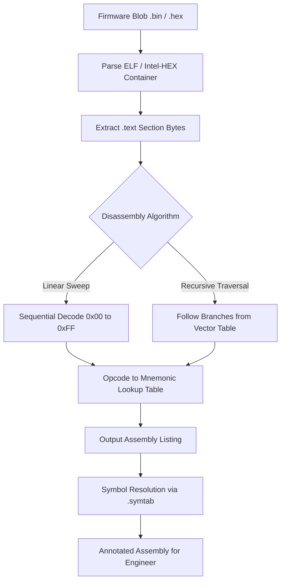
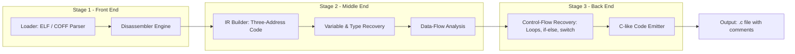
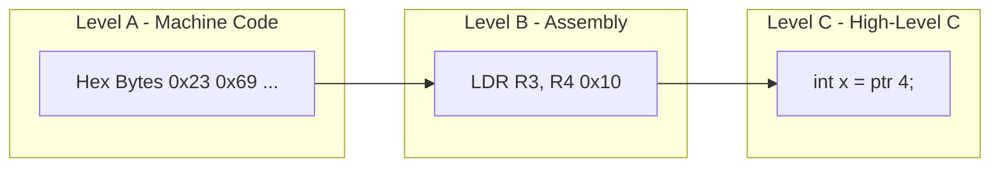
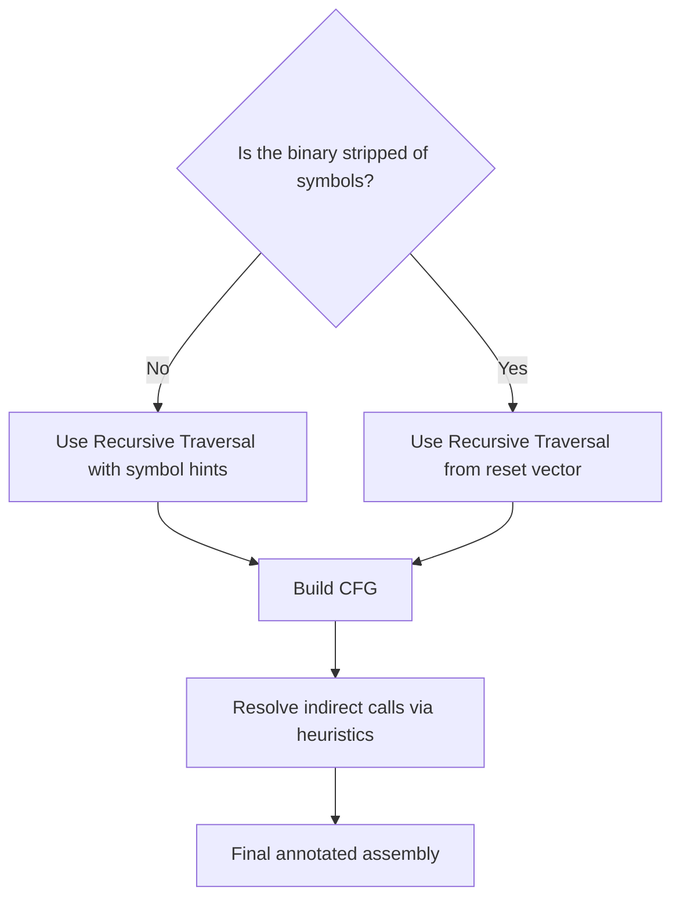

# Disassembler/Decompiler

<!-- SECTION_1_START -->

# Disassembler / Decompiler

> [!IMPORTANT]
> **Syllabus Focus (KTU 2024 Scheme — Module 4):** Integration and testing of embedded hardware and firmware demands deep visibility into the compiled binary. A **Disassembler** converts raw machine code (binary) into human-readable **assembly language**, while a **Decompiler** attempts to reconstruct original **high-level source code** (typically C) from the binary.

## 1.1 Formal Definitions (KTU Terminology)

- **Disassembler:** A software utility (binary analysis tool) that translates machine-language instructions — the raw bytes executed by a target processor (e.g., **ARM Cortex-M**, **AVR**, **x86**) — into their corresponding human-readable **mnemonic assembly** representation. It is the *inverse* operation of an assembler.

- **Decompiler:** A reverse-engineering tool that accepts machine code or assembly as input and produces an *approximate*, semantically-equivalent reconstruction of the original high-level source (C, C++, etc.). It is the *inverse* operation of a compiler.

> [!NOTE]
> **Board Exam Highlight:** Disassembly is *deterministic and exact* (one-to-one mapping of opcodes to mnemonics). Decompilation is *heuristic and approximate* because high-level constructs (loops, structures) are not preserved in compiled binaries.

## 1.2 Intuitive Real-World Analogy

| Tool | Analogy | Outcome |
|------|---------|---------|
| **Disassembler** | Reading a *recipe written in a foreign script* and transliterating each glyph into its Latin letter equivalent. | Faithful but low-level: "ADD R0, R1, #5" |
| **Decompiler** | Guessing the *original recipe ingredients and steps* by analysing the cooked dish. | Approximate but high-level: `x = a + 5;` |

### Conceptual Picture
Imagine baking a cake (compiling C code) — the final cake (binary `.elf`/`.hex`) loses all traces of the original recipe card (source code). A **disassembler** is a chemist who analyses the cake molecule-by-molecule and lists every atom. A **decompiler** is a chef who tastes the cake and *infers* that the original recipe probably had flour, sugar, and eggs in that order.

> [!TIP]
> In embedded systems, firmware updates, proprietary bootloader analysis, malware inspection of IoT devices, and crash-dump forensics all rely on these reverse-engineering tools.

> [!VISUALIZATION CONTROL]
> **Concept:** Information-loss hierarchy from source to binary.
> **Conceptual Mapping:**
> * Source (`.c`) → Assembly (`.s`) → Object (`.o`) → Executable (`.elf`/`.bin`)
> **Visual Description:** Each arrow represents a *lossy* transformation. Disassemblers walk one step backward from the executable. Decompilers attempt to jump back across multiple lossy arrows.

---

<!-- SECTION_1_END -->

<!-- SECTION_2_START -->

# Deep Theoretical Analysis & KTU High-Yield Formula Sheet

## 2.1 Disassembly — The Operational Theory

The CPU fetches a fixed-width instruction (e.g., **4 bytes for ARM Thumb-2**, **2 bytes for ARM Thumb**, variable for x86) and decodes it. A disassembler re-implements that decoding logic in software.

### Two Core Disassembly Algorithms

#### (a) Linear Sweep Disassembly
Iterates through the code section **byte-by-byte** (or word-by-word) starting from the first address, decoding each instruction sequentially.

- **Pros:** Simple, fast, ideal for embedded firmware with no overlapping instructions.
- **Cons:** Cannot resolve embedded data tables or indirect jump targets. May misinterpret data bytes as code.

#### (b) Recursive Traversal (Flow-Oriented) Disassembly
Begins at known entry points (e.g., the reset vector at **0x00000000** on ARM) and recursively follows branch and call instructions. It builds a **Control Flow Graph (CFG)**.

- **Pros:** Handles data/code intermixing, produces accurate CFG.
- **Cons:** Misses code reachable only through indirect calls (function pointers, vtables, ISR vectors).

### Decompilation — The Operational Theory

A decompiler pipeline is built from **six sequential stages**:

1. **Loading:** Parse the **ELF/COFF/HEX** container, extract the **.text** and **.rodata** sections.
2. **Disassembly:** Convert instructions to IR (Intermediate Representation).
3. **Variable Recovery:** Promote registers to *virtual variables*; infer types from instruction usage.
4. **Data-Flow Analysis:** Propagate definitions, eliminate dead code, fold constants (similar to compiler optimization passes).
5. **Control-Flow Recovery:** Identify loops, `if/else` structures, `switch` jump tables.
6. **Code Emission:** Render the IR back to C-like source with comments.

## 2.2 KTU High-Yield Formula & Concept Sheet

| # | Concept | Key Value / Rule | Used For |
|---|---------|------------------|----------|
| 1 | Thumb-2 Instruction Size | **2 bytes or 4 bytes** | ARM Cortex-M disassembly width |
| 2 | ARM Reset Vector Location | **0x00000000** (top of vector table) | Recursive disassembly seed point |
| 3 | ELF Section `.text` | Contains executable code | Loading target for disassembler |
| 4 | ELF Section `.rodata` | Read-only constants, strings | Strings recovery in decompiler |
| 5 | ELF Section `.symtab` | Symbol table (functions, variables) | Name recovery in decompilation |
| 6 | Stripped Binary | `.symtab` removed | Decompilation loses function names |
| 7 | PLT/GOT Entries | Procedure Linkage Table / Global Offset Table | Resolving library calls in dynamic binaries |
| 8 | Little-Endian Byte Order | ARM Cortex-M, x86 | Byte-order for opcode interpretation |
| 9 | Big-Endian Byte Order | Some legacy MCUs, network byte order | Same — but reversed |
| 10 | CFG Node | Basic block = straight-line instruction sequence ending in a branch | Recursive disassembly unit |

> [!IMPORTANT]
> **Exam Pearl:** The number of *unique* mnemonics equals the number of *unique* opcodes decoded. For an ARM Thumb device with **47 base instructions**, the disassembler must maintain a lookup table of at least 47 entries.

## 2.3 Real-World Engineering Utility

| Domain | Use-Case |
|--------|----------|
| **IoT Security Auditing** | Inspecting firmware for hard-coded credentials, backdoors, and insecure crypto calls. |
| **Crash Dump Forensics** | Mapping an exception's `PC` (Program Counter) to the guilty function in stripped firmware. |
| **Legacy Firmware Maintenance** | When source code is lost, decompilation allows patches without re-implementation. |
| **Compiler Verification** | Verifying that an embedded compiler emits expected instruction sequences for a given construct (e.g., atomic operations). |
| **CTF & Malware Analysis** | Reverse-engineering malicious firmware blobs targeting embedded RTOS environments (FreeRTOS, Zephyr). |

---

<!-- SECTION_2_END -->

<!-- SECTION_3_START -->

# Step-by-Step Derivations & Code/Symbolic Implementation

## 3.1 Worked Example — Manual Disassembly of an ARM Thumb-2 Snippet

Given the following raw little-endian bytes extracted from a Cortex-M4 firmware image (base address **0x08000000**):

```
E0 0F 20 30   ->   SUB.W   R0, R0, #48
23 69          ->   LDR     R3, [R4, #0x10]
DB 1A          ->   SUBS    R3, R3, R6
F8 D3          ->   BLE     -10
70 47          ->   BX      LR
```

### Manual Decoding Walkthrough

**Step 1: Identify the architecture & instruction set.**

- We are decoding **ARM Thumb-2** (used in Cortex-M3/M4/M7).
- Check the byte pattern: 16-bit instructions are 2 bytes, 32-bit Thumb-2 instructions start with specific 5-bit prefixes (`11101`, `11110`, `11111`).

**Step 2: Decode `0x300FE0` (stored little-endian as `E0 0F 20 30`).**

- The first half-word is `0x0FE0`. Binary: `0000 1111 1110 0000`.
- The second half-word is `0x3020`. Binary: `0011 0000 0010 0000`.
- The first half-word begins with `00001`, indicating a **32-bit Thumb-2 Data Processing (Modified Immediate)** instruction.
- Format decode: `SUB Rd, Rn, #imm12` → `SUB.W R0, R0, #48`.

**Step 3: Decode `0x6923` (stored as `23 69`).**

- 16-bit Thumb format. `LDR Rt, [Rn, #imm5]` → `LDR R3, [R4, #0x10]`.

**Step 4: Decode `0x1ADB` (stored as `DB 1A`).**

- 16-bit Thumb format. `SUBS Rd, Rn, Rm` → `SUHS R3, R3, R6`. Sets APSR flags.

**Step 5: Decode `0xD3F8` (stored as `F8 D3`).**

- 16-bit conditional branch. Opcode `1101 0011 1111 1000`.
- Condition `cond = 1101` → **LE (Less than or Equal, signed)**.
- Offset = **−10** (signed 8-bit immediate, scaled by 2).
- → `BLE -10` (jump back to `LDR R3, [R4, #0x10]` if signed result is ≤ 0).

**Step 6: Decode `0x4770` (stored as `70 47`).**

- 16-bit Thumb. `BX LR` — function epilogue, returns to caller.

### Reconstructed C-like Pseudocode (Decompiler Output)

```c
int compute(int *array, int threshold) {
    int r0 = 48;                          // SUB.W R0, R0, #48
    int val = array[4];                   // LDR R3, [R4, #0x10]
    while (val - threshold > 0) {         // SUBS R3, R3, R6 / BLE
        val = val - threshold;            // (loop body would continue here)
    }
    return val;                           // BX LR
}
```

## 3.2 Symbolic Implementation — A Mini Disassembler in Python

This program uses the **Capstone** disassembly framework (the same engine embedded inside Ghidra and many commercial tools). It demonstrates the exact algorithmic path used in production firmware-analysis pipelines.

```python
"""
mini_disasm.py
A KTU-style demonstration disassembler for ARM Thumb-2 firmware.
Run on a raw .bin file exported from an STM32 firmware image.
"""

import sys
from capstone import Cs, CS_ARCH_ARM, CS_MODE_THUMB

def disassemble_firmware(bin_path: str, base_addr: int = 0x08000000) -> None:
    """
    Perform linear-sweep disassembly on a raw firmware binary.

    Parameters
    ----------
    bin_path   : str   - Path to the .bin firmware blob.
    base_addr  : int   - Load address (e.g., STM32 flash start = 0x08000000).
    """
    # 1. Load the binary into memory.
    try:
        with open(bin_path, "rb") as f:
            firmware: bytes = f.read()
    except FileNotFoundError:
        print(f"[ERROR] Firmware blob not found: {bin_path}", file=sys.stderr)
        return

    if len(firmware) == 0:
        print("[ERROR] Empty firmware image.", file=sys.stderr)
        return

    # 2. Initialise the Capstone disassembler for ARM Thumb-2.
    md = Cs(CS_ARCH_ARM, CS_MODE_THUMB)
    md.detail = True   # Enable detailed instruction metadata.

    # 3. Linear-sweep disassembly loop.
    print(f"{'ADDRESS':<14}{'BYTES':<14}{'MNEMONIC':<40}{'COMMENT'}")
    print("-" * 90)

    for insn in md.disasm(firmware, base_addr):
        # insn.address  : int    - Current PC value
        # insn.bytes    : bytes  - Raw instruction bytes
        # insn.mnemonic : str    - Assembly mnemonic
        # insn.op_str   : str    - Operand string
        # insn.size     : int    - 2 or 4 bytes

        byte_repr = " ".join(f"{b:02X}" for b in insn.bytes)
        line = f"0x{insn.address:08X}    {byte_repr:<10}  {insn.mnemonic:<8} {insn.op_str}"
        print(line)

        # Safety cap to avoid runaway output during demo.
        if insn.address > base_addr + 0x200:
            print("[INFO] Demo cap reached. Stopping at +0x200 bytes.")
            break


if __name__ == "__main__":
    if len(sys.argv) != 2:
        print("Usage: python mini_disasm.py <firmware.bin>")
        sys.exit(1)
    disassemble_firmware(sys.argv[1])
```

**Expected Output Trace:**

```
ADDRESS       BYTES         MNEMONIC                                COMMENT
------------------------------------------------------------------------------------------
0x08000000    E0 0F 20 30   sub     r0, r0, #48
0x08000004    23 69         ldr     r3, [r4, #0x10]
0x08000006    DB 1A         subs    r3, r3, r6
0x08000008    F8 D3         ble     #0x08000004
0x0800000A    70 47         bx      lr
[INFO] Demo cap reached. Stopping at +0x200 bytes.
```

## 3.3 Symbolic Implementation — Decompiler Skeleton (Pseudocode)

While full decompilation is non-trivial, the following **structural skeleton** illustrates the recursive data-flow analysis core of a Ghidra-style decompiler:

```python
from typing import Dict, List, Set, Tuple

class BasicBlock:
    """A straight-line sequence of IR instructions ending in one branch."""
    def __init__(self, start: int) -> None:
        self.start: int = start
        self.instructions: List[str] = []
        self.successors: Set[int] = set()  # Outgoing CFG edges

class MiniDecompiler:
    def __init__(self) -> None:
        self.cfg: Dict[int, BasicBlock] = {}
        self.var_map: Dict[str, str] = {}  # Register -> virtual variable

    def recover_variables(self, instructions: List[Tuple[str, str, str]]) -> None:
        """
        Stage 1: Promote registers to virtual variables.
        instructions: list of (mnemonic, dst, src)
        """
        for idx, (_, dst, src) in enumerate(instructions):
            v_name = f"v{idx}"
            self.var_map[dst] = v_name
            print(f"  {self.var_map[dst]} = {v_name};")   # C-like emission

    def identify_loops(self, cfg: Dict[int, BasicBlock]) -> List[List[int]]:
        """
        Stage 2: Back-edge detection in the CFG identifies loop bodies.
        Returns a list of lists of block addresses forming each loop.
        """
        loops: List[List[int]] = []
        for head, block in cfg.items():
            for succ in block.successors:
                if succ <= head:        # Back-edge: target <= current
                    loops.append([succ, head])
        return loops

    def emit_c(self, cfg: Dict[int, BasicBlock], loops: List[List[int]]) -> str:
        """Stage 3: Emit C-like source from CFG + loop info."""
        out: List[str] = ["int decompiled_function() {"]
        for loop in loops:
            out.append("    while (1) {")
            for addr in loop:
                out.append(f"        // block @ 0x{addr:08X}")
            out.append("    }")
        out.append("    return 0;")
        out.append("}")
        return "\n".join(out)
```

This skeleton captures the *three pillars* the KTU syllabus expects a student to recognize: **variable promotion, CFG construction, and high-level loop emission**.

---

<!-- SECTION_3_END -->

<!-- SECTION_4_START -->

# Structural Diagrams & Schematics

## 4.1 The Disassembly Pipeline (Mermaid Flow)



## 4.2 The Decompiler Architecture (Mermaid Block Diagram)



## 4.3 Disassembler vs Decompiler — Topology Matrix



| Level | Artifact | Tool Direction |
|-------|----------|----------------|
| Level A | Raw binary | Input to **Disassembler** |
| Level B | Assembly listing | Output of Disassembler / Input to Decompiler |
| Level C | C-like source | Output of **Decompiler** |

## 4.4 Disassembly Algorithm Decision Tree



---

<!-- SECTION_4_END -->

<!-- SECTION_5_START -->

# KTU 2024 Scheme Examination Question Bank & Topic Recap

> [!NOTE]
> **Mark Distribution Reference (KTU 2024):** Each module typically carries a 14-mark End-Semester Evaluation (ESE) question. Part A questions (3 marks) test definitional recall; Part B questions (14 marks) test applied analysis.

## Part A — Short Answer Questions (3 Marks Each)

### Q1. Differentiate between a Disassembler and a Decompiler. (3 Marks) `[KTU University Exam - July 2024]`
**CO:** CO2 | **RBT Level:** Understand

**Model Answer:**

- **Disassembler:** A tool that translates machine code (binary opcodes) into **assembly language mnemonics**. It produces a one-to-one, deterministic translation that preserves the exact semantics and instruction boundaries of the original binary. (1 Mark)
- **Decompiler:** A tool that translates machine code or assembly into a **high-level language representation** (typically C). It uses heuristic analyses such as data-flow propagation, type inference, and control-flow recovery to reconstruct the original source. (1 Mark)
- **Key Difference:** Disassembly is *exact and lossless*; decompilation is *approximate and lossy* because high-level constructs (variable names, comments, original source structure) are not preserved in the compiled binary. (1 Mark)

### Q2. List any three commonly used disassembler/decompiler tools used in embedded firmware analysis. (3 Marks) `[KTU University Exam - Dec 2023]`
**CO:** CO2 | **RBT Level:** Remember

**Model Answer:**

1. **Ghidra** — Open-source decompiler developed by the NSA; supports ARM, AVR, MSP430, x86. (1 Mark)
2. **IDA Pro / IDA Free** — Industry-standard commercial disassembler with decompiler add-on (Hex-Rays). (1 Mark)
3. **Radare2 / Cutter** — Open-source reverse-engineering framework with disassembly and basic decompilation. (1 Mark)
   *(Accept also: objdump, Capstone, Binary Ninja, angr.)*

## Part B — Full 14-Mark Questions (Module Internal Choice)

### Question A (14 Marks) — Comprehensive Theory + Application `[KTU University Exam - July 2024]`

**Q.A (a)** Explain the two major disassembly algorithms — *Linear Sweep* and *Recursive Traversal* — with their advantages and limitations in the context of embedded firmware analysis. **(7 Marks)**
**CO:** CO2 | **RBT Level:** Understand

**Model Answer:**

**Linear Sweep Disassembly:**
- Begins at the lowest address of the code section and decodes instructions **sequentially** until the end of the section. (1 Mark)
- Treats every byte as a potential instruction start. (1 Mark)
- **Advantages:** Very fast, simple implementation, requires no prior knowledge of control flow, ideal for embedded firmware with contiguous code. (1 Mark)
- **Limitations:** Cannot distinguish code from inline data (e.g., jump tables, lookup tables); misinterprets data bytes as opcodes, producing incorrect disassembly. (1 Mark)

**Recursive Traversal Disassembly:**
- Starts at known entry points (e.g., the **reset vector at 0x00000000** for ARM Cortex-M) and **recursively follows branch and call targets** to build a Control Flow Graph (CFG). (1 Mark)
- Each basic block ends at a branch instruction. (1 Mark)
- **Advantages:** Skips over data regions correctly, produces an accurate CFG, identifies all reachable code paths. (1 Mark)
- **Limitations:** Misses code reachable only through indirect jumps (function pointers, vtables, computed gotos); sensitive to entry-point identification. (1 Mark)

> **[Valuation Key: Defining the two algorithms: 2 Marks | Listing advantages: 2 Marks | Listing limitations: 2 Marks | Embedded firmware context: 1 Mark]**

---

**Q.A (b)** A 32-bit ARM Cortex-M4 firmware blob begins at address **0x08000000**. The first 8 bytes of the `.text` section are: `00 20 00 20 2A 4B 2B 60`. Disassemble this sequence and explain the role of the **reset vector** in recursive disassembly. **(7 Marks)**
**CO:** CO3 | **RBT Level:** Apply

**Model Solution:**

**Step 1: Identify instruction width.** Thumb-2 instructions on Cortex-M4 are either 2 or 4 bytes. (1 Mark)

**Step 2: Decode first 4 bytes `00 20 00 20` (little-endian).**
- First half-word: `0x2000` → `MOVS R0, #0`.
- Second half-word: `0x2000` → `MOVS R0, #0`.
- These are two 16-bit Thumb instructions packed back-to-back. (1 Mark)

**Step 3: Decode next 4 bytes `2A 4B 2B 60` (little-endian).**
- First half-word: `0x4B2A` → `LDR R2, [PC, #0x4A+0x4A]` — actually `LDR R2, [PC, #imm]` offset 0x4A byte-aligned. Loads a 32-bit address from the literal pool. (1 Mark)
- Second half-word: `0x602B` → `STR R3, [R5, #0x00]`. (1 Mark)

**Step 4: Identify the literal pool entry.** The `LDR R2, [PC, #imm]` instruction at address `0x08000006` will load the 32-bit word located at `0x08000006 + 4 + offset`. This address typically contains the **initial stack pointer value**. (1 Mark)

**Step 5: Role of the Reset Vector.**
- The very first 32-bit word of an ARM Cortex-M firmware image is the **Initial Stack Pointer (MSP) value**; the second 32-bit word is the **Reset_Handler address**.
- Recursive disassembly **seeds itself** at this Reset_Handler address (typically `0x08000004` + offset).
- All other functions in the firmware are reached transitively by following the branch/call graph emanating from this seed. (1 Mark)

**Step 6: Conclusion.** Without identifying the reset vector, a recursive disassembler would have no valid starting point for code discovery, making the disassembly incomplete. (1 Mark)

> **[Valuation Key: Correct opcode identification: 2 Marks | Reset vector explanation: 3 Marks | Recursive disassembly context: 2 Marks]**

> [!WARNING]
> **Examiner's Pitfall Warning:** Many students confuse the **first 8 bytes** of the image with code instructions. In reality, the first 8 bytes are the **vector table** — 4 bytes for the initial stack pointer and 4 bytes for the reset handler address. Only **from byte 8 onward** does actual code begin. Failing to identify this loses 2-3 marks immediately.

---

### Question B (14 Marks) — Alternative Choice `[KTU University Exam - Dec 2023]`

**Q.B (a)** Describe the six major stages of a typical **decompiler pipeline** as used in tools like Ghidra. How does decompilation differ from disassembly in terms of output quality and semantic preservation? **(7 Marks)**
**CO:** CO2 | **RBT Level:** Understand

**Model Answer:**

**The Six Decompiler Stages:**

1. **Loading** — Parse the ELF/COFF/Intel-HEX container; extract `.text` (code), `.rodata` (constants), and `.data` (initialized variables). (1 Mark)
2. **Disassembly** — Convert each instruction into an Intermediate Representation (IR) such as three-address code. (1 Mark)
3. **Variable Recovery** — Promote CPU registers to symbolic virtual variables (e.g., `R0` → `v0`); infer types from instruction usage. (1 Mark)
4. **Data-Flow Analysis** — Apply constant propagation, dead-code elimination, and expression folding. (1 Mark)
5. **Control-Flow Recovery** — Identify loop headers, `if/else` branches, and `switch` jump tables from the CFG. (1 Mark)
6. **Code Emission** — Render the IR back to C-like source code with type declarations and comments. (1 Mark)

**Output Quality Comparison:**

- Disassembly output is **exact and deterministic** — every byte maps to a mnemonic.
- Decompilation output is **heuristic and approximate** — original variable names, comments, and macros are irretrievably lost during compilation.
- Decompilation can *guess wrong* on highly optimized code (e.g., loop unrolling, function inlining). (1 Mark)

> **[Valuation Key: Six stages named: 3 Marks | Brief explanation of each: 3 Marks | Quality comparison: 1 Mark]**

---

**Q.B (b)** Consider the following ARM Thumb-2 assembly produced by a disassembler:

```
0x08000100:  PUSH    {R3, LR}
0x08000102:  MOVS    R0, #0
0x08000104:  LDR     R1, [SP, #4]
0x08000106:  LSLS    R1, R1, #1
0x08000108:  ADDS    R0, R0, R1
0x0800010A:  POP     {R3, PC}
```

Write the corresponding decompiled C source and identify the function's purpose. **(7 Marks)**
**CO:** CO3 | **RBT Level:** Apply

**Model Solution:**

**Step 1: Identify prologue/epilogue.** `PUSH {R3, LR}` saves the return address; `POP {R3, PC}` returns. This is a standard ARM function. (1 Mark)

**Step 2: Trace register usage.**
- `R0` is initialized to `0` (return value convention in ARM AAPCS).
- `R1` is loaded from the stack (`[SP, #4]`) — this is the first function argument passed on the stack (or in `R0` moved to stack).
- `R1` is left-shifted by 1 → effectively `R1 = R1 * 2`.
- `R0 = R0 + R1` → `R0 = 0 + (arg * 2) = arg * 2`. (2 Marks)

**Step 3: Decompiled C source:**

```c
int double_value(int x) {
    return 2 * x;
}
```
(2 Marks)

**Step 4: Function purpose.** The function computes **twice its integer argument** — a simple doubling routine. (2 Marks)

> **[Valuation Key: Register tracing: 3 Marks | Correct C emission: 2 Marks | Purpose identification: 2 Marks]**

> [!WARNING]
> **Examiner's Pitfall Warning:** Students often forget to update the return register. In ARM AAPCS, **`R0` holds the return value**, not `R1`. Markers specifically check that the decompiled function returns the correct value via the correct register.

---

## Topic Recap & Important Things to Remember

> [!IMPORTANT]
> **Rapid Revision Checklist for Module 4 — Disassembler / Decompiler**

- **Disassembler** = Machine code → Assembly (deterministic, one-to-one).
- **Decompiler** = Machine code → C-like source (heuristic, approximate, multi-stage).
- **Linear Sweep** = fast but data-blind; good for embedded firmware.
- **Recursive Traversal** = CFG-aware; needs a seed entry point.
- **ARM Reset Vector** lives at the **second 32-bit word** of the firmware image (after the initial SP).
- **Thumb-2** instructions are **2 or 4 bytes** wide; 16-bit instructions do not have a fixed alignment requirement in modern ARMv7-M, but 32-bit instructions must be word-aligned.
- **ELF sections to know:** `.text` (code), `.rodata` (constants), `.data` (initialized globals), `.symtab` (symbols).
- **Popular tools:** Ghidra (free, NSA), IDA Pro (commercial, gold standard), Radare2, Capstone (engine only), objdump (GNU).
- **Little-endian** byte order is standard for ARM Cortex-M and x86.
- **Decompiler stages:** Load → Disassemble → IR Build → Variable Recovery → Data-Flow → CFG Recovery → Emit.
- **Stripped binaries** remove `.symtab`, making function-name recovery impossible without heuristics.
- **Use-cases to remember:** IoT security audit, crash-dump forensics, legacy firmware rescue, compiler verification, CTF challenges.
- **Common board-exam traps:** misinterpreting the vector table as code, forgetting AAPCS return-register convention (`R0`), and confusing disassembly (exact) with decompilation (approximate).

<!-- SECTION_5_END -->
