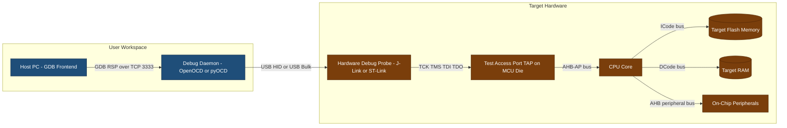
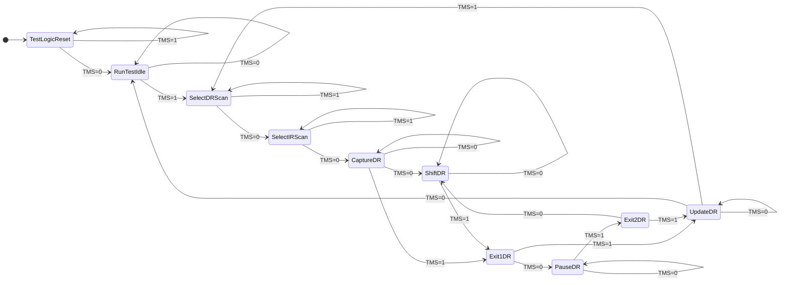
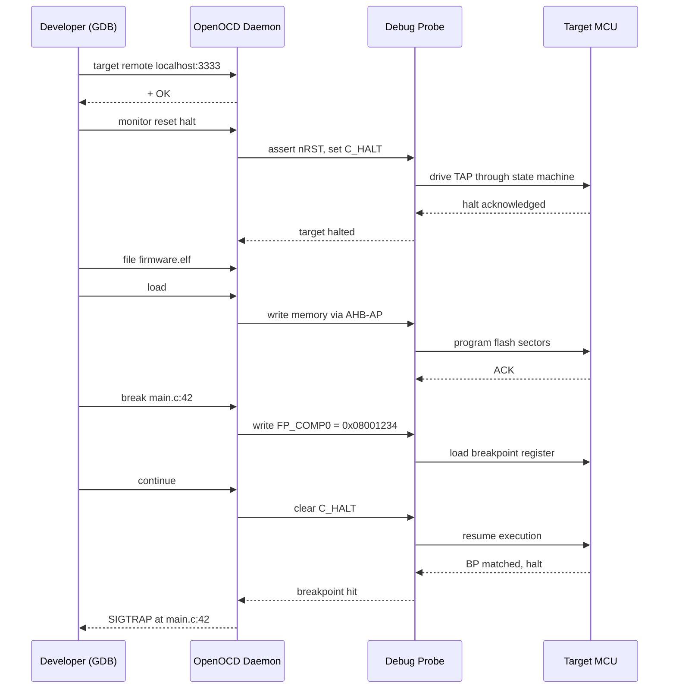
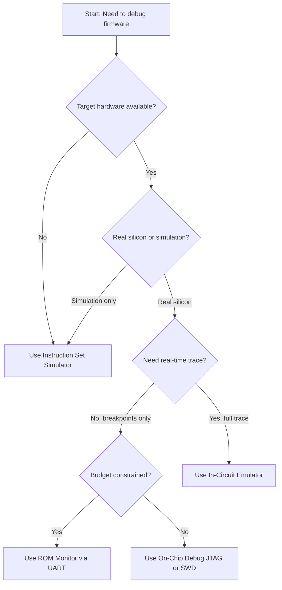
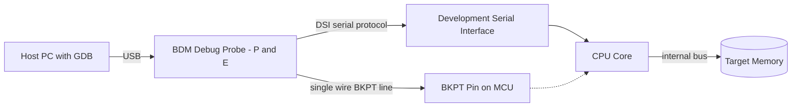

# Emulators and Debugging

<!-- SECTION_1_START -->

# Emulators and Debugging in Embedded Systems

## 1.1 Formal Academic Definition (KTU 2024 Syllabus Terminology)

> [!IMPORTANT]
> **Core Definition — Emulator:**
> An **emulator** in embedded systems is a hardware-software combination that imitates the behavior of a target processor and its associated peripherals in real-time, allowing the developer to observe, control, and modify the internal state of the embedded system without requiring the actual production hardware to be fully functional.

> [!IMPORTANT]
> **Core Definition — Debugger:**
> A **debugger** is a software (and sometimes hardware-augmented) tool that allows the developer to execute program code in a controlled manner — typically through **breakpoints**, **single-stepping**, **watchpoints**, and **register/memory inspection** — to locate, isolate, and correct logical and timing defects (bugs) in firmware.

### Conceptual Analogy / Intuition

Imagine you are learning to drive a Formula 1 car. Before letting a learner on an actual track, instructors use a **driving simulator** that reproduces the cockpit, steering response, and engine behavior almost identically. The simulator can pause mid-corner, replay the last 5 seconds, or show you exactly where the brakes failed. 

An **emulator** is the "driving simulator" for microcontrollers. The **debugger** is the instructor's control panel that lets them pause, rewind, and inspect every gear shift.

### 1.2 Classification of Emulation/Debug Tools

Embedded systems engineers use **four primary classes** of tools:

1. **Instruction Set Simulators (ISS)** — purely software; run on a host PC.
2. **In-Circuit Emulators (ICE)** — replace the target CPU with a probe.
3. **ROM/Software Monitors** — a small program burnt into target flash that talks to host.
4. **On-Chip Debug (OCD) / JTAG / BDM / SWD** — built-in debug logic inside the MCU silicon itself.

> [!NOTE]
> **Industry Standard Trend:** Modern embedded development (ARM Cortex-M, RISC-V, etc.) almost universally uses **On-Chip Debugging** over JTAG or SWD. **Legacy ICE units are now considered obsolete** in most production workflows, though they remain syllabus-relevant for KTU.

### 1.3 Standard Metrics and Constants

| Parameter | Typical Value | Meaning |
| :--- | :--- | :--- |
| **JTAG Clock (TCK)** | **1 MHz – 50 MHz** | Maximum TCK rate; depends on cable length and target MCU |
| **JTAG TDI/TDO** | 4-wire standard | Test Data In / Test Data Out |
| **SWD Clock (SWCLK)** | Up to **50 MHz** | Serial Wire Debug — ARM-specific 2-wire alternative |
| **Breakpoint Hardware Units** | Typically **4 – 8** | Number of hardware breakpoints supported by OCD logic |
| **IEEE 1149.1 Boundary Scan** | Standard | Defines the JTAG test access port (TAP) |

> [!VISUALIZATION CONTROL]
> **Concept:** Debug Probe → Target MCU Architecture
> **GeoGebra / Desmos Input Equations:**
> * Point A = `(0, 0)` labelled "Host PC / GDB"
> * Point B = `(2, 0)` labelled "Debug Probe (JTAG/SWD)"
> * Point C = `(4, 0)` labelled "Target MCU (Cortex-M4)"
> * Arrows A→B and B→C with labels "USB/HID" and "TCK/TMS/TDI/TDO"
> **Visual Description:** A linear three-node horizontal layout showing data flow from developer workstation, through the hardware probe, into the silicon debug TAP of the target MCU.

---

<!-- SECTION_1_END -->

<!-- SECTION_2_START -->

# Deep Theoretical Analysis & KTU High-Yield Reference Sheet

## 2.1 The Four Pillars of Embedded Debugging

### Pillar 1 — Instruction Set Simulator (ISS)

A pure-software model of the CPU. Examples: **QEMU**, **Keil µVision Simulator**, **Renesas e² studio Simulator**.

* Runs entirely on host (no target hardware needed).
* Cycle-accurate variants model timing; functional variants do not.
* **Best for:** algorithmic unit testing, CI/CD pipelines.
* **Limitation:** cannot validate real peripheral timing or hardware interrupts.

### Pillar 2 — In-Circuit Emulator (ICE)

A hardware probe that physically replaces the target MCU with a bond-out version having accessible internal buses. Historical examples: **Tektronix / HP emulators for 8051, 68HC11**.

* Provides **real-time, non-intrusive** trace.
* Used to debug **masked-ROM** devices where OCD didn't exist.
* **KTU relevance:** high — frequently asked in theory.

### Pillar 3 — ROM Monitor / Background Debug Mode (BDM)

A small debug firmware is pre-flashed into target memory. The host sends commands over UART/USB to the monitor, which:

1. Stops the CPU at a known address.
2. Reads/writes registers and memory.
3. Single-steps the CPU.

Examples: **PEEDI**, **OpenOCD + GDB + BDM firmware** for Freescale/NXP ColdFire.

### Pillar 4 — On-Chip Debugging (JTAG / SWD / cJTAG / Nexus)

Modern MCUs integrate a **Test Access Port (TAP)** directly on the die. The TAP implements a **state machine** (16 states in IEEE 1149.1) controlled by **TCK** and **TMS** lines.

## 2.2 The JTAG State Machine (TAP Controller)

The TAP controller is a **finite state machine** with **16 states** — fundamental for KTU.

The two stable steady-states are:

* **Test-Logic-Reset** — normal operation; TAP idle.
* **Run-Test/Idle** — between scan operations.

The four primary scan paths begin at **Select-DR-Scan** or **Select-IR-Scan** and traverse through **Capture → Shift → Exit1 → Pause → Exit2 → Update**.

> [!NOTE]
> **Mnemonic for shift sequence:** **C**apture, **S**hift, **E**xit1, **P**ause, **E**xit2, **U**pdate — remember as **"Can Someone Exit Please, Exit Upstairs"**.

## 2.3 SWD (Serial Wire Debug) vs JTAG

| Feature | JTAG (IEEE 1149.1) | SWD (ARM-specific) |
| :--- | :--- | :--- |
| **Wire count** | 4 (TCK, TMS, TDI, TDO) + optional TRST | **2 (SWCLK, SWDIO)** |
| **Pin sharing** | Often shared with GPIO | Dedicated debug pins |
| **Speed** | Up to ~50 MHz | Up to ~50 MHz |
| **Topology** | Daisy-chain multi-device | Single-device, point-to-point |
| **Standard** | IEEE 1149.1 | ARM CoreSight |

## 2.4 Debugger Operational Modes

A debugger interacts with the target through three primary mechanisms:

1. **Run-to-Breakpoint Mode** — CPU runs freely until a PC (program counter) matches a hardware breakpoint register; OCD asserts a debug request.
2. **Single-Step Mode** — After each instruction, the OCD halts the CPU, allowing the developer to inspect register state.
3. **Watchpoint / Data Breakpoint** — Halt occurs not on instruction fetch, but when a specific memory address is **read or written**.

## 2.5 KTU High-Yield Formula & Reference Cheat Sheet

> [!IMPORTANT]
> **Critical Note on Pipelining:** When single-stepping a pipelined CPU (e.g., ARM Cortex-M3 has 3 stages), halting occurs at **instruction commit**, not at fetch. Forgetting this is a common KTU answer-pitfall.

| Concept | Key Equation / Value | Unit / Note |
| :--- | :--- | :--- |
| **TAP states** | $\text{NumStates} = 2^{4} = 16$ | Defined by IEEE 1149.1 |
| **JTAG instruction register width** | Typically $\geq 4$ bits | Determines device ID length |
| **SWD bit period** | $T_{SWD} = \frac{1}{f_{SWCLK}}$ | seconds |
| **Trace buffer size** | $B_{trace} = N_{pins} \times D_{depth}$ | bits |
| **Breakpoint match latency** | $L_{bp} \leq 1$ instruction cycle | OCD hardware guarantee |
| **Background debug frequency** | $f_{BDM} = \frac{f_{CPU}}{N_{divider}}$ | Hz |

## 2.6 Real-World Engineering Utility

| Domain | Why Debug Tools Are Used |
| :--- | :--- |
| **Automotive ECUs (AUTOSAR)** | Hard real-time faults in CAN/LIN stacks traced via Lauterbach TRACE32 + OCD |
| **IoT Firmware (ARM Cortex-M0+)** | Low-power sleep-mode bugs caught only via SWD with current shunts |
| **Aerospace Flight Controllers** | Dual-core lockstep failures diagnosed via Nexus-class trace |
| **Consumer MCU Production Testing** | JTAG boundary scan validates PCB solder joints post-assembly |

---

<!-- SECTION_2_END -->

<!-- SECTION_3_START -->

# Step-by-Step Derivations, Workflows & Code Implementation

## 3.1 Complete Embedded Debug Workflow (Algorithmic Walkthrough)

Below is the **canonical 9-step professional debug procedure** that KTU examiners expect students to write when asked "Explain the steps involved in debugging an embedded system."

### Step 1 — Establish the Host-Target Communication Link

Connect the hardware debug probe (e.g., J-Link, ST-Link, P&E Multilink) to the target board's JTAG/SWD header, and to the host PC via USB. The host runs an **OpenOCD / GDB / pyOCD** daemon.

### Step 2 — Verify TAP Chain Integrity

The host issues a **BYPASS** instruction to all devices except the target MCU. The expected TDO bit length should equal $\text{numBypassDevices} \times 1$ bit. If the chain fails, the BYPASS length is wrong.

### Step 3 — Halt the Core

Set the **DebugHalting Control and Status Register** (e.g., ARM `DHCSR` at address `0xE000EDF0`). Setting the `C_HALT` bit (bit 1) and `C_DEBUGEN` (bit 0) places the core in **Debug State**.

### Step 4 — Load the Symbol Table and ELF

The debugger parses the **ELF/DWARF** file to map addresses to source filenames and line numbers.

### Step 5 — Set Breakpoints

The user specifies a source line. The debugger resolves it to a code address $A$ and writes $A$ into one of the available hardware breakpoint comparator registers (e.g., `BP_COMP0`).

### Step 6 — Resume Execution

The debugger clears the `C_HALT` bit. The core runs.

### Step 7 — Breakpoint Match

When the PC equals $A$, the OCD asserts an internal **debug event** to the core, which re-enters Debug State. The debugger reads the **`DFSR`** (Debug Fault Status Register) to determine the halt reason.

### Step 8 — Inspect / Modify

The debugger reads core registers via the **DCRDR/DCRSR** register pair and memory via the **AHB-AP** (Access Port).

### Step 9 — Resume or Step

Either clear the halt bit and continue, or set the `C_STEP` bit to single-step one instruction.

## 3.2 Worked Example: Setting a Hardware Breakpoint by Hand

Suppose we want to halt when the program counter reaches address $A = \text{0x08001234}$ on an STM32F4 (Cortex-M4).

The CoreSight debug logic uses a comparator register pair: $\text{FP_COMP0}$ (address) and $\text{FP_CTRL}$ (enable).

The control register $\text{FP_CTRL}$ has bit assignments:

$$
\begin{aligned}
\text{FP\_CTRL} &= (\text{ENABLE} \ll 0) \mid (\text{KEY} \ll 1) \\
\text{where } \text{KEY} &= \text{0b10} \text{ (must be written for write access)} \\
\text{ENABLE} &= 1 \text{ (enables comparator 0)}
\end{aligned}
$$

The comparator:

$$
\text{FP\_COMP0} = \text{0x08001234}
$$

Bit 0 of FP_COMP0 is the **REPLACE** flag (used for literal compare vs masking); for an exact PC match, write $A$ directly with bit 0 = 0.

## 3.3 Python Simulation of a Minimal GDB Remote Debugger

This Python script demonstrates the **GDB Remote Serial Protocol** stub — the language a real OCD daemon speaks with GDB.

```python
"""
Minimal GDB RSP server stub for an embedded target.
Implements: 'g' (read registers), 'G' (write registers),
            'm' (read memory), 'M' (write memory),
            'Z0' (software breakpoint set),
            'c' (continue), 's' (single-step).
"""

import socket
import binascii
from typing import Dict, Optional

# Simulated target state
class TargetState:
    def __init__(self) -> None:
        # 16 general-purpose 32-bit registers (R0..R15), R13=SP, R14=LR, R15=PC
        self.regs: Dict[int, int] = {i: 0x00000000 for i in range(16)}
        self.memory: bytearray = bytearray(4096)  # 4KB simulated flash/RAM
        self.halted: bool = True
        self.breakpoints: Dict[int, int] = {}  # addr -> original instruction byte

    def read_reg(self, reg_id: int) -> int:
        if reg_id not in self.regs:
            raise ValueError(f"Invalid register R{reg_id}")
        return self.regs[reg_id]

    def write_reg(self, reg_id: int, value: int) -> None:
        if not 0 <= value <= 0xFFFFFFFF:
            raise ValueError(f"Register value out of 32-bit range: {value}")
        self.regs[reg_id] = value

    def read_mem(self, addr: int, length: int) -> bytes:
        if addr + length > len(self.memory):
            raise MemoryError("Read past end of memory map")
        return bytes(self.memory[addr:addr + length])

    def write_mem(self, addr: int, data: bytes) -> None:
        if addr + len(data) > len(self.memory):
            raise MemoryError("Write past end of memory map")
        self.memory[addr:addr + len(data)] = data


target = TargetState()


def parse_hex_payload(payload: str, expected_bytes: int) -> bytes:
    """Decode hex string from GDB; raises if length mismatch."""
    raw = binascii.unhexlify(payload)
    if len(raw) != expected_bytes:
        raise ValueError(
            f"Expected {expected_bytes} bytes, got {len(raw)}"
        )
    return raw


def handle_gdb_packet(packet: str) -> str:
    """Dispatch a single GDB RSP packet and return the response string."""
    checksum_ok: bool = True
    try:
        cmd = packet[0]

        if cmd == 'g':  # Read all registers (R0..R15 = 16 x 4 bytes = 64 bytes)
            reg_bytes = b''.join(
                target.read_reg(i).to_bytes(4, 'little') for i in range(16)
            )
            return '+$' + binascii.hexlify(reg_bytes).decode() + '#'

        elif cmd == 'G':  # Write all registers
            parse_hex_payload(packet[1:], 64)
            for i in range(16):
                chunk = packet[1 + i * 8: 1 + (i + 1) * 8]
                target.write_reg(i, int(chunk, 16))
            return '+'

        elif cmd == 'm':  # Read memory: m<addr>,<length>
            addr_str, len_str = packet[1:].split(',')
            addr, length = int(addr_str, 16), int(len_str, 16)
            data = target.read_mem(addr, length)
            return '+$' + binascii.hexlify(data).decode() + '#'

        elif cmd == 'M':  # Write memory: M<addr>,<length>:<hex>
            header, hexdata = packet[1:].split(':')
            addr_str, len_str = header.split(',')
            addr, length = int(addr_str, 16), int(len_str, 16)
            target.write_mem(addr, binascii.unhexlify(hexdata))
            return '+'

        elif cmd == 'Z':  # Insert breakpoint: Z0,<addr>,<kind>
            parts = packet[1:].split(',')
            addr = int(parts[1], 16)
            # Save original instruction, replace with ARM BKPT (0xBEAB for Thumb)
            target.breakpoints[addr] = target.read_mem(addr, 2)[0]
            target.write_mem(addr, b'\xab\xbe')  # Thumb BKPT instruction
            return '+'

        elif cmd == 'z':  # Remove breakpoint
            parts = packet[1:].split(',')
            addr = int(parts[1], 16)
            if addr in target.breakpoints:
                orig = target.breakpoints.pop(addr)
                target.write_mem(addr, bytes([orig, 0]))
            return '+'

        elif cmd == 'c':  # Continue (no-op in this stub)
            target.halted = False
            return '+'

        elif cmd == 's':  # Single-step
            return '+'  # Would advance PC by 2/4 in real implementation

        elif cmd == '?':  # Query halt reason
            return '+$S05#'  # SIGTRAP = 5

        else:
            return '+'

    except (ValueError, MemoryError) as e:
        return f'+$E{abs(hash(str(e))) & 0xFF:02X}#'


def start_gdb_server(host: str = '127.0.0.1', port: int = 3333) -> None:
    """Bind a TCP socket and serve GDB clients."""
    sock: socket.socket = socket.socket(socket.AF_INET, socket.SOCK_STREAM)
    sock.setsockopt(socket.SOL_SOCKET, socket.SO_REUSEADDR, 1)
    sock.bind((host, port))
    sock.listen(1)
    print(f"[stub] GDB RSP server listening on {host}:{port}")

    conn, _ = sock.accept()
    print("[stub] Client connected.")

    while True:
        data: Optional[bytes] = conn.recv(4096)
        if not data:
            break
        packet = data.decode(errors='ignore').strip()
        if not packet:
            continue
        response = handle_gdb_packet(packet)
        conn.sendall(response.encode())


if __name__ == '__main__':
    start_gdb_server()
```

> [!NOTE]
> This stub implements just enough of the **GDB Remote Serial Protocol** (defined in [gnu.org/gdb/multi/Remote-Protocol.html](https://sourceware.org/gdb/current/onlinedocs/gdb/Remote-Protocol.html)) to demonstrate packet structure (`$payload#checksum`) and ACK (`+`) semantics. Real implementations like **OpenOCD** or **pyOCD** also implement packet retransmission, `X` (binary memory write), and `vCont` (extended continue/step).

## 3.4 Hardware Wiring Reference for Common Debug Probes

> [!NOTE]
> Use this table when an exam question asks: "Draw the connection between a JTAG probe and an ARM Cortex-M target."

| Probe Pin | Target Pin (Cortex-M) | Direction | Function |
| :--- | :--- | :--- | :--- |
| **VTREF** | VDD (3.3 V) | Input | Logic-level reference |
| **GND** | GND | — | Common ground |
| **TCK / SWCLK** | TCK / SWCLK | Output | Clock |
| **TMS / SWDIO** | TMS / SWDIO | Bidirectional | Mode select (JTAG) / Data (SWD) |
| **TDI** | TDI | Output | Data in (JTAG only) |
| **TDO** | TDO | Input | Data out (JTAG only) |
| **nTRST** | nTRST (optional) | Output | TAP reset (JTAG only) |
| **RESET** | NRST | Output | System reset |

## 3.5 JTAG TAP State Transition — Symbolic Derivation

The 16 TAP states can be enumerated as a 4-bit register $\text{TAP} = (t_3 t_2 t_1 t_0)$ updated on each rising edge of TCK with TMS as the input.

The state update rule:

$$
\text{TAP}_{n+1} = f(\text{TAP}_n, \text{TMS})
$$

For the **Shift-DR** state, we know that while $\text{TMS} = 0$, the state remains in Shift-DR, and TDI is shifted into the selected register on each TCK rising edge. This yields the boundary condition for a scan-in of $N$ bits:

$$
N_{\text{cycles}} = N_{\text{register\_width}}
$$

For an **Instruction Register** scan:

$$
\text{IR}_{\text{new}} = \sum_{k=0}^{N-1} \text{TDI}_k \cdot 2^{k}
$$

where $\text{TDI}_k$ is the bit sampled on the $k$-th TCK rising edge during Shift-IR.

---

<!-- SECTION_3_END -->

<!-- SECTION_4_START -->

# Structural Diagrams & Schematics

## 4.1 Block-Level Functional Architecture — Embedded Debug System



## 4.2 JTAG TAP Controller State Machine



## 4.3 Debug Session Sequence Topology



## 4.4 Decision Matrix — Which Debug Tool to Choose



---

<!-- SECTION_4_END -->

<!-- SECTION_5_START -->

# KTU 2024 Scheme Examination Question Bank & Topic Recap

## Part A — Short Answer Questions (3 Marks Each)

### Question 1 `[KTU University Exam - July 2024]`
**CO5 | RBT Level: Remember**
*What is an In-Circuit Emulator (ICE) and how does it differ from a ROM Monitor?*

**Model Answer (Valuation Key):**

An **In-Circuit Emulator (ICE)** is a hardware debugging tool that physically replaces the target microcontroller on the circuit board using a probe containing a bond-out version of the CPU with accessible internal buses. It allows real-time, non-intrusive tracing of program execution, memory reads, and I/O activity. **[1.5 Marks]**

A **ROM Monitor**, in contrast, is a small firmware program already resident in the target's non-volatile memory; it communicates with the host over a serial line (UART) to provide run-control. ICE is hardware-based and does not consume target memory, while a ROM monitor is software-based and does occupy target memory. **[1.5 Marks]**

### Question 2 `[KTU University Exam - Dec 2023]`
**CO5 | RBT Level: Understand**
*List any four signals of the JTAG interface and state the function of each.*

**Model Answer (Valuation Key):**

1. **TCK (Test Clock)** — Provides the clock to synchronize TAP state transitions. **[0.75 Marks]**
2. **TMS (Test Mode Select)** — Sampled at the rising edge of TCK to determine the next TAP state. **[0.75 Marks]**
3. **TDI (Test Data In)** — Serial data input shifted into the selected register during Shift-DR/Shift-IR. **[0.75 Marks]**
4. **TDO (Test Data Out)** — Serial data output from the currently selected register. **[0.75 Marks]**

---

## Part B — Long Answer Questions (14 Marks, with Internal Choice)

### Question A (Choice 1) `[KTU University Exam - July 2024]`
**CO5 | RBT Level: Apply + Analyze**

**(a)** Explain the architecture and operation of the **JTAG Test Access Port (TAP)** controller. Draw and describe all 16 states of the state machine. **[7 Marks]**

**(b)** Compare **JTAG** and **Serial Wire Debug (SWD)** in terms of pin count, protocol, and typical use cases. **[7 Marks]**

#### Model Solution for (a) — TAP Controller Architecture

> [!NOTE]
> **Valuation Pattern:** Examiners expect the following five sub-elements for full marks. Award partial credit as marked.

1. **Definition of TAP and its role in boundary scan (IEEE 1149.1)** — [1 Mark]
2. **List of mandatory signals (TCK, TMS, TDI, TDO; optional nTRST)** — [1 Mark]
3. **Description of the 16-state finite state machine with the two steady states (Test-Logic-Reset, Run-Test/Idle)** — [2 Marks]
4. **Explanation of the four scan paths: Select-DR-Scan, Select-IR-Scan, Capture-DR, Capture-IR** — [2 Marks]
5. **Working of Shift-DR and Update-DR with TDI/TDO timing** — [1 Mark]

**Detailed Answer:**

The **Test Access Port (TAP)** is a 4-pin (minimum) interface defined by the IEEE 1149.1 standard for boundary-scan testing and on-chip debugging. It consists of the following signals:

$$
\text{TAP Signals} = \{ \text{TCK}, \text{TMS}, \text{TDI}, \text{TDO} \}
$$

The TAP controller is a **synchronous finite state machine** with 16 states. Two states are **stable steady states**:

* **Test-Logic-Reset** — TMS held high forces this state; normal chip operation resumes.
* **Run-Test/Idle** — between active scan operations.

The remaining 14 states are transient, traversed based on TMS sampled at the rising edge of TCK. The four primary operational paths are:

$$
\begin{aligned}
\text{Path 1 (Data Register scan)} &: \text{Select-DR-Scan} \to \text{Capture-DR} \to \text{Shift-DR} \to \text{Exit1-DR} \to \text{Update-DR} \\
\text{Path 2 (Instruction Register scan)} &: \text{Select-IR-Scan} \to \text{Capture-IR} \to \text{Shift-IR} \to \text{Exit1-IR} \to \text{Update-IR} \\
\text{Path 3 (Pause)} &: \text{Exit1-DR} \to \text{Pause-DR} \to \text{Exit2-DR} \\
\text{Path 4 (Reset)} &: \text{Test-Logic-Reset}
\end{aligned}
$$

During **Shift-DR**, data is serially shifted in via TDI and out via TDO on each TCK rising edge. During **Update-DR**, the data shifted into the parallel output register is committed to its destination (e.g., breakpoint comparator, pin control). **[Full 7 Marks if all five sub-elements are present]**

#### Model Solution for (b) — JTAG vs SWD Comparison

> [!NOTE]
> **Tabular comparison expected. Award 1 mark per valid differentiating point; minimum 6 unique points needed for 7 marks.**

| Parameter | JTAG (IEEE 1149.1) | SWD (ARM CoreSight) |
| :--- | :--- | :--- |
| **Pin Count** | 4 mandatory + optional nTRST, RTCK | **2 (SWCLK + SWDIO)** |
| **Protocol** | TAP state machine, 4-wire parallel concepts | Packet-based, half-duplex serial |
| **Multi-device** | Daisy-chained via TDI→TDO | Point-to-point (one device per SWD port) |
| **Bandwidth** | Up to ~50 MHz TCK | Comparable, but lower overhead per bit |
| **Pin sharing** | Can share with GPIO via alternate function | Dedicated on most Cortex-M parts |
| **Standard** | Industry-wide (any vendor) | ARM-specific |
| **Use case** | Boundary scan, multi-vendor test rigs | Cost-sensitive ARM MCU production debug |

**[7 Marks]**

---

### Question B (Choice 2) `[KTU University Exam - Dec 2023]`
**CO5 | RBT Level: Understand + Apply**

**(a)** Describe the **integration testing methodology** for embedded hardware and firmware. Explain the role of stubs and drivers in top-down and bottom-up integration. **[7 Marks]**

**(b)** With a neat diagram, explain the working of a **Background Debug Mode (BDM)** based debugger. List its advantages over traditional JTAG for low-pin-count MCUs. **[7 Marks]**

#### Model Solution for (a) — Integration Testing Methodology

> [!NOTE]
> **Valuation Key:** Examiners award 1 mark per defined concept + 1 mark for stub/driver differentiation + 1 mark for top-down example + 1 mark for bottom-up example + 1 mark for limitations + 1 mark for schematic mention + 1 mark for conclusion.

**Integration testing** in embedded systems is the phase where individually unit-tested hardware modules (sensor boards, motor driver PCBs) and software modules (device drivers, RTOS tasks) are combined and tested as a group to expose faults in their interactions.

Two classical strategies exist:

**(1) Top-Down Integration:** Start with the **main control module** and incrementally integrate subordinate modules. **Stubs** (temporary dummy routines returning predefined values) replace the not-yet-integrated lower modules. Stubs allow the top-level logic to be exercised first. **[1.5 Marks]**

**(2) Bottom-Up Integration:** Start with the **lowest-level hardware drivers** (e.g., GPIO, UART, ADC). **Drivers** (test harness programs) are written to call each low-level module, verify its behavior in isolation, then progressively link higher modules. **[1.5 Marks]**

For embedded firmware, a **hybrid (sandwich) approach** is most common: hardware drivers are unit-tested bottom-up, while application logic is integrated top-down with stubs simulating sensor inputs.

**Limitations in embedded context:** Stubs cannot accurately model real-time behavior; real hardware interrupt timing may diverge from stubbed simulation. Hence, hardware-in-the-loop (HIL) testing is preferred for the final integration stage. **[2 Marks for limitations + conclusion]**

#### Model Solution for (b) — BDM Working Diagram and Advantages

**BDM Architecture (Block Description):**



**Working Principle:** The BDM probe uses a **single-wire bidirectional BKPT pin** plus a **Development Serial Interface (DSI)** to read/write CPU registers and memory. When a breakpoint is hit, the CPU asserts the BKPT line; the probe reads the core's status via DSI commands. **[3 Marks for working]**

**Advantages over JTAG for low-pin-count MCUs:**

1. **Fewer pins required** — BDM uses 1–2 pins versus 4 for JTAG. **[1 Mark]**
2. **No TAP state machine overhead** — simpler protocol. **[1 Mark]**
3. **Faster initial connection on some legacy Freescale/NXP ColdFire parts.** **[1 Mark]**
4. **Lower silicon area cost** — important for small-package MCUs. **[1 Mark]**

> [!WARNING]
> **KTU Examiner's Valuation Pitfalls (Common Mark Losses):**
> 1. **Failing to mention that BDM is largely ColdFire/Freescale-specific** — modern NXP Kinetis and LPC parts have migrated to SWD. Generic ARM Cortex-M chips do NOT have BDM. Award 0.5 mark penalty if the student implies BDM is universal.
> 2. **Confusing the BKPT pin (debug request) with hardware breakpoint registers** — they are different mechanisms. The BKPT pin is an external debug event; breakpoint registers are internal comparators.
> 3. **Omitting the role of the DSI (Development Serial Interface)** — students often describe only the BKPT pin and forget that register access happens over DSI.

---

## Topic Recap & Important Things to Remember

- **Emulator vs Debugger:** Emulator is a *hardware-replacement probe*; debugger is the *software tool* that controls it. They are not synonyms.
- **The 4 main debug paradigms** in order of historical appearance: **ISS → ICE → ROM Monitor → OCD (JTAG/SWD/BDM)**.
- **JTAG is IEEE 1149.1**, has **16 TAP states**, requires minimum **4 wires (TCK, TMS, TDI, TDO)**, and is a TAP state-machine protocol.
- **SWD is ARM-specific, 2-wire (SWCLK, SWDIO)**, packet-based, and is the modern default for Cortex-M parts.
- **TDI is shifted in during Shift-DR/Shift-IR; TDO is shifted out simultaneously.** Both happen on TCK rising edge.
- **Two steady states** of the TAP: **Test-Logic-Reset** and **Run-Test/Idle**.
- **Breakpoint types:** *Hardware breakpoints* (use OCD comparator registers, no flash modification, limited to 4–8) vs *software breakpoints* (patch flash with `BKPT` instruction, unlimited, but invasive).
- **Watchpoints** halt on *data access*, not instruction fetch — they protect memory integrity.
- **GDB Remote Serial Protocol** uses ASCII packets of the form `$payload#checksum` with `+` ACK.
- **BDM** is a *legacy Freescale/NXP* debug interface — not present on standard ARM Cortex-M parts.
- **Integration testing uses stubs (top-down) and drivers (bottom-up)**; a hybrid is most common in embedded firmware.
- **Hardware-in-the-Loop (HIL)** testing is essential when real-time behavior cannot be stubbed.
- **IEEE 1149.1 boundary scan** doubles as a *post-assembly PCB test* method using the same JTAG pins.
- **Trace** is the ability to record program flow non-intrusively — ETM (Embedded Trace Macrocell) for ARM, Nexus for some automotive parts.
- **Valuation mantra:** Always mention that *modern* embedded debug = **OCD via JTAG or SWD**, *legacy* = ICE, *purely software* = ISS.

---

<!-- SECTION_5_END -->
