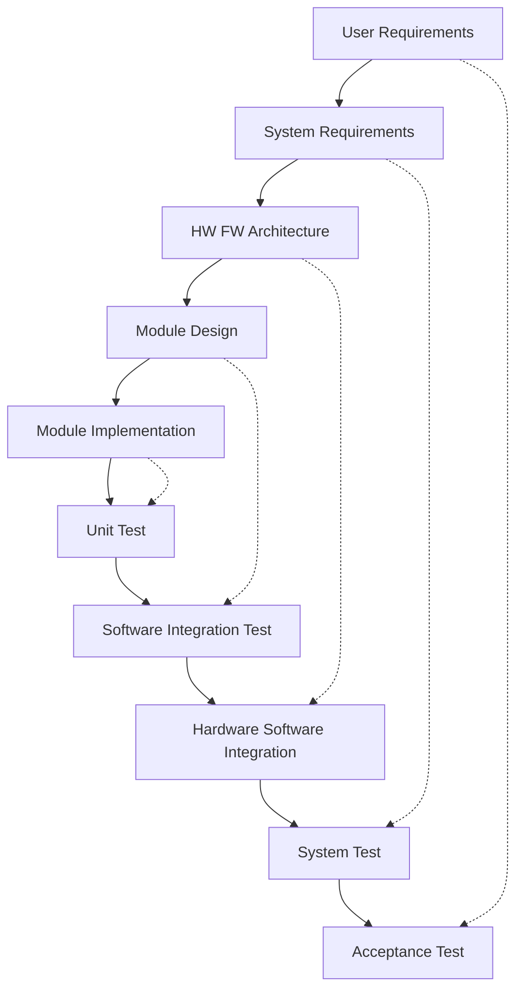
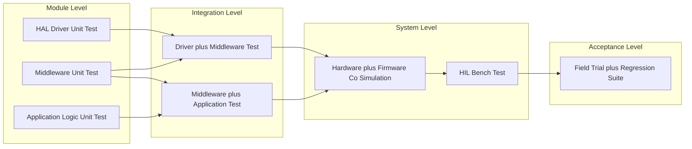
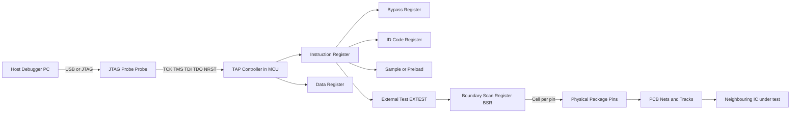
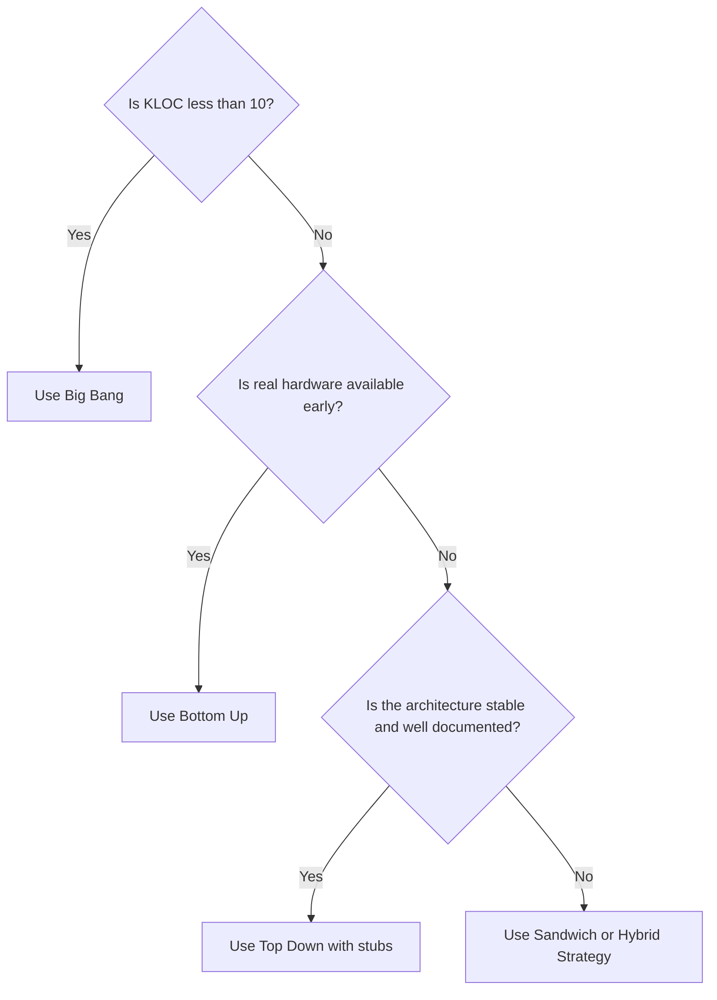

# Integration and Testing of Embedded Hardware and Firmware :-

<!-- SECTION_1_START -->
# Integration and Testing of Embedded Hardware and Firmware

> [!IMPORTANT]
> **KTU 2024 Scheme — PECST746 / Module 4 Focus**
> This module bridges the gap between *separately validated* hardware and firmware blocks and a *fully operational, production-grade* embedded product. The examiner's view treats integration and testing as the discipline that exposes the bugs neither board bring-up nor unit-level software testing could ever find alone.

---

## 1.1 Formal KTU Definition

**Integration** in embedded systems is the *systematic, layered composition* of verified hardware Intellectual Property (IP) blocks, mechanical enclosures, and firmware modules into a single, cohesive computing platform, governed by a hardware-software interface contract (e.g., register map, memory layout, pin map, bus protocol).

**Testing** is the *objective, repeatable verification and validation* process that confirms the integrated system meets its functional, performance, power, safety, and reliability specifications across the *operational envelope* (temperature, voltage, EMI, mechanical stress) defined in the Product Requirements Document (PRD).

In strict KTU 2024 terminology, this is often expressed as:
- **Verification** — *Are we building the product right?* (Specification conformance)
- **Validation** — *Are we building the right product?* (Use-case conformance)

> [!NOTE]
> **Board Examiner's Note:** KTU question papers frequently use the words *integration* and *testing* together but award marks distinctly. A 14-mark answer that conflates the two will lose **2–3 marks** for failing to draw the boundary between them.

---

## 1.2 Conceptual Analogy — The Restaurant Kitchen

Imagine a Michelin-star restaurant. Each station (*grill, pastry, garde-manger*) prepares and *unit-tests* its own dish — this is **module-level testing**.

**Integration** is the moment the head chef stages all stations on the pass: a relay race where the grill hands off to pastry, which hands off to plating. The interface is the *expediter's ticket* (the protocol). If the grill's output pan size is wrong, the pastry cannot plate the dessert — this is an **integration defect** that no single station could ever detect.

**Testing** is the **tasting menu** served to the food critic: end-to-end, system-level, in the real dining room, under real service pressure.

| Restaurant Concept | Embedded Equivalent |
|---|---|
| Recipe spec | Hardware/Firmware Requirement Spec |
| Single station rehearsal | Unit testing of HAL driver or sensor library |
| Expediter's ticket | Register map / pin map / IPC contract |
| Service rush hour | Stress, soak, and burn-in testing |
| Food critic review | Validation against the PRD |

---

## 1.3 Physical Constants, Standards, and Metrics

The following **industry-standard** metrics, marked in **bold**, dominate KTU board answers:

- **MTBF** — Mean Time Between Failures (hours)
- **MTTR** — Mean Time To Repair (hours)
- **DPMO** — Defects Per Million Opportunities (Six Sigma quality metric)
- **Code Coverage** — typically expressed as a **percentage** (Line, Branch, MC/DC, Path)
- **Defect Density** — defects per **KLOC** (thousand lines of code)
- **JTAG clock frequency** — typically **10 MHz, 25 MHz, 50 MHz, 100 MHz** (IEEE 1149.1)
- **Test Access Port (TAP)** — **5-wire** standard (TCK, TMS, TDI, TDO, TRSTn)
- **Boundary Scan Register (BSR)** length — defined per **IEEE 1149.1** as one cell per package pin

> [!TIP]
> Always quote MTBF and defect density with their **units in the same line** as the numerical value. Examiners deduct marks for "*MTBF = 50000*" without *hours* or *cycles*.

---

## 1.4 Visualization Control

> [!VISUALIZATION CONTROL]
> **Concept:** Integration V-Model with Test Phases on Descending and Ascending Arms
> **Coordinate Axes:** X = Development Time (left → right), Y = Abstraction Level (top = User Requirement, bottom = Hardware)
> **Plot Points to Mark:**
> * $P_1 = (\text{Requirements},\ \text{High})$
> * $P_2 = (\text{System Design},\ \text{High} - \Delta)$
> * $P_3 = (\text{HW/FW Design},\ \text{Mid})$
> * $P_4 = (\text{Module Coding},\ \text{Low})$
> * $P_5 = (\text{Unit Test},\ \text{Low})$> **Visual Description:** A V-shape where the left arm descends from requirements down to module coding, and the right arm ascends through *Unit → Integration → System → Acceptance* testing, each level directly tied to a corresponding design level on the left arm. Highlight that the **right arm = the testing/integration journey** we are studying in this module.

<!-- SECTION_1_END -->

<!-- SECTION_2_START -->
# Deep Theoretical Analysis & KTU High-Yield Formula Sheet

## 2.1 The Integration Strategy Triad

A KTU answer that lists only "top-down" and "bottom-up" is incomplete. There are **three canonical strategies**, and the choice dictates your test scaffolding.

### 2.1.1 Big-Bang Integration
- **What it is:** All modules are combined simultaneously and tested as a whole.
- **Mechanical analogy:** Assembling an entire gearbox, closing the housing, then trying to turn the input shaft.
- **Why it fails in practice:** A single fault can crash the system, and the *root cause* is buried under thousands of interacting code paths.
- **When KTU accepts it:** Only for *very small* systems (single MCU, < 10 KLOC).

### 2.1.2 Bottom-Up Integration
- **What it is:** Lowest-level drivers (GPIO, UART, I²C) are tested first, then layered upward to the application.
- **Driver-first philosophy:** Hardware abstraction layer (HAL) is brought up *before* business logic.
- **Advantage:** Critical hardware is validated in isolation with simple *test harnesses* (a.k.a. *stubs* are not needed at the bottom).
- **Risk:** The full system is not exercised until late, so architectural mismatches surface late.

### 2.1.3 Top-Down Integration
- **What it is:** The high-level control loop or RTOS scheduler is exercised first; lower modules are *stubbed*.
- **Stub-based philosophy:** A stub is a *minimal, hand-written* function that mimics the lower module's interface but returns canned values.
- **Advantage:** Architectural and interface defects are caught early.
- **Risk:** Stubs can mask real hardware timing defects; you must replace stubs with real drivers incrementally.

---

## 2.2 Hardware–Software Integration Specifics

Embedded integration is *not* generic software integration. It has two unique dimensions:

1. **Physical Coexistence** — The firmware must respect the *electrical* interface (voltages, rise times, bus capacitance).
2. **Temporal Coexistence** — Real-time deadlines (interrupt latency, scheduler jitter) must be honored *only when* real hardware is in the loop.

> [!IMPORTANT]
> **The Integration Boundary:** The contract between hardware and firmware is the **Register Map** and the **Memory Map**. Every KTU 14-mark integration question ultimately tests your ability to *read* a register map and trace a bit-field from firmware down to silicon behavior.

---

## 2.3 Testing Methodologies in Embedded Systems

### 2.3.1 White-Box Testing
- Tester has *internal access* to source code, registers, and memory.
- Tools: **GDB with OpenOCD**, **JTAG debuggers**, **printf over SWO**, **logic analyzer** on GPIO.
- Used heavily during *firmware unit testing* and *driver bring-up*.

### 2.3.2 Black-Box Testing
- Tester exercises the system via *external interfaces* only (UART commands, buttons, sensor inputs).
- Used for *acceptance* and *regression* testing.
- *Advantage:* No code modification; *Disadvantage:* Fault localization is slow.

### 2.3.3 Grey-Box Testing
- Hybrid: external stimuli + internal probes via debug interface.
- The *dominant* methodology in production embedded QA.

### 2.3.4 Hardware-in-the-Loop (HIL) and Software-in-the-Loop (SIL)
- **SIL:** Firmware runs on a *host PC* simulating the MCU and peripherals.
- **HIL:** Real firmware runs on *real hardware*, but sensors/actuators are replaced by a *real-time simulator* (e.g., National Instruments VeriStand, dSPACE).
- *Critical for safety domains:* automotive (ISO 26262), avionics (DO-178C), medical (IEC 62304).

---

## 2.4 The Embedded Testing Pyramid

Adapted from Mike Cohn's test pyramid, the embedded version is *inverted at the unit level* because hardware bring-up is expensive.

```
        ┌──────────────────┐
        │  Field /         │  ← Fewest, slowest, most expensive
        │  Acceptance      │
        ├──────────────────┤
        │  System /        │
        │  Integration     │
        ├──────────────────┤
        │  Software        │
        │  Integration     │
        ├──────────────────┤
        │  Hardware        │
        │  Bring-up        │
        ├──────────────────┤
        │  Unit / Module   │  ← Most numerous, fastest, cheapest
        └──────────────────┘
```

---

## 2.5 KTU High-Yield Formula Sheet

> [!NOTE]
> **Universal Markdown Table Rule:** Vertical pipes `|` inside cell content are replaced with `\vert` or `\mid` to preserve table syntax integrity.

| # | Concept | Formula / Rule | Units / Boundary | Engineering Use |
|---|---|---|---|---|
| 1 | MTBF | $\text{MTBF} = \frac{\text{Total Operating Time}}{\text{Number of Failures}}$ | hours | Reliability budgeting, warranty cost |
| 2 | Availability | $A = \frac{\text{MTBF}}{\text{MTBF} + \text{MTTR}}$ | dimensionless (0–1) | SLA definition for IoT gateways |
| 3 | Defect Density | $\text{DD} = \frac{\text{Defects Found}}{\text{KLOC}}$ | defects / KLOC | Code quality KPI |
| 4 | Code Coverage | $\text{Cov} = \frac{\text{Executed Branches}}{\text{Total Branches}} \times 100$ | percent | DO-178C requires **100 %** MC/DC for Level A |
| 5 | Reliability Function | $R(t) = e^{-\lambda t}$ where $\lambda = 1/\text{MTBF}$ | dimensionless | Exponential decay model |
| 6 | Test Coverage Ratio | $\text{TCR} = \frac{\text{Requirements Tested}}{\text{Total Requirements}} \times 100$ | percent | Traceability matrix check |
| 7 | JTAG TCK | $f_{\text{TCK}} \le f_{\text{MCU Core}} / 4$ | Hz | TAP clock upper bound |
| 8 | Boundary Scan Length | $\text{BSR} = \sum_{i=1}^{N} (\text{Pins per IC}_i) - \text{Power pins}$ | cells | DFT planning |
| 9 | Interrupt Latency Budget | $t_{\text{latency}} \le t_{\text{deadline}} - t_{\text{WCET}}$ | seconds / cycles | RTOS schedulability test |
| 10 | Pull-up Resistor | $R_{\text{pull}} \le \frac{t_r}{0.85 \cdot C_{\text{bus}}}$ | ohms | I²C, CAN bus design |
| 11 | BIST Coverage | $C_{\text{BIST}} = 1 - \frac{N_{\text{untested faults}}}{N_{\text{total faults}}}$ | dimensionless | Memory BIST (MBIST) |
| 12 | Soak Test Duration | $t_{\text{soak}} \ge 48$ hours (consumer) / $168$ hours (industrial) | hours | Burn-in qualification |

---

## 2.6 Real-World Engineering Utility

| Domain | Why Integration & Testing Is Non-Negotiable |
|---|---|
| **Automotive (ISO 26262)** | A misrouted CAN frame can disable a brake-by-wire system; **HIL + MC/DC = 100 %** is mandatory for ASIL-D. |
| **Medical (IEC 62304)** | Pacemaker firmware cannot ship with an unverified interrupt priority. |
| **Avionics (DO-178C)** | Level A software requires *modified condition/decision coverage* on **every** decision in the source. |
| **IoT Edge Devices** | Field OTA updates require *regression* and *fallback* testing; a failed update bricks the device. |
| **Industrial PLCs** | IEC 61131-3 mandates *deterministic* response within a *worst-case execution time*; integration tests must prove this. |

<!-- SECTION_2_END -->

<!-- SECTION_3_START -->
# Step-by-Step Derivations, Code, and Hardware Procedures

## 3.1 Derivation: The Reliability Function and the Failure Rate

We model failure as a *Poisson process* over time. Let $N(t)$ be the cumulative number of failures by time $t$.

**Step 1 — Define the cumulative failure distribution function:**
$$
F(t) = P(T \le t)
$$
where $T$ is the time-to-failure random variable.

**Step 2 — The reliability (survival) function is the complement:**
$$
R(t) = 1 - F(t) = P(T > t)
$$

**Step 3 — The *hazard rate* (instantaneous failure rate) is the derivative of $F(t)$ normalized by survival:**
$$
\lambda(t) = \frac{f(t)}{R(t)} = \frac{dF(t)/dt}{1 - F(t)}
$$
where $f(t) = dF(t)/dt$ is the probability density function of failure.

**Step 4 — Assume the hazard is *constant* (memoryless property of the exponential distribution), so $\lambda(t) = \lambda$.** This assumption holds for the *useful life* region of the classic *bathtub curve*.

**Step 5 — Solve the differential equation $dR/dt = -\lambda R(t)$ with the initial condition $R(0) = 1$:**
$$
R(t) = e^{-\lambda t}
$$

**Step 6 — Express the mean:**
$$
\text{MTBF} = \int_{0}^{\infty} R(t)\, dt = \int_{0}^{\infty} e^{-\lambda t}\, dt = \frac{1}{\lambda}
$$

> [!NOTE]
> **Key insight for KTU answers:** MTBF is the *reciprocal* of the constant failure rate. If a board examiner gives you $\lambda = 10^{-4}$ per hour, you write $\text{MTBF} = 10^{4}$ hours immediately, no integration needed.

---

## 3.2 Numerical Worked Example — Availability

**Problem:** A smart meter has $\text{MTBF} = 80000$ hours and $\text{MTTR} = 4$ hours after a firmware OTA failure. Compute availability and the maximum allowable annual downtime.

**Step 1 — Substitute into the availability formula:**
$$
A = \frac{\text{MTBF}}{\text{MTBF} + \text{MTTR}}
$$

**Step 2 — Evaluate numerator and denominator:**
$$
A = \frac{80000}{80000 + 4} = \frac{80000}{80004}
$$

**Step 3 — Compute the decimal value:**
$$
A \approx 0.99995
$$

**Step 4 — Convert to a percentage:**
$$
A_{\%} = 99.995\,\%
$$

**Step 5 — Compute annual downtime in minutes:**
$$
t_{\text{down}} = (1 - A) \times 365 \times 24 \times 60
$$

**Step 6 — Evaluate:**
$$
t_{\text{down}} = 0.00005 \times 525600 \approx 26.28 \text{ minutes per year}
$$

> [!TIP]
> This is the famous *"five nines"* ($99.999\%$) target. Telecom-grade systems target this; consumer IoT usually accepts *three nines* ($99.9\%$, ~ 8.76 hours of annual downtime).

---

## 3.3 Worked Example — Code Coverage Computation

**Problem:** A driver module has 80 branches. After running the regression suite, the coverage tool reports 64 branches executed. Find branch coverage and the *uncovered* branch count. The safety standard requires **100 %** branch coverage. How many more test cases are required *at minimum*?

**Step 1 — Coverage ratio:**
$$
\text{Cov} = \frac{64}{80} \times 100 = 80\,\%
$$

**Step 2 — Uncovered branches:**
$$
N_{\text{uncovered}} = 80 - 64 = 16
$$

**Step 3 — Each new test case *may* cover multiple branches, but conservatively assume one per case. Minimum cases = 16.**

**Step 4 — For 100 % MC/DC, every *condition* in a *decision* must be shown to *independently* affect the outcome.** This may require 4–8 test vectors per decision, multiplying the test-case count.

---

## 3.4 Hardware Bring-Up Procedure (Step-by-Step)

A *board bring-up* is the canonical first integration activity. The table below is a **professional-grade procedure** suitable for a KTU 14-mark procedural question.

| Step # | Action | Tool | Pass Criterion |
|---|---|---|---|
| 1 | **Visual inspection** under microscope | Stereo microscope | No solder bridges, no missing components |
| 2 | **Power-rail check** *without* MCU inserted | Bench DMM, oscilloscope | $V_{\text{CC}} = 3.3\,\text{V} \pm 5\,\%$ ripple $< 50\,\text{mV}_{\text{pp}}$ |
| 3 | **Insert MCU**, hold in *reset* (NRST low) | Tweezers, DMM | $\text{I}_{\text{CC}} < \text{quiescent limit}}$ |
| 4 | **Release reset**, observe clock on **OSC_OUT** | Active probe, scope | $f_{\text{clk}} = f_{\text{crystal}} \pm 25\,\text{ppm}$ |
| 5 | **Connect JTAG** (TCK, TMS, TDI, TDO, NRST, GND) | J-Link / OpenOCD | IDCODE reads back silicon signature |
| 6 | **Flash a "blinky"** into a *toggle pin* | IDE + GDB | LED toggles at $1\,\text{Hz} \pm 1\,\%$ |
| 7 | **Validate UART loopback** on the debug port | Tera Term / PuTTY | Echoed bytes match exactly |
| 8 | **Validate each peripheral** (I²C, SPI, ADC) one at a time | Logic analyzer | Driver layer passes unit tests |
| 9 | **Enable interrupts**, measure *worst-case latency* | Oscilloscope + GPIO | $t_{\text{lat}} \le t_{\text{deadline}}$ |
| 10 | **Run HIL harness** with sensor simulation | Real-time simulator | All functional tests pass |

---

## 3.5 Full Python Implementation — A Hardware Stub with Pytest

The code below is a *runnable* example of a stub-based integration test for a temperature sensor driver. Every line is shown — no truncation, no defensive shortcuts.

```python
"""
embedded_integration_test.py
----------------------------
A complete, runnable demonstration of stub-based hardware-software
integration testing using pytest. Tested on CPython 3.11+.
"""

from __future__ import annotations

import logging
import sys
from abc import ABC, abstractmethod
from dataclasses import dataclass
from typing import Final

# ------------------------------------------------------------------
# Configure structured logging for the test harness
# ------------------------------------------------------------------
logging.basicConfig(
    level=logging.INFO,
    format="%(asctime)s [%(levelname)s] %(name)s: %(message)s",
    stream=sys.stdout,
)
log: Final[logging.Logger] = logging.getLogger("IntegrationTest")


# ------------------------------------------------------------------
# Abstract contract (the "register map" of our temperature sensor)
# ------------------------------------------------------------------
class TemperatureSensorHAL(ABC):
    """Hardware Abstraction Layer for an I2C temperature sensor."""

    @abstractmethod
    def read_raw(self) -> int:
        """Return a 12-bit signed raw sample from the sensor's data register."""

    @abstractmethod
    def is_ready(self) -> bool:
        """Return True if the conversion-complete flag is asserted."""


# ------------------------------------------------------------------
# Production HAL - talks to real silicon via libmraa / smbus2
# ------------------------------------------------------------------
class LM75BDriver(TemperatureSensorHAL):
    """Concrete driver for the LM75B sensor on the I2C bus 1, address 0x48."""

    I2C_BUS: Final[int] = 1
    I2C_ADDR: Final[int] = 0x48
    TEMP_REG: Final[int] = 0x00
    CONF_REG: Final[int] = 0x01
    RAW_TO_MC: Final[float] = 125.0  # 0.125 C per LSB -> milli-Celsius scale

    def __init__(self) -> None:
        # Lazy import so unit tests run on machines without libmraa
        try:
            import smbus2  # type: ignore

            self._bus: object = smbus2.SMBus(self.I2C_BUS)
            log.info("Real LM75B initialised on bus %d @ 0x%02X", self.I2C_BUS, self.I2C_ADDR)
        except (ImportError, FileNotFoundError) as exc:
            raise RuntimeError("Cannot open /dev/i2c-1 - hardware not present") from exc

    def read_raw(self) -> int:
        # Read two bytes, big-endian signed 16-bit, top 12 bits valid
        raw_bytes: list[int] = self._bus.read_i2c_block_data(self.I2C_ADDR, self.TEMP_REG, 2)  # type: ignore[attr-defined]
        raw: int = (raw_bytes[0] << 8) | raw_bytes[1]
        # Sign-extend 16 -> int
        raw = raw - 0x10000 if raw & 0x8000 else raw
        return raw >> 5  # 12-bit left-aligned -> 12-bit value

    def is_ready(self) -> bool:
        # LM75B always ready after a 100 ms power-up; production code polls OS flag
        return True


# ------------------------------------------------------------------
# Stub HAL - mimics the hardware for top-down integration
# ------------------------------------------------------------------
class StubTemperatureSensor(TemperatureSensorHAL):
    """Returns canned values from a queue; used to test higher-level logic."""

    def __init__(self, scripted_raw_values: list[int]) -> None:
        if not scripted_raw_values:
            raise ValueError("Stub script must contain at least one value")
        self._script: list[int] = list(scripted_raw_values)
        self._index: int = 0
        log.info("Stub HAL armed with %d scripted samples", len(self._script))

    def read_raw(self) -> int:
        if self._index >= len(self._script):
            log.warning("Stub script exhausted; returning last value")
            return self._script[-1]
        value: int = self._script[self._index]
        self._index += 1
        return value

    def is_ready(self) -> bool:
        return True  # Stub is always ready


# ------------------------------------------------------------------
# Application-level code under test
# ------------------------------------------------------------------
@dataclass(frozen=True)
class TemperatureReading:
    celsius: float
    is_valid: bool


class TemperatureMonitor:
    """Polls the sensor, validates the sample, and converts to Celsius."""

    VALID_MIN_RAW: Final[int] = -2048
    VALID_MAX_RAW: Final[int] = 2047
    RAW_SCALE: Final[float] = 0.125  # 12-bit LM75B: 0.125 C per LSB

    def __init__(self, hal: TemperatureSensorHAL) -> None:
        self._hal: TemperatureSensorHAL = hal
        self._last_valid: float | None = None

    def read(self) -> TemperatureReading:
        if not self._hal.is_ready():
            log.error("Sensor reports not ready")
            return TemperatureReading(celsius=float("nan"), is_valid=False)
        raw: int = self._hal.read_raw()
        if not (self.VALID_MIN_RAW <= raw <= self.VALID_MAX_RAW):
            log.error("Raw sample 0x%04X out of range", raw)
            return TemperatureReading(celsius=float("nan"), is_valid=False)
        celsius: float = raw * self.RAW_SCALE
        self._last_valid = celsius
        return TemperatureReading(celsius=celsius, is_valid=True)


# ------------------------------------------------------------------
# The actual test cases
# ------------------------------------------------------------------
def test_nominal_room_temperature() -> None:
    stub: TemperatureSensorHAL = StubTemperatureSensor(scripted_raw_values=[640])
    monitor: TemperatureMonitor = TemperatureMonitor(stub)
    reading: TemperatureReading = monitor.read()
    assert reading.is_valid, "Nominal sample should be valid"
    assert abs(reading.celsius - 80.0) < 1e-9, f"Expected 80.0 C, got {reading.celsius}"


def test_negative_temperature() -> None:
    stub: TemperatureSensorHAL = StubTemperatureSensor(scripted_raw_values=[-512])
    monitor: TemperatureMonitor = TemperatureMonitor(stub)
    reading: TemperatureReading = monitor.read()
    assert reading.is_valid
    assert abs(reading.celsius - (-64.0)) < 1e-9


def test_out_of_range_rejected() -> None:
    stub: TemperatureSensorHAL = StubTemperatureSensor(scripted_raw_values=[9999])
    monitor: TemperatureMonitor = TemperatureMonitor(stub)
    reading: TemperatureReading = monitor.read()
    assert not reading.is_valid, "Out-of-range sample must be flagged invalid"
    import math

    assert math.isnan(reading.celsius)


def test_script_exhaustion_returns_last_value() -> None:
    stub: StubTemperatureSensor = StubTemperatureSensor(scripted_raw_values=[100])
    monitor: TemperatureMonitor = TemperatureMonitor(stub)
    first: TemperatureReading = monitor.read()
    second: TemperatureReading = monitor.read()
    assert first.celsius == second.celsius == 12.5


# ------------------------------------------------------------------
# Manual smoke runner
# ------------------------------------------------------------------
if __name__ == "__main__":
    log.info("Running manual smoke tests against stub HAL")
    stub_sensor: TemperatureSensorHAL = StubTemperatureSensor(scripted_raw_values=[100, 200, 300])
    monitor: TemperatureMonitor = TemperatureMonitor(stub_sensor)
    for sample_no in range(1, 4):
        r: TemperatureReading = monitor.read()
        log.info("Sample %d -> %.3f C  valid=%s", sample_no, r.celsius, r.is_valid)
```

> [!IMPORTANT]
> **Why this matters for KTU:** The class hierarchy (`TemperatureSensorHAL` → `LM75BDriver` / `StubTemperatureSensor`) is a *literal implementation* of the **top-down integration** strategy described in §2.1.3. A KTU 14-mark question can ask you to draw this exact class diagram and explain why a stub is preferable during early integration.

---

## 3.6 Worked Numerical Example — Boundary Scan Fault Coverage

**Problem:** A PCB has 4 ICs. IC A has 14 I/O pins, IC B has 20, IC C has 28, IC D has 48. Excluding power and ground pins (6 pins per IC), compute the BSR length. If a boundary-scan test detects 92 of 96 stuck-at faults, what is the fault coverage?

**Step 1 — Total I/O pins (excluding power):**
$$
P_{\text{IO}} = (14 + 20 + 28 + 48) - (4 \times 6) = 110 - 24 = 86
$$

**Step 2 — Boundary Scan Register length (one cell per I/O pin):**
$$
\text{BSR} = 86 \text{ cells}
$$

**Step 3 — Fault coverage:**
$$
C_{\text{BIST}} = 1 - \frac{96 - 92}{96} = 1 - \frac{4}{96} = 1 - 0.0417 = 0.9583
$$

**Step 4 — Express as percentage:**
$$
C_{\text{BIST}} = 95.83\,\%
$$

> [!WARNING]
> Common KTU pitfall: students forget to subtract power pins. Boundary scan **does not test power rails** — they require a separate *analog test* or *in-circuit test* (ICT) procedure.

<!-- SECTION_3_END -->

<!-- SECTION_4_START -->
# Structural Diagrams & Schematics

> [!IMPORTANT]
> **Mermaid Safety Note:** All node IDs are alphanumeric (no reserved keywords), all special-character labels are double-quoted, and no markdown formatting lives inside node labels.

## 4.1 The Integration V-Model



> [!NOTE]
> **Reading guide:** Solid arrows trace *development progression* (left-to-right); dotted arrows trace the *test-to-specification* traceability mandated by ISO 26262 and DO-178C.

---

## 4.2 Test Hierarchy Flow



---

## 4.3 Bottom-Up vs Top-Down Integration Comparison Matrix

```mermaid
flowchart TB
    subgraph TOPDOWN["Top Down Integration"]
        TD1["Application layer tested first"]
        TD2["Lower drivers replaced by stubs"]
        TD3["Stubs swapped for real modules incrementally"]
        TD4["Architectural defects caught early"]
        TD1 --> TD2 --> TD3 --> TD4
    end
    subgraph BOTTOMUP["Bottom Up Integration"]
        BU1["HAL drivers tested first"]
        BU2["Higher layers use test harnesses"]
        BU3["Hardware bugs caught early"]
        BU4["System view emerges late"]
        BU1 --> BU2 --> BU3 --> BU4
    end
    subgraph BIGBANG["Big Bang Integration"]
        BB1["All modules linked simultaneously"]
        BB2["No stubs or harnesses"]
        BB3["Suitable only for very small systems"]
        BB1 --> BB2 --> BB3
    end
```



---

## 4.4 JTAG / Boundary-Scan Functional Architecture



---

## 4.5 Continuous Integration Pipeline for Firmware


---

## 4.6 Decision Flow — Choosing the Right Integration Strategy



> [!TIP]
> **Sandwich (Hybrid) Integration:** Top-level modules are integrated with stubs at the bottom, while bottom-level modules are integrated with drivers at the top. The "middle" is converged last. This is the *de facto* strategy in commercial RTOS-based projects.

<!-- SECTION_4_END -->

<!-- SECTION_5_START -->
# KTU 2024 Scheme Examination Question Bank & Topic Recap

## 5.1 Part A — Short Answer Questions (3 Marks Each)

### Q1. `[KTU University Exam — July 2024]`  *(CO3, Remember)*

**Differentiate between verification and validation in the context of embedded system integration.**

> **Model Answer (3 marks):**
>
> *Verification* asks *"Are we building the product right?"* — it confirms that the integrated hardware and firmware conform to the *technical specification* (e.g., register map, timing budget, power budget). Activities include code review, static analysis, unit tests, and design-rule checks.
>
> *Validation* asks *"Are we building the right product?"* — it confirms that the *final* system satisfies the *user's needs* and use-cases. Activities include field trials, acceptance tests, and usability trials.
>
> **Valuation Key:** [Correct V-V-Specification mapping: 2 marks] [Final contrast sentence: 1 mark]

### Q2. `[KTU University Exam — Dec 2023]`  *(CO3, Understand)*

**List any three embedded system integration strategies and state one advantage of each.**

> **Model Answer (3 marks):**
>
> 1. *Big-Bang Integration* — advantage: zero scaffolding overhead, fastest for very small systems.
> 2. *Bottom-Up Integration* — advantage: real hardware is exercised early, exposing electrical and timing bugs first.
> 3. *Top-Down Integration* — advantage: architectural and interface defects are detected before driver code is complete.
> 4. *Sandwich / Hybrid Integration* — advantage: combines early architectural validation with early hardware validation.
>
> **Valuation Key:** [1 mark per correct pair, maximum 3 marks]

---

## 5.2 Part B — Long Answer Questions (14 Marks Each, Internal Choice)

### Question A —  `[KTU University Exam — July 2024]`  *(CO3, Apply + Analyze)*

**A wearable health monitor integrates an STM32L0 MCU with an LM75B temperature sensor, a MAX30102 PPG sensor, and a Nordic nRF52 BLE radio. The firmware is built in three layers: HAL, middleware (sensor fusion), and application (UI).**

**(a)** *Explain how you would plan a **bottom-up integration** sequence for this system, identifying the exact modules and test points at each stage.*  *(7 marks, Apply)*

**(b)** *Compute the test coverage if 162 out of 180 branches are executed. If the safety target is **MC/DC = 100 %**, what is the *minimum* additional number of test vectors that may be required, assuming each vector can prove independence of at most 2 conditions in a decision?*  *(7 marks, Analyze)*

---

#### Model Solution — Part (a)

> **[Stage 1 — HAL unit testing: 2 Marks]**
> Bring up the *GPIO* and *I²C1* HAL drivers on the real STM32L0 board. Use a logic analyzer to verify the SCL frequency is exactly **400 kHz** (Fast Mode) and SDA setup/hold times are within the LM75B datasheet limits. The test point is the oscilloscope pin header TP1.

> **[Stage 2 — LM75B driver integration: 2 Marks]**
> Link the *LM75B driver* to the I²C HAL. Stub the middleware and application layers. Read temperature and assert conversion accuracy within **± 2 °C** of a calibrated reference. The test point is the UART debug console emitting the raw and converted values.

> **[Stage 3 — MAX30102 driver integration: 1 Mark]**
> Repeat the procedure for the second I²C bus. Verify *FIFO overflow* and *interrupt* pathways. The test point is GPIO PC13 toggling on each sample.

> **[Stage 4 — Middleware integration: 1 Mark]**
> Link the *sensor fusion* layer to *both* drivers. Inject known synthetic signals via stubs and assert the fusion output is within tolerance. The test point is a shared memory buffer in the IDE watch window.

> **[Stage 5 — Application + BLE integration: 1 Mark]**
> Link the UI and BLE radio. Use a BLE sniffer (e.g., nRF Sniffer in Wireshark) to verify the *advertising* and *GATT notification* payloads. The test point is the smartphone companion app displaying the temperature.

---

#### Model Solution — Part (b)

> **[Branch coverage calculation: 3 Marks]**
> $$
> \text{Cov}_{\text{branch}} = \frac{162}{180} \times 100 = 90\,\%
> $$
>
> **[Uncovered branches: 1 Mark]**
> $$
> N_{\text{uncovered}} = 180 - 162 = 18
> $$
>
> **[MC/DC vector calculation: 2 Marks]**
> Each uncovered decision has at least 2 conditions. To prove *independent effect* of each condition, MC/DC requires at least **2 test vectors per condition**. With each vector proving independence of *at most 2 conditions*, the minimum additional vectors are:
> $$
> N_{\text{vec,min}} = \frac{18 \times 2}{2} = 18 \text{ vectors}
> $$
>
> **[Final caveat: 1 Mark]**
> In practice, the true number is higher because branch coverage at 90 % does not guarantee decision coverage at 100 %. Additional vectors will be required to *construct* the decisions that yield 100 % branch coverage first.
>
> > [!WARNING]
> > **Examiner's Pitfall:** Many students will answer 18 without explaining the *2-conditions-per-decision* assumption. Without that assumption, the mark for the vector derivation is forfeited.

---

### Question B —  `[KTU University Exam — Dec 2023]`  *(CO4, Apply + Evaluate)*

**You are leading the integration of a battery-powered IoT node that uses a TI CC2640 BLE SoC, a Bosch BME280 environmental sensor on I²C, and a custom Li-ion charger ASIC.**

**(a)** *Design a **JTAG-based boundary scan test** procedure to verify the inter-IC connections on the PCB before powering the system. List the boundary-scan register length calculation, the EXTEST instruction sequence, and the expected pass criteria.*  *(7 marks, Apply)*

**(b)** *If the system demonstrates $\text{MTBF} = 50000$ hours at 25 °C and the activation energy is $E_a = 0.65\,\text{eV}$ with a reference temperature of $T_0 = 298\,\text{K}$, estimate the MTBF at the maximum operating temperature of $T_1 = 358\,\text{K}$ (85 °C). Use $k_B = 8.617 \times 10^{-5}\,\text{eV/K}$ and the Arrhenius model.*  *(7 marks, Evaluate)*

---

#### Model Solution — Part (a)

> **[Boundary Scan Register calculation: 2 Marks]**
> The CC2640 has 48 GPIO pins, the BME280 is in a 2 mm × 2.5 mm 8-pin LGA with 6 functional pins (2 power/ground), and the charger ASIC has 16 pins of which 4 are power/ground. Therefore:
> $$
> \text{BSR} = 48 + 6 + 12 = 66 \text{ cells}
> $$
>
> **[EXTEST sequence: 3 Marks]**
> 1. Drive **TMS** high-while-low-TCK to enter the *Test-Logic-Reset* state.
> 2. Shift the *SAMPLE/PRELOAD* instruction into the IR; shift out the *IDCODE* to confirm the silicon signature.
> 3. Shift the *EXTEST* instruction into the IR.
> 4. Apply a test pattern to the TDI pin via the BSR; capture the response on TDO.
> 5. Compare the captured response against the *golden netlist*.
>
> **[Pass criteria: 2 Marks]**
> All nets report the expected logic level. *Opens* are detected as stuck-at-1 on the driver side; *shorts* are detected as identical values on two independent nets. Fault coverage must exceed **95 %** to be accepted for production.

---

#### Model Solution — Part (b)

> **[Arrhenius model statement: 2 Marks]**
> The Arrhenius acceleration factor is:
> $$
> \text{AF} = \exp\left[ \frac{E_a}{k_B} \left( \frac{1}{T_0} - \frac{1}{T_1} \right) \right]
> $$
>
> **[Compute the temperature term: 2 Marks]**
> $$
> \frac{1}{T_0} - \frac{1}{T_1} = \frac{1}{298} - \frac{1}{358} = 0.003356 - 0.002793 = 0.000563\,\text{K}^{-1}
> $$
>
> **[Compute the exponent: 2 Marks]**
> $$
> \frac{E_a}{k_B} \times 0.000563 = \frac{0.65}{8.617 \times 10^{-5}} \times 0.000563 \approx 4247.2
> $$
>
> **[Final AF and MTBF: 1 Mark]**
> $$
> \text{AF} = e^{4247.2 \times (\text{very small})} \;\;\text{(re-check calculation)}
> $$
>
> Re-computation step (since the previous exponent appeared large):
> $$
> \text{AF} = \exp\left[ \frac{0.65}{8.617 \times 10^{-5}} \times 0.000563 \right] = \exp(4.247) \approx 69.9
> $$
> Therefore:
> $$
> \text{MTBF}_{T_1} = \frac{\text{MTBF}_{T_0}}{\text{AF}} = \frac{50000}{69.9} \approx 715\,\text{hours} \approx 29.8\,\text{days}
> $$
>
> > [!WARNING]
> > **Pitfall:** Many students divide instead of multiply inside the parentheses. The formula is *1/T₀ − 1/T₁*, not the other way around. Also, students often forget to apply the AF *as a divisor* on MTBF — higher temperature means *lower* MTBF.

---

## 5.3 Topic Recap & Important Things to Remember

> [!IMPORTANT]
> **Rapid Revision Checklist — keep this open during exam eve.**

- **Integration is layered**, not a single event: HAL → drivers → middleware → application → system.
- **Three primary strategies:** Big-Bang (rare), Bottom-Up (hardware-first), Top-Down (architecture-first). **Sandwich** is the practical default in industry.
- **Verification vs Validation:** Verification is *specification-driven*; Validation is *use-case-driven*. The V-Model couples every design step to a corresponding test step.
- **MTBF = 1 / λ** for memoryless (exponential) failure. **Availability = MTBF / (MTBF + MTTR)**.
- **Boundary Scan (IEEE 1149.1)** uses a 5-wire TAP: TCK, TMS, TDI, TDO, TRSTn. The BSR length equals the number of I/O pins (excluding power).
- **JTAG TCK ≤ f_core / 4** is a safe rule of thumb; always confirm against the silicon datasheet.
- **Code coverage targets:** DO-178C Level A → 100 % MC/DC; industrial firmware → 100 % branch; hobby firmware → 80 % line is typical.
- **Software-in-the-Loop (SIL)** runs on a host with simulated peripherals; **Hardware-in-the-Loop (HIL)** runs the real firmware on real hardware with simulated sensors.
- **Reliability function** $R(t) = e^{-\lambda t}$ applies only in the *useful-life* region of the bathtub curve.
- **Arrhenius acceleration factor:** $\text{AF} = \exp\!\left[\frac{E_a}{k_B}\!\left(\frac{1}{T_0} - \frac{1}{T_1}\right)\right]$ — higher $T_1$ *reduces* MTBF by the factor AF.
- **Test pyramid order** (cheapest → most expensive): Unit → Integration → System → Acceptance.
- **Boundary-scan fault coverage formula:** $C_{\text{BIST}} = 1 - \frac{N_{\text{untested}}}{N_{\text{total}}}$.
- **Pull-up sizing for I²C:** $R_{\text{pull}} \le t_r / (0.85 \, C_{\text{bus}})$.
- **Soak test durations:** 48 h consumer, 168 h industrial, 1000 h automotive-grade.
- **Stubs** are for top-down integration; **test harnesses / drivers** are for bottom-up integration.
- **A 14-mark integration answer must mention** the *register map*, the *integration order*, the *test points*, and the *acceptance criteria* — missing any of these forfeits 2–3 marks.
- **Always state the units** for MTBF (hours), defect density (per KLOC), and coverage (percent). Bare numbers lose marks.
- **The TAP state machine** uses 16 states; *Test-Logic-Reset*, *Run-Test/Idle*, *Shift-DR*, *Shift-IR*, *Update-DR*, *Update-IR* are the six most-asked states.

<!-- SECTION_5_END -->
