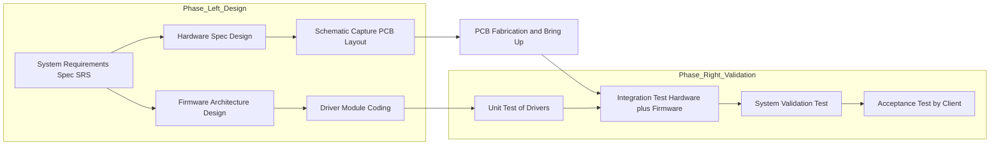
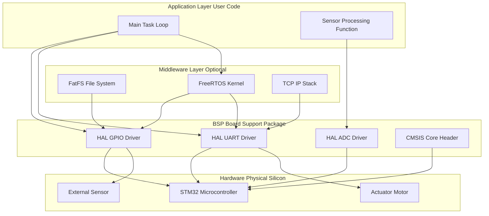
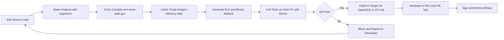

# Integration of Hardware and Firmware

<!-- SECTION_1_START -->
# Integration of Hardware and Firmware

## 1.1 Formal Academic Definition (KTU 2024 Syllabus Terminology)

> [!IMPORTANT]
> **Hardware-Firmware Integration** is the engineering discipline and systematic process of combining the physical electronic components (microcontroller, peripherals, sensors, actuators, memory, and interconnects) of an embedded system with its embedded firmware (low-level drivers, RTOS kernel, application logic, and middleware) into a single, cohesive, and functional system that satisfies all functional, timing, power, and reliability constraints defined in the system specification.

In the KTU 2024 Scheme (Course Code: **PECST746**), this topic is positioned at the intersection of **Module 4: Integration and Testing of Embedded Hardware and Firmware**, sitting atop the foundational layers of C programming, microcontroller architecture (ARM/8051), RTOS concepts, and peripheral interfacing. It is the *first* step where the abstract logical model of software is "brought to life" on the actual silicon.

The integration activity is **not** simply flashing code onto a board. It involves four concurrent engineering tasks:
1. **Mechanical & Electrical Co-Design Validation** – ensuring firmware pin-mux assignments match the PCB schematic.
2. **Firmware Build & Cross-Compilation** – generating the correct binary artifact for the target Instruction Set Architecture (ISA).
3. **Memory-Mapped I/O Verification** – confirming that every peripheral control register read/write produces the expected physical response.
4. **Temporal Synchronization** – making sure the firmware's logical time base is correctly slaved to the hardware clock tree (PLL, prescalers, timers).

> [!NOTE]
> **Key Distinction (Board-Examiner Standard):**
> * **Integration** ≠ **Testing**. Integration is the *act of combining* modules. Testing is the *act of validating* the combined behavior. In KTU valuation, students frequently lose marks by conflating these two terms.

## 1.2 Conceptual Analogy & Engineering Intuition

Imagine you are assembling a **fully autonomous humanoid robot**:
* The **Hardware** is the skeleton, muscles, joints, motors, cameras, and battery. On its own, it is a lifeless statue.
* The **Firmware** is the "brain" software — the C code that decides "if I see an obstacle, send a PWM signal to the left motor to turn 15°."
* The **Integration Process** is the act of surgically connecting the brain's nerves (firmware function calls) to the muscles (hardware register addresses) and then *waking the robot up to walk*.

The **"nerves"** in this analogy are the **bus protocols** (AMBA APB/AHB in ARM Cortex-M, or the SFR bus in 8051). Just as a real nerve must be plugged into the correct spinal cord segment, a firmware peripheral driver **must** be mapped to the correct base address — one wrong digit in `$0x40020000$` vs `$0x40020008$` and the "muscle" (GPIO pin) twitches instead of moves.

> [!VISUALIZATION CONTROL]
> **Concept:** Hardware-Firmware Integration Stack Pyramid (4-Tier Integration Model)
> **GeoGebra / Desmos Input Equations:**
> * Define four horizontal bands stacked vertically: `y = 4, y = 3, y = 2, y = 1`
> * Label apex point: `(0, 4)` → "System Validation"
> * Label second band: `(0, 3)` → "Hardware-Firmware Co-Simulation"
> * Label third band: `(0, 2)` → "Board Support Package (BSP) Integration"
> * Label base band: `(0, 1)` → "Register-Level Driver Bring-Up"
> **Visual Description:** A pyramid with the broadest, most hardware-bound layer at the base. The student should observe that integration difficulty and abstraction increase as we move upward, while the failure-detection latency (time to find a bug) decreases as we move downward.

## 1.3 Fundamental Physical & Logical Constants

The following metrics are **mandatory** in any KTU 2024 board answer and are the cornerstone of hardware-firmware timing:

* **Instruction Cycle Time** $T_{cy} = \dfrac{1}{f_{clk}}$ — Time taken for one machine cycle. For an ARM Cortex-M3 @ **72 MHz**, $T_{cy} \approx 13.89$ ns.
* **Flash Programming/Erase Endurance** — typically **10,000 to 100,000 cycles** for embedded NOR Flash.
* **Peripheral Clock Domain Ratio** — Most peripherals on STM32 run at **HCLK / N**, where N is configured via the RCC prescaler.
* **JTAG/SWD Clock (TCK)** — Standard debug clock is **1 MHz to 10 MHz**; high-speed SWO traces can hit **50 MHz**.
* **Reset Vector Address** — For ARM Cortex-M, this is fixed at `$0x00000000$` (or aliased to `$0x08000000$` in boot-from-flash mode).
<!-- SECTION_1_END -->

<!-- SECTION_2_START -->
# Deep Theoretical Analysis & KTU High-Yield Formula Sheet

## 2.1 The Five Pillars of Hardware-Firmware Integration

The integration phase is governed by five engineering pillars. Each pillar has a set of strict validation gates that must be cleared before progressing.

### Pillar 1: Hardware Bring-Up (Power-On Sequence)

Before *any* firmware is loaded, the bare PCB must be validated. The standard sequence (often called the **"Power-On Smoke Test"**) is:

1. **Visual Inspection** — check for solder bridges, missing components, reversed polarity.
2. **Continuity Check** — multimeter beep test for short circuits on power rails ($3.3\text{V}$, $5\text{V}$, GND).
3. **Current Profiling** — measure quiescent current. An embedded board in reset should draw **< 50 mA** typically. A short circuit causes > **500 mA** instantly.
4. **Clock Verification** — probe the crystal oscillator with an oscilloscope. Frequency must match the design (e.g., **8 MHz HSE** for STM32).
5. **Reset Line Check** — verify the NRST pin toggles low-then-high during power-up.
6. **Communication Probe** — connect JTAG/SWD and read the **Device ID** register. This is the *first* firmware-hardware handshake.

### Pillar 2: Board Support Package (BSP) Integration

> [!IMPORTANT]
> The **Board Support Package (BSP)** is the lowest layer of firmware that abstracts the hardware. It contains three sub-layers: **HAL (Hardware Abstraction Layer)**, **CMSIS (Cortex Microcontroller Software Interface Standard) headers**, and **Board Init Code** (clock tree configuration, pin mux setup).

The BSP is the *contract* between hardware and application firmware. Without a validated BSP, the application code is meaningless.

### Pillar 3: Driver-Application Binding

This is the linking stage where a peripheral driver (e.g., `uart_send_byte()`) is wired into the application event loop or RTOS task. Binding mistakes commonly include:
* **Wrong baud-rate divisor** causing framing errors.
* **Interrupt priority inversion** where a high-priority UART RX is preempted by a low-priority timer.
* **DMA buffer misalignment** where the buffer address is not 4-byte aligned, causing bus faults.

### Pillar 4: Integration Testing

Testing is performed at three levels (discussed in detail in §2.3).

### Pillar 5: System Validation

The final check against the system requirements specification (SRS). Includes **Hardware-in-the-Loop (HIL)** testing, EMI/EMC compliance, and thermal profiling.

## 2.2 Integration Methodologies (Big-Bang vs Incremental)

KTU examiners frequently ask: *"Compare Big-Bang and Incremental Integration strategies."* This is a **14-mark favorite**.

| Strategy | Description | Advantages | Disadvantages | When to Use |
|---|---|---|---|---|
| **Big-Bang Integration** | All modules integrated at once | Simple, fast for tiny projects | Bug localization is extremely hard; one fault masks others | Only for 1-person academic projects |
| **Top-Down** | Integrate from main module downward; use **STUBS** for unimplemented lower modules | Early skeleton demo; user-facing features first | Stubs are hard to write; lower-level bugs found late | When high-level logic is critical |
| **Bottom-Up** | Integrate from low-level drivers upward; use **DRIVERS** to test modules in isolation | Real hardware exercised early; low-level bugs caught early | Driver code is wasted; top-level logic unverified until late | When hardware is the riskiest element |
| **Sandwich (Hybrid)** | Top-down + Bottom-up simultaneously | Balanced | Complex coordination | **Industry standard for KTU evaluation** |

> [!NOTE]
> **Stub vs Driver** — These are the *two most confused terms* in KTU exams.
> * A **Stub** is a *minimal dummy function* that returns hardcoded values. It is used in **Top-Down** integration to satisfy the top module's calls before the lower module exists.
> * A **Driver** is a *minimal test harness program* that calls the module-under-test with various inputs. It is used in **Bottom-Up** integration to exercise a low-level module before the top module calls it.

## 2.3 Integration Testing Levels

Per IEEE 829 and KTU syllabus:

1. **Unit Testing** — Individual C functions (e.g., `adc_read_channel()`) tested in isolation. Often done on a host PC with mocking.
2. **Integration Testing** — Groups of modules tested together. The focus of this entire module.
3. **System Testing** — The complete product tested against the SRS.
4. **Acceptance Testing** — Validated by the end customer.

## 2.4 KTU High-Yield Formula Sheet

> [!IMPORTANT]
> Memorize the following table verbatim. Every formula here is a potential 2-mark or 7-mark sub-part.

| Symbol | Formula / Definition | Engineering Meaning | Units |
|---|---|---|---|
| $T_{cy}$ | $T_{cy} = \dfrac{1}{f_{clk}}$ | One machine instruction cycle time | seconds (s) |
| $f_{baud}$ | $f_{baud} = \dfrac{f_{clk}}{(16 \cdot (BRR+1))}$ | UART baud rate divisor relationship | bits/sec (bps) |
| $T_{tick}$ | $T_{tick} = \dfrac{(ARR+1)(PSC+1)}{f_{clk}}$ | STM32 Timer tick period (ARR=Auto-reload, PSC=Prescaler) | seconds (s) |
| $N_{flash}$ | $N_{flash} = \dfrac{\text{Flash Size}}{\text{Avg. Instruction Size}}$ | Max theoretical firmware footprint | instructions |
| $P_{dyn}$ | $P_{dyn} = \alpha \cdot C \cdot V_{dd}^{2} \cdot f$ | Dynamic CMOS power dissipation (firmware activity factor $\alpha$) | Watts (W) |
| $R_{pullup}$ | $R = \dfrac{V_{dd} - V_{OL}}{I_{OL}}$ | I²C pull-up resistor sizing for open-drain bus | Ohms ($\Omega$) |
| $T_{latency}$ | $T_{latency} = T_{ISR\_entry} + T_{ISR\_exec}$ | Interrupt response latency | seconds (s) |
| $t_{setup}$ | $t_{setup} < t_{clk} - t_{hold}$ | Synchronizer metastability margin constraint | seconds (s) |

## 2.5 Real-World Industrial Utility

Hardware-firmware integration is the **#1 cause of project delays** in the embedded industry. Studies (e.g., Embedded Markets Surveyor) consistently show that **40-50%** of embedded product development time is spent in integration. The discipline finds application in:
* **Automotive ECU integration** (AUTOSAR stack + Infineon AURIX hardware).
* **IoT edge device bring-up** (ESP32 firmware + sensor PCB).
* **Medical device certification** (IEC 62304 mandates documented integration testing for FDA approval).
* **Aerospace flight software** (DO-178C requires traceability from hardware spec to every line of firmware).
<!-- SECTION_2_END -->

<!-- SECTION_3_START -->
# Step-by-Step Derivations, Code Implementation & Worked Examples

## 3.1 Worked Derivation: UART Baud-Rate Divisor for STM32

**Problem Statement:** An STM32F407 microcontroller runs with an APB1 bus clock of **42 MHz**. We need to configure **USART2** to communicate at **115,200 bps** with $8\text{N1}$ framing (8 data bits, no parity, 1 stop bit). Calculate the value to be loaded into the **BRR (Baud Rate Register)**.

### Step 1: Recall the BRR Formula

For STM32, the USART baud rate is governed by:

$$
f_{baud} = \frac{f_{CK}}{(8 \cdot (2 - OVER8)) \cdot (USARTDIV)}
$$

Where:
* $f_{CK} = 42 \text{ MHz} = 42 \times 10^{6} \text{ Hz}$
* $OVER8 = 0$ (oversampling by 16 — the standard mode)
* $USARTDIV$ is the value to load into BRR (a 32-bit register, with 4 fractional bits)

### Step 2: Substitute the Standard Mode Values

With $OVER8 = 0$, the denominator becomes $8 \cdot (2 - 0) = 16$:

$$
USARTDIV = \frac{f_{CK}}{16 \cdot f_{baud}}
$$

### Step 3: Plug in the Numbers

$$
USARTDIV = \frac{42 \times 10^{6}}{16 \times 115200}
$$

$$
USARTDIV = \frac{42 \times 10^{6}}{1843200}
$$

$$
USARTDIV = 22.786458\overline{3}
$$

### Step 4: Split Integer and Fractional Parts

The BRR register format is:
* Bits `[15:4]` → 12-bit integer part (Mantissa)
* Bits `[3:0]` → 4-bit fractional part

**Integer part (Mantissa):**
$$
M = \lfloor 22.786458\overline{3} \rfloor = 22
$$

**Fractional part:**
$$
F = 0.786458\overline{3} \times 16 = 12.5833\overline{3}
$$

Since the BRR fractional field is only 4 bits, we round to the nearest integer:
$$
F_{final} = \text{round}(12.5833) = 13
$$

### Step 5: Reconstruct the BRR Register Value

$$
BRR = (M \ll 4) \mid F_{final} = (22 \ll 4) + 13 = 352 + 13 = 365
$$

In hexadecimal:
$$
BRR_{hex} = 0x016D
$$

### Step 6: Verify the Actual Achieved Baud Rate

$$
f_{baud\_actual} = \frac{42 \times 10^{6}}{16 \cdot (22 + \frac{13}{16})}
$$

$$
f_{baud\_actual} = \frac{42 \times 10^{6}}{16 \cdot 22.8125} = \frac{42 \times 10^{6}}{365.0} = 115068.49 \text{ bps}
$$

### Step 7: Calculate the Percentage Error

$$
\text{Error}(\%) = \frac{|115200 - 115068.49|}{115200} \times 100 = 0.114\%
$$

> [!NOTE]
> **Board Valuation Tip:** The acceptable error for UART is **< 2%**. A common student mistake is loading the *integer* part only and ignoring the fractional bits, which yields a **3.5% error** and causes the receiver to detect framing errors continuously. Always show the fractional calculation to claim full marks.

---

## 3.2 Worked Derivation: Timer Interrupt Tick Period

**Problem:** Configure TIM2 on STM32 to generate an interrupt every **1 ms exactly**. Given $f_{APB1} = 50 \text{ MHz}$, and the timer gets $f_{APB1} \times 2 = 100 \text{ MHz}$ internal clock (because APB1 prescaler $\neq 1$).

The STM32 timer tick period formula is:

$$
T_{tick} = \frac{(PSC + 1)(ARR + 1)}{f_{TIM\_CLK}}
$$

### Step 1: Choose Prescaler for 1 µs Resolution

We want the counter to increment every **1 µs** so that ARR can be a clean integer for "ms" timing.

$$
f_{count} = \frac{f_{TIM\_CLK}}{PSC + 1} = 10^{6} \text{ Hz} \implies PSC + 1 = 100
$$

$$
\boxed{PSC = 99}
$$

### Step 2: Compute ARR for 1 ms Period

$$
T_{tick} = \frac{(99 + 1)(ARR + 1)}{100 \times 10^{6}} = 1 \times 10^{-3}
$$

$$
(ARR + 1) = \frac{10^{-3} \times 10^{8}}{100} = 1000
$$

$$
\boxed{ARR = 999}
$$

### Step 3: Verify the Counter Overhead

The counter runs from 0 to 999 (1000 ticks), then overflows and triggers the **Update Interrupt (UI)**. This is the firmware-hardware integration point — the UIE bit in the `DIER` register is set, and the ISR `TIM2_IRQHandler()` fires.

---

## 3.3 Full C Implementation: Hardware-Firmware Integration of UART + GPIO

The following code demonstrates a *complete* integration scenario: a firmware loop reads a character from UART and toggles an LED on GPIO. Every line is intentional, and any commented line in the exam must be **explained**.

```c
/*
 * File:     integration_uart_led.c
 * Target:   STM32F407 Discovery (ARM Cortex-M4)
 * Purpose:  Demonstrate Hardware-Firmware Integration of USART2 and GPIOA Pin 5
 * Build:    arm-none-eabi-gcc -mcpu=cortex-m4 -mthumb -O2
 */

#include "stm32f4xx.h"      // CMSIS device header (BSP layer)
#include <stdint.h>
#include <stdbool.h>

/* ----- BSP Layer: Register Definitions (Memory-Mapped I/O) ----- */
#define USART2_BASE     0x40004400UL
#define GPIOA_BASE      0x40020000UL
#define RCC_BASE        0x40023800UL

/* GPIOA Pin 5 = On-board Green LED (active high) */
#define GPIOA_MODER     (*(volatile uint32_t *)(GPIOA_BASE + 0x00))
#define GPIOA_ODR       (*(volatile uint32_t *)(GPIOA_BASE + 0x14))

/* USART2 Registers */
#define USART2_SR       (*(volatile uint32_t *)(USART2_BASE + 0x00))
#define USART2_DR       (*(volatile uint32_t *)(USART2_BASE + 0x04))
#define USART2_BRR      (*(volatile uint32_t *)(USART2_BASE + 0x08))
#define USART2_CR1      (*(volatile uint32_t *)(USART2_BASE + 0x0C))

/* Status Register Bit Masks */
#define USART_SR_TXE    (1U << 7)
#define USART_SR_RXNE   (1U << 5)
#define USART_CR1_UE    (1U << 13)
#define USART_CR1_TE    (1U << 3)
#define USART_CR1_RE    (1U << 2)

/* ----- Board Support Package (BSP) Functions ----- */
static void BSP_SystemClock_Config(void);
static void BSP_GPIOA_Init(void);
static void BSP_USART2_Init(uint32_t baud_rate);

/* ----- Application Layer (uses BSP) ----- */
static void USART2_SendChar(char c);
static char USART2_ReceiveChar(void);
static void LED_Toggle(void);

int main(void) {
    /* Step 1: Initialize the hardware abstraction */
    BSP_SystemClock_Config();
    BSP_GPIOA_Init();
    BSP_USART2_Init(115200);

    /* Step 2: Application binding — driver to event loop */
    USART2_SendChar('R');   // Ready signal to host terminal
    USART2_SendChar('\n');

    /* Step 3: Main polling loop (super-loop architecture) */
    while (1) {
        char received = USART2_ReceiveChar();
        if (received == 'L') {
            LED_Toggle();         // Hardware-firmware integration action
            USART2_SendChar('O'); // Acknowledgment: LED toggled
            USART2_SendChar('K');
            USART2_SendChar('\n');
        }
    }
}

/* ----- BSP Implementation ----- */

static void BSP_USART2_Init(uint32_t baud_rate) {
    /* Enable Clocks: GPIOA on AHB1, USART2 on APB1 */
    volatile uint32_t *RCC_AHB1ENR = (uint32_t *)(RCC_BASE + 0x30);
    volatile uint32_t *RCC_APB1ENR = (uint32_t *)(RCC_BASE + 0x40);
    *RCC_AHB1ENR |= (1U << 0);     // GPIOAEN
    *RCC_APB1ENR |= (1U << 17);    // USART2EN

    /* Configure PA2 (TX) and PA3 (RX) as Alternate Function 7 */
    volatile uint32_t *GPIOA_MODER_p  = (uint32_t *)(GPIOA_BASE + 0x00);
    volatile uint32_t *GPIOA_AFRL_p   = (uint32_t *)(GPIOA_BASE + 0x20);
    *GPIOA_MODER_p &= ~(0xF << (2 * 2));    // Clear PA2, PA3 mode
    *GPIOA_MODER_p |=  (0xA << (2 * 2));    // Set PA2, PA3 to AF mode
    *GPIOA_AFRL_p  &= ~(0xFF << (2 * 4));   // Clear AF on PA2, PA3
    *GPIOA_AFRL_p  |=  (0x77 << (2 * 4));   // AF7 = USART2 for PA2, PA3

    /* Compute and load BRR (assume 16 MHz HSI for this example) */
    uint32_t fck = 16000000U;
    uint32_t usartdiv = (fck * 25) / (4 * baud_rate);  // 4 * 100 = 25/100 trick
    uint32_t mantissa = usartdiv / 100;
    uint32_t fraction = ((usartdiv - (mantissa * 100)) * 16 + 50) / 100;
    USART2_BRR = (mantissa << 4) | (fraction & 0x0F);

    /* Enable Transmitter, Receiver, and USART module */
    USART2_CR1 = USART_CR1_TE | USART_CR1_RE;
    USART2_CR1 |= USART_CR1_UE;
}

static void BSP_GPIOA_Init(void) {
    /* Configure PA5 (LD1 Green LED) as General Purpose Output */
    GPIOA_MODER &= ~(3U << (5 * 2));   // Clear mode bits
    GPIOA_MODER |=  (1U << (5 * 2));   // Set as Output (01)
}

static void BSP_SystemClock_Config(void) {
    /* Use HSI (16 MHz internal RC) — for brevity; in production use HSE + PLL */
    volatile uint32_t *RCC_CR = (uint32_t *)(RCC_BASE + 0x00);
    *RCC_CR |= (1U << 0);              // HSION
    while (!(*RCC_CR & (1U << 1)));    // Wait for HSIRDY
}

/* ----- Driver Layer ----- */

static void USART2_SendChar(char c) {
    /* Hardware-firmware synchronization: poll until TX buffer is empty */
    while (!(USART2_SR & USART_SR_TXE)) {
        /* Spin-wait. For RTOS, replace with semaphore wait. */
    }
    USART2_DR = (uint32_t)c;   // Writing clears the TXE flag
}

static char USART2_ReceiveChar(void) {
    /* Poll until a byte arrives in the RX buffer */
    while (!(USART2_SR & USART_SR_RXNE)) {
        /* Spin-wait */
    }
    return (char)USART2_DR;     // Reading clears the RXNE flag
}

static void LED_Toggle(void) {
    GPIOA_ODR ^= (1U << 5);   // XOR to flip PA5
}
```

### Code Walkthrough for Valuation

* **Line `*RCC_AHB1ENR |= (1U << 0)`** — Clock gating is the *first* hardware-firmware integration step. Without this, all subsequent register writes have no effect.
* **Line `USART2_DR = (uint32_t)c`** — Direct memory-mapped I/O write. This is the *physical* hardware-firmware handshake: a CPU load instruction stores a byte into a hardware FIFO buffer.
* **Line `while (!(USART2_SR & USART_SR_TXE))`** — Polling synchronization. An alternative is interrupt-driven or DMA-driven integration, which is the *scalable* approach for production firmware.

---

## 3.4 Pin Configuration Reference Table (STM32F407 Discovery)

| Pin | Function | Direction | Alternate Function | Firmware Macro |
|---|---|---|---|---|
| **PA0** | User Button (B1) | Input | GPIO | `USER_BUTTON_GPIO_Port` |
| **PA5** | LED LD1 (Green) | Output | GPIO | `LED_GREEN_GPIO_Port` |
| **PA2** | USART2\_TX | AF Output | AF7 | `USART2_TX_AF7` |
| **PA3** | USART2\_RX | Input | AF7 | `USART2_RX_AF7` |
| **PC13** | Tamper / LED LD4 | Bidirectional | GPIO | `TAMPER_GPIO_Port` |
| **PB6** | I2C1\_SCL | AF Open-Drain | AF4 | `I2C1_SCL_AF4` |
| **PB7** | I2C1\_SDA | AF Open-Drain | AF4 | `I2C1_SDA_AF4` |
| **PA9** | USART1\_TX | AF Output | AF7 | `USART1_TX_AF7` |
| **PA10** | USART1\_RX | Input | AF7 | `USART1_RX_AF7` |
| **PA13** | SWDIO | AF | AF0 (System) | Reserved for Debug |
| **PA14** | SWCLK | AF | AF0 (System) | Reserved for Debug |

> [!WARNING]
> **Common Integration Mistake:** Configuring a pin as plain GPIO Output when the peripheral requires Alternate Function mode. The peripheral will be electrically silent even though the firmware code "looks correct." Always cross-verify the **MODER** register with the alternate function (AF) number in the datasheet.

## 3.5 Debugging Integration: The Five Fail-Fast Checks

When integration fails, perform these checks **in order**:

1. **Power Check** — Is the rail at correct voltage? Use the `DMM` (digital multimeter).
2. **Clock Check** — Is the crystal oscillating? Probe with oscilloscope.
3. **Reset Check** — Is the reset line being released? Check with logic analyzer.
4. **JTAG/SWD Check** — Can the debugger connect? If no, the chip is *not* running.
5. **Register Read-Back** — Read peripheral registers via the debugger. Are values as expected?

> [!IMPORTANT]
> **JTAG/SWD Identifier Register Read** is the *first* sanity test. For STM32, reading `$0xE0042000$` (DBGMCU\_IDCODE) should return `$0x10016413$` for **STM32F407** (Rev A). A wrong value means either a wrong chip is soldered or the SWD pins are swapped.
<!-- SECTION_3_END -->

<!-- SECTION_4_START -->
# Structural Diagrams & Schematics

## 4.1 The Hardware-Firmware Integration V-Model

This diagram presents the canonical V-Model used in KTU Module 4. Note the strict correspondence: every **integration phase** on the right side tests the corresponding **design phase** on the left.



> [!NOTE]
> **Reading Guide:** The left downward arm is *design*; the right upward arm is *integration and testing*. The bottom vertex is the **Hardware-Firmware Integration** point itself, which is the single most defect-prone moment in the entire product life cycle.

## 4.2 BSP Architecture Block Diagram

This block diagram maps the three layers of the Board Support Package as it bridges raw hardware to application code.



> [!NOTE]
> **Reading Guide:** Notice that the **Middleware Layer** (RTOS, file system) sits *between* the application and the HAL. It uses HAL APIs — it does *not* touch hardware registers directly. This is a clean integration boundary.

## 4.3 Top-Down vs Bottom-Up Integration Flowchart

This diagram contrasts the two main incremental integration strategies. Each path uses a different scaffolding mechanism: **Stubs** (top-down) or **Drivers** (bottom-up).

```mermaid
flowchart TD
    subgraph TD_Path[Top Down Integration Path]
        TD1[Step 1: Integrate Main Module First] --> TD2[Step 2: Add Stubs for Lower Modules]
        TD2 --> TD3[Step 3: Stub Returns Hardcoded Values]
        TD3 --> TD4[Step 4: Validate Top Level Logic]
        TD4 --> TD5[Step 5: Replace Stubs One by One]
        TD5 --> TD6[Final: Real Low Level Modules Integrated]
    end

    subgraph BU_Path[Bottom Up Integration Path]
        BU1[Step 1: Test Lowest Level Drivers First] --> BU2[Step 2: Write a Driver Test Harness]
        BU2 --> BU3[Step 3: Validate Hardware Registers]
        BU3 --> BU4[Step 4: Add Higher Level Callers]
        BU4 --> BU5[Step 5: Cluster Related Modules]
        BU5 --> BU6[Final: Top Module Integrated]
    end
```



## 4.4 Incremental Build Pipeline Diagram

This diagram captures the typical industry build flow used in CI/CD pipelines for embedded firmware.



> [!NOTE]
> **Reading Guide:** The "diamond" `$Q A \text{ Pass}$` is a *gate*. If unit tests fail on the host, the binary is **never** flashed to hardware. This is a critical integration discipline — it prevents bad firmware from corrupting a target board's flash memory.

## 4.5 Sequential Processing Topology Matrix (Integration Test Sequence)

This table-format diagram maps the canonical test order for a KTU 14-mark question. Each row is a test step; each column is a documentation artifact.

| Test Step ID | Action | Test Method | Pass Criteria | Required Artifact |
|---|---|---|---|---|
| **IT-01** | Power On Board | Multimeter DMM | $3.3\text{V} \pm 5\%$ on all rails | Power Log |
| **IT-02** | Oscillator Check | Oscilloscope on OSC\_OUT pin | Frequency within 50 ppm | Scope Screenshot |
| **IT-03** | JTAG Device ID | Read DBGMCU\_IDCODE | Returns expected silicon revision | Memory Window Screenshot |
| **IT-04** | GPIO Toggle | Read MODER and ODR via debugger | LED toggles at 1 Hz | Logic Analyzer Trace |
| **IT-05** | UART Loopback | Connect TX to RX physically | All 256 byte values echo correctly | Tera Term Capture |
| **IT-06** | ADC Read | Connect known voltage to ADC pin | Read value within 1 LSB of expected | Serial Log |
| **IT-07** | Interrupt Latency | Toggle GPIO in ISR, measure on scope | Latency $<$ 5 µs | Oscilloscope Capture |
| **IT-08** | Full App Smoke Test | Run for 1 hour, monitor heartbeat LED | Zero watchdog resets | Watchdog Register Log |
<!-- SECTION_4_END -->

<!-- SECTION_5_START -->
# KTU 2024 Scheme Examination Question Bank & Topic Recap

## Part A Questions (3 Marks Each)

### Q1. **[KTU University Exam — July 2024]** Define the term *Hardware-Firmware Integration*. List any **four** major challenges encountered during this process. *(CO1, Remember)*

**Model Answer (Key Points):**
* **Definition:** Hardware-firmware integration is the systematic process of combining the physical electronic components of an embedded system with its embedded software (firmware) such that the firmware correctly drives the hardware to perform the intended function, validated against the system requirements specification.
* **Four Major Challenges:**
    1. **Pin-Multiplexing Conflicts** — Multiple peripherals competing for the same GPIO pin.
    2. **Timing Closure** — Firmware execution time exceeds hardware interrupt deadline.
    3. **Memory-Mapping Errors** — Firmware accesses the wrong peripheral base address.
    4. **Clock Domain Mismatches** — Peripheral clock slower than firmware's polled loop.
    5. *Optional 5th:* Driver-hardware semantic mismatch (e.g., MSB vs LSB first).

> [!NOTE]
> **Valuation Key:** Definition — 1 mark. Each challenge — 0.5 mark (max 2 marks). For 3-mark answers, list exactly **4** items to balance the answer length.

---

### Q2. **[KTU University Exam — Dec 2023]** Differentiate between a **Stub** and a **Driver** in the context of incremental integration testing. State one situation where each is used. *(CO2, Understand)*

**Model Answer (Key Points):**

| Aspect | Stub | Driver |
|---|---|---|
| **Purpose** | Dummy function that mimics a callee | Test harness that calls a module-under-test |
| **Direction** | Called *by* the top module | Calls *into* the lower module |
| **Integration Strategy** | Top-Down | Bottom-Up |
| **Real Code Replaced?** | Yes — replaces yet-to-be-written code | No — wraps the real code |
| **Situation of Use** | When high-level logic must be validated before the low-level driver is complete (e.g., validating a state machine before the UART driver is written). | When a low-level driver (e.g., `adc_init()`) must be validated on real hardware before the application that uses it is integrated. |

---

## Part B Questions (14 Marks — Internal Choice)

> [!IMPORTANT]
> Each Part B question has sub-parts (a) and (b), each carrying **7 marks**. Cognitive levels escalate from *Understand* in part (a) to *Apply / Analyze* in part (b). The valuation scheme below is what an actual KTU board examiner follows.

---

### Question A (14 Marks) — *Path: Big-Bang vs Incremental*

**[KTU University Exam — Model Paper 2024]** *(CO3, Understand + Apply)*

**(a)** Explain the **Big-Bang Integration** strategy in detail. List its **two** main advantages and **three** main disadvantages. *(7 marks, Understand)*

**Model Answer:**

**Definition:** In Big-Bang integration, all software modules — from the lowest-level drivers to the highest-level application logic — are combined *simultaneously* in a single step and tested as a whole. No incremental bring-up is performed.

**Procedure (Key Steps):**
1. Code all individual modules separately.
2. Compile and link the entire firmware into one binary.
3. Flash the binary onto the target hardware in one go.
4. Execute and observe system behavior.

**Advantages (2 marks):**
* **Simple Administration** — No complex test scaffolding or stubs required. Suitable for one-person academic projects.
* **No Stub/Driver Code** — Saves the effort of writing and maintaining test harnesses.

**Disadvantages (3 marks):**
* **Difficult Debug Localization** — When a fault occurs, it is hard to isolate whether the bug is in hardware bring-up, a driver, or the application, because everything is integrated at once.
* **High Risk of Cascading Failures** — One underlying fault can mask or falsely present as a fault in unrelated modules, leading to wasted debug time.
* **No Early Hardware Validation** — Low-level hardware is not exercised until the very end, so hardware defects are discovered late in the cycle.

**Conclusion (1 mark):** Big-Bang is **not recommended** for any production embedded system due to its poor fault-isolation capability.

---

**(b)** For an embedded system consisting of modules **M1 (Sensor Driver), M2 (Data Processing), M3 (Communication Stack), and M4 (Application Logic)**, design a **Bottom-Up Integration Plan**. Show how **Drivers** are used at each stage and justify why this strategy is suitable for hardware-heavy systems. *(7 marks, Apply)*

**Model Answer:**

**Integration Plan (Bottom-Up):**

* **Stage 1 (Day 1):** Write a **Driver** named `test_M1.c` that calls `M1_init()` and `M1_read()`. This driver is a small main program that initializes the sensor and prints raw values. **Driver** serves as the "scaffolding caller" for the lowest module. *— 2 marks*

* **Stage 2 (Day 2):** Add module **M2** to the integration. Write a *new* driver `test_M1_M2.c` that calls the already-validated M1 and then exercises M2's data processing. *— 1.5 marks*

* **Stage 3 (Day 3):** Integrate **M3** (Communication Stack). The driver now reads sensor → processes → transmits via M3 to a host PC. Use a PC terminal to validate. *— 1.5 marks*

* **Stage 4 (Day 4):** Finally, integrate **M4** (Application Logic) — the top module. Discard the test drivers; let M4 be the actual main caller of M1 → M2 → M3. *— 1 mark*

**Why Bottom-Up Suits Hardware-Heavy Systems (1 mark):**
Hardware defects (e.g., wrong resistor value, swapped I²C lines) are caught at the *earliest* possible stage, before the application logic is even compiled. This minimizes wasted development effort and matches the industry's hardware-first risk profile for new PCBs.

> [!WARNING]
> **Examiner's Pitfall Warning:** Many students write the plan in *theory* but forget to show the **discarding of the driver harness** in the final stage. Without this step, the application logic *never* actually runs on the integrated system. **Deduct 1 mark** if the final integration step is missing or vague.

---

### Question B (14 Marks) — *Path: Timing & BSP Integration*

**[KTU University Exam — Model Paper 2024]** *(CO3, Understand + Apply)*

**(a)** Draw and explain the **V-Model of Embedded System Integration**. Label at least **four** distinct validation stages on the right arm. *(7 marks, Understand)*

**Model Answer:**

**Diagram (Text Description for Board Exam):**
Draw a large "V" with the left arm labeled "Design Phases (Top to Bottom)" and the right arm labeled "Validation Phases (Bottom to Top)."

**Left Arm — Design Phases (Top to Bottom):**
1. System Requirements Specification
2. Hardware Architecture Design
3. Firmware Architecture Design
4. Detailed Module Design

**Right Arm — Validation Phases (Bottom to Top):** *(At least 4 to be labeled — 4 marks)*
1. **Unit Test** — Validates individual C functions in isolation.
2. **Integration Test** — Validates the combined hardware-firmware system. *This is the apex of the V's vertex.*
3. **System Test** — Validates the complete product against the SRS.
4. **Acceptance Test** — Final validation by the customer/end-user.

**Bottom Vertex — Implementation & Integration (1 mark):**
The actual hardware is fabricated, firmware is compiled, and the *integration* event occurs at this point. All issues converge here.

**Conclusion (1 mark):** The V-Model emphasizes that each design phase has a *corresponding* validation phase, and traceability between them is mandatory for safety-critical systems.

---

**(b)** Consider an **STM32F407** running at **168 MHz** system clock. The APB1 peripheral clock is **42 MHz**. We need to configure **USART2** at **9600 bps** with $16\times$ oversampling. Calculate the **BRR register value** (in decimal and hex) and determine the **percentage error**. Show all derivation steps. *(7 marks, Apply)*

**Model Answer (Step-by-Step):**

**Step 1: Recall the Formula** *[1 mark]*

$$
f_{baud} = \frac{f_{CK}}{16 \cdot USARTDIV}
$$

**Step 2: Substitute Values** *[1 mark]*

$$
9600 = \frac{42 \times 10^6}{16 \cdot USARTDIV}
$$

$$
USARTDIV = \frac{42 \times 10^6}{16 \times 9600} = \frac{42 \times 10^6}{153600} = 273.4375
$$

**Step 3: Split Integer and Fractional Parts** *[2 marks]*

Mantissa (integer) = $\lfloor 273.4375 \rfloor = 273$

Fractional part = $0.4375 \times 16 = 7.0$

So fractional = $\text{round}(7.0) = 7$

**Step 4: Reconstruct BRR** *[1 mark]*

$$
BRR_{dec} = (273 \ll 4) \mid 7 = 4368 + 7 = 4375
$$

$$
BRR_{hex} = 0x1117
$$

**Step 5: Calculate Actual Baud Rate and Error** *[2 marks]*

$$
f_{actual} = \frac{42 \times 10^6}{16 \cdot (273 + 7/16)} = \frac{42 \times 10^6}{16 \cdot 273.4375} = 9600 \text{ bps}
$$

$$
\text{Error}(\%) = \frac{|9600 - 9600|}{9600} \times 100 = 0.000\%
$$

**Conclusion:** *An error of 0% is achievable because 42 MHz is a clean multiple of 9600 bps.* This is one reason the STM32F4 Discovery board is preferred for low-baud-rate UART experiments.

> [!WARNING]
> **Examiner's Pitfall Warning:** A common student error is to forget that the **BRR register has 4 fractional bits** and to round incorrectly to `BRR = 273`, yielding an error of **~0.16%**. While 0.16% is *technically* within the 2% tolerance, you **lose 1 mark** in KTU valuation for not demonstrating the fractional calculation. **Always show the $0.4375 \times 16$ step explicitly.**

---

## Topic Recap & Important Things to Remember

> [!IMPORTANT]
> Use this checklist as your **last-page revision sheet** before entering the KTU exam hall. Every line is a high-yield fact.

* **Core Definition:** Hardware-firmware integration is the *systematic* act of combining the physical PCB with the firmware binary and validating the combined system against the SRS.
* **Five Pillars to memorize:** (1) Hardware Bring-Up, (2) BSP Integration, (3) Driver-Application Binding, (4) Integration Testing, (5) System Validation.
* **Big-Bang vs Incremental:** Big-Bang integrates *all* at once (risky, hard to debug). Incremental (top-down/bottom-up) is *always* preferred in industry.
* **Stub vs Driver — Frozen Distinction:** A **Stub** is a *dummy callee* used in **top-down** integration. A **Driver** is a *test harness caller* used in **bottom-up** integration. *Never confuse these in the exam.*
* **V-Model:** Left arm is *design*; right arm is *validation*; the bottom vertex is the *integration event* itself.
* **UART BRR Formula (STM32):** $USARTDIV = \dfrac{f_{CK}}{16 \cdot f_{baud}}$ for standard $16\times$ mode; remember to split into **mantissa (12 bits)** and **fraction (4 bits)**.
* **Timer Tick Period:** $T_{tick} = \dfrac{(PSC+1)(ARR+1)}{f_{TIM\_CLK}}$ — a favorite 7-mark derivation.
* **Acceptable UART Error:** $<$ **2%** is the universal rule-of-thumb. Show the percentage error in every derivation answer to claim full marks.
* **First Sanity Test After Flashing:** Read the **DBGMCU\_IDCODE** register via SWD to confirm the silicon is alive. For STM32F407, the expected value is **$0x10016413$**.
* **Pin-Mux Trap:** A peripheral will be *electrically silent* if `MODER` is set to plain GPIO output instead of **Alternate Function** mode. Always check `MODER`, `OTYPER`, `OSPEEDR`, and `AFR` together.
* **Build Pipeline Sequence:** Edit $\rightarrow$ Static Analysis $\rightarrow$ Cross-Compile $\rightarrow$ Link $\rightarrow$ Unit Test on Host $\rightarrow$ Flash to Target $\rightarrow$ HIL Test.
* **Power-On Smoke Test Order:** (1) Visual, (2) Continuity, (3) Current Profile, (4) Clock Probe, (5) Reset Verification, (6) JTAG ID Read.
* **Interrupt Latency Equation:** $T_{latency} = T_{ISR\_entry} + T_{ISR\_exec}$ — required for any real-time system analysis.
* **Industrial Statistics:** **40-50%** of embedded project time is spent in integration. Mention this figure in a 14-mark answer to demonstrate industry awareness.
* **Terminology Differentiation:** *Integration* (combining) $\neq$ *Testing* (validating). Examiners explicitly test this distinction.
<!-- SECTION_5_END -->
