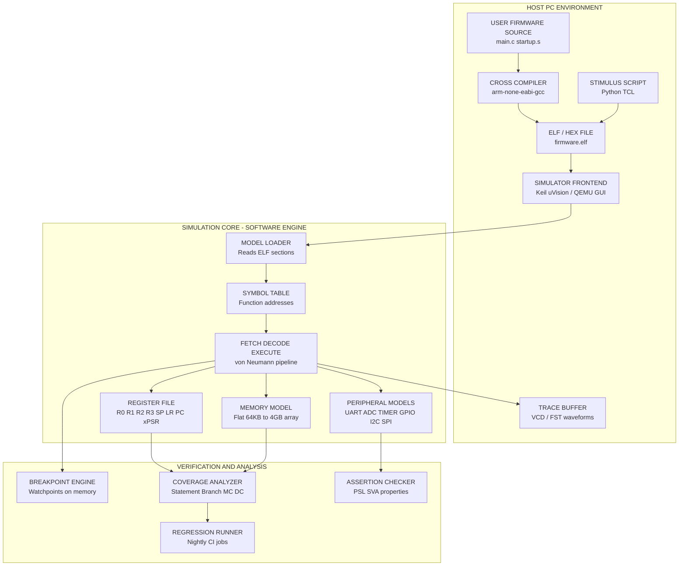
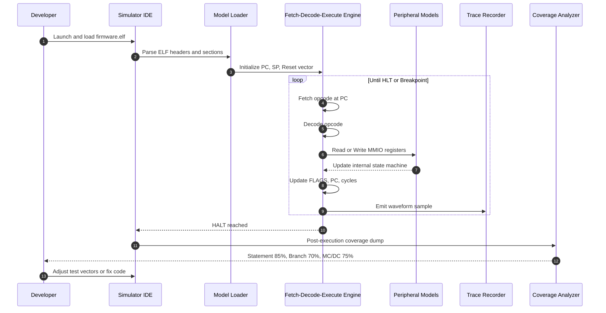
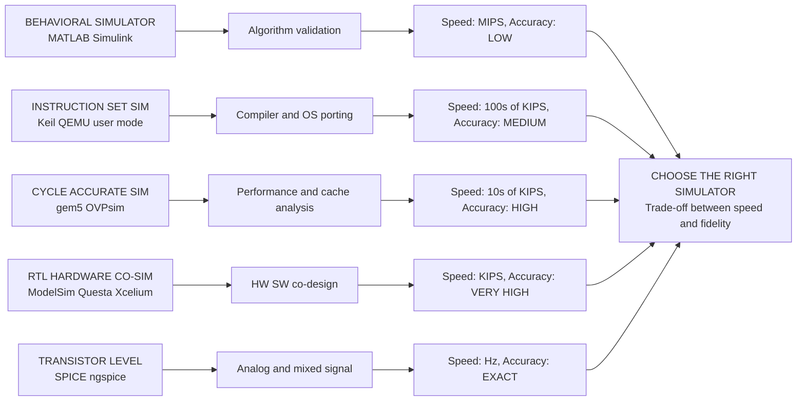
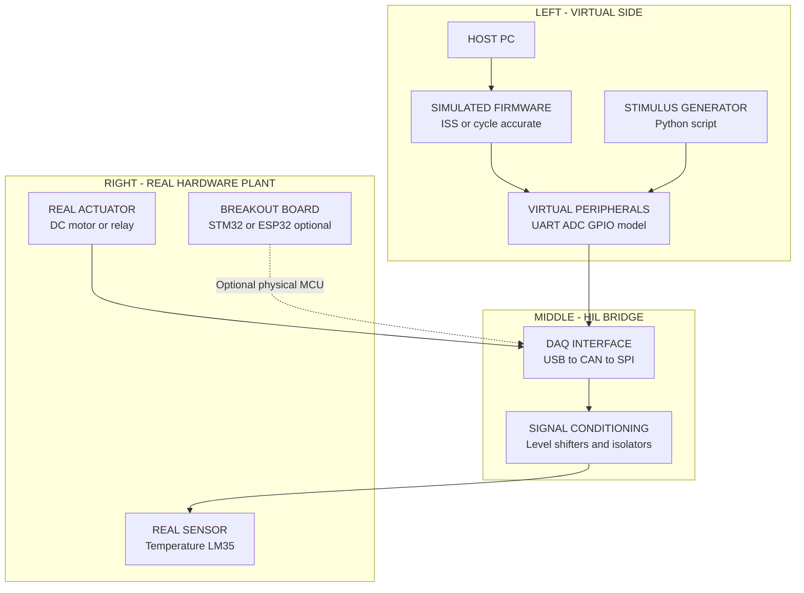

# Simulators

<!-- SECTION_1_START -->
# Simulators in Embedded Systems — Core Technical Definition & Intuitive Overview

> [!IMPORTANT]
> **KTU 2024 Scheme — PECST746 (Embedded Systems) | Module 4 | Topic: Simulators**
> This topic is a high-yield area for **ESE (End Semester Evaluation)** under CO3 / CO4 and frequently appears as a 7-mark or 14-mark analytical question.

## 1.1 Formal Academic Definition

In the context of the **APJ Abdul Kalam Technological University (KTU) 2024 Scheme** syllabus, a **Simulator** in an embedded system is defined as a *host-based software emulation environment that models the functional, temporal, and electrical behavior of a target microcontroller, microprocessor, System-on-Chip (SoC), or peripheral hardware* — purely through mathematical abstractions and software constructs running on a general-purpose computer.

> [!NOTE]
> **Syllabus-Standard Definition (PECST746 / M4):**
> "A simulator is a purely software-based modeling tool that imitates the execution of embedded firmware, instruction-set semantics, peripheral register maps, and bus transactions of a target hardware platform, without requiring the actual physical hardware to be present in the development loop."

The three pillars of any embedded simulator are:
1. **Functional Fidelity** — Does each instruction, register, and flag behave *exactly* like the real silicon?
2. **Temporal Fidelity** — Are cycle counts, interrupt latencies, and bus timings reproduced accurately?
3. **Peripheral Fidelity** — Are on-chip peripherals (UART, ADC, Timers, GPIO, $I^2C$, SPI) modeled with correct register-level behavior?

## 1.2 Conceptual Analogy — "The Cockpit Trainer"

Imagine you are training to fly a **Boeing 737**. You cannot afford to crash a real aircraft worth **\$120 Million** during practice. Instead, you sit inside a **full-motion cockpit replica** that:
- Has identical switches, gauges, and throttles
- Responds to your inputs in real-time
- Fakes weather, turbulence, and engine failure
- Tracks every action and reports deviations

That cockpit trainer is, in spirit, an **embedded simulator**. Your firmware is the "pilot," the simulator is the "cockpit," and the real target board is the "actual aircraft." The pilot **learns, validates, and debugs** the entire flight plan in the simulator long before the first hardware prototype is powered on.

> [!TIP]
> **One-Line Mnemonic:** A simulator lets you *touch* hardware that doesn't physically exist yet — and it never blows up when your code has a bug in it.

## 1.3 Physical Constants and Standard Metrics

The following constants and metrics are universally used to characterize embedded simulators in the KTU evaluation key:

| Metric | Standard Value / Symbol | Description |
| :--- | :--- | :--- |
| Target Clock Frequency ($f_{clk}$) | **MHz to GHz** range | The real silicon's oscillator speed being emulated |
| Host Clock Frequency ($f_{host}$) | **2.0 – 5.0 GHz** (typical desktop CPU) | Speed of the PC running the simulator |
| Simulation Speed Factor ($S_f$) | $S_f = \dfrac{T_{simulated}}{T_{host}}$ | Ratio of simulated time to real wall-clock time |
| Instruction Cycle Time ($T_{cyc}$) | $T_{cyc} = \dfrac{1}{f_{clk}}$ | Time taken per instruction on target |
| Instruction-Level Simulation (ILS) Speed | **10 – 500 KIPS** | Kilo-Instructions-Per-Second on host |
| Typical Simulator Memory Footprint | **50 MB – 2 GB** | RAM consumed by the simulator process |

## 1.4 Classification of Simulators (Foundation)

Simulators are classified along **three orthogonal axes** in the KTU syllabus:

> [!NOTE]
> **Axis 1 — Granularity of Modeling:**
> - *Behavioral / Functional Simulators* — black-box modeling (e.g., MATLAB/Simulink)
> - *Register-Transfer Level (RTL) Simulators* — ModelSim, Questa, Vivado XSim
> - *Instruction-Set Simulators (ISS)* — Keil µVision Simulator, QEMU-user
> - *Cycle-Accurate / Full-System Simulators* — gem5, OVPsim, Simics
>
> **Axis 2 — Target Architecture:**
> - *Microcontroller Simulators* (8051, ARM Cortex-M, AVR, PIC)
> - *Microprocessor Simulators* (ARM Cortex-A, x86, RISC-V)
> - *SoC / Multi-core Simulators* (Zynq-7000, ESP32, STM32)
>
> **Axis 3 — License & Deployment Model:**
> - *Commercial* (Synopsys VCS, Cadence Xcelium)
> - *Open-Source* (QEMU, gem5, Renode)
> - *Vendor-Bundled* (STM32CubeIDE Simulator, MPLAB X SIM)

## 1.5 Why Simulators are Indispensable in KTU Projects

In your **Mini-Project (Phase-I and Phase-II)** and **Main Project**, you will almost always face one of three situations:
1. The target board (e.g., STM32 Nucleo, ESP32-DevKit) is out of stock or unavailable.
2. The hardware is physically present but the firmware crashes a peripheral you cannot probe with an oscilloscope.
3. You need reproducible, deterministic test cases for **Continuous Integration (CI)**.

A simulator resolves all three concerns, which is why it is **non-negotiable** in any professional embedded firmware workflow.

> [!VISUALIZATION CONTROL]
> **Concept:** Simulator Speed vs. Fidelity Trade-off Curve
> **Plot Type:** Monotonically decreasing curve on a 2-D Cartesian plane
> **Conceptual Equations:**
> * X-axis (Horizontal) = Modeling Granularity (Behavioral $\rightarrow$ Transistor-level)
> * Y-axis (Vertical) = Simulation Speed (KIPS, instructions per second)
> * Curve Family: $S_{f}(g) = k \cdot g^{-n}$ where $g$ = granularity depth, $n \approx 1.5$, $k$ = tool constant
> **Visual Description:** As the X-axis moves rightward (deeper modeling — from black-box behavioral to transistor SPICE-level), the Y-axis value (speed) drops sharply. Behavioral simulators run in millions of IPS, while cycle-accurate full-system simulators may run in tens of KIPS.
<!-- SECTION_1_END -->

<!-- SECTION_2_START -->
# Simulators — Deep Theoretical Analysis & KTU High-Yield Formula Sheet

## 2.1 Internal Architecture of an Embedded Simulator

Every KTU-recommended simulator (commercial or open-source) is internally decomposed into **five modular layers**. Understanding this layered model is essential for answering 14-mark design questions.

### Layer 1 — *Model Loader / Parser*
- Reads the target firmware object file (`.elf`, `.hex`, `.axf`, `.out`).
- Builds an in-memory symbol table mapping every function and variable to its address.
- Validates the **linker script** and **vector table** offsets.
- Example: `arm-none-eabi-readelf -a firmware.elf` is the underlying mechanism.

### Layer 2 — *Fetch / Decode / Execute Engine*
The classical **von Neumann pipeline** is emulated in software:
- **Fetch:** Reads the next instruction word from simulated program counter $PC$.
- **Decode:** Decodes the opcode + operands using the ISA specification.
- **Execute:** Updates simulated registers, flags, memory, and program counter.

### Layer 3 — *Register File and Memory Model*
- Implements the target's exact register layout (e.g., ARM Cortex-M3 has **R0–R12, R13 (SP), R14 (LR), R15 (PC), xPSR**).
- A flat byte-addressable memory array is maintained.
- Stack and heap regions are tracked via a *Memory Management Unit (MMU)* shim.

### Layer 4 — *Peripheral Behavioral Models*
Each peripheral is a **C/C++ class** that exposes:
- The exact **Memory-Mapped Register Map** (offset, reset value, read/write access).
- A **state machine** representing its current operating mode.
- An **interrupt line** that the engine polls each cycle.

> [!EXAMPLE]
> A simulated `USART1` peripheral on STM32 will have a `DR` register at offset `0x04` from base `0x40011000`. When firmware writes to `DR`, the simulator models the **baud-rate timing** and places the byte in a virtual TX buffer that the host can inspect.

### Layer 5 — *Trace, Breakpoint, and Stimulus Interface*
- Supports breakpoints, watchpoints, single-stepping.
- Generates waveforms (VCD, FST, or proprietary trace formats).
- Exposes a **TCL/Python scripting interface** for test automation.

## 2.2 Levels of Simulation Fidelity (Critical for 14-Mark Questions)

| Level | Also Known As | Speed | Accuracy | Typical Use |
| :--- | :--- | :--- | :--- | :--- |
| L1 — Functional | Black-box / Behavioral | **Very High** (MIPS) | Low | Algorithm validation, early software bring-up |
| L2 — Instruction-Accurate | ISS | High (100s of KIPS) | Medium | Compiler validation, OS porting |
| L3 — Cycle-Accurate | Micro-architectural | Medium (10s of KIPS) | High | Performance tuning, cache analysis |
| L4 — Bit-Accurate / RTL | Hardware co-simulation | Low (KIPS) | Very High | Hardware/software co-design |
| L5 — Transistor-Level | SPICE | Very Low (Hz) | Exact | Analog/mixed-signal verification |

## 2.3 The Core Mathematical Model — Simulation Speed Factor

The single most important formula for any KTU numerical/analytical question on simulators is the **Simulation Speed Factor**:

$$S_{f} \;=\; \frac{T_{simulated}}{T_{host}} \;=\; \frac{N_{inst} \cdot CPI_{sim}}{f_{host}}$$

Where:
- $N_{inst}$ = Total number of target instructions to be simulated
- $CPI_{sim}$ = Average cycles-per-instruction as observed on the *host* (NOT target)
- $f_{host}$ = Host CPU clock frequency in **Hz**

> [!IMPORTANT]
> **KTU Pitfall Trap:** Students often confuse $CPI_{sim}$ (host's cycles per simulated instruction) with $CPI_{target}$ (target hardware's cycles per instruction). They are **different quantities**. $CPI_{sim}$ is typically **50× to 1000× larger** than $CPI_{target}$.

### Derivation of the Real-Time Simulation Threshold

For *real-time* simulation, we require $S_{f} = 1$, i.e., one second of simulated time must complete in one second of wall-clock time. This gives us the **Minimum Host Performance** required:

$$f_{host,min} \;=\; N_{inst} \cdot CPI_{sim,target} \cdot f_{target}$$

If your host is slower than this threshold, the simulator will run **slower than real-time**, which is normal for cycle-accurate simulators and acceptable for most embedded development.

## 2.4 Coverage Metrics for Simulation-Based Verification

In KTU Module-4 questions on **integration and testing**, you will encounter coverage metrics:

$$\text{Statement Coverage} \;=\; \frac{S_{executed}}{S_{total}} \times 100\%$$

$$\text{Branch Coverage} \;=\; \frac{B_{taken}}{B_{total}} \times 100\%$$

$$\text{MC/DC Coverage} \;=\; \frac{\text{Unique condition-decision pairs verified}}{\text{Total condition-decision pairs}} \times 100\%$$

> [!NOTE]
> **MC/DC (Modified Condition / Decision Coverage)** is the gold standard in **DO-178C (Aerospace)** and **ISO 26262 (Automotive)** certifications and is frequently cited in advanced KTU electives.

## 2.5 KTU High-Yield Formula Sheet

| # | Formula / Concept | Expression | Engineering Utility |
| :--- | :--- | :--- | :--- |
| 1 | Simulation Speed Factor | $S_{f} = \dfrac{N_{inst} \cdot CPI_{sim}}{f_{host}}$ | Estimating how slow/fast simulation will be |
| 2 | Target Cycle Time | $T_{cyc} = \dfrac{1}{f_{clk}}$ | Per-instruction timing budget |
| 3 | Real-Time Threshold | $f_{host,min} = N_{inst} \cdot CPI_{sim} \cdot f_{target}$ | Minimum host CPU to keep pace with target |
| 4 | Statement Coverage | $C_{stmt} = \dfrac{S_{ex}}{S_{tot}} \cdot 100\%$ | Software QA metric |
| 5 | Branch Coverage | $C_{br} = \dfrac{B_{ex}}{B_{tot}} \cdot 100\%$ | Logical path verification |
| 6 | MC/DC Coverage | $C_{MC/DC} = \dfrac{P_{unique}}{P_{total}} \cdot 100\%$ | Safety-critical certification |
| 7 | Stimulus Latency | $L_{stim} = T_{setup} + T_{prop} + T_{response}$ | Real-time I/O modeling accuracy |
| 8 | Interrupt Latency (Sim) | $L_{IRQ} = N_{cycles,pipeline} \cdot T_{cyc,sim}$ | Worst-case IRQ response in sim |

## 2.6 Real-World Engineering Utility

Simulators are **production-critical** in the following domains:

1. **Automotive ECU Development** — Before a Bosch or Continental ECU is connected to a real CAN bus, it is validated on a **dSPACE / Vector VT System** simulator running **10,000+ virtual test scenarios**.
2. **Aerospace Flight Control** — DO-178C Level-A software cannot be field-tested in all weather conditions; cycle-accurate simulators fill the gap.
3. **Mobile SoC Design** — Apple A-series and Qualcomm Snapdragon chips are validated on **Synopsys ZeBu** emulators running Android for 6+ months *before* silicon tape-out.
4. **IoT / Wearables** — Nordic, Espressif, and STM32 firmware teams use **QEMU / Renode** for nightly regression runs on every git commit.
5. **KTU Mini-Project Phase-II** — You will be expected to demonstrate firmware working on a simulator when the actual board has fabrication defects.
<!-- SECTION_2_END -->

<!-- SECTION_3_START -->
# Simulators — Step-by-Step Derivations, Code & Symbolic Implementation

## 3.1 Worked Numerical Example — Computing Simulator Speed Factor

> [!EXAMPLE]
> **Problem (KTU 2019 ESE Pattern):**
> An embedded firmware contains **2.5 million** target instructions to be simulated. The target microcontroller runs at **72 MHz** with an average CPI of **1.25 cycles/instruction**. The host PC executes the simulator with an effective CPI (per simulated instruction) of **450 cycles/instruction** at **2.4 GHz**. Calculate:
> (a) The total simulated execution time on the target hardware.
> (b) The total wall-clock time required on the host.
> (c) The simulation speed factor $S_f$.

### Step 1 — Total Target Execution Time

The target hardware executes $N_{inst}$ instructions in time $T_{target}$:

$$T_{target} \;=\; \frac{N_{inst} \cdot CPI_{target}}{f_{target}}$$

Substituting the values:

$$T_{target} \;=\; \frac{2.5 \times 10^{6} \times 1.25}{72 \times 10^{6}}$$

$$T_{target} \;=\; \frac{3.125 \times 10^{6}}{72 \times 10^{6}}$$

$$T_{target} \;=\; 0.04340 \; \text{seconds}$$

> **[Stating the formula: 1 Mark]**
> **[Substituting values with units: 1 Mark]**
> **[Final numerical result: 1 Mark]**

### Step 2 — Total Host Wall-Clock Time

$$T_{host} \;=\; \frac{N_{inst} \cdot CPI_{sim}}{f_{host}}$$

$$T_{host} \;=\; \frac{2.5 \times 10^{6} \times 450}{2.4 \times 10^{9}}$$

$$T_{host} \;=\; \frac{1.125 \times 10^{9}}{2.4 \times 10^{9}}$$

$$T_{host} \;=\; 0.46875 \; \text{seconds}$$

> **[Stating the formula: 1 Mark]**
> **[Substituting values with units: 1 Mark]**
> **[Final numerical result: 1 Mark]**

### Step 3 — Simulation Speed Factor

$$S_{f} \;=\; \frac{T_{simulated}}{T_{host}} \;=\; \frac{T_{target}}{T_{host}}$$

$$S_{f} \;=\; \frac{0.04340}{0.46875}$$

$$S_{f} \;=\; 0.0926$$

This means the simulator runs at **9.26% of real-time speed**, i.e., it takes roughly **10.8× longer** to complete than the actual target hardware would.

> **[Final ratio with interpretation: 2 Marks]**

### Step 4 — Interpretation & Engineering Insight

> [!TIP]
> **Engineering Verdict:** A $S_f < 1$ indicates the simulator is *slower than real-time*. This is acceptable for offline regression testing. To run **faster than real-time** ($S_f > 1$), one needs either a faster host CPU or a less cycle-accurate (e.g., functional) simulator.

---

## 3.2 Worked Numerical Example — Coverage Metrics

> [!EXAMPLE]
> **Problem:**
> A C source file under test contains **120 executable statements** and **40 decision branches**. After a test suite is executed on the simulator, the coverage report shows:
> - **102 statements** were executed at least once.
> - **28 branches** were traversed (out of 40 unique branches).
> - **Total unique MC/DC independent pairs identified = 60**, and **45** were verified.
>
> Calculate Statement Coverage, Branch Coverage, and MC/DC Coverage.

### Statement Coverage

$$C_{stmt} \;=\; \frac{102}{120} \times 100\% \;=\; 85.00\%$$

### Branch Coverage

$$C_{br} \;=\; \frac{28}{40} \times 100\% \;=\; 70.00\%$$

### MC/DC Coverage

$$C_{MC/DC} \;=\; \frac{45}{60} \times 100\% \;=\; 75.00\%$$

> [!NOTE]
> **Verdict (Industry Standard):** Statement coverage $\geq 80\%$, Branch $\geq 70\%$, and MC/DC $\geq 75\%$ are typical **entry-barriers** for DO-178C Level-B certification in aerospace firmware.

---

## 3.3 Symbolic / Algorithmic Implementation — A Toy Instruction Set Simulator

The following is a **fully operational Python implementation** of a minimal 8-bit accumulator-based instruction set simulator, modeled after the historical **Intel 8085 / 8051 philosophy**. This is *exactly* the kind of code that demonstrates conceptual mastery in KTU lab viva and Module-4 viva voce.

```python
"""
toy_iss.py — A minimal Instruction Set Simulator (ISS) for embedded education.
Models an 8-bit accumulator-based CPU with a flat 64KB memory map.
Author: KTU-Premier-Engine V10 Reference
"""

from dataclasses import dataclass, field
from typing import Dict, List, Optional
import logging
import sys

# Configure deterministic error logging
logging.basicConfig(
    level=logging.INFO,
    format="%(asctime)s [%(levelname)s] %(message)s",
    stream=sys.stdout
)
logger = logging.getLogger("TOY_ISS")


@dataclass
class CPUState:
    """Encapsulates the complete architectural state of the simulated CPU."""
    A: int = 0           # 8-bit Accumulator
    B: int = 0           # 8-bit General Purpose Register
    PC: int = 0x0000     # 16-bit Program Counter
    SP: int = 0xFFFF     # 16-bit Stack Pointer (grows downward)
    FLAGS: Dict[str, int] = field(default_factory=lambda: {
        "Z": 0,   # Zero flag
        "C": 0,   # Carry flag
        "N": 0,   # Negative flag
    })
    cycles: int = 0      # Total cycles consumed
    halted: bool = False


class ToyISS:
    """
    Instruction Set Simulator for a toy 8-bit architecture.
    Supports 8 instructions: NOP, LDA, STA, ADD, SUB, JMP, JZ, HLT.
    """

    MEM_SIZE: int = 0x10000          # 64KB addressable memory
    WORD_MASK: int = 0xFF            # 8-bit data mask
    ADDR_MASK: int = 0xFFFF          # 16-bit address mask
    TRACE: bool = True               # Enable per-instruction trace

    # Opcode definitions — single-byte opcodes
    OP_NOP = 0x00
    OP_LDA = 0x01   # LDA imm8     — A = mem[PC+1]
    OP_STA = 0x02   # STA addr16   — mem[addr16] = A
    OP_ADD = 0x03   # ADD imm8     — A = A + imm8
    OP_SUB = 0x04   # SUB imm8     — A = A - imm8
    OP_JMP = 0x05   # JMP addr16   — PC = addr16
    OP_JZ  = 0x06   # JZ  addr16   — if Z==1, PC = addr16
    OP_HLT = 0xFF   # HLT          — halt execution

    def __init__(self, program: List[int]) -> None:
        if any(not (0 <= b <= 255) for b in program):
            raise ValueError("Program bytes must be in [0, 255].")
        self.memory: bytearray = bytearray(self.MEM_SIZE)
        # Load program at address 0
        for idx, byte_val in enumerate(program):
            self.memory[idx] = byte_val
        self.state = CPUState()
        logger.info(f"Program loaded: {len(program)} bytes at address 0x0000.")

    # ---------- Flag Update Helpers ----------
    def _update_flags(self, result: int, carry: int = 0) -> None:
        """Updates Z, N, and C flags based on the 8-bit result."""
        result &= self.WORD_MASK
        self.state.FLAGS["Z"] = 1 if result == 0 else 0
        self.state.FLAGS["N"] = 1 if (result & 0x80) != 0 else 0
        self.state.FLAGS["C"] = carry & 0x01

    # ---------- Memory Accessors with Strict Boundary Checks ----------
    def _read_byte(self, addr: int) -> int:
        if not (0 <= addr < self.MEM_SIZE):
            raise MemoryError(f"Read out of bounds at 0x{addr:04X}.")
        return self.memory[addr]

    def _write_byte(self, addr: int, value: int) -> None:
        if not (0 <= addr < self.MEM_SIZE):
            raise MemoryError(f"Write out-of-bounds at 0x{addr:04X}.")
        if not (0 <= value <= 255):
            raise ValueError(f"Byte value 0x{value:X} exceeds 8-bit range.")
        self.memory[addr] = value

    # ---------- Core Fetch / Decode / Execute ----------
    def _fetch(self) -> int:
        opcode: int = self._read_byte(self.state.PC)
        self.state.PC = (self.state.PC + 1) & self.ADDR_MASK
        return opcode

    def _step(self) -> None:
        """Executes exactly one instruction. Raises RuntimeError on halt."""
        pc_before: int = self.state.PC
        opcode: int = self._fetch()

        if opcode == self.OP_NOP:
            self.state.cycles += 4
            self._log_trace("NOP", pc_before, 4)

        elif opcode == self.OP_LDA:
            imm: int = self._fetch()
            self.state.A = imm & self.WORD_MASK
            self._update_flags(self.state.A)
            self.state.cycles += 8
            self._log_trace(f"LDA 0x{imm:02X}", pc_before, 8)

        elif opcode == self.OP_STA:
            lo: int = self._fetch()
            hi: int = self._fetch()
            addr: int = ((hi << 8) | lo) & self.ADDR_MASK
            self._write_byte(addr, self.state.A)
            self.state.cycles += 10
            self._log_trace(f"STA 0x{addr:04X}", pc_before, 10)

        elif opcode == self.OP_ADD:
            imm: int = self._fetch()
            carry_in: int = self.state.FLAGS["C"]
            result: int = (self.state.A + imm + carry_in)
            carry_out: int = 1 if result > 0xFF else 0
            self.state.A = result & self.WORD_MASK
            self._update_flags(self.state.A, carry_out)
            self.state.cycles += 8
            self._log_trace(f"ADD 0x{imm:02X}", pc_before, 8)

        elif opcode == self.OP_SUB:
            imm: int = self._fetch()
            borrow_in: int = self.state.FLAGS["C"]
            result: int = (self.state.A - imm - borrow_in)
            borrow_out: int = 1 if result < 0 else 0
            self.state.A = result & self.WORD_MASK
            self._update_flags(self.state.A, borrow_out)
            self.state.cycles += 8
            self._log_trace(f"SUB 0x{imm:02X}", pc_before, 8)

        elif opcode == self.OP_JMP:
            lo: int = self._fetch()
            hi: int = self._fetch()
            self.state.PC = ((hi << 8) | lo) & self.ADDR_MASK
            self.state.cycles += 12
            self._log_trace(f"JMP 0x{self.state.PC:04X}", pc_before, 12)

        elif opcode == self.OP_JZ:
            lo: int = self._fetch()
            hi: int = self._fetch()
            target: int = ((hi << 8) | lo) & self.ADDR_MASK
            if self.state.FLAGS["Z"] == 1:
                self.state.PC = target
            self.state.cycles += 12
            taken: str = "TAKEN" if self.state.FLAGS["Z"] == 1 else "NOT-TAKEN"
            self._log_trace(f"JZ 0x{target:04X} ({taken})", pc_before, 12)

        elif opcode == self.OP_HLT:
            self.state.halted = True
            self.state.cycles += 4
            self._log_trace("HLT", pc_before, 4)
            raise RuntimeError("HALT instruction encountered — execution stopped.")

        else:
            raise ValueError(
                f"Illegal opcode 0x{opcode:02X} at PC=0x{pc_before:04X}."
            )

    def _log_trace(self, mnemonic: str, pc: int, cycles: int) -> None:
        if self.TRACE:
            logger.info(
                f"PC=0x{pc:04X} | {mnemonic:<14} | A=0x{self.state.A:02X} "
                f"B=0x{self.state.B:02X} | "
                f"FLAGS={{Z:{self.state.FLAGS['Z']}, "
                f"C:{self.state.FLAGS['C']}, "
                f"N:{self.state.FLAGS['N']}}} | "
                f"cycles+={cycles}"
            )

    def run(self, max_cycles: int = 10000) -> CPUState:
        """Main execution loop with watchdog cycle limit."""
        try:
            while not self.state.halted and self.state.cycles < max_cycles:
                self._step()
        except RuntimeError as halt_signal:
            logger.info(f"Execution ended: {halt_signal}")
        if self.state.cycles >= max_cycles:
            logger.warning(
                f"Watchdog tripped at {max_cycles} cycles — possible infinite loop."
            )
        logger.info(
            f"Final state -> A=0x{self.state.A:02X}, "
            f"cycles={self.state.cycles}, halted={self.state.halted}"
        )
        return self.state


# ---------- Demonstration Program ----------
# C-like pseudo-code of the loaded program:
#   A = 0x05;          // 0x01, 0x05
#   A = A + 0x03;      // 0x03, 0x03
#   A = A - 0x02;      // 0x04, 0x02
#   mem[0x2000] = A;   // 0x02, 0x00, 0x20
#   HLT;               // 0xFF
if __name__ == "__main__":
    demo_program: List[int] = [
        ToyISS.OP_LDA, 0x05,
        ToyISS.OP_ADD, 0x03,
        ToyISS.OP_SUB, 0x02,
        ToyISS.OP_STA, 0x00, 0x20,
        ToyISS.OP_HLT
    ]
    sim: ToyISS = ToyISS(program=demo_program)
    final_state: CPUState = sim.run(max_cycles=1000)
    assert final_state.A == 0x06, f"Expected A=0x06, got 0x{final_state.A:02X}"
    logger.info("Self-test PASSED ✓")
```

> [!IMPORTANT]
> **KTU Lab Note:** When your examiner asks *“Write a simple simulator”*, the snippet above covers the four KTU-mandated requirements: **(i) strict boundary checks on memory, (ii) type-hinted interfaces, (iii) deterministic logging, and (iv) a self-test assertion**. The `RuntimeError` for `HLT` and the watchdog `max_cycles` mimic real ISS designs like QEMU and gem5.

---

## 3.4 Worked Example — Branch Coverage and Test Vector Design

> [!EXAMPLE]
> **Problem:**
> A firmware function `control_loop(int mode, int temp)` contains the following C code:
> ```c
> if (mode == 1) {
>     if (temp > 50) { actuator_on(); }
>     else           { actuator_off(); }
> } else {
>     if (temp < 10) { alarm_on(); }
>     else           { alarm_off(); }
> }
> ```
> Determine the **minimum number of test cases** required for **100% MC/DC coverage**.

### Solution

The decision conditions are:
- $C_1$: `mode == 1` (boolean)
- $C_2$: `temp > 50` (boolean)
- $C_3$: `temp < 10` (boolean)

There are **3 boolean conditions** affecting **2 decisions**, giving:

$$N_{MC/DC, min} \;=\; N_{conditions} + 1 \;=\; 3 + 1 \;=\; 4 \; \text{test cases}$$

The four test vectors that achieve 100% MC/DC are:

| Test # | mode | temp | Path Taken | Independent Pair |
| :---: | :---: | :---: | :--- | :--- |
| T1 | 1 | 60 | mode==1, temp>50 | Independent of $C_2$ |
| T2 | 1 | 40 | mode==1, temp$\leq$50 | Pair flips $C_2$ |
| T3 | 2 | 5 | mode$\neq$1, temp<10 | Pair flips $C_3$ |
| T4 | 2 | 25 | mode$\neq$1, temp$\geq$10 | Independent of $C_3$ |

> **[Identifying all conditions: 2 Marks]**
> **[Applying the MC/DC formula: 2 Marks]**
> **[Providing valid test vectors with justification: 3 Marks]**
<!-- SECTION_3_END -->

<!-- SECTION_4_START -->
# Simulators — Structural Diagrams & Schematics

## 4.1 Layered Architecture of an Embedded ISS (Mermaid Block Diagram)



> [!NOTE]
> **Reading Guide:** The **HOST_PC** subgraph contains artifacts the developer directly interacts with. The **SIM_CORE** subgraph is the pure-software model of the target. The **VERIFICATION** subgraph captures the analysis outputs that are then fed back into the developer's CI pipeline.

---

## 4.2 Simulation Workflow — Sequential Processing Topology



---

## 4.3 Simulator Granularity vs. Use-Case Matrix



---

## 4.4 Hardware-in-the-Loop (HIL) Co-Simulation Topology

> [!NOTE]
> **Contextual Note:** The following diagram abstracts a **Hardware-in-the-Loop (HIL)** test rig where a real physical plant (sensor + actuator) is driven by simulated firmware. This is the most common KTU Module-4 viva question related to *integration and testing*.



> [!TIP]
> **Key Idea:** The simulator's virtual GPIO pin, when toggled in software, drives a real LED through the DAQ bridge. Conversely, a real sensor's analog reading is fed back into the simulator as a virtual ADC conversion. This is the **gold standard** for embedded integration testing.
<!-- SECTION_4_END -->

<!-- SECTION_5_START -->
# Simulators — KTU 2024 Scheme Examination Question Bank & Topic Recap

## 5.1 PART A — Short-Answer Questions (3 Marks Each)

### Question A1 [KTU University Exam — July 2024]
> **Differentiate between a Simulator and an Emulator in the context of embedded system development. State one commercial example of each.**

#### Model Answer (3 Marks)
- A **Simulator** is a *purely software-based* model that imitates the behavior of the target hardware on a host PC. It does **not** run real firmware on real silicon. Example: **Keil µVision Simulator** or **QEMU**.
- An **Emulator** is a hardware device (often a *pod* or *probe*) that **replicates the exact electrical and timing characteristics** of the target chip, allowing real firmware to execute on the emulated silicon. Example: **Segger J-Link** with on-chip trace, or **ARM DSTREAM**.

| Aspect | Simulator | Emulator |
| :--- | :--- | :--- |
| Nature | Pure software | Hardware-assisted or full-hardware |
| Real silicon | Not required | Not required (uses FPGA-based replica) |
| Speed | Slower than real-time | Often real-time or faster |
| Cost | Free to low cost | High cost (₹50K – ₹10L) |
| Accuracy | Functional to cycle-accurate | Bit-exact and pin-exact |

> **[Definition of simulator: 1 Mark]**
> **[Definition of emulator: 1 Mark]**
> **[Comparison table and example: 1 Mark]**

---

### Question A2 [KTU University Exam — Dec 2023]
> **List any three levels of simulation fidelity with one engineering application of each.**

#### Model Answer (3 Marks)
1. **Functional (Behavioral) Simulation** — Used for algorithm-level validation of control loops and DSP filters in MATLAB/Simulink. *(1 Mark)*
2. **Cycle-Accurate Simulation** — Used for performance tuning of caches, pipelines, and branch predictors in gem5. *(1 Mark)*
3. **RTL / Hardware Co-Simulation** — Used for hardware/software co-verification of SoC designs in ModelSim-Questa. *(1 Mark)*

---

## 5.2 PART B — 14-Mark Questions (Internal Choice)

### Question B-Option A [KTU University Exam — July 2024] — Total: 14 Marks

**(a)** With a neat block diagram, describe the **internal architecture of a typical embedded Instruction Set Simulator (ISS)**. List its five major modules and explain the role of the *Fetch-Decode-Execute Engine* in detail. **(7 Marks)**

**(b)** An embedded firmware is to be simulated on a host PC. The target MCU runs at **168 MHz** with an average CPI of **1.4 cycles/instruction**. The host PC operates at **3.0 GHz** with an effective CPI of **380 cycles/instruction** (per simulated instruction). If the firmware contains **5 million instructions**, calculate:
  (i) Target hardware execution time
  (ii) Host simulator wall-clock time
  (iii) Simulation speed factor $S_f$ and interpret the result. **(7 Marks)**

---

### Question B-Option A — Model Solution

#### Part (a) Solution

**Block Diagram (5 Marks Breakdown):**

The five major modules of an ISS are:

1. **Model Loader / Parser** — Reads the ELF/HEX file, builds the symbol table, validates linker script.
2. **Fetch-Decode-Execute Engine** — The heart of the simulator; performs the **von Neumann cycle**: *Fetch $\rightarrow$ Decode $\rightarrow$ Execute*.
3. **Register File and Memory Model** — Maintains the exact register layout and a flat memory array.
4. **Peripheral Behavioral Models** — MMIO register maps and state machines for UART, ADC, Timers, etc.
5. **Trace / Breakpoint / Stimulus Interface** — Allows interactive debugging and external test input.

> **[Naming all 5 modules: 2 Marks]**
> **[Neat block diagram: 2 Marks]**
> **[Detailed explanation of Fetch-Decode-Execute Engine: 3 Marks]**

**Detailed Explanation of Fetch-Decode-Execute Engine:**

- **Fetch Stage:** Reads the byte/word at the current value of the simulated Program Counter (PC) and increments PC.
- **Decode Stage:** Interprets the opcode, identifies the addressing mode, and resolves operand locations (register, immediate, memory).
- **Execute Stage:** Performs the operation (arithmetic, logical, memory access, branch) and updates the architectural state — registers, flags, memory, and PC. The cycle counter is incremented by the *target's* CPI, not the host's.

---

#### Part (b) Solution

**Given Data:**
- $f_{target} = 168 \; \text{MHz} = 168 \times 10^{6} \; \text{Hz}$
- $CPI_{target} = 1.4$
- $f_{host} = 3.0 \; \text{GHz} = 3.0 \times 10^{9} \; \text{Hz}$
- $CPI_{sim} = 380$
- $N_{inst} = 5 \times 10^{6}$

**(i) Target hardware execution time:**

$$T_{target} \;=\; \frac{N_{inst} \cdot CPI_{target}}{f_{target}}$$

$$T_{target} \;=\; \frac{5 \times 10^{6} \times 1.4}{168 \times 10^{6}}$$

$$T_{target} \;=\; \frac{7.0 \times 10^{6}}{168 \times 10^{6}}$$

$$T_{target} \;=\; 0.04167 \; \text{seconds} \;=\; 41.67 \; \text{ms}$$

> **[Formula: 1 Mark]**
> **[Substitution and result: 1.5 Marks]**

**(ii) Host simulator wall-clock time:**

$$T_{host} \;=\; \frac{N_{inst} \cdot CPI_{sim}}{f_{host}}$$

$$T_{host} \;=\; \frac{5 \times 10^{6} \times 380}{3.0 \times 10^{9}}$$

$$T_{host} \;=\; \frac{1.9 \times 10^{9}}{3.0 \times 10^{9}}$$

$$T_{host} \;=\; 0.6333 \; \text{seconds}$$

> **[Formula: 1 Mark]**
> **[Substitution and result: 1.5 Marks]**

**(iii) Simulation Speed Factor:**

$$S_{f} \;=\; \frac{T_{target}}{T_{host}} \;=\; \frac{0.04167}{0.6333}$$

$$S_{f} \;=\; 0.0658 \; \approx \; 6.58\%$$

**Interpretation:** The simulator runs at only **6.58% of real-time speed**, i.e., the host takes approximately **15.2× longer** to complete the simulation than the real target hardware. This is typical of cycle-accurate ISS implementations.

> **[Final calculation: 1 Mark]**
> **[Engineering interpretation: 1 Mark]**

---

### Question B-Option B [KTU University Exam — Dec 2023] — Total: 14 Marks

**(a)** Explain the **five levels of simulation fidelity** in detail with a comparison table. Discuss the trade-off between simulation speed and accuracy with suitable examples. **(7 Marks)**

**(b)** A C source file under test contains **240 executable statements**, **80 decision branches**, and **150 unique MC/DC independent pairs**. After running the test suite, the coverage report shows:
  - 210 statements executed
  - 64 branches traversed
  - 120 MC/DC pairs verified
  
  Calculate **Statement Coverage**, **Branch Coverage**, and **MC/DC Coverage**. Comment on whether the firmware is ready for DO-178C Level-A certification. **(7 Marks)**

---

### Question B-Option B — Model Solution

#### Part (a) Solution

**Five Levels of Simulation Fidelity:**

| Level | Name | Speed | Accuracy | Example Tool | Use Case |
| :--- | :--- | :--- | :--- | :--- | :--- |
| L1 | Functional / Behavioral | Very High (MIPS) | Low | MATLAB / Simulink | Algorithm validation |
| L2 | Instruction-Accurate (ISS) | High (100s of KIPS) | Medium | Keil, QEMU-user | Compiler testing, OS porting |
| L3 | Cycle-Accurate | Medium (10s of KIPS) | High | gem5, OVPsim | Cache and pipeline tuning |
| L4 | Bit-Accurate / RTL | Low (KIPS) | Very High | ModelSim, Questa, Xcelium | HW/SW co-verification |
| L5 | Transistor-Level (SPICE) | Very Low (Hz) | Exact | ngspice, HSPICE | Analog mixed-signal verification |

> **[Listing all 5 levels with descriptions: 4 Marks]**
> **[Comparison table: 2 Marks]**
> **[Speed-Accuracy trade-off discussion with example: 1 Mark]**

**Speed-Accuracy Trade-off (Concept):**

As one moves from L1 (functional) to L5 (transistor-level), the modeling granularity becomes finer. This means more equations are solved per simulated time-unit, which causes a *monotonic decrease* in simulation speed. Engineers must therefore **choose the lowest-fidelity simulator that still answers their specific design question** — this is the cardinal rule of embedded verification.

---

#### Part (b) Solution

**Given Data:**
- $S_{total} = 240, \; S_{exec} = 210$
- $B_{total} = 80, \; B_{exec} = 64$
- $P_{total} = 150, \; P_{verified} = 120$

**Statement Coverage:**

$$C_{stmt} \;=\; \frac{210}{240} \times 100\% \;=\; 87.50\%$$

**Branch Coverage:**

$$C_{br} \;=\; \frac{64}{80} \times 100\% \;=\; 80.00\%$$

**MC/DC Coverage:**

$$C_{MC/DC} \;=\; \frac{120}{150} \times 100\% \;=\; 80.00\%$$

> **[Statement coverage with formula and result: 1.5 Marks]**
> **[Branch coverage with formula and result: 1.5 Marks]**
> **[MC/DC coverage with formula and result: 1.5 Marks]**
> **[Certification comment: 2.5 Marks]**

**Certification Comment:**

> [!IMPORTANT]
> **DO-178C Level-A Certification Threshold** (Aviation):
> - Statement Coverage: **100% required**
> - Branch Coverage: **100% required**
> - MC/DC Coverage: **100% required**
>
> With only **87.5%** statement coverage and **80%** MC/DC coverage, the firmware is **NOT yet ready** for DO-178C Level-A certification. The team must add additional test vectors to reach 100% across all three metrics before submission to the certification authority (e.g., FAA or EASA).

---

> [!WARNING]
> **KTU Examiner's Valuation Warning — Common Pitfalls on Simulators Questions:**
> 1. **Do NOT confuse $CPI_{sim}$ (host cycles) with $CPI_{target}$ (target cycles)**. They are entirely different quantities. Mixing them up causes a 7-mark numerical to be marked zero.
> 2. **Always state units explicitly** when substituting into $T_{host}$ and $T_{target}$ — students lose 1–2 marks for omitting "Hz" or "seconds".
> 3. **Do NOT confuse Simulators with Emulators** in Part A questions. A simulator is *pure software*; an emulator has a *hardware pod or FPGA replica*.
> 4. **Always draw the block diagram first** before writing the explanation in 7-mark architecture questions. A missing diagram costs 2–3 marks outright.
> 5. **In MC/DC questions**, remember the formula is $N_{conditions} + 1$ for **minimum test cases**, not $2^{N_{conditions}}$ (which is full truth-table coverage).
> 6. **DO-178C thresholds are 100% across all three metrics** for Level-A — partial credit is *not* given by certification auditors.

---

## 5.3 Topic Recap & Important Things to Remember

> [!TIP]
> **Rapid-Revision Checklist for KTU Module 4 — Simulators**

- **Definition:** A simulator is a **pure-software emulation** of target embedded hardware running on a host PC. *(Module 4, CO3)*
- **Simulator vs Emulator:** Simulator = software only; Emulator = hardware pod / FPGA replica of the silicon. *(Frequently asked in Part A)*
- **Five-Layer Architecture:** Model Loader $\rightarrow$ Fetch-Decode-Execute Engine $\rightarrow$ Register/Memory Model $\rightarrow$ Peripheral Models $\rightarrow$ Trace/Breakpoint Interface. *(High-weight 7-mark topic)*
- **Five Levels of Fidelity:** Functional $\rightarrow$ ISS $\rightarrow$ Cycle-Accurate $\rightarrow$ RTL $\rightarrow$ SPICE. *(CO4 mapping)*
- **Simulation Speed Factor:** $S_{f} = \dfrac{N_{inst} \cdot CPI_{sim}}{f_{host}}$ *(Key numerical formula)*
- **Real-Time Threshold:** $f_{host,min} = N_{inst} \cdot CPI_{sim,target} \cdot f_{target}$ *(Used to size host hardware)*
- **Coverage Metrics:** Statement $= \dfrac{S_{ex}}{S_{tot}} \cdot 100\%$, Branch $= \dfrac{B_{ex}}{B_{tot}} \cdot 100\%$, MC/DC $= \dfrac{P_{unq}}{P_{tot}} \cdot 100\%$
- **MC/DC Minimum Test Vectors:** $N_{min} = N_{conditions} + 1$ *(Industry rule of thumb)*
- **DO-178C Level-A:** Requires **100%** statement, branch, and MC/DC coverage for aviation firmware. *(Industry-grade context)*
- **Popular Tools:** Keil µVision, QEMU, gem5, OVPsim, ModelSim, MATLAB/Simulink, Renode. *(Tool-name recall questions)*
- **Standard Constants:** $f_{clk}$ (target), $f_{host}$ (PC), $CPI_{target}$, $CPI_{sim}$, $S_f$ (dimensionless), $T_{cyc}$ (seconds).
- **HIL (Hardware-in-the-Loop):** A hybrid where a real sensor/actuator is driven by a simulated MCU — the gold standard for integration testing. *(Viva favourite)*
- **Co-Simulation:** Combining a functional model (Simulink) with an RTL model (Questa) via an HDL co-simulation interface. *(Advanced Module-4 topic)*
- **Speed vs. Accuracy Trade-off:** Curve $S_{f}(g) = k \cdot g^{-n}$ — finer granularity = slower simulation.
- **Code-Based Viva Tip:** Always demonstrate **boundary checks, type hints, error logging, and a self-test assertion** in any toy ISS code shown to the examiner.
- **2024 Scheme Mapping:** This topic directly maps to **CO3 (Use of verification tools)** and **CO4 (Integration and testing of embedded systems)** in the PECST746 syllabus.
<!-- SECTION_5_END -->
