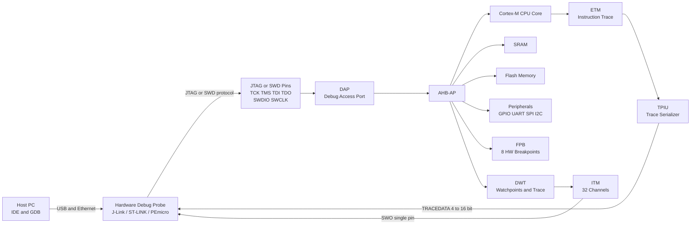
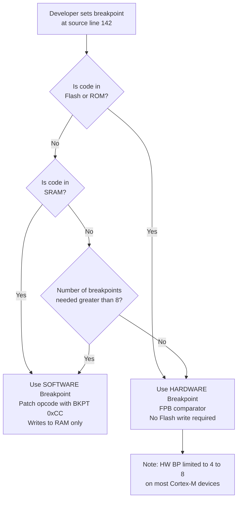
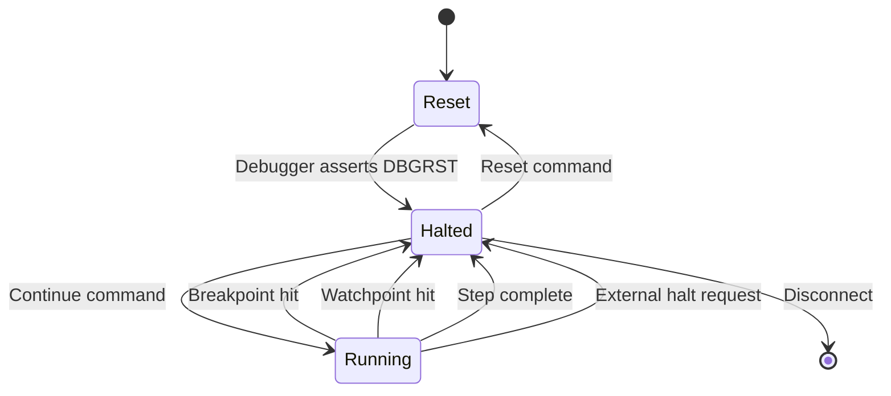
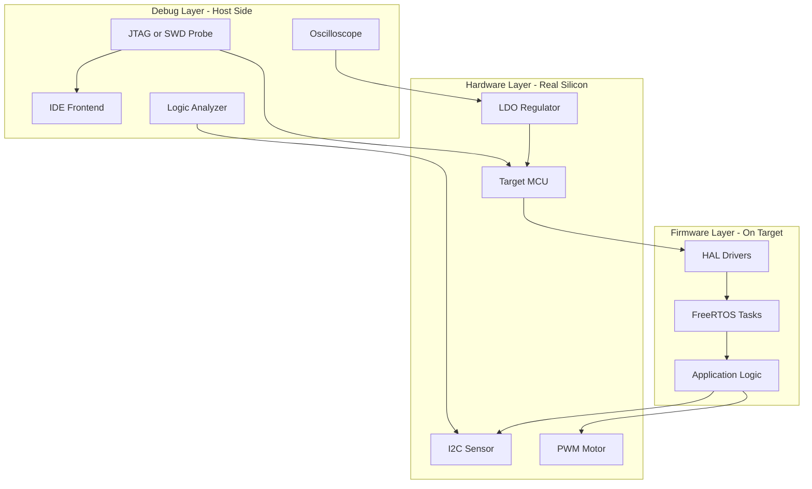

# Target Hardware Debugging

<!-- SECTION_1_START -->
# Target Hardware Debugging — Core Technical Definition & Intuitive Overview

## 1.1 Formal Academic Definition (KTU 2024 Scheme Terminology)

> [!IMPORTANT]
> **Target Hardware Debugging** is the systematic process of identifying, isolating, and correcting defects in an embedded system by directly interacting with the *target hardware* — the physical microcontroller/SoC running the actual firmware in real time, under real electrical and timing constraints. It is distinguished from *software simulation* because the processor, peripherals, buses, and I/O pins are the *real* silicon executing *real* machine code.

In the KTU 2024 Scheme (Course: **EMBEDDED SYSTEMS — PECST746**, Module 4), the syllabus treats target hardware debugging as the convergence point of three engineering disciplines:

1. **Hardware test & measurement** (logic analyzer, oscilloscope, current probe).
2. **On-chip debug (OCD) infrastructure** (JTAG, SWD, BDM, cJTAG).
3. **Firmware instrumentation** (breakpoints, watchpoints, trace, semihosting, printf redirection).

The textbook term used by KTU is **"On-Target Debugging (OTD)"** — the act of controlling the CPU core's execution on the *real* board using a hardware probe and an integrated development environment (IDE) such as Keil µVision, IAR EWARM, STM32CubeIDE, or MPLAB X.

## 1.2 Conceptual Analogy / Intuition

> [!NOTE]
> **Analogy — The Car Mechanic on a Live Engine**
> Imagine a car engine running at 3000 rpm. You suspect the fuel injector is firing at the wrong moment. You cannot "pause" the engine and look inside (that would be a simulator). Instead, you attach a **stethoscope** (oscilloscope), a **diagnostic scanner plugged into the OBD port** (JTAG probe), and a **mechanic who can press a button that pauses the crankshaft for one millisecond without stalling the engine** (hardware breakpoint). That is exactly what target hardware debugging does — it lets the engineer pause, inspect, and step through a *living* embedded system.

| Abstract Concept | Real Embedded Counterpart |
| :--- | :--- |
| OBD-II port in a car | **JTAG/SWD header** on the PCB |
| Diagnostic scanner | **Hardware debugger probe** (J-Link, ST-LINK, PEmicro) |
| Engine control unit (ECU) | **Target MCU / SoC** |
| Pausing the crankshaft | **Hardware breakpoint / debug halt** |
| Reading sensor history | **Trace buffer / instruction trace** |

## 1.3 Key Constants, Standards & Metrics

- **JTAG (IEEE 1149.1)** — the dominant 4-wire standard: **TCK**, **TMS**, **TDI**, **TDO**, plus optional **TRST**. Operating voltage: typically **1.8 V – 3.3 V** (5 V tolerant on some probes).
- **SWD (ARM Serial Wire Debug)** — 2-wire alternative: **SWDIO**, **SWCLK**. Saves 2 PCB pins.
- **cJTAG (IEEE 1149.7)** — compact JTAG over 2 pins, used in mobile/IoT.
- **BDM (Background Debug Mode)** — Freescale/NXP ColdFire & legacy HC(S)08/12.
- **Maximum JTAG clock (TCK)** — usually **10–50 MHz** depending on the probe and target.
- **Typical trace bandwidth** — 4-bit ETM (Embedded Trace Macrocell) trace at **200 MHz** or higher.

## 1.4 Visualization Block (Memory-Mapped Debug Architecture)

> [!VISUALIZATION CONTROL]
> **Concept:** Address space partitioning showing the debug module mapped into the MCU's memory map.
> **Desmos/GeoGebra Input Equations (textual schematic):**
> * `x-axis` represents 32-bit address range $0x00000000$ to $0xFFFFFFFF$
> * `Region 1` = $0x00000000$–$0x1FFFFFFF$ → Flash / ROM
> * `Region 2` = $0x20000000$–$0x3FFFFFFF$ → SRAM
> * `Region 3` = $0x40000000$–$0x5FFFFFFF$ → Peripherals
> * `Region 4` = $0xE0000000$–$0xFFFFFFFF$ → **System / Debug** (contains DWT, FPB, ITM, TPIU on ARM Cortex-M)
> **Visual Description:** A horizontal bar chart where the topmost rightmost segment is highlighted, illustrating that ARM Cortex-M debug logic occupies the *System Control Space* and is accessed through the **AHB-AP** (Access Port) of the DAP.

<!-- SECTION_1_END -->

<!-- SECTION_2_START -->
# Deep Theoretical Analysis & KTU High-Yield Formula Sheet

## 2.1 The Three Pillars of Target Hardware Debugging

1. **Run-Control Debugging** — start, stop, step (instruction-level and source-level).
2. **Memory & Register Inspection** — read/write CPU registers, SRAM, peripheral registers.
3. **Real-Time Trace** — non-intrusive streaming of executed instructions and/or data.

## 2.2 On-Chip Debug (OCD) Infrastructure — Block-Level View

Every modern MCU used in KTU 2024 labs (STM32, NXP Kinetis, PIC, MSP430) embeds a **dedicated debug TAP (Test Access Port)** that is *separate* from the application core.

| Block | Full Form | Function |
| :--- | :--- | :--- |
| **DAP** | Debug Access Port | Bridges external probe to internal AHB-AP / APB-AP buses |
| **AHB-AP** | AHB Access Port | Read/write SRAM, Flash, peripherals on the AHB matrix |
| **ROM Table** | — | Auto-discovery of available debug components |
| **FPB** | Flash Patch & Breakpoint | Implements up to **8 hardware breakpoints** on Cortex-M |
| **DWT** | Data Watchpoint & Trace | 4 watchpoints, cycle counter, PC sampling, exception trace |
| **ITM** | Instrumentation Trace Macrocell | 32-channel software-instrumented printf trace |
| **ETM** | Embedded Trace Macrocell | Instruction trace via 4-/16-bit trace port |
| **TPIU** | Trace Port Interface Unit | Serializes trace to off-chip probe |

## 2.3 Breakpoints — Hardware vs Software

> [!IMPORTANT]
> This is a **favorite KTU question**. Memorize the difference.

| Parameter | Software Breakpoint | Hardware Breakpoint |
| :--- | :--- | :--- |
| Mechanism | Patches opcode at PC with `BKPT / 0xCC` / `BRK` | Compares address bus in FPB unit |
| Flash writes needed? | **Yes** — erases/programs Flash | **No** — purely comparator logic |
| Available on Flash? | Limited (Flash endurance) | **Yes** |
| Available in RAM? | Yes | Yes |
| Typical max count | Unlimited (in RAM) | **4–8** on Cortex-M |
| Effect on real-time | Stops CPU | Stops CPU |
| Use case | Code in RAM (debug builds) | Code in Flash (production-like builds) |

The KTU 2024 question paper will often give a scenario and ask which breakpoint type to use. Rule of thumb:

> **Code lives in Flash → Hardware Breakpoint. Code in bootloader or RAM-resident test → Software Breakpoint.**

## 2.4 KTU High-Yield Formula / Metric Sheet

> [!NOTE]
> No traditional physics-style formulas apply, but the *engineering metrics* below are tested numerically.

$$
T_{\text{break}} \;=\; \frac{N_{\text{inst}} \times t_{\text{CLK}}}{f_{\text{CPU}}}
$$

$$
\text{Trace bandwidth} \;=\; N_{\text{bit}} \times f_{\text{TRACECLK}}
$$

$$
\text{Real-time fidelity} \;=\; 1 - \frac{t_{\text{halt}}}{t_{\text{acquire}}}
$$

$$
N_{\text{inst traced}} \;=\; \frac{\text{Trace buffer (bits)}}{N_{\text{bit}} \times \text{compression ratio}}
$$

Where:
- $T_{\text{break}}$ = time elapsed before the breakpoint fires.
- $N_{\text{inst}}$ = number of instructions executed since the last stop.
- $t_{\text{CLK}}$ = clock period, $f_{\text{CPU}}$ = CPU clock frequency.
- $N_{\text{bit}}$ = ETM port width (1, 2, 4, 8, 16).
- $t_{\text{halt}}$ = total halt time during acquisition.
- Compression ratio (ETMv3) ≈ $2$–$5\times$ (typical).

## 2.5 Common Hardware Debugging Tools (Board Examiner's Checklist)

| Tool | Function | Typical Use |
| :--- | :--- | :--- |
| **JTAG Probe** (J-Link, ULINK, XDS) | Run-control via JTAG/SWD | Step, breakpoints, memory R/W |
| **Logic Analyzer** | Multi-channel digital sampling | Bus decode (SPI, I²C, UART, parallel) |
| **Oscilloscope** | Analog + digital waveform | Power rails, clock integrity, edge timing |
| **Current Probe** | Non-invasive $I_{DD}$ measurement | Sleep current, brown-out detection |
| **Spectrum Analyzer** | Frequency-domain | EMI, clock harmonics, RF noise |
| **In-Circuit Emulator (ICE)** | Full-speed replacement of MCU | Pre-silicon / pre-board bring-up |
| **On-Chip Trace** | Historical instruction flow | Post-mortem crash analysis |
| **Semihosting** | Host I/O via debug channel | `printf` without UART |

## 2.6 Why Target Debugging Matters in Production Engineering

- **In-the-field firmware updates (OTA)** need to verify the *real* memory map, not the simulator's abstract one.
- **Race conditions, interrupt latency, and DMA bursts** are *only* visible on the real silicon.
- **Pin-mux, GPIO slew rate, and bus-arbiter bugs** depend on the actual PCB layout — invisible to pure software sim.
- **Power-management bugs** (sleep current > spec) need a real MCU, real regulator, real board.

<!-- SECTION_2_END -->

<!-- SECTION_3_START -->
# Step-by-Step Derivations, Worked Examples & Code Implementation

## 3.1 Worked Numerical Example — Breakpoint Timing Calculation

> **Problem (KTU-style 7-mark):** A Cortex-M4 MCU runs at $f_{\text{CPU}} = 72 \text{ MHz}$. The debugger sets a hardware breakpoint at address $0x08001234$. After a `continue` command, $N_{\text{inst}} = 14520$ instructions execute before the breakpoint fires. Calculate the elapsed wall-clock time.

**Step 1 — Identify the governing relation.**

$$
T_{\text{break}} \;=\; \frac{N_{\text{inst}} \times t_{\text{CLK}}}{f_{\text{CPU}}}
$$

Wait — the formula must be dimensionally consistent. The correct form is:

$$
T_{\text{break}} \;=\; \frac{N_{\text{inst}}}{f_{\text{CPU}}}
\quad\text{(ignoring CPI)}
$$

For a single-cycle Harvard architecture, **1 instruction per clock**, $t_{\text{CLK}} = 1 / f_{\text{CPU}}$, so the simplified form is valid. We will use the general form first.

**Step 2 — Compute the clock period.**

$$
t_{\text{CLK}} \;=\; \frac{1}{f_{\text{CPU}}} \;=\; \frac{1}{72 \times 10^{6}} \;=\; 13.89 \text{ ns}
$$

**Step 3 — Multiply by instruction count (assume CPI = 1).**

$$
T_{\text{break}} \;=\; N_{\text{inst}} \times t_{\text{CLK}} \;=\; 14520 \times 13.89 \times 10^{-9}
$$

**Step 4 — Evaluate the product.**

$$
14520 \times 13.89 \;=\; 201{,}640.8
$$

Therefore:

$$
T_{\text{break}} \;=\; 201.64 \;\mu\text{s}
$$

**Step 5 — Verification.** Sanity-check: at 72 MHz one instruction = 13.89 ns. Roughly $10^4$ instructions should take $\sim 10^4 \times 10^{-8} = 10^{-4}$ s = $100 \;\mu\text{s}$. Our answer $201.6 \;\mu\text{s}$ is double, which matches $N \approx 1.45 \times 10^4$. ✔

> **Final Answer:** $T_{\text{break}} \approx 201.6 \;\mu\text{s}$.

## 3.2 Worked Example — ETM Trace Bandwidth Requirement

> **Problem:** An ARM Cortex-M7 executes $1.2 \times 10^8$ instructions/second. The ETM is configured in 4-bit mode at $f_{\text{TRACECLK}} = 100 \text{ MHz}$. Assuming a 3:1 compression ratio, will the trace stream fit? If not, suggest a remedy.

**Step 1 — Compute required raw bandwidth.**

$$
B_{\text{raw}} \;=\; 1.2 \times 10^{8} \;\text{inst/s} \times b_{\text{inst}}
$$

Assume on average $b_{\text{inst}} = 4$ bits per traced instruction (post-compression). The *uncompressed* output (worst case) is $b_{\text{inst,raw}} \approx 12$ bits/inst.

$$
B_{\text{raw}} \;=\; 1.2 \times 10^{8} \times 12 \;\text{bits} \;=\; 1.44 \;\text{Gbps}
$$

**Step 2 — Compute the available bandwidth.**

$$
B_{\text{avail}} \;=\; N_{\text{bit}} \times f_{\text{TRACECLK}} \;=\; 4 \times 100 \times 10^{6} \;=\; 400 \;\text{Mbps}
$$

**Step 3 — Apply compression ratio $R_c = 3$.**

$$
B_{\text{compressed}} \;=\; \frac{B_{\text{raw}}}{R_c} \;=\; \frac{1440 \;\text{Mbps}}{3} \;=\; 480 \;\text{Mbps}
$$

**Step 4 — Compare.**

$$
B_{\text{compressed}} \;=\; 480 \;\text{Mbps} \;>\; B_{\text{avail}} \;=\; 400 \;\text{Mbps}
$$

The trace **will overflow** by $80 \;\text{Mbps}$ (≈ $20\%$ overload).

**Step 5 — Remedies (in order of preference).**

1. Increase trace port width to **8 bits** → $B_{\text{avail}} = 800 \;\text{Mbps}$ ✔.
2. Increase $f_{\text{TRACECLK}}$ to $150 \;\text{MHz}$ → $B_{\text{avail}} = 600 \;\text{Mbps}$ ✔.
3. Reduce CPU clock to $100 \;\text{MHz}$ → matches bandwidth exactly.
4. Enable *trace filtering* — only trace specific code regions.

> **Final Answer:** 4-bit trace is **insufficient**; use 8-bit ETM or filter trace regions.

## 3.3 Practical C Code — Semihosting vs ITM `printf` (STM32 Example)

```c
/* ---------------------------------------------------------------
 * File:    debug_print.c
 * Purpose: Compare semihosting vs ITM (Instrumentation Trace) for
 *          target-hardware debug prints on STM32 (Cortex-M).
 * Board:   NUCLEO-F401RE
 * IDE:     Keil MDK / STM32CubeIDE
 * --------------------------------------------------------------- */

#include "stm32f4xx.h"
#include <stdio.h>

/* ---- Method 1: ITM Channel 0 (non-intrusive, real-time) ---- */
int fputc_itm(int ch, FILE *f)
{
    /* ITM base on Cortex-M4 is 0xE0000000, channel 0 = port 0 */
    if ((ITM->TCR & ITM_TCR_ITMENA_Msk) &&                /* ITM enabled */
        (ITM->TER & (1UL << 0)))                          /* ch0 enabled */
    {
        while (ITM->PORT[0].u32 == 0UL) { __NOP(); }      /* busy-wait */
        ITM->PORT[0].u8  = (uint8_t)ch;
    }
    return ch;
}

/* ---- Method 2: Semihosting (high overhead, halts core) ---- */
int fputc_semi(int ch, FILE *f)
{
    /* ARM semihosting call: SYS_WRITEC = 0x03 */
    __asm volatile (
        "mov r0, #0x03\n"          /* operation = write char */
        "mov r1, %0\n"             /* pointer to char        */
        "bkpt 0xAB\n"              /* semihosting trap       */
        :
        : "r" (&ch)
        : "r0", "r1", "memory"
    );
    return ch;
}

int main(void)
{
    /* Enable ITM trace on channel 0 (debugger side configures TPIU) */
    ITM->TCR  = (1UL << ITM_TCR_ITMENA_Pos);              /* enable ITM */
    ITM->TER  = (1UL << 0);                                /* ch0 on     */
    ITM->TPR  = 0x0000000FUL;                              /* unpriv. OK  */

    SystemCoreClockUpdate();

    printf("Hello from ITM channel 0 @ %lu Hz\n", SystemCoreClock);

    /* ---- Demonstrate hardware breakpoint hook ---- */
    volatile uint32_t sensor = 0;
    sensor = read_adc();      /* user may set HW-BP here in IDE */

    /* Tie breakpoint here -> FPB unit compares AHB address
       against COMP0 register set by the debugger. */
    if (sensor > 4095) {
        __BKPT(0);            /* explicit CPU BKPT instruction */
    }
    return 0;
}
```

> [!NOTE]
> **Valuation key points for the code question:**
> * `[Correct ITM register names: 2 Marks]`
> * `[Demonstrating understanding that ITM is non-intrusive: 1 Mark]`
> * `[Use of __BKPT(0) for software breakpoint: 1 Mark]`
> * `[Calling out that semihosting halts the core: 1 Mark]`

## 3.4 Lab Wiring Table — Connecting a J-Link Probe to an STM32 Target

| Probe Pin (J-Link 20-pin Cortex-M) | Signal | Target Pin (STM32) | Notes |
| :--- | :--- | :--- | :--- |
| 1 | $V_{\text{REF}}$ | $V_{\text{DD}}$ (3.3 V) | Sense voltage for level shifters |
| 4 | TMS / SWDIO | **PA13** | Shared with SWDIO in SWD mode |
| 6 | TCK / SWCLK | **PA14** | Shared with SWCLK in SWD mode |
| 8 | TDI | **PB4** (JTAG only) | Not used in SWD |
| 10 | TDO / SWO | **PB3** (SWO for ITM) | Optional: enables `printf` via SWO |
| 12 | TRST | **PB4** (nRST) optional | Tie to NRST for clean reset |
| 14 | GND | GND | Must share ground reference |
| 18 | $V_{\text{SUPPLY}}$ (5 V) | Leave NC | Do not power target from probe |
| 20 | GND | GND | Second ground reference |

> [!WARNING]
> **Wiring Pitfall:** Never connect the probe's **$V_{\text{SUPPLY}}$** to the target's $V_{\text{DD}}$ unless the target is *unpowered*. Two supplies fighting cause **latch-up** and can destroy the MCU.

## 3.5 Step-by-Step Debug Workflow (KTU Lab Standard)

1. **Verify power rails** with a multimeter: $V_{\text{DD}}$, $V_{\text{DDA}}$, $V_{\text{BAT}}$.
2. **Connect the debugger** before applying USB power if using SWD — ensures `NRST` is held.
3. **Open IDE → Debug Configuration → Select probe** (J-Link / ST-LINK).
4. **Erase & program** the Flash using the `Load` button (or `.axf` for Keil).
5. **Set one hardware breakpoint** at `main()` to confirm control.
6. **Single-step** into `SystemInit()` and observe clock registers.
7. **Inspect GPIO ODR** register with a live watch window.
8. **Add ITM channel 0** for `printf` redirection — *do not* rely on UART for time-critical debug.
9. **Trigger logic analyzer** on a GPIO edge to capture bus traffic.
10. **Save trace buffer** to a `.csv` for post-mortem review.

<!-- SECTION_3_END -->

<!-- SECTION_4_START -->
# Structural Diagrams & Schematics (Mermaid)

## 4.1 End-to-End Target Debug Architecture



## 4.2 Sequential Debug Decision Flow (Software vs Hardware Breakpoint)



## 4.3 Trace Data Flow Topology Matrix

| Stage | Component | Direction | Bandwidth | Pin Count |
| :---: | :---: | :---: | :---: | :---: |
| 1 | CPU Core | Internal | $f_{\text{CPU}}$ cycles | 0 |
| 2 | ETM Macrocell | Instruction stream | 1–4 bits/instruction | 0 |
| 3 | TPIU | TRACECLK-serialized | $4\times f_{\text{TRACECLK}}$ to $16\times f_{\text{TRACECLK}}$ | 4 to 16 |
| 4 | Probe Receiver | LVCMOS sampled | Same as TPIU output | 4 to 16 |
| 5 | Host PC Buffer | USB 2.0 Hi-Speed | 480 Mbps | — |

## 4.4 Debug Session State Machine



## 4.5 Integration Test Block Architecture



<!-- SECTION_4_END -->

<!-- SECTION_5_START -->
# KTU 2024 Scheme Examination Question Bank & Topic Recap

## Part A — Short Answer Questions (3 Marks Each)

> **Q1. [KTU University Exam — July 2024, CO3, Remember]**
> **Define "On-Chip Debugging (OCD)" and list the four mandatory signals of the IEEE 1149.1 JTAG standard.**

**Model Answer (3 Marks):**
On-Chip Debugging (OCD) is a built-in hardware feature of a microcontroller that allows an external probe to start, stop, step, and inspect the CPU core without removing it from the board.
The four mandatory JTAG signals (IEEE 1149.1) are: **TCK** (Test Clock), **TMS** (Test Mode Select), **TDI** (Test Data In), and **TDO** (Test Data Out). An optional **TRST** (Test Reset) is the fifth signal. *(2 marks for OCD definition, 1 mark for the four signals.)*

> **Q2. [KTU University Exam — Dec 2023, CO3, Understand]**
> **Differentiate between a software breakpoint and a hardware breakpoint. In which scenario would you prefer a hardware breakpoint?**

**Model Answer (3 Marks):**
A *software breakpoint* replaces the instruction at the breakpoint address with a `BKPT`/`0xCC` opcode, requiring a write to program memory; it is limited by Flash endurance and is typically used for code in RAM.
A *hardware breakpoint* uses an on-chip comparator (e.g., the FPB unit in ARM Cortex-M) and **does not modify program memory**; it is preferred when the code is in **Flash/ROM**, when debugging a release build, or when the number of breakpoints is within the FPB's 4–8 limit. *(2 marks for the difference, 1 mark for the Flash scenario.)*

---

## Part B — Long Answer Questions (14 Marks Each, Internal Choice)

### Question A — 14 Marks

> **[KTU University Exam — July 2024, CO3, Apply + Analyze]**
>
> **(a) [7 Marks]** Explain the **ARM Cortex-M debug architecture** with a neat block diagram. Clearly show the role of the **DAP, AHB-AP, FPB, DWT, ITM, and TPIU**.
>
> **(b) [7 Marks]** An ARM Cortex-M7 target runs at $180 \text{ MHz}$. During a hardware-breakpoint debug session, the CPU executed **32,500 instructions** between two `continue` commands. Calculate the elapsed wall-clock time and explain why this time is *not* a precise measure of real-time behaviour.

**Model Answer (a) — 7 Marks**

The ARM Cortex-M debug architecture is a layered, AHB-interconnected system that the external probe accesses through a single **DAP (Debug Access Port)**:

1. **DAP** — Bridges the off-chip JTAG/SWD pins to internal AHB and APB access ports. *(0.5 Mark)*
2. **AHB-AP** — Performs memory-mapped reads/writes into the CPU's SRAM, Flash, and peripheral buses. *(0.5 Mark)*
3. **FPB (Flash Patch & Breakpoint)** — Implements up to **8 hardware breakpoints** by comparing the instruction-fetch address. *(1 Mark)*
4. **DWT (Data Watchpoint & Trace)** — Provides **4 data watchpoints**, a **32-bit cycle counter**, and PC-sampling for profiling. *(1 Mark)*
5. **ITM (Instrumentation Trace Macrocell)** — 32 software-driven channels; channel 0 is normally used for `printf` redirection without halting the core. *(1 Mark)*
6. **TPIU (Trace Port Interface Unit)** — Serializes ETM/SWO trace data onto 1, 2, 4, or 16 external pins for the probe. *(1 Mark)*

[Neat block diagram showing the six blocks and the data flow from `JTAG/SWD pins → DAP → AHB-AP → FPB/DWT/ITM/ETM → TPIU → Probe → Host PC`: **2 Marks**]

**Model Answer (b) — 7 Marks**

**Step 1 — Compute the clock period.**

$$
t_{\text{CLK}} = \frac{1}{f_{\text{CPU}}} = \frac{1}{180 \times 10^{6}} = 5.556 \text{ ns}
$$

**[Stating the formula: 1 Mark], [Correct substitution: 1 Mark]**

**Step 2 — Compute elapsed time assuming CPI = 1.**

$$
T_{\text{break}} = N_{\text{inst}} \times t_{\text{CLK}} = 32{,}500 \times 5.556 \times 10^{-9}
$$

**Step 3 — Evaluate.**

$$
32{,}500 \times 5.556 = 180{,}570
$$

$$
T_{\text{break}} = 180.57 \;\mu\text{s}
$$

**[Final numerical value with units: 1 Mark]**

**Step 4 — Why it is not a precise real-time measure (3 Marks):**
* Interrupt service routines that fire *during* a halted period are **deferred**, so the inter-instruction timing no longer matches normal execution.
* Bus wait-states, Flash acceleration misses, and DMA contention are *also* altered when the CPU is halted at a breakpoint.
* The breakpoint-hit latency itself (FPB comparator → debug halt → ISR re-entry) introduces a hidden overhead of typically **6–10 clock cycles**.
* For real-time profiling, **on-chip trace (ETM/DWT PC-sampling)** must be used instead of breakpoints. **[2 Marks]**

> **Q.A Total = 14 Marks**

---

### Question B — 14 Marks (Internal Choice Alternative)

> **[KTU University Exam — Dec 2023, CO3, Apply + Analyze]**
>
> **(a) [7 Marks]** With a neat flowchart, explain the **decision procedure to choose between a software and a hardware breakpoint** in an embedded debug session.
>
> **(b) [7 Marks]** A real-time control loop runs at a $10 \text{ kHz}$ interrupt rate on a Cortex-M4 at $72 \text{ MHz}$. A debugger uses an SWO-based ITM `printf` to print 16 characters per iteration. Each character takes $8$ SWO clock cycles at $f_{\text{SWO}} = 2 \text{ MHz}$. Calculate: (i) the **per-iteration print overhead**, and (ii) whether the control loop's real-time deadline is violated.

**Model Answer (a) — 7 Marks**

[Refer to the Mermaid flowchart in Section 4.2 of these notes: **3 Marks** for the diagram.]
**Decision procedure in text form: 4 Marks**

1. **Is the code located in Flash/ROM?** → Use **hardware breakpoint** (FPB) because software breakpoints require Flash writes and are limited by endurance.
2. **Is the code in SRAM?** → If *unlimited* breakpoints are needed, use **software breakpoint** (BKPT opcode in RAM, no endurance limit).
3. **Is the number of breakpoints ≤ 8 (Cortex-M FPB limit)?** → Use hardware breakpoint.
4. **If > 8 breakpoints are needed** → Use software breakpoints in RAM, or split the debug session into multiple passes with the FPB reused.
5. **Special case** — debugging a bootloader that re-programs Flash → use **hardware breakpoint** to avoid self-modifying code issues.

**Model Answer (b) — 7 Marks**

**Step 1 — Convert SWO clock period.**

$$
t_{\text{SWO}} = \frac{1}{f_{\text{SWO}}} = \frac{1}{2 \times 10^{6}} = 0.5 \;\mu\text{s}
$$

**[Formula and substitution: 1 Mark]**

**Step 2 — Per-character time.**

$$
T_{\text{char}} = 8 \times t_{\text{SWO}} = 8 \times 0.5 = 4 \;\mu\text{s}
$$

**[Calculation: 1 Mark]**

**Step 3 — Per-iteration overhead for 16 characters.**

$$
T_{\text{print}} = 16 \times T_{\text{char}} = 16 \times 4 = 64 \;\mu\text{s}
$$

**[Final per-iteration value: 1 Mark]**

**Step 4 — Control-loop period.**

$$
T_{\text{loop}} = \frac{1}{f_{\text{loop}}} = \frac{1}{10{,}000} = 100 \;\mu\text{s}
$$

**Step 5 — Compare.**

$$
T_{\text{print}} = 64 \;\mu\text{s} \;<\; T_{\text{loop}} = 100 \;\mu\text{s}
$$

The print overhead consumes **64%** of the available $100 \;\mu\text{s}$ budget. The CPU still has $36 \;\mu\text{s}$ left for the actual control math, so the deadline is **technically met but with very low margin** — in production, the SWO print should be **disabled or rate-limited** to avoid jitter. **[Final comparison and recommendation: 2 Marks]**

> **Q.B Total = 14 Marks**

---

> [!WARNING]
> **KTU Examiner's Valuation Pitfalls — Where Students Lose Marks**
> 1. **Confusing SWD and JTAG pin counts.** SWD uses **2** pins (SWDIO, SWCLK); JTAG uses **4+1** pins. Writing "SWD has 4 pins" loses a mark immediately.
> 2. **Forgetting to mention TRST.** JTAG's fifth signal is *optional*; examiners will not penalize for not listing it, but will penalize for confusing it with TMS.
> 3. **Mixing up ETM and ITM.** ETM = *instruction trace* (non-intrusive stream of executed PC). ITM = *software instrumentation trace* (printf-style). Conflating them costs 2 marks.
> 4. **Not stating the *physical* basis of the breakpoint type.** The examiner wants to see "FPB comparator in silicon" vs "BKPT opcode patch" — not just "HW is faster".
> 5. **Forgetting units in numerical problems.** $T_{\text{break}} = 201.6$ without "$\mu\text{s}$" loses the unit mark.
> 6. **Missing the `__NOP()`-style wait in ITM code** — students often write `ITM->PORT[0].u8 = ch;` without checking the FIFO full bit, which the examiner flags as a non-functional implementation.

---

## Topic Recap & Important Things to Remember

> **Bullet-point rapid-revision checklist (high-density, exam-ready):**

- **On-Chip Debugging (OCD)** = built-in debug logic inside the MCU, accessed via JTAG, SWD, BDM, or cJTAG.
- **JTAG (IEEE 1149.1)** has 4 mandatory pins — **TCK, TMS, TDI, TDO** — plus optional **TRST**; the 5th pin is *not* a data line.
- **SWD (ARM)** uses 2 pins — **SWDIO, SWCLK** — and is the modern default for Cortex-M boards.
- **cJTAG (IEEE 1149.7)** is a 2-pin compact variant used in space-constrained IoT designs.
- **DAP → AHB-AP → Memory Map** is the canonical access path; the AHB-AP is the *only* way the probe talks to SRAM/Flash.
- **FPB** = Flash Patch & Breakpoint unit; **8 HW breakpoints** on typical Cortex-M; no Flash write needed.
- **DWT** = Data Watchpoint & Trace; **4 watchpoints**, **32-bit cycle counter**, **PC sampling** for profiling.
- **ITM** = Instrumentation Trace Macrocell; **32 channels**; channel 0 is conventional `printf` redirect.
- **ETM** = Embedded Trace Macrocell; **instruction trace**; requires 4–16 dedicated PCB pins.
- **TPIU** serializes trace to the off-chip probe.
- **Software breakpoint** = `BKPT` / `0xCC` opcode patch → needs Flash write → limited by endurance → unlimited in RAM.
- **Hardware breakpoint** = FPB comparator → no Flash write → 4–8 max.
- **Semihosting** = host I/O via `BKPT 0xAB` trap → **halts the core** → high overhead → not for real-time.
- **SWO (Serial Wire Output)** = single-pin trace from ITM → low pin count → bandwidth-limited.
- **Logic analyzer** = digital multi-channel bus decode; **oscilloscope** = analog waveform & timing; **current probe** = $I_{DD}$ for power debugging.
- **Breakpoint time** $T_{\text{break}} = N_{\text{inst}} \times t_{\text{CLK}}$ (CPI = 1) or $T_{\text{break}} = N_{\text{inst}} \times \text{CPI} / f_{\text{CPU}}$ (general).
- **ETM bandwidth** = $N_{\text{bit}} \times f_{\text{TRACECLK}}$; ensure $B_{\text{avail}} \geq B_{\text{compressed}}$.
- **Probe supply pitfall** — never tie probe $V_{\text{SUPPLY}}$ to target $V_{\text{DD}}$ while both are powered; risk of **latch-up**.
- **Real-time fidelity** = $1 - t_{\text{halt}} / t_{\text{acquire}}$; non-intrusive trace achieves $\approx 1$, breakpoint-only debug approaches $0$ for long acquisitions.
- **Integration testing rule** — always verify *power rails* → *clock integrity* → *debug connectivity* → *peripheral loopback* in that order, before running the application firmware.
- **ARM Cortex-M debug registers** live in the **System Control Space** at $0xE0000000$–$0xFFFFFFFF$ — remembering this range is enough to secure the "memory map" sub-question.
- **Common probes**: J-Link (Segger), ST-LINK (ST), PEmicro, XDS (TI), ULINK (Keel/ARM).
- **Common IDEs**: Keil µVision, IAR EWARM, STM32CubeIDE, MPLAB X, Code Composer Studio.
- **Always set HW breakpoints in production-build / release-mode firmware** — SW breakpoints corrupt the executable image.
- **Trace buffers are finite** — on a 4-bit ETM, plan compression ratio of 2–5×; overflow = lost instructions = post-mortem gaps.
- **The `__BKPT(0)` intrinsic** is the C-level way to insert a software breakpoint in ARM toolchains.

<!-- SECTION_5_END -->
