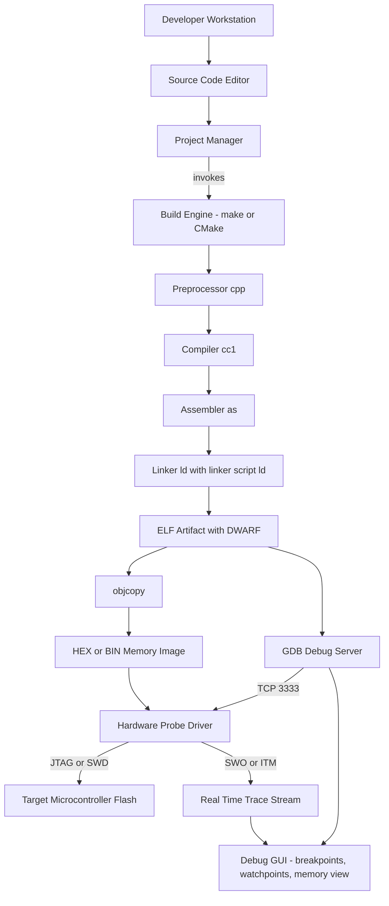
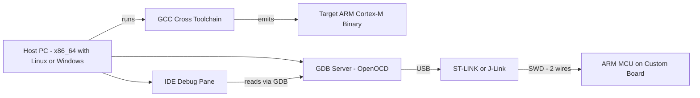
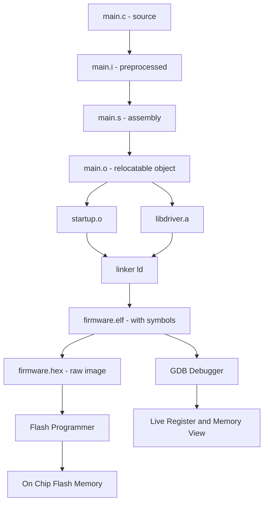
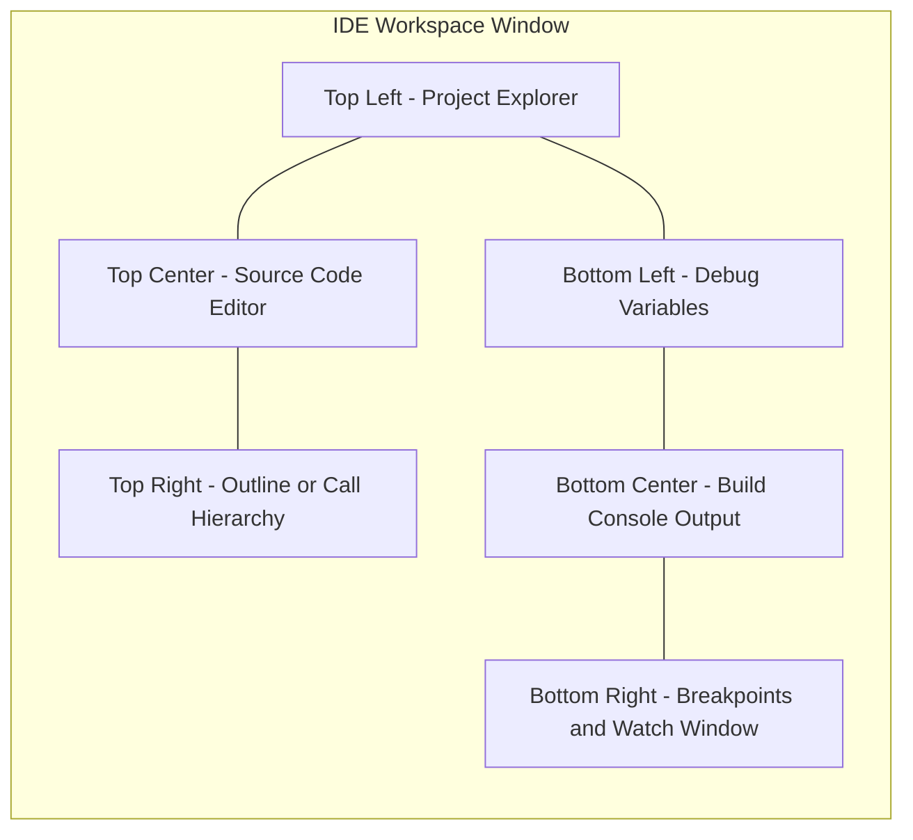

# The Embedded System Development Environment - The Integrated Development Environment (IDE)

<!-- SECTION_1_START -->
# The Integrated Development Environment (IDE) in Embedded Systems

## 1.1 Formal KTU 2024 Definition

> [!IMPORTANT]
> **Integrated Development Environment (IDE):** A software application suite that consolidates the essential embedded firmware development tools — *source code editor*, *cross-compiler/assembler*, *linker*, *build automation engine*, *debugger*, and *hardware programmer interface* — into a single unified graphical workspace tailored for a specific microcontroller architecture (e.g., ARM Cortex-M, AVR, PIC, MSP430).

In the KTU 2024 PECST746 syllabus context, the IDE is the **central cockpit** through which a developer writes embedded C/C++/Assembly, compiles the code **cross-platform** (host PC → target MCU), flashes the binary into on-chip Flash memory, and performs real-time on-target debugging using hardware probes.

## 1.2 Conceptual Analogy — The "Garage Workshop" Intuition

Imagine you are assembling a tiny robotic car:

| Workshop Tool | IDE Equivalent | Purpose |
|---|---|---|
| Workbench with magnifying lamp | **Source Code Editor** (with syntax highlighting) | Write and review the assembly instructions |
| Precision welding machine | **Cross-Compiler & Assembler** | Convert human-readable C into raw machine code (`.elf`, `.hex`, `.bin`) |
| Chassis blueprint aligner | **Linker & Locator** | Map compiled fragments into correct memory addresses (Flash/RAM) |
| Robotic test track with sensors | **Simulator / Emulator** | Run firmware virtually before real hardware is touched |
| Onboard diagnostic scanner (OBD) | **In-Circuit Debugger (JTAG/SWD)** | Pause execution, inspect registers, set breakpoints on the *actual* chip |
| Cargo crane loading the car onto the track | **Flasher / Programmer** | Burn the final binary into the MCU's non-volatile memory |

> [!NOTE]
> **Why an IDE is non-negotiable in embedded systems:** Unlike desktop software, embedded code runs on resource-constrained silicon with no OS, no terminal, and no second chances. A robust IDE ensures **deterministic cross-compilation**, **architecture-aware optimization**, and **hardware-in-the-loop (HIL) verification** — all without ever leaving one window.

## 1.3 Standard KTU Board Metrics for IDE Selection

When evaluating an IDE, KTU board questions often test these **bolded** key parameters:

- **Toolchain Type:** *Native* vs. *Cross-Compilation* (the latter is mandatory for embedded targets).
- **Architecture Support:** 8-bit (8051, AVR) → 32-bit (ARM Cortex-M, RISC-V).
- **Debug Probe Protocols:** **JTAG** (4-wire: TCK, TMS, TDI, TDO) and **SWD** (2-wire: SWDIO, SWCLK) for ARM.
- **License Model:** Open-source (e.g., Eclipse + GCC) vs. Proprietary (e.g., IAR Embedded Workbench, Keil µVision).
- **RTOS Awareness:** Plugin support for FreeRTOS, Zephyr, ThreadX thread-aware debugging.

> [!VISUALIZATION CONTROL]
> **Concept:** IDE Workspace Topology — Editor-Pane vs. Build-Pane vs. Debug-Pane mapping.
> **GeoGebra / Desmos Input Equations (schematic grid):**
> * Rectangle A: `x ∈ [0, 8], y ∈ [5, 9]` → Label: "Source Code Editor"
> * Rectangle B: `x ∈ [0, 4], y ∈ [0, 4]` → Label: "Project Explorer"
> * Rectangle C: `x ∈ [4, 8], y ∈ [0, 4]` → Label: "Build Output Console"
> **Visual Description:** A tiled three-pane workspace: top-half reserved for source editing with line-numbered gutter, bottom-left showing the hierarchical folder tree (`.c`, `.h`, `.s`, linker script), bottom-right streaming the compiler/linker diagnostic messages.
<!-- SECTION_1_END -->

<!-- SECTION_2_START -->
# Deep Theoretical Analysis — Anatomy of an Embedded IDE

## 2.1 The Eight Pillars of an Embedded IDE

A KTU-grade IDE is not just "a text editor." It comprises **eight tightly integrated subsystems**, each fulfilling a non-overlapping role in the firmware lifecycle:

1. **Source Code Editor** — Syntax-highlighted, brace-matching, auto-indent, with semantic code-completion (IntelliSense-equivalent for C99/C11/C++14).
2. **Project / Workspace Manager** — Hierarchical view of sources, headers, linker scripts, startup files, and configuration metadata.
3. **Cross-Compiler Front-End** — Invokes `arm-none-eabi-gcc` (or `avr-gcc`, `riscv64-unknown-elf-gcc`) on the host x86 machine but emits target-architecture machine code.
4. **Assembler** — Converts architecture-specific assembly (`.s` files, e.g., `startup_stm32.s`) into relocatable object code.
5. **Linker & Locator** — Merges object files, resolves external symbols, and assigns **absolute addresses** per the *linker script* (`.ld` file). Distinguishes between **Flash (text/rodata)** and **RAM (data/bss/stack/heap)** sections.
6. **Build Automation Engine** — `make` / `CMake` / `ninja` / vendor-specific (e.g., Keil's µVision Builder, ESP-IDF's `idf.py`). Decides incremental rebuilds via timestamp/hash comparison.
7. **Debugger Front-End** — GUI for setting breakpoints, watchpoints, single-stepping, viewing memory-mapped peripheral registers, and plotting live variables.
8. **Hardware Probe Driver Layer** — Talks to physical interfaces such as **ST-LINK/V2**, **J-Link**, **CMSIS-DAP**, **PEmicro Multilink**, or **ULINKpro** over USB.

## 2.2 The KTU Cross-Compilation Build Pipeline

The end-to-end flow from `.c` source to on-chip execution is governed by **four sequential stages**, each producing a distinct artifact:

$$\text{Preprocessed Source} \xrightarrow{\text{cpp}} \text{Expanded Source} \xrightarrow{\text{cc1}} \text{Assembly} \xrightarrow{\text{as}} \text{Object} \xrightarrow{\text{ld}} \text{ELF} \xrightarrow{\text{objcopy}} \text{HEX/BIN}$$

| Stage | Tool Executable | Input | Output | KTU Board Lingo |
|---|---|---|---|---|
| Preprocessing | `arm-none-eabi-cpp` | `main.c` | `main.i` | Macro expansion, header inclusion |
| Compilation | `arm-none-eabi-gcc -c` | `main.i` | `main.s` | C → target Assembly translation |
| Assembly | `arm-none-eabi-as` | `main.s` | `main.o` | Assembly → relocatable object |
| Linking | `arm-none-eabi-ld` (or `gcc` driver) | `main.o` + libs | `firmware.elf` | Address binding, section merging |
| Object Copy | `arm-none-eabi-objcopy` | `firmware.elf` | `firmware.hex` / `.bin` | Strip ELF headers, plain memory image |
| Size Audit | `arm-none-eabi-size` | `firmware.elf` | text/data/bss report | Validates Flash/RAM fit |

> [!NOTE]
> **KTU High-Yield Fact:** The ELF file is used for *symbolic debugging* (contains DWARF debug info), while the HEX/BIN file is the *raw memory image* that gets burned into Flash via the programmer. They are **not** interchangeable.

## 2.3 KTU Formula Cheat Sheet — Build Output Metrics

The `arm-none-eabi-size` report obeys the following memory accounting identity (a frequently tested KTU concept):

$$
\begin{aligned}
\text{Flash Occupied} &= \text{text} + \text{rodata} \\
\text{RAM Occupied} &= \text{data} + \text{bss} \\
\text{Total Static Footprint} &= \text{text} + \text{rodata} + \text{data} + \text{bss}
\end{aligned}
$$

> where:
> * `text` → Executable machine instructions
> * `rodata` → Read-only constants (lookup tables, string literals)
> * `data` → **Initialized** global/static variables (stored in Flash, copied to RAM at startup)
> * `bss` → **Uninitialized** global/static variables (zero-initialized by ` startup code`)

## 2.4 KTU Board-Relevant IDE Comparison Matrix

| IDE | Vendor | Target Families | Debug Probes | License | KTU Exam Tag |
|---|---|---|---|---|---|
| **Keil µVision 5** | ARM/Keil | ARM Cortex-M, 8051 | ULINK, CMSIS-DAP | Proprietary (free for STM32 NUCLEO) | Most-tested in KTU papers |
| **STM32CubeIDE** | STMicroelectronics | STM32 (ARM Cortex-M) | ST-LINK (built-in) | Free (Eclipse-based) | Industry-current |
| **IAR Embedded Workbench** | IAR Systems | ARM, AVR, MSP430, RISC-V | J-Link, IAR I-jet | Proprietary | Premium benchmark |
| **Eclipse + GCC (MCUXpresso, Simplicity Studio)** | NXP / Silicon Labs | ARM Cortex-M | CMSIS-DAP, PEmicro | Open-source core | Plug-in architecture |
| **Arduino IDE** | Arduino.cc | AVR, ARM, ESP | AVRISP, built-in bootloader | Open-source | Educational only |
| **PlatformIO** | Community | 1000+ boards | Unified abstraction | Open-source | Cross-platform IDE |

## 2.5 Real-World Engineering Utility

In production environments, the IDE choice cascades downstream: a medical-device firm using **IAR** benefits from certified MISRA-C compliance checks; a startup using **STM32CubeIDE** gets free code-generation via STM32CubeMX integration; aerospace teams mandate **Green Hills MULTI** for its DO-178C qualified toolchain. The IDE is therefore not merely a *tool* but a **process and certification gatekeeper**.
<!-- SECTION_2_END -->

<!-- SECTION_3_START -->
# Step-by-Step Implementation — Build, Link, and Debug Workflow

## 3.1 The Complete Toolchain Invocation (Exhaustive Trace)

Below is the *literal* sequence of commands an IDE invokes behind the GUI when you press **"Build"** for an STM32F407VG project named `blinky`:

### Step 1 — Preprocessing
The preprocessor resolves `#include`, `#define`, and conditional compilation (`#ifdef`). It produces a translation unit with all macros expanded.

```bash
arm-none-eabi-gcc -E \
  -mcpu=cortex-m4 -mthumb -mfloat-abi=hard -mfpu=fpv4-sp-d16 \
  -DSTM32F407xx -DUSE_HAL_DRIVER -DDEBUG \
  -ICore/Inc -IDrivers/STM32F4xx_HAL_Driver/Inc \
  Src/main.c -o Src/main.i
```

### Step 2 — Compilation to Assembly
The compiler front-end (`cc1`) parses the preprocessed C and emits target-specific assembly.

```bash
arm-none-eabi-gcc -S \
  -mcpu=cortex-m4 -mthumb -mfloat-abi=hard -mfpu=fpv4-sp-d16 \
  -O2 -ffunction-sections -fdata-sections \
  -ICore/Inc -IDrivers/STM32F4xx_HAL_Driver/Inc \
  Src/main.c -o Src/main.s
```

### Step 3 — Assembly to Relocatable Object
The GNU assembler translates mnemonics into binary opcodes and section metadata.

```bash
arm-none-eabi-as -mcpu=cortex-m4 -mthumb \
  Src/main.s -o Src/main.o
```

### Step 4 — Linking with Linker Script
This is the **most critical step**: the linker script `STM32F407VGTX_FLASH.ld` defines memory regions.

```bash
arm-none-eabi-gcc -T STM32F407VGTX_FLASH.ld \
  -mcpu=cortex-m4 -mthumb -mfloat-abi=hard -mfpu=fpv4-sp-d16 \
  -specs=nosys.specs -Wl,--gc-sections \
  Src/main.o Src/startup_stm32f407vgtx.o Src/system_stm32f4xx.o \
  -LDrivers/STM32F4xx_HAL_Driver -lstm32f4xx_hal \
  -o build/blinky.elf
```

### Step 5 — Memory Image Extraction
The ELF (with DWARF debug info) is converted to Intel HEX for the programmer.

```bash
arm-none-eabi-objcopy -O ihex build/blinky.elf build/blinky.hex
arm-none-eabi-objcopy -O binary build/blinky.elf build/blinky.bin
```

### Step 6 — Footprint Audit

```bash
arm-none-eabi-size --format=berkeley build/blinky.elf
# Expected output:
#    text    data     bss     dec     hex filename
#    8424      24    1576   10024    2728 build/blinky.elf
```

> [!NOTE]
> **KTU 14-Mark Killer Concept:** A common board question asks: *"Why is the RAM usage less than the sum of initialized globals at compile time?"* Answer: `.data` is stored in **Flash** and **copied to RAM** by the startup code (`SystemInit()` → `__main()` → `__scatterload()`). The reported `data` size shows RAM residency *after* copy.

## 3.2 The Linker Script — Memory Region Declaration

A minimal linker script (the IDE hides this from the student) declares the physical memory map:

```ld
MEMORY
{
  FLASH (rx)  : ORIGIN = 0x08000000, LENGTH = 1024K   /* Code + rodata */
  RAM   (rwx) : ORIGIN = 0x20000000, LENGTH = 128K    /* data + bss + stack + heap */
}

SECTIONS
{
  .isr_vector : { KEEP(*(.isr_vector)) } > FLASH
  .text       : { *(.text*) *(.rodata*) } > FLASH
  .data       : AT(LOADADDR(.text) + SIZEOF(.text))
                { *(.data*) } > RAM
  .bss        : { *(.bss*) *(COMMON) } > RAM
  _estack     = ORIGIN(RAM) + LENGTH(RAM);
}
```

> The LMA (Load Memory Address) of `.data` is in Flash; the VMA (Virtual Memory Address) is in RAM. The startup routine copies LMA→VMA byte-by-byte.

## 3.3 Sample Firmware — GPIO Toggle on STM32 Nucleo

A complete, compile-ready main file demonstrating IDE workflow output:

```c
/* main.c — blinks LD2 (PA5) on STM32F401RE Nucleo */
#include "stm32f4xx_hal.h"

void SystemClock_Config(void);
static void MX_GPIO_Init(void);

int main(void)
{
  HAL_Init();                          /* CMSIS HAL initialization */
  SystemClock_Config();                /* 84 MHz from HSI+PLL */
  MX_GPIO_Init();                      /* PA5 as push-pull output */

  while (1)
  {
    HAL_GPIO_TogglePin(GPIOA, GPIO_PIN_5);
    HAL_Delay(500);                    /* 500 ms blocking delay */
  }
}

static void MX_GPIO_Init(void)
{
  __HAL_RCC_GPIOA_CLK_ENABLE();
  GPIO_InitTypeDef cfg = {
    .Pin   = GPIO_PIN_5,
    .Mode  = GPIO_MODE_OUTPUT_PP,
    .Pull  = GPIO_NOPULL,
    .Speed = GPIO_SPEED_FREQ_LOW
  };
  HAL_GPIO_Init(GPIOA, &cfg);
}
```

## 3.4 Debug Probe Connection Topology

The IDE communicates with the target via a hardware probe. The OpenOCD + GDB bridge (used by STM32CubeIDE and Eclipse) follows this exact protocol chain:

$$
\text{IDE GUI} \xleftrightarrow{\text{TCP:3333 (GDB remote protocol)}} \text{arm-none-eabi-gdb} \xleftrightarrow{\text{localhost:4444 (Telnet)}} \text{OpenOCD} \xleftrightarrow{\text{SWD/JTAG pins}} \text{Target MCU}
$$

> [!NOTE]
> **SWD pin map (ARM standard 20-pin Cortex Debug Connector):**
> * Pin 1 → VTREF (target VCC reference)
> * Pin 2 → SWDIO (bidirectional data)
> * Pin 4 → SWCLK (clock)
> * Pin 6 → SWO (Serial Wire Output — for `printf` redirection via ITM)
> * Pin 15 → NRST (active-low reset)

## 3.5 On-Target Debugging Operations

Once the GDB-server bridge is active, the IDE exposes these primitives:

1. **Breakpoint** — Halts CPU at a specific address; sets `BKPT 0xAB` opcode in Flash via the debug logic.
2. **Watchpoint** — Triggers on data access (read/write) to a memory-mapped register (e.g., `GPIOA->ODR`).
3. **Single-Step (Step-In/Over/Out)** — Injects `BKPT` after the next instruction, polls `DHCSR` (Debug Halting Control and Status Register).
4. **Live Variable Inspection** — Reads the value at the variable's RAM address via AHB-AP.
5. **Memory Window** — Raw hex dump of any address; lets you read peripheral registers like `0x40023800` (RCC base).
6. **Register View** — R0–R15, xPSR, MSP, PSP, and special-purpose registers (CONTROL, PRIMASK, FAULTMASK).
7. **SWO `printf` Tracing** — Uses ITM port 0 to stream `printf` output over a single wire, freeing the UART for the application.
<!-- SECTION_3_END -->

<!-- SECTION_4_START -->
# Structural Diagrams — IDE Architecture & Build Topology

## 4.1 IDE Component Interaction (Block-Level Functional Architecture)



## 4.2 Cross-Compilation Data Flow



## 4.3 Build Pipeline Stage Topology



## 4.4 IDE Workspace Pane Layout


<!-- SECTION_4_END -->

<!-- SECTION_5_START -->
# KTU 2024 Scheme Examination Question Bank

## Part A — Short Answer Questions (3 Marks Each)

### Q1. [KTU University Exam — July 2024] Define an Integrated Development Environment. List any four components of an IDE used for embedded firmware development.

**Model Answer (CO1, Remember):**

> An **Integrated Development Environment (IDE)** is a unified software suite that combines all the tools required to develop, compile, debug, and deploy embedded firmware within a single graphical interface. **[1 Mark]**
>
> Four essential components of an embedded IDE:
> 1. **Source Code Editor** — for writing C/C++/Assembly with syntax highlighting. **[0.5 Mark]**
> 2. **Cross-Compiler & Assembler** — translates host-written code into target-MCU machine code. **[0.5 Mark]**
> 3. **Linker & Locator** — binds object files into a single executable with correct memory addresses. **[0.5 Mark]**
> 4. **In-Circuit Debugger Interface** — communicates with the target via JTAG/SWD for live debugging. **[0.5 Mark]**

---

### Q2. [KTU University Exam — Dec 2023] What is the difference between *native compilation* and *cross-compilation*? Why is cross-compilation mandatory for embedded targets?

**Model Answer (CO1, Understand):**

> **Native compilation** produces machine code that runs on the *same* processor architecture as the host (e.g., compiling an x86 program on an x86 PC). **[1 Mark]**
>
> **Cross-compilation** generates machine code for a *different* target architecture than the host (e.g., compiling ARM code on an x86 PC). **[1 Mark]**
>
> **Why mandatory for embedded systems:** Most microcontrollers (e.g., STM32, ATmega328P) lack an operating system, a keyboard, a display, and often have kilobytes — not gigabytes — of RAM. They cannot host a compiler toolchain themselves. Therefore, firmware **must** be cross-compiled on a powerful host and the resulting binary is then flashed to the target. **[1 Mark]**

---

## Part B — Long Answer Questions (14 Marks Each)

### Question A — [KTU University Exam — July 2024, Module 4]

**(a)** With a neat block diagram, describe the **eight major components** of an embedded IDE and explain the role of the *linker script* in memory mapping. **[7 Marks]**

**(b)** Explain the **complete cross-compilation build process** for an ARM Cortex-M firmware, listing each tool invocation (preprocessor → objcopy) and the artifact produced at each stage. **[7 Marks]**

---

#### Model Solution (a) — CO1, Understand [7 Marks]

**Block Diagram (textual representation):**
```
[Editor] → [Preprocessor] → [Compiler] → [Assembler] → [Linker w/ Script] → [Objcopy] → [Programmer] → [MCU Flash]
                                                            ↑
                                                    [Debugger w/ Probe]
```

**Eight Components (1 Mark each for first four, then 0.5 for the rest = 7 Marks total):**

1. **Source Code Editor** — provides syntax highlighting, auto-indent, and project-wide search/replace.
2. **Preprocessor** — handles `#include`, `#define`, and conditional `#ifdef` directives.
3. **Cross-Compiler** — translates C/C++ into target-specific assembly.
4. **Assembler** — converts assembly mnemonics into relocatable machine code (`.o`).
5. **Linker with Linker Script** — merges multiple `.o` files and static libraries, then assigns *absolute* addresses to each section based on the script's `MEMORY` declaration. **[Specific detail on linker script: 2 Marks]**
6. **Object-Copy Utility** — strips ELF debug headers to produce Intel HEX or raw binary.
7. **Flash Programmer / Loader** — transmits the binary to on-chip Flash via SWD/JTAG/UART bootloaders.
8. **Hardware Debugger** — provides breakpoints, watchpoints, and real-time register/memory inspection.

> **Linker Script Role [1 Mark]:** The linker script (`.ld`) is a declarative file that tells the linker *where* in physical memory to place each section: `.text` and `.rodata` in Flash, `.data` and `.bss` in RAM. It also defines the stack pointer initial value (`_estack = ORIGIN(RAM) + LENGTH(RAM)`) and the entry point (`ENTRY(Reset_Handler)`).

**Valuation Key Points:**
* [Naming all eight components correctly: 4 Marks]
* [Linker script memory region mapping explained: 2 Marks]
* [Entry point & stack pointer initialization mentioned: 1 Mark]

---

#### Model Solution (b) — CO2, Apply [7 Marks]

**Complete Build Pipeline:**

| Step | Command (sample) | Input | Output | Marks |
|---|---|---|---|---|
| 1. Preprocess | `arm-none-eabi-gcc -E main.c -o main.i` | `main.c` | `main.i` | **[0.5]** |
| 2. Compile to ASM | `arm-none-eabi-gcc -S -mcpu=cortex-m4 main.i -o main.s` | `main.i` | `main.s` | **[1.0]** |
| 3. Assemble | `arm-none-eabi-as -mcpu=cortex-m4 main.s -o main.o` | `main.s` | `main.o` | **[1.0]** |
| 4. Link | `arm-none-eabi-ld -T stm32f4.ld main.o startup.o -o firmware.elf` | all `.o` | `firmware.elf` | **[1.5]** |
| 5. Object-Copy | `arm-none-eabi-objcopy -O ihex firmware.elf firmware.hex` | `.elf` | `.hex` | **[1.0]** |
| 6. Size Audit | `arm-none-eabi-size firmware.elf` | `.elf` | text/data/bss report | **[0.5]** |
| 7. Flash Load | `st-flash write firmware.hex 0x08000000` | `.hex` | on-chip Flash content | **[0.5]** |
| 8. Debug Attach | `openocd -f stlink.cfg -f stm32f4x.cfg` + `arm-none-eabi-gdb` | `.elf` | live debug session | **[1.0]** |

> **Final Statement [1 Mark]:** The ELF file is used for symbolic debugging (preserves DWARF info), while the HEX file is the raw memory image burned into Flash. The `.elf` is **not** directly programmable; the conversion via `objcopy` is essential.

> [!WARNING]
> **KTU Examiner's Valuation Pitfall:** Students often confuse `.elf` and `.hex` files. Writing "flash the ELF file" will cost you 1–2 marks. Always state that the **HEX or BIN** is the programmable artifact. Additionally, failing to mention the *linker script* as a separate input to the linker loses 1 mark.

---

### Question B — [KTU University Exam — Dec 2023, Module 4] — INTERNAL CHOICE

**(a)** Compare the **JTAG** and **SWD** debug interfaces. List their pin counts, protocols, and typical use cases. **[7 Marks]**

**(b)** Explain the role of a **hardware debug probe** (e.g., ST-LINK, J-Link) in the embedded IDE ecosystem. Describe how GDB and OpenOCD form a debug bridge between the host IDE and the target MCU. **[7 Marks]**

---

#### Model Solution (a) — CO1, Understand [7 Marks]

| Parameter | JTAG (IEEE 1149.1) | SWD (ARM proprietary) | Marks |
|---|---|---|---|
| **Full Pin Count** | 4–5 signals (TCK, TMS, TDI, TDO, optional TRST) | 2 signals (SWDIO, SWCLK) | **[1.5]** |
| **Protocol** | TAP controller state machine, 5-wire TDI/TDO scan chains | Packet-based, half-duplex on a single bidirectional data line | **[1.5]** |
| **Reset Pin** | TRST (optional, active-low) | Uses existing NRST (shared) | **[0.5]** |
| **Trace Support** | 4-pin parallel trace (ETM) optional | 1-pin SWO (Serial Wire Output) for `printf` over ITM | **[1.0]** |
| **Multi-Device** | Daisy-chains multiple ICs via TDI→TDO | Single-device only (no native daisy chain) | **[0.5]** |
| **Typical Use** | Boundary-scan testing, complex multi-core SoCs, FPGA configuration | ARM Cortex-M mainstream debugging (lower pin count) | **[1.0]** |
| **Speed** | Up to ~100 MHz TCK | Up to ~50 MHz SWCLK | **[0.5]** |
| **GPIO Conflict** | 4–5 GPIOs occupied | Only 2 GPIOs occupied (better for pin-constrained MCUs) | **[0.5]** |

**Valuation Key Points:**
* [Correct pin counts: 1.5 Marks]
* [Protocol distinction: 1.5 Marks]
* [Trace mechanism (SWO vs ETM): 1.0 Mark]
* [Use-case mapping: 1.0 Mark]
* [Multi-device handling: 0.5 Mark]
* [Pin-constraint advantage of SWD: 0.5 Mark]
* [Speed comparison: 0.5 Mark]
* [Final summary statement: 0.5 Mark]

---

#### Model Solution (b) — CO2, Apply [7 Marks]

**Role of a Hardware Debug Probe [3 Marks]:**

A hardware debug probe is a *physical bridge device* that:

1. **Translates USB commands from the host** (PC) into **JTAG/SWD signaling** for the target MCU. **[1 Mark]**
2. **Provides target voltage reference** (VTREF pin) so the probe can adapt its I/O levels to the MCU's supply (1.8V, 3.3V, 5V). **[0.5 Mark]**
3. **Drives the reset line (NRST)** to halt the CPU at a known state and load the `BKPT` opcode for breakpoint injection. **[0.5 Mark]**
4. **Streams SWO/ITM trace data** back to the host for real-time `printf` debugging without occupying the UART. **[0.5 Mark]**
5. **Powers the target board** in some variants (e.g., J-Link can supply 5V/3.3V up to 300 mA). **[0.5 Mark]**

**GDB + OpenOCD Debug Bridge [4 Marks]:**

The IDE does *not* talk directly to the probe. Instead, a **two-layer bridge** is used:

```
IDE GUI → GDB client (arm-none-eabi-gdb) → TCP port 3333 → OpenOCD → USB → ST-LINK → SWD pins → MCU
```

1. **GDB (GNU Debugger) Client [1 Mark]:** The IDE embeds a GDB client (e.g., Eclipse CDT, VS Code + Cortex-Debug). The user sets breakpoints in source code; GDB translates these into target memory addresses using DWARF info from the `.elf` file.

2. **TCP Socket on Port 3333 [0.5 Mark]:** GDB connects to a remote server speaking the *GDB Remote Serial Protocol* (RSP). OpenOCD listens on this port.

3. **OpenOCD (Open On-Chip Debugger) [1.5 Marks]:** A translation daemon that:
   * Accepts GDB RSP commands on TCP 3333.
   * Accepts Telnet commands on TCP 4444 for low-level probe control.
   * Translates high-level GDB commands (e.g., `continue`, `break main.c:42`) into low-level JTAG/SWD TAP state transitions.
   * Sends/receives USB packets to the probe driver (`libusb`).

4. **Probe Driver [0.5 Mark]:** Vendor-specific USB protocol — ST-LINK uses `libusb` bulk transfers; J-Link uses SEGGER's proprietary DLL.

5. **Target MCU [0.5 Mark]:** The ARM CoreSight debug logic on-chip (DAP — Debug Access Port) executes the BKPT, halts the CPU, and exposes registers via the AHB-AP.

> [!WARNING]
> **KTU Examiner's Valuation Pitfall — Debug Bridge:** Many students write that "the IDE directly controls the MCU via USB." This is **incorrect**; the IDE always communicates through a *debug server* (GDB + OpenOCD or vendor equivalent like Keil's `AGDI.dll`). Forgetting the role of OpenOCD loses 2 marks. Also, do **not** confuse *GDB* (the client) with *OpenOCD* (the server daemon) — they run as two separate processes.

---

## Topic Recap & Important Things to Remember

> [!NOTE]
> **Rapid Revision Checklist — IDE for Embedded Systems**

* **IDE Definition:** Unified software suite bundling editor + cross-compiler + linker + debugger + programmer for embedded targets. **[CORE]**

* **Cross-Compilation Rule:** Embedded firmware is **always** cross-compiled (host x86 → target ARM/AVR/PIC). The toolchain is named `arm-none-eabi-gcc` (no host OS, no application binary interface, GNU compiler).

* **Eight IDE Pillars:** Editor, Project Manager, Cross-Compiler, Assembler, Linker (with script), Build Engine, Debugger GUI, Probe Driver.

* **Five-Stage Build Pipeline:** Preprocess (`-E`) → Compile to ASM (`-S`) → Assemble (`as`) → Link (`ld` with `.ld` script) → Objcopy to HEX/BIN.

* **ELF vs HEX:** ELF = symbolic, debuggable, has DWARF info (host-side). HEX = raw memory image, programmable into Flash (target-side).

* **Memory Identity:** `Flash = text + rodata`; `RAM = data + bss`. Verified via `arm-none-eabi-size`.

* **Linker Script:** Declares `MEMORY { FLASH, RAM }` with `ORIGIN` and `LENGTH`; defines `SECTIONS` to map `.text`, `.rodata`, `.data`, `.bss`; sets `_estack` and `ENTRY()`.

* **JTAG vs SWD:** JTAG = 4-wire (TCK, TMS, TDI, TDO), IEEE 1149.1, multi-device chains. SWD = 2-wire (SWDIO, SWCLK), ARM-only, pin-efficient, supports SWO trace.

* **Debug Bridge:** IDE → GDB client → TCP 3333 → OpenOCD daemon → USB → Probe (ST-LINK/J-Link) → SWD/JTAG → MCU CoreSight DAP.

* **SWO/ITM:** Serial Wire Output streams `printf` over a single pin (SWO) using ITM port 0, leaving the main UART free for application use.

* **Key Probes Tested in KTU:** **ST-LINK/V2** (NUCLEO boards), **J-Link** (SEGGER), **CMSIS-DAP** (open standard), **PEmicro Multilink** (NXP/Freescale), **ULINKpro** (Keil/ARM).

* **Popular IDEs Tested in KTU:** Keil µVision 5, STM32CubeIDE, IAR Embedded Workbench, Eclipse + GCC (MCUXpresso/Simplicity Studio), Arduino IDE (educational), PlatformIO (cross-platform).

* **MISRA-C Compliance:** Production-grade IDEs (IAR, Keil) enforce MISRA-C 2012 coding standards for safety-critical automotive/aerospace firmware.

* **Build Optimization Flags:** `-O0` (no optimization, debug-friendly), `-O2` (balanced), `-O3` (aggressive, may break debugging), `-Os` (size-optimized for Flash-constrained MCUs).

* **Incremental Build:** The build engine (`make`) tracks file timestamps and only recompiles files whose sources have changed since the last build, dramatically reducing iteration time.
<!-- SECTION_5_END -->
