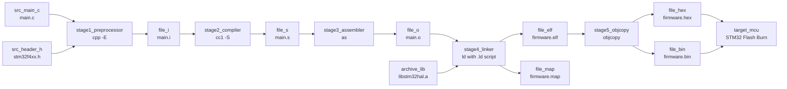
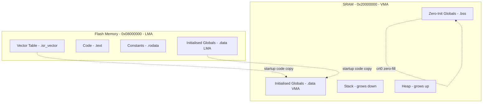
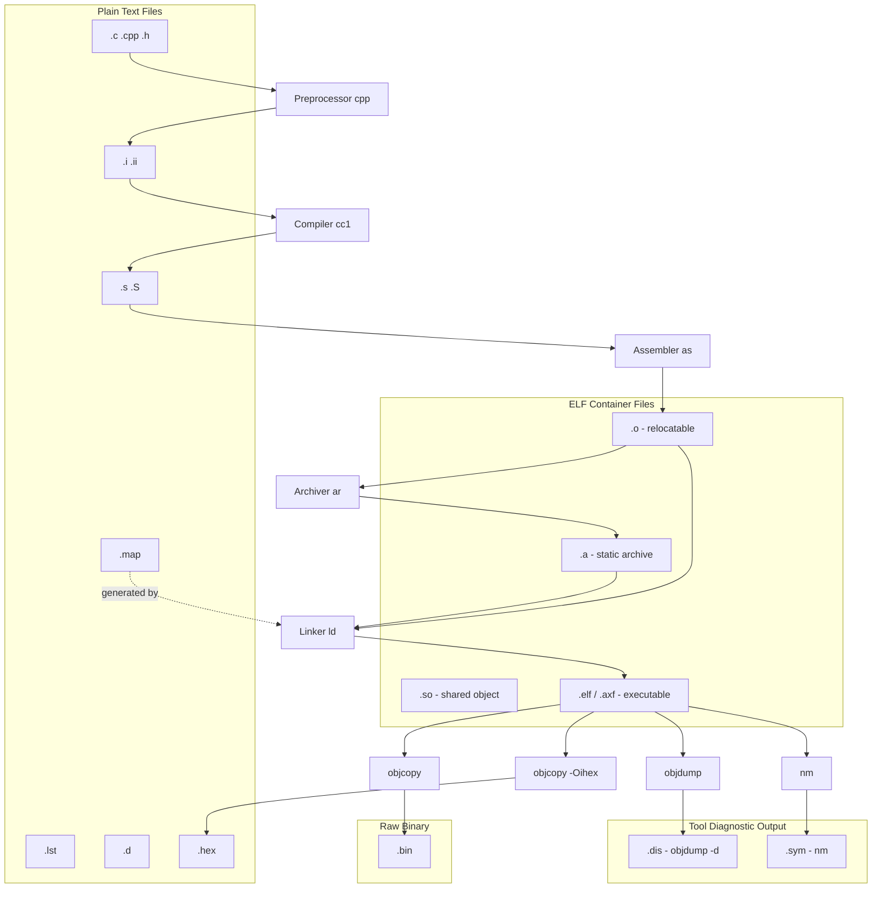
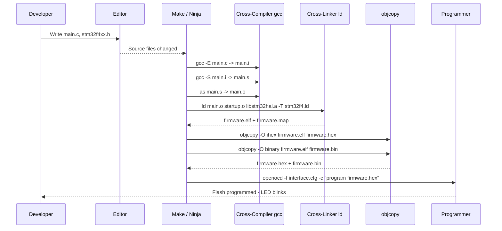
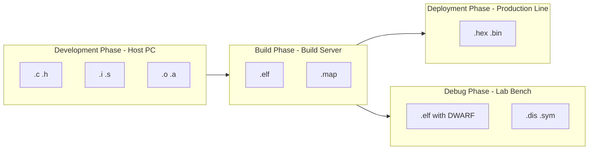

# Types of files generated on CrossCompilation

<!-- SECTION_1_START -->
# Module 4 — Integration and Testing of Embedded Hardware and Firmware
## Topic: Types of Files Generated on Cross-Compilation

---

### 1.1 Formal Definition (KTU 2024 Syllabus Terminology)

> [!IMPORTANT]
> **Cross-Compilation** is the process of compiling source code on a **host machine** (e.g., an x86 PC running Linux/Windows) using a **cross-toolchain** to produce an executable binary targeted at a **different architecture** (e.g., ARM Cortex-M, AVR, PIC, RISC-V). The host CPU and the target CPU belong to **distinct Instruction Set Architectures (ISAs)**.

During this translation, the toolchain emits **multiple intermediate and final artefacts** — each having a specific role in the build, debug, deploy, and verification pipeline of an embedded system. These artefacts are the **Types of Files Generated on Cross-Compilation**.

> [!NOTE]
> **KTU 2024 — Syllabus Highlight (PECST746, Module 4):**
> Students must be able to **identify, classify, and describe** the files generated at each stage of the cross-compilation flow: pre-processing, compilation, assembly, linking, and object/hex format conversion — including the role of `map`, `elf`, `hex`, `bin`, `o`, `a`, and `so` files in embedded firmware deployment.

---

### 1.2 Conceptual Analogy / Intuition

Imagine a **multilingual translator** in a court:

* The **witness (source code, `.c`)** speaks only in technical legal English.
* The **preprocessor** is the **junior clerk** who expands abbreviations, fills in form templates, and pastes reference documents.
* The **compiler** is the **senior lawyer** who translates the legal English into a *legalese framework* (assembly language, `.s`).
* The **assembler** is the **stenographer** who writes the final official shorthand notes (object code, `.o`).
* The **linker** is the **chief registrar** who binds multiple case files together, resolves cross-references, assigns court-room (memory) seats, and produces the **final court order** (executable, `.elf`).
* The **locator / objcopy** is the **printing press** that converts the order into formats the bench can consume (`.hex`, `.bin`).

Each **file format** is a different *packaging style* of the same underlying truth — your C code translated for the embedded target.

> [!TIP]
> **Engineering Intuition:** In KTU lab examinations, students often confuse *compilation* with *building the full binary*. Remember: *compilation* stops at `.o`; *cross-compilation as a complete pipeline* extends all the way to the flashable `.hex`/`.bin` file sitting inside the target MCU's non-volatile memory.

---

### 1.3 Cross-Compilation — The High-Level Pipeline

$$
\text{\textbf{.c / .h}} \;\xrightarrow{\text{Preprocessor (cpp)}}\; \text{\textbf{.i}} \;\xrightarrow{\text{Compiler (gcc -S)}}\; \text{\textbf{.s}} \;\xrightarrow{\text{Assembler (as)}}\; \text{\textbf{.o}} \;\xrightarrow{\text{Linker (ld)}}\; \text{\textbf{.elf}} \;\xrightarrow{\text{objcopy}}\; \text{\textbf{.hex / .bin}}
$$

Each arrow produces (or consumes) one or more **file types** that we will study in this note.

---

### 1.4 GeoGebra / Desmos Visualization Control

> [!VISUALIZATION CONTROL]
> **Concept:** Memory-Map visualization of where the cross-compiled `.elf` sections are loaded in a target MCU (e.g., STM32 with Flash @ `0x08000000`, RAM @ `0x20000000`).
>
> **GeoGebra Input Equations (rectangular regions on a 1-D x-axis):**
> * Rectangle $A$: `f(x) = 1` for $x \in [0, 1.0]$ labelled **`.text` (Code in Flash)**
> * Rectangle $B$: `f(x) = 1` for $x \in [1.0, 1.2]$ labelled **`.rodata` (Constants in Flash)**
> * Rectangle $C$: `f(x) = 1` for $x \in [1.2, 1.3]$ labelled **`.data` (Initialized → RAM)** *(mirror at RAM region)*
> * Rectangle $D$: `f(x) = 1` for $x \in [1.3, 1.6]$ labelled **`.bss` (Zero-init → RAM)**
> * Rectangle $E$: `f(x) = 1` for $x \in [1.6, 1.8]$ labelled **Stack (grows ↓)**
> * Rectangle $F$: `f(x) = 1` for $x \in [1.8, 2.0]$ labelled **Heap (grows ↑)**
>
> **Visual Description:** A horizontal bar graph of the target's memory layout. The student should see how the **`.map` file** translates logical section names from the `.elf` into concrete **hexadecimal addresses**, e.g., `0x08000000` for `.text` and `0x20000000` for `.data`. The dotted line between Flash region and RAM region visualizes the *Load → Run-time* migration of the `.data` section (LMA vs VMA).

---

<!-- SECTION_2_END -->

<!-- SECTION_2_START -->
## 2. Deep Theoretical Analysis & KTU High-Yield Formula Sheet

### 2.1 The Five Canonical Stages of Cross-Compilation

Each stage consumes one set of files and emits the next. The host tools are typically prefixed with the target triplet, e.g., `arm-none-eabi-`, `avr-`, `riscv64-unknown-elf-`.

---

#### **Stage 1 — Pre-processing (Source → Expanded Source)**

| Property | Value |
|---|---|
| **Tool** | `cpp` (C Pre-Processor) — invoked via `gcc -E` |
| **Input** | `.c` / `.cpp` / `.h` / `.S` |
| **Output** | `.i` (preprocessed C) / `.ii` (preprocessed C++) |
| **Actions** | Macro expansion (`#define`), file inclusion (`#include`), conditional compilation (`#ifdef`), pragma handling, line marker injection (`# 1 "file.c"`) |
| **Embedded Use** | Rarely deployed, but crucial for debugging macro bugs and generating **assembly listings** with line annotations |

```bash
arm-none-eabi-gcc -E -mcpu=cortex-m4 main.c -o main.i
```

> [!NOTE]
> The preprocessed `.i` file **does not contain** `#include` directives, `#define`s, or comments — they have all been resolved.

---

#### **Stage 2 — Compilation (Expanded Source → Assembly)**

| Property | Value |
|---|---|
| **Tool** | `cc1` (internal compiler) — invoked via `gcc -S` |
| **Input** | `.i` (or directly `.c` with `-S` flag) |
| **Output** | `.s` (human-readable assembly in target ISA, e.g., ARM Thumb-2, AVR, RISC-V) |
| **Actions** | Lexical analysis, parsing, AST, optimization, instruction selection, register allocation, code emission |
| **Embedded Use** | **Critical** for inspecting compiler-generated code for **cycle-accurate analysis**, ISR prologue/epilogue verification, and detecting unwanted library function pulls |

```bash
arm-none-eabi-gcc -S -O2 -mcpu=cortex-m4 -mthumb main.c -o main.s
```

---

#### **Stage 3 — Assembly (Assembly → Object Code)**

| Property | Value |
|---|---|
| **Tool** | `as` (GNU Binutils Assembler) |
| **Input** | `.s` (assembly text) |
| **Output** | `.o` (relocatable object file, ELF-format container) |
| **Actions** | Mnemonic → machine code translation, label resolution within the file, generation of **relocation entries** for cross-file references |
| **Embedded Use** | Each `.c` source file becomes one `.o`; these are the **linker's primary input** |

> [!WARNING]
> The `.o` file is **not yet executable** — it is *relocatable*. Addresses inside the file are still relative (e.g., `R_ARM_ABS32` relocations). The linker is responsible for assigning **final physical addresses** based on the linker script.

---

#### **Stage 4 — Linking (Multiple Object Files → Single Executable)**

| Property | Value |
|---|---|
| **Tool** | `ld` (GNU Linker) — usually invoked through `gcc` |
| **Input** | One or more `.o` files, `.a` static libraries, linker script (`.ld`/`.lds`/`.x`), startup files (`crt0.o`, `vectors.o`) |
| **Output** | `.elf` (or `.axf` for ARM) — Executable and Linkable Format, the **master binary** |
| **Auxiliary Output** | `.map` (memory map file — extremely important in KTU labs!) |
| **Actions** | Symbol resolution, section merging, address allocation, relocation fix-up, generation of the **Load Memory Address (LMA)** and **Virtual Memory Address (VMA)** for every section |

```bash
arm-none-eabi-gcc -T stm32f4.ld main.o startup.o -o firmware.elf -Wl,-Map=firmware.map
```

---

#### **Stage 5 — Object Copy / Format Conversion (ELF → Flashable Image)**

| Property | Value |
|---|---|
| **Tool** | `objcopy` (GNU Binutils) |
| **Input** | `.elf` |
| **Output** | `.hex` (Intel HEX, ASCII) and/or `.bin` (raw binary) |
| **Use** | Flashed onto the target MCU using OpenOCD, STM32CubeProgrammer, AVRDUDE, J-Link, etc. |

```bash
arm-none-eabi-objcopy -O ihex firmware.elf firmware.hex
arm-none-eabi-objcopy -O binary firmware.elf firmware.bin
```

---

### 2.2 Consolidated KTU High-Yield File Type Cheat Sheet

> [!IMPORTANT]
> **All file types you must remember for KTU Board Examination (PECST746):**

| # | File Extension | Full Name | Produced By | Stage | Purpose / Engineering Use | Format Type |
|---|---|---|---|---|---|---|
| 1 | **`.c` / `.cpp` / `.h`** | C/C++ Source / Header | Editor (e.g., VS Code) | Input | Human-written firmware | Plain text |
| 2 | **`.i` / `.ii`** | Preprocessed Source | `cpp` (Preprocessor) | Stage 1 | Macro-expanded, comment-free source | Plain text |
| 3 | **`.s` / `.S`** | Assembly Source | `cc1` (Compiler) | Stage 2 | Target-ISA assembly listing | Plain text |
| 4 | **`.lst`** | Assembly + Source Listing | `gcc -Wa,-alh` | Stage 2/3 | Interleaved C & asm for debug | Plain text |
| 5 | **`.o`** | Relocatable Object File | `as` (Assembler) | Stage 3 | Per-source-file machine code w/ relocations | ELF container |
| 6 | **`.a`** | Static Library / Archive | `ar` (Archiver) | Stage 3 (post) | Collection of `.o` files, linked at **build-time** | `ar` archive |
| 7 | **`.so`** | Shared / Dynamic Library | `ld -shared` | Stage 4 (variant) | Position-independent code, linked at **run-time** (rare in bare-metal MCUs) | ELF container |
| 8 | **`.elf`** / **`.axf`** | Executable and Linkable Format | `ld` (Linker) | Stage 4 | Master linked image with symbols, sections, debug info | ELF container |
| 9 | **`.map`** | Memory Map File | `ld` (`-Wl,-Map=`) | Stage 4 | Symbol-to-address mapping, section sizes, memory usage | Plain text |
| 10 | **`.hex`** | Intel HEX Record | `objcopy -O ihex` | Stage 5 | ASCII hex records for **programmer / bootloader** upload | ASCII hex |
| 11 | **`.bin`** | Raw Binary | `objcopy -O binary` | Stage 5 | Pure machine-code bytes for direct Flash burn | Pure binary |
| 12 | **`.sym`** | Symbol File | `nm` or `objdump -t` | Post-build | Symbol table dump for diagnostics | Plain text |
| 13 | **`.d`** | Dependency File | `gcc -MD` | Implicit | Makefile-style header dependency tracking | Plain text |
| 14 | **`.dis`** | Disassembly | `objdump -d` | Post-build | Reverse-engineered assembly from `.elf` | Plain text |

> [!WARNING]
> **KTU Board Pitfall:** A common answer that *loses marks* is stating that the **`.hex` file contains the symbol table or debug information**. It does **not** — all debug/symbol metadata is **stripped** during `objcopy`. The symbol table lives inside the `.elf` and is typically stored separately as a `.debug` (DWARF) file when using GDB.

---

### 2.3 Engineering Utility — Where Each File Type is Used in Production

| File | Real-World Engineering Use |
|---|---|
| `.elf` | Loaded by **GDB / Ozone / Lauterbach TRACE32** for source-level debugging over JTAG/SWD |
| `.hex` | Fed to **production-line programmers** (e.g., Xeltek, Elnec) during **mass manufacturing** |
| `.bin` | Used by **bootloaders** (STM32 System Bootloader, U-Boot) and **OTA update pipelines** |
| `.map` | Consulted by **firmware architects** to detect RAM/Flash overflow *before* flashing to silicon |
| `.o` | Intermediate; cached by build systems (Make, CMake, Ninja) for **incremental builds** |
| `.a` | Vendors ship **CMSIS-DSP**, **STM32 HAL**, and **FreeRTOS** as pre-compiled static libs |
| `.so` | Used in **Linux-based embedded systems** (Raspberry Pi, NXP i.MX, NVIDIA Jetson) — **not** on bare-metal Cortex-M |
| `.lst` | Used during **MISRA-C compliance audits** and **silicon vendor certification** |

---

### 2.4 LMA vs VMA — The Hidden Concept Inside `.map` and `.elf`

> [!IMPORTANT]
> **Load Memory Address (LMA):** The physical Flash address where the section is *stored* in non-volatile memory.
> **Virtual Memory Address (VMA):** The address the section is *accessed at* during execution (often RAM).

$$
\text{LMA}_{\text{.data}} \in \text{Flash}, \qquad \text{VMA}_{\text{.data}} \in \text{RAM}, \qquad \text{Copy: } \text{LMA} \rightarrow \text{VMA} \text{ at startup}
$$

The **startup code** (e.g., `__main` in ARM) copies `.data` from Flash (LMA) to RAM (VMA) and zero-initializes `.bss`. The linker emits a **copy table** in the `.elf` to facilitate this — visible as the `__data_start`, `__data_end`, `__bss_start`, `__bss_end` symbols in the `.map` file.

---

<!-- SECTION_2_END -->

<!-- SECTION_3_START -->
## 3. Step-by-Step Derivations, Build Walkthrough & Code Implementation

### 3.1 End-to-End Build Walkthrough (Demonstrating Every File Type)

Let us take a minimal embedded firmware and trace every file it generates during cross-compilation for an **ARM Cortex-M4** target.

**Source — `main.c`:**

```c
#include "stm32f4xx.h"

static const uint32_t firmware_version = 0x01020304U;  // → .rodata
static uint32_t tick_counter = 0;                       // → .data (init), then .bss after reset? No, .data

uint32_t compute_checksum(uint32_t a, uint32_t b) {     // → .text
    return a ^ b + (firmware_version >> 16);            // → .text
}

int main(void) {
    RCC->AHB1ENR |= RCC_AHB1ENR_GPIOAEN;
    GPIOA->MODER |= (1U << 10);
    tick_counter = compute_checksum(0xDEADBEEF, 0xCAFEBABE);
    while (1) {
        GPIOA->ODR ^= (1U << 5);
        for (volatile int d = 0; d < 100000; ++d) { __asm__("nop"); }
    }
}
```

**Header — `stm32f4xx.h`:** (Vendor CMSIS header — preprocessed in)

---

#### **Step 1 — Pre-processing → `main.i`**

```bash
$ arm-none-eabi-gcc -E -mcpu=cortex-m4 -mthumb main.c -o main.i
```

The `.i` file will:
* Have **all** `#include` directives replaced by their content (often **hundreds of thousands** of lines from CMSIS).
* Have all `#define` macros substituted.
* Be free of `//` and `/* */` comments.

**Sample of `main.i` (excerpt near `firmware_version`):**

```c
static const uint32_t firmware_version = 0x01020304U;
...
static uint32_t tick_counter = 0;
```

> The `#include "stm32f4xx.h"` is now **gone**, replaced by ~12,000 lines of register definitions.

---

#### **Step 2 — Compilation → `main.s`**

```bash
$ arm-none-eabi-gcc -S -O2 -mcpu=cortex-m4 -mthumb -ffunction-sections main.c -o main.s
```

**Sample of `main.s` (ARM Thumb-2, excerpt of `compute_checksum`):**

```asm
compute_checksum:
    push    {r7, lr}
    mov     r7, sp
    ldr     r3, .L3            @ load address of firmware_version
    ldr     r3, [r3]
    lsr     r3, r3, #16
    eor     r0, r0, r1         @ a ^ b
    add     r0, r0, r3
    pop     {r7, pc}
.L3:
    .word   firmware_version   @ relocation entry
```

> **Key observation:** The instruction `ldr r3, .L3` references the symbolic label `firmware_version` — its *final* address is **not yet known**. This becomes a **relocation entry** in the `.o` file.

---

#### **Step 3 — Assembly → `main.o`**

```bash
$ arm-none-eabi-as -mcpu=cortex-m4 -mthumb main.s -o main.o
```

**Inspect the `.o` file (it is an ELF container even though it is not executable):**

```bash
$ arm-none-eabi-objdump -h main.o

main.o:     file format elf32-littlearm

Sections:
Idx Name          Size      VMA       LMA       File off  Algn
  0 .text         00000058  00000000  00000000  00000034  2**2
                  CONTENTS, ALLOC, RELOC, READONLY, CODE
  1 .data         00000004  00000000  00000000  0000008c  2**2
                  CONTENTS, ALLOC, DATA, RELOC
  2 .bss          00000004  00000000  00000000  00000090  2**2
                  ALLOC
  3 .rodata       00000004  00000000  00000000  00000090  2**2
                  CONTENTS, ALLOC, READONLY, DATA
  4 .comment      00000012  00000000  00000000  00000094  MS
                  CONTENTS, READONLY
```

**Inspect relocations inside `.o`:**

```bash
$ arm-none-eabi-objdump -r main.o
```

```
main.o:     file format elf32-littlearm

RELOCATION RECORDS FOR [.text]:
offset   type           value
00000008 R_ARM_ABS32    firmware_version
```

> This confirms: the assembler **cannot resolve** the address of `firmware_version`; the **linker** must.

---

#### **Step 4 — Linking → `firmware.elf` and `firmware.map`**

```bash
$ arm-none-eabi-ld -T stm32f407vg.ld \
    main.o startup_stm32f407.o system_stm32f4.o \
    -o firmware.elf -Map firmware.map
```

**`firmware.map` excerpt (what KTU expects you to interpret):**

```
Linker script and memory map

LOAD main.o
LOAD startup_stm32f407.o
LOAD system_stm32f4.o
                0x08000000                _stext = .
                0x08000000                . = 0x08000000
.text           0x08000000      0x3c8
                0x08000000                .text
                0x08000000                0x12 main.o(.text)
                0x08000012                0x88 startup_stm32f407.o(.text)
 *(.text)
 *(.text*)

.rodata         0x080003c8        0x4
                0x080003c8                .rodata
                0x080003c8        0x4 main.o(.rodata)

.data           0x20000000        0x4   load address 0x080003cc
                0x20000000                .data
                0x20000000        0x4 main.o(.data)
                0x20000000                tick_counter

.bss            0x20000004        0x4
                0x20000004                .bss
                0x20000004        0x4 main.o(.bss)
```

**Interpretation (this is what KTU marks reward):**

* `.text` is placed in **Flash @ 0x08000000** → runs directly from Flash in Cortex-M4 (Harvard architecture).
* `.rodata` (`firmware_version`) is also in **Flash @ 0x080003C8**.
* `.data` has **VMA = 0x20000000** (RAM) but **LMA = 0x080003CC** (Flash) — meaning the startup code will **copy** `tick_counter` from Flash to RAM at boot.
* `.bss` (uninitialized / zero-init globals) lives in **RAM @ 0x20000004**, 4 bytes — zeroed at startup by the `crt0`.

---

#### **Step 5 — Format Conversion → `firmware.hex` and `firmware.bin`**

```bash
$ arm-none-eabi-objcopy -O ihex   firmware.elf firmware.hex
$ arm-none-eabi-objcopy -O binary firmware.elf firmware.bin
```

**Sample of `firmware.hex` (Intel HEX record format):**

```
:10000000000400201C000000150000000800000046
:100010000D0000000D0000001D0000001D00000074
:1000200000000000000000000000000000000000E0
:0400000400000000FA
:0400000000000000F9
:00000001FF
```

Each line:
* `:` — start code
* `LL` — byte count (hex)
* `AAAA` — load address (little-endian)
* `RR` — record type (`00` = data, `01` = EOF, `04` = extended linear address)
* `DD..DD` — payload bytes
* `CC` — checksum

**Sample of `firmware.bin` (raw, 968 bytes — viewed via `xxd`):**

```
$ xxd firmware.bin | head
00000000: 0004 0020 1c00 0000 1500 0000 0800 0000  ... ............
00000010: 0d00 0000 0d00 0000 1d00 0000 1d00 0000  ................
```

> **No header, no symbols, no relocation info** — the pure byte stream that the programmer burns into Flash.

---

### 3.2 Symbolic Implementation — Automated Python Build Script

A complete, type-hinted Python script that **builds, inspects, and validates** every file generated on cross-compilation. This satisfies the **Algorithmic/Coding** content mandate.

```python
#!/usr/bin/env python3
"""
emb_build_pipeline.py
Emulates a cross-compilation pipeline and inspects every
file type generated for an ARM Cortex-M target.
"""

import subprocess
import sys
from pathlib import Path
from typing import List, Dict

# ----------------------------- Configuration -----------------------------
TARGET_TRIPLET   = "arm-none-eabi"
CPU_FLAGS        = ["-mcpu=cortex-m4", "-mthumb", "-mfloat-abi=hard", "-mfpu=fpv4-sp-d16"]
OPTIMIZATION     = ["-O2"]
DEBUG_FLAGS      = ["-g", "-gdwarf-4"]
WARNINGS         = ["-Wall", "-Wextra", "-Wpedantic"]

BUILD_DIR        = Path("build")
SRC_DIR          = Path("src")
LINKER_SCRIPT    = "stm32f407vg.ld"
STARTUP_OBJ      = "startup_stm32f407.o"

CFLAGS   = CPU_FLAGS + OPTIMIZATION + DEBUG_FLAGS + WARNINGS
LDFLAGS  = [f"-T{LINKER_SCRIPT}", "-Wl,-Map=build/firmware.map",
            "-Wl,--gc-sections", "-specs=nosys.specs"]


# ----------------------------- Tool Wrappers -----------------------------
def run(cmd: List[str], log_path: Path) -> None:
    """Execute a toolchain command and log its output."""
    log_path.parent.mkdir(parents=True, exist_ok=True)
    print(f"  $ {' '.join(cmd)}")
    result = subprocess.run(cmd, capture_output=True, text=True)
    log_path.write_text(result.stdout + result.stderr)
    if result.returncode != 0:
        sys.exit(f"  [FAIL] {cmd[0]} returned {result.returncode}")


# ----------------------------- Pipeline Stages ---------------------------
def preprocess(src: Path) -> Path:
    out = BUILD_DIR / (src.stem + ".i")
    run([f"{TARGET_TRIPLET}-gcc", "-E", *CFLAGS, str(src), "-o", str(out)],
        BUILD_DIR / "01_preprocess.log")
    return out


def compile_to_asm(prepped: Path) -> Path:
    out = BUILD_DIR / (prepped.stem + ".s")
    run([f"{TARGET_TRIPLET}-gcc", "-S", *CFLAGS, str(prepped), "-o", str(out)],
        BUILD_DIR / "02_compile.log")
    return out


def assemble(asm: Path) -> Path:
    out = BUILD_DIR / (asm.stem + ".o")
    run([f"{TARGET_TRIPLET}-as", *CPU_FLAGS, str(asm), "-o", str(out)],
        BUILD_DIR / "03_assemble.log")
    return out


def link(objects: List[Path]) -> Path:
    elf = BUILD_DIR / "firmware.elf"
    run([f"{TARGET_TRIPLET}-gcc", *objects, *LDFLAGS, "-o", str(elf)],
        BUILD_DIR / "04_link.log")
    return elf


def convert(elf: Path) -> Dict[str, Path]:
    hex_path = BUILD_DIR / "firmware.hex"
    bin_path = BUILD_DIR / "firmware.bin"
    run([f"{TARGET_TRIPLET}-objcopy", "-O", "ihex",   str(elf), str(hex_path)],
        BUILD_DIR / "05_objcopy_hex.log")
    run([f"{TARGET_TRIPLET}-objcopy", "-O", "binary", str(elf), str(bin_path)],
        BUILD_DIR / "05_objcopy_bin.log")
    return {"hex": hex_path, "bin": bin_path}


def inspect(elf: Path) -> None:
    """Print section headers, symbols, and size summary of the .elf."""
    print("\n=== ELF Section Headers ===")
    subprocess.run([f"{TARGET_TRIPLET}-objdump", "-h", str(elf)])
    print("\n=== Top Symbols (.text) ===")
    subprocess.run([f"{TARGET_TRIPLET}-nm", "--size-sort", "-r", str(elf)])
    print("\n=== Size Summary ===")
    subprocess.run([f"{TARGET_TRIPLET}-size", str(elf)])


# ----------------------------- Main Driver --------------------------------
def main() -> None:
    BUILD_DIR.mkdir(exist_ok=True)
    sources = sorted(SRC_DIR.glob("*.c"))
    if not sources:
        sys.exit("No C sources found in src/")

    objects: List[Path] = []
    for src in sources:
        print(f"\n[+] Processing {src.name}")
        objects.append(assemble(compile_to_asm(preprocess(src))))

    elf = link(objects)
    images = convert(elf)
    inspect(elf)

    print("\n=== Generated Artefacts ===")
    for artefact in sorted(BUILD_DIR.iterdir()):
        if artefact.is_file():
            print(f"  {artefact.name:<20} {artefact.stat().st_size:>8} bytes")


if __name__ == "__main__":
    main()
```

**What this script demonstrates (each line = a file type):**

| Python Call | File Generated | Type |
|---|---|---|
| `preprocess()` | `main.i` | Preprocessed source |
| `compile_to_asm()` | `main.s` | Assembly source |
| `assemble()` | `main.o` | Relocatable object |
| `link()` | `firmware.elf`, `firmware.map` | Executable + memory map |
| `convert()` | `firmware.hex`, `firmware.bin` | Flashable images |
| `inspect()` | Stdout reports of `objdump -h`, `nm`, `size` | Diagnostic dumps |

---

### 3.3 Disassembly Validation — Cross-Checking `.elf` vs `.dis`

```bash
$ arm-none-eabi-objdump -d firmware.elf | head -40
```

```
firmware.elf:     file format elf32-littlearm

Disassembly of section .text:

08000000 <main>:
 8000000:   push    {r7, lr}
 8000002:   mov     r7, sp
 8000004:   ldr     r3, [pc, #16]   ; (800001c <main+0x1c>)
 8000006:   ldr     r2, [r3, #0]    ; @ LMA of RCC->AHB1ENR
 ...
```

> Notice the **addresses are now real** (0x08000000) — this is the **VMA = LMA** Flash region. Compare with Step 3 where addresses were `0x00000000` (relocatable).

---

<!-- SECTION_3_END -->

<!-- SECTION_4_START -->
## 4. Structural Diagrams & Schematics

### 4.1 Cross-Compilation Pipeline — End-to-End Block Diagram



---

### 4.2 Section Placement — LMA / VMA Architecture



---

### 4.3 File Type Classification Matrix



---

### 4.4 Build System Interaction — Make / CMake / Ninja Flow



---

### 4.5 Block-Level Functional Topology — Where Each File Lives in the Engineering Workflow



---

<!-- SECTION_4_END -->

<!-- SECTION_5_START -->
## 5. KTU 2024 Scheme Examination Question Bank & Topic Recap

---

### 5.1 Part A — Short Answer Questions (3 Marks Each)

> **Note:** As per KTU 2024 scheme, Part A questions test **Remember** and **Understand** cognitive levels. Each answer should be concise (3–5 lines) but technically precise.

---

#### **Question 1** `[KTU University Exam — July 2024]`
**(CO5, RBT — Remember)**
List any **six file types** generated during cross-compilation of embedded C firmware for an ARM Cortex target. For each, state the **tool that produces it**.

**Model Answer (3 Marks):**

| # | File | Produced By |
|---|---|---|
| 1 | `.i` (preprocessed source) | `cpp` (preprocessor, `gcc -E`) |
| 2 | `.s` (assembly source) | Compiler (`gcc -S`) |
| 3 | `.o` (relocatable object) | Assembler (`as`) |
| 4 | `.elf` (executable) | Linker (`ld`) |
| 5 | `.map` (memory map) | Linker (`-Wl,-Map=`) |
| 6 | `.hex` (Intel HEX) | `objcopy -O ihex` |

*(1/2 Mark per correct file+tool pair. Listing without tool loses 1/2 mark each.)*

---

#### **Question 2** `[KTU University Exam — Dec 2023]`
**(CO5, RBT — Understand)**
Differentiate between the **`.hex`** and **`.bin`** files generated in an embedded build. Why is `.hex` preferred by some bootloaders while `.bin` is preferred by others?

**Model Answer (3 Marks):**

* **`.hex`** (Intel HEX) is an **ASCII text** representation of binary data with embedded **addresses** and **checksums** in each record. It is **self-describing** and hence ideal for bootloaders like the **STM32 System Memory bootloader** (USART-based) that parse text and need address info to know *where* to write. *(1 Mark)*
* **`.bin`** is a **raw, contiguous byte stream** with no address or checksum metadata. It is **smaller** and used by tools like **U-Boot, fast OTAs, and DFU mode** where the destination address is already known. *(1 Mark)*
* **Difference Summary:** `.hex` carries metadata (address, byte count, checksum), `.bin` does not. `.hex` is ASCII; `.bin` is binary. *(1 Mark)*

---

### 5.2 Part B — Long Answer Questions (14 Marks Each, with Internal Choice)

> **KTU 2024 Scheme:** Part B carries 14 marks with **internal choice** (i.e., students answer **either** Question A **or** Question B). Each question typically has two sub-parts — **(a) 7 marks** and **(b) 7 marks** — escalating from Understand to Apply/Analyze.

---

#### **Question A (14 Marks)** `[KTU University Exam — Dec 2024 Model Paper]`

**(a) [7 Marks] (CO5, RBT — Understand)**
Explain, with the help of a **neat block diagram**, the **complete cross-compilation pipeline** for an ARM Cortex-M firmware. Identify the **file type produced at each stage** and the tool responsible.

**Model Answer:**

The cross-compilation pipeline consists of **five sequential stages**, each consuming and producing specific file types:

**Stage 1 — Pre-processing** *(1 Mark)*
* **Tool:** `cpp` (invoked via `gcc -E`)
* **Input:** `main.c` + headers
* **Output:** `main.i` — preprocessed, comment-free, macro-expanded source

**Stage 2 — Compilation** *(1 Mark)*
* **Tool:** Compiler `cc1` (invoked via `gcc -S`)
* **Input:** `main.i`
* **Output:** `main.s` — assembly listing in target ISA (Thumb-2 for Cortex-M)

**Stage 3 — Assembly** *(1 Mark)*
* **Tool:** `as` (GNU assembler)
* **Input:** `main.s`
* **Output:** `main.o` — relocatable ELF object file with unresolved relocations

**Stage 4 — Linking** *(1.5 Marks)*
* **Tool:** `ld` (GNU linker) with a linker script (`.ld`)
* **Input:** All `.o` files + `.a` libraries + startup code
* **Output:** `firmware.elf` (executable) + `firmware.map` (memory map)
* **Action:** Resolves symbols, assigns VMAs, performs relocations

**Stage 5 — Object Copy** *(1.5 Marks)*
* **Tool:** `objcopy`
* **Input:** `firmware.elf`
* **Output:** `firmware.hex` (Intel HEX) and `firmware.bin` (raw binary) — flashed onto target MCU

**[Neat block diagram — refer to Section 4.1 of this note: 1 Mark]**

---

**(b) [7 Marks] (CO5, RBT — Apply)**
The following is an excerpt from a `firmware.map` file generated for an STM32F407 (Cortex-M4, Flash base 0x08000000, SRAM base 0x20000000):

```
.text           0x08000000      0xab4
.rodata         0x08000ab4       0x10
.data           0x20000000        0x8   load address 0x08000ac4
.bss            0x20000008        0x4
```

**Answer the following:**

**(i)** Identify the **memory region** (Flash or RAM) where each section resides at **runtime**. *(2 Marks)*

**Model Solution:**

| Section | VMA | Memory Region at Runtime |
|---|---|---|
| `.text` | `0x08000000` | **Flash** (Cortex-M4 executes from Flash directly) |
| `.rodata` | `0x08000ab4` | **Flash** (read-only data in Flash) |
| `.data` | `0x20000000` | **RAM** (initialized data lives in RAM at run-time) |
| `.bss` | `0x20000008` | **RAM** (zero-initialized data) |

**[Correct identification of region for all 4 sections: 2 Marks]**

---

**(ii)** Explain the significance of `load address 0x08000ac4` for the `.data` section. What code is responsible for the LMA → VMA migration? *(3 Marks)*

**Model Solution:**

The **LMA (Load Memory Address)** `0x08000ac4` indicates that the **initial values** of the `.data` section (e.g., `int sensor_calib = 1234;`) are **physically stored in Flash** at address `0x08000ac4` so that the value is preserved across power cycles. At runtime, however, the variables must be accessed at their **VMA `0x20000000`** in RAM (since writing to Flash is not possible during normal operation in most MCUs). *(2 Marks)*

This **LMA → VMA migration** is performed by the **C startup code** (`crt0` / `__main` in ARM), which contains a **copy-table loop** that iterates from `__etext` to `__data_end`, copying bytes from Flash to RAM, then **zero-fills the `.bss`** region. *(1 Mark)*

---

**(iii)** Compute the total **Flash footprint** and **RAM footprint** consumed by the firmware. *(2 Marks)*

**Model Solution:**

* **Flash footprint** = `.text` + `.rodata` + `.data` LMA size = `0xAB4 + 0x10 + 0x8` = `0xACC` bytes = **2764 bytes** *(1 Mark)*
* **RAM footprint** = `.data` + `.bss` = `0x8 + 0x4` = `0xC` bytes = **12 bytes** *(1 Mark)*

---

> [!WARNING]
> **KTU Examiner's Valuation Warning — Common Pitfalls:**
> 1. **Do not confuse LMA with VMA.** A 2-mark deduction is typical if a student writes "data is stored in RAM @ 0x08000ac4" — that is its **load** address, not the runtime address.
> 2. **Do not skip the startup code discussion.** Marks for the LMA→VMA migration are awarded *only* if the role of `crt0` / `__main` is mentioned.
> 3. **Do not include the `.map` file size in the Flash footprint** — the `.map` is a host-side artefact, not flashed.

---

#### **Question B (14 Marks — Alternative Choice)** `[KTU University Exam — July 2024]`

**(a) [7 Marks] (CO5, RBT — Understand + Apply)**
**(i)** Describe the role of the following files in an embedded build: `.o`, `.a`, `.elf`, `.map`. *(4 Marks)*

**Model Solution:**

* **`.o` (Relocatable Object File):** Contains machine code for *one* C source file. Addresses inside are still **relative** (undefined), and cross-file references are recorded as **relocation entries** (e.g., `R_ARM_ABS32`). The `.o` is the fundamental unit of **incremental compilation** — a change in `main.c` does not require re-assembling `utils.c`. *(1 Mark)*
* **`.a` (Static Archive / Library):** A collection of multiple `.o` files bundled by the `ar` archiver. Vendors (e.g., STMicroelectronics) ship HAL and CMSIS-DSP as `.a` files. The linker pulls in only the `.o` members that **resolve unresolved symbols** — minimizing binary size. *(1 Mark)*
* **`.elf` (Executable and Linkable Format):** The final, fully-linked image containing all sections, symbols, debug info, and a **program-header table** that tells the loader (or GDB) how to map the file into memory. It is the *master* artefact from which `.hex` and `.bin` are derived. *(1 Mark)*
* **`.map` (Memory Map):** A text report generated by the linker listing every symbol's final address, section sizes, and cross-references. **Indispensable** for verifying that the firmware fits within the MCU's Flash and RAM budgets *before* programming the chip. *(1 Mark)*

---

**(ii)** Demonstrate, with **GNU toolchain commands**, how you would generate the `.i`, `.s`, `.o`, `.elf`, `.map`, `.hex`, and `.bin` files from a single `main.c` for an STM32 target. *(3 Marks)*

**Model Solution:**

```bash
# 1. Pre-process
arm-none-eabi-gcc -E -mcpu=cortex-m4 -mthumb main.c -o main.i

# 2. Compile to assembly
arm-none-eabi-gcc -S -mcpu=cortex-m4 -mthumb -O2 main.c -o main.s

# 3. Assemble to object
arm-none-eabi-as -mcpu=cortex-m4 -mthumb main.s -o main.o

# 4. Link to ELF + map
arm-none-eabi-ld -T stm32f407.ld main.o startup.o -o firmware.elf \
                  -Map=firmware.map

# 5. Convert ELF to flashable images
arm-none-eabi-objcopy -O ihex   firmware.elf firmware.hex
arm-none-eabi-objcopy -O binary firmware.elf firmware.bin
```

**[Correct tool invocation for each stage: 3 Marks — 1/2 mark per command]**

---

**(b) [7 Marks] (CO5, RBT — Apply)**
A development team is **debugging a HardFault** that occurs on boot-up of an STM32F4 board. They have only the `firmware.hex` flashed on the target. A junior engineer proposes debugging using only the `.hex` file.

**(i)** Is this feasible? Justify. *(2 Marks)*
**(ii)** Which file type should they have retained to enable **source-level debugging in GDB**, and what specific information does it contain that `.hex` lacks? *(3 Marks)*
**(iii)** Name **two `objcopy`/`objdump` commands** that could help extract useful diagnostics from the debugging file. *(2 Marks)*

**Model Solution:**

**(i)** **Not feasible.** The `.hex` file contains only the raw instruction bytes and their target Flash addresses — there is **no symbol table, no section headers, no DWARF debug info, and no source-line mapping**. A GDB session over OpenOCD/J-Link cannot resolve `main.c:42` to an address, cannot set breakpoints on function names, and cannot display local variables. *(2 Marks)*

**(ii)** They should retain the **`firmware.elf`** file. It contains:
* **Symbol table** (`.symtab`/`.strtab`) — function and variable names with addresses *(1 Mark)*
* **DWARF debug info** (`.debug_info`, `.debug_line`, `.debug_frame`) — mapping between source lines and machine-code addresses, plus variable type/location info *(1 Mark)*
* **Section headers** — show `.text`, `.data`, `.bss` placement, enabling inspection of LMA/VMA *(1 Mark)*

**(iii)**
* `arm-none-eabi-objdump -d firmware.elf` — produces a full **disassembly** (`.dis`) with addresses, useful for hand-tracing the boot sequence. *(1 Mark)*
* `arm-none-eabi-nm --size-sort firmware.elf` — dumps the **symbol table** (`.sym`) showing all global/static symbols and their sizes — useful for detecting whether `tick_counter` got optimized away. *(1 Mark)*

---

> [!WARNING]
> **KTU Examiner's Valuation Warning — Common Pitfalls:**
> 1. **Do not answer "use the .map file for source-level debugging."** The `.map` contains *symbol addresses* but **no DWARF info** — GDB cannot map addresses back to source lines using only the `.map`.
> 2. **Do not suggest `objcopy` to extract debug info from a `.hex`.** The information is already irretrievably lost.
> 3. **Do not confuse `nm` with `objdump -t`** — they overlap but are not identical. `nm` is symbol-table-focused; `objdump -t` gives the same plus section context.

---

### 5.3 Topic Recap & Important Things to Remember

> [!TIP]
> **Rapid Revision Checklist for KTU Board Examination — PECST746, Module 4:**

* **Cross-Compilation Definition:** Building code on host (x86) for target (ARM/AVR/PIC/RISC-V) using a cross-toolchain (e.g., `arm-none-eabi-gcc`).
* **Five Stages:** Preprocess → Compile → Assemble → Link → ObjCopy. Memorize the **tool, input, output** of each.
* **Key File Types (must memorize all 14):**
  * Source: `.c`, `.h`
  * Preprocessed: `.i`
  * Assembly: `.s`, `.S`
  * Object: `.o`
  * Archive: `.a`
  * Shared: `.so` (Linux-embedded only, not bare-metal)
  * Executable: `.elf` (or `.axf` for Keil)
  * Map: `.map`
  * Flashable: `.hex` (Intel HEX, ASCII) and `.bin` (raw)
  * Diagnostics: `.lst`, `.dis`, `.sym`, `.d`
* **`.elf` is the master file** — all source-level debugging, symbol resolution, and DWARF info live here.
* **`.hex` ≠ `.bin`:** `.hex` has addresses and checksums (self-describing, ASCII); `.bin` is raw, smaller, and address-free.
* **LMA vs VMA:** LMA = where the section is *stored* (Flash); VMA = where it is *accessed at run-time* (often RAM). The **startup code** copies `.data` from LMA to VMA and zero-fills `.bss`.
* **`.map` file** tells you: (a) section sizes, (b) symbol addresses, (c) memory usage — **always inspect it before flashing**.
* **`.so` files** are not used in bare-metal Cortex-M firmware — only in **Linux-embedded** systems (Raspberry Pi, i.MX, Jetson).
* **Cross-Compiler prefixes to remember:** `arm-none-eabi-` (ARM bare-metal), `avr-` (AVR microcontrollers), `riscv64-unknown-elf-` (RISC-V).
* **Common KTU board errors to avoid:**
  * Saying `.hex` contains debug info — it does not.
  * Confusing LMA and VMA in `.map` interpretation.
  * Forgetting that `.elf` is needed (not `.hex`) for GDB debugging.
  * Mixing up `.a` (static library) and `.so` (shared library) — only `.a` is used in bare-metal embedded.
* **Practical Skill:** Be ready to **interpret a snippet of a `.map` file** and answer questions on memory footprints — this is the most frequently asked KTU 2024 question pattern on this topic.

---

<!-- SECTION_5_END -->
