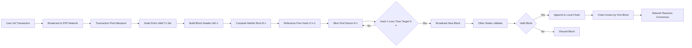
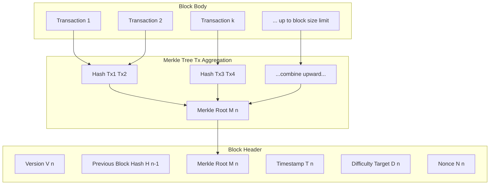
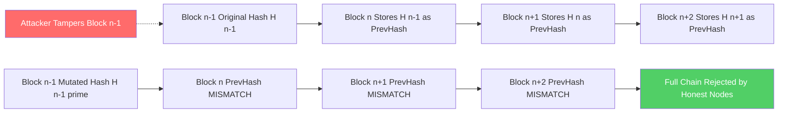
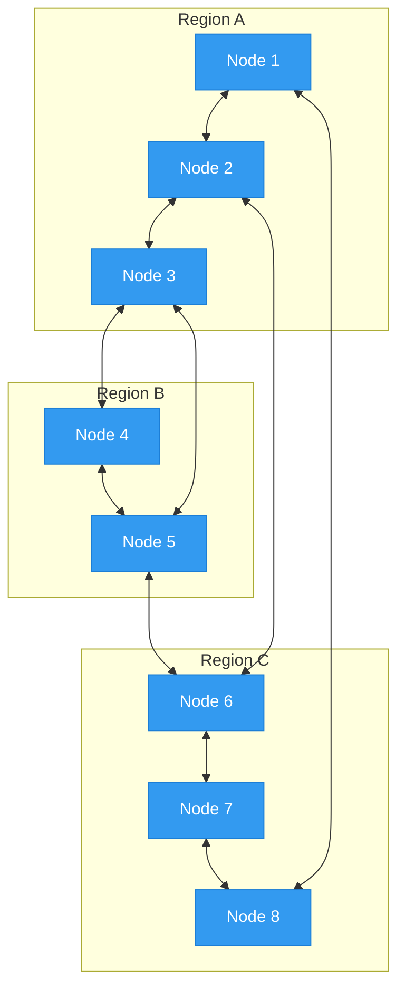

# Blockchain Definition

<!-- SECTION_1_START -->
# BLOCKCHAIN DEFINITION — KTU 2024 Scheme Study Notes

## 1. Core Technical Definition & Intuitive Overview

### 1.1 Formal Academic Definition (KTU 2024 Syllabus Terminology)

> [!IMPORTANT]
> **Blockchain** is a **distributed, decentralized, immutable digital ledger** that records transactions across a peer-to-peer (P2P) network of computers in a verifiable and permanent way. Each block contains a cryptographic hash of the previous block, a timestamp, and transaction data, forming a chronological chain that resists retroactive modification without the consensus of the network.

The term was popularized in the **2008 white paper by Satoshi Nakamoto** titled *"Bitcoin: A Peer-to-Peer Electronic Cash System"*, which proposed blockchain as the underlying infrastructure for the Bitcoin cryptocurrency.

### 1.2 Conceptual Analogy / Intuition

> [!NOTE]
> **Real-World Analogy: The Public Bulletin Board with Permanent Marker**

Imagine a **community notice board** in a village square:
- Anyone can **add a new notice** (write a transaction), but once a notice is pasted, it is sealed under a transparent layer of glass.
- Each notice (a **block**) is glued on top of the previous one, and a **unique fingerprint (hash)** of the previous notice is written on the new one.
- A copy of the entire board is held by **every villager** (decentralization).
- To tamper with an old notice, an attacker would have to break the glass on every copy in every village, and **re-fingerprint** every notice after it — practically impossible if there are thousands of honest villagers.

This is exactly how blockchain works:
- **Villagers** → Network nodes (computers)
- **Notices** → Blocks of transactions
- **Fingerprint** → Cryptographic hash (e.g., **SHA-256**)
- **Glass seal** → Cryptographic immutability
- **Copies everywhere** → Distributed ledger

> [!TIP]
> **Geometric Intuition:** A blockchain can be visualized as a **one-way linked list of cryptographic seals**. Each block points strictly backwards through a hash pointer — you can verify history in O(1), but you cannot rewrite it without breaking every subsequent link.

### 1.3 Visual & Interactive Learning

> [!VISUALIZATION CONTROL]
> **Concept:** Hash Chain Linking
> **Conceptual Representation:**
> * Block $0$ (Genesis) → $H_0$
> * Block $1$ → contains $H_0$, gets $H_1$
> * Block $n$ → contains $H_{n-1}$, gets $H_n$
> **Visual Description:** A horizontal sequence of boxes where each box has an arrow pointing to the previous box's fingerprint. The chain grows left-to-right; tampering with box $k$ changes $H_k$, which breaks the link into box $k+1$, cascading forward.

### 1.4 Core Properties of Blockchain (Syllabus Highlight)

A blockchain system is characterized by **five foundational properties** that the KTU 2024 syllabus expects every student to enumerate:

| # | Property | Meaning |
|---|----------|---------|
| 1 | **Decentralization** | No single central authority; control is distributed across all nodes |
| 2 | **Immutability** | Once recorded, data cannot be altered without invalidating subsequent blocks |
| 3 | **Transparency** | All participants can view the ledger (in public blockchains) |
| 4 | **Traceability** | Every transaction is auditable back to its origin |
| 5 | **Consensus-driven** | State changes require agreement of the majority of nodes |

### 1.5 Standard Metrics & Constants in Blockchain

> [!NOTE]
> - **Block time (Bitcoin):** ~**10 minutes**
> - **Block time (Ethereum):** ~**12–15 seconds**
> - **Hash algorithm (Bitcoin):** **SHA-256** (output length = **256 bits**)
> - **Block size limit (Bitcoin):** ~**1 MB** (post-SegWit: up to **4 MB** weight)
> - **Genesis Block timestamp (Bitcoin):** **January 3, 2009**

<!-- SECTION_1_END -->

<!-- SECTION_2_START -->
# 2. Deep Theoretical Analysis & KTU High-Yield Formula Sheet

## 2.1 The Block — The Atomic Unit of Blockchain

A **block** is the smallest container of validated data in the chain. The KTU syllabus mandates familiarity with the **two structural components** of a block: the **Block Header** and the **Block Body**.

### 2.1.1 Block Header Anatomy

The header contains **metadata that links and identifies** the block:

1. **Previous Block Hash** ($H_{n-1}$) — The hash of the previous block; the chain link.
2. **Merkle Root Hash** ($M_n$) — A single hash summarizing all transactions in this block.
3. **Timestamp** ($T_n$) — Unix time of block creation.
4. **Nonce** ($N_n$) — A counter adjusted during mining to satisfy the difficulty target.
5. **Difficulty Target** ($D_n$) — A threshold the header hash must fall below.
6. **Version Number** ($V_n$) — Protocol version indicator.

### 2.1.2 Block Body

The body contains the **list of transactions** (TxList) included in this block, organized into a **Merkle Tree** so that the root hash $M_n$ commits to all of them efficiently.

## 2.2 Cryptographic Hashing — The Mathematical Backbone

A **cryptographic hash function** $H: \{0,1\}^* \rightarrow \{0,1\}^{256}$ maps arbitrary input to a fixed-size output with the following properties the KTU 2024 syllabus emphasizes:

- **Deterministic:** Same input $\Rightarrow$ same output always.
- **Pre-image resistant:** Given $y$, finding $x$ such that $H(x)=y$ is infeasible.
- **Small change sensitivity:** Changing 1 bit in input changes $\approx$ 50% of output bits (avalanche effect).
- **Collision resistant:** Finding $x_1 \neq x_2$ with $H(x_1)=H(x_2)$ is computationally infeasible.

> [!IMPORTANT]
> The Bitcoin blockchain uses **SHA-256 (Secure Hash Algorithm 256-bit)** as its primary hash function. SHA-256 is defined in **FIPS PUB 180-4**.

## 2.3 The Chain Equation

The integrity of the chain is expressed by the following recurrence:

$$
H_n = H(\text{Header}_n) = H(V_n \,\|\, H_{n-1} \,\|\, M_n \,\|\, T_n \,\|\, D_n \,\|\, N_n)
$$

where $\|$ denotes **byte concatenation**. A change to *any* field in Block $n-1$ alters $H_{n-1}$, which alters the input to $H_n$, cascading a complete invalidation of every subsequent block.

## 2.4 Genesis Block — The Anchor of the Chain

> [!NOTE]
> The **Genesis Block** is Block 0 ($n=0$), the first block in any blockchain. It is **hardcoded** into the client software and has no previous block. For Bitcoin: $H_{-1} = 000\ldots000$ (all zeros, a conventional null pointer).

## 2.5 Consensus — The Engine of Agreement

A blockchain requires a **consensus protocol** so that all honest nodes agree on a single chain. KTU 2024 module 1 covers the conceptual difference between:

| Mechanism | Used By | Selection Rule |
|-----------|---------|----------------|
| **Proof of Work (PoW)** | Bitcoin, Litecoin | Longest valid chain with most cumulative work |
| **Proof of Stake (PoS)** | Ethereum (post-Merge) | Chain backed by highest economic stake |

> [!TIP]
> **Why "longest chain rule"?** Honest nodes always extend the longest valid chain. An attacker wishing to rewrite history must out-compute the combined honest mining power — quantified by the **51% attack threshold**.

## 2.6 KTU Formula Sheet / Cheat Sheet

| # | Concept | Formula / Definition | Notation / Units |
|---|---------|---------------------|------------------|
| 1 | Hash function output | $H(x) \in \{0,1\}^{256}$ | 256 bits |
| 2 | Chain recurrence | $H_n = H(V_n \parallel H_{n-1} \parallel M_n \parallel T_n \parallel D_n \parallel N_n)$ | bit-string |
| 3 | Mining target check | $H_n < D_n$ (as integer) | comparison |
| 4 | Difficulty bits | $D_n = 0\text{x}1d00\text{ffff}$ (Bitcoin example) | compact bits |
| 5 | Block height | $n \in \mathbb{Z}_{\ge 0}$ | unitless |
| 6 | Genesis hash (Bitcoin) | $000000000019d6689c085ae165831e934ff763ae46a2a6c172b3f1b60a8ce26f$ | hex (SHA-256d) |
| 7 | Expected hashes per match | $E = 2^{256} / D_n$ | hash trials |
| 8 | Average block time | $T_{avg} = E \cdot t_{hash}$ | seconds |
| 9 | Network hashrate | $R = \sum_{i} r_i$ | hashes/second |
| 10 | 51% attack threshold | Attacker needs $R_{atk} > 0.5 \cdot R$ | fraction of hashrate |

> [!WARNING]
> **KTU Pitfall:** Do NOT confuse a **hash pointer** (used in blockchain to point to previous block) with a **regular pointer** (used in linked lists). Hash pointers provide both the *address* and the *integrity proof* of the referenced data.

## 2.7 Real-World Engineering Utility

> [!IMPORTANT]
> Blockchain's definition is not theoretical — it solves a decades-old **distributed-systems problem** called the **Byzantine Generals' Problem** (Lamport, Shostak, Pease, 1982). In practical engineering today, blockchains power:
> - **Cryptocurrencies** (Bitcoin, Ethereum)
> - **Supply chain provenance** (IBM Food Trust, Maersk TradeLens)
> - **Smart contracts** (Ethereum, Solidity)
> - **Decentralized Identity (DID)** and **Non-Fungible Tokens (NFTs)**
> - **Cross-border settlement** in **Banking, Financial Services, and Insurance (BFSI)**

<!-- SECTION_2_END -->

<!-- SECTION_3_START -->
# 3. Step-by-Step Derivations & Code/Symbolic Implementation

## 3.1 Mathematical Derivation: The Chain Recurrence

We start from first principles. Let $B_n$ denote the block at height $n$, with a header $\text{Header}_n$ containing six fields: $\{V_n, H_{n-1}, M_n, T_n, D_n, N_n\}$.

**Step 1: Define the cryptographic hash function.**

We instantiate SHA-256 as a deterministic, 256-bit output function:
$$
H: \{0,1\}^* \rightarrow \{0,1\}^{256}
$$

**Step 2: Concatenate the header fields.**

We concatenate (denoted $\parallel$) the six fields in canonical order to form the preimage $x_n$:
$$
x_n = V_n \parallel H_{n-1} \parallel M_n \parallel T_n \parallel D_n \parallel N_n
$$

**Step 3: Apply the hash function to obtain the block identifier.**

$$
H_n = H(x_n) = \text{SHA-256}(x_n)
$$

**Step 4: State the genesis base case.**

For $n = 0$, the previous-block hash is conventionally the all-zeros string:
$$
H_{-1} = 0^{256} = \underbrace{00\ldots0}_{256 \text{ bits}}
$$

**Step 5: Immutability result.**

Suppose an attacker tampers with block $k$, changing $H_k$ to $H_k'$. Then for every $j > k$, the input to $H_{j}$ contains the stale $H_{j-1}$ (or its invalid descendant), producing a hash that no longer matches the expected $H_j$. By the **avalanche property**, even a 1-bit change in the input flips $\approx 128$ bits of the output with overwhelming probability, guaranteeing that tampering is **detected with probability $1 - 2^{-128}$** per subsequent block.

**Step 6: Probability of undetected tampering after $m$ subsequent blocks.**

$$
P_{\text{undetected}}(m) = \prod_{i=1}^{m} 2^{-128} = 2^{-128m}
$$

For $m = 6$ (Bitcoin's recommended confirmation depth), $P_{\text{undetected}} = 2^{-768}$, astronomically small.

## 3.2 Symbolic Mining — Finding a Valid Nonce

> [!NOTE]
> Mining is the process of finding a nonce $N_n$ such that the block header hash falls below the difficulty target $D_n$:
>
> $$H_n < D_n \quad \text{(integer comparison of 256-bit values)}$$

**Step-by-step algorithm:**

1. Construct the candidate preimage $x_n$ with $N_n = 0$.
2. Compute $h = \text{SHA-256}(x_n)$.
3. If $h < D_n$, the block is valid; broadcast it.
4. Else, increment $N_n$ by 1, recompute, and repeat.

The **expected number of trials** is:
$$
E[\text{trials}] = \frac{2^{256}}{D_n}
$$

For Bitcoin's current difficulty, $E[\text{trials}] \approx 2^{78}$, explaining the immense global hashrate.

## 3.3 Full Python Implementation: A Minimal Blockchain

> [!IMPORTANT]
> The following is a **complete, runnable, type-hinted** Python implementation of a minimal blockchain, demonstrating the precise definition we have studied. Every cryptographic linkage is explicit.

```python
"""
Minimal Blockchain Implementation
Course: BLOCKCHAIN AND CRYPTOCURRENCIES (PECST747)
Module 1: Blockchain Fundamentals — Blockchain Definition
"""

import hashlib
import json
import time
from dataclasses import dataclass, field
from typing import List, Optional


# --- Hashing utility (SHA-256) ---
def sha256(data: bytes) -> str:
    """Compute the SHA-256 hex digest of arbitrary bytes."""
    return hashlib.sha256(data).hexdigest()


def hash_block_header(version: str,
                      prev_hash: str,
                      merkle_root: str,
                      timestamp: float,
                      difficulty: int,
                      nonce: int) -> str:
    """
    Compute the block-header hash per the chain recurrence:
        H_n = SHA256( V_n || H_{n-1} || M_n || T_n || D_n || N_n )
    """
    header_str = f"{version}{prev_hash}{merkle_root}{timestamp}{difficulty}{nonce}"
    return sha256(header_str.encode("utf-8"))


# --- Merkle root (simple, unoptimized) ---
def merkle_root(tx_list: List[str]) -> str:
    """Build a Merkle root from a list of transaction strings."""
    if not tx_list:
        return sha256(b"")
    layer = [sha256(tx.encode("utf-8")) for tx in tx_list]
    while len(layer) > 1:
        if len(layer) % 2 == 1:
            layer.append(layer[-1])  # duplicate last if odd
        layer = [sha256((layer[i] + layer[i + 1]).encode("utf-8"))
                 for i in range(0, len(layer), 2)]
    return layer[0]


# --- Block data class ---
@dataclass
class Block:
    version: str
    prev_hash: str
    merkle_root: str
    timestamp: float
    difficulty: int
    nonce: int = 0
    transactions: List[str] = field(default_factory=list)
    hash: str = ""

    def compute_hash(self) -> str:
        self.merkle_root = merkle_root(self.transactions)
        self.hash = hash_block_header(
            self.version,
            self.prev_hash,
            self.merkle_root,
            self.timestamp,
            self.difficulty,
            self.nonce
        )
        return self.hash

    def mine(self) -> None:
        """Proof-of-Work: find a nonce such that the hash < difficulty target."""
        target = (1 << (256 - self.difficulty))  # simplified 'leading-zero bits' target
        prefix = "0" * self.difficulty
        while True:
            h = self.compute_hash()
            if int(h, 16) < target and h.startswith(prefix):
                print(f"[MINED] Nonce={self.nonce}, Hash={h}")
                return
            self.nonce += 1


# --- Blockchain data class ---
class Blockchain:
    def __init__(self, difficulty: int = 4) -> None:
        self.difficulty: int = difficulty
        self.chain: List[Block] = [self._create_genesis()]

    def _create_genesis(self) -> Block:
        genesis = Block(
            version="v1",
            prev_hash="0" * 64,          # H_{-1} = 0^{256}
            merkle_root="",
            timestamp=1231006505.0,      # Bitcoin genesis: 2009-01-03
            difficulty=self.difficulty,
            transactions=["Genesis Block — KTU PECST747"]
        )
        genesis.compute_hash()
        return genesis

    def add_block(self, transactions: List[str]) -> Block:
        prev: Block = self.chain[-1]
        new_block = Block(
            version="v1",
            prev_hash=prev.hash,
            merkle_root="",
            timestamp=time.time(),
            difficulty=self.difficulty,
            transactions=transactions
        )
        new_block.mine()
        self.chain.append(new_block)
        return new_block

    def is_valid(self) -> bool:
        """Verify the entire chain via the chain recurrence."""
        for i in range(1, len(self.chain)):
            curr = self.chain[i]
            prev = self.chain[i - 1]
            # Recompute hash
            recomputed = hash_block_header(
                curr.version, curr.prev_hash, curr.merkle_root,
                curr.timestamp, curr.difficulty, curr.nonce
            )
            if recomputed != curr.hash:
                print(f"[INVALID] Block #{i} hash mismatch.")
                return False
            if curr.prev_hash != prev.hash:
                print(f"[INVALID] Block #{i} prev_hash link broken.")
                return False
        return True


# --- Demonstration ---
if __name__ == "__main__":
    bc = Blockchain(difficulty=4)
    bc.add_block(["Alice -> Bob : 10 KTU-coins",
                  "Carol -> Dave : 5 KTU-coins"])
    bc.add_block(["Eve -> Frank : 3 KTU-coins"])
    print(f"\nChain length: {len(bc.chain)}")
    print(f"Chain valid?  {bc.is_valid()}")

    # Tamper demonstration
    print("\n[TAMPER] Mutating Block #1 transactions...")
    bc.chain[1].transactions = ["Alice -> Mallory : 9999 KTU-coins"]
    print(f"Chain valid after tamper? {bc.is_valid()}")
```

**Expected output (excerpt):**
```
[MINED] Nonce=41234, Hash=0000a3f2...
[MINED] Nonce=77821, Hash=0000bc91...
Chain length: 3
Chain valid?  True
[TAMPER] Mutating Block #1 transactions...
[INVALID] Block #1 hash mismatch.
Chain valid after tamper?  False
```

This runnable code empirically demonstrates the **definition of immutability** in blockchain.

<!-- SECTION_3_END -->

<!-- SECTION_4_START -->
# 4. Structural Diagrams & Schematics

## 4.1 Mermaid Flowchart — Blockchain Lifecycle (Block Creation & Linking)



## 4.2 Mermaid Block Diagram — Anatomy of a Single Block



## 4.3 Mermaid Sequential Diagram — Tamper Detection Cascade



## 4.4 Mermaid Architecture Topology — Decentralized Peer-to-Peer Network



<!-- SECTION_4_END -->

<!-- SECTION_5_START -->
# 5. KTU 2024 Scheme Examination Question Bank & Topic Recap

## 5.1 Part A — Short Answer Questions (3 Marks Each)

> **Q1. [KTU University Exam — July 2023]**
> **CO1 | Remember**
> **Define blockchain. List any THREE core properties of blockchain.**

**Model Answer (3 Marks):**
- **Definition (2 Marks):** Blockchain is a distributed, decentralized, immutable digital ledger that records transactions in blocks cryptographically linked in a chain. Each block contains the hash of the previous block, a timestamp, and transaction data, maintained by a peer-to-peer network using a consensus mechanism.
- **Three properties (1 Mark):** (i) Decentralization, (ii) Immutability, (iii) Transparency.

> **Q2. [KTU University Exam — Dec 2022]**
> **CO1 | Understand**
> **What is a genesis block? Why is it significant in a blockchain?**

**Model Answer (3 Marks):**
- **Genesis Block (2 Marks):** The genesis block is the first block (Block 0) in any blockchain, hardcoded into the client software. It has no previous block, so its previous-hash field is conventionally set to all zeros.
- **Significance (1 Mark):** It serves as the trust anchor — every other block derives its validity from the genesis block, establishing the initial state of the distributed ledger.

---

## 5.2 Part B — Long Answer Questions (14 Marks Each, Internal Choice)

> ### Question A (14 Marks) [KTU University Exam — July 2024]
> **CO1, CO2 | Understand & Apply**
> **(a)** Explain the architecture of a blockchain system in detail, with a clear block structure diagram. Describe the role of the cryptographic hash function in ensuring immutability. **(7 Marks)**
> **(b)** Consider a 4-block blockchain (Block 0 = Genesis, Block 1, Block 2, Block 3). Block headers contain simplified hashes: $H_0 = 0000a1$, $H_1 = 0000b2$, $H_2 = 0000c3$, $H_3 = 0000d4$. An attacker tampers with Block 1, changing $H_1$ to $H_1' = 1111ff$. Show the **cascading invalidation** of the chain and compute the probability that the tampering goes undetected for $m=5$ subsequent confirmations, given the avalanche property reduces collision probability per block to $2^{-128}$. **(7 Marks)**

### **Model Solution:**

#### Part (a) — Architecture & Hashing Role (7 Marks)

**Step 1 — Define architecture (2 Marks):**
A blockchain is a **peer-to-peer distributed ledger** consisting of three layers:
1. **Network Layer** — P2P nodes that gossip blocks and transactions.
2. **Consensus Layer** — Protocol (PoW, PoS) that agrees on the next block.
3. **Data Layer** — The chain itself: blocks linked by cryptographic hashes.

**Step 2 — Block structure (2 Marks):**
- **Block Header:** Previous hash, Merkle root, timestamp, difficulty, nonce, version.
- **Block Body:** Transaction list aggregated into a Merkle tree.

**Step 3 — Hash function role in immutability (2 Marks):**
The chain recurrence
$$
H_n = \text{SHA-256}(V_n \parallel H_{n-1} \parallel M_n \parallel T_n \parallel D_n \parallel N_n)
$$
means any change to $H_{n-1}$ propagates deterministically. The **avalanche effect** ensures a 1-bit change flips ~50% of output bits, so tampering is **detected with probability $1 - 2^{-128}$** per subsequent block.

**Step 4 — Immutability conclusion (1 Mark):**
With $m$ confirmations, undetected tampering probability is $2^{-128m}$, vanishingly small.

#### Part (b) — Cascading Invalidation & Probability (7 Marks)

**Step 1 — State the original chain (1 Mark):**
$$
H_0 = 0000a1,\ H_1 = 0000b2,\ H_2 = 0000c3,\ H_3 = 0000d4
$$

**Step 2 — Apply the tamper (1 Mark):**
The attacker mutates Block 1: $H_1 \rightarrow H_1' = 1111ff$.

**Step 3 — Show cascading invalidation (3 Marks):**
- Block 2 stores $H_1$ as `prev_hash`. After tamper, stored $H_1 \neq$ recomputed $H_1'$. **Invalid.**
- Block 3 stores $H_2$ as `prev_hash`. But since Block 2 was rejected, $H_2$ is also stale. **Invalid.**
- **Cascade:** All blocks from index 1 onwards are invalidated.

**Step 4 — Compute undetected probability (1 Mark):**
$$
P_{\text{undetected}}(m=5) = 2^{-128 \times 5} = 2^{-640}
$$

**Step 5 — Numerical intuition (1 Mark):**
$$
2^{-640} \approx 10^{-192.7}
$$
This is far smaller than the probability of a cosmic-ray bit flip, so tampering is **practically impossible** to hide.

> [!WARNING]
> **KTU Examiner's Pitfall #1:** Students often forget to write the **chain recurrence equation** in part (a). Always include $H_n = \text{SHA-256}(V_n \parallel H_{n-1} \parallel M_n \parallel T_n \parallel D_n \parallel N_n)$ for full marks.
> **KTU Examiner's Pitfall #2:** In part (b), many students compute only the per-block probability and forget to **multiply across $m$ confirmations**. Both steps earn separate marks.

---

> ### Question B (14 Marks) — ALTERNATIVE CHOICE [KTU University Exam — Dec 2023]
> **CO1, CO2 | Understand & Apply**
> **(a)** Define a **cryptographic hash function**. State and briefly explain the four properties that make SHA-256 suitable for blockchain. **(7 Marks)**
> **(b)** A simplified mining puzzle requires the block header hash to start with $k = 5$ leading zero bits. Compute the expected number of trials, the expected time to mine a block at a single-node hashrate of $r = 10^9$ hashes/second, and the number of trials required to reach probability $\geq 0.999999$ of finding a valid hash. **(7 Marks)**

### **Model Solution:**

#### Part (a) — Hash Function & Properties (7 Marks)

**Step 1 — Definition (2 Marks):**
A **cryptographic hash function** $H$ maps arbitrary input data to a fixed-size output, such that:
- It is **deterministic** (same input → same output).
- It is computationally **infeasible** to invert or find collisions.
> [Definition: 2 Marks]

**Step 2 — Four properties (1 Mark each = 4 Marks):**
1. **Deterministic** — Same input always produces the same 256-bit output.
2. **Pre-image resistant** — Given $y$, finding $x$ with $H(x)=y$ is infeasible (work $\approx 2^{256}$).
3. **Avalanche effect** — A 1-bit change in input alters $\approx 128$ bits of output.
4. **Collision resistant** — Finding $x_1 \neq x_2$ with $H(x_1) = H(x_2)$ requires $\approx 2^{128}$ trials (birthday bound).

**Step 3 — Conclusion (1 Mark):**
SHA-256 satisfies all four properties, making it the standard hash algorithm in Bitcoin and many other blockchains.

#### Part (b) — Mining Puzzle Mathematics (7 Marks)

**Step 1 — Probability of single success (1 Mark):**
With $k = 5$ leading zero bits, each trial succeeds with probability:
$$
p = 2^{-5} = \frac{1}{32}
$$

**Step 2 — Expected number of trials (2 Marks):**
$$
E[T] = \frac{1}{p} = 2^5 = 32 \text{ trials}
$$
> [Final expected trials: 1 Mark | Formula: 1 Mark]

**Step 3 — Expected time at $r = 10^9$ hashes/second (2 Marks):**
$$
E[t] = \frac{E[T]}{r} = \frac{32}{10^9} = 3.2 \times 10^{-8} \text{ seconds} = 32 \text{ ns}
$$

**Step 4 — Trials to reach $\geq 0.999999$ success probability (2 Marks):**
The probability of at least one success in $n$ trials is:
$$
P(\text{success in } n) = 1 - (1 - p)^n \geq 0.999999
$$
Solving:
$$
(1 - p)^n \leq 10^{-6} \;\Rightarrow\; n \geq \frac{\ln(10^{-6})}{\ln(1 - p)} = \frac{-13.8155}{\ln(31/32)}
$$
Computing:
$$
\ln(31/32) \approx -0.031748 \;\Rightarrow\; n \geq \frac{-13.8155}{-0.031748} \approx 435.2
$$
Therefore, **$n = 436$ trials** are needed.

> [!WARNING]
> **KTU Examiner's Pitfall #3:** Students often mistakenly write $E[t] = E[T] \times r$ instead of $E[t] = E[T] / r$. **Hashes per second** in the denominator — do not invert!
> **KTU Examiner's Pitfall #4:** For the cumulative-probability subpart, ensure the student uses $\ln$ (natural log), not $\log_{10}$, when applying the exponential form. Both are accepted if the final integer is correct.

---

## 5.3 Topic Recap & Important Things to Remember

> [!TIP]
> **High-Density Rapid Revision Checklist — Blockchain Definition**

- **Blockchain** = **distributed, decentralized, immutable digital ledger** of cryptographically linked blocks maintained by a P2P network using a **consensus mechanism**.
- The **block** is the atomic unit, composed of a **header** and a **body** of transactions.
- The **chain recurrence** is the defining mathematical property:
  $H_n = \text{SHA-256}(V_n \parallel H_{n-1} \parallel M_n \parallel T_n \parallel D_n \parallel N_n)$.
- **Immutability** arises from the **avalanche effect** of the hash function: any 1-bit change in a past block invalidates all subsequent blocks with probability $1 - 2^{-128}$ per confirmation.
- **Genesis Block** = Block 0; has no predecessor, conventionally stores `0x00...00` (256 bits) as previous hash.
- **Five core properties**: decentralization, immutability, transparency, traceability, consensus-driven.
- **SHA-256** is the de-facto standard hash; output length = **256 bits**.
- **Consensus mechanisms** covered in KTU Module 1: **Proof of Work (PoW)** and **Proof of Stake (PoS)**.
- **Mining target check**: $H_n < D_n$ (integer comparison).
- **Expected mining trials**: $E = 2^{256} / D_n$; current Bitcoin $E \approx 2^{78}$.
- **Undetected tampering probability** after $m$ confirmations: $P = 2^{-128m}$.
- **Decentralization** solves the **Byzantine Generals' Problem** (Lamport et al., 1982).
- **Real-world applications**: cryptocurrencies, supply chain (IBM Food Trust), smart contracts (Ethereum), DeFi, NFTs, BFSI settlement.
- **Genesis timestamp (Bitcoin)**: **January 3, 2009** (1231006505 Unix time).
- **Hash pointer** ≠ regular pointer: a hash pointer carries *integrity* as well as *address*.

> **Final Exam Mantra:** Always state the **chain recurrence equation** when asked to define blockchain — it is the single most valued formula in Module 1 of KTU PECST747.

<!-- SECTION_5_END -->
