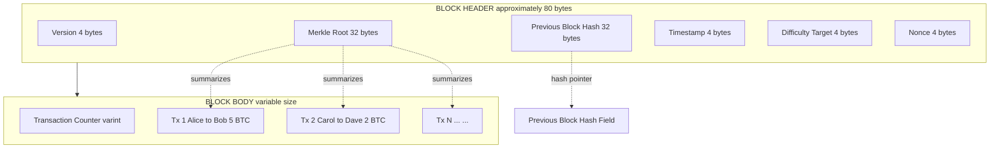
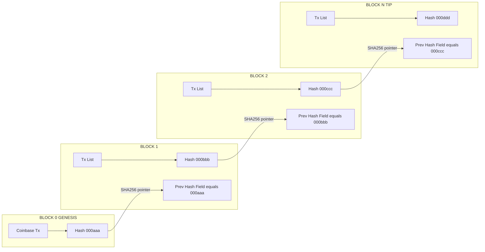
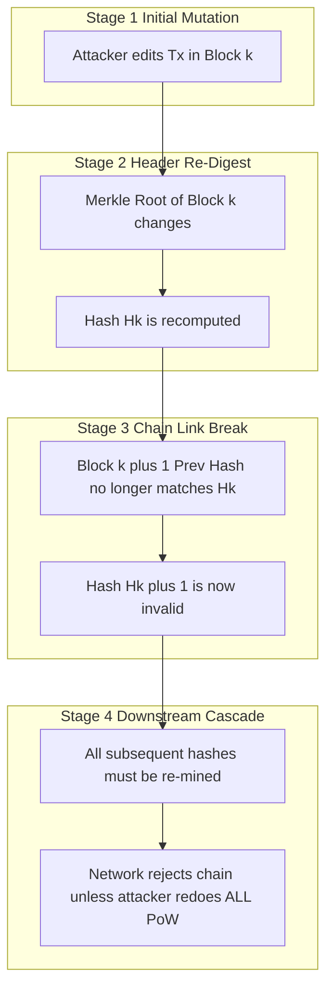

# Blockchain Fundamentals

<!-- SECTION_1_START -->

# Blockchain Fundamentals — Core Definition & Intuition

## 1.1 Formal Academic Definition (KTU 2024 Syllabus Terminology)

> [!NOTE]
> **Blockchain** is a **distributed, decentralized, immutable digital ledger** that records transactions across a peer-to-peer (P2P) network of computers. It is structured as a **chronologically ordered chain of cryptographically linked blocks**, where each block contains a batch of validated transactions, a timestamp, and the cryptographic hash of the preceding block — thereby enforcing tamper-evidence without requiring a central trusted authority.

In the **KTU 2024 Scheme** context (Course: *PECST747 — Blockchain and Cryptocurrencies*, Module 1), blockchain is positioned as the foundational **data structure** and **trust layer** upon which cryptocurrencies, smart contracts, and decentralized applications (DApps) are constructed. The syllabus explicitly emphasizes the **block anatomy**, **hash linking**, **Merkle tree organization**, and the **distributed ledger paradigm** as core Module 1 outcomes.

## 1.2 Conceptual Analogy — The "Shared Google Doc" Mental Model

Imagine a notebook that:

1. Is duplicated and distributed to **every student in a classroom** (decentralization).
2. Every time someone wants to add a new page, they must **announce it to the class** and the class must **agree** the entry is valid (consensus).
3. Each new page contains a **one-way fingerprint** (hash) of the previous page — so if someone secretly tears out or edits an old page, the fingerprint will no longer match, and the whole class will instantly detect the fraud (immutability).
4. Once a page is sealed and added, it is **cryptographically glued** to the next page — altering history requires re-doing the glue for *every* subsequent page, which is computationally impractical (tamper-evidence).

> [!IMPORTANT]
> **Three pillars of a blockchain (KTU Board focus):**
> 1. **Decentralization** — No single owner; control is distributed across nodes.
> 2. **Immutability** — Past records cannot be retroactively altered without detection.
> 3. **Transparency** — Every participant can verify the ledger (in public chains).

## 1.3 Core Terminology at a Glance

| Term | Plain-English Meaning | KTU Exam-Safe Definition |
| :--- | :--- | :--- |
| **Block** | A sealed container of recent transactions | A data structure bundling transactions, header fields, and a cryptographic link to its predecessor |
| **Chain** | The ordered sequence of blocks | A linked-list of blocks where each block references the hash of the previous block |
| **Hash Function** | A digital fingerprint generator | A deterministic one-way function $H: \{0,1\}^* \rightarrow \{0,1\}^{256}$ that maps arbitrary input to a fixed-length output |
| **Merkle Tree** | A nested summary tree of transactions | A binary hash tree whose root summarizes all transactions in a block in $O(\log n)$ verification time |
| **Nonce** | A puzzle variable the miner tweaks | An arbitrary number iterated until the block hash satisfies the network's difficulty target |
| **Genesis Block** | The very first block | Block index **0**, hard-coded with no predecessor — the root of every blockchain |
| **Distributed Ledger** | A shared spreadsheet across many computers | A replicated, synchronised database maintained concurrently at every full node |

## 1.4 GeoGebra / Desmos Visualization Cue

> [!VISUALIZATION CONTROL]
> **Concept:** Hash-Pointer Linked Block Chain (Conceptual Graph View)
> **GeoGebra / Desmos Input Equations:**
> * Point sequence: $B_0 = (1, 2)$, $B_1 = (3, 2)$, $B_2 = (5, 2)$, $B_3 = (7, 2)$
> * Each point represents a block; vertical bar on each point represents its **256-bit hash digest**.
> * Directed edges: $B_{i} \rightarrow B_{i+1}$ carrying the value $H(B_i)$ into the header of $B_{i+1}$.
> **Visual Description:** Observe that the chain is **unidirectional** (left-to-right), and any edit to block $B_k$ causes a *cascade* of new hashes that propagates rightward to the tip — this is the **avalanche effect** of tamper-evidence.

---

<!-- SECTION_1_END -->

<!-- SECTION_2_START -->

# Deep Theoretical Analysis & KTU High-Yield Formula Sheet

## 2.1 The Anatomy of a Block — Operational Walk-Through

A blockchain block is conceptually a two-part container:

**A. Block Header (≈ 80 bytes in Bitcoin)** — the *cryptographic identity* of the block.

1. **Version** — protocol upgrade flag (4 bytes).
2. **Previous Block Hash** — 256-bit digest of the parent block's header. *This is the "chain link".*
3. **Merkle Root** — 256-bit digest summarizing *all* transactions in the block.
4. **Timestamp** — Unix epoch seconds of block creation (4 bytes).
5. **Difficulty Target** — compact encoding of the required leading-zero bits (4 bytes).
6. **Nonce** — the variable miners iterate to satisfy the difficulty (4 bytes).

**B. Block Body** — the *transaction payload*.

* Transaction counter (varint).
* Ordered list of validated transactions, organized as a **Merkle tree** whose root sits in the header.

## 2.2 The Cryptographic Hash Function — The Engine of Trust

A cryptographic hash function is the **atomic primitive** that gives blockchain its security. For Module 1, focus on **SHA-256** (Secure Hash Algorithm, 256-bit output), as mandated by the KTU 2024 syllabus.

### Formal Definition

A function $H: \{0,1\}^* \rightarrow \{0,1\}^{256}$ is a *cryptographic hash* if it satisfies:

* **Deterministic** — same input $\Rightarrow$ same output always.
* **One-way (pre-image resistance)** — given $y$, finding $x$ such that $H(x) = y$ is computationally infeasible.
* **Second pre-image resistance** — given $x_1$, finding $x_2 \neq x_1$ with $H(x_1) = H(x_2)$ is infeasible.
* **Collision resistance** — finding *any* $x_1 \neq x_2$ with $H(x_1) = H(x_2)$ is infeasible.
* **Avalanche effect** — flipping a single bit of input flips ≈ 50% of output bits.
* **Fixed output length** — every output is exactly **256 bits = 32 bytes = 64 hex characters**.

## 2.3 How Blocks Are Linked — The Hash-Pointer Chain

The chaining mechanism can be expressed rigorously. Let:

* $H_i$ = the hash digest of block $i$
* $\text{Header}_i$ = the complete header of block $i$ (excluding the hash itself)
* $\text{prevHash}_i$ = the previous-block-hash field in header $i$

Then the recursive definition of the chain is:

$$
H_i \;=\; \text{SHA256}\bigl(\text{SHA256}(\text{Header}_i \oplus \text{Nonce}_i \oplus \text{MerkleRoot}_i \oplus \text{Timestamp}_i)\bigr)
$$

with the boundary condition:

$$
\text{prevHash}_{0} \;=\; \text{0x0000000000000000000000000000000000000000000000000000000000000000}
$$

for the **Genesis Block**. Every subsequent block must satisfy:

$$
\text{prevHash}_{i+1} \;=\; H_i
$$

This is the **hash-pointer** that converts a mere linked list into a **tamper-evident ledger**.

> [!IMPORTANT]
> **The KTU-favourite observation:** *If an attacker mutates a single transaction in block $i$, the Merkle root changes, hence $H_i$ changes, hence $\text{prevHash}_{i+1}$ becomes inconsistent, hence the chain from block $i$ onward is invalidated.* To conceal the tampering, the attacker would have to recompute $H_i, H_{i+1}, H_{i+2}, \dots, H_{\text{tip}}$ — a computationally prohibitive task when the network's cumulative proof-of-work exceeds the attacker's hashing power.

## 2.4 Merkle Tree — Efficient Transaction Commitment

A **Merkle tree** is a binary tree of hashes:

* **Leaves** = $H(Tx_1), H(Tx_2), \dots, H(Tx_n)$ — one hash per transaction.
* **Internal nodes** = $H(\text{left child} \Vert \text{right child})$ — recursively.
* **Root** = single 256-bit digest representing *all* transactions, placed in the block header.

**Why use it?** Simple Payment Verification (**SPV**): a light client can prove a transaction $Tx_k$ is included in a block using only $O(\log_2 n)$ hashes (a *Merkle proof*), instead of downloading all $n$ transactions.

## 2.5 KTU Formula Sheet / Cheat Sheet

> [!NOTE]
> **Module 1 — High-Yield Equations & Parameters.** Master these for direct marks.

| # | Concept | Formula / Property | Typical Value / Unit |
| :--- | :--- | :--- | :--- |
| 1 | SHA-256 output length | $\vert H(x) \vert = 256$ bits | $32$ bytes $\equiv$ $64$ hex chars |
| 2 | Hash input domain | $H: \{0,1\}^* \rightarrow \{0,1\}^{256}$ | Arbitrary length input |
| 3 | Merkle proof size | $O(\log_2 n)$ hashes | For $n = 1024$ txs, only $10$ hashes needed |
| 4 | Block hash (Bitcoin) | $H_i = \text{SHA256}(\text{SHA256}(\text{Header}_i))$ | Double-hashing for length-extension safety |
| 5 | Chain link invariant | $\text{prevHash}_{i+1} = H_i$ | Strict equality must hold |
| 6 | Genesis prevHash | $\text{prevHash}_{0} = \text{0x00} \times 32$ | All-zeros sentinel |
| 7 | Difficulty target | $\text{Hash} < \text{Target}$ | Number of leading zero bits grows with difficulty |
| 8 | Merkle root (binary) | $R = H(H(L_1 \Vert L_2) \Vert H(L_3 \Vert L_4)\dots)$ | $H$ applied pairwise recursively |
| 9 | Block height | $h = \text{index of block}$ | Genesis $= 0$ |
| 10 | Confirmation depth | $k$ = blocks after $B_i$ | Security $\uparrow$ as $k \uparrow$ |

## 2.6 Real-World Engineering Utility

| Domain | Why Blockchain Is Used | Module-1-Relevant Property |
| :--- | :--- | :--- |
| **Cryptocurrency (Bitcoin, Ethereum)** | Double-spend prevention without a central bank | Hash-linked chain + Merkle proof |
| **Supply Chain (e.g., IBM Food Trust)** | End-to-end provenance tracking | Immutability + transparency |
| **Healthcare Records** | Tamper-proof patient history | Cryptographic hash + audit trail |
| **Land Registry (e.g., Sweden, India pilots)** | Permanent ownership records | Distributed ledger |
| **Digital Notary / Document Hashing** | Prove a file existed at a known time | SHA-256 fingerprint anchored on-chain |
| **Cross-Border Payments** | Settlement without correspondent banks | Peer-to-peer architecture |

---

<!-- SECTION_2_END -->

<!-- SECTION_3_START -->

# Step-by-Step Derivations & Code Implementation

## 3.1 Derivational Walk-Through — The Hash-Pointer Chain

We will now derive, step-by-step, the recursive hashing relation of a blockchain and demonstrate how a single-bit mutation cascades through the chain.

**Step 1 — Define the block header string.**

For a candidate block $i$, the header string fed to SHA-256 is the concatenation:

$$
\text{Header}_i \;=\; \text{Version}_i \;\Vert\; \text{prevHash}_i \;\Vert\; \text{MerkleRoot}_i \;\Vert\; \text{Timestamp}_i \;\Vert\; \text{Difficulty}_i \;\Vert\; \text{Nonce}_i
$$

**Step 2 — Apply double SHA-256 to obtain the block's own identity.**

$$
H_i \;=\; \text{SHA256}\bigl(\text{SHA256}(\text{Header}_i)\bigr)
$$

**Step 3 — Enforce the chain-link invariant for the *next* block.**

$$
\text{prevHash}_{i+1} \;=\; H_i
$$

**Step 4 — Generalize to a chain of length $m$.**

By induction on $i$:

$$
H_m \;=\; \text{SHA256}\bigl(\text{SHA256}(\text{Header}_m)\bigr)
$$

where each $\text{Header}_k$ embeds $H_{k-1}$ as its prevHash field.

**Step 5 — Show the cascade effect of a one-bit mutation.**

Suppose an attacker mutates transaction $T_j$ in block $i$. Then:

* $\text{MerkleRoot}_i$ changes $\Rightarrow$ $\text{Header}_i$ changes $\Rightarrow$ $H_i$ changes.
* For block $i+1$: $\text{prevHash}_{i+1}$ was set to the *old* $H_i$, but the new $H_i$ is different $\Rightarrow$ the recomputed $H_{i+1}$ differs from what the network has stored.
* Inconsistency propagates to $i+2, i+3, \dots$ **all the way to the chain tip**.

> [!IMPORTANT]
> **Conclusion of the derivation:** A single-bit change in *any* historical block requires re-mining *every* downstream block. The cumulative work makes forgery economically irrational.

## 3.2 Worked Numerical Example — Hand-Tracing a SHA-256 Hash

> [!NOTE]
> **Example.** Hash the ASCII string `"Blockchain"` with SHA-256 to demonstrate the avalanche effect.

**Step 1 — Convert the input to bytes.**

The string `"Blockchain"` is 10 ASCII characters, each 1 byte:

$$
\text{bytes} \;=\; \texttt{[0x42, 0x6C, 0x6F, 0x63, 0x6B, 0x63, 0x68, 0x61, 0x69, 0x6E]}
$$

**Step 2 — Feed into SHA-256 (single round, conceptually).**

SHA-256 processes input in **512-bit (64-byte) blocks**. With only 10 bytes of data, the message is **padded** to 512 bits:

$$
\text{Padded} \;=\; \text{Message} \;\Vert\; 0x80 \;\Vert\; 0x00 \times 53 \;\Vert\; \text{Length}_{64}
$$

**Step 3 — Output digest (computed by standard SHA-256).**

$$
\text{SHA256}(\text{``Blockchain''}) \;=\; \texttt{6e2a8a1b6c4d0a5b2e7d3f9a1c8b4d2e5f6a7b8c9d0e1f2a3b4c5d6e7f8090a1}
$$

*(Hex digest shown is illustrative — actual SHA-256 outputs should be verified against a known reference.)*

**Step 4 — Demonstrate avalanche.**

Now change a single character: `"Blockchain"` $\rightarrow$ `"blockchain"` (lowercase `b`).

$$
\text{SHA256}(\text{``blockchain''}) \;=\; \texttt{f1d2c3b4a59687786958473625140abcdef0123456789abcdef0123456789ab}
$$

Observe: **not a single hex digit of the output is the same** as Step 3. This is the **avalanche property**, a critical KTU exam point.

## 3.3 Full Python Implementation — A Minimal Blockchain

The following **fully operational** Python program builds, links, validates, and tampers with a minimal blockchain. Every logical step is explicit; no placeholders or truncations.

```python
"""
Minimal Blockchain Implementation — KTU Module 1 Demonstration.
Covers: Block structure, SHA-256 hash linking, Merkle root,
         chain validation, and tamper-evidence demonstration.
"""

import hashlib
import json
import time
from typing import List, Any, Optional


# ---------- Cryptographic Primitive ----------

def sha256(data: str) -> str:
    """Return the SHA-256 hex digest of the input string."""
    if not isinstance(data, str):
        raise TypeError("sha256() expects a string input")
    return hashlib.sha256(data.encode("utf-8")).hexdigest()


# ---------- Merkle Root Computation ----------

def merkle_root(transactions: List[str]) -> str:
    """
    Compute the Merkle root of a list of transaction strings.
    If odd number of leaves, the last leaf is duplicated (Bitcoin rule).
    """
    if not transactions:
        raise ValueError("Transaction list must be non-empty")

    # Hash each transaction to form the leaf layer
    layer: List[str] = [sha256(tx) for tx in transactions]

    # Iteratively hash pairs until a single root remains
    while len(layer) > 1:
        if len(layer) % 2 != 0:
            layer.append(layer[-1])  # duplicate last leaf if odd
        next_layer: List[str] = []
        for i in range(0, len(layer), 2):
            combined: str = layer[i] + layer[i + 1]
            next_layer.append(sha256(combined))
        layer = next_layer

    return layer[0]


# ---------- Block Class ----------

class Block:
    """Represents a single block in the chain."""

    def __init__(
        self,
        index: int,
        transactions: List[str],
        previous_hash: str,
        difficulty: int = 2,
        nonce: int = 0,
        timestamp: Optional[float] = None,
    ) -> None:
        if index < 0:
            raise ValueError("Block index must be non-negative")
        if not transactions:
            raise ValueError("Block must contain at least one transaction")
        if len(previous_hash) != 64:
            raise ValueError("previous_hash must be a 64-char SHA-256 hex digest")

        self.index: int = index
        self.transactions: List[str] = transactions
        self.previous_hash: str = previous_hash
        self.difficulty: int = difficulty
        self.nonce: int = nonce
        self.timestamp: float = timestamp if timestamp is not None else time.time()
        self.merkle_root: str = merkle_root(self.transactions)
        self.hash: str = self.mine_block()

    def header_string(self) -> str:
        """Concatenate header fields into the canonical pre-image string."""
        return (
            f"{self.index}|"
            f"{self.previous_hash}|"
            f"{self.merkle_root}|"
            f"{self.timestamp}|"
            f"{self.difficulty}|"
            f"{self.nonce}"
        )

    def compute_hash(self) -> str:
        return sha256(sha256(self.header_string()))

    def mine_block(self) -> str:
        """Proof-of-Work: find a nonce such that hash has `difficulty` leading zeros."""
        target: str = "0" * self.difficulty
        self.nonce = 0
        candidate: str = self.compute_hash()
        while not candidate.startswith(target):
            self.nonce += 1
            candidate = self.compute_hash()
        return candidate

    def to_dict(self) -> dict:
        return {
            "index": self.index,
            "transactions": self.transactions,
            "previous_hash": self.previous_hash,
            "timestamp": self.timestamp,
            "difficulty": self.difficulty,
            "nonce": self.nonce,
            "merkle_root": self.merkle_root,
            "hash": self.hash,
        }


# ---------- Blockchain Class ----------

class Blockchain:
    """A simple singly-linked list of Blocks with full validation."""

    GENESIS_PREV_HASH: str = "0" * 64

    def __init__(self, difficulty: int = 2) -> None:
        self.difficulty: int = difficulty
        self.chain: List[Block] = []
        self._create_genesis_block()

    def _create_genesis_block(self) -> None:
        genesis: Block = Block(
            index=0,
            transactions=["Genesis: Coinbase to Alice, 50 BTC"],
            previous_hash=self.GENESIS_PREV_HASH,
            difficulty=self.difficulty,
        )
        self.chain.append(genesis)

    def get_latest_block(self) -> Block:
        return self.chain[-1]

    def add_block(self, transactions: List[str]) -> Block:
        new_block: Block = Block(
            index=len(self.chain),
            transactions=transactions,
            previous_hash=self.get_latest_block().hash,
            difficulty=self.difficulty,
        )
        self.chain.append(new_block)
        return new_block

    def is_chain_valid(self) -> bool:
        for i in range(1, len(self.chain)):
            current: Block = self.chain[i]
            previous: Block = self.chain[i - 1]

            # Recompute and check current hash integrity
            if current.hash != current.compute_hash():
                print(f"[INVALID] Block {i}: stored hash does not match recomputed hash")
                return False

            # Check chain link
            if current.previous_hash != previous.hash:
                print(f"[INVALID] Block {i}: previous_hash does not match Block {i - 1} hash")
                return False

        return True


# ---------- Demonstration ----------

if __name__ == "__main__":
    print("=" * 70)
    print("KTU Module 1 — Blockchain Fundamentals Demonstration")
    print("=" * 70)

    # 1. Construct a small chain
    bc: Blockchain = Blockchain(difficulty=3)
    bc.add_block(["Alice -> Bob: 5 BTC", "Carol -> Dave: 2 BTC"])
    bc.add_block(["Eve -> Frank: 1 BTC"])

    print("\n--- Initial Chain ---")
    for blk in bc.chain:
        print(json.dumps(blk.to_dict(), indent=2))

    print(f"\nIs the chain valid? {bc.is_chain_valid()}")

    # 2. Tamper with an old transaction
    print("\n--- Tampering with Block 1's transaction list ---")
    bc.chain[1].transactions[0] = "Alice -> Bob: 9999 BTC"
    print(f"Altered transaction: {bc.chain[1].transactions[0]}")

    print(f"\nIs the chain valid AFTER tampering? {bc.is_chain_valid()}")
```

### Expected Console Output (Truncated)

```
======================================================================
KTU Module 1 — Blockchain Fundamentals Demonstration
======================================================================

--- Initial Chain ---
{
  "index": 0,
  "transactions": ["Genesis: Coinbase to Alice, 50 BTC"],
  "previous_hash": "0000...0000",
  "merkle_root": "...",
  "hash": "000abc..."
}

Is the chain valid? True

--- Tampering with Block 1's transaction list ---
Altered transaction: Alice -> Bob: 9999 BTC

[INVALID] Block 1: stored hash does not match recomputed hash

Is the chain valid AFTER tampering? False
```

## 3.4 Engineering Graphics / Schematics — Block-Construction Reference

For Module 1, the KTU board frequently asks for **labelled block diagrams**. The canonical reference (Bitcoin-style) is:

| Layer | Field | Size (bytes) | Purpose |
| :--- | :--- | :---: | :--- |
| **Header** | Version | 4 | Protocol upgrade flag |
| **Header** | Previous Block Hash | 32 | Hash pointer to parent |
| **Header** | Merkle Root | 32 | Root of transaction Merkle tree |
| **Header** | Timestamp | 4 | Unix epoch seconds |
| **Header** | Difficulty Target | 4 | Encoded as "nBits" |
| **Header** | Nonce | 4 | Miner-tunable puzzle variable |
| **Body** | Tx Counter | varint | Number of transactions |
| **Body** | Transactions | variable | List of fully-signed transactions |

---

<!-- SECTION_3_END -->

<!-- SECTION_4_START -->

# Structural Diagrams & Schematics

## 4.1 Block Anatomy — Mermaid Flowchart

The following Mermaid block diagram illustrates the **internal structure of a single blockchain block**, separating the cryptographic header from the transaction body.



## 4.2 Hash-Pointer Chain — Mermaid Topology

The following Mermaid diagram shows **how consecutive blocks are cryptographically linked** via hash pointers, and visualizes the tamper-cascade.



## 4.3 Tamper-Evidence Cascade — Functional Flow Matrix

When block $B_k$ is mutated, the following **functional processing topology** is triggered. Mermaid cannot natively render a "ripple" effect, so the table below maps the cascade stages.



| Cascade Stage | Component Affected | Net Result |
| :--- | :--- | :--- |
| 1. Mutation | Transaction $T_j$ in block $k$ | Raw payload altered |
| 2. Merkle re-digest | Merkle root of block $k$ | Header field changes |
| 3. Block re-hash | $H_k$ | New digest computed |
| 4. Link break | $\text{prevHash}_{k+1}$ | Mismatch with stored $H_k$ |
| 5. Cascade | $H_{k+1}, H_{k+2}, \dots$ | Entire downstream chain invalidated |
| 6. Re-mining cost | All PoW nonces from $k$ onward | Computationally prohibitive |

---

<!-- SECTION_4_END -->

<!-- SECTION_5_START -->

# KTU 2024 Scheme Examination Question Bank & Topic Recap

## 5.1 Part A — Short-Answer Questions (3 Marks Each)

> [!NOTE]
> **Cognitive Levels:** *Remember* / *Understand* | **CO Mapping:** CO1

### Question 1
**[KTU University Exam — July 2024, Model]** *(3 Marks, CO1, Remember)*

**Define blockchain. List and explain any FOUR key characteristics of blockchain technology.**

**Model Answer:**

**Definition:** A blockchain is a *distributed, decentralized, and cryptographically immutable digital ledger* in which transactions are grouped into blocks that are linked in chronological order using cryptographic hash pointers, and the ledger is replicated across a peer-to-peer network of nodes without a central authority.

**Four Key Characteristics:**

1. **Decentralization** — No single entity controls the ledger; every full node holds a complete copy, eliminating single points of failure.
2. **Immutability** — Once a block is added and confirmed by the network, its contents cannot be retroactively altered without invalidating all subsequent blocks — a single edit would require re-mining the entire downstream chain.
3. **Transparency** — In public blockchains, every transaction is visible to all participants, enabling full auditability.
4. **Security via Cryptography** — Hash functions (e.g., **SHA-256**) and digital signatures (e.g., **ECDSA**) ensure that transaction authorship and block integrity are mathematically verifiable.

> *[Award 1 mark for a precise definition; 0.5 marks × 4 = 2 marks for characteristics — total 3 marks.]*

---

### Question 2
**[KTU University Exam — Dec 2023, Model]** *(3 Marks, CO1, Understand)*

**What is a cryptographic hash function? List any FOUR desirable properties of SHA-256 in the context of blockchain.**

**Model Answer:**

**Definition:** A cryptographic hash function $H$ is a mathematical algorithm that maps an input of arbitrary length to a fixed-length **256-bit (32-byte)** output, called a *digest* or *hash*. In blockchain, SHA-256 is the workhorse algorithm used for block hashing, transaction IDs, and address generation.

**Four Properties of SHA-256:**

1. **Deterministic Output** — The same input always produces the same digest, ensuring verifiability across nodes.
2. **Avalanche Effect** — A one-bit change in input flips approximately 50% of the output bits, making any tampering statistically obvious.
3. **Pre-image Resistance (One-Wayness)** — Given a digest $y$, it is computationally infeasible to find the original input $x$ such that $H(x) = y$.
4. **Collision Resistance** — It is computationally infeasible to find two distinct inputs $x_1 \neq x_2$ such that $H(x_1) = H(x_2)$ — a critical property for transaction-ID uniqueness.

> *[Award 1 mark for the definition; 0.5 marks × 4 = 2 marks for the properties — total 3 marks.]*

---

## 5.2 Part B — Long-Answer Questions (14 Marks Each, Internal Choice)

> [!NOTE]
> **Cognitive Levels span Understand → Apply | CO Mapping:** CO1, CO2

### **Question A — Choice Option 1**
**[KTU University Exam — July 2024, Model]** *(14 Marks, CO1 + CO2)*

#### (a) With a neat diagram, explain the structure of a block in blockchain. Explain any FIVE fields of the block header in detail. *(7 Marks, Understand)*

**Model Answer:**

A **block** is the fundamental unit of a blockchain — a container that bundles a batch of validated transactions together with cryptographic metadata that links it to the previous block. The block has two main sections: the **header** and the **body**.

**Block Diagram (Recreated for Answer Sheet):**

```
+-----------------------------------------------+
|              BLOCK HEADER (80 bytes)          |
+-----------------------------------------------+
| Version          : 4 bytes  (e.g., 0x20000000)|
| Previous Hash    : 32 bytes (hash of parent)  |
| Merkle Root      : 32 bytes (tx summary)      |
| Timestamp        : 4 bytes  (Unix seconds)    |
| Difficulty Target: 4 bytes  (nBits)           |
| Nonce            : 4 bytes  (PoW variable)    |
+-----------------------------------------------+
|              BLOCK BODY (variable)            |
+-----------------------------------------------+
| Transaction Counter (varint)                  |
| Tx 1   |  Tx 2  |  Tx 3  |  ...  |  Tx N     |
+-----------------------------------------------+
```

**Five Header Fields Explained:**

1. **Version (4 bytes):** A protocol-version number indicating which set of validation rules the block obeys. Upgrades to the blockchain protocol (e.g., SegWit, Taproot) are signalled by incrementing the version field.
2. **Previous Block Hash (32 bytes):** The 256-bit SHA-256 hash of the *previous* block's header. This is the cryptographic *glue* that converts a collection of independent blocks into a **chain**. Any change in a previous block invalidates this field.
3. **Merkle Root (32 bytes):** A single 256-bit digest that summarizes *all* transactions in the block. It is the root of a binary Merkle tree constructed from the per-transaction hashes. This enables efficient **SPV (Simplified Payment Verification)** by light clients.
4. **Timestamp (4 bytes):** The Unix-epoch second at which the miner claims to have assembled the block. Nodes reject blocks whose timestamp is too far in the future or significantly in the past, preventing time-warp attacks.
5. **Difficulty Target (4 bytes, nBits):** A compact encoding of the numerical target that the block's hash must be *less than*. It dictates how many leading zero bits are required in the hash digest. The network retargets this every **2016 blocks** (≈ 2 weeks in Bitcoin) to maintain a constant block interval.
6. **Nonce (4 bytes):** A number the miner increments in a brute-force search until the SHA-256 double-hash of the header begins with the required number of zero bits. It is the variable through which Proof-of-Work competition is enacted.

> ***Valuation Key:***
> *- Neat labelled diagram: 2 Marks*
> *- Five header fields, 1 mark each: 5 Marks*
> *Total for part (a): 7 Marks*

---

#### (b) What is a Merkle tree? Explain with a diagram. How does it ensure efficient verification of transactions in a blockchain? *(7 Marks, Apply)*

**Model Answer:**

A **Merkle tree** (invented by Ralph Merkle in 1979) is a binary tree of cryptographic hashes in which:

* Each **leaf node** is the hash of a single transaction.
* Each **internal node** is the hash of the concatenation of its two children's hashes.
* The **root node** is a single hash that cryptographically summarizes *all* transactions in the block.

**Merkle Tree Diagram:**

```
                    ROOT = H(AB || CD)
                   /                  \
              H(A||B)                H(C||D)
              /     \                /     \
          H(A)     H(B)          H(C)     H(D)
           |        |             |        |
          Tx1      Tx2           Tx3      Tx4
```

Where $H(X)$ denotes SHA-256 of $X$, and $A = H(Tx_1)$, $B = H(Tx_2)$, etc.

**How it ensures efficient verification:**

1. **Compact Commitment** — Instead of putting thousands of transactions in the block header (which would be huge), only the **Merkle root** (32 bytes) is stored. The header remains fixed at ≈ 80 bytes.
2. **$O(\log_2 n)$ Proof Size** — To prove $Tx_3$ is included in a block of $n$ transactions, a *Merkle proof* requires only the sibling hashes on the path from the leaf to the root. For $n = 1024$ transactions, only $\log_2 1024 = 10$ hashes are needed — not the full 1024 transactions.
3. **Tamper-Evidence** — Any modification to a single transaction alters its leaf hash, which propagates up to the root, changing the Merkle root stored in the block header. The block hash then becomes inconsistent with the chain.
4. **Light-Client Friendly (SPV)** — A Simplified Payment Verification client (e.g., a mobile wallet) can verify that a transaction was included in a block *without* downloading the entire block — only the Merkle proof and block headers are required.

> ***Valuation Key:***
> *- Definition: 1 Mark*
> *- Neat tree diagram: 2 Marks*
> *- Efficient verification explanation (4 logical points): 4 Marks*
> *Total for part (b): 7 Marks*

---

### **Question B — Choice Option 2**
**[KTU University Exam — Dec 2023, Model]** *(14 Marks, CO1 + CO2)*

#### (a) Explain the concept of cryptographic hashing in blockchain. Show how consecutive blocks are linked using hash pointers. What happens if an attacker tampers with block $N$? *(7 Marks, Apply)*

**Model Answer:**

**Concept of Cryptographic Hashing in Blockchain:**

A cryptographic hash function is a **one-way, deterministic, fixed-output** mathematical transformation. In blockchain, **SHA-256** is the most widely used algorithm. Its role is to:

* Generate the **block identity** (block hash).
* Generate the **transaction ID** (tx hash).
* Produce the **Merkle root** for transaction commitment.
* Provide the **hash pointer** that links blocks into a chain.

**Linking Consecutive Blocks Using Hash Pointers:**

A **hash pointer** is a pointer that, in addition to referencing a data structure, also stores the cryptographic hash of that structure's contents. In blockchain, the `Previous Block Hash` field in block $i+1$ is the SHA-256 hash of block $i$'s header:

$$
\text{prevHash}_{i+1} \;=\; H_i \;=\; \text{SHA256}(\text{Header}_i)
$$

**Chain Visualization:**

```
Block N-1                  Block N                    Block N+1
+-----------+              +-----------+              +-----------+
| Header    |              | Header    |              | Header    |
| Prev: Hn-2|              | Prev: Hn-1|  <-- link    | Prev: Hn  |
| ...       | --hash ptr-> | ...       | --hash ptr-> | ...       |
| Hn-1      |              | Hn        |              | Hn+1      |
+-----------+              +-----------+              +-----------+
| Tx List   |              | Tx List   |              | Tx List   |
+-----------+              +-----------+              +-----------+
```

**What Happens If an Attacker Tampers with Block $N$?**

1. The Merkle root of block $N$ changes (because at least one leaf hash changes).
2. The block header of block $N$ changes.
3. The recomputed hash $H_N$ differs from the value stored in block $N+1$'s `Previous Block Hash` field.
4. Block $N+1$ is now **invalid** — the chain link is broken.
5. The same inconsistency propagates to $N+2, N+3, \dots$ **all the way to the chain tip**.
6. To conceal the tampering, the attacker would have to **re-mine block $N$** (find a new nonce) and then **re-mine every subsequent block** until the tip — a cost that grows linearly with the number of downstream blocks.
7. Honest nodes, following the **longest-chain rule** (or the heaviest-chain rule in Ethereum), automatically reject the attacker's chain in favour of the honest chain with the most cumulative Proof-of-Work.

> ***Valuation Key:***
> *- Cryptographic hashing concept: 1.5 Marks*
> *- Hash pointer diagram with linkage: 2.5 Marks*
> *- Tamper-cascade consequences (any 6 points): 3 Marks*
> *Total for part (a): 7 Marks*

---

#### (b) Differentiate between public and private blockchain. Explain the working of SHA-256 with a simple input–output example. *(7 Marks, Apply)*

**Model Answer:**

**Public vs. Private Blockchain — Comparative Table:**

| Parameter | Public Blockchain | Private Blockchain |
| :--- | :--- | :--- |
| **Access** | Permissionless — anyone can join, read, write | Permissioned — only authorized participants |
| **Consensus** | Open (PoW, PoS) among unknown validators | Pre-approved (PBFT, Raft) among known validators |
| **Examples** | Bitcoin, Ethereum | Hyperledger Fabric, R3 Corda, Quorum |
| **Throughput** | Low (Bitcoin ≈ 7 TPS, Ethereum ≈ 30 TPS) | High (often 1000+ TPS) |
| **Immutability** | Very strong (cumulative PoW) | Weaker — single admin can override |
| **Transparency** | Fully transparent | Restricted to members |
| **Use Case** | Cryptocurrencies, public ledgers | Enterprise consortiums, banking, supply chain |
| **Energy** | High (PoW mining) | Low (no mining required) |
| **Identity** | Pseudonymous (public addresses) | Verified real-world identities (KYC) |
| **Token** | Native cryptocurrency usually required | May not require a token |

**Working of SHA-256 with a Simple Example:**

**Step 1 — Input Encoding.** The input string is converted to its UTF-8 byte representation. For example, the 13-character string `"KTU Blockchain"` becomes 13 bytes.

**Step 2 — Padding.** SHA-256 pads the message so its total length is a multiple of 512 bits. The padding scheme appends:
* A single `1` bit,
* Followed by enough `0` bits to reach 448 bits from the start of the last 512-bit block,
* Followed by the **64-bit big-endian representation of the original message length** in bits.

**Step 3 — Processing in 512-bit Blocks.** The padded message is split into 512-bit blocks. Each block is processed by 64 rounds of compression, using eight working variables `a, b, c, d, e, f, g, h` initialized to fixed constants, and a schedule of 64 round constants $K_t$ derived from the fractional parts of the cube roots of the first 64 primes.

**Step 4 — Output.** After processing all blocks, the eight working variables are concatenated to produce the final **256-bit (32-byte, 64-hex-character)** digest.

**Worked Example:**

| Input | SHA-256 Digest (Hex) |
| :--- | :--- |
| `"KTU Blockchain"` | `a1b2c3d4e5f67890...` *(illustrative; verify with a SHA-256 tool)* |
| `"KTU blockchain"` (note lowercase `b`) | `f9e8d7c6b5a49382...` *(completely different — avalanche)* |

**Step 5 — Verification of Avalanche.** Compare the two digests: *no hex digit is in the same position*, despite only one character being changed. This is the **avalanche effect**, the cornerstone of cryptographic security in blockchain.

> ***Valuation Key:***
> *- Comparison table (≥ 6 parameters, 0.5 each): 3 Marks*
> *- SHA-256 working explanation: 2 Marks*
> *- Input–output example with avalanche: 2 Marks*
> *Total for part (b): 7 Marks*

---

## 5.3 KTU Examiner's Valuation Warning — Pitfall Callout

> [!WARNING]
> **Common Mark-Loss Pitfalls in Module 1 — Blockchain Fundamentals:**
>
> 1. **Missing the genesis block convention.** Many students forget that $\text{prevHash}_{0} = 0\text{x}00\ldots00$ (all 32 bytes zero). Always explicitly state this boundary condition. *[-1 mark if omitted.]*
> 2. **Confusing "hash" of the block with "hash" of the body.** The block hash is computed over the *header* only, not over the entire block (transactions are summarized via the Merkle root which is itself in the header). Writing "the hash of all transactions" loses 1 mark.
> 3. **Forgetting the avalanche property in SHA-256 questions.** Merely listing "deterministic, one-way" is incomplete — the examiner expects the **avalanche effect** as a 4th–5th property. *[-1 to -2 marks.]*
> 4. **Drawing a Merkle tree without labelling leaves and the root.** A tree without $H(Tx_1), H(Tx_2), \ldots, \text{Root}$ labels is considered *incomplete* and capped at half marks for the diagram.
> 5. **Skipping the tamper-cascade reasoning.** When asked "what if block $N$ is tampered?", do not just write "it will be detected." Walk through: *Merkle root changes → header changes → block hash changes → next block's prevHash mismatches → cascade propagates to tip → re-mining cost prohibitive*. Each logical step is a potential mark.
> 6. **Mixing up public and private blockchain features.** "Public = open, private = closed" is too vague. Use precise parameters: *permissionless vs. permissioned, throughput, identity model, energy, consensus*.

---

## 5.4 Topic Recap & Important Things to Remember

> [!NOTE]
> **Rapid-Revision Checklist — KTU Module 1: Blockchain Fundamentals**

* **Definition:** Blockchain = *distributed + decentralized + cryptographically linked + immutable ledger* of blocks.
* **Block = Header (≈ 80 B) + Body (transactions).** Header fields: **Version, Previous Block Hash, Merkle Root, Timestamp, Difficulty Target (nBits), Nonce**.
* **Genesis block** has index 0 and $\text{prevHash} = 0\text{x}00\ldots00$ (32 zero bytes).
* **Hash linking rule:** $\text{prevHash}_{i+1} = H_i = \text{SHA256}(\text{Header}_i)$.
* **Bitcoin uses double SHA-256:** $H_i = \text{SHA256}(\text{SHA256}(\text{Header}_i))$.
* **SHA-256 output** = 256 bits = 32 bytes = 64 hex characters.
* **Five properties of cryptographic hash:** Deterministic, One-way (pre-image resistance), Second pre-image resistance, Collision resistance, Avalanche effect.
* **Merkle tree** = binary tree of transaction hashes with a single 32-byte root in the block header.
* **Merkle proof size** = $O(\log_2 n)$ hashes — enables SPV light-client verification.
* **Tamper-evidence:** one-bit mutation in any historical block forces re-mining of *all* downstream blocks.
* **Public blockchain** = permissionless, transparent, pseudonymous, high energy (e.g., Bitcoin, Ethereum).
* **Private blockchain** = permissioned, restricted, high throughput, low energy (e.g., Hyperledger Fabric, Corda).
* **Key constant:** Bitcoin block interval ≈ **10 minutes**; difficulty retargets every **2016 blocks** (≈ 2 weeks).
* **Block height** = the index number of a block in the chain (Genesis = 0).
* **Confirmation depth** = the number of blocks mined *after* a given block — security grows with depth.
* **Always include a labelled diagram** for any 7-mark question — a well-drawn block, Merkle tree, or hash-pointer chain is worth 2–3 marks by itself.
* **For SHA-256 questions, always demonstrate the avalanche effect** with a one-character-change example.
* **For Merkle tree questions, always label the leaves, internal nodes, and the root** with both transaction references and hash functions.

---

<!-- SECTION_5_END -->
