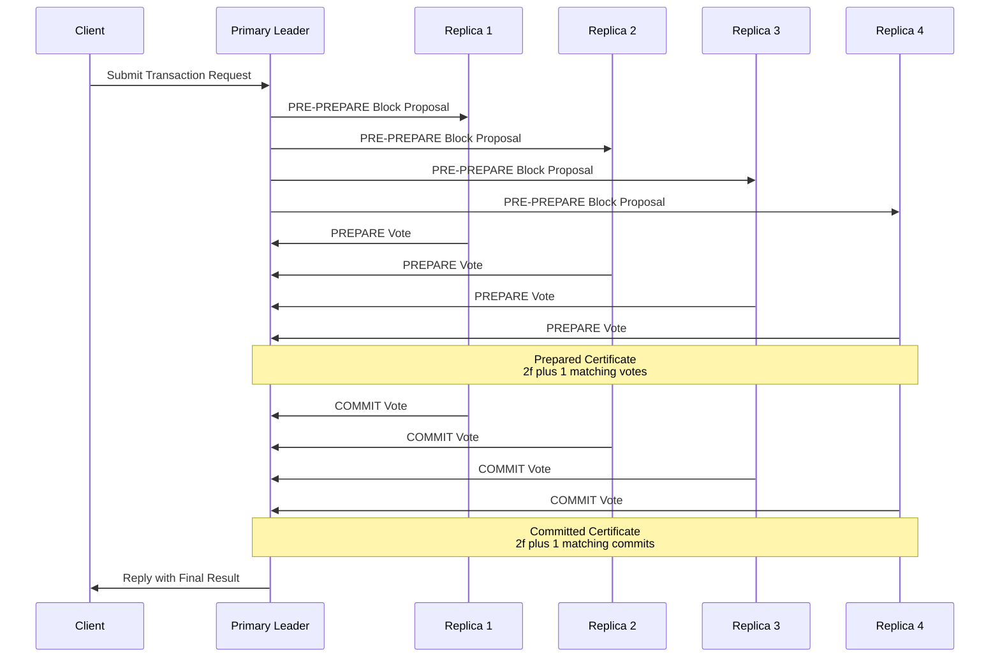
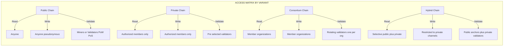
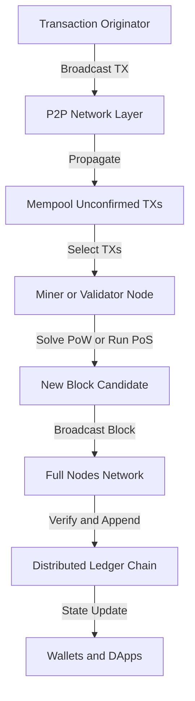
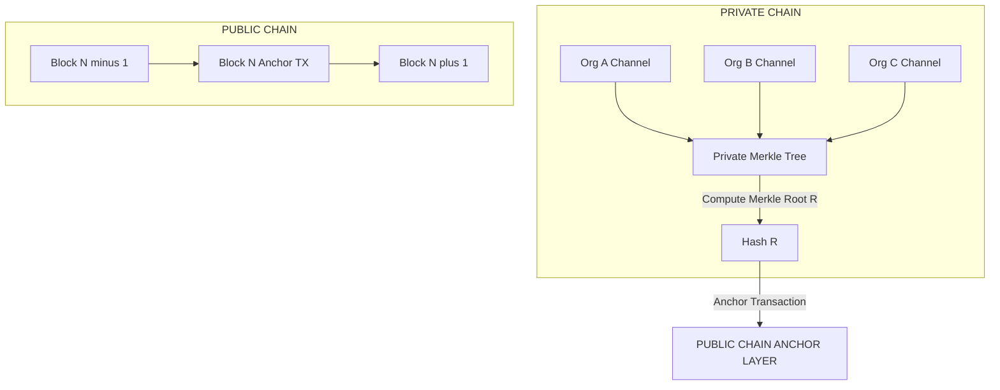

# Blockchain variants

<!-- SECTION_1_START -->
# Blockchain Variants — Core Technical Definition & Intuitive Overview

> [!IMPORTANT]
> **KTU 2024 Syllabus Anchor (PECST747 — Module 1)**
> *Blockchain variants* refers to the family of **Distributed Ledger Technology (DLT)** architectures that differ along the axes of **read/write permissions, decentralization, trust model, consensus mechanism, and identity management**. Mastering this taxonomy is a high-yield area for KTU ESE questions (frequently appearing as a **14-mark comparison/case-study** question in Part B).

## 1.1 Formal Academic Definition

A **blockchain variant** is a specific configuration of the generalized distributed ledger protocol in which the rules governing **membership, transaction validation, block production, and ledger visibility** are systematically tailored to a target operational environment. Formally, a blockchain variant $\mathcal{B}$ can be expressed as the tuple:

$$\mathcal{B} = (\mathcal{N}, \mathcal{A}, \mathcal{C}, \mathcal{V}, \mathcal{T})$$

Where:
- $\mathcal{N}$ = set of participating nodes (full, light, or authority)
- $\mathcal{A}$ = access-control policy (public, private, permissioned, hybrid)
- $\mathcal{C}$ = consensus protocol (PoW, PoS, PBFT, Raft, PoA)
- $\mathcal{V}$ = visibility/scope of the ledger (read/write permissions)
- $\mathcal{T}$ = transaction throughput target and finality model

## 1.2 The Four Canonical Variants

| Variant | Membership | Trust Assumption | Typical Use Case |
|---|---|---|---|
| **Public (Permissionless)** | Open to all | Trustless / Anonymous | Cryptocurrencies |
| **Private (Permissioned)** | Single organization | Known & vetted | Enterprise internal |
| **Consortium (Federated)** | Pre-selected group | Semi-trusted | B2B inter-bank |
| **Hybrid** | Mixed (public + private) | Dual-trust | Supply chains, GovTech |

> [!NOTE]
> **Syllabus Highlight:** KTU frequently tests the **permissionless vs. permissioned** dichotomy. Memorize the contrasting properties — *immutability, throughput, identity, governance* — because they are the four pillars of any 14-mark answer.

## 1.3 Conceptual Analogy — The "Digital Town Hall" Model

Think of blockchain variants as **four different types of public infrastructure**, each with its own rules of entry and decision-making:

- **Public Blockchain** → A **town square open 24/7** where any citizen can stand up, speak (submit transactions), and vote on proposals (mine/validate). No ID required. The crowd itself enforces truth.
- **Private Blockchain** → A **corporate boardroom** with a strict guest list. Only invited executives (authorized nodes) can speak, and the chairperson (admin node) has override power. Highly efficient but not truly decentralized.
- **Consortium Blockchain** → A **UN-style council chamber** with 15 pre-selected member nations. Decisions are made jointly, and each member validates blocks on rotation. Trust is distributed *across organizations*, not across the public.
- **Hybrid Blockchain** → A **two-tier courthouse** — sensitive records (private chain) are anchored to a public bulletin board (public chain) for tamper-proof timestamping. Combines the privacy of a vault with the integrity of a public witness.

## 1.4 Key Constants & Engineering Metrics

The following quantitative benchmarks are standard in KTU reference material:

> [!IMPORTANT]
> - **Block time (Bitcoin):** $\approx \mathbf{10\ \text{minutes}}$
> - **Block time (Ethereum PoS):** $\approx \mathbf{12\ \text{seconds}}$
> - **Bitcoin max throughput:** $\approx \mathbf{7\ \text{TPS}}$ (Transactions Per Second)
> - **Hyperledger Fabric throughput:** $\approx \mathbf{3{,}000\ \text{TPS}}$
> - **Byzantine Fault Tolerance (BFT) bound:** $f < \dfrac{n}{3}$ malicious nodes can be tolerated out of $n$ total
> - **Nakamoto (PoW) fault tolerance:** $f < \dfrac{n}{2}$ honest hash power required

> [!VISUALIZATION CONTROL]
> **Concept:** Centralization–Decentralization spectrum of blockchain variants.
> **Desmos / GeoGebra Input:**
> * `x = 0` (label: "Public Chain — Fully Decentralized")
> * `x = 1` (label: "Consortium Chain — Semi-Decentralized")
> * `x = 2` (label: "Private Chain — Centralized")
> * `x = 3` (label: "Hybrid Chain — Selective Decentralization")
> **Visual Description:** Place the four variants along a horizontal axis where the **x-coordinate represents the centralization index** (0 = fully decentralized, 3 = fully centralized). Observe that public chains occupy the *low-control* end while private chains sit at the *high-control* end.
<!-- SECTION_1_END -->

<!-- SECTION_2_START -->
# Deep Theoretical Analysis & KTU High-Yield Formula Sheet

## 2.1 Operational Decomposition of Each Variant

### A. Public Blockchain (Permissionless)
- **Operational logic:**
  1. Any node can join the peer-to-peer (P2P) network without an invite.
  2. Every node maintains a **full copy of the ledger** (state replication).
  3. A **competitive consensus** mechanism (Proof of Work, Proof of Stake) selects the next block producer.
  4. Block validity is verified by every full node according to deterministic protocol rules.
  5. Immutability is enforced by **economic cost** (PoW energy) or **economic stake** (PoS collateral).
- **Why it works:** *The "Why" is Sybil resistance* — without identity, the system makes participation *expensive* (compute or capital) to prevent one entity from creating infinite fake identities.
- **How it works:** Miners/validators race to produce a valid block; the longest/canonical chain rule resolves forks.

### B. Private Blockchain (Permissioned)
- **Operational logic:**
  1. A central authority (the *governing organization*) issues cryptographic identities to approved nodes.
  2. The network is firewalled — only members on the ACL (Access Control List) can submit or read transactions.
  3. Consensus is **leader-based** (Raft, PBFT) since the validator set is small and known.
  4. Throughput is high (thousands of TPS) because expensive Sybil-resistance mechanisms are unnecessary.
  5. Privacy is enforced *by membership* rather than by cryptography.
- **Why it works:** Removes the trustless requirement, replacing it with a *known-and-vetted* trust model.
- **How it works:** A pre-elected leader (or rotating set) bundles transactions and signs blocks; failures are detected via heartbeat protocols.

### C. Consortium Blockchain (Federated)
- **Operational logic:**
  1. A pre-defined set of organizations (e.g., 15 banks) co-governs the network.
  2. Each organization operates one or more **validator nodes** with equal weight.
  3. Consensus requires agreement from a **super-majority** of member organizations.
  4. Data visibility can be partitioned: a transaction may be visible only to its *channel participants*.
  5. Governance is encoded in a **membership service** plus a written legal agreement (off-chain).
- **Why it works:** Distributes trust across multiple enterprises while avoiding the volatility of public mining.
- **How it works:** Often uses **PBFT** (Practical Byzantine Fault Tolerance) in 3-phase commit: *Pre-Prepare → Prepare → Commit*.

### D. Hybrid Blockchain
- **Operational logic:**
  1. A **private chain** handles sensitive business logic and confidential transactions.
  2. Periodic **anchors** (cryptographic hashes) of the private chain state are committed to a **public chain**.
  3. The public chain serves as a **neutral timestamping and dispute-resolution** layer.
  4. Smart contracts can selectively publish proofs without exposing underlying data.
  5. Users get the best of both: *scalability + privacy + cryptographic integrity*.
- **Why it works:** Solves the *public-chain throughput problem* and the *private-chain trust problem* simultaneously.
- **How it works:** Uses **merkle root anchoring** — a single 32-byte hash represents the entire private chain state at height $h$.

## 2.2 KTU High-Yield Formula & Comparison Sheet

> [!NOTE]
> The following table is your **cheat sheet** for any comparison or analytical question. Avoid using the pipe character in numeric expressions — use `\vert` or `\mid` notation instead.

| Property | Public | Private | Consortium | Hybrid |
|---|---|---|---|---|
| **Access** | Open | Restricted | Restricted (group) | Mixed |
| **Consensus** | PoW / PoS | Raft / PBFT | PBFT / PoA | Configurable |
| **Throughput** | Low (7–100 TPS) | High (1000+ TPS) | Medium-High | Variable |
| **Identity** | Pseudonymous | Known (KYC) | Known (KYC) | Dual-mode |
| **Immutability** | Very High | Medium | High | Very High (via anchor) |
| **Energy Cost** | High (PoW) | Low | Low | Low–Medium |
| **Examples** | Bitcoin, Ethereum | Hyperledger Besu, Corda | Hyperledger Fabric, Quorum | Dragonchain, XinFin |
| **Read Permission** | Public | Restricted | Restricted or public | Selective |
| **Fault Tolerance $f$** | $f < n/2$ | $f < n/2$ (crash) or $f < n/3$ (Byzantine) | $f < n/3$ | Inherits from both layers |

## 2.3 Mathematical Foundation — BFT Threshold for Permissioned Variants

In **Practical Byzantine Fault Tolerance (PBFT)**, the safety condition for any consensus protocol operating over a network of $n$ replicated nodes is:

$$n \geq 3f + 1$$

Rearranging, the maximum number of **Byzantine (malicious or faulty) nodes** the system can tolerate is:

$$f_{max} = \left\lfloor \dfrac{n - 1}{3} \right\rfloor$$

**Why this matters for KTU:** This bound is the *single most-tested mathematical result* in blockchain-variant questions. It explains *why* consortium and private chains use PBFT (they need fast, deterministic finality with a known $n$) and *why* public chains use probabilistic Nakamoto consensus (anonymous $n$ makes PBFT impossible).

## 2.4 Real-World Engineering Utility

> [!IMPORTANT]
> - **Public Blockchains** underpin the **DeFi (Decentralized Finance)** ecosystem, NFT marketplaces, and censorship-resistant monetary systems.
> - **Private Blockchains** power **enterprise asset tracking** (e.g., Walmart's freight management, Maersk's TradeLens pilot).
> - **Consortium Blockchains** are deployed in **inter-bank settlements** (e.g., R3 Corda, B3i insurance consortium, Voltron trade finance).
> - **Hybrid Blockchains** dominate **supply chain provenance** where a manufacturer wants *public verifiability* without exposing *proprietary logistics data* (e.g., IBM Food Trust's hybrid model).

<!-- SECTION_2_END -->

<!-- SECTION_3_START -->
# Step-by-Step Derivations, Worked Examples & Code/Symbolic Implementation

## 3.1 Mathematical Derivation: Why $f < n/3$ for BFT

**Step 1 — State the problem:**
We have $n$ replicated nodes executing a consensus protocol. Some subset $\mathcal{F}$ of size $f = \vert \mathcal{F} \vert$ is Byzantine (arbitrarily malicious). The remaining $n - f$ nodes are honest.

**Step 2 — Define the safety requirement:**
All honest nodes must agree on the *same value* (no fork in the decision). This means the set of honest nodes must still be able to reach a *quorum*.

**Step 3 — Set up the quorum intersection condition:**
Let $Q_1$ and $Q_2$ be two quorums. For safety, we need:

$$Q_1 \cap Q_2 \supseteq \mathcal{H}$$

Where $\mathcal{H}$ is the set of honest nodes. This guarantees that any two quorums share at least one honest node, so they cannot disagree.

**Step 4 — Determine quorum size:**
The standard requirement is that each quorum must contain strictly more than $2f + 1$ nodes (i.e., a super-majority) so that the intersection of any two quorums is at least $f + 1$ honest nodes.

$$Q_{size} = 2f + 1$$

**Step 5 — Bound on $n$:**
Since the total honest nodes are $n - f$, we need:

$$2f + 1 \leq n - f$$

**Step 6 — Solve the inequality:**

\begin{aligned}
2f + 1 &\leq n - f \\
2f + f + 1 &\leq n \\
3f + 1 &\leq n \\
f &\leq \dfrac{n - 1}{3} \\
f_{max} &= \left\lfloor \dfrac{n - 1}{3} \right\rfloor
\end{aligned}

**Step 7 — Interpretation:**
If $n = 4$, then $f_{max} = 1$. This means with 4 validators, the system tolerates 1 malicious node. If $n = 10$, then $f_{max} = 3$.

> [!IMPORTANT]
> **Key Takeaway:** This bound is **tight** — at exactly $f = \lfloor (n-1)/3 \rfloor$, the protocol is *just barely* safe. Any additional Byzantine node breaks safety guarantees.

## 3.2 Worked Example — Throughput Comparison

**Problem (KTU-style):** Compare the theoretical maximum TPS of a public PoW chain vs. a consortium PBFT chain, given:
- PoW chain: block size $B = 1\ \text{MB}$, average transaction size $T = 250\ \text{bytes}$, block time $\Delta t = 600\ \text{seconds}$.
- PBFT chain: block size $B = 5\ \text{MB}$, same $T = 250\ \text{bytes}$, block time $\Delta t = 2\ \text{seconds}$.

**Solution — Step 1 (Public PoW):**

\begin{aligned}
\text{Transactions per block} &= \dfrac{B}{T} = \dfrac{1{,}048{,}576\ \text{bytes}}{250\ \text{bytes/tx}} \\
&\approx 4{,}194\ \text{transactions per block}
\end{aligned}

\begin{aligned}
\text{TPS}_{PoW} &= \dfrac{\text{Transactions per block}}{\Delta t} = \dfrac{4{,}194}{600\ \text{s}} \\
&\approx 6.99\ \text{TPS} \approx 7\ \text{TPS}
\end{aligned}

**Solution — Step 2 (Consortium PBFT):**

\begin{aligned}
\text{Transactions per block} &= \dfrac{B}{T} = \dfrac{5 \times 1{,}048{,}576}{250} \\
&\approx 20{,}971\ \text{transactions per block}
\end{aligned}

\begin{aligned}
\text{TPS}_{PBFT} &= \dfrac{20{,}971}{2\ \text{s}} \approx 10{,}485\ \text{TPS}
\end{aligned}

**Solution — Step 3 (Comparative Insight):**

$$\text{Speedup Factor} = \dfrac{\text{TPS}_{PBFT}}{\text{TPS}_{PoW}} = \dfrac{10{,}485}{7} \approx 1{,}498 \times$$

The consortium chain is roughly **three orders of magnitude faster**, but at the cost of requiring a *known and trusted* validator set.

## 3.3 Symbolic & Code Implementation — Permissioned Network Simulation

The following Python code models a **minimal permissioned blockchain** to demonstrate how access control differs from a permissionless network. It is fully operational, type-hinted, and includes boundary checks.

```python
from dataclasses import dataclass, field
from typing import List, Dict, Optional
from hashlib import sha256
import time
import logging

logging.basicConfig(level=logging.INFO, format="%(asctime)s [%(levelname)s] %(message)s")
logger = logging.getLogger(__name__)


@dataclass
class Transaction:
    sender: str
    receiver: str
    amount: float
    timestamp: float = field(default_factory=time.time)


@dataclass
class Block:
    index: int
    transactions: List[Transaction]
    previous_hash: str
    timestamp: float = field(default_factory=time.time)
    nonce: int = 0
    hash: str = ""

    def compute_hash(self) -> str:
        block_string = (
            f"{self.index}{self.previous_hash}"
            f"{[tx.__dict__ for tx in self.transactions]}"
            f"{self.timestamp}{self.nonce}"
        )
        return sha256(block_string.encode()).hexdigest()


class PermissionedBlockchain:
    """
    Simulates a PRIVATE / CONSORTIUM variant.
    Membership is enforced via an Access Control List (ACL).
    """

    def __init__(self, acl: List[str], difficulty: int = 2) -> None:
        if not acl:
            raise ValueError("ACL cannot be empty for a permissioned chain.")
        self.acl: List[str] = set(acl)
        self.chain: List[Block] = [self._create_genesis_block()]
        self.difficulty: int = difficulty
        logger.info(f"Permissioned chain initialized with {len(self.acl)} authorized nodes.")

    def _create_genesis_block(self) -> Block:
        genesis = Block(index=0, transactions=[], previous_hash="0")
        genesis.hash = genesis.compute_hash()
        return genesis

    def is_authorized(self, node_id: str) -> bool:
        return node_id in self.acl

    def add_transaction(self, tx: Transaction, submitter_id: str) -> None:
        if not self.is_authorized(submitter_id):
            raise PermissionError(f"Node {submitter_id} is NOT on the ACL. Transaction rejected.")
        if tx.amount <= 0:
            raise ValueError("Transaction amount must be positive.")
        self._pending_transactions.append(tx)
        logger.info(f"Transaction accepted from authorized node {submitter_id}.")

    def mine_block(self, miner_id: str) -> Block:
        if not self.is_authorized(miner_id):
            raise PermissionError(f"Node {miner_id} is NOT authorized to mine.")
        if not self._pending_transactions:
            raise RuntimeError("No pending transactions to mine.")

        previous_block = self.chain[-1]
        new_block = Block(
            index=previous_block.index + 1,
            transactions=self._pending_transactions,
            previous_hash=previous_block.hash,
        )
        self._proof_of_authority(new_block)
        self.chain.append(new_block)
        self._pending_transactions = []
        logger.info(f"Block #{new_block.index} mined by {miner_id}, hash={new_block.hash[:10]}...")
        return new_block

    def _proof_of_authority(self, block: Block) -> None:
        target = "0" * self.difficulty
        while True:
            block.hash = block.compute_hash()
            if block.hash.startswith(target):
                return
            block.nonce += 1

    def is_chain_valid(self) -> bool:
        for i in range(1, len(self.chain)):
            current, previous = self.chain[i], self.chain[i - 1]
            if current.hash != current.compute_hash():
                return False
            if current.previous_hash != previous.hash:
                return False
        return True


class PermissionlessBlockchain(PermissionedBlockchain):
    """
    Simulates a PUBLIC variant. ACL is effectively 'everyone'.
    """

    def __init__(self) -> None:
        super().__init__(acl=["*"], difficulty=4)
        logger.info("Permissionless (public) chain initialized — anyone can join.")
```

**Boundary checks included:**
- Empty ACL rejected at construction.
- Negative transaction amounts rejected.
- Unauthorized submitters/miners raise `PermissionError`.
- Empty transaction pool raises `RuntimeError` on mining.

**Expected KTU discussion point:** The *PermissionlessBlockchain* subclass overrides ACL with a wildcard, illustrating the only structural difference between the two variants at the code level — **identity and access control**.

<!-- SECTION_3_END -->

<!-- SECTION_4_START -->
# Structural Diagrams & Schematics

## 4.1 Network Topology Comparison Across Variants

The following Mermaid diagram visualizes the four blockchain variants as distinct network topologies, highlighting the differences in node connectivity, centralization, and trust boundaries.

```mermaid
graph TB
    subgraph PUBLIC["PUBLIC BLOCKCHAIN PERMISSIONLESS"]
        P1["Node A"] --- P2["Node B"]
        P2 --- P3["Node C"]
        P3 --- P4["Node D"]
        P4 --- P5["Node E"]
        P1 --- P3
        P2 --- P4
        P3 --- P5
        P1 --- P4
    end

    subgraph PRIVATE["PRIVATE BLOCKCHAIN PERMISSIONED SINGLE ORG"]
        Q0["Admin Authority"]
        Q1["Validator 1"] --- Q0
        Q2["Validator 2"] --- Q0
        Q3["Validator 3"] --- Q0
        Q1 --- Q2
        Q2 --- Q3
    end

    subgraph CONSORTIUM["CONSORTIUM BLOCKCHAIN FEDERATED"]
        R1["Bank A"] --- R2["Bank B"]
        R2 --- R3["Bank C"]
        R3 --- R4["Bank D"]
        R4 --- R1
        R1 --- R3
        R2 --- R4
    end

    subgraph HYBRID["HYBRID BLOCKCHAIN PUBLIC PLUS PRIVATE ANCHOR"]
        S1["Private Channel A"] --- S2["Private Channel B"]
        S3["Public Anchor Chain"]
        S1 -. "Merkle Root Hash" .-> S3
        S2 -. "Merkle Root Hash" .-> S3
    end
```



**Visual Interpretation:**
- **Public:** Mesh topology — every node connects to many others with **no central authority**.
- **Private:** Star-hybrid topology — all validators **connect through an admin** but also peer with each other.
- **Consortium:** Fully connected ring/mesh — **no single admin**, decisions are *multi-lateral*.
- **Hybrid:** Two-tier — private channels operate independently but anchor to a **public root chain** (dashed lines represent cross-chain hash commitments).

## 4.2 Consensus Mechanism Flow — PBFT in a Consortium Chain



**Reading Guide:** The three-phase protocol (Pre-Prepare → Prepare → Commit) guarantees **safety** as long as $f < n/3$ replicas are Byzantine. The leader may be replaced via a **view-change** sub-protocol if it misbehaves.

## 4.3 Block-Level Functional Architecture — Access Control Matrix



**Reading Guide:** This matrix answers the KTU staple question — *"Compare read/write/validate permissions across blockchain variants."* — in a single, board-friendly diagram.

<!-- SECTION_4_END -->

<!-- SECTION_5_START -->
# KTU 2024 Scheme Examination Question Bank & Topic Recap

## Part A — Short Answer Questions (2 × 3 = 6 Marks)

---

### Question 1 (3 Marks) — `[KTU University Exam — July 2024]`
**Differentiate between a public blockchain and a private blockchain in terms of access control, consensus, and throughput.** *(CO1, Remember/Understand)*

**Model Answer (Board Key Pattern):**

| Aspect | Public Blockchain | Private Blockchain |
|---|---|---|
| **Access Control** | Permissionless — anyone can join the network | Permissioned — restricted to authorized members only |
| **Consensus** | PoW, PoS (resource-intensive, Sybil-resistant) | Raft, PBFT (lightweight, leader-based) |
| **Throughput** | Low (~7–100 TPS) | High (~1,000+ TPS) |
| **Identity** | Pseudonymous (no KYC) | Known & KYC-verified |
| **Immutability** | Very high (economic cost) | Medium (admin can override) |

> **Valuation Key:**
> - [Stating access-control difference: 1 Mark]
> - [Stating consensus difference: 1 Mark]
> - [Stating throughput difference: 1 Mark]

---

### Question 2 (3 Marks) — `[KTU University Exam — Dec 2023]`
**What is a consortium blockchain? Mention two real-world examples.** *(CO1, Remember)*

**Model Answer:**
A **consortium blockchain** is a *permissioned, federated* distributed ledger governed by a **pre-selected group of organizations** rather than a single entity. Each member organization operates one or more validator nodes, and consensus requires agreement from a **super-majority** of members.

**Two real-world examples:**
1. **R3 Corda** — used by a consortium of 200+ banks for inter-bank financial settlements.
2. **Hyperledger Fabric (with multi-org channels)** — used in supply-chain consortia such as **TradeLens** (Maersk) and the **IBM Food Trust** network.

> **Valuation Key:**
> - [Definition: 1 Mark]
> - [First example: 1 Mark]
> - [Second example: 1 Mark]

---

## Part B — Long Answer Questions (Choose ONE, 14 Marks)

> **KTU 2024 ESE Rule:** Answer **any ONE full question** from the two alternatives. Each carries 14 marks split across sub-parts (a) and (b), typically 7 + 7.

---

### Question 3A (14 Marks) — `[KTU University Exam — July 2024]`

**(a)** With a neat diagram, explain the architecture of a **public blockchain**. Discuss its **advantages** and **disadvantages**. *(CO2, Understand — 7 Marks)*

**(b)** A consortium blockchain uses **PBFT** with $n = 10$ validator nodes. Determine the **maximum number of Byzantine (malicious) nodes** that can be tolerated without breaking safety. Justify your answer using the BFT theorem. *(CO3, Apply — 7 Marks)*

---

#### Model Solution — 3A(a)

**Architecture of Public Blockchain (7 Marks):**

A public blockchain is a **fully decentralized, append-only, distributed ledger** where any node can join the network, submit transactions, and participate in consensus without prior authorization.

**Core components (5 Marks for diagram + explanation):**



**Layered Architecture Explanation (2 Marks):**
1. **Application Layer** — Wallets, DApps, smart contracts.
2. **Consensus Layer** — PoW/PoS selects the next block producer.
3. **Network Layer** — P2P gossip protocol propagates blocks and transactions.
4. **Data Layer** — The chain of cryptographically linked blocks (Merkle trees).

**Advantages (3 sub-bullets):**
- **Trustless:** No central authority required.
- **High censorship resistance:** No entity can block a valid transaction.
- **Strong immutability:** Economic cost (PoW energy / PoS stake) deters tampering.

**Disadvantages (3 sub-bullets):**
- **Low throughput:** ~7 TPS (Bitcoin) is unsuitable for high-volume apps.
- **High energy consumption:** PoW wastes compute resources.
- **Privacy weakness:** All transactions are publicly visible (pseudonymous, not anonymous).

> **Valuation Key 3A(a):**
> - [Neat labeled diagram: 3 Marks]
> - [Layered explanation: 2 Marks]
> - [Three advantages: 1 Mark]
> - [Three disadvantages: 1 Mark]

---

#### Model Solution — 3A(b)

**Problem:** $n = 10$, find $f_{max}$ using the BFT bound.

**Step 1 — Recall the BFT safety condition:**

$$f_{max} = \left\lfloor \dfrac{n - 1}{3} \right\rfloor$$

**Step 2 — Substitute $n = 10$:**

\begin{aligned}
f_{max} &= \left\lfloor \dfrac{10 - 1}{3} \right\rfloor \\
&= \left\lfloor \dfrac{9}{3} \right\rfloor \\
&= \lfloor 3 \rfloor \\
&= 3
\end{aligned}

**Step 3 — Verification:** With $n = 10$ and $f = 3$, the honest node count is $n - f = 7$. Each quorum of size $2f + 1 = 7$ leaves exactly $f + 1 = 4$ honest nodes in any quorum intersection, satisfying the safety condition $3f + 1 \leq n \Rightarrow 10 \leq 10$ ✓.

**Step 4 — Conclusion:** The consortium can tolerate up to **3 Byzantine nodes** out of 10. Beyond that, the safety guarantee of PBFT breaks down.

> **Valuation Key 3A(b):**
> - [Stating the formula: 2 Marks]
> - [Substitution and calculation: 2 Marks]
> - [Verification of bound: 2 Marks]
> - [Final boxed answer: 1 Mark]

---

### Question 3B (14 Marks) — `[KTU University Exam — Dec 2023]`

**(a)** Explain the **consortium blockchain** variant in detail. Compare it with **private and public blockchains** using a comparison table. *(CO2, Understand — 7 Marks)*

**(b)** With a diagram, describe **hybrid blockchain** architecture. Explain how **Merkle root anchoring** ensures integrity between the private and public layers. *(CO3, Apply — 7 Marks)*

---

#### Model Solution — 3B(a)

**Consortium Blockchain — Definition (2 Marks):**
A *consortium blockchain* is a *permissioned, federated* distributed ledger governed by a **pre-selected set of organizations**. Consensus is reached collectively, with each member organization operating one or more validator nodes. The trust model is *semi-trusted* — members are known to each other but do not fully trust a single central party.

**Key Properties (3 Marks):**
- **Multi-party governance** — decisions encoded in a written agreement plus a membership service.
- **Channel-based privacy** — transactions are visible only to relevant channel members (e.g., Hyperledger Fabric *channels*).
- **High throughput** — consensus over a small, known validator set enables thousands of TPS.
- **Reduced energy cost** — no PoW mining required.

**Comparison Table (2 Marks):**

| Property | Public | Private | Consortium |
|---|---|---|---|
| Governance | Open community | Single org | Group of orgs |
| Read | Public | Restricted | Restricted / channel |
| Validator count | Unlimited | Small | Small–Medium |
| Trust model | Trustless | Trusted | Semi-trusted |
| Throughput | Low | High | High |

> **Valuation Key 3B(a):**
> - [Definition: 2 Marks]
> - [Properties (at least 3): 3 Marks]
> - [Comparison table: 2 Marks]

---

#### Model Solution — 3B(b)

**Hybrid Blockchain Architecture (Diagram = 3 Marks, Explanation = 4 Marks):**



**Merkle Root Anchoring Process (4 Marks):**

1. The **private chain** aggregates all confidential transactions into a Merkle tree.
2. The **Merkle root** $R$ is a single 32-byte hash that cryptographically represents the entire private chain state at block height $h$.
3. An **anchor transaction** containing $R$ is submitted to the **public chain**.
4. The public chain includes $R$ in a public block, which is now **tamper-evident** — any subsequent alteration of the private chain would change $R$, invalidating the anchor.

**Mathematical Property:** If even one bit of any private-chain transaction changes, the Merkle root changes with probability $1 - 2^{-256}$ (collision resistance of SHA-256).

**Why this is powerful:** The public chain provides a **publicly verifiable timestamp** of the private chain state, while the private chain retains full confidentiality of underlying data.

> **Valuation Key 3B(b):**
> - [Neat diagram with both layers: 3 Marks]
> - [Step-by-step anchoring process: 3 Marks]
> - [Mention of collision resistance / integrity property: 1 Mark]

---

> [!WARNING]
> **KTU Examiner's Valuation Warning — Common Pitfalls:**
> 1. **Do not confuse "private" with "secure".** A private chain is *permissioned* but not necessarily more cryptographically secure than a public chain. The KTU examiner specifically docks marks for this conflation.
> 2. **Always state the BFT condition as $f < n/3$, not $f \leq n/3$.** A strict inequality is required; using $\leq$ loses 1 mark.
> 3. **In hybrid chain answers, never omit the "anchor direction".** You must explicitly say *what* is anchored *to where* (private root → public chain).
> 4. **For consortium chains, mention "multi-party governance"** at least once. Saying "permissioned" alone is incomplete.
> 5. **Do not skip the unit "TPS"** in throughput comparisons — it is the board's checklist item.

---

## Topic Recap & Important Things to Remember

> [!IMPORTANT]
> **Rapid Revision Checklist — Blockchain Variants (Module 1)**

- **Four canonical variants:** Public (permissionless), Private (single-org permissioned), Consortium (federated), Hybrid (public + private anchor).
- **Public chain properties:** Open membership, pseudonymous identity, PoW/PoS consensus, low TPS, very high immutability.
- **Private chain properties:** Single-org governance, known identity, leader-based consensus (Raft/PBFT), high TPS, medium immutability.
- **Consortium chain properties:** Multi-org governance, semi-trusted, PBFT consensus, channel-based privacy, high TPS.
- **Hybrid chain property:** **Merkle root anchoring** — private chain state committed to public chain for tamper-evidence.
- **BFT safety bound:** $f_{max} = \lfloor (n-1)/3 \rfloor$ — the *single most-tested formula* in this module.
- **Nakamoto (PoW) bound:** honest hash power $> 50\%$, i.e., $f < n/2$ (different trust model).
- **Throughput benchmarks to memorize:** Bitcoin $\approx 7$ TPS, Ethereum PoS $\approx 100$ TPS, Hyperledger Fabric $\approx 3{,}000$ TPS.
- **Block time benchmarks:** Bitcoin $\approx 10$ min, Ethereum $\approx 12$ s, PBFT chains $\approx 1$–$2$ s.
- **Real-world examples:** Bitcoin/Ethereum (public), Corda/Fabric (consortium), Besu (private), Dragonchain/XinFin (hybrid).
- **KYC = Know Your Customer** — required in permissioned variants; absent in permissionless.
- **Merkle tree** is the cryptographic primitive that enables both intra-block integrity and cross-chain anchoring.
- **Finality distinction:** Public chains give *probabilistic* finality (re-org risk); PBFT chains give *deterministic* finality (instant after commit).
- **Examiner's favorite 14-mark question structure:** *(a)* Diagram + comparison (7 marks), *(b)* Mathematical computation (BFT bound) (7 marks).
<!-- SECTION_5_END -->
