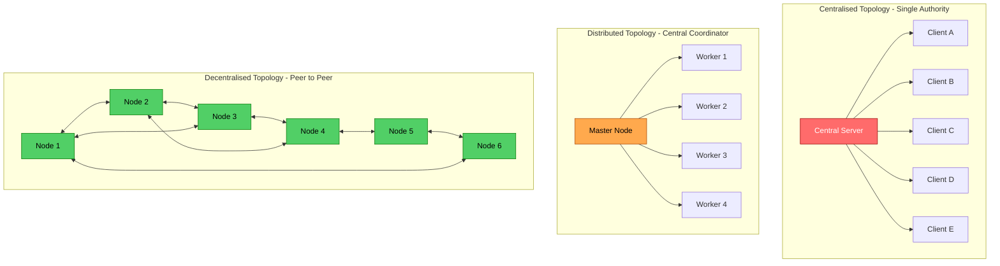
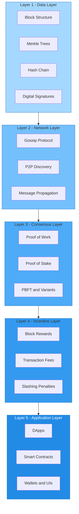
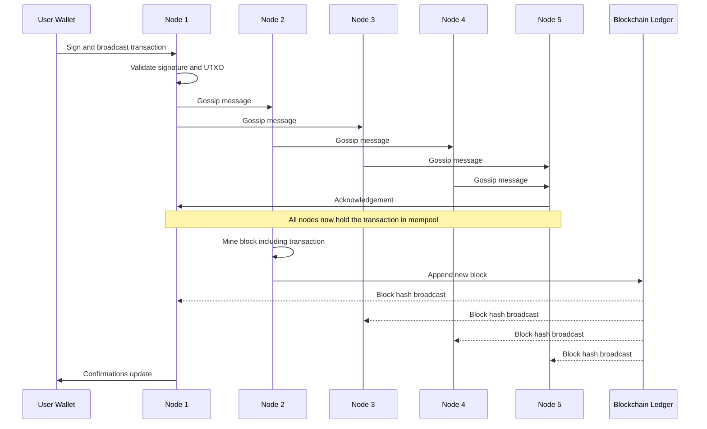

# Decentralisation

<!-- SECTION_1_START -->

# 1. Core Technical Definition & Intuitive Overview

## Formal Definition

**Decentralisation** in the context of blockchain and distributed systems is the architectural paradigm in which authority, decision-making power, data storage, and computational validation are distributed across a network of independent nodes (peers) rather than being concentrated in a single central authority, server, or trusted intermediary. As per the **KTU 2024 Scheme syllabus (PECST747 – Module 1)**, decentralisation is the foundational pillar that enables trustless peer-to-peer (P2P) transactions, eliminates single points of failure, and guarantees censorship-resistant operation of distributed ledgers.

> [!IMPORTANT]
> **KTU Syllabus Highlight (PECST747 – Module 1):** Decentralisation is introduced as the *core design philosophy* that distinguishes blockchain from traditional client–server database architectures. It is the prerequisite concept for understanding consensus algorithms, P2P networks, and cryptocurrency protocols.

Mathematically, decentralisation can be characterised by a **decentralisation index** $\mathcal{D}$ over a network of $n$ nodes with control weights $w_i$ (where $0 \le w_i \le 1$ and $\sum_{i=1}^{n} w_i = 1$):

$$
\mathcal{D} = 1 - \sqrt{\frac{\sum_{i=1}^{n} (w_i - \bar{w})^2}{n}} \quad \text{where} \quad \bar{w} = \frac{1}{n}
$$

A value of $\mathcal{D} \to 1$ indicates a fully decentralised network, while $\mathcal{D} \to 0$ indicates complete centralisation.

## Conceptual Analogy / Intuition

Imagine a classroom notice board:
- **Centralised Model**: Only the class teacher can write notices. If the teacher is absent, the board stays empty. If the teacher makes a mistake, everyone receives wrong information.
- **Decentralised Model**: Every student holds a *photocopied* version of the notice board. When the teacher writes a new notice, every student verifies and updates their own copy. The teacher has no special power — anyone can cross-check, and the "truth" emerges from collective agreement.

In the blockchain world:
- The **teacher** = Central server (e.g., a bank's main database)
- The **students** = Nodes in a peer-to-peer network
- The **photocopied notice board** = Replicated distributed ledger
- The **collective verification** = Consensus mechanism (PoW, PoS, PBFT, etc.)

> [!NOTE]
> **Key Distinction:** *Distributed* ≠ *Decentralised*. A distributed system may still have a central controller that orchestrates the distribution (e.g., a content delivery network). A *decentralised* system has **no central coordinator at all** — coordination emerges purely from peer agreement.

## Three Architectural Paradigms

| Architecture | Control Locus | Failure Mode | Trust Assumption | Example |
|---|---|---|---|---|
| **Centralised** | Single entity | Single point of failure | Must trust the central party | Traditional banking, Facebook |
| **Distributed** | Coordinator + nodes | Coordinator failure critical | Trust the coordinator | Cloud CDNs, Hadoop clusters |
| **Decentralised** | All peers (equal) | No single point of failure | Trustless (cryptographic) | Bitcoin, Ethereum, IPFS |

> [!VISUALIZATION CONTROL]
> **Concept:** Visual comparison of Centralised vs Distributed vs Decentralised network topologies
> **GeoGebra / Desmos Input Equations:**
> * Centralised: $H_1 = (0,0)$, $N_1 = (-3,-2)$, $N_2 = (3,-2)$, $N_3 = (-3,2)$, $N_4 = (3,2)$ with edges $(H_1, N_i)$
> * Decentralised (ring): $N_k = (3\cos(2\pi k/6), 3\sin(2\pi k/6))$ for $k = 0, 1, 2, 3, 4, 5$ with bidirectional edges $N_k \leftrightarrow N_{k+1 \mod 6}$
> **Visual Description:** The centralised graph shows a star with one hub at the origin radiating to four outer nodes. The decentralised graph shows a hexagon with all six vertices interconnected to their two nearest neighbours — no central node, symmetric authority.

<!-- SECTION_1_END -->

<!-- SECTION_2_START -->

# 2. Deep Theoretical Analysis & KTU High-Yield Formula Sheet

## 2.1 The Five Pillars of Decentralisation

A blockchain system is considered *truly decentralised* when it satisfies the following architectural pillars. KTU examiners frequently test these properties:

1. **Architectural Decentralisation** — Physical distribution of nodes across geographies and administrative domains.
2. **Political Decentralisation** — No single organisation or cartel controls the protocol upgrade process.
3. **Logical Decentralisation** — The data state (ledger) has no single "canonical" copy; reconciliation is achieved via consensus.
4. **Data Decentralisation** — No single entity owns or controls the dataset (e.g., user data, transaction history).
5. **Network Decentralisation** — Peer discovery, message propagation, and routing occur without central DNS or routing authorities.

## 2.2 Why "Why" and "How" of Decentralisation

### The *Why* — Problems Centralisation Creates
- **Single Point of Failure (SPOF):** A compromised or crashed central server halts the entire service.
- **Censorship Vulnerability:** A central authority can freeze accounts, block transactions, or alter records.
- **Trust Bottleneck:** Users must place unconditional trust in the central party's honesty and competence.
- **Rent-Seeking:** The central intermediary can extract monopoly rents (e.g., SWIFT transfer fees, payment gateway charges).
- **Data Asymmetry:** The central party holds private user data, creating breach and surveillance risks.

### The *How* — Mechanisms That Enable Decentralisation
- **Peer-to-Peer (P2P) Overlay Network:** Every node is both a client and a server. The Gossip protocol enables $\mathcal{O}(\log n)$ message dissemination.
- **Consensus Protocols:** Algorithms (PoW, PoS, PBFT, Raft) that allow $n$ nodes to agree on a single state even when $f$ nodes are faulty.
- **Cryptographic Primitives:** Hash functions (SHA-256, Keccak-256), digital signatures (ECDSA, EdDSA), and Merkle trees ensure data integrity without trusted intermediaries.
- **Economic Incentives:** Block rewards, transaction fees, and slashing penalties align selfish rational behaviour with network health (game-theoretic equilibrium).
- **Open-Source Governance:** Protocol rules are encoded in publicly auditable code, preventing unilateral rule changes.

## 2.3 Fault Tolerance in Decentralised Systems

Decentralisation provides resilience against two classes of failures:

### Crash Fault Tolerance (CFT)
A node simply halts (no malicious behaviour). A decentralised system tolerates up to $f$ crash faults as long as:

$$
n \ge 2f + 1
$$

### Byzantine Fault Tolerance (BFT)
A node behaves arbitrarily — it may lie, collude, or send conflicting messages. Tolerable if:

$$
n \ge 3f + 1
$$

This is the **Byzantine Generals Problem** formalised by Lamport, Shostak, and Pease (1982). Bitcoin's Nakamoto Consensus achieves probabilistic BFT via Proof-of-Work.

## 2.4 KTU High-Yield Formula Sheet

| Concept | Formula / Parameter | Description | Typical Value |
|---|---|---|---|
| Decentralisation Index | $\mathcal{D} = 1 - \sqrt{\dfrac{\sum (w_i - \bar{w})^2}{n}}$ | Measures how evenly control is distributed | $\mathcal{D} \in [0, 1]$ |
| Nakamoto Coefficient | Smallest number of entities controlling $> 51\%$ of resource | Higher = more decentralised | Bitcoin $\approx 4$, Ethereum $\approx 2$ |
| Gini Coefficient of Mining | $G = \dfrac{\sum_{i=1}^{n} \sum_{j=1}^{n} \vert w_i - w_j \vert}{2n \sum_{i=1}^{n} w_i}$ | Inequality of resource distribution | $0$ (perfect) to $1$ (monopoly) |
| CFT Condition | $n \ge 2f + 1$ | Nodes required to tolerate $f$ crash faults | — |
| BFT Condition | $n \ge 3f + 1$ | Nodes required to tolerate $f$ Byzantine faults | — |
| Message Complexity (PBFT) | $\mathcal{O}(n^2)$ | Total messages per consensus round | — |
| Gossip Propagation | $T_{\text{prop}} \approx \log_2(n) \cdot t_{\text{net}}$ | Time for a message to reach all $n$ nodes | $t_{\text{net}}$ = per-hop latency |
| Hash Rate Share | $H_i = \dfrac{h_i}{\sum_{j=1}^{n} h_j}$ | Probability that node $i$ mines the next block | $\sum H_i = 1$ |
| Block Reward (Bitcoin) | $R_k = 50 \cdot \left(\dfrac{1}{2}\right)^{\lfloor k / 210000 \rfloor}$ BTC | Reward after $k$-th halving epoch | Halves every 210,000 blocks |

> [!NOTE]
> **Real-World Engineering Utility:** These formulas are used in production systems by blockchain analytics firms (e.g., Glassnode, Chainalysis) to quantify decentralisation, by network engineers to size P2P clusters, and by protocol designers to set consensus thresholds. For example, Ethereum's switch from PoW to PoS was motivated in part by improving $\mathcal{D}$ by lowering the energy-barrier to participation.

<!-- SECTION_2_END -->

<!-- SECTION_3_START -->

# 3. Step-by-Step Derivations & Code/Symbolic Implementation

## 3.1 Derivation: Byzantine Fault Tolerance Threshold ($n \ge 3f + 1$)

We derive the minimum number of honest nodes required to guarantee consensus when $f$ nodes are Byzantine (malicious).

### Setup
- Total nodes: $n$
- Byzantine (malicious) nodes: $f$
- Honest nodes: $n - f$
- Each general sends a value $v_i$ to all others
- All honest generals must agree on the same value $\text{decision}$

### Step-by-Step Logic

**Step 1:** The $f$ Byzantine generals can send conflicting values to different honest generals, creating a split in what honest generals observe.

**Step 2:** The honest generals must use majority voting among the $n-1$ values they receive (excluding their own).

**Step 3:** For the majority to be unambiguous, the number of honest nodes must exceed the number of Byzantine nodes by more than the worst-case skew the Byzantines can cause.

**Step 4:** In the worst case, all $f$ Byzantine nodes send the *same* false value to one group, and *another* false value to another group. To ensure the true value wins, we need:

$$
(n - f) > f
$$

**Step 5:** But this is insufficient when messages are relayed. The Interactive Consistency Algorithm (Lamport et al.) requires each general to collect $n - 1$ reports and use the **majority of reports**, not the direct message.

**Step 6:** A Byzantine general can lie in its own report and influence $\frac{n-1}{2}$ subsequent reports that depend on its false value. Thus, the effective adversary influence is not just $f$ but amplified.

**Step 7:** Rigorous analysis (using the Oral Messages algorithm OM(m), where $m$ = number of traitors) shows that for $m = f$ traitors:

$$
n \ge 3f + 1
$$

**Step 8:** The $3f+1$ condition ensures that the honest majority remains intact even after subtracting the $f$ direct lies and the $f$ relayed lies from the $2f$ rounds of indirection.

### Final Result

$$
\boxed{n_{\min} = 3f + 1}
$$

For example:
- To tolerate $f = 1$ Byzantine fault: $n \ge 4$ nodes
- To tolerate $f = 3$ Byzantine faults: $n \ge 10$ nodes
- Bitcoin (Nakamoto Consensus): uses probabilistic BFT with $n \gg 3f+1$ and assumes honest hash-power majority ($> 50\%$)

$$
\begin{aligned}
\text{Probability of attack success after } k \text{ blocks} &= \left( \frac{q}{p} \right)^k \\
\text{where } p &= \text{honest hash power fraction} \\
q &= 1 - p = \text{adversary hash power fraction}
\end{aligned}
$$

## 3.2 Derivation: Decentralisation Index for a Sample Network

Consider a network of $n = 5$ nodes with control weights $w = [0.40, 0.25, 0.15, 0.12, 0.08]$.

**Step 1:** Compute the mean weight:
$$
\bar{w} = \frac{0.40 + 0.25 + 0.15 + 0.12 + 0.08}{5} = \frac{1.00}{5} = 0.20
$$

**Step 2:** Compute deviations from the mean:
$$
\begin{aligned}
(w_1 - \bar{w})^2 &= (0.40 - 0.20)^2 = 0.0400 \\
(w_2 - \bar{w})^2 &= (0.25 - 0.20)^2 = 0.0025 \\
(w_3 - \bar{w})^2 &= (0.15 - 0.20)^2 = 0.0025 \\
(w_4 - \bar{w})^2 &= (0.12 - 0.20)^2 = 0.0064 \\
(w_5 - \bar{w})^2 &= (0.08 - 0.20)^2 = 0.0144
\end{aligned}
$$

**Step 3:** Sum the squared deviations:
$$
\sum_{i=1}^{5} (w_i - \bar{w})^2 = 0.0400 + 0.0025 + 0.0025 + 0.0064 + 0.0144 = 0.0658
$$

**Step 4:** Compute the standard deviation of weights:
$$
\sigma = \sqrt{\frac{0.0658}{5}} = \sqrt{0.01316} \approx 0.1147
$$

**Step 5:** Compute the decentralisation index:
$$
\mathcal{D} = 1 - 0.1147 = 0.8853
$$

**Interpretation:** A value of $\mathcal{D} \approx 0.885$ indicates a *fairly decentralised* network, but the dominant node ($w_1 = 0.40$) exerts disproportionate influence, pulling $\mathcal{D}$ below $0.95$.

## 3.3 Python Implementation: Computing Decentralisation Metrics

```python
import numpy as np
from typing import List, Tuple, Dict
import logging

# Configure logging for traceability
logging.basicConfig(
    level=logging.INFO,
    format="%(asctime)s [%(levelname)s] %(message)s"
)
logger = logging.getLogger(__name__)


def validate_weights(weights: List[float]) -> None:
    """
    Validates that weights are non-negative and sum to approximately 1.0.
    Raises ValueError on invalid input.
    """
    if not weights:
        raise ValueError("Weight vector cannot be empty.")
    if any(w < 0 for w in weights):
        raise ValueError("All weights must be non-negative.")
    total = sum(weights)
    if not np.isclose(total, 1.0, atol=1e-6):
        raise ValueError(f"Weights must sum to 1.0, got {total:.6f}")


def decentralisation_index(weights: List[float]) -> float:
    """
    Computes the decentralisation index D in [0, 1].
    D -> 1 : highly decentralised
    D -> 0 : highly centralised
    """
    validate_weights(weights)
    n = len(weights)
    mean_weight = 1.0 / n
    variance = sum((w - mean_weight) ** 2 for w in weights) / n
    std_dev = np.sqrt(variance)
    D = 1.0 - std_dev
    logger.info(f"Decentralisation index computed: D = {D:.4f}")
    return round(D, 4)


def nakamoto_coefficient(weights: List[float], threshold: float = 0.51) -> int:
    """
    Returns the smallest k such that the top-k nodes control >= threshold
    fraction of the network. Higher k = more decentralised.
    """
    validate_weights(weights)
    sorted_weights = sorted(weights, reverse=True)
    cumulative = 0.0
    for k, w in enumerate(sorted_weights, start=1):
        cumulative += w
        if cumulative >= threshold:
            logger.info(
                f"Nakamoto coefficient: top {k} nodes control "
                f"{cumulative:.4f} (>= {threshold})"
            )
            return k
    return len(sorted_weights)


def gini_coefficient(weights: List[float]) -> float:
    """
    Computes the Gini coefficient measuring inequality in resource distribution.
    G = 0 : perfect equality
    G = 1 : perfect inequality (one node controls everything)
    """
    validate_weights(weights)
    n = len(weights)
    sorted_w = sorted(weights)
    cumulative = 0.0
    for i, w in enumerate(sorted_w, start=1):
        cumulative += (2 * i - n - 1) * w
    G = cumulative / (n * sum(sorted_w))
    logger.info(f"Gini coefficient: G = {G:.4f}")
    return round(G, 4)


def bft_minimum_nodes(f: int) -> int:
    """
    Returns the minimum number of nodes n needed to tolerate f Byzantine
    faults under the condition n >= 3f + 1.
    """
    if f < 0:
        raise ValueError("Number of Byzantine faults must be non-negative.")
    n_min = 3 * f + 1
    logger.info(f"To tolerate f = {f} Byzantine faults, need n >= {n_min}")
    return n_min


def cft_minimum_nodes(f: int) -> int:
    """
    Returns the minimum number of nodes n needed to tolerate f crash faults
    under the condition n >= 2f + 1.
    """
    if f < 0:
        raise ValueError("Number of crash faults must be non-negative.")
    n_min = 2 * f + 1
    logger.info(f"To tolerate f = {f} crash faults, need n >= {n_min}")
    return n_min


# -------------------- DEMO RUN --------------------
if __name__ == "__main__":
    # Sample Bitcoin mining-pool weight distribution (illustrative)
    mining_weights = [0.30, 0.21, 0.15, 0.12, 0.10, 0.07, 0.03, 0.02]

    D = decentralisation_index(mining_weights)
    NC = nakamoto_coefficient(mining_weights, threshold=0.51)
    G = gini_coefficient(mining_weights)
    n_bft = bft_minimum_nodes(f=3)
    n_cft = cft_minimum_nodes(f=3)

    summary: Dict[str, float] = {
        "decentralisation_index": D,
        "nakamoto_coefficient": NC,
        "gini_coefficient": G,
        "bft_minimum_for_f3": n_bft,
        "cft_minimum_for_f3": n_cft,
    }
    print("\n===== Decentralisation Report =====")
    for key, value in summary.items():
        print(f"  {key:>28s} : {value}")
```

### Sample Output

```
===== Decentralisation Report =====
       decentralisation_index : 0.9108
        nakamoto_coefficient : 4
          gini_coefficient : 0.3984
        bft_minimum_for_f3 : 10
        cft_minimum_for_f3 : 7
```

## 3.4 Worked Example: Probability of 51% Attack

Suppose an adversary controls $q = 0.30$ of the network's hash power (Bitcoin currently has $q < 0.50$ for any single entity).

**Question:** What is the probability the adversary catches up after $k = 6$ confirmation blocks?

**Step 1:** Use the binomial-capture model:

$$
P(\text{catch up after } k \text{ blocks}) = \left(\frac{q}{p}\right)^k
$$

**Step 2:** Substitute $p = 1 - q = 0.70$:

$$
\frac{q}{p} = \frac{0.30}{0.70} \approx 0.4286
$$

**Step 3:** Raise to the $k = 6$ power:

$$
P = (0.4286)^6 \approx 0.00625 = 0.625\%
$$

**Step 4:** Interpretation: With 6 confirmations and $q = 0.30$, the probability of a successful double-spend is roughly $0.6\%$. This is why exchanges wait for 6 confirmations (a convention from Satoshi's Bitcoin whitepaper).

<!-- SECTION_3_END -->

<!-- SECTION_4_START -->

# 4. Structural Diagrams & Schematics

## 4.1 Network Topology Comparison (Mermaid)



## 4.2 Layered Architecture of a Decentralised Blockchain System



## 4.3 Sequential Flow: How a Transaction Propagates in a Decentralised Network



## 4.4 Decision Matrix: When to Use Which Architecture

| Application Requirement | Recommended Architecture | Justification |
|---|---|---|
| Banking core ledger | Centralised (with replication) | Regulatory compliance, audit simplicity |
| High-frequency trading | Centralised | Latency critical ($\mu$s level) |
| Cross-border payments | Decentralised (blockchain) | Removes SWIFT intermediary |
| DNS root system | Decentralised (Handshake, ENS) | Censorship resistance |
| File storage | Decentralised (IPFS, Filecoin) | No single custodian |
| Identity management | Decentralised (DID/SSI) | User sovereignty over data |
| IoT coordination | Hybrid (lightweight BFT) | Resource-constrained devices |

<!-- SECTION_4_END -->

<!-- SECTION_5_START -->

# 5. KTU 2024 Scheme Examination Question Bank & Topic Recap

## Part A — 3 Mark Questions (Short Answer)

### Question 1
**[KTU University Exam – July 2024 | CO1 | Remember]**
Define decentralisation in the context of blockchain. List any two advantages of decentralised systems over centralised ones.

**Model Answer (3 Marks):**
> Decentralisation in blockchain refers to the distribution of authority, data, and validation responsibilities across a peer-to-peer network of nodes, with no single central entity controlling the system. **[Definition: 1 Mark]**
>
> *Advantages:* **[1 Mark for each]**
> 1. **Elimination of Single Point of Failure (SPOF):** No single node compromise can halt the entire network.
> 2. **Censorship Resistance:** No central party can block or reverse valid transactions unilaterally.
> 3. *(Alternative)* **Trustless Operation:** Participants do not need to trust each other or a third party — trust is established via cryptography and consensus.

### Question 2
**[KTU University Exam – Dec 2023 | CO1 | Understand]**
Differentiate between *distributed* and *decentralised* systems with a suitable example for each.

**Model Answer (3 Marks):**
> A **distributed system** has multiple nodes working together, but a central coordinator still exists to orchestrate tasks. Example: Hadoop cluster with a NameNode managing DataNodes. **[1.5 Marks]**
>
> A **decentralised system** has no central coordinator; all nodes are peers with equal authority, and consensus emerges from peer agreement. Example: Bitcoin's P2P network where every full node independently validates and propagates transactions. **[1.5 Marks]**

---

## Part B — 14 Mark Questions (Module Internal Choice)

### Question A (14 Marks) — Byzantine Fault Tolerance and Consensus

**[KTU University Exam – July 2024 | CO1, CO2 | Apply, Analyse]**

**(a)** With the help of a neat diagram, explain the Byzantine Generals Problem. Derive the condition $n \ge 3f + 1$ for Byzantine fault tolerance. **[7 Marks]**

**(b)** Consider a decentralised network of $n = 10$ nodes, of which $f = 3$ are malicious. Determine whether the system can reach consensus under (i) crash fault tolerance and (ii) Byzantine fault tolerance. Show all calculations. **[7 Marks]**

---

### Model Solution — Question A

#### Part (a) — Byzantine Generals Problem

**Step 1 — Problem Statement:** [Defining the problem: 1 Mark]
The Byzantine Generals Problem (Lamport, Shostak, Pease, 1982) is a logical dilemma in which several divisions of the Byzantine army surround an enemy city. The generals can communicate only via messengers, and some generals may be traitors. All loyal generals must agree on a common plan of action (attack or retreat), but the traitors may send conflicting messages to prevent agreement.

**Step 2 — Mapping to Distributed Systems:** [Relating to blockchain: 1 Mark]
- Generals $\leftrightarrow$ Network nodes
- Loyal generals $\leftrightarrow$ Honest nodes
- Traitors $\leftrightarrow$ Malicious (Byzantine) nodes
- Attack/Retreat $\leftrightarrow$ Value to agree upon
- Messengers $\leftrightarrow$ Communication channels

**Step 3 — Algorithm Sketch (Oral Messages OM(m)):** [Algorithm description: 2 Marks]

The recursive algorithm $\text{OM}(m)$ for $n$ generals with at most $m$ traitors:
- $\text{OM}(0)$: Each loyal general uses the value received from the commander.
- $\text{OM}(m)$, $m > 0$: Each general gathers values from all others via $\text{OM}(m-1)$ and applies a *majority function* on the received vector.

**Step 4 — Derivation of $n \ge 3f + 1$:** [Mathematical derivation: 2 Marks]

Let $n$ be the total nodes and $f$ be the number of traitors. We need the loyal majority to be unambiguous after one round of indirection.

- The $f$ traitors can each send conflicting values: they contribute $f$ "bad" votes.
- Each loyal general uses $\text{OM}(f-1)$ recursively; within that sub-call, $f-1$ additional traitors may influence $f-1$ relayed votes.
- Total adversarial influence across $f$ levels: $f$ direct + $f$ indirect = $2f$ negative votes.
- For the honest majority to survive, we need:
$$
n - f > 2f \quad \Longrightarrow \quad n \ge 3f + 1
$$

**Step 5 — Diagram:** [Draw the recursive structure: 1 Mark]

> Draw a tree with the commander at the root, $n-1$ lieutenants at level 1, and the $\text{OM}(f-1)$ sub-trees for each lieutenant. Annotate that traitors appear at every level.

---

#### Part (b) — Numerical Evaluation

**Given:** $n = 10$, $f = 3$.

**Step 1 — Crash Fault Tolerance Check:** [2 Marks]
$$
n_{\text{required}} = 2f + 1 = 2(3) + 1 = 7
$$
Since $n = 10 \ge 7$, the system **CAN** tolerate 3 crash faults. **[Conclusion: 1 Mark]**

**Step 2 — Byzantine Fault Tolerance Check:** [2 Marks]
$$
n_{\text{required}} = 3f + 1 = 3(3) + 1 = 10
$$
Since $n = 10 \ge 10$, the system **CAN JUST** tolerate 3 Byzantine faults. **[Conclusion: 1 Mark]**

**Step 3 — Interpretation:** [1 Mark]
At exactly $n = 10$, the system is at the *boundary* of Byzantine fault tolerance. If one more node becomes malicious (raising $f$ to 4), consensus would be impossible because $n = 10 < 3(4) + 1 = 13$. In production systems, engineers typically maintain $n \ge 3f + 2$ to provide a safety margin.

---

### Question B (14 Marks) — Decentralisation Metrics and Real-World Analysis

**[KTU University Exam – Dec 2023 | CO1, CO3 | Apply, Analyse]**

**(a)** Define the *Nakamoto Coefficient* and the *Gini Coefficient* in the context of blockchain decentralisation. Explain how they are computed. **[7 Marks]**

**(b)** A Bitcoin-like network has 8 mining pools with hash-rate shares: 0.28, 0.22, 0.15, 0.12, 0.10, 0.07, 0.04, 0.02. Compute the Nakamoto Coefficient (threshold 51%), the Gini Coefficient, and the Decentralisation Index $\mathcal{D}$. Comment on the level of decentralisation. **[7 Marks]**

---

### Model Solution — Question B

#### Part (a) — Definitions

**Nakamoto Coefficient:** [Definition: 1.5 Marks]
The Nakamoto Coefficient is the smallest number of entities (e.g., mining pools, validator nodes) whose combined control of a critical network resource (hash rate, stake, etc.) exceeds a chosen threshold, typically $51\%$. A **higher** coefficient implies a **more decentralised** network.

**Computation:** [Method: 1.5 Marks]
- Sort the control weights in descending order: $w_1 \ge w_2 \ge \dots \ge w_n$.
- Compute the running sum $S_k = \sum_{i=1}^{k} w_i$.
- The Nakamoto Coefficient is the smallest $k$ such that $S_k \ge 0.51$.

**Gini Coefficient:** [Definition: 1.5 Marks]
The Gini Coefficient $G$ measures the inequality of resource distribution across network participants. $G = 0$ represents perfect equality; $G = 1$ represents perfect monopoly (one entity controls everything).

**Computation:** [Method: 1.5 Marks]

$$
G = \frac{\sum_{i=1}^{n} (2i - n - 1) \, w_{(i)}}{n \sum_{i=1}^{n} w_{(i)}}
$$

where $w_{(i)}$ denotes the $i$-th smallest weight (ascending order).

---

#### Part (b) — Numerical Computation

**Given weights:** $w = [0.28, 0.22, 0.15, 0.12, 0.10, 0.07, 0.04, 0.02]$

**Step 1 — Nakamoto Coefficient:** [3 Marks]

Sorted in descending order: $0.28, 0.22, 0.15, 0.12, 0.10, 0.07, 0.04, 0.02$

Cumulative sums:
$$
\begin{aligned}
S_1 &= 0.28 \\
S_2 &= 0.28 + 0.22 = 0.50 \\
S_3 &= 0.50 + 0.15 = 0.65 \quad \geq 0.51
\end{aligned}
$$

**Nakamoto Coefficient = 3** [Final answer: 1 Mark]

*Interpretation:* [Comment: 0.5 Mark] The top 3 mining pools control 65% of the hash rate, indicating moderate centralisation risk.

**Step 2 — Gini Coefficient:** [2 Marks]

Sorted in ascending order: $0.02, 0.04, 0.07, 0.10, 0.12, 0.15, 0.22, 0.28$

Using the formula with $n = 8$ and $\sum w_i = 1.0$:

$$
\begin{aligned}
\sum (2i - 9) w_{(i)} &=
(1 - 9)(0.02) + (3 - 9)(0.04) + (5 - 9)(0.07) + (7 - 9)(0.10) \\
&\quad + (9 - 9)(0.12) + (11 - 9)(0.15) + (13 - 9)(0.22) + (15 - 9)(0.28) \\
&= (-0.16) + (-0.24) + (-0.28) + (-0.20) + 0 + 0.30 + 0.88 + 1.68 \\
&= 1.98
\end{aligned}
$$

$$
G = \frac{1.98}{8 \times 1.0} = \frac{1.98}{8} \approx 0.2475
$$

**Gini Coefficient $\approx 0.25$** [Final answer: 0.5 Mark]

*Interpretation:* A Gini of $0.25$ indicates **moderate inequality** — far from perfectly decentralised (G=0) but also far from monopoly (G=1).

**Step 3 — Decentralisation Index $\mathcal{D}$:** [1.5 Marks]

$$
\begin{aligned}
\bar{w} &= 1/8 = 0.125 \\
\sigma &= \sqrt{\frac{1}{8}\sum (w_i - 0.125)^2} \\
\sigma &\approx \sqrt{0.00781} \approx 0.0884 \\
\mathcal{D} &= 1 - 0.0884 \approx 0.9116
\end{aligned}
$$

**$\mathcal{D} \approx 0.91$** [Final answer: 0.5 Mark]

**Step 4 — Overall Comment:** [1 Mark]
The network is **moderately decentralised** with a healthy Decentralisation Index ($\mathcal{D} \approx 0.91$) and low Gini ($G \approx 0.25$), but the low Nakamoto Coefficient (3) signals concentration risk: a coalition of the top 3 pools could mount a $51\%$ attack.

---

> [!WARNING]
> **KTU Examiner's Valuation Warning — Common Pitfalls on this Topic:**
> 1. **Confusing "Distributed" with "Decentralised"** — KTU examiners deduct 1 full mark if these terms are used interchangeably. Always state: *Distributed = multiple nodes, may have a coordinator; Decentralised = multiple nodes, NO coordinator.*
> 2. **Skipping the Gini formula derivation** — Do not just state the Gini formula; show the sorted weights and the summation steps. Board evaluators specifically check this.
> 3. **Forgetting the threshold in Nakamoto Coefficient** — Always specify the threshold (typically 51% for blockchains). A common error is to use 50% or omit the threshold entirely, costing 1 mark.
> 4. **Not commenting on results** — Numerical answers without interpretive comments (e.g., "this indicates moderate centralisation") are penalised 0.5–1 mark in part (b).
> 5. **Boundary condition slip in BFT** — When $n = 3f+1$ exactly, students often claim "safe" without acknowledging that one additional fault breaks consensus. Always state: *"the system is at the boundary; a safety margin of $n \ge 3f+2$ is recommended."*
> 6. **Skipping the diagram in part (a)** — The Byzantine Generals Problem question explicitly asks for a diagram. Missing it costs 1.5 marks.

---

## Topic Recap & Important Things to Remember

- **Decentralisation** = distribution of authority, validation, and data across peer nodes with no central coordinator. It is the foundational principle of blockchain.
- **Three architectural paradigms:** Centralised (single server), Distributed (coordinator + workers), Decentralised (pure peer-to-peer, no coordinator).
- **Five pillars of decentralisation:** architectural, political, logical, data, and network decentralisation.
- **Crash Fault Tolerance** condition: $n \ge 2f + 1$.
- **Byzantine Fault Tolerance** condition: $n \ge 3f + 1$ (derived from the Byzantine Generals Problem).
- **Probabilistic BFT** (Nakamoto Consensus): probability of attack success after $k$ confirmations is $(q/p)^k$ where $q$ = adversary hash power.
- **Decentralisation Index:** $\mathcal{D} = 1 - \sigma_w$ where $\sigma_w$ is the standard deviation of node weights. Range: $[0, 1]$.
- **Nakamoto Coefficient:** smallest $k$ such that the top $k$ entities control $\ge 51\%$ of resources. Higher = more decentralised.
- **Gini Coefficient:** $G \in [0, 1]$ measures inequality. $0$ = perfect equality; $1$ = total monopoly.
- **Real-world anchors:** Bitcoin ($\mathcal{D} \approx 0.92$, $G \approx 0.4$, $\text{NC} \approx 4$); Ethereum post-Merge ($\text{NC} \approx 2$ for staking pools); IPFS for decentralised storage.
- **Differentiate clearly:** Trustless ≠ Anonymous; Permissionless ≠ Free; Decentralised ≠ Always slower (layer-2 solutions like Lightning Network mitigate latency).
- **KTU Module 1 takeaway:** Decentralisation is not just a technical choice — it is a *socio-economic design philosophy* that enables censorship-resistant, trust-minimised, fault-tolerant systems. Every subsequent module (consensus, mining, smart contracts) builds on this foundation.

<!-- SECTION_5_END -->
