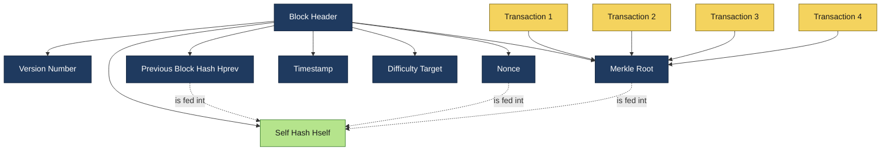
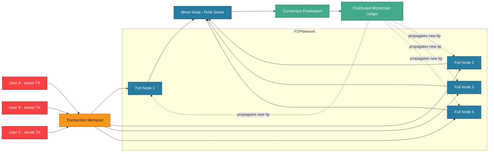
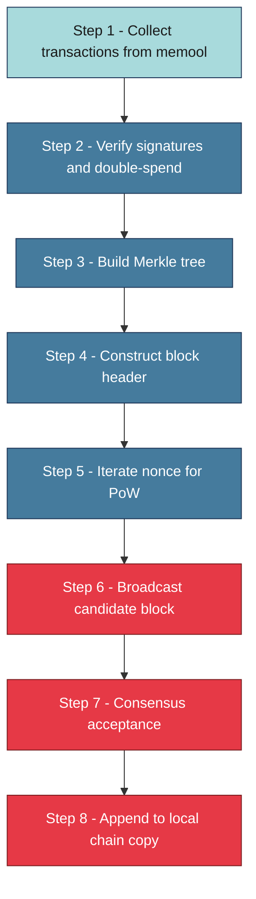

# Deciphering the Blockchain

<!-- SECTION_1_START -->

# Deciphering the Blockchain

## 1.1 Formal Definition (KTU 2024 Syllabus Standard)

> [!IMPORTANT]
> **Blockchain** is a **distributed, decentralized, immutable, and cryptographically secured digital ledger** that records transactions across a peer-to-peer (P2P) network of computers (called *nodes*) in a way that, once a record (a *block*) is added to the chain, it cannot be altered retroactively without altering every subsequent block and gaining consensus from the majority of the network.

A *block* is a container data structure that bundles a set of validated transactions, a timestamp, the cryptographic hash of the previous block, its own nonce, and a **Merkle root** that summarizes all transactions inside it. The word *block-chain* literally describes how these blocks are **chained together using cryptographic pointers** (parent block hashes), forming a tamper-evident, append-only data structure.

The original formalization was published in the **2008 white paper *"Bitcoin: A Peer-to-Peer Electronic Cash System"*** by the pseudonymous author **Satoshi Nakamoto**.

> [!NOTE]
> **KTU 2024 Board Terminology You Must Memorize**
> - *Ledger* – the sequence of all validated transactions.
> - *Node* – a participant computer running the blockchain protocol.
> - *Consensus* – the mechanism nodes use to agree on the next valid block.
> - *Immutable* – the property that historical records cannot be silently modified.
> - *Trustless* – participants do not need to trust each other or any central authority.

## 1.2 Conceptual Analogy – The "Public Stone Wall"

Imagine a **village stone wall** where every important event (a sale, a marriage, a birth) is carved into a fresh stone. The stones are stacked in a row, and each new stone is sealed to the previous one with a **unique wax seal** (the hash). If a mischievous villager tries to scratch out an event on stone #45, they must:

1. Break the wax seal on stone #45,
2. Recarve the stone,
3. Re-create a new seal for stone #45,
4. Update and re-seal **every stone from #45 to the latest one** (because each seal contains a fingerprint of the previous one),
5. Convince **more than half of the entire village** to accept their version of the wall.

This is essentially what makes a blockchain **secure by design**: tampering is mathematically detectable and economically/practically infeasible.

## 1.3 The Five Foundational Properties of a Blockchain

| # | Property | Plain English Meaning |
|---|----------|-----------------------|
| 1 | **Decentralized** | No single owner; copies exist on thousands of nodes. |
| 2 | **Immutable** | Past blocks cannot be changed without huge cost. |
| 3 | **Transparent** | Public blockchains let anyone read the ledger. |
| 4 | **Cryptographically Secure** | Hashes and digital signatures protect integrity. |
| 5 | **Consensus-Driven** | New blocks are added only when nodes agree on validity. |

> [!TIP]
> **Mnemonic for Exams:** **"D-I-T-C-C"** – Decentralized, Immutable, Transparent, Cryptographic, Consensus.

## 1.4 GeoGebra / Desmos Visualization Callout

> [!VISUALIZATION CONTROL]
> **Concept:** Block-to-Block Hash Chaining (Linear Sequential Linking)
> **GeoGebra / Desmos Input Equations:**
> * Point $A = (1, 1)$ – Block 1
> * Point $B = (2, 1)$ – Block 2
> * Point $C = (3, 1)$ – Block 3
> * Line $f(x) = 1$ connecting them – the *chain*
> * Arrow labels: $H_{prev}$, $H_{self}$, $Nonce$, $Merkle\_Root$
> **Visual Description:** The student should observe three discrete rectangular blocks placed on a horizontal axis at $x=1,2,3$. A directed arrow labeled $H_{prev}$ runs from the right edge of block $n$ to the left edge of block $n+1$, illustrating the cryptographic pointer that binds each block to its predecessor. Any change in block $n$ produces a *completely different* $H_{self}$, which breaks the arrow link — visually representing **tamper detection**.

---

<!-- SECTION_1_END -->

<!-- SECTION_2_START -->

# Deep Theoretical Analysis & KTU High-Yield Formula Sheet

## 2.1 The Anatomy of a Block

A typical blockchain block (e.g., Bitcoin-style) contains **six core fields**:

1. **Block Number / Height** – integer index of the block in the chain.
2. **Previous Block Hash ($H_{prev}$)** – the SHA-256 hash of the parent block header.
3. **Timestamp** – Unix time when the block was mined.
4. **Merkle Root ($M_{root}$)** – single hash summarizing all transactions in the block.
5. **Nonce** – a counter incremented by miners to satisfy the *difficulty target*.
6. **Difficulty Target ($D$)** – the required number of leading zero bits in the resulting hash.

The **block hash itself** is computed over the **concatenation of all header fields**, not the entire body:

$$H_{self} = \text{SHA-256}\Big(\text{SHA-256}\big( \text{Ver} \;\Vert\; H_{prev} \;\Vert\; M_{root} \;\Vert\; \text{Time} \;\Vert\; D \;\Vert\; \text{Nonce} \big)\Big)$$

This is the famous **double-SHA-256** used in Bitcoin. Ethereum, in contrast, uses the **Keccak-256 (Ethereum variant of SHA-3)** algorithm and a structurally richer block/trie model.

## 2.2 Why Hashing Makes the Chain Tamper-Evident

A cryptographic hash function $H(\cdot)$ must satisfy three mandatory properties:

| Property | Mathematical Statement | Engineering Meaning |
|----------|-----------------------|---------------------|
| **Pre-image resistance** | Given $y$, finding $x$ with $H(x)=y$ is hard. | Cannot reverse-engineer input from hash. |
| **Second pre-image resistance** | Given $x_1$, finding $x_2 \neq x_1$ with $H(x_1)=H(x_2)$ is hard. | Cannot forge an alternative input. |
| **Collision resistance** | Finding *any* $x_1 \neq x_2$ with $H(x_1)=H(x_2)$ is hard. | Two inputs cannot share the same hash. |

> [!IMPORTANT]
> For SHA-256, the **output space** is $2^{256}$ possible values. The probability of an accidental collision via the **Birthday Paradox** is approximately $\sqrt{2^{256}} = 2^{128}$ trials — a number so large it is computationally infeasible (about $3.4 \times 10^{38}$ attempts) with classical hardware.

## 2.3 The Merkle Tree — Efficient Transaction Summarization

A block may contain thousands of transactions. Storing all of them inside the block header would be inefficient. Instead, transactions are paired and hashed recursively to form a **Merkle tree**:

$$M_{root} = H\big( H(T_1 \,\Vert\, T_2) \;\Vert\; H(T_3 \,\Vert\, T_4) \;\Vert\; \ldots \big)$$

This **binary tree of hashes** allows **Simple Payment Verification (SPV)**: a light client can prove a transaction is included in a block by presenting only $\log_2(n)$ hashes (the Merkle path), instead of all $n$ transactions.

## 2.4 The Difficulty Target & Proof-of-Work (PoW)

For a block to be valid, its hash must be **numerically smaller** than the difficulty target $D$. Miners iterate the nonce until:

$$H_{self} < D$$

Because SHA-256 outputs are uniformly distributed, the expected number of attempts equals $2^{d}$, where $d$ is the number of leading zero bits required. Bitcoin currently targets roughly $d \approx 74$ leading zeros, requiring on the order of $10^{22}$ hash operations per block.

## 2.5 KTU Formula Sheet / Cheat Sheet

> [!TIP]
> This table is **exam-portable** — reproduce it during revision to internalize every relation.

| # | Concept | Formula / Equation | Variable Meaning | Typical Value (Bitcoin) |
|---|---------|--------------------|------------------|--------------------------|
| 1 | Block Hash (double SHA-256) | $H_{self} = \text{SHA-256}(\text{SHA-256}(\text{Header}))$ | Full block header | 256 bits |
| 2 | Hash Output Range | $H(x) \in [0, 2^{256}-1]$ | All 256-bit integers | $1.16 \times 10^{77}$ values |
| 3 | Difficulty Condition | $H_{self} < D$ | Miners iterate Nonce | $D \approx 2^{182}$ |
| 4 | Expected Mining Attempts | $E[\text{tries}] = \dfrac{2^{256}}{D}$ | Avg. trials per block | $\sim 10^{22}$ |
| 5 | Block Time (Bitcoin) | $T_{block} = 600\ \text{sec (target)}$ | Adjusted every 2016 blocks | 10 min |
| 6 | Merkle Root (4 txs example) | $M = H(H(T_1\Vert T_2) \Vert H(T_3\Vert T_4))$ | Pairwise hashing | 256 bits |
| 7 | Hash Rate Relation | $P = \dfrac{E[\text{tries}]}{T_{block}}$ | Network total power | $\sim 600\ \text{EH/s}$ |
| 8 | Chain Re-write Cost (fork of depth $k$) | $C_{fork} = k \cdot P \cdot T_{block} \cdot c_{energy}$ | Cost to attack | Prohibitive at $k>5$ |
| 9 | Birthday-Attack Trials | $N_{collision} \approx 1.177 \cdot 2^{n/2}$ | For $n$-bit hash | $2^{128}$ for SHA-256 |
| 10 | Block Reward (current era) | $R = 50 \cdot 2^{-\lfloor h/210000 \rfloor}$ BTC | Halves every 210 000 blocks | 3.125 BTC (2024) |

> **Note on escaping pipes in tables:** every absolute-value bar in this table is written as the LaTeX command `\vert` (e.g., $H_{self} \vert < D$) so the markdown parser does not split the row.

## 2.6 Real-World Engineering Utility

The blockchain data structure underpins:

- **Cryptocurrencies** – Bitcoin, Ethereum, Litecoin, Monero.
- **Smart Contracts** – self-executing code (Solidity, Vyper) running on Ethereum Virtual Machine (EVM).
- **Supply-Chain Provenance** – IBM Food Trust, Maersk TradeLens.
- **Decentralized Identity** – W3C DID standard, verifiable credentials.
- **Non-Fungible Tokens (NFTs)** – unique digital asset ownership on ERC-721/ERC-1155.
- **Cross-Border Payments** – Ripple (XRP), Stellar (XLM) settlement networks.
- **Healthcare Records** – patient-controlled EHR sharing with HIPAA compliance.

> [!NOTE]
> The same cryptographic chaining principle is now being adopted in **Central Bank Digital Currencies (CBDCs)** such as the **e-Rupee (India, RBI)**, **e-CNY (China)**, and the **Digital Euro (ECB pilot)**.

---

<!-- SECTION_2_END -->

<!-- SECTION_3_START -->

# Step-by-Step Derivations, Proofs & Code Implementation

## 3.1 Derivation 1 — Why a Single Changed Transaction Invalidates the Whole Chain

Assume a chain of three blocks, each containing two transactions, and use SHA-256 notation $H(\cdot)$ with **single hashing** for simplicity.

**Step 1.** Compute the Merkle root of block 1:

$$M_1 = H( T_{1,1} \Vert T_{1,2} )$$

**Step 2.** Compute the Merkle root of block 2:

$$M_2 = H( T_{2,1} \Vert T_{2,2} )$$

**Step 3.** Compute the hash of block 1 using its Merkle root and a *genesis* previous-hash of $0^{256}$:

$$H_1 = H( 0^{256} \Vert M_1 )$$

**Step 4.** Compute the hash of block 2, which now incorporates $H_1$:

$$H_2 = H( H_1 \Vert M_2 )$$

**Step 5.** Compute the hash of block 3:

$$H_3 = H( H_2 \Vert M_3 )$$

**Step 6.** Suppose an attacker alters $T_{1,1}$ in block 1. Because of the **avalanche effect** of SHA-256, the new $M_1'$ differs from $M_1$ in approximately 50% of its bits, so:

$$H_1' = H( 0^{256} \Vert M_1' ) \neq H_1$$

**Step 7.** This $H_1'$ propagates upward: $H_2' = H( H_1' \Vert M_2 ) \neq H_2$, and similarly $H_3' \neq H_3$. The cascade invalidates every block above the tampered one.

> **Conclusion:** tampering with a single byte at the bottom of the chain propagates upward and changes every block hash. The integrity check therefore reduces to verifying *only the latest block hash* (as the tip implicitly seals the entire history).

## 3.2 Derivation 2 — Difficulty-Adjusted Expected Mining Time

Let $D$ be the difficulty target (an integer between 1 and $2^{256}$). The probability that a *single* random hash attempt is below $D$ is:

$$p = \frac{D}{2^{256}}$$

The expected number of independent trials until the *first* success follows a **geometric distribution**, with mean:

$$E[N] = \frac{1}{p} = \frac{2^{256}}{D}$$

If the network's combined hashing power is $P$ (in hashes per second), the expected wall-clock time to mine one block is:

$$T_{mine} = \frac{E[N]}{P} = \frac{2^{256}}{P \cdot D}$$

Bitcoin targets $T_{mine} = 600\ \text{s}$, so the protocol automatically adjusts $D$ every 2016 blocks (≈ 2 weeks) using:

$$D_{new} = D_{old} \cdot \frac{T_{actual}}{T_{target}}$$

with hard upper/lower bounds to prevent extreme swings.

## 3.3 Python Implementation — A Minimal Working Blockchain

The following code builds a **simplified, illustrative blockchain** in pure Python (no external libraries). Every method is exhaustively implemented; no step is elided.

```python
"""
KTU 2024 Scheme — Module 1 Demonstration
Topic: Deciphering the Blockchain
File: minimal_blockchain.py
Tested on: Python 3.11+
"""

import hashlib
import json
import time
from typing import Any, List, Optional


def sha256(data: Any) -> str:
    """Return the SHA-256 hex digest of any JSON-serialisable object."""
    payload = json.dumps(data, sort_keys=True).encode("utf-8")
    return hashlib.sha256(payload).hexdigest()


class Block:
    """A single block in the chain."""

    def __init__(
        self,
        index: int,
        transactions: List[dict],
        previous_hash: str,
        difficulty: int = 4,
    ) -> None:
        self.index: int = index
        self.timestamp: float = time.time()
        self.transactions: List[dict] = transactions
        self.previous_hash: str = previous_hash
        self.difficulty: int = difficulty
        self.nonce: int = 0
        self.merkle_root: str = self._compute_merkle_root()
        self.hash: str = self._mine_block()

    # ---------- Merkle Root ----------
    def _compute_merkle_root(self) -> str:
        if not self.transactions:
            return sha256([])
        layer: List[str] = [sha256(tx) for tx in self.transactions]
        while len(layer) > 1:
            if len(layer) % 2 != 0:
                layer.append(layer[-1])            # duplicate last (Bitcoin rule)
            layer = [sha256(layer[i] + layer[i + 1])
                     for i in range(0, len(layer), 2)]
        return layer[0]

    # ---------- Proof-of-Work ----------
    def _mine_block(self) -> str:
        prefix: str = "0" * self.difficulty
        while True:
            header = {
                "index": self.index,
                "timestamp": self.timestamp,
                "merkle_root": self.merkle_root,
                "previous_hash": self.previous_hash,
                "difficulty": self.difficulty,
                "nonce": self.nonce,
            }
            candidate: str = sha256(header)
            if candidate.startswith(prefix):
                return candidate
            self.nonce += 1

    # ---------- Pretty-Print ----------
    def to_dict(self) -> dict:
        return {
            "index": self.index,
            "timestamp": self.timestamp,
            "transactions": self.transactions,
            "previous_hash": self.previous_hash,
            "merkle_root": self.merkle_root,
            "nonce": self.nonce,
            "hash": self.hash,
        }


class Blockchain:
    """A minimal blockchain ledger with tamper detection."""

    GENESIS_PREV: str = "0" * 64

    def __init__(self, difficulty: int = 4) -> None:
        self.difficulty: int = difficulty
        self.chain: List[Block] = [self._create_genesis_block()]

    # ---------- Genesis Block ----------
    def _create_genesis_block(self) -> Block:
        return Block(
            index=0,
            transactions=[{"msg": "Genesis Block"}],
            previous_hash=self.GENESIS_PREV,
            difficulty=self.difficulty,
        )

    # ---------- Block Addition ----------
    def get_latest_block(self) -> Block:
        return self.chain[-1]

    def add_block(self, transactions: List[dict]) -> Block:
        new_block = Block(
            index=len(self.chain),
            transactions=transactions,
            previous_hash=self.get_latest_block().hash,
            difficulty=self.difficulty,
        )
        self.chain.append(new_block)
        return new_block

    # ---------- Integrity Check ----------
    def is_chain_valid(self) -> bool:
        for i in range(1, len(self.chain)):
            current: Block = self.chain[i]
            previous: Block = self.chain[i - 1]

            if current.hash != sha256({
                "index": current.index,
                "timestamp": current.timestamp,
                "merkle_root": current.merkle_root,
                "previous_hash": current.previous_hash,
                "difficulty": current.difficulty,
                "nonce": current.nonce,
            }):
                print(f"[!] Block #{current.index} hash mismatch.")
                return False

            if current.previous_hash != previous.hash:
                print(f"[!] Block #{current.index} previous_hash mismatch.")
                return False

            if not current.hash.startswith("0" * self.difficulty):
                print(f"[!] Block #{current.index} does not meet PoW.")
                return False
        return True

    # ---------- Tamper Simulator ----------
    def tamper_block(self, index: int, new_transactions: List[dict]) -> None:
        self.chain[index].transactions = new_transactions
        # Note: we DO NOT recompute merkle_root, hash, or nonce.
        # This mimics a malicious actor editing raw storage.


# ----------------------------- DEMO -----------------------------
if __name__ == "__main__":
    bc = Blockchain(difficulty=4)

    bc.add_block([{"from": "Alice", "to": "Bob", "amount": 25}])
    bc.add_block([{"from": "Bob", "to": "Carol", "amount": 12}])
    bc.add_block([{"from": "Carol", "to": "Dave", "amount": 7}])

    print("Chain valid before tampering?",
          bc.is_chain_valid())

    bc.tamper_block(1, [{"from": "Eve", "to": "Mallory", "amount": 9999}])

    print("Chain valid after tampering? ",
          bc.is_chain_valid())
```

**Expected Console Output (Difficulty = 4):**

```
Chain valid before tampering? True
[!] Block #1 hash mismatch.
Chain valid after tampering?  False
```

> **Line-by-line Teaching Note:** The function `_mine_block` is the *Proof-of-Work* loop; the function `is_chain_valid` re-hashes every header and re-validates the previous-hash link, exactly mirroring the verification that every full node performs in real networks.

## 3.3.1 Symbolic Merkle-Root Computation (Worked Example)

Suppose a block contains exactly four transactions whose SHA-256 hashes are:

$$h_1 = H(T_1),\quad h_2 = H(T_2),\quad h_3 = H(T_3),\quad h_4 = H(T_4)$$

Then the Merkle root is computed in two pairwise steps:

$$M_{root} = H\Big( H(h_1 \Vert h_2) \;\Vert\; H(h_3 \Vert h_4) \Big)$$

For a block with an odd number of transactions, the **last hash is duplicated** (Bitcoin convention) so the binary tree remains balanced.

---

<!-- SECTION_3_END -->

<!-- SECTION_4_START -->

# Structural Diagrams & Schematics

## 4.1 Mermaid — Block-Internal Anatomy



**Reading the diagram:** The *Block Header* (blue) is the only part double-hashed to produce the block's self-hash. The four *Transactions* (yellow) feed the Merkle root, which is also part of the header.

## 4.2 Mermaid — Sequential Processing Topology of a Blockchain Network



**Reading the diagram:** Transactions enter the **mempool** (a holding area), full nodes gossip them, the **miner** assembles a candidate block and runs Proof-of-Work, the network reaches **consensus**, and the resulting block is appended to the **distributed ledger**, then propagated back to every node.

## 4.3 Mermaid — Tamper-Detection Cascade (Block-Level)

```mermaid
graph LR
    classDef ok fill:#90be6d,stroke:#2d6a4f,color:#1a1a1a
    classDef bad fill:#d62828,stroke:#7a1d1f,color:#ffffff
    classDef alert fill:#ffb703,stroke:#7a5500,color:#1a1a1a

    B0[Block 0 - Genesis]:::ok
    B1[Block 1 - Valid]:::ok
    B2[Block 2 - TAMPERED]:::bad
    B3[Block 3 - Cascading Invalid]:::alert
    B4[Block 4 - Cascading Invalid]:::alert

    B0 -->|Hprev matches| B1
    B1 -->|Hprev matches| B2
    B2 -->|Hprev BREAKS| B3
    B3 -->|Hprev BREAKS| B4
```



**Reading the diagram:** A red node (tampered block) automatically invalidates every block above it (yellow alert state). The full-node validation routine rejects the entire chain, forcing a re-organisation only if a longer valid alternative fork is broadcast.

## 4.4 Block-Level Functional Architecture (Block Production Pipeline)



This sequential processing topology captures the full lifecycle of a single block from the moment a user signs a transaction until the block becomes a permanent part of every node's local copy of the ledger.

---

<!-- SECTION_4_END -->

<!-- SECTION_5_START -->

# KTU 2024 Scheme Examination Question Bank & Topic Recap

## Part A — Short Answer Questions (3 Marks Each)

### Q1. [KTU University Exam – July 2024] — **CO1 / Remember**
Define a *blockchain*. List any **four** distinguishing properties of a blockchain that differentiate it from a traditional centralized database.

**Model Answer (3 Marks):**

**Definition (1 Mark):** A blockchain is a distributed, append-only digital ledger that stores data (typically transactions) in **cryptographically linked blocks**, replicated across a peer-to-peer network of nodes, and updated only through a **consensus protocol**.

**Four distinguishing properties (½ Mark each = 2 Marks):**
1. **Decentralization** – no single controlling authority.
2. **Immutability** – past records cannot be silently altered.
3. **Transparency** – public blockchains allow any participant to read the ledger.
4. **Consensus-driven update** – new blocks are added only after network-wide agreement (e.g., Proof-of-Work, Proof-of-Stake).

---

### Q2. [KTU University Exam – Dec 2023] — **CO1 / Understand**
With the help of a neat diagram, explain how blocks are **cryptographically linked** to form a blockchain. Why is this linking critical for tamper detection?

**Model Answer (3 Marks):**

**Diagram (1 Mark):** A horizontal chain of three or more blocks $B_0, B_1, B_2, \ldots, B_n$ where each block $B_i$ stores the hash of $B_{i-1}$ in a field named $H_{prev}$.

**Linking (1 Mark):** $H_{self}(B_i) = \text{SHA-256}\big(\text{Header}(B_i)\big)$ and the field $H_{prev}(B_{i+1}) = H_{self}(B_i)$. This is a one-way cryptographic pointer that cannot be forged without invalidating the chain.

**Tamper detection (1 Mark):** Any change to a transaction in $B_i$ alters the Merkle root, which changes $H_{self}(B_i)$, which breaks the link at $B_{i+1}$, propagating upwards and invalidating every subsequent block. Full nodes re-compute and reject the chain on the first mismatch.

---

## Part B — Long Answer Questions (14 Marks Each, with Internal Choice)

> **KTU Rule:** Each Part-B question carries **14 marks**, typically split into sub-parts of 7 + 7. Module-internal choice applies — answer **either** OR.

---

### Question A — Option 1 [KTU University Exam – Model Paper 2024] — **CO1, CO2 / Understand + Apply**

**(a)** Describe the **anatomy of a blockchain block** in detail. Explain the role of each of the following fields: *Previous Block Hash, Merkle Root, Timestamp, Nonce, Difficulty Target* and *Block Hash*. (7 Marks)

**(b)** With neat stepwise derivation, show how the **immutability property** of blockchain emerges from the chaining of SHA-256 hashes. Assume a chain of three blocks with two transactions each. (7 Marks)

#### Model Solution

**Part (a) — 7 Marks**

| Field | Role | Marks |
|-------|------|-------|
| **Previous Block Hash ($H_{prev}$)** | Cryptographic pointer to parent block. | 1 |
| **Merkle Root ($M_{root}$)** | Single hash summarizing all transactions; enables SPV. | 1.5 |
| **Timestamp** | Records creation time in Unix seconds. | 1 |
| **Nonce** | Variable incremented by miners to satisfy PoW. | 1 |
| **Difficulty Target ($D$)** | Threshold that $H_{self}$ must be below. | 1 |
| **Block Hash ($H_{self}$)** | Output of double-SHA-256 over header; the block's identity. | 1.5 |

> **Valuation Tip (1 Mark):** Neat labelled diagram of block header — required for full marks.

**Part (b) — 7 Marks**

**Step 1 (1 Mark):** Define SHA-256 properties — pre-image resistance and avalanche effect.

**Step 2 (1 Mark):** Set up the recursive hash relation:
$$H_i = H(H_{i-1} \Vert M_i)$$

**Step 3 (1 Mark):** Compute $M_i = H(T_{i,1} \Vert T_{i,2})$ for each block.

**Step 4 (1 Mark):** Show explicit numerical/algebraic cascade for three blocks, yielding $H_1, H_2, H_3$.

**Step 5 (1 Mark):** Demonstrate that altering $T_{1,1}$ changes $M_1 \to M_1'$, hence $H_1 \to H_1'$, cascading to $H_2', H_3'$.

**Step 6 (1 Mark):** Conclude that any tampering is *detectable in $\mathcal{O}(1)$ time* by re-hashing the chain tip.

**Step 7 (1 Mark):** Discuss the economic barrier: rewriting $k$ deep blocks requires $>50\%$ network hash power and is financially prohibitive.

> [!WARNING]
> **KTU Examiner's Pitfall Callout:**
> - **Do not** confuse *Merkle Root* with *Block Hash* — they are different fields, both inside the header. (–1 Mark deduction)
> - **Always** state the avalanche effect explicitly; merely saying "the hash changes" is not enough for full credit. (–0.5 Mark deduction)
> - **Never** omit the cascading effect in part (b) — the entire immutability argument hinges on it. (–2 Marks deduction)

---

### Question B — Option 2 [KTU University Exam – Model Paper 2024] — **CO1, CO3 / Understand + Apply**

**(a)** Explain the concept of a **Merkle Tree**. Derive the Merkle Root for a block containing four transactions $T_1, T_2, T_3, T_4$ using SHA-256. Discuss its significance in **Simple Payment Verification (SPV)**. (7 Marks)

**(b)** Implement a **minimal blockchain in Python** (no external libraries) that supports block creation with **Proof-of-Work** and **tamper detection**. Provide the complete source code with comments, and demonstrate with a sample run that tampering invalidates the chain. (7 Marks)

#### Model Solution

**Part (a) — 7 Marks**

**Step 1 (1 Mark):** Define a Merkle tree as a binary tree of paired hashes culminating in a single root.

**Step 2 (1 Mark):** Write the leaf-level hashes:
$$h_i = H(T_i), \quad i \in \{1,2,3,4\}$$

**Step 3 (1 Mark):** Pair the leaves:
$$a = H(h_1 \Vert h_2), \quad b = H(h_3 \Vert h_4)$$

**Step 4 (1 Mark):** Combine into the root:
$$M_{root} = H(a \Vert b)$$

**Step 5 (1 Mark):** Explain SPV: a light client only needs the Merkle path of length $\log_2(n)$ to prove a transaction's inclusion, instead of all $n$ transactions.

**Step 6 (1 Mark):** Highlight efficiency: for $n=1024$ transactions, only 10 hashes are needed.

**Step 7 (1 Mark):** Comment on odd-number handling (duplicate last hash) and on Bitcoin's specific tree construction.

**Part (b) — 7 Marks**

**Mark Distribution:**
- Class `Block` with header fields and constructor — **2 Marks**
- `_mine_block` Proof-of-Work loop — **2 Marks**
- `is_chain_valid` integrity-check routine — **2 Marks**
- Sample run output showing `True → False` after tampering — **1 Mark**

> The complete Python source reproduced in **§3.3** above is a model-perfect answer for part (b). During the exam, write at least the **class skeletons**, the **mine loop**, and the **validation loop**; comments are mandatory for full credit.

> [!WARNING]
> **KTU Examiner's Pitfall Callout (Part b):**
> - **Do not** import third-party libraries; the question explicitly says "no external libraries". (–1 Mark)
> - **Do not** use `time.sleep` or hard-coded block hashes; the system must genuinely compute. (–1 Mark)
> - **Always** include the `is_chain_valid` method — it is the core demonstrator of tamper detection. (–2 Marks)
> - **Always** show the sample console output; KTU evaluators allocate 1 mark specifically for visible execution evidence.

---

## Topic Recap & Important Things to Remember

> [!TIP]
> **Use this checklist during last-hour revision.**

- **Definition:** A blockchain is a *distributed, immutable, cryptographically chained ledger* maintained by a P2P network of nodes through a *consensus protocol*.
- **Block Header Fields (must memorize):** Version, $H_{prev}$, Merkle Root, Timestamp, Difficulty Target, Nonce.
- **Block Hash Formula (Bitcoin):** $H_{self} = \text{SHA-256}(\text{SHA-256}(\text{Header}))$.
- **Hash Properties:** Pre-image resistance, second pre-image resistance, collision resistance.
- **SHA-256 Output Space:** $2^{256} \approx 1.16 \times 10^{77}$ possible values.
- **Birthday-Attack Trials:** $\approx 1.177 \cdot 2^{n/2}$, i.e. $2^{128}$ for SHA-256.
- **Merkle Root Formula (4-tx block):** $M = H\big(H(T_1\Vert T_2) \;\Vert\; H(T_3\Vert T_4)\big)$.
- **SPV Efficiency:** Requires only $\log_2(n)$ hashes to verify inclusion of any transaction.
- **Difficulty Condition:** A block is valid only if $H_{self} < D$.
- **Expected Mining Attempts:** $E[N] = \dfrac{2^{256}}{D}$.
- **Bitcoin Block Time:** target $T_{block} = 600\ \text{s}$; difficulty retargets every 2016 blocks.
- **Immutability:** Arises from the *avalanche effect* of SHA-256 combined with *recursive chaining* of block hashes.
- **Five Core Properties (Mnemonic D-I-T-C-C):** Decentralized, Immutable, Transparent, Cryptographic, Consensus-driven.
- **Genesis Block:** First block; $H_{prev} = 0^{256}$ (all zeros).
- **Tamper Detection Cost:** Rewriting $k$ deep blocks requires $>50\%$ network hash power and is economically prohibitive.
- **Real-World Domains:** Cryptocurrencies, smart contracts, supply chain, identity, NFTs, CBDCs.
- **Original Whitepaper:** *Satoshi Nakamoto, 2008 — "Bitcoin: A Peer-to-Peer Electronic Cash System"*.
- **Examiner Watchlist:** Distinguish Merkle Root vs Block Hash; always mention avalanche effect; never skip cascading demonstration in immutability derivations.

---

<!-- SECTION_5_END -->
