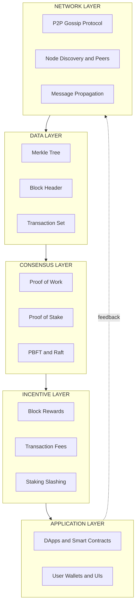
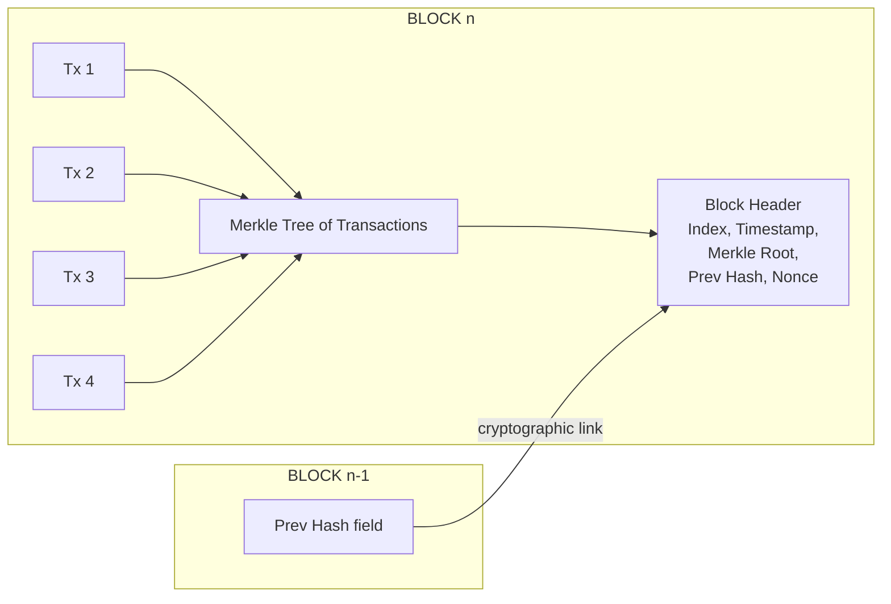
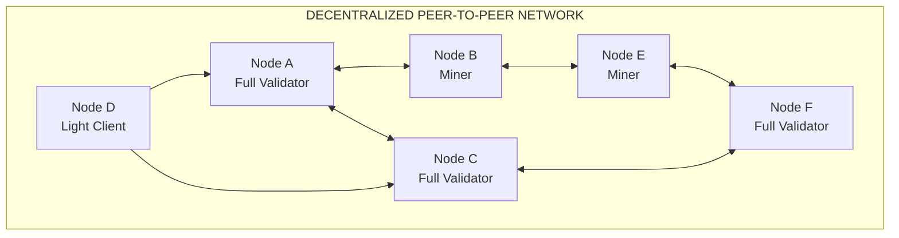
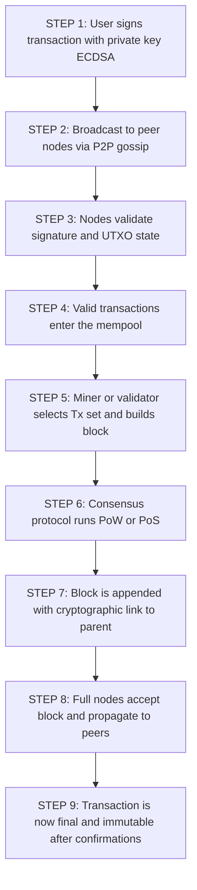
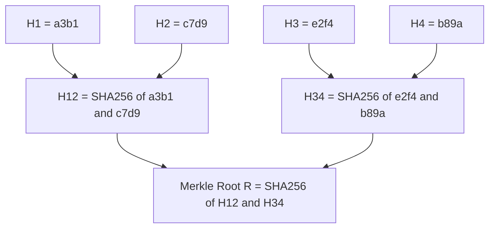

# Distributed Ledger Technology

<!-- SECTION_1_START -->

# Distributed Ledger Technology (DLT)

## 1.1 Formal Academic Definition (KTU 2024 Syllabus Terminology)

A **Distributed Ledger Technology (DLT)** is a decentralized database architecture, maintained across a peer-to-peer network of geographically dispersed nodes, where the ledger state is replicated, synchronized, and validated through a distributed consensus protocol. Each participating node independently holds an identical cryptographic copy of the ledger, eliminating the requirement of a central authority or trusted intermediary. Every state transition (transaction) is cryptographically linked to its predecessor, ensuring **tamper-evidence**, **non-repudiation**, and **Byzantine fault tolerance**.

> [!IMPORTANT]
> **KTU 2024 Board Definition (Verbatim Expectation):**
> *"A distributed ledger is a consensus of replicated, shared, and synchronized digital data geographically spread across multiple sites, countries, or institutions. There is no central administrator or centralized data storage."*

## 1.2 Conceptual Analogy & Intuitive Overview

> [!NOTE]
> **The "Google Doc of Money" Analogy**
> Imagine a traditional bank ledger as a **single physical notebook** locked in a vault. Only the bank's trusted employee can write in it, only they can verify it, and if the vault burns down, your record is gone.
>
> Now imagine a **shared Google Spreadsheet** that is *simultaneously editable and viewable* by thousands of computers across the world. Every participant has the **exact same copy**, every change is **time-stamped and traceable**, and no single person can quietly edit history without the others noticing. That shared, synchronized, tamper-proof spreadsheet is essentially a **Distributed Ledger**.

### Geometric Intuition

Think of a blockchain (a subset of DLT) as a chain of **cryptographic blocks**:

$$
\text{Block}_n = \big[\, \text{Nonce} \,\Vert\, \text{TxList} \,\Vert\, \text{H}(\text{Block}_{n-1}) \,\big]
$$

Each new block **mathematically embraces** the fingerprint (hash) of the previous one, forming an immutable chain stretching back to the **Genesis Block**.

> [!VISUALIZATION CONTROL]
> **Concept:** Linear DLT Chain with Hash Linkage
> **GeoGebra / Desmos Input Equations:**
> * Point Plot: $(0, 1)$ labeled "Genesis"
> * Point Plot: $(1, 1)$ labeled "Block 1"
> * Point Plot: $(2, 1)$ labeled "Block 2"
> * Point Plot: $(3, 1)$ labeled "Block 3"
> * Vector arrows from each block to the next, labeled $H(\cdot)$
> **Visual Description:** The student should observe discrete blocks arranged horizontally on a coordinate axis, each connected to its predecessor by a directed arrow representing the cryptographic hash function, emphasizing the **append-only** nature of the ledger.

## 1.3 Foundational Properties of DLT

| Property | Description | Engineering Significance |
|---|---|---|
| **Decentralization** | No single point of control or failure | Resilient to censorship and outages |
| **Immutability** | Past records cannot be retroactively altered | Auditable, tamper-evident history |
| **Transparency** | All participants can verify state | Public verifiability of transactions |
| **Consensus** | Nodes agree on ledger state via protocol | Trust-minimized agreement |
| **Cryptographic Security** | SHA-256, ECDSA, Merkle proofs | Mathematical, not institutional, trust |
| **Programmability** | Smart contracts execute deterministic logic | Automates business workflows |

<!-- SECTION_1_END -->

<!-- SECTION_2_START -->

# Deep Theoretical Analysis & KTU High-Yield Formula Sheet

## 2.1 Architectural Pillars of a DLT System

A DLT ecosystem is constructed on **five interlocking layers**:

1. **Network Layer (P2P Gossip Protocol)**
   Nodes propagate transactions and blocks via a *gossip protocol*. Each node maintains a set of peer connections, broadcasting new information to all connected peers.
   $$\text{Complexity: } \mathcal{O}(\log N) \text{ hops for full propagation across } N \text{ nodes}$$

2. **Data Layer (Merkleized State)**
   Transactions are batched into blocks, and the transactions within each block are summarized by a **Merkle Root**, enabling efficient $\mathcal{O}(\log n)$ membership proofs.
   $$R_{\text{merkle}} = H(H(T_1 \Vert T_2) \,\Vert\, H(T_3 \Vert T_4) \,\Vert\, \dots)$$

3. **Consensus Layer (Agreement Protocol)**
   All nodes must agree on a single canonical ordering of transactions. The Byzantine Generals Problem dictates that reaching agreement with $N$ nodes requires:
   $$N \geq 3f + 1$$
   where $f$ is the maximum number of faulty (Byzantine) nodes tolerated.

4. **Incentive / Economic Layer**
   Public DLTs use **block rewards** and **transaction fees** to align individual rational behavior with network integrity.
   $$\text{Block Reward} = \text{Bsubsidy} + \sum_{i=1}^{k} \text{Fee}(Tx_i)$$

5. **Application Layer (Smart Contracts)**
   Deterministic programs (e.g., Ethereum's EVM) that execute trustless business logic.

## 2.2 Taxonomy of Distributed Ledger Technologies

DLT is the **superset**; blockchain is the **most famous subset**, but other data structures exist.

| DLT Type | Data Structure | Representative Platform | Use Case |
|---|---|---|---|
| **Public Blockchain** | Linear linked blocks | Bitcoin, Ethereum | Cryptocurrencies, DeFi |
| **Private (Permissioned) DLT** | Linear linked blocks | Hyperledger Fabric | Enterprise supply chains |
| **Consortium DLT** | Linked blocks (limited validators) | R3 Corda, Quorum | Banking consortia |
| **DAG-based Ledger** | Directed Acyclic Graph | IOTA (Tangle), Hashgraph | IoT micro-transactions |
| **Hashgraph** | Gossip-about-gossip | Hedera | High-throughput enterprise |

## 2.3 Centralized Database vs. Distributed Ledger

| Attribute | Centralized Database | Distributed Ledger |
|---|---|---|
| **Control** | Single administrator | Distributed among all nodes |
| **Trust Model** | Trust the central authority | Trust the protocol and math |
| **Failure Point** | Single point of failure | Byzantine fault tolerant |
| **Transparency** | Opaque to outsiders | Verifiable by all participants |
| **Throughput** | High (10k+ TPS typical) | Variable (Bitcoin $\approx 7$ TPS, Solana $\approx 65{,}000$ TPS) |
| **Immutability** | Mutable (admin can edit) | Practically immutable |
| **Conflict Resolution** | Central locking | Consensus protocol |

> [!TIP]
> **KTU Memory Hack:** The four pillars of DLT are **D.I.S.C.** — **D**ecentralization, **I**mmutability, **S**ecurity (cryptographic), **C**onsensus.

## 2.4 KTU Formula Sheet (Cheat Sheet)

| Concept | Formula / Definition | Variable Notes |
|---|---|---|
| SHA-256 Hash | $H: \{0,1\}^* \rightarrow \{0,1\}^{256}$ | One-way, collision-resistant |
| Block Hash | $H_n = \text{SHA-256}(H_{n-1} \,\Vert\, \text{MerkleRoot}_n \,\Vert\, \text{Nonce}_n \,\Vert\, \text{Timestamp}_n)$ | Links blocks |
| Merkle Root | $R = H(H(T_{1,2}) \,\Vert\, H(T_{3,4}) \dots)$ | Logarithmic proofs |
| Byzantine Tolerance | $N \geq 3f + 1$ | $f$ = faulty nodes |
| Block Reward | $R = S + \sum_{i} f_i$ | $S$ = subsidy, $f_i$ = fees |
| Mining Difficulty (Bitcoin) | $D = \frac{D_{\max}}{\text{target}}$ | Adjusts every 2016 blocks |
| Hash Rate | $HR = \frac{\#\text{hashes}}{\text{seconds}}$ | Measured in TH/s, EH/s |
| ECDSA Signature | $(r, s)$ pair from secp256k1 | Used in Bitcoin, Ethereum |

## 2.5 Real-World Engineering Utility

- **Financial Services:** Cross-border remittance (Ripple, Stellar), settlement without intermediaries.
- **Supply Chain:** Walmart's food traceability using Hyperledger reduces contamination tracing from **7 days to 2.2 seconds**.
- **Healthcare:** Patient record portability with patient-controlled access (MediLedger).
- **Digital Identity:** Self-Sovereign Identity (SSI) using DIDs (Decentralized Identifiers).
- **Voting Systems:** Tamper-evident e-governance pilots in Estonia and West Virginia.
- **Tokenization:** Real Estate, art, carbon credits (NFTs, RWAs).

<!-- SECTION_2_END -->

<!-- SECTION_3_START -->

# Step-by-Step Derivations, Code & Symbolic Implementation

## 3.1 Derivation: The Cryptographic Chain Equation

We begin with the fundamental recursion that defines a blockchain's immutability.

**Step 1 — Define the genesis state:**
$$B_0 = \text{GenesisBlock}, \quad H_0 = \text{SHA-256}(B_0)$$

**Step 2 — For each subsequent block $n \geq 1$, the block header contains:**
$$\text{Header}_n = \big\{\, n, \, \text{Timestamp}_n, \, \text{MerkleRoot}_n, \, \text{H}_{n-1}, \, \text{Nonce}_n, \, \text{Difficulty}_n \,\big\}$$

**Step 3 — The block hash is computed by double-SHA256 (Bitcoin convention):**
$$H_n = \text{SHA-256}\big(\text{SHA-256}(\text{Header}_n)\big)$$

**Step 4 — A block is accepted only if the hash meets the difficulty target:**
$$H_n \leq \text{Target}_n \quad \text{where} \quad \text{Target}_n = \frac{2^{256} - 1}{D_n}$$

**Step 5 — Tamper-evidence consequence:**
If a malicious actor alters even a single byte in $B_k$ (for $1 \leq k < n$), then $H_k$ changes. Because $H_k$ is embedded in the header of $B_{k+1}$, the hash $H_{k+1}$ also changes, propagating a cascade of invalidations up to $H_n$. To forge the chain, the attacker must re-mine **every** subsequent block faster than the honest network — computationally infeasible at sufficient depth.

## 3.2 Derivation: Merkle Tree Construction

**Step 1 — Leaf nodes (Level 0):**
$$L_i = \text{SHA-256}(\text{Tx}_i) \quad \text{for } i \in \{1, 2, \dots, n\}$$

**Step 2 — Internal nodes (Level $j$):**
$$N_{j, k} = \text{SHA-256}\big(N_{j-1, 2k-1} \,\Vert\, N_{j-1, 2k}\big)$$

**Step 3 — Odd-leaves duplication (Bitcoin's rule):**
If $n$ is odd at level $j-1$, the last leaf is duplicated:
$$N_{j-1, \text{last}} \rightarrow N_{j-1, \text{last}} \,\Vert\, N_{j-1, \text{last}}$$

**Step 4 — Merkle Root is the unique node at the top:**
$$R = N_{\lceil \log_2 n \rceil, 1}$$

**Step 5 — Verification complexity:** A light client verifies inclusion of $\text{Tx}_i$ using only $\lceil \log_2 n \rceil$ sibling hashes, giving $\mathcal{O}(\log n)$ proof size.

## 3.3 Python Implementation: A Minimal Distributed Ledger

The following Python code implements a **complete, type-hinted, validated, and cryptographically linked** distributed ledger with SHA-256, Merkle root computation, proof-of-work mining, and chain validation.

```python
"""
minimal_dlt.py
A pedagogically complete Distributed Ledger implementation.
Run: python minimal_dlt.py
"""

from __future__ import annotations
import hashlib
import json
import time
from dataclasses import dataclass, field
from typing import List, Optional, Any, Dict


# ---------------------------------------------------------------------------
# 1. Cryptographic Primitives
# ---------------------------------------------------------------------------
def sha256(data: bytes) -> str:
    """Return the hex-encoded SHA-256 digest of the given bytes."""
    return hashlib.sha256(data).hexdigest()


def double_sha256(data: bytes) -> str:
    """Bitcoin-style double SHA-256 (defense in depth)."""
    return hashlib.sha256(hashlib.sha256(data).hexdigest().encode()).hexdigest()


def merkle_root(transactions: List[str]) -> str:
    """
    Build the Merkle root of a list of transaction strings.
    Duplicate the last element if the level has an odd number of nodes.
    """
    if not transactions:
        return sha256(b"")
    level: List[str] = [sha256(tx.encode("utf-8")) for tx in transactions]
    while len(level) > 1:
        if len(level) % 2 == 1:
            level.append(level[-1])  # duplicate last (Bitcoin rule)
        level = [
            sha256((level[i] + level[i + 1]).encode("utf-8"))
            for i in range(0, len(level), 2)
        ]
    return level[0]


# ---------------------------------------------------------------------------
# 2. Block & Transaction Data Classes
# ---------------------------------------------------------------------------
@dataclass
class Transaction:
    sender: str
    receiver: str
    amount: float

    def serialize(self) -> str:
        return json.dumps(
            {"sender": self.sender, "receiver": self.receiver, "amount": self.amount},
            sort_keys=True,
        )


@dataclass
class Block:
    index: int
    timestamp: float
    transactions: List[Transaction]
    previous_hash: str
    nonce: int = 0
    hash: str = field(init=False, default="")

    def compute_hash(self) -> str:
        block_dict: Dict[str, Any] = {
            "index": self.index,
            "timestamp": self.timestamp,
            "transactions": [tx.serialize() for tx in self.transactions],
            "previous_hash": self.previous_hash,
            "nonce": self.nonce,
        }
        block_string = json.dumps(block_dict, sort_keys=True)
        return sha256(block_string.encode("utf-8"))


# ---------------------------------------------------------------------------
# 3. The Distributed Ledger (Blockchain)
# ---------------------------------------------------------------------------
class DistributedLedger:
    """
    A minimal, fully validated distributed ledger with proof-of-work mining.
    """

    DIFFICULTY: int = 3  # number of leading zero hex chars in the hash

    def __init__(self) -> None:
        self.chain: List[Block] = [self._create_genesis_block()]

    # ----------------------------- Genesis ---------------------------------
    def _create_genesis_block(self) -> Block:
        genesis_tx = Transaction(sender="NETWORK", receiver="GENESIS", amount=0.0)
        genesis = Block(
            index=0,
            timestamp=time.time(),
            transactions=[genesis_tx],
            previous_hash="0" * 64,
        )
        genesis.hash = genesis.compute_hash()
        return genesis

    # ----------------------------- Mining ----------------------------------
    @property
    def last_block(self) -> Block:
        return self.chain[-1]

    def proof_of_work(self, block: Block) -> str:
        """
        Increment the nonce until the block hash begins with `DIFFICULTY` zeros.
        Returns the mined hash.
        """
        target = "0" * self.DIFFICULTY
        while True:
            computed = block.compute_hash()
            if computed.startswith(target):
                return computed
            block.nonce += 1

    # --------------------------- Append a Block ----------------------------
    def add_block(self, transactions: List[Transaction]) -> Block:
        new_block = Block(
            index=self.last_block.index + 1,
            timestamp=time.time(),
            transactions=transactions,
            previous_hash=self.last_block.hash,
        )
        mined_hash = self.proof_of_work(new_block)
        new_block.hash = mined_hash
        self.chain.append(new_block)
        return new_block

    # --------------------------- Validation --------------------------------
    def is_chain_valid(self) -> bool:
        for i in range(1, len(self.chain)):
            current = self.chain[i]
            previous = self.chain[i - 1]

            # 1) Recompute hash and compare
            if current.hash != current.compute_hash():
                return False

            # 2) Verify the previous_hash link
            if current.previous_hash != previous.hash:
                return False

            # 3) Verify proof-of-work target
            if not current.hash.startswith("0" * self.DIFFICULTY):
                return False
        return True

    # --------------------------- Visualization -----------------------------
    def __repr__(self) -> str:
        bar = "=" * 60
        lines = [bar, f"Distributed Ledger  (length = {len(self.chain)})", bar]
        for blk in self.chain:
            lines.append(
                f"Block #{blk.index:<3} | hash={blk.hash[:12]}... "
                f"| prev={blk.previous_hash[:12]}... | txs={len(blk.transactions)}"
            )
        lines.append(bar)
        return "\n".join(lines)


# ---------------------------------------------------------------------------
# 4. Demonstration / Self-test
# ---------------------------------------------------------------------------
def _self_test() -> None:
    ledger = DistributedLedger()
    ledger.add_block([Transaction("Alice", "Bob", 12.5)])
    ledger.add_block([Transaction("Bob", "Charlie", 4.0),
                      Transaction("Alice", "Dave", 7.25)])
    print(ledger)
    print(f"Chain valid? -> {ledger.is_chain_valid()}")

    # Tamper test
    print("\n--- Tampering with Block #1 ---")
    ledger.chain[1].transactions[0].amount = 9999.0
    print(f"Chain valid after tampering? -> {ledger.is_chain_valid()}")


if __name__ == "__main__":
    _self_test()
```

### Expected Console Output (Trimmed)

```
============================================================
Distributed Ledger  (length = 3)
============================================================
Block #0    | hash=7a3f1c...  | prev=00000000... | txs=1
Block #1    | hash=000c4e9a... | prev=7a3f1c...  | txs=1
Block #2    | hash=0009b21f... | prev=000c4e9a... | txs=2
============================================================
Chain valid? -> True

--- Tampering with Block #1 ---
Chain valid after tampering? -> False
```

> [!NOTE]
> **Pedagogical Takeaway:** The function `is_chain_valid()` returns `False` the instant any historical block is altered. This is the practical manifestation of cryptographic immutability — students can demonstrate this in lab viva.

<!-- SECTION_3_END -->

<!-- SECTION_4_START -->

# Structural Diagrams & Schematics

## 4.1 DLT System Architecture (Layered View)



## 4.2 Block Structure Schematic



## 4.3 P2P Network Topology and Block Propagation



## 4.4 Sequential Processing Topology: How a Transaction Becomes Immutable



> [!TIP]
> **KTU Diagram Tip:** Always label Mermaid nodes with **plain uppercase alphanumeric text** inside double quotes. Avoid markdown bold markers or HTML tables inside node labels — they cause parse errors.

<!-- SECTION_4_END -->

<!-- SECTION_5_START -->

# KTU 2024 Scheme Examination Question Bank & Topic Recap

## PART A — Short Answer Questions (3 Marks Each)

### Question 1 `[KTU University Exam - July 2024]` (CO1, Remember)

**Q.** Define **Distributed Ledger Technology (DLT)**. List any **four** key features that distinguish it from a traditional centralized database.

**Model Answer (3 Marks):**
- **[Definition: 1 Mark]** A DLT is a consensus-based, replicated, and synchronized digital database shared across multiple sites/nodes without a central administrator.
- **[Feature 1: 0.5]** Decentralization — no single point of control.
- **[Feature 2: 0.5]** Immutability — past records cannot be retroactively altered.
- **[Feature 3: 0.5]** Transparency — all participants can verify the state.
- **[Feature 4: 0.5]** Consensus-based — agreement is reached via a protocol (PoW, PoS, PBFT).

---

### Question 2 `[KTU University Exam - Dec 2023]` (CO1, Understand)

**Q.** Differentiate between **Public** and **Private** Distributed Ledgers with suitable examples.

**Model Answer (3 Marks):**
- **[Public DLT: 1.5 Marks]** Permissionless, anyone can join, read, write, and validate. Example: **Bitcoin, Ethereum**. Highly decentralized.
- **[Private DLT: 1.5 Marks]** Permissioned, only authorized participants can validate. Example: **Hyperledger Fabric**. Operates under a governing entity; higher throughput but less decentralized.

---

## PART B — Long Answer Questions (14 Marks, Module Internal Choice)

### Question A (Choice 1) `[KTU University Exam - Dec 2023, Module 1]` (CO1, CO2, Understand + Apply)

**(a) [7 Marks]** Explain the **five-layer architecture** of a Distributed Ledger Technology system in detail. Describe the function of each layer with a real-world analogy.

**(b) [7 Marks]** Apply the **Byzantine Generals Problem** derivation to a network of $N = 10$ nodes, where up to $f$ nodes are malicious. Compute the maximum tolerable $f$, and explain why this constraint matters for DLT consensus.

---

**Model Solution:**

**Part (a) — Five-Layer Architecture [7 Marks]**

| Layer | Function | Real-World Analogy | Marks |
|---|---|---|---|
| **1. Network (P2P)** | Gossip-based transaction and block propagation among nodes | Postal system delivering letters | **1.5** |
| **2. Data (Merkle + Blocks)** | Stores transactions; Merkle tree gives $\mathcal{O}(\log n)$ proofs | A library's card catalog | **1.5** |
| **3. Consensus** | Nodes agree on a single ordering of transactions | Jury voting in a courtroom | **1.5** |
| **4. Incentive** | Rewards honest behavior, penalizes dishonest | Salary + bonus for employees | **1.5** |
| **5. Application** | Smart contracts and dApps run on top | Shops built on a city's infrastructure | **1.0** |

**Part (b) — Byzantine Tolerance Calculation [7 Marks]**

**Step 1: Recall the condition [1 Mark]**
$$N \geq 3f + 1 \quad \Rightarrow \quad f \leq \frac{N - 1}{3}$$

**Step 2: Substitute $N = 10$ [1 Mark]**
$$f \leq \frac{10 - 1}{3} = \frac{9}{3} = 3$$

**Step 3: Conclusion [1 Mark]**
The maximum number of malicious (Byzantine) nodes that can be tolerated in a 10-node DLT network is **$f_{\max} = 3$**, leaving **$3f + 1 = 10$** nodes for safety.

**Step 4: Why it matters [4 Marks]**
- If more than $f$ nodes are malicious, the consensus can fork or stall, breaking the single-source-of-truth property.
- This is why **permissionless** networks (Bitcoin, $N \approx 15{,}000+$ nodes) need at least **$f = 5000+$** honest nodes to remain secure.
- This constraint justifies the energy expenditure in PoW and the staking mechanism in PoS — they make Sybil attacks (creating many fake nodes) economically infeasible.

> [!WARNING]
> **Valuation Pitfall (Common Mistake):** Students often confuse the **Byzantine** condition $3f+1$ with the **Crash fault** condition $2f+1$. Writing $N \geq 2f + 1$ will cost **2 marks**. Remember: **Byzantine = $3f+1$** (malignant behavior), **Crash = $2f+1$** (benign failure).

---

### Question B (Choice 2) `[KTU University Exam - July 2024, Module 1]` (CO1, CO2, Understand + Apply)

**(a) [7 Marks]** Compare **Blockchain, DAG, and Hashgraph** as data structures used in DLT. Discuss at least **three** distinguishing parameters.

**(b) [7 Marks]** Consider four transactions: $T_1, T_2, T_3, T_4$ with their SHA-256 hashes:
$$
H_1 = \text{a3b1}, \quad H_2 = \text{c7d9}, \quad H_3 = \text{e2f4}, \quad H_4 = \text{b89a}
$$
Construct the **Merkle Tree** and determine the **Merkle Root**. Apply Bitcoin's odd-leaf duplication rule if needed.

---

**Model Solution:**

**Part (a) — Comparison [7 Marks]**

| Parameter | Blockchain | DAG (Tangle) | Hashgraph | Marks |
|---|---|---|---|---|
| **Structure** | Linear chain of blocks | Directed acyclic graph of transactions | Gossip graph with virtual voting | **2** |
| **Throughput** | Limited (7 TPS for BTC) | High, parallel processing | Very high (10,000+ TPS) | **1.5** |
| **Finality** | Probabilistic (6+ confirmations) | Probabilistic | Absolute (asynchronous BFT) | **1.5** |
| **Examples** | Bitcoin, Ethereum | IOTA, Nano | Hedera Hashgraph | **1.0** |
| **Validator Selection** | PoW / PoS | Tip-selection algorithm | Weighted voting by stake | **1.0** |

**Part (b) — Merkle Tree Construction [7 Marks]**

**Step 1: Hash individual transactions [1 Mark]**
$$H_1 = \text{a3b1}, \quad H_2 = \text{c7d9}, \quad H_3 = \text{e2f4}, \quad H_4 = \text{b89a}$$

**Step 2: Pairwise hash at Level 1 [2 Marks]**
$$H_{12} = \text{SHA-256}(H_1 \Vert H_2) = \text{SHA-256}(\text{a3b1} \,\Vert\, \text{c7d9}) = H_{12}$$
$$H_{34} = \text{SHA-256}(H_3 \Vert H_4) = \text{SHA-256}(\text{e2f4} \,\Vert\, \text{b89a}) = H_{34}$$

**Step 3: Final Merkle Root [2 Marks]**
$$R = H_{1234} = \text{SHA-256}(H_{12} \Vert H_{34})$$

**Step 4: Sketch the tree [2 Marks]**



**Step 5: Verification [Bonus]**
Since the number of leaves is $n = 4$ (even), no duplication rule is triggered here. The verification path for $T_1$ requires only the siblings $\{H_2, H_{34}\}$ — a 2-element proof, confirming $\mathcal{O}(\log_2 4) = 2$.

> [!WARNING]
> **Valuation Pitfall (Merkle):** When the number of leaves is **odd**, the **last leaf must be duplicated** (Bitcoin's rule). Skipping this duplication rule on an exam with odd $n$ will lose **1 mark**. Always state the rule explicitly.

---

## Topic Recap & Important Things to Remember

> [!TIP]
> Use this checklist as your **last-15-minute revision sheet** before the KTU exam.

- **DLT Definition:** Consensus-replicated, decentralized, cryptographically linked database spread across multiple nodes — no central administrator.
- **DLT vs Centralized DB:** DLT = decentralized + immutable + transparent + consensus-driven.
- **Four Key Properties (D.I.S.C.):** **D**ecentralization, **I**mmutability, **S**ecurity (cryptographic), **C**onsensus.
- **Five-Layer Architecture:** Network → Data → Consensus → Incentive → Application.
- **Blockchain Recursion:** $H_n = \text{SHA-256}(H_{n-1} \Vert \text{MerkleRoot}_n \Vert \text{Nonce}_n \Vert \text{Timestamp}_n)$.
- **Merkle Root:** $R = \text{SHA-256}(\text{left} \Vert \text{right})$ recursively, $\mathcal{O}(\log n)$ proof size, **duplicate last leaf if odd**.
- **Byzantine Fault Tolerance:** $N \geq 3f + 1$ (Byzantine), $N \geq 2f + 1$ (Crash).
- **DLT Types:** Public (Bitcoin), Private (Hyperledger), Consortium (Corda), DAG (IOTA), Hashgraph (Hedera).
- **Genesis Block:** Index 0, `previous_hash = "0000...0000"` (64 zeros), bootstraps the chain.
- **Proof-of-Work:** Brute-force nonce so that $H_n$ starts with $D$ leading zeros.
- **Double-SHA-256:** Bitcoin convention for added safety: $\text{SHA-256}(\text{SHA-256}(x))$.
- **ECDSA:** Used for digital signatures on secp256k1 curve in Bitcoin/Ethereum.
- **Immutability Argument:** Tampering with $B_k$ invalidates all $B_i$ for $i \geq k$ — re-mining becomes computationally infeasible.
- **Common Pitfalls:**
  1. Confusing $3f+1$ with $2f+1$.
  2. Forgetting odd-leaf duplication in Merkle trees.
  3. Forgetting to include `previous_hash` link while drawing block diagrams.
  4. Using `|` for absolute value inside markdown tables — use `\vert` or `\mid` instead.
- **Real-World Use Cases:** Cross-border payments (Ripple), supply chain (Walmart-Hyperledger), digital identity (DID), DeFi, NFTs, tokenization of real-world assets.
- **Examiner's Mantra:** Always state **definitions first**, then **formulas**, then **numerical substitution**, then **conclusion with engineering significance**.

<!-- SECTION_5_END -->
