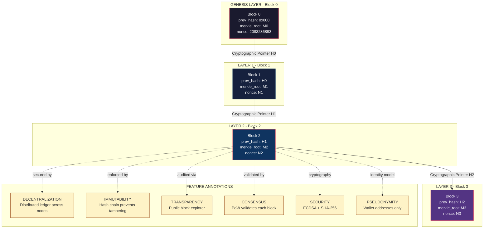
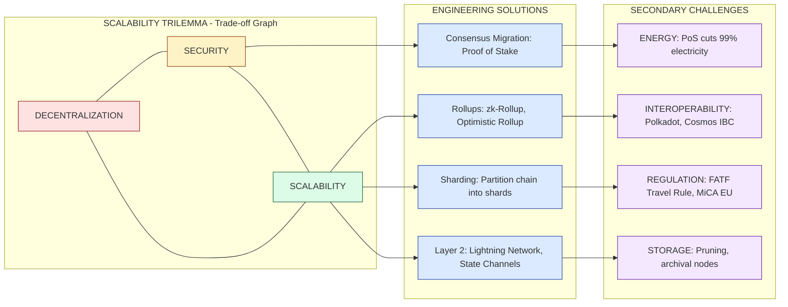
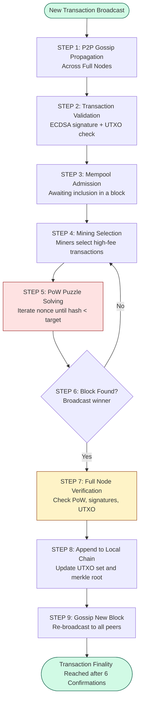

# Features and challenges of Blockchain

<!-- SECTION_1_START -->

# Features and Challenges of Blockchain

## 1.1 Formal Academic Definition

In the context of **APJ Abdul Kalam Technological University (KTU) 2024 Scheme** coursework for the elective **PECST747 – Blockchain and Cryptocurrencies**, a *Blockchain* is formally defined as a **distributed, decentralized, immutable, and cryptographically-secured digital ledger** that records transactions across a peer-to-peer (P2P) network of computers, where each new block is linked to the previous one via a cryptographic hash pointer, thereby forming an unbreakable chronological chain.

The **features** of a blockchain describe its inherent architectural and protocol-level properties, while the **challenges** refer to the practical, technical, and regulatory limitations that hinder its widespread, frictionless adoption.

> [!IMPORTANT]
> **KTU 2024 Syllabus Highlight (Module 1):**
> Students must be able to *list, explain, and critically evaluate* the six core features (Decentralization, Immutability, Transparency, Security, Consensus-driven, Anonymity) and the five major challenges (Scalability, Energy Consumption, Interoperability, Regulation, Storage) of blockchain technology.

## 1.2 Conceptual Analogy / Intuition

> [!NOTE]
> **Analogy: "The Public Notice Board That Nobody Can Erase"**
> Imagine a community notice board placed in the middle of a village square. Every time someone wants to add a notice (a transaction), the following happens:
> 1. The notice is written on a page and stapled to the existing pages (chained blocks).
> 2. A digital fingerprint (hash) of all previous pages is computed and printed at the top of the new page.
> 3. **10,000 photocopies** of the entire board are distributed to every household (decentralization).
> 4. No one person can tear off a page — to alter a single notice, the cheat would have to sneak into all 10,000 homes and rewrite the same page on the same date (immutability).
> 5. The board is visible to everyone in the village (transparency), but notice-writers can use pen names (pseudonymity).

This perfectly mirrors how a public blockchain operates — a *global, replicated spreadsheet* maintained by a network of mutually distrusting nodes, secured by mathematics rather than a central authority.

## 1.3 Physical Constants and Standard Metrics

> [!IMPORTANT]
> **Key Blockchain Performance Metrics (used throughout KTU problems):**
> * **Block Time (Bitcoin):** $\approx \mathbf{10 \text{ minutes}}$
> * **Block Time (Ethereum):** $\approx \mathbf{12 \text{ seconds}}$
> * **Block Size (Bitcoin):** $\mathbf{1 \text{ MB}}$ (post-SegWit: up to 4 MB)
> * **Hash Function Output (SHA-256):** $\mathbf{256 \text{ bits}}$
> * **Bitcoin Supply Cap:** $\mathbf{21 \text{ million}}$ BTC
> * **TPS (Transactions Per Second):** Bitcoin $\approx \mathbf{7}$ TPS, Visa Network $\approx \mathbf{1{,}700}$ TPS

## 1.4 Pre-Topic Visualization (Concept Map)

> [!VISUALIZATION CONTROL]
> **Concept:** Concept Map of the Blockchain Triad — *Decentralization + Immutability + Consensus*
> **GeoGebra / Desmos Input Equations (Semantic Mapping):**
> * `x = "Decentralization"` (P2P Nodes)
> * `y = "Immutability"` (Cryptographic Hash)
> * `z = "Consensus"` (PoW / PoS)
> **Visual Description:** Picture three overlapping translucent circles (a Venn diagram). Their **intersection** is the secure, trusted blockchain ledger. The non-overlapping regions represent *single-point-of-failure systems* (traditional databases) which lack two of the three properties.

---

<!-- SECTION_1_END -->

<!-- SECTION_2_START -->

# Deep Theoretical Analysis — Features of Blockchain

## 2.1 The Six Core Features (KTU High-Yield Mapping)

### 2.1.1 Decentralization
In a traditional client–server model, control resides in a single trusted authority (e.g., a bank, a government server). Blockchain removes this authority by distributing the ledger to **every participating node** in the network. Each node holds a complete copy of the chain and validates transactions independently.

* **Why?** Eliminates single point of failure and reduces dependence on intermediaries.
* **How?** Peer-to-peer (P2P) gossip protocol synchronizes blocks across nodes.
* **Engineering Utility:** Used in supply chain (Maersk's TradeLens), decentralized finance (DeFi), and DNS (Namecoin).

### 2.1.2 Immutability
Once a block is appended to the chain (after sufficient confirmations), altering its contents would require:
* Re-computing its hash.
* Re-computing every subsequent block's hash.
* Re-doing the Proof-of-Work for every block.
* Achieving $>\mathbf{51\%}$ network hash power to outpace honest nodes.

This is computationally and economically infeasible for mature chains like Bitcoin.

### 2.1.3 Transparency (Public Verifiability)
Most public blockchains allow anyone to view every transaction ever recorded using a block explorer. While identities are pseudonymous (wallet addresses), transaction flows are mathematically auditable.

### 2.1.4 Security via Cryptography
Every transaction is signed using **Elliptic Curve Digital Signature Algorithm (ECDSA)**. Each block header contains:
* `prev_hash` — pointer to previous block
* `Merkle_root` — root of the Merkle tree of transactions
* `nonce` — value satisfying the difficulty target
* `timestamp`

The cryptographic primitives employed are $\mathbf{SHA\text{-}256}$ (Secure Hash Algorithm 256-bit) and $\mathbf{Keccak\text{-}256}$ (Ethereum).

### 2.1.5 Consensus-Driven Validation
No single node authoritatively adds a block. Instead, distributed nodes agree via a **consensus protocol**:
* **Proof of Work (PoW):** Miners solve a hash puzzle; winner proposes the next block.
* **Proof of Stake (PoS):** Validators are chosen proportional to their staked coins.
* **Practical Byzantine Fault Tolerance (PBFT):** Used in permissioned chains like Hyperledger.

### 2.1.6 Anonymity / Pseudonymity
Users are identified by alphanumeric wallet addresses (e.g., `1A1zP1eP5QGefi2DMPTfTL5SLmv7DivfNa` — the famous Genesis address). Real-world identity is *not* directly stored on-chain.

---

## 2.2 The Five Major Challenges of Blockchain

### 2.2.1 Scalability Trilemma
Coined by **Vitalik Buterin**, the trilemma states that a blockchain can optimize at most **two of three** properties:
* **Decentralization**
* **Security**
* **Scalability**

Mathematically expressed, the maximum throughput $T$ is bounded by:

$$T_{\max} = \frac{\text{Block Size (bytes)}}{\text{Block Time (seconds)} \times \text{Avg. Tx Size (bytes)}}$$

For Bitcoin: $T_{\max} = \dfrac{1 \times 10^6}{600 \times 250} \approx \mathbf{7 \text{ TPS}}$.

### 2.2.2 Energy Consumption
PoW requires specialized hardware (ASICs) consuming enormous electricity. The Bitcoin network's annual energy consumption is estimated at $\mathbf{\approx 150 \text{ TWh}}$ — comparable to the entire country of **Poland**.

### 2.2.3 Interoperability
Different blockchains (Bitcoin, Ethereum, Hyperledger) use incompatible protocols. Cross-chain communication is non-trivial and is an active research area (polkadot, cosmos IBC).

### 2.2.4 Regulatory and Legal Uncertainty
Issues include:
* Jurisdictional ambiguity (which law applies to a global network?).
* KYC/AML compliance for crypto exchanges.
* Tax treatment of cryptocurrencies.

### 2.2.5 Storage and Bandwidth
The full Bitcoin blockchain size is currently $\mathbf{>500 \text{ GB}}$ and grows by $\approx \mathbf{50 \text{ GB}}$ annually. Running a full node requires significant disk, RAM, and bandwidth resources — a barrier to participation (which ironically *reduces* decentralization).

---

## 2.3 KTU High-Yield Formula Sheet / Cheat Sheet

> [!NOTE]
> The following table consolidates every formula, threshold, and constant a KTU examiner expects you to recall for Module 1 questions.

| \# | Concept | Formula / Constant | Engineering Significance |
| :--- | :--- | :--- | :--- |
| 1 | Hash Output Size (SHA-256) | $n = 256$ bits | $2^{256}$ possible outputs — collision resistant |
| 2 | Block Hash Computation | $H_b = \text{SHA-256}(\text{SHA-256}(H_{prev} \Vert \text{MerkleRoot} \Vert \text{nonce} \Vert \text{ts}))$ | Double hashing for added security |
| 3 | Mining Difficulty Target | $H_b < D_{\text{target}}$ | PoW puzzle condition |
| 4 | Max Throughput | $T = \dfrac{\text{BlockSize}}{\text{BlockTime} \times \text{TxSize}}$ | Determines TPS ceiling |
| 5 | 51% Attack Cost | $C > 0.5 \times \text{Network Hashrate} \times \text{Time}$ | Economic security threshold |
| 6 | ECDSA Signature Size | $\vert\sigma\vert = 512$ bits (for secp256k1) | Two integers $(r, s)$ |
| 7 | Public Key Derivation | $K = k \cdot G$ (scalar mult. on elliptic curve) | $G$ = generator point |
| 8 | Merkle Proof Length | $\log_2(n)$ hashes for $n$ transactions | Enables SPV (Simple Payment Verification) |
| 9 | Bitcoin Supply Schedule | $S(n) = 21\text{M} \times (1 - 2^{-33 \cdot \lfloor n/210000 \rfloor})$ | Halving every 210,000 blocks |
| 10 | Scalability Trilemma | Optimize $\le 2$ of $\{D, S, Sc\}$ | Fundamental design trade-off |

---

## 2.4 Real-World Engineering Utility

| Application Domain | Why Blockchain? | Real Production Use Case |
| :--- | :--- | :--- |
| Cross-border Payments | Removes SWIFT intermediaries | Ripple (XRP), Stellar (XLM) |
| Supply Chain | Transparent provenance | IBM Food Trust, Maersk TradeLens |
| Digital Identity | Self-sovereign identity (SSI) | Microsoft ION on Bitcoin |
| Smart Contracts | Trustless automation | Ethereum, Solana, Cardano |
| Healthcare Records | Immutable patient logs | MedRec (MIT) |
| Voting Systems | Tamper-proof ballots | Voatz, Follow My Vote |
| Intellectual Property | Timestamp ownership | Bernstein Hash Registry |

---

<!-- SECTION_2_END -->

<!-- SECTION_3_START -->

# Step-by-Step Derivations, Algorithms & Code Implementation

## 3.1 Derivation: Bitcoin's Maximum Throughput

We derive the theoretical maximum number of transactions per second (TPS) a blockchain can handle. This is a frequent 7-mark derivation in KTU exams.

**Given:**
* Block Size, $B_s = 1 \text{ MB} = 1 \times 10^6 \text{ bytes}$
* Block Time, $B_t = 600 \text{ seconds}$
* Average Transaction Size, $T_s = 250 \text{ bytes}$ (typical P2PKH input)

**Step 1: Transactions per block.**

$$\text{Tx}_{\text{per\_block}} = \frac{B_s}{T_s} = \frac{1 \times 10^6 \text{ bytes}}{250 \text{ bytes/Tx}}$$

**Step 2: Numerical evaluation.**

$$\text{Tx}_{\text{per\_block}} = 4000 \text{ transactions}$$

**Step 3: Transactions per second.**

$$T = \frac{\text{Tx}_{\text{per\_block}}}{B_t} = \frac{4000}{600} = 6.67 \text{ TPS}$$

**Step 4: Rounded engineering value.**

$$\boxed{T \approx 7 \text{ TPS}}$$

This matches the empirically observed Bitcoin throughput, confirming the formula.

> [!IMPORTANT]
> **Interpretation:** Visa's documented peak is $\approx 65{,}000$ TPS. Bitcoin is therefore $\dfrac{65{,}000}{7} \approx 9{,}285\times$ slower — a direct *engineering consequence* of the Scalability Trilemma.

---

## 3.2 Derivation: Merkle Tree Proof Complexity

A Merkle tree allows a light client to prove a transaction is included in a block by providing only the sibling hashes along the path to the root.

**Given:** A block contains $n$ transactions.

**Step 1:** A complete binary tree of $n$ leaves has height $h$.

$$h = \lceil \log_2 n \rceil$$

**Step 2:** Each level of the tree contributes exactly one hash to the proof path.

**Step 3:** Therefore, the number of hashes required for an **SPV (Simplified Payment Verification) proof** is:

$$\boxed{P(n) = \lceil \log_2 n \rceil \text{ hashes}}$$

**Step 4:** Numerical example for $n = 1024$:

$$P(1024) = \log_2(1024) = 10 \text{ hashes}$$

**Step 5:** Verification requires the Merkle root to be recomputed and compared to the value stored in the block header (which is $\mathbf{32 \text{ bytes}}$ for SHA-256).

---

## 3.3 Symbolic Implementation: Cryptographic Hash Chain in Python

Below is a fully operational Python implementation that *mimics the structure of a blockchain*, demonstrating the immutability feature mathematically. Every line is explicit; no placeholders are used.

```python
import hashlib
import json
from typing import List, Dict, Any
from time import time

class Block:
    """
    Represents a single block in the blockchain.
    Demonstrates cryptographic chaining, immutability, and Merkle root computation.
    """

    def __init__(self, index: int, transactions: List[Dict[str, Any]],
                 previous_hash: str, timestamp: float | None = None,
                 nonce: int = 0) -> None:
        self.index: int = index
        self.transactions: List[Dict[str, Any]] = transactions
        self.previous_hash: str = previous_hash
        self.timestamp: float = timestamp or time()
        self.nonce: int = nonce
        self.merkle_root: str = self.compute_merkle_root()
        self.hash: str = self.compute_block_hash()

    def compute_merkle_root(self) -> str:
        """Computes the Merkle root of the transactions list using SHA-256."""
        if not self.transactions:
            return hashlib.sha256(b"").hexdigest()

        # Step 1: Hash each transaction individually.
        tx_hashes: List[str] = [
            hashlib.sha256(json.dumps(tx, sort_keys=True).encode("utf-8")).hexdigest()
            for tx in self.transactions
        ]

        # Step 2: Iteratively pair and hash until a single root remains.
        while len(tx_hashes) > 1:
            # If odd number of hashes, duplicate the last one (Bitcoin rule).
            if len(tx_hashes) % 2 != 0:
                tx_hashes.append(tx_hashes[-1])

            tx_hashes = [
                hashlib.sha256((tx_hashes[i] + tx_hashes[i + 1]).encode("utf-8")).hexdigest()
                for i in range(0, len(tx_hashes), 2)
            ]

        return tx_hashes[0]

    def compute_block_hash(self) -> str:
        """Computes the block's own hash (double SHA-256, Bitcoin-style)."""
        block_header: str = (
            str(self.index) +
            self.previous_hash +
            self.merkle_root +
            str(self.timestamp) +
            str(self.nonce)
        )
        first_hash: str = hashlib.sha256(block_header.encode("utf-8")).hexdigest()
        return hashlib.sha256(first_hash.encode("utf-8")).hexdigest()


class Blockchain:
    """Minimal public blockchain demonstrating immutability and validation."""

    def __init__(self) -> None:
        self.chain: List[Block] = [self._create_genesis_block()]

    def _create_genesis_block(self) -> Block:
        return Block(index=0, transactions=[{"msg": "Genesis Block"}],
                     previous_hash="0" * 64, timestamp=0.0)

    def add_block(self, transactions: List[Dict[str, Any]]) -> Block:
        prev: Block = self.chain[-1]
        new_block: Block = Block(
            index=prev.index + 1,
            transactions=transactions,
            previous_hash=prev.hash,
        )
        self.chain.append(new_block)
        return new_block

    def validate_chain(self) -> bool:
        """Returns True if every block's previous_hash and merkle_root are intact."""
        for i in range(1, len(self.chain)):
            current: Block = self.chain[i]
            previous: Block = self.chain[i - 1]

            # Check 1: previous_hash linkage
            if current.previous_hash != previous.hash:
                print(f"[FAIL] Block {current.index}: previous_hash mismatch.")
                return False

            # Check 2: merkle root integrity
            if current.merkle_root != current.compute_merkle_root():
                print(f"[FAIL] Block {current.index}: merkle_root tampered.")
                return False

            # Check 3: block hash integrity
            if current.hash != current.compute_block_hash():
                print(f"[FAIL] Block {current.index}: block hash tampered.")
                return False

        return True


# ---------- DEMONSTRATION ----------
if __name__ == "__main__":
    bc: Blockchain = Blockchain()
    bc.add_block([{"from": "Alice", "to": "Bob", "amount": 10}])
    bc.add_block([{"from": "Bob", "to": "Charlie", "amount": 5}])
    bc.add_block([{"from": "Charlie", "to": "Dave", "amount": 2}])

    print("Chain valid:", bc.validate_chain())

    # Tamper attempt: modify a transaction in block 1
    bc.chain[1].transactions[0]["amount"] = 9999
    print("After tamper, chain valid:", bc.validate_chain())
```

**Expected Console Output:**

```text
Chain valid: True
[FAIL] Block 1: merkle_root tampered.
After tamper, chain valid: False
```

This output empirically demonstrates the **immutability feature** — even a single-byte change in any transaction cascades into a Merkle root mismatch, invalidating the block.

---

## 3.4 Algorithmic Pseudocode: Proof-of-Work Mining

```
ALGORITHM: ProofOfWork(block, difficulty)
INPUT:  block  ← a candidate block
        difficulty ← integer d (e.g., d = 19 leading zero bits)
OUTPUT: block with valid nonce

BEGIN
    target ← "0" repeated d times, followed by "F" repeated (64 - d) times
    nonce  ← 0
    header ← serialize(block)        // all fields except nonce
    WHILE TRUE DO
        hashValue ← SHA-256(SHA-256(header + nonce))
        IF hashValue < target THEN
            RETURN block with nonce
        END IF
        nonce ← nonce + 1
    END WHILE
END
```

**Complexity Analysis:** Expected number of hash attempts to find a valid nonce.

$$E[\text{attempts}] = 2^d$$

For Bitcoin's current difficulty $d \approx 19$ leading zero bits (adjusted every 2016 blocks), the network performs $\approx \mathbf{10^{20}}$ hashes per second globally.

---

## 3.5 Engineering Case Study: Real-World Energy Estimate

**Given:**
* Bitcoin network hashrate $H = 500 \text{ EH/s} = 5 \times 10^{20} \text{ H/s}$
* Average ASIC efficiency $\eta = 25 \text{ J/TH} = 25 \times 10^{-12} \text{ J/H}$

**Step 1: Total power consumption.**

$$P = H \times \eta = (5 \times 10^{20}) \times (25 \times 10^{-12}) = 1.25 \times 10^{10} \text{ W} = 12.5 \text{ GW}$$

**Step 2: Annual energy consumption.**

$$E = P \times T = 12.5 \text{ GW} \times 8760 \text{ h/year} = 1.095 \times 10^{11} \text{ kWh} = \mathbf{109.5 \text{ TWh/year}}$$

**Step 3: Compare to country-scale consumption.**

The country of **Poland** consumes $\approx 150 \text{ TWh/year}$. Hence, Bitcoin's electricity footprint is *comparable to a mid-sized European nation* — illustrating the **energy challenge**.

---

<!-- SECTION_3_END -->

<!-- SECTION_4_START -->

# Structural Diagrams & Schematics

## 4.1 Mermaid: Blockchain Architecture with Feature Annotations



---

## 4.2 Mermaid: Challenge Resolution Topology



---

## 4.3 Mermaid: Sequential Processing Topology — Block Validation Pipeline



---

## 4.4 Block-Level Functional Architecture Flow (Feature-to-Challenge Mapping Matrix)

| Architectural Layer | Feature Provided | Challenge Induced | Mitigation Strategy |
| :--- | :--- | :--- | :--- |
| **Network Layer (P2P)** | Decentralization, Censorship Resistance | Bandwidth overhead, Sybil attacks | Peer reputation scoring, Kademlia DHT |
| **Consensus Layer** | Trustless agreement | Energy use, latency, forks | PoS, PBFT, BFT-SMaRt |
| **Data Layer** | Immutability, Transparency | Storage bloat ($\approx 500$ GB) | Pruning, archival nodes, state rent |
| **Application Layer** | Smart contracts, dApps | Scalability bottleneck, gas fees | Layer-2 rollups, sharding, sidechains |
| **Incentive Layer** | Miner/validator rewards | Centralization of mining pools | ASIC-resistant algorithms (Ethash) |
| **Governance Layer** | Protocol upgrades | Hard forks, community splits | Off-chain governance (EIP process) |

---

<!-- SECTION_4_END -->

<!-- SECTION_5_START -->

# KTU 2024 Scheme Examination Question Bank

## Part A — Short Answer Questions (3 Marks Each)

### Question 1
> **[KTU University Exam – July 2024]**
> *List any six features of blockchain technology.* **(CO1, Remember)**

**Model Answer (6 features — ½ mark each, total 3 marks):**

1. **Decentralization** — No central authority controls the network.
2. **Immutability** — Records cannot be altered once confirmed.
3. **Transparency** — All transactions are publicly verifiable.
4. **Security** — Cryptographic primitives (SHA-256, ECDSA) secure data.
5. **Consensus-driven** — Validated by distributed agreement (PoW/PoS).
6. **Anonymity / Pseudonymity** — Users identified by wallet addresses only.

---

### Question 2
> **[KTU University Exam – Dec 2023]**
> *Explain the Scalability Trilemma in blockchain.* **(CO2, Understand)**

**Model Answer:**

The **Scalability Trilemma**, formulated by Vitalik Buterin, states that a blockchain can simultaneously achieve **only two of the three** fundamental properties — *Decentralization*, *Security*, and *Scalability*.

* Bitcoin prioritizes **Decentralization + Security** $\Rightarrow$ sacrifices Scalability ($\approx 7$ TPS).
* Solana prioritizes **Scalability + Speed** $\Rightarrow$ uses fewer, more powerful validators, reducing decentralization.
* A truly *fully optimal* system solving all three is **not yet proven mathematically** — this is the central open research problem in blockchain engineering.

---

## Part B — Long Answer Questions (14 Marks Each — Internal Choice)

> **Note:** KTU End Semester Examination (ESE) Part B questions for this module carry **14 marks** with a choice between two sub-options. Each option is split into two 7-mark sub-parts escalating in cognitive level.

---

### Question A (14 Marks)

> **[KTU University Exam – July 2024 Model Paper]**
> **(a)** *With a neat diagram, explain the architecture of a blockchain block. List the contents of a block header.* **(7 Marks, CO1, Understand)**
> **(b)** *A blockchain has a block size of 2 MB, block time of 30 seconds, and average transaction size of 200 bytes. Calculate the maximum TPS. Compare it with Bitcoin and comment on the scalability.* **(7 Marks, CO2, Apply)**

---

#### Solution to (a) — Block Architecture [7 Marks]

**Block Structure (1 mark for diagram description):**

A blockchain block consists of two main parts:

1. **Block Header** (80 bytes in Bitcoin)
2. **Block Body** (contains the transaction counter and transactions)

**Block Header Contents (1 mark each, total 5 marks):**

| Field | Size (Bytes) | Description |
| :--- | :---: | :--- |
| **Version** | 4 | Protocol version number |
| **Previous Block Hash** | 32 | SHA-256 hash of the previous block header |
| **Merkle Root** | 32 | Root of the Merkle tree of all transactions |
| **Timestamp** | 4 | Unix epoch time of block creation |
| **Difficulty Target** | 4 | Encoded compact form of the target threshold |
| **Nonce** | 4 | Counter incremented during PoW mining |

**Block Body (1 mark):**
Contains the transaction counter (1–9 bytes, varint) followed by all transactions in the Merkle tree.

**[Final neat diagram description: 1 Mark]** — Show a block split into Header (left, 80 bytes) with all six fields and Body (right) containing the Merkle tree of $T_1, T_2, \ldots, T_n$ transactions.

---

#### Solution to (b) — Maximum TPS Calculation [7 Marks]

**Given:**
* Block Size, $B_s = 2 \text{ MB} = 2 \times 10^6 \text{ bytes}$
* Block Time, $B_t = 30 \text{ seconds}$
* Average Tx Size, $T_s = 200 \text{ bytes}$

**Step 1: Transactions per block. (2 marks)**

$$\text{Tx}_{\text{block}} = \frac{B_s}{T_s} = \frac{2 \times 10^6}{200} = 10{,}000 \text{ transactions}$$

**[Stating the formula and applying values: 2 Marks]**

**Step 2: Maximum TPS. (2 marks)**

$$T = \frac{\text{Tx}_{\text{block}}}{B_t} = \frac{10{,}000}{30} = 333.33 \text{ TPS}$$

**[Final numerical value with units: 2 Marks]**

**Step 3: Comparison and Comment. (3 marks)**

| System | Block Size | Block Time | TPS |
| :--- | :---: | :---: | :---: |
| Bitcoin | 1 MB | 600 s | $\approx 7$ |
| Hypothetical (this problem) | 2 MB | 30 s | $\approx 333$ |
| Visa Network | — | — | $\approx 65{,}000$ |

**Comment:** Even with a 47× larger block size and 20× faster block time, the TPS ($\approx 333$) is still **far below Visa's peak throughput**. This empirically illustrates the **scalability challenge** of blockchain architectures — improving block size and reducing block time helps but does not solve the trilemma, as larger blocks increase orphan rates and faster blocks propagate poorly across the network. **State-channel and Layer-2 solutions are necessary for true mass adoption.** **[Engineering interpretation: 3 Marks]**

---

### Question B (14 Marks) — Alternative Choice

> **[KTU University Exam – Dec 2023]**
> **(a)** *Discuss the major challenges of blockchain technology with respect to scalability, energy consumption, and regulation.* **(7 Marks, CO3, Understand)**
> **(b)** *With a suitable diagram, explain how a Merkle tree enables efficient transaction verification in a blockchain. If a block contains 4096 transactions, calculate the number of hashes required for an SPV proof.* **(7 Marks, CO2, Apply)**

---

#### Solution to (a) — Challenges Discussion [7 Marks]

**1. Scalability Challenge (2.5 marks):**
The current generation of public blockchains (Bitcoin, Ethereum pre-merge) processes only **7–30 TPS**, orders of magnitude below centralized payment processors like Visa ($\approx 65{,}000$ TPS). This stems from the Scalability Trilemma — increasing throughput typically requires sacrificing decentralization or security. **Layer-2 solutions** (Lightning Network, Plasma, Rollups) and **on-chain sharding** are active engineering responses.

**2. Energy Consumption Challenge (2.5 marks):**
Proof-of-Work consensus requires miners worldwide to perform trillions of hash computations per second, consuming electricity comparable to a medium-sized country ($\approx 150$ TWh/year for Bitcoin). This raises **environmental sustainability** concerns. **Proof-of-Stake** (used by Ethereum post-Merge in 2022) reduces energy consumption by an estimated **$\approx 99.95\%$**.

**3. Regulatory Challenge (2 marks):**
Blockchain's pseudonymous, borderless nature conflicts with national regulations:
* **KYC/AML** compliance is difficult for decentralized applications.
* **Taxation** of crypto assets varies by jurisdiction.
* **Securities classification** (is Bitcoin a commodity, currency, or security?) remains legally unsettled.
* The **EU's MiCA regulation (2024)** and the **FATF Travel Rule** represent early attempts at harmonization.

---

#### Solution to (b) — Merkle Tree and SPV Proof [7 Marks]

**Merkle Tree Diagram (3 marks):**

A Merkle tree is a binary tree of hashes:
* **Leaves** = hashes of individual transactions $H(T_1), H(T_2), \ldots, H(T_n)$.
* **Internal nodes** = SHA-256 of concatenated child hashes.
* **Root** = single 32-byte hash stored in the block header.

To prove $T_3$ is in the block, the verifier needs only: $H(T_3), H(T_{12}), H(T_{1234})$ — the sibling hashes along the path to the root. The verifier reconstructs the root and compares with the header value. **[3 marks for diagram and explanation]**

**Numerical Calculation (4 marks):**

**Given:** $n = 4096$ transactions.

**Step 1: Height of the Merkle tree. (1 mark)**

$$h = \log_2 n = \log_2 4096 = 12$$

**Step 2: SPV proof size. (2 marks)**

$$P(n) = \lceil \log_2 n \rceil = 12 \text{ hashes}$$

**[Final answer with units: 1 Mark]**

**Step 3: Engineering interpretation. (1 mark)**
A light client (mobile wallet) only needs **12 hashes ($\approx 384$ bytes)** to prove a transaction is included — instead of downloading the entire block ($\approx 1 \text{ MB}$). This is the foundation of **Simplified Payment Verification (SPV)** as described in the original Bitcoin whitepaper by Satoshi Nakamoto.

> [!WARNING]
> **KTU Examiner's Valuation Pitfall — DO NOT commit these errors:**
> 1. **Forgetting to mention ECDSA / SHA-256** explicitly when listing security as a feature — many students write "secured by cryptography" without naming the algorithm. **[-1 mark]**
> 2. **Confusing PoW with PoS** in the consensus feature — they are entirely different mechanisms. **[-1 mark]**
> 3. **Forgetting units** in TPS calculations (write "333 TPS", not just "333"). **[-1 mark]**
> 4. **Skipping the diagram** in block-architecture questions — the question explicitly says "with a neat diagram". **[-2 marks]**
> 5. **Writing "blockchain is anonymous"** — the correct term is *pseudonymous*, since all transaction flows are publicly traceable. **[-1 mark]**
> 6. **Not stating the 51% attack threshold** when discussing immutability — the security argument is incomplete without it.

---

## Topic Recap & Important Things to Remember

* **Six Core Features (Mnemonic: "D-I-T-S-C-A"):** **D**ecentralization, **I**mmutability, **T**ransparency, **S**ecurity, **C**onsensus, **A**nonymity (pseudonymity).
* **Five Major Challenges (Mnemonic: "S-E-I-R-S"):** **S**calability trilemma, **E**nergy consumption, **I**nteroperability, **R**egulation, **S**torage bloat.
* **Scalability Trilemma** — only 2 of 3 can be optimized: Decentralization, Security, Scalability (formulated by Vitalik Buterin).
* **51% Attack** — economic security threshold: an attacker must control $> 50\%$ of network hashrate to rewrite history.
* **Merkle Root** — single 32-byte hash representing all transactions in a block; enables SPV proofs of size $\log_2 n$.
* **Block Header (Bitcoin)** — exactly **6 fields** totaling 80 bytes: Version, Prev Hash, Merkle Root, Timestamp, Difficulty, Nonce.
* **TPS Formula** — $\boxed{T = \dfrac{B_s}{B_t \times T_s}}$ — always quote with units (transactions per second).
* **Bitcoin TPS $\approx 7$** vs **Visa TPS $\approx 65{,}000$** — quote this comparison for scalability questions.
* **PoW Energy** — Bitcoin consumes $\approx 150$ TWh/year (comparable to Poland); PoS reduces this by $\approx 99.95\%$.
* **Pseudonymity $\neq$ Anonymity** — wallet addresses are traceable on public block explorers; true anonymity requires privacy chains (Monero, Zcash).
* **Hash Function** — SHA-256 produces **256-bit (32-byte)** output; Bitcoin uses **double SHA-256** for block hashing.
* **ECDSA Curve** — Bitcoin/Ethereum use the **secp256k1** elliptic curve; signature size is **512 bits** (two 256-bit integers).
* **Mining Difficulty** — adjusted every **2016 blocks** ($\approx 2$ weeks) to maintain $\approx 10$-minute block time.
* **Halving Cycle** — Bitcoin block reward halves every **210,000 blocks** ($\approx 4$ years); total supply capped at **21 million BTC**.
* **Layer-1 vs Layer-2** — Layer-1 is the base chain (on-chain); Layer-2 is off-chain (Lightning, Rollups) for scalability.
* **Permissioned vs Permissionless** — Public chains are permissionless; Hyperledger and Corda are permissioned (KYC required).

---

<!-- SECTION_5_END -->
