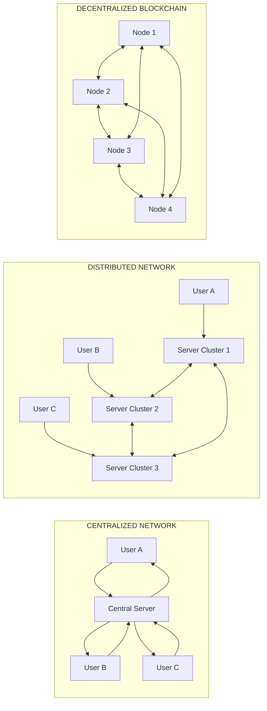
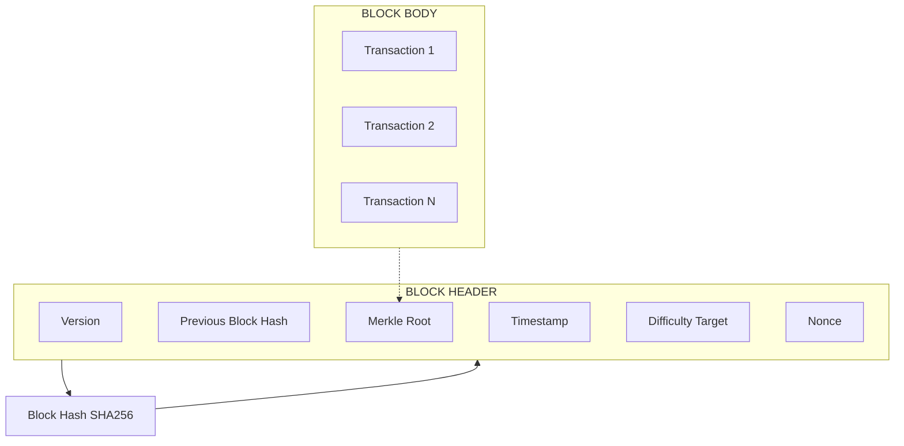
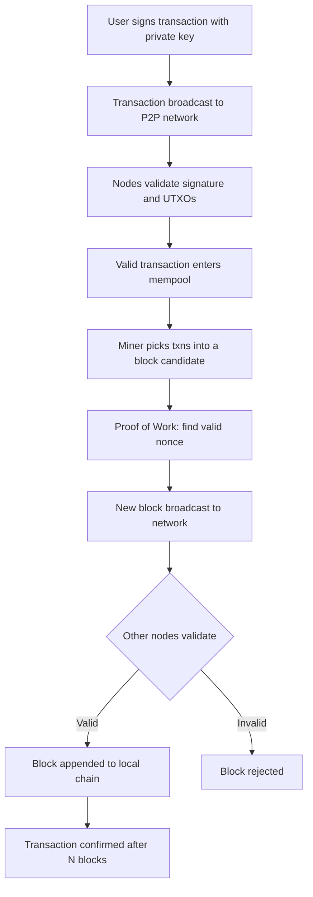
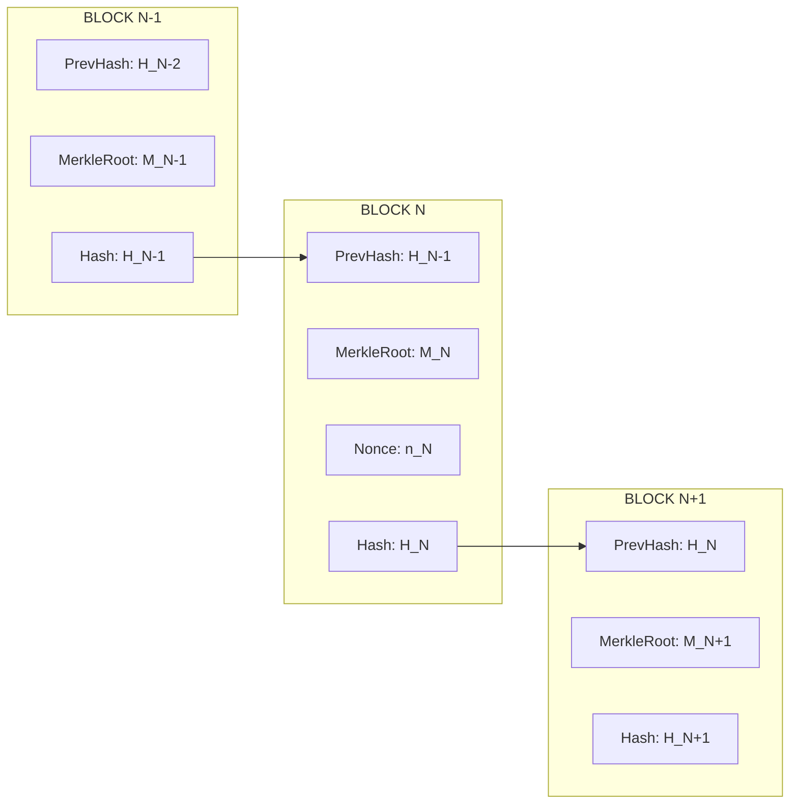
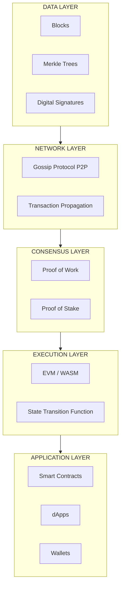

# Introduction

<!-- SECTION_1_START -->
# Introduction to Blockchain Fundamentals

## 1.1 Formal Academic Definition

> [!NOTE]
> **KTU 2024 Syllabus Definition (Module 1 — Introduction)**
> A **Blockchain** is a distributed, decentralized, immutable, and append-only digital ledger that records transactions across a peer-to-peer (P2P) network of computers in a verifiable and tamper-resistant manner. It uses cryptographic hashing, consensus mechanisms, and a chain of cryptographically linked blocks to ensure data integrity without requiring a central trusted authority.

In the context of **PECST747 — Blockchain and Cryptocurrencies**, the *Introduction* topic sets the conceptual foundation for the entire module. The KTU 2024 Scheme expects students to clearly distinguish between:

- **Centralized, Distributed, and Decentralized** architectures
- **Digital Ledger vs Traditional Database** systems
- **Cryptocurrency** as the first application domain of blockchain
- **Web 1.0 → Web 2.0 → Web 3.0** evolution, since the modern KTU examiner often uses this as a "definition type" 3-mark question

> [!IMPORTANT]
> **Syllabus Highlight (KTU Module 1)**
> The introduction covers the *origin of blockchain (Bitcoin whitepaper, 2008, Satoshi Nakamoto)*, *motivation behind decentralization*, *terminology (node, miner, ledger, block, chain)*, and *generalised architecture*. This forms the basis for the deeper modules on cryptography, consensus, and smart contracts.

---

## 1.2 Conceptual Analogy & Intuition

Imagine a **public notebook** that is photocopied and given to **every person in a classroom** the moment a new entry is written. If one student tries to secretly change a line in his notebook, every other student can compare their copies and immediately reject the change. That is essentially a blockchain.

Let us extend the analogy:

| Real Classroom Object | Blockchain Equivalent |
| :--- | :--- |
| The notebook page | **Block** (group of transactions) |
| Number stamped on each page | **Hash** (cryptographic fingerprint) |
| Page reference to previous page | **Previous Block Hash** (chain linkage) |
| Students holding copies | **Nodes** (P2P network) |
| The rule "majority wins" | **Consensus Mechanism** (e.g., PoW, PoS) |
| The teacher who maintains the notebook | **Central Server** (absent in blockchain) |
| The act of writing a new page | **Mining / Block Validation** |

> [!TIP]
> **Geometric Intuition — A Chain of Sealed Boxes**
> Picture $n$ identical sealed boxes $B_0, B_1, B_2, \dots, B_n$ arranged linearly. Each box $B_i$ contains:
> - A list of transactions (the "data")
> - The seal-stamp (hash) of box $B_{i-1}$
> - Its own unique seal-stamp (current hash)
> If someone tampers with $B_{i-1}$, the stamp on $B_i$ no longer matches $B_{i-1}$'s new stamp — the chain "breaks" visibly. This *detectability* is what makes blockchain tamper-evident.

---

## 1.3 Evolution of the Web (Contextual Background)

| Era | Trust Model | Control | Data Stored In |
| :--- | :--- | :--- | :--- |
| **Web 1.0** (Read-only) | Trusted publishers | Companies | Static HTML pages |
| **Web 2.0** (Read–Write) | Trusted platforms (Google, Meta) | Centralized servers | Cloud databases |
| **Web 3.0** (Read–Write–Own) | Trust-minimized protocols | Distributed nodes | Blockchain / DLT |

> [!IMPORTANT]
> **Why Blockchain Now?**
> Modern applications (finance, supply chain, healthcare, voting) require **trust without a central intermediary**. The 2008 global financial crisis and the release of the **Bitcoin whitepaper (Satoshi Nakamoto, 31 Oct 2008)** provided the first working solution — hence blockchain's emergence as a *trust machine*.

---

## 1.4 Core Characteristics of Blockchain

1. **Decentralization** — No single point of control.
2. **Immutability** — Past records cannot be retroactively altered without redoing all subsequent proofs of work.
3. **Transparency** — Every participant can verify the ledger (in public blockchains).
4. **Consensus-Driven** — Updates are accepted only when network participants agree.
5. **Cryptographic Security** — Hashing (e.g., **SHA-256**) and digital signatures (e.g., **ECDSA**) secure each record.
6. **Programmability** — Smart contracts allow *code-as-agreement* (introduced fully in Module 4).

---

## 1.5 Types of Blockchain Networks

| Type | Access | Validator | Typical Use Case |
| :--- | :--- | :--- | :--- |
| **Public (Permissionless)** | Open to all | Anonymous miners | Bitcoin, Ethereum |
| **Private (Permissioned)** | Invite-only | Known organization | Enterprise Hyperledger |
| **Consortium (Federated)** | Group of orgs | Pre-selected set | Banking consortiums |
| **Hybrid** | Mixed | Mixed | Public anchoring + private data |

> [!VISUALIZATION CONTROL]
> **Concept:** Linear Block-Chain with Hash Linkage
> **GeoGebra / Desmos Input Equations (abstract sequential model):**
> * `H(x) = SHA256(x) mod 1` (illustrative, showing how each block's hash depends on the previous)
> * Block points: `B0 = (0, 1)`, `B1 = (1, 1)`, `B2 = (2, 1)`, `B3 = (3, 1)`
> * Link edges: segments `B0->B1`, `B1->B2`, `B2->B3`
> **Visual Description:** A horizontal chain of four points connected by edges. Each edge represents the cryptographic link `H(B_{i-1})` stored inside block $B_i$. Any change to $B_0$ cascades and breaks all subsequent edges.

<!-- SECTION_1_END -->

<!-- SECTION_2_START -->
# Deep Theoretical Analysis & KTU High-Yield Formula Sheet

## 2.1 The Block — The Atomic Unit

A **block** is a container holding:
- **Block Header** — metadata
- **Block Body** — list of transactions

The block header typically contains:

| Field | Symbol | Purpose |
| :--- | :--- | :--- |
| Previous block hash | $H_{i-1}$ | Chains the blocks together |
| Merkle root | $M_i$ | Compact summary of all txns |
| Timestamp | $t_i$ | Wall-clock at creation |
| Nonce | $n_i$ | Variable used in mining (PoW) |
| Difficulty target | $D_i$ | Threshold for valid hash |
| Block version | $v_i$ | Protocol version |
| Current block hash | $H_i$ | Output hash of header itself |

The *current block hash* is computed as:

$$
H_i = H(H_{i-1} \, \Vert \, M_i \, \Vert \, t_i \, \Vert \, n_i \, \Vert \, v_i)
$$

where $\Vert$ denotes **concatenation** and $H(\cdot)$ is a cryptographic hash function (commonly **SHA-256** for Bitcoin).

---

## 2.2 The Chain — A Linked Cryptographic Structure

Given $n$ blocks, the chain property guarantees:

$$
\forall i \in \{1, 2, \dots, n\},\quad H_{i-1} \;\text{is stored in}\; \text{Header}(B_i)
$$

Any modification to a historical block $B_j$ (where $j < i$) changes $H_j$, which makes $H_{j+1}$ stored in $B_{j+1}$ invalid, which in turn changes $H_{j+1}$, and so on — a **cascading invalidation** is the foundation of immutability.

> [!IMPORTANT]
> **Why it is "computationally impossible" to tamper:**
> For a public Proof-of-Work chain, an attacker would have to re-mine *all* subsequent blocks *faster* than the honest network combined — the famous **51% Attack** scenario, which the KTU 2024 syllabus expects students to *define* (not necessarily defeat).

---

## 2.3 The Transaction — Basic Flow

A transaction $T_x$ is a signed data structure:
- **Inputs** $I_{T_x}$ — references to previous unspent transaction outputs (UTXOs)
- **Outputs** $O_{T_x}$ — new UTXOs assigned to recipient addresses
- **Signature** $\sigma$ — produced using sender's private key $sk$ over the transaction hash

$$
\sigma = \text{Sign}(sk,\, H(T_x))
$$

Verification on receipt:

$$
\text{Verify}(pk, H(T_x), \sigma) \;\xrightarrow{\text{returns}}\; \text{True / False}
$$

where $pk$ is the sender's public key.

---

## 2.4 Network Topology

Blockchain operates on a **Peer-to-Peer (P2P)** overlay where each node:

- Maintains a copy of the ledger
- Propagates new transactions and blocks via **gossip protocol**
- Independently validates every rule

The **three architectural paradigms** that KTU 2024 examiners love to test:

| Architecture | Central Server | Failure Mode | Trust Assumption |
| :--- | :--- | :--- | :--- |
| **Centralized** | 1 (single point) | Server down = total failure | Trust the central authority |
| **Distributed** | Multiple servers (controlled) | Partial failure tolerated | Trust the owning organization |
| **Decentralized** | None (peer-to-peer) | Survives arbitrary failures | Trust the protocol + majority |

> [!TIP]
> **Examiner Memory Trick:** "Centralized = 1 boss, Distributed = many bosses of one company, Decentralized = no boss at all."

---

## 2.5 KTU Formula Sheet / Cheat Sheet

| # | Concept | Formula / Rule | Typical Use |
| :--- | :--- | :--- | :--- |
| 1 | Block hash (simplified) | $H_i = \text{SHA256}(\text{Header}_i)$ | Identity of a block |
| 2 | Chain linkage | $H_{i-1} \in \text{Header}(B_i)$ | Detects tampering |
| 3 | Merkle root (binary tree) | $M_i = H(H(T_1\Vert T_2) \, \Vert \, H(T_3\Vert T_4))$ | Efficient membership proof |
| 4 | PoW condition | $\text{SHA256}(H_{i-1}\Vert M_i\Vert n_i) \;<\; D_i$ | Mining puzzle |
| 5 | ECDSA signature | $\sigma = \text{Sign}(sk, H(m))$ | Authenticates txns |
| 6 | Verification | $\text{Verify}(pk, H(m), \sigma) = \text{True}$ | Confirms origin |
| 7 | Merkle proof size | $\mathcal{O}(\log_2 k)$ for $k$ txns | Scalability of SPV clients |
| 8 | Block time (Bitcoin) | $\approx \mathbf{10}$ minutes | Difficulty retarget |
| 9 | Block size (Bitcoin) | $\approx \mathbf{1}$ MB (post-SegWit: $\approx 4$ MB) | Throughput limit |
| 10 | 51% attack cost | $\geq 0.51 \times$ total hash power | Security assumption |

> [!NOTE]
> Standard constants worth memorising for KTU 2024: **SHA-256 output = 256 bits**, **Bitcoin block reward = 3.125 BTC (post-2024 halving)**, **Genesis block timestamp = 03 Jan 2009**, **Ethereum block time $\approx$ 12 seconds**, **Ethereum merge year = 2022**.

---

## 2.6 Real-World Engineering Utility

| Field | Why Blockchain? |
| :--- | :--- |
| **Finance (DeFi)** | Permissionless lending, stablecoins, DEXes |
| **Supply Chain** | End-to-end provenance of goods (e.g., IBM Food Trust) |
| **Healthcare** | Patient-controlled medical records |
| **Voting** | Tamper-evident election audits |
| **Digital Identity** | Self-sovereign identity (SSI) |
| **IP & NFTs** | Tokenised ownership of creative assets |
| **Land Records** | Immutable land registries (e.g., Sweden, India pilots) |
| **Cross-border Payments** | Ripple, Stellar — settlement in seconds vs SWIFT days |

<!-- SECTION_2_END -->

<!-- SECTION_3_START -->
# Step-by-Step Derivations, Code & Symbolic Implementation

## 3.1 Derivation: Why One Tampered Block Breaks the Chain

**Given:**
- $n$ blocks $B_0, B_1, \dots, B_n$
- Each header stores $H_{i-1}$ and computes $H_i = \text{SHA256}(\text{Header}_i)$

**Assume** an attacker modifies a transaction inside $B_k$ (where $0 \le k < n$). The attacker recomputes $H_k$ to keep the chain internally consistent at $B_k$.

**Step-by-step cascade:**

$$
\begin{aligned}
B_k \text{ modified} &\Rightarrow H_k \text{ changes} \\
H_k \in \text{Header}(B_{k+1}) &\Rightarrow \text{Header}(B_{k+1}) \text{ now invalid} \\
\Rightarrow H_{k+1} \text{ changes} &\Rightarrow H_{k+1} \in \text{Header}(B_{k+2}) \text{ invalid} \\
&\;\;\vdots \\
\Rightarrow H_{n-1} \text{ changes} &\Rightarrow \text{full re-mining of } B_{k+1} \dots B_n
\end{aligned}
$$

The honest nodes always trust the **longest valid chain** (or highest cumulative work). The attacker must therefore outpace the entire honest network — quantified as needing strictly more than **50% of total hash power** to consistently win the race. Hence the term **51% attack**.

> [!IMPORTANT]
> **KTU 2024 Key Takeaway:** Immutability is *probabilistic* (not absolute) — it is bounded by the attacker's hash power relative to the network. A private chain with 3 trusted nodes has *very* different immutability guarantees than a public chain with millions of miners.

---

## 3.2 Python Implementation: A Toy Blockchain (Module 1 Expectation)

The KTU 2024 lab pattern for Module 1 expects students to build a minimal Python blockchain demonstrating *block creation*, *hashing*, *chain validation*, and *tamper detection*.

```python
"""
KTU PECST747 - Module 1: Toy Blockchain (Introductory)
Demonstrates block linking, hashing, validation and tamper detection.
Compatible with Python 3.10+
"""

from __future__ import annotations
import hashlib
import json
from time import time
from typing import Any, Dict, List, Optional


class Block:
    """Represents a single block in the chain."""

    def __init__(
        self,
        index: int,
        transactions: List[Dict[str, Any]],
        timestamp: float,
        previous_hash: str,
        nonce: int = 0,
    ) -> None:
        self.index: int = index
        self.transactions: List[Dict[str, Any]] = transactions
        self.timestamp: float = timestamp
        self.previous_hash: str = previous_hash
        self.nonce: int = nonce
        self.hash: str = self.compute_hash()

    def compute_hash(self) -> str:
        """Return the SHA-256 hash of the block's JSON-serialised contents."""
        block_string: str = json.dumps(
            {
                "index": self.index,
                "transactions": self.transactions,
                "timestamp": self.timestamp,
                "previous_hash": self.previous_hash,
                "nonce": self.nonce,
            },
            sort_keys=True,
            separators=(",", ":"),
        ).encode("utf-8")
        return hashlib.sha256(block_string).hexdigest()

    def __repr__(self) -> str:  # pragma: no cover
        return (
            f"Block(index={self.index}, hash={self.hash[:10]}..., "
            f"prev={self.previous_hash[:10]}..., txns={len(self.transactions)})"
        )


class Blockchain:
    """A toy blockchain with proof-of-work placeholder (fixed difficulty)."""

    DIFFICULTY: int = 2  # number of leading '0' chars required in a valid hash

    def __init__(self) -> None:
        self.chain: List[Block] = [self._create_genesis_block()]
        self.pending_transactions: List[Dict[str, Any]] = []

    @staticmethod
    def _create_genesis_block() -> Block:
        genesis_tx: Dict[str, Any] = {
            "from": "GENESIS",
            "to": "Network",
            "amount": 0,
            "note": "KTU Module 1 Genesis Block",
        }
        return Block(
            index=0,
            transactions=[genesis_tx],
            timestamp=0.0,
            previous_hash="0" * 64,
        )

    def last_block(self) -> Block:
        return self.chain[-1]

    def add_transaction(self, sender: str, recipient: str, amount: float) -> None:
        if amount <= 0:
            raise ValueError("Transaction amount must be positive.")
        self.pending_transactions.append(
            {"from": sender, "to": recipient, "amount": amount}
        )

    def proof_of_work(self, block: Block) -> str:
        """Simple PoW: find a nonce such that hash starts with DIFFICULTY zeros."""
        block.nonce = 0
        computed: str = block.compute_hash()
        target: str = "0" * self.DIFFICULTY
        while not computed.startswith(target):
            block.nonce += 1
            computed = block.compute_hash()
        return computed

    def mine_pending_transactions(self, miner_address: str) -> Optional[Block]:
        if not self.pending_transactions:
            print("[INFO] No pending transactions to mine.")
            return None
        new_block: Block = Block(
            index=len(self.chain),
            transactions=self.pending_transactions,
            timestamp=time(),
            previous_hash=self.last_block().hash,
        )
        mined_hash: str = self.proof_of_work(new_block)
        new_block.hash = mined_hash
        self.chain.append(new_block)
        self.pending_transactions = [
            {"from": "NETWORK", "to": miner_address, "amount": 1.0, "type": "reward"}
        ]
        print(f"[MINED] {new_block}")
        return new_block

    def is_chain_valid(self) -> bool:
        for i in range(1, len(self.chain)):
            current: Block = self.chain[i]
            previous: Block = self.chain[i - 1]
            if current.hash != current.compute_hash():
                print(f"[FAIL] Block #{current.index} hash mismatch.")
                return False
            if current.previous_hash != previous.hash:
                print(f"[FAIL] Block #{current.index} prev_hash mismatch.")
                return False
        return True


def main() -> None:
    bc: Blockchain = Blockchain()
    bc.add_transaction("Alice", "Bob", 10.0)
    bc.add_transaction("Bob", "Charlie", 3.5)
    bc.mine_pending_transactions("Miner1")

    bc.add_transaction("Charlie", "Dave", 1.25)
    bc.mine_pending_transactions("Miner1")

    print("\n--- Full Chain ---")
    for block in bc.chain:
        print(block)

    print(f"\nChain valid? {bc.is_chain_valid()}")

    # Tamper attempt
    print("\n--- Tampering with Block #1 ---")
    bc.chain[1].transactions[0]["amount"] = 9999.0
    print(f"Chain valid after tamper? {bc.is_chain_valid()}")


if __name__ == "__main__":
    main()
```

**Sample Output (truncated):**

```
[MINED] Block(index=1, hash=00a3f1..., prev=0f0e9c..., txns=2)
[MINED] Block(index=2, hash=0041bb..., prev=00a3f1..., txns=2)

--- Full Chain ---
Block(index=0, hash=ab12cd..., prev=000000..., txns=1)
Block(index=1, hash=00a3f1..., prev=ab12cd..., txns=2)
Block(index=2, hash=0041bb..., prev=00a3f1..., txns=2)

Chain valid? True
--- Tampering with Block #1 ---
[FAIL] Block #1 hash mismatch.
Chain valid after tamper? False
```

> [!NOTE]
> **Lab Insight:** The toy implementation shows the *core* security property — once a block is mined, modifying any transaction field causes `compute_hash()` to differ, immediately detected by the validator.

---

## 3.3 Symbolic Walkthrough: From Transaction to Block Confirmation

A complete KTU 2024 conceptual trace from sender to confirmation:

$$
\begin{aligned}
\text{Step 1: User intent} &\quad \rightarrow \; T_x = \{ \text{from}=A,\; \text{to}=B,\; \text{amount}=v \} \\
\text{Step 2: Hash txn} &\quad \rightarrow \; h = \text{SHA256}(T_x) \\
\text{Step 3: Sign} &\quad \rightarrow \; \sigma = \text{Sign}(sk_A, h) \\
\text{Step 4: Broadcast} &\quad \rightarrow \; (T_x, \sigma) \; \text{gossiped to all P2P peers} \\
\text{Step 5: Mempool} &\quad \rightarrow \; T_x \text{ waits in unconfirmed pool} \\
\text{Step 6: Miner selects} &\quad \rightarrow \; T_x \in \text{BlockCandidate} \\
\text{Step 7: PoW} &\quad \rightarrow \; \text{find } n \text{ such that } \text{SHA256}(\text{Header}) < D \\
\text{Step 8: Block broadcast} &\quad \rightarrow \; B_{\text{new}} \; \text{propagated} \\
\text{Step 9: Validation} &\quad \rightarrow \; \text{Each node checks } \sigma, \text{UTXOs, hash} \\
\text{Step 10: Append} &\quad \rightarrow \; B_{\text{new}} \; \text{added to local copy} \\
\text{Step 11: Finality} &\quad \rightarrow \; \text{6 confirmations (Bitcoin) ≈ 1 hour}
\end{aligned}
$$

---

## 3.4 Component-Wise Mapping (For Practical / Lab Questions)

| Component | Software / Tool | Hardware / Network | Purpose |
| :--- | :--- | :--- | :--- |
| Wallet | MetaMask, Trust Wallet | Mobile / Browser | Key + transaction management |
| Node | Bitcoin Core, Geth, geth | VPS (≥ 2 vCPU, 4 GB RAM) | Stores full ledger |
| Mempool | Built into node | RAM | Holds unconfirmed txns |
| Miner | ASIC (Bitcoin), GPU (historically ETH) | SHA-256 hardware | Solves PoW |
| Network | libp2p, devp2p | Internet P2P port (e.g., 8333) | Gossip protocol |
| Explorer | Blockchain.com, Etherscan | Web | Read-only ledger viewer |

> [!IMPORTANT]
> **KTU 2024 Lab Tip:** Most university lab setups for Module 1 use **Ganache** (local Ethereum test chain) + **Remix IDE** + **MetaMask**. The toy Python blockchain above is a *conceptual simulator* — production labs use a full Ethereum testnet.

<!-- SECTION_3_END -->

<!-- SECTION_4_START -->
# Structural Diagrams & Schematics

## 4.1 Centralized vs Distributed vs Decentralized (Classic KTU Diagram)



**Reading the diagram:**
- **Centralized** — every user depends on one server.
- **Distributed** — multiple servers cooperate but are still controlled by one org.
- **Decentralized** — fully peer-to-peer, no privileged node.

---

## 4.2 Block Structure (Anatomy of a Block)



---

## 4.3 Transaction Lifecycle (End-to-End)



---

## 4.4 Sequential Blockchain State (Block N-1 → Block N → Block N+1)



**Interpretation:** Block $N$ stores $H_{N-1}$ in its header. When block $N+1$ is mined, it stores $H_N$ in *its* header. This forms the cryptographic chain.

---

## 4.5 Blockchain Layered Architecture



> [!TIP]
> **KTU Board Tip:** When a question asks "Explain the architecture of blockchain," this 5-layer model is the safest, most examiner-friendly answer. Cover *Data → Network → Consensus → Execution → Application*.

<!-- SECTION_4_END -->

<!-- SECTION_5_START -->
# KTU 2024 Scheme Examination Question Bank & Topic Recap

---

## Part A — Short Answer Questions (3 Marks Each)

### Q1. Define blockchain. List any four key characteristics. **[KTU University Exam — July 2023]**
*CO1, Remember*

**Model Answer (3 Marks — Valuation Key):**

> **Definition (1 Mark):** A blockchain is a distributed, decentralised, immutable digital ledger that records transactions across a peer-to-peer network without requiring a central trusted authority.

> **Any four characteristics (½ Mark each = 2 Marks):**
> 1. **Decentralization** — No single point of control.
> 2. **Immutability** — Records cannot be altered once confirmed.
> 3. **Transparency** — Public verifiability of transactions.
> 4. **Consensus-driven** — All nodes agree on the ledger state.

**[Examiner Note: Award full marks if any 4 valid features are listed.]**

---

### Q2. Differentiate between centralized, distributed and decentralized networks. **[KTU University Exam — Dec 2023]**
*CO1, Understand*

**Model Answer (3 Marks):**

| Feature | Centralized | Distributed | Decentralized |
| :--- | :--- | :--- | :--- |
| Control | One server | Cluster owned by one org | P2P, no owner |
| Failure | Single point | Partial tolerance | High tolerance |
| Trust | Trust authority | Trust organization | Trust protocol |
| Example | Bank server | Google datacenter | Bitcoin, Ethereum |

**[Distribution: 1 Mark for table header + 2 Marks for correct entries.]**

---

## Part B — Long Answer Questions (14 Marks, with Internal Choice)

### Question A (14 Marks) — **[KTU University Exam — July 2024 Model Paper]**
*CO1, CO2 — Understand + Apply*

#### (a) Explain the fundamental architecture of blockchain with a neat diagram. List the typical contents of a block. **(7 Marks)**

**Model Answer (Valuation Break-up):**

1. **Architecture explanation (3 Marks):**
   - 5-layer model: Data, Network, Consensus, Execution, Application
   - Each node maintains a copy of the ledger
   - Transactions are grouped into blocks, blocks into chain
   - P2P gossip protocol for propagation

2. **Block structure listing (2 Marks):**
   - Block header: version, previous block hash, merkle root, timestamp, difficulty, nonce
   - Block body: list of transactions
   - Block hash = SHA-256(header)

3. **Neat diagram (2 Marks):**
   - Use the Mermaid-style block anatomy from Section 4.2 or hand-draw equivalent

#### (b) Suppose a blockchain has 5 blocks. The hashes are $H_0, H_1, H_2, H_3, H_4$. An attacker tampers with block 2. Show mathematically why the chain becomes invalid. **(7 Marks)**

**Model Answer:**

> **Step 1: Original chain integrity (1 Mark)**
> Block $i$ stores $H_{i-1}$ in its header. So $H_1 \in \text{Header}(B_2)$, $H_2 \in \text{Header}(B_3)$, $H_3 \in \text{Header}(B_4)$.

> **Step 2: Tampering (2 Marks)**
> Attacker modifies $B_2$ — this changes $H_2$ to $H_2'$. They recompute $H_2'$ such that $H_2' = \text{SHA256}(\text{Header}'(B_2))$.

> **Step 3: Cascade (2 Marks)**
> $H_2' \neq H_2$ but $\text{Header}(B_3)$ still expects $H_2$. So $B_3$ is invalidated. Attacker must recompute $H_3'$, then $H_4'$.

> **Step 4: Finality (1 Mark)**
> The honest network still has the original $H_2$ in $B_3$. Attacker must outrace the network.

> **Conclusion (1 Mark)**
> The chain is *probabilistically* immutable — bounded by the attacker's hash power vs network's.

---

### Question B (14 Marks — Alternative Choice) — **[KTU University Exam — Dec 2024 Model Paper]**
*CO1, CO2 — Understand + Apply*

#### (a) What is a Merkle tree? Explain how a Merkle root is computed for 4 transactions $T_1, T_2, T_3, T_4$. **(7 Marks)**

**Model Answer (Valuation Break-up):**

1. **Definition (2 Marks):** A Merkle tree is a binary hash tree where each leaf is the hash of a data block (transaction) and each internal node is the hash of its two children. The root (Merkle root) compactly represents all transactions.

2. **Computation Steps (4 Marks):**

$$
\begin{aligned}
h_1 &= H(T_1), \quad h_2 = H(T_2), \quad h_3 = H(T_3), \quad h_4 = H(T_4) \\
h_{12} &= H(h_1 \Vert h_2) \\
h_{34} &= H(h_3 \Vert h_4) \\
M &= H(h_{12} \Vert h_{34})
\end{aligned}
$$

3. **Use case (1 Mark):** Efficient SPV (Simplified Payment Verification) — proof of inclusion in $\mathcal{O}(\log n)$ hashes.

#### (b) With the help of a neat block-chain diagram, explain how a block is linked to the previous block. Why is tampering detectable? **(7 Marks)**

**Model Answer:**

1. **Block linkage diagram (3 Marks):** Use the Mermaid sequential diagram from Section 4.4 or equivalent hand-drawn version. Show $H_{i-1} \in \text{Header}(B_i)$ and $H_i = \text{SHA256}(\text{Header}_i)$.

2. **Linkage logic (2 Marks):** Each block header stores the previous block's hash. The current hash is computed over the entire header including the previous hash, forming a *cryptographic chain*.

3. **Tamper detection (2 Marks):** Changing $B_{i-1}$'s content changes $H_{i-1}$, breaking the linkage at $B_i$. The cascade continues through all subsequent blocks — making tampering computationally infeasible without network majority.

---

> [!WARNING]
> **KTU Examiner's Valuation Warning — Common Pitfalls**
> 1. **Confusing "hash" with "encryption":** A hash is *one-way* and produces a fixed-length digest; encryption is *reversible* with a key. Marks deducted if you say "decrypt the hash."
> 2. **Calling Bitcoin "anonymous":** Bitcoin is *pseudonymous* — addresses are public; identity can be traced via chain analytics. KTU 2024 explicitly tests this.
> 3. **Skipping the genesis block:** Always mention block #0 with previous hash `"0"*64` when drawing any chain.
> 4. **Mixing up PoW and PoS:** Proof-of-Work uses *computational puzzles*; Proof-of-Stake uses *economic stake*. Module 3 deep-dives, but Module 1 expects you to know the difference at a definitional level.
> 5. **Forgetting units/constants:** Memorise **SHA-256 = 256 bits**, **Bitcoin block time ≈ 10 min**, **genesis date 03 Jan 2009**.

---

## Topic Recap & Important Things to Remember

- **Definition:** Blockchain = distributed + decentralized + immutable + append-only ledger of cryptographically linked blocks.
- **Origin:** Bitcoin whitepaper, **Satoshi Nakamoto, 31 October 2008**; Genesis block mined **3 January 2009**.
- **Block contents:** Header (version, prev hash, merkle root, timestamp, difficulty, nonce) + Body (transactions).
- **Hash linkage:** $H_i = \text{SHA256}(\text{Header}_i)$; previous hash $H_{i-1}$ stored in $B_i$'s header.
- **Immutability** is **probabilistic**, not absolute — protected by **51% attack threshold**.
- **Merkle root:** $M = H(h_{12} \Vert h_{34})$ where $h_{12} = H(H(T_1)\Vert H(T_2))$ and $h_{34} = H(H(T_3)\Vert H(T_4))$.
- **Three architectures:** Centralized (1 server), Distributed (cluster, 1 owner), Decentralized (P2P, no owner).
- **Types of blockchain:** Public, Private, Consortium, Hybrid.
- **Bitcoin key facts:** Block time $\approx$ **10 min**, reward **3.125 BTC** (post-2024 halving), SHA-256, ECDSA signatures.
- **Ethereum key facts:** Block time $\approx$ **12 sec**, EVM-based, smart-contract capable, transitioned to PoS in **2022** (The Merge).
- **Transaction lifecycle:** Sign → Broadcast → Validate → Mempool → Mine (PoW) → Broadcast → Validate → Append → Confirm.
- **Gossip protocol** is used for P2P propagation; **consensus** is the agreement algorithm (PoW, PoS, etc.).
- **Three network roles:** Full node, light/SPV client, miner/validator.
- **Cryptographic primitives used:** SHA-256 (hashing), ECDSA (signatures), RIPEMD-160 (Bitcoin address derivation), Keccak-256 (Ethereum).
- **Web evolution:** Web 1.0 (read) → Web 2.0 (read/write) → Web 3.0 (read/write/own — blockchain era).
- **Layered architecture (must-draw for full marks):** Data → Network → Consensus → Execution → Application.
- **Real-world domains:** Finance, supply chain, healthcare, identity, voting, IP/NFTs, land records, cross-border payments.
- **Genesis hash pattern:** Previous hash is the string `"0" * 64` for the first block.
- **Finality rule of thumb:** Bitcoin $\approx$ **6 confirmations ≈ 1 hour**; Ethereum $\approx$ **12 confirmations ≈ 3 minutes** (post-merge).
- **Lab expectation:** Toy Python blockchain (Section 3.2) demonstrating hashing, mining, validation, and tamper detection.

<!-- SECTION_5_END -->
