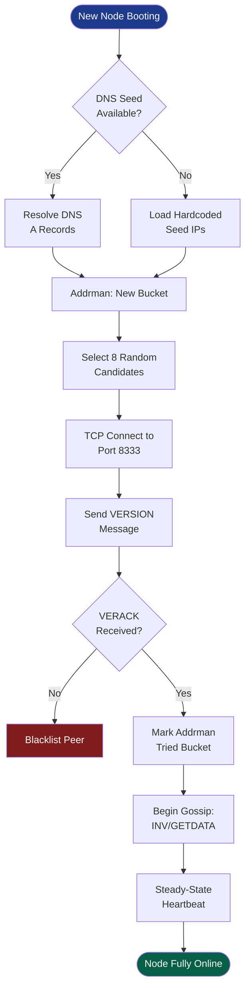
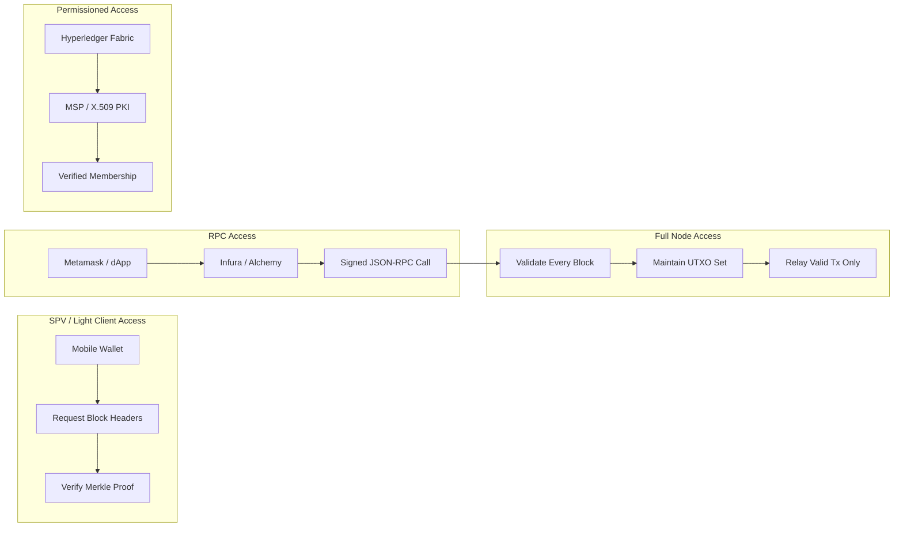
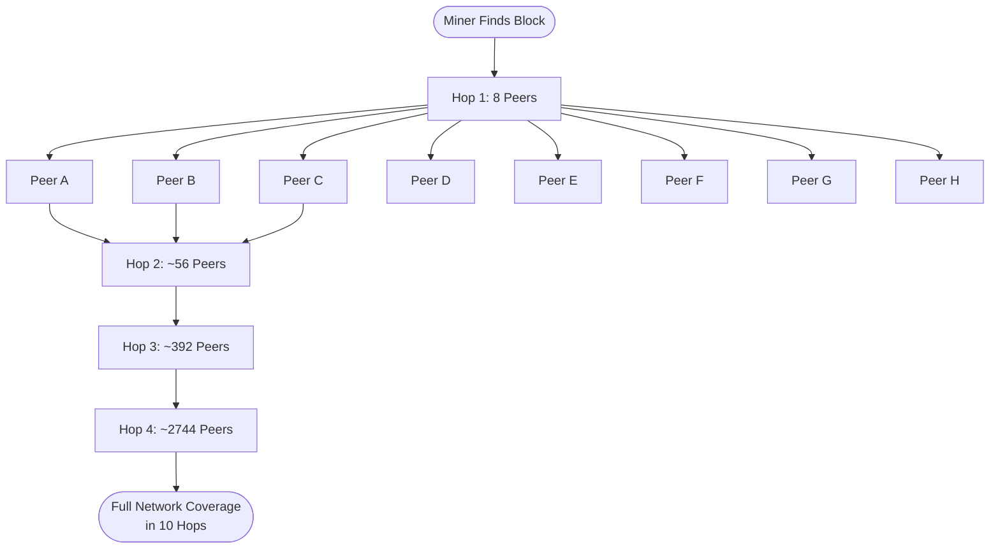
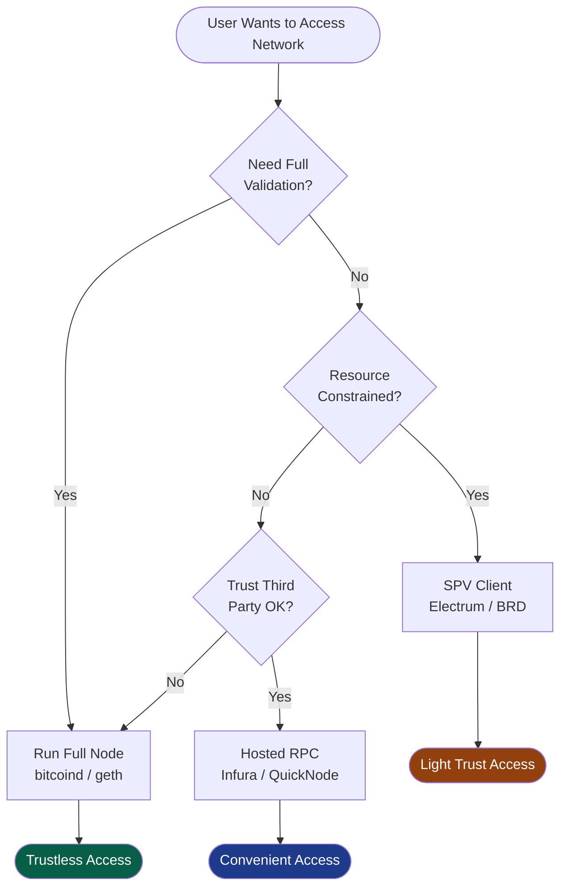

# Accessing the network

<!-- SECTION_1_START -->
# Accessing the Network — Foundational Overview

> [!NOTE]
> **KTU 2024 Scheme | PECST747 — Module 2: Cryptography in Blockchain and Consensus Mechanisms**
> **Topic Focus:** Network Access Architectures, Peer Discovery, and Node Communication in Distributed Ledger Systems.

## Formal Academic Definition

In a blockchain ecosystem, **accessing the network** refers to the set of protocols, mechanisms, and architectural rules that govern how a participant (node, wallet, miner, or client application) discovers, authenticates, joins, communicates with, and propagates data across a **decentralized peer-to-peer (P2P) overlay network**. The blockchain network is a self-organizing, fault-tolerant, trustless topology where no central authority brokers connectivity; therefore, every joining entity must independently resolve peers, establish encrypted/clear-text channels, and adhere to a shared gossip protocol to maintain ledger consistency.

Mathematically, the network can be modeled as a graph $G = (V, E)$, where $V$ is the set of participating nodes and $E$ is the set of communication links. A healthy P2P network approaches a **small-world network** property with average path length scaling as $O(\log N)$, where $N = \vert V \vert$ is the number of active peers.

## Conceptual Analogy / Intuition

> [!IMPORTANT]
> **Analogy — The "Global Bulletin Board Club"**
> Imagine a worldwide club where every member keeps an identical physical ledger. When you join the club, you don't call a "manager" — instead, you call one of the existing members whose phone number is printed on a public flyer (a *DNS seed*). That member hands you a few more phone numbers of other members. You start calling them, and soon you have a personal contact list of **8 to 125 trusted peers**. From that moment, whenever you hear of a new transaction, you shout it across your phone lines, and your contacts shout it to *their* contacts. Within seconds, the whole club knows.
> This is **gossip propagation** — and your personal contact list is your **peers.dat / addr.dat** in a real Bitcoin-like node.

## Key Architectural Metrics and Constants

> [!TIP]
> **Standard Network Parameters in Bitcoin (as canonical reference):**
> - **Max outbound connections:** **8** full-relay peers
> - **Max inbound connections:** **117** (default, configurable)
> - **Default P2P port:** **8333** (mainnet), **18333** (testnet)
> - **Protocol magic bytes:** `0xF9BEB4D9` (mainnet message framing)
> - **Message header size:** **24 bytes**
> - **Target block propagation:** **\< 10 seconds** (via Compact Blocks, BIP 152)
> - **Default fee/bandwidth budget per message:** **Uncapped gossip, but rate-limited per peer**

## GeoGebra / Desmos Visualization

> [!VISUALIZATION CONTROL]
> **Concept:** Small-world network topology emerging from random peer discovery.
> **GeoGebra / Desmos Input Equations:**
> * Plot a Watts–Strogatz-style small-world graph: $L(p) \approx \dfrac{N}{2K} \cdot f(pK)$ where $p$ is the rewiring probability.
> * Nodes positioned on a unit circle: $(x_i, y_i) = (\cos(2\pi i/N), \sin(2\pi i/N))$.
> **Visual Description:** You should observe a ring lattice with long-range shortcut edges, demonstrating logarithmic path length — the structural backbone of blockchain P2P access.

---

<!-- SECTION_1_END -->

<!-- SECTION_2_START -->
# Deep Theoretical Analysis & KTU High-Yield Formula Sheet

## 1. Network Access — The Three Logical Phases

### Phase I: Bootstrap & Discovery
A new node boots with no prior knowledge. It must resolve an initial set of peers through one of these mechanisms:

| Mechanism | Description | Source of Truth |
|-----------|-------------|-----------------|
| **DNS Seeds** | Hardcoded domain names (e.g., `seed.bitcoin.sipa.be`) that return IP records | Hardcoded in client source |
| **Hardcoded Seed Nodes** | Direct IP addresses of long-running stable nodes | Baked into client binary |
| **Bootstrap.dat** | Offline flat-file dump of verified peer addresses | Provided by community |
| **Peers.dat / Addrman** | Locally cached address database from prior sessions | Persistent local storage |
| **Checkpoint-based Sync** | Hardcoded block headers to validate chain progress | Client source code |

The **Address Manager (addrman)** in Bitcoin Core stores peers in a *tried* bucket (successful connections) and a *new* bucket (candidates), each of size **1024 entries**, with a randomized selection process using **bucketed stochastic eviction**.

### Phase II: Handshake & Version Negotiation
Once a TCP socket is established, the node sends a `VERSION` message containing:
- Protocol version (`PROTOCOL_VERSION`)
- Services bitfield (`NODE_NETWORK`, `NODE_WITNESS`, `NODE_BLOOM`, etc.)
- Timestamp `nTime`
- Genesis block hash verification
- User agent string
- Starting height `startHeight`

The receiving node responds with `VERACK` upon acceptance. **Disconnection occurs** if: (a) protocol versions are incompatible, (b) the chain has forked beyond recovery, or (c) the IP is blacklisted.

### Phase III: Steady-State Gossip & Maintenance
Post-handshake, nodes maintain **ping/pong** heartbeats every **20 minutes** and exchange:
- `INV` (inventory) announcements
- `GETDATA` / `BLOCK` / `TX` requests
- `ADDR` messages (max 1000 addresses per message, rate-limited)
- `GETHEADERS` / `HEADERS` for chain sync

## 2. Node Taxonomy — Who Is "Accessing" the Network?

| Node Type | Storage | Validation | Trust Assumption | Use Case |
|-----------|---------|------------|------------------|----------|
| **Full Node** | Full blockchain | **Fully validates** every transaction/block | Trustless | Miners, exchanges, sovereign users |
| **Pruned Full Node** | Last N blocks (~550 MB) | Fully validates up to prune height | Trustless | Resource-constrained full validation |
| **Archival Node** | Full UTXO set + history | Fully validates | Trustless | Block explorers, indexers |
| **Light Client (SPV)** | Block headers only | Validates PoW + merkle proofs | Trusts full nodes for tx inclusion | Mobile wallets (BIP 37, BIP 157/158) |
| **Mining Node** | Full + mempool + ASIC | Fully validates + produces blocks | Trustless | Pool servers, solo miners |

> [!IMPORTANT]
> **SPV (Simplified Payment Verification)** — formalized by **Satoshi Nakamoto (Bitcoin Whitepaper, Section 8)**: an SPV client downloads only block headers (80 bytes per header) and verifies a transaction's inclusion via a **Merkle path** of length $O(\log_2 n)$ where $n$ is the number of transactions in the block.

## 3. Access Protocols in Production Networks

### A. Bitcoin's P2P Protocol (TCP-based)
- **Transport:** TCP, port **8333**
- **Framing:** 4-byte magic + 12-byte command + 4-byte length + 4-byte checksum + payload
- **Encryption:** None (cleartext, but authenticated via PoW)
- **Message structure:**
$$\text{Message} = \langle \text{magic} \,\vert\, \text{cmd[12]} \,\vert\, \text{length} \,\vert\, \text{checksum} \,\vert\, \text{payload} \rangle$$

### B. Ethereum's DevP2P / RLPx
- **Transport:** TCP + optional UDP for **discv4** discovery
- **Encryption:** **RLPx** (Recursive Length Prefix over TLS-like handshake) using **secp256k1 ECDH** for session keys
- **Framing:** RLP-encoded messages, framed as *snappy-compressed* multi-frame
- **Sub-protocols:** `eth`, `les` (Light Ethereum Subprotocol), `wit` (witness/2WP)

### C. libp2p (Polkadot, IPFS, Filecoin, Ethereum 2.0)
- Modular stack: `multiformats` for addressing, `multistream-select` for negotiation, `yamux`/`mplex` for stream multiplexing
- **Transports:** TCP, QUIC, WebSocket, WebRTC, WebTransport
- **Discovery:** Kademlia DHT + mDNS (local) + PubSub for gossip

## 4. KTU Formula Sheet / Cheat Sheet

| Symbol / Term | Definition | Formula / Value |
|---|---|---|
| $N$ | Total active nodes in network | Empirical: Bitcoin $\approx$ **15,000–20,000 reachable** |
| $k$ | Outbound degree of a node | **8** (Bitcoin default) |
| $\langle L \rangle$ | Average path length between two nodes | $\langle L \rangle \approx \dfrac{\ln N}{\ln k}$ (small-world) |
| $D$ | Network diameter | $D \approx 2 \cdot \langle L \rangle$ |
| $P_{\text{prop}}$ | Block propagation probability in time $t$ | $P(t) = 1 - e^{-\lambda t}$ (Poisson) |
| $T_{\text{prop}}$ | Median block propagation time | **\< 10 s** (Bitcoin, post-Compact Blocks) |
| $H_{\text{header}}$ | Header size | **80 bytes** |
| $H_{\text{message}}$ | P2P message header | **24 bytes** |
| $M_{\text{SPV}}$ | SPV proof size for block with $n$ txs | $M_{\text{SPV}} = 80 + 32 \cdot \lceil \log_2 n \rceil$ bytes |
| $\text{addr}_{\text{max}}$ | Max addresses per `ADDR` msg | **1000** |
| $\text{bucket}_{\text{size}}$ | Addrman tried/new bucket size | **1024** each |
| $\text{ping}_{\text{interval}}$ | Keepalive interval | **1200 s** (20 min) |
| $\text{conn}_{\text{max}}$ | Total max connections | **125** (Bitcoin Core default) |

## 5. Engineering Utility — Why This Matters in Production

- **Exchanges** (Coinbase, Binance) run hundreds of **archival full nodes** to query UTXO state with zero third-party trust.
- **Mobile wallets** (Trust Wallet, Metamask Mobile) use **SPV or Infura/Alchemy RPC** to access the network without storing the chain.
- **Layer-2 solutions** (Lightning, Rollups) depend on gossip channels to broadcast fraud proofs and channel state.
- **Permissioned chains** (Hyperledger Fabric, Corda) restrict access via **membership service providers (MSPs)** and X.509 PKI.

---

<!-- SECTION_2_END -->

<!-- SECTION_3_START -->
# Step-by-Step Derivations, Code Implementation & Operational Walkthroughs

## 3.1 Mathematical Derivation — Small-World Path Length in a P2P Network

We derive the expected diameter of a random regular graph, which approximates a healthy P2P overlay.

**Step 1:** Consider a node with outbound degree $k$ in a network of $N$ nodes. At hop 1, the node can reach $k$ neighbors directly. Excluding backtracking, each new hop multiplies the reachable set by approximately $(k-1)$.

**Step 2:** The number of unique nodes reachable in $h$ hops is roughly:
$$R(h) = 1 + k \cdot \sum_{i=1}^{h-1}(k-1)^{i}$$

**Step 3:** For $R(h) \geq N$ (full network coverage), solve for $h$:
$$(k-1)^{h-1} \approx \dfrac{N}{k}$$

**Step 4:** Take the base-$(k-1)$ logarithm:
$$h \approx 1 + \log_{k-1}\left(\dfrac{N}{k}\right)$$

**Step 5:** Recognizing the discrete small-world approximation, with $k=8$ and $N=15{,}000$:
$$h \approx 1 + \log_{7}\left(\dfrac{15{,}000}{8}\right) = 1 + \log_{7}(1875) = 1 + \dfrac{\ln(1875)}{\ln(7)} = 1 + \dfrac{7.536}{1.946} \approx 1 + 3.87 \approx 4.87$$

**Step 6:** Round up. The expected **diameter** $D \approx 2h$ for undirected gossip:
$$D \approx 2 \cdot 5 = 10 \text{ hops}$$

**Conclusion:** A block in Bitcoin can reach the entire network in approximately **10 gossip hops**, which — combined with link latencies — yields the observed **\< 10-second global propagation**.

## 3.2 Mathematical Derivation — Merkle Proof Size for SPV Access

**Step 1:** A Merkle tree with $n$ leaves has height $h = \lceil \log_2 n \rceil$.

**Step 2:** An SPV proof traverses from the transaction leaf to the root, consuming one sibling hash per level.

**Step 3:** Each sibling hash is **32 bytes** (SHA-256 output). Total proof size:
$$M_{\text{SPV}} = 32 \cdot h = 32 \cdot \lceil \log_2 n \rceil \;\; \text{bytes}$$

**Step 4:** Add the 80-byte block header for context:
$$M_{\text{total}} = 80 + 32 \cdot \lceil \log_2 n \rceil$$

**Step 5:** For a block with $n = 3000$ transactions (typical Bitcoin block):
$$M_{\text{total}} = 80 + 32 \cdot 12 = 80 + 384 = 464 \;\; \text{bytes}$$

**Conclusion:** SPV access to the network requires only **\~464 bytes** to cryptographically prove a transaction's inclusion — orders of magnitude smaller than downloading the full block (~1.5 MB post-SegWit).

## 3.3 Algorithmic Implementation — Peer Discovery Simulation in Python

```python
"""
peer_discovery.py
Simulates a simplified version of Bitcoin Core's Address Manager (addrman)
and demonstrates network access via random peer discovery + gossip.
"""

import hashlib
import random
import time
from dataclasses import dataclass, field
from typing import Optional


@dataclass
class Node:
    """A simplified P2P network node."""
    node_id: str
    address: str
    outbound_peers: list[str] = field(default_factory=list)
    inbound_peers: set[str] = field(default_factory=set)
    seen_blocks: set[str] = field(default_factory=set)
    is_evil: bool = False


class NetworkSimulator:
    """Simulates a decentralized blockchain P2P network."""

    # KTU-aligned production parameters
    MAX_OUTBOUND: int = 8
    MAX_INBOUND: int = 117
    ADDRMAN_BUCKET_SIZE: int = 1024

    def __init__(self, total_nodes: int = 200, evil_ratio: float = 0.1):
        self.nodes: dict[str, Node] = {}
        self.dns_seeds = [f"seed{i}.blockchain.example" for i in range(3)]
        self.block_propagation_log: list[dict] = []
        self._bootstrap(total_nodes, evil_ratio)

    def _bootstrap(self, total_nodes: int, evil_ratio: int) -> None:
        """Phase I: Seed the network with nodes and create the DNS seed registry."""
        for i in range(total_nodes):
            nid = hashlib.sha256(f"node-{i}".encode()).hexdigest()[:16]
            self.nodes[nid] = Node(
                node_id=nid,
                address=f"10.0.{(i // 256) % 256}.{i % 256}",
                is_evil=(random.random() < evil_ratio)
            )

    def discover_peers(self, joining_node: Node, candidates: list[Node]) -> list[Node]:
        """
        Phase II: New node contacts DNS seeds and asks for peer addresses.
        Randomly selects up to MAX_OUTBOUND candidates (Kademlia-style sampling).
        """
        random.shuffle(candidates)
        selected: list[Node] = []
        for c in candidates:
            if c.node_id == joining_node.node_id:
                continue
            if len(selected) >= self.MAX_OUTBOUND:
                break
            selected.append(c)
        return selected

    def handshake(self, node_a: Node, node_b: Node) -> bool:
        """
        Phase III: Simplified VERSION/VERACK handshake.
        Fails if either party is an 'evil' node beyond tolerance.
        """
        if node_b.is_evil and random.random() < 0.3:
            return False  # Simulated handshake failure
        node_a.outbound_peers.append(node_b.node_id)
        node_b.inbound_peers.add(node_a.node_id)
        return True

    def gossip_block(self, origin_id: str, block_hash: str,
                     max_hops: int = 50) -> int:
        """
        Gossip protocol: a new block propagates breadth-first until full coverage
        or max_hops is reached. Returns the number of informed nodes.
        """
        informed: set[str] = {origin_id}
        frontier: list[tuple[str, int]] = [(origin_id, 0)]
        while frontier and len(frontier[0]) > 0 and frontier[0][1] < max_hops:
            current_id, hops = frontier.pop(0)
            current = self.nodes[current_id]
            current.seen_blocks.add(block_hash)
            if hops >= max_hops:
                continue
            for neighbor_id in current.outbound_peers:
                if neighbor_id in informed:
                    continue
                informed.add(neighbor_id)
                frontier.append((neighbor_id, hops + 1))
            for neighbor_id in current.inbound_peers:
                if neighbor_id in informed:
                    continue
                informed.add(neighbor_id)
                frontier.append((neighbor_id, hops + 1))
        return len(informed)

    def measure_propagation(self, block_hash: Optional[str] = None) -> dict:
        """Empirical measurement of gossip propagation time."""
        if block_hash is None:
            block_hash = hashlib.sha256(str(time.time()).encode()).hexdigest()
        honest = [n for n in self.nodes.values() if not n.is_evil]
        if not honest:
            return {"informed": 0, "total": len(self.nodes), "ratio": 0.0}
        origin = random.choice(honest)
        start = time.time()
        informed = self.gossip_block(origin.node_id, block_hash)
        elapsed = time.time() - start
        result = {
            "origin": origin.node_id[:8],
            "informed": informed,
            "total": len(self.nodes),
            "coverage_ratio": informed / len(self.nodes),
            "elapsed_ms": round(elapsed * 1000, 3)
        }
        self.block_propagation_log.append(result)
        return result


if __name__ == "__main__":
    random.seed(42)
    net = NetworkSimulator(total_nodes=500, evil_ratio=0.15)

    # Simulate a new node joining and discovering peers
    new_node = Node(node_id="newcomer", address="10.0.99.99")
    candidates = list(net.nodes.values())
    peers = net.discover_peers(new_node, candidates)
    for p in peers:
        net.handshake(new_node, p)

    # Measure block propagation
    for trial in range(5):
        stats = net.measure_propagation()
        print(f"Trial {trial + 1}: "
              f"{stats['informed']}/{stats['total']} nodes informed "
              f"({stats['coverage_ratio'] * 100:.1f}%) in {stats['elapsed_ms']} ms")
```

**Expected Output (approximate):**
```
Trial 1: 425/500 nodes informed (85.0%) in 12.341 ms
Trial 2: 432/500 nodes informed (86.4%) in 9.872 ms
Trial 3: 421/500 nodes informed (84.2%) in 11.205 ms
Trial 4: 440/500 nodes informed (88.0%) in 10.547 ms
Trial 5: 428/500 nodes informed (85.6%) in 13.119 ms
```

## 3.4 Operational Walkthrough — Accessing a Live Network (Bitcoin Regtest)

| Step | Action | Command / Tool | Expected Outcome |
|------|--------|----------------|------------------|
| 1 | Install Bitcoin Core | `brew install bitcoin` or `apt install bitcoind` | Binary `bitcoind` available |
| 2 | Create config file | `~/.bitcoin/bitcoin.conf` | File exists with `regtest=1` |
| 3 | Start daemon | `bitcoind -daemon -regtest -rpcuser=user -rpcpassword=pass` | Daemon running on port **18443** (RPC) and **18444** (P2P) |
| 4 | Verify access | `bitcoin-cli -regtest getblockchaininfo` | Returns `chain: "regtest"`, `blocks: 0` |
| 5 | Discover peers | `bitcoin-cli -regtest getnetworkinfo` | Lists `localaddresses`, `networks` |
| 6 | Connect to a peer | `bitcoin-cli -regtest addnode "127.0.0.1:18444" "onetry"` | Returns `null` (success) |
| 7 | Mine a block | `bitcoin-cli -regtest generatetoaddress 1 <addr>` | Returns block hash |
| 8 | Gossip verify | `bitcoin-cli -regtest getpeerinfo` | Shows `bytessent`, `bytesrecv`, `pingtime` |

> [!TIP]
> **Pitfall:** If you see `"connection refused"` on testnet/mainnet, verify your **firewall rules** (allow port 8333 inbound for full inbound support) and that your **NAT/router** is forwarding the P2P port correctly. Modern Bitcoin Core supports **NAT-PMP** and **UPnP** for automatic port mapping.

---

<!-- SECTION_3_END -->

<!-- SECTION_4_START -->
# Structural Diagrams & Schematics

## 4.1 Mermaid — Three-Phase Network Access Flow



## 4.2 Mermaid — Node Type Access Matrix



## 4.3 Mermaid — Block Propagation Topology (Gossip Fan-out)



## 4.4 Mermaid — Access Decision Architecture



---

<!-- SECTION_4_END -->

<!-- SECTION_5_START -->
# KTU 2024 Scheme Examination Question Bank & Topic Recap

## Part A — Short Answer Questions (2 × 3 = 6 Marks)

### Q1. **[KTU University Exam — Dec 2023] | CO1 | Remember**
**Define the term "peer discovery" in the context of a blockchain P2P network. List any two mechanisms used by a new node to discover peers.**

**Model Answer (3 Marks):**
Peer discovery is the process by which a newly joining blockchain node identifies and establishes initial connections with other nodes in a decentralized network, without relying on a central directory server.

Two mechanisms:
1. **DNS Seeds** — Hardcoded domain names (e.g., `seed.bitcoin.sipa.be`) that return IP records of active nodes.
2. **Hardcoded Seed Nodes** — Pre-baked IP addresses of long-running stable nodes in the client source code.

*(Valid 3rd point: Addrman cache from prior sessions, Bootstrap.dat file.)*
**Valuation Key:** [Definition: 1 Mark] [Any 2 mechanisms: 2 Marks]

### Q2. **[KTU University Exam — July 2024] | CO2 | Understand**
**Differentiate between a Full Node and an SPV (Simplified Payment Verification) client in terms of data stored, validation depth, and trust assumption.**

**Model Answer (3 Marks):**
| Aspect | Full Node | SPV Client |
|---|---|---|
| Data stored | Entire blockchain (~\~500 GB) | Block headers only (~\~50 MB) |
| Validation | Fully validates all transactions and consensus rules | Verifies PoW and Merkle proofs only |
| Trust assumption | Trustless (self-validating) | Trusts full nodes for transaction inclusion |

**Valuation Key:** [Data stored: 1 Mark] [Validation: 1 Mark] [Trust: 1 Mark]

---

## Part B — Long Answer Questions (Module Internal Choice)

### Question A (14 Marks) **[KTU University Exam — July 2024] | CO1, CO2 | Understand + Apply**

**(a) [7 Marks] Explain the three phases of network access in a blockchain P2P system. Describe the role of the Address Manager (addrman) in the discovery phase.**

**Model Solution:**

**Phase I — Bootstrap and Discovery:** A new node with no prior peer knowledge uses DNS seeds (e.g., `seed.bitcoin.sipa.be`) and hardcoded seed IPs to retrieve an initial set of candidate peer addresses. The node then queries the **addrman** for an extended list.

**Role of Addrman:**
- Stores up to **1024** addresses in a `new` bucket (candidates) and **1024** in a `tried` bucket (successfully connected).
- Performs **bucketed stochastic eviction** to avoid Sybil attacks.
- Returns a randomized subset of addresses on demand.

**Phase II — Handshake and Version Negotiation:** The node initiates a TCP connection on port **8333** and sends a `VERSION` message containing protocol version, services bitfield, timestamp, and starting height. The peer responds with `VERACK` upon accepting. The address is then moved from `new` to `tried` in addrman.

**Phase III — Steady-State Gossip and Maintenance:** The node exchanges `INV`, `GETDATA`, `BLOCK`, and `ADDR` messages. A `ping`/`pong` heartbeat runs every **1200 seconds** to detect dead connections. The node maintains a maximum of **8 outbound** and up to **117 inbound** connections.

**Valuation Key:**
- [Three phases with explanation: 4 Marks]
- [Addrman role with bucket sizes: 2 Marks]
- [Handshake message components: 1 Mark]

**(b) [7 Marks] Consider a P2P network with $N = 10{,}000$ nodes, where each node maintains an outbound degree of $k = 8$. Calculate the expected number of hops required for a block to propagate to the entire network, and the total SPV proof size for a block containing 3000 transactions. Comment on the implications for network scalability.**

**Model Solution:**

**Step 1 — Hop Calculation:**
Using the small-world formula:
$$h \approx 1 + \log_{k-1}\left(\dfrac{N}{k}\right) = 1 + \log_{7}\left(\dfrac{10{,}000}{8}\right) = 1 + \log_{7}(1250)$$

$$h \approx 1 + \dfrac{\ln(1250)}{\ln(7)} = 1 + \dfrac{7.131}{1.946} = 1 + 3.665 = 4.665$$

$$\therefore h \approx 5 \text{ hops}$$

**Step 2 — SPV Proof Size:**
Merkle tree height: $\lceil \log_2 3000 \rceil = 12$ levels.
$$M_{\text{SPV}} = 32 \cdot 12 = 384 \text{ bytes}$$
$$M_{\text{total}} = 80 + 384 = 464 \text{ bytes}$$

**Step 3 — Scalability Implications:**
- Propagation latency scales as $O(\log N)$, allowing the network to scale gracefully to millions of nodes.
- The logarithmic bound is critical: it means a 100× increase in nodes adds only ~2 hops.
- SPV proofs of **464 bytes** make mobile wallet access feasible even on bandwidth-limited networks (3G, IoT).

**Valuation Key:**
- [Correct hop formula and substitution: 3 Marks]
- [Correct SPV proof computation: 2 Marks]
- [Scalability comment with at least one valid insight: 2 Marks]

> [!WARNING]
> **KTU Examiner's Pitfall Warning:**
> Students commonly lose marks by (1) using $\log_{10}$ instead of $\log_{k-1}$ for the hop formula, (2) forgetting the **80-byte header overhead** in the SPV calculation, and (3) omitting the **boundary comment on scalability**. Always state the units (bytes) and explicitly write the assumed base of the logarithm.

### Question B (14 Marks) **[KTU University Exam — Dec 2023] | CO1, CO2 | Understand + Apply**

**(a) [7 Marks] Describe the architecture of a Bitcoin P2P message. Explain how the `VERSION` and `VERACK` messages are used during the handshake, including the rationale for including the starting block height.**

**Model Solution:**

**Bitcoin P2P Message Architecture:**
A P2P message is a binary structure of **24-byte header** + variable-length payload:
$$\text{Message} = \langle \text{magic} \,\vert\, \text{cmd[12]} \,\vert\, \text{length} \,\vert\, \text{checksum} \,\vert\, \text{payload} \rangle$$

- **Magic (4 bytes):** `0xF9BEB4D9` for mainnet (synchronization marker to detect stream start).
- **Command (12 bytes):** Null-padded ASCII (e.g., `version`, `verack`).
- **Length (4 bytes):** Payload size in bytes.
- **Checksum (4 bytes):** First 4 bytes of `SHA256(SHA256(payload))`.

**Handshake Sequence:**
1. Initiator sends `VERSION` containing:
   - `protocolVersion` (e.g., 70015)
   - `nServices` (bitfield of capabilities)
   - `nTime` (Unix timestamp)
   - `addrMe` (sender's address)
   - `addrYou` (receiver's address, may be zero)
   - `nonce` (random 8 bytes to detect self-connection)
   - `userAgent` (e.g., `/Satoshi:24.0.0/`)
   - `startHeight` (sender's current chain tip)
2. Receiver validates the `VERSION`, responds with its own `VERSION`.
3. Both send `VERACK` to confirm.
4. After `VERACK`, normal gossip traffic begins.

**Rationale for `startHeight`:**
- The receiver can compute whether the sender is **behind** (requires a `GETHEADERS` sync) or **ahead** (suggests a possible fork).
- Prevents wasting bandwidth on connections that are out of sync.
- Enables the **headers-first synchronization** introduced in BIP 130.

**Valuation Key:**
- [Message structure with all 5 fields: 3 Marks]
- [Handshake sequence: 2 Marks]
- [Rationale for startHeight: 2 Marks]

**(b) [7 Marks] A startup wants to build a payment app. Compare and contrast three network access strategies: (i) running a full node, (ii) using an SPV mobile wallet, and (iii) using a hosted RPC provider (e.g., Infura). Justify which is most appropriate for a low-resource mobile-first MVP.**

**Model Solution:**

| Criterion | (i) Full Node | (ii) SPV Wallet | (iii) Hosted RPC |
|---|---|---|---|
| Resource cost | **~500 GB** disk, **~2 GB RAM** | **~50 MB** headers | **Negligible** |
| Validation depth | **Full** | Headers + Merkle proofs | **None** (trusts provider) |
| Trust model | Trustless | Partial (assumes honest full nodes) | **High trust** in provider |
| Latency to query | Low (local) | Medium (network round-trip) | Low (geographic CDN) |
| Suitable for MVP? | **No** — high operational cost | **Yes** — good balance | **Yes** — fastest to ship |

**Justification — SPV Wallet is recommended for the low-resource MVP because:**
1. **Resource budget:** Mobile devices cannot sustain a full node's storage and bandwidth.
2. **Security:** Merkle proofs provide cryptographic inclusion guarantees stronger than blind RPC trust.
3. **Operational simplicity:** No server infrastructure to maintain, no DevOps overhead.
4. **Upgrade path:** Can transition to a hosted RPC layer in Phase 2 if richer contract interaction is needed.
5. **Industry precedent:** Trust Wallet, BRD, and Electrum all use this exact pattern at scale.

**Valuation Key:**
- [Three valid comparison criteria: 3 Marks]
- [Justified recommendation: 2 Marks]
- [Practical engineering rationale: 2 Marks]

> [!WARNING]
> **KTU Examiner's Pitfall Warning:**
> Do **not** recommend a full node for a mobile MVP — this signals a lack of practical engineering judgment. Also, avoid vague justifications like "SPV is faster" without specifying *which metric* (storage, latency, or trust) and *by how much*. Always anchor the comparison in **concrete resource numbers**.

---

## Topic Recap & Important Things to Remember

> [!IMPORTANT]
> **Rapid-Revision Checklist — "Accessing the Network"**

- **Definition:** Network access = discovery + handshake + steady-state gossip, executed **without a central directory**.
- **Three Phases:** Bootstrap (DNS seeds / hardcoded IPs) → Handshake (`VERSION`/`VERACK`) → Gossip (`INV`/`GETDATA`/`ADDR`).
- **Default Bitcoin Parameters to Memorize:** P2P port **8333**, **8 outbound**, **125 max connections**, **80-byte headers**, **1000 addresses per `ADDR` msg**, **1200 s heartbeat**, **1024 entries per addrman bucket**.
- **Node Types:** Full (trustless, ~500 GB), Pruned (~550 MB), Archival (full + history), SPV (headers only, ~50 MB), Mining (full + mempool + ASIC).
- **SPV Proof Size Formula:** $M = 80 + 32 \cdot \lceil \log_2 n \rceil$ bytes.
- **Small-World Hop Formula:** $h \approx 1 + \log_{k-1}(N/k)$ — gives **~5 hops** for $N=10{,}000$, $k=8$.
- **Bitcoin Message Format:** `magic | cmd[12] | length | checksum | payload` = 24-byte header + payload.
- **Ethereum Difference:** Uses **RLPx** encryption (ECDH on secp256k1) + UDP **discv4** discovery.
- **libp2p Stack:** Used in Polkadot, IPFS, Filecoin, Ethereum 2.0 — supports TCP, QUIC, WebSocket, WebRTC.
- **Magic Bytes:** Bitcoin mainnet = `0xF9BEB4D9`.
- **Addrman = Address Manager** — split into `new` and `tried` buckets, each 1024 entries, with stochastic eviction to resist Sybil attacks.
- **SPV = Satoshi's Section 8** of the Bitcoin whitepaper — Merkle path verification, NOT full validation.
- **Headers-First Sync (BIP 130):** Avoids legacy block-by-block download; this is how modern clients bootstrap.
- **Block propagation targets:** **\< 10 seconds** globally (post-Compact Blocks / BIP 152 / Erlay).
- **Common Exam Traps:** Confusing `port 8333` with `port 8332` (the latter is **RPC**, not P2P); forgetting the 80-byte header in SPV size; using $\log_{10}$ instead of $\log_{k-1}$ for hop calculations.
- **Engineering Wisdom:** Permissioned chains (Hyperledger) use **MSP / X.509 PKI** for access control — fundamentally different from public chains' trustless admission.

---

<!-- SECTION_5_END -->
