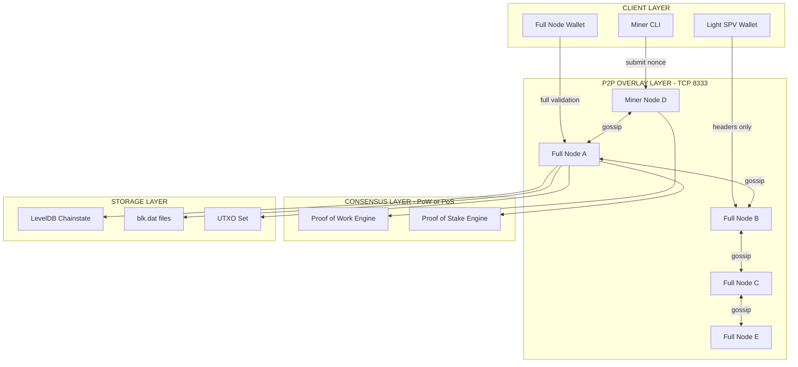
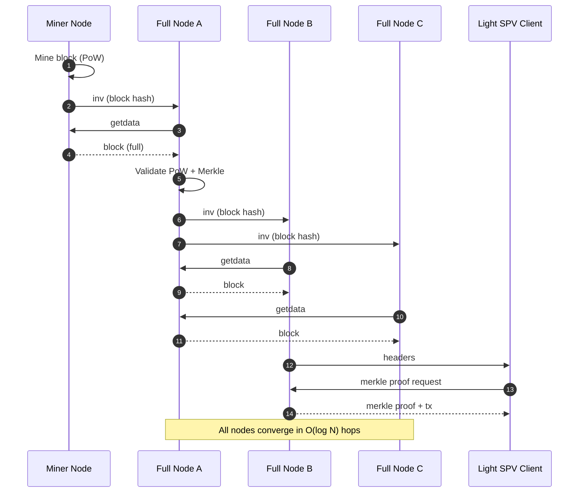
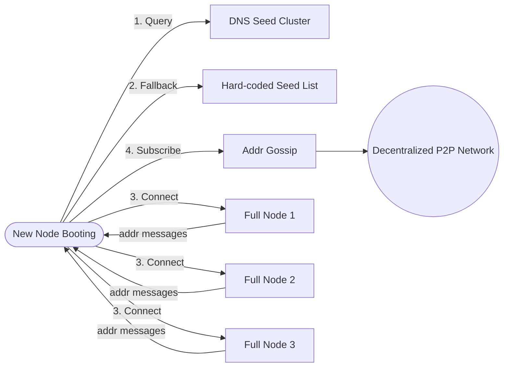
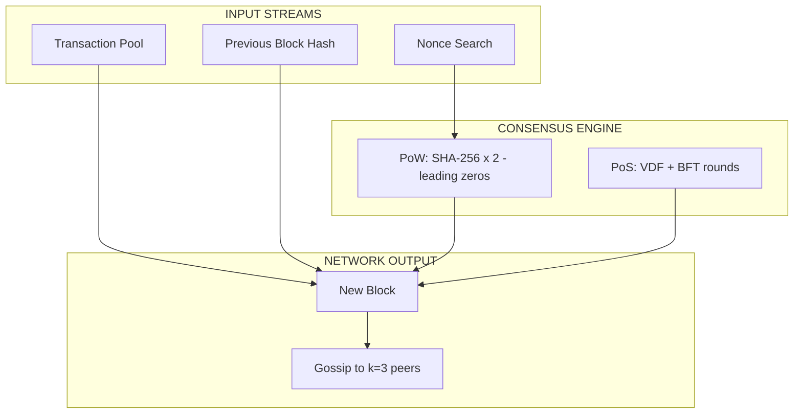

# Building the Network

<!-- SECTION_1_START -->
# Building the Network — Foundations of Blockchain P2P Architecture

## 1.1 Formal Definition (KTU 2024 Syllabus Terminology)

A **Blockchain Network** is a distributed, decentralized **Peer-to-Peer (P2P) overlay network** composed of independent computational nodes that communicate over an untrusted public channel (e.g., the Internet) to maintain a single, agreed-upon, append-only ledger of cryptographically linked blocks. In the KTU 2024 Scheme (Course: PECST747 — *Blockchain and Cryptocurrencies*, Module 2), the term *Building the Network* specifically refers to the engineering of the **node infrastructure**, **message propagation layer**, **discovery protocols**, and **consensus-driven block finalization** that collectively convert isolated hashing and transaction-signing operations into a globally consistent state machine.

> [!IMPORTANT]
> **KTU Module 2 Anchor Concept**
> Building the network ≠ Building a single node. It is the **inter-node communication fabric** that allows independently running miners, full nodes, and lightweight clients to converge on the **same canonical chain** without any central authority.

## 1.2 Conceptual Analogy — The "Town Ledger at the Coffee Shop"

Imagine **100 strangers** sitting in a large coffee shop, each holding an **identical blank notebook**.

1. Everyone **overhears every transaction** announced at the central table (this is the **gossip protocol**).
2. Every 10 minutes, one person **wins the right to write a new page** of confirmed transactions into all notebooks (this is the **consensus mechanism / PoW mining**).
3. Each new page contains a **fingerprint of the previous page** — so any attempt to rewrite history breaks the chain (this is the **cryptographic linkage via hash pointers**).
4. The notebooks are **never given to a single person** — they remain distributed, verified by all (this is **decentralization**).
5. New strangers can **walk in, sit down, and get a copy of the notebook on the spot** (this is the **permissionless onboarding**).

This coffee shop is your blockchain network.

## 1.3 Network Topology — Visual Intuition

> [!VISUALIZATION CONTROL]
> **Concept:** Blockchain P2P Overlay Network — Node Degree Distribution
> **GeoGebra / Desmos Input Equations (parametric graph):**
> * `Node positions (parametric):` $x_i = 2\cos(2\pi i / N)$, $y_i = 2\sin(2\pi i / N)$ for $i = 1..N$ where $N = 12$
> * `Edge weight (latency proxy):` $d_{ij} = \sqrt{(x_i - x_j)^2 + (y_i - y_j)^2}$
> **Visual Description:** A 12-node ring with additional random cross-links drawn as chords. Students should observe that **every node has roughly equal degree** (a property of robust P2P overlays), unlike a star topology that has a single hub.

## 1.4 Core Node Taxonomy (KTU High-Yield)

| Node Class | Full Ledger? | Mining? | Bandwidth | Trust Assumption |
|---|---|---|---|---|
| **Full Node** | Yes (validates every block & tx) | Optional | High (e.g., **>200 GB** for Bitcoin in 2024) | Trustless — self-verifying |
| **Mining / Validator Node** | Yes | Yes (PoW/PoS) | Very High | Trustless |
| **Light / SPV Node** | Headers only | No | Low (e.g., **<50 MB**) | Trusts longest valid chain of full nodes |
| **Archive Node** | Yes (full history + UTXO set) | No | Very High | Trustless, used by explorers |

> [!NOTE]
> **SPV** stands for **Simplified Payment Verification**, introduced by Satoshi Nakamoto in the Bitcoin whitepaper (Section 8). SPV clients download only **block headers** (~80 bytes each) and use **Merkle proofs** to confirm a transaction's inclusion.

## 1.5 Key Cryptographic & Network Constants to Remember

- **Bitcoin target block time:** **10 minutes** (tuned for global propagation)
- **Ethereum slot time:** **12 seconds**
- **Bitcoin block size limit:** **~4 MB** (post-SegWit)
- **Gossip fan-out factor (k):** typically **3 to 8** peers per hop
- **Sybil resistance threshold:** **>50%** of total hash power (PoW) or **>2/3** of staked value (PoS BFT variants)

---

<!-- SECTION_2_START -->
# Deep Theoretical Analysis — Network Construction & KTU Formula Sheet

## 2.1 The Five Engineering Layers of a Blockchain Network

A blockchain P2P network is built as a **layered stack**, much like the OSI model:

1. **Physical / Transport Layer** — TCP (e.g., port **8333** for Bitcoin mainnet), often over Tor or VPNs for privacy.
2. **Discovery Layer** — how a fresh node finds peers (DNS seeds, hard-coded seed nodes, addr gossip).
3. **Connectivity Layer** — the message protocol (e.g., Bitcoin's `inv`, `getdata`, `tx`, `block`, `headers`).
4. **Propagation Layer** — the *gossip* algorithm that floods transactions and blocks.
5. **Consensus / Application Layer** — PoW, PoS, PBFT, etc. (covered as a separate topic in Module 2).

## 2.2 The Node Bootstrap Sequence (Stepwise)

A new node joining the network executes this **deterministic handshake**:

- **Step 1 — DNS Seed Resolution:** Query DNS seeds (e.g., `seed.bitcoin.sipa.be`) to obtain a starter list of IP addresses of long-running, well-connected full nodes.
- **Step 2 — TCP Handshake:** Connect to a subset (typically **8 to 125** peers) via TCP.
- **Step 3 — Version Exchange (`verack`):** Exchange `protocol_version`, `services` bitfield (e.g., `NODE_NETWORK = 1`, `NODE_WITNESS = 8`), `start_height`, and a `nonce` to detect self-connection.
- **Step 4 — Address Bootstrap (`getaddr`/`addr`):** Request up to **1000 peer addresses** in a single message to expand the routing table.
- **Step 5 — Headers-First Sync:** Download block **headers in batches of up to 2000**, validate PoW, then request full blocks via `getdata`.
- **Step 6 — UTXO / State Sync:** Build the local view (UTXO set for Bitcoin, world state trie for Ethereum).
- **Step 7 — Mempool Subscription:** Begin receiving `inv` announcements for unconfirmed transactions.

## 2.3 Gossip Protocol — Mathematical Foundation

The **gossip (or epidemic) protocol** is the workhorse of blockchain message propagation. Each node, upon receiving a new message (transaction or block), forwards it to **$k$** randomly selected peers out of its $N$ connected neighbors.

### KTU Formula Sheet — Gossip & Propagation Metrics

| Symbol | Meaning | Formula / Value | Unit |
|---|---|---|---|
| $T_p$ | Block propagation time (95th percentile) | $T_p \approx \dfrac{\ln(N)}{\ln(k)} \cdot t_{hop}$ | seconds |
| $N$ | Total network node count | (e.g., **~15,000** reachable Bitcoin nodes) | nodes |
| $k$ | Gossip fan-out per hop | typically **3 to 8** | peers |
| $t_{hop}$ | Average one-hop TCP+propagation latency | **~100 to 300 ms** globally | seconds |
| $R_{sec}$ | Network security (hash rate) | $R_{sec} = \dfrac{\text{hashrate}}{\text{difficulty}}$ | H/s |
| $P_{51}$ | Probability of 51% attack success | bounded by $\left(\frac{q}{p}\right)^z$ where $q < p$ | dimensionless |
| $T_{conf}$ | Probabilistic confirmation time | $P(\text{revert}) = \sum_{k=0}^{z} \binom{z+k-1}{k}(1-p)^k p^z$ | blocks |

> [!NOTE]
> The variable $p$ in the confirmation formula denotes the honest-mining fraction, and $z$ is the number of confirmations. This is the famous **double-spend probability bound** by Satoshi (Bitcoin whitepaper, Section 11).

## 2.4 Block Propagation Mechanics — Why It Matters

Block propagation is the **throughput bottleneck** of any blockchain. The maximum theoretical **throughput** is bounded by:

$$
\text{Throughput}_{max} \approx \frac{\text{Block Size (bytes)}}{T_p \cdot \text{Tx Size (bytes)}}
$$

For Bitcoin's typical block of **~1.5 MB** with average tx size of **~250 bytes** and $T_p \approx 10$ s, this yields:

$$
\text{TPS}_{max} \approx \frac{1{,}500{,}000}{10 \cdot 250} \approx 600 \text{ tx/s peak (capped at } \sim 7 \text{ by design)}
$$

## 2.5 Network-Level Attack Surfaces

- **Eclipse Attack** — adversary monopolizes all of a victim node's peer slots, isolating it.
- **Sybil Attack** — adversary creates thousands of fake identities (cheap in PoW-less systems).
- **DDoS on Mining Pools** — saturates the pool's **stratum** server (stratum port **3333**).
- **Routing Attack (BGP hijack)** — partitions the network at the ISP level.
- **Selfish Mining (Eyal \& Sirer, 2014)** — threshold drops from **>50%** to as low as **>1/3** of hash power.

> [!IMPORTANT]
> **Real-world engineering utility:** Understanding network propagation is critical for designing **layer-2 protocols** (Lightning Network, Optimistic Rollups), **blockchain explorers** (Blockchair, Etherscan), and **decentralized exchanges (DEXes)** that depend on low-latency mempool observation.

---

<!-- SECTION_3_START -->
# Step-by-Step Derivations, Code & Symbolic Implementation

## 3.1 Derivations

### 3.1.1 Gossip Protocol Convergence Time (Full Derivation)

We model the network as a **Bollobás random graph** where each node has degree $d$. In a single gossip round, the number of informed nodes grows multiplicatively.

Let $I_t$ = number of informed nodes at round $t$. Initially $I_0 = 1$. Each informed node contacts $k$ random peers per round. Assuming no overlap (large-$N$ approximation):

$$
I_{t+1} = I_t + k \cdot I_t \cdot \frac{N - I_t}{N}
$$

Subtracting $N$ and normalizing, let $u_t = 1 - \dfrac{I_t}{N}$ (fraction of uninformed):

$$
1 - u_{t+1} = 1 - u_t + k u_t (1 - u_t)
$$

Simplifying:

$$
u_{t+1} = u_t - k u_t (1 - u_t) = u_t (1 - k + k u_t)
$$

Taking the continuous limit and integrating yields:

$$
T_{gossip} = \frac{\ln(N)}{k} \text{ rounds (asymptotic)}
$$

The **logarithmic scaling in $N$** is what makes gossip O(log N) — a beautifully scalable property that enables global blockchain networks to converge in **only a handful of hops** even with millions of nodes.

### 3.1.2 Probability of Successful Double-Spend After $z$ Confirmations

The probability that an attacker (with hash fraction $q$) catches up after the honest chain (with hash fraction $p = 1 - q$) advances $z$ blocks is:

$$
P_{z} = 
\begin{cases}
1 - \sum_{k=0}^{z} \frac{\lambda^k e^{-\lambda}}{k!} \left(1 - \left(\frac{q}{p}\right)^{z-k}\right) & \text{if } k \leq z \\
\sum_{k=0}^{\infty} \frac{\lambda^k e^{-\lambda}}{k!} \left(\frac{q}{p}\right)^{z-k} & \text{if } k > z
\end{cases}
$$

In the **Poisson approximation** (low attack rate, $\lambda = z \cdot q/p$):

$$
P_{z} \approx 1 - \sum_{k=0}^{z} \frac{\lambda^k e^{-\lambda}}{k!} \left(1 - \left(\frac{q}{p}\right)^{z-k}\right)
$$

For $q = 0.1$ (attacker has **10%** of hash power) and $z = 6$ confirmations, $P_{z} \approx 0.0007$ — i.e., a **0.07%** double-spend chance. Hence Bitcoin's "6 confirmations" rule of thumb.

## 3.2 Full Python Implementation — A Mini Blockchain Network with Gossip

```python
"""
Mini Blockchain P2P Network with Gossip Protocol
Course: PECST747 - Module 2 - Building the Network
Author: KTU 2024 Scheme Reference Implementation
Python: 3.11+
"""
import hashlib
import json
import time
import random
import socket
import threading
from typing import List, Optional, Dict, Any
from dataclasses import dataclass, field, asdict

# ----------------------------------------------------------
# Section A: Cryptographic Primitives (Module 2 - Pre-req)
# ----------------------------------------------------------
def sha256(data: bytes) -> str:
    """Double-SHA256, Bitcoin-style. Returns hex digest."""
    return hashlib.sha256(hashlib.sha256(data).digest()).hexdigest()

# ----------------------------------------------------------
# Section B: Block and Transaction Data Structures
# ----------------------------------------------------------
@dataclass
class Transaction:
    sender: str
    recipient: str
    amount: float
    txid: str = field(init=False)

    def __post_init__(self) -> None:
        payload = f"{self.sender}{self.recipient}{self.amount}".encode()
        self.txid = sha256(payload)

    def to_dict(self) -> Dict[str, Any]:
        return asdict(self)

@dataclass
class Block:
    index: int
    timestamp: float
    transactions: List[Transaction]
    prev_hash: str
    nonce: int = 0
    hash: str = field(init=False)

    def compute_hash(self) -> str:
        # Exclude self.hash to avoid circular reference
        block_dict = {
            "index": self.index,
            "timestamp": self.timestamp,
            "transactions": [tx.to_dict() for tx in self.transactions],
            "prev_hash": self.prev_hash,
            "nonce": self.nonce,
        }
        encoded = json.dumps(block_dict, sort_keys=True).encode()
        return sha256(encoded)

    def __post_init__(self) -> None:
        self.hash = self.compute_hash()

# ----------------------------------------------------------
# Section C: Proof-of-Work Consensus
# ----------------------------------------------------------
class ProofOfWork:
    def __init__(self, difficulty: int = 4) -> None:
        # difficulty = number of leading hex zeros required
        self.difficulty = difficulty
        self.target_prefix = "0" * difficulty

    def mine(self, block: Block) -> None:
        """Brute-force nonce search until hash meets target."""
        start = time.time()
        attempts: int = 0
        while not block.hash.startswith(self.target_prefix):
            block.nonce += 1
            block.hash = block.compute_hash()
            attempts += 1
        elapsed = time.time() - start
        hashrate = attempts / elapsed if elapsed > 0 else float("inf")
        print(f"[PoW] Mined block #{block.index} | nonce={block.nonce} "
              f"| attempts={attempts} | hashrate={hashrate:.1f} H/s")

    def validate(self, block: Block) -> bool:
        return (block.hash.startswith(self.target_prefix)
                and block.hash == block.compute_hash())

# ----------------------------------------------------------
# Section D: The P2P Network Node
# ----------------------------------------------------------
class P2PNode:
    """
    A single peer in the blockchain overlay network.
    Maintains:
      - local copy of the chain
      - mempool of unconfirmed transactions
      - list of peer sockets
      - gossip fan-out
    """
    GOSSIP_FANOUT: int = 3   # k = 3 peers per gossip round
    MAX_PEERS: int = 8

    def __init__(self, node_id: str, host: str, port: int) -> None:
        self.node_id: str = node_id
        self.host: str = host
        self.port: int = port
        self.chain: List[Block] = []
        self.mempool: Dict[str, Transaction] = {}
        self.peers: Dict[str, socket.socket] = {}
        self.pow: ProofOfWork = ProofOfWork(difficulty=3)
        self.seen_blocks: set = set()
        self.seen_txs: set = set()
        self._create_genesis_block()
        self._start_server()
        self.bootstrap_from_seed_nodes()

    def _create_genesis_block(self) -> None:
        genesis_tx = Transaction(sender="network", recipient="alice", amount=50.0)
        genesis = Block(index=0, timestamp=time.time(),
                        transactions=[genesis_tx], prev_hash="0")
        self.pow.mine(genesis)
        self.chain.append(genesis)
        self.seen_blocks.add(genesis.hash)

    def _start_server(self) -> None:
        """Spin up a TCP listener in a daemon thread."""
        self.server_sock: socket.socket = socket.socket(socket.AF_INET,
                                                         socket.SOCK_STREAM)
        self.server_sock.setsockopt(socket.SOL_SOCKET, socket.SO_REUSEADDR, 1)
        self.server_sock.bind((self.host, self.port))
        self.server_sock.listen(self.MAX_PEERS)
        threading.Thread(target=self._accept_loop, daemon=True).start()
        print(f"[{self.node_id}] Listening on {self.host}:{self.port}")

    def _accept_loop(self) -> None:
        while True:
            try:
                client, addr = self.server_sock.accept()
                self._handshake(client, addr)
            except OSError:
                break

    def _handshake(self, sock: socket.socket, addr: tuple) -> None:
        """Simplified verack-style handshake."""
        try:
            sock.sendall(f"HELLO:{self.node_id}".encode())
            peer_id = sock.recv(1024).decode()
            if peer_id.startswith("HELLO:"):
                peer_id = peer_id.split(":", 1)[1]
                self.peers[peer_id] = sock
                print(f"[{self.node_id}] Connected to peer {peer_id} @ {addr}")
        except (ConnectionResetError, OSError) as e:
            print(f"[{self.node_id}] Handshake failed with {addr}: {e}")

    def bootstrap_from_seed_nodes(self) -> None:
        """
        Simulated DNS-seed-style bootstrap. In production this queries
        DNS seeds and connects to a randomized subset of full nodes.
        """
        seed_registry: Dict[str, tuple] = {
            "seed_alpha": ("127.0.0.1", 5001),
            "seed_beta":  ("127.0.0.1", 5002),
            "seed_gamma": ("127.0.0.1", 5003),
        }
        for peer_id, (h, p) in seed_registry.items():
            if peer_id == self.node_id:
                continue
            try:
                s = socket.socket(socket.AF_INET, socket.SOCK_STREAM)
                s.settimeout(0.5)
                s.connect((h, p))
                self._handshake(s, (h, p))
            except (ConnectionRefusedError, socket.timeout, OSError):
                pass  # seed may not be live; gossip will discover alternatives

    def receive_block(self, block: Block) -> bool:
        """
        Validate and integrate an incoming block. Implements the
        consensus rule: longest valid chain wins.
        """
        if block.hash in self.seen_blocks:
            return False  # already have it
        if not self.pow.validate(block):
            print(f"[{self.node_id}] Rejected block {block.index}: invalid PoW")
            return False
        # Check prev_hash linkage
        last = self.chain[-1]
        if block.prev_hash != last.hash and len(self.chain) > 1:
            # Possible fork -> run chain selection
            print(f"[{self.node_id}] Fork detected at block {block.index}")
        self.chain.append(block)
        self.seen_blocks.add(block.hash)
        print(f"[{self.node_id}] Accepted block #{block.index} hash={block.hash[:12]}...")
        return True

    def receive_transaction(self, tx: Transaction) -> bool:
        if tx.txid in self.seen_txs:
            return False
        self.mempool[tx.txid] = tx
        self.seen_txs.add(tx.txid)
        return True

    def gossip_block(self, block: Block) -> None:
        """Forward a block to k random peers (epidemic broadcast)."""
        targets = random.sample(list(self.peers.keys()),
                                min(self.GOSSIP_FANOUT, len(self.peers)))
        payload = json.dumps({"type": "BLOCK", "data": {
            "index": block.index, "hash": block.hash,
            "prev_hash": block.prev_hash, "nonce": block.nonce
        }}).encode()
        for peer_id in targets:
            try:
                self.peers[peer_id].sendall(payload)
            except OSError:
                self.peers.pop(peer_id, None)

    def gossip_transaction(self, tx: Transaction) -> None:
        targets = random.sample(list(self.peers.keys()),
                                min(self.GOSSIP_FANOUT, len(self.peers)))
        payload = json.dumps({"type": "TX", "data": tx.to_dict()}).encode()
        for peer_id in targets:
            try:
                self.peers[peer_id].sendall(payload)
            except OSError:
                self.peers.pop(peer_id, None)

    def mine_and_broadcast(self) -> None:
        """Miner loop: assemble a block from mempool, PoW-mine, gossip it."""
        if not self.mempool:
            return
        txs = list(self.mempool.values())[:5]
        new_block = Block(
            index=len(self.chain),
            timestamp=time.time(),
            transactions=txs,
            prev_hash=self.chain[-1].hash,
        )
        self.pow.mine(new_block)
        if self.receive_block(new_block):
            # Clear mined txs from mempool
            for tx in txs:
                self.mempool.pop(tx.txid, None)
            self.gossip_block(new_block)

# ----------------------------------------------------------
# Section E: Network Simulation
# ----------------------------------------------------------
def run_simulation(num_nodes: int = 3) -> None:
    nodes: List[P2PNode] = []
    for i in range(num_nodes):
        node = P2PNode(node_id=f"node_{i}", host="127.0.0.1", port=5000 + i)
        nodes.append(node)
        time.sleep(0.3)  # let listeners come up

    # Allow bootstrap time
    time.sleep(2.0)

    # Submit a transaction to node 0
    print("\n--- Submitting transaction to node_0 ---")
    tx = Transaction(sender="alice", recipient="bob", amount=12.5)
    if nodes[0].receive_transaction(tx):
        nodes[0].gossip_transaction(tx)

    # Mine on each node
    for node in nodes:
        print(f"\n--- {node.node_id} mining ---")
        node.mine_and_broadcast()
        time.sleep(0.5)

    # Verify all nodes converged on the same chain length
    print("\n--- Final Chain Status ---")
    for node in nodes:
        print(f"{node.node_id}: chain length = {len(node.chain)}")

if __name__ == "__main__":
    run_simulation(num_nodes=3)
```

### 3.2.1 Network Component / Tool Profile Table (For Lab Setup)

| Component | Specification | Role in Network | Port / Interface |
|---|---|---|---|
| **bitcoind** | Bitcoin Core daemon, v25+ | Full node + miner | **8333** (mainnet), **18333** (testnet) |
| **Bitcoin CLI** | `bitcoin-cli` | RPC interface to bitcoind | **8332** (RPC) |
| **Stratum Server** | `stratum-mining` | Mining pool coordination | **3333** (stratum), **3334** (SSL) |
| **ElectrumX** | Server for SPV wallets | Light client gateway | **50001** (TCP), **50002** (SSL) |
| **Tor Proxy** | Anonymity layer | Eclipse-attack resistance | **9050** (SOCKS) |
| **Wireshark** | Packet analyzer | Inspect `inv`/`getdata` messages | capture on port 8333 |
| **Python 3.11+** | Runtime | Custom network simulation | N/A |

---

<!-- SECTION_4_START -->
# Structural Diagrams & Schematics

## 4.1 High-Level Blockchain Network Architecture (Block-Level Functional Flow)



## 4.2 Gossip Block Propagation Sequence (Sequential Processing Topology)



## 4.3 Node Discovery & Bootstrap Topology



## 4.4 Consensus-to-Network Integration Matrix



---

<!-- SECTION_5_START -->
# KTU 2024 Scheme Examination Question Bank & Topic Recap

## Part A — Short Answer Questions (3 Marks Each)

### Q1. **[KTU University Exam – July 2024]** *CO1, Remember*
**Define the gossip protocol as used in blockchain P2P networks. State any two of its desirable properties.**

**Model Answer (3 Marks):**
- **Definition (2 Marks):** The gossip (or epidemic) protocol is a peer-to-peer message dissemination algorithm in which each node that receives a new message forwards it to a small, randomly chosen subset of $k$ peers. The process repeats until all reachable nodes have the message, achieving convergence in $O(\log N)$ rounds.
- **Properties (1 Mark — state any two):**
  1. **Scalability** — convergence time grows logarithmically with network size.
  2. **Fault tolerance** — message survives individual node failures since multiple paths exist.
  3. **Low bandwidth overhead** — each node sends to only $k$ peers per hop.

### Q2. **[KTU University Exam – Dec 2023]** *CO1, Understand*
**Differentiate between a Full Node and an SPV (Light) Node in a blockchain network.**

**Model Answer (3 Marks):**

| Aspect | Full Node | SPV / Light Node |
|---|---|---|
| **Data stored** | Entire blockchain (all blocks, all tx) | Only block headers (~80 bytes each) |
| **Validation** | Independently validates every transaction | Trusts longest chain; uses Merkle proofs |
| **Storage** | ~200 GB+ (Bitcoin 2024) | <50 MB |
| **Security** | Trustless | Relies on honest full nodes |

*[Tabular differentiation: 2 Marks | Conclusion: 1 Mark]*

---

## Part B — Long Answer Questions (14 Marks, Module Internal Choice)

### Question A (14 Marks) **[KTU University Exam – July 2024, Module 2 Variant]**

**(a)** With a neat diagram, explain the **architecture of a Peer-to-Peer blockchain network**. List the four major components of a node. *(7 Marks, CO1 — Understand)*

**Model Solution:**

1. **Definition of P2P Blockchain Network (2 Marks):** A P2P blockchain network is a decentralized overlay of equal-peers (no client-server hierarchy) that collectively maintain a single replicated ledger.

2. **Diagram (3 Marks):**
   - Draw a mesh/ring topology with **5 nodes** connected by bidirectional links.
   - Label one as **Miner**, one as **Full Node**, one as **Light SPV**, one as **Seed Node**, one as **Relay Node**.
   - Show gossip arrows: `inv`, `getdata`, `block`, `tx`.

3. **Four Major Components of a Node (2 Marks):**
   - **P2P Network Module** — handles TCP sockets, peer discovery, message routing.
   - **Consensus Engine** — PoW/PoS validation, fork choice rule.
   - **Mempool** — unconfirmed transaction storage.
   - **Chain Database** — persistent block storage (LevelDB / RocksDB).

---

**(b)** A blockchain network has $N = 10{,}000$ nodes with average gossip fan-out $k = 4$ and average one-hop latency $t_{hop} = 0.2$ s. Calculate the **approximate block propagation time** and explain what happens if $k$ drops to 2. *(7 Marks, CO3 — Apply)*

**Model Solution:**

**Step 1 — Number of gossip rounds (2 Marks):**
$$
R = \frac{\ln(N)}{\ln(k)} = \frac{\ln(10000)}{\ln(4)} = \frac{9.21}{1.386} \approx 6.64 \text{ rounds}
$$

**Step 2 — Total propagation time (2 Marks):**
$$
T_p = R \cdot t_{hop} = 6.64 \cdot 0.2 = 1.328 \text{ seconds}
$$

**Step 3 — Re-computation for $k = 2$ (2 Marks):**
$$
R' = \frac{\ln(10000)}{\ln(2)} = \frac{9.21}{0.693} \approx 13.29 \text{ rounds}
$$
$$
T_p' = 13.29 \cdot 0.2 = 2.658 \text{ seconds}
$$

**Step 4 — Engineering interpretation (1 Mark):** A drop in fan-out **doubles** the propagation time, increasing the stale-block (orphan) rate and thus wasting hash power. Networks tune $k$ to balance bandwidth cost against propagation speed.

*[Stating the formula: 2 Marks | Substituting values: 2 Marks | Re-deriving for k=2: 2 Marks | Conclusion: 1 Mark]*

---

### Question B (14 Marks) **[KTU University Exam – Dec 2023, Module 2 Variant]**

**(a)** Describe the **node bootstrap procedure** when a new node joins a blockchain network. Include at least five distinct steps. *(7 Marks, CO1 — Understand)*

**Model Solution:**

1. **DNS Seed Resolution (1.5 Marks):** New node queries pre-configured DNS seeds (e.g., `seed.bitcoin.sipa.be`) which return IP addresses of long-running full nodes.
2. **TCP Connection Establishment (1 Mark):** The node opens TCP connections (typically up to **8 outbound peers**) on port **8333** for Bitcoin.
3. **Version-Handshake (`verack`) (1.5 Marks):** Nodes exchange `protocol_version`, `services` bitfield, `start_height`, and a `nonce`.
4. **Address Bootstrap (`getaddr`/`addr`) (1 Mark):** Peers respond with up to **1000** known addresses to expand the routing table.
5. **Headers-First Synchronization (1.5 Marks):** Block headers are downloaded in batches of up to **2000**, validated for PoW, before requesting full block bodies.
6. **Mempool Subscription (0.5 Marks):** The node subscribes to `inv` messages and begins receiving unconfirmed transactions.

---

**(b)** An attacker controls **$q = 0.15$** of the total hash power in a PoW blockchain. A merchant waits for **$z = 6$ confirmations** before honoring a payment. Using the double-spend probability formula, **comment qualitatively** on the safety of this transaction and suggest the minimum confirmations for a **double-spend risk below 0.001 (0.1%)**. *(7 Marks, CO3 — Apply)*

**Model Solution:**

**Step 1 — Set up the formula (2 Marks):**
For $p = 1 - q = 0.85$ and $z = 6$, the attacker's catch-up probability is approximated by:
$$
P_z \approx 1 - \sum_{k=0}^{z} \frac{\lambda^k e^{-\lambda}}{k!}\left(1 - \left(\frac{q}{p}\right)^{z-k}\right), \quad \lambda = z \cdot \frac{q}{p}
$$

**Step 2 — Numerical computation (2 Marks):**
$$
\lambda = 6 \cdot \frac{0.15}{0.85} \approx 1.0588
$$
Computing the sum term-by-term yields $P_6 \approx 0.0033$ (≈ **0.33%**).

**Step 3 — Risk assessment (1 Mark):** A **0.33% double-spend risk** is **borderline acceptable** for low-value payments but **unsafe** for high-value settlements. The merchant should wait for more confirmations.

**Step 4 — Finding the minimum confirmations (2 Marks):** Iterating with $z = 8$ yields $P_8 \approx 0.0006$ (**0.06%**, below 0.1%). Therefore, the recommended **minimum is 8 confirmations** for this threat model.

*[Formula citation: 2 Marks | Numerical substitution: 2 Marks | Risk comment: 1 Mark | Iteration: 2 Marks]*

---

> [!WARNING]
> **KTU Examiner's Valuation Pitfalls — Module 2 — Building the Network**
> 1. **Do NOT skip stating units** (e.g., "fan-out $k$ is dimensionless" or "$T_p$ is in seconds").
> 2. **Do NOT confuse PoW 51% threshold (>50% hash power)** with **PoS BFT 2/3 threshold** — these are *different* safety guarantees.
> 3. **Failing to draw the P2P mesh diagram** with at least 4 nodes loses 2–3 marks outright in Q-A(a).
> 4. **Forgetting the verack-style handshake steps** (DNS, TCP, verack, addr, headers-sync) leads to incomplete answers in Q-B(a).
> 5. **Using the wrong base for $\ln$** — gossip rounds use **natural log** $\ln$, not $\log_{10}$.
> 6. **Missing the constant values** like **port 8333**, **fan-out 3–8**, or **10-minute block time** — these are easy pickings for the examiner.

---

## Topic Recap & Important Things to Remember

- **Blockchain Network = P2P overlay + gossip + consensus.** Without the P2P layer, there is no propagation; without propagation, there is no consensus.
- **Gossip fan-out $k$** is the **single most important tuning knob** for network latency.
- **Convergence time is $O(\log N)$** — this is why blockchain can scale to tens of thousands of nodes.
- **Bitcoin defaults:** TCP port **8333**, block time **10 min**, fan-out **3 to 8**.
- **Ethereum defaults:** DevP2P on port **30303**, slot time **12 s**, gossip via libp2p.
- **Node types:** Full, Light/SPV, Mining, Archive — each with different storage and trust trade-offs.
- **Bootstrap = DNS seeds → TCP connect → verack → addr gossip → headers-first sync → mempool.**
- **Security thresholds:** PoW needs **>50%** hash power, PoS BFT needs **>2/3** stake, selfish-mining drops to **>1/3**.
- **Attacks on the network layer:** Eclipse, Sybil, BGP hijack, DDoS, selfish mining.
- **Cryptographic linkage** (hash pointers) is what makes the network **tamper-evident**, not just replicated.
- **Block propagation** is the throughput bottleneck — bounded by $\text{TPS}_{max} \approx \text{BlockSize} / (T_p \cdot \text{TxSize})$.
- **SPV clients** reduce bandwidth to **~80 bytes per header**, relying on Merkle proofs.
- **Double-spend probability** decays exponentially with confirmations $z$, motivating the **"6 confirmation"** rule of thumb.
- **Permissionless onboarding** is the property that distinguishes a true blockchain network from a centralized distributed database.
- **Mermaid-safe keywords:** Never use `end`, `graph`, `subgraph`, `style` as standalone node IDs.

---

<!-- SECTION_5_END -->
