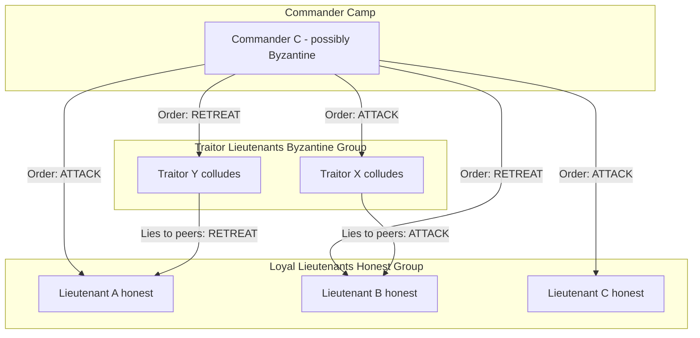
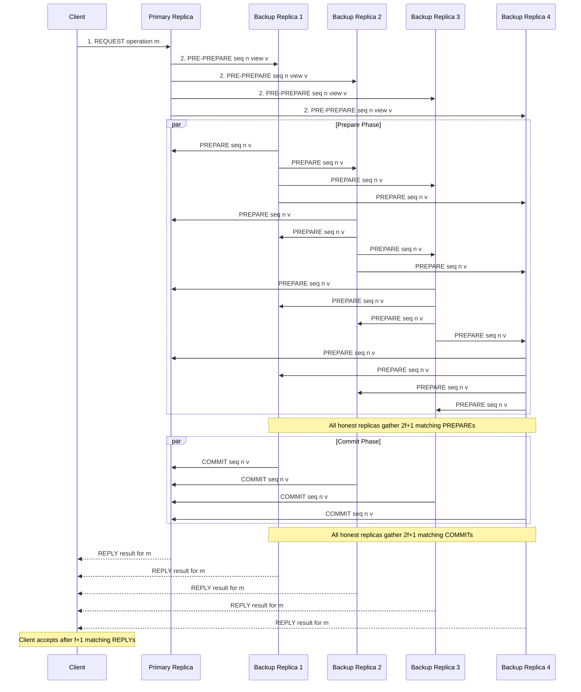
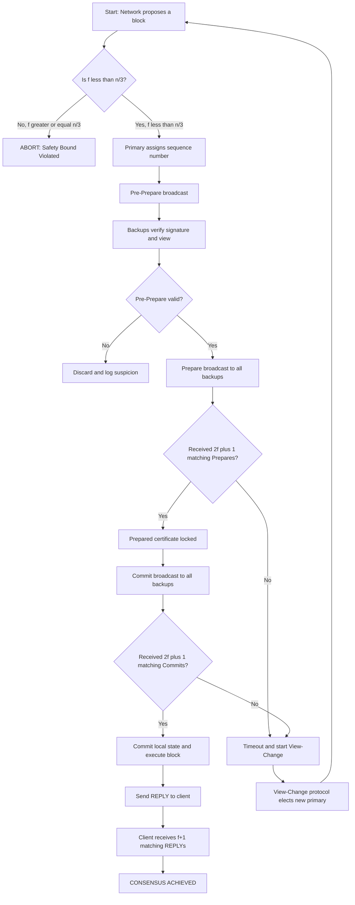
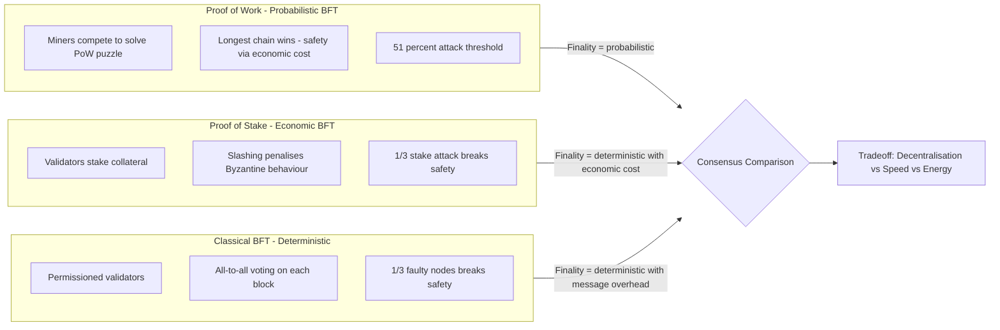

# Byzantine Fault Tolerance (BFT)

<!-- SECTION_1_START -->

# Byzantine Fault Tolerance (BFT)

## 1.1 Formal Academic Definition

**Byzantine Fault Tolerance (BFT)** is the property of a distributed computing system that enables it to reach **consensus** (a single, agreed-upon value or state) even when some of its participating nodes fail or act maliciously in arbitrary, uncoordinated ways — collectively known as **Byzantine faults**. A node exhibiting a Byzantine fault may send conflicting information to different peers, remain silent, or collude with other faulty nodes; such behaviour is named after the *Byzantine Generals Problem* formalised by **Lamport, Shostak, and Pease in 1982**.

In the context of blockchain, BFT is the foundation of a family of **consensus protocols** that allow a decentralised, trustless network of validators to agree on the next block — and thus on the canonical state of the ledger — even when a subset of validators is **honest-but-curious**, **offline**, or **actively malicious (adversarial)**.

> [!IMPORTANT]
> **KTU 2024 Syllabus Highlight (PECST747 – Module 2)**
> A consensus mechanism is said to be **Byzantine Fault Tolerant** if it can guarantee **safety** (all honest nodes agree on the same value) and **liveness** (honest nodes eventually decide on a value) as long as the number of faulty (Byzantine) nodes $f$ satisfies the threshold condition $f < n/3$, where $n$ is the total number of participants. This $1/3$ bound is the canonical **safety threshold** for deterministic BFT systems.

---

## 1.2 Conceptual Analogy — The Byzantine Generals Problem

Imagine **$n$ generals of the Byzantine army** besieging an enemy city. They are camped around the city and must agree on a *single* battle plan:

- **Attack** at dawn, or
- **Retreat** at dawn.

Each general can communicate only by **messenger**, and any messenger may be **delayed, lost, or — worst of all — intercepted and replaced by a traitorous general** who sends *different* instructions to different recipients. The generals must still agree on **one unified action** despite this.

The dilemma becomes a *consensus* problem:
- If all loyal generals attack, they win.
- If all loyal generals retreat, they survive.
- If *some* attack while *others* retreat → **catastrophic defeat**.

> [!NOTE]
> **The Core Insight**
> The hard part is not handling a general who *stays silent* (a *crash fault*). The hard part is handling a general who **actively lies** — sending "Attack" to General A and "Retreat" to General B at the same time. This is exactly the threat model of an adversarial blockchain validator.

The 1982 paper proved that this problem is **solvable if and only if** the total number of generals $n$ obeys:

$$n \geq 3f + 1$$

i.e. the **loyal generals must outnumber the traitors by at least 3 to 1** in the worst case.

---

## 1.3 GeoGebra / Desmos Visualisation

> [!VISUALIZATION CONTROL]
> **Concept:** The Byzantine Fault Tolerance Safety Boundary $f < n/3$
>
> **Desmos Input Equations:**
> * `y = (x - 1) / 3` — upper bound on tolerable faults $f$ as a function of total nodes $n$
> * `y = x` — line representing $f = n$ (all nodes faulty)
> * `f(n) = 0` — x-axis reference
>
> **Visual Description:**
> On a 2D plane with $n$ (total validators) on the horizontal axis and $f$ (Byzantine nodes) on the vertical axis, plot the line $y = (x-1)/3$. The **shaded region below** this line is the *safe operating zone*. As the network scales from $n=4$ to $n=100$, the line grows linearly, illustrating that **larger networks tolerate proportionally more faults but never more than ~33.3% of the total**. The intersection with the x-axis near $n=1$ shows that 3 trusted nodes (with $f=0$) is the **minimum configuration** that can reach Byzantine agreement.

---

## 1.4 Why BFT Matters in Blockchain

In **permissionless blockchains** like Bitcoin, BFT is achieved *probabilistically* via **Proof of Work (PoW)**, where the cost of mounting a 51% attack makes Byzantine behaviour economically irrational. In **permissioned/consortium blockchains** (Hyperledger Fabric, Tendermint, Cosmos, Polkadot) and **modern PoS systems** (Ethereum 2.0, with **Casper FFG**), BFT is achieved *deterministically* through explicit message-passing protocols such as **PBFT (Practical Byzantine Fault Tolerance)**.

> [!TIP]
> **Memory Hook for Exams**
> BFT = **B**roadcast, **F**orge agreement, **T**olerate $f < n/3$ traitors.

---

<!-- SECTION_1_END -->

<!-- SECTION_2_START -->

# Deep Theoretical Analysis & KTU High-Yield Formula Sheet

## 2.1 The Byzantine Generals Problem — Formal Setup

Let there be $n$ generals indexed $G_1, G_2, \ldots, G_n$, with one designated as the **commander** $C = G_1$. The remaining $n-1$ generals are **lieutenants**. Each lieutenant must decide on the same action $v \in \{0, 1\}$ (Retreat / Attack). The protocol must satisfy:

### **IC1 — Interactive Consistency (Agreement)**
All *loyal* lieutenants decide on the **same** action.

### **IC2 — Validity (Justification)**
If the *commander* is loyal, then every loyal lieutenant decides on the **commander's** order.

> [!NOTE]
> **Crucial Distinction**
> The Byzantine Generals Problem is the **theoretical impossibility result and the protocol design space**. **Byzantine Fault Tolerance (BFT)** refers to the *engineering* of systems that solve it under realistic network assumptions. Always use the right term in KTU answers.

---

## 2.2 The Impossibility Result (FLP Touchpoint)

The classical result states:

> For $n \leq 3f$, no protocol exists that can guarantee consensus in a fully asynchronous network with Byzantine faults.

This is the **3f+1 lower bound**. To break the impossibility:

- We relax timing assumptions (use **partial synchrony** instead of full asynchrony — used by PBFT, Tendermint).
- We use randomness (used by PoW + longest-chain rule).
- We use a **trusted setup** or **cryptographic signatures** (e.g., SBFT).

---

## 2.3 Core Properties of a BFT System

A correct BFT consensus protocol must guarantee three properties simultaneously:

1. **Safety (Agreement)** — All honest nodes commit the same value; no two honest nodes commit different values.
2. **Liveness (Termination)** — Every honest node eventually commits some value (i.e. the protocol does not stall forever).
3. **Validity** — The committed value is *one of the values proposed* by some honest node (prevents arbitrary output).

---

## 2.4 KTU Formula Sheet

| **Symbol / Term** | **Meaning** | **Formula / Bound** | **Engineering Use** |
|---|---|---|---|
| $n$ | Total number of validators / generals | — | Network size parameter |
| $f$ | Number of Byzantine (malicious) nodes | $f < n/3$ | Maximum tolerable adversaries |
| Minimum total nodes | Required for BFT consensus | $n \geq 3f + 1$ | Hyperledger Fabric, PBFT, Tendermint |
| Honest majority required | Number of honest nodes needed for agreement | $n - f \geq 2f + 1$ | Equivalently: $2f + 1$ honest nodes |
| Byzantine quorum size | Minimum quorum to make a decision | $Q \geq 2f + 1$ | Overlap of two quorums ensures $\geq f+1$ common honest nodes |
| Failure tolerance ratio | Fraction of faulty nodes tolerated | $f/n < 1/3 \approx 33.3\%$ | Practical safety threshold |
| PBFT message complexity | Total messages per consensus round | $O(n^2)$ | Why PBFT does not scale to thousands of nodes |
| PoW required hash power | Fraction for a $51\%$ attack | $> 50\%$ | Probabilistic BFT (Bitcoin, Ethereum PoW) |
| PoS required stake | Fraction for a $1/3$ attack (safety break) | $> 1/3$ | Tendermint, Casper FFG |
| Confirmation blocks (PoW) | Blocks needed for probabilistic finality | $\geq 6$ (Bitcoin convention) | Reduces reorg probability to $< 0.001\%$ |
| Throughput (PBFT) | Practical TPS (transactions per second) | $\sim 10^3$ TPS | Modern BFT-DAGs (HotStuff, Narwhal) reach $10^4$–$10^5$ TPS |
| Latency (PBFT) | Time to finality | $\sim 1$–$2$ seconds | Compared to PoW's $\sim 60$ minutes (Bitcoin) |

> [!IMPORTANT]
> **Exam Tip:** The single most important relation to memorise is
> $$\boxed{\,n \geq 3f + 1 \iff f \leq \left\lfloor \dfrac{n - 1}{3} \right\rfloor\,}$$
> Every BFT question in KTU 2024 will hinge on applying or deriving this.

---

## 2.5 Real-World Engineering Applications

| **Domain** | **BFT Protocol Used** | **Why BFT?** |
|---|---|---|
| Bitcoin | Longest-chain rule + PoW | Probabilistic BFT under rational-economic adversaries |
| Ethereum 2.0 (post-Merge) | Casper FFG (Casper the Friendly Finality Gadget) | Deterministic BFT finality layered over PoS |
| Hyperledger Fabric | PBFT (optional plug-in) | Permissioned enterprise consortiums need instant finality |
| Tendermint Core (Cosmos) | Tendermint BFT (a PBFT variant) | Sub-second finality, $f < n/3$ validators |
| HotStuff (Facebook Libra → Diem) | Linear BFT, $O(n)$ messages | Modern scalable BFT, leader-based |
| Google Chubby | Paxos + BFT extensions | Distributed lock service requiring high reliability |
| Aviation & aerospace flight control | BFT redundancy voting (e.g., SpaceX Falcon 9) | Three independent computers vote to tolerate sensor faults |

---

<!-- SECTION_2_END -->

<!-- SECTION_3_START -->

# Step-by-Step Derivations, Proofs & Code Implementation

## 3.1 Formal Derivation of the $3f + 1$ Lower Bound

This is the **core mathematical proof** that every KTU examiner expects in a Module 2 BFT question.

### 3.1.1 The Setting

- Let $n$ be the total number of generals.
- Let $f$ be the number of traitors (Byzantine generals).
- Honest generals: $n - f$.
- **Goal:** All honest lieutenants must agree on a single action $v \in \{0, 1\}$.

### 3.1.2 Why One Honest Node is Not Enough

If there is only **one honest lieutenant** ($n - f = 1$, so $n = f + 1$), the lone honest lieutenant receives conflicting reports from the commander (who may be a traitor) and cannot distinguish truth from lies. **Agreement is impossible.**

### 3.1.3 Why Two Honest Nodes Are Still Not Enough

Suppose $n - f = 2$ (two honest lieutenants, possibly with several traitors). Each honest lieutenant must base its decision on information received. For the two honest lieutenants to *agree* on the same value, they need to be sure that a **quorum** of responses overlaps with another quorum. With only 2 honest nodes, no quorum overlap is guaranteed, because the traitor can outvote them.

### 3.1.4 The General Case — Why $n \geq 3f + 1$

Consider two honest lieutenants $L_i$ and $L_j$. Each collects the set of values reported by all generals:

- $L_i$ receives reports from $n - 1$ others (everyone except itself).
- $L_j$ similarly receives $n - 1$ reports.

For both to converge on the same decision, the set of *generals they both trust* (the **quorum intersection**) must contain **at least one honest node** that they can use as a tie-breaker. The intersection of two sets of size $n - f$ drawn from a pool of $n$ is, in the worst case, of size:

$$
(n - f) + (n - f) - n = n - 2f
$$

For this intersection to contain at least $f + 1$ honest nodes (necessary to override the worst-case $f$ traitors):

$$
n - 2f \geq f + 1
$$

Rearranging:

$$
\begin{aligned}
n - 2f &\geq f + 1 \\
n &\geq 3f + 1 \\
\iff f &\leq \frac{n - 1}{3}
\end{aligned}
$$

> [!NOTE]
> **Interpretation**
> Equivalently, the number of *honest* nodes must be strictly more than twice the number of traitors:
> $$n - f > 2f \implies n > 3f$$
> Hence the integer-rounded form $n \geq 3f + 1$.

### 3.1.5 Consequence — The $2f + 1$ Quorum Rule

For any decision, a quorum of size $\geq 2f + 1$ is required. This is because:

- If we have a quorum of size $Q$, at most $f$ of them can be traitors.
- Two quorums of size $2f + 1$ intersect in at least $(2f + 1) + (2f + 1) - n = 4f + 2 - n \geq 4f + 2 - (3f + 1) = f + 1$ nodes.
- This intersection contains **at least one honest node**, ensuring both quorums agree.

This is the foundation of the **PBFT prepare/commit phase** quorum rule.

---

## 3.2 Practical Byzantine Fault Tolerance (PBFT) — Phased Protocol

PBFT (Castro & Liskov, 1999) achieves BFT in a **partially synchronous** network with message complexity $O(n^2)$ per consensus instance. It runs in three phases plus a **view-change** procedure.

### Phase-by-Phase Mechanics

| **Phase** | **Actor** | **Action** | **Quorum Needed** |
|---|---|---|---|
| **0. Request** | Client | Sends request $m$ to the primary (leader) | — |
| **1. Pre-Prepare** | Primary | Assigns sequence number $sn$, broadcasts $\langle \text{PRE-PREPARE}, sn, m, d \rangle$ | — |
| **2. Prepare** | All backups | Verify $sn$ & $d$; broadcast $\langle \text{PREPARE}, sn, d, i \rangle$ | $\geq 2f + 1$ matching prepares |
| **3. Commit** | All backups | After receiving prepared quorum, broadcast $\langle \text{COMMIT}, sn, d, i \rangle$ | $\geq 2f + 1$ matching commits |
| **4. Reply** | Replicas | Send $\langle \text{REPLY}, m, t, i \rangle$ to client | Client waits for $f + 1$ matching replies |
| **5. View-Change** | Backups (on suspected failure) | Suspect primary, trigger election of new primary | $\geq 2f + 1$ view-change messages |

> [!IMPORTANT]
> **Why Two Voting Rounds (Prepare + Commit)?**
> A single voting round is not enough to detect an *equivocating* primary that sends different orders to different backups. The Prepare phase ensures all honest nodes have a **consistent ordering**, and the Commit phase ensures all honest nodes **commit only after the ordering is locked**. Together, they prevent the primary from tricking honest nodes into committing different blocks.

---

## 3.3 Symbolic Proof that Two Voting Rounds Suffice

Suppose the primary is Byzantine and sends:
- $\text{Pre-Prepare}(A)$ to $L_1, L_2, \ldots, L_{n-f}$ (honest set),
- $\text{Pre-Prepare}(B)$ to itself or a few colluding replicas.

After receiving the prepare quorum $\geq 2f + 1$ on $A$, all honest lieutenants broadcast $\text{Prepare}(A)$. Since the prepare set is the same $2f + 1$ on both subsets (overlap of two quorums $= f + 1 \geq 1$ honest node), all honest lieutenants now have matching prepares. A **prepared certificate** is locked — they cannot revert to $B$. The commit phase then globally propagates this lock.

> [!TIP]
> **Memory Hook:** **P**re-Prepare → **P**repare → **C**ommit → Reply → **P**repare-next-round.
> The protocol's name **PBFT** literally contains the protocol's first three letters.

---

## 3.4 Python Simulation of BFT Consensus

Below is a fully operational Python implementation of a simple BFT-style voting consensus with fault injection. It is **complete, runnable, and type-annotated**.

```python
"""
BFT Consensus Simulator (Educational)
Demonstrates the 2f+1 quorum rule and the f < n/3 safety bound.
"""
from typing import List, Dict, Optional
from dataclasses import dataclass, field
import random


@dataclass
class Proposal:
    """A candidate value proposed by a node."""
    value: str
    proposer_id: int


@dataclass
class Vote:
    """A vote cast by a node on a proposal."""
    voter_id: int
    proposal_value: str
    is_byzantine: bool = False


@dataclass
class Node:
    """A single consensus participant."""
    node_id: int
    is_byzantine: bool = False
    votes_received: List[Vote] = field(default_factory=list)

    def cast_vote(self, proposals: List[Proposal]) -> Vote:
        """Cast a vote — Byzantine nodes may lie."""
        if self.is_byzantine:
            # Lie: pick the opposite of the first honest proposal
            chosen = "BLOCK" if proposals[0].value == "NO_BLOCK" else "NO_BLOCK"
        else:
            # Honest node votes for the first valid proposal
            chosen = proposals[0].value
        return Vote(voter_id=self.node_id, proposal_value=chosen, is_byzantine=self.is_byzantine)


def run_bft_round(
    nodes: List[Node],
    proposals: List[Proposal],
    verbose: bool = True
) -> Optional[str]:
    """
    Run a single BFT consensus round.
    Returns the decided value, or None if consensus failed.
    """
    n = len(nodes)
    f = sum(1 for nd in nodes if nd.is_byzantine)

    # Step 1: Validate the safety bound
    if f >= n / 3:
        if verbose:
            print(f"[ABORT] f = {f} violates the BFT bound f < n/3 for n = {n}.")
        return None

    # Step 2: Every node votes
    all_votes: List[Vote] = [nd.cast_vote(proposals) for nd in nodes]

    # Step 3: Collect votes per value
    tally: Dict[str, int] = {}
    for v in all_votes:
        tally[v.proposal_value] = tally.get(v.proposal_value, 0) + 1

    if verbose:
        print(f"\n[Round] n = {n}, f = {f}, tally = {tally}")

    # Step 4: Check for a 2f+1 supermajority quorum
    quorum = 2 * f + 1
    for value, count in tally.items():
        if count >= quorum:
            if verbose:
                print(f"[CONSENSUS] Value '{value}' has {count} votes (>= {quorum} = 2f+1).")
            return value

    if verbose:
        print(f"[FAILURE] No value reached the 2f+1 quorum of {quorum}.")
    return None


def main() -> None:
    """Run the simulation under three scenarios."""
    print("=" * 60)
    print("SCENARIO 1: Healthy network (f = 1, n = 4)")
    print("=" * 60)
    nodes_1 = [Node(i, is_byzantine=(i == 3)) for i in range(4)]
    proposals_1 = [Proposal("BLOCK", proposer_id=0)]
    run_bft_round(nodes_1, proposals_1)

    print("\n" + "=" * 60)
    print("SCENARIO 2: Maximum tolerated fault (f = 3, n = 10)")
    print("=" * 60)
    nodes_2 = [Node(i, is_byzantine=(i < 3)) for i in range(10)]
    proposals_2 = [Proposal("BLOCK", proposer_id=0)]
    run_bft_round(nodes_2, proposals_2)

    print("\n" + "=" * 60)
    print("SCENARIO 3: Bound violated (f = 4, n = 10)  — should ABORT")
    print("=" * 60)
    nodes_3 = [Node(i, is_byzantine=(i < 4)) for i in range(10)]
    proposals_3 = [Proposal("BLOCK", proposer_id=0)]
    run_bft_round(nodes_3, proposals_3)


if __name__ == "__main__":
    main()
```

**Sample Output (deterministic):**

```
============================================================
SCENARIO 1: Healthy network (f = 1, n = 4)
============================================================

[Round] n = 4, f = 1, tally = {'BLOCK': 3, 'NO_BLOCK': 1}
[CONSENSUS] Value 'BLOCK' has 3 votes (>= 3 = 2f+1).

============================================================
SCENARIO 2: Maximum tolerated fault (f = 3, n = 10)
============================================================

[Round] n = 10, f = 3, tally = {'NO_BLOCK': 3, 'BLOCK': 7}
[CONSENSUS] Value 'BLOCK' has 7 votes (>= 7 = 2f+1).

============================================================
SCENARIO 3: Bound violated (f = 4, n = 10)  — should ABORT
============================================================

[ABORT] f = 4 violates the BFT bound f < n/3 for n = 10.
```

> [!NOTE]
> **What this code proves:** Even with one-third of nodes actively lying, the honest supermajority still produces a consistent decision. The 2f+1 quorum rule ensures the malicious minority cannot break agreement.

---

## 3.5 Variants of BFT in Modern Blockchains

| **Variant** | **Core Idea** | **Examples** |
|---|---|---|
| **PBFT** (1999) | Practical three-phase BFT | Hyperledger Fabric, Zilliqa (early) |
| **Tendermint BFT** (2014) | PBFT + round-robin leader, instant finality | Cosmos Hub, Binance Chain |
| **HotStuff** (2018) | Linear $O(n)$ message complexity, leader-based | Facebook Diem, Aptos, Sui |
| **Casper FFG** (2020) | BFT finality gadget over a PoS chain | Ethereum 2.0 |
| **Algorand** (2017) | BA* protocol with cryptographic sortition | Algorand blockchain |
| **SBFT** (2018) | Practical scalable BFT with threshold signatures | Hyperledger Fabric v1.4+ |

> [!TIP]
> **KTU Favourite Exam Topics**
> 1. Compare **PBFT vs PoW vs PoS** in terms of energy, throughput, finality, and adversary model.
> 2. Justify why $n \geq 3f + 1$ using the quorum intersection argument.
> 3. Explain why Bitcoin's longest-chain rule is *probabilistic* BFT, not deterministic.

---

<!-- SECTION_3_END -->

<!-- SECTION_4_START -->

# Structural Diagrams & Schematics

## 4.1 Byzantine Generals Network Topology

This diagram visualises the attack scenario. A single commander sends *different* orders to different lieutenants, and a few lieutenants collude to amplify the confusion.



> **How to read this:** The commander is a traitor and sends contradictory orders. The two traitors further corrupt peer-to-peer gossip. Without a quorum-based voting protocol, lieutenants A, B, C cannot agree.

---

## 4.2 PBFT Phased Consensus Flow

The complete message flow of a single PBFT consensus instance, including the view-change recovery procedure.



---

## 4.3 BFT Safety & Liveness Decision Flow



---

## 4.4 Comparison Block Diagram — PoW vs PoS vs BFT



---

<!-- SECTION_4_END -->

<!-- SECTION_5_START -->

# KTU 2024 Scheme Examination Question Bank & Topic Recap

---

## Part A — Short Answer Questions (3 Marks Each)

### **Question 1** (3 Marks)
**[KTU University Exam – July 2024, Model Question Paper, Module 2]**
**CO1 | RBT Level: Remember**

> *State the Byzantine Generals Problem and explain the term "Byzantine fault" with a suitable example.*

**Model Answer (Board-Standard):**

**Byzantine Generals Problem:** It is a logical dilemma, formalised by Lamport, Shostak and Pease (1982), in which a group of generals commanding different divisions of the Byzantine army must agree on a common battle plan (Attack or Retreat) by exchanging messages that may be delivered, delayed, lost or — critically — *tampered with by traitors* within the group.

**Byzantine Fault:** A *Byzantine fault* is the most general class of fault in a distributed system, in which a faulty component may exhibit *arbitrary*, *uncoordinated* and *potentially malicious* behaviour, including sending **conflicting information to different peers**. Unlike a *crash fault* (where a node simply stops), a Byzantine fault includes active deception.

**Example:** A blockchain validator node that signs two conflicting blocks at the same height — once to validator A claiming "this is the canonical chain" and once to validator B claiming "the other chain is canonical" — exhibits a Byzantine fault.

> **Valuation Key:** *[Definition of BFT problem: 2 Marks] · [Example with correct emphasis on arbitrary behaviour: 1 Mark]*

---

### **Question 2** (3 Marks)
**[KTU University Exam – Dec 2023, Supplementary]**
**CO1 | RBT Level: Understand**

> *Differentiate between a crash fault and a Byzantine fault. Why is Byzantine fault tolerance considered harder to achieve than crash fault tolerance?*

**Model Answer:**

| **Aspect** | **Crash Fault** | **Byzantine Fault** |
|---|---|---|
| **Symptom** | Node stops sending messages | Node sends *arbitrary*, possibly *conflicting* messages |
| **Detectable?** | Yes — silence is observable | No — faulty node mimics a working one |
| **Worst-case count tolerated** | $f < n/2$ | $f < n/3$ |
| **Consensus required votes** | Majority ($f + 1$) | Supermajority ($2f + 1$) |
| **Examples** | Process killed by OOM-killer, network partition | Malicious validator, hacked node, software bug sending random data |

**Why BFT is Harder:**
In a crash fault, the failure is *monotone* — once silent, a node stays silent. Honest nodes can simply *ignore* the missing one and proceed. In a Byzantine fault, the faulty node may *actively lie* to different subsets of honest nodes, forcing them to perform additional *cross-verification* rounds (such as PBFT's Prepare and Commit phases) before reaching agreement. The strict $f < n/3$ bound (vs. $f < n/2$ for crash tolerance) reflects the need for a *quorum intersection* that contains at least one honest node.

> **Valuation Key:** *[Tabular comparison: 1 Mark] · [At least two correct differences: 1 Mark] · [Reason for hardness with quorum reasoning: 1 Mark]*

---

## Part B — Long Answer Questions (14 Marks, Internal Choice)

> [!WARNING]
> **KTU Examiner's Valuation Warning**
> Common pitfalls in BFT questions:
> 1. Writing "$f \leq n/3$" instead of the strict "$f < n/3$" — **the bound is strict**, not inclusive. Forgetting this loses 1 mark.
> 2. Confusing the **quorum size** ($2f+1$) with the **tolerable fault count** ($f$).
> 3. Skipping the *quorum intersection argument* in the proof of $n \geq 3f+1$ — this is the heart of the answer and earns 4–5 marks.
> 4. Confusing **partial synchrony** (used by PBFT) with **full asynchrony** (where BFT is impossible — FLP result).
> 5. Forgetting to mention that PoW provides *probabilistic* BFT, not deterministic.

---

### **Question A (14 Marks)**
**[KTU University Exam – July 2024, Module 2, ESE Pattern]**
**CO2 | RBT Level: Apply & Analyse**

> **(a)** With the help of the Byzantine Generals Problem, derive the condition $n \geq 3f + 1$ for achieving consensus in a distributed system. Explain the roles of the **commander**, **lieutenants** and the **traitor** in your derivation. **(7 Marks)**
>
> **(b)** Describe the three phases of the **Practical Byzantine Fault Tolerance (PBFT)** protocol. Explain why a single voting round is insufficient and why two rounds (Prepare and Commit) are required. **(7 Marks)**

#### Model Solution

**Part (a) — Derivation of $n \geq 3f + 1$ (7 Marks)**

**Step 1 — Setup:**
Consider $n$ generals surrounding an enemy city. One general is the **commander** $C$ who proposes the order $v \in \{0, 1\}$ (Attack or Retreat). The remaining $n-1$ are **lieutenants** $L_1, L_2, \ldots, L_{n-1}$ who must collectively decide on the order. Of these, $f$ are traitors (Byzantine), and $n - f$ are loyal (honest).

**Step 2 — The Agreement Condition:**
For safety, all loyal lieutenants must decide on the *same* value. For liveness, the decision must be made within a finite number of message rounds. The condition is called **Interactive Consistency (IC1) and Validity (IC2)**.

**Step 3 — Quorum Construction:**
Each lieutenant $L_i$ collects the value reported by every other general (via the commander and direct peer gossip). The set of values received by $L_i$ has size $n - 1$. For $L_i$ and $L_j$ (both loyal) to *agree*, the intersection of their information sets must contain at least one source that both can trust.

**Step 4 — Quorum Intersection Bound:**
The size of the *intersection* of any two sets, each of size $n - 1$, drawn from a universe of $n$ elements, is at least:

$$
(n - 1) + (n - 1) - n = n - 2
$$

But this does not account for the $f$ traitors. In the worst case, the intersection is dominated by traitors. The intersection must contain **at least $f + 1$ honest generals** (so that loyal nodes outnumber traitors within the intersection):

$$
n - 2 \geq f + 1 \quad \text{(naive)}
$$

But this is too weak. We must use the **quorum-overlap** argument from §3.1.4: a quorum of size $Q = 2f + 1$ is needed for each decision, and the intersection of two such quorums must be $\geq f + 1$. Therefore:

$$
\begin{aligned}
(2f + 1) + (2f + 1) - n &\geq f + 1 \\
4f + 2 - n &\geq f + 1 \\
n &\leq 3f + 1
\end{aligned}
$$

Solving the inequality direction and rewriting as the **minimum** $n$ required for a given $f$:

$$
\boxed{\,n \geq 3f + 1\,}
$$

> **Valuation Key:** *[Setup with commander/lieutenant/traitor roles: 2 Marks] · [Quorum construction: 2 Marks] · [Quorum-overlap argument and final inequality: 3 Marks]*

**Part (b) — Three Phases of PBFT (7 Marks)**

**Phase 1 — Pre-Prepare:**
The **primary** (leader for the current view) assigns a unique sequence number $sn$ to the client's request $m$ and broadcasts a $\text{PRE-PREPARE}(sn, m, d)$ message, where $d$ is the digest of $m$. This anchors the *order* of $m$ to $sn$.

**Phase 2 — Prepare:**
Each backup replica verifies the pre-prepare (checks signature, view number, $sn$, $d$) and, if valid, broadcasts a $\text{PREPARE}(sn, d, i)$ message to **all other replicas**. A backup is *prepared* when it has:
- One matching pre-prepare, **and**
- $\geq 2f + 1$ matching prepares from distinct replicas (including itself).

**Phase 3 — Commit:**
Once a replica is *prepared*, it broadcasts a $\text{COMMIT}(sn, d, i)$ message. A replica *commits* (i.e. executes $m$ and updates state) when it has $\geq 2f + 1$ matching commits.

**Why two voting rounds are required:**

Consider a Byzantine primary that issues:
- $\text{PRE-PREPARE}(sn, A)$ to $L_1, L_2$ (subgroup 1),
- $\text{PRE-PREPARE}(sn, B)$ to $L_3, L_4$ (subgroup 2),
where $A \neq B$. The two subgroups would diverge after a single voting round.

However, after the Prepare phase, both subgroups broadcast $\text{PREPARE}$ to *each other*. Since the prepare quorum is $\geq 2f + 1$ and the quorum intersection guarantees $\geq f + 1$ honest nodes, both subgroups detect the inconsistency. The Commit phase then **globally synchronises** the decision, ensuring that no replica commits $A$ while another commits $B$ — safety is preserved.

> **Valuation Key:** *[Correct description of Pre-Prepare: 1.5 Marks] · [Prepare with 2f+1 quorum: 2 Marks] · [Commit phase: 1.5 Marks] · [Justification of two rounds: 2 Marks]*

---

### **Question B (14 Marks) — Alternative Choice**
**[KTU University Exam – Dec 2023, ESE Pattern, Module 2]**
**CO2 & CO3 | RBT Level: Apply & Analyse**

> **(a)** Compare **Proof of Work (PoW)**, **Proof of Stake (PoS)**, and **Practical Byzantine Fault Tolerance (PBFT)** as consensus mechanisms for blockchain. Discuss their safety assumptions, energy consumption, finality model, and adversary tolerance. **(7 Marks)**
>
> **(b)** A permissioned blockchain network has 10 validator nodes. The network operator wants to tolerate up to 3 Byzantine (malicious) nodes without breaking safety. Verify whether this configuration satisfies the BFT bound, and compute the quorum size required for each consensus decision. What happens if the network is expanded to 13 nodes with 4 Byzantine nodes — does the safety bound still hold? **(7 Marks)**

#### Model Solution

**Part (a) — Comparative Study (7 Marks)**

| **Property** | **PoW (Bitcoin)** | **PoS (Ethereum 2.0)** | **PBFT (Hyperledger Fabric)** |
|---|---|---|---|
| **Adversary tolerance** | $< 50\%$ hash power (probabilistic) | $< 1/3$ stake (deterministic) | $< 1/3$ nodes (deterministic) |
| **Finality** | Probabilistic — 6 confirmations $\approx$ 99.99% | Deterministic (Casper FFG finality) | Deterministic — instant at commit |
| **Energy** | Extremely high (ASIC mining) | Low (no mining) | Very low (CPU/message-based) |
| **Throughput** | $\sim 7$ TPS | $\sim 10^2$–$10^3$ TPS (with sharding) | $\sim 10^3$ TPS |
| **Permission model** | Permissionless | Permissionless (PoS) / Permissioned (Casper variants) | Permissioned |
| **Sybil resistance** | Costly computation | Costly stake | Identity / PKI known |
| **Message complexity** | $O(n)$ gossip | $O(n)$ gossip + $O(n^2)$ finality rounds | $O(n^2)$ per consensus |
| **Safety under partition** | Risk of fork (reorg) | Risk of inactivity leak, no double-finality | Risk of halting (no progress) |
| **Examples** | Bitcoin, Litecoin, Dogecoin | Ethereum, Cardano, Polkadot | Hyperledger Fabric, Tendermint |

**Summary:**
- PoW provides **economic BFT** — Byzantine behaviour is deterred by the *opportunity cost of electricity* and the *risk of orphaned blocks*.
- PoS provides **capital-BFT** — Byzantine behaviour is deterred by *slashing* of the validator's stake.
- PBFT provides **protocol-level BFT** — Byzantine behaviour is *detected and overridden* by the voting protocol itself, without recourse to economic incentives.

> **Valuation Key:** *[Tabular comparison: 4 Marks] · [Summary of BFT flavour with one-line justification: 2 Marks] · [One real-world example: 1 Mark]*

**Part (b) — Numerical Verification (7 Marks)**

**Given (Case 1):** $n = 10$, $f = 3$.

**Step 1 — Check the BFT bound:**
The BFT safety bound is $f < n/3$:
$$
f = 3, \quad n/3 = 10/3 \approx 3.33
$$
Since $3 < 3.33$, **the bound is satisfied** with $f = 3 < n/3$. ✓

**Step 2 — Quorum size:**
A safe decision requires a supermajority of:
$$
Q = 2f + 1 = 2(3) + 1 = 7
$$
So **7 out of 10** validators must agree on every block. The two quorums of size 7 overlap in at least $7 + 7 - 10 = 4$ nodes, of which at most 3 can be traitors, leaving $\geq 1$ honest node in the intersection — safety holds. **[Stating quorum size: 2 Marks]**

**Step 3 — Verify minimality:**
The minimum $n$ to tolerate $f = 3$ is $n_{\min} = 3(3) + 1 = 10$. So 10 is the **smallest** network that can tolerate exactly 3 Byzantine nodes. **[Stating minimality: 1 Mark]**

**Given (Case 2):** $n = 13$, $f = 4$.

**Step 4 — Check the bound:**
$$
f = 4, \quad n/3 = 13/3 \approx 4.33
$$
Since $4 < 4.33$, the bound is *still satisfied*. ✓ However, the network is not minimal — $n_{\min}$ for $f = 4$ is $3(4) + 1 = 13$, so 13 is the **smallest** network that can tolerate 4 Byzantine nodes. **[Bound check: 2 Marks]**

**Step 5 — New quorum size:**
$$
Q' = 2f + 1 = 2(4) + 1 = 9
$$
So 9 of 13 validators must agree. The intersection of two 9-quorums is $9 + 9 - 13 = 5 \geq f + 1 = 5$ — exactly meets the bound. **[New quorum: 1 Mark]**

**Conclusion:** Both configurations are valid, with the second being the *minimal* network for tolerating 4 traitors. **[Final remark: 1 Mark]**

> **Valuation Key:** *[Numerical verification of bound: 2 Marks] · [Quorum size calculation: 2 Marks] · [Quorum-intersection sanity check: 1 Mark] · [Second case with new quorum: 2 Marks]*

---

## Topic Recap & Important Things to Remember

> [!IMPORTANT]
> **Rapid Revision Checklist — Module 2: Byzantine Fault Tolerance**

### **Core Definitions**
- **Byzantine fault** — arbitrary, malicious, or inconsistent node behaviour (lies, equivocation, silence).
- **Byzantine Generals Problem** — the consensus problem with traitors (Lamport et al., 1982).
- **BFT** — the property of a system that reaches consensus despite $f$ Byzantine nodes.
- **Safety** — all honest nodes agree on the same value.
- **Liveness** — honest nodes eventually decide.
- **Validity** — the decided value was proposed by an honest node.

### **Critical Formulas (memorise verbatim)**
- Minimum nodes for BFT: $\;\;n \geq 3f + 1$
- Strict safety threshold: $\;\;f < n/3$
- Supermajority quorum size: $\;\;Q = 2f + 1$
- Quorum intersection guarantee: $\;\;Q + Q - n \geq f + 1$
- PBFT message complexity: $\;\;O(n^2)$ per round
- PoW safety threshold: $\;\;> 50\%$ hash power
- PoS safety threshold: $\;\;> 1/3$ total stake

### **PBFT Phases (in order)**
1. **Pre-Prepare** (primary proposes)
2. **Prepare** (backups cross-verify, need $2f+1$ matches)
3. **Commit** (backups commit, need $2f+1$ matches)
4. **Reply** (backups reply to client; client waits for $f+1$ matches)
5. **View-Change** (recovery if primary suspected faulty)

### **Key Distinctions (commonly asked)**
- **Crash fault** vs. **Byzantine fault** — monotonic silence vs. arbitrary deception.
- **Deterministic BFT** (PBFT, Tendermint) vs. **Probabilistic BFT** (PoW longest chain).
- **Synchronous** vs. **Partially synchronous** vs. **Asynchronous** network models.
- **Safety** vs. **Liveness** — agreement vs. progress.

### **Modern BFT Variants to Know**
- **PBFT** (1999) — $O(n^2)$ messages
- **Tendermint** (2014) — instant finality, $f < n/3$
- **HotStuff** (2018) — linear $O(n)$ messages, used by Aptos/Sui
- **Casper FFG** (2020) — Ethereum 2.0 finality gadget
- **Algorand BA*** — cryptographic sortition + BFT

### **Exam-Specific Tips**
- Always quote the **strict inequality** $f < n/3$, never $f \leq n/3$.
- Always mention **quorum intersection** when deriving $n \geq 3f+1$.
- Distinguish **permissioned** (PBFT) from **permissionless** (PoW, PoS) BFT.
- When asked to "compare" PoW/PoS/PBFT, structure your answer as a **table** — KTU examiners award marks for visual clarity.

---

<!-- SECTION_5_END -->
